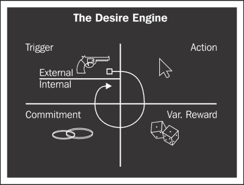
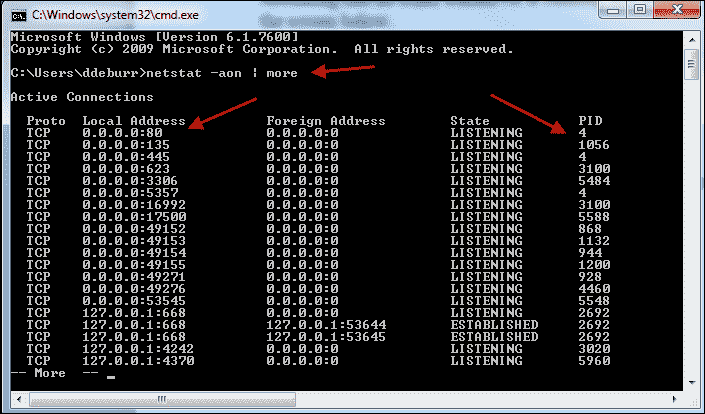
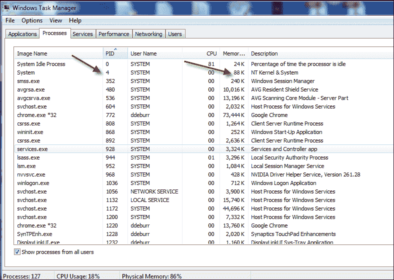

# 三、目标与目标行为

在上一章中，我们概述了游戏化设计过程，从定义业务目标和目标行为开始。

开发游戏化系统的目标是引起行为改变。在我们的用户拥有游戏化系统之前，他们的行为是特定的。在我们实施我们的系统后，我们希望他们的行为有所不同。我们希望他们的行为符合我们的业务目标。因此，在本章中，我们将更深入地了解幕后真正需要发生的事情，以便让我们的用户（玩家）采取我们需要他们采取的行动。

在上一章中，我们发现了我们希望玩家采取的 10 项行动：

*   检查他们的讨论线程数
*   回顾不同的观点部分
*   设置特定时间段的目标讨论量
*   设定要审查的不同观点的目标数量
*   观看有关如何使用讨论区的视频（或一些教学材料）
*   观看视频（或一些教学材料），了解观看其他视角的价值
*   参加讨论小组
*   阅读其他用户的讨论帖子
*   随时间参加讨论小组
*   随着时间的推移，阅读其他用户的观点

我们假设，如果参与者定期、一致地采取这 10 项行动，我们可以实现以下业务目标：

*   增加与他人讨论的参与度
*   提高对不同观点的考虑程度

我们希望，如果我们达到这两个目标，我们就能完成我们的教学任务，反过来，通过与游戏化系统的互动，帮助我们的玩家学习思维技能。

在设计我们的系统时，我们需要记住，行为实际上不仅仅是一个动作，而是我们希望玩家采取的一系列动作。我们将在本章后面更详细地描述我们的行为链（我们希望用户采取的行动）。理想情况下，我们可以在玩家中创造一个行为周期（即习惯）。然而，习惯不是偶然的；我们必须设计我们的制度来鼓励我们想成为习惯的行为。

重要的是，我们要找到最小的行为或动作，如果可能的话，将该动作附加到现有动作上。

例如，大多数人习惯于早上第一件事就是检查他们的电子邮件。这是一个好习惯还是坏习惯还存在争议，但这仍然是我们许多球员的习惯。我们希望我们的玩家阅读其他玩家的帖子作为目标行为。他们在实际采取行动时可能采取的一个小行为就是看看谁在过去 24 小时内发了帖子。我们可以将这与他们每天通过电子邮件向他们发送一个简单的仪表盘来检查电子邮件的现有习惯联系起来。当然，他们可以关闭此功能，让他们自己控制。玩家可以直接从这个仪表板上阅读帖子和回复帖子。

# 福克行为模型

这是一个我们需要问并最终回答的基本问题。斯坦福大学说服技术实验室的创始人兼主任 BJ Fogg 教授出色地描述了人们为什么会使用**Fogg 行为模型**（**FBM**）采取特定行动。它是一个工具，设计师可以使用它来理解用户为什么采取或不采取特定的行动或行为。

根据 FBM，如果你的用户没有采取设计好的行动，那是因为行为方程式中缺少了一些东西。FBM 行为方程表示*行为=动机+能力+触发*。

当有足够的动机、适当的能力和适当的触发因素时，每次都会发生一种行为。从下图可以看出这一点：


图片来源：北京·福克的行为模型（[http://www.behaviormodel.org/](http://www.behaviormodel.org/) ）

当动机和能力这两个概念趋于一致时，行为就发生了。

## 动机

真正激励一个人的东西可能不会激励另一个人，因此需要清楚地了解你的球员和激励类型。但根据福格教授的说法，动机是由三个部分组成的。激励的三个子组成部分是：

*   感觉：在从快乐到痛苦的连续统一体上测量
*   预期：以希望到恐惧的连续体来衡量
*   社会凝聚力：从接受到拒绝的连续统一体

对于每个人来说，他们采取特定行动的动机程度可以通过这三个连续性来衡量，从而衡量他们采取行动的动机。因此，我们的任务是使我们的目标行为尽可能令人愉快，激发尽可能多的希望，并使它们尽可能为社会所接受。我们必须记住，这些都是不断波动的变量，取决于个人。

## 能力

假设用户有足够的动机，他/她还必须有能力采取所需的行动。许多应用程序在涉及到他们的用户做他们期望用户做的事情的能力时非常幼稚。福克的模型表明，仅仅有动机去做某事并不足以真正做到这一点。能力也必须存在。

福克在感知简单的背景下讨论能力。如果用户认为某个操作很简单，那么他/她更能够采取所需的操作。从用户的角度来看，它越简单，它在能力连续体中的地位就越高。

福格进一步提出了这个概念，他认为简单是资源稀缺的一种功能。用户拥有的资源越多，任务就越简单。当试图确定用户感知的简单性时，需要查看的六个关键资源是：

*   **金钱**：相对于用户拥有的金钱，任务需要多少金钱
*   **时间**：相对于用户拥有的时间，任务需要多少时间
*   **体力**：相对于用户体力，任务需要多少体力
*   **大脑周期**：相对于用户当时的智力能力，用户完成任务需要多难的思考
*   **社交越轨行为**：采取该行为会让用户在多大程度上脱离其社交规范
*   **非常规**：用户需要改变多少常规才能采取行动

用户认为他/她有足够的资源来采取行动的程度，说明任务对他/她来说有多简单，以及他/她采取行动的能力有多强。

请注意，我们指的是可感知的简单性。诚然，当用户用完上述资源时，简单性就结束了。当他/她没有钱、时间、体能等时，根据定义，任务变得困难。然而，我们所指的是感觉简单。感知简单性是指用户认为一项任务应该占用的资源量与它实际占用的资源量的比较。

例如，如果我们的用户认为登录、阅读帖子和回复需要 10 分钟，但实际上只需 4 分钟，他们就会认为这项任务很简单。这是理想的情况。理想情况下，我们希望我们的目标行为比玩家最初预期的更简单（即，需要更少的资源）。简言之，我们将确保提高用户对资源的期望，然后努力使我们的目标行为尽可能无痛。

# 触发器

假设我们现在有一个有足够动机的用户，能够执行目标行为中定义的操作。换句话说，它们超过了我们目标行为的激活阈值。但由于某些原因，我们的球员表现得不像我们期望的那样。根据 FBM，必须有一个适当的触发器，使用户意识到采取了行动，以及为什么他/她应该采取行动。所有这些都需要同时发生。**触发器**有三种形式，具体取决于用户及其相对于激活阈值的位置：

*   **协导员**：当激励水平高但能力低时，这种形式最有效。这个触发器试图让已经有动机的用户更容易继续并采取目标行为。
*   **信号**：当动机水平和完成任务的能力较高时，这种形式最有效。此触发器仅用于提醒采取行动（例如，闹钟）。
*   **火花**：这种形式在能力高但动机水平不高时最有效。火花会暂时提高用户的动机水平。他/她好像着火了。

当试图提高玩家采取我们想要的行为的机会时，我们将努力确保必要的触发因素存在。然后，我们将努力通过简化行为和增加用户采取行动的动机来降低激活阈值。我们将先做容易的事情，然后再做更难的任务。提出行动的触发器比使任务更容易完成更容易。假设你明确提出了触发点，并简化了任务，我们可以将注意力转向激励玩家采取行动。

## 我们应用中的触发器

让我们将注意力转向 VUPoint 电子学习应用程序的一些潜在触发因素。记住，时间是有效触发的关键。我们需要让我们的玩家知道他们何时超过激活阈值。这是当他们的动机和能力水平高到足以触发情感的时候。

我们已经提到的一个潜在触发因素是每日仪表盘电子邮件。另一个可能是电子邮件提醒，如果此人已经五天没有登录。我们甚至可以考虑在周末发送这个触发器，假设玩家的时间资源和大脑循环资源可能更高。（这只是一个假设。）

我们可以放心地假设玩家每次登录时都有足够的动力，因为他们努力登录。在登录时，给出相同的仪表板信号触发器是有意义的。在玩家登录并阅读其他玩家的帖子后，提供一个引导者触发可能是有意义的。我们提供了一个快速响应按钮，以随机张贴。我们需要更多地考虑如何选择那个随机的快速帖子。

但是那些甚至不再登录的用户呢？我们将假设他们的动机相对较低，但有能力采取行动。我们可能会发送一封触发火花的电子邮件。在这封电子邮件中，目标是激励并点燃玩家采取行动的火焰。我们可以快速给出网站上正在进行的活动的数字，以及他们错过了多少。然后，我们可以让他们选择快速回复，就像我们对主持人所做的那样。希望这些激励语/信息足以提高球员的动力水平。然后，我们可以通过给他/她一个快速简单的任务来促进行动。

# 提高我们球员的能力

假设我们已经合理地将所有的触发因素放在适当的位置，而不关闭我们的玩家，我们可以专注于玩家的能力。请记住，这是一个函数，从玩家的角度来看，执行所需行为是多么简单。

在这个方向上，我们可以立即采取的一个步骤是尽可能多地为用户自动执行操作。默认情况下，诸如登录到应用程序和接收电子邮件触发器之类的活动应该出现。当然，用户可以选择关闭这些默认设置。我们希望在不超过两次的鼠标点击中完成所有行为，并且尽可能只需一次点击。在测试阶段，我们可以确定花费超过两分钟的任务，并尝试减少执行这些任务所需的时间。

我们可能可以做一些事情来减少进行目标行为的大脑周期（大脑能量）。想到的第一件事是很容易识别对立和相似的观点。我们可以通过简单的颜色编码来解决这个问题，即我们认为玩家是否同意这个观点。我们的预测不需要是正确的，因为我们的目标是减少玩家在决定阅读哪些帖子时的思考量。这样的预测算法不在本书的范围之内，但我们可以做的任何事情都是为了降低采取目标行为（即回复帖子）所需的心理能力。

## 激励我们的球员

到目前为止，制造或控制 FBM 最困难的方面是动机方面。我们可以尝试通过外部奖励产生尽可能多的动机，但有太多的心理变量需要应对，这完全是我们无法控制的。我们试图做的是设计用户行为。更妙的是，我们希望在玩家身上养成一种习惯，让他们采取我们想要的行动。

但什么是习惯呢？习惯是当我们不做某个特定的动作时所感受到的痛苦。如果我们的玩家不登录我们的应用程序，我们如何创造一种让他们体验负面情绪的情况？我们如何创造一个环境，不回应其他玩家的帖子或不阅读其他玩家的帖子会让玩家感到社会排斥感？他/她是否会因为没有定期使用应用程序而感到恐惧？当然，我们可以单独就这些概念写一整本书，但当我们试图激励用户时，这些是我们需要解决的问题。

讲师兼作者 Nir Eyal 将在玩家中建立动机和习惯称为创造**欲望引擎**，如下图所示：



他建议，我们可以系统地创造欲望，并最终将我们的目标行为培养成玩家的习惯。他的公式简单而循环。

# 识别内部和外部触发器

外部触发器与我们前面讨论过的触发器类似，而内部触发器则是玩家在自己情绪中体验到的触发器。例如，一名玩家收到一封电子邮件，这是一个外部触发器，用于突出显示有关美国枪支暴力的帖子。如果玩家曾经是枪械暴力的受害者或以某种方式经历过枪械暴力，他/她可能对该主题有强烈的情感，并且更倾向于回应帖子（即，采取我们的目标行为）。我们的外部触发器在玩家内部触发一个内部触发器。我们需要尽可能地最大化内部触发因素。在前面的章节中，我们已经概述了一些外部触发器。我们的玩家可能会经历哪些内部触发因素？

## 预期行为

因为我们的触发器会导致一个动作，所以我们现在的任务是使该动作尽可能简单地执行。为了达到这些目的，我们讨论了一键操作和自动登录。

## 可变报酬

但是，我们应该如何或应该如何应对球员的行为？我们的回报是可变的。我们最初的想法可能是，任何形式的奖励都足够了。但根据 Eyal 的说法，奖励应该是不可预测的，以产生一种期待和渴望的感觉。例如，当我们扳动电灯开关时，电灯就会亮起来。这就是我们所期望的。假设一切正常，它是可预测和可靠的。但是，这不会产生想要或驱动持续翻转灯开关的感觉。但是，如果每次你拨动开关时，另一个设备都会启动，那该怎么办呢。在一种情况下，灯可能会亮，在另一种情况下，电视可能会亮，而在另一种情况下，收音机可能会随机亮。现在我们创造了欲望。这是经典的“盒子里的杰克”场景，你永远不知道小丑何时或是否会从盒子里跳出来。

我们可以通过随机给用户弹出消息“干得好”来创建可变奖励。有时，当用户采取行动时，我们会大张旗鼓，而其他时候则不会。我们会改变执行动作的奖励，这样玩家就永远不会真正确定他们是否会收到奖励，如果他们真的收到了，他们也不知道会是什么。

研究表明，当我们期待奖励时，大脑会产生愉悦化学物质多巴胺。当奖赏变化时，多巴胺的产生显著增加。

在我们的场景中，有时用户会收到一条提供奖励的弹出消息。在其他时候，我们会给玩家建议更多的帖子来评论。

最后，我们要求玩家做出一些时间、精力或努力的承诺。记住，此时球员的大脑在多巴胺中游动。我们现在可以要求他们对我们的比赛做出小小的承诺。我们要求他们给别人的帖子打分，阅读别人的帖子，或者甚至邀请一个 Facebook 朋友加入。玩家的这一小小承诺为通过欲望引擎的另一条路径创造了条件。

# 我们的发展环境

所有这些关于行为和心理的讨论都可能导致我们忽视我们的目标。目标是构建一个游戏化的电子学习应用程序。为此，我们需要设置环境来构建应用程序。

为了构建我们的应用程序，我们需要一些适当的组件。我们需要：

*   web 服务器（Apache）
*   服务器端技术（PHP）
*   数据库（MySQL）
*   客户端技术（JQuery）
*   A text editor (Notepad++)

    

我们需要一个 web 服务器来托管和测试我们的应用程序。我们将使用开源 web 服务器 Apache。我们将使用**超文本预处理器****（PHP**），它将在 Apache web 服务器上运行，为我们的页面生成 HTML。我们将在开源数据库 MySQL 上存储和访问应用程序所需的数据。我们将主要使用 JavaScript 与客户端（即浏览器）上的播放器进行交互。我们将主要使用 JQuery JavaScript 框架。最后，我们需要一个纯文本编辑器。有几种免费和付费版本，所以请使用您最熟悉的版本。我将使用记事本++。

但在开始编码之前，我们需要设置和测试我们的环境。

# 安装灯组

我们将使用的 web 开发环境通常被称为**LAMP**（**Linux、Apache、MySQL、PHP**）**栈**。根据您的操作系统，堆栈有多种风格。我将演示如何设置**WAMP**，即 Windows 版本的灯组。

### 注

MAC 用户参考 MAMP（[www.MAMP.info](http://www.mamp.info)）

Linux 用户参考 XAMPP（[www.apachefriends.org/en/XAMPP.html](http://www.apachefriends.org/en/xampp.html)）

1.  Let's begin by downloading WAMP at [www.wampserver.com/en](http://www.wampserver.com/en) and installing it on our local computer.

    

    

2.  Assuming that everything gets installed correctly, you will have a **WAMPSERVER** icon on your system tray where you can actually start the web server using the **Start All Services** option. You will know that your WAMP server installation is running correctly when you see the **server Online** message in the system tray as shown in the following screenshot:

    

    

3.  We will build and store our website files in the `www` directory of our WAMP server installation folder.

    ### 注

    默认安装文件夹为`C:\wamp`。

4.  Now let's see if your PHP is running correctly. Go to your web browser and enter `http://localhos``t/`. Assuming that no other web server is running, and no other application is blocking port 80, you should see a screen like the one shown in the following screenshot:

    

5.  最后，让我们测试一下 PHP 是否正确响应。在我们的文本编辑器中，我们将要求 PHP 用一条特殊的“HelloWorld”消息为我们显示一些关于服务器的一般信息。
6.  在文本编辑器中创建一个名为`index.php`的文件。输入以下代码。（稍后我们将进一步讨论 PHP 的细节）：

    ```php
    <html>
    <body>
    <?php 
    echo print "<p>Hello World... </p>";
    phpinfo();
    ?>
    <body>
    </html>
    ```

结果应如以下屏幕截图所示：


## WAMP 服务器设置故障排除

如果在运行 Apache Web 服务器时遇到问题，以下是一些疑难解答步骤：

1.  Check to see what is currently listening on your computer. On the command prompt (cmd) enter `netstat –aon | more`, as shown in the following screenshot:

    

2.  Check your task manager for that process ID to see which application this is. An example of this is shown in the following screenshot:

    

3.  只需禁用此应用程序。如果这样一个选项不可用，比如 NT 内核，或者在端口 80 上运行某个东西的系统，则需要在 Apache 配置文件（`httpd.conf`中更改端口。
4.  如果您的安装仍有问题，请访问 Stack Overflow 网站（[www.stackoverflow.com](http://www.stackoverflow.com)等）应会找到其他可能的故障排除选项。

# 总结

我们为我们提出的系统制定了目标和指标，其首要目标是改变行为。我们特别注意确保我们的目标行为支持我们的业务目标。这使我们能够很好地处理游戏化系统的成功和失败标准。