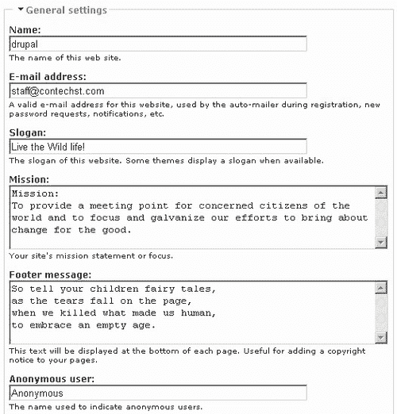
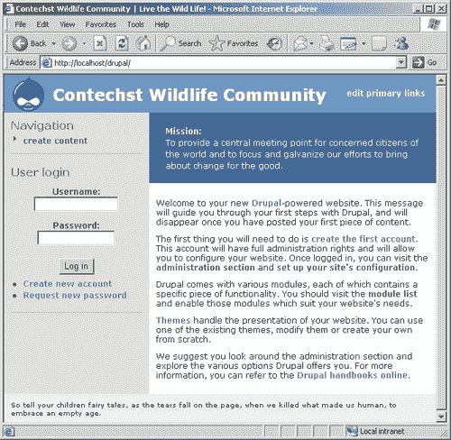
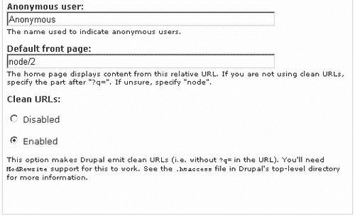
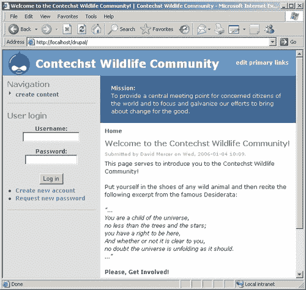
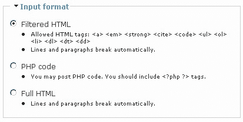
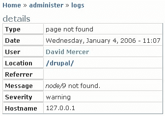

# 三、基础一：站点配置

人们在初次创业时最常见的陷阱是，他们认为*基础*很容易掌握，因此不需要太多思考。事实上，事情并不是那么一目了然，因为虽然你的网站的基本设置通常很容易实现，但更微妙的问题是知道你想要实现什么，以及你想要如何首先实现它。正是因为这个原因，从你的网站上发现你需要什么特别重要，这就是为什么我们在[第一章](01.html "Chapter 1. Introduction to Drupal")一开始就讨论了这个问题。

*这是否意味着你不应该直接在网站上工作，除非你确切知道你想要什么？*不太可能；和大多数事情一样，在开始开发 Drupal 网站时，这是一种折衷。这是因为，在您使用该网站一段时间之前，几乎不可能准确地确定您的网站需要什么，以及应该如何提供其功能。通常，您会发现自己根据用户的反馈修改了站点的行为。

无论如何，为了让事情顺利进行，我们需要讨论以下 Drupal 站点配置主题：

*   一般设置
*   错误处理
*   缓存和文件系统设置
*   RSS 源设置
*   日期设置
*   现场维护
*   字符串处理

假设你已经密切关注你希望你的网站如何运作，以及你如何想象它被使用，那么一旦你的基本设置完成，你应该会发现你必须做的更改数量保持在最低限度。但是请记住，Drupal 中的更改很容易实现。如果你不得不回去，并根据用户的反馈改变事情，或者改变你的网站，不要担心。

# 在我们开始之前

在动手之前记下一两件重要的事情是明智的。例如，您应该将检查 Drupal 中设置的更改对站点的影响作为第二天性。本章的目标是了解哪种设置能做什么，以及它如何改变网站的行为。虽然我们不会详细介绍每一件小事，但你会对网站的总体配置有足够的信心。

我们在本章中讨论的设置实际上只会从最广泛的意义上影响站点，因为它们会修改其默认行为，例如显示哪些错误页面，或者站点将使用哪些返回电子邮件地址。适用于重点关注领域的更复杂或更具体的设置，如输入格式、访问权限或模块激活，将在后面的章节中进行更详细的讨论。

话虽如此，我们在这里讨论的一些话题目前并不适用于您。例如，您不太可能一开始就想使用 RSS 提要（尽管您可能希望稍后再使用它们）。请随意跳过任何对您没有直接价值的部分，因为您随时可以在需要时返回这些部分。

此外，你们中的一些人可能会抱怨说，为了得到你们想要的一切，必须一次又一次地在环境中辛勤耕耘。当然，创建一个华而不实的新主题可能会更令人兴奋，但是花时间查看并使用所有可用的设置是成为一名称职的 Drupal 管理员的重要一步。你不仅要学会如何完成事情，而且要学会实际可以完成的事情。相信我，有了像 Drupal 这样灵活和强大的软件，可以提供的数量是惊人的。

*那么，我们究竟要看什么？*如果您以管理员身份登录，导航到**Administrate**，然后是**settings**，您应该会看到如下页面：


正如您所看到的，有很多选项需要处理（从本页上显示的链接数量来看），我们将在本章中从页面右侧提供的链接开始。在本书的整个过程中，我们将介绍**管理**主菜单链接下的每一项。

你们中的一些人可能已经意识到，尽管 cron 作业出现在设置页面中（如上面的屏幕截图所示），但在本章的介绍中并没有提到 cron 作业。这是因为处理 cron 作业或调度任务更多的是站点管理任务，而不是专门面向 Drupal 的任务。因此，您需要了解的关于 cron jobs 的所有信息都将在[第 10 章](10.html "Chapter 10. Running Your Website")中介绍如何运行您的网站。

现在，不可能总是按顺序讨论每个设置，因为 Drupal 经常要求我们在几个不同的地方进行设置，以实现某些更改。然而，一旦我们看完了整个菜单，这一切看起来就不那么令人畏惧了，而且你对事情的运作方式更加熟悉了。

# 一般设置

这个页面包含一个混合的设置包，其中一些设置非常简单，而另一些则需要我们非常仔细地考虑我们需要做什么。首先，我们会看到一些文本框，它们控制站点名称、任务声明等内容。对于演示站点，为前六个选项输入了以下设置：



从表面上看，我们基本上已经准备好了。这些设置没有任何复杂之处，继续下一批应该没问题；还是先检查一下？重要的是要记住，在我们继续之前，明智的做法是使用网站，以确保所做的任何修改都能达到预期效果。

保存上述更改后，演示站点现在如下所示：



嗯，这不太理想！首先，我们似乎完全忽略了我们的口号，我们在**页脚信息**部分中添加的有力的诗句也没有以我们想要的格式显示出来。发生什么事？正如你所看到的，事情并不总是像看上去那么简单。标语不显示的原因是因为一些主题根本不显示标语（或者只是在默认情况下禁用了标语），而页脚没有以诗歌格式显示的原因是因为我们没有告诉 Drupal 将其格式化。

哦，天哪，看起来我们已经遇到了一些问题，这些问题，根据我们手头的信息，是不容易解决的。这里的答案是耐心等待，直到我们详细处理了各种其他配置设置和主题，因为这将帮助我们了解如何以更高的复杂度修改站点的实际演示。

这并不是说我们完全没有秘密。请记住，如果在文本框中输入 HTML（超文本标记语言），Drupal 将格式化 HTML。因此，如果不是原始的**页脚消息**文本，我们输入如下内容：

```php
<p align="center"><i>
So tell your children fairy tales,<br />
as the tears fall on the page,<br />
when we killed what made us human,<br />
to embrace an empty age.
</i></p>

```

然后，页脚消息将显示在网站上，如下所示：


这更适合我们的目的，因为文本既是诗歌，也是一段引用自一首名为*消失*的诗歌的话（因此是斜体）。

对于一些人来说，这可能会带来一些问题，因为您不熟悉 HTML。如果在这个阶段，你对 HTML 几乎一无所知，那么在继续之前，你可能会觉得有必要先教自己一些关于 HTML 的知识。如果是这样，请跳到[第 7 章](07.html "Chapter 7. Advanced Content")中关于*HTML、PHP 和内容发布*的部分，以获取更多信息。

继续往下看，我们还可以选择为匿名用户定义名称。这很好，但如果你有令人信服的理由这样做，请随意改变。这样做的唯一一件事是将帖子的登录名从**匿名**更改为您设置的任何名称（假设您允许匿名用户向站点发布任何内容）。让我们先看看本节中剩下的设置，然后再解释它们：



如您所见，我们已经将**默认首页**更改为**节点/2**。*但更改此设置有什么作用？*好吧，假设有一个页面的内容，您希望在任何人查看任何其他内容之前显示为您网站的默认页面。例如，如果您想显示某种促销信息或介绍页面，您可以告诉 Drupal 使用此设置显示这些信息。在这种情况下，第二个节点被指定为默认的首页。请记住，您必须首先为这篇文章创建内容，然后确定其 ID，然后才能告诉 Drupal 使用它。

在我们讨论如何添加内容之前，您最好暂时保持现状。如果你想在网站上发布一些东西，只需使用菜单顶部的**创建内容**链接，然后按照此处的说明操作即可。你应该能够很容易地启动和运行一些东西。但是，与本节相关的内容的重要一点是，您需要知道要指定为默认首页的节点的 ID。

如果您记住以下几点，这很容易：

### 注

无论何时编辑内容，正在编辑的节点的 ID 都将显示在 URL 中。

我们还没有完成，因为可以根据头版的要求指定几个选项。在这种情况下，已选择标识号为 `2`的特定节点，但如果您希望显示站点的博客，则可以将**博客**替换为**节点/2**（节点/ID 格式），并默认显示博客列表。

确定如何准确显示您想要的首页的一个好方法是实际浏览到您想要在站点上显示的页面。这可能是您的博客页面、聚合新闻提要（本书后面将详细介绍提要）或其他内容。查看所需内容后，记下**相对 URL 路径**并将其输入到提供的文本框中。

相对 URL 路径是页面地址的一部分，位于标准域之后，由整个站点共享。例如，在本例中，设置 `node/2`有效，因为 Drupal 将此相对路径映射到：

```php
http://localhost/drupal/node/2

```

这个地址的第一部分 `http://localhost/drupal/`是**基 URL**（回想一下，您在上一章配置 Drupal 时指定了这个地址），之后的所有内容都是相对 URL 路径。

但是，在继续之前，请确保一切正常。设置文件路径有时会很痛苦，因为如果你像我一样，很容易犯错误，在这里或那里添加错误的斜杠。

您还可以通过输入正确的相对 URL 路径以及类别的 ID 号来按类别显示内容。这需要我们在使用之前了解如何使用类别，因此这只是一个练习。目前，网站的默认页面如下所示：



到目前为止一切都很好，但最终的设置意味着什么？许多人可能已经注意到，每当您向 Drupal 发出请求时，您所访问的页面的 URL 如下所示：

```php
http://localhost/drupal/?q=node/add

```

这是 Drupal 中 URL 的默认形式，不幸的是， `?q=`显然不是很吸引人。更糟糕的是，它可能会干扰你的网站被搜索引擎索引。因此，您可以通过启用**清除 URL**选项将其从 URL 中删除。为了使其工作，您必须启用 Apache `mod_rewrite`模块（这可以在 Apache 安装的 `httpd.conf`文件中设置）。如果您已经安装了 Apache2Triad，那么应该已经安装了 Apache2Triad，但是在将您的站点部署到您的实时主机时，您必须确保他们也启用了 Apache2Triad，否则您将不得不禁用**干净的 URL**。

# 错误处理

本节允许您广泛地处理可能出现的错误问题（希望不是经常出现）。特别是，您可能希望创建两个自定义错误页面，在出现*页面未找到或*访问被拒绝问题时，这些页面将显示给您的用户。请记住，已经有相当简洁的页面，默认情况下会提供这些页面，但是如果您希望进行任何更改，那么该过程与为站点定义默认页面相同，如前一节所示。创建将要显示的内容*页面未找到*的示例错误：


现在，我们只需点击**提交**来确定该帖子的唯一 ID，然后查看下一页地址栏中显示的 URL，在这种情况下，该页面的 ID 为 5。针对*访问被拒绝*错误猛击一个类似的页面，并向 Drupal 提供其 ID 完成错误页面处理。因此，每当出现问题时，用户都会收到一条友好的信息，并有机会直接向员工发送电子邮件。

请记住，虽然我们将在第 6 章和第 7 章中详细介绍添加、删除和操作内容，但在此阶段，您可能会发现，您可以使用内容添加页面上的此下拉列表在添加内容时选择**输入格式**（如果您需要在发布过程中做一些相当高级的事情，这将非常有用）：



如您所见，我有一个默认选项**过滤 HTML**，它允许我输入一些 HTML 代码，而不是 PHP 代码。*“为什么他们会有这样几个选择？”*，你可能会问。稍后，我们将更详细地讨论产生这种情况的原因。目前，最好坚持使用**过滤的 HTML**，除非您有特殊需要添加 PHP 代码或不允许添加的 HTML 标记。

下一个选项**错误报告**允许您决定是否将错误写入屏幕以及错误日志。当您忙于构建站点时，您可能会发现选择**将错误写入日志和屏幕**很有用，这样您就可以确定出什么地方出了问题以及什么时候出了问题。但是，一旦上线，您应该将其更改为**将错误写入日志**（见下拉列表），因为您不希望每个人都能够读取系统的各种错误，因为这可能会将信息泄露给恶意用户，而恶意用户可能会利用它对您的网站进行攻击。

**错误处理**部分现在看起来像这样：


此屏幕截图中显示的最后一个选项允许您决定保留日志消息的时间。当你做出这个选择的时候，你可能必须在前进的过程中找到自己的路，因为这实际上取决于你有多忙，以及网站有多忙。当有疑问时，将其作为默认选项，因为这是一个大体合理的选择。

您需要使用 crontab 来强制执行此设置，如果此时提及 cron 作业已使事情变得像 mud 一样清晰，那么理解以下内容很重要：

### 注

Cron 作业（在 Windows 上，这些作业称为计划任务）只是在特定时间运行的命令批，具体时间取决于您设置它们运行的频率。crontab 允许您规定各种作业及其执行间隔。

一旦您需要使用控制 Drupal 站点上所有 cron 相关任务的 `cron.php`脚本，请转到[第 10 章](10.html "Chapter 10. Running Your Website")中的*cron 和预定任务*部分。

一旦您对正确设置了 cron 作业感到满意，就可以确保自动任务将由 cron 脚本处理。另外，让我们看看这个动作中的新设置。例如，我试图访问一个不存在的页面。不出所料，出现了以下友好消息：


需要注意的一点是，作为整体策略的一部分，您应该记住定期检查日志，以确保网站继续顺利运行。错误消息、警告等实际上是了解站点操作的窗口，是不可或缺的工具。

要查看您的日志，只需单击**管理**菜单项下的**日志**，您将看到在您的站点上发生的所有事件的列表。您可以通过在标题为**的下拉列表中选择一个选项，按消息类型**过滤，然后单击**过滤**来过滤这些事件。如果您想查看任何错误报告的详细信息，只需点击**消息**栏下的链接，就会显示日志报告的详细信息，如下所示：



这就为错误处理做好了准备。当然，重要的是要认识到，这种类型的错误处理不会处理网站实际源代码或文件系统中可能存在的错误或 bug。换句话说，这种类型的*错误处理*不能与应用程序中的*错误*混淆，它只是用来处理站点的功能，因为它与服务页面有关。如果您在系统中遇到一个 bug，那么您需要尝试修复该问题，如果失败，您可以向 Drupal 社区寻求帮助。

# 缓存和文件系统设置

缓存是一个存储位置，服务器可以在其中保存网页以快速访问，而无需每次从头开始构建它们。显然，如果站点提供每次都需要大量数据检索的页面，那么这可以显著加快站点的速度。问题是缓存的页面提供的是页面的旧版本，而不是最新版本。如果您使用的页面只是偶尔更改一次，那么这没有问题，但是如果用户在每次请求页面时都能够看到页面的最新版本这一点很重要，那么您不应该使用缓存。

*那么什么时候不需要缓存？*首先，在构建站点时不需要使用它，因为在设置内容时所做的任何更改都可能在刷新缓存之前无法显示。当您希望更改在页面上显示时，这可能会导致不小的混乱。因此，您应该只在站点准备上线之前启用页面缓存，以测试它是否正常工作。

**缓存设置**部分中的第二个设置**最小缓存生存期**确定 Drupal 在其缓存中保存页面的时间。这实际上是由您的内容的性质决定的，您应该能够根据内容的变化速度和使用量来确定什么最适合您的站点。如果将缓存设置为每分钟刷新一次，则可以确保站点上的所有内容最多只保留一分钟，因为页面在调用后每分钟都会刷新一次。设置为一天意味着内容可能长达一天。缓存保存的时间越长，站点的性能越好，但内容越陈旧。显然，对于注册用户或站点管理员来说，能够查看每个页面的最新版本非常重要，因此：

### 注

仅缓存*匿名*用户访问的页面！

如何处理文件系统设置实际上取决于您使用的可视化站点的内容类型。建议您立即将**下载方式**设置为**私有**，以便从一开始就可以正确控制文件下载。如果您知道任何人都可以在您的网站上下载所有文件，请保持原样。

假设您*确实*希望将您的下载方法设置为私有，那么您需要将 `files`目录移出文档根目录，这样它就不能直接在 Web 上使用。如果您这样做，您需要输入此文件夹的*完全限定*文件路径，而不是*相对*路径，否则 Drupal 将尝试在正常位置找到它。例如，在演示站点的开发机器上，选择了**私有下载方式**输入了以下文件路径：

```php
C:\apache2triad\files

```

除此之外，还要确保 `temp`目录集是合理的，在演示站点的情况下，目录集是 `C:\apache2triad\temp`。

在我们继续之前，我们应该确保我们可以上传一个文件到网站没有任何问题。要执行此操作，请转到**管理**下的**模块**部分，启用**上传**选项（位于模块列表底部），然后单击**保存配置**。现在，当您尝试**创建内容**时，您将看到以下**文件附件**选项以与实际内容匹配：


上传文件后，您将看到类似以下确认消息的内容：


上图**文件附件**下表新增四列：

*   **删除**，您可以选择从帖子中删除附件
*   **列表**，在附件中列出上传的文件
*   **说明**，文件名
*   **大小**，上传文件的大小

在本例中，上载的文件是一个图像，其重量为 2.45KB。如果要在页面中显示附加文件，则需要确保这些文件相当小。顺便说一句，如果您选择列出您的附件，通过选择**列表**选项，它将出现在帖子中，如下所示：


用户只需点击链接即可上传文件。显然，如果您要将文件附加到帖子中，以便在页面中显示，那么您可能需要禁用**列表**选项。有关文件附件的更多信息，请参阅[第 7 章](07.html "Chapter 7. Advanced Content")，其中涉及*高级内容*。

# RSS 源设置

在将来的某个阶段，您可能希望利用 Web 上提供的大量 RSS 提要中的一些。当这一次到来时，你需要对如何在你的网站上展示这些内容做出一些选择。本节中提供的选项允许您控制每页要显示的提要数量，以及是单独显示标题、标题加摘要还是显示整个提要。这些选项非常简单，目前不会影响任何事情。

当我们在[第 6 章](06.html "Chapter 6. Basic Content")中使用提要聚合器时，我们将更仔细地了解 RSS 提要（包括讨论它们是什么）。

# 日期设置

本节中的所有内容都非常简单，涉及网站上显示的日期和时间值以及格式。根据您的当地时间选择您的默认时区。例如，演示站点比格林尼治标准时间提前两小时。

接下来，您可以决定是否允许用户根据其位置设置自己的时区。默认情况下，这设置为**启用**，这是相当合理的，除非您碰巧知道您的绝大多数用户将来自一个相当小的地理位置。例如，如果您在怀俄明州为您当地的 SPCA 运行一个社区站点，那么该站点不太可能有金沙萨的成员，因此可以禁用**可配置时区**选项。

在此基础上，还有一组与站点上显示的日期和时间格式相关的选项，您应该选择与站点的大多数预期用户或站点的位置一致的选项。没有太多的生命威胁在那里，你可以随时作出修改，在以后的日期，如果改变是必要的。

# 现场维护

Drupal 的开发人员应该得到赞扬，因为他们为您提供了站点维护工具，使您的生活比大多数其他网站管理员更轻松。在我们讨论它之前，我应该明确以下几点：

### 注

对站点的所有主要开发或更改都应在开发机器上执行，并在实施或移植到活动站点之前进行彻底测试。

然而，有时您只需直接对实时站点进行一些更改，即使只是为了实现已经在开发服务器上测试过的升级。如果是这种情况，那么您可以简单地将**站点状态**切换到**离线**，而不是允许用户在维护中的站点上工作，然后继续您的工作。

您还可以添加一条简单的消息，解释站点当前脱机的原因，以便当用户尝试访问站点时，他们可以看到如下内容：


如果您确实需要在现场执行某些主要工作，使用此设施将使您的生活变得轻松。但是在处理这个问题时要非常小心，因为如果你注销了，那么你就把自己锁在了网站之外。这是因为只有用户 1（即管理用户）可以在站点脱机时在站点上执行任何操作。如果您注销并再次尝试登录，则您不再是管理用户；你是匿名的。

如果你碰巧是网站管理员，这对你没有多大帮助；因此 Drupal 允许正常访问登录页面。导航至 `http://localhost/drupal/user`，您将能够以管理员身份登录并使用该网站而不受阻碍。非常重要：

### 注

将站点状态设置为**离线时，请确保您没有忘记管理员密码！**

其他所有人都被锁定，直到网站状态返回到**在线**。

# 字符串处理

目前，除了在 Unicode 字符串处理设施上进行适当的教育之外，您没有选择的余地。Drupal 使用**PHP mbstring 扩展**，默认情况下未启用该扩展。如果您确保 live 主机启用了此扩展，Drupal 将忠实地支持多字节 Unicode 操作，使您的站点能够满足您喜欢的任何语言中的一些非常遥远的字符。

# 总结

本章涵盖了建立网站的大量内容。我们首先查看一些常规配置设置，这些设置对于使螺母和螺栓处于正常工作状态非常重要。随着网站的发展，以及你变得更具冒险精神，这些设置中的许多都需要重新访问。

然而，您已经了解了一些有价值的信息，这些信息包括去哪里，以及当您需要处理网站的整体福利时可以使用什么。从错误处理到站点维护，您现在应该能够自信地使用 Drupal。

值得注意的是，对于标准的 Drupal 配置，还需要了解一些相关的技术。在这种情况下，花点时间学习一点 HTML 肯定会有助于让您的内容很好地组织起来，并显示在网站上。这不仅有利于现在（以及以后的开发阶段），而且在使用 Web 时也是一个重要的工具。

当然，如果你能胜任的话，对 PHP 有很好的理解也会有帮助！花点时间浏览 PHP 网站[http://www.php.net](http://www.php.net) 学习更多关于语言的知识。