# 七、高级内容

到目前为止，我们对内容的大部分处理都相当基本，因为它们只需要我们了解要启用哪些设置以及输入什么文本。这与本章的内容有着根本的区别，主要是因为本章的内容要求我们提前思考，提前计划我们想要的东西，以防止事情在以后出错。

在这一点上，在前面的章节中听了这么多关于分类和分类的内容之后，您可能会想知道这些小题大做是关于什么的。我们关注分类的主要原因是为了使 Drupal 的分类系统如此强大，必须让我们决定如何最好地实现。起初这听起来可能有点奇怪，但我们将在后面的章节中看到为什么 Drupal 的这种能力是它区别于其他任何东西的一个因素，这真的是一件好事！

因此，本章讨论以下主题：

*   HTML、PHP 和内容发布
*   分类

不要被以下事实所愚弄，这里只列出了两个项目，因为它们都代表了我们到目前为止讨论的所有其他主题的复杂性的提高。然而，一旦这些主题在你的掌控之下，你就会或多或少地了解网站的发展，在我们开始研究更多的管理类任务之前，只有主题化的主题才会出现。

除此之外，在磨练内容创建和管理技巧的过程中所学到的技能不仅对本网站非常有用，而且对你生活的其他方面也非常有用，无论是为你的老板创建和管理办公室报告、创建新网站，甚至是写书。原因是，大体上，我们现在将学习*如何管理和创建内容*，而不是如何单击按钮和链接来启用或禁用设置。

无论如何，我相信你很想继续下去。

# HTML、PHP 和内容发布

我们在前面的[第 3 章](03.html "Chapter 3. Basics I: Site Configuration")中简要地提到了一个事实，即在我们的帖子中可以包含 HTML 或 PHP，我们在[第 4 章](04.html "Chapter 4. Basics II: Adding Functionality")中的**添加块**一节中添加了一些格式和一些文本的超链接，我们还看到了一个简短的 PHP 脚本，这为网站提供了不错的*当日报价*功能。因此，在这一点上，您应该对这样一个事实感到满意：如果有足够的权限，就可以发布一些非常独特和有趣的内容。

在某个阶段，您可能希望至少将部分内容从纯文本升级到看起来有点*与众不同的内容*。如果你说的是布局，那么 HTML 就是你需要知道的。或者，如果您想创建一些动态内容，这些内容可能会根据站点的状态而改变，或者响应用户交互，那么 PHP 就是前进的方向。更有可能的是，一旦你获得了一点经验，你最终将两者结合使用。

不幸的是，我们不可能希望给你一个全面的介绍这两种技术在我们这里的空间。然而，有大量的在线资源可供您免费学习 HTML 和 PHP，我们将在本节中列出其中的一部分。

现在，我们将通过演示如何创建一个*关于我们的*页面来了解如何完成一些相当有用的任务，该页面将包含指向其他有用站点的链接、*虚拟团队*的图片以及一些动态内容。

## 输入格式和过滤器

你需要了解的第一件事是，有必要规定我们将在任何给定的帖子中发布哪种类型的内容。这是通过使用**输入格式**设置来实现的，假设相关用户有足够的权限发布不同类型的内容，则在向网站发布内容时会显示该设置。为了控制哪些是允许的，哪些是不允许的，请转到**管理**主菜单项下的**输入格式**链接。这将显示当前定义的输入格式列表，如下所示：

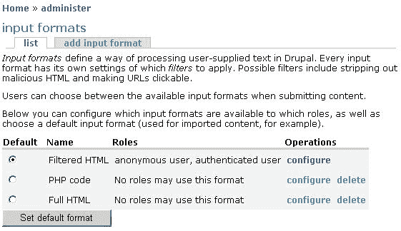

现在，你可能想知道为什么我们需要费尽周折来决定人们是否可以在他们的内容中添加特定的标签。这个问题的答案是，因为 HTML 和 PHP 都是如此强大的互联网技术，所以不难为恶意目的破坏甚至相当简单的功能。例如，您可能决定允许经过身份验证的用户能够从他们的博客链接到他们的主页。恶意用户可以通过在其帖子中添加超链接，创建病毒或其他有害内容，并从无害且友好的 HTML 链接到该内容，如下所示：

```php
<p>Hi Friends! My <a href="link_to_virus.exe">homepage</a> is a great place to meet and learn about my interests and hobbies. </p>

```

这段代码只是简单地写出了一段带有链接的短文，据说链接到了作者的主页，但实际上超链接引用属性指向了一种病毒， `link_to_virus.exe`。那只是 HTML；PHP 会造成更大的破坏，如果您没有适当的安全或灾难恢复策略，那么您的站点可能会变得无用或完全被破坏。正如您在上一个屏幕截图中所注意到的，安全性是除了您作为管理员之外，任何人都无法使用**过滤 HTML**之外的任何内容的主要原因。

再次重申这一原则很重要：

### 注

决不允许用户拥有超过其完成预期任务所需的权限！

就目前情况而言，您可能无法找到您喜欢的输入格式，因此 Drupal 为我们提供了一些功能来修改它们。点击**过滤 HTML**选项旁边的**配置**链接，将弹出以下页面：


**查看**页签提供修改输入格式**名称**属性的选项；本例中的**角色**部分无法更改，但当我们开始创建自己的输入格式时，您将看到，可以按照您的意愿分配角色。最后一节为我们提供了使用此输入格式时希望应用的**过滤器**类型的清单。在这种情况下，选择了前两个，这将导致输入格式应用**HTML 过滤器**（稍后讨论）以及**换行转换器**，而不是**PHP 计算器。**

换行转换器简单地让用户更容易格式化他们的内容，因为这意味着他们不必显式地输入`<br>`或`<p>`HTML 标记来显示新的换行符或段落。如果禁用此选项，则除非用户能够添加相关的 HTML 标记，否则您的所有内容最终可能会如下所示：


PHP evaluator 只是使 POST 被发送用于 PHP 处理，以便正确执行 PHP 分隔符`<?php`和 `?>`之间的任何代码。除了您自己或高度信任的管理员需要它来完成其工作之外，不应为任何人启用此功能。但是，对于这两个选项，都没有其他工作要做。这里我们需要查看的唯一附加设置是针对**HTML 过滤器**。

点击页面顶部的**配置**选项卡，开始使用**HTML 过滤器**。您应该看到这样的内容（一旦您点击**HTML 过滤器**链接以扩展其内容）：


首先，可以使用前两个选项来决定是剥离不允许的 HTML 标记，还是忽略任何帖子中的所有标记（Escape**all tags**导致帖子中存在的任何标记按原样显示）。请记住，如果从内容中删除所有标记，则应启用**换行转换器**，以便用户至少可以正确地对其内容进行分段。在下一节中决定剥离哪些标签，在这里您可以输入一个列表，列出*是*的所有标签，允许移除任何其他标签！

在前面的屏幕截图中，您可以看到此输入格式中允许 11 种不同类型的标记。请注意，第一个标签实际上是**<a>**标签，它可以用来在内容中插入链接，所以要小心！

接下来，下一个设置允许我们指定在发布内容时是否向用户提供 HTML 帮助尝试启用和禁用此选项，并在每种情况下浏览此相对 URL 以查看差异： `filter/tips`。在长长的过滤器提示中有很多关于 HTML 的有用信息；因此，请花点时间仔细阅读这些内容。如果你发现该网站被用来向会员提供指向未经你批准的产品的链接，**垃圾邮件链接威慑**是一个有用的工具。

这还不是故事的结尾，因为我们还需要能够在需要默认选项无法满足的情况下创建输入格式。在本例中，假设我们想在*关于我们*页面中添加一些图片文件，我们将在适当的时候创建该页面。现在，有几种方法可以做到这一点，但有两个主要的标准，需要满足之前，我们可以考虑创建我们的网页。我们需要能够：

1.  上载图像文件并将其附加到帖子。
2.  在文章正文中插入并显示图像文件。

当我们在[第四章](04.html "Chapter 4. Basics II: Adding Functionality")关于*添加功能*的*上传*时，我们已经看到了如何执行任务 1。因此，假设您能够将文件附加到您的帖子，这就让我们来处理第二个标准。在文章中显示图像文件有几种方法。我们将在这里讨论的模块不要求我们下载和安装任何贡献模块，如**Img_assist**。相反，我们将直接使用 HTML 来实现这一点，具体来说，我们需要``标记。

请看前面的屏幕截图，其中显示了**过滤 HTML**输入格式的**配置**页面。您会注意到，``标签不可使用。让我们创建自己的输入格式来满足这一需求，而不是修改此默认选项。返回**管理**下的**输入格式**主页面，点击**添加输入格式**。这将打开以下页面，您可以从中构建新的输入格式，如图所示：


由于稍后我们将需要使用一些 PHP 代码，因此我们启用了**PHP evaluator**选项，并阻止除我们之外的任何人使用此格式。通常，您将为需要修改发布功能的一组用户创建一种格式，但在本例中，我们只是演示如何创建新的输入格式；所以现在这还可以。

点击**保存配置**将此新格式添加到列表中，现在可以通过点击列表中其名称旁边的**配置**链接来配置，以打开其配置页面。现在，这个输入格式与默认的**过滤 HTML**在 HTML 方面的唯一区别是在**允许的 HTML 标记**列表中添加了``标记，后跟一个空格，如下所示：


在使用这种输入格式之前，我们还需要看一件事。就目前的情况来看，在任何内容发布中添加 PHP 代码都会遇到问题。这是因为目前**HTML 过滤器**先处理内容，然后破坏**PHP 计算器**的代码。

在配置输入格式时，只需点击**重新排列**选项卡，并为**PHP evaluator**赋予较轻的权重，如下所示：


现在，PHP evaluator 可以对内容进行 DIB，并可以正确处理 PHP。为了将图像添加到您的帖子中，现在只需要这些。完成后，保存更改，然后再使用它创建*关于我们*页面。不过，在此之前，最好先简单介绍一下 HTML，因为您会发现，在尝试更复杂的帖子时，您需要能够使用 HTML。

## HTML

为了让您的浏览器呈现我们每天都能看到的布局整齐、色彩丰富的页面，它需要关于什么去哪里以及什么颜色的说明。这是**超文本标记语言**（HTML）的领域，Drupal 在这里使用 HTML 也不例外。

在继续之前，让我们先来上一堂关于 HTML 各个方面的速成班：

*   **简单性：**从表格和框架到列表和图像，以及指定字体和样式，HTML 是网页创建和布局的方便且易于理解的约定。
*   **平台独立性：**HTML 是平台独立的（尽管并非所有浏览器都完全相同），如果你仔细想想，这是有道理的；作为一个网站的建设者，你最不想做的事情就是必须满足每一种不同类型的可以使用 HTML 的机器。
*   **标记：**HTML 以开始和结束标记的形式出现，它告诉浏览器如何显示包含在其中的信息。例如，页面的标题将包含在如下标题标记中：`<title>My Title Page</title>`。请注意，正斜杠用于区分结束标记和开始标记。
*   **属性：**标记可以具有属性，可以修改或定义标记行为的某些方面。例如，以下 HTML 代码片段中的 `size`属性定义了在浏览器中呈现字体`<font size="2">I have a font size of 2</font>`时的大小。
*   **节：**HTML 页面包含在`<html></html>`标记中，分为`<head></head>`节和`<body></body>`节。body 标签包含页面的大部分内容，并包含在实际网页上看到的信息。在我们的例子中，我们不必担心这一点，因为所有内容都是在`<body>`标记之间自动发布的。

这给了我们一个关于 HTML 是什么和做什么的公平的概述，但是出于实际目的，重要的是看看现在使用我们可用的 HTML 可以实现什么。实际上，作为管理员，您可以使用所有 HTML 标记，但请记住，您只应在开发期间使用此帐户；一旦你的网站上线，你应该使用你为任务设计的输入格式发布内容。因此，您需要知道标记的实际作用。

下表讨论了每个默认允许的标记以及刚刚添加的``标记。请记住，在这里显示每个标记的每个属性并不实际，因此，如果您想单独了解每个标记的更多信息，请查看 `http://www.w3schools.com`，它是 HTML 等所有内容的优秀资源。

<colgroup><col style="text-align: left"> <col style="text-align: left"> <col style="text-align: left"></colgroup> 
| 

标签

 | 

重要属性

 | 

描述

 |
| --- | --- | --- |
| `` | `src:`给出图像文件的路径`alt:`保存图像的描述 | 与其他标签不同，``标签不需要关闭`</img>`标签。它用于在 HTML 页面中显示图像，并通过使用可选属性可以准确控制图像的外观和布局。 |
| `<a>` | `href:`指定链接的目标 URL`name:`允许在网页中创建书签。`target:`定义最常打开链接的位置。这是一个新页面 `_blank`或同一页面 `_self`。 | 锚元素有助于创建超链接或书签，用户可以对其进行导航。 |
| `<em>` |   | emphasis 标记将标准文本转换为斜体。 |
| `<strong>` |   | 强标记以粗体显示文本。 |
| `<cite>` | `title:`可用于指定相关引文的来源或作者 | 引用标签允许引用来自其他来源或作者的文本。它通常以斜体显示。 |
| `<code>` |   | 代码标记会更改所附文本的样式，以模仿计算机代码的样式。 |
| `<ul>` | `type:`定义要使用的项目符号类型： `disc, square`或 `circle`。 | 无序列表创建一个项目符号列表，它需要使用`<li>`标记来规定列表中的项目。 |
| `<ol>` |   | 订单列表创建一个编号的项目符号列表，它需要使用`<li>`标记来规定列表中的项目。 |
| `<li>` |   | 列表项标记在有序或无序列表中创建一个新项；因此，它包含在`<ul></ul>or <ol></ol>`标签中。 |
| `<dl>` |   | 定义列表标签创建由`<dt>`和`<dd>`标签定义的结构化项目列表。 |
| `<dt>` |   | “定义术语”标记在定义列表中创建术语。它包含在`<dl></dl>`标签中。 |
| `<dd>` |   | definition description 标记创建其父术语的描述，它包含在`<dl></dl>`标记中。 |

此表实际上只列出了可供您使用的所有标记的一小部分。大多数标记还具有各种各样的必需、可选或基于事件的属性，您可以使用这些属性来实现所需的效果。我们还需要使用另一个标签来正确布局页面，这就是最重要的`<table>`元素。表格用于在页面中排序和放置内容，并使用`<tr>`标记（定义表格中的新行）和`<td>`标记（定义该行中的新单元格）。作为练习，返回到新创建的输入格式，并添加这些标记。

此表实际上只列出了可供您使用的所有标记的一小部分。大多数标记还具有各种各样的必需、可选或基于事件的属性，您可以使用这些属性来实现所需的效果。我们还需要使用另一个标签来正确布局页面，这就是最重要的`<table>`元素。表格用于在页面中排序和放置内容，并使用`<tr>`标记（定义表格中的新行）和`<td>`标记（定义该行中的新单元格）。作为练习，返回到新创建的输入格式，并添加这些标记。

有了这些，我们准备开始创建一个比以前所有的帖子都稍微高级一点的帖子。

## 创建功能丰富的页面

创建这样一个新页面最酷的一点是，一旦创建完成，您可以在其他任何地方重用代码，只替换需要更改的值或内容。显然，您希望站点看起来相当统一，这至少在 HTML 方面支持代码重用原则。

很可能在某个阶段，您需要创建多个独立页面。如果是这种情况，在发布之前，只需剪切并粘贴您在此处创建的任何页面，并进行您需要的任何修改。以这种方式进行操作将使您的所有页面具有类似的外观和感觉，超出当前主题已经赋予它们的属性。

*关于我们*页面将具有以下功能：

*   结构良好的内容
*   目标清单
*   球队的内联照片
*   项目信息
*   重要链接列表
*   一些基于 PHP 的动态内容
*   广告

为了满足上述要求，我们需要使用以下标签：

*   `<table>`
*   `<ol>`
*   `<ul>`
*   ``
*   `<a>`

以及其他一些，我们将使用它们来演示各种可用的字体样式。为了创建一个稍微复杂一些的页面，您应该考虑使用适当的代码/ HTML 编辑器（如 EddPress，AutoT0.http://www.editplus.com ，也可以-或者，在谷歌上进行简单的搜索会显示许多结果，其中一些是免费的）它可以自动缩进您的代码，并对各种标签和内容进行颜色编码，以使生活更轻松。

好啊我们已经准备好开始了。我将逐段列出整个页面的代码，而不是一次列出所有代码，因为有很多重要的事情值得我们讨论。然而，一旦掌握了 HTML 和 PHP 的诀窍，这里就没有什么太复杂的了。在我们开始之前，最好先看看结果页面，了解我们正在努力的方向。以下屏幕截图显示了页面的大部分内容：


我希望你会同意，这一页是相当赏心悦目！对于很少的工作，很容易实现这样的外观和布局。从这个页面看不明显的是，这里给出的名称列表以及它们的电子邮件链接是由嵌入到 HTML 页面中的一个简短 PHP 脚本提供的。

让我们从代码开始，我们有以下内容：

```php
<table border="0" cellpadding="5">
<tr>
<td align="center" colspan="2">
<strong>The CWC</strong>
</td>
</tr>
<tr>
<td colspan="2">
The <em>Contechst Wildlife Community</em> was started by a group of
individuals in <cite title="South Africa">Cape Town</cite>. Through
hard work, dedication and plenty of play time, they have built a truly
international community that strives to effect change with regards to
all things related to our biosphere.
</td>
</tr>
<tr>
<td colspan="2">
<br>
We have the following goals:
</td>
</tr>

```

第一部分用于声明表，表最终负责将所有内容放在我们想要放的地方。注意，我在这里使用了两个表属性。第一个 `border`设置为 `0`，表示边框不可见。*我为什么要这样做？*在构建表格时，最好将边框设置为 `1`，这样您就可以看到自己在做什么。当您开始创建复杂的嵌套表等时，您会发现错误有时会悄悄出现。在这种情况下，能够看到您的表边框是什么样子是一个很大的帮助。完成后，只需将边框值设置为 `0`即可从页面中删除边框。

下一个选项 `cellpadding`为表中的每个单元格提供一点空间（或填充，如果您愿意的话），这样内容就不会集中在一起。您还可以看到，我们有一系列以`<tr>`和`<td>`标记形式声明的表行和表单元格。但是，第一个`<td>`标记有两个属性，它们控制内容在单元格中的位置（align）以及该单元格跨多少列（colspan）。这是必要的，因为在稍后阶段，要添加的图像占据了表格右侧的一个单元格，但上面和下面的行仍然需要填充整个页面（在这种情况下，整个页面是两列，因此设置为 `colspan="2")`。

为了更清楚地理解我的意思，请看下面的屏幕截图， `border`属性设置为 `1:`


请注意上面和下面的行是如何跨越中心行的两列的。在处理更复杂的表格时，为了把事情做好，您通常需要多做一些工作。

如果查看上一个清单中的这段代码，您会注意到使用了定义了一个 `title`属性的`<cite>`标记。这是在这里向您展示一个新颖的用途，提供参考。如果用户将光标悬停在`<cite>`标记中包含的文本上（在本例中为 `Cape Town)`，则 `title`属性中定义的文本（在本例中为 `South Africa)`将显示在屏幕上。通过这种方式，您可以澄清或解释重要术语，而不会弄乱页面。

继续，我们得到以下目标的有序列表：

```php
<tr>
<td colspan="2">
<ol>
<li>
To provide an online meeting place for like-minded people
</li>
<li>
To discuss and monitor global conservation and wildlife activities
</li>
<li>
To influence policy and effect change in hard-hit areas
</li>
<li>
To support front-line activists like SeaShepherd
</li>
<li>
To raise funds for animal relief efforts and care
</li>
</ol>
</td>
</tr>

```

如您所见，每个列表项只包含一行内容（本例中为一个目标），所有内容都包含在`<ol>`和`</ol>`标记中。这很简单，但相当有效，我相信你会同意的。下一节将介绍一些 PHP 代码，并插入我们的团队形象：

```php
<tr>
<td align="center" colspan="2">
<strong>Meet the Team</strong>
</td>
</tr>
<tr>
<td colspan="2">
In no specific order, the following people constitute the bulk of the
full-time staff here at CWC (You can email them by clicking on the names
shown below):
</td>
</tr>
<tr>
<td>
<ul>
<?php
$team = array('Tolis Welch', 'David Mercer', 'Bronagh Casey', 'Nic Malan', 'Brian Reid', 'Rochelle Reid');
foreach($team as $item){
$name = explode(" ", $item);
echo '<li><a href="mailto:' . $name[0] . '@cwc.org">' . $item . '</a></li>';
}
?>
</ul>
</td>
<td align="center">

</td>
</tr>
<tr>

```

在这种情况下，我们一直很狡猾，你会看到的！总之，在本节中，我们：

1.  创建了一个带有`<ul>`标记的无序列表
2.  使用`<?php`标记打开一个 PHP 脚本
3.  创建了一个团队成员名称数组
4.  使用 `foreach`循环，遍历数组中的每个名称
5.  使用内置的 `explode`函数获取每个成员的名字
6.  与结果相呼应，屏幕上充满了 HTML 标签

实际的电子邮件链接是使用`<a>`标记和 `href`属性中的特殊 `mailto`选项创建的。电子邮件地址是根据团队成员的名字建立的，因此前两个地址是`<[Tolis@cwc.org](mailto:Tolis@cwc.org)>`和`<[David@cwc.org](mailto:David@cwc.org)>`。这有点做作，因为您的电子邮件地址可能没有这样一个有序的系统，但它可以用来演示如何将 PHP 很好地嵌入到您的页面中。

一旦所有电子邮件地址都列出，我们就在它们旁边创建一个表格单元格，并使用图像标签插入团队的图片。如您所见，这里有三个属性用于完成任务。第一个 `src`给出要显示的图像文件的路径；第二种是对照片的描述，这样如果有人将光标悬停在图片上，将显示文本**团队**；最后，我们为照片的宽度选择了一个大小，以使其适合页面。注意：

### 注

保持图像文件小！您可以使用图像编辑软件降低它们的质量和大小大型图像会降低站点的速度。

HTML 的以下部分打印了一些用户可能感兴趣的其他组织的链接列表：

```php
<td colspan="2">
At CWC we strive to do the <em>right thing</em>! Please take the time
to look over the site and register in order to start interacting with
the community - our natural world needs all the help it can get.<br><br>
If you are interested in getting involved in any one of the number of
critically important organizations around the world, then please feel
free to browse any of the links given below.
</td>
</tr>
<tr>
<td align="center" colspan="2">
<strong>Our Friends</strong>
</td>
</tr>
<tr>
<td colspan="2">
<ul>
<li>
<a href="http://www.seashepherd.org" target="_blank">Sea Shepherd</a>
</li>
<li>
<a href="http://www.worldwildlife.org" target="_blank">World Wildlife Fund</a>
</li>
<li>
<a href="http://www.rspca.org.uk" target="_blank">The Royal SPCA</a>
</li>
</ul>
</td>
</tr>

```

这一部分相当简单，除了我们现在正在为`<a>`标记使用一个新属性。因为我们希望有人留在网站上而不去拜访我们的朋友，所以我们将 target 属性设置为 `_blank`以强制浏览器打开一个新窗口来显示目标 URL。除此之外，这一部分内容非常清楚，因此我们转到页面上的最后一项广告：

```php
<tr>
<td align="center" colspan="2">
<strong>Our Sponsors!</strong>
</td>
</tr>
<tr>
<td align="center" colspan="2">
<a href="http://www.packtpub.com" target="_blank">

</a>
</td>
</tr>
</table>

```

这将同时使用超链接和图像文件。事实上，我们已经将图片*Packt*徽标封装在`<a>`和`</a>`标签中，从而将其转化为超链接。这意味着，人们不仅可以查看赞助商的徽标，而且如果愿意，还可以通过单击图像直接访问赞助商的网站。如果您的赞助者希望跟踪人们关注您站点链接的次数，他们可能会要求您修改目标 URL 以向他们提供一些附加信息。例如，您可能最终将超链接引用设置为如下所示：

```php
<a href="http://www.packtpub.com?referrer=cwc" target="_blank">

```

事实上，像跟踪横幅广告这样的事情可能会变得相当复杂，但这完全是另一回事；所以我们就不在这里讨论了！

完成后，您不仅有了一个漂亮、闪亮的新*关于我们的*页面，而且还有一个粗糙的模板，可用于制作其他具有类似外观和感觉的页面。实际上，在给页面提供外观和感觉方面还有很多内容，但这涉及到主题的使用，我们还没有讨论过（这些将在下一章中详细讨论）。

随着页面的完成，我们还没有完全完成，因为它仍然需要添加到站点中。为了做到这一点，我们需要看看如何实际使用我们正在添加的内容。

## 发布功能丰富的页面

我们在前面的*内容*部分中看到了如何发布页面，尽管在那个阶段我们并没有任何相当复杂的页面可供使用。这个简短的部分将向您展示在站点上创建更复杂页面的过程。以下列表显示了所需的步骤：

1.  创建新的内容帖子，或编辑要修改的内容帖子。在我们的例子中，我们已经有了一个*关于我们*页面，因此作为管理员，在查看**关于我们**页面时，我们只需点击**编辑**选项卡。
2.  相应地输入或修改页面标题。
3.  选择正确的输入格式。在本例中，我们有一种专门创建的格式，称为**内联图像**。
4.  将在 HTML 或代码编辑器中创建的 HTML 复制并粘贴到**正文**文本区域。
5.  确保**创作信息**和**发布选项**都正确无误。
6.  Upload any image files that are needed for this post and ensure that you enter the correct file path and name into your code. For example, the **File attachments** section of the **about us** page looks like this:

    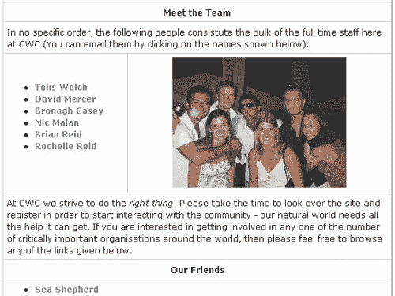

    *   In this case, I have not decolorized the bnmv.jpg image as I wanted to preserve its quality for the purposes of the book—however, you should probably aim for image sizes under 10KB.

        将此屏幕截图中显示的文件路径与代码中显示的文件路径进行比较（当文件的下载方法设置为 Public 时，这些文件路径是您所期望的）：

        src=“files/bnmv.jpg”src=“files/packtlogosall.png”

        注意，在代码中，我们只需要给出相对文件路径，而不是完全限定的路径。由于该页面是从 drupal 目录（其中包含文件目录）调用的，因此我们只需要显示从文件开始的文件路径和名称。

    ### 注

    如果您发现没有得到本演示中所示的文件路径，而是得到了类似于 `http://localhost/drupal/system/files?file=PacktLogoSmall.png`的文件路径，那么这是因为您在**下的**设置**菜单项的**文件系统设置**部分将**下载方法**设置为**私有**管理**。

    这意味着文件上传到文档根目录之外的某个地方（这在**文件系统路径**下的同一部分中设置），您需要输入完全限定的文件路径，而不是像我们在这里所做的那样简单地输入相对文件路径。

7.  对于类似于*关于我们*页面的内容，可能最好禁用评论，因为您确实希望这是一个独立的页面，不会受到社区其他人的任何争论。
8.  接下来，确保菜单设置适用于要添加的页面。在这种情况下，我们有以下设置：


就这样！准备好查看页面后，单击**预览**，如果一切正常，请提交。如果有任何错误，您可以轻松地再次编辑它；所以，在你在网站上查看之前，不要为把一切都做好而烦恼。

所以，希望本节能让你感觉到为你的网站创建真正好的页面是多么容易。显然，如果您对 HTML 或 PHP 都不熟悉，您将需要对它们进行一些练习，但以下链接将为您提供一个良好的开端：

*   [http://www.php.net](http://www.php.net)
*   [http://www.phpbuilder.com](http://www.phpbuilder.com)
*   [http://www.htmlgoodies.com](http://www.htmlgoodies.com)
*   [http://www.w3schools.com](http://www.w3schools.com)

既然您知道了如何发布和处理内容，那么学习如何对内容进行分类和组织就很重要了，这样随着时间的推移，堆积在您网站上的信息存档就不会简单地变成一堆未分类的垃圾，而是成为一种直观且易于使用的信息资源。为了实现这一点，我们需要讨论…

# 分类

乍一看，分类和分类法似乎是更多的术语，用于指示您的工作由于某种原因将变得更加复杂。毕竟，建立一个网站设施，允许博客作者写博客，论坛海报发布，管理员管理，或任何其他类型的内容制作人制作内容，并将其保留下来是完全合理的。就我们目前所讨论的内容而言，这是完全可能的，那么*为什么 Drupal 坚持增加学习新概念和术语的负担？*

如果您知道您的站点永远不会收集大量的内容，那么花时间处理分类法等可能不会带来太大的好处，您只需继续，启用您需要的任何内容类型，并允许用户添加他们喜欢的任何内容。但是，我们的目标通常不是在创建网站时保持默默无闻，因此，假设您希望吸引大量用户，您会发现 Drupal 中的内容分类方法使其成为最复杂的内容管理系统之一！

花点时间掌握 Drupal 中的类别和分类法，因为这不仅可以帮助您更好地管理内容，而且还可以通过灵活直观的内容组织方式使您的站点与其他站点区别开来。你还会发现，你可以管理一个几乎可以想象到的任何规模的网站（以防你正在做的事情成为*下一件大事】*，因为内容与术语和类别相关联的方式。

## 什么？为什么？

**分类学**被描述为分类科学。就如何应用于 Drupal 而言，它是一种*方法，通过使用术语之间的几种不同类型的关系来组织内容*。就这么简单！不过，这并不是说它有多有用，但在我们继续之前，我们应该先学习一些术语：

*   **描述符：**用于描述内容的术语（也称为*术语）*
*   **词汇：**一组相关的描述符
*   **范畴：**词汇的同义词
*   **同义词库：**内容分类，描述*与*关系相似
*   **分类法：**将内容分类为层次结构
*   **标记：**将术语（描述符）与内容关联的过程
*   **同义词：**可以被认为是当前描述符的另一个单词

 *查看下图有助于正确理解这些术语之间的相互关系：

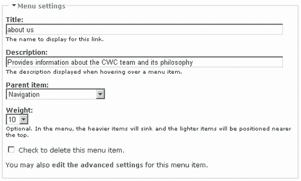

这说明有两种主要的词汇类型。每种类型都由一组描述符组成，但它们之间的关系不同，因为分类法处理的是信息的层次结构，而叙词表处理的是术语之间的关系。描述符（显示为小方框）及其关系（显示为箭头）在您使用哪种类型的词汇表中起着关键作用。

在讨论论坛模块时，我们已经看到了一个分类的示例。在这种情况下，论坛容器和它们包含的论坛主题之间存在层次关系。但是我们需要同义词表做什么呢？好吧，如果你正在创建一个科学文档，你想允许术语之间有大量的引用，这样用户就可以浏览相关的页面，而这些页面不一定有子-父关系，那么你会选择这种类型的结构。

所以我们知道我们可以在 Drupal 中对内容进行分类，但是*为什么这很有用？*Drupal 分类系统功能强大的原因之一是，它允许在创建内容时对内容进行分类。这消除了网站管理员在人力方面的负担，因为不再需要对进入网站的每一点内容进行调整，以便将其放入预先确定的类别中。

也可以多次标记给定节点。这意味着内容可以同时属于多个词汇表。这对于交叉引用非常有用，因为它通过实际节点突出显示描述符或词汇表之间的关系。

## 在 Drupal 中实现分类

讨论如何实现某种形式的分类的最佳方式是将其付诸实施。正如您现在所期望的那样，Drupal 有很多设置和考虑，以便使事情正常运行。让我们假设《禁止化学武器公约》示范网站已经招募了大量专家，他们将在网站上维护自己的博客，以便有兴趣的各方能够根据知情人士的说法关注新闻。

现在，假设有些人会很乐意访问他们选择的博客并阅读那里的任何新帖子，但有些人可能希望能够搜索特定的主题，以查看博客作者之间在某些主题上是否存在关联或分歧。因为一旦网站建立并运行了几个月，就会有很多内容发布，所以我们需要一些方法来确保特定的主题很容易找到，而不管是谁在他们的博客上讨论过。

### 词汇介绍

让我们快速讨论如何在管理工具中处理类别，以确定如何确保满足此要求。如果您点击**管理**下的**类别**链接，您将看到一个列出当前词汇表的页面。假设您在最后几章中创建了一个论坛，您应该有如下内容：


在我们看编辑术语和词汇之前，让我们来看看如何为自己创造词汇。点击**添加词汇**页签，弹出以下页面，我们可以使用该页面手动创建第一个词汇：

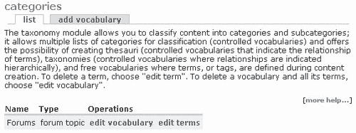

举例来说，这个词汇表将处理狩猎的主题，当用户打算提交博客条目时，有几个友好的注释可以指导他们。这仅适用于博客条目，因为这是启用此词汇表的唯一内容（或节点）类型。您可以根据希望应用此词汇表的内容类型选择任意多或任意少。

再往下看，还有几个其他选项，我们将在稍后详细讨论。点击**提交**将此词汇表添加到列表中，这样主页面现在看起来像：


到目前为止还不错，但就目前情况而言，这对我们没有多大用处！我们需要添加一些术语（描述符），以便开始标记。

### 处理描述符

点击**列表条款**，然后选择**添加条款**页签，弹出如下页面：

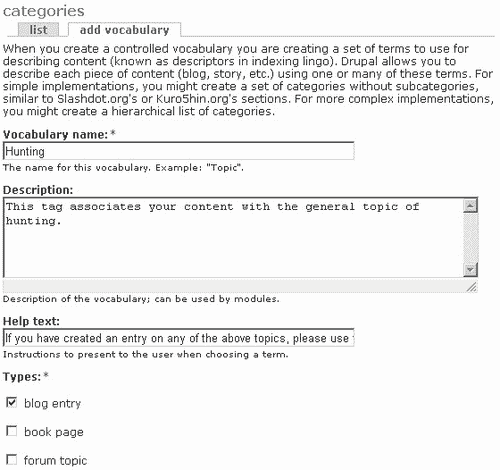

这里添加了术语**陷阱**，并简要介绍了该术语本身，可用于指导贡献者。如果我们愿意，我们可以将术语**诱捕**与**诱捕**联系起来，使其成为同义词。在本例中，术语**诱捕**（或您想要添加的任何其他同义词）被视为术语**诱捕**。编辑术语**陷阱**，使**同义词**选项如下：


同义词目前实际上并没有做任何有用的事情，除非您使用术语表模块，而这里没有介绍它，请下载并试用一下。在此词汇表中添加更多您选择的术语，使您的列表如下所示：


现在是时候通过发布一些博客内容来利用这些术语了。

### 已启用类别的过账内容

使用任何具有添加博客内容所需权限的帐户，尝试向网站发布文章。您现在应该可以查看新插入的**类别**部分，如下所示：


现在是非常非常聪明的一点！发布此博客节点后，用户可以正常查看博客，但现在它的标记描述符显示在标题下方，如下所示：


注意，如果用户将光标悬停在描述符的链接上，将显示一个弹出窗口，其中包含术语的描述。*说到这里，描述符链接带我们去哪里？*如果您点击术语，在本例中为**罐装**，您将被带到一个页面，该页面列出了使用该术语标记的所有内容。这应该会让您对使用 Drupal 感到非常兴奋，因为只需很少的工作，用户现在就可以找到重点内容，而无需费劲地查看—这就是内容管理的全部内容！

### 等级制度

到目前为止，我们所看到的只是事情的开始。正如您所想象的，您可以在词汇表中构建一个完整的术语层次结构，以提供一个相当复杂的分类法。请记住，如果您正在构建一个层次结构，那么最广泛的术语应该位于堆的顶部，而更集中的术语应该位于底部。不过，目前我们并没有真正的*层次结构*，而是更为扁平的*结构。*

*如果我们想要一组更具体的描述符，允许博客作者标记他们的内容（例如，专注于特定类型的陷阱），该怎么办？*答案在于编辑词汇表以选择**层次结构**（在**类别下）**选项，如下所示：

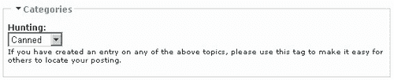

现在，如果我们想在词汇表中添加一个名为**诱捕**的术语，特别是在术语**诱捕**下，我们只需点击**添加术语**选项卡，然后从新的**父**下拉列表中选择相关父项，该列表现在应该可用：


保存此添加项后，术语列表如下所示：

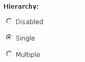

这是相当容易做到的，现在我们可以通过在层次结构中的正确位置添加术语来自由创建所需的复杂结构。您可能希望 Drupal 向您展示层次结构的面包屑轨迹，但遗憾的是，这个功能还不存在。可以手动添加它，但这需要一些 PHP 编码和对源文件的修改，这不在本书的范围之内。如果你喜欢冒险，请看一下[http://www.greenash.net.au/posts/thoughts/basic_breadcrumbs_and_taxonomy](http://www.greenash.net.au/posts/thoughts/basic_breadcrumbs_and_taxonomy) ，它概述了将完整层次结构面包屑包含到内容页面中的过程。

但是，如果您的主题比简单的层次结构稍微复杂一点，会发生什么呢？例如，诱捕也是一种常用的偷猎方法，因此它也应该出现在层次结构中的**偷猎**下。在编辑词汇表时，可通过选择**层次结构**部分下的**多**选项轻松实现。保存此更改后，您可以在**编辑术语**页面的**家长**部分进行选择时，按下**Shift**或**Control**键，编辑您想要归入多个类别的术语，如下所示：

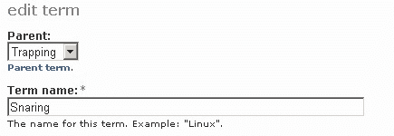

这就考虑了**层次结构**选项如何影响 Drupal 内容的结构。但故事还没有结束。

### 内容结构

*如果在演示站点的例子中，我们有***陷阱***这一术语可用于标记内容（本例中为博客帖子），但有人真的在谈论狩猎以外的内容，并且碰巧存在某种内容重叠，该怎么办？*示例场景可能如下：

*   几位专家签约维护有关非洲大陆的博客。
*   他们使用一个新的**非洲**词汇来标记内容，其中包含**自然、瞪羚、捕食者、湖泊、河流、山脉、狩猎、天气**和**旅游**等术语。
*   您希望能够通过**狩猎**专家博客中的狩猎相关主题交叉引用从非洲博客创建的材料。

为了实现这一目标，有必要创建一个名为**非洲**的新词汇。将此词汇表附加到博客内容类型，然后创建几个描述符，确保其中一个名称为**狩猎**，如下所示：


现在，当用户试图发布内容时，他们会看到两个选项，而不是一个选项来分类他们的内容，并且假设您正确使用了**权重**选项，您可以对标记应用一种层次结构。例如，**非洲**的一位博主关于偷猎的博文可能如下：


一旦这些内容发布到网站上，就可以在内容页面上同时查看这两个类别，而不仅仅是一个类别。换言之，节点已使用多个描述符标记，称为**刻面标记**。基本上，刻面标记使用*自下而上*分类系统，其中内容的刻面或属性由术语描述。通过这种方式，可以创建一种非常直观的内容分类方法，而用户无需了解内容层次结构的自上而下路径，即可找到他们想要的内容。具有讽刺意味的是，在这种情况下，这里使用的特定标记方法也有助于阐明术语的层次结构。

查看网站上的这篇帖子可以确认，用户现在可以通过点击帖子中提供的链接直接进入**狩猎**和**偷猎**类别页面。

然而，在这一切中有一些更微妙的东西。*你能看到吗？*默认情况下，在撰写本文时，Drupal 不向我们提供类别的面包屑线索，因此我们可以通过查看其内容类型来查看层次结构上的任何类别。然而，使用此方法构建层次结构正是这样做的。看看我们刚刚提交的页面上的偷猎帖子：

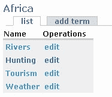

从**狩猎**词汇中我们已经知道它是**偷猎**的母体。然而，仅使用单一词汇，用户无法判断**偷猎**术语属于哪一类。通过这种方式，用户可以通过访问**狩猎**或通过访问**偷猎**来保持在同一级别，从而有效地向上导航。但这也有一个问题。

*如果其中一位狩猎博主只想做一个条目，并用***狩猎***词汇中的***罐装***标记，而不必首先指定该内容也属于***非洲***词汇，会发生什么词汇*答案再次在于编辑词汇表页面，该页面底部包含一个**必填**复选框。如果启用此选项，则海报必须至少选择一个标签，但如果我们不选择该标签，则海报可以选择是否包含该词汇表中的术语。

谈到新的选择，这里还有三个其他的选择，我们应该尽快看一看。撰写本文时，相关术语在标准 Drupal 站点上没有任何作用，不过您可能希望使用*词汇表*模块，该模块利用了此功能。相关术语可以被认为是*词汇层面*的一种交叉引用，而同义词在*术语层面*起作用。**免费标签**是一个有趣的选择，因为它允许海报为其内容决定自己的条款。例如，为**搜索**词汇启用此选项，意味着在创建博客条目时，海报将获得以下类别选项：


请注意，**狩猎**类别上方有一个红色星号上标。这是因为尽管我们使用的是免费标签，**编辑词汇表**页面上的**必需的**选项仍然处于启用状态，因此*中有*项需要输入。其次，有一个所有可用标签的下拉列表（从您键入的字母开始）。这意味着，让人们自由输入自己的标签并不像乍看起来那样随机，因为他们仍然可以通过这个下拉列表了解哪些术语已经可用。通过这种方式，Drupal 可以鼓励更连贯的描述符。

免费标签有一些优点，因为允许免费标签要灵活得多，因为人们真的可以随心所欲地为他们的内容添加标签，使标签系统更适合内容。然而，问题是，你的词汇可能会变得笨拙，因为相似的内容可能会被完全不同的描述符标记，这使得用户很难找到他们想要的内容。如果您允许此选项，那么您应该确保使用此选项的人员了解这样一个事实，即他们应该以尽可能统一的方式明智地标记其内容。

无论如何，如果我们继续我们关于狩猎的帖子，我们可能会得到这样的结果：

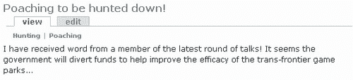

在本例中，我们为这个博客条目输入了四个描述符；因此，当有人访问网站时，他们会看到与此帖子相关的所有四个标签，如下所示：


您应该注意这样一个事实，即不可能使用免费标签系统创建术语层次结构，因为每个新标签都与所有其他标签处于同一级别。所以你最终得到的其实是一个同义词表，而不是一个分类法。

这对于那些将内容用作参考资料的人来说非常有用，因为如果他们点击了一篇文章的描述符名称，该名称仅被标记为**夹**，那么显示与该标记相关的所有文章的页面无疑会显示我们刚刚添加的文章。因此，该人将能够看到**陷阱、熊陷阱**和**杜松子酒陷阱**都是相关主题，并且能够通过在不同的帖子之间跳跃来研究相关材料。

我们在**编辑词汇表**页面上的最后一个选项是**多选**。这与自由标记有关，因为如果启用了自由标记，则可以为每篇文章输入多个描述符，只需用逗号分隔每个描述符即可。然而，如果你想为你的内容提供一个更像叙词表的描述符结构，而不启用免费标记，你只需启用**多选**，这将允许用户使用词汇创建者提供的尽可能多的描述符标记他们的文章。实际上，这是一个折衷方案，允许标记具有一定的灵活性，同时保留对内容标记方式的控制。

在启用**多选**和禁用**自由标记**的情况下，您将按照之前在层次结构部分选择多个父项的方式选择要标记帖子的术语：

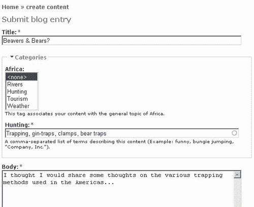

至此，我们结束了关于分类的讨论。正如我们第一次开始研究这一部分时提到的，可能需要一段时间才能掌握诀窍，因为在 Drupal 中分类的工作方式是非典型的，而且不明显是直观的。然而，一旦你掌握了它，你会发现你的内容很容易访问，而且组织得很好，几乎不费吹灰之力。

# 总结

有了这一章，你将有希望很好地理解在创建一个功能齐全、以内容为中心的网站时所面临的任务。如果您还不熟悉 HTML 和 PHP，那么我建议您在继续下一章之前花一些时间学习一下 HTML。也就是说，您已经了解了如何创建输入格式，以允许不同类型的 HTML 或 PHP 内容进入您的帖子，以及如何创建一个相当不错的基于 HTML 的动态网页。

虽然这对于创建一个美观的网站来说当然很重要，但内容管理课程的真正细节是关于分类的讨论。Drupal 的分类系统将它与其他 CMS 技术区分开来，并提供了灵活性和能力来实现我们可以想象的内容的几乎任何类型的结构。只要点击一个按钮，就可以使用免费标签等强大功能，您可以坐在周围最好的系统之一的控制下。

但是，仅仅因为它是有用的并不能使它变得容易，毫无疑问，您需要花一些时间将这里讨论的内容付诸实践。一旦你确信你已经按照网站的预期需求设置了东西，你也应该能够以最小的麻烦进行任何可能需要的修改。

有了大量的艰苦工作，我们可以把注意力转移到创建 Drupal 站点中最有创意、最有趣的部分。下一章将讨论主题，以及如何为新站点创建独特而吸引人的外观。*