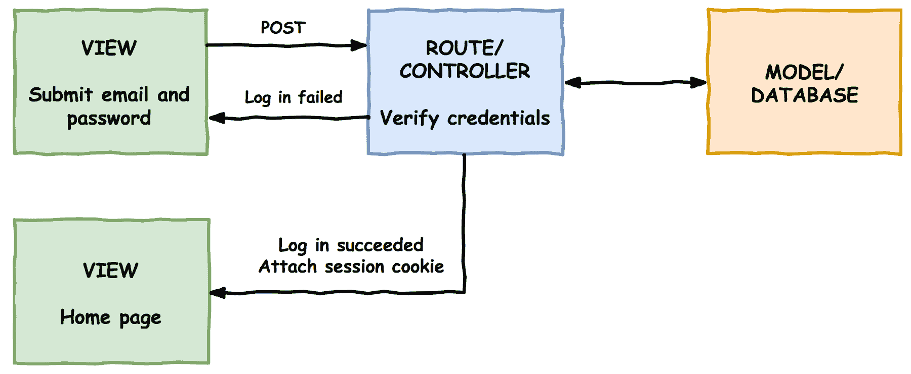

# 九、使用 Passport 添加用户登录和应用编程接口验证

在最后一章中，我们允许用户保存他们最喜欢的 Vuebnb 列表。这项功能只在前端应用中实现，所以如果用户重新加载页面，他们的选择将会丢失。

在本章中，我们将创建一个用户登录系统，并将保存的项目保存到数据库中，以便在页面刷新后可以检索它们。

本章涵盖的主题:

*   利用 Laravel 的内置身份验证功能设置用户登录系统
*   创建具有 CSRF 保护的登录表单
*   在存储中使用 Vuex 操作进行异步操作
*   应用编程接口认证的 OAuth 协议简介
*   设置 Laravel Passport 以允许经过身份验证的 AJAX 请求

# 用户模型

为了将列表项保存到数据库中，我们首先需要一个用户模型，因为我们希望每个用户都有自己唯一的列表。添加用户模型意味着我们还需要一个身份验证系统，以便用户可以登录和注销。幸运的是，Laravel 提供了一个开箱即用的全功能用户模型和认证系统。

现在让我们看一下用户模型样板文件，看看需要做哪些修改来适应我们的目的。

# 移民

首先看一下数据库迁移，用户表模式已经包括了 ID、名称、电子邮件和密码列。

`database/migrations/2014_10_12_000000_create_users_table.php`:

```php
<?php

use Illuminate\Support\Facades\Schema;
use Illuminate\Database\Schema\Blueprint;
use Illuminate\Database\Migrations\Migration;

class CreateUsersTable extends Migration
{
  public function up()
  {
    Schema::create('users', function (Blueprint $table) {
      $table->increments('id');
      $table->string('name');
      $table->string('email')->unique();
      $table->string('password');
      $table->rememberToken();
      $table->timestamps();
    });
  }

  public function down()
  {
    Schema::dropIfExists('users');
  }
}
```

如果我们添加一个额外的列来存储保存的列表标识，这个模式将足以满足我们的需求。理想情况下，我们将这些存储在一个数组中，但是由于关系数据库没有数组列类型，我们将它们存储为一个序列化的字符串，例如，`text`列中的[1，5，10]。

`database/migrations/2014_10_12_000000_create_users_table.php`:

```php
Schema::create('users', function (Blueprint $table) {
  ...
  $table->text('saved');
});
```

# 模型

现在我们来看看 Laravel 提供的`User`模型类。

`app/User.php`:

```php
<?php

namespace App;

use Illuminate\Notifications\Notifiable;
use Illuminate\Foundation\Auth\User as Authenticatable;

class User extends Authenticatable
{
  use Notifiable;

  protected $fillable = [
    'name', 'email', 'password',
  ];

  protected $hidden = [
    'password', 'remember_token',
  ];
}
```

默认配置没问题，但是让我们通过将`saved`属性添加到`$fillable`数组来允许其批量分配。

当我们阅读或编写`saved`文本时，我们也会让我们的模型对其进行序列化和反序列化。为此，我们可以给模型添加一个`$casts`属性，并将`saved`转换为一个数组。

`app/User.php`:

```php
class User extends Authenticatable
{
  ...

  protected $fillable = [
    'name', 'email', 'password', 'saved'
  ];

  ...

  protected $casts = [
    'saved' => 'array'
  ];
}
```

现在我们可以将`saved`属性视为一个数组，即使它在数据库中存储为字符串:

```php
echo gettype($user->saved());

// array
```

# 播种机

在一个普通的有登录系统的网络应用中，你会有一个注册页面，这样用户就可以创建他们自己的帐户。为了确保这本书不会太长，我们将跳过该功能，而是使用数据库播种器生成用户帐户:

```php
$ php artisan make:seeder UsersTableSeeder
```

You can implement a registration page for Vuebnb yourself if you want. The Laravel documentation covers it quite thoroughly at [https://laravel.com/docs/5.5/authentication](https://laravel.com/docs/5.5/authentication).

让我们用名称、电子邮件、密码和一系列保存的列表创建至少一个帐户。请注意，我使用了`Hash`外观的`make`方法来散列密码，而不是将其存储为纯文本。Laravel 的默认设置`LoginController`将在登录过程中根据哈希自动验证纯文本密码。

`database/seeds/UsersTableSeeder.php`:

```php
<?php

use Illuminate\Database\Seeder;
use App\User;
use Illuminate\Support\Facades\Hash;

class UsersTableSeeder extends Seeder
{
  public function run()
  {
    User::create([
      'name'      => 'Jane Doe',
      'email'     => 'test@gmail.com',
      'password'  => Hash::make('test'),
      'saved'     => [1,5,7,9]
    ]);
  }
}
```

要运行播种机，我们需要从主`DatabaseSeeder`类调用它。

`database/seeds/DatabaseSeeder.php`:

```php
<?php

use Illuminate\Database\Seeder;

class DatabaseSeeder extends Seeder
{
  public function run()
  {
    $this->call(ListingsTableSeeder::class);
    $this->call(UsersTableSeeder::class);
  }
}
```

现在，让我们重新运行我们的迁移和播种程序，使用以下命令安装用户表和数据:

```php
$ php artisan migrate:refresh --seed
```

为了确认我们的用户表和数据创建正确，我们将使用 Tinker 来查询该表。您应该会得到类似如下的输出:

```php
$ php artisan tinker
 >>> DB::table('users')->get();

/*
{
  "id": 1,
  "name": "Jane Doe",
  "email": "test@gmail.com",
  "password": "...",
  "remember_token": null,
  "created_at": "2017-10-27 02:30:31",
  "updated_at": "2017-10-27 02:30:31",
  "saved": "[1,5,7,9]"
}
*/
```

# 登录系统

现在我们已经创建了用户模型，我们可以实现登录系统的其余部分。同样，Laravel 将此作为开箱即用的功能，因此只有少量配置可供我们使用。

以下是登录系统工作原理的概述:

1.  用户在登录表单中提供他们的电子邮件和密码。我们将使用 Vue 创建这个表单
2.  表格提交至`/login`开机自检路线
3.  然后`LoginController`将根据数据库验证用户的凭证

4.  如果登录成功，用户将被重定向到主页。会话 cookie 附加到响应中，然后传递给所有传出请求以验证用户

为了更加清楚，下面是登录系统的图示:



Figure 9.1\. Login flow

# 登录页面组件

我们的应用需要一个登录页面，所以让我们创建一个新的页面组件:

```php
$ touch resources/img/components/LoginPage.vue
```

我们将首先定义模板标记，它包括一个带有电子邮件和密码字段的表单，以及一个提交按钮。表单使用 HTTP POST 方法，发送到`/login`路径。我已经用`.form-controller`类将表单元素包装在一个`div`中，以帮助进行造型。

`resources/img/components/LoginPage.vue`:

```php
<template>
  <div id="login" class="login-container">
    <form role="form" method="POST" action="/login">
      <div class="form-control">
        <input id="email" type="email" name="email" 
          placeholder="Email Address" required autofocus>
      </div>
      <div class="form-control">
        <input id="password" type="password" name="password" 
          placeholder="Password" required>
      </div>
      <div class="form-control">
        <button type="submit">Log in</button>
      </div>
    </form>
  </div>
</template>
```

我们现在还不需要任何 JavaScript 功能，所以让我们现在添加我们的 CSS 规则。

`resources/img/components/LoginPage.vue`:

```php
<template>...</template>
<style>
  #login form {
    padding-top: 40px;
  }

  @media (min-width: 744px) {
    #login form {
      padding-top: 80px;
    }
  }

  #login .form-control {
    margin-bottom: 1em;
  }

  #login input[type=email],
  #login input[type=password],
  #login button,
  #login label {
    width: 100%;
    font-size: 19px !important;
    line-height: 24px;
    color: #484848;
    font-weight: 300;
  }

  #login input {
    background-color: transparent;
    padding: 11px;
    border: 1px solid #dbdbdb;
    border-radius: 2px;
    box-sizing:border-box
  }

  #login button {
    background-color: #4fc08d;
    color: #ffffff;
    cursor: pointer;
    border: #4fc08d;
    border-radius: 4px;
    padding-top: 12px;
    padding-bottom: 12px;
  }
</style>
```

我们将添加一个`login-container`类到我们的全局 CSS 文件中，这样这个页面的页脚就可以正确对齐了。我们还将添加一个 CSS 规则，以确保文本输入在 iPhone 上正确显示。登录页面将是我们进行文本输入的唯一地方，但是让我们将其作为一个全局规则添加，以防您决定以后添加其他表单。

`resources/img/css/style.css`:

```php
...

.login-container {
  margin: 0 auto;
  padding: 0 12px;
}

@media (min-width: 374px) {
  .login-container {
    width: 350px;
  }
}

input[type=text] {
  -webkit-appearance: none;
}
```

最后，让我们将这个新的页面组件添加到我们的路由中。我们将首先导入组件，然后将其添加到路由配置中的`routes`数组中。

请注意，登录页面不像 Vuebnb 的其他页面那样需要来自服务器的任何数据。这意味着我们可以通过修改导航守卫中第一个`if`语句的逻辑来跳过数据获取步骤。如果路线的名称是`login`，现在应该可以直接解析了。

`resources/img/js/router.js`:

```php
...

import LoginPage from '../components/LoginPage.vue';

let router = new VueRouter({
  ...
  routes: [
    ...
    { path: '/login', component: LoginPage, name: 'login' }
  ],
  ...
});

router.beforeEach((to, from, next) => {
  ...
  if (
    to.name === 'listing'
      ? store.getters.getListing(to.params.listing)
      : store.state.listing_summaries.length > 0
    || to.name === 'login'
  ) {
    next();
  }
  ...
});

export default router;
```

# 服务器路由

现在我们已经在`/login`路由处添加了一个登录页面，我们将需要创建一个匹配的服务器端路由。我们还需要一个发布到相同`/login`路径的登录表单的路径。

事实上，这两条路由都是由 Laravel 作为其默认登录系统的一部分开箱即用地提供的。我们所要做的就是在我们的网络路由文件的底部添加下面一行。

`routes/web.php`:

```php
...

Auth::routes();
```

要查看这段代码的效果，我们可以使用 Artisan 在我们的应用中显示路线列表:

```php
$ php artisan route:list 
```

输出:


Figure 9.2\. Terminal output showing routes list

您将看到我们手动创建的所有路线，以及一些我们没有创建的路线，例如*登录*、*注销*、*注册*。这些是我们刚刚激活的 Laravel 认证系统使用的路由。

查看 GET/HEAD `/login`路线，你会看到它指向`LoginController`控制器。让我们看看那个文件。

`App\Http\Controllers\Auth\LoginController.php`:

```php
<?php

namespace App\Http\Controllers\Auth;

use App\Http\Controllers\Controller;
use Illuminate\Foundation\Auth\AuthenticatesUsers;

class LoginController extends Controller
{
  use AuthenticatesUsers;

  protected $redirectTo = '/home';

  public function __construct()
  {
    $this->middleware('guest')->except('logout');
  }
}
```

这个类使用一个`AuthenticatesUsers`特性来定义`/login`路线处理程序引用的`showLoginForm`方法。让我们覆盖这个方法，让它简单地返回我们的应用视图。由于视图的这个实例不需要在头部内联任何数据(登录表单没有状态)，我们将向`data`模板变量传递一个空数组。

`App\Http\Controllers\Auth\LoginController.php`:

```php
class LoginController extends Controller
{
  ...

  public function showLoginForm()
  {
    return view('app', ['data' => []]);
  }
}
```

完成后，我们现在可以通过将浏览器导航到`/login`来查看完整的登录页面:


Figure 9.3\. Login page

# CSRF 保护

CSRF(跨站点请求伪造)是一种恶意利用漏洞的类型，攻击者让用户在不知情的情况下对他们当前登录的服务器执行操作。此操作将改变服务器上对攻击者有利的一些内容，例如，转账、将密码更改为攻击者知道的密码等。

例如，攻击者可能会在网页或电子邮件中隐藏一个脚本，并以某种方式将用户引向该脚本。执行时，该脚本可以向`importantwebsite.com/updateEmailAndPassword`发出开机自检请求。如果用户登录到此网站，请求可能会成功。

防止这种攻击的一种方法是以用户可能提交的任何形式嵌入一个特殊的令牌，本质上是一个随机字符串。提交表单时，将根据用户会话检查令牌，以确保其匹配。攻击者无法在他们的脚本中伪造这个令牌，因此应该被这个特性所挫败。

在 Laravel 中，CSRF 令牌的创建和验证由`VerifyCsrfToken`中间件管理，默认情况下，该中间件被添加到网络路由中:


Figure 9.4\. CSRF prevention process

要在表单中包含 CSRF 令牌，只需在`form`标签中添加`{{ csrf_field() }}`。这将生成一个包含有效 CSRF 令牌的隐藏输入字段，例如:

```php
<input type="hidden" name="_token" value="3B08L3fj...">
```

然而，这在我们的场景中是行不通的，因为我们的表单不在 Blade 视图中，而是在一个不会被 Blade 处理的单文件组件中。或者，我们可以将 CSRF 令牌添加到页面的头部，并将其分配给`window`对象。

`resources/views/app.blade.php`:

```php
<script type="text/javascript">
  window.vuebnb_server_data = "{!! addslashes(json_encode($data)) !!}"
  window.csrf_token = "{{ csrf_token() }}"
</script>
```

我们现在可以从我们的 Vue.js 应用中检索它，并手动将其添加到登录表单中。让我们修改`LoginPage`以在表单中包含一个隐藏的`input`字段。我们现在将向该组件添加一些状态，其中令牌作为数据属性包含在内，并绑定到隐藏字段。

`resources/img/js/components/LoginPage.vue`:

```php
<template>
  <div id="login" class="login-container">
    <form role="form" method="POST" action="/login">
      <input type="hidden" name="_token" :value="csrf_token">
      ...
    </form>
  </div>
</template>
<script>
  export default {
    data() {
      return {
        csrf_token: window.csrf_token
      }
    }
  }
</script>
<style>...</style>
```

如果我们现在尝试使用我们在播种器中创建的用户的凭据登录我们的应用，我们将获得这个错误页面。在地址栏中，您会看到我们所在的路线是`/home`，这在我们的应用中不是有效的路线，因此出现了`NotFoundHttpException`:


Figure 9.5\. Invalid route

# 登录后重定向

当用户登录时，Laravel 会将他们重定向到登录控制器中`$redirectTo`属性定义的页面。让我们把这个从`/home`改成`/`。

`app/Http/Auth/Controllers/LoginController.php`:

```php
class LoginController extends Controller
{
  ...

  protected $redirectTo = '/';

  ...
}
```

让我们也更新`RedirectIfAuthenticated`中间件类，这样如果一个登录用户试图查看登录页面，他们将被重定向到`/`(而不是默认的`/home`值。)

`app/Http/Middleware/RedirectIfAuthenticated.php`:

```php
...

if (Auth::guard($guard)->check()) {
  return redirect('/');
}
```

完成后，我们的登录过程现在可以正常工作了。

# 向工具栏添加身份验证链接

现在让我们在工具栏中添加登录和注销链接，这样 Vuebnb 用户就可以轻松访问这些功能。

登录链接只是一个指向`login`路线的`RouterLink`。

注销链接更有趣一点:我们从这个链接捕获点击事件，并触发一个隐藏表单的提交。该表单向`/logout`服务器路由发送 POST 请求，服务器路由将用户注销并重定向回主页。请注意，我们必须包含 CSRF 令牌作为隐藏输入，这样才能工作。

`resources/img/components/App.vue`:

```php
<template>
  ...
  <ul class="links">
    <li>
      <router-link :to="{ name: 'saved' }">
        Saved
      </router-link>
    </li>
    <li>
      <router-link :to="{ name: 'login' }">
        Log In
      </router-link>
    </li>
    <li>
      <a @click="logout">Log Out</a>
      <form 
        style="display: hidden" 
        action="/logout" 
        method="POST" 
        id="logout"
      >
        <input type="hidden" name="_token" :value="csrf_token"/>
      </form>
    </li>
  </ul>
  ...
</template>
<script>
  ...

  export default {
    components: { ... },
    data() {
      return {
        csrf_token: window.csrf_token
      }
    },
    methods: {
      logout() {
        document.getElementById('logout').submit();
      }
    }
  }
</script>
```

# 保护保存的路线

我们现在可以使用我们的登录系统来保护某些路由免受来宾(即未经身份验证的用户)的攻击。Laravel 提供了`auth`中间件，可以应用于任何路由，如果访客用户试图访问登录页面，它会将访客用户重定向到登录页面。让我们将此应用于保存的页面路由。

`routes/web.php`:

```php
Route::get('/saved', 'ListingController@get_home_web')->middleware('auth');
```

如果您退出应用，并尝试从浏览器的导航栏访问该路线，您会发现它会将您重定向回`/login`。

# 将身份验证状态传递给前端

我们现在有了一个完整的机制来让用户登录和退出 Vuebnb。但是，前端应用还不知道用户的身份验证状态。现在让我们补救一下，这样我们就可以向前端添加基于身份验证的功能。

# auth meta 属性

我们首先将身份验证状态添加到我们在每个页面头部传递的元信息中。我们将使用`Auth`门面`check`方法，如果用户通过验证，该方法将返回`true`，并将其分配给一个新的`auth`属性。

`app/Http/Controllers/ListingController.php`:

```php
...
use Illuminate\Support\Facades\Auth;

class ListingController extends Controller
{
  ...

  private function add_meta_data($collection, $request)
  {
    return $collection->merge([
      'path' => $request->getPathInfo(),
      'auth' => Auth::check()
    ]);
  }
}
```

我们还将向我们的 Vuex 商店添加一个`auth`属性。我们将从`addData`方法中对其进行变异，正如您将从上一章中回忆的那样，这是我们从文档头或应用编程接口中检索数据的地方。由于应用编程接口不包括元数据，我们将有条件地变异`auth`属性，以避免访问潜在的未定义对象属性。

`resources/img/js/store.js`:

```php
...

export default new Vuex.Store({
  state: {
    ...
    auth: false
  },
  mutations: {
    ...
    addData(state, { route, data }) {
      if (data.auth) {
        state.auth = data.auth;
      }
      if (route === 'listing') {
        state.listings.push(data.listing);
      } else {
        state.listing_summaries = data.listings;
      }
    }
  },
  getters: { ... }
});
```

完成后，Vuex 现在正在跟踪用户的身份验证状态。请务必通过登录和注销并注意 Vue 开发工具的 Vuex 选项卡中`auth`的值来测试这一点:


Figure 9.6\. Value of auth in Vue Devtools

# 响应已验证状态

现在我们正在跟踪用户的身份验证状态，我们可以让 Vuebnb 对此做出响应。首先，让我们让用户无法保存列表，除非他们已经登录。为此，我们将修改`toggleSaved` mutator 方法的行为，这样，如果用户登录，他们可以保存一个项目，但如果没有，他们将通过 Vue Router 的`push`方法重定向到登录页面。

请注意，我们必须在文件顶部导入路由模块才能访问其功能。

`resources/img/js/store.js`:

```php
...
import router from './router';

export default new Vuex.Store({
  ...
  mutations: {
    toggleSaved(state, id) {
      if (state.auth) {
        let index = state.saved.findIndex(saved => saved === id);
        if (index === -1) {
          state.saved.push(id);
        } else {
          state.saved.splice(index, 1);
        }
      } else {
        router.push('/login');
      }
    },
    ...    
  },
  ...
});
```

我们还将使登录链接或注销链接显示在工具栏中，而不是两者都显示。这可以通过使用工具栏中依赖于`$store.state.auth`值的`v-if`和`v-else`指令来实现。

除非用户登录，否则隐藏保存的页面链接也是有意义的，所以让我们也这样做。

`resources/img/components/App.vue`:

```php
<ul class="links">
  <li v-if="$store.state.auth">
    <router-link :to="{ name: 'saved' }">
      Saved
    </router-link>
  </li>
  <li v-if="$store.state.auth">
    <a @click="logout">Log Out</a>
    <form 
      style="display: hidden" 
      action="/logout"
      method="POST" 
      id="logout"
    >
      <input type="hidden" name="_token" :value="csrf_token"/>
    </form>
  </li>
  <li v-else>
    <router-link :to="{ name: 'login' }">
      Log In
    </router-link>
  </li>
</ul>

```

这是工具栏现在的外观，取决于用户是登录还是注销:


Figure 9.8\. Comparison of the logged in and logged out state in toolbar

# 从数据库中检索保存的项目

现在让我们从数据库中检索保存的项目，并在前端显示它们。首先，我们将向文档头中的元数据添加一个新的`saved`属性。如果用户注销，这将是一个空数组，如果用户登录，这将是与该用户相关联的已保存列表标识的数组。

`app/Http/Controllers/ListingController.php`:

```php
private function add_meta_data($collection, $request)
{
  return $collection->merge([
    'path' => $request->getPathInfo(), 
    'auth' => Auth::check(), 
    'saved' => Auth::check() ? Auth::user()->saved : []
  ]);
}
```

回到前端，我们将把检索保存项目的逻辑放在`beforeEach`路由导航守卫中。我们将它放在这里而不是放在`addData`突变中的原因是，我们不想直接将数据分配给商店状态，而是为每个列表调用`toggleSaved`突变。你不能从另一个突变中进行突变，所以这必须在店外进行。

`resources/img/js/router.js`:

```php
router.beforeEach((to, from, next) => {
  let serverData = JSON.parse(window.vuebnb_server_data);
  if ( ... ) { ... }
  else if ( ... ) { ... }
  else {
    store.commit('addData', {route: to.name, data: serverData});
    serverData.saved.forEach(id => store.commit('toggleSaved', id));
    next();
  }
});
```

让我们也删除我们在上一章中添加到`saved`的占位符列表标识，这样存储在初始化时是空的。

`resources/img/js/store.js`:

```php
state: {
  saved: [],
  listing_summaries: [],
  listings: [],
  auth: false
}
```

完成后，如果我们使用 Vue Devtools 进行检查，我们会发现数据库中保存的列表现在与前端中的列表相匹配:

```php
$ php artisan tinker
>>> DB::table('users')->select('saved')->first();
# "saved": "[1,5,7,9]"
```


Figure 9.8\. Vuex tab of Vue Devtools shows saved listings match database

# 持续保存的列表

保存保存的列表的机制如下:当一个列表在前端应用中切换时，我们触发一个 AJAX 请求，该请求将标识发布到后端的一个路由上。此路由调用将更新模型的控制器:


Figure 9.9\. Persisting saved listings

现在让我们实现这个机制。

# 创建应用编程接口路由

我们将从服务器端开始，并为前端添加一条路由来发布列表标识。我们将需要添加`auth`中间件，以便只有经过身份验证的用户才能访问该路由(我们稍后将讨论`:api`的含义)。

`routes/api.php`:

```php
...

Route::post('/user/toggle_saved', 'UserController@toggle_saved')
  ->middleware('auth:api')
;
```

由于这是一个 API 路由，它的完整路径将是`/api/user/toggle_saved`。我们还没有创建此路由调用的控制器`UserController`，所以现在让我们这样做:

```php
$ php artisan make:controller UserController
```

在这个新的控制器中，我们将添加`toggled_saved`处理方法。因为这是一个 HTTP POST 路由，所以这个方法可以访问表单数据。我们将使这个路由的前端 AJAX 调用包含一个`id`字段，这将是我们想要切换的列表标识。要访问该字段，我们可以使用`Input`外观，即`Input::get('id');`。

由于我们在这条路线上使用`auth`中间件，我们可以通过使用`Auth::user()`方法检索与请求相关联的用户模型。然后，我们可以从用户的`saved`列表中添加或删除该 ID，就像我们在 Vuex 商店的`toggledSaved`方法中所做的那样。

一旦标识被切换，我们就可以使用模型的`save`方法将更新保存到数据库中。

`app/Http/Controllers/UserController.php`:

```php
<?php

...

use Illuminate\Support\Facades\Auth;
use Illuminate\Support\Facades\Input;

class UserController extends Controller
{
  public function toggle_saved()
  {
    $id = Input::get('id');
    $user = Auth::user();
    $saved = $user->saved;
    $key = array_search($id, $saved);
    if ($key === FALSE) {
        array_push($saved, $id);
    } else {
        array_splice($saved, $key, 1);
    }
    $user->saved = $saved;
    $user->save();
    return response()->json();
  }
}
```

# Vuex 动作

在[第 8 章](08.html)、*用 Vuex* 管理您的应用状态中，我们讨论了 Flux 模式的关键原则，包括突变必须同步以避免使我们的应用数据不可预测的竞争条件的原则。

如果您需要在一个 mutator 方法中包含异步代码，您应该创建一个*动作*。行动就像突变，但它们不是使状态突变，而是实施突变。例如:

```php
var store = new Vuex.Store({
  state: {
    val: null  
  },
  mutations: {
    assignVal(state, payload) {
      state.val = payload;
    }  
  },
  actions: {
    setTimeout(() => {
      commit('assignVal', 10);
    }, 1000)
  }
});

store.dispatch('assignVal', 10);
```

通过将异步代码抽象成动作，我们仍然可以将任何改变状态的逻辑集中在存储中，而不会通过竞争条件污染我们的应用数据。

# AJAX 请求

现在让我们使用 AJAX 在保存列表时向`/api/user/toggle_saved`发出请求。我们将把这个逻辑放入一个 Vuex 动作中，以便在 AJAX 调用解决之前不提交`toggleSaved`变异。我们将把 Axios HTTP 库导入到商店中，以促进这一点。

此外，让我们将身份验证检查从突变转移到操作，因为在 AJAX 调用启动之前进行这种检查是有意义的。

`resources/img/js/store.js`:

```php
import axios from 'axios';

export default new Vuex.Store({
  ...
  mutations: {
    toggleSaved(state, id) {
      let index = state.saved.findIndex(saved => saved === id);
      if (index === -1) {
        state.saved.push(id);
      } else {
        state.saved.splice(index, 1);
      }
    },
    ...
  },
  ...
  actions: {
    toggleSaved({ commit, state }, id) {
      if (state.auth) {
        axios.post('/api/user/toggle_saved', { id }).then(
          () => commit('toggleSaved', id)
        );
      } else {
        router.push('/login');
      }
    }
  }
});
```

我们现在需要从我们的`ListingSave`组件中调用`toggledSaved`动作，而不是突变。调用动作的方式与突变完全相同，只是术语从`commit`变为`dispatch`。

`resources/img/components/ListingSave.vue`:

```php
toggleSaved() {
  this.$store.dispatch('toggleSaved', this.id);
}
```

这个功能在前端的代码是正确的，但是如果我们测试它并尝试保存一个项目，我们会从服务器得到一个 *401 未经验证的*错误:


Figure 9.10\. AJAX call results in a 401 Unauthenticated error

# 应用编程接口认证

我们将`auth`中间件添加到我们的`/api/user/toggle_saved`路由中，以保护它免受访客用户的攻击。我们也为这个中间件指定了`api`守护，也就是`auth:api`。

*卫士*定义如何对用户进行身份验证，并在以下文件中进行配置。

`config/auth.php`:

```php
<?php

return [
  ...
  'guards' => [
    'web' => [
      'driver' => 'session',
      'provider' => 'users',
    ],
    'api' => [
      'driver' => 'token',
      'provider' => 'users',
    ],
  ],
  ...
];
```

我们的网络路由使用*会话*驱动程序，该驱动程序使用会话 cookies 来维护身份验证状态。会话驱动程序随 Laravel 一起提供，开箱即用。不过，默认情况下，API 路由使用*令牌*守卫。我们还没有实现这个驱动程序，因此我们的 AJAX 调用是未经授权的。

我们也可以将会话驱动程序用于 API 路由，但是不建议这样做，因为会话身份验证对于 AJAX 请求来说是不够的。相反，我们将使用`passport`守卫，它实现了 OAuth 协议。

You may see `auth` used as a shorthand for `auth:web`, as the web guard is the default.

# OAuth

OAuth 是一种授权协议，允许第三方应用在不暴露用户密码的情况下访问服务器上的用户数据。一旦应用和用户在服务器上表明了自己的身份，就授予应用一个特殊的令牌，作为交换，用户可以访问这些受保护的数据。OAuth 的一个典型用例是*社交登录*，例如，当你使用脸书或谷歌登录你自己的网站时，。

发出安全 AJAX 请求的一个挑战是，您不能在前端源代码中存储任何凭据，因为攻击者很难找到这些凭据。OAuth 的一个简单实现，其中第三方应用实际上是您自己的前端应用，是解决这个问题的好方法。这是我们现在对 Vuebnb 采取的方法。

While OAuth is a great solution for API authentication, it is also quite an in-depth topic that I can't fully cover in this book. I recommend you read this guide to get a better understanding: [https://www.oauth.com/](https://www.oauth.com/).

# 拉弗尔护照

Laravel Passport 是 OAuth 的一个实现，可以在 Laravel 应用中轻松设置。现在让我们安装它，以便在 Vuebnb 中使用。

首先，使用 Composer 安装 Passport:

```php
$ composer require laravel/passport
```

Passport 包括新的数据库迁移，生成存储 OAuth 令牌所需的表。让我们运行迁移:

```php
$ php artisan migrate
```

以下命令将安装生成安全令牌所需的加密密钥:

```php
$ php artisan passport:install
```

运行该命令后，将`Laravel\Passport\HasApiTokens`特征添加到用户模型中。

`app/User.php`:

```php
<?php

...

use Laravel\Passport\HasApiTokens;

class User extends Authenticatable
{
  use HasApiTokens, Notifiable;

  ...
}
```

最后，在`config/auth.php`配置文件中，我们将 API guard 的驱动选项设置为`passport`。这确保了`auth`中间件将使用 Passport 作为 API 路由的守卫。

`config/auth.php`:

```php
'guards' => [
  'web' => [
    'driver' => 'session',
    'provider' => 'users',
  ],

  'api' => [
    'driver' => 'passport',
    'provider' => 'users',
  ],
],
```

# 附加令牌

OAuth 要求在用户登录时向前端应用发送访问令牌。Passport 包含一个中间件，可以为您处理这种情况。将`CreateFreshApiToken`中间件添加到网络中间件组中，并且`laravel_token` cookie 将被附加到传出响应中。

`app/Http/Kernel.php`:

```php
protected $middlewareGroups = [
  'web' => [
    ...
    \Laravel\Passport\Http\Middleware\CreateFreshApiToken::class,
  ],
  ...
```

对于传出的请求，我们需要在我们的 AJAX 调用中添加一些头。我们可以这样做，这样 Axios 默认情况下会自动附加这些。`'X-Requested-With': 'XMLHttpRequest'`确保 Laravel 知道请求来自 AJAX，而`'X-CSRF-TOKEN': window.csrf_token`附加 CSRF 令牌。

`resources/img/js/store.js`:

```php
...

axios.defaults.headers.common = {
  'X-Requested-With': 'XMLHttpRequest',
  'X-CSRF-TOKEN': window.csrf_token
};

export default new Vuex.Store({
  ...  
});
```

完成后，我们的 API 请求现在应该被正确地验证了。为了测试这一点，让我们使用 Tinker 来查看我们为第一个种子用户保存了哪些项目:

```php
$ php artisan tinker

>>> DB::table('users')->select('saved')->first();

# "saved": "[1,5,7,9]"
```

确保您以该用户身份登录，并在浏览器中加载 Vuebnb。切换一些已保存的列表选择，然后重新运行上面的查询。您应该会发现数据库现在正在保存已保存的列表标识。

# 摘要

在本章中，我们了解了全栈 Vue/Laravel 应用中的身份验证，包括基于会话的 web 路由身份验证，以及使用 Laravel Passport 的基于令牌的 API 路由身份验证。

我们利用这些知识为 Vuebnb 建立了一个登录系统，并允许保存的房间列表保存到数据库中。

在这一过程中，我们还学习了如何利用 CSRF 令牌来保护表单，以及如何使用 Vuex 操作来向存储中添加异步代码。

在下一章(也是最后一章)中，我们将学习如何通过将 Vuebnb 部署到免费的 Heroku PHP 服务器来将全栈 Vue 和 Laravel 应用部署到生产环境中。我们还将开始从免费的 CDN 提供图像和其他静态内容。