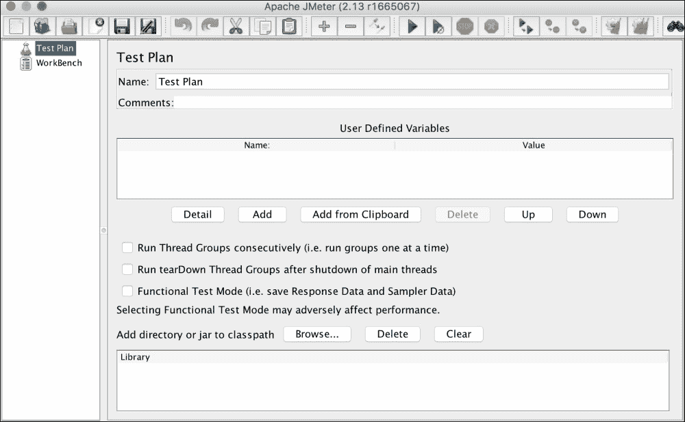
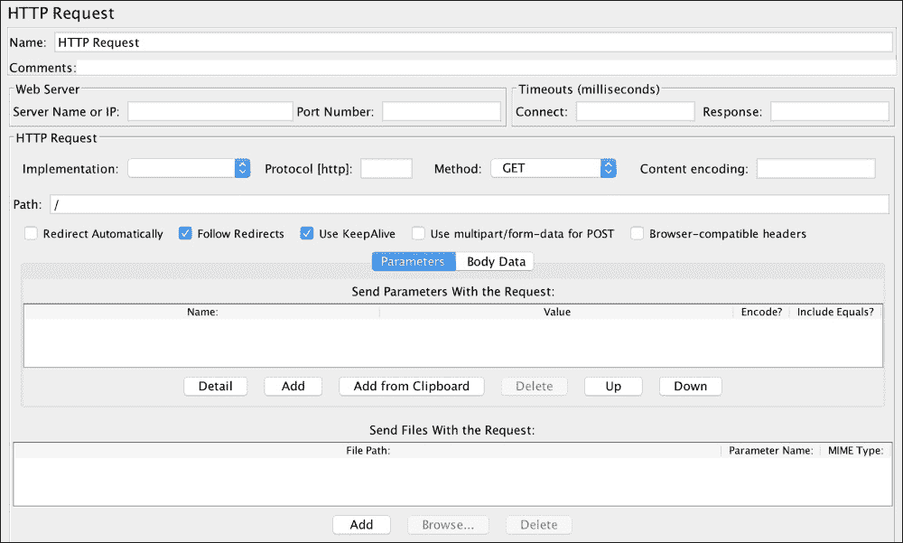
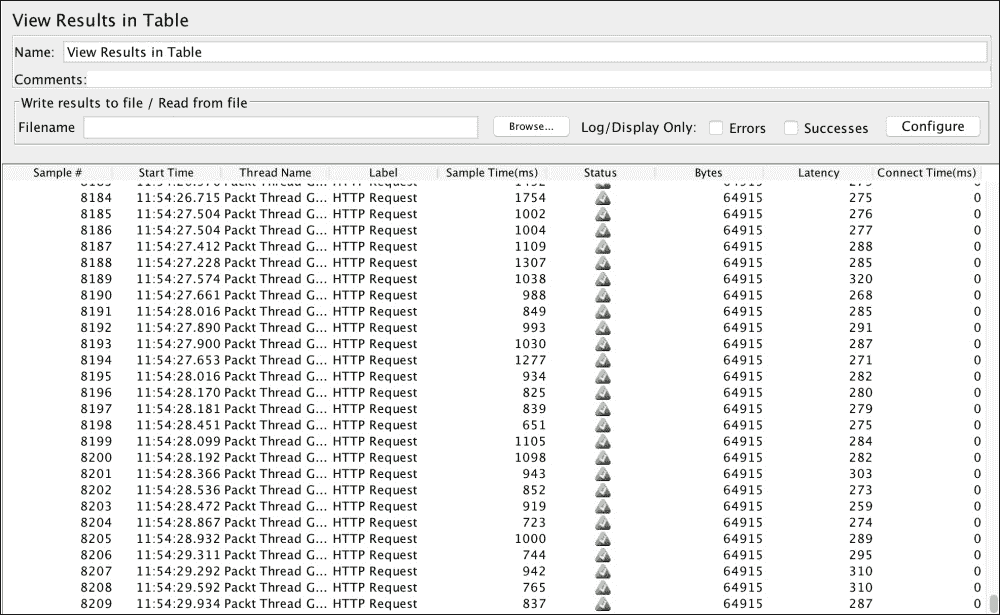
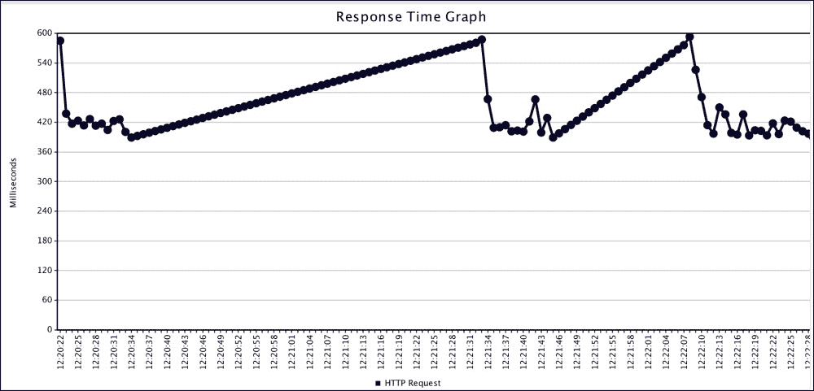
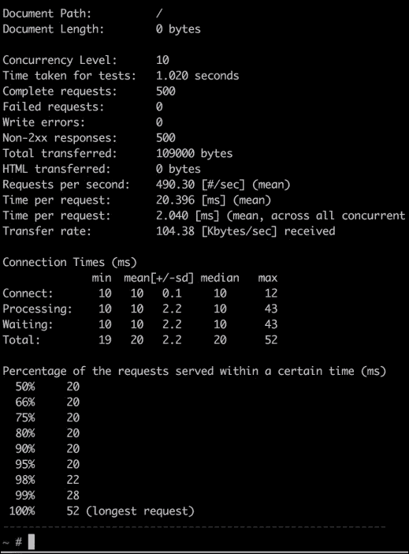
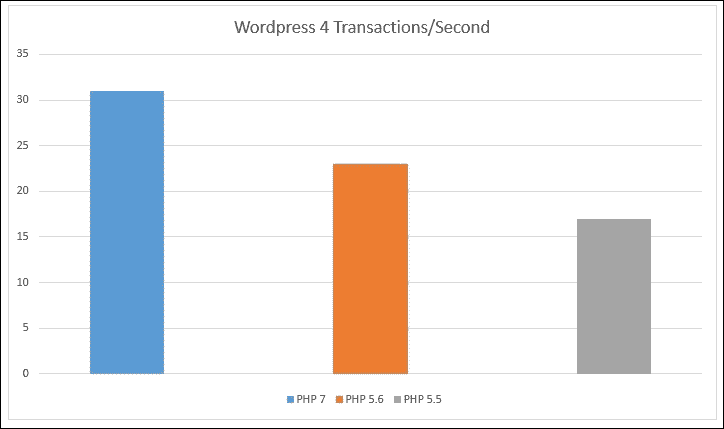

# 六、PHP 应用压力/负载测试

在开发、测试、调试和分析应用之后，是时候将其投入生产了。但是，在投入生产之前，最好对应用进行压力/负载测试。此测试将给出运行应用的服务器在特定时间可以处理多少请求的大致结果。使用这些结果，我们可以优化应用、web 服务器、数据库和缓存工具，以获得更好的结果并处理更多的请求。

在本章中，我们将在 PHP5.6 和 PHP7 上加载测试不同的开源工具，并比较这两个 PHP 版本中这些应用的性能。

我们将讨论以下主题：

*   ApacheJMeter
*   阿帕切班奇（ab）
*   清家
*   在 PHP5.6 和 PHP7 上加载测试 Magento 2
*   在 PHP5.6 和 PHP7 上对 WordPress 进行负载测试
*   在 PHP5.6 和 PHP7 上对 Drupal8 进行负载测试

# 阿帕奇 JMeter

ApacheJMeter 是一个图形化的开源工具，用于负载测试服务器的性能。JMeter 完全是用 Java 编写的，因此它与所有安装了 Java 的操作系统兼容。JMeter 有一整套广泛的工具用于各种负载测试，从静态内容到动态资源和 web 服务。

它的安装很简单。我们需要从 JMeter 网站下载它，然后运行应用。如前所述，它需要在机器上安装 Java。

### 注

JMeter 可以测试 FTP 服务器、邮件服务器、数据库服务器、查询等。在本书中，我们无法涵盖所有这些主题，因此我们将只对 web 服务器进行负载测试。ApacheJMeter 的功能列表可在[中找到 http://jmeter.apache.org/](http://jmeter.apache.org/) 。

当我们首先运行应用时，我们将看到以下窗口：



要运行任何类型的测试，首先需要创建一个测试计划。测试计划包含执行此测试所需的所有组件。默认情况下，JMeter 有一个名为测试计划的测试计划。让我们将其命名为我们自己的计划`Packt Publisher Test Plan`，如以下截图所示：


现在，保存测试计划，我们将创建一个`.jmx`文件。把它保存在适当的地方。

下一步是添加线程组。*线程组定义了测试计划的一些基本属性，这些属性在所有类型的测试*中都是通用的。要添加线程组，右键单击左侧面板中的计划，然后导航到**添加****线程（用户）****线程组**。将显示以下窗口：


线程组具有以下重要属性：

*   **线程数**：虚拟用户数。
*   **爬升周期**：这告诉 JMeter 需要多长时间才能爬升到线程数的最大容量。例如，在前面的屏幕截图中，我们有 40 个线程和 80 秒的启动时间；在这里，JMeter 需要 80 秒才能完全启动 40 个线程，三个线程中的每一个都需要 2 秒才能启动。
*   **循环计数**：这告诉 JMeter 运行这个线程组需要多少时间。
*   **调度程序**：用于调度线程组以后的执行。

现在，我们需要添加 HTTP 请求默认值。右键点击**包线程组**进入**添加****配置元素****HTTP 请求默认值**。将出现类似于以下内容的窗口：


在前面的窗口中，我们只需输入应用的 URL 或 IP 地址。如果 web 服务器使用 Cookie，我们也可以添加 HTTP Cookie 管理器，在该管理器中，我们可以添加包含所有数据的用户定义 Cookie，例如名称、值、域、路径等。

接下来，我们将通过右键单击并导航到**Packt 线程组****添加****采样器****HTTP 请求**，并显示以下窗口：



这里的重要字段是**路径**。我们只想对主页运行测试，因此对于这个 HTTP 请求，我们只需在**路径**字段中添加一个斜杠（`/`。如果我们想测试另一个路径，比如“联系我们”，我们需要添加另一个 HTTP 请求采样器，如前面的屏幕截图所示。然后，在路径中，我们将添加`path/contact-us`。

HTTP 请求采样器也可用于测试表单，通过在**方法**字段中选择 POST 方法，POST 请求可以发送到 URL。此外，还可以模拟文件上载。

下一步是添加一些侦听器。*监听器提供一些强大的视图来显示结果*。结果可以显示在表视图中，不同类型的图形可以保存在文件中。对于这个线程组，我们将添加三个侦听器：在表中查看结果、响应时间图和图形结果。每个侦听器视图显示不同类型的数据。右键点击**Packt 线程组**，然后导航到**添加****监听器**，添加前面的所有监听器。我们将拥有所有可用侦听器的完整列表。逐个添加所有三个侦听器。JMeter 左侧的最终**Packt Publisher 测试计划**面板将类似于以下内容：


现在，点击上方工具栏中的**开始**按钮，即可运行我们的测试计划，如下图所示：


只要我们点击**开始**按钮（指向右侧的绿色箭头），JMeter 就会开始我们的测试计划。现在，如果我们点击左侧面板上表监听器中的**视图结果，我们将在一个表中看到每个请求的数据，如下面的屏幕截图所示：**



前面的屏幕截图显示了一些有趣的数据，例如采样时间、状态、字节和延迟。

**采样时间**是服务器完成请求的毫秒数。**状态**是请求的状态。它可以是成功、警告或错误。**字节**是为请求接收的字节数。**Latency**是 JMeter 从服务器接收初始响应的毫秒数。

现在，如果我们点击**响应时间图**，我们将看到一个可视的响应时间图，与下面的图类似：



现在，如果我们点击**图形结果**，我们将看到响应时间数据以及平均、中值、偏差和吞吐量图，如下图所示：


ApacheJMeter 提供了非常强大的工具，通过模拟用户来负载测试我们的 web 服务器。它可以为我们提供有关导致 web 服务器响应缓慢的负载量的数据，并且使用这些数据，我们可以优化 web 服务器和应用。

# 阿帕切班奇（ab）

ApacheBench（ab）也是由 Apache 提供的，是一个命令行工具。对于命令行爱好者来说，这是一个可爱的工具。默认情况下，此工具通常安装在大多数 Linux 版本上。此外，它是与 Apache 一起安装的，因此如果您安装了 Apache，则可能也会安装 ab。

ab 命令的基本语法如下所示：

```php
ab –n <Number_Requests> -c <Concurrency> <Address>:<Port><Path>

```

让我们讨论前面命令的每一部分的含义：

*   `n`：这是测试请求的数量。
*   `c`：这是并发，是一次同时请求的数量。
*   `Address`：这是 web 服务器的应用 URL 或 IP 地址。
*   `Port`：这是应用运行的端口号。
*   `Path`：这是我们可以用来测试的应用的 web 路径。主页使用斜杠（`/`）。

现在，让我们通过发出以下命令，使用 ab 工具进行测试：

```php
ab –n 500 –c 10 packtpub.com/

```

由于 web 服务器的默认端口是 80，因此无需提及它。注意末尾的斜线；这是放置它所必需的，因为它是路径的一部分。

执行上述命令后，我们将得到一个类似于以下内容的输出：



我们可以在这里看到一些有用的信息，包括每秒的请求数，即**490.3**；测试所用的总时间，即**1.020 秒**；最短请求，为**20ms**；以及最长的请求，即**52 毫秒**。

服务器负载限制可以通过增加请求数和并发级别以及检查 web 服务器的性能来找到。

# 围攻

Sakege 是另一个命令行开源工具，用于测试负载和性能。Sakege 是一个 HTTP/FTP 负载测试工具和基准测试工具。它是为开发人员和管理员设计的，用于测量其应用在负载下的性能。它可以向服务器发送可配置数量的同时请求，以及将服务器置于围困状态的请求。

它的安装简单易行。对于 Linux 和 Mac OS X，首先通过在终端中发出以下命令来下载：

```php
wget http://download.joedog.org/siege/siege-3.1.4.tar.gz

```

它将下载压缩文件。现在，通过发出以下命令将其解压缩：

```php
tar –xvf siege-3.1.4.tar.gz

```

现在，所有文件都将位于`siege-3.1.4`文件夹中。通过在终端中逐个发出以下命令进行构建和安装：

```php
cd siege-3.1.4
./configure
make
make install

```

现在，攻城已经开始。要确认这一点，请发出以下命令以检查攻城版本：

```php
siege –V

```

如果显示包含其他信息的版本，则 Sakege 安装成功。

### 注

在写这本书时，目前的版本是 3.1.4。此外，Sakege 不支持 Windows 本机，当然，可以使用 Sakege 对 Windows 服务器进行测试和基准测试。

现在，让我们进行负载测试。可通过运行以下命令执行基本负载测试：

```php
siege some_url_or_ip

```

围城将开始测试。我们必须输入要加载测试的应用 URL 或服务器 IP。要停止测试，按*Ctrl*+*C*，我们将有一个类似以下的输出：


在前面的截图中，我们可以看到**交易**、**响应时间**、**交易率**以及**最长交易**和**最短交易**。

默认情况下，Sakege 会创建 15 个并发用户。这可以通过使用`–c`选项进行更改，该选项通过在命令中进行以下更改来完成：

```php
siege url_or_ip –c 100

```

但是，Sakey 对并发用户有一个限制，每个操作系统的限制可能不同。这可以在攻城配置文件中设置。要查找`config`文件位置和并发用户限制，在终端下发如下命令：

```php
siege -C

```

将显示配置选项的列表。还将显示资源文件或`config`文件位置。打开该文件，找到配置并发，并将其值设置为适当的必需值。

围城的另一个重要特性是，可以使用包含所有需要测试的 URL 的文件。文件的每一行都应该有一个 URL。`–f`旗用于围城，如下所示：

```php
siege -f /path/to/url/file.txt –c 120

```

Sakege 将加载文件并开始对每个 URL 进行加载测试。

围城的另一个有趣特性是互联网模式，可以使用以下命令中的`–i`标志进入该模式：

```php
siege –if path_to_urls_file –c 120

```

在互联网模式下，每个 URL 都会被随机点击，并模仿现实生活中的情况，在这种情况下，无法预测哪个 URL 会被点击。

### 注

围城有很多有用的旗帜和特征。详细清单见[官方文件 https://www.joedog.org/siege-manual/](https://www.joedog.org/siege-manual/) 。

# 负载测试真实世界的应用

本章研究了三种工具进行负载测试。现在，是时候对一些实际应用进行负载测试了。在本节中，我们将测试 Magento 2、Drupal 8 和 WordPress 4。所有这些开源工具都有其默认数据。

我们有三个 VP 配置为使用 NGINX 作为 web 服务器。一个 VPS 安装了 PHP5.5-FPM，第二个 VPS 安装了 PHP5.6-FPM，第三个 VPS 安装了 PHP7-FPM。所有三个 VP 的硬件规格都相同，我们将测试的所有应用都将具有相同的数据和版本。

这样，我们将使用 PHP5.5、PHP5.6 和 PHP7 对这些应用进行基准测试，并了解这些应用在不同版本的 PHP 上运行的速度。

### 注

在本主题中，我们将不介绍使用 NGINX、PHP 和数据库配置服务器。我们假设 VPS 已经配置好，并且安装了 Magento 2、Drupal 8 和 WordPress 4。

## 马根托 2

Magento 2 已安装在所有 VP 上，并且所有缓存均已为 Magento 启用。还启用了 PHP OPcache。运行测试后，我们得到了所有三个 Magento 2 安装的平均结果，如下图所示：


在前面的图表中，垂直线或 Y 轴显示每秒的事务。从图表中可以看出，PHP7 上的 Magento 2 每秒有 29 个事务，而 PHP5.6 上相同硬件上安装的 Magento 2 每秒有 12 个事务。此外，在 PHP5.5 上，相同的 Magento 安装每秒有 9 个事务。因此，在本例中，Magento 在 PHP7 上的运行速度比 PHP5.6 快约 241%，比 PHP5.5 快约 320%。这是 PHP7 在 PHP5.6 和 PHP5.5 上的巨大改进。

## WordPress 4

WordPress 安装在所有三个 VP 上。不幸的是，WordPress 中没有嵌入默认缓存，我们不会安装任何第三方模块，因此没有使用缓存。结果仍然很好，如下图所示。PHP 操作缓存已启用。



如上图中所示，WordPress 在 PHP7 中的运行速度比 PHP5.6 快 135%，比 PHP5.5 快 182%。

## Drupal 8

我们对 PHP5.5、PHP5.6 和 PHP7 使用了相同的 VPS。默认的 Drupal 8 缓存已启用。在对 Drupal 8 的默认主页进行负载测试后，我们得到了以下结果：


前面的图显示，Drupal8 在 PHP7 中的运行速度比 PHP5.6 快 178%，比 PHP5.5 快 205%。

### 注

在前面的图中，所有这些值都是近似值。如果使用低功耗硬件，则会生成较小的值。如果我们使用一个功能更强大的多处理器专用服务器，并对 web 服务器和数据库进行优化，我们将获得更高的值。要考虑的是，PHP 7 的性能总是比 PHP 5.6 更好。

此处显示了一个组合图，其中显示了 PHP 7 中不同应用相对于 PHP 5.5 和 PHP 5.6 的性能改进：


# 总结

在本章中，我们讨论了一些负载测试和基准测试工具，如 JMeter、ApacheBench（ab）和 Seake。我们使用每个工具进行负载测试，并讨论了输出及其含义。最后，我们对三个著名的开源应用 Magento 2、WordPress 4 和 Drupal 8 进行了加载测试，并在 PHP7 和 PHP5.6 中为每个应用每秒的事务创建了图形。

在下一章中，我们将讨论 PHP 开发的最佳实践。这些实践不仅限于 PHP，而且可以用于任何编程语言。