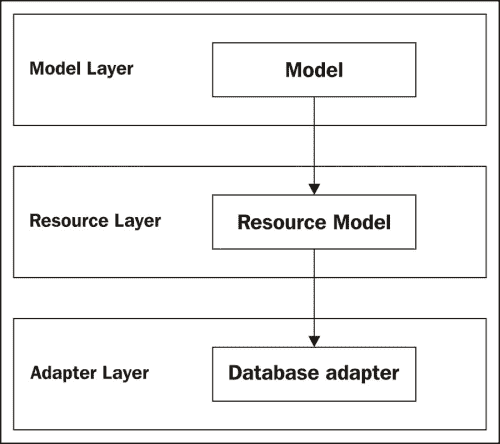
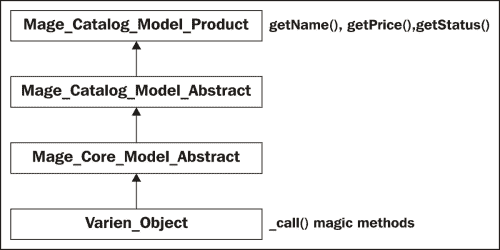
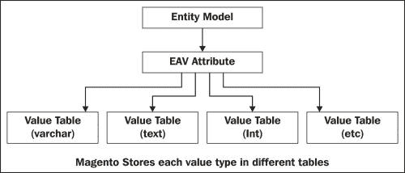
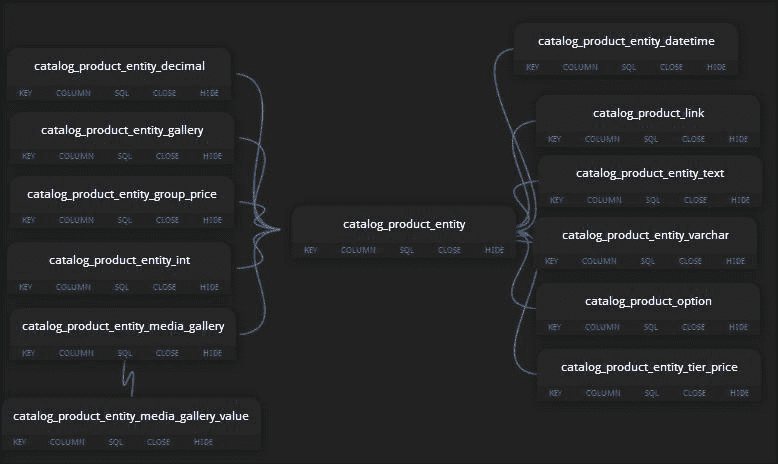
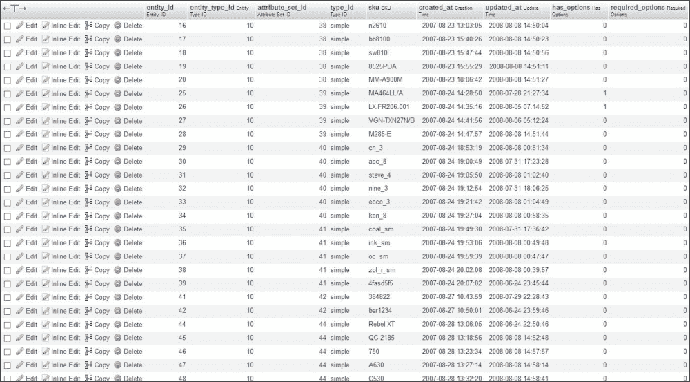
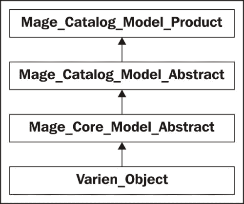

# 三、ORM 和数据收集

收藏品和模型是 Magento 日常发展的主要内容。在本章中，我们将向读者介绍 Magento ORM 系统，并学习如何正确使用数据收集和 EAV 系统。与大多数现代系统一样，Magento 实现了一个**对象关系映射**（**ORM**系统。

> *计算机软件中的对象关系映射（ORM、O/RM 和 O/R 映射）是一种编程技术，用于在面向对象编程语言中的不兼容类型系统之间转换数据。这实际上创建了一个“虚拟对象数据库”，可以在编程语言中使用。*

在本章中，我们将介绍以下主题：

*   Magento 模型
*   Magento 数据模型的剖析
*   EAV 和 EAV 模型
*   使用直接 SQL 查询

我们还将处理一些代码片段，以提供一个简单的框架来试验和使用 Magento。

### 注

请注意，本章中的交互式示例假定您使用的是 VagrantBox 中的默认 Magento 安装或带有示例数据的 Magento 安装。

为此，我创建了**交互式 Magento 控制台**（**IMC**），这是为本书专门创建的 shell 脚本，灵感来自 Ruby 自己的**交互式 Ruby 控制台**（**IRB**。遵循以下步骤：

1.  我们需要做的第一件事就是安装 IMC。为此，请从[下载源文件 https://github.com/amacgregor/mdg_imc](https://github.com/amacgregor/mdg_imc) 并在您的 Magento 测试安装下提取它们。IMC 是一个简单的 Magento shell 脚本，它允许我们实时测试代码。
2.  提取脚本后，登录到 virtualbox 的 shell。
3.  接下来，我们需要导航到 Magento 根文件夹。如果您使用的是默认的 vagrant box，则已提供安装；根文件夹位于`/srv/www/ce1720/public_html/`下，我们通过运行以下命令行导航到它：

    ```php
    $ cd /srv/www/ce1720/public_html

    ```

4.  最后，我们可以通过运行以下命令行来启动 IMC:

    ```php
    $ php shell/imc.php

    ```

5.  如果一切都安装成功，我们将看到一条以`magento >`开头的新线。

# Magento 模型解剖学

正如我们在上一章中了解到的，Magento 数据模型用于操作和访问数据。模型层分为两种基本类型，简单模型和 EAV，其中：

*   **简单模型**：这些模型实现是一个对象到一个表的简单映射，这意味着我们的对象属性匹配每个字段和表结构
*   **Entity Attribute Value Models (EAV)**: These type of models are used to describe entities with a dynamic number of attributes

    ### 注

    请注意，澄清并非所有 Magento 模型都扩展或使用 ORM 是很重要的。观察者是简单模型类的一个明显例子，这些类没有映射到特定的数据库表或实体。

除此之外，每个模型类型由以下图层组成：

*   **模型类**：这里是我们大部分业务逻辑所在的地方。模型用于操作数据，但它们不能直接访问数据。
*   **资源模型类**：资源模型代表我们的模型与数据库交互。他们负责实际的 CRUD 操作。
*   **模型采集类**：每个数据模型都有一个采集类；集合是包含多个单独 Magento 模型实例的对象。

### 注

CRUD 代表四种基本类型的数据库操作：创建、读取、更新和删除。

Magento 模型不包含任何与数据库通信的逻辑；它们与数据库无关。相反，此代码驻留在资源模型层中。

这使 Magento 能够支持不同类型的数据库和平台。尽管目前官方只支持 MySQL，但完全可以为新数据库编写新的资源类，而不必涉及任何模型逻辑类。



现在让我们通过实例化一个产品对象并通过以下步骤设置其一些属性来进行实验：

1.  启动在您的 Magento 暂存安装根目录下运行的 Magento 交互式控制台：

    ```php
    php shell/imc.php

    ```

2.  我们的第一步是通过键入：

    ```php
    magento> $product = Mage::getModel('catalog/product');

    ```

    来创建一个新的产品对象实例
3.  我们可以通过运行

    ```php
    magento> echo get_class($product);

    ```

    来确认这是否是 product 类的空实例
4.  我们应该将以下内容视为成功的输出：

    ```php
    magento> Magento_Catalog_Model_Product

    ```

5.  如果我们想了解更多关于类方法的信息，可以运行以下命令行：

    ```php
    magento> print_r(get_class_methods($product));

    ```

这将返回一个包含类中所有可用方法的数组。让我们尝试运行以下代码片段并修改产品价格和名称：

```php
$product = Mage::getModel('catalog/product')->load(2);
$name    = $product->getName() . '-TEST';
$price   = $product->getPrice();
$product->setPrice($price + 15);
$product->setName($name);
$product->save();
```

在代码的第一行中，我们正在实例化一个特定的对象，然后继续从该对象中检索 name 属性。接下来，我们设置价格和名称，最后保存对象。

如果我们打开我们的 Magento 产品类`Mage_Catalog_Model_Product`，我们会注意到的第一件事是`getName()`和`getPrice()`都是在我们的类中定义的，而`setPrice()`和`setName()`函数没有在任何地方定义。

但为什么，更重要的是，Magento 如何神奇地定义每个产品对象 setter 和 getter 方法？虽然确实定义了`getPrice()`和`getName()`，但对于产品属性（如颜色或制造商）的任何 getter 和 setter 方法都没有定义。

## 这是一种神奇的方法

嗯，碰巧 Magento ORM 系统确实在使用魔法；或者更准确地说，PHP 实现其 getter 和 setter 的一个更强大的特性是`magic __call()`方法。Magento 内部使用的 Magento 方法用于设置、取消设置、检查或检索数据。

当我们试图调用一个方法，时，它实际上并不存在于我们对应的类中，PHP 将查看每个父类，以获取该方法的声明。如果我们在任何父类上都找不到函数，它将使用其最后手段并尝试使用`__call()`方法，如果找到，Magento（或 PHP）将调用 magic 方法，从而传递请求的方法名及其参数。

现在，产品模型没有定义`__call()`方法，但它从`Varien_Object`类中获得一个，所有 Magento 模型都从该类继承。`Mage_Catalog_Model_Product`类的继承树如下图所示：



### 提示

每个 Magento 模型都继承自`Varien_Object`类。

让我们走近一点。

1.  打开位于`magento_root/lib/Varien/Object.php`中的文件。
2.  `Varien_Object`类不仅有一个`__call()`方法，还有两个不推荐使用的方法`__set()`和`__get()`；这两种方法被`__call()`方法取代，因此不再使用。

    ```php
    public function __call($method, $args)
    {
       switch (substr($method, 0, 3)) {
           case 'get' :
               //Varien_Profiler::start('GETTER: '.get_class($this).'::'.$method);
               $key = $this->_underscore(substr($method,3));
               $data = $this->getData($key, isset($args[0]) ? $args[0] : null);
               //Varien_Profiler::stop('GETTER: '.get_class($this).'::'.$method);
               return $data;

           case 'set' :
               //Varien_Profiler::start('SETTER: '.get_class($this).'::'.$method);
               $key = $this->_underscore(substr($method,3));
               $result = $this->setData($key, isset($args[0]) ? $args[0] : null);
               //Varien_Profiler::stop('SETTER: '.get_class($this).'::'.$method);
               return $result;

           case 'uns' :
               //Varien_Profiler::start('UNS: '.get_class($this).'::'.$method);
               $key = $this->_underscore(substr($method,3));
               $result = $this->unsetData($key);
               //Varien_Profiler::stop('UNS: '.get_class($this).'::'.$method);
               return $result;
           case 'has' :
               //Varien_Profiler::start('HAS: '.get_class($this).'::'.$method);
               $key = $this->_underscore(substr($method,3));
               //Varien_Profiler::stop('HAS: '.get_class($this).'::'.$method);
               return isset($this->_data[$key]);
       }
       throw new Varien_Exception("Invalid method" . get_class($this)."::".$method."(".print_r($args,1).")");
    }
    ```

在`__call()`方法内部，我们有一个开关，它不仅可以处理 getter 和 setter，还可以处理`unset`和`has`函数。

如果我们启动一个调试器并跟踪代码片段对`__call()`方法的调用，我们可以看到它接收到两个参数：例如`setName()`的方法名和来自原始调用的参数。

有趣的是，Magento 试图根据被调用方法的前三个字母匹配相应的方法类型；当 switch case 参数调用 substring 函数时，会执行此操作：

```php
substr($method, 0, 3)
```

在每个案例中首先调用的是`_underscore()`函数，该函数将方法名称前三个字符之后的任何字符作为参数；按照我们的示例，传递的参数将是`Name`。

`__underscore()`函数返回一个数据键。然后，每个案例都使用该键来操作数据。有四种基本数据操作，每种操作都在相应的开关箱上使用：

*   `setData($parameters)`
*   `getData($parameters)`
*   `unsetData($parameters)`
*   `isset($parameters)`

这些函数中的每一个都将与`Varien_Object`数据数组交互，并相应地对其进行操作。在大多数情况下，将使用神奇的 set/get 方法与对象属性交互；只有在少数需要额外业务逻辑的例外情况下，才会定义 getter 和 setter。在我们的示例中，它们是`getName()`和`getPrice()`。

```php
public function getPrice()
{
   if ($this->_calculatePrice || !$this->getData('price')) {
       return $this->getPriceModel()->getPrice($this);
   } else {
       return $this->getData('price');
   }
}
```

我们不会详细说明价格函数实际上在做什么，但它清楚地说明了模型的某些部分可能需要额外的逻辑。

```php
public function getName()
{
   return $this->_getData('name');
}
```

另一方面，`getName()`getter 的声明并不是因为需要实现特殊的逻辑，而是因为需要优化 Magento 的关键部分。`Mage_Catalog_Model_Product getName()`函数在每页加载时可能被调用数百次，是 Magento 中最常用的函数之一；毕竟，如果不是以产品为中心，那电子商务平台会是什么样的呢？

前端和后端都会在某个点调用`getName()`函数。例如，如果我们加载一个包含 24 个产品的类别页面，即对`getName()`函数的 24 个单独调用，每个调用都会在每个父类上寻找`getName()`方法，然后，当我们尝试使用`magic __call()`方法时，它将导致宝贵的毫秒损失。

资源模型包含所有特定于数据库的逻辑，并为其相应的数据源实例化特定的读写适配器。让我们回到我们使用产品的示例，看看位于`Mage_Catalog_Model_Resource_Product`的产品资源模型。


资源模型有两种不同的类型：实体和 MySQL4。后者是相当标准的单表/单模型关联，而前者要复杂得多。

# EAV 模型

EAV 代表实体、属性和值，它可能是新 Magento 开发人员最难掌握的概念。虽然 EAV 概念并非 Magento 独有，但它很少在现代系统上实现，除此之外，Magento 的实现也不是一个简单的实现。



## 什么是 EAV？

为了了解什么是 EAV 以及它在 Magento 中的作用，我们需要将其分解为 EAV 模型的各个部分。

*   **实体**：实体表示 Magento 产品、客户、类别、订单内部的数据项（对象）。每个实体都以唯一的 ID 存储在数据库中。
*   **属性**：这些是我们的对象属性。在 product 表上，属性不是每个属性有一列，而是存储在单独的表集合上。
*   **值**：顾名思义，它只是指向特定属性的值链接。

这种设计模式是 Magento 灵活性和强大功能背后的秘密，允许实体添加和删除新属性，而无需对代码或模板进行任何更改。

虽然模型可以看作是一种垂直的数据库增长方式（新属性添加更多行），但传统模型将涉及一种水平增长模式（新属性添加更多列），这将导致每次添加新属性时重新设计模式。

EAV 模型不仅允许我们的数据库快速发展，而且效率更高，因为它只适用于非空属性，避免了在数据库中为空值保留额外空间的需要。

### 提示

如果您对探索和了解更多有关 Magento 数据库结构的信息感兴趣，我强烈建议您访问[www.magereverse.com](http://www.magereverse.com)。

添加新的产品属性非常简单，只需转到 Magento 后端并指定新属性类型（颜色、大小、品牌等）。反之亦然，因为我们可以去掉产品或客户模型上未使用的属性。

### 注

有关管理属性的更多信息，请访问[http://www.magentocommerce.com/knowledge-base/entry/how-do-attributes-work-in-magento](http://www.magentocommerce.com/knowledge-base/entry/how-do-attributes-work-in-magento) 。

Magento 社区版目前有八种不同类型的 EAV 对象：

*   顾客
*   客户地址
*   产品
*   产品类别
*   命令
*   发票
*   贷项通知单
*   装运

### 注

Magento Enterprise Edition 还有一种称为 RMA item 的附加类型，它是**退货授权**（**RMA**系统的一部分。

所有这些灵活性和权力都不是免费的，需要付出代价；实现 EAV 模型会导致实体数据分布在大量的表上，例如，仅产品模型分布在大约 40 个不同的表上。

下图仅显示了保存 Magento 产品信息所涉及的几个表：



EAV 的另一个主要缺点是在检索大量 EAV 对象集合时会降低性能，并且会增加数据库查询的复杂性。由于数据更零碎（存储在更多的表中），因此选择一条记录涉及多个连接。

让我们继续使用 Magento 产品作为示例，并手动构建用于检索单个产品的查询。

### 提示

如果在开发环境中安装了 PHPMyAdmin 或 MySQL Workbench，则可以尝试以下查询。可从 PHPMyAdmin（[中下载 http://www.phpmyadmin.net/](http://www.phpmyadmin.net/) 和 MySQL 工作台（[http://www.mysql.com/products/workbench/](http://www.mysql.com/products/workbench/) ）。

我们需要使用的第一个表是`catalog_product_entity`。我们可以认为这是我们的主要产品 EAV 表 TY1 T1，因为它包含了我们的产品的主要实体记录：



让我们通过运行以下 SQL 查询来查询该表：

```php
SELECT * FROM `catalog_product_entity`;
```

该表包含以下字段：

*   `entity_id`：这是我们的产品唯一标识符，由 Magento 内部使用。
*   `entity_type_id`：Magento 有几种不同类型的 EAV 型号、产品、客户和订单，这些只是其中的一部分。通过按类型识别每个属性，Magento 可以从相应的表中检索属性和值。
*   `attribute_set_id`：产品属性可以在本地分组为属性集。由于产品不必强制使用所有可用的属性，因此属性集允许在产品结构上具有更大的灵活性。
*   `type_id`：Magento 中有几种不同类型的产品：简单、可配置、捆绑、可下载和分组产品，每种产品都有独特的设置和功能。
*   `sku`：**库存单元**（**SKU**）是一个编号或代码，用于标识商店中销售的每个独特产品或项目。这是一个用户定义的值。
*   `has_options`：用于标识产品是否有自定义选项。
*   `required_options`：用于标识是否需要任何自定义选项。
*   `created_at`：这是建行日期。
*   `updated_at`：显示上次修改行的时间。

现在我们对产品实体表有了基本的了解，我们还知道每个记录代表我们 Magento 商店中的单个产品，但是除了 SKU 和产品类型之外，我们没有关于该产品的更多信息。

那么，属性存储在哪里？Magento 如何知道产品属性和客户属性之间的区别？

为此，我们需要通过运行以下 SQL 查询来查看`eav_attribute`表：

```php
SELECT * FROM `eav_attribute`;
```

因此，我们不仅可以看到产品属性，还可以看到与客户模型、订单模型等对应的属性。幸运的是，我们已经有了一个从这个表中筛选属性的键。让我们运行以下查询：

```php
SELECT * FROM `eav_attribute`
WHERE entity_type_id = 4;
```

此查询告诉数据库仅检索`entity_type_id`列等于产品`entity_type_id(4)`的属性。在继续之前，让我们分析一下`eav_attribute`表中最重要的字段：

*   `attribute_id`：表的每个属性和主键的唯一标识符。
*   `entity_type_id`：该字段将每个属性与特定的 EAV 模型类型关联。
*   `attribute_code`：此字段是我们属性的名称或键，用于为我们的魔术方法生成 getter 和 setter。
*   `backend_model`：后端模型负责将数据加载并存储到数据库中。
*   `backend_type`：此字段指定存储到后端（数据库）中的值的类型。
*   `backend_table`：此字段用于指定属性是否应存储在特殊表而不是默认的 EAV 表上。
*   `frontend_model`：前端模型负责将属性元素渲染到 web 浏览器中。
*   `frontend_input`：与前端模型类似，前端输入指定 web 浏览器应呈现的输入字段类型。
*   `frontend_label`：此字段是属性的标签/名称，应该由浏览器呈现。
*   `source_model`：源模型用于用可能的值填充属性。Magento 为国家、是或否值、地区等提供了几个预定义的源模型。

## 检索数据

此时，我们已成功检索到一个产品实体以及应用于该实体的特定属性，现在是开始检索实际值的时候了。为了简单地执行示例（和查询），我们将只尝试检索产品的 name 属性。

但我们如何知道属性值存储在哪个表上呢？好吧，谢天谢地，Magento 遵循命名表的命名约定。如果我们检查我们的数据库结构，我们会注意到有几个表使用了`catalog_product_entity`前缀：

*   `catalog_product_entity`
*   `catalog_product_entity_datetime`
*   `catalog_product_entity_decimal`
*   `catalog_product_entity_int`
*   `catalog_product_entity_text`
*   `catalog_product_entity_varchar`
*   `catalog_product_entity_gallery`
*   `catalog_product_entity_media_gallery`
*   `catalog_product_entity_tier_price`

但是，等等，我们如何知道哪个表是查询 name 属性值的正确表？如果你注意了，我们已经看到了答案。您还记得`eav_attribute`表有一个名为`backend_type`的列吗？

Magento EAV 根据每个属性的后端类型将其存储在不同的表中。如果要确认姓名的后端类型，可以运行以下代码：

```php
SELECT * FROM `eav_attribute`
WHERE `entity_type_id` =4 AND `attribute_code` = 'name';
```

因此，我们应该看到后端类型是`varchar`，并且该属性的值存储在`catalog_product_entity_varchar`表中。让我们检查一下这张表：


`catalog_product_entity_varchar`表仅由六列组成：

*   `value_id`：属性值为唯一标识符和主键
*   `entity_type_id`：该值属于实体类型 ID
*   `attribute_id`：这是一个外键，它将值与我们的`eav_entity`表相关联
*   `store_id`：属性值与 storeview 匹配的外键
*   `entity_id`：对应实体表的外键；本例中为`catalog_product_entity`
*   `value`：这是我们要检索的实际值

### 提示

根据属性配置，我们可以将其作为全局值，这意味着它适用于所有存储视图或每个存储视图的一个值。

现在我们终于有了检索产品信息所需的所有表，我们可以构建我们的查询：

```php
SELECT p.entity_id AS product_id, var.value AS product_name, p.sku AS product_sku
FROM catalog_product_entity p, eav_attribute eav, catalog_product_entity_varchar var
WHERE p.entity_type_id = eav.entity_type_id 
   AND var.entity_id = p.entity_id
   AND eav.attribute_code = 'name'
   AND eav.attribute_id = var.attribute_id
```


作为我们查询的结果，我们应该看到一个包含三列的结果集：`product_id`、`product_name`和`product_sku`。所以，让我们退一步，以获得 SKU 的产品名称。对于原始 SQL，我们必须编写一个五行 SQL 查询，并且我们只能从我们的产品中检索两个值：如果我们想要检索数字字段（如 price），则从一个单一的 EAV 值表中检索，或者从文本值（如 product）中检索。

如果我们没有 ORM，维护 Magento 几乎是不可能的。幸运的是，我们确实有一个 ORM，而且很可能，在使用 Magento 时，您永远不需要处理原始 SQL。

也就是说，让我们看看如何使用 Magento ORM 检索相同的产品信息：

1.  我们的第一步是实例化一个产品集合：

    ```php
    $collection = Mage::getModel('catalog/product')->getCollection();

    ```

2.  然后我们会特别告诉 Magento 选择 name 属性：

    ```php
    $collection->addAttributeToSelect('name');

    ```

3.  现在按名称对集合进行排序：

    ```php
    $collection->setOrder('name', 'asc');

    ```

4.  最后，我们将告诉 Magento 加载集合：

    ```php
    $collection->load();

    ```

5.  最终结果是商店中所有产品的集合，按名称排序；我们可以通过运行

    ```php
    echo $collection->getSelect()->__toString();

    ```

    来检查实际的 SQL 查询

在的帮助下，只需三行代码，我们就可以让 Magento 抓取店里的所有产品，具体选择名称，最后按名称订购产品。

### 提示

最后一行，`$collection->getSelect()->__toString()`允许我们查看 Magento 代表我们执行的实际查询。

Magento 生成的实际查询是：

```php
SELECT `e`.*. IF( at_name.value_id >0, at_name.value, at_name_default.value ) AS `name`
FROM `catalog_product_entity` AS `e`
LEFT JOIN `catalog_product_entity_varchar` AS `at_name_default` ON (`at_name_default`.`entity_id` = `e`.`entity_id`)
AND (`at_name_default`.`attribute_id` = '65')
AND `at_name_default`.`store_id` =0
LEFT JOIN `catalog_product_entity_varchar` AS `at_name` ON ( `at_name`.`entity_id` = `e`.`entity_id` )
AND (`at_name`.`attribute_id` = '65')
AND (`at_name`.`store_id` =1)
ORDER BY `name` ASC
```

正如我们所看到的，ORM 和 EAV 模型是非常好的工具，它们不仅为开发人员提供了大量的功能和灵活性，而且还以一种全面且易于使用的方式来实现。

# 与 Magento 系列合作

如果您回顾前面的代码示例，您可能会注意到我们不仅实例化了产品模型，而且还调用了`getCollection()`方法。`getCollection()`方法是`Mage_Core_Model_Abstract`类的一部分，这意味着 Magento 内部的每个模型都可以调用此方法。

### 提示

所有集合都继承自`Varien_Data_Collection`。

Magento 集合基本上是包含其他模型的模型。因此，我们可以使用产品集合，而不是使用数组来保存产品集合。集合不仅为分组模型提供了方便的数据结构，而且还提供了我们可以用来操作和处理实体集合的特殊方法。

一些最有用的收集方法是：

*   `addAttributeToSelect`：若要向集合中的实体添加属性，`*`可以用作通配符来添加所有可用属性
*   `addFieldToFilter`：要向集合添加属性过滤器，此功能用于常规的非 EAV 模型
*   `addAttributeToFilter`：此方法用于过滤 EAV 实体集合
*   `addAttributeToSort`：此方法用于为排序顺序添加属性
*   `addStoreFilter`：此方法用于存储可用性过滤器；它包括可用性产品
*   `addWebsiteFilter`：此方法用于将网站过滤器添加到集合中
*   `addCategoryFilter`：此方法用于指定产品集合的类别过滤器
*   `addUrlRewrite`：此方法用于将 URL 重写数据添加到产品中
*   `setOrder`：此方法用于设置集合的排序顺序

这些只是可用的几种收集方法；每个集合根据其对应的实体类型实现不同的唯一方法。例如，客户集合`Mage_Customer_Model_Resource_Customer_Collection`有一个名为`groupByEmail()`的独特方法，该方法的名称正确地暗示并通过电子邮件对集合中的实体进行分组。

与前面的示例一样，我们将继续使用产品模型，在本例中是产品集合。



为了更好地说明我们如何使用 collection，我们将研究以下常见的产品场景：

1.  仅从特定类别获取产品集合。
2.  从 X 日期开始获得新产品。
3.  获得畅销产品。
4.  按可见性筛选产品集合。
5.  过滤没有图像的产品。
6.  添加多个排序顺序。

## 仅从特定类别获取产品集合

大多数开发人员在开始使用 Magento 时尝试做的第一件事是仅使用特定类别的产品加载产品集合，虽然我见过许多使用`addCategoryFilter()`或`addAttributeToFilter()`的方法，但事实是，在大多数情况下，这种方法简单得多，而且有点违反我们迄今所学的直觉。

最简单的方法不是先获取产品集合，然后按类别进行过滤，而是实际实例化目标类别并从中获取产品集合。让我们在 IMC 上运行以下代码片段：

```php
$category = Mage::getModel('catalog/category')->load(5);
$productCollection = $category->getProductCollection();
```

我们可以在`Mage_Catalog_Model_Category`类中找到`getProductCollection()`方法声明。让我们看一下这个方法：

```php
public function getProductCollection()
{
    $collection = Mage::getResourceModel('catalog/product_collection')
        ->setStoreId($this->getStoreId())
        ->addCategoryFilter($this);
    return $collection;
}
```

我们可以看到，该函数只不过是为产品集合实例化了一个资源模型，即将存储设置为当前存储 ID，并将当前类别传递给`addCategoryFilter()`方法。

这是为优化 Magento 性能而做出的决定之一，坦率地说是为了简化使用它的开发人员的生活，因为在大多数情况下，一个类别将以某种方式可用。

## 从 X 日期开始添加新产品

因此，现在我们知道如何从特定类别中获取产品集合，让我们看看我们是否能够对结果产品应用过滤器，并且只对符合我们条件的检索到的产品应用过滤器；在这种特殊情况下，我们将请求 2012 年 12 月之后添加的所有产品。按照前面的示例代码，我们可以通过在 IMC 上运行以下代码，按产品创建日期筛选集合：

```php
// Product collection from our previous example
$productCollection->addFieldToFilter('created_at', array('from' => '2012-12-01));
```

这很简单，不是吗？我们甚至可以添加一个附加条件，在两个日期之间添加产品。假设我们只想检索 12 月份创建的产品：

```php
$productCollection->addFieldToFilter('created_at', array('from' => '2012-12-01));
$productCollection->addFieldToFilter('created_at', array('to' => '2012-12-30));
```

Magento 的`addFieldToFilter`支持以下条件：

<colgroup><col style="text-align: left"> <col style="text-align: left"></colgroup> 
| 

属性代码

 | 

SQL 条件

 |
| --- | --- |
| `eq` | `=` |
| `neq` | `!=` |
| `like` | `LIKE` |
| `nlike` | `NOT LIKE` |
| `in` | `IN ()` |
| `nin` | `NOT IN ()` |
| `is` | `IS` |
| `notnull` | `NOT NULL` |
| `null` | `NULL` |
| `moreq` | `>=` |
| `gt` | `>` |
| `lt` | `<` |
| `gteq` | `>=` |
| `lteq` | `<=` |

我们可以尝试其他类型的过滤器，例如，在添加创建日期过滤器后，让我们在 IMC 上使用以下代码，以便只能检索可见的产品：

```php
$productCollection->addAttributeToFilter('visibility', 4);
```

可见性属性是产品用于控制产品显示位置的特殊属性；它具有以下值：

*   **单独不可见**：取值为 1
*   **目录**：取值为 2
*   **搜索**：值为 3
*   **编目检索**：取值为 4

## 获得畅销产品

为了获得特定类别的畅销书产品，我们需要加强我们的游戏并加入`sales_order`表。检索畅销书产品将在以后方便地创建一个特殊类别或自定义报告；我们可以在 IMC 上运行以下代码：

```php
$category = Mage::getModel('catalog/category')->load(5);
$productCollection = $category->getProductCollection();
$productCollection->getSelect()
            ->join(array('o'=> 'sales_flat_order_item'), 'main_table.entity_id = o.product_id', array('o.row_total','o.product_id'))->group(array('sku'));
```

让我们分析一下代码片段第三行发生了什么。`getSelect()`是直接从`Varien_Data_Collection_Db`继承的方法，除了提供指定联接和组的方法而无需编写任何 SQL 的集合外，还返回存储`Select`语句的变量。

这不是向集合添加联接的唯一方法。事实上，通过使用`joinField()`函数有一种更干净的方法。让我们重写前面的代码以使用此函数：

```php
$category = Mage::getModel('catalog/category')->load(5);
$productCollection = $category->getProductCollection();
$productCollection->joinField('o', 'sales_flat_order_item', array('o.row_total','o.product_id'), 'main_table.entity_id = o.product_id')
->group(array('sku'));
```

## 通过可见性过滤产品收集

这在`addAttributeToFilter`的帮助下非常容易做到。Magento 产品有一个名为 visibility 的系统属性，该属性有四个可能的数值，范围从 1 到 4。我们只对展示能见度为 4 的产品感兴趣；也就是说，它可以在搜索结果和目录中看到。让我们在 IMC 中运行以下代码：

```php
$category = Mage::getModel('catalog/category')->load(5);
$productCollection = $category->getProductCollection();
$productCollection->addAttributeToFilter('visibility', 4);
```

如果更改可见性代码，我们可以比较不同的集合结果。

## 过滤无图像的产品

当你与第三方进口系统打交道时，没有图像的过滤产品会派上用场，这有时是不可靠的。与我们迄今为止所做的一切一样，产品图像是我们产品的属性。

```php
$category = Mage::getModel('catalog/category')->load(5);
$productCollection = $category->getProductCollection();
$productCollection->addAttributeToFilter('small_image',array('notnull'=>'','neq'=>'no_selection'));
```

通过添加额外的过滤器，我们要求产品具有指定的小图像；默认情况下，Magento 有三种产品：图像类型、缩略图和`small_image`和图像。这三种类型用于应用程序的不同部分。如果我们愿意，我们甚至可以为产品制定更严格的规定。

```php
$productCollection->addAttributeToFilter('small_image', array('notnull'=>'','neq'=>'no_selection'));
->addAttributeToFilter('thumbnail, array('notnull'=>'','neq'=>'no_selection'))
->addAttributeToFilter('image', array('notnull'=>'','neq'=>'no_selection'));
```

只有具有所有三种图像类型的产品才会包含在我们的收藏中。尝试使用不同的图像类型进行过滤。

## 增加多个分拣订单

最后，让我们先把我们的收藏品按库存状态分类，然后按价格从高到低排序。为了检索库存状态信息，我们将使用库存状态资源模型特有的方法`addStockStatusToSelect()`，该方法将负责为我们的收集查询生成相应的 SQL：

```php
$category = Mage::getModel('catalog/category')->load(5);
$productCollection = $category->getProductCollection();
$select = $productCollection->getSelect();
Mage::getResourceModel('cataloginventory/stock_status')->addStockStatusToSelect($select, Mage::app()->getWebsite());
$select->order('salable desc');
$select->order('price asc');
```

在该查询中，Magento 将根据销售状态对产品进行排序，该状态为 true 或 false，根据价格进行排序；最终结果是，所有可用的产品将显示从最贵到最便宜的首批订购产品，然后，缺货产品将从最贵到最便宜显示。

尝试不同的排序顺序组合，了解 Magento 如何组织和排序产品集合。

# 使用直接 SQL

到目前为止，我们已经了解了 Magento 数据模型和 ORM 系统如何提供一种干净、简单的方式来访问、存储和操作我们的数据。在我们直接进入本节之前，先了解 Magento 数据库适配器以及如何运行原始 SQL 查询，我认为重要的是我们要理解为什么应该尽可能避免使用本节将要学习的内容。

Magento 是一个极其复杂的系统，正如我们在前一章中所了解的，框架部分由事件驱动；仅仅保存一个产品就会触发不同的事件，每个事件执行不同的任务。如果您决定只创建查询并直接更新产品，则不会发生这种情况。因此，作为开发人员，我们必须非常小心，并确定是否有合理的理由走出 ORM。

也就是说，当然，有些情况下，能够直接使用数据库非常方便，实际上比使用 Magento 模型更简单。例如，在全局更新产品属性或更改产品集合状态时，我们可以加载产品集合并循环更新和保存每个产品。虽然这在较小的集合上可以很好地工作，但一旦我们开始增长并使用较大的数据集，我们的性能就会开始下降，脚本将需要几秒钟才能执行。

另一方面，直接 SQL 查询的执行速度要快得多，通常不到 1 秒，具体取决于数据集大小和正在执行的查询。

在开箱即用的情况下，Magento 将负责使用`Mage_Core_Model_Resource`模型与数据库建立连接的所有繁重工作；Magento 为我们提供两种类型的连接，`core_read`和`core_write`。

让我们首先实例化一个资源模型和两个连接，一个用于读取，另一个用于写入：

```php
$resource = Mage::getModel('core/resource');
$read = $resource->getConnection('core_read');
$write = $resource->getConnection('core_write');
```

即使我们正在处理直接 SQL 查询，多亏了 Magento，除了实例化资源模型和正确的连接类型之外，我们不必担心设置到 DB 的连接。

## 阅读

让我们通过执行以下代码来测试我们的读取连接：

```php
$resource = Mage::getModel('core/resource');
$read = $resource->getConnection('core_read');
$query = 'SELECT * FROM catalog_product_entity';
$results = $read->fetchAll($query);
```

虽然此查询有效，但它将返回`catalog_product_entity`表中的所有产品。但是，如果我们尝试在使用表前缀的 Magento 安装上运行相同的代码，会发生什么？或者如果 Magento 在下一次升级中突然更改了表名怎么办？此代码不可移植，也不易于维护。幸运的是，资源模型提供了另一种简便的方法，称为`getTableName()`。

`getTableName()`方法将工厂名称作为参数，根据`config.xml`建立的配置，不仅会找到正确的表，还会验证数据库中是否存在表。让我们更新代码以使用`getTableName()`：

```php
$resource = Mage::getModel('core/resource');
$read = $resource->getConnection('core_read');
$query = 'SELECT * FROM ' . $resource->getTableName('catalog/product');
$results = $read->fetchAll($query);
```

我们也在使用`fetchAll()`方法。这将以数组的形式返回查询的所有行，但这不是唯一可用的选项；我们还有`fetchCol()`和`fetchOne()`供我们使用。让我们看一下以下函数：

*   `fetchAll`：此函数检索原始查询返回的所有行
*   `fetchOne`：此函数只返回查询返回的第一个数据库行的值
*   `fetchCol`：此函数将返回查询返回的所有行，但只返回第一行；如果只希望检索具有唯一标识符（如产品 ID 或 SKU）的单个列，则此选项非常有用

## 写作

正如我们前面提到的，在 Magento 中保存模型，无论是产品、类别、客户等，由于后端触发的观察者和事件数量较多，保存速度相对较慢。

但是，如果我们只想更新简单的静态值，那么通过 Magento ORM 更新大型集合可能是一个非常缓慢的过程。比如说，我们想让网站上的所有产品都脱销。我们不需要通过 Magento 后端或创建一个自定义脚本来迭代所有产品的集合，而只需执行以下代码段：

```php
$resource = Mage::getModel('core/resource');
$read = $resource->getConnection('core_write);
$tablename = $resource->getTableName('cataloginventory/stock_status');
$query = 'UPDATE {$tablename} SET `is_in_stock` = 1';
$write->query($query);
```

# 总结

在本章中，我们了解到：

*   Magento 模型及其继承和目的
*   Magento 如何使用资源和集合模型
*   EAV 模型及其在 Magento 中的重要性
*   EAV 如何工作以及数据库内部使用的结构
*   什么是 Magento ORM 模型以及它是如何实现的
*   如何使用 Direct SQL 和 Magento 资源适配器

到目前为止，这些章节更多的是理论性的，而不是实践性的；这样做的目的是引导您了解 Magento 的复杂性，并为您提供本书其余部分所需的工具和知识。在本书的其余部分中，我们将采用更实际的方法，并开始逐步构建扩展，应用我们迄今为止所学的所有概念。

在下一章中，我们将开始湿脚并开发第一个 Magento 扩展。