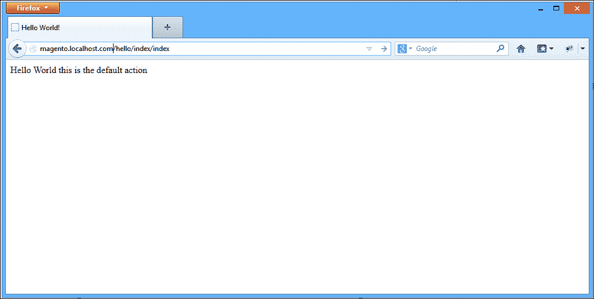

# 九、附录 A：你好，Magento

下面的示例将向您简要介绍创建 Magento 扩展的过程。我们将创建一个简单的 Hello World 模块，它将允许我们显示 Hello World！当我们访问商店中的特定 URL 时发送消息。

# 配置

在 Magento 中创建裸骨骼扩展至少需要两个文件：`config.xml`和模块声明文件。让我们继续创建每个文件。

第一个文件用于向 Magento 声明模块；没有此文件，Magento 将无法识别任何扩展文件。

文件位置为`app/etc/modules/Mdg_Hello.xml`。请参阅以下代码：

```php
<?xml version=”1.0”?>
<config>
    <modules>
        <Mdg_Hello>
            <active>true</active>
            <codePool>local</codePool>
        </Mdg_Hello>
    </modules>
</config>
```

第二个 XML 文件名为`config.xml`；它用于指定所有扩展配置，例如管线、块、模型和帮助器类名。在我们的示例中，我们将只使用控制器和路由。

让我们用以下代码创建配置文件。

文件位置为`app/code/local/Mdg/Hello/etc/config.xml`。请参阅以下代码：

```php
<?xml version=”1.0”?>
<config>
    <modules>
        <Mdg_Hello>
            <version>0.1.0</version>
        </Mdg_Hello>
    </modules>
    <frontend>
        <routers>
            <mdg_hello>
                <use>standard</use>
                <args>
                    <module>Mdg_Hello</module>
                    <frontName>hello</frontName>
                </args>
            </mdg_hello>
        </routers>
    </frontend>
</config>
```

我们的扩展现在可以由 Magento 加载，您可以在**系统****配置****高级**的 Magento 后端启用或禁用我们的扩展。

# 控制器

Magento 的核心是一个**模型视图控制器**（**MVC**框架。因此，为了使我们的新路线发挥作用，我们必须创建一个新的控制器，该控制器将响应此特定路线。为此，请执行以下步骤：

1.  导航到扩展根目录。
2.  创建一个名为`controllers`的新文件夹。
3.  在`controllers`文件夹中，创建一个名为`IndexController.php`的文件。
4.  复制以下代码（文件位置为`app/code/local/Mdg/Hello/controllers/IndexController.php`：

    ```php
    <?php
    class Mdg_Hello_IndexController extends Mage_Core_Controller_Front_Action
    {
         public function indexAction()
      {
         echo ‘Hello World this is the default action’;
         }
    }
    ```

# 测试路线

现在我们已经创建了我们的路由器和控制器，我们可以打开`http://magento.localhost.com/hello/index/index`进行测试，我们应该看到下面的屏幕截图：



默认情况下，Magento 将使用索引控制器和索引操作作为每个扩展的默认值。因此，如果我们转到`http://magento.localhost.com/hello/`，我们将看到相同的屏幕。

为了结束我们对 Magento 模块的介绍，让我们为控制器添加一条新路径：

1.  导航到扩展根目录。
2.  打开`IndexController.php`。
3.  复制以下代码（文件位置为`app/code/local/Mdg/Hello/controllers/IndexController.php`：

    ```php
    <?php 
    class Mdg_Hello_IndexController extends Mage_Core_Controller_Front_Action
    {
         public function indexAction()
      {
         echo ‘Hello World this is the default action’;
         }

         public function developerAction()
         {
             echo ‘Hello Developer this is a custom controller action’;
         }
    }
    ```

最后让我们进行测试，进入`http://magento.localhost.com/hello/index/developer`加载新的动作路线，如下图所示：

