# 八、无服务器

**无服务器**术语可能是最近软件行业最热门的术语之一。它可以被描述为部分或完全抽象运行我们的软件所需的基础设施的架构风格。这种抽象通常由各种第三方服务提供商提供。

将其放在 web 应用程序开发的上下文中，让我们考虑一下**单页应用程序**（**SPA**。如今，我们可以在完全管理的基础设施（如 AWS）之上轻松开发整个 SPA。这样的 SPA 可以用 Angular 编写，从 S3 bucket 提供客户端组件，通过 Amazon Cognito 服务管理用户，同时使用 DynamoDB 作为应用程序数据存储。托管基础设施从我们这里抽象出任何托管或服务器交易，允许我们将精力集中在应用程序上。我们最终得到的是一种形式的无服务器应用程序，这取决于我们的定义有多窄。

Like any architectural style, serverless is far from being **<<the solution>>**. While some types of application can benefit from it, others might find it a total mismatch. The long-running applications for example, can easily turn out to  be expensive solution for serverless frameworks, rather than running a workload on a dedicated server. The trick is to find the right balance.

无服务器的一个更严格、更狭义的定义是纯代码/函数托管，通常称为**函数即服务**（**FaaS**。这些基础设施提供了高度并行、可扩展、但价格合理的解决方案，因为它们的价格主要由*按执行付费*模式确定。AWS Lambda 和 Iron.io 是两个完美描述这一概念的平台。

在本章中，我们将更深入地了解如何利用 AWS Lambda 和 Iron.io 平台部署代码块：

*   使用无服务器框架
*   使用 Iron.io IronWorker

# 使用无服务器框架

AWS Lambda 是**亚马逊网络服务**（**AWS**提供的一种计算服务。它的特殊之处在于，它允许我们运行代码，而无需配置或管理任何服务器。自动缩放功能使其能够承受每秒数千次的请求。随着按执行付费定价的额外好处，这项服务在开发人员中获得了一些吸引力。随着时间的推移，无服务器框架的开发使得 AWS Lambda 服务的使用变得简单。

The serverless framework is available at [https://serverless.com](https://serverless.com).

假设我们已经创建了一个 AWS 帐户，并且手头上有一个 Ubuntu 服务器的干净安装，那么让我们继续并概述设置和使用无服务器框架所需的步骤。

在 AWS Lambda 上部署应用程序之前，我们需要确保有一个具有正确权限集的用户。AWS 权限非常健壮，因为我们可以针对每个资源对其进行调优。除了 AWS Lambda 本身之外，serverless 框架还使用其他几个 AWS 资源，例如 S3、API 网关和其他一些资源。为了简化演示，我们将首先创建具有管理员访问权限的 IAM 用户：

1.  我们首先在[登录 AWS 控制台 https://aws.amazon.com/console/](https://aws.amazon.com/console/) 。登录后，我们需要在“我的安全凭据|用户”屏幕下继续：


2.  要添加新用户，请单击添加用户按钮。这将触发一个四步流程，如以下屏幕截图所示：


3.  我们在这里提供两条信息，用户名和访问类型。编程访问类型是无服务器集成所需要的。单击“下一步：权限”按钮可进入以下屏幕：

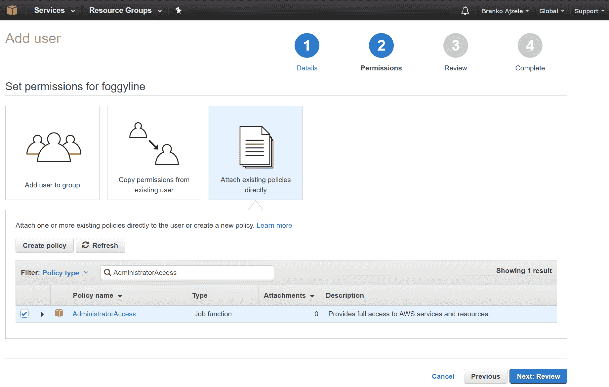

4.  有几种方法可以将权限附加到此处的用户。为了简化操作，请单击“直接附加现有策略”框，然后在“策略类型”字段筛选器中键入 AdministratorAccess。然后，我们只需检查 AdministratorAccess 策略并单击 Next:Review 按钮，即可进入以下屏幕：

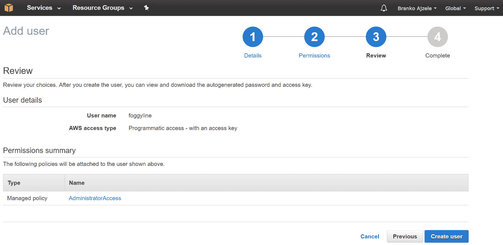

5.  在这里，我们只需查看当前进度，最后单击“创建用户”按钮，进入以下屏幕：

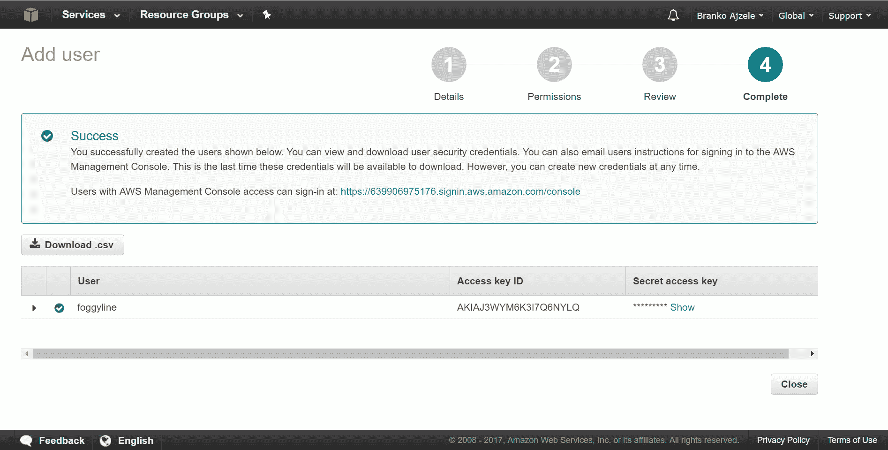

6.  我们现在有了 Access key ID 和 Secret Access key，这是无服务器框架所需的两条信息。

Creating users with full administrative permissions is generally considered a bad security practice. Normally, we would create users with a bare minimum of needed permissions.

通过这些步骤，我们可以继续设置无服务器框架本身。

无服务器框架运行在 Node.js 之上。假设我们有一个干净的 Ubuntu 服务器实例，我们可以通过以下步骤进行设置：

1.  使用以下控制台命令安装 Node.js：

```php
curl -sL https://deb.nodesource.com/setup_7.x | sudo -E bash -
sudo apt-get install -y nodejs

```

2.  安装 Node.js 后，`npm`控制台工具可用。无服务器框架本身作为`npm`包在[中提供 https://www.npmjs.com/package/serverless](https://www.npmjs.com/package/serverless) 。运行以下控制台命令应将其安装到我们的服务器上：

```php
sudo npm install -g serverless
serverless --version

```


3.  现在安装了无服务器框架，我们需要设置控制台环境变量：`AWS_ACCESS_KEY_ID`和`AWS_SECRET_ACCESS_KEY`。在部署过程中，serverless 将使用这些选项：

```php
export AWS_ACCESS_KEY_ID=<--AWS_ACCESS_KEY_ID-->
export AWS_SECRET_ACCESS_KEY=<--AWS_SECRET_ACCESS_KEY--> 

```

4.  我们现在可以处理与 PHP 相关的一些细节。官方的无服务器框架示例使用一个运行 PHP 函数的 AWS lambda，可在[中找到该函数 https://github.com/ZeroSharp/serverless-php](https://github.com/ZeroSharp/serverless-php) 。我们可以通过以下控制台命令进行安装：

```php
serverless install --url https://github.com/ZeroSharp/serverless-php

```

这将为我们提供与以下屏幕截图类似的输出：

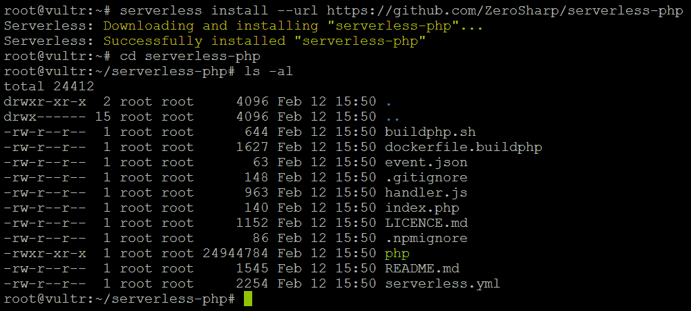

serverless install 命令只是将 Git 存储库的内容拉入本地目录。在新创建的`serverless-php`目录中，有一个`index.php`文件，其中包含我们的 PHP 应用程序代码。奇怪的是，这里有些零碎的东西，一开始看起来好像与 PHP 无关，比如`handler.js`。快速查看`handler.js`会发现一些有趣的事情，即 AWS Lambda 服务实际上并不直接运行 PHP 代码。它的工作方式是`handler.js`，一个 Node.js 应用程序，生成一个包含`php`二进制文件的进程。简言之，`index.php`是我们的应用程序文件，其余是必要的样板文件。

作为一个快速的健全性检查，让我们触发以下两个命令：

```php
php index.php
serverless invoke local --function hello

```

这些将为我们提供以下输出，表明 serverless 能够看到并执行我们的函数：


最后，我们准备将我们的 PHP 应用程序部署到 AWS Lambda 服务。我们通过执行以下命令来实现这一点：

```php
serverless deploy

```

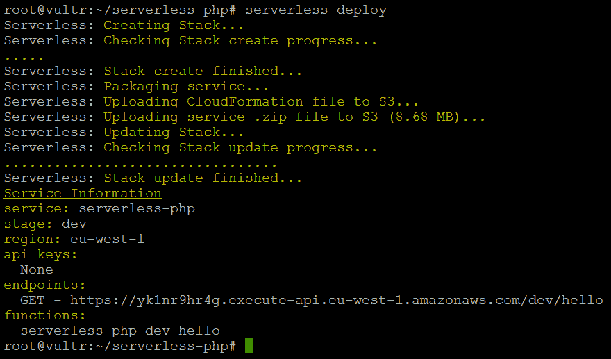

这个简单的命令启动了一系列事件，导致 AWS 控制台中使用了多个不同的 AWS 服务。

打开端点下列出的链接表明我们的应用程序是公开可用的：


这是由 Amazon API 网关服务下自动创建的 API 条目实现的，如以下屏幕截图所示：


API 网关将`GET /hello`URL 操作与 AWS Lambda`serverless-php-dev-hello`应用程序连接起来。AWS Lambda 屏幕下显示此应用程序的外观：


还创建了 CloudFormation 堆栈，如以下屏幕截图所示：


还创建了 S3 bucket，如下所示：


还创建了 CloudWatch 日志组，如以下屏幕截图所示：

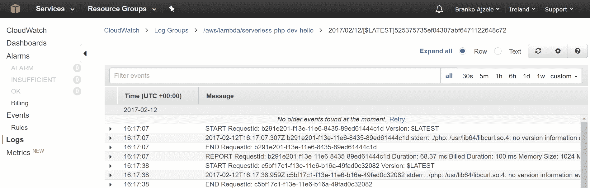

简言之，`serverless deploy`为我们启动了许多服务，从而使我们有时间更多地关注实际的应用程序开发。虽然 AWS Lambda 仅在运行代码时收取费用，但组合中的一些其他服务可能会有所不同。这就是为什么关注自动触发的一切对我们来说很重要的原因。

幸运的是，serverless 还提供了一个 cleanup 命令，其编写如下：

```php
serverless remove

```


此命令通过删除以前创建的所有服务和资源来进行全面清理。

# 使用 Iron.io IronWorker

Iron.io 是一个无服务器作业处理平台，旨在实现高性能和并发性。围绕 Docker 容器构建，平台本身与语言无关。我们可以用它来运行几乎任何编程语言，包括 PHP。Iron.io 平台有三个主要功能：

*   **IronWorker**：这是一个类似于任务/队列的弹性工作者服务，可以扩展处理
*   **IronMQ**：这是为分布式系统设计的消息排队服务
*   **IronCache**：这是一个弹性和持久的密钥/值存储

虽然我们无法在 Iron.io 平台中运行实时 PHP，但我们可以将其 IronWorker 特性用于任务/队列类型的应用程序。

假设我们有一个 Iron.io 帐户，并且安装了带有 Docker 的 Ubuntu 服务器，我们将能够按照下面的步骤概述 IronWorker 工作流。

我们首先单击 Iron.io 仪表板下的“新建项目”按钮。这将打开一个简单的屏幕，我们只需在其中输入项目名称：

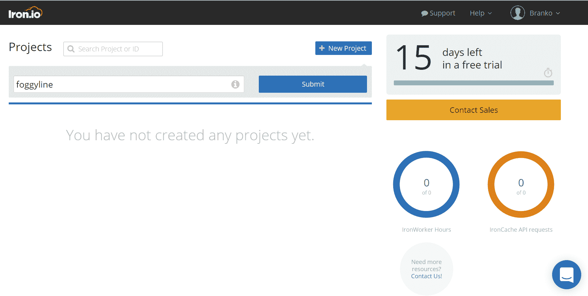

创建项目后，我们可以单击“项目设置”链接。这将打开一个包含多条信息的屏幕，包括身份验证/配置参数：


我们需要这些参数，因为我们稍后将配置`iron.json`文件。有了这些信息，我们就可以开始应用程序了。

在应用程序方面，我们首先安装`iron`控制台工具：

```php
curl -sSL https://cli.iron.io/install | sh

```

安装后，`iron`命令应可通过控制台使用，如以下屏幕截图所示：


我们现在准备开始我们的第一个 Iron 应用程序

假设我们有一个干净的目录，希望将应用程序文件放在其中，我们首先添加具有以下内容的`composer.json`：

```php
{
  "require": {
    "iron-io/iron_worker": "2.0.4",
    "iron-io/iron_mq": "2.*",
    "wp-cli/php-cli-tools": "~0.10.3"
  }
}

```

在这里，我们只是告诉 Composer 要引入哪些库：

*   `iron_worker`：这是铁匠的客户端库（[https://packagist.org/packages/iron-io/iron_worker](https://packagist.org/packages/iron-io/iron_worker)
*   `iron_mq`：这是 IronMQ 的客户端绑定（[https://packagist.org/packages/iron-io/iron_mq](https://packagist.org/packages/iron-io/iron_mq)
*   `php-cli-tools`：这些是 PHP 的控制台实用程序（[https://packagist.org/packages/wp-cli/php-cli-tools](https://packagist.org/packages/wp-cli/php-cli-tools)

然后我们创建`Dockerfile`，其内容如下：

```php
FROM iron/php

WORKDIR /app
ADD . /app

ENTRYPOINT ["php", "greet.php"]

```

这些`Dockerfile`指令帮助 Docker 自动为我们建立必要的形象。

然后我们添加`greet.payload.json`文件，其内容如下：

```php
{
  "name": "John"
}

```

这实际上不是过程中必要的一部分，但我们正在使用它来模拟应用程序接收的有效负载。

然后我们添加`greet.php`文件，其内容如下：

```php
<?php

require 'vendor/autoload.php';

$payload = IronWorker\Runtime::getPayload(true);

echo 'Welcome ', $payload['name'], PHP_EOL;

```

`greet.php`文件是我们的实际应用程序。在 IronWorker 服务上创建的作业将排队并执行此应用程序。应用程序本身很简单；它只是获取名为`name`的有效负载变量的值，并将其回传出来。这应该足以满足我们的钢铁工人演示目的。

然后我们创建具有类似内容的`iron.json`文件，如下所示：

```php
{
  "project_id": "589dc552827e8d00072c7e11",
  "token": "Gj5vBCht0BP9MeBUNn5g"
}

```

我们确保在 Iron.io 仪表板中粘贴从项目设置屏幕获得的`project_id`和`token`。

有了这些文件，我们已经定义了应用程序，现在可以开始 Docker 相关的任务了。总体思路是，我们将首先创建一个本地 Docker 映像，用于测试目的。完成测试后，我们将把 Docker 映像推送到 Docker 存储库中，然后配置 Iron.io 平台以使用 Docker 存储库中的映像来启动其 IronWorker 作业。

我们现在可以将工作依赖项安装到 Docker 中，正如`composer.json`文件所设置的那样。我们将通过运行以下命令来执行此操作：

```php
docker run --rm -v "$PWD":/worker -w /worker iron/php:dev composer install

```

输出应显示 Composer 安装依赖项，如以下屏幕截图所示：


一旦 Composer 安装完依赖项，我们应该测试应用程序是否正在执行。我们可以通过以下命令执行此操作：

```php
docker run --rm -e "PAYLOAD_FILE=greet.payload.json" -v "$PWD":/worker -w /worker iron/php php greet.php

```

前面命令的结果输出应该是欢迎 John 字符串，如此屏幕截图所示：

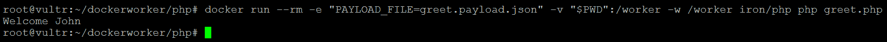

这证实了我们的 Docker 映像工作正常，我们现在准备将其构建并部署到[https://hub.docker.com](https://hub.docker.com) 。

Docker Hub, available at [https://hub.docker.com](https://hub.docker.com), is a cloud-based service that provides a centralized solution for container image management. While it is a commercial service, there is a free *one-repository* plan available.

假设我们已打开 Docker Hub 帐户，通过控制台执行以下命令会将我们标记为已登录：

```php
docker login --username=ajzele

```

Where `ajzele` is the username which should be replaced with our own:

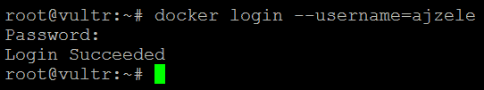

现在，我们可以通过执行以下命令来打包 Docker 映像：

```php
docker build -t ajzele/greet:0.0.1 .

```

这是一个标准的构建命令，将创建一个`ajzele/greet`映像，标记为版本`0.0.1`

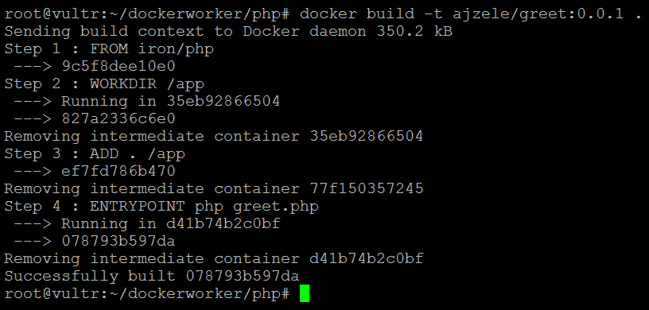

现在创建图像后，我们应该先对其进行测试，然后再将其推送到 Docker 中心。执行以下命令确认我们新创建的`ajzele/greet`映像工作正常：

```php
docker run --rm -it -e "PAYLOAD_FILE=greet.payload.json" ajzele/greet:0.0.1

```


生成的 Welcome John 输出确认我们的映像现在已准备好部署到 Docker Hub，这可以使用以下命令完成：

```php
docker push ajzele/greet:0.0.1

```

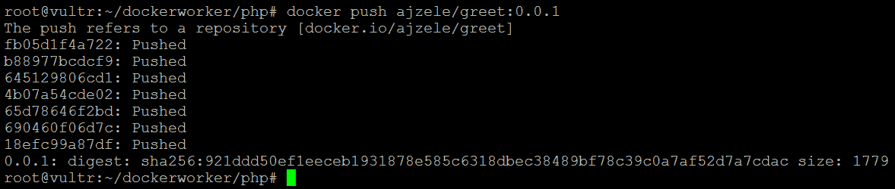

推送过程完成后，我们应该能够在 Docker Hub 仪表板下看到我们的图像：

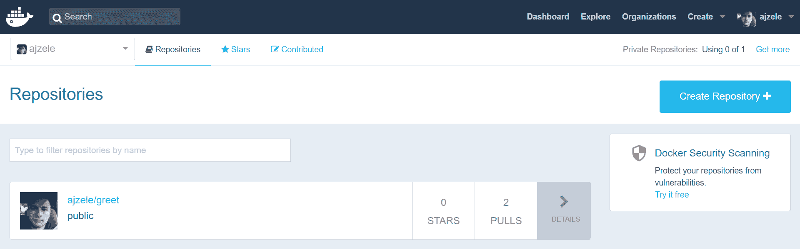

到目前为止，进步了不少，但我们已经接近了。现在，我们的应用程序已作为 Docker Hub 存储库中的 Docker 映像提供，我们可以将重点放回到 Iron.io 平台上。我们在流程早期安装的`iron`控制台工具能够将 Docker Hub 映像注册为 Iron.io 仪表板下的新工作人员：

```php
iron register ajzele/greet:0.0.1

```

以下屏幕截图显示了此命令的输出：

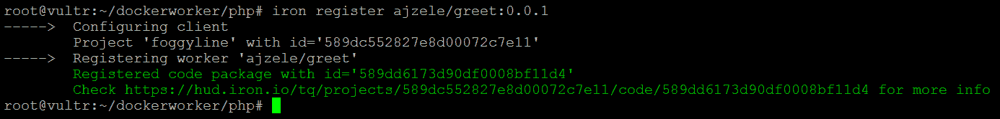

此时，我们应该在 Iron.io 仪表板的 TASKS 选项卡下看到`ajzele/greet`worker：


虽然工作进程已注册，但此时不会执行它。Iron.io 平台允许我们以计划任务或排队任务的形式执行 worker。

计划任务（如以下屏幕截图所示）允许我们选择已注册的 Docker 映像以及执行时间和一些其他选项：

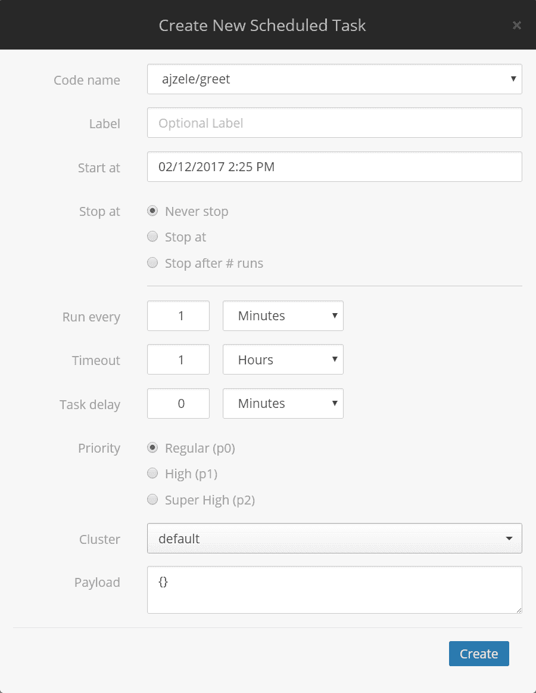

如以下屏幕截图所示，队列任务也允许我们选择已注册的 Docker 映像，但这次没有任何特定的定时配置：

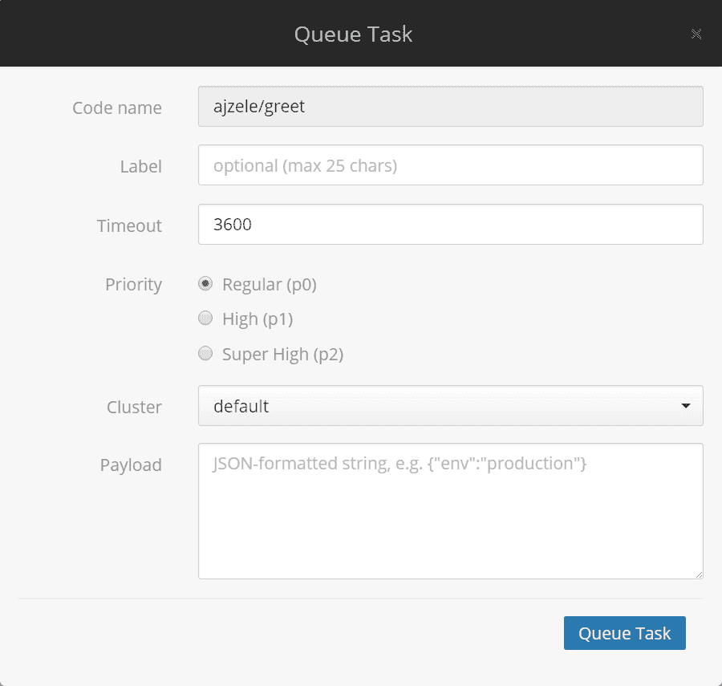

使用`iron`控制台工具，我们可以基于`ajzele/greet`工作者创建调度和队列任务。

以下命令基于`ajzele/greet`工作者创建计划任务：

```php
iron worker schedule --payload-file greet.payload.json -start-at="2017-02-12T14:16:28+00:00" ajzele/greet

```

`start-at`参数定义 RFC3339 格式的时间。

For more information about the RFC3339 format, check out [https://tools.ietf.org/html/rfc3339](https://tools.ietf.org/html/rfc3339).

以下屏幕截图显示了前面命令的输出：


Iron.io 仪表板现在应将其显示为计划任务部分下的新条目：


当计划时间到来时，Iron.io 平台将执行此计划任务。

以下命令基于`ajzele/greet`工作者创建排队任务：

```php
iron worker queue --payload-file greet.payload.json --wait ajzele/greet

```

以下屏幕截图显示了此命令的输出：

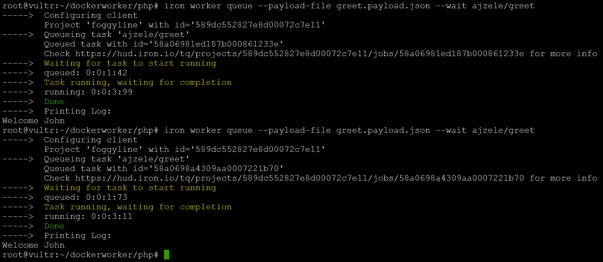

Iron.io 仪表板通过增加 TASKS 部分下的 Complete counter（以下屏幕截图中当前显示*3*）来注册每个已执行的任务：

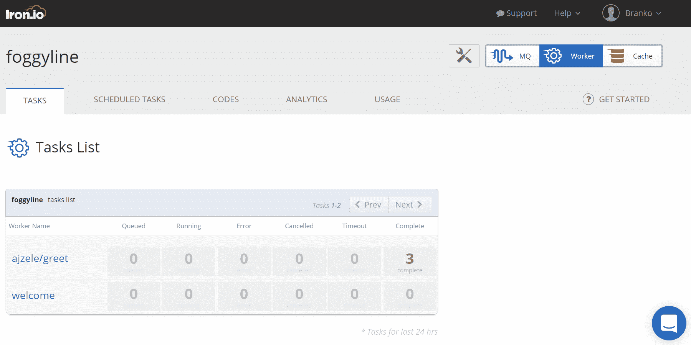

进入`ajzele/greet`工作人员会显示每个作业背后的详细信息，包括计划作业和排队作业：


到目前为止，您已经学习了如何创建 PHP 应用程序 Docker 映像，将其推送到 Docker Hub，在 Iron.io 平台上注册，以及开始调度和排队任务。关于调度和排队任务的部分可能有点棘手，因为我们是在控制台而不是 PHP 代码中进行的

幸运的是，`composer.json`文件引用了我们需要的所有库，以便能够从 PHP 代码中调度和排队任务。让我们假设一下，我们抓取了`iron.json`和`composer.json`文件，然后转移到一个完全不同的服务器上，甚至可能是我们本地的开发机器。我们只需要在控制台上运行`composer install`，创建`index.php`文件，内容如下：

```php
<?php

require './vendor/autoload.php';

$worker = new IronWorker\IronWorker();

$worker->postScheduleAdvanced(
  'ajzele/greet',
  ['name' => 'Mariya'],
  '2017-02-12T14:33:39+00:00'
);

$worker->postTask(
  'ajzele/greet',
  ['name' => 'Alice']
);

```

一旦执行此代码，它将创建一个计划任务和一个排队任务，就像`iron`控制台工具所做的那样。

虽然我们可能无法用 Iron.io 托管整个 PHP 应用程序，但 Iron.io 平台使创建和运行各种独立作业变得轻松无忧，为开发人员提供了有价值的无服务器体验。

# 总结

在本章中，我们采用了两种流行的无服务器平台——AWS 和 Iron.io——的实践方法。使用无服务器框架，我们能够快速地将代码部署到 AWS Lambda 服务。实际的部署涉及几个 AWS 服务，将我们的一小段代码公开为一个 RESTAPI 端点，在后台命中 AWS Lambda。所有的服务都由 AWS 管理，这给我们留下了真正的无服务器体验。如果我们仔细想想，这是一个非常强大的概念。除了 AWS 之外，Iron.io 是另一个有趣的无服务器平台。与 AWS Lamda 上的实时代码执行不同，Iron.io 上的代码作为计划/排队任务执行（更不用说 AWS 也没有自己的排队解决方案）。AWS Lambda 本机支持 Node.js、Java、Python 和.NET 核心运行时，而 Iron.io 则通过使用 Docker 容器来抽象语言。尽管如此，我们仍然能够通过 Node.js 包装 PHP 二进制文件来运行 PHP，即使在 AWS Lambda 上也是如此。

无服务器方法当然有其吸引力。虽然它可能不是我们某些应用程序的完整解决方案，但它肯定会占用大量资源。对某些人来说，轻松使用和按执行付费模式可以改变游戏规则。

接下来，我们将看看 PHP 在流行的反应式编程范式中提供了什么。