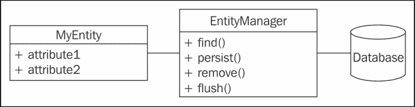

# 一、开始学习 Docvtrine2

条令项目是一个库集合，提供实用程序来简化 PHP 应用程序中的数据持久性。它可以在任何时候创建与流行的 DBMS 兼容的复杂模型层，包括 SQLite、MySQL 和 PostgreSQL。为了发现和理解条令，我们将在本书中从头开始创建一个小型博客，主要使用以下条令组件：

*   **Common**提供了 PHP 标准库中没有的实用程序，包括类自动加载程序、注释解析器、集合结构和缓存系统。
*   **数据库抽象层**（**DBAL**公开了一个访问流行 DBMS 的唯一接口。其 API 类似于 PDO（可能时使用 PDO）。DBAL 组件还能够在不同的 DBMS 上执行相同的 SQL 查询，方法是在内部重写查询以使用特定的构造并模拟缺少的功能。
*   **对象关系映射器****ORM**允许通过面向对象的 API 访问和管理关系数据库表和行。由于它，我们将直接操作 PHP 对象，并且它将透明地生成 SQL 查询来填充、持久化、更新和删除它们。它建立在 DBAL 之上，将是本书的主要主题。

### 注

有关 PHP 数据对象和 PHP 提供的数据访问抽象层的更多信息，请参阅以下链接：[http://php.net/manual/en/book.pdo.php](http://php.net/manual/en/book.pdo.php)

为了学习原则，我们将共同构建一个具有以下高级功能的微型博客引擎：

*   帖子列表、创建、编辑和删除
*   评论
*   标签过滤
*   文章和评论作者简介
*   统计数字
*   数据固定装置

以下是该博客的截图：


在本章中，我们将学习以下主题：

*   理解学说背后的概念
*   创建项目的结构
*   安装作曲家
*   通过 Compose 安装 ORM、DBAL 和 Common
*   启动应用程序
*   使用条令的实体管理器
*   配置条令命令行工具

# 先决条件

要学习本教程，我们需要正确安装 PHP5.4 或更高版本的 CLI。我们还将使用`curl`命令下载 Composer 归档文件和 SQLite 3 客户端。

### 注

有关 PHP CLI、curl 和 SQLite 的更多信息，请参阅以下链接：[http://www.php.net/manual/en/features.commandline.php, http://curl.haxx.se](http://www.php.net/manual/en/features.commandline.php, http://curl.haxx.se) 和[http://www.sqlite.org](http://www.sqlite.org)

在示例中，我们将使用 PHP 内置 web 服务器和 SQLite 作为 DBMS。Doctrine 是一个纯 PHP 库。它与支持 PHP 的任何 web 服务器兼容，但不限于 Apache 和 Nginx。当然，它也可以用于不打算在 web 服务器上运行的应用程序，例如命令行工具。在数据库方面，正式支持 SQLite、MySQL、PostgreSQL、Oracle 和 Microsoft SQL Server。

多亏了 DBAL 组件，我们的博客应该可以很好地与所有这些 DBMS 配合使用。它已经用 SQLite 和 MySQL 进行了测试。

Doctrine 项目还为 NoSQL 数据库（包括 MongoDB、CouchDB、PHPCR 和 OrientDB）提供了**对象文档映射器**（**ODM**）。本书不涉及这些主题。

### 注

阅读本书时，请随时查阅以下链接中指定的条令文件：[http://www.doctrine-project.org](http://www.doctrine-project.org)

# 理解 Docvtrine 背后的概念

条令 ORM 实现了**数据映射器**和**工作单元**设计模式。

数据映射器是一个用于将数据库中存储的数据与其域层的相关对象同步的层。换句话说，它执行以下操作：

*   插入和更新数据库中由对象属性保存的数据中的行
*   当相关实体标记为删除时，删除数据库中的行
*   **使用从数据库检索的数据在内存对象中生成**

### 注

有关数据映射器和工作单元设计模式的更多信息，请参考以下链接：[http://martinfowler.com/eaaCatalog/dataMapper.html](http://martinfowler.com/eaaCatalog/dataMapper.html) 和[http://martinfowler.com/eaaCatalog/unitOfWork.html](http://martinfowler.com/eaaCatalog/unitOfWork.html)

在条令术语中，数据映射器称为**实体管理器**。实体是域层的普通旧 PHP 对象。

多亏了实体管理器，他们不必知道它们将存储在数据库中。事实上，他们不需要知道实体管理器本身的存在。这种设计模式允许重用实体类，而不考虑持久性系统。

为了性能和数据一致性，实体管理器不会在每次修改实体时将其与数据库同步。工作单元设计模式用于保持数据映射器管理的对象的状态。数据库同步仅在实体管理器的`flush()`方法的调用请求时发生，并且在事务中完成（如果在将实体同步到数据库时出错，数据库将回滚到同步尝试之前的状态）。

想象一个拥有公共财产的实体。设想正在执行以下代码：

```php
  $myEntity->name = 'My name';
  $myEntity->name = 'Kévin';
  $entityManager->flush($myEntity);
```

由于工作单元设计模式的实施，条令只会发出一个类似于以下内容的 SQL 查询：

```php
 UPDATE MyEntity SET name='Kévin' WHERE id=1312;

```

### 注

查询类似，因为出于性能原因，条令使用准备好的语句。

我们将通过对实体管理器方法及其相关实体状态的简要概述来完成理论部分。

以下是表示实体及其实体管理器的类图摘录：



*   The `find()` method **hydrates** and returns an entity of the type **passed** in the first parameter having the second parameter as an **identifier**. Data is retrieved from the database through a `SELECT` query. The state of this returned entity is **managed**. It means that when the `flush()` method is called, changes made to it will be synced to the database. The `find()` method is a convenience method that internally uses an **entity repository** to retrieve data from the database and hydrate the entity. The state of the managed entities can be changed to **detached** by calling the `detach()` method. Modifications made to the detached entity will not be synced to the database (even when the `flush()` method is called) until its state is set back to **managed** with a call to the `merge()` method.

    ### 注

    [第 3 章](3.html "Chapter 3. Associations")*协会*的开始部分将专用于实体存储库。

*   `persist()`方法告诉条令将传入参数的实体状态设置为托管。这仅适用于至少一次未同步到数据库的实体（新创建对象的默认状态为**new**），因为从现有数据中提取的实体自动具有托管状态。
*   `remove()`方法将传入实体的状态设置为**已移除**。下次调用`flush()`方法时，将通过`DELETE`SQL 查询有效地从数据库中删除与此实体相关的数据。
*   `flush()`方法将**管理的**和**删除的**状态的实体数据同步到数据库中。条令将为同步发出`INSERT`、`UPDATE`和`DELETE`SQL 查询。在该调用之前，所有更改都只在内存中，从不与数据库同步。

### 注

条令的实体经理在条令网站[上记录了许多其他有用的方法 http://www.doctrine-project.org/api/orm/2.4/class-Doctrine.ORM.EntityManager.html](http://www.doctrine-project.org/api/orm/2.4/class-Doctrine.ORM.EntityManager.html) 。

目前这是一个抽象的概念，但我们将通过本书中的大量示例更好地理解实体管理器是如何工作的。

# 创建项目结构

以下是我们 app 的文件夹结构：

*   `blog/`：先前创建的应用程序根目录
*   `bin/`：我们博客应用的具体命令行工具
*   `config/`：我们 app 的配置文件
*   `data/`：SQLite 数据库将存储在这里
*   `src/`：我们编写的所有 PHP 类都将在这里
*   `vendor/`：这是**Composer**（见下节）存储所有下载的依赖项的地方，包括信条的源代码
*   `bin/`：这是由与 Composer 一起安装的依赖项提供的命令行工具
*   `web/`：这是包含 PHP 页面和资源（如图像、CSS 和 JavaScript 文件）的公共目录

我们必须创建所有这些目录，除了稍后自动生成的`vendor/`目录。

# 安装作曲家

与大多数现代 PHP 库一样，可以通过功能强大的依赖关系管理器 Composer 获得 Doctrine。还提供梨形通道。

### 注

有关 Composer 和 Pear 软件包的更多信息，请参考以下相应链接：[http://getcomposer.org](http://getcomposer.org) 和[http://pear.doctrine-project.org](http://pear.doctrine-project.org)

要安装 Composer，应执行以下步骤：

1.  安装 ORM 的第一步是获取最新 Composer 版本的副本。
2.  Open your preferred terminal, go to the `blog/` directory (the root of our project), and type the following command to install Composer:

    ```php
     curl -sS https://getcomposer.org/installer | php

    ```

    目录中已下载一个名为`composer.phar`的新文件。这是一个独立的作曲家档案。

3.  Now type the following command:

    ```php
     php composer.phar

    ```

    如果一切正常，将列出所有可用命令。您的 Composer 安装已启动并正在运行！

# 安装原则

安装原则需要执行以下步骤：

1.  To install Doctrine, we need to create a file called `composer.json` in our new `blog` directory. It lists dependencies of our project as shown in the following code:

    ```php
    {
        "name": "myname/blog",
        "type": "project",
        "description": "My small blog to play with Doctrine",

        "require": {
     "doctrine/orm": "2.4.*"
        },

        "autoload": {
     "psr-0": { "": "src/" }
        }
    } 
    ```

    Composer 将解析此标准 JSON 文件，以下载并安装所有指定的依赖项。一旦安装，Composer 将自动加载这些库的所有类。

    `name`、`type`和`description`属性是可选的，但最好始终填充它们。他们提供了关于我们正在进行的项目的一般信息。

    这个`composer.json`文件中更有趣的部分是`require`字段。为了让 Composer 安装它，我们的应用程序使用的所有库都必须列在这里。在默认的 Composer 软件包存储库**PackageGist**上有很多 PHP 库。当然，这是条令工程的情况。

    ### 注

    有关 PackageGist 的更多信息，请点击以下链接：[https://packagist.org/](https://packagist.org/)

    我们表示，我们需要 ORM 2.4 分支的最新次要版本。您可以在这里设置主要版本或次要版本，甚至可以设置更复杂的内容。

    ### 注

    有关软件包版本的更多信息，请参考以下链接：[http://getcomposer.org/doc/01-basic-usage.md#package-版本](http://getcomposer.org/doc/01-basic-usage.md#package-versions)

    `autoload`字段告诉 Composer 自动加载我们应用程序的类。我们将把我们的特定代码放在一个名为`src/`的目录中。我们的文件和类将遵循`PSR-0`名称空间和文件命名标准。

    ### 注

    PHP 规范请求旨在提高 PHP 应用程序和库的互操作性。可在[处购买 http://www.php-fig.org/](http://www.php-fig.org/) 。

2.  It's time to use Composer to install the ORM. Run the following command:

    ```php
     php composer.phar install

    ```

    新文件出现在`vendor/`目录中。已经安装了条令 ORM，而且 Composer 足够聪明，可以获得它的所有依赖项，包括条令 DBAL 和条令 Common。

    还创建了一个`composer.lock`文件。它包含已安装库的精确版本。这对于部署应用程序非常有用。多亏了这个文件，当运行`install`命令时，Composer 将能够检索开发中使用的相同版本。

    条令现在安装正确。很简单，不是吗？

3.  要在 2.4 分支中有新版本时更新库，只需键入以下命令：

    ```php
     php composer.phar update

    ```

# 启动应用程序

引导应用程序需要执行以下步骤：

1.  Create a new file called `config/config.php` that will contain configuration parameters of our app as shown in the following code:

    ```php
      <?php

      // App configuration
      $dbParams = [
        'driver' => 'pdo_sqlite',
        'path' => __DIR__.'/../data/blog.db'
      ];

      // Dev mode?
      $dev = true;
    ```

    条令配置参数存储在`$dbParams`数组中。我们将使用一个名为`blog.db`的 SQLite 数据库，该数据库存储在`data/`目录中。如果您想使用 MySQL 或任何其他 DBMS，您将在这里配置要使用的驱动程序、数据库名称和访问凭据。

    ### 注

    以下是使用 MySQL 而不是 SQLite 的示例配置：

    ```php
    $dbParams = [
        'driver' => 'pdo_mysql',
        'host' => '127.0.0.1',
        'dbname' => 'blog',
        'user' => 'root',
        'password' => ''
    ];
    ```

    配置键是不言自明的。

    如果`$dev`变量为`true`，则会禁用一些优化以便于调试。禁用`dev`模式可以将大量数据（如元数据）放入强大的缓存中，以提高应用程序的整体性能。

    ### 注

    需要安装缓存驱动程序并进行额外配置，可在[上找到 http://docs.doctrine-project.org/en/latest/reference/caching.html](http://docs.doctrine-project.org/en/latest/reference/caching.html) 。

2.  Next, we need a way to bootstrap our app. Create a file called `bootstrap.php` in the `src/` directory. This file will load everything we need as given in the following code:

    ```php
      <?php

      require_once __DIR__.'/../vendor/autoload.php';
      require_once __DIR__.'/../config/config.php';
    ```

    第一行需要作曲家自动加载器。它允许您自动加载条令类、项目类（将在`src/`目录中）以及安装有 Composer 的库的任何类。

    第二行导入应用程序的配置文件。创建项目结构并完成应用程序的初始化过程。我们已经准备好开始使用条令。

# 使用条令的实体经理

ORM 的原理是通过一个面向对象的 API 管理存储在关系数据库中的数据。我们在本章前面了解了它的基本概念。

每个实体类都映射到相关的数据库表。实体类的属性映射到表的列。

因此，数据库表的行在 PHP 应用程序中由一组实体表示。

条令 ORM 能够从数据库中检索数据并用它们填充实体。这个过程叫做水合作用。

### 注

Doctrine 可以用不同的方式（使用对象图、矩形结果集等）填充 PHP 数组，而不是实体。也可以参考以下链接创建自定义水合器：[http://docs.doctrine-project.org/en/latest/reference/dql-doctrine-query-language.html#hydration-模式](http://docs.doctrine-project.org/en/latest/reference/dql-doctrine-query-language.html#hydration-modes)

正如我们在数据映射器设计模式中所了解到的，它还做相反的工作：将实体持有的数据持久化到数据库中。

稍后我们将与实体进行大量合作。

条令随附以下文件，用于将实体映射到表：

*   注释块中直接嵌入实体的注释
*   XML 配置文件
*   YAML 配置文件
*   普通 PHP 文件

注释在 PHP 世界中是相当新的（在 Java 中很流行），但它们已经被 Doctrine 和 Symfony 社区广泛使用。这种方法的优点是可读性和维护方便，因为映射信息位于 PHP 代码的旁边。在某些上下文中，将映射信息直接放在代码中也是一个缺点，特别是对于使用多个持久性系统的大型项目。

我们将在本书中使用注释方法，但其他方法将在条令文档中描述。我们将在[第 2 章](2.html "Chapter 2. Entities and Mapping Information")、*实体和映射信息*中返回到它们。

在下一章[第 2 章](2.html "Chapter 2. Entities and Mapping Information")、*实体和映射信息*中，我们将发现条令足够聪明，可以使用映射信息自动创建相关的数据库模式。

现在，我们将着重于检索实体管理器。当实体通过它被检索、持久化、更新和删除时，这就是 ORM 的入口点。

编辑`src/bootstrap.php`文件以检索条令的实体管理器。在此文件末尾添加以下代码：

```php
  $entitiesPath = array(__DIR__.'/Blog/Entity');
  $config = Setup::createAnnotationMetadataConfiguration    ($entitiesPath, $dev);
  $entityManager = EntityManager::create($dbParams, $config);
```

### 提示

**下载示例代码**

您可以下载您在[账户购买的所有 Packt 书籍的示例代码文件 http://www.packtpub.com](http://www.packtpub.com) 。如果您在其他地方购买了本书，您可以访问[http://www.packtpub.com/support](http://www.packtpub.com/support) 并注册，将文件直接通过电子邮件发送给您。

`$entitiesPath`属性包含存储实体类的目录的路径列表。我们已经提到，我们的应用程序将遵循`PSR-0`名称空间约定。`\Blog`文件夹将是根命名空间，实体类将位于`\Blog\Entity`文件夹中。

创建条令配置是为了使用注释映射信息，并能够定位我们将创建的博客实体。

新的`EntityManager`已创建并配置为使用我们的数据库和条令设置。

为了简单起见，我们创建了一个独特的实体管理器，它将在整个应用程序中使用。对于真实世界的应用程序，您应该看看依赖项注入设计模式。

### 注

有关依赖项注入模式的更多信息，请访问以下链接：[http://en.wikipedia.org/wiki/Dependency_injection](http://en.wikipedia.org/wiki/Dependency_injection)

# 配置条令命令行工具

条令库与一些有用的命令行工具捆绑在一起。它们提供了许多有用的特性，包括但不限于从实体映射创建数据库模式的能力。

Composer 在`vendor/bin/`目录中安装了条令的命令行工具。但在能够使用它们之前，必须进行一些配置。命令行工具在内部使用实体管理器。我们需要告诉他们如何取回它。

在这里，我们只需要在`config/`目录中再创建一个名为`cli-config.php`的文件，如下所示：

```php
  <?php

// Doctrine CLI configuration file

use Doctrine\ORM\Tools\Console\ConsoleRunner;

require_once __DIR__.'/../src/bootstrap.php';

return ConsoleRunner::createHelperSet($entityManager);
```

由于条令的约定，条令 CLI 将自动检测并使用该文件。

### 注

命令行工具将在当前目录和`config/`目录中查找名为`cli-config.php`的文件。

该文件只是使用我们前面创建的实用程序类获取一个新的实体管理器，并将 Doctrine CLI 配置为使用它。

键入以下命令以获取可用条令命令的列表：

```php
 php vendor/bin/doctrine.php

```

# 总结

在这一章中，我们发现了学说的基本原理。我们现在知道了实体和实体管理器是什么，我们用 Composer dependency manager 安装了条令，我们创建了博客应用程序的框架，我们成功地启动并运行了命令行工具。

在下一章中，我们将创建第一个实体类，发现大量注释以将其映射到数据库，生成数据库模式，并开始处理实体。到下一章结束时，我们博客的帖子系统将开始工作！