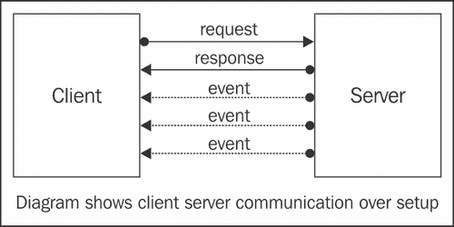

# 七、实现构建 Ajax 网站的最佳实践

在本章中，我们将介绍：

*   避免特定于 HTML 标记的编码
*   构建安全的 Ajax 网站
*   构建搜索引擎优化（SEO）友好的 Ajax 网站
*   保留浏览器历史记录或取消中断浏览器的“后退”按钮
*   实现 comet PHP 和 Ajax

把事情做好是一回事，把事情做好是另一回事。JavaScript 程序员通常追求最佳实践。随着 UI 编程越来越流行，它需要更好的组织和实践。在本章中，我们将看到一些常见的最佳实践。

# 避免特定于 HTML 标记的编码

在不引人注目的 JavaScript 方法中，基于选择器的框架（如 jQuery）起着主要作用，HTML 内容和 JavaScript 之间的交互是通过 CSS 选择器完成的。

## 准备好了吗

假设我们有一个 ID 为 `alert`的容器，我们的目的是隐藏它及其邻居，也就是说，隐藏其父容器的所有元素：

```php
<!DOCTYPE html PUBLIC "-//W3C//DTD XHTML 1.0 Strict//EN"
"http://www.w3.org/TR/xhtml1/DTD/xhtml1-strict.dtd">
<html >
<head>
<script type="text/javascript" src="jquery.min.js">
</script>
<script type="text/javascript" src="markup-dependent.js">
</script>
<title>Markup dependent jQuery</title>
</head>
<body>
<div>
<a href="#" id="trigger">Hide alert's siblings</a>
</div>
<div id="alert-parent">
<div id="alert-sibling1">
Alert Sibling1
</div>
<div id="alert">
Alert
</div>
<div id="alert-sibling2">
Alert Sibling2
</div>
<div id="alert-sibling3">
Alert Sibling3
</div>
</div>
</body>
</html>
jQuery(document).ready(function($){
$('#trigger').click(function(){
$('#alert').parent().hide();
return false;
});
});

```

到目前为止，一切顺利。但是，从代码可维护性的角度来看，这种方法是错误的。

## 怎么做。。。

在 Web2.0 世界中，网站的设计必须定期更改以给客户带来新鲜感，UI 设计师必须努力工作以带来新鲜感和更好的可用性。对于前面的标记，假设 UI 设计器在 `alert`容器周围添加了一个额外的边框。CSS 程序员更容易的方法是用另一个容器包装 `alert`容器以获得边框：

```php
<div id="border-of-alert">
<div id="alert">
Alert
</div>
</div>

```

现在，以前的 JavaScript 功能无法按预期工作。CSS 程序员在不知不觉中破坏了网站，尽管他们能够在 `alert`容器周围添加另一个边框。

这说明了 JavaScript 和 CSS 程序员需要协议和标准，这样他们就不会在不知不觉中破坏网站。可通过以下方式完成：

1.  通过命名约定引入协议
2.  以不同的方式处理情况

## 它是如何工作的。。。

我们将看到命名约定和不同的方法将如何帮助我们。

### 通过命名约定引入协议：

当 CSS 程序员更改 HTML 标记时，没有迹象表明该标记与 JavaScript 功能相关。下面是命名约定和规则：

*   所有用于 Ajax 目的的选择器都应加上前缀 `js-`
*   每当标记与 JavaScript 功能相关联时，都必须在 PHP 级别对其进行注释（作为注释，HTML 注释将向最终用户公开）

请注意，在与 CSS 程序员达成共同协议后，我们可以引入更多此类协议。根据我们引入的协议，HTML 标记必须更改为：

```php
<!DOCTYPE html PUBLIC "-//W3C//DTD XHTML 1.0 Strict//EN"
"http://www.w3.org/TR/xhtml1/DTD/xhtml1-strict.dtd">
<html >
<head>
<script type="text/javascript" src="jquery.min.js">
</script>
<script type="text/javascript" src="no-dependent.js">
</script>
<title>No dependent jQuery - Good</title>
</head>
<body>
<div>
<?php
/*
* Ajax note:
* When js-trigger is clicked, parent and siblings
* of js-alert will hide. "js-alert-parent" is referred
* in JavaScript
*/
?>
<a href="#" id="js-trigger">Hide alert's siblings</a>
</div>
<div id="js-alert-parent">
<div id="alert-sibling1">
Alert Sibling1
</div>
<div id="js-alert">
Alert
</div>
<div id="alert-sibling2">
Alert Sibling2
</div>
<div id="alert-sibling3">
Alert Sibling3
</div>
</div>
</body>
</html>

```

### 接近问题陈述：

如果我们直接引用父元素，而不是通过 `alert`容器的父元素接近要隐藏的元素，则问题概率会降低：

```php
jQuery(document).ready(function($){
$('#js-trigger').click(function(){
$('#js-alert-parent').hide();
return false;
});
});

```

注意，在这里，我们没有使用 `parent()`方法。换句话说，若我们可以避免使用标记特定的 `parent()`和 `children()`方法，我们就相对安全地避免了被破坏的站点。

## 还有更多。。。

一般来说，通过代码搜索很容易找到 `parent()`和 `children()`的用法。但是，如果使用是从未知位置触发的，我们可能会破解 jQuery 代码，将通知扔到 Firebug 控制台中。

### 控制台。警告（）

为了警告开发人员不要使用它，我们可以使用 jQueryCore 的 `parent()`方法，并通过 Firebug 的控制台 API 添加一个警告：

```php
console.warn('Call to parent(). Warning: It may break when HTML code changes');

```

类似地，我们可以在 `children()`方法中添加警告：

```php
console.warn('Call to children(). Warning: It may break when HTML code changes');

```

# 构建安全的 Ajax 网站

Ajax 本身不会产生任何安全风险，但使网站 Ajaxified 的方法可能会带来安全风险。这些风险对于所有 web 应用程序都是常见的。

## 准备好了吗

我们需要安装开发工具的 web 浏览器。可能的工具有 Firefox 和 Firebug。

## 怎么做。。。

Ajax 或非 Ajax web 应用程序中常见的安全威胁有 XSS、SQL 注入和会话劫持。我们将看看如何预防它们。

1.  **XSS**

    XSS 或跨站点脚本攻击利用通过用户输入或通过某种手段入侵 URL 向网站添加脚本的能力。让我们以流行的推特网站为例，该网站允许用户输入他们的个人信息。考虑下面的输入为 Po.T0.生物 BiT1 字段：

    ```php
    <script>alert('XSS');</script>

    ```

    如果 Twitter 工程师允许 HTML 执行，或者在显示条目之前没有对其进行清理，它会提示一个带有文本**XSS**的警告框。在真实场景中，它不会是警报框，但可能是恶意活动，例如通过已知 URL 模仿用户输入或窃取用户数据或劫持会话：

    ```php
    ajaxReq('http://example.com/updateUser.php?passwd=xyz');

    ```

    通常，黑客可能无法直接访问 `updateUser.php`页面；但是 JavaScript 代码可以完全访问，因为它在当前会话范围内。因此，在这里，我们还必须看看我们的体系结构：

    ```php
    document.write('';

    ```

    由于能够执行此恶意代码，黑客可能会开始窃取浏览器 cookie。通过 cookie 中可用的会话 ID，黑客可以劫持用户的会话。

    **溶液：**

    XSS 的可能解决方案为：

    *   `strip_tags()`

        但是，当我们必须显示 HTML 输入时，它可能不是一个好的解决方案。

    *   HTML Purifier library [http://htmlpurifier.org/](http://htmlpurifier.org/)

        这个库可以净化 HTML 代码，因此对于 XSS 问题来说是一个更好的选择。

2.  **Session hijacking**

    如前所述，黑客可能窃取 cookie 数据，从而获得用户的会话 ID。当黑客通过 cookie 编辑工具设置其浏览器的会话值时，黑客将访问其他用户的会话。当服务器或脚本被编程为在所有通信中使用相同的会话 ID 时，这种威胁通常很常见。

    **溶液：**

    一个可能的快速解决方案是为每个请求生成一个新的会话 ID，其中包括：

    `session_regenerate_id()`

3.  **SQL 注入**

当 SQL 查询对用户输入执行操作以获得某些结果时，如果用户输入未正确清理，则可能会更改 SQL 查询。例如：

```php
$sql = 'SELECT COUNT(*) FROM users WHERE username=\''.$_POST['username'].'\' AND passwd=\''.$_POST['passwd'].'\'';

```

前面的代码是用于用户名和密码组合的登录验证的新手代码。在以下情况下，这将非常失败：

```php
$_POST['username'] = 'anything'
$_POST['passwd'] = "anything' OR 1=1"

```

由于 `OR 1=1`注入，将查询扩展为 true：

```php
SELECT COUNT(*) FROM users WHERE username='anything' AND passwd='anything' OR 1=1'

```

**溶液：**

SQL 注入的唯一防弹解决方案是使用 `mysqli`扩展和 PDO 包装器准备好的语句：

```php
$sql = 'SELECT COUNT(*) FROM users WHERE username=:username AND passwd=:passwd';
$sth = $dbh->prepare($sql);
$sth->bindParam(':username', $_POST['username'], PDO::PARAM_STR);
$sth->bindParam(':passwd', $_POST['passwd'], PDO::PARAM_STR);
$sth->execute();
$count = $sth->fetchColumn();

```

此外，我们决不能以明文形式存储密码，我们必须在数据库中只存储盐哈希。这样，当攻击者以某种方式访问数据库时，我们可以避免密码以明文形式暴露给他/她。以前，开发人员使用 MD5 和 SHA-512 散列函数，但现在建议只使用 bcrypt。这是因为，使用 bcrypt，破解原始密码所需的时间比使用任何其他哈希算法所需的时间都要多。

### Ajax 应用程序的常见错误

**仅客户端决定：**

仅客户端验证、数据绑定和决策是 Ajax 应用程序的常见错误。

通过禁用 JavaScript 或通过 cURL 直接请求攻击 URL，很容易破坏仅客户端验证。

在购物车中，优惠券折扣或优惠券验证必须在服务器端完成。例如，如果购物车页面为优惠券代码提供折扣，则必须在服务器端确定优惠券代码的有效性。在客户端 JavaScript 中检查优惠券代码的模式是一种糟糕的方法。用户可以通过查看 JavaScript 代码找到优惠券代码模式并生成任意数量的优惠券！同样，最终支付金额必须在服务器端决定。将最终应付金额保存在隐藏表单字段或只读输入字段中，而不在下订单时验证应付金额和已付金额，这也是一种糟糕的方法。通过 Firebug 和 Web Developer extension 等浏览器扩展，很容易更改隐藏或只读的任何表单字段。

**溶液：**

解决方案是始终在服务器端而不是客户端做出决定。请记住，任何东西，即使是封装在 JavaScript 中的神秘逻辑，都已经向世界公开了。

**代码架构问题：**

架构不良的代码和逻辑性差的代码是一个很大的风险。它们经常公开意外数据。

我们拿`http://example.com/user.php?field=email&id=2`吧。编写此脚本是为了从 users 表中返回给定 `id`的 `field`参数所引用字段的值。此代码体系结构的意外攻击是通过使用（例如） `http://example.com/user.php?field=passwd&id=2`暴露任何字段（包括密码和其他敏感数据）的能力。

通过 web 2.0 网站中常见的 web 服务，还可能出现其他此类数据暴露。当访问数据没有限制时，用户可以通过 web 服务窃取数据，即使他们无法在主要网站上访问数据。Web 服务通常以 JSON 或 XML 形式公开数据，这使得黑客可以轻松地利用这些数据。

**溶液：**

这些问题的解决办法是：

*   **Whitelisting and blacklisting requests:**

    通过维护可以允许或拒绝的请求列表，可以将攻击降至最低。

*   **Throttling of requests:**

    请求可以通过访问令牌进行速率限制，这样黑客就不能获取超过允许范围的数据。

*   **Improving the code architecture from the beginning:**

    当架构和框架从一开始就以 Ajax 和 Web2.0 为目标进行规划时，这些问题可以最小化。显然，每个体系结构都可能有自己的问题。

## 它是如何工作的。。。

XSS 是当其他用户查看页面时在其他域上执行 JavaScript 代码的能力。通过这种方式，攻击者可能会执行/触发意外的 URL。此外，攻击者还可以窃取会话 cookie 并将其发送到自己的网页。一旦会话 cookie 在攻击者的网页上可用，攻击者就可以使用它劫持会话，而无需知道其他用户的登录详细信息。当 SQL 语句没有正确转义时，可以通过表单输入更改原始的预期语句；这称为 SQL 注入。

下表显示了 web 浏览器在处理来自[的 Ajax 请求时遵循的同源策略 http://www.example.com/page.html](http://www.example.com/page.html) 到不同的 URL：

<colgroup><col style="text-align: left"> <col style="text-align: left"></colgroup> 
| 

统一资源定位地址

 | 

通道

 |
| --- | --- |
| `http://subdomain.example.com/page.htm` | 不允许。不同的主人 |
| `http://example.com/page.html` | 不允许。不同的主人 |
| `http://www.example.com:8080/page.html` | 不允许。不同端口 |
| `"http://www.example.com/dir/page.html"` | 允许。相同的域、协议和端口 |
| `https://www.example.com/page.html` | 不允许。不同协议 |

在 web 浏览器中严格遵循该策略，以避免 Ajax 中的任何直接安全风险。其他可能的安全风险对于所有基于 web 的应用程序来说都是常见的，并且是由常见错误引起的。通过适当的安全审计，我们可以避免进一步的风险。

## 还有更多。。。

通常，通过自动化审计工具比手动代码检查更容易避免安全风险。很少有开源工具可用于缓解安全问题。

### 剥削我

利用我，可在[获取 http://labs.securitycompass.com/index.php/exploit-me/](http://labs.securitycompass.com/index.php/exploit-me/) 是一组与安全相关的 Firefox 扩展，用于测试 XSS、SQL 注入和访问漏洞。这是一种强大的开源方法，可以快速审核网站。

### WebInspect

HP 提供的 WebInspect web 安全审计工具是一种企业审计工具，可扫描大量漏洞和安全向量。可在[获取 https://www.fortify.com/products/web_inspect.html](http://https://www.fortify.com/products/web_inspect.html) 。

### 资源

专门用于 PHP 安全性的站点和工具很少：

*   PHP 安全联盟，位于[http://phpsec.org/](http://phpsec.org/) ，提供安全相关信息。
*   硬化 PHP 项目的 Suhosin，位于[http://www.hardened-php.org/suhosin/](http://www.hardened-php.org/suhosin/) 为普通 PHP 构建中可能存在的常见安全漏洞提供了补丁。
*   `mod_security`Apache mod，可在[下载 http://www.modsecurity.org/](http://www.modsecurity.org/) ，保护服务器免受常见的安全攻击。

# 建立 SEO 友好的 Ajax 网站

在互联网上，网站及其商业模式大多依赖搜索引擎。比如说，当用户在谷歌搜索引擎中搜索关键词“图书出版”时，如果 Packt 的网站列在搜索结果的第一页，这将是 Packt 的优势，尤其是当其商业模式依赖于互联网用户时。

搜索引擎，如谷歌，根据一系列因素（称为算法）对结果页面进行排序。这些是：页面上的关键词密度、页面的可信内部链接、网站的流行度等等。所有这些都取决于搜索引擎的蜘蛛能够爬行（或到达）网站内容的距离。如果网站的索引页面没有指向网站内部页面的链接，限制了对内部页面的访问，或者没有通过爬行器在爬行时查找的 `sitemap.xml`文件公开内部页面，则内容将不会被索引，也无法搜索。

依赖搜索引擎结果的 Web 2.0 网站的商业模式面临的挑战是，它们必须采用现代 Ajax 方法来提高最终用户的可用性和保留率，但还需要有搜索引擎蜘蛛可以访问和抓取的内容。输入 Ajax 和 SEO。

## 准备好了吗

为了开发搜索引擎友好的网站，我们需要通过一种不引人注目的 JavaScript 方法来逐步增强。下面将解释这种方法和术语。

## 怎么做。。。

采用 SEO 友好的 Ajax 的更简单方法是渐进增强。这有助于任何人（包括不在浏览器中使用 JavaScript 引擎的人）访问页面。

为了理解这个概念，我们来看看一个有标签的 Ajax UI 和选项卡从不同的远程页面加载的情况：

```php
<!DOCTYPE html PUBLIC "-//W3C//DTD XHTML 1.0 Strict//EN"
"http://www.w3.org/TR/xhtml1/DTD/xhtml1-strict.dtd">
<html >
<head>
<script type="text/javascript" src="jquery.min.js">
</script>
<script type="text/javascript" src="script.js">
</script>
<title>Tab - without SEO friendliness</title>
</head>
<body>
<div id="tabs">
<ul>
<li><a id="t1" href="#">Tab 1</a></li>
<li><a id="t2" href="#">Tab 2</a></li>
<li><a id="t3" href="#">Tab 3</a></li>
<li><a id="t4" href="#">Tab 4</a></li>
</ul>
<div id="tab-1">
<p>Tab - 1</p>
</div>
<div id="tab-2">
<p>Tab - 2</p>
</div>
<div id="tab-3">
<p>Tab - 3</p>
</div>
<div id="tab-4">
<p>Tab - 4</p>
</div>
</div>
</body>
</html>
jQuery(document).ready(function($){
$('#t1, #t2, #t3, #t4').click(function(){
//extract the clicked element id's number
// as we have single handler for all ids
id=this.id.match(/\d/);
//load respective tab container with
// respective page like /page3.html
$('#tab-'+id).load('/page'+id+'.html');
return false;
});
});

```

如前所示，每个选项卡的内容都是从 `page1.html, page2.html`加载的，依此类推。但是，当检查 HTML 源时，加载内容的 URL 是未知的；URL 是用 JavaScript 代码形成的，内容是动态加载的。由于大多数搜索引擎爬虫不支持 JavaScript 引擎，并且至少目前无法支持它，因此它们将错过内容。只有当爬虫可以“查看”内容时，它才能被搜索。

因此，为了获得正确的搜索引擎和 SEO 友好性，我们有以下方法：

*   Cloaking:

    这是用于通过嗅探用户代理向搜索引擎爬行器呈现不同内容的术语。但是，为了提高搜索引擎的质量，谷歌等搜索引擎禁止隐藏其内容的网站。

*   `Sitemap.xml:`

    在`Sitemap.xml`中显示所有内部链接可以提高搜索引擎的可访问性。`Sitemap.xml`是向谷歌公开网站链接的标准。但是，这是不够的，不应该意外地与斗篷混为一谈。

*   Inline tabs:

    通过在单个条目页面中转储所有内容并使用隐藏和显示，我们可以提高搜索引擎的可访问性。但是，从搜索引擎优化的角度来看，这个解决方案失败了，因为搜索引擎蜘蛛找不到足够的页面。

*   Progressive enhancements:

    通过这种方式，所有浏览器都可以访问网站。Ajax 增强不会妨碍非 JavaScript 浏览器的可见性/可访问性。到目前为止，这是最好的方法，当与`Sitemap.xml`结合时，可以提供更好的搜索引擎可视性。

现在，让我们看看如何通过渐进式增强方法实现标签系统。为此，我们将使用 jQueryUI 的选项卡库：

```php
<!DOCTYPE html PUBLIC "-//W3C//DTD XHTML 1.0 Strict//EN"
"http://www.w3.org/TR/xhtml1/DTD/xhtml1-strict.dtd">
<html >
<head>
<link rel="stylesheet" href="http://jquery-ui.css" type="text/css" media="all" />
<link rel="stylesheet" href="ui.theme.css" type="text/css" media="all" />
<script type="text/javascript" src="jquery.min.js">
</script>
<script type="text/javascript" src="jquery-ui.min.js">
</script>
<script type="text/javascript" src="script.js">
</script>
<title>Tab - with SEO friendliness</title>
</head>
<body>
<div id="tabs">
<ul>
<li><a href="page1.html">Tab 1</a></li>
<li><a href="page2.html">Tab 2</a></li>
<li><a href="page3.html">Tab 3</a></li>
<li><a href="page4.html">Tab 4</a></li>
</ul>
</div>
</body>
</html>
jQuery(document).ready(function($){
$('#tabs').tabs();
});

```

## 它是如何工作的。。。

如前所述，我们没有隐藏链接，它们总是可以访问的。当 JavaScript 未启用时，单击链接将进入单独的页面。这就是搜索引擎“查看”网站的方式。搜索引擎将索引带有单独 URL 的页面，如 `http://example.com/page1.html, http://example.com/page2.html`等。

### 注

简单来说，Hijax 意味着 jackit+Ajax。这是一种渐进式的增强技术，普通链接被“劫持”，Ajax 效果被应用于给网站一种 Ajaxified 的感觉。

启用 JavaScript 时，jQueryUI 选项卡被钩住；它应用 Hijax 方法，并将链接转换为漂亮的选项卡式界面。它还使选项卡链接成为 Ajaxize，从而避免用户单击选项卡时页面刷新。

有关 jQuery UI 选项卡的更多信息，请参见[第 3 章](3.html "Chapter 3. Useful Tools Using jQuery")中的*创建选项卡导航*配方、*使用 jQuery*的有用工具。

### 谷歌的提案

到目前为止，对于搜索引擎友好的 Ajax，以前的可降解 Ajax 方法已被广泛接受。但是，需要注意的是，当用户搜索 `page2.html`的内容时，搜索引擎会将链接显示为 `http://example.com/page2.html`。对于具有 Ajax 体验的支持 JavaScript 浏览器的普通用户，这样的直接链接不会公开。因此，为了给所有用户提供一个一致的 URL，谷歌提出了一个解决方案。这种技术现在被称为**hashbang**，它要求所有 Ajax URL 哈希都以 `!`作为前缀，并且需要一种访问 Ajax 页面内容的机制，如下所示：

*   `http://example.com/index.html#page1`必须更改为 `http://example.com/index.html#!page1`。
*   当 Google 识别出一个 Ajax URL（如 `http://example.com/index.html#!page1`）时，它将抓取 `http://example.com/index.html?_escaped_fragment_=page1`。此 URL 必须提供 Ajax 内容。
*   当 Google 在搜索结果页面中列出 URL 时，它将显示 Ajax URL `http://example.com/index.html#!page1`。

这样，所有用户都可以使用相同的 URL 访问站点。

# 保存浏览器历史记录或取消断开浏览器的后退按钮


根据基本概念，Ajax 允许用户在不刷新整个浏览器的情况下查看页面。随后的浏览器调用通过 XHR 请求进行路由，并将结果推送到浏览器窗口。在这种情况下，从用户的角度来看，有两个主要的可用性问题：第一，特定内容不能被标记为书签，因为我们只有一个 URL，在没有浏览器刷新的情况下浏览后续页面；其次，由于浏览器中的页面状态没有更改，用户无法单击“上一步”按钮返回浏览以前的内容。

## 准备好了吗

我们需要一个带有 Ajax 组件的浏览器来测试功能，需要一个支持 `window.onhashchange`事件和 HTML5 `window.history.pushState()`方法的浏览器来比较。

## 怎么做。。。

有很多 jQuery 插件可以解决这个问题。Benjamin Arthur Lupton 的 jQuery 历史插件，可在[上找到 http://www.balupton.com/projects/jquery-history](http://www.balupton.com/projects/jquery-history) ，通过所有新方法处理历史机制，还为旧浏览器提供了一种破解方法。

考虑这个带有子页面链接的 HTML 片段：

```php
<ul>
<li><a href="#/about">About site</a></li>
<li><a href="#/help">Help page</a></li>
</ul>

```

下面是通过 jQuery 历史插件处理状态的代码段：

```php
jQuery(document).ready(function($){
// bind a handler for all hash/state changes
$.History.bind(function(state){
alert('Current state: ' + state);
});
// bind a handler for state: about
$.History.bind('/about', function(state){
// update UI changes...
});
// Bind a handler for state: help
$.History.bind('/help', function(state){
// update UI changes...
});
});

```

该插件提供了其他方法来手动更改状态，并触发状态处理程序。

```php
 $('#about').click(function(){
$.History.go('/about');
});

```

请注意，当用户点击链接 `"#/about`时，状态会变为 `/about`。但是，如果我们以编程方式想要改变状态，比如当用户点击 `div`而不是 `anchor`时，如前所示，可以使用 `go()`方法。

当状态不应该对用户可见，但我们需要触发状态处理程序时， `trigger()`方法很有用：

```php
$.History.trigger('/about');

```

## 它是如何工作的。。。

正如我们所指出的，浏览器不保存 Ajax 请求的状态，因此，后退按钮、浏览器历史记录和书签通常不起作用。一个诱人的快速修复方法是使用以下 JavaScript 代码更改浏览器中的 URL：

```php
window.location.href = 'new URL';

```

这段代码的问题是，它将重新加载浏览器窗口，因此，将破坏 Ajax 的用途。

**更简单的 pushState（）方法：**

在支持 HTML5 规范的浏览器中，我们可以使用

*   `window.history.pushState()`
*   `window.history.replaceState()`
*   `window.onpopstate`

`window.history.pushState()`允许我们在浏览器中更改 URL，但不允许浏览器重新加载页面。该函数接受三个参数：state 对象、title 和 URL。

```php
window.history.pushState({anything: 'for state'}, 'title', 'page.html');

```

我们还有与 `pushState()`类似的 `window.history.replaceState()`，但不添加新的历史记录条目，它将替换当前 URL。

`window.onpopstate`事件在每次状态更改时触发，即当用户点击后退和前进按钮时。一旦重新加载页面， `popstate`事件将停止触发页面重新加载之前保留的前一个状态。为了访问这些状态，我们可以使用在页面重新加载之前提供状态访问权限的 `window.history.state`。

以下代码段显示了如何使用这些方法来快速创建浏览器历史记录解决方案：

```php
function handleAjax(responseObj,url){
document.getElementById('content').innerHTML = responseObj.html;
document.title=responseObj.pageTitle;
window.history.pushState({
html:responseObj.html,
pageTitle:responseObj.pageTitle
}, '', url);
}
window.onpopstate=function(e){
if (e.state){
document.getElementById('content').innerHTML = e.state.html;
document.title = e.state.pageTitle;
}
};

```

**变更方式：**

解决浏览器历史记录问题的主流方法是通过类似于 `#foo`的 URL 哈希。使用散列的主要动机是通过 `location.hash`更改它不会刷新页面（与 `location.href)`不同）对于某些浏览器，还将在浏览器历史记录中添加一个条目。但是，当用户点击后退或前进按钮时，没有简单的机制来查看 URL 哈希是否已更改。新浏览器中引入了 `window.onhashchange`事件，并将在发生哈希更改时执行。

`hashchange`事件的可移植性 hack 是通过 `setInterval()`方法不断轮询散列更改。轮询间隔越短，响应性越好，但使用太短的值会影响性能。

**iframe 黑客攻击方式：**

有些浏览器，特别是 IE6，不保存哈希更改的状态。因此，这里的解决方法是创建一个不可见的 `iframe`元素，并将其 `src`属性更改为跟踪状态。这是因为浏览器跟踪 `iframe src`更改的状态。因此，当用户点击浏览器的后退或前进按钮时，他们必须轮询 `iframe`的 `src`属性来更新 UI。

**结合所有方法：**

为了获得更好的浏览器兼容性和性能，必须结合前面的所有方法。jQuery 历史插件对所有这些方法进行了抽象，并提供了更好的功能。

# 实现 comet PHP 和 Ajax

在通过 HTTP 的传统客户机-服务器通信中，对于来自服务器的每个响应，客户机都会发出一个请求。换句话说，没有请求就没有响应。


Comet、Ajax 推送、反向 Ajax、双向 web、HTTP 流或 HTTP 服务器推送是用于指从服务器推送的即时数据更改的实现的集合术语。与传统通信不同，这里，来自客户端的请求只发出一次，所有数据/响应都从服务器推送，而无需来自客户端的进一步请求调用。



通过 comet，我们可以创建 Ajax 聊天和其他实时应用程序。在引入 HTML5 的 WebSocket API 之前，JavaScript 开发人员必须进行黑客攻击，例如使用 `iframe`，长轮询 Ajax，等等

有许多 comet 技术可用，包括通过 ApacheWeb 服务器的纯 JavaScript 方法。但是，在性能和方法方面，开源 APE（Ajax 推送引擎）技术看起来很有前途。APE 有两个组成部分：

1.  APE 服务器
2.  APE JSF（APE JavaScript 框架）

服务器是用 C 编写的，JavaScript 框架基于 Mootools，但也可以与其他框架（如 jQuery）一起使用。APE 服务器模块可以通过 JavaScript 代码进行扩展。它支持传输方法，例如长轮询、XHR 流、JSONP 和服务器发送事件。APE 服务器提到的一些优点是：

*   基于 Apache 的解决方案无法实现真正的推送
*   APE 可以处理超过 10 万个用户
*   APE 比基于 ApacheComet 的解决方案更快
*   猿猴保存了很多的带
*   APE 提供了比简单 comet 解决方案更多的选项

## 准备好了吗

我们需要一台 APE 服务器来进行彗星实验。建议在 Linux 上安装 APE 服务器，尽管它可以在带有 VirutalBox 的 Windows 计算机上运行。可从[下载 http://www.ape-project.org/](http://www.ape-project.org/) 。

我们必须使用 `Build/uncompressed/apeClientJS.js:`中的服务器设置配置 APE 客户端脚本

```php
//URL for APE JSF...
APE.Config.baseUrl = 'http://example.com/APE_JSF/';
APE.Config.domain = 'auto';
//where APE server is installed...
APE.Config.server = 'ape.example.com';

```

## 怎么做。。。

我们将看到如何进行简单的 comet 客户机-服务器交互。我们还将看到如何使用 APE 服务器通过 comet 设置向客户端广播消息。在建立彗星之前，我们需要对 APE 术语有一些基本的了解。

*   **Pipe:**

    管道是客户端和服务器之间交换数据的通信管道，是通信系统的核心。管道主要有两种类型：

    *   多管或多通道
    *   Uni pipe or User

        管道由名为 pubid 的服务器生成的 32 个字符的唯一 ID 标识。

*   **Channel:**

    通道是可以由服务器或用户直接创建的通信管道。如果用户订阅的频道不存在，则会自动创建该频道。每个通道都有一个属性列表，并有两种工作方式：

    *   互动频道
    *   Non-Interactive Channel

        订阅现有交互频道的用户将收到已订阅该频道的所有其他用户的列表，并可通过频道管道与他们直接通信。在非交互式信道中，通信是只读的，用户彼此不认识，也不能通过该信道进行通信。非交互式频道的创建可以通过在频道名称前加*字符来启动。

*   **User:**

    当用户连接到 APE 时，将创建一个用于与其他实体通信的管道，并为该管道指定一个唯一的 sessiond。该 ID 有助于服务器识别发送每个命令的用户。用户可以执行允许其执行以下操作：

    *   在管道上为频道或其他用户发布消息
    *   订阅/加入频道
    *   取消订阅/离开频道
    *   创建一个频道

现在，代码：

```php
<!DOCTYPE html PUBLIC "-//W3C//DTD XHTML 1.0 Strict//EN"
"http://www.w3.org/TR/xhtml1/DTD/xhtml1-strict.dtd">
<html >
<head>
<script type="text/javascript" src="Build/uncompressed/apeClientJS.js">
</script>
<title>Comet with APE</title>
</head>
<body>
<script type="text/javaScript">
var client = new APE.Client();
//Load APE Core
client.load();
//callback, fired when the Core is loaded and ready
// to connect to APE Server
client.addEvent('load', function(){
//Call start function to connect to APE Server
client.core.start({
'name':prompt('Your name?')
});
});
//wrap rest of the code in ready event
client.addEvent('ready', function(){
alert('Client is connected with APE Server');
//join 'myChannel'. If it doesn't exist,
// it will be created
client.core.join('myChannel');
//when channel is created or
// user has joined existing channel...
client.addEvent('multiPipeCreate', function(pipe, options){
//send the message on the pipe
//other users in myChannel can view this message
pipe.send('Test message on myChannel');
alert('Test message sent on myChannel');
});
// on receipt of new message...
client.onRaw('data', function(raw,pipe){
alert('Receiving : '+unescape(raw.data.msg));
});
});
</script>
</body>
</html>

```

前面的代码将客户端与服务器连接起来，并使用名为 `myChannel`的通道连接用户。当用户加入通道时，会向 `myChannel`通道上的其他用户发送测试消息。请注意，消息是通过通道名称共享的。

为了从服务器端推送一些消息，APE 提供了一种称为 `inlinepush`的机制。此 `inlinepush`可通过调用 APE 服务器的 URL 触发

```php
<?php
$APEserver = 'http://ape.example.com/?';
$APEPassword = 'mypassword';
$cmd = array(array(
'cmd' => 'inlinepush',
'params' => array(
'password' => $APEPassword,
'raw' => 'postmsg',
'channel' => 'myChannel',
'data' => array(
'message' => 'My message from PHP'
)
)
));
//trigger request via curl or file_get_contents()...
// request params are in JSON
$data = file_get_contents($APEserver.rawurlencode(json_encode($cmd)));
$data = json_decode($data); // JSON response
if ($data[0]->data->value == 'ok') {
echo 'Message sent!';
} else {
echo 'Error, server response:'. $data;
}
?>

```

## 它是如何工作的。。。

APE 的底层协议使用 JSON 进行数据传输。通过 APE 的 `start()`方法启动从客户端到服务器的连接。通过 `join()`方法启动加入频道或创建新频道。然后通过 `send()`方法将消息传递给频道上可用的其他用户。应打开多个浏览器窗口或选项卡，以查看从一个窗口传输到其他窗口的消息。

APE 的 `inlinepush`机制提供了一种将消息推送到频道用户而不使用客户端的方法。这种推送可以通过使用命令调用 JSON 编码的 URL 来启动。在 PHP 中，这样的 URL 可以通过 cURL 调用或简单的 `file_get_contents()`调用触发。