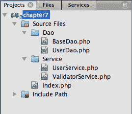
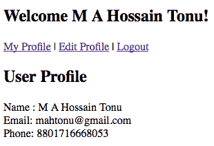
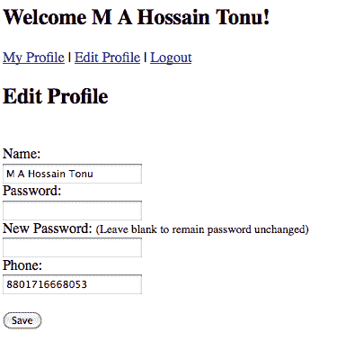

# 七、构建用户注册、登录、注销

> 总是提前计划。诺亚建造方舟时，天没有下雨——理查德·C·库欣。

从本章开始，我们将用专业的 PHP 项目来解决问题。我们将设计和开发一个 web 应用程序，用户可以在其中注册自己，注册后，他们可以登录到应用程序，查看和更新自己的应用程序，等等。

在本章中，我们将研究以下主题：

*   应用程序体系结构
*   设计 API
*   用户注册
*   用户登录和注销
*   用户配置文件视图和更新

# 项目规划

项目规划总是指对未来的规划，这意味着项目应该被规划，因为它可以很容易地扩展，或者可以重用，更模块化，甚至可以扩展。对于这个项目，我们将以一种现实的方式设计应用程序架构，这样用户注册、登录和注销应用程序也可以在我们未来的项目中轻松使用。

我们将设计**应用程序编程接口**（**API**，并使用该 API 构建应用程序。API 将为任何类型的用户注册或登录相关任务的应用程序提供便利，因此项目的核心是 API。一旦我们准备好了 API，我们就可以轻松地使用该 API 构建许多应用程序。

首先，让我们考虑一下 API 设计。记住，我们将使用一些架构模式，即我们的项目使用的**数据访问对象**（**DAO**模式。

### 提示

强烈建议本项目具备**面向对象编程**（**OOP**概念的先验知识。

# 了解应用架构

体系结构需要在数据存储、数据访问、应用程序服务和应用程序的各个层中构建。这在以下屏幕截图中进行了描述：


每个层都可以被指定为一组类似的逻辑任务，因为数据存储层充当数据源，例如关系数据库、文件系统或任何其他数据源。**数据访问层**与数据源进行通信，从**存储层**获取或存储数据，并在数据源中提供了一个很好的抽象，以交付给**服务层**。服务层是**应用层**的数据持久化介质，还提供其他服务，如验证服务。**数据访问对象**位于数据访问层，**业务对象**位于**服务层**。最后，**应用程序**驻留在应用程序层，直接与最终用户打交道。因此，在这种分层设计中，服务层可以是 API 的表层。

现在，让我们考虑特定功能，如注册、登录、验证和数据抽象到每个单元或模块。因此，每层都有强制单元，如下图所示：


我们很容易理解，每一层都包含相应的模块。例如，DAO 模块位于数据访问层，服务层有其服务单元（如验证），用户服务模块和应用程序层包含用户登录、用户注册、用户配置文件和管理模块。为了使我们的项目能够快速掌握体系结构概念，我们将尝试将每个模块保持为一个简单的 PHP 类，并附带相关代码。

那么，让我们快速看看我们最终将要构建什么。

下面的屏幕截图表示带有**姓名、电子邮件、密码**和**电话**字段的**用户注册**屏幕：


以下屏幕截图显示了带有**下次记住我**选项的**用户登录**屏幕：


下面的屏幕截图表示在顶部有**注销**和**编辑账户**菜单的**用户配置文件**视图：


## 了解道模式

DAO 用于抽象和封装对数据源的所有访问。DAO 管理与数据源的连接，以获取和存储数据。

> “DAO 实现处理数据源所需的访问机制。数据源可以是持久性存储（如 RDBMS）、外部服务（如 B2B exchange）、存储库（如 LDAP 数据库）或业务服务或低级套接字。依赖 DAO 的业务组件使用由 DAO 公开的更简单接口 AO 为其客户提供服务。

> DAO 对其客户机（数据客户机）完全隐藏数据源实现细节。由于 DAO 向客户机公开的接口在底层数据源实现更改时不会更改，因此此模式允许 DAO 适应不同的存储方案，而不会影响其客户机或业务组件。本质上，DAO 充当组件和数据源之间的适配器。该模式源自核心 J2EE 模式。”

> [http://java.sun.com/blueprints/corej2eepatterns/Patterns/DataAccessObject.html](http://java.sun.com/blueprints/corej2eepatterns/Patterns/DataAccessObject.html) 。

使用 DAO 的目的相对简单，如下所示：

*   它可以在需要数据存储的大部分应用程序中使用
*   它对应用程序的其余部分隐藏了数据存储的所有细节
*   它充当应用程序和数据库之间的中介
*   它允许持久性机制的可能变化产生的连锁反应局限于特定区域

## 回顾 OOP 问题

让我们看看访问修饰符或属性的几个面向对象编程关键字：

*   `Public:`此属性或方法可以在脚本中的任何位置使用。
*   `Private:`此属性或方法只能由其所属的类或对象使用；其他地方无法访问它。
*   `Protected:`此属性或方法只能由它所属的类中的代码或该类的子类使用。
*   `Final:`此方法或类不能在子类中重写。
*   `Abstract:`此方法或类不能直接使用，必须将其子类化；它不能被实例化。
*   `Static:`此属性或方法属于类本身，而不属于其任何实例。您还可以将静态属性视为全局变量，它们位于类内部，但可以通过类从任何位置访问。静态成员可以在类名后使用 `::`操作符进行访问。

## 名称空间

> 名称空间（有时也称为名称作用域）是一个抽象容器或环境，用于保存唯一标识符或符号（即名称）的逻辑分组。在名称空间中定义的标识符仅与该名称空间关联。同一标识符可以在多个名称空间中独立定义

> -维基百科

**名称空间**从 5.3 版开始引入 PHP。在 PHP 中，使用名称空间块定义名称空间。

在 PHP 世界中，名称空间旨在解决库和应用程序的作者在创建可重用代码元素（如类或函数）时遇到的两个问题：

*   能够避免创建的代码与内部 PHP 类/函数/常量或第三方类/函数/常量之间的名称冲突
*   能够别名（或缩短）超长名称，旨在缓解第一个问题，提高源代码的可读性

PHP 名称空间提供了一种对相关类、接口、函数和常量进行分组的方法。下面是一个在 PHP 中使用名称空间的示例：

```php
namespace My;
class Foo {
...
}
namespace Your;
class Foo {
...
}

```

我们可以通过以下方式使用相同名称的类并引用 PHP 命名空间：

```php
$myFoo = new \My\Foo();
$yourFoo = new \Your\Foo();

```

### 提示

我们将使用 `My`作为整个应用程序的公共根命名空间， `My\Dao`用于数据访问层类， `My\Service`用于服务层类。

## API

在面向对象语言中，API 通常包括一组类定义的描述，以及与这些类相关联的一组行为。行为是一组规则，用于说明从该类派生的对象在给定环境中的行为。该抽象概念与类公开或提供的实际功能相关联，这些功能是通过类方法实现的（或者更一般地说，是通过其所有公共组件实现的，因此是所有公共方法，但也可能包括任何公开的内部实体，如字段、常量和嵌套对象）。

例如，表示堆栈的类只需公开两个方法即可-`push()`（向堆栈中添加新项）和 `pop()`（提取最后一个项，最好放在堆栈顶部）。

在这种情况下，API 可以解释为两种方法-`pop()`和 `push()`。更一般地说，我们可以使用 `Stack`类的方法来实现堆栈的行为（堆暴露其顶部以添加/删除元素）。

到目前为止，一切顺利。我们有关于项目的概念，并且非常了解 NetBeans 的特性。现在，让我们开始发展。。。

# 数据库设计

在本节中，我们将设计 MySQL 数据库。由于我们在[第 3 章](03.html "Chapter 3. Building a Facebook-like Status Poster using NetBeans")中学习了如何创建数据库连接、新数据库、新表，以及如何在 NetBeans 内部运行 MySQL 查询，*使用 NetBeans*构建了一个类似 Facebook 的状态海报，我们将不再讨论它们，但我们将看看数据库模式定义。

```php
CREATE TABLE 'users' (
'id' bigint(20) NOT NULL AUTO_INCREMENT,
'useremail' varchar(50) NOT NULL,
'password' char(32) NOT NULL,
'userhash' char(32) NOT NULL,
'userlevel' tinyint(4) NOT NULL,
'username' varchar(100) NOT NULL,
'phone' varchar(20) NULL,
'timestamp' int(11) unsigned NOT NULL,
PRIMARY KEY ('id'),
UNIQUE KEY 'useremail' ('useremail')
) ENGINE=InnoDB DEFAULT CHARSET=utf8;

```

如您所见，在 `users`表中， `id`（每个条目自动递增）作为主键， `useremail`作为唯一键。我们有一个 `password`字段来存储用户密码，最多 32 个字符；32 个字符的 `userhash`将存储用户的登录会话标识符； `userlevel`定义用户的访问级别，如普通用户为 `1`，管理员用户为 `9`等；一个 `username`字段，最多支持 100 个字符； `phone`字段，用于存储用户的联系号码；以及一个 `timestamp`字段，用于跟踪用户的注册时间。选择的数据库引擎是**InnoDB**，因为它支持**MyISAM**引擎上的事务和外键，以避免任何用户在 `insert`和 `update`操作期间出现表锁定。

因此，您所需要做的就是创建一个名为 `user`的新数据库，只需在 NetBeans 查询编辑器中键入 MySQL 查询，然后运行查询，使表在 `user`数据库中就绪。

现在，创建一个 NetBeans PHP 项目并开始用户 API 开发以及后续部分。

# 创建数据访问层

数据访问层将由一个提供数据库抽象的用户 DAO 类和一个提供抽象方法的抽象基 DAO 类组成，这是实现用户 DAO 类所必需的。此外，我们还将创建抽象类，为将来的项目中创建的 DAO 类提供抽象方法。注意，对于数据访问层类，我们将使用 PHP 名称空间 `My\Dao`。

## 创建 BaseDao 抽象类

抽象类将用于为子类提供实现方法的基本框架。简单地说，基本的数据库操作是 `CRUD`或 `create, read, update`和 `delete`。因此，抽象类将提供这些类型的抽象方法以及每个子类中需要的方法。 `BaseDao`抽象类将包含用于数据库连接的 `final`方法，因此子类不需要再次编写它。为了更好地理解这一点，我们还将把 DAO 类保存在一个名为 `Dao`的单独目录中。

# 行动时间-创建 BaseDao 类

为了与数据库连接一起使用，我们将数据库访问凭据保留为它们自己的类常量。此外，我们将使用 PDO 进行各种数据库操作。要创建 `Base`类，请执行以下步骤：

1.  Create a new PHP file inside the `Dao` directory named `BaseDao.php`, and type in the following class:

    ```php
    <?php
    namespace My\Dao;
    abstract class BaseDao {
    private $db = null;
    const DB_SERVER = "localhost";
    const DB_USER = "root";
    const DB_PASSWORD = "root";
    const DB_NAME = "user";
    }
    ?>

    ```

    您可以看到这个类 `uses namespace My\Dao;`，在类名之前还有一个 `abstract`关键字，它将这个类定义为抽象类。这意味着该类不能被实例化，或者内部至少有一个抽象方法。此外，您还可以看到添加的类常量，其中包含数据库信息和用于保存数据库连接的私有类变量 `$db`。您可以根据需要修改这些常量。

2.  Now, add the following `getDb()` method in the class:

    ```php
    protected final function getDb(){
    $dsn = 'mysql:dbname='.self::DB_NAME.';host='.self::DB_SERVER;
    try {
    $this->db = new \PDO($dsn, self::DB_USER, self::DB_PASSWORD);
    } catch (PDOException $e) {
    throw new \Exception('Connection failed: ' . $e->getMessage());
    }
    return $this->db;
    }

    ```

    `protected final function getDb()`函数使用 PDO 连接 MySQL 数据库。类的私有变量存储可用于数据库连接的 PDO 实例。此外， `getDb()`方法是 `final`和 `protected`，因此子类继承了该方法，无法重写它。

    `$dsn`变量包含**数据源名称（DSN）**，其中包含连接到数据库所需的信息。下一行创建一个 PDO 实例来表示与请求数据库的连接，并在成功时返回一个 PDO 对象：

    ```php
    $this->db = new \PDO($dsn, self::DB_USER, self::DB_PASSWORD);

    ```

    请注意，如果尝试连接到请求的数据库失败，DSN 将抛出一个 `PDOException`异常。我们在 PDO 前面加了反斜杠\，因此 PHP 知道它在全局名称空间中。

3.  Add the following `abstract` methods to the class:

    ```php
    abstract protected function get($uniqueKey);
    abstract protected function insert(array $values);
    abstract protected function update($id, array $values);
    abstract protected function delete($uniqueKey);

    ```

    您可以看到，子类要实现的方法被表示为 `abstract protected,`，并且 `get()`方法将用于根据唯一的表键从表中选择单个条目， `insert()`将在表中插入一行， `update()`将用于更新表中的一行， `delete()`将用于删除条目。因此，所有这些方法都保持抽象（没有方法体），因为它们将使用子类实现。

## 刚才发生了什么事？

我们有 `BaseDao`抽象类，可以由 DAO 类继承。PDO 实例是从该方法创建并返回的，因此所有子类都将使用 `getDb()`方法，并且可以使用该返回实例使用 PDO 执行某种数据库任务。最后，子类将根据其需求实现 `abstract`方法。例如，在下一个教程中，用户 DAO 类将实现 `get()`方法从 `users`表中选择并返回与用户电子邮件地址匹配的单个用户注册信息，或者产品 DAO 类将实现 `get()`方法从 `products`表中选择并返回单个产品信息表匹配产品 ID。因此，实践这样一个抽象类的目的是提供 Dao 类的基本框架。

### 提示

使用 PDO 的最大优点之一是，如果我们想迁移到其他 SQL 解决方案中，我们只需要调整 DSN 参数。

## 创建用户 DAO 类

在本教程中，我们将创建用户 DAO 类，该类将在其中提供各种数据库任务。此类将使数据库对连续层（即服务层类）保持隐藏。因此，所有连续的层类都将调用该类中的方法，并由该类完成所有必要的数据库工作，而数据存储细节对它们完全隐藏。因此，此类将充当数据库和应用程序之间的中介。

# 行动时间-创建用户 Dao 类

我们将保留相关的用户常量作为类常量。我们将在这个类中编写来自 `BaseDao`抽象类的方法的实现。简单地说，我们将把这些抽象方法的主体和我们自己需要的方法添加到类中。因此，请按照此处列出的步骤进行操作：

1.  Create a new PHP file inside the `Dao` directory named `UserDao.php`, and type in the following code:

    ```php
    <?php
    namespace My\Dao;
    class UserDao extends BaseDao {
    private $db = null;
    public function __construct() {
    $this->db = $this->getDb();
    }
    }
    $userDao = new \My\Dao\UserDao;
    ?>

    ```

    如您所见，该类位于 `My\Dao`命名空间下，并扩展到 `BaseDao`类，因此该类将具有从父类继承的方法。Dao 类有自己的私有 `$db`，存储继承的 `getDb()`方法返回的 PDO 实例；如您所见，这个 `$db`变量被分配给类构造函数。

    此外，您可能已经注意到， `UserDao`类已在底部实例化。

2.  Type in the implementation of the `get()` method (add the method to the class), so that it looks similar to the following:

    ```php
    public function get($useremail) {
    $statement = $this->db->prepare("SELECT * FROM users WHERE useremail = :useremail LIMIT 1 ");
    $statement->bindParam(':useremail', $useremail);
    $statement->execute();
    if ($statement->rowCount() > 0) {
    $row = $statement->fetch();
    return $row;
    }
    }

    ```

    您可以看到， `prepare()`方法准备了要由 `PDOStatement::execute()`方法执行的 SQL 语句。如您所见，下面的语句查询用于从`users` 表中选择一行的所有列，而 `:useremail`中给定的电子邮件地址（参数与 `bindParam()`绑定）与 `useremail`列匹配。

    ```php
    SELECT * FROM users WHERE useremail = :useremail LIMIT 1;

    ```

    最后，如果找到匹配的行，则获取包含用户详细信息的数组并返回。

3.  Type in the implementation of the `insert()` method, so that it looks similar to the following:

    ```php
    public function insert(array $values) {
    $sql = "INSERT INTO users ";
    $fields = array_keys($values);
    $vals = array_values($values);
    $sql .= '('.implode(',', $fields).') ';
    $arr = array();
    foreach ($fields as $f) {
    $arr[] = '?';
    }
    $sql .= 'VALUES ('.implode(',', $arr).') ';
    $statement = $this->db->prepare($sql);
    foreach ($vals as $i=>$v) {
    $statement->bindValue($i+1, $v);
    }
    return $statement->execute();
    }

    ```

    该方法获取数组中传递的用户信息，为 `users`表准备 MySQL `insert`查询，并执行查询。注意， `$fields`数组中的字段名和 `$vals`数组中的字段值分别是从传递数组的键和值中提取的。我们用过吗？代替已准备语句的所有给定值，该值将替换为与 `PDOStatement::bindValue()`方法绑定的相应值。 `bindValue()`将值绑定到参数。

4.  Type in the implementation of the `update()` method, so that it looks similar to the following:

    ```php
    public function update($id, array $values) {
    $sql = "UPDATE users SET ";
    $fields = array_keys($values);
    $vals = array_values($values);
    foreach ($fields as $i=>$f) {
    $fields[$i] .= ' = ? ';
    }
    $sql .= implode(',', $fields);
    $sql .= " WHERE id = " . (int)$id ." LIMIT 1 ";
    $statement = $this->db->prepare($sql);
    foreach ($vals as $i=>$v) {
    $statement->bindValue($i+1, $v);
    }
    $statement->execute();
    }

    ```

    以与*步骤 3*相同的方式准备 MySQL `UPDATE`查询语句，并执行查询，以给定 ID 更新行中相应的列值。

5.  You may leave the other implementation as an empty enclosing body, as follows, or you can add your own code, as required:

    ```php
    public function delete($uniqueKey) { }

    ```

    由于我们将来可能会实现删除用户的方法，我们将 `delete()`方法的主体留空。

6.  Now, we need some additional methods to be written in the class. While registering a user with any e-mail address, we can check our database to see if the e-mail address already exists in the table or not. Type in the following method:

    ```php
    public function useremailTaken($useremail) {
    $statement = $this->db->prepare("SELECT id FROM users WHERE useremail = :useremail LIMIT 1 ");
    $statement->bindParam(':useremail', $useremail);
    $statement->execute();
    return ($statement->rowCount() > 0 );
    }

    ```

    `useremailTaken()`方法以电子邮件地址为参数，检查该电子邮件 ID 是否存在。它通过使用 `WHERE`子句中给定的电子邮件地址运行 `SELECT`查询来完成此任务。如果找到任何行，则表示电子邮件地址已经存在，因此该方法返回 `true`，否则返回 `false`。使用此方法，我们可以确保一个电子邮件地址在系统中只能使用一次，并且不允许重复的电子邮件地址，因为这是一个唯一的字段。

7.  To confirm the user's password during login, type in the following `checkPassConfirmation()` method:

    ```php
    public function checkPassConfirmation($useremail, $password) {
    $statement = $this->db->prepare("SELECT password FROM users WHERE useremail = :useremail LIMIT 1 ");
    $statement->bindParam(':useremail', $useremail);
    $statement->execute();
    if ($statement->rowCount() > 0) {
    $row = $statement->fetch();
    return ($password == $row['password']);
    }
    return false;
    }

    ```

    该方法以 `$useremail`和 `$password`为参数，选择 `password`列匹配用户邮件。现在，如果没有找到符合条件的行，则表示表中不存在该用户的电子邮件，返回 `false 1`；如果找到匹配的行，则从结果中提取数组以获取密码。最后，将从数据库中获取的密码与第二个参数中给定的密码进行比较。如果匹配，则返回 `true`。因此，我们可以使用此方法确认给定对应用户电子邮件的密码，同时用户尝试使用它们登录，并且可以使用返回的布尔值轻松跟踪状态。

8.  Also, we have already added a field in the `users` table named `userhash`. The field stores a hash value (random alphanumeric string) for each login session, so we want to confirm that `userhash`, in order to verify if the user is currently logged in. Type in the following method:

    ```php
    public function checkHashConfirmation($useremail, $userhash) {
    $statement = $this->db->prepare("SELECT userhash FROM users WHERE useremail = :useremail LIMIT 1");
    $statement->bindParam(':useremail', $useremail);
    $statement->execute();
    if ($statement->rowCount() > 0) {
    $row = $statement->fetch();
    return ($userhash == $row['userhash']);
    }
    return false;
    }

    ```

    `checkHashConfirmation()`方法与*步骤 7*中的前一种方法相同，以 `$useremail`和 `$useremail`为参数，获取给定邮箱地址的 `useremail`，并与给定的 `useremail`进行比较。因此，用于比较 `useremail`的方法对于会话和数据库都是相同的。如果相同，则表示用户当前已登录，因为每次新登录都会更新表中相应的 `useremail`。

## 刚才发生了什么事？

调用 `PDO::prepare()`和 `PDOStatement::execute()`for 语句，这些语句将使用不同的参数值多次发出，通过允许驱动程序协商查询计划和元信息的客户端和/或服务器端缓存，优化应用程序的性能，并有助于防止 SQL 注入攻击，无需手动引用参数。

我们现在已经准备好了用户 DAO 类，并且在我们的 NetBeans 项目的 `Dao`目录中也完成了 DAO 层。因此，用户 DAO 类已经准备好提供所需的数据库操作。数据库操作可以像我们所做的那样进行处理，这样其他后续类就不需要访问或重写数据库功能，从而实现了围绕数据库的抽象。我们可以在这个类中添加任何与数据库相关的方法，使它们可用于服务类。现在，实例化的对象将用作数据访问对象，这意味着该对象可以访问数据源中的数据，任何人都可以通过该对象读取或写入数据。

## 突击测验-复习 PDO

1.  对于 PDO 的 `bindValue()`和 `bindParam()`方法，哪一种是正确的？
    1.  您只能通过 `bindParam`传递变量，不能通过 `bindValue`传递值，也可以通过 `bindValue`传递变量和值
    2.  只能使用 `bindParam`传递值，只能使用 `bindValue`传递变量
    3.  您可以使用 `bindParam`传递变量，也可以使用 `bindValue`传递值
    4.  两者都是一样的

现在，让我们为 API 创建服务层。

# 创建服务层

服务层包含服务于应用程序的类，或者只是为应用程序提供一个框架。应用程序层将与该层通信，以提供各种应用程序服务，例如用户身份验证、用户信息注册、登录会话验证和表单验证。为了更好地理解，我们将把我们的服务类保存在一个名为 `Service`的单独目录中，并使用名称空间 `My\Service`来表示这一层的类。

## 创建 ValidatorService 类

此类将执行验证任务，例如表单验证和登录信息验证，还将保存以传递表单错误消息和字段值。

# 行动时间-创建 ValidatorService 类

我们将在类本身中保留一些验证常量，并且该类将使用 `My\Service`作为其名称空间。按照以下步骤创建 `ValidatorService`类：

1.  在项目目录下创建一个名为 `Service`的新目录。服务类将在此目录中。
2.  Create a new PHP file inside the `Service` directory named `ValidatorService.php`, and type in the following class:

    ```php
    <?php
    namespace My\Service;
    use My\Dao\UserDao;
    class ValidatorService {
    private $values = array();
    private $errors = array();
    public $statusMsg = null;
    public $num_errors;
    const NAME_LENGTH_MIN = 5;
    const NAME_LENGTH_MAX = 100;
    const PASS_LENGTH_MIN = 8;
    const PASS_LENGTH_MAX = 32;
    public function __construct() {
    }
    public function setUserDao(UserDao $userDao){
    $this->userDao = $userDao;
    }
    }
    $validator = new \My\Service\ValidatorService;
    $validator->setUserDao($userDao);
    ?>

    ```

    请注意，该类位于 `My\Service`命名空间下，并导入 `My\Dao\UserDao`类。

    您可以看到类变量 `$values`，它保存提交的表单值； `$errors`，保存提交的表单错误消息； `$statusMsg`，保存提交的状态消息，为成功或临时信息；和 `$num_errors,`，保存提交表单中的错误数。

    出于验证目的，我们还添加了类常量。我们将用户名长度保持在 5 到 100 个字符之间， `password`字段长度保持在 8 到 32 个字符之间。

    由于该类依赖于 UserDao 类，所以我们使用 `setter`方法 `setUserDao()`将 `$userDao`对象注入其中；传递的 `$userDao`对象存储在类变量中，因此 DAO 也可以用于其他方法。

3.  Now, fill in the class constructor, so that it looks similar to the following:

    ```php
    public function __construct() {
    if (isset($_SESSION['value_array']) && isset($_SESSION['error_array'])) {
    $this->values = $_SESSION['value_array'];
    $this->errors = $_SESSION['error_array'];
    $this->num_errors = count($this->errors);
    unset($_SESSION['value_array']);
    unset($_SESSION['error_array']);
    } else {
    $this->num_errors = 0;
    }
    if (isset($_SESSION['statusMsg'])) {
    $this->statusMsg = $_SESSION['statusMsg'];
    unset($_SESSION['statusMsg']);
    }
    }

    ```

    您可以看到 `$_SESSION['value_array']`和 `$_SESSION['error_array']`都已进行了初步检查。如果它们设置了一些值，则将它们分配给相应的类变量，如以下示例所示：

    ```php
    $this->values = $_SESSION['value_array'];
    $this->errors = $_SESSION['error_array'];
    $this->num_errors = count($this->errors);

    ```

    另外， `num_errors`已经用 `errors`数组的计数进行了调整。请注意， `$_SESSION['value_array']`和 `$_SESSION['error_array']`中的值将由使用此服务 API 的应用程序类设置。这些会话变量在获取其值后立即被取消设置，以便为下一次表单提交做好准备。如果未设置这些变量， `num_errors`应为 `0`（零）。

    它还检查 `$_SESSION['statusMsg']`变量。如果设置了任何状态消息，请将消息抓取到适当的类变量中并取消设置。

4.  Now, type in the form and error handler methods into the class, as follows:

    ```php
    public function setValue($field, $value) {
    $this->values[$field] = $value;
    }
    public function getValue($field) {
    if (array_key_exists($field, $this->values)) {
    return htmlspecialchars(stripslashes($this->values[$field]));
    } else {
    return "";
    }
    }
    private function setError($field, $errmsg) {
    $this->errors[$field] = $errmsg;
    $this->num_errors = count($this->errors);
    }
    public function getError($field) {
    if (array_key_exists($field, $this->errors)) {
    return $this->errors[$field];
    } else {
    return "";
    }
    }
    public function getErrorArray() {
    return $this->errors;
    }

    ```

    在这些类方法中，您可以看到 `setValue($field, $value)`和`getValue($field)`方法分别用于设置和获取单个对应字段的值。同样， `setError($field, $errmsg)`和 `getError($field)`在验证时设置并获取对应表单字段值的错误消息，同时，setError 增加 `num_errors`值。最后， `getErrorArray()`返回完整的错误消息数组。

5.  Now, type in the value validation methods of the form field as follows:

    ```php
    public function validate($field, $value) {
    $valid = false;
    if ($valid == $this->isEmpty($field, $value)) {
    $valid = true;
    if ($field == "name")
    $valid = $this->checkSize($field, $value, self::NAME_LENGTH_MIN, self::NAME_LENGTH_MAX);
    if ($field == "password" || $field == "newpassword")
    $valid = $this->checkSize($field, $value, self::PASS_LENGTH_MIN, self::PASS_LENGTH_MAX);
    if ($valid)
    $valid = $this->checkFormat($field, $value);
    }
    return $valid;
    }
    private function isEmpty($field, $value) {
    $value = trim($value);
    if (empty($value)) {
    $this->setError($field, "Field value not entered");
    return true;
    }
    return false;
    }
    private function checkFormat($field, $value) {
    switch ($field) {
    case 'useremail':
    $regex = "/^[_+a-z0-9-]+(\.[_+a-z0-9-]+)*"
    . "@[a-z0-9-]+(\.[a-z0-9-]{1,})*"
    . "\.([a-z]{2,}){1}$/i";
    $msg = "Email address invalid";
    break;
    case 'password':
    case 'newpassword':
    $regex = "/^([0-9a-z])+$/i";
    $msg = "Password not alphanumeric";
    break;
    case 'name':
    $regex = "/^([a-z ])+$/i";
    $msg = "Name must be alphabetic";
    break;
    case 'phone':
    $regex = "/^([0-9])+$/";
    $msg = "Phone not numeric";
    break;
    default:;
    }
    if (!preg_match($regex, ( $value = trim($value)))) {
    $this->setError($field, $msg);
    return false;
    }
    return true;
    }
    private function checkSize($field, $value, $minLength, $maxLength) {
    $value = trim($value);
    if (strlen($value) < $minLength || strlen($value) > $maxLength) {
    $this->setError($field, "Value length should be within ".$minLength." & ".$maxLength." characters");
    return false;
    }
    return true;
    }

    ```

    验证方法可描述如下：

    *   `validate($field, $value)`是验证的录入功能。此方法可以调用输入验证的方法，如空字符串检查、正确的输入格式或输入大小范围，如果验证通过，则返回 `true`，否则返回 `false`。
    *   `isEmpty($field, $value)`检查字符串是否为空，然后为该字段设置错误消息，否则返回 `false`或 `true`。
    *   `checkFormat($field, $value)`根据为每个字段格式编写的适当正则表达式测试字段值，设置错误（如果有），并返回 `false`或 `true`。
    *   `checkSize($field, $value, $minLength, $maxLength)`检查输入是否在给定的最小大小和最大大小内。
6.  We want to validate the login credentials to check whether the user e-mail exists or whether the password belongs to the user matching that user e-mail. So, add the `validateCredentials()method` as follows:

    ```php
    public function validateCredentials($useremail, $password) {
    $result = $this->userDao->checkPassConfirmation($useremail, md5($password));
    if ($result === false) {
    $this->setError("password", "Email address or password is incorrect");
    return false;
    }
    return true;
    }

    ```

    该方法采用 `$useremail`和 `$password`进行登录凭证验证。您可以看到，以下行使用 `user Dao`来确认与 `useremail`关联的密码。Dao `checkPassConfirmation()`方法返回 `true`作为确认，返回 `false`作为电子邮件地址或密码不正确。

    ```php
    $result = $this->userDao->checkPassConfirmation($useremail, md5($password));

    ```

7.  When a user wants to register into our application, we can validate the e-mail address for its pre-existence. If the e-mail is not already registered in the database, then the user is free to register with that e-mail. So, type in the following method:

    ```php
    public function emailExists($useremail) {
    if ($this->userDao->useremailTaken($useremail)) {
    $this->setError('useremail', "Email already in use");
    return true;
    }
    return false;
    }

    ```

    您可以看到，该方法使用 `$this->userDao->useremailTaken($useremail);`中的 `userDao`来检查用户的电子邮件是否已经被接收。如果已采取，则设置错误，并返回 `true`，因为电子邮件存在。

8.  当用户想要更新当前密码时，再次需要密码确认。因此，让我们添加另一种验证当前密码的方法：

    ```php
    public function checkPassword($useremail, $password) {
    $result = $this->userDao->checkPassConfirmation($useremail, md5($password));
    if ($result === false) {
    $this->setError("password", "Current password incorrect");
    return false;
    }
    return true;
    }

    ```

## 刚才发生了什么事？

我们已经准备好了 validator 服务类，可以支持表单、登录凭据和密码验证，甚至可以通过 `userDao`与数据库通信。此外，验证程序服务允许应用程序检索来宾或用户的临时状态消息，以及表单输入字段的错误消息。因此，它处理各种验证任务，验证程序方法在发现错误时设置错误，并在成功时返回 `true`，在失败时返回 `false`。除了相应的表单字段以及字段值之外，还可以查看此类错误消息。因此，它还有助于创建数据持久性表单。

## 有一个围棋英雄-添加多字节编码支持

目前，我们的验证器服务不支持多字节字符编码。要启用具有不同字符编码（如 UTF-8）的应用程序，您可以在验证方法中实现多字节支持，例如设置内部编码、多字节字符串的正则表达式匹配，以及使用 `mb_strlen()`代替 `strlen()`。多字节字符串函数可在[中找到 http://php.net/manual/en/ref.mbstring.php](http://php.net/manual/en/ref.mbstring.php) 。

## 创建 UserService 类

`UserService`类支持所有应用程序任务，如登录、注册或更新用户详细信息。对于任何类型的数据相关函数，它与 `UserDao`类相对应，对于任何类型的验证函数，它与 `ValidatorService`服务类相对应。当应用程序要求执行诸如登录或注册之类的任务时，它首先调用验证，然后执行任务，而它可以根据需要使用 DAO。最后，如果任务已完成，则返回 `true`，如果出现任何失败，如验证失败或任何其他歧义，则返回 `false`。简单地说，应用程序将调用 `UserService`类中的方法来登录、注册等，并可以知道操作的状态。

# 行动时间-创建 UserService 类

我们将使用 `My\Service`作为该类的名称空间，并保留该类中的任何常量。 `UserService`类属性将包含用户信息，如用户电子邮件、用户 ID、用户名或电话，构造函数将检查登录的用户和类变量，并从会话中加载用户详细信息。此外，该类还将使用 PHP cookies 来存储用户的登录数据。该类将充当登录会话管理器。因此，最初，该类将检查用户登录的会话或 cookie 中的登录数据。

### 提示

建议您熟悉本教程中的 PHP 会话和 cookie。

那么让我们通过以下步骤来创建 `UserService`类：

1.  Create a new PHP file inside the `Service` directory named `UserService.php`, and type in the following class:

    ```php
    <?php
    namespace My\Service;
    use My\Dao\UserDao;
    use My\Service\ValidatorService;
    class UserService {
    public $useremail;
    private $userid;
    public $username;
    public $userphone;
    private $userhash;
    private $userlevel;
    public $logged_in;
    const ADMIN_EMAIL = "admin@mysite.com";
    const GUEST_NAME = "Guest";
    const ADMIN_LEVEL = 9;
    const USER_LEVEL = 1;
    const GUEST_LEVEL = 0;
    const COOKIE_EXPIRE = 8640000;
    const COOKIE_PATH = "/";
    public function __construct(UserDao $userDao, ValidatorService $validator) {
    $this->userDao = $userDao;
    $this->validator = $validator;
    $this->logged_in = $this->isLogin();
    if (!$this->logged_in) {
    $this->useremail = $_SESSION['useremail'] = self::GUEST_NAME;
    $this->userlevel = self::GUEST_LEVEL;
    }
    }
    }
    $userService = new \My\Service\UserService($userDao, $validator);
    ?>

    ```

    您可以看到类使用 `namespace My\Service;`，服务用户类可以使用 `\My\Service\UserService.`访问

    查看存储用户数据的类变量。如果用户已登录， `$logged_in`为 `true`。

    为了区分不同的用户，添加了与用户相关的常量。用自己的更新 `ADMIN_EMAIL`；用户中的管理员由 `ADMIN_EMAIL`定义， `ADMIN_LEVEL`等于 `9`。一般注册用户定义为`USER_LEVEL`等于 1，非注册用户定义为 `GUEST_LEVEL`等于 `0`或 `GUEST_NAME`为来宾。因此，当我们实现管理功能时，使用电子邮件地址注册为`<[admin@mysite.com](mailto:admin@mysite.com)>`的用户将拥有管理权限。

    在 cookie 常量的部分， `COOKIE_EXPIRE`默认将 cookie 过期时间设置为 `100`天（8640000 秒），`COOKIE_PATH`表示 cookie 将可用于整个应用程序域。

    cookie（用户计算机上的文本文件）将用于将 `useremail`存储为`cookname`和 `userhash`存储为 `cookid`。这些 cookie 将在用户启用选项 `Remember Me`的情况下设置。因此，我们将首先检查是否在用户的本地计算机上找到与数据库匹配的 Cookie，如果是的话，我们将把用户视为登录用户。

    请注意，构造函数中注入了 `UserDao`和 `ValidatorService`对象，因此类可以在其内部使用这些依赖项。

    现在，通过 `$this->logged_in = $this->isLogin();`行，构造器检查用户是否登录。 `private`方法 `isLogin()`检查登录数据，如果找到，则返回为 `true`，否则返回为 `false`。实际上， `isLogin()`检查会话和 Cookie 以获取用户的登录数据，如果数据可用，则加载类变量。

    未登录用户为来宾用户，因此 `useremail`和 `userlevel`分别设置为 `Guest`和`Guest Level 0`。

    ```php
    if (!$this->logged_in) {
    $this->useremail = $_SESSION['useremail'] = self::GUEST_NAME;
    $this->userlevel = self::GUEST_LEVEL;
    }

    ```

2.  Now, let's create the `isLogin()` method, so that it looks as follows:

    ```php
    private function isLogin() {
    if (isset($_SESSION['useremail']) && isset($_SESSION['userhash']) &&
    $_SESSION['useremail'] != self::GUEST_NAME) {
    if ($this->userDao->checkHashConfirmation($_SESSION['useremail'], $_SESSION['userhash']) === false) {
    unset($_SESSION['useremail']);
    unset($_SESSION['userhash']);
    unset($_SESSION['userid']);
    return false;
    }
    $userinfo = $this->userDao->get($_SESSION['useremail']);
    if(!$userinfo){
    return false;
    }
    $this->useremail = $userinfo['useremail'];
    $this->userid = $userinfo['id'];
    $this->userhash = $userinfo['userhash'];
    $this->userlevel = $userinfo['userlevel'];
    $this->username = $userinfo['username'];
    $this->userphone = $userinfo['phone'];
    return true;
    }
    if (isset($_COOKIE['cookname']) && isset($_COOKIE['cookid'])) {
    $this->useremail = $_SESSION['useremail'] = $_COOKIE['cookname'];
    $this->userhash = $_SESSION['userhash'] = $_COOKIE['cookid'];
    return true;
    }
    return false;
    }

    ```

    如果 `$_SESSION`有`useremail, userhash,`和`useremail`没有作为来宾，则表示用户已经登录到该数据。如果是，我们想用 `UserDao`的 `checkHashConfirmation()`方法确认 `userhash`和相关的 `useremail`安全性。如果未得到确认，则取消设置 AUT7TY 变量，并将其视为未登录，将其返回为 OutT8。

    最后，如果一切正常，使用 `$userinfo = $this->userDao->get($_SESSION['useremail']);;`处的 `Dao`加载登录用户的详细信息加载类和会话变量，并将其作为 true 返回。

    同样，如果 `$_SESSION`没有登录的数据，那么我们也会选择签入 cookies，因为用户可能已经启用了`Remember Me`选项。如果要求用户在登录时记住他，则会设置这些 cookies。因此，如果在 cookie 变量中找到了必要的数据，那么类和会话变量将从那里加载。

3.  Now, create the login service for the applications as follows:

    ```php
    public function login($values) {
    $useremail = $values['useremail'];
    $password = $values['password'];
    $rememberme = isset($values['rememberme']);
    $this->validator->validate("useremail", $useremail);
    $this->validator->validate("password", $password);
    if ($this->validator->num_errors > 0) {
    return false;
    }
    if (!$this->validator->validateCredentials($useremail, $password)) {
    return false;
    }
    $userinfo = $this->userDao->get($useremail);
    if(!$userinfo){
    return false;
    }
    $this->useremail = $_SESSION['useremail'] = $userinfo['useremail'];
    $this->userid = $_SESSION['userid'] = $userinfo['id'];
    $this->userhash = $_SESSION['userhash'] = md5(microtime());
    $this->userlevel = $userinfo['userlevel'];
    $this->username = $userinfo['username'];
    $this->userphone = $userinfo['phone'];
    $this->userDao->update($this->userid, array("userhash" => $this->userhash));
    if ($rememberme == 'true') {
    setcookie("cookname", $this->useremail, time() + self::COOKIE_EXPIRE, self::COOKIE_PATH);
    setcookie("cookid", $this->userhash, time() + self::COOKIE_EXPIRE, self::COOKIE_PATH);
    }
    return true;
    }

    ```

    此方法获取登录详细信息，例如 `useremail, password,`和 `rememberme`，并将它们从应用程序传递到 `$values` 数组中。它调用对给定输入的验证，如果发现错误，则返回 false，然后验证访问凭据的关联。如果所有案例都通过了验证，它将从 Dao 加载用户信息。请注意，在下一行中， `md5(microtime())`创建了一个随机的字母数字字符字符串，并分配给类变量。

    ```php
    $this->userhash = $_SESSION['userhash'] = md5(microtime());

    ```

    最后，对于要启动的新登录会话，更新表中相应用户的 `userhash`，该用户的 `userhash`将作为当前会话的标识符。

    ```php
    $this->userDao->update($this->userid, array("userhash" => $this->userhash));

    ```

    因此， `$_SESSION userhash` 和数据库 `userhash`对于活动的、登录的会话应该是相同的。

    另外，您可以看到，如果 `$rememberme`是 `true`，则使用 PHP 的 `setcookie()`方法设置 cookie，并使用名称、值及其过期时间设置 cookie。

4.  Now, add the user registration service method as follows:

    ```php
    public function register($values) {
    $username = $values['name'];
    $useremail = $values['useremail'];
    $password = $values['password'];
    $phone = $values['phone'];
    $this->validator->validate("name", $username);
    $this->validator->validate("useremail", $useremail);
    $this->validator->validate("password", $password);
    $this->validator->validate("phone", $phone);
    if ($this->validator->num_errors > 0) {
    return false;
    }
    if($this->validator->emailExists($useremail)) {
    return false;
    }
    $ulevel = (strcasecmp($useremail, self::ADMIN_EMAIL) == 0) ? self::ADMIN_LEVEL : self::USER_LEVEL;
    return $this->userDao->insert(array(
    'useremail' => $useremail, 'password' => md5($password),
    'userlevel' => $ulevel, 'username' => $username,
    'phone' => $phone, 'timestamp' => time()
    ));
    }

    ```

    此方法获取用户详细信息进行注册，将其传递到 `$values`数组中，并对其进行验证。如果验证通过，它会将用户注册详细信息打包到一个数组中，并使用用户 Dao 的 `insert()`方法将其保存到数据库中。

    请注意，用户级别是通过将注册人的电子邮件地址与 `ADMIN_EMAIL.`进行比较来确定的

5.  Add the `getUser()` method as follows, to provide user information matching a given `useremail` parameter:

    ```php
    public function getUser($useremail){
    $this->validator->validate("useremail", $useremail);
    if ($this->validator->num_errors > 0) {
    return false;
    }
    if (!$this->validator->emailExists($useremail)) {
    return false;
    }
    $userinfo = $this->userDao->get($useremail);
    if($userinfo){
    return $userinfo;
    }
    return false;
    }

    ```

    请注意， `useremail`在传递用户信息之前经过验证。因此，每当需要任何用户信息时，应用程序都将使用此方法。

6.  Now, add the `update()` method for the user's details modification.

    ```php
    public function update($values) {
    $username = $values['name'];
    $phone = $values['phone'];
    $password = $values['password'];
    $newPassword = $values['newpassword'];
    $updates = array();
    if($username) {
    $this->validator->validate("name", $username);
    $updates['username'] = $username;
    }
    if($phone) {
    $this->validator->validate("phone", $phone);
    $updates['phone'] = $phone;
    }
    if($password && $newPassword){
    $this->validator->validate("password", $password);
    $this->validator->validate("newpassword", $newPassword);
    }
    if ($this->validator->num_errors > 0) {
    return false;
    }
    if($password && $newPassword){
    if ($this->validator->checkPassword($this->useremail, $password)===false) {
    return false;
    }
    $updates['password'] = md5($newPassword);
    }
    $this->userDao->update($this->userid, $updates);
    return true;
    }

    ```

    请注意，该方法首先验证给定的信息（如果有）。如果通过验证条件，则相应的列值将通过用户 Dao 更改为数据库表。

7.  The `logout()` method can be added as follows:

    ```php
    public function logout() {
    if (isset($_COOKIE['cookname']) && isset($_COOKIE['cookid'])) {
    setcookie("cookname", "", time() - self::COOKIE_EXPIRE, self::COOKIE_PATH);
    setcookie("cookid", "", time() - self::COOKIE_EXPIRE, self::COOKIE_PATH);
    }
    unset($_SESSION['useremail']);
    unset($_SESSION['userhash']);
    $this->logged_in = false;
    $this->useremail = self::GUEST_NAME;
    $this->userlevel = self::GUEST_LEVEL;
    }

    ```

    `logout`方法取消设置所有 cookie 和会话变量，将 `$this->logged_in`设置为 `false`，用户再次成为来宾用户。

## 刚才发生了什么事？

我们现在可以检查用户是否登录，以及是否要求用户记住登录详细信息，因此用户不想再次使用 `Remember Me`选项登录。该类用于登录、注销、用户注册以及向应用程序层更新或检索用户信息。它在继续 Dao 层之前使用验证程序服务。因此，该类也确保了数据的安全性，这使得 `UserService`类在服务层准备就绪。

最后，我们已经准备好了 API，通过使用该 API，我们可以构建一个用于用户注册、用户配置文件更新、登录和注销的应用程序。我们的数据访问层和服务层都可以运行。现在，让我们看看我们的 NetBeans 项目目录。



为了更好地理解，我们为每个层使用了单独的目录和单独的名称空间。现在，我们将在应用程序文件中包含 API，通过使用用户服务对象，我们将实现应用程序的目标。

## 突击测验-使用名称空间

1.  PHP 名称空间支持哪些功能？
    1.  类名称的别名
    2.  为接口名添加别名
    3.  名称空间名称的别名
    4.  导入函数或常量
2.  哪一个将导入名为 `foo?`的全局类
    1.  名称空间 foo；
    2.  使用 foo；
    3.  进口食品；
    4.  以上都没有

# 构建应用程序

在本教程中，我们将构建能够处理用户注册任务的应用程序，例如注册表单处理、通过 API 保存用户数据、显示错误消息以及用户登录和注销任务。在下一节中，我们将构建 PHP 应用程序，然后添加应用程序用户界面。

在继续之前，请记住我们只有服务层类。我们将选择以这样一种方式构建应用程序，即我们的应用程序位于服务层之上。在本节中，我们不需要考虑底层数据库或 Dao，而是需要从应用程序开发人员的角度来考虑。

# 操作时间-创建用户应用程序

我们将把 API 集成到我们的用户应用程序文件中，这将是主应用程序文件；每个应用程序可能都有接口或视图文件。我们来完成以下步骤：

1.  Create a new PHP file inside the project directory named `UserApplication.php`, and type in the following `UserApplication` class:

    ```php
    <?php
    namespace My\Application;
    use My\Service\UserService;
    use My\Service\ValidatorService;
    session_start();
    require_once "Dao/BaseDao.php";
    require_once "Dao/UserDao.php";
    require_once "Service/ValidatorService.php";
    require_once "Service/UserService.php";
    class UserApplication {
    public function __ construct (UserService $userService, ValidatorService $validator) {
    $this->userService = $userService;
    $this->validator = $validator;
    if (isset($_POST['login'])) {
    $this->login();
    }
    else if (isset($_POST['register'])) {
    $this->register();
    }
    else if (isset($_POST['update'])) {
    $this->update();
    }
    else if ( isset($_GET['logout']) ) {
    $this->logout();
    }
    }
    }
    $userApp = new \My\Application\UserApplication($userService, $validator);
    ?>

    ```

    在文件的顶部，您可以看到在构造函数声明之后，PHP 会话以 `session_start()`开始。API 文件已经包含在内，类构造函数已经注入了 `User`和 `Validator Service`对象，因此这些对象在整个应用程序中都是可用的。

    您可以看到，根据用户的请求，构造函数会调用相应的方法，例如，如果设置了 `$_POST['login']`，则会调用 `$this->login();`。因此，所有方法都是从构造函数调用的，并且应该具有以下功能：

    *   `login()`
    *   `register()`
    *   `update()`
    *   `logout()`

    在文件的底部，我们有一行 `$userApp = new \My\Application\UserApplication($userService, $validator);`，它实例化了 `UserApplication`类以及依赖项注入。

2.  Type in the following `login()` method:

    ```php
    public function login() {
    $success = $this->userService->login($_POST);
    if ($success) {
    $_SESSION['statusMsg'] = "Successful login!";
    } else {
    $_SESSION['value_array'] = $_POST;
    $_SESSION['error_array'] = $this->validator->getErrorArray();
    }
    header("Location: index.php");
    }

    ```

    您可以看到，该方法使用从用户界面发布的登录凭据调用用户服务，如下所示：

    ```php
    $success = $this->userService->login($_POST);

    ```

    如果登录尝试成功，则在 `$_SESSION['statusMsg']`会话变量中设置成功状态消息；如果登录失败，则将用户发布的 `$_POST`数组设置为 `$_SESSION['value_array'],`，从 validator 对象获取的错误数组设置为 `$_SESSION['error_array']`。最后，它被重定向到 `index.php`页面。

3.  Type in the following `register()` method:

    ```php
    public function register() {
    $success = $this->userService->register($_POST);
    if ($success) {
    $_SESSION['statusMsg'] = "Registration was successful!";
    header("Location: index.php");
    } else {
    $_SESSION['value_array'] = $_POST;
    $_SESSION['error_array'] = $this->validator->getErrorArray();
    header("Location: register.php");
    }
    }

    ```

    您可以看到，如果注册尝试失败，它会重置相应的会话变量，并重定向到 `register.php`页面，即用户注册页面。

4.  Type in the following `update()` method:

    ```php
    public function update() {
    $success = $this->userService->update($_POST);
    if ($success) {
    $_SESSION['statusMsg'] = "Successfully Updated!";
    header("Location: profile.php");
    } else {
    $_SESSION['value_array'] = $_POST;
    $_SESSION['error_array'] = $this->validator->getErrorArray();
    header("Location: profileedit.php");
    }
    }

    ```

    您可以看到，如果用户配置文件更新尝试失败，那么它会重置相应的会话变量，并重定向到 `profileedit.php`页面，即配置文件编辑页面，或者在成功时重定向到 `profile.php`。因此，这些页面将是我们的用户配置文件视图和更新页面。

5.  输入以下 `logout()`方法，该方法只调用注销服务：

    ```php
    public function logout(){
    $success = $this->userService->logout();
    header("Location: index.php");
    }

    ```

## 刚才发生了什么事？

现在我们的主应用程序类已经准备好了，功能也已经准备好了。因此，我们可以使用该应用程序注册、登录、更新和注销用户。请注意，我们的应用程序只是通过服务对象进行通信，您可以感觉到应用程序对数据源不感兴趣；它所做的只是利用为其设计的服务。通过这种方式，我们可以为用户编写更有趣的应用程序，例如查看注册用户列表；开发管理员功能，例如更新任何用户或删除任何用户，甚至通过更新 `userlevel`将用户从普通升级为管理员。为了获得一个特定的应用程序，可以在不同的层中添加更多的方法特性。

在下一节也是最后一节中，我们将为特定功能添加用户界面或页面。

## 创建用户界面

我们将为用户注册和登录创建简单的用户界面和表单。此外，我们还将提供一些用户菜单，用于查看用户配置文件、更新配置文件和注销。我们将在接口文件的最顶端集成 `UserApplication.php`。我们的接口文件将由简单的 HTML 和 PHP 代码组成。

# 行动时间-创建用户界面

我们将在每个接口文件的开头集成用户应用程序文件。因此，请按照以下步骤创建各种用户界面：

1.  Open `index.php` and integrate the `UserApplication` class so that it looks as follows:

    ```php
    <?php
    require_once 'UserApplication.php';
    ?>
    <!DOCTYPE html>
    <html>
    <head>
    <meta http-equiv="Content-Type" content="text/html; charset=UTF-8">
    <title></title>
    </head>
    <body>
    </body>
    </html>

    ```

    所有的接口代码都可以在 body 标签内。

2.  Now, let's create a logged-in user menu that shows the status message (if any), logged-in username, and menus at the top of each page. Create a new PHP file named `menu.php`, and type in the following code:

    ```php
    <?php
    if (isset($validator->statusMsg)) {
    echo "<span style=\"color:#207b00;\">" . $validator->statusMsg . "</span>";
    }
    if ($userService->logged_in) {
    echo "<h2>Welcome $userService->username!</h2>";
    echo "<a href='profile.php'>My Profile</a> | "
    . "<a href='profileedit.php'>Edit Profile</a> | "
    . "<a href='UserApplication.php?logout=1'>Logout</a> ";
    }
    ?>

    ```

    您可以看到，如果 `$validator->statusMsg`可用，那么我们将其显示在彩色 `span`标签中。此外，如果用户已登录，则会在 `<h2>`标记内显示用户名，并显示 `anchor`标记，用于纵断面图、编辑纵断面图和注销。现在，在我们的页面中，我们将在 `<body>`标签中包含此菜单，如下所示：

    ```php
    include 'menu.php';

    ```

3.  Now, let's create the user registration page, `register.php`, and type in the following code:

    ```php
    <?php
    require_once 'UserApplication.php';
    ?>
    <!DOCTYPE html>
    <html>
    <head>
    <meta http-equiv="Content-Type" content="text/html; charset=UTF-8">
    <title></title>
    </head>
    <body>
    <?php
    include 'menu.php';
    if (!$userService->logged_in) {
    ?>
    <h2>User Registration</h2><br />
    <?php
    if ($validator->num_errors > 0) {
    echo "<span style=\"color:#ff0000;\">" . $validator->num_errors . " error(s) found</span>";
    }
    ?> <form action="UserApplication.php" method="POST">
    Name: <br />
    <input type="text" name="name" value="<?= $validator->getValue("name") ?>"> <? echo "<span style=\"color:#ff0000;\">".$validator->getError("name")."</span>"; ?>
    <br />
    Email: <br />
    <input type="text" name="useremail" value="<?= $validator->getValue("useremail") ?>"> <? echo "<span style=\"color:#ff0000;\">".$validator->getError("useremail")."</span>"; ?>
    <br />
    Password:<br />
    <input type="password" name="password" value=""> <? echo "<span style=\"color:#ff0000;\">".$validator->getError("password")."</span>"; ?>
    <br />
    Phone: <br />
    <input type="text" name="phone" value="<?= $validator->getValue("phone") ?>"> <? echo "<span style=\"color:#ff0000;\">".$validator->getError("phone")."</span>"; ?>
    <br /><br />
    <input type="hidden" name="register" value="1">
    <input type="submit" value="Register">
    </form>
    <br />
    Already registered? <a href="index.php">Login here</a>
    <?php
    }
    ?>
    </body>
    </html>

    ```

    您可以在用户未登录时看到显示的用户注册表。 `Number of errors`如果有任何错误，则在带有 `$validator->num_errors`的表单前显示。

    在下一行中，您可以看到表单将发布到 UserApplication.php 文件：

    ```php
    <form action="UserApplication.php" method="POST">

    ```

    表单由四个输入框组成，分别用于输入姓名、电子邮件、密码和电话号码，以及一个用于提交表单的提交按钮。表单附带一个隐藏的输入字段，该字段具有预加载的值。这个隐藏字段值将被 `UserApplication`类构造函数用来标识登录任务，以便调用适当的方法。

4.  Now, let's have a look into an input field as follows:

    ```php
    Name: <br />
    <input type="text" name="name" value="<?= $validator-> getValue("name") ?>"> <? echo "<span style= \"color:#ff0000;\">".$validator->getError("name")."</span>"; ?>

    ```

    您可以看到字段值已在 `value`属性处转储（如果使用 `$validator->getValue("name")`可用）。在表单验证期间，可以使用字段名在 `validator`方法中找到字段值。此外，通过使用 `$validator->getError("name")`，将显示与 `name`字段相关的任何错误。因此，其他领域的设计是相似的。

5.  To test form validation, point your browser with `register.php`; click on the **Register** button to submit the form without filling any field. The form looks similar to the following screenshot with an error indicated beside each field.

    

    您可以看到表单显示时每个字段都有错误，并且在表单顶部显示了错误数。因此，我们的验证器和用户服务正在工作。因此，您可以测试注册表单中的书面验证案例，最后填写表单进行注册，并检查数据库表中提交的信息。

6.  现在，让我们在 `index.php`文件中创建登录表单，在带有 `Remember me`选项的 `<body>`标记处，使 body 标记包含以下代码：

    ```php
    <?php
    include 'menu.php';
    if (!$userService->logged_in) {
    ?>
    <h2>User Login</h2>
    <br />
    <?php
    if ($validator->num_errors > 0) {
    echo "<span style=\"color:#ff0000;\">" . $validator->num_errors . " error(s) found</span>";
    }
    ?> <form action="UserApplication.php" method="POST">
    Email: <br />
    <input type="text" name="useremail" value="<?= $validator->getValue("useremail") ?>"> <? echo "<span style=\"color:#ff0000;\">".$validator->getError("useremail")."</span>"; ?>
    <br />
    Password:<br />
    <input type="password" name="password" value=""> <? echo "<span style=\"color:#ff0000;\">".$validator->getError("password")."</span>"; ?>
    <br />
    <input type="checkbox" name="rememberme" <?=($validator->getValue("rememberme") != "")?"checked":""?>>
    <font size="2">Remember me next time </font>
    <br />
    <input type="hidden" name="login" value="1">
    <input type="submit" value="Login">
    </form>
    <br />
    New User? <a href="register.php">Register here</a>
    <?php
    }
    ?>

    ```

7.  Check out the login form; the fields have been organized in the same way as the registration form. The form contains a hidden field name `login` and `value` set to `1`. So when the form is posted, the application class can identify that the login form has been submitted, and hence the application login method has been called. The login form page looks similar to the following:

    

8.  Test the login form with your registered data and log in. After a successful login, you will be redirected to the same page, as follows:

    

    您可以在页面顶部看到绿色的**成功登录**状态，随着用户登录，不再需要登录表单。

9.  Now, create the `profile.php` profile page (you can create the file from any interface page by selecting **File | Save As...** from menu and modify it inside the body tag), as it is supposed to have the following code inside the `body` tag:

    ```php
    <?php
    include 'menu.php';
    if ($userService->logged_in) {
    echo '<h2>User Profile</h2>';
    echo "Name : " . $userService->username . "<br />";
    echo "Email: " . $userService->useremail . "<br />";
    echo "Phone: " . $userService->userphone . "<br />";
    }
    ?>

    ```

    在此代码段中，您可以看到已登录用户的配置文件信息被转储，如下所示：

    

10.  Now, create the profile edit page, `profileedit.php`, and type in the following code:

    ```php
    <?php
    include 'menu.php';
    if ($userService->logged_in) {
    ?>
    <h2>Edit Profile</h2><br />
    <?php
    if ($validator->num_errors > 0) {
    echo "<span style=\"color:#ff0000;\">" . $validator->num_errors . " error(s) found</span>";
    }
    ?> <form action="UserApplication.php" method="POST">
    Name: <br />
    <input type="text" name="name" value="<?= ($validator->getValue("name") != "") ? $validator->getValue("name") : $userService->username ?>"> <? echo "<span style=\"color:#ff0000;\">" . $validator->getError("name") . "</span>"; ?>
    <br />
    Password:<br />
    <input type="password" name="password" value=""> <? echo "<span style=\"color:#ff0000;\">" . $validator->getError("password") . "</span>"; ?>
    <br />
    New Password: <font size="2">(Leave blank to remain password unchanged)</font><br />
    <input type="password" name="newpassword" value=""> <? echo "<span style=\"color:#ff0000;\">" . $validator->getError("newpassword") . "</span>"; ?>
    <br />
    Phone: <br />
    <input type="text" name="phone" value="<?= ($validator->getValue("phone") != "") ? $validator->getValue("phone") : $userService->userphone ?>"> <? echo "<span style=\"color:#ff0000;\">" . $validator->getError("phone") . "</span>"; ?>
    <br /><br />
    <input type="hidden" name="update" value="1">
    <input type="submit" value="Save">
    </form>
    <?php
    }
    ?>

    ```

    此表单包含用户配置文件更新字段，如姓名、密码和电话；请注意，如果任何字段（如密码）保持空白，则该字段将不会更新。最后，在测试时，表单看起来类似于以下内容：

    

11.  Now we can test the logout feature. Check out the menu file for the logout, `anchor` tag, as follows:

    ```php
    <a href='UserApplication.php?logout=1'>Logout</a>

    ```

    您可以看到它直接锚定了带有 `logout=1`URL 段的 `UserApplication.php`文件，因此 `UserApplication`构造函数发现已使用 `$_GET['logout'],`调用注销，并调用应用程序注销。注销会将您重定向到索引页。

## 刚才发生了什么事？

我们刚刚创建并测试了新构建的用户界面。在注册用户、登录或更新用户配置文件时，测试非常有趣。请记住，我们可以在即将到来的项目中使用此登录应用程序，也可以以最低的成本轻松集成新功能。我们创建分层体系结构并根据该设计构建应用程序的目标已经实现。

### 注

本章的完整项目源代码可从 Packt 发布网站下载。您还可以在 GitHub 上生成此项目的扩展版本：[https://github.com/mahtonu/login-script](http://https://github.com/mahtonu/login-script) 。

## 突击测验-应用程序架构

1.  我们的应用程序架构中有多少层？
    1.  2.
    2.  3.
    3.  4.
    4.  5.
2.  数据库抽象是在哪一层实现的？
    1.  数据存储层
    2.  数据访问层
    3.  抽象层
    4.  所有这些
3.  在我们的应用程序中，哪种方法直接与数据库通信以获得电子邮件地址？
    1.  `useremailTaken()`
    2.  `emailExists()`
    3.  `checkEmail()`
    4.  `confirmEmail()`

## 拥有一个英雄式的管理功能

正如您已经注意到的，我们创建了一个数据库表列来定义管理员用户。因此，在用户服务中实现管理功能，例如确定用户是否是管理员的方法；如果他/她是管理员，那么添加 admin 页面/接口方法以从用户 Dao 获取所有用户列表，并显示这些用户详细信息，等等。同样，您可以通过更新 `userlevel`列来实现管理功能，将普通用户升级为管理用户。

# 总结

在本章中，我们采用分层设计开发了用户注册、登录和注销应用程序。我们现在对企业系统体系结构充满信心，可以轻松地在开发的应用程序中添加或删除功能。

我们特别致力于：

*   设计应用程序架构
*   理解道模式
*   创建 DAO 类
*   创建服务类
*   创建用于用户注册、登录和注销的应用程序
*   开发用户界面

因此，我们已经进入了专业的 PHP 项目开发和 IDE 特性实践阶段，这对我们帮助很大。我们可能在未来的 web 应用程序中使用此项目，其中需要用户登录功能；这就是“一次开发，很少更新，一直使用”的优点。