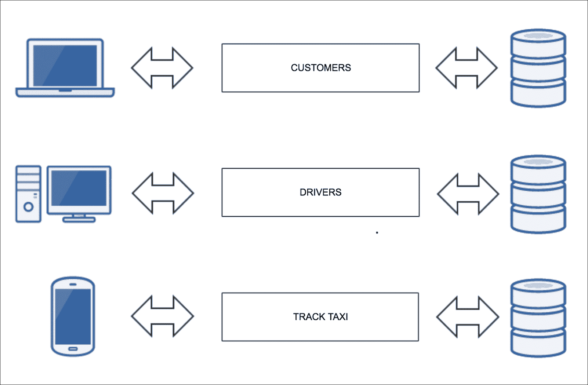

# 一、什么是微服务？

好的项目需要好的解决方案；这就是为什么开发人员总是在寻找更好的方法来完成他们的工作。没有适合所有项目的最佳解决方案，因为每个项目都有不同的需求，架构师（或开发人员）必须为特定项目找到最佳解决方案。

微服务可能是解决问题的好方法；在过去几年中，Netflix、PayPal、eBay、Amazon 和 Spotify 等公司选择在自己的开发团队中使用微服务，因为他们认为微服务是项目的最佳解决方案。要了解他们选择微服务的原因以及您应该在哪些项目中使用它们，有必要了解什么是微服务。

首先，理解什么是单体应用程序是很重要的，但基本上，我们可以将微服务定义为一种扩展的面向服务的体系结构。换句话说，它是一种通过遵循所需步骤将应用程序转换为各种小型服务来开发应用程序的方法。每个服务将执行自身并通过请求与其他服务通信，通常使用 HTTP 上的 API。

为了进一步了解什么是微服务，我们首先需要了解什么是单体应用程序。这是我们在过去几年中一直在开发的典型应用程序，例如在 PHP 中，使用像 Symfony 这样的框架；换句话说，我们开发的所有应用程序都分为不同的部分，如前端、后端和数据库，并且使用了**模型视图控制器**（**MVC**模式。区分 MVC 和微服务很重要。MVC 是一种设计模式，微服务是开发应用程序的一种方式；因此，使用 MVC 开发的应用程序仍然可以是单体应用程序。人们可能会认为，如果我们将应用程序划分为不同的机器，并将业务逻辑从模型和视图中划分出来，那么应用程序就基于微服务，但这是不正确的。

然而，使用单体架构仍然有其优势。还有各种各样的大型网络应用程序，比如 Facebook，都在使用它；我们只需要知道什么时候需要使用单体架构，什么时候需要使用微服务。

# 单体与微型服务

现在，我们将通过给出一个基本示例来讨论使用单体应用程序的优缺点，以及微服务如何改进特定项目。

想象一下像优步这样的出租车平台；本例中的平台将是一个小平台，只有基本的东西才能理解定义。有客户、司机、城市和实时跟踪出租车位置的系统：

在一个整体系统中，我们把所有这些都放在一起——我们有一个与城市相关的客户和司机的公共数据库，所有这些都与系统相连，以便使用外键跟踪出租车。

所有这些也可以使用主从数据库托管在不同的机器上；后端可以在不同的实例中使用负载平衡器或反向代理，前端可以使用 Node.js 甚至普通 HTML 使用不同的技术。即便如此，该平台将是一个单体应用程序。

让我们看一个单体应用程序中可能遇到的问题示例：

*   两位开发者 Joe 和 John 正在进行基本出租车示例项目；乔需要更改一些关于司机的代码，而约翰必须更改一些关于客户的代码。第一个问题是，两个开发人员都在使用相同的基本代码；这不是唯一的单体问题，但如果 Joe 需要在 drivers 上添加一个新字段，他可能也需要更改客户的模型，因此 Joe 的工作不会在 drivers 方面完成；换句话说，他的作品没有定界。这就是我们使用单体应用程序时发生的情况。
*   Joe 和 John 已经意识到跟踪出租车的系统必须与调用外部 API 的第三方进行通信。该应用程序的负载不是很大，但跟踪出租车的系统有很多来自客户和司机的请求，因此这方面存在瓶颈。Joe 和 John 必须扩展它以解决跟踪系统上的问题：他们可以获得更快的机器、更多的内存和负载平衡器，但问题是他们必须扩展整个应用程序。
*   乔和约翰很快乐；他们刚刚解决了出租车追踪系统的问题。现在，他们将把更改放在生产服务器上。当 web 应用程序上的流量较低时，他们将不得不在今晚工作；风险很高，因为他们必须部署整个应用程序，而不仅仅是系统来跟踪他们固定的出租车。
*   几个小时后，应用程序中出现错误 500。Joe 和 John 知道问题与跟踪系统有关，但整个应用程序将停止运行，只是因为应用程序的一部分出现问题。

微服务是一个简单、孤立的实体，有一个具体的方案。它是独立的，通过商定的渠道与其他微服务进行通信，如下图所示：

对于习惯于面向对象编程的开发人员来说，微服务的概念类似于在不同机器上工作的封装对象，并与在不同机器上工作的其他对象隔离开来。

按照与前面相同的示例，如果跟踪出租车的系统出现问题，则有必要隔离与应用程序这一部分相关的所有代码。这有点复杂，将在[第 9 章](09.html "Chapter 9. From Monolithic to Microservices")*中详细解释，从单体到微型服务*，但一般来说，它是系统专门用于跟踪出租车的数据库，因此，我们需要为此提取部件，并且需要修改代码以使用提取的数据库。一旦目标实现，我们将拥有一个带有 API（或任何其他通道）的微服务，该 API 可由单体应用程序的其余部分调用。

这将避免前面提到的问题——Joe 和 John 可以处理他们自己的问题，因为一旦应用程序划分为微服务，他们将处理客户或驱动程序微服务。如果 Joe 必须更改代码或包含一个新字段，他只需要在自己的实体中更改它，John 将使用驱动程序 API 与客户的部分进行通信。

可伸缩性可以只针对这个微服务来实现，因此不需要花费金钱和资源来扩展整个应用程序，如果跟踪出租车的系统出现故障，应用程序的其余部分将毫无问题地工作。

使用微服务的另一个优点是它们对语言不可知；换句话说，每个微服务可以使用不同的语言。用 PHP 编写的微服务可以与用 Python 或 Ruby 编写的其他微服务对话，因为它们只为其余的微服务提供 API，所以它们只需共享相同的接口就可以相互通信。

# 面向服务的体系结构与微服务

当开发者遇到微服务时，他们知道**面向服务的架构**（**SOA**）风格的软件设计，他们问自己的第一个问题是 SOA 和微服务是相同的还是相关的，答案有点争议；根据你问谁，答案会有所不同。

根据 Martin Fowler 的说法，SOA 专注于集成它们之间的单体应用程序，它使用**企业服务总线**（**ESB**来实现这一点。

当 SOA 架构开始出现时，这些架构试图在它们之间连接不同的组件，这是微服务的特征之一，但 SOA 的问题是需要围绕架构的许多东西才能正常工作，例如 ESB、**业务流程管理**（**BPM）**、服务存储库、注册等等，这使得开发更加困难。此外，为了更改代码的某些部分，在执行之前必须与其他开发团队达成一致。

所有这些都使得维护和代码进化变得困难，上市时间也很长；换句话说，对于经常需要进行实时更改的应用程序来说，这种体系结构不是最好的。

关于 SOA 还有其他一些观点。有人说 SOA 和微服务是一样的，但 SOA 是理论，微服务是一个很好的实现。使用 ESB 或使用 WSDL 或 WADL 进行通信不是必须的，但它被定义为 SOA 标准。如下图所示，使用 SOA 和 ESB 的体系结构如下所示：

请求通过不同的方式到达；这与微服务的工作方式相同，但所有请求都会到达 ESB，它知道应该在哪里调用以获取数据。

# 微服务特性

接下来，我们将介绍微服务体系结构的关键要素：

*   **准备失败**：微服务设计为失败。在 web 应用程序中，微服务相互通信，如果其中一个出现故障，其余的应该工作以避免级联故障。基本上，微服务试图避免使用异步调用、队列、基于参与者的系统和流进行同步通信。本主题将在后续章节中讨论。
*   **Unix 理念**：微服务应该遵循 Unix 理念。每个微服务必须设计为只做一件事，并且应该是小型的和独立的。这使我们作为开发人员能够独立地调整和部署每个微服务。Unix 理念强调构建简单、简短、清晰、模块化和可扩展的代码，这些代码可以由开发人员以及其创建者轻松维护和重新调整用途。
*   **通信层**：每个微服务通过 HTTP 请求和消息相互通信，执行业务逻辑，查询数据库，与所需系统交换消息，最后返回 JSON（或 HTML/XML）响应。
*   **可扩展性**：选择微服务架构的主要原因是可以轻松扩展应用程序。应用程序越大，流量越大，正确选择微服务就越有意义。微服务可以扩展所需的部分，而不会对应用程序的其余部分产生任何影响。

## 成功案例

了解微服务在现实生活中的重要性的最好方法是了解一些决定发展和使用微服务的平台，考虑未来，使维护和可扩展性更容易、更快、更有效：

*   **Netflix**：几年前，排名第一的在线视频流应用程序将其架构转变为微服务。有一个关于他们决定使用微服务的原因的故事。在对一个审查模块进行更改时，一名开发人员忘记将`;`放在该行的末尾，Netflix 被关闭了好几个小时。该平台每天从美国获得约 30%的总流量，因此 Netflix 必须为每月付费的客户提供稳定的服务。为了实现这一点，Netflix 针对我们提出的每个请求向其不同的服务器发出五个请求，并且它可以使用其流媒体视频 API 从 800 个不同的设备获得请求。
*   **易趣**：2007 年，易趣决定将其架构改为微服务；它在 C++和 Perl 上使用了一个整体应用程序，后来它们移动到 java 上的服务，最后用微服务实现了它们的体系结构。它的主要应用程序有许多服务，每个服务都执行自己的逻辑，供每个领域的客户使用。
*   **优步**：微服务让这家公司得以快速发展，因为它允许它为每个微服务使用不同的语言（Node.js、Go、Scala、Java 或 Python），招聘工程师的过程更容易，因为他们不受语言代码的限制。
*   **亚马逊**：也许亚马逊不是互联网流量之王，但几年前它转向了微服务，成为最早使用实时微服务的公司之一。工程师们说，不可能使用旧的单体应用程序提供他们提供的所有服务，例如 web 服务。
*   **Spotify**：Spotify 必须比对手更快。主工程师 Niklas Gustavsson 说，速度快、自动化一切以及拥有较小的开发团队对应用程序来说非常重要。这就是 Spotify 使用微服务的原因。

## 微服务的缺点

接下来，我们将看看微服务体系结构的缺点。当询问开发人员这方面的问题时，他们同意微服务的主要问题是在生产服务器上进行调试。

当你的应用程序中有数百个微服务，你必须找出问题所在时，调试基于微服务的应用程序可能会有点乏味；您需要花时间寻找导致错误的微服务。每个微服务都像一台单独的机器一样工作，因此要查看特定的日志，您必须转到特定的微服务。幸运的是，有一些工具可以帮助我们解决这个问题，方法是从应用程序中所有不同的微服务获取日志，并将它们放在一个位置。在接下来的章节中，我们将介绍这些类型的工具。

另一个缺点是需要将每一个微服务作为一个完整的服务器来维护；换句话说，每一个微服务都可以有一个或多个数据库、日志、不同的服务或库版本，甚至代码也可以使用不同的语言，因此，如果很难维护一台服务器并用数百台服务器来维护它，将浪费金钱和时间。

此外，微服务之间的通信非常重要——它们必须像时钟一样工作，因此通信对于应用程序来说至关重要。要做到这一点，开发团队之间的沟通将是必要的，以告诉对方他们需要什么，并为每个微服务编写良好的文档。

使用微服务的一个很好的实践是将一切自动化，或者至少使一切可能。也许最重要的部分是部署。如果有必要部署数百个微服务，这可能会很困难。因此，最好的方法是自动化这些任务。我们将在后面的章节中介绍如何做到这一点。

# 如何将发展重点放在微服务上

开发微服务是一种新的思维方式。因此，当您第一次遇到如何设计和构建应用程序时，可能会很困难。然而，如果您始终记得微服务背后最重要的思想是需要将应用程序分解为更小的逻辑部分，那么您已经走到了一半。

一旦您理解了这一点，以下核心思想将帮助您完成应用程序的设计和构建过程。

## 始终创建小型逻辑黑盒

作为一名开发人员，您总是从您将要构建的内容的大局出发。试着把大局分解成只做一件事的小逻辑块。一旦多个小部件准备就绪，就可以开始构建复杂的系统，确保应用程序的基础稳固。

您的每个微服务都像一个带有公共界面的黑盒子，这是与您的软件交互的唯一方式。您需要始终牢记的主要建议是构建一个非常稳定的 API。您可以在没有很多问题的情况下更改 API 调用的实现，但是如果您更改调用的方式，甚至更改此调用的响应，您将遇到很大的麻烦。在对 API 进行深入更改的情况下，请确保使用某种版本控制，以便支持旧版本和新版本。

## 网络延迟是你隐藏的敌人

服务之间的通信是通过使用网络作为连接管道的 API 调用进行的。此消息交换需要一些时间，但由于多种因素，它并不总是相同的。假设您在一台机器上有*服务*，在另一台机器上有*服务*。你认为网络延迟会一直保持不变吗？例如，如果其中一台服务器处于高负载下，并且需要一些时间来处理请求，会发生什么情况？为了减少时间，请始终关注您的基础架构，监视所有内容，并在可用的情况下使用压缩。

## 始终考虑可伸缩性

微服务应用程序的主要优点之一是每个服务都可以放大或缩小。这种灵活性可以通过将有状态服务的数量减少到最小来实现。有状态服务依赖于数据持久性，因此在不存在数据一致性问题的情况下很难移动或共享数据。

使用自动发现和自动注册技术，您可以构建一个系统，该系统知道在任何时候哪个系统将处理每个请求。

## 使用轻量级通信协议

没有人喜欢等待，即使是你的微服务。不要试图重新发明轮子或使用晦涩但很酷的通信协议，使用 HTTP 和 REST。所有 web 开发人员都知道它们，它们快速、可靠、易于实现，并且非常易于调试。如果需要提高安全性，请实现 SSL/TSL。

## 使用队列减少服务负载或进行异步执行

作为一名开发人员，您希望使您的系统尽可能快。因此，仅仅因为 API 调用正在等待一些可以在后台完成的操作，就增加 API 调用的执行时间是没有意义的。在这些情况下，最好的方法是使用队列和负责后台处理的作业运行人员。

假设您有一个通知系统，在向 microservice 电子商务下单时向客户发送电子邮件。您是否认为客户希望仅因为系统正在尝试发送电子邮件而等待查看付款成功页面？在这种情况下，一个更好的方法是将消息排队，这样客户将有一个非常即时的感谢页面。稍后，作业运行人员将接收排队通知，并将电子邮件发送给客户。

## 做好最坏情况下的准备

你有一个漂亮的，新的，好看的网站建立在微服务之上。当一切都出问题的时候，你准备好了吗？如果您遇到网络分区问题，您是否知道您的应用程序是否会从该情况中恢复？现在，假设您有一个推荐系统，但它已关闭，您是否打算在尝试恢复已停止的服务时向客户提供一个*默认*推荐？欢迎来到分布式系统的世界，当出现问题时，情况可能会变得更糟。始终牢记这一点，并尝试为任何情况做好准备。

## 每项服务都是不同的，所以保持不同的存储库和构建环境

我们正在将一个应用程序分解为我们想要独立扩展和部署的小部分，因此将源代码保存在不同的存储库中是有意义的。拥有不同的构建环境和存储库意味着每个微服务都有自己的生命周期，可以在不影响应用程序其余部分的情况下进行部署。

在接下来的章节中，我们将更深入地了解所有这些想法，以及如何使用不同的驱动开发来实现它们。

# 在微服务上使用 PHP 的优势

为了理解为什么 PHP 是一种适合构建微服务的编程语言，我们需要稍微了解一下它的历史，它来自哪里，它试图解决哪些问题，以及该语言的发展。

## PHP 的简史

1994 年，Rasmus Lerdorf 创建了我们可以说是 PHP 的第一个版本。他用 C 编程语言构建了一小套**通用网关接口**（**CGIs**）来维护他的个人网页。这套脚本被称为*个人主页工具*，但更常见的是被称为*PHP 工具*。

随着时间的推移，Rasmus 重写并扩展了该套件，使其能够处理 web 表单并能够与数据库通信。这个新的实现被称为*个人主页/表单解释器*或*PHP/FI*，作为其他开发人员可以构建动态 web 应用程序的框架。1995 年 6 月，源代码以*个人主页工具*（*PHP 工具*）*版本 1.0*的名义向公众开放，允许来自世界各地的开发人员使用它，修复 bug 并改进套件。

PHP/FI 的第一个想法不是创建一种新的编程语言，Lerdorf 让它有机地发展，从而导致一些问题，如函数名或其参数的不一致性。有时函数名与 PHP 使用的低级库相同。

1995 年 10 月，Rasmus 发布了新的代码重写版本；这是第一个被认为是高级脚本接口的版本，PHP 开始成为今天的编程语言。

作为一种语言，PHP 的设计在结构上与 C 非常相似，因此熟悉 C、Perl 或类似语言的开发人员更容易采用 PHP。随着语言特征的增长，早期采用者的数量也开始增加。Netcraft 1998 年 5 月的一项调查表明，近 60000 个域的头文件中包含 PHP（当时约占 Internet 上域的 1%），这表明托管服务器安装了 PHP。

PHP 历史上的一个重要时刻是 1997 年以色列特拉维夫的 Andi Gutmans 和 Zeev Suraski 加入该项目。此时，他们对解析器进行了另一次完全重写，并开始开发一种新的独立编程语言。这种新语言被命名为 PHP，意思是成为递归的首字母缩略词--**PHP**（**超文本预处理器**。

PHP3 的正式发布是在 1998 年 6 月，其中包含了大量的特性，使该语言适用于各种项目。其中包括一些功能，包括用于多个数据库的成熟接口、对多个协议和 API 的支持，以及扩展语言本身的方便性。在所有特性中，最重要的是包含了面向对象编程和更强大、更一致的语言语法。

Andi Gutmans 和 Zeev Suraski 于 1999 年创建了 Zend Technologies，并开始重写 PHP 的核心，创建了 Zend 引擎。Zend Technologies 成为最重要的 PHP 公司和源代码的主要贡献者。

这只是一个开始，随着时间的推移，PHP 在特性、语言稳定性、成熟度和开发人员采用方面都有了发展。

## PHP 里程碑

现在我们有了一些历史背景，我们可以关注 PHP 多年来取得的主要里程碑。每个版本都增加了语言的稳定性，并添加了越来越多的功能。

### 版本 4.x

PHP4 是第一个版本，包括 Zend 引擎。该引擎提高了 PHP 的平均性能。除了 Zend 引擎，PHP4 还支持更多的 web 服务器、HTTP 会话、输出缓冲和增强的安全性。

### 版本 5.x

PHP5 于 2004 年 7 月 13 日使用 Zend Engine II 发布，再次提高了语言性能。此版本包括对**面向对象**（**OO**编程的重要改进，使语言更加灵活和健壮。现在，用户可以选择以过程化或稳定的 OO 方式开发应用程序；他们可以两全其美。在这个版本中，还包括了用于连接数据存储的最重要的扩展之一--**PHP 数据对象**（**PDO**扩展）。

随着 PHP5 在 2008 年成为最稳定的版本，许多开源项目开始在其新代码中终止对 PHP4 的支持。

### 版本 6.x

这个版本是 PHP 最著名的失败之一。这个主要版本的开发始于 2005 年，但在 2010 年，由于 Unicode 实现的困难，它被放弃了。并不是所有的工作都被扔掉了，大多数特性（其中一个是名称空间）都被添加到了以前的版本中。作为补充说明，版本 6 通常与技术世界中的一个失败有关：PHP 6、Perl 6 甚至 MySQL 6 都从未发布过。

### 版本 7.x

这是一个期待已久的版本——一个统治所有人的版本，一个性能水平前所未有的版本。

2015 年 12 月 3 日，7.0.0 版发布，最后一个 Zend 引擎可用。仅通过更改计算机上运行的版本即可获得高达 70%的性能提升，占用的内存非常少。

这种语言也在发展，PHP 现在有了更好的 64 位支持和安全的随机数生成器。现在，您可以创建匿名类或定义返回类型以及其他主要更改。

该版本与其他所谓的*企业语言*形成了激烈的竞争。

## 优势

PHP 是可以用来构建 web 项目的最常用的编程语言之一。如果您还不确定 PHP 是否适合您的下一个应用程序，现在让我们告诉您使用 PHP 的主要优势：

*   **大社区**：通过 ZendCon、PHP[world]或国际 PHP 会议，在世界各地参加会议、活动和聚会非常容易。您不仅可以在活动和会议上与其他 PHP 开发人员交谈，还可以加入 IRC/Slack 频道或邮件列表，询问问题并不断更新自己。您可以在[的官方网站上找到您所在地区附近的众多活动地点之一 http://php.net/cal.php](http://php.net/cal.php) 。
*   **很棒的文档**：PHP 网站（[上提供了该语言的主要信息点 http://php.net/docs.php](http://php.net/docs.php) ）。本参考指南涵盖了 PHP 的各个方面，从基本控制流到高级主题。你想看书吗？没问题，在 15000 多本亚马逊参考书中很容易找到一本合适的书。即使你需要更多的信息，在谷歌上快速搜索也会得到超过 9300000000 的结果。
*   **稳定**：PHP 项目频繁发布，同时维护多个主要发布，直到其预定**生命周期结束**（**EOL**）。通常，从发布到下线的时间足够移动到下一个主流版本。
*   **Easy to deploy**: PHP is the most popular server-side programming language with an 81.8% usage in August 2016, so the market moves in the same direction. It is very easy to find a hosting provider with PHP preinstalled and ready to use, so you only need to deal with the deploy.

    有许多方法可以将代码部署到生产环境中。例如，您可以在 Git 存储库中跟踪代码，然后在服务器上执行 Git 拉取。您还可以通过 FTP 将文件推送到公共位置，甚至可以使用 Jenkins、Docker、Terraform、Packer、Ansible 或其他工具构建**持续集成**/**持续交付**（**CI**/**CD**系统。部署的复杂性将始终与项目的复杂性相匹配。

*   **易于安装**：PHP 为主要操作系统预先构建了软件包：可以安装在 Linux、Mac、Windows 或 Unix 上。有时包在包系统内可用（例如，apt）。在其他情况下，您需要外部工具来安装它，例如 Homebrew。在最坏的情况下，您可以下载源代码并在您的机器上编译它。
*   **开源**：所有的 PHP 源代码都可以在 GitHub 上获得，因此对于任何开发人员来说，深入了解每件事情的工作原理都非常简单。这种开放性允许程序员参与项目，扩展语言或修复 bug。PHP 中使用的许可证是一个**Berkeley 软件发行版**（**BSD**风格的许可证，没有与 GPL 相关的*copyleft*限制。
*   **高运行速度（PHP7）**：过去 PHP 不够快，但 PHP7 完全改变了这种情况。本主要版本基于以 Zend Technologies 为领导者的**PHP 下一代**（**PHPNG**项目。PHPNG 背后的想法是加速 PHP 应用程序，他们做得非常好。仅通过更改 PHP 版本，性能增益可以在 25%到 70%之间变化。
*   **High number of frameworks and libraries available**: The PHP ecosystem is very rich in libraries and frameworks. The common way to find a suitable library for your project is using PEAR and PECL.

    关于可用的框架，您可以使用最好的框架之一，例如 Zend Framework、Symfony、Laravel、Phalcon、CodeIgniter，或者如果找不到满足您需求的框架，您可以从头开始构建。最好的一点是，所有这些都是开源的，所以您可以随时扩展它们。

*   **高开发速度**：PHP 的学习曲线相对较小，可以帮助您从头开始编码。此外，与 C、Perl 和其他语言在语法上的相似性可以让您很快理解一切是如何工作的。PHP 避免了浪费时间等待编译器生成我们的构建。
*   **易于调试**：您可能知道，PHP 是一种解释语言。因此，当试图解决一个问题时，您有多种成功的选择。简单的方法是删除几个`var_dump`或`print_r`调用，以查看代码正在做什么。为了更深入地了解执行情况，可以将 IDE 链接到 Xdebug 或 Zend Debug，并开始跟踪应用程序。
*   **易于测试**：没有合适的测试套件，任何现代编程语言都无法在野外生存，因此您必须确保您的应用程序将继续按预期运行。别担心，PHP 社区会支持您，因为您可以使用多种工具进行任何类型的测试。例如，您可以将 PHPUnit 用于您的**测试驱动开发**（**TDD**），或者如果您正在进行**行为驱动开发**（**BDD**），则可以使用 Behat。
*   **你可以做任何事情**：PHP 是一种现代编程语言，在现实世界中有多个应用程序。因此，只有天空才是极限！您可以使用 GTK 扩展构建 GUI 应用程序，也可以使用 phar 归档中的所有必需文件创建终端命令。这种语言没有限制，所以任何东西都可以构建。

## 缺点

与任何编程语言一样，PHP 也有一些缺点。标记的一些最常见的缺点是：安全问题、不适合大型应用程序和弱类型。PHP 最初是 CGI 的集合，多年来变得更加现代和健壮，因此对于一种年轻的编程语言来说，它非常健壮和灵活（与其他语言相比）。

在任何情况下，有经验的开发人员在构建应用程序时，如果他们使用最佳实践，就可以克服这些缺点。

正如您已经看到的，PHP 的发展是巨大的。它有一个最有活力的社区，是为网络设计的，拥有创建任何类型项目所需的所有能力。毫无疑问，PHP 将是您表达最佳想法的合适语言。

# 总结

在本章中，我们研究了微服务如何与单体体系结构和 SOA 相抗衡。我们了解了微服务体系结构的基本组件及其优缺点。在本章中，我们进一步了解了如何实现微服务体系结构，以及在切换到微服务之前需要考虑的先决条件。后来，我们介绍了 PHP 版本的历史以及它们的优缺点。