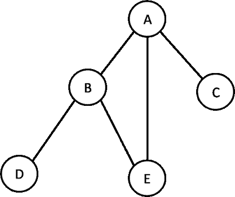
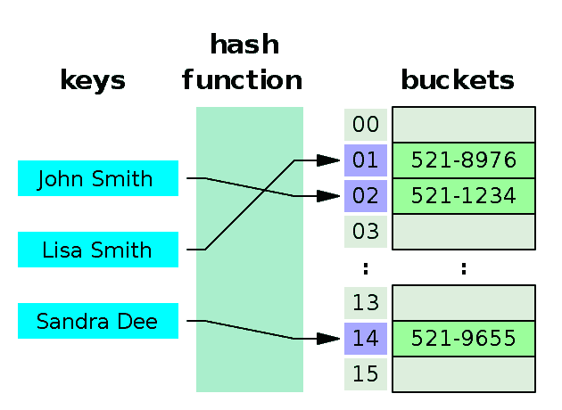

# 二、理解 PHP 数组

PHP 数组是 PHP 中最常用的数据类型之一。大多数情况下，我们使用它时没有考虑 PHP 数组在我们开发的代码或应用程序中的影响。它是如此易于使用和动态的性质；我们喜欢将 PHP 数组用于几乎任何目的。有时，我们甚至不想探究是否有其他可用的解决方案可以替代 PHP 数组。在本章中，我们将探讨 PHP 数组的优点和缺点，以及如何在不同的数据结构实现中使用数组以及提高性能。我们将首先解释 PHP 中不同类型的数组，然后创建固定大小的数组。然后，我们将看到 PHP 数组元素的内存占用，以及如何改进它们以及一些数据结构实现。

# 更好地理解 PHP 数组

PHP 数组是如此动态和灵活，以至于我们必须考虑它是常规数组、关联数组还是多维数组，就像在其他一些语言中一样。我们不需要定义要使用的数组的大小和数据类型。PHP 如何做到这一点，而 C 和 Java 等其他语言却无法做到这一点？答案很简单：PHP 中的数组概念实际上不是真正的数组，它实际上是一个**HashMap**。换句话说，PHP 数组不是我们从其他语言得到的简单明了的数组概念。一个简单的数组如下所示：


但是，我们绝对可以用 PHP 实现这一点。让我们用一个例子来检验一下：

```php
$array = [1,2,3,4,5];

```

这一行显示了典型阵列的外观。类似类型的数据有一个顺序索引（从 0 到 4）来访问这些值。那么谁说 PHP 数组不是典型的数组呢？让我们探讨更多的例子。考虑以下事项：

```php
$mixedArray = [];
$mixedArray[0] = 200;
$mixedArray['name'] = "Mixed array";
$mixedArray[1] = 10.65;
$mixedArray[2] = ['I', 'am', 'another', 'array'];

```

它是我们每天使用的 PHP 数组；我们不定义大小，而是存储整数、浮点数、字符串甚至其他数组。这听起来很奇怪，还是仅仅是 PHP 的一个超级功能？我们可以从[中查看定义 http://php.net](http://php.net) 。

An array in PHP is actually an **ordered map**. A map is a type that associates values to keys. This type is optimized for several different uses; it can be treated as an array, list (vector), hash table (an implementation of a map), dictionary, collection, stack, queue, and probably more. As array values can be other arrays, trees and multidimensional arrays are also possible.

因此，PHP 数组具有真正的超能力，可以用于所有可能的数据结构，如列表/向量、哈希表、字典、集合、栈、队列、双链表等。PHP 数组似乎是以这样一种方式构建的：要么针对所有内容进行优化，要么不针对任何内容进行优化。我们将在本章中探讨这一点。

如果我们想对数组进行分类，那么主要有三种类型的数组：

*   数字数组
*   关联数组
*   多维数组

我们将通过一些示例和解释来探讨每种类型的数组。

# 数字数组

数字数组并不意味着它只保存数字数据。事实上，这意味着索引将只是数字。在 PHP 中，它们可以是连续的，也可以是非连续的，但必须是数字。在数字数组中，值以线性方式存储和访问。以下是 PHP 数字数组的一些示例：

```php
$array = [10,20,30,40,50]; 
$array[] = 70;  
$array[] = 80; 

$arraySize = count($array); 
for($i = 0;$i<$arraySize;$i++) { 
    echo "Position ".$i." holds the value ".$array[$i]."\n"; 
} 

```

这将有以下输出：

```php
Position 0 holds the value 10 
Position 1 holds the value 20 
Position 2 holds the value 30 
Position 3 holds the value 40 
Position 4 holds the value 50 
Position 5 holds the value 70 
Position 6 holds the value 80 

```

这是一个非常简单的示例，其中定义了一个数组，索引从 0 自动生成，并随数组的值递增。当我们使用`$array[]`在数组中添加新元素时，它实际上会增加索引并在新索引中赋值。这就是为什么值 70 具有索引 5，80 具有索引 6。

如果我们的数据是连续的，我们总是可以毫无问题地使用`for`循环。当我们说顺序时，我们不仅仅指 0,1,2,3…，*n*。它可以是 0,5,10,15,20，…，*n*，其中*n*是 5 的倍数。或者它可以是 1,3,5,7,9……，*n*，其中*n*是奇数。我们可以创建数百个这样的序列，使数组成为数字。

一个大问题是，如果索引不是连续的，我们不能构造一个数字数组吗？当然可以。我们只需要采用一种不同的迭代方式。考虑下面的例子：

```php
$array = []; 
$array[10] = 100; 
$array[21] = 200; 
$array[29] = 300; 
$array[500] = 1000; 
$array[1001] = 10000; 
$array[71] = 1971; 

foreach($array as $index => $value) { 
    echo "Position ".$index." holds the value ".$value."\n"; 
} 

```

如果我们看一下索引，它们不是连续的。它们具有随机指标，如`10`后跟`21`、`29`等。即使在最后，我们也有指数`71`，它比之前的`1001`小得多。那么，最后一个指数应该在 29 到 500 之间吗？以下是输出：

```php
Position 10 holds the value 100 
Position 21 holds the value 200 
Position 29 holds the value 300 
Position 500 holds the value 1000 
Position 1001 holds the value 10000 
Position 71 holds the value 1971 

```

Couple of things to notice here:

We are iterating the array the way we entered the data. There is no internal sorting of the indexes at all, though they are all numeric.
Another interesting fact is that the size of the array `$array` is only `6`. It is not `1002` like C++, Java, or other languages where we need to predefine the size of the array before using it, and the max index can be *n-1* where *n* is the size of the array.

# 关联数组

关联数组由可以是任何字符串的键访问。在关联数组中，值是针对键而不是线性索引存储的。我们可以使用关联数组来存储任何类型的数据，就像数字数组一样。让我们创建一个学生数组，用于存储学生信息：

```php
$studentInfo = []; 
$studentInfo['Name'] = "Adiyan"; 
$studentInfo['Age'] = 11; 
$studentInfo['Class'] = 6; 
$studentInfo['RollNumber'] = 71; 
$studentInfo['Contact'] = "info@adiyan.com"; 

foreach($studentInfo as $key => $value) { 
    echo $key.": ".$value."\n"; 
} 

```

以下是代码的输出：

```php
Name: Adiyan 
Age: 11 
Class: 6 
RollNumber: 71 
Contact: info@adiyan.com 

```

这里我们使用每个键来保存一段数据。我们可以根据需要添加任意多的密钥，而不会出现任何问题。这使我们能够灵活地使用 PHP 关联数组表示类似于 structure、map 和 dictionary 的数据结构。

# 多维数组

多维数组中包含多个数组。换句话说，它是一个数组的数组。在本书中，我们将在不同的示例中使用多维数组，因为它们是存储图形和其他树型数据结构数据的最流行和最有效的方法之一。让我们通过一个示例来探索 PHP 多维数组：

```php
$players = [];
$players[] = ["Name" => "Ronaldo", "Age" => 31, "Country" => "Portugal", "Team" => "Real Madrid"];
$players[] = ["Name" => "Messi", "Age" => 27, "Country" => "Argentina", "Team" => "Barcelona"];
$players[] = ["Name" => "Neymar", "Age" => 24, "Country" => "Brazil", "Team" => "Barcelona"];
$players[] = ["Name" => "Rooney", "Age" => 30, "Country" => "England", "Team" => "Man United"];

foreach($players as $index => $playerInfo) { 
    echo "Info of player # ".($index+1)."\n";
    foreach($playerInfo as $key => $value) { 
        echo $key.": ".$value."\n";
    } 
    echo "\n";
} 

```

我们刚才看到的例子是一个二维数组的例子。因此，我们使用两个`foreach`循环来迭代二维数组。以下是代码的输出：

```php
Info of player # 1 
Name: Ronaldo 
Age: 31 
Country: Portugal 
Team: Real Madrid 

Info of player # 2 
Name: Messi 
Age: 27 
Country: Argentina 
Team: Barcelona 

Info of player # 3 
Name: Neymar 
Age: 24 
Country: Brazil 
Team: Barcelona 

Info of player # 4 
Name: Rooney 
Age: 30 
Country: England 
Team: Man United  

```

我们可以根据需要使用 PHP 创建 n 维数组，但我们必须记住一件事：添加的维度越多，结构就越复杂。作为人类，我们通常将三维可视化，因此为了拥有更多的三维阵列，我们必须对阵列如何在多个维度中工作有一个坚实的理解。

We can use both a numeric array and an associative array as a single array in PHP. But in such a case, we have to be very cautious to choose the right way to iterate through the array elements. In such cases, `foreach` will be a better choice than a `for` or `while` loop.

# 使用阵列作为灵活的存储

到目前为止，我们已经看到 PHP 数组是一种用于存储任何类型数据的动态、混合数据结构。这使我们可以更自由地利用阵列作为数据的灵活存储容器。我们可以在单个数组中混合不同的数据类型和数据的不同维度。我们甚至不必定义要使用的数组的大小或类型。我们可以在需要时随时在阵列中增加、缩小和修改数据。

PHP 不仅允许我们创建动态数组，还为我们提供了许多内置的数组功能。例如：`array_intersect`、`array_merge`、`array_diff`、`array_push`、`array_pop`、`prev`、`next`、`current`、`end`等等。

# 使用多维数组表示数据结构

在接下来的章节中，我们将讨论许多不同的数据结构和算法。我们将关注的关键数据结构之一是图形。我们已经知道了图形数据结构的定义。大多数情况下，我们将使用 PHP 多维数组将数据表示为邻接矩阵。让我们考虑下面的图表：



现在，如果我们认为图的每个节点是数组的值，我们可以将节点表示为：

```php
$nodes = ['A', 'B', 'C', 'D', 'E'];

```

但这只会给我们节点名。我们无法在节点之间连接或创建关系。为了做到这一点，我们需要构造一个二维数组，其中节点名称将是键，并且基于两个节点的互连性，值将是 0 或 1。由于图中没有提供方向，我们不知道*A*是否连接到*C*或者是否连接到*A*。所以我们假设两者都是相互连接的。

首先，我们需要为图创建一个数组，并将二维数组的每个节点初始化为 0。下面的代码正好可以做到这一点：

```php
$graph = [];
$nodes = ['A', 'B', 'C', 'D', 'E'];
foreach ($nodes as $xNode) {
    foreach ($nodes as $yNode) {
        $graph[$xNode][$yNode] = 0;
    }
}

```

让我们使用以下代码打印阵列，以便在定义节点之间的连接之前查看其实际外观：

```php
foreach ($nodes as $xNode) {
    foreach ($nodes as $yNode) {
        echo $graph[$xNode][$yNode] . "\t";
    }
    echo "\n";
}

```

由于未定义节点之间的连接，因此所有单元格均显示 0。因此，输出如下所示：

```php
0       0       0       0       0
0       0       0       0       0
0       0       0       0       0
0       0       0       0       0
0       0       0       0       0

```

现在，我们将定义节点的连接性，两个节点之间的连接将表示为值 1，如下代码所示：

```php
$graph["A"]["B"] = 1;
$graph["B"]["A"] = 1;
$graph["A"]["C"] = 1;
$graph["C"]["A"] = 1;
$graph["A"]["E"] = 1;
$graph["E"]["A"] = 1;
$graph["B"]["E"] = 1;
$graph["E"]["B"] = 1;
$graph["B"]["D"] = 1;
$graph["D"]["B"] = 1;

```

由于图中没有给出方向，所以我们将其视为无向图，因此我们为每个连接设置两个值到 1。对于*A*和*B*之间的连接，我们将`$graph["A"]["B"]`和`$graph["B"]["A"]`都设置为`1`。在后面的章节中，我们将了解更多关于定义节点之间的连接以及为什么要这样做的信息。现在我们只关注如何使用多维数组作为数据结构。我们可以重新打印矩阵，这一次，输出如下所示：

```php
0       1       1       0       1
1       0       0       1       1
1       0       0       0       0
0       1       0       0       0
1       1       0       0       0

```

在[第 9 章](09.html)、*将图形付诸行动*中了解更多关于图形及其操作的信息将更加有趣。

# 使用 SplFixedArray 方法创建固定大小的数组

到目前为止，我们已经研究了 PHP 数组，我们知道，我们没有定义数组的大小。PHP 阵列可以根据我们的需求增长或收缩。这种灵活性给内存使用带来了极大的不便。我们将在本节中探讨这一点。现在，让我们关注使用 SPL 库创建固定大小的数组。

为什么我们需要一个固定大小的数组？它有什么额外的优势吗？答案是，当我们知道一个数组中只需要一定数量的元素时，我们可以使用固定数组来减少内存使用。在进行内存使用分析之前，让我们举一些使用`SplFixedArray`方法的例子：

```php
$array = new SplFixedArray(10);

for ($i = 0; $i < 10; $i++)
    $array[$i] = $i;

for ($i = 0; $i < 10; $i++)
    echo $array[$i] . "\n";

```

首先，我们正在创建一个定义大小为 10 的新`SplFixedArray`对象。其余的行实际上遵循我们在常规 PHP 数组值赋值和检索中使用的相同原则。如果我们想要访问超出范围的索引（这里是 10），它将抛出一个异常：

```php
PHP Fatal error:  Uncaught RuntimeException: Index invalid or out of range

```

PHP 数组和`SplFixedArray`之间的基本区别是：

*   `SplFixedArray`必须具有固定的定义尺寸
*   `SplFixedArray`的索引必须是整数，并且在 0 到*n*的范围内，其中*n*是我们定义的数组的大小

当我们有许多已知大小的已定义数组，或者数组的最大所需大小有一个上限时，`SplFixedArray`方法非常方便。但是如果我们不知道数组的大小，那么最好使用 PHP 数组。

# 常规 PHP 数组与 SplFixedArray 的性能比较

在上一节中我们遇到的一个关键问题是，为什么我们应该使用`SplFixedArray`而不是 PHP 数组？我们现在准备探索答案。我们发现 PHP 数组实际上不是数组，而是散列映射。让我们在 PHP5.x 版本中运行一个小示例代码，查看 PHP 数组的内存使用情况。

让我们创建一个包含 100000 个唯一 PHP 整数的数组。由于我运行的是一台 64 位的机器，我希望每个整数都有 8 个字节。因此，阵列将消耗大约 800000 字节的内存。代码如下：

```php
$startMemory = memory_get_usage();
$array = range(1,100000);
$endMemory = memory_get_usage();
echo ($endMemory - $startMemory)." bytes";

```

如果在命令提示符下运行此代码，我们将看到 14649040 字节的输出。是的，没错。内存使用量几乎是我们计划的 18.5 倍。这意味着，对于数组中的每个元素，一个 PHP 数组的开销为 144 字节（18*8 字节）。现在，这额外的 144 字节来自哪里？为什么 PHP 会为每个数组元素使用如此多的额外内存？以下是 PHP 数组使用的额外字节的说明：


此图显示 PHP 数组如何在内部工作。它将数据存储在 bucket 中，以避免冲突并容纳更多数据。为了管理这种动态特性，它在内部为数组实现了双链接列表和哈希表。最终，它会为阵列中的每个元素消耗大量额外的内存空间。以下是基于 PHP 数组实现代码（C 代码）的每个元素的内存消耗明细：

|  | **32 位** | **64 位** |
| 兹瓦尔 | 16 字节 | 24 字节 |
| +循环 GC 信息 | 4 字节 | 8 字节 |
| +分配头 | 8 字节 | 16 字节 |
| zval（值）总计 | 28 字节 | 48 字节 |
| 水桶 | 36 字节 | 72 字节 |
| +分配头 | 8 字节 | 16 字节 |
| +指针 | 4 字节 | 8 字节 |
| 桶（数组元素）总计 | 48 字节 | 96 字节 |
| 总计（桶+zval） | 76 字节 | 144 字节 |

In order to understand the internal structure of a PHP array, we need to study in depth about PHP internals. It is beyond the scope of this particular book. A good recommended read is: [https://nikic.github.io/2011/12/12/How-big-are-PHP-arrays-really-Hint-BIG.html](https://nikic.github.io/2011/12/12/How-big-are-PHP-arrays-really-Hint-BIG.html)

在新的 PHP7 版本中，PHP 数组及其内部构造方式有了很大的改进。因此，每个元素上的 144 字节开销已降至 36 字节。这是一个很大的改进，适用于 32 位和 64 位操作系统。一个数组中包含 100000 个项目的比较图如下所示：

| **$数组=范围（1100000）** | **32 位** | **64 位** |
| PHP 5.6 或以下版本 | 7.4 MB | 14MB |
| PHP7 | 3MB | 4MB |

因此，换句话说，PHP7 对于 32 位系统和 64 位系统的阵列存储的改善系数分别是 2.5 倍和 3.5 倍。这真是一个很好的进步。但这都是关于 PHP 数组的，`SplFixedArray`呢？让我们在 PHP7 和 PHP5.x 中使用`SplFixArray`运行相同的示例：

```php
$items = 100000; 
$startMemory = memory_get_usage(); 
$array = new SplFixedArray($items); 
for ($i = 0; $i < $items; $i++) { 
    $array[$i] = $i; 
} 
$endMemory = memory_get_usage(); 

$memoryConsumed = ($endMemory - $startMemory) / (1024*1024); 
$memoryConsumed = ceil($memoryConsumed); 
echo "memory = {$memoryConsumed} MB\n"; 

```

我们已经在这里编写了`SplFixedArray`的内存消耗功能。如果我们只是将行`$array = new SplFixedArray($items);`更改为`$array = [];`，我们将运行与 PHP 数组相同的代码。

The benchmark result can vary from machine to machine as there can be different OS, memory size, debugger on/off, and so on. It is always suggested to run the codes in your own machines to generate a similar benchmark for comparisons.

下面是一个 PHP 数组和`SplFixedArray`在 64 位系统中具有 100000 个整数的数组的内存消耗比较：

| **10 万件** | **使用 PHP 数组** | **固定阵列** |
| PHP 5.6 或以下版本 | 14MB | 6MB |
| PHP7 | 5 MB | 2MB |

与访问值、赋值等一般 PHP 数组操作相比，`SplFixedArray`不仅在内存使用方面，执行速度也更快。

Though we use the  `SplFixedArray` object with [] just like the array, PHP array functions will not be applicable for `SplFixedArray.` We cannot directly apply any PHP array functions such as `array_sum`, `array_filter`, and so on.

# 更多使用 SplFixedArray 的示例

由于`SplFixedArray`有一个良好的性能提升指标，我们可以在大多数数据结构和算法中使用它来代替常规 PHP 数组。现在我们将探讨更多在不同场景中使用`SplFixedArray`的示例。

# 从 PHP 数组更改为 SplFixedArray

我们已经看到了如何创建具有固定长度的`SplFixedArray`。如果我想在运行时为`SplFixedArray`创建一个数组，该怎么办？下面的代码块显示了如何实现它：

```php
$array =[1 => 10, 2 => 100, 3 => 1000, 4 => 10000]; 
$splArray = SplFixedArray::fromArray($array); 
print_r($splArray); 

```

这里我们使用`SplFixedArray`类的静态方法`fromArray`从现有数组`$array`构建一个`SplFixedArray`。然后我们使用 PHP`print_r`函数打印数组。它将显示如下输出：

```php
SplFixedArray Object 
( 
    [0] => 
    [1] => 10 
    [2] => 100 
    [3] => 1000 
    [4] => 10000 
) 

```

我们可以看到该数组现在已转换为一个`SplFixedArray`，它保持了与实际数组中完全相同的索引号。因为实际数组没有定义 0 索引，所以这里索引 0 保持为 null。但是如果我们想忽略上一个数组中的索引并为它们分配新的索引，那么我们必须将上一个代码的第二行更改为：

```php
$splArray = SplFixedArray::fromArray($array,false); 

```

现在，如果我们再次打印阵列，我们将获得以下输出：

```php
SplFixedArray Object
( 
    [0] => 10
    [1] => 100
    [2] => 1000
    [3] => 10000
) 

```

If we want to convert an array to a fixed array during runtime, it is a better idea to unset the regular PHP array if it is not being used later on. It will save memory usage if it is a big array.

# 将 SplFixedArray 转换为 PHP 数组

我们可能还需要将`SplFixedArray`转换为常规 PHP 数组，以应用 PHP 中的一些预定义数组函数。与前面的示例一样，这也是一件非常简单的事情：

```php
$items = 5; 
$array = new SplFixedArray($items); 
for ($i = 0; $i < $items; $i++) { 
    $array[$i] = $i * 10; 
} 

$newArray = $array->toArray(); 
print_r($newArray); 

```

这将产生以下输出：

```php
Array 
( 
    [0] => 0 
    [1] => 10 
    [2] => 20 
    [3] => 30 
    [4] => 40 
) 

```

# 声明后更改 SplFixedArray 大小

由于我们在开始定义数组大小，因此以后可能需要更改大小。为了做到这一点，我们必须使用`SplFixedArray`类的`setSize()`方法。示例如下所示：

```php
$items = 5; 
$array = new SplFixedArray($items); 
for ($i = 0; $i < $items; $i++) { 
    $array[$i] = $i * 10; 
} 

$array->setSize(10); 
$array[7] = 100; 

```

# 使用 SplFixedArray 创建多维数组

我们可能还需要使用`SplFixedArray`创建两个或更多的二维数组。为此，建议遵循以下示例：

```php
$array = new SplFixedArray(100);
for ($i = 0; $i < 100; $i++) 
$array[$i] = new SplFixedArray(100);

```

实际上，我们正在每个数组索引中创建另一个`SplFixedArray`。我们可以添加任意多个维度。但我们必须记住，对于维数，我们是在乘以数组的大小。所以它可以很快地变大。

# 理解哈希表

在编程语言中，哈希表是用于使数组关联的数据结构。这意味着我们可以使用键来映射值，而不是使用索引。哈希表必须使用哈希函数将索引计算到桶或槽数组中，从中可以找到所需的值：



正如我们多次提到的，PHP 数组实际上是一个哈希表，因此它支持关联数组。我们需要记住一件事：我们不需要为关联数组实现定义哈希函数。PHP 在内部为我们做这件事。因此，在 PHP 中创建关联数组时，实际上是在创建哈希表。例如，可以将以下代码视为哈希表：

```php
$array = []; 
$array['Germany'] = "Position 1"; 
$array['Argentina'] = "Position 2"; 
$array['Portugal'] = "Position 6"; 
$array['Fifa_World_Cup'] = "2018 Russia";  

```

事实上，我们可以直接调用任何只需**O（1）**复杂度的键。由于 PHP 将使用相同的散列函数来计算索引，因此该键将始终引用 bucket 中的相同索引。

# 使用 PHP 数组实现 struct

正如我们已经知道的，结构是一种复杂的数据类型，其中我们将多个属性定义为一个组，以便将其用作单个数据类型。我们可以使用 PHP 数组和类编写结构。以下是使用 PHP 数组的结构示例：

```php
$player = [ 
    "name" => "Ronaldo", 
    "country" => "Portugal", 
    "age" => 31, 
    "currentTeam" => "Real Madrid" 
]; 

```

它只是一个以键为字符串的关联数组。可以使用单个或多个构造作为其属性来构造复杂结构。例如，使用玩家结构，我们可以使用团队结构：

```php
$ronaldo = [ 
    "name" => "Ronaldo", 
    "country" => "Portugal", 
    "age" => 31, 
    "currentTeam" => "Real Madrid" 
]; 

$messi = [ 
    "name" => "Messi", 
    "country" => "Argentina", 
    "age" => 27, 
    "currentTeam" => "Barcelona" 
]; 

$team = [ 
    "player1" => $ronaldo, 
    "player2" => $messi 
]; 

The same thing we can achieve using PHP Class. The example will look like:  
Class Player { 

    public $name; 
    public $country; 
    public $age; 
    public $currentTeam; 

} 

$ronaldo = new Player; 
$ronaldo->name = "Ronaldo"; 
$ronaldo->country = "Portugal"; 
$ronaldo->age = 31; 
$ronaldo->currentTeam = "Real Madrid"; 

```

因为我们已经看到了定义结构的两种方法，所以我们必须选择其中一种来实现结构。虽然创建对象看起来更方便，但与数组实现相比，它的速度较慢。当数组在速度上有额外优势时，它也有缺点，因为它比对象占用更多的内存空间。现在我们必须根据自己的喜好做出决定。

# 使用 PHP 数组实现集合

集合只是一组没有任何特定顺序的值的集合。它可以包含任何数据类型，我们可以运行不同的集合操作，如并集、交集、补集等。由于集合只包含值，我们可以构造一个基本的 PHP 数组并为其赋值，使其动态增长。下面的示例显示了我们定义的两个集合；一个包含一些奇数，另一个包含一些素数：

```php
$odd = []; 
$odd[] = 1; 
$odd[] = 3; 
$odd[] = 5; 
$odd[] = 7; 
$odd[] = 9; 

$prime = []; 
$prime[] = 2; 
$prime[] = 3; 
$prime[] = 5; 

```

为了检查集合中是否存在值以及并集、交集和补集运算，我们可以使用以下示例：

```php
if (in_array(2, $prime)) { 
    echo "2 is a prime"; 
} 

$union = array_merge($prime, $odd); 
$intersection = array_intersect($prime, $odd); 
$compliment = array_diff($prime, $odd);  

```

PHP 有许多用于此类操作的内置函数，我们可以将它们用于 set 操作。但是我们必须考虑一个事实：因为集合不是以任何特定方式排序的，所以在最坏的情况下，利用{席} t-函数搜索可能存在复杂性。`array_merge()`函数也是如此，因为它将用另一个数组检查一个数组中的每个值。为了加快速度，我们可以稍微修改一下代码并使其高效：

```php
$odd = []; 
$odd[1] = true; 
$odd[3] = true; 
$odd[5] = true; 
$odd[7] = true; 
$odd[9] = true; 

$prime = []; 
$prime[2] = true; 
$prime[3] = true; 
$prime[5] = true; 

if (isset($prime[2])) { 
    echo "2 is a prime"; 
} 

$union = $prime + $odd; 
$intersection = array_intersect_key($prime, $odd); 
$compliment = array_diff_key($prime, $odd); 

```

如果我们分析这段代码，我们可以看到我们正在使用索引或键来定义集合。由于 PHP 数组索引或键查找的复杂性为**O（1），**使搜索速度大大加快。因此，与前面的示例相比，所有查找、并集、交集和补码操作所需的时间更少。

# PHP 数组的最佳使用

虽然 PHP 数组会消耗更多内存，但对于许多数据结构来说，使用 PHP 数组的灵活性更为重要。因此，我们将在许多数据结构实现和算法中使用 PHP 正则数组以及`SplFixedArray`。如果我们只考虑 PHP 数组作为数据的容器，那么在许多数据结构实现中，我们将更容易利用其强大的特性。除了内置函数外，PHP 数组绝对是使用 PHP 编程和开发应用程序时必须使用的数据结构。

PHP 有一些用于数组的内置排序函数。它可以使用键和值进行排序，并在排序时保持关联。我们将在[第 7 章](07.html)*中使用排序算法*探索这些内置函数。

# PHP 数组，它是性能杀手吗？

在本章中，我们已经看到 PHP 数组中的每个元素都有非常大的内存开销。由于它是由语言本身完成的，我们在这里只能做很少的事情，除了我们使用`SplFixedArray`而不是一个规则数组。但是，如果我们从 PHP5.x 版本迁移到新的 PHP7，那么无论是使用常规 PHP 数组还是`SplFixedArray`，我们的应用程序都会有巨大的改进。

在 PHP7 中，哈希表的内部实现发生了巨大的变化，它不是为了提高效率而构建的。因此，每个元素的开销内存消耗显著降低。虽然我们可以说更少的内存消耗并不能使代码更快，但我们可以反驳说，如果要管理的内存更少，我们可以更多地关注执行，而不是内存管理。因此，我们对性能有一些影响。

到目前为止，我们可以轻松地说，PHP7 中新改进的数组绝对是开发人员解决复杂且内存效率高的应用程序的推荐选择。

# 总结

在本章中，我们重点讨论了 PHP 数组，以及使用 PHP 数组作为数据结构可以做些什么。在接下来的章节中，我们将继续探索阵列特性。在下一章中，我们将重点讨论链表数据结构和链表的不同变体。我们还将探讨关于链表的不同类型的实例及其最佳用法。