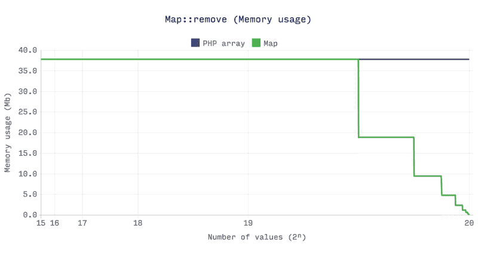
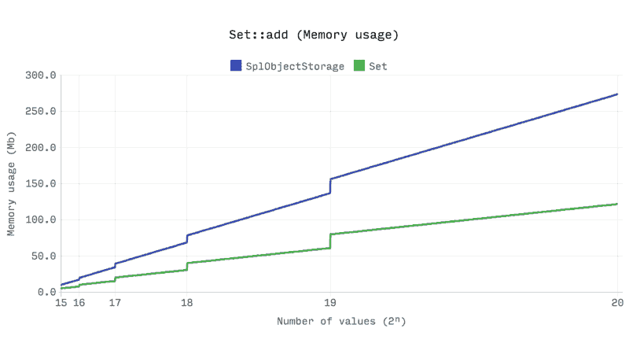

# 十二、PHP 内置对数据结构和算法的支持

PHP 是一种具有丰富的预定义函数库以及来自社区的超级支持的语言。无论是算法还是数据结构，PHP 已经为开发人员提供了可靠的内置支持。在本章中，我们将探讨一些可以在数据结构和算法实现中使用的内置函数和特性。现在让我们探讨一下 PHP 中的这些特性。

# 用于数据结构的内置 PHP 功能

PHP 在标准 PHP 库 SPL 中有丰富的内置数据结构集合。PHP7 发布后，人们认为 SPL 数据结构实现与旧 PHP 版本相比不是很“性能”。因此，我们将讨论一个新的 PECL 扩展，它只是为数据结构设计的。我们还非常支持 PHP 数组，它可以用作集合、向量、映射、哈希表、栈、队列、集合、字典等。与阵列相比，SPL 是相当新的，并且仍然能够通过作为内置功能的核心数据结构的不同实现抓住焦点。自 PHP5.0 以来，SPL 随核心 PHP 一起提供，因此不需要额外的扩展或构建。我们已经在[第 2 章](02.html)*理解 PHP 数组*中探讨了 PHP 数组的动态性质。在本章中，我们将列举一些 PHP 可用于操作数据结构的其他有用函数。

# 使用 PHP 数组

PHP 数组具有更广泛的预定义函数集，使 PHP 数组成为 PHP 最常用的功能之一。我们不会讨论所有可用的 PHP 数组函数。我们将讨论一些在数据结构操作中非常有用的函数。以下是 PHP 数组函数：

*   **数组 _pop**：弹出数组的最后一个元素，类似于栈弹出操作。数组作为引用传递给函数。它只接受一个参数，即数组的名称。
*   **数组 _push**：将一个或多个元素推送到数组末尾，就像栈推送操作一样。我们已经看到，我们可以使用 push 一次推一个元素。在 PHP 数组中，我们可以在当前数组的末尾推送多个值。数组在函数中作为引用传递，如图所示：

```php
$countries = []; 
array_push($countries, 'Bangladesh', 'Bhutan'); 

```

*   **当前**：每个数组都有一个内部指针来标识当前所在的位置。最初，它从数组的第一个元素开始。current 函数返回数组的当前指针，并返回当前位置的元素值。如果我们认为数组是一个列表，那么这些内部指针功能将是必需的。
*   **prev**：`prev`功能将内部指针向后移动一步。PHP 数组可以作为双链表使用，`prev`用于转到上一个指针。
*   **下一个**：`next`函数将内部指针移动到下一个元素。
*   **end**：`end`函数将内部数组指针移动到数组的末尾。
*   **复位**：`reset`功能将内部阵列移动到阵列的开头。
*   **数组搜索**：这是一个非常有用的函数，用于搜索数组中的元素。如果在数组中找到该元素，它将返回找到该元素的相应索引。如果没有找到任何内容，它将返回 false。如果有多个元素具有相同的搜索键，它将返回第一个出现索引。我们必须小心，因为如果在第一个索引中找到元素，该函数也可能返回 0。因此，在比较过程中，我们必须通过严格的类型检查来检查布尔值 false。`array_search`函数接受两个强制参数：needle 和 haystack。针是我们正在寻找的元素，haystack 是我们正在寻找元素的数组。例如，如果我们在词典中寻找一个词，那么我们可以把搜索词，如“针”和“字典”作为大海捞针。有一个可选的第三个参数，可以对元素进行严格的类型检查。因此，如果设置为 true，则它不仅按值搜索元素，还按类型搜索元素：

```php
$countries = ["Bangladesh", "Nepal", "Bhutan"]; 

$key = array_search("Bangladesh", $countries); 
if ($key !== FALSE) 
    echo "Found in: " . $key; 
else 
    echo "Not found"; 

```

这将产生以下输出：

```php
    Found in: 0

```

如果我们有在`if`条件检查内，则结果中会显示`Not  found`。

*   **数组**：这是另一个方便的 PHP 内置函数，用于获取给定数组的和。它将返回单个数值，即数组中所有元素的总和。它可以是整数或浮点。
*   **数组映射**：如果我们想要更改具有特定类型属性的数组元素，这是一个非常有用的函数。例如，我们希望使数组的所有文本都是大写或小写。我们可以使用这个函数来实现这一点，而不是运行循环。`array_map`函数有两个参数。第一个是可调用函数，第二个是数组本身。函数返回修改后的数组，如下所示：

```php
$countries = ["bangladesh", "nepal", "bhutan"]; 
$newCountries = array_map(function($country) { 
    return strtoupper($country); 
}, $countries); 

foreach ($newCountries as $country) 
    echo $country . "\n"; 

```

或者，我们可以这样简单地写：

```php
$countries = ["bangladesh", "nepal", "bhutan"]; 
$newCountries = array_map('strtoupper', $countries); 

foreach ($newCountries as $country) 
    echo $country . "\n"; 

```

前面的代码应用一个`array_map`函数来大写给定数组中的每个单词。这两个代码将产生以下输出：

```php
BANGLADESH
NEPAL
BHUTAN

```

*   **数组\u rand**：如果我们需要从给定数组中随机选取一个或多个项目，此函数非常有用。要返回的项目数的默认值为 1，但我们始终可以增加它。
*   **数组 _shift**：此函数将一个元素从数组的开头移位，这与我们在队列数据结构中的出列操作非常相似。从函数返回已删除的元素：

```php
$countries = ["bangladesh", "nepal", "bhutan"]; 
$top = array_shift($countries); 
echo $top; 

```

这将在命令行中显示输出`bangladesh`。`$countries`阵列中只有`nepal`和`bhutan`。

*   **数组\取消移位**：此函数在数组的开头添加一个或多个项目，并取消移位现有项目。
*   **洗牌**：如果出于任何原因需要洗牌数组，可以使用此功能。此函数可以非常方便地对整个阵列进行随机化。
*   **数组 _intersect**：此函数以两个或多个数组为参数，返回第一个数组中的公共项，并找出其他数组中是否存在。此功能还保留关键点。
*   **数组 _diff**：此函数计算数组与其他给定数组之间的差异。与`array_intersect`函数一样，此函数也将多个数组作为参数，其中第一个参数是基数组，其他参数将与之进行比较以区分。

PHP 中有许多有用的数组函数，它们解决了许多现有的数据结构和算法问题。我们可以在 PHP 文档中找到内置数组函数的列表。在本书中，我们将在接下来的章节中探索更多用于排序的数组函数。对于其他函数，建议进一步阅读 PHP.NET。

# SPL 类

毫无疑问，SPL 试图为 PHP 程序员解决常见的数据结构实现问题。我们中的许多人害怕或不愿意在编程时实现适当的数据结构。SPL 附带了所有基本数据结构的实现，因此，通过使用内置类和方法，使开发人员的工作更加轻松。由于 SPL 是 PHP 的一个捆绑包，我们不需要单独安装它或为它启用任何扩展。在本节中，我们将简要讨论一些常见的 SPL 类：

*   **SplDoublyLinkedList**：这个类让我们可以选择实现一个双链表，而无需编写大量代码。虽然它说的是双链表，但是我们也可以利用这个类来实现栈和队列，通过在`setIteratorMode`方法中设置迭代模式。
*   **SplStack**：**`SplStack`类是`SplDoublyLinkedList`类的一个扩展版本，其中提供了标准栈函数，实际上来自于双链表类。**
***   **SplQueue**：`SplQueue`类是`SplDoublyLinkedList`类的扩展版本，其中提供了`enqueue`、`dequeue`等标准队列函数。但是，这些函数实际上来自双链表类。*   **SplHeap**：这是 PHP 的通用堆实现。`SplMaxHeap`和`SplMinHeap`是通用堆类的两个实现。*   **SPPriorityQueue**：`SplPriorityQueue`使用`SplMaxHeap`实现，提供优先级队列的基本功能。*   **SplFixedArray**：正如我们在[第 2 章](02.html)中看到的，*理解 PHP 数组*、`SplFixedArray`可以非常方便地解决内存和性能问题。`SplFixedArray`采用整数作为索引，因此与普通 PHP 数组相比，它具有更快的读写操作。*   **SplObjectStorage**：通常，我们使用整数或字符串键在数组中存储任何内容。这个 SPL 类为我们提供了一种针对对象存储值的方法。在对象存储中，我们可以直接使用对象作为映射的键。另外，我们可以使用这个类来存储对象集合。**

 **# 内置 PHP 算法

现在，我们将检查 PHP 的一些内置功能，这些功能解决了日常操作所需的大量算法实现。我们可以将这些函数分类为数学、字符串、密码学和哈希、排序、搜索等。我们现在将探讨基本转换算法：

*   **基数转换**：此功能用于数字的基数转换。基本范围限制在 2 到 36 之间。由于基数可以是任意基数并包含字符，因此函数的第一个参数是字符串。以下是该函数的一个示例：

```php
$baseNumber = "123456754"; 
$newNumber = base_convert($baseNumber, 8, 16); 
echo $newNumber; 

```

这将产生以下输出：

```php
    14e5dec

```

*   **bin2hex**：将二进制字符串转换为十六进制字符串。它只接受二进制字符串作为参数。
*   **bindec**：将二进制字符串转换为十进制数。它只接受二进制字符串作为参数。
*   **decbin**：将十进制数转换为二进制字符串。它只接受十进制值作为参数。
*   **dechex**：将十进制数转换为十六进制字符串。它只接受一个十进制值作为参数。
*   **煎煮**：将十进制数转换为八进制字符串。它只接受一个十进制值作为参数。
*   **hex2bin**：将十六进制字符串转换为二进制字符串。它只接受十六进制字符串作为参数。
*   **hexdec**：将十六进制字符串转换为十进制数。它只接受十六进制字符串作为参数。
*   **octdec**：将八进制字符串转换为十进制数。它只接受一个八进制字符串作为参数。

还有许多其他内置函数用于不同的目的。要做的最重要的事情之一是在发送电子邮件或传输层时对文本字符串进行编码和解码。因为我们需要编码，并且可以选择解码，所以我们不使用单向加密功能。此外，还有许多有用的函数可用于不同的字符串操作。我们现在将探讨这些功能：

*   **base64_encode**：此函数使用 base64 mime 类型对数据进行编码。通常，编码字符串比实际字符串大，占用的空间比实际字符串多 33%。有时，生成的字符串末尾有一个或两个相等的符号，这表示字符串的输出填充。
*   **base64_decode**：此函数获取一个 base64 编码字符串，并从中生成实际字符串。它与我们前面讨论的函数正好相反。
*   **levenshtein**：我们面临的一个最常见的问题是发现两个文本之间的相似性，例如，我们在列表中没有的产品的用户输入名称。然而，快速检查显示文本中有一个打字错误。以便根据要添加、编辑或删除的最小字符数显示最接近的匹配字符串或正确的字符串。我们称之为编辑距离。`levenshtein`函数或 levenshtein 距离定义为将第一个字符串转换为第二个字符串所需替换、插入或删除的最小字符数。函数的复杂度为`O(m*n)`，限制为每个字符串必须少于 255 个字符。以下是一个例子：

```php
$inputStr = 'Bingo'; 
$fruites = ['Apple', 'Orange', 'Grapes', 'Banana', 'Water melon', 'Mango']; 

$matchScore = -1; 
$matchedStr = ''; 

foreach ($fruites as $fruit) { 
    $tmpScore = levenshtein($inputStr, $fruit); 

    if ($tmpScore == 0 || ($matchScore < 0 || $matchScore >
     $tmpScore)) { 
     $matchScore = $tmpScore; 
     $matchedStr = $fruit; 
    } 
} 

echo $matchScore == 0 ? 'Exact match found : ' . $matchedStr : 'Did you mean: ' . $matchedStr . '?\n'; 

```

这将有以下输出：

```php
    Did you mean: Mango?

```

该函数的另一个变体需要额外的三个参数，通过这些参数，我们可以提供插入、替换和删除操作的成本。这样，我们就可以根据成本函数得到最好的结果。

*   **相似性**：此函数计算两个字符串之间的相似性。它可以选择以百分位方式返回相似性。该函数区分大小写，并根据匹配的字符返回相似性分数。以下是一个例子：

```php
$str1 = "Mango"; 
$str2 = "Tango"; 

echo "Match length: " . similar_text($str1, $str2) . "\n"; 
similar_text($str1, $str2, $percent); 
echo "Percentile match: " . $percent . "%"; 

```

前面的代码将生成芒果和探戈之间的百分位匹配。结果如下：

```php
Match length: 4
Percentile match: 80%

```

*   **soundex**：这是一个有趣的函数，使用它我们可以找到给定字符串的 soundex 键。此 soundex 键可用于从集合中查找发音相似的单词，或查找两个单词的发音是否相似。soundex 键的长度为四个字符，其中第一个字符是字母，其余三个是数字。以下是一些熟悉单词的 soundex 键：

```php
$word1 = "Pray"; 
$word2 = "Prey"; 
echo $word1 . " = " . soundex($word1) . "\n"; 
echo $word2 . " = " . soundex($word2) . "\n"; 

$word3 = "There"; 
$word4 = "Their"; 
echo $word3 . " = " . soundex($word3) . "\n"; 
echo $word4 . " = " . soundex($word4) . "\n"; 

```

上述代码将具有以下输出：

```php
Pray = P600
Prey = P600
There = T600
Their = T600

```

我们可以从前面的输出中看到，`pray`和`prey`都是不同的单词，但它们有相似的 soundex 键。Soundex 对于在不同的用例中从数据库中查找类似发音的单词非常有用。

*   **变音**：变音是与 soundex 类似的另一个功能，可以帮助我们找到发音相似的单词。两者的基本区别在于，变音更准确，因为它考虑了英语发音的基本规则。该函数生成长度可变的变音键。我们还可以传递第二个参数来限制密钥生成长度。以下是来自 soundex 的类似示例：

```php
$word1 = "Pray"; 
$word2 = "Prey"; 
echo $word1 . " = " . metaphone($word1) . "\n"; 
echo $word2 . " = " . metaphone($word2) . "\n"; 

$word3 = "There"; 
$word4 = "Their"; 
echo $word3 . " = " . metaphone($word3) . "\n"; 
echo $word4 . " = " . metaphone($word4) . "\n"; 

```

以下是以下代码的输出：

```php
Pray = PR
Prey = PR
There = 0R
Their = 0R

```

# 散列

散列是现代编程最重要的方面之一。在数据安全和隐私方面，哈希在计算机密码学中起着关键作用。我们不愿意让我们的数据对所有人都不安全和开放。PHP 有几个内置的哈希函数。让我们快速浏览一下：

*   **md5**：计算给定字符串的 md5 哈希。它将为每个提供的字符串生成 32 个字符的唯一哈希。散列是一种方法，这意味着没有函数将散列字符串解密为实际字符串。
*   **sha1**：此函数计算给定字符串的 sha1 哈希。生成的哈希长度为 40 个字符。与 md5 一样，sha1 也是单向散列。如果我们将第二个参数设置为 true，那么函数将生成 20 个字符的原始输出哈希字符串。需要记住的一点是，sha1、sha256 和 md5 不够安全，无法用于密码哈希。由于它们非常快速高效，黑客倾向于使用它们进行暴力攻击，并从生成的哈希中找到实际输入。
*   **crypt**：此函数为具有可选 salt 字符串的给定字符串生成单向散列密钥。如果您使用的是 PHP7，那么函数将生成一个`E_NOTICE`，用于在函数调用期间不提供任何盐。对于散列，函数使用基于**UNIX DES**的算法或其他可用于散列的算法。
*   **密码\u 散列**：这是另一个为密码生成散列的有用函数。它有两个参数，一个包含实际字符串，另一个是哈希算法。默认的哈希算法使用 bcrypt 算法，另一个选项是 blowfish 算法。
*   **密码\验证**：如果我们已经使用`password_hash`功能生成了密码，则可以使用此功能。函数的第一个参数是输入的密码，第二个参数是哈希字符串。函数根据验证部分返回 true 或 false。
*   **哈希算法**：如果我们想知道系统中注册的哈希算法列表，可以使用此函数。这将列出当前系统中哈希算法的所有可能选项。
*   **散列**：此函数使用一个强制的散列算法名称和一个要散列的字符串来生成一个散列密钥。有一个可选参数用于获取散列的原始二进制输出。哈希键长度将根据所选算法而变化。

PHP 有大量用于哈希和加密的函数和库。为了进一步阅读，您可以考虑 PHP.NET 文档，以及下一节中提到的其他站点。

# 通过 PECL 提供内置支持

自 PHP7.0 发布以来，开发人员越来越关注 SPL 类的性能问题。PHP7.0 并没有给早期设计的 SPL 类带来任何改进，许多开发人员现在对进一步使用它表示怀疑。许多开发人员已经为 PHP 编写了自定义库和扩展，以提高数据结构效率。其中一个扩展是 PHPDS，它是 PHP7 数据结构的专用扩展。这个扩展是由乔·沃特金斯和鲁迪·特尤尼森写的。PHP DS 扩展的官方文档可在 PHP 手册中找到，网址为[http://php.net/manual/en/book.ds.php](http://php.net/manual/en/book.ds.php) 。

该库可以替代 PHP 数组，PHP 数组是一种非常灵活、动态的混合数据结构。这个扩展提供了许多预构建的数据结构，如集合、映射、序列、集合、向量、栈、队列、优先级队列等。我们将在接下来的几节中探讨它们。

# 安装

该库提供了不同的安装选项。最简单的方法是从 PECL（PHP 扩展的存储库）获取：

```php
pecl install ds

```

如果需要，我们还可以下载源代码并编译库。为了做到这一点，我们只需要从 GitHub 存储库中获取代码并遵循 git 命令：

```php
clone https://github.com/php-ds/extension "php-ds"
cd php-ds

# Build and install the extension
phpize
./configure
make
make install

# Clean up the build files
make clean
phpize --clean

```

如果存在任何依赖性问题，我们还必须安装此软件包：

```php
sudo apt-get install git build-essential php7.0-dev

```

对于 Windows，可以从 PECL 站点下载 DLL。对于 Mac OS 用户，Homebrew 支持安装此扩展：

```php
brew install homebrew/php/php71-ds

```

安装完成后，我们必须将扩展名添加到主`php.ini`文件中：

```php
extension=ds.so  #(php_ds.dll for windows)

```

如果正确添加了扩展，所有预构建类都将通过`global \DS\ namespace`提供。

现在，让我们详细了解这个扩展中预构建的 DS 类。我们将从所有类的基础开始，即集合接口。

# 接口

集合接口是此 DS 库中所有类的基本接口。默认情况下，所有数据结构实现都实现了收集接口。集合接口确保所有类都具有类似的可遍历、可计数和 JSON 序列化行为。采集接口有四种抽象方式，分别为`clear`、`copy`、`isEmpty`、`toArray`。DS 类的所有数据结构实现都实现了该接口，在探索这些数据结构的过程中，我们将看到这些方法正在发挥作用。

数据结构库的另一个重要方面是使用对象作为键。这可以通过库的哈希接口实现。还有另一个重要的接口，它允许在数据结构类中实现列表功能，并确保比 SPL 等效的双链接列表和固定数组具有更好的性能。

# 矢量

向量是一种线性数据结构，其中值按顺序存储，并且大小自动增长和收缩。向量是最有效的线性数据结构之一，因为值的索引直接映射到缓冲区的索引，并允许更快的访问。DS vector 类允许我们使用 PHP 数组语法进行操作，但在内部，它的内存消耗比 PHP 数组少。它具有推送、弹出、获取和设置的固定时间操作。下面是向量的一个示例：

```php
$vector = new \Ds\Vector(["a", "b", "c"]); 
echo $vector->get(1)."\n"; 
$vector[1] = "d"; 
echo $vector->get(1)."\n"; 
$vector->push('f'); 
echo "Size of vector: ".$vector->count(); 

```

从前面的代码可以看出，我们可以使用 PHP 数组语法定义向量，也可以使用数组语法获取或设置值。一个区别是，我们不能使用 PHP 数组语法添加新索引。为此，我们必须使用 vector 类的 push 方法。试图设置或获取不存在的索引将导致在运行时抛出`OutofRangeException`。以下是前面代码的输出：

```php
b
d
Size of vector: 4

```

### 地图

映射是键值对的顺序集合。映射类似于数组，键可以是字符串、整数等，但键必须是唯一的。在 DS 映射类中，键可以是任何类型，包括对象。它允许 PHP 数组语法进行操作，并保留插入顺序。性能和内存效率也类似于 PHP 数组。当大小降至较低时，它还会自动释放内存。如果我们考虑下面的性能图表，我们可以看到，当我们从一个大数组中移除项目时，DS 库中的 MAP 实现比 PHP 数组快得多：



### 设置

集合也是一个序列，但集合只能包含唯一的值。集合可以存储任何值，包括对象，还支持数组语法。它保留插入顺序，并在大小降至较低时自动释放内存。我们可以在固定时间内实现添加、删除和包含操作。但是，该集合类不支持 push、pop、shift、insert 和 unshift 函数。set 类内置了一些非常有用的 set 操作函数，如 diff、intersect、union 等。以下是 set 操作的一个示例：

```php
$set = new \Ds\Set(); 
$set->add(1); 
$set->add(1); 
$set->add("test"); 
$set->add(3); 
echo $set->get(1);

```

在前面的示例代码中，`1`只有一个条目，因为集合不能有重复的值。另外，当我们得到`1`的值时，这表示索引`1`处的值。因此，前面的示例将测试输出。这里可能会出现一个问题，为什么我们不在这里使用`array_unique`来构建一个集合。下面的对比图可能是我们正在寻找的答案：


正如我们从前面的图表中看到的，随着数组大小的增长，与 DS 库中的`set`类相比，array unique 函数将需要更多的时间来计算。此外，随着大小的增长，`set`类比 PHP 数组占用更少的内存：



### 栈和队列

DS 库还具有栈和队列数据结构的实现。`DS\Stack`内部使用`DS\Vector`，`DS\Queue`内部使用`DS\Deque`。与栈和队列的 SPL 实现相比，栈和队列实现具有相似的性能。下图显示了这一点：


### 德克

deque（发音为 deck）或双端队列在内部用于`DS\Queue`实现。这个包中的 deque 实现在内存使用方面非常有效，并且在`O(1)`的恒定时间内执行 get、set、push、pop、shift 和 unshift 操作。然而，`DS\Deque`的缺点之一是插入或移除操作，这具有`O(n)`复杂性。以下是`DS\Deque`与 SPL 双链表的性能比较：


### 优先级队列

您已经了解到优先级队列对于许多算法都很重要。拥有一个高效的优先级队列对我们来说也是非常重要的。到目前为止，我们已经看到，我们可以从自己的使用堆或使用 SPL 优先级队列来实现我们的解决方案。然而，`DS\PriorityQueue`的速度是`SplPriorityQueue`的两倍多，并且只使用了 5%的内存。这使得`DS\PriorityQueue`的内存效率比`SplPriorityQueue`高 20 倍。下图显示了比较结果：


从我们在最后几节中的讨论中，我们可以得出结论，DS 扩展对于数据结构来说确实是有效的，并且对于类似的实现来说，它比 SPL 要好得多。尽管基准测试在不同的平台和内部配置之间可能会有所不同，但它表明新的 DS 扩展很有前途，可能对开发人员非常有帮助。需要记住的一点是，该库还没有内置的堆或树数据结构，因此我们无法从该库中获得内置的层次数据结构。

For more information, you can check the following article as the comparison charts are taken from here: [https://medium.com/@rtheunissen/efficient-data-structures-for-php-7-9dda7af674cd](https://medium.com/@rtheunissen/efficient-data-structures-for-php-7-9dda7af674cd)

# 总结

PHP 有丰富的内置函数集合，而且这个列表每天都在增长。在本章中，我们探讨了一些可用于实现数据结构和算法的已定义函数。还有许多其他的外部库可用。我们可以根据自己的偏好选择任何内部或外部库。此外，还有大量的在线资源可用于了解数据结构和算法概念。您还了解了 PHP7 中 SPL 类的性能问题，并了解了 PHP7 数据结构的新库。我们必须记住，数据结构和算法不是语言不可知的。我们可以使用不同的语言或同一语言的不同版本实现相同的数据结构和算法。在下一章中，我们将探索编程的另一个领域，这是目前非常流行的，函数式编程。因此，接下来，我们将重点讨论 PHP 的函数数据结构。**