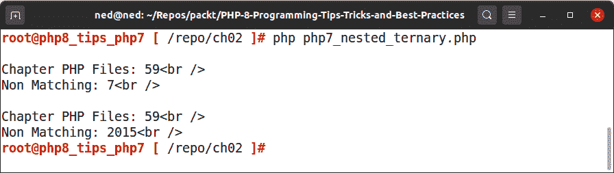
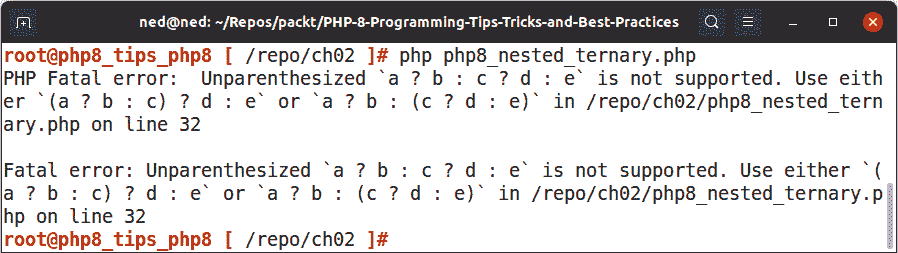
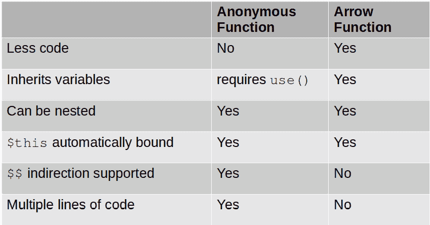
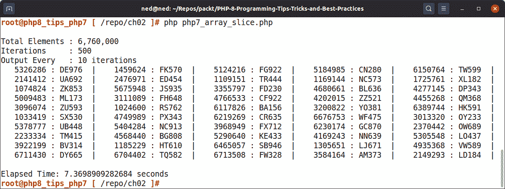
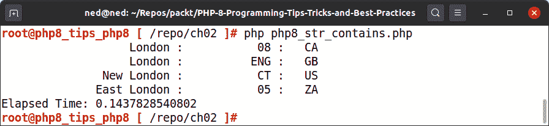
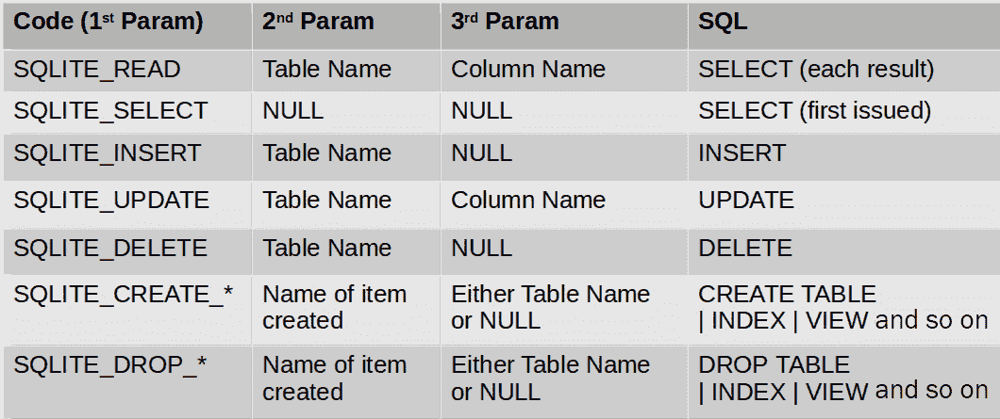

# 二、学习 PHP8 的新增功能

本章将引导您了解**PHP8**在过程级引入的重要添加和增强。所使用的代码示例显示了新的 PHP8 特性和技术，以方便程序编程。

掌握本章中新功能和技术的使用将帮助您编写更快、更简洁的应用。尽管本章重点介绍命令和函数，但在开发类方法时，所有这些技术也很有用。

本章涵盖以下主题：

*   使用新的 PHP8 操作符
*   使用箭头函数
*   理解统一变量语法
*   学习新的数组和字符串处理技术
*   使用授权者保护 SQLite 数据库

# 技术要求

要检查并运行本章中提供的代码示例，此处列出了推荐的最低硬件：

*   基于 x86_64 的台式 PC 或笔记本电脑
*   1 GB 的可用磁盘空间
*   4 GB 随机存取存储器（RAM）
*   每秒 500 千比特（Kbps）或更快的 internet 连接
*   此外，您还需要安装以下软件：
*   码头工人
*   Docker Compose

请参考[*第 1 章*](01.html#_idTextAnchor013)*中的*技术要求*部分，介绍新的 PHP8 OOP 特性，*以了解有关 Docker 和 Docker Compose 安装的更多信息，以及如何构建用于演示本书中解释的代码的 Docker 容器。自始至终，我们将您还原本书样本代码的目录称为`/repo`。

本章的源代码位于此处：[https://github.com/PacktPublishing/PHP-8-Programming-Tips-Tricks-and-Best-Practices](https://github.com/PacktPublishing/PHP-8-Programming-Tips-Tricks-and-Best-Practices) 。

我们现在可以通过检查新的 PHP8 操作符开始讨论。

# 使用新的 PHP8 操作符

PHP8 引入了许多新的**操作符**。此外，PHP8 通常会引入一种统一且一致的方式来使用这些运算符。在本节中，我们将检查以下运算符：

*   变量算子
*   零安全运算符
*   串联运算符
*   三元运算符

让我们从讨论变量运算符开始。

## 使用 variadics 运算符

**variadics**运算符由普通 PHP 变量（或对象属性）前面的三个前导点（`...`组成。这个操作符实际上是从 PHP5.6 开始使用该语言的。它也被称为以下内容：

*   Splat 操作员
*   散射算子
*   扩展运算符

在我们深入讨论 PHP8 使用该运算符所做的改进之前，让我们快速了解一下该运算符通常是如何使用的。

### 参数数目未知

variadics 运算符最常见的用途之一是在定义具有未知参数数的函数的情况下。

在下面的代码示例中，`multiVardump()`函数能够接受任意数量的变量。然后连接`var_export()`输出并返回一个字符串：

```php
// /repo/ch02/php7_variadic_params.php
function multiVardump(...$args) {
    $output = '';
    foreach ($args as $var)
        $output .= var_export($var, TRUE);
    return $output;
}
$a = new ArrayIterator(range('A','F'));
$b = function (string $val) { return str_rot13($val); };
$c = [1,2,3];
$d = 'TEST';
echo multiVardump($a, $b, $c);
echo multiVardump($d);
```

第一次调用函数时，我们提供三个参数。第二次调用时，我们只提供一个参数。因为我们使用了 variadics 运算符，所以不需要重写函数来容纳更多或更少的参数。

提示

有一个`func_get_args()`PHP 函数，它将所有函数参数收集到一个数组中。然而，变量运算符是首选的，因为它必须在函数签名中声明，从而使程序开发人员的意图更加清楚。更多信息请参见[https://php.net/func_get_args](https://php.net/func_get_args) 。

### 清理剩余的参数

variadics 操作符的另一个用途是**抽真空**任何剩余参数。此技术允许您将强制参数与未知数量的可选参数混合使用。

在本例中，`where()`函数生成一个`WHERE`子句，添加到**结构化查询语言**（**SQL**`SELECT`语句中。前两个参数是强制性的：产生一个没有参数的`WHERE`子句是不合理的！请查看此处的代码：

```php
// ch02/includes/php7_sql_lib.php
// other functions not shown
function where(stdClass $obj, $a, $b = '', $c = '', 
        $d = '') {
    $obj->where[] = $a;
    $obj->where[] = $b;
    $obj->where[] = $c;
    $obj->where[] = $d;
}
```

使用此函数的调用代码可能如下所示：

```php
// /repo/ch02/php7_variadics_sql.php
require_once __DIR__ . '/includes/php7_sql_lib.php';
$start = '2021-01-01';
$end   = '2021-04-01';
$select = new stdClass();
from($select, 'events');
cols($select, ['id', 'event_key', 
    'event_name', 'event_date']);
limit($select, 10);
where($select, 'event_date', '>=', "'$start'");
where($select, 'AND');
where($select, 'event_date', '<', "'$end'");
$sql = render($select);
// remaining code not shown
```

您可能已经注意到，必须多次调用，因为参数的数量有限。这是 variadics 运算符的完美候选者！下面是重写的`where()`函数的外观：

```php
// ch02/includes/php8_sql_lib.php
// other functions not shown
function where(stdClass $obj, ...$args) {
    $obj->where = (empty($obj->where))
                ? $args
                : array_merge($obj->where, $args);
}
```

因为`...$args`总是作为数组返回，为了确保对函数的任何附加调用不会丢失子句，我们需要执行`array_merge()`操作。以下是重写的调用程序：

```php
// /repo/ch02/php8_variadics_sql.php
require_once __DIR__ . '/includes/sql_lib2.php';
$start = '2021-01-01';
$end   = '2021-04-01';
$select = new stdClass();
from($select, 'events');
cols($select, ['id', 'event_key', 
    'event_name', 'event_date']);
limit($select, 10);
where($select, 'event_date', '>=', "'$start'", 
    'AND', 'event_date', '<', "'$end'");
$sql = render($select);
// remaining code not shown
```

生成的 SQL 语句如下所示：

```php
SELECT id,event_key,event_name,event_date 
FROM events 
WHERE event_date >= '2021-01-01' 
    AND event_date <= '2021-04-01' 
LIMIT 10
```

前面的输出显示我们的 SQL 生成逻辑生成了一个有效的语句。

### 使用 variadics 运算符作为替换

到目前为止，对于经验丰富的 PHP 开发人员来说，这些都不是陌生的。PHP8 的不同之处在于 variadics 操作符现在可以用于*加宽*可能起作用的情况。

为了正确地描述变量运算符使用方式的差异，我们需要简要地回到**面向对象编程**（**OOP**。如果我们将刚才描述的`where()`函数重写为一个类方法，它可能如下所示：

```php
// src/Php7/Sql/Where.php
namespace Php7\Sql;
class Where {
    public $where = [];
    public function where($a, $b = '', $c = '', $d = '') {
        $this->where[] = $a;
        $this->where[] = $b;
        $this->where[] = $c;
        $this->where[] = $d;
        return $this;
    }
    // other code not shown
}
```

现在，让我们假设我们有一个`Select`类，它扩展了`Where`，但使用 variadics 运算符重新定义了方法签名。可能是这样的：

```php
// src/Php7/Sql/Select.php
namespace Php7\Sql;
class Select extends Where {
    public function where(...$args)    {
        $this->where = (empty($obj->where))
                    ? $args
                    : array_merge($obj->where, $args);
    }
    // other code not shown
}
```

使用 variadics 运算符是合理的，因为用于表述`WHERE`子句的参数数量未知。下面是使用 OOP 重写的调用程序：

```php
// /repo/ch02/php7_variadics_problem.php
require_once __DIR__ . '/../src/Server/Autoload/Loader.php'
$loader = new \Server\Autoload\Loader();
use Php7\Sql\Select;
$start = "'2021-01-01'";
$end   = "'2021-04-01'";
$select = new Select();
$select->from($select, 'events')
       ->cols($select, ['id', 'event_key', 
              'event_name', 'event_date'])
       ->limit($select, 10)
       ->where($select, 'event_date', '>=', "'$start'",
               'AND', 'event_date', '<=', "'$end'");
$sql = $select->render();
// other code not shown
```

但是，当尝试在 PHP7 下运行此示例时，会出现以下警告：

```php
Warning: Declaration of Php7\Sql\Select::where(...$args) should be compatible with Php7\Sql\Where::where($a, $b = '', $c = '', $d = '') in /repo/src/Php7/Sql/Select.php on line 5 
```

请注意，代码仍然有效；然而，PHP7 并不认为 variadics 操作符是一个可行的替代品。下面是在 PHP8 下运行的相同代码（使用`/repo/ch02/php8_variadics_no_problem.php`：


图 2.1–扩展类中可接受的变量运算符

提示

下面是两个 PHP 文档参考，它们解释了 PHP variadics 运算符背后的推理：

[https://wiki.php.net/rfc/variadics](https://wiki.php.net/rfc/variadics)

[https://wiki.php.net/rfc/argument_unpacking](https://wiki.php.net/rfc/argument_unpacking)

现在让我们来看看 nullsafe 操作符。

## 使用 nullsafe 操作符

**nullsafe**运算符用于对象属性引用链中。如果链中的一个属性不存在（换句话说，它被视为`NULL`，则操作员安全返回`NULL`值，而不发出警告。

作为一个示例，假设我们有以下**扩展标记语言**（**XML**文件）：

```php
<?xml version='1.0' standalone='yes'?>
<produce>
      <file>/repo/ch02/includes/produce.xml</file>
    <dept>
        <fruit>
            <apple>11</apple>
            <banana>22</banana>
            <cherry>33</cherry>
        </fruit>
        <vegetable>
            <artichoke>11</artichoke>
            <beans>22</beans>
            <cabbage>33</cabbage>
        </vegetable>
    </dept>
</produce>
```

下面是一个代码片段，它扫描 XML 文档并显示数量：

```php
// /repo/ch02/php7_nullsafe_xml.php
$xml = simplexml_load_file(__DIR__ . 
        '/includes/produce.xml');
$produce = [
    'fruit' => ['apple','banana','cherry','pear'],
    'vegetable' => ['artichoke','beans','cabbage','squash']
];
$pattern = "%10s : %d\n";
foreach ($produce as $type => $items) {
    echo ucfirst($type) . ":\n";
    foreach ($items as $item) {
        $qty = getQuantity($xml, $type, $item);
        printf($pattern, $item, $qty);
    }
}
```

我们还需要定义一个`getQuantity()`函数，首先检查该属性是否为空，然后再进入下一级，如下所示：

```php
function getQuantity(SimpleXMLElement $xml, 
        string $type, string $item {
    $qty = 0;
    if (!empty($xml->dept)) {
        if (!empty($xml->dept->$type)) {
            if (!empty($xml->dept->$type->$item)) {
                $qty = $xml->dept->$type->$item;
            }
        }
    }
    return $qty;
}
```

当您开始处理更深层次的嵌套时，检查属性是否存在所需的函数变得越来越复杂。这正是可以使用 nullsafe 操作符的地方。

查看相同的程序代码，但不需要`getQuantity()`功能，如下所示：

```php
// /repo/ch02/php8_nullsafe_xml.php
$xml = simplexml_load_file(__DIR__ . 
        '/includes/produce.xml'
$produce = [
    'fruit' => ['apple','banana','cherry','pear']
    'vegetable' => ['artichoke','beans','cabbage','squash']
];
$pattern = "%10s : %d\n";
foreach ($produce as $type => $items) {
    echo ucfirst($type) . ":\n";
    foreach ($items as $item) {
        printf($pattern, $item, 
            $xml?->dept?->$type?->$item);
    }
}
```

现在让我们来看看 nullsafe 操作符的另一个用途。

### 使用 nullsafe 操作符使链短路

nullsafe 运算符在连接操作链中使用时也很有用，包括对对象属性的引用、数组元素方法调用和静态引用。

作为说明，这里是一个返回匿名类的配置文件。它根据文件类型定义了不同的数据提取方法：

```php
// ch02/includes/nullsafe_config.php
return new class() {
    const HEADERS = ['Name','Amt','Age','ISO','Company'];
    const PATTERN = "%20s | %16s | %3s | %3s | %s\n";
    public function json($fn) {
        $json = file_get_contents($fn);
        return json_decode($json, TRUE);
    }
    public function csv($fn) {
        $arr = [];
        $fh = new SplFileObject($fn, 'r');
        while ($node = $fh->fgetcsv()) $arr[] = $node;
        return $arr;            
    }
    public function txt($fn) {
        $arr = [];
        $fh = new SplFileObject($fn, 'r');
        while ($node = $fh->fgets())
            $arr[] = explode("\t", $node);
        return $arr;
    }
    // all code not shown
};
```

此类还包括显示数据的方法，如以下代码段所示：

```php
    public function display(array $data) {
        $total  = 0;
        vprintf(self::PATTERN, self::HEADERS);
        foreach ($data as $row) {
            $total += $row[1];
            $row[1] = number_format($row[1], 0);
            $row[2] = (string) $row[2];
            vprintf(self::PATTERN, $row);
        }
        echo 'Combined Wealth: ' 
            . number_format($total, 0) . "\n"
    }    
```

在调用程序中，为了安全地执行`display()`方法，我们需要在执行回调之前添加`is_object()`额外的安全检查和`method_exists()`，如下代码片段所示：

```php
// /repo/ch02/php7_nullsafe_short.php
$config  = include __DIR__ . 
        '/includes/nullsafe_config.php';
$allowed = ['csv' => 'csv','json' => 'json','txt'
                  => 'txt'];
$format  = $_GET['format'] ?? 'txt';
$ext     = $allowed[$format] ?? 'txt';
$fn      = __DIR__ . '/includes/nullsafe_data.' . $ext;
if (file_exists($fn)) {
    if (is_object($config)) {
        if (method_exists($config, 'display')) {
            if (method_exists($config, $ext)) {
                $config->display($config->$ext($fn));
            }
        }
    }
}
```

与前一个示例一样，可以使用 nullsafe 操作符确认`$config`作为对象的存在。通过简单地在第一个对象引用中使用 nullsafe 操作符，如果对象或方法不存在，则操作符*会短路*整个链并返回`NULL`。

以下是使用 PHP 8 nullsafe 运算符重写的代码：

```php
// /repo/ch02/php8_nullsafe_short.php
$config  = include __DIR__ . 
        '/includes/nullsafe_config.php';
$allowed = ['csv' => 'csv','json' => 'json',
                     'txt' => 'txt'];
$format  = $_GET['format'] ?? $argv[1] ?? 'txt';
$ext     = $allowed[$format] ?? 'txt';
$fn      = __DIR__ . '/includes/nullsafe_data.' . $ext;
if (file_exists($fn)) {
    $config?->display($config->$ext($fn));
}
```

如果`$config`返回为`NULL`，则整个操作链被取消，不产生警告或通知，返回值（如有）为`NULL`。最终的结果是，我们不用再写三条额外的`if()`语句了！

提示

有关使用此运算符时其他注意事项的更多信息，请查看此处：[https://wiki.php.net/rfc/nullsafe_operator](https://wiki.php.net/rfc/nullsafe_operator) 。

重要提示

为了将 format 参数传递给示例代码文件，您需要从浏览器中运行代码，如下所示：`http://localhost:8888/ch02/php7_nullsafe_short.php?format=json`。

接下来，我们来看对串联运算符的更改。

## 连接运算符已降级

虽然在 PHP 8 中，**串联**运算符的精确用法（例如，句点（.）没有改变，但在**优先顺序**中，其相对位置发生了极其重要的变化。在早期版本的 PHP 中，串联运算符被认为在优先级方面等于低阶算术运算符加（`+`）和减（`-`）。接下来，让我们看看传统优先级的一个潜在问题：反直觉的结果。

### 处理反直觉的结果

不幸的是，这种安排产生了意想不到的结果。以下代码片段在使用 PHP7 执行时呈现了一个反直觉的输出：

```php
// /repo/ch02/php7_ops_concat_1.php
$a = 11;
$b = 22;
echo "Sum: " . $a + $b;
```

只要看一下代码，您就会期望输出类似于`"Sum:33"`的内容。事实并非如此！在 PHP 7.1 上运行时，请查看以下输出：

```php
root@php8_tips_php7 [ /repo/ch02 ]# php php7_ops_concat_1.php
PHP Warning:  A non-numeric value encountered in /repo/ch02/php7_ops_concat_1.php on line 5
PHP Stack trace:
PHP   1\. {main}() /repo/ch02/php7_ops_concat_1.php:0
Warning: A non-numeric value encountered in /repo/ch02/php7_ops_concat_1.php on line 5
Call Stack:
  0.0001     345896   1\. {main}()
22
```

在这一点上，您可能想知道，*因为代码从不在*中，`11`+`22`的总和在哪里达到`22`，正如我们在前面的输出（最后一行）中看到的那样？

答案涉及优先顺序：从 PHP7 开始，它始终是从左到右的。因此，如果我们使用括号使操作顺序更清晰，实际情况就是这样：

`echo ("Sum: " . $a) + $b;`

`11`被连接到`"Sum: "`，导致`"Sum: 11"`。一串。然后将字符串类型转换为整数，得到一个`0`+`22`表达式，这将给出我们的结果。

如果在 PHP8 中运行相同的代码，请注意此处的差异：

```php
root@php8_tips_php8 [ /repo/ch02 ]# php php8_ops_concat_1.php 
Sum: 33
```

如您所见，算术运算符优先于串联运算符。使用括号，这就是 PHP 8 中处理代码的有效方式：

`echo "Sum: " . ($a + $b);`

提示

**最佳实践**：使用括号避免因依赖优先顺序而导致的复杂情况。有关降级串联运算符优先顺序背后的原因的更多信息，请查看此处：[https://wiki.php.net/rfc/concatenation_precedence](https://wiki.php.net/rfc/concatenation_precedence) 。

现在我们将注意力转向三元运算符。

## 使用嵌套三元运算符

**三元运算符**对 PHP 语言来说不是新的。然而，在 PHP8 中对它们的解释有一个主要的差异。这种变化与该操作符的传统**左联想行为**有关。为了说明，让我们看一个简单的示例，如下所示：

1.  在本例中，假设我们使用`RecursiveDirectoryIterator`类和`RecursiveIteratorIterator`类来扫描目录结构。起始代码可能如下所示：

    ```php
    // /repo/ch02/php7_nested_ternary.php
    $path = realpath(__DIR__ . '/..');
    $searchPath = '/ch';
    $searchExt  = 'php';
    $dirIter    = new RecursiveDirectoryIterator($path);
    $itIter     = new RecursiveIteratorIterator($dirIter);
    ```

2.  然后我们定义一个函数，该函数匹配那些包含`$searchPath`搜索路径并以`$searchExt`扩展名结尾的文件，如下所示：

    ```php
    function find_using_if($iter, $searchPath, $searchExt) {
        $matching  = [];
        $non_match = [];
        $discard   = [];
        foreach ($iter as $name => $obj) {
            if (!$obj->isFile()) {
                $discard[] = $name;
            } elseif (!strpos($name, $searchPath)) {
                $discard[] = $name;
            } elseif ($obj->getExtension() !== $searchExt) {
                $non_match[] = $name;
            } else {
                $matching[] = $name;
            }
        }
        show($matching, $non_match);
    }
    ```

3.  但是，有些开发人员可能会尝试使用嵌套的三元运算符来重构这个函数，而不是使用`if / elseif / else`。下面是前面步骤中使用的相同代码的外观：

    ```php
    function find_using_tern($iter, $searchPath, 
            $searchExt){
        $matching  = [];
        $non_match = [];
        $discard   = [];
        foreach ($iter as $name => $obj) {
            $match = !$obj->isFile()
                ? $discard[] = $name
                : !strpos($name, $searchPath)
                    ? $discard[] = $name
                    : $obj->getExtension() !== $searchExt
                        ? $non_match[] = $name
                        : $matching[] = $name;
        }
        show($matching, $non_match);
    }
    ```

两个函数的输出在 PHP 7 中产生相同的结果，如以下屏幕截图所示：



图 2.2–使用 PHP7 的嵌套三值输出

然而，在 PHP8 中，不再允许使用不带括号的嵌套三元运算。以下是运行同一代码块时的输出：



图 2.3–使用 PHP8 的嵌套三值输出

提示

**最佳实践**：使用括号避免嵌套三元运算的问题。有关三元运算符嵌套差异的更多信息，请参阅本文：[https://wiki.php.net/rfc/ternary_associativity](https://wiki.php.net/rfc/ternary_associativity) 。

现在您已经了解了新的 nullsafe 操作符。您还了解了现有的三个运算符——变量运算符、串联运算符和三元运算符的功能是如何被稍微修改的。在升级到 PHP8 时，您现在处于避免潜在危险的良好位置。现在我们来看另一个新功能，*箭头功能*。

# 使用箭头功能

**箭头函数**实际上是在 PHP7.4 中首次引入的。然而，由于许多开发人员并不关注每一个版本的更新，所以在本书中包含这一优秀的新特性是很重要的。

在本节中，您将了解箭头函数及其语法，以及与匿名函数相比的优缺点。

## 一般语法

简言之，*箭头函数*是传统**匿名函数**的简写语法，就像三元运算符是`if () {} else {}`的简写语法一样。箭头函数的通用语法如下所示：

`fn(<ARGS>) => <EXPRESSION>`

`<ARGS>`是可选的并包含在任何其他用户定义 PHP 函数中看到的任何内容。`<EXPRESSION>`可以包含任何标准 PHP 表达式，如函数调用、算术运算等。

现在让我们看看箭头函数和匿名函数之间的区别。

## 箭头函数与匿名函数

在本小节中，您将了解**箭头函数**和**匿名函数**之间的差异。为了成为一名高效的 PHP8 开发人员，了解箭头函数何时何地可以取代匿名函数并提高代码性能非常重要。

在讨论 arrow 函数之前，让我们先看一个简单的匿名函数。在以下示例中，分配给`$addOld`的匿名函数生成两个参数之和：

```php
// /repo/ch02/php8_arrow_func_1.php
$addOld = function ($a, $b) { return $a + $b; };
```

在 PHP 8 中，可以产生完全相同的结果，如下所示：

`$addNew = fn($a, $b) => $a + $b;`

虽然代码更具可读性，但这一新功能有其优点和缺点，总结如下表：



表 2.1-匿名函数与箭头函数

从上表可以看出，箭头函数比匿名函数更有效。但是，缺乏间接寻址和对多行的支持意味着您有时仍然需要使用匿名函数。

## 变量遗传

匿名函数与任何标准 PHP 函数非常相似，只有在将值作为参数传递、使用全局关键字或添加`use()`修饰符时，才能识别其范围之外的变量。

下面是一个例子，其中一个`DateTime`实例通过`use()`被继承到一个匿名函数中：

```php
// /repo/ch02/php8_arrow_func_2.php
// not all code shown
$old = function ($today) use ($format) {
    return $today->format($format);
};
```

下面是使用箭头函数的完全相同的内容：

`$new = fn($today) => $today->format($format);`

如您所见，语法非常可读且简洁。现在让我们来看一个包含箭头函数的实际示例。

## 实例：使用箭头函数

回到生成难以阅读的验证码的想法（第一次出现在[*第 1 章*](01.html#_idTextAnchor013)、*引入新的 PHP 8 OOP 特性*），让我们看看合并箭头函数如何提高效率并减少所需的编码量。我们现在检查一个生成基于文本的验证码的脚本，如下所示：

1.  首先，我们定义一个函数，该函数生成由字母、数字和特殊字符的随机选择组成的字符串。请注意，在下面的代码片段中，使用了新的 PHP8`match`表达式和箭头函数（突出显示）：

    ```php
    // /repo/ch02/php8_arrow_func_3.php
    function genKey(int $size) {
        $alpha1  = range('A','Z');
        $alpha2  = range('a','z');
        $special = '!@#$%^&*()_+,./[]{}|=-';
        $len     = strlen($special) - 1;
        $numeric = range(0, 9);
        $text    = '';
        for ($x = 0; $x < $size; $x++) {
            $algo = rand(1,4);
            $func = match ($algo) {
                1 => fn() => $alpha1[array_rand($alpha1)],
                2 => fn() => $alpha2[array_rand($alpha2)]
                3 => fn() => $special[rand(0,$len)],
                4 => fn() => 
                           $numeric[array_rand($numeric)],
                default => fn() => ' '
            };
            $text .= $func();            
        }
        return $text;
    }
    ```

2.  然后我们定义一个`textCaptcha()`函数来生成文本验证码。我们首先定义两个表示算法和颜色的数组。然后对这些进行*洗牌*以进一步随机化。我们还定义了**超文本标记语言**（**HTML**）`<span>`元素来产生大小字符，如下面的代码片段所示：

    ```php
    function textCaptcha(string $text) {
        $algos = ['upper','lower','bold',
                  'italics','large','small'];
        $color = ['#EAA8A8','#B0F6B0','#F5F596',
                  '#E5E5E5','white','white'];
        $lgSpan = '<span style="font-size:32pt;">';
        $smSpan = '<span style="font-size:8pt;">';
        shuffle($algos);
        shuffle($color);
    ```

3.  接下来，我们定义一系列`InfiniteIterator`实例。这是一个有用的**标准 PHP 库**（**SPL**类），允许您继续调用`next()`，而无需检查迭代是否结束。这个迭代器类所做的是自动将指针移回数组的顶部，从而允许无限迭代。代码可以在以下代码片段中看到：

    ```php
        $bkgTmp = new ArrayIterator($color);
        $bkgIter = new InfiniteIterator($bkgTmp);
        $algoTmp = new ArrayIterator($algos);
        $algoIter = new InfiniteIterator($algoTmp);
        $len = strlen($text);
    ```

4.  We then build the text CAPTCHA one character at a time, applying the appropriate algorithm and background color, as follows:

    ```php
        $captcha = '';
        for ($x = 0; $x < $len; $x++) {
            $char = $text[$x];
            $bkg  = $bkgIter->current();
            $algo = $algoIter->current();
            $func = match ($algo) {
                'upper'   => fn() => strtoupper($char),
                'lower'   => fn() => strtolower($char),
                'bold'    => fn() => "<b>$char</b>",
                'italics' => fn() => "<i>$char</i>",
                'large'   => fn() => $lgSpan 
                             . $char . '</span>',
                'small'   => fn() => $smSpan 
                             . $char . '</span>',
                default   => fn() => $char
            };
            $captcha .= '<span style="background-color:' 
                . $bkg . ';">' 
                . $func() . '</span>';
            $algoIter->next();
            $bkgIter->next();
        }
        return $captcha;
    }
    ```

    再次，注意混合使用`match`和`arrow`函数以实现所需的结果。

    脚本的其余部分仅调用这两个函数，如下所示：

    ```php
    $text = genKey(8);
    echo "Original: $text<br />\n";
    echo 'Captcha : ' . textCaptcha($text) . "\n";
    ```

以下是从`/repo/ch02/php8_arrow_func_3.php`的输出在浏览器中的外观：


图 2.4–php8_arrow_func_3.php 的输出

提示

有关箭头函数的更多背景信息，请查看此处：[https://wiki.php.net/rfc/arrow_functions_v2](https://wiki.php.net/rfc/arrow_functions_v2) 。

有关`InfiniteIterator`的信息，请查看此处的 PHP 文档：[https://www.php.net/InfiniteIterator](https://www.php.net/InfiniteIterator) 。

现在我们来看一下*统一变量语法*。

# 理解统一变量语法

PHP7.0 中引入的最激进的举措之一是规范化 PHP 语法。PHP 早期版本的问题在于，在某些情况下，操作是从左到右解析的，而在其他情况下，则是从右到左解析的。这种不一致性是许多编程漏洞和困难的根本原因。因此，PHP 核心开发团队发起了一项名为**统一变量语法**的计划。但首先，让我们定义形成统一变量语法计划的关键点。

## 定义统一变量语法

统一变量语法既不是协议，也不是形式语言结构。相反，这是一个指导原则，努力确保所有操作以统一一致的方式进行。

以下是该倡议的一些要点：

*   变量顺序和引用的一致性
*   函数调用的一致性
*   解决阵列取消引用的问题
*   Providing the ability to mix function calls and array de-referencing in a single command

    提示

    有关 PHP7 统一变量语法的原始建议的更多信息，请查看此处：[https://wiki.php.net/rfc/uniform_variable_syntax](https://wiki.php.net/rfc/uniform_variable_syntax) 。

现在让我们检查一下统一变量语法计划是如何影响 PHP8 的。

## 统一变量语法如何影响 PHP8？

统一变量语法计划在 PHP7 的所有版本中都非常成功，转换相对平稳。然而，有几个领域没有升级到这个标准。因此，提出了一项新的提案来解决这些顽固分子。在 PHP 8 中，已将一致性引入以下内容：

*   取消引用插值字符串
*   magic 常量的不一致反引用
*   类常数解引用的一致性
*   增强了对`new`和`instanceof`的表达支持

在进入这些领域的示例之前，我们必须首先定义*取消引用*的含义。

### 定义取消引用

**反引用**是提取数组元素或对象属性值的过程。它还指获取对象方法或函数调用的返回值的过程。下面是一个简单的例子：

```php
// /repo/ch02/php7_dereference_1.php
$alpha = range('A','Z');
echo $alpha[15] . $alpha[7] . $alpha[15];
// output: PHP
```

`$alpha`字母包含 26 个元素，代表字母`A`到`Z`。本例反引用数组，提取第 7 和第 15 个元素，产生输出`PHP`。取消引用函数或方法调用只意味着执行函数或方法并访问结果。

### 取消引用插值字符串

下一个示例有点疯狂，请密切关注。以下示例适用于 PHP 8，但不适用于 PHP 7 或更早版本：

```php
// /repo/ch02/php8_dereference_2.php
$alpha = 'ABCDEFGHIJKLMNOPQRSTUVWXYZ';
$num   = '0123456789';
$test  = [15, 7, 15, 34];
foreach ($test as $pos)
    echo "$alpha$num"[$pos];
```

在本例中，两个字符串`$alpha`和`$num`在`foreach()`循环中使用双引号插入。以下是 PHP7 的输出：

```php
root@php8_tips_php7 [ /repo/ch02 ]# php php7_dereference_2.php 
PHP Parse error:  syntax error, unexpected '[', expecting ',' or ';' in /repo/ch02/php7_dereference_2.php on line 7
Parse error: syntax error, unexpected '[', expecting ',' or ';' in /repo/ch02/php7_dereference_2.php on line 7
```

PHP8 中的相同代码产生以下输出：

```php
root@php8_tips_php8 [ /repo/ch02 ]# php php8_dereference_2.php 
PHP8
```

结论是 PHP7 在反引用插值字符串的方式上并不一致，而 PHP8 则表现出更好的一致性。

### magic 常量的不一致反引用

在 PHP7 和早期版本中，常数可以取消引用，而魔法常数不能。下面是一个生成当前文件最后三个字母的简单示例：

```php
// /repo/ch02/php8_dereference_3.php
define('FILENAME', __FILE__);
echo FILENAME[-3] . FILENAME[-2] . FILENAME[-1];
echo __FILE__[-3] . __FILE__[-2] . __FILE__[-1];
```

以下是 PHP7 中的结果：

```php
root@php8_tips_php7 [ /repo/ch02 ]# php php7_dereference_3.php
PHP Parse error:  syntax error, unexpected '[', expecting ',' or ';' in /repo/ch02/php7_dereference_3.php on line 7
Parse error: syntax error, unexpected '[', expecting ',' or ';' in /repo/ch02/php7_dereference_3.php on line 7
```

以下是 PHP 8 中的结果：

```php
root@php8_tips_php8 [ /repo/ch02 ]# php php8_dereference_3.php
phpphp
```

同样，这里的点是，PHP8 中的反引用操作得到了一致的应用（这是一件好事！）。

### 类常量反引用中的一致性

尝试取消引用类常量时会出现相关问题。为了更好地说明问题，假设我们有三个类。第一个类`JsonResponse`以**JavaScript 对象表示法**（**JSON**格式）生成数据，如以下代码片段所示：

```php
class JsonResponse {
    public static function render($data) {
        return json_encode($data, JSON_PRETTY_PRINT);
    }
}
```

第二个类`SerialResponse`使用内置 PHP`serialize()`函数生成响应，如以下代码段所示：

```php
class SerialResponse {
    public static function render($data) {
        return serialize($data);
    }
}
```

最后，一个`Test`类能够产生任何一个响应，如以下代码片段所示：

```php
class Test {
    const JSON = ['JsonResponse'];
    const TEXT = 'SerialResponse';
    public static function getJson($data) {
        echo self::JSON[0]::render($data);
    }
    public static function getText($data) {
        echo self::TEXT::render($data);
    }
}
```

正如在本节前面的示例中所看到的，PHP 早期版本的结果是不一致的。打电话给`Test::getJson($data)`效果很好。但是，调用`Test::getText($data)`会产生以下错误：

```php
root@php8_tips_php7 [ /repo/ch02 ]# php php7_dereference_4.php PHP Parse error:  syntax error, unexpected '::' (T_PAAMAYIM_NEKUDOTAYIM), expecting ',' or ';' in /repo/ch02/php7_dereference_4.php on line 26
Parse error: syntax error, unexpected '::' (T_PAAMAYIM_NEKUDOTAYIM), expecting ',' or ';' in /repo/ch02/php7_dereference_4.php on line 26
```

PHP 8 下完全相同的代码为前面所示的类中定义的两个方法调用生成一致的结果，如下所示：

```php
root@php8_tips_php8 [ /repo/ch02 ]# php php8_dereference_4.php
{
    "A": 111,
    "B": 222,
    "C": 333}
a:3:{s:1:"A";i:111;s:1:"B";i:222;s:1:"C";i:333;}
```

总而言之，在 PHP8 中，类常量现在以统一的方式被取消引用，从而允许您生成更干净的代码。现在，让我们看看 PHP8 如何允许您在比以前更多的地方使用表达式。

### 增强了对 new 和 instanceof 的表达式支持

PHP7 编程的乐趣之一是能够在任何地方使用任意 PHP 表达式。在这个简单的示例中，请注意在方括号内使用了一个引用`$nav`数组的`$_GET['page'] ?? 'home'`任意表达式：

```php
// /repo/ch02/php7_arbitrary_exp.php
$nav = [
    'home'     => 'home.html',
    'about'    => 'about.html',
    'services' => 'services/index.html',
    'support'  => 'support/index.html',
];
$html = __DIR__ . '/../includes/'
      . $nav[$_GET['page'] ?? 'home'];
```

但是，在 PHP7 和早期版本中，如果表达式包含`new`或`instanceof`关键字，则不可能实现相同的操作。正如您可能已经猜到的，PHP8 已经解决了这种不一致性。现在可以做到以下几点：

```php
// /repo/ch02/php8_arbitrary_exp_new.php
// definition of the JsonRespone and SerialResponse
// classes are shown above
$allowed = [
    'json' => 'JsonResponse',
    'text' => 'SerialResponse'
];
$data = ['A' => 111, 'B' => 222, 'C' => 333];
echo (new $allowed[$_GET['type'] ?? 'json'])
        ->render($data);
```

此代码示例显示在数组引用中使用任意表达式，与`new`关键字一起使用。

提示

有关 PHP8 中统一变量语法更新的更多信息，请参阅本文：[https://wiki.php.net/rfc/variable_syntax_tweaks](https://wiki.php.net/rfc/variable_syntax_tweaks) 。

现在让我们看一看 PHP8 中用于字符串和数组处理的新技术。

# 学习新的数组和字符串处理技术

PHP8 数组和字符串处理技术有了许多改进。尽管本书中没有足够的篇幅来涵盖每一项增强，但我们将在本节中研究更重要的改进。

## 使用阵列 _ 拼接（）

`array_splice()`函数是`substr()`和`str_replace()`之间的交叉：它允许您将一个数组的子集替换为另一个数组。然而，当您需要做的只是用不同的东西替换数组的最后一部分时，它的使用会变得很尴尬。快速查看语法可以发现它开始变得不方便的地方，`replacement`参数前面有`length`参数，如下所示：

`array_splice(&$input,$offset[,$length[,$replacement]]):array`

传统上，开发人员首先在原始数组上运行`count()`并将其用于`length`参数，如下所示：

`array_splice($arr, 3, count($arr), $repl);`

在 PHP8 中，第三个参数可以是`NULL`，从而节省了对`count()`的额外调用。如果您利用 PHP8 的**命名参数**特性，代码将变得更加简洁。以下是为 PHP8 编写的相同代码片段：

`array_splice($arr, 3, replacement: $repl);`

下面的另一个例子清楚地说明了 PHP7 和 PHP8 之间的区别：

```php
// /repo/ch02/php7_array_splice.php
$arr  = ['Person', 'Camera', 'TV', 'Woman', 'Man'];
$repl = ['Female', 'Male'];
$tmp  = $arr;
$out  = array_splice($arr, 3, count($arr), $repl);
var_dump($arr);
$arr  = $tmp;
$out  = array_splice($arr, 3, NULL, $repl);
var_dump($arr);
```

如果您在 PHP7 中运行代码，请注意最后一个`var_dump()`实例的结果，如下所示：

```php
repo/ch02/php7_array_splice.php:11:
array(7) {
  [0] =>  string(6) "Person"
  [1] =>  string(6) "Camera"
  [2] =>  string(2) "TV"
  [3] =>  string(6) "Female"
  [4] =>  string(4) "Male"
  [5] =>  string(5) "Woman"
  [6] =>  string(3) "Man"
}
```

在 PHP7 中，为`array_splice()`的第三个参数提供`NULL`值会导致两个数组简单地合并，这不是期望的结果！

现在，我们来看一下上一个`var_dump()`的输出，但这次是在 PHP8 下运行的：

```php
root@php8_tips_php8 [ /repo/ch02 ]# php php8_array_splice.php
// some output omitted
array(5) {
  [0]=>  string(6) "Person"
  [1]=>  string(6) "Camera"
  [2]=>  string(2) "TV"
  [3]=>  string(6) "Female"
  [4]=>  string(4) "Male"
}
```

如您所见，将第三个参数设置为`NULL`与在 PHP8 下运行时为`array_splice()`的第三个参数提供数组`count()`具有相同的功能。您还将注意到，在 PHP8 中，数组元素的总数是`5`，而在 PHP7 中，数组元素的总数是`7`。

## 使用数组 _ 切片（）

`array_slice()`函数对数组的作用与`substr()`对字符串的作用一样。早期版本的 PHP 的一个大问题是，在内部，PHP 引擎依次迭代*整个数组*，直到达到所需的偏移量。如果偏移量较大，则性能会受到与阵列大小直接相关的影响。

在 PHP8 中，使用了一种不需要顺序数组迭代的不同算法。随着阵列大小的增加，性能改善变得越来越明显。

1.  在这里显示的示例中，我们首先构建了一个大约 600 万条目的大规模数组：

    ```php
    // /repo/ch02/php8_array_slice.php
    ini_set('memory_limit', '1G');
    $start = microtime(TRUE);
    $arr   = [];
    $alpha = range('A', 'Z');
    $beta  = $alpha;
    $loops = 10000;     // size of outer array
    $iters = 500;       // total iterations
    $drip  = 10;        // output every $drip times
    $cols  = 4;
    for ($x = 0; $x < $loops; $x++)
        foreach ($alpha as $left)
            foreach ($beta as $right)
                $arr[] = $left . $right . rand(111,999);
    ```

2.  接下来，我们在数组中迭代，取所有大于`999,999`的随机偏移量。这迫使`array_slice()`努力工作，并显示了 PHP7 和 PHP8 之间的显著性能差异，如以下代码片段所示：

    ```php
    $max = count($arr);
    for ($x = 0; $x < $iters; $x++ ) {
        $offset = rand(999999, $max);
        $slice  = array_slice($arr, $offset, 4);
        // not all display logic is shown
    }
    $time = (microtime(TRUE) - $start);
    echo "\nElapsed Time: $time seconds\n";
    ```

以下是在 PHP 7 下运行代码时的输出：



图 2.5–使用 PHP7 的数组 _ 切片（）示例

注意这里在 PHP 8 下运行相同代码时的巨大性能差异：


图 2.6–使用 PHP8 的数组 _ 切片（）示例

重要提示

新算法仅在数组不包含具有`NULL`值的元素时有效。如果数组包含`NULL`元素，则触发旧算法，并进行顺序迭代。

现在让我们把注意力转向一些优秀的新字符串函数。

## 检测串首、串中、串尾

PHP 开发人员经常要处理的事情是，必须检查出现在字符串开头、中间或结尾的字符集。当前字符串函数集的问题在于它们的设计不是为了处理子字符串的存在或不存在。相反，当前函数集旨在确定子字符串的*位置*。然后，可以以布尔方式对其进行插值，以确定是否存在子字符串。

温斯顿·丘吉尔爵士（Sir Winston Churchill）的一句名言概括了这种方法的问题：

“高尔夫是一种游戏，其目的是将一个非常小的球打进一个越来越小的洞，而武器的设计却非常糟糕。”

–*温斯顿·S·丘吉尔*

现在让我们来看三个非常有用的新字符串函数，它们解决了这个问题。

### str_ 以（）开头

我们检查的第一个函数是`str_starts_with()`。为了说明它的用法，请考虑一个代码示例：To3 T3。在这里，我们在 Apple T4 开始查找 Apple T1。

```php
// /repo/ch02/php7_starts_ends_with.php
$start = 'https';
if (substr($url, 0, strlen($start)) !== $start) 
    $msg .= "URL does not start with $start\n";
// not all code is shown
```

正如我们在本节引言中提到的，为了确定字符串是否以`https`开头，我们需要同时调用`substr()`和`strlen()`。这两个函数都不是为了给我们想要的答案而设计的。此外，必须同时使用这两个函数会导致代码效率低下，并导致不必要的资源利用率增加。

同样的代码可以用 PHP8 编写，如下所示：

```php
// /repo/ch02/php8_starts_ends_with.php
$start = 'https';
if (!str_starts_with($url, $start))
    $msg .= "URL does not start with $start\n";
// not all code is shown
```

### str_ 以（）结尾

与`str_starts_with()`类似，PHP8 引入了一个新函数`str_ends_with()`，可用于确定字符串结尾是否与某个值匹配。为了说明这一新的 To.T5^函数的实用性，请考虑使用 PosiT2 和 PoT T3 的旧 PHP 代码，如下所示：

```php
$end = 'login';
if (strpos(strrev($url), strrev($end)) !== 0)
    $msg .= "URL does not end with $end\n";
```

在一个操作中，`$url`和`$end`都需要反转，这一过程可能会随着字符串长度的增加而变得越来越昂贵。此外，如前所述，`strpos()`的目的是返回子串的*位置*，而不是确定其存在或不存在。

在 PHP 8 中实现了如下相同的功能：

```php
if (!str_ends_with($url, $end))
    $msg .= "URL does not end with $end\n";
```

### str_ 包含（）

此上下文中的最后一个函数是`str_contains()`。正如我们所讨论的，在 PHP7 和更早的版本中，没有特定的 PHP 函数告诉您，除了`preg_match()`之外，字符串中是否存在子字符串。

使用`preg_match()`的问题是性能下降，正如我们一再被警告的那样。为了处理一个*正则表达式*，需要首先分析模式。然后，它必须执行第二次传递，以确定字符串的哪一部分与模式匹配。就时间和资源利用率而言，这是一个非常昂贵的操作。

重要提示

当我们提到一个操作在时间和资源上都非常昂贵时，请记住，如果您的脚本只包含几十行代码和/或您没有在一个循环中重复操作数千次，使用本节介绍的新功能和技术，您很可能看不到任何显著的性能提升。

在以下示例中，PHP 脚本使用`preg_match()`搜索人口大于`15,000`的城市的*地理名称*项目数据库，以查找包含对`London`的引用的任何列表：

```php
// /repo/ch02/php7_str_contains.php
$start    = microtime(TRUE);
$target   = '/ London /';
$data_src = __DIR__ . '/../sample_data
                      /cities15000_min.txt';
$fileObj  = new SplFileObject($data_src, 'r');
while ($line = $fileObj->fgetcsv("\t")) {
    $tz     = $line[17] ?? '';
    if ($tz) unset($line[17]);
    $str    = implode(' ', $line);
    $city   = $line[1] ?? 'Unknown';
    $local1 = $line[10] ?? 'Unknown';
    $iso    = $line[8] ?? '??';
    if (preg_match($target, $str))
        printf("%25s : %12s : %4s\n", $city, $local1, 
                $iso);
}
echo "Elapsed Time: " . (microtime(TRUE) - $start) . "\n";
```

以下是在 PHP7 中运行时的输出：


图 2.7–使用 preg_match（）扫描地理名称文件

用以下代码替换`if`语句可以在 PHP 8 中实现相同的输出：

```php
// /repo/ch02/php8_str_contains.php
// not all code is shown
    if (str_contains($str, $target))
        printf("%25s : %12s : %4s\n", $city, $local1, 
               $iso);
```

以下是 PHP8 的输出：



图 2.8–使用 str_contains（）扫描 GeoNames 文件

正如您可以从两个不同的输出屏幕上看到的那样，PHP8 代码的运行时间约为`0.14`微秒，而 PHP7 中的运行时间为`0.19`微秒。这本身并不是一个巨大的性能增益，但是，正如本节前面提到的，更多的数据、更长的字符串和更多的迭代会放大您获得的任何小的性能增益。

提示

**最佳实践**：实现小性能提升的小代码修改最终会带来大的总体性能提升！

有关*GeoNames*开源项目的更多信息，请访问他们的网站：[https://www.geonames.org/](https://www.geonames.org/) 。

现在您知道了如何以及在何处使用三个新的字符串函数。您还可以使用专门设计的函数来检测目标字符串开头、中间或结尾是否存在子字符串，从而编写更高效的代码。

最后，我们通过查看新的 SQLite3 授权程序，以一点乐趣结束本章。

# 使用授权人保护 SQLite 数据库

许多 PHP 开发人员更喜欢使用**SQLite**作为其数据库引擎，而不是单独的数据库服务器，如 PostgreSQL、MySQL、Oracle 或 MongoDB。使用 SQLite 的原因很多，但通常归结为以下几点：

*   **SQLite 是一个基于文件的数据库**：您不必安装单独的数据库服务器。
*   **分发**很容易：唯一的要求是目标服务器需要安装`SQLite`可执行文件。
*   **SQLite 是轻量级的**：因为没有持续运行的服务器，所以占用的资源更少。

也就是说，缺点是它的可伸缩性不强。如果您需要处理大量的数据，那么最好安装一个功能更强大的数据库服务器。另一个潜在的主要缺点是 SQLite 没有安全性，将在下一小节中介绍。

提示

有关 SQLite 的更多信息，请查看其主页：[https://sqlite.org/index.html](https://sqlite.org/index.html) 。

## 等一下。。。没有保安？

*是的，您听对了*：默认情况下，就其设计而言，SQLite 没有安全性。当然，这也是许多开发人员喜欢使用它的原因：没有安全性使它非常容易使用！

下面是一个连接到 SQLite 数据库并对`geonames`表进行简单查询的示例代码块。它返回了印度人口超过 200 万的城市列表：

```php
// /repo/ch02/php8_sqlite_query.php
define('DB_FILE', __DIR__ . '/tmp/sqlite.db');
$sqlite = new SQLite3(DB_FILE);
$sql = 'SELECT * FROM geonames '
      . 'WHERE country_code = :cc AND population > :pop';
$stmt = $sqlite->prepare($sql);
$stmt->bindValue(':cc', 'IN');
$stmt->bindValue(':pop', 2000000);
$result = $stmt->execute();
while ($row = $result->fetchArray(SQLITE3_ASSOC)) {
    printf("%20s : %2s : %16s\n", 
        $row['name'], $row['country_code'],
        number_format($row['population']));
}  // not all code is shown
```

大多数其他数据库扩展在建立连接时至少需要用户名和密码。正如您在前面的代码片段中所看到的，`$sqlite`实例的创建完全没有涉及安全性：没有用户名或密码。

## 什么是 SQLite 授权回调？

SQLite3 引擎现在允许您向 SQLite 数据库连接注册**授权回调**。向数据库发送**准备语句**进行编译时，调用回调例程。下面是在`SQLite3`实例上设置授权回调的通用语法：

`$sqlite3->setAuthorizer(callable $callback);`

回调将返回三个`SQLite3`类常量中的一个，每个常量表示一个整数值。如果回调函数返回的不是这三个值中的一个，则假定为`SQLite3::DENY`，操作不会继续。下表列出了三个预期的返回值：


表 2.2–有效的 SQLite 授权回调返回值

现在您已经了解了回调，让我们看看它是如何被调用的。

## 什么被发送到回调？

执行`$sqlite->prepare($sql)`时会调用回调。此时，SQLite3 引擎向回调传递一到五个参数。第一个参数是一个**动作代码**，用于确定其余参数的性质。因此，以下可能是您最终定义的回调的适当通用函数签名：

```php
function NAME (int $actionCode, ...$params) 
{ /* callback code */ };
```

大部分操作代码反映了要准备的 SQL 语句。下表总结了一些更常见的操作代码：



表 2.3–发送到回调的常见操作代码

现在是看一个用法示例的时候了。

## 授权人使用示例

在下面的示例中，我们可以读取 SQLite`geonames`表，但不能插入、删除或更新：

1.  We start by defining an `auth_callback.php` include file in the `/repo/ch02/includes/` directory. In the `include` file, we first define constants that are used in the callback, as illustrated in the following code snippet:

    ```php
    // /repo/ch02/includes/auth_callback.php
    define('DB_FILE', '/tmp/sqlite.db');
    define('PATTERN', '%-8s | %4s | %-28s | %-15s');
    define('DEFAULT_TABLE', 'Unknown');
    define('DEFAULT_USER', 'guest');
    define('ACL' , [
        'admin' => [
            'users' => [SQLite3::READ, SQLite3::SELECT,
                SQLite3::INSERT, SQLite3::UPDATE,
                SQLite3::DELETE],
            'geonames' => [SQLite3::READ, SQLite3::SELECT,
                SQLite3::INSERT, SQLite3::UPDATE, 
                SQLite3::DELETE],
        ],
        'guest' => [
            'geonames' => [SQLite3::READ, 
                           SQLite3::SELECT],
        ],
    ]);
    ```

    的**访问控制列表**（**ACL**的工作方式是主外键为用户（如`admin`或`guest`；辅助键是表（例如，`users`或`geonames`；该值是该用户和表允许的`SQLite3`动作代码数组。

    在前面显示的示例中，`admin`用户对这两个表都拥有所有权限，而`guest`用户只能从`geonames`表中读取。

2.  接下来，我们定义实际的授权回调函数。我们需要在函数中做的第一件事是将默认返回值设置为`SQLite3::DENY`。我们还检查动作代码是否为`SQLite3::SELECT`，在这种情况下，我们只需返回`OK`。此操作代码在第一次处理`SELECT`语句时发出，不提供任何关于表或列的信息。代码可以在以下代码片段中看到：

    ```php
    function auth_callback(int $code, ...$args) {
        $status = SQLite3::DENY;
        $table  = DEFAULT_TABLE;
        if ($code === SQLite3::SELECT) {
            $status = SQLite3::OK;
    ```

3.  如果操作代码不是`SQLite3::SELECT`，我们需要首先确定涉及哪个表，然后才能决定是否允许该操作。表名报告为提供给回调的第二个参数。
4.  Here is the perfect time to use a *variadics operator* as we are unsure exactly how many parameters might be passed. However, for the major operations of concern (for example, `INSERT`, `UPDATE`, or `DELETE`), what is placed into the first position in `$args` is the table name. Otherwise, we get the table name from the session.

    下面的代码片段演示了该代码：

    ```php
        } else {
            if (!empty($args[0])) {
                $table = $args[0];
            } elseif (!empty($_SESSION['table'])) {
                $table = $_SESSION['table'];
            }
    ```

5.  同样，我们从会话中检索用户名，如下所示：

    ```php
            $user  = $_SESSION['user'] ?? DEFAULT_USER;
    ```

6.  Next, we check to see if the user is defined in the ACL, and after that, if the table is assigned rights for this user. If the action code given is in the array associated with the user and table combination, `SQLite3::OK` is returned.

    代码显示在以下代码段中：

    ```php
        if (!empty(ACL[$user])) {
            if (!empty(ACL[$user][$table])) {
                if (in_array($code, ACL[$user][$table])) {
                    $status = SQLite3::OK;
                }
            }
        }
    ```

7.  We then store the table name in the session and return the status code, as illustrated in the following code snippet:

    ```php
      } // end of "if ($code === SQLite3::SELECT)"
      $_SESSION['table'] = $table;
      return $status;
    } // end of function definition
    ```

    我们现在将注意力转向呼叫程序。

8.  在包含定义授权回调的 PHP 文件后，我们通过接受命令行参数、**统一资源定位器**（**URL**参数）或简单分配`admin`来模拟获取用户名，如下面的代码段所示：

    ```php
    // /repo/ch02/php8_sqlite_auth_admin.php
    include __DIR__ . '/includes/auth_callback.php';
    // Here we simulate the user acquisition:
    session_start();
    $_SESSION['user'] = 
        $argv[1] ?? $_GET['usr'] ?? DEFAULT_USER;
    ```

9.  接下来，我们创建两个数组并使用`shuffle()`使它们的顺序随机。我们从随机数组中构建用户名、电子邮件和 ID 值，如以下代码片段所示：

    ```php
    $name = ['jclayton','mpaulovich','nrousseau',
             'jporter'];
    $email = ['unlikelysource.com',
              'lfphpcloud.net','phptraining.net'];
    shuffle($name);
    shuffle($email);
    $user_name = $name[0];
    $user_email = $name[0] . '@' . $email[0];
    $id = md5($user_email . rand(0,999999));
    ```

10.  然后我们创建`SQLite3`实例并分配授权回调，如下所示：

    ```php
    $sqlite = new SQLite3(DB_FILE);
    $sqlite->setAuthorizer('auth_callback');
    ```

11.  The SQL `INSERT` statement is now defined and sent to SQLite to be prepared. Note that this is when the authorization callback is invoked.

    代码显示在以下代码段中：

    ```php
    $sql = 'INSERT INTO users '
         . 'VALUES (:id, :name, :email, :pwd);';
    $stmt = $sqlite->prepare($sql);
    ```

12.  如果授权回调拒绝该操作，则 statement 对象为`NULL`，因此最好使用`if()`语句测试其存在性。如果是这样，我们接着绑定该值并执行该语句，如下面的代码片段所示：

    ```php
    if ($stmt) {
        $stmt->bindValue(':id', $id);
        $stmt->bindValue(':name', $user_name);
        $stmt->bindValue(':email', $user_email);
        $stmt->bindValue(':pwd', 'password');
        $result = $stmt->execute();
    ```

13.  To confirm the results, we define a SQL `SELECT` statement to display the contents of the `users` table, as follows:

    ```php
        $sql = 'SELECT * FROM users';
        $result = $sqlite->query($sql);
        while ($row = $result->fetchArray(SQLITE3_ASSOC))
            printf("%-10s : %-  10s\n",
                $row['user_name'], $row['user_email']);
    }
    ```

    重要提示

    并非所有代码都显示在这里。完整代码请参考`/repo/ch02/php8_sqlite_auth_admin.php`。

如果我们运行调用程序，将用户设置为`admin`，结果如下：


图 2.9–SQLite3 授权回调：管理员用户

前面屏幕截图的输出显示操作成功，因为我们以`admin`用户身份运行，具有足够的授权权限。以下是用户设置为`guest`时的输出：


图 2.10–SQLite3 授权回调：来宾用户

输出显示尝试运行`prepare()`是不成功的，因为我们作为缺乏足够授权的用户运行。

我们对这个期待已久的特性的讨论到此结束。现在您知道了如何将授权添加到不安全的数据库技术中。

提示

描述添加 SQLite 授权人的原始请求：[https://github.com/php/php-src/pull/4797](https://github.com/php/php-src/pull/4797)

关于授权人回调的 SQLite 官方文档：[https://www.sqlite.org/c3ref/set_authorizer.html](https://www.sqlite.org/c3ref/set_authorizer.html)

传递到回调的操作代码：[https://www.sqlite.org/c3ref/c_alter_table.html](https://www.sqlite.org/c3ref/c_alter_table.html)

结果代码完整列表：[https://www.sqlite.org/rescode.html](https://www.sqlite.org/rescode.html)

`SQLite3`类文件：[https://www.php.net/sqlite3](https://www.php.net/sqlite3)

# 总结

在本章中，您了解了 PHP8 在过程级引入的一些更改。您首先了解了新的 nullsafe 操作符，它允许您大大缩短对象引用链可能失败的任何代码。您还了解了如何加强和改进三元运算符和变量运算符的使用，以及如何按照优先顺序降级串联运算符。本章还介绍了箭头函数的优缺点，以及如何将其作为匿名函数的简洁替代品。

本章后面的章节向您展示了 PHP8 如何延续 PHP7 中首次引入的统一变量语法的趋势。您了解了如何在 PHP8 中解决剩余的不一致性，包括插值字符串和魔法常量反引用，以及数组和字符串处理方面的改进，这些改进保证 PHP8 更干净、更简洁、性能更高。

最后，在上一节中，您了解了一个新特性，该特性提供了对 SQLite 授权回调的支持，允许您在使用 SQLite 作为数据库时最终提供一定程度的安全性。

在下一章中，您将了解 PHP8 错误处理增强功能。