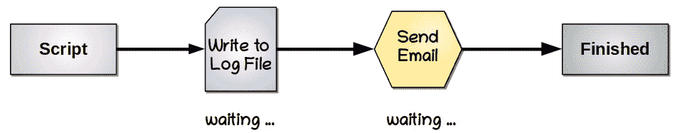
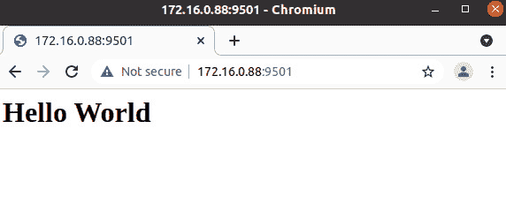
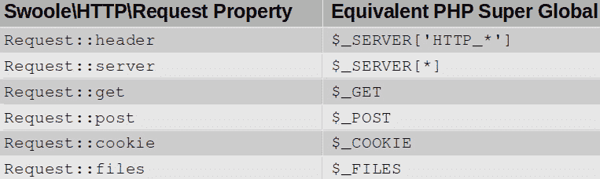

# 十二、使用异步编程创建 PHP8 应用

近年来，一项激动人心的新技术通过暴风雪**异步编程**，也被称为**PHP 异步**，将**PHP:超文本预处理器**（**PHP**）社区带入了人们的视野。异步编程模型解决了使用传统同步编程模式编写的任何应用代码中存在的一个问题：在提供结果之前，应用被迫等待某些任务完成。运行应用的服务器的**中央处理器**（**CPU**）（或 CPU）处于空闲状态，同时执行日常的**输入/输出**（**I/O**任务。PHP async 允许您的应用通过暂停阻塞 I/O 任务直到稍后，从而充分利用硬件资源。其净效果是性能的大幅提高，以及处理几何数量的用户请求的能力。

阅读本章并仔细研究示例后，您将能够开发 PHP 异步应用。此外，您将能够利用所选 PHP 扩展和框架的异步功能。当您完成本章的工作时，您将能够提高应用的性能，从 5 倍提高到惊人的*40 倍*！

本章涵盖的主题包括以下内容：

*   理解 PHP 异步编程模型
*   使用 Swoole 扩展
*   在异步模式下使用选定的 PHP 框架
*   了解 PHP8.1 光纤

# 技术要求

检查和运行本章提供的代码示例所需的最低硬件如下所示：

*   基于 x86_64 的台式 PC 或笔记本电脑
*   1**GB**（**GB**可用磁盘空间
*   4 GB 的**随机存取存储器**（**RAM**）
*   500**千比特每秒**（**Kbps**或更快的互联网连接

此外，您还需要安装以下软件：

*   码头工人
*   Docker Compose

请参考[*第 1 章*](01.html#_idTextAnchor013)*中的*技术要求*部分，介绍新的 PHP8 OOP 功能，*了解有关 Docker 和 Docker Compose 安装的更多信息，以及如何构建用于演示本书中所解释代码的 Docker 容器。在本书中，我们将您还原本书样本代码的目录称为`/repo`。

本章的源代码位于此处：[https://github.com/PacktPublishing/PHP-8-Programming-Tips-Tricks-and-Best-Practices](https://github.com/PacktPublishing/PHP-8-Programming-Tips-Tricks-and-Best-Practices) 。

现在，我们可以开始讨论 PHP 异步。

# 了解 PHP 异步编程模型

在我们深入了解如何使用异步库开发 PHP 应用之前，请先回顾一下 PHP**异步编程模型**非常重要。了解这一点与传统的**同步编程模型**之间的区别，为您在开发 PHP 应用时打开了一个高性能的新天地。让我们首先看看同步编程模型，然后我们将深入研究异步编程。

## 开发同步编程代码

在传统的 PHP 编程中，代码以线性方式执行。一旦代码被编译成机器代码，CPU 就会以顺序的方式一行接一行地执行代码，直到代码结束。PHP*过程编程*确实如此。令一些人惊讶的是，对于**面向对象编程**（**OOP**）也是如此！无论您是否将对象用作代码的一部分，OOP 代码都会先编译成字节码，然后再编译成机器码，并以与过程代码完全相同的同步方式进行处理。

使用 OPcache 和**即时**（**JIT**编译器）与代码是否以同步方式运行没有关系。OPcache 和 JIT 编译器带来的唯一好处是能够以比其他方式更快的速度操作同步代码。

重要提示

请不要以为使用同步编程模型编写代码有问题！这种方法不仅行之有效，而且相当成功。此外，同步代码还受到许多辅助工具的支持，如 PHPUnit、Xdebug、许多框架和许多其他工具。

然而，同步编程模型有一个主要的缺点。使用这种模式，CPU 必须不断等待某些任务完成后，程序才能继续运行。在很大程度上，这些任务包括访问外部资源，例如进行数据库查询、写入日志文件或发送电子邮件。这种任务称为**阻塞操作**（阻塞进度的操作）。

下图给出了应用流的可视化表示，其中包括写入日志文件和发送电子邮件通知的阻止操作：



图 12.1–同步编程模型

从*图 12.1*可以看出，当应用写入日志文件时，CPU 会暂停程序代码的执行，直到**操作系统**（**OS**）发出日志文件写入操作完成的信号。稍后，代码可能会发送电子邮件通知。同样，CPU 会暂停代码执行，直到电子邮件发送操作结束。尽管每个等待时间间隔本身可能并不重要，但当您将所有此类阻塞操作的等待时间间隔相加时，尤其是在涉及长循环的情况下，性能开始下降。

一种解决方案是自由地实现缓存解决方案。您可能已经猜到，另一个解决方案是使用异步编程模型编写应用。我们现在来看看。

## 理解异步编程模型

异步操作背后的思想已经存在了相当长的一段时间。一个非常著名的例子是 ApacheWeb 服务器，它有**多处理模块**（**MPMs**）。`MaxRequestWorkers`指令允许您指定 web 服务器可以同时处理多少请求（请参见[https://httpd.apache.org/docs/current/mod/mpm_common.html#maxrequestworkers](https://httpd.apache.org/docs/current/mod/mpm_common.html#maxrequestworkers) 了解更多信息）。

异步编程模型通常涉及设置管理节点，称为**工作者**。这允许程序继续执行，而无需等待任何给定任务完成。性能的提高可能非常显著，特别是在发生大量阻塞操作（例如，文件系统访问或数据库查询）的情况下。

下图显示了如何使用异步编程模型完成写入日志文件和发送电子邮件的任务：


图 12.2–异步编程模型

总等待时间减少了分配的工人数量。*图 12.2*所示的程序流程将涉及*图 12.1*所示等待时间的一半。随着分配处理阻塞操作的工作人员数量的增加，总体性能得到改善。

重要提示

异步编程模型*不应将*与**并行编程**混淆。在并行编程中，任务实际上是同时执行的，通常分配给不同的 CPU 或 CPU 核。另一方面，异步编程按顺序操作，但允许顺序代码在等待阻塞操作（例如，文件系统请求或数据库查询）的结果时继续。

现在您已经了解了 PHP 异步编程模型的工作原理，让我们来看看协同程序支持。

## 使用异步协同程序支持

*协同路由*与**线程**类似，但是在用户空间而非内核空间操作，因此不需要涉及操作系统。如果该支持可用，协同程序支持组件将检测到阻塞操作（如读取或写入文件），并有效地暂停该操作，直到收到结果。这将释放 CPU 以继续执行其他任务，直到阻塞进程返回结果为止。这个过程在机器代码级别运行，因此我们无法检测到，除了代码运行速度更快这一事实。

理论上，使用提供**协同程序支持**的扩展或框架可能会提高性能，即使您的代码是使用同步编程模型编写的。请注意，并非所有 PHP 异步框架或扩展都提供这种支持，这反过来可能会影响您选择用于未来开发的框架或扩展。

**Swoole 分机**（[https://www.swoole.co.uk/](https://www.swoole.co.uk/) 提供协同程序支持。另一方面，ReactPHP（[https://reactphp.org/](https://reactphp.org/) 是最流行的 PHP 异步框架之一，不提供协同路由支持，除非与 Swoole 扩展（下面讨论）或 PHP 光纤（在*学习 PHP 8.1 光纤*一节中讨论）一起使用。然而，ReactPHP 如此受欢迎的原因之一就是不需要 Swoole 扩展。如果您在一个无法控制 PHP 安装的托管环境中运行，您仍然可以使用 ReactPHP 并获得可观的性能提升，而无需接触 PHP 安装。

现在我们将注意力转向为异步模型编写代码。

## 创建 PHP 异步应用

现在最难的部分来了！不幸的是，使用同步编程模型编写的应用没有利用异步模型提供的功能。即使您使用的是提供协同程序支持的框架和/或扩展，您也无法实现最大的性能增益，除非您重构代码以遵循异步编程模型。

大多数 PHP 异步框架和扩展为您提供了许多分离任务的方法。以下是更常用方法的简要总结。

### 事件循环

在某种意义上，**事件循环**是一个重复的代码块，它持续运行，直到指定的事件发生。所有 PHP 异步扩展和框架都以这样或那样的形式提供此功能。采用回调形式的侦听器被添加到事件循环中。触发事件时，将调用侦听器的逻辑。

Swoole 事件循环利用 Linux`epoll_wait`（[https://linux.die.net/man/2/epoll_wait](https://linux.die.net/man/2/epoll_wait) 功能。因为基于硬件的事件通过伪文件句柄报告给 Linux，所以 Swoole 事件循环允许开发人员不仅基于实际文件的属性，而且基于生成**文件描述符**（**FD**的任何硬件进程的属性来启动和停止事件循环。

ReactPHP 框架提供了相同的功能，但默认情况下使用 PHP`stream_select()`函数代替 OS`epoll_wait`功能。这使得 ReactPHP 事件循环**应用编程接口**（**API**）在服务器之间可移植，尽管反应时间会较慢。ReactPHP 还提供了基于`ext-event`、`ext-ev`、`ext-uv`或`ext-libevent`PHP 扩展定义事件循环的功能。利用这些扩展，PHP 可以访问硬件，就像 Swoole 一样。

### 承诺

**承诺**是一种软件结构，允许将任务的处理推迟到以后。该概念最初是作为**CommonJS**项目（[项目）的一部分提出的 http://wiki.commonjs.org/wiki/Promises/A](http://wiki.commonjs.org/wiki/Promises/A) 。它被设计成同步和异步编程世界之间的桥梁。

在同步编程中，函数（或类方法）通常要么*成功*，要么*失败*。在 PHP 中，失败被处理为故意抛出的异常或致命错误。在异步模型中，将三种状态标识为*承诺*的一部分：**已履行**、**未履行**和**未履行**。因此，当创建一个*promise*实例时，您需要提供三个处理程序，它们根据它们所表示的状态执行操作。

对于 ReactPHP，当您创建一个`React\Promise\Promise`实例时，您提供一个**解析器**作为第一个构造函数参数。解析程序本身需要三个标记为`$resolve`、`$reject`和`$notify`的回调。这三种状态对应于承诺的三种可能状态：履行、失败或未履行。

### 溪流

许多异步框架为 PHP**流**提供了包装器。PHP 流最常用于处理涉及文件系统的操作。文件访问是一种阻塞操作，导致程序执行暂停，直到操作系统返回结果。

为了避免文件访问阻塞异步应用的进程，使用了`streams`组件。例如，ReactPHP 在`React\Stream`命名空间下提供实现`ReadableStreamInterface`或`WritableStreamInterface`的类。这些类充当普通 PHP 流函数的包装器，如`fopen()`、`fread()`和`fwrite()`，以及`file_get_contents()`和`file_put_contents()`。ReactPHP 类使用内存来避免阻塞，并将实际读取或写入延迟到以后，从而允许异步活动继续进行。

### 计时器

**计时器**是单独的任务，可以设置为在给定间隔后运行。在这方面，计时器类似于 JavaScript`setTimeout()`函数。使用计时器计划的任务可以设置为仅运行一次，或以指定的间隔连续运行。

大多数 PHP 异步框架或扩展中的计时器实现通常避免使用 PHP`pcntl_alarm()`函数。后一个功能允许开发人员在一定的秒数后向进程发送`SIGALRM`信号。`pcntl_alarm()`功能只允许您一次设置一个，但最低时间间隔以秒为单位。相反，PHP 异步框架和扩展允许您将多个计时器精确设置为毫秒。PHP 异步计时器实现的另一个区别是它不依赖于`declare(ticks=1)`语句。

计时器有许多潜在用途，例如，计时器可以检查包含**完全自动公共图灵测试的目录，以区分计算机和人类**（**验证码**）图像，并可以删除旧图像。另一个潜在用途是定期刷新缓存。

### 渠道

**通道**是并发进程之间的通信方式。目前信道的实现基于查尔斯·安东尼·霍尔爵士在 1978 年提出的代数模型。他的建议经过多年的改进，演变成 1985 年出版的《通信顺序过程》一书中描述的模型。通道和**通信顺序进程**（**CSP**模型是许多当前流行语言的一个特征，如**Go**。

与其他更复杂的方法相比，当使用通道时，CSP 进程是匿名的，而通道是显式命名的。信道方法的另一个方面是，在接收方准备好接收之前，阻止发送方发送。这个简单的原理减轻了实现过多共享锁定逻辑的负担。例如，在 Swoole 扩展中，通道用于实现连接池或作为调度并发任务的一种手段。

现在您已经对 PHP 异步理论有了基本的了解，是时候将该理论付诸实践了。我们首先研究如何使用 Swoole 扩展。

# 使用 Swoole 扩展

PHP**Swoole 扩展**首先在 PHP 扩展 C 库网站（[上提供 https://pecl.php.net/](https://pecl.php.net/) ），2013 年 12 月。从那时起，它得到了相当大的关注。随着 PHP8 中 JIT 编译器的引入，人们对 Swoole 扩展重新产生了浓厚的兴趣，因为它快速稳定，能够使 PHP 应用运行得更快。总下载量接近 600 万次，每月平均下载量约为 50000 次。

在本节中，您将了解扩展、如何安装以及如何使用。让我们首先了解一下扩展的概况。

## 检查 Swoole 扩展

因为扩展是用 C 语言编写的，一旦编译、安装并启用了它，就会在当前的 PHP 安装中添加一组函数和类。但是，该扩展利用了某些仅在从 UNIX 派生的操作系统中可用的低级功能。这意味着，如果您运行的是 Windows 服务器，那么让使用 Swoole 扩展的 PHP 异步应用运行的唯一方法是安装适用于 Linux 的 Windows 服务（**WSL**）或将应用设置为在 Windows 服务器上的 Docker 容器中运行。

提示

如果您想在 Windows 服务器上进行 PHP 异步操作，请考虑使用 ReAcphPp（在 RoTephp DealT1E.Author 中使用的 Type T0T 中讨论），它不具有 SooOLE 扩展所需的 OS 依赖性。

PHP async 的一大优点是，初始代码块会立即被加载，并一直保留在内存中，直到异步服务器实例停止。使用 Swoole 扩展时就是这种情况。在代码中，您创建了一个异步服务器实例，它可以有效地将 PHP 转换为一个在指定端口上侦听的持续运行的守护进程。但是，这也是一个缺点，因为如果对程序代码进行更改，则在重新加载之前，异步服务器实例无法识别这些更改。

Swoole 扩展的一大特点是其**协同程序支持**。这意味着，在现实生活中，我们不必对使用同步编程模型编写的应用执行大手术。Swoole 将自动选择文件系统访问和数据库查询等阻塞操作，并允许在应用的其余部分继续运行时暂停这些操作。由于这种支持，您通常可以使用 Swoole 简单地运行同步应用，从而立即提高性能。

Swoole 扩展的另一个真正伟大的功能是`Swoole\Table`。此功能允许您完全在内存中创建可在多个进程之间共享的等效数据库表。这种构造有许多可能的用途，潜在的性能增益确实是惊人的。

Swoole 扩展能够监听**用户数据报协议****UDP**传输而不是**传输控制协议****TDP**传输。这是一个非常有趣的可能性，因为 UDP 比 TCP 快得多。Swoole 还包括精确到毫秒的计时器实现，以及针对 MySQL、PostgreSQL、Redis 和 cURL 的异步客户端。Swoole 扩展还提供能力使用**Golang**样式的通道建立**进程间通信**（**IPC**。现在让我们来看看如何安装 Swoole。

## 安装 Swoole 延长件

Swoole 扩展可以使用与安装任何用 C 语言编写的 PHP 扩展相同的技术来安装。一种方法是简单地使用 OS 软件包管理器。例如，Debian 或 Ubuntu Linux 的`apt`（或其不太友好的表亲`apt-get`），以及 Red Hat、CentOS 或 Fedora 的`yum`或`dnf`。使用 OS 软件包管理器时，Swoole 扩展以预编译二进制文件的形式提供。

然而，推荐的方法是使用`pecl`命令。如果此命令在您的安装中不可用，则可以在 Ubuntu 或 Debian OS 上安装`pecl`命令（以 root 用户身份登录），如下所示：`apt install php-pear`。对于红帽、CentOS 或 Fedora 安装，以下工程：`yum install php-pear`。

使用`pecl`安装 Swoole 扩展时，您可以指定多个选项。这些选项总结如下：


表 12.1–Swoole 扩展 pecl 安装选项

有关这些选项的更多信息以及安装程序的概述，请查看以下内容：

[https://www.swoole.co.uk/docs/get-started/installation](https://www.swoole.co.uk/docs/get-started/installation)

现在让我们来看一个示例安装，其中包括对套接字的 Swoole 支持、**JavaScript 对象表示法**（**JSON**）和 cURL，如下所示：

1.  我们需要做的第一件事就是更新`pecl`**频道**。这是 PHP 扩展源代码存储库和函数的列表，与`apt`或`yum`包管理器使用的`sources`列表非常相似。下面是执行此操作的代码：

    ```php
    pecl channel-update pecl.php.net
    ```

2.  接下来，我们指定安装命令并使用`-D`标志添加选项，如下所示：

    ```php
    pecl install -D \
        'enable-sockets="yes" \
         enable-openssl="no" \
         enable-http2="no" \
         enable-mysqlnd="no" \
         enable-swoole-json="yes" \
         enable-swoole-curl="yes"' \
         swoole
    ```

3.  这将启动扩展安装过程。您现在可以看到下载的各种 C 语言代码文件和头文件，在之后，您的本地 C 编译器将用于编译扩展名。下面是编译过程的局部视图：

    ```php
    root@php8_tips_php8 [ / ]# pecl install swoole
    downloading swoole-4.6.7.tgz ...
    Starting to download swoole-4.6.7.tgz (1,649,407 bytes)
    .....................................................................................................................................................................................................................................................................................................................................done: 1,649,407 bytes
    364 source files, building
    running: phpize
    Configuring for:
    PHP Api Version:         20200930
    Zend Module Api No:      20200930
    Zend Extension Api No:   420200930
    building in /tmp/pear/temp/pear-build-defaultuserQakGt8/swoole-4.6.7
    running: /tmp/pear/temp/swoole/configure --with-php-config=/usr/bin/php-config --enable-sockets=no --enable-openssl=no --enable-http2=no --enable-mysqlnd=yes --enable-swoole-json=yes --enable-swoole-curl=yes
    ...
    Build process completed successfully
    Installing '/usr/include/php/ext/swoole/config.h'
    Installing '/usr/lib/php/extensions/no-debug-non-zts-20200930/swoole.so'
    install ok: channel://pecl.php.net/swoole-4.6.7
    configuration option "php_ini" is not set to php.ini location
    You should add "extension=swoole.so" to php.ini
    ```

4.  如果未找到 C 编译器，您将收到警告。此外，您可能需要为您的操作系统安装 PHP 开发库。如果出现这种情况，警告消息将为您提供进一步的指导。
5.  完成后，您需要启用扩展。这是通过在`php.ini`文件中添加`extension=swoole`来实现的。如果您不确定其位置，请使用`php -i`命令并查找`php.ini`文件的位置。您可以从添加此指令的命令行发出以下命令：

    ```php
    echo "extension=swoole" >>/etc/php.ini
    ```

6.  然后，您可以使用以下命令确认 Swoole 扩展的可用性：

    ```php
    php --ri swoole
    ```

至此，Swoole 扩展的安装结束。如果您是自定义编译 PHP，也可以在编译前运行`configure`时添加`--enable-swoole`选项。这将导致 Swoole 扩展在核心 PHP 安装时被编译和启用（并允许您绕过刚才概述的安装步骤）。我们现在来看一个简短的*Hello World*示例，该示例取自测试安装的文档。

## 测试安装

Swoole 文档提供了一个简单的示例，可用于快速测试，以查看安装是否成功。示例代码显示在主 Swoole 文档页面上（[https://www.swoole.co.uk/docs/](https://www.swoole.co.uk/docs/) 。出于版权原因，我们不在这里复制它。以下是运行*Hello World*测试所采取的步骤：

1.  First, we copied the *Hello World* example from [https://www.swoole.co.uk/docs/](https://www.swoole.co.uk/docs/) to `/path/to/repo/ch12/php8_swoole_hello_world.php` file.

    接下来，我们修改了演示程序，将`$server = new Swoole\HTTP\Server("127.0.0.1", 9501);`更改为`$server = new Swoole\HTTP\Server("0.0.0.0", 9501);`。

    此更改允许 Swoole 服务器在端口`9501`上侦听任何**互联网协议**（**IP**地址。

2.  然后我们修改了`/repo/ch12/docker-compose.yml`文件，使端口`9501`在 Docker 容器外部可用，如下所示：

    ```php
    version: "3"
    services:
      ...
      php8-tips-php8:
        ...
        ports:
         - 8888:80
         - 9501:9501
        ...
    ```

3.  为了使这项更改有效，我们必须先关闭服务，然后再重新启动。从本地计算机上的命令提示符/终端窗口，使用以下两个命令：

    ```php
    /path/to/repo/init.sh down
    /path/to/repo/init.sh up
    ```

4.  请注意，如果您正在运行 Windows，请删除`.sh`。
5.  然后我们在 PHP8 Docker 容器中打开一个 shell 并运行*Hello World*程序，如下所示：

    ```php
    $ docker exec -it php8_tips_php8 /bin/bash
    # cd /repo/ch12
    # php php8_swoole_hello_world.php
    ```

6.  最后，从 Docker 容器外部，我们打开了一个指向此 IP 地址和端口的浏览器：`http://172.16.0.88:9501`。

下面的屏幕截图显示了 Swoole*Hello World*项目的结果：



图 12.3–Swoole 演示 Hello World 程序输出

在详细介绍如何使用 Swoole 扩展来提高应用性能之前，我们需要检查一个 PHP 异步模型的主要候选示例应用。

## 检查样本 I/O 密集型应用

为了便于说明，我们已经创建了一个样本应用，作为**代表性状态传输**（**REST**API 编写，设计用于在 PHP8 中运行。示例应用提供了一个聊天或即时消息 API，具有以下简单功能：

*   使用**超文本传输协议**（**HTTP**`POST`方法向特定用户或所有用户发布消息。成功发布后，API 返回刚刚发布的消息。
*   带有`from=username`参数的 HTTP`GET`方法返回与该用户名之间的所有消息以及与所有用户之间的消息。如果设置了`all=1`参数，则返回所有用户名的列表。
*   HTTP`DELETE`方法从`messages`表中删除所有消息。

本节仅显示部分应用代码。如果您对整个`Chat`应用感兴趣，源代码位于`/path/to/repo/src/Chat`下。此处提供了主要 API 端点：`http://172.16.0.81/ch12/php8_chat_ajax.php`。

下面的示例在 PHP8.1 Docker 容器中执行。确保从 Windows 计算机上的本地计算机上的命令提示符下按如下方式关闭现有容器：`C:\path\to\repo\init down`。对于 Linux 或 Mac，从终端窗口：`/path/to/repo/init.sh down`。要从 Windows 计算机调出 PHP 8.1 容器，请执行以下操作：`C:\path\to\repo\ch12\init up`。从 Linux 或 Mac 终端窗口：`/path/to/repo/ch12/init.sh up`。

下面的示例在 PHP8.1 Docker 容器中执行。确保从 Windows 计算机上本地计算机上的命令提示符下按如下方式关闭现有容器：C:\path\to\repo\init down

对于 Linux 或 Mac，从终端窗口：

`/path/to/repo/init.sh down`

要从 Windows 计算机调出 PHP 8.1 容器，请执行以下操作：

`C:\path\to\repo\ch12\init up`

从 Linux 或 Mac 终端窗口：

`/path/to/repo/ch12/init.sh up`

我们现在来看一下核心 API 程序本身的源代码，如下所示：

1.  首先，我们定义一个`Chat\Message\Pipe`类，标识我们需要使用的所有外部类，如：

    ```php
    // /repo/src/Chat/Messsage/Api.php;
    namespace Chat\Message;
    use Chat\Handler\ {GetHandler, PostHandler,
        NextHandler,GetAllNamesHandler,DeleteHandler};
    use Chat\Middleware\ {Access,Validate,ValidatePost};
    use Chat\Message\Render;
    use Psr\Http\Message\ServerRequestInterface;
    class Pipe {
    ```

2.  然后我们定义一个`exec()`静态方法，该方法调用一组符合**PHP 标准建议 15**（**PSR-15**的处理程序。我们还通过调用`Chat\Middleware\Access`中间件类的`process`方法来调用管道的第一阶段。忽略`NextHandler`的返回值：

    ```php
    public static function exec(
        ServerRequestInterface $request) {
        $params   = $request->getQueryParams();
        $method   = strtolower($request->getMethod());
        $dontcare = (new Access())
            ->process($request, new NextHandler());
    ```

3.  仍然在相同的方法中，我们使用`match()`构造来检查 HTTP`GET`、`POST`和`DELETE`方法调用。如果方法为`POST`，则使用`Chat\Middleware\ValidatePost`验证中间件类验证`POST`参数。如果验证成功，则将经过消毒的数据传递给`Chat\Handler\PostHandler`。如果 HTTP 方式为`DELETE`，则直接调用`Chat\Handler\DeleteHandler`：

    ```php
        $response = match ($method) {
            'post' => (new ValidatePost())
                ->process($request, new PostHandler()),
            'delete' => (new DeleteHandler())
                ->handle($request),
    ```

4.  如果 HTTP 方法为`GET`，首先检查`all`参数是否设置。如果是，我们调用`Chat\Handler\GetAllNamesHandler`。否则，*default*子句通过`Chat\MiddleWare\Validate`传递数据。如果验证成功，消毒后的数据传递给`Chat\Handler\GetHandler`：

    ```php
            'get'    => (!empty($params['all'])
            ? (new GetAllNamesHandler())->handle($request)
            : (new Validate())->process($request, 
                    new GetHandler())),
            default => (new Validate())
                ->process($request, new GetHandler())};
            return Render::output($request, $response);
        }
    }
    ```

5.  然后可以使用一个简短的常规程序调用核心 API 类，如下所示。在这个调用程序中，我们使用`Laminas\Diactoros\ServerRequestFactory`构建了一个符合 PSR-7 的`Psr\Http\Message\ServerRequestInterface`实例。然后请求通过`Pipe`类传递，并生成响应：

    ```php
    // /repo/ch12/php8_chat_ajax.php
    include __DIR__ . '/vendor/autoload.php';
    use Laminas\Diactoros\ServerRequestFactory;
    use Chat\Message\Pipe;
    $request  = ServerRequestFactory::fromGlobals();
    $response = Pipe::exec($request);
    echo $response;
    ```

我们还创建了一个测试程序（`/repo/ch12/php8_chat_test.php`-未显示），该程序调用 API 端点一定次数（默认为 100 次）。在每次迭代中，测试程序都会发布一条随机消息，其中包括随机收件人用户名、随机日期和来自`/repo/sample_data/geonames.db`数据库的顺序条目。测试程序接受两个参数。第一个参数是表示 API 的 URL。第二个（可选）参数表示迭代次数。

此处是从命令 shell 运行`/ch12/php8_chat_test.php`到 PHP 8.1 Docker 容器的示例结果：

```php
root@php8_tips_php8_1 [ /repo/ch12 ]# php php8_chat_test.php \
     http://localhost/ch12/php8_chat_ajax.php 10000  bboyer :          Dubai:AE:2956587 : 2021-01-01 00:00:00
1 fcompton :       Sharjah:AE:1324473 : 2022-02-02 01:01:01
...
998 hrivas : Caloocan City:PH:1500000 : 2023-03-19 09:54:54
999  lpena :         Budta:PH:1273715 : 2021-04-20 10:55:55
From User: dwallace
Elapsed Time: 3.3177478313446
```

从输出中，记下经过的时间。在下一节中，使用 Swoole，我们可以将此时间减半！然而，在使用 Swoole 之前，合并 JIT 编译器才是公平的。我们使用以下命令启用 JIT：

```php
# php /repo/ch10/php8_jit_reset.php on 
```

在 PHP8.0.0 中，可能会遇到一些错误，也可能是分段错误。然而，在 PHP8.1 中，启用 JIT 编译器后，API 应该可以像预期的那样工作。然而，JIT 编译器能否提高性能是非常值得怀疑的，因为频繁的 API 调用会导致应用等待。任何具有频繁阻塞 I/O 操作的应用都是异步编程模型的最佳候选者。然而，在继续之前，我们需要使用与之前相同的实用程序关闭 JIT，如下所示：

```php
# php /repo/ch10/php8_jit_reset.php off 
```

现在让我们看看如何使用 Swoole 扩展来提高这个 I/O 密集型应用的性能。

## 使用 Swoole 扩展提高应用性能

考虑到 Swoole 提供了协同路由支持，为了提高`Chat`应用的性能，我们真正需要做的就是重写`/repo/ch12/php8_chat_ajax.php`调用程序，将其转换为一个 API，作为 Swoole 服务器实例侦听端口`9501`。以下是重写主 API 调用程序的步骤：

1.  首先，我们启用自动加载并识别所需的外部类：

    ```php
    // /repo/ch12/php8_chat_swoole.php
    include __DIR__ . '/vendor/autoload.php';
    use Chat\Message\Pipe;
    use Chat\Http\SwooleToPsr7;
    use Swoole\Http\Server;
    use Swoole\Http\Request;
    use Swoole\Http\Response;
    ```

2.  接下来，我们启动一个 PHP 会话并创建一个`Swoole\HTTP\Server`实例，用于侦听端口`9501`：

    ```php
    session_start();
    $server = new Swoole\HTTP\Server('0.0.0.0', 9501);
    ```

    上的任何 IP 地址
3.  然后我们调用`on()`方法并将其与`start`事件关联。在本例中，我们创建一个日志条目来标识 Swoole 服务器何时启动。此处记录了其他服务器事件：[https://www.swoole.co.uk/docs/modules/swoole-http-server-doc](https://www.swoole.co.uk/docs/modules/swoole-http-server-doc) ：

    ```php
    $server->on("start", function (Server $server) {
        error_log('Swoole http server is started at '
            . 'http://0.0.0.0:9501');
    });
    ```

4.  最后，我们定义了一个主服务器事件`$server->on('request', function () {})`，用于处理传入的请求。下面是完成此操作的代码：

    ```php
    $server->on("request", function (
        Request $swoole_request, Response $swoole_response){
        $request  = SwooleToPsr7::
            swooleRequestToServerRequest($swoole_request);
        $swoole_response->header(
            "Content-Type", "text/plain");
        $response = Pipe::exec($request);
        $swoole_response->end($response);
    }); 
    $server->start();
    ```

不幸的是，传递给与`on()`方法关联的回调的`Swoole\Http\Request`实例不符合 PSR-7！因此，我们需要定义一个`Chat\Http\SwooleToPsr7`类和一个`swooleRequestToServerRequest()`方法，该方法使用静态调用执行转换。然后，我们在`Swoole\Http|Response`实例上设置标题，并从管道返回一个值以完成回路。

请务必注意，标准的 PHP 超全局变量（如`$_GET`和`$_POST`）在运行的 Swoole 服务器实例中无法按预期工作。主要入口点是从命令行启动 Swoole 服务器时使用的初始程序。唯一传入的请求参数是实际的初始程序文件名。任何后续输入都必须通过传递给`on()`函数的`Swoole\Http\Request`实例捕获。

在[找到的文件 https://php.net/swoole](https://php.net/swoole) 未显示`Swoole\HTTP\Request`和`Swoole\HTTP\Response`类可用的所有方法。但是，在 Swoole 网站上，您可以找到相关的文档，这里也列出了这些文档：

*   [https://www.swoole.co.uk/docs/modules/swoole-http-request](https://www.swoole.co.uk/docs/modules/swoole-http-request)
*   [https://www.swoole.co.uk/docs/modules/swoole-http-response](https://www.swoole.co.uk/docs/modules/swoole-http-response)

还值得注意的是，`Swoole\HTTP\Request`对象属性大致对应于 PHP 超全局变量，如下所示：



表 12.2–Swoole 请求到 PHP superglobals 的映射

另一个考虑因素是，在 Swoole 协同程序中使用 Xdebug 可能会导致分段错误和其他问题，包括**堆芯转储**。最佳做法是在首次使用`pecl`安装 Swoole 时，使用`--enable-debug`标志启用 Swoole 调试。为了测试应用，我们按照以下步骤进行：

1.  从命令 shell 到 PHP8.1 Docker 容器，我们运行`Chat`API 的 Swoole 版本，如下所示。立即显示的消息是`$server->on("start", function() {})`：

    ```php
    # cd /repo/ch12
    # php php8_chat_swoole.php 
    Swoole http server is started at http://0.0.0.0:9501
    ```

    的结果
2.  然后，我们在主机上打开另一个终端窗口，并在 PHP8.1 Docker 容器中打开另一个 shell。从那里，我们可以运行`/repo/ch12/php8_chat_test.php`测试程序，如下所示：

    ```php
    # cd /repo/ch12
    # php php8_chat_test.php http://localhost:9501 1000
    ```

3.  注意两个附加参数。第一个参数告诉测试程序使用 Swoole 版本的 API，而不是使用 ApacheWeb 服务器的旧版本。最后一个参数告诉测试程序运行 1000 次迭代。

现在让我们看一下输出，如下所示：

```php
root@php8_tips_php8_1 [ /repo/ch12 ]# php php8_chat_test.php \
     http://localhost:9501 1000
0    coconnel :      Dubai:AE:2956587 :  2021-01-01 00:00:00
1      htyler :    Sharjah:AE:1324473 :  2022-02-02 01:01:01
...
998  cvalenci : Caloocan City:PH:1500 :  2023-03-19 09:54:54
999  smccormi :      Budta:PH:1273715 :  2021-04-20 10:55:55
From User: ajenkins
Elapsed Time: 1.8595671653748
```

输出最显著的特征是经过的时间。如果回顾上一节，您会注意到，作为使用 Apache 的传统 PHP 应用运行的 API 大约需要 3.35 秒来完成 1000 次迭代，而在 Swoole 下运行的相同 API 大约需要 1.86 秒：几乎是一半的时间！

请注意，这是没有任何额外的优化。Swoole 还有许多其他功能可以使用，包括定义内存中的表、从额外的工作线程派生任务、使用事件循环促进缓存等。正如您所看到的，Swoole 立即提供了性能提升，作为一种从现有应用中获得更高性能的可能方法，非常值得研究。

现在您已经了解了如何使用 Swoole 来提高应用性能，让我们看看其他潜在的 PHP 异步解决方案。

# 在异步模式下使用选定的 PHP 框架

还有许多其他 PHP 框架实现异步编程模型。在本节中，我们将介绍最流行的 PHP 异步框架 ReactPHP，以及另一种流行的 PHP 异步框架 Amp。此外，我们将向您展示如何在异步模式下使用选定的 PHP 框架。

需要注意的是，许多能够在异步模式下运行的 PHP 框架都依赖于 Swoole 扩展。没有这种依赖关系的是 ReactPHP，下面将介绍。

## 与 PHP 合作

**反应 PHP**[https://reactphp.org/](https://reactphp.org/) 是**反应堆软件设计模式**的实现，受非阻塞异步**Node.js**框架（[的启发 https://nodejs.org/en/](https://nodejs.org/en/) 等。

尽管 ReactPHP 并没有像 Swoole 扩展那样自动提高性能，但它有一个很大的优势，即它不依赖 UNIX 或 Linux 的功能，因此可以在 Windows 服务器上运行。ReactPHP 的另一个优点是它对 PHP 扩展没有特定的依赖性，除了那些已经作为标准扩展包含的扩展之外。

任何 ReactPHP 应用的核心都是`React\EventLoop\Loop`类。顾名思义，`Loop`实例作为**无限循环**有效地启动。大多数 PHP 无限循环都会给你的应用带来灾难！但是，在本例中，循环用于连续侦听给定端口上的请求的服务器实例。

ReactPHP 的另一个关键组件是`React\Socket\Server`。该类在给定端口上打开一个套接字，使 PHP 应用能够直接侦听 HTTP 请求，而无需涉及 web 服务器。

ReactPHP 的其他特性包括侦听 UDP 请求的能力、非阻塞缓存和异步承诺的实现。ReactPHP 还具有一个`Stream`组件，允许您延迟文件系统的读写，大大提高了性能，因为您的应用不再需要等待此类文件 I/O 请求完成。

使用 ReactPHP 的的最后一个优点是它完全符合与 PSR-7（HTTP 消息传递）的要求。我们现在来看看运行前面描述的`Chat`API 的示例程序，它使用 PHP 重写。以下是重写程序的步骤：

1.  从命令提示符到 Docker PHP 8 容器，使用 Composer，我们安装了必要的 ReactPHP 组件：

    ```php
    cd /repo/ch12
    composer require --ignore-platform-reqs react/event-loop
    composer require --ignore-platform-reqs react/http
    composer require --ignore-platform-reqs react/socket
    ```

2.  然后我们重写`/repo/ch12/php8_chat_swoole.php`并将其重命名为`/repo/ch12/php8_chat_react.php`。我们首先需要更改的是`use`语句：

    ```php
    // /repo/ch12/php8_chat_react.php
    include __DIR__ . '/vendor/autoload.php';
    use Chat\Message\Pipe;
    use React\EventLoop\Factory;
    use React\Http\Server;
    use React\Http\Message\Response as ReactResponse;
    use Psr\Http\Message\ServerRequestInterface;
    ```

3.  然后我们启动一个会话并创建一个`React\EventLoop\Loop`实例，如下所示：

    ```php
    session_start();
    $loop = Factory::create();
    ```

4.  我们现在定义一个处理程序，它接受一个 PSR-7`ServerRequestInterface`实例作为参数，并返回一个`React\Http\Message\Response`实例：

    ```php
    $server = new Server($loop, 
    function (ServerRequestInterface $request) {
        return new ReactResponse(200,
            ['Content-Type' => 'text/plain'],
            <8 SPACES>Pipe::exec($request)
        );
    });
    ```

5.  然后我们设置一个`React\Socker\Server`实例来监听端口`9501`并执行一个循环，如下所示：

    ```php
    $socket = new React\Socket\Server(9501, $loop);
    $server->listen($socket);
    echo "Server running at http://locahost:9501\n";
    $loop->run();
    ```

然后，我们在 PHP 8.1 容器中打开一个单独的命令 shell，并按如下方式启动 ReactPHP 服务器：

`root@php8_tips_php8_1 [ /repo/ch12 ]# php php8_chat_react.php`

从另一个命令 shell 进入 PHP8.1 容器，然后我们可以按如下方式运行测试程序：`root@php8_tips_php8_1 [ /repo/ch12 ]# php php8_chat_test.php \`

`http://localhost:9501`

输出（未显示）与使用 Swoole 扩展时显示的类似。

接下来，我们来看看另一个流行的 PHP 异步框架：Amp。

## 使用 Amp 实现 PHP 异步

**Amp 框架**(https://amphp.org/)，非常类似于 ReactPHP，提供计时器、承诺和流的实现。Amp 还提供协同程序支持，以及一个异步迭代器组件。后者非常有趣，因为迭代对于大多数 PHP 应用都是必不可少的。如果您可以将迭代转换为异步处理模式，而可能涉及大量重构，那么它可能会极大地提高应用的性能。另一个有趣的变化是 Amp 可以直接使用任何 PHP 组件！

要安装 Amp，请使用 Composer。不同的 Amp 组件在独立的存储库中可用，因此您不必只安装您需要的整个框架。PHP Amp 服务器的实际实现与 PHP 的示例非常相似。

现在让我们看看另一个可以在 PHP 异步模式下运行的框架：**Mezzio**，以前的称为**Zend Expressive**。

## 与 Swoole 一起使用 Mezzio

**中音**框架（[https://docs.mezzio.dev/](https://docs.mezzio.dev/) 是 Matthew Weier O’Phinney（[的](https://mwop.net/)创意 https://mwop.net/ 表示旧框架**Zend 框架**和后一个**Zend 框架**的延续**。Mezzio 属于**微框架**中相对较新的类别。微框架不依赖老化的**模型视图控制器**（**MVC**软件设计模式，主要面向**RESTful API 开发**。在实际应用中，微框架支持 PHP 中间件的原理，并以更少的开销和更高的速度运行。**

要将 Mezzio 应用与 Swoole 结合使用，只需要以下三件事：

1.  安装 Swoole 延长件（本章前面介绍）。
2.  安装`mezzio-swoole`组件，如下所示：

    ```php
    composer require mezzio/mezzio-swoole
    ```

3.  然后，需要使用 Swoole 服务器实例运行 Mezzio。这可以通过以下命令完成：

    ```php
    /path/to/project/vendor/bin/laminas mezzio:swoole:start
    ```

4.  在 Mezzio 应用的配置文件中，您需要添加以下键：

    ```php
    return [
        'mezzio-swoole' => [
            'swoole-http-server' => [
                'host' => '0.0.0.0',    // all IP addresses
                'port' => 9501,
            ]
        ],
    ];
    ```

为了进一步提高性能，当然还应该重写代码的适当部分，以利用 PHP 异步功能。接下来，我们来看一个超越异步的 PHP 扩展。

## 使用平行延长线

`parallel`分机（[https://www.php.net/parallel 引入](https://www.php.net/parallel)与 PHP7.2 及以上版本一起使用。它的目的是超越 PHP 异步，进入成熟的并行处理领域。`parallel`扩展提供了五个关键的底层类，它们可以构成并行处理应用的基础。使用此扩展允许 PHP 开发人员编写类似于**Go**语言的并行代码。让我们从`parallel\Runtime`开始。

### 并行\运行时类

每个`parallel\Runtime`实例产生一个新的 PHP 线程。然后您可以使用`parallel\Runtime::run()`来安排任务。`run()`的第一个参数是`Closure`（一个匿名函数）。可选的第二个参数是`$argv`，表示在运行时传递给任务的输入参数。`parallel\Runtime::close()`用于优雅地关闭线程。当出现错误情况时，可以使用`parallel\Runtime::kill()`立即退出线程。

### 并行\未来类

`parallel\Future`实例被创建为`parallel\Runtime::run()`返回的值。它的行为非常类似于 PHP 异步*承诺*（在本章前面介绍）。此类有三个方法，如下所示，它们执行以下操作：

*   `parallel\Future::value()`

    返回任务的已完成值

*   `parallel\Future::cancel()`

    取消表示承诺*失败*状态的任务

*   `parallel\Future::cancelled()|done()`

    如果任务尚未完成，则返回任务状态

### 并行通道类

`parallel\Channel`类允许开发人员在任务之间共享信息。使用`__construct()`方法或`make()`创建通道。如果未向`__construct()`提供参数，或者未向`make()`提供第二个参数，则认为通道未缓冲。如果一个整数被提供给`__construct()`或作为`make()`的第二个参数，则该值表示通道的**容量**。然后您可以使用`parallel\Channel::send()`和`parallel\Channel::recv()`方法通过通道发送和接收数据。

无缓冲信道会阻止对`send()`的呼叫，直到有接收机为止，反之亦然。另一方面，缓冲通道在达到容量之前不会阻塞。

### 并行\事件类

`parallel\Events`类类似于本章第一节中描述的*事件循环*。此类有`addChannel()`和`addFuture()`方法来添加要监视的通道和/或未来实例。`setBlocking()`方法允许事件循环以阻塞或非阻塞模式监控事件。使用`setTimeout()`方法设置允许循环继续的总控制周期（毫秒）。最后，`poll()`方法使事件循环轮询下一个事件。

### 安装平行延长件

`parallel`扩展可以与`pecl`命令一起安装，也可以使用预编译的二进制文件，就像其他非标准 PHP 扩展一样。但是，需要特别注意的是，此扩展仅适用于**Zend 线程安全**（**ZTS**PHP 安装。因此，如果使用 Docker，则需要获取 PHP ZTS 图像，或者，如果自定义编译 PHP，则需要使用`--enable-zts`（Windows）或`--enable-maintainer-zts`（非 Windows）`configure`实用程序标志。

现在，您已经了解了如何在异步模式下使用一些选定的 PHP 扩展和框架，我们将展望未来并讨论 PHP8.1。

# 学习 PHP 8.1 光纤

PHP 核心团队开发人员 Aaron Piotrowski 和 Niklas Keller 于 2021 年 3 月发布了**征求意见**（**RFC**）的，概述了的案例，包括在 PHP 语言核心中支持**光纤**。RFC 在月底获得批准，现在已经在即将发布的 PHP 8.1 版本中实现。

光纤实现是低级的，这意味着它主要被设计为 PHP 异步框架（如 ReactPHP 或 Amp）的一部分，或者作为扩展（如 Swoole 扩展）的一部分。因为从 PHP8.1 及更高版本开始，这将成为该语言的核心部分，所以开发人员不必太担心加载了哪些扩展。此外，这大大增强了 PHP 异步框架，因为它们现在直接在语言核心中提供了低级支持，大大提高了性能。现在让我们来看看`Fiber`类本身。

## 发现纤维类

PHP8.1`Fiber`类提供了一个基本实现，异步框架和扩展开发人员可以在此基础上构建计时器、事件循环、承诺和其他异步工件。

下面是正式的类定义：

```php
final class Fiber {
    public function __construct(callable $callback) {}
    public function start(mixed ...$args): mixed {}
    public function resume(mixed $value = null): mixed {}
    public function throw(Throwable $exception): mixed {}
    public function isStarted(): bool {}
    public function isSuspended(): bool {}
    public function isRunning(): bool {}
    public function isTerminated(): bool {}
    public function getReturn(): mixed {}
    public static function this(): ?self {}
    public static function suspend(
        mixed $value = null): mixed {}
}
```

下面是`Fiber`类方法的摘要：


表 12.3–纤维等级方法汇总

从*表 12.3*可以看出，创建`Fiber`实例后，使用`start()`运行与光纤相关联的回调。之后，您可以使用`throw()`自由暂停、恢复或导致光纤故障。您也可以让回调在自己的光纤中运行，并使用`getReturn()`检索返回的信息。您可能还注意到，`is*()`方法可用于确定光纤在任何给定时刻的状态。

提示

有关 PHP8.1 光纤实现的更多信息，请查看以下 RFC:[https://wiki.php.net/rfc/fibers](https://wiki.php.net/rfc/fibers) 。

现在让我们看一个例子，说明光纤的使用。

## 使用纤维

PHP8.1 光纤构成了 PHP 异步应用的基础。虽然 fibers 的主要受众是框架和扩展开发人员，但任何 PHP 开发人员都可以从这个类中受益。为了说明 PHP 光纤可以解决的问题，让我们看一个简单的例子。

### 定义执行阻塞操作的示例程序

在这个使用同步编程模型编写的示例中，我们执行三个操作，如下所示：

*   执行 HTTP`GET`请求。
*   执行数据库查询。
*   将信息写入访问日志。

已经有了一些异步编程的知识，您意识到这三个任务都代表了*阻塞*操作。以下是我们将采取的步骤：

1.  首先，我们定义一个要包含的 PHP 文件，该文件定义回调：

    ```php
    // /repo/ch12/php8_fibers_include.php
    define('WAR_AND_PEACE',
        'https://www.gutenberg.org/files/2600/2600-0.txt');
    define('DB_FILE', __DIR__ 
        . '/../sample_data/geonames.db');
    define('ACCESS_LOG', __DIR__ . '/access.log');
    $callbacks = [
        'read_url' => function (string $url) {
            return file_get_contents($url); },
        'db_query' => function (string $iso2) {
            $pdo = new PDO('sqlite:' . DB_FILE);
            $sql = 'SELECT * FROM geonames '
                 . 'WHERE country_code = ?'
            $stmt = $pdo->prepare($sql);
            $stmt->execute([$iso2]);
            return var_export(
                $stmt->fetchAll(PDO::FETCH_ASSOC), TRUE);
            },
        'access_log' => function (string $info) {
            $info = date('Y-m-d H:i:s') . ": $info\n";
            return file_put_contents(
                ACCESS_LOG, $info, FILE_APPEND);
            },
    ];
    return $callbacks;
    ```

2.  接下来，我们定义一个 PHP 程序，该程序包含回调的定义并按顺序执行。我们使用 PHP8`match {}`构造来分配不同的参数以传递给相应的回调。最后，我们只需返回一个字符串并运行`strlen()`：

    ```php
    // /repo/ch12/php8_fibers_blocked.php
    $start = microtime(TRUE);
    $callbacks = include __DIR__ . '/php8_fibers_include.php';
    foreach ($callbacks as $key => $exec) {
        $info = match ($key) {
            'read_url' => WAR_AND_PEACE,
            'db_query' => 'IN',
            'access_log' => __FILE__,
            default => ''
        };
        $result = $exec($info);
        echo "Executing $key" . strlen($result) . "\n";
    }
    echo "Elapsed Time:" . (microtime(TRUE) - $start) . "\n";
    ```

    即可返回回调生成的字节数

如果我们随后按原样运行程序，结果将不堪设想，正如我们在这里看到的：

```php
root@php8_tips_php8_1 [ /repo/ch12 ]# 
php php8_fibers_blocked.php 
Executing read_url:     3359408
Executing db_query:     23194
Executing access_log:     2
Elapsed Time:6.0914640426636
```

**统一资源定位器**（**URL**请求下载托尔斯泰的*战争与和平*耗时最多，产生了超过 300 万字节的字节数。总运行时间仅为 6 秒的一小部分。

现在让我们看看如何使用光纤重写调用程序。

### 使用光纤的示例程序

从 PHP8.1 Docker 容器中，我们可以定义一个使用光纤的调用程序。以下是执行此操作的步骤：

1.  首先，我们包括回调，正如我们之前所做的那样：

    ```php
    // /repo/ch12/php8_fibers_unblocked.php
    $start = microtime(TRUE);
    $callbacks = include __DIR__ 
        . '/php8_fibers_include.php';
    ```

2.  接下来，我们创建一个`Fiber`实例来包装每个回调。然后我们使用`start()`启动回调，提供适当的信息：

    ```php
    $fibers = [];
    foreach ($callbacks as $key => $exec) {
        $info = match ($key) {
            'read_url' => WAR_AND_PEACE,
            'db_query' => 'IN',
            'access_log' => __FILE__,
            default => ''
        };
        $fibers[$key] = new Fiber($exec);
        $fibers[$key]->start($info);
    }
    ```

3.  然后我们设置一个循环，并检查每个回调是否完成。如果是这样，我们回显来自`getReturn()`的结果并取消设置光纤：

    ```php
    $count  = count($fibers);
    $names  = array_keys($fibers);
    while ($count) {
        $count = 0;
        foreach ($names as $name) {
            if ($fibers[$name]->isTerminated()) {
               $result = $fibers[$name]->getReturn();
                echo "Executing $name: \t" 
                    . strlen($result) . "\n";
                unset($names[$name]);
            } else {
                $count++;
            }
        }
    }
    echo "Elapsed Time:" . (microtime(TRUE) - $start) . "\n";
    ```

请注意，此示例仅用于说明。更可能的情况是，您将使用现有的框架，如 ReactPHP 或 Amp，这两个框架都已重写以利用 PHP8.1。还需要注意的是，即使多个光纤同时运行，您所能实现的最短运行时间也与最长运行任务所花费的时间成正比。现在让我们看看纤维对 PHP 和 Swoole 的影响。

## 检查纤维对 PHP 和 Swoole 的影响

在本例中，您需要在 PHP8.1 Docker 容器中打开两个独立的命令 shell。按照上一节中给出的指示，但打开两个命令外壳，而不是一个。然后我们将使用`/repo/ch12/php8_chat_test.php`程序测试纤维的效果。让我们运行第一个测试，使用内置的 PHPWeb 服务器作为控件。

### 使用内置 PHP web 服务器进行测试

在第一个测试中，我们使用内置的 PHP web 服务器和传统的`/repo/ch12/php8_chat_ajax.php`实现。以下是我们将采取的步骤：

1.  在两个命令 shell 中，更改为`/repo/ch12`目录，如下所示：

    ```php
    # cd /repo/ch12
    ```

2.  在第一个命令 shell 中，使用内置的 PHP web 服务器运行标准 HTTP 服务器，并使用以下命令：

    ```php
    # php -S localhost:9501 php8_chat_ajax.php
    ```

3.  在第二个命令 shell 中，执行测试程序，如图所示：

    ```php
    php php8_chat_test.php http://localhost:9501 1000 --no
    ```

结果输出应如下所示：

```php
root@php8_tips_php8_1 [ /repo/ch12 ]# 
php php8_chat_test.php http://localhost:9501 1000 --no
From User: pduarte
Elapsed Time: 1.687940120697
```

如您所见，使用同步编程编写的常规代码在 1000 次迭代中以 1.7 秒左右的速度出现。现在让我们看看如何使用 PHP 运行相同的测试。

### 使用 PHP 进行测试

在第二次测试中，我们使用了我们的`/repo/ch12/php8_chat_react.php`PHP 实现。以下是我们将采取的步骤：

1.  在第一个命令 shell 中，点击*Ctrl*+*C*退出内置 PHP web 服务器。
2.  使用`exit`退出并重新进入第一个命令 shell，然后是针对 Windows 的`init shell`或针对 Linux 或 Mac 的`./init.sh shell`。
3.  使用以下命令启动 PHP 服务器：

    ```php
    # php php8_chat_react.php
    ```

4.  在第二个命令 shell 中，执行测试程序，如下所示：

    ```php
    php php8_chat_test.php http://localhost:9501 1000 --no
    ```

结果输出应该如下所示：

```php
root@php8_tips_php8_1 [ /repo/ch12 ]# 
php php8_chat_test.php http://localhost:9501 1000 --no
From User: klang
Elapsed Time: 1.2330160140991
```

从输出中可以看出，ReactPHP 从光纤中获益匪浅。1000 次迭代的总运行时间是令人印象深刻的`1.2`秒！

我们对 PHP8.1 光纤的讨论到此结束。现在，您已经了解了什么是光纤，如何在程序代码中直接使用光纤，以及光纤如何使外部 PHP 异步框架受益。

# 总结

在本章中，您了解了传统同步编程和异步编程之间的区别。涵盖了事件循环、计时器、承诺和通道等关键术语。这些知识使您能够确定何时使用异步编程模型编写代码块，以及如何重写现有同步模型应用的部分以利用异步功能。

然后，您了解了 Swoole 扩展以及如何将其应用于现有应用代码以实现性能改进。您还了解了许多以异步方式运行的其他框架和扩展。您回顾了具体的代码示例，现在已经开始编写异步代码。

在上一节中，我们向您介绍了 PHP8.1 光纤。然后回顾了一个代码示例，该示例演示了如何使用 PHP8.1 创建协作多任务函数和类方法。您还看到了选定的 PHP 异步框架如何从 PHP8.1 光纤支持中获益，从而提供了更多的性能改进。

这是这本书的最后一章。我们希望您喜欢回顾 PHP8 中提供的大量新特性和好处。现在，您对面向对象和过程代码中要避免的潜在陷阱以及对 PHP8 扩展的各种更改有了更深入的了解。有了这些知识，您不仅可以编写更好的代码，而且还可以制定一个可靠的行动计划，最大限度地减少 PHP8 迁移后应用代码失败的可能性。