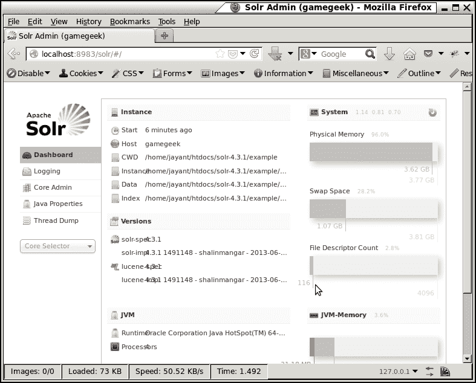
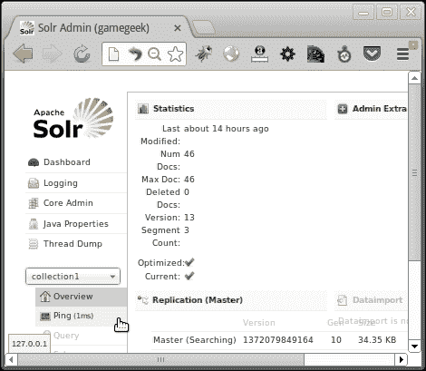
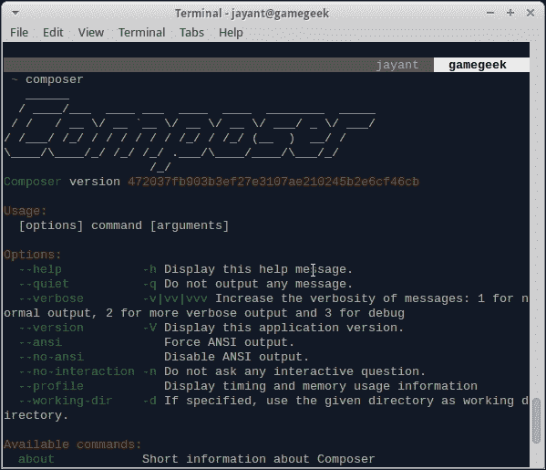

# 一、安装和集成 Solr 和 PHP

你是 PHP 程序员吗？您觉得有必要在应用程序中加入搜索吗？你知道 ApacheSolr 吗？您是否觉得将 Solr 集成到 PHP 应用程序中是一项非常乏味的工作？这本书将使您的集成变得容易。我们将研究 ApacheSolr 与 PHP 的端到端集成。我们将从 Solr 安装开始。我们将研究 Solr 如何与 PHP 集成。然后，我们将通过 PHP 代码探索 Solr 提供的特性。读完本书后，您应该能够将 Solr 提供的几乎所有功能集成到 PHP 应用程序中。

本章将帮助我们在两个主要环境中安装 ApacheSolr：Windows 和 Linux。我们还将继续探索 Solr 作为 ApacheTomcat 服务器的一部分的安装。我们将讨论通过 PHP 与 Solr 对话的可用选项，并学习如何为 Solr-PHP 集成设置 Solarium 库。

本章将介绍以下主题：

*   什么是索尔？
*   在 Windows 和 Linux 上下载和安装 Solr
*   配置 Tomcat 以运行 Solr。
*   使用 PHP 在 Solr 上执行 ping 查询
*   讨论 Solr-PHP 集成的不同库
*   在 Windows 和 Linux 上安装 Solarium
*   使用 Solarium 将 PHP 连接到 Solr
*   使用 PHP 和 Solarium 运行 ping 查询
*   检查 Solr 日志

# 索尔

您是 PHP 程序员，并且您建立了诸如工作网站、电子商务网站、内容网站或其他网站。你需要提供一个搜索框来搜索你网站上的工作、产品或其他内容。你是怎么做的？如果您使用的是 MySQL，您是在数据库中进行“类似”搜索，还是可能使用 MySQL 中提供的全文搜索。您是否更愿意使用其他平台为您进行搜索，并根据您的要求提供大量功能来调整搜索？

Solr 是一个开源 Java 应用程序，为全文搜索库 Lucene 提供接口。Solr 和 Lucene 都是 ApacheLucene 项目的一部分。ApacheSolr 使用 ApacheLucene 作为其搜索核心。ApacheLucene 是一个用 Java 构建的开源搜索 API。除了全文搜索外，Solr 还提供了大量功能，如点击突出显示和分面搜索。

# 安装 Solr

Solr 要求您的系统上有 Java。要检查系统中是否存在 Java，请在 Linux 控制台或 Windows 命令提示符下运行`java –version`。如果 Java 的版本大于 1.6，那么我们就可以开始了。最好使用正式的 Java 运行时环境，而不是 OpenJDK 提供的环境。

```php
c:\>java -version
java version "1.6.0_18"
Java(TM) SE Runtime Environment (build 1.6.0_18-b07)
Java HotSpot(TM) Client VM (build 16.0-b13, mixed mode, sharing)

```

让我们下载最新的 Solr。对于本书，我们使用 Solr 版本 4.3.1，可从以下链接下载：

[http://lucene.apache.org/solr/downloads.html](http://lucene.apache.org/solr/downloads.html)

要在 Windows 或 Linux 上安装 Solr，只需将`solr-4.3.1.zip`文件解压缩或解压缩到文件夹中即可。Windows 和 Linux 的安装过程如下：

*   要在 Windows 上安装，只需右键单击 zip 文件并将其解压缩到`C:\solr-4.3.1`文件夹中。要启动 Solr，请转到 Windows 命令提示符**启动**|**运行**。在**运行**窗口中，键入`cmd`。在 Windows 命令提示符下键入以下内容：

    ```php
    cd C:\solr-4.3.1\example
    java –jar start.jar

    ```

*   要在 Linux 上安装，只需将 zip 文件解压缩到您的主文件夹中即可。按照以下命令使用控制台提取并运行 Solr:

    ```php
    unzip solr-4.3.1.zip
    cd ~/solr-4.3.1/example
    java –jar start.jar

    ```

当我们使用和`java –jar start.jar`选项启动 Solr 时，Solr 在端口 8983 上运行。它使用称为 jetty 的内置 web 服务器。要查看 Solr 是否正常工作，只需将浏览器指向以下地址：

```php
http://localhost:8983/solr/
```

您将能够看到以下界面。这意味着 Solr 运行良好。以下截图显示了**Solr Admin**界面：



# 配置 Tomcat 运行 Solr

默认 Solr 使用的 web 服务器 jetty 仅用于开发目的。对于生产环境，我们希望 Solr 作为更方便的设置的一部分运行，包括更可靠的 web 服务器。Solr 可以配置为在任何 J2EE 容器（如 IBM Websphere 或 JBoss）或任何其他服务器上运行。ApacheTomcat 是最常用的服务器。让我们看看如何将 Solr 设置为 ApacheTomcatWeb 服务器的一部分。我们在 Windows 或 Linux 环境中安装了 ApacheTomcat。

要将 Solr 作为 ApacheTomcatWeb 服务器的一部分运行，您需要在配置中为`/solr`创建上下文。以下`solr.xml`文件需要放在 Windows 和 Linux 中`<tomcat_home>/conf/Catalina/localhost`的 Tomcat 配置文件夹中的适当位置。

```php
<?xml version="1.0" encoding="UTF-8"?>
<Context docBase="/home/jayant/solr-4.3.1/example/webapps/solr.war" >
<Environment name="solr/home" type="java.lang.String" value="/home/jayant/solr-4.3.1/example/solr" override="true" />
</Context>
```

将`docBase`更改为`<solr_path>/example/webapps/solr.war`，将`Environment`中的值属性更改为`<solr_path>/example/solr`。名为`solr/home`的环境告诉 Tomcat 要找到 Solr 配置文件的位置。除此之外，让我们更改`<solr_path>/example/solr/solr.xml`文件中 Solr 的配置。搜索`hostPort`并将其更改为匹配 Tomcat 的端口`8080`。同样搜索`hostContext`并将其更改为`solr`。

### 注

Windows 用户，在配置 XML 文件中使用`\`而不是`/`作为路径变量。请勿更改`solr/home`中的`/`。

重新启动 Tomcat 服务器，您应该能够转到以下 URL 以查看 Solr 与 Tomcat 一起工作：

```php
http://localhost:8080/solr/
```

### 提示

如果您在前面的 URL 上看到错误“404NotFound”，可能是因为 Tomcat 无法找到某些 Solr 库。您可以在`<tomcat_home>/logs/catalina.out`文件夹中的 Tomcat 错误日志中检查确切的错误。要解决缺少库的问题，请从`<solr_home>/example/lib/ext to <tomcat_home>/lib`文件夹复制所有 JAR 文件。

您还可以通过将`log4j.properties`文件从`<solr_home>/example/resources`文件夹复制到`<tomcat_home>/lib`文件夹，在 Tomcat 日志中启用高级日志记录。

# 使用 PHP 在 Solr 上执行 ping 查询

Ping 查询在 Solr 中用于监视 Solr 服务器的运行状况。我们先来看看 ping 查询是如何在**Solr Admin**web 界面上工作的：

1.  打开浏览器，进入 Solr 的 URL。
2.  从左侧面板的下拉列表中选择**采集 1**。
3.  Click on **Ping** and you will see the ping time in milliseconds appear next to the ping's link. Our ping is working fine.

    

让我们检查安装的 PHP 版本。我们需要 5.3.2 及以上版本。要检查版本，请在 Windows 或 Linux 命令行上运行`php –v`，如下所示：

```php
c:\>php -v
PHP 5.4.16 (cli) (built: Jun  5 2013 21:01:46)
Copyright (c) 1997-2013 The PHP Group
Zend Engine v2.4.0, Copyright (c) 1998-2013 Zend Technologies

```

要从 PHP 代码中使用 ping，我们需要一个名为 cURL 的实用程序。对于 Linux 环境，我们需要安装`curl`、`libcurl`和`php5-curl`软件包。在 Linux 的 Ubuntu 发行版上，可以使用以下命令安装：

```php
sudo apt-get install curl php5-curl

```

为了在 windows 上启用 cURL，我们需要在 PHP 安装中编辑`php.ini`文件。搜索扩展目录设置并将其更改为`php_curl.dll`所在的位置。另外，取消注释加载`php_curl.dll`的行：

```php
extension=php_curl.dll
extension_dir = "C:\php\ext"

```

以下 URL 是为执行 ping 查询而调用的 URL。转到这个 URL，我们可以看到包含响应头和状态的响应，这是 OK。

```php
http://localhost:8080/solr/collection1/admin/ping
```

我们可以看到响应是 XML 格式的。要将响应转换为 JSON，只需将`wt=json`添加到前面的 URL：

```php
http://localhost:8080/solr/collection1/admin/ping/?wt=json
```

Linux 用户可以使用以下命令检查 curl 调用的响应：

```php
curl http://localhost:8080/solr/collection1/admin/ping/?wt=json
{"responseHeader":{"status":0,"QTime":7,"params":{"df":"text","echoParams":"all","rows":"10","echoParams":"all","wt":"json","q":"solrpingquery","distrib":"false"}},"status":"OK"}

```

通过 PHP 直接调用 Solr 需要我们通过 cURL 使用 JSON 响应 URL 调用 ping，并解码 JSON 响应以显示结果。这里有一段代码可以做同样的事情。此代码可以使用 PHP 命令行执行：

```php
$curl = curl_init("http://localhost:8080/solr/collection1/admin/ping/?wt=json");
curl_setopt($curl, CURLOPT_RETURNTRANSFER, 1);
$output = curl_exec($curl);
$data = json_decode($output, true);
echo "Ping Status : ".$data["status"]."\n";
```

在通过命令行执行上述代码时，我们将得到如下输出：

```php
Ping Status : OK

```

### 提示

**下载示例代码**

您可以下载您在[账户购买的所有 Packt 书籍的示例代码文件 http://www.PacktPub.com](http://www.PacktPub.com) 。如果您在其他地方购买了本书，您可以访问[http://www.PacktPub.com/support](http://www.PacktPub.com/support) 并注册，将文件直接通过电子邮件发送给您。

# 可用于 PHP Solr 集成的库

为执行任何任务而对 Solr 的每次调用最终都是一个 URL，它需要特定的参数，具体取决于我们需要完成的任务。因此，向 Solr 添加文档、从 Solr 中删除文档以及搜索文档都可以通过为各自的命令构建带有参数的 URL 来完成。我们可以使用 PHP 和 cURL 调用这些 URL，并用 JSON 解释响应。但是，我们可以使用一个库来创建 Solr URL 并解释响应，而不是记住要在 URL 中发送的每个命令。以下是一些可用的图书馆：

*   Solr PHP 客户端
*   ApacheSolrPHP 扩展
*   日光浴室

Solr PHP 客户端可从以下位置获得：

[https://code.google.com/p/solr-php-client/](https://code.google.com/p/solr-php-client/)

可以看出，该库的最新版本是在 2009 年 11 月发布的。自 2009 年以来，该图书馆没有任何发展。这是一个非常基本的客户端，不支持 Solr 中现有的许多功能。

Apache SolrPhp 扩展可以从以下位置获得：

[http://pecl.php.net/package/solr](http://pecl.php.net/package/solr)

该库的最新版本于 2011 年 11 月发布。这是一个比较好的图书馆。也是[www.php.net](http://www.php.net)上建议与 Solr 集成的库。与其他产品相比，它的速度非常快，重量也非常轻。可从以下位置获取库的完整 API：

[http://php.net/manual/en/book.solr.php](http://php.net/manual/en/book.solr.php)

Solarium 是 Solr PHP 集成的最新库。它是开源的，并且不断更新。它是完全面向对象的，并且几乎在 Solr 中提供功能后就立即提供这些功能。它是完全灵活的，您可以添加您认为缺少的功能。自定义参数也可用于完成几乎任何任务。另一方面，这个库有点重，因为它有很多文件。日光浴室在某种程度上复制了 Solr 的概念。它正在积极发展。我们将安装 Solarium，并使用 Solarium 库通过 PHP 代码探索 Solr 功能的全面列表。

# 安装日光浴室

Solarium 可以下载并直接使用，也可以使用名为 Composer 的 PHP 软件包管理器进行安装。如果我们直接下载 Solarium 库，必须获得其他依赖项才能安装。另一方面，Composer 自己管理所有依赖项。让我们快速了解一下在 Windows 和 Linux 环境中安装 Composer 的情况。

对于 Linux，以下命令将有助于 Composer 的安装：

```php
curl https://getcomposer.org/installer | php
mv composer.phar composer

```

这些命令下载 Composer 安装程序 PHP 脚本，并将输出传递给 PHP 程序进行解释和执行。在执行过程中，PHP 脚本将编写器代码下载到单个可执行 PHP 程序`composer.phar`（PHP 存档）中。为了便于使用，我们将`composer.phar`可执行文件重命名为 Composer。在 Linux 上，Composer 可以安装在用户级别或全局级别。要在用户级别安装 Composer，只需使用以下命令将其添加到您的环境路径：

```php
export PATH=<path to composer>:$PATH

```

要在全局级别安装 Composer，只需将其移动到系统路径，如`/usr/bin`或`/usr/local/bin`。要检查 Composer 是否已成功安装，只需在控制台上运行 Composer，然后检查 Composer 提供的各种选项。



Windows 用户可通过以下链接下载`composer-setup.exe`：

[http://getcomposer.org/Composer-Setup.exe](http://getcomposer.org/Composer-Setup.exe)

双击可执行文件，按照说明安装 Composer。

### 注

我们将需要安装一个 web 服务器，主要是 Apache，并对其进行配置，以便能够在其上执行 PHP 脚本。

或者，我们可以使用 PHP5.4 中的内置 web 服务器。该服务器可以通过转到所有 HTML 和 PHP 文件所在的目录，并使用`php –S localhost:8000`命令在本地机器上的端口`8000`上启动 PHP 开发服务器来启动。

一旦作曲家就位，安装日光浴室就相当容易了。让我们在 Linux 和 Windows 机器上安装 Solarium。

对于 Linux 机器，打开控制台并导航到 Apache`documentRoot`文件夹。这是我们所有 PHP 代码和 web 应用程序所在的文件夹。在大多数情况下，它是`/var/www`，或者可以通过更改 web 服务器的配置将其更改为任何文件夹。创建一个单独的文件夹，您希望您的应用程序驻留在该文件夹中，并在此文件夹中创建一个`composer.json`文件，指定需要安装的 Solarium 版本。

```php
{
  "require": {
    "solarium/solarium": "3.1.0"
  }
}
```

现在运行`composer install`命令安装 Solarium。Composer 自动下载并安装 Solarium 及其相关依赖项，如 symfony 事件调度器。这可以在 Composer 的输出中看到。


要在 Windows 上安装，请打开命令提示符并导航到 Apache`documentRoot`文件夹。在`documentRoot`内新建文件夹，并在文件夹内运行`composer install`。

我们可以看到，在安装过程中，`symfony event dispatcher`和`solarium library`被下载到一个名为`vendor`的单独文件夹中。让我们检查一下`vendor`文件夹的内容。它由一个名为`autoload.php`的文件和三个文件夹组成，即`composer`、`symfony`和`solarium`。`autoload.php`文件包含在 PHP 代码中加载 Solarium 库的代码。其他文件夹是不言自明的。`solarium`文件夹是库，`symfony`文件夹包含一个称为事件调度器的依赖项，Solarium 正在使用该依赖项。`composer`文件夹包含有助于加载 PHP 中所有必需库的文件。

# 使用 PHP 和 Solarium 库在 Solr 上执行 ping 查询

为了使用 Solarium 库，我们需要在 PHP 代码中加载 Solarium 库。让我们看看如何执行我们之前使用 PHP 和 Solarium 启动的相同 ping 查询。

### 注

我们已经在 Apache`documentroot`的`code`文件夹中安装了 Solarium。Apache`documentRoot`指向`~/htdocs`（在我们的主文件夹中）。

首先，使用以下代码行将 Solarium 库包含在我们的代码中：

```php
include_once("vendor/autoload.php");
```

创建一个 Solarium 配置阵列，定义如何连接到 Solr。

```php
$config = array(
  "endpoint" => array("localhost" => array("host"=>"127.0.0.1",
  "port"=>"8080", "path"=>"/solr", "core"=>"collection1",)
) );
```

日光浴室有端点的概念。**端点**基本上是一组可用于连接 Solr 服务器和核心的设置。对于通过 Solarium 执行的每个查询，我们可以指定要使用的端点来执行查询。如果未指定端点，则使用第一个端点（默认端点）执行查询。使用端点的好处是，我们需要创建一个 Solarium 客户端实例，而不考虑我们使用的服务器或核心的数量。

使用前面创建的配置创建 Solarium 客户端。并调用`createPing()`函数创建 ping 查询。

```php
$client = new Solarium\Client($config);
$ping = $client->createPing();

```

最后执行 ping 查询并使用以下命令获得结果：

```php
$result = $client->ping($ping);
$result->getStatus();

```

可以看出，结果是一个数组。但是我们也可以调用`getStatus()`函数来获取 ping 的状态。我们可以使用 PHP 命令行执行代码，或者调用以下 URL 查看结果：

```php
http://localhost/code/pingSolarium.php
```

# 关于端点的更多信息

Solarium 为我们提供了灵活性，可以添加多个 Solr 服务器作为端点，并使用单个 Solarium 客户端在任何 Solr 服务器上启动查询。要在 Solar 的 Solarium 配置中添加另一个端点，以便 Solr 在`localhost`上的另一个端口`8983`上运行，并使用它执行查询，我们将使用以下代码：

```php
$config = array(
  "endpoint" => array(
    "localhost" => array("host"=>"127.0.0.1","port"=>"8080","path"=>"/solr", "core"=>"collection1",),
    "localhost2" => array("host"=>"127.0.0.1","port"=>"8983","path"=>"/solr", "core"=>"collection1",)
  ) );
$result = $client->ping($ping, "localhost2");
```

Solarium 客户端提供使用`addEndpoint(array $endpointConfig)`和`removeEndpoint(string $endpointName)`功能添加和删除端点的功能。要在运行时修改端点，可以调用`getEndpoint(String $endPointName)`获取端点，并使用`setHost(String $host)`、`setPort(int $port)`、`setPath(String $path)`、`setCore(String $core)`等函数更改端点设置。为端点提供的其他设置包括：

*   `setTimeout(int $timeout)`设置用于指定 Solr 连接的超时
*   如果您的 Solr 或 Tomcat 需要 HTTP 身份验证，`setAuthentication(string $username, string $password)`设置用于提供身份验证
*   `setDefaultEndpoint(string $endpoint)`设置可用于设置 Solarium 客户端的默认端点

# 检查 Solr 查询日志

我们现在已经能够使用 Solarium 库对 Solr 执行 ping 查询。要了解其工作原理，请打开 Tomcat 日志。可在`<tomcat_path>/logs/solr.log`或`<tomcat_path>/logs/catalina.out`找到。在 Linux 上，我们可以查看日志的尾部，以查看出现的新条目：

```php
tail –f solr.log

```

在运行我们前面编写的基于 cURL 的 PHP 代码时，我们可以在日志中看到以下内容：

```php
INFO  - 2013-06-25 19:51:16.389; org.apache.solr.core.SolrCore; [collection1] webapp=/solr path=/admin/ping/ params={wt=json} hits=0 status=0 QTime=2
INFO  - 2013-06-25 19:51:16.390; org.apache.solr.core.SolrCore; [collection1] webapp=/solr path=/admin/ping/ params={wt=json} status=0 QTime=3

```

在运行基于 Solarium 的代码时，我们得到了类似的输出，但增加了一个参数`omitHeader=true`。此参数导致在输出中忽略响应标头。

```php
INFO  - 2013-06-25 19:53:03.534; org.apache.solr.core.SolrCore; [collection1] webapp=/solr path=/admin/ping params={omitHeader=true&wt=json} hits=0 status=0 QTime=1
INFO  - 2013-06-25 19:53:03.534; org.apache.solr.core.SolrCore; [collection1] webapp=/solr path=/admin/ping params={omitHeader=true&wt=json} status=0 QTime=1

```

因此，Solarium 最终还会创建一个 Solr URL，并对 Solr 进行 cURL 调用以获取结果。Solarium 如何知道要点击哪个 Solr 服务器？该信息在`$config`参数的端点设置中提供。

# 日光浴室适配器

那些没有安装 cURL 的系统呢？日光浴室配备了**适配器**的概念。适配器定义了 PHP 与 Solr 服务器通信的方式。默认适配器是 cURL，我们前面使用过它。但是在没有 cURL 的情况下，适配器可以切换到 HTTP。**CurlAdapter**依赖于 curl 实用程序，需要单独安装或启用 curl 实用程序。另一方面，**HttpAdapter**使用`file_get_contents()`PHP 函数获取 Solr 响应。这会占用更多内存，当 Solr 上的查询数量非常大时，不建议这样做。让我们看看 Solarium 中切换适配器的代码：

```php
$client->setAdapter('Solarium\Core\Client\Adapter\Http');
var_dump($client->getAdapter());
```

我们可以打电话`getAdapter()`来检查当前适配器。还有其他可用的适配器，即与 Zend Framework 一起使用的**ZendHttp**适配器。有一个**PeclHttp**适配器，它使用`pecl_http`包对 Solr 进行 HTTP 调用。HTTP、Curl 和 Pecl 适配器支持身份验证，前面讨论的`setAuthentication()`函数可以使用身份验证。**CurlAdapter**还支持使用代理。如果需要，还可以使用适配器接口创建自定义适配器。

# 总结

我们已经成功地将 Solr 安装为 ApacheTomcat 服务器的一部分。我们看到了如何使用 PHP 和 cURL 与 Solr 通信，但不使用库。我们讨论了一些图书馆，并得出结论，日光浴室功能丰富，是一个积极开发和维护的图书馆。我们能够安装 Solarium，并且能够使用 PHP 和 Solarium 库与 Solr 通信。我们能够在 Solr 日志中看到在 Solr 上执行的实际查询。我们探讨了 Solarium 客户端库的一些特性，如端点和适配器。

在下一章中，我们将看到如何使用 Solarium 库使用 PHP 代码在 Solr 中插入、更新和删除文档。