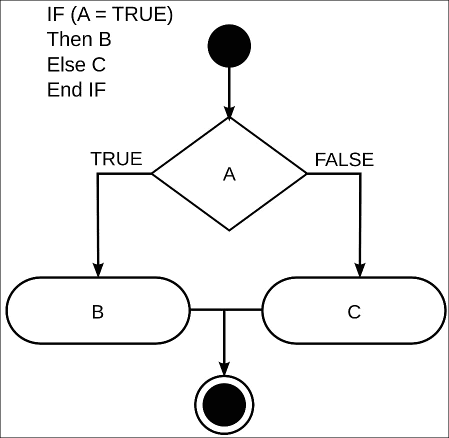
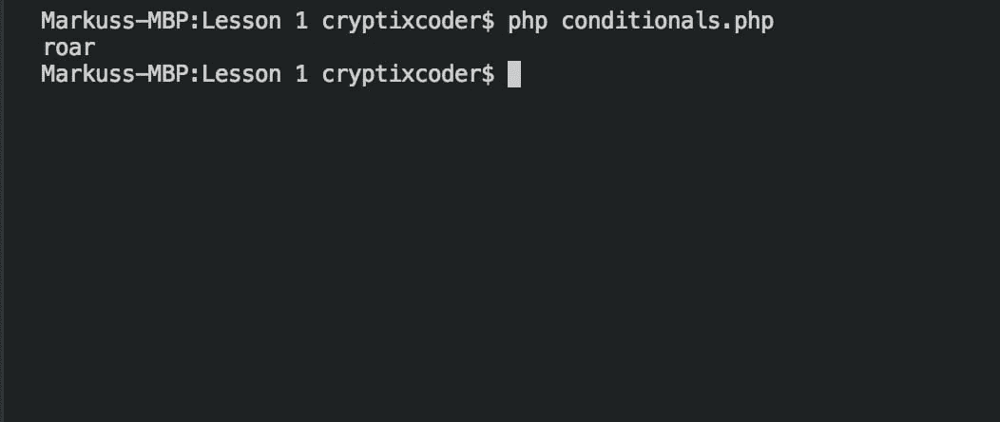

# 第 1 章 PHP 入门

PHP，或称预处理器超文本，是一种编程语言，用于设计 web 应用程序，使网站看起来更直观、更有趣。多年来，PHP 作为服务器端脚本语言也得到了广泛的应用。PHP 是一种易于使用但功能强大的语言。PHP 在多个操作系统上工作，可以支持多个服务器。PHP 的所有这些特性使其成为 web 设计语言的理想候选者。

本书将带您了解 PHP 的基础知识，包括声明语法、声明和使用变量和数据类型、运算符和条件。然后将介绍构建 PHP 框架以及构建自己的 PHP web 应用程序的原则。

在本章中，您将开始学习 PHP 编程语言的构建块。我们将介绍语法以及如何在 PHP 中声明和使用变量。我们还将研究如何使用`if`语句控制执行流。

到本章结束时，您应该能够使用这些元素编写简单的程序。

在本章结束时，您将能够：

*   使用 PHP 的基本语法编写简单的程序
*   对不同的数据使用变量，并使用不同的运算符对其进行操作
*   使用条件控制执行流

# 基础

我们将从 PHP 语法和执行第一个文件开始我们的旅程。让我们开始吧。

在 PHP 中，语法非常重要；您的服务器需要正确的语法才能知道应该从哪里开始解析 PHP，您必须通过打开和关闭 PHP 标记来显示它，如下所示：

```php
<?php

?>
```

通过使用 PHP 标记，您可以在文档中的任何位置添加代码。这意味着，如果您有一个 HTML 网站，您只需添加标记和一些 PHP 代码，它就会处理。除了使用 open 和 close PHP 标记外，还必须在文件中使用 `.php`扩展名。

让我们从一个简单的例子开始。

## 使用 PHP 显示“Hello World”

在本节中，我们将使用到目前为止学到的知识向用户显示字符串：

1.  打开代码编辑器。
2.  创建新文件并将其命名为`syntax.php.`
3.  输入以下内容并保存您的文档：

    ```php
    <?php

    ?>
    ```

4.  在**终端打开您的工作目录。**
5.  Type the following command:

    ```php
    php syntax.php
    ```

    

6.  切换回您的文档并输入以下内容：

    ```php
    <?php 
         echo "Hello World";
    ?>
    ```

7.  返回终端并键入以下内容：

    ```php
    php syntax.php
    ```

你应该现在看到屏幕上打印的字符串“Hello World”。

## 变量和数据类型

为了开始学习 PHP，我们必须首先了解用于构建每个项目的核心构建块。在我们的应用程序中，我们总是需要一种临时存储数据的方法（在我们的例子中，我们称存储方法为变量）。

变量定义如下：

```php
$VARIABLENAME = "VALUE";
```

正如您在前面的示例中所看到的，变量开始时使用`$`符号，后跟名称，然后使用赋值运算符赋值。这里，我们有一个名为`VARIABLENAME,`的变量，字符串值为`VALUE`。

### 注

变量名不能以数字或特殊符号开头，除了用来定义变量本身的`$`符号。

PHP 是为数不多的在赋值之前不需要声明数据类型的语言之一。

<colgroup class="calibre16"><col class="calibre17"> <col class="calibre17"></colgroup> 
| **类型** | **示例** |
| 一串 | “你好，世界” |
| 数字 | 123 |
| 浮动 | 1.095 |
| 布尔值 | 真假 |

我们现在将尝试在 PHP 中实现变量。

## 处理变量

在本节中，我们将演示一个在程序中使用变量的真实示例。我们将首先创建一个变量来存储用户名：

1.  打开代码编辑器。
2.  创建新文件并将其命名为`variables.php.`
3.  输入以下内容并保存您的文档：

    ```php
    <?php
    	$name = "John Doe";
    	$age = 25;
    	$hourlyRate = 10.50;
    	$hours = 40;
    	echo $name . " is " . $age . " years old.\n";
    	echo $name . " makes $" . $hourlyRate . " an hour. \n";
    	echo $name . " worked " . $hours . " this week. \n";
    ?>

    ```

4.  在终端中打开您的工作目录。
5.  Enter the following command, and then press *Enter*:

    

    ### 注

    将变量值插入字符串的另一种方法是使用以下特殊语法：

    ```php
    <?php
    echo "My name is ${$name}.";
    ?>
    ```

## 操作员

现在我们来看看 PHP 中可用的各种操作符。

### 比较运算符

在变量的部分，我们看到了=符号，在 PHP 中，它是被称为赋值运算符。此运算符完全按照名称的含义执行操作，允许您为变量指定一个值。第一个运算符称为比较运算符。比较运算符允许您在给定的条件情况下比较两个值。

比较运算符集的内部是相等、相同、不相等、不相同、小于和大于运算符。

<colgroup class="calibre16"><col class="calibre17"> <col class="calibre17"></colgroup> 
| 用法 | 名称 | 描述 |
| --- | --- | --- |
| `$a == $b` | 相同的 | 如果`$a`等于`$b.`，则为真 |
| `$a === $b` | 完全相同的 | 如果$a 等于`$b`，并且它们属于相同类型，则为 TRUE。 |
| `$a!= $b` | 不相上下 | 如果`$a`不等于`$b`，则为 TRUE。 |
| `$a!== $b` | 不完全相同 | 如果`$a`不等于`$b`，或者它们不是同一类型，则为 TRUE。 |
| `$a < $b` | 少于 | 如果`$a`严格小于`$b`，则为 TRUE。 |
| `$a > $b` | 大于 | 如果`$a`严格大于`$b`，则为真。 |
| `$a <= $b` | 小于或等于 | 如果`$a`小于或等于`$b`，则为真。 |
| `$a >= $b` | 大于或等于 | 如果`$a`大于或等于`$b`，则为真。 |

### 逻辑运算符

接下来是逻辑运算符。逻辑运算符用于一次检查多个案例。这组逻辑运算符提供了`NOT`、`AND`和`OR`运算符。

<colgroup class="calibre16"><col class="calibre17"> <col class="calibre17"></colgroup> 
| 用法 | 名称 | 描述 |
| --- | --- | --- |
| `! $a` | 不 | 如果`$a`为非真，则为真。 |
| `$a && $b` | 和 | 如果`$a`和`$b`均为真，则为真。 |
| `$a &#124;&#124; $b` | 或 | 如果`$a`或`$b`为真，则为真。 |

### 数学运算符

在你的程序中，你有时需要做一点数学；这就是数学运算符的用武之地。它们让你能够加、减、乘、除，并得到两个除数的余数。

<colgroup class="calibre16"><col class="calibre17"> <col class="calibre17"></colgroup> 
| 用法 | 名称 | 描述 |
| --- | --- | --- |
| `$a + $b` | 附加 | `$a`与`$b`之和 |
| `$a - $b` | 扣除 | `$a`与`$b`的差异 |
| `$a * $b` | 乘法 | `$a`与`$b`的乘积 |
| `$a / $b` | 分开 | `$a`和`$b`的商 |
| `$a % $b` | 模数 | `$a`的余数除以`$b` |

让我们试着在 PHP 中使用这些操作符。

## 组合变量和运算符

在本节中，我们将扩展前面的示例以计算用户的年薪。以下是我们的步骤：

1.  打开代码编辑器。
2.  创建新文件并将其命名为`operators.php.`
3.  要开始，请复制我们`variables.php`文档中的内容。
4.  现在，我们将向文档中添加一个附加变量，该变量将保存周数：

    ```php
    $weeks = 52;
    ```

5.  接下来，我们将使用乘法运算符计算我们的周工资，并将其分配给一个新变量：

    ```php
    $weeklyPay = $hourlyRate * $hours;
    ```

6.  现在，根据我们的周工资率，我们可以计算我们的工资：

    ```php
    $salary = $weeks * $weeklyPay;
    ```

7.  Our last step is to display our final calculations:

    ```php
    echo $name . " will make $" . $salary . " this year.\n";
    ```

    您的最终文档应如下所示：

    ```php
    <?php
    $name = "John Doe";
    $age = 25;
    $hourlyRate = 10.50;
    $hours = 40;
    echo $name . " is " . $age . " years 01d.\n";
    echo $name . " makes $" . $hourlyRate . " an hour. \n";
    echo $name . " worked " . $hours . " this week.\n";
    $weeks = 52;
    $weeklypay = $hourlyRate * $hours;
    $salary = $weeks * $weeklyPay;
    echo $name . " will make $" . $salary . "this year";
    ?>
    ```

8.  接下来，我们将在`Terminal`中打开目录并运行以下命令：

    ```php
    php operators.php
    ```

9.  We should now see our data being displayed:

    

## 条件句

既然我们有了一个运算符的基础，我们就可以开始使用它们，即所谓的条件句。条件语句允许您控制程序的流程，它们以`if`语句的形式出现。

一个基本的`if`陈述如下：

```php
if (conditional){

}
```

在括号内，您将保留在大括号内激活代码所需的条件。

此外，您还可以添加一条`else`语句，这将允许您在不满足条件时提供备用代码来运行：

```php
if(conditional){

}
else{
}
```



### 注

与条件句一起使用的一个有用函数是`empty`函数。`empty`函数用于检查变量是否为空

### 使用条件句

在本节中，我们将实现条件句，检查动物的名称，如果匹配，我们将打印特定动物的声音。

1.  打开代码编辑器。
2.  创建新文件并将其命名为`conditionals.php.`
3.  我们将首先添加打开和关闭`php`标记：

    ```php
    <?php
    ?>
    ```

4.  然后，我们将创建一个新函数来保存我们的动物名称：

    ```php
    <?php
    $animal = "cat";
    ?>
    ```

5.  现在，我们可以写出我们的第一个条件；在这里，我们要检查动物是否是猫，如果是猫，我们将向用户打印喵喵：

    ```php
    <?php
    	$animal = "cat";
    	if($animal == "cat"){
    	echo "meow\n";
    	}
    ?>
    ```

6.  保存文件并在终端中打开您的工作目录。
7.  Run the following command, and see the results:

    ```php
    php conditionals.php
    ```

    

8.  现在，我们将进一步扩展我们的条件语句，添加其他动物的声音，并将我们的动物更改为狮子：

    ```php
    $animal = "lion";
    if($animal == "cat"){
    echo "meow\n";

    }
    else if ($anima == "dog"){
    echo "woof\n";
    }

    else if($animal == "lion"){
    echo "roar\n";

    }

    else {
    echo "What does the fox say?\n";
    }

    ?>
    ```

9.  Now, let's save it again and run the command in the Terminal; you should get the following result:

    

## 活动：构建员工工资计算器

想象一下你是一家百货连锁店的 PHP 开发人员，该店正在为即将到来的黑色星期五大甩卖做准备。在销售时间工作的员工将得到一点半的时间，以及他们所有销售的 10%佣金。此外，如果他们的总销售额超过 1000 美元，他们将获得 1000 美元的奖金。管理层希望您创建一个计算器，使员工能够轻松计算他们的收入。

此活动的目的是帮助您理解变量和条件。

遵循以下步骤：

1.  创建一个新目录并将其命名为`salary_calculator`。
2.  在新目录中，创建一个`index.php`文件。
3.  定义占位符变量：

    ```php
    <?php

        $hourlyRate = 10.00;
        $hoursWorked = 12;
        $rateMultiplier = 1.5;
        $commissionRate = 0.10;
        $grossSales = 25.00;
        $bonus = 0;
    ```

4.  我们下一步将定义我们的计算，并将结果分配给各自的变量：

    ```php
    $holidayRate = $hourlyRate * $rateMultiplier;
        $holidayPay = $holidayRate * $hoursWorked;
        $commission = $commissionRate * $grossSales;
    $salary = $holidayPay + $commission;
    ```

5.  接下来，我们需要检查销售总额变量，以查看该员工是否已赚超过 1000 美元，并将获得奖金：

    ```php
    if($grossSales >= 1000){
            $bonus = 1000;
    }
    ```

6.  现在我们有了默认利率和计算器，我们可以向用户显示结果：

    ```php
    echo "Salary $" . $salary . "\n";
        echo "Bonus +\$" . $commission . "\n";
        echo "-------------------------------\n";
        echo "Total  $" . ($salary + $commission) . "\n";
    ```

7.  员工现在所要做的就是更改小时工资和总销售额的值，并运行该程序以获得他们的总工资金额。

# 总结

我们现在已经到了本章的结尾。在本章中，我们从 PHP 语法开始。然后我们继续讨论 PHP 中使用的变量和不同的运算符。最后，我们了解了如何实现条件和控制执行流。

现在，您应该清楚地了解变量、数据类型和条件，以及它们是如何一起使用的。在下一章中，您将了解如何在 PHP 中实现数组和循环。