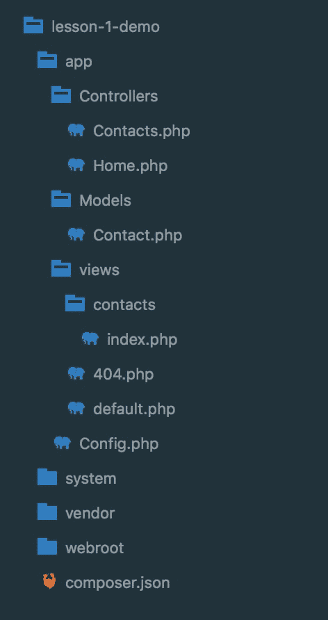
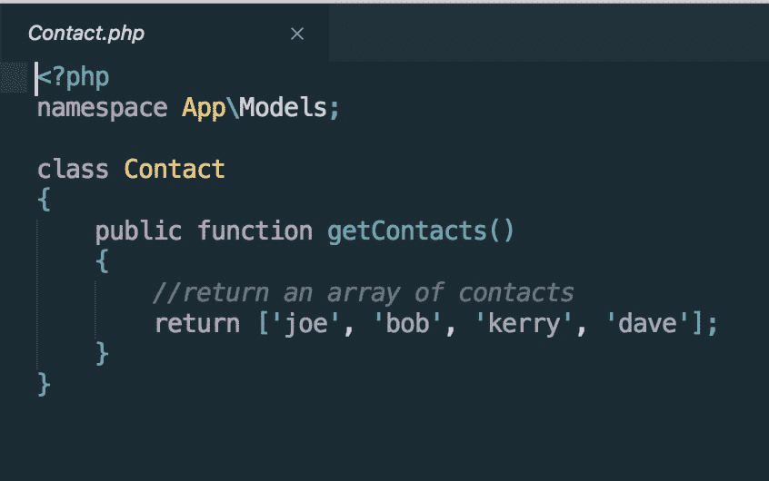
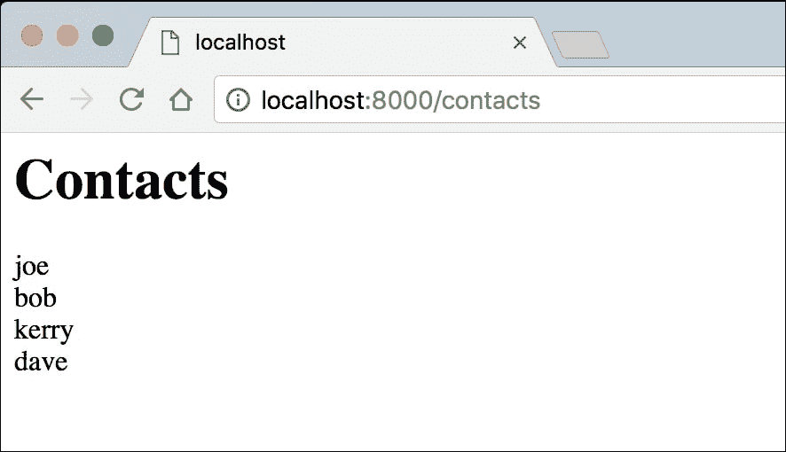

# 第五章：构建 PHP Web 应用程序

在上一章中，我们学习了如何接受用户的输入，以及如何通过 PHP 访问它。我们还学习了使用 MySQL 数据库的基础知识，并将前几章的所有原则应用到一个通过 web 表单向数据库添加用户的迷你应用程序中。

在本章中，我们将在一个框架中学习和应用 OOP 概念。我们将使用 Whoops 库介绍错误报告，并将学习如何处理这些错误。我们还将介绍如何在一个框架中管理和构造我们的应用程序。

在本章结束时，您将能够：

*   在框架环境中应用 OOP 概念
*   构造文件和文件夹以形成框架
*   描述框架如何与数据源交互
*   使用 MVC 设计模式构建框架
*   构建 CRM 应用程序以管理框架上的联系人

构建应用程序需要我们了解底层框架，以及如何使用 MVC 架构风格构建应用程序。PHP 框架是一个文件夹和文件的集合，旨在促进代码重用；文件夹和文件提供了一个公共代码库，用于在其上构建应用程序。通过这些章节，您将学习如何构建这样一个框架。

我们将在本书中使用的一种常见的设计模式称为 CRUD—一个缩写词，意思是：

*   **创建**：新建 MySQL 记录
*   **读取**：从数据库中读取记录
*   **更新**：更新 MySQL 记录
*   **删除：**删除 MySQL 记录

CRUD 是构建在框架中的任何实际应用程序的核心。几乎所有的东西都可以分解成积垢。

CRUD 的一个例子将涉及创建新内容、阅读内容以及更新和删除内容的提示。

我们将使用称为模型-视图-控制器（MVC）的设计模式，这是一种构建框架所基于的目录和文件的方法。将使用 MVC 结构显示结构和示例：


模型视图控制器（MVC）的一种表示形式

PHP 标准推荐（PSR）为您的代码设置格式指南，允许与您可能接触到的其他代码实现最大兼容性：[http://www.php-fig.org/psr/](http://www.php-fig.org/psr/) 。

# 框架环境中的 OOP 概念

在开始学习如何构建框架之前，对 PHP 面向对象编程（OOP）概念有一个坚实的理解是一个好主意。所有 PHP 框架的一个共同点是，它们首先构建在 OOP PHP 之上；本质上，它们只是组织文件的一种方式。

我们将了解以下 OOP 概念：

*   名称空间
*   使用语句
*   类和对象
*   方法
*   访问修改函数

## 名称空间

名称空间可以比作文件夹结构。名称空间的主要目的是允许类具有相同的名称，但在不同的名称空间下。

名称空间区分大小写。名称空间应以大写字母开头，然后使用驼峰大小写-每个单词的开头应以小写字母开头，后面的每个单词应以大写字母开头。

例如：`mySpace`

例如，如果您有一个名为`Post`的类，并且在另一个文件夹中有一个名为`Post`的类。通常，您不能在同一个文件中使用这些类，因为这些类会相互冲突；但是，如果每个类都具有存储它们的文件夹的名称空间，则可以在同一文件中使用它们。

file1.txt 文件可以同时存在于`/home/packt and in /home/other`目录中，但 file1.txt 文件的两个副本不能同时存在于同一目录中。此外，要访问`/home/packt`目录之外的`file1.txt`，我们必须在文件名前加上目录名，使用目录分隔符获取`/home/packt/file1.txt`。同样的原则也适用于编程世界中的名称空间。

不能在同一文件中使用两个类，因为它们会相互冲突。要解决这个问题，可以为其中一个类指定一个别名。将别名视为该类的昵称。

名称空间引用了`app/controllers`目录中文件结构中的位置：名称空间`App\Controllers`是指向其位置的路径。请注意，在编写命名空间时使用了反斜杠字符：

```php
//valid namespace
namespace App\Controllers;
```

## 名称空间应用程序、控制器和使用语句

`Use`语句是导入类的一种方式，而不必手动将它们包含在类中。`use`语句与作曲家连用。

作为在类中使用`use`语句的示例，如果我们想要使用`Contact`模型，我们可以在类的顶部放置以下代码：

```php
use App\Models\Contact;
```

当您有一个名为`Contact`的类，该类的命名空间为`App\Models,`来导入它时，您可以使用`App\Models\Contact. Y`然后通过调用`Contact;` 来引用该类，您不必引用它的完整命名空间，因为它已经被导入了：

### 注

我们使用 composer 根据文件的名称空间自动加载文件，我们将在后面的章节中详细介绍这一点。

```php
//start with the namespace
namespace App\Controllers;
//add the use statement
use App\Models\Contact;
//make the call
$contact = new Contact();
```

## 使用名称空间定义类和对象

在上一章中，我们学习了如何创建类和对象。现在我们将看到如何使用名称空间创建类和对象。

对象是已实例化的类；例如，如果您查看上一个示例的最后一行，一个名为`contact`的类已通过使用新运算符（后跟类名）实例化。这创造了一个新的对象；这意味着新对象可以访问类的所有方法和公共属性：

```php
//start with the namespace
namespace App\Controllers;

//add the use statement
use App\Models\Contact;

//make the call
$contact = new Contact();

//make a call to a getContacts method that exists within the contact class
$contact->getContacts();
```

## 方法

方法是驻留在类内部的函数。实际上，方法和函数之间唯一的区别是命名约定，以及方法恰好位于类内部。

方法用于检索信息并将信息传递给类或从类传递信息，以及将信息传递给实例化该类的文件：

```php
//start with a namespace
namespace App\Models;

//here is an example of a method being defined, in the previous example the method was being called.
class Contact
{
    public function getContacts()
{
                        //get data here
    }
}
```

## 访问修饰符

访问修饰符是授予和限制对类的属性和方法的访问的一种方式。有三个访问修饰符：`public`、`protected,`和`private`。这些可以与让数据进入或阻止数据进入的把关人相比较：

*   **Public**

    将属性或方法定义为`public`意味着类、扩展类和实例化类的文件都有权读写该方法或属性。

*   **Protected**

    `protected`方法或属性只能由类或扩展类访问。

*   **Private**

    `private`属性或方法只能从定义它的类中访问。

    ### 注

    `private`属性不能从该类外部访问，也不能从扩展类访问。

    以下是如何使用各种访问修饰符的示例。在定义名为`$token:`的属性时，您将看到正在使用的`public`、`protected`和`private`属性

    ```php
    public $token;
    protected $token;
    private $token;

    ```

    

    文件夹结构

    **说明：**

    我们这里有的是框架的文件结构，我们将在接下来的几章中构建：

    *   **应用程序**文件夹是存放您的应用程序的地方。**应用程序**保存您的控制器、模型和视图。如前所述，这是 MVC 结构的一部分。
    *   **配置**文件是存储站点名称和数据库凭据的地方。
    *   **系统**文件夹保存框架的核心文件。
    *   **供应商**目录是 composer 目录，包含通过 composer 安装的任何第三方软件包。它还存储作曲家本身。
    *   **webroot**文件夹是您的文档根目录；这是您的浏览器读取的内容。

    在本章后面，我们将介绍一个名为 MVC 的设计模式。

    下面的示例使用此设计模式，它只是组织文件结构的一种方式。

    在本例中，我们将从已实例化的类中传递单个联系人的详细信息，并将其显示在浏览器中。

    现在，请注意每个文件中是如何使用每个 OOP 原则的，并查看您认识到了什么。

    ### 注

    这段代码不能像普通 PHP 那样工作，因为需要框架的结构。本书将教你这些组件如何（以及为什么）以它们的方式一起工作。显示此示例的目的是查看 OOP 概念在框架设置中的作用。

    以下为控制器示例：

    

    联系人控制器

    首先，有一个`namespace`，这是作曲家知道如何加载文件的方式。如果没有 composer，则需要使用称为延迟加载的`include`或`require`手动包含，以防止加载不相关的文件并提高性能。

    在`namespace`和`use`语句之后是类定义（类的蓝图）。在这里，我们将类命名为`Contacts,`，并扩展已经存在的功能`BaseController`类：

    

    接触模型

    **说明：**

    这里看到的文件就是模型；`Contact`模型在前面的示例中被实例化。

    同样，模型包含一个`namespace.`

    不需要`use`语句，如本例所示，数据包含在类定义中。

    如果数据存储在数据库或其他数据源中，则类需要扩展`BaseModel`：

    

    联系人视图

    视图中使用最小 PHP；数据通常传递到数组或变量中的视图，并且样式是指定的：

    

    浏览器视图

    ### 注

    在您作为开发人员的早期，您可能会发现您经常忘记使用分号；事实上，我们的一位书籍创作者 David 经常回忆起，他曾经花了将近两天的时间试图解决第一个项目中的一个 bug，结果却发现问题是缺少一个分号。

    在框架环境中工作时，忘记使用正确的大小写可能很像忘记使用分号。

    事实并非如此；您可以使用名为 PHP linters 的软件专家附加组件来检查是否存在诸如忘记使用正确的案例之类的问题。PHP linter 在运行脚本之前突出显示代码。您可以在诸如 PHP Storm 之类的 IDE 中，或者在诸如 Sublime text 或 Atom 之类的文本编辑器中找到这样的附加组件：

    *   [https://www.jetbrains.com/phpstorm/](https://www.jetbrains.com/phpstorm/) 由 Jet Brains 制造
    *   [https://www.sublimetext.com/](https://www.sublimetext.com/) 崇高总部制造
    *   [https://atom.io/](https://atom.io/) 由原子制造

# 框架结构

在其核心，MVC 是一个分离的关注点，因此所有数据源都来自模型或数据库资源。控制器控制应用程序的流程，并驻留在控制器目录中。所有标记都位于视图中。它们一起构成了模型-视图-控制器（MVC）设计模式。


框架文件夹和文件结构

如果您需要修改一个数据源，您知道如何转到模型进行修改；如果你想改变它的外观，你知道去查看；要更改应用程序的控制，请转到控制器。

### 注

注意，该模型不限于从数据库中提取数据；这是一种常见的误解。我们前面的例子强调了这一点。

模型中的其他数据源可以是静态数据或从文件或 RSS 等外部提要读取的数据。

**说明：**

当使用框架时，大部分应用程序将使用 MVC 设计模式构建。

模型和控制器都将扩展存储在系统目录中的`BaseModel`和`BaseController`的功能。您可能不需要经常更改这些。任何构建在框架之上的应用程序都将主要包含在`App`目录中存储的模型、控制器和视图目录中：


联系人控制器

此处，控制器正在与模型通信。该模型为控制器提供数据源。控制器是结构的大脑，在这里，它是一系列关于何时为数据源服务以及如何在什么条件下工作的指令。

contact 类有一个函数，当用户访问某个 URI 时将调用该函数（这是如何工作的，以及为什么工作，将在后面的章节中介绍）；这将启动与模型的联系。

在此示例中，控制器不关心数据源中包含的内容；但是，可以对其进行编程以检查这些数据。

控制器获取数据后，存储并传递给视图：


接触模型

**说明：**

联系人模型有一个包含应用程序知识的数据源，但它本身无法利用这些知识。它只能为管理知识提供指导。CRUD 原则在模型中发挥作用，在模型中有创建、读取、更新和删除模型知识源的方法。

在本例中，数据源是一个名称数组：


联系人视图

在视图文件中，您将看到数据是按服务的方式获取的；在本例中，为视图提供一个名称数组。这些名称是完整的，显示时应用了任何标记和样式。

在一个框架中，视图是更广泛结构的一部分，它在 web 应用程序中应用全局元素，如页眉和页脚，以及 CSS 和 JavaScript 文件。

可以在阵列中循环，但如果可能，所有处理都应在控制器中完成。


浏览器视图

您已经确定了如何在 MVC 框架示例中使用 OOP 原则。

现在，让我们把这些原则中的一些付诸实践。

## 活动：将联系人添加到目录

您需要将联系人添加到您正在创建的目录中，并存储为名称数组。应用程序应在请求时返回一组联系人。

这样做的原因是为了更好地全面了解如何在实际应用中使用 OOP。

按照以下步骤执行此活动：

1.  创建目录结构。
2.  创建一个名为`Contacts.`的目录
3.  在此目录中，创建一个名为`App.`的目录
4.  在`App`目录中，再创建三个目录：
    *   `Models`
    *   `views`
    *   `Controllers`
5.  在模型目录中，创建一个名为`Contact.php`的文件。
    1.  在`Contact.php`文件中，打开 PHP，创建名称空间：

        ```php
        <?php namespace App\Models;
        ```

    2.  定义一个名为`Contact`：

        ```php
        class Contact 
        {
        }
        ```

        的类
    3.  在这个类中，定义一个名为`getContacts();`的公共方法，它应该返回一个名称数组：

        ```php
        class Contact
        {
            public function getContacts()
        {
                return ['joe', 'bob', 'kerry', 'dave'];
            }
        }
        ```

6.  在控制器目录中，创建一个名为`Contacts.php`的文件。
7.  在`Contacts.php`文件中，打开 PHP，添加`namespace:`

    ```php
    <?php namespace App\Controllers;
    ```

8.  导入带有`use`语句的联系人模型：

    ```php
    use App\Models\Contact;
    ```

9.  An alias may be used in this scenario, written as follows (assuming that an alias for Contact would be `Name`):

    ```php
    Use App\Models\Contact as Name;
    ```

    定义名为 Contacts 的类：

    ```php
    class Contacts 
    {
    }
    ```

10.  创建一个名为`index()`的公共函数，在该方法中，创建一个名为`contacts`的局部变量，并创建`contact`类的新实例（这称为类的实例化）：

    ```php
    class Contacts 
    {
        public function index()
        {
            $contact = new Contact();
        }
    }
    ```

11.  使用赋值运算符创建一个名为`contacts`的局部变量，调用您在上一步中创建实例的`contacts`对象，添加->（这称为箭头符号），并调用方法`getContacts():`

    ```php
    public function index()
    {
        $contact = new Contact();
        $contacts = $contact->getContacts();
    }
    ```

# 总结

在本章中，我们创建了一个模型和一个控制器，其中控制器`Contacts`类实例化了模型`Contact`类。为了实现这一点，我们创建了一个基本的 MVC 文件夹结构，将控件与数据源分离。我们成功地使用了一个`namespace`、一个`use`语句、一个方法、一个访问修饰符、一个对象和一个类。我们现在看到了框架的力量。

在下一章中，您将创建自己的工作框架。我们将研究如何建立一个项目开发环境、优雅的错误报告以及如何使用 Whoops 库进行处理。我们还将实现配置类、默认类以及如何设置路由。