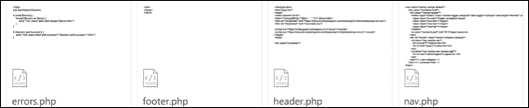
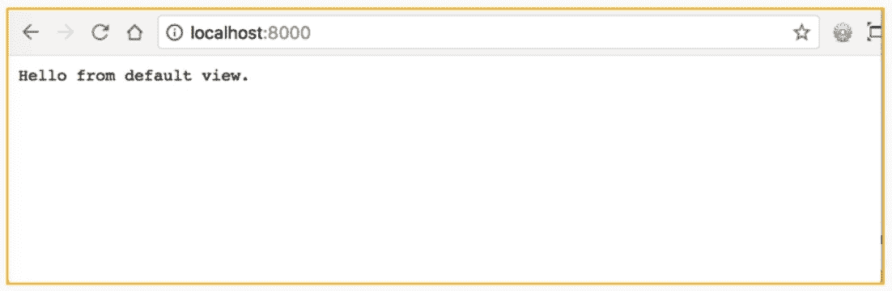
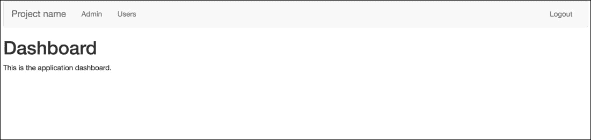

# 七、认证与用户管理

在上一章中，我们更好地理解了`database`类在项目中所扮演的角色，开发人员每次与数据库交互时都会用到这个角色。

我们使用的唯一一个库是 Whoops，它将以可读的格式显示错误。我们还获得了构建默认状态的经验，包括`baseController`和`baseMethod`。

在本章中，我们将重点关注项目的安全方面，即身份验证。我们将构建与数据库交互的登录表单，以验证用户的身份。最后，我们将介绍如何在应用中设置密码恢复机制。

在本章结束时，您将能够：

*   为其应用生成默认视图
*   建立密码管理和重置系统
*   为系统应用内的模块构建 CRUD

# 设置路径和包含引导

在本节中，我们将继续在框架之上构建功能。核心框架系统文件已到位。此设置用于在此基础上构建有用的功能。

我们将构建认证系统并完成应用构建。需要身份验证以防止未经授权的用户访问。这确保只有具有有效用户名和密码的用户才能登录到我们的应用。

### 注

在本章中，我们将介绍身份验证。请注意，本课程中使用的所有示例的登录用户名和密码如下：

用户名：`demo`

密码：`demo`

## 设置路径并创建文件目录的绝对路径

相对路径是相对于当前文件夹路径的路径，例如。`/css`指向一个文件夹向上进入`css`文件夹的相对路径。

绝对路径是指向文件或文件夹的完整路径，如`/user/projects/mvc/css.`

这很重要，因为这将允许使用框架系统中任何位置的绝对路径包含文件。这是对系统中现有代码的自适应。

例如：

```php
$filepath = "../app/views/$path.php";
```

这就变成了：

```php
$filepath = APPDIR."views/$path.php";
```

此建立在当前概念的基础上，允许将视图组织到子文件夹中。如果没有这种调整，就不可能将任何内容组织到子文件夹中，这将妨碍保持代码的整洁组织。

在没有这些更改的情况下，可以继续构建系统，但确保代码整洁有序始终是一个好主意。

## 创建布局文件

需要布局文件，以便显示任何错误。

此外，`header`、`footer`和`navigation`需要布局文件。一旦创建，这些文件将提供应在整个应用中引入的元素。这将包括全局元素。



### 注

错误用于验证，这将在下一小节中介绍，不要与解析错误或前面看到的类似错误混淆。这些步骤涉及的错误是与表单验证相关的错误，用户在表单字段中输入了不正确的信息。

## 包含引导

Bootstrap 是一个 HTML、CSS 和 JavaScript 库，在本章中，它将提供基本的样式。它对开发人员很有用，因为它可以帮助他们在设计人员将设计元素添加到应用之前对应用进行原型化和可视化。

在本项目中，Bootstrap 将作为一个**内容交付网络**（**CDN**包含在标题中。CDN 获取 web 上常见的资源并缓存它们以帮助提高性能。

### 注

这很容易与引导框架混淆。

Bootstrap、HTML、CSS 和 JavaScript 库以及 Bootstrap 的概念是两个不同的东西，它们具有相似的名称。

您可以通过访问以下链接找到有关引导的更多信息：[https://getbootstrap.com/](https://getbootstrap.com/) 。

# 包含引导和 HTML 标记

本节的目的是实现我们已经实现的通用样式，它显示了引导和 HTML 标记的包含：



路径中尚未解决的问题。到目前为止，我们一直在使用相对路径来包含文件，比如`system/View.php.`中的视图，让我们修复一下：

1.  Open `webroot/index.php` and add these lines after line 9:

    ```php
    defined('DS') || define('DS', DIRECTORY_SEPARATOR);
    define('APPDIR', realpath(__DIR__.'/../app/') .DS);
    define('SYSTEMDIR', realpath(__DIR__.'/../system/') .DS);
    define('PUBLICDIR', realpath(__DIR__) .DS);
    define('ROOTDIR', realpath(__DIR__.'/../') .DS);
    ```

    这些是可以在框架中的任何位置调用的常量。第一行定义目录分隔符，例如，`/`或`\`，具体取决于机器：

    *   `APPDIR`–指向`app`文件夹
    *   `SYSTEMDIR`–指向`system`文件夹
    *   `PUBLICDIR`–指向`webroot`文件夹
    *   `ROOTDIR`-指向`root`项目路径

    每一个都会创建到其端点的绝对路径。

2.  Now, let's fix the `View` class. Open `system/View.php,` and on line 24, replace:

    ```php
    $filepath = "../app/views/$path.php";
    ```

    与：

    ```php
    $filepath = APPDIR."views/$path.php";
    ```

    ### 注

    这允许视图包括来自父文件夹或子文件夹的其他视图，而不会出现任何问题。

3.  接下来，在`app/views.`内创建一个名为`layouts`的文件夹，在`app/views/layouts`内创建以下文件：
    *   `errors.php`
    *   `footer.php`
    *   `header.php`
    *   `nav.php`
    *   `errors.php`
4.  Open `errors.php` and enter the following code:

    ```php
    <?php
    use App\Helpers\Session;

    if (isset($errors)) {
        foreach($errors as $error) {
            echo "<div class='alert alert-danger'>$error</div>";
        }
    }

    if (Session::get('success')) {
        echo "<div class='alert alert-success'>".Session::pull('success')."</div>";
    }
    ```

    ### 注

    这包括一个会话助手，我们将很快创建它。

    第一条`if`语句检查`$errors`是否存在，如果存在，则退出循环并显示警报。这些类是`Bootstrap`类（我们将在`header.php`中提供）。

    下一个`if`语句检查名为`success,`的会话是否存在，如果存在，则显示其内容。这用于向用户提供反馈。

5.  Open `header.php` and enter the following code:

    ```php
    <!doctype html>
    <html lang="en">
    <head>
    <meta charset="utf-8">
    <title><?=(isset($title) ? $title.' - ' : '');?> Demo</
    title>
    <link rel="stylesheet" href="https://maxcdn.bootstrapcdn.com/bootstrap/3.3.6/css/bootstrap.min.css">
    <link rel="stylesheet" href="/css/style.css">

    <script src="https://code.jquery.com/jquery-2.2.4.min.js"></script>
    <script src="https://maxcdn.bootstrapcdn.com/bootstrap/3.3.6/js/bootstrap.min.js"></script>
    </head>
    <body>

    <div class="container">
    ```

    ### 注

    这将设置 HTML 文档，如果存在，还可以选择使用`$title,`。还包括引导 CDN CSS 和 JavaScript，以及 jQuery 和位于`webroot/css/style.css`中的自定义 style.CSS 文件–创建此文件。

6.  Now, open `footer.php` and close the container `div` and the `body` and `html` tags:

    ### 注

    有关完整的代码片段，请参阅代码文件文件夹中的`Lesson 7.php`文件。

    ```php
    </div>
    </body>
    </html>
    ```

7.  Now, open `nav.php` and enter the following code:

    ```php
    <nav class="navbar navbar-default">
    ……
          </div><!--/.nav-collapse -->
        </div><!--/.container-fluid -->
    </nav>
    ```

    ### 注

    这是用于引导的导航组件。这是一个干净的方式来为我们的管理页面带来一个响应菜单。请注意两个页面链接，分别是管理员和用户。我们还将提供一个注销链接。

8.  Now, open `app/views/404.php` and include the layout files:

    ```php
    <?php include(APPDIR.'views/layouts/header.php');?>
    404!
    <?php include(APPDIR.'views/layouts/footer.php');?>
    ```

    ### 注

    这将引入页眉并显示页面内容，最后包含页脚。

    这里不要包括`nav`。即使用户未登录，也可以显示 404。

    这为将常见布局组织到视图中提供了一种非常简洁的方法，这样当您需要更改全局元素时，布局视图就是它们的存储位置。

9.  Open the framework in the browser if it's not already running. Run the following command from Terminal when on the root:

    ```php
    php –S localhost:8000 –t webroot
    ```

    ### 注

    您不会注意到任何不同，但您将被重定向到一个不存在的页面：`http://localhost:8000/example`。

10.  You'll see a 404 page that includes the header and footer layouts. Look at the page source code – right-click and click on '`view page source`'. You should see the following output:

    ### 注

    有关完整的代码片段，请参阅代码文件文件夹中的`Lesson 7.php`文件。

    ```php
    <!doctype html>
    <html lang="en">
    <head>
    ……
    404!
    </div>
    </body>
    </html>
    ```

随着本章的深入，这些布局将变得更加明显。

在本节中，我们介绍了如何正确设置文件路径。我们讨论了如何正确设置引导，最后我们为错误和全局元素（如页眉、页脚、导航和错误）设置了视图。

在下一节中，我们将介绍如何为应用添加安全性并设置密码恢复。

# 增加项目安全性

在本节中，我们将继续在框架之上构建特性。核心框架系统文件已就位。

本节的目标是构建将为项目增加安全性的功能。我们将介绍在应用中维护良好安全性所需的各个方面。

## 帮手

在本小节中，我们将介绍`helpers.`

我们还将创建一个`URL``helper`和一个`session``helper`。这些将有助于身份验证以及系统的任何其他方面，但与身份验证没有直接关系。

会话助手是 PHP 会话的`wrapper`，包括开发人员在处理会话时有用的各种方法。

`URL``helper`非常相似，因为它是处理 URL 的有用方法。然而，在本书中，它要短得多，并且仅限于一种方法。

### 注

`session`是一种存储临时数据的方法，比如用户是否登录。

## 认证

现在，我们将构建身份验证功能。身份验证是一种仅允许具有正确凭据的人访问受限分区的方法。

这将涉及创建数据库表和模型：

*   在数据库中创建用户表
*   在应用模型中创建用户模型
*   添加插入、更新和删除方法

然后，我们将创建一个管理控制器，并导入 URL 和`session`助手以及`user`模型。

最后，我们将创建关联的视图。

### 仪表板

项目需要一个仪表盘；这就像一个项目的主页，需要登录，通常包括指向项目经常访问的内容的链接。在这个项目中，我们只需要确保仪表板有一个存在的文件，以便它可以被定向到它。您将创建仪表板视图，包括布局文件以及页眉、页脚、导航和错误。您将为页面结构添加 HTML。

### 登录

登录页面的创建也是本节的一部分。

在“登录”视图中，您将创建一个登录表单，并包括布局文件。

然后，他们将创建一个登录方法来处理登录过程：

*   该过程的一部分是使用 passwordhash 和 bcrypt 对密码进行散列
*   使用设计用于返回数据的 Get data 方法
*   除了创建视图和登录方法外，我们还将创建`logout`方法，并修改配置，使主页在默认情况下成为管理仪表板

### 密码散列

密码散列使用 bcrypt，这是可用的最强大的算法。目前，破解密码散列平均需要 12 年的时间。

该过程的一部分是验证数据，检查用户名和密码是否与数据库中存储的内容匹配。

密码散列是从您的密码创建一个字符串作为单向散列，任何用户都不能确定散列的原始内容。

### 注

密码散列不能与加密混淆。不同之处在于，在密码散列中，可以将散列后的密码解密为其原始状态。

# 在 PHP 中实现验证

在本节中，我们将看到以下结果。



### 注

本节展示了如何在 PHP 中实现验证，尽管它还不能正常工作，因为我们还没有创建和提供构成系统知识的数据源。

要作为本节的一部分解决此问题，我们将手动创建一个用户。

按照以下步骤在 PHP 中实现验证：

**创建助手：**

1.  Before we can start building the authentication, we need two new helpers. In `app/Helpers,` create a new file called `Url.php` and enter:

    ```php
    <?php namespace App\Helpers;

    class Url
    {
        public static function redirect($path = '/')
       {
            header('Location: '.$path);
            exit();
        }
    }
    ```

    ### 注

    这提供了一个名为 redirect 的方法，该方法默认为/当未传递任何参数时。这是重定向到应用另一页的简单方法。

    要在将类包含到页面中后使用该类，请使用：`Url::redirect('url/to/redirect/to')`

    要重定向到主页，请使用：

    `Url::redirect()`

    接下来，我们需要一种使用会话的方法。会话是 PHP 从一页到另一页跟踪数据的一种方式，这非常适合我们的需要，例如能够通过读取会话数据来检测用户是否登录。

    我们可以使用普通的$\u 会话调用，但是因为我们使用的是 OOP，所以让我们利用这一点构建一个会话助手。

2.  在`app/Helpers`内创建一个名为`Session.php`的文件。
3.  First, set the namespace and class definition:

    ### 注

    需要的第一种方法是确定会话是否已启动。如果更新了`sessionStarted`参数，则会将其设置为`false. This`并告知`init`方法开启会话：

    ```php
    <?php namespace App\Helpers;

    class Session
    {
        private static $sessionStarted = false;
    /**
     * if session has not started, start sessions
     */
    public static function init()
    {
        if (self::$sessionStarted == false) {
            session_start();
            self::$sessionStarted = true;
        }
    }
    ```

4.  接下来，创建一个名为`set`的方法，该方法接受两个参数`$key`和`$value.`，用于将`$key`添加到会话中，并将`$value`设置为`$key:`

    ```php
    public static function set($key, $value = false)
    {
        /**
         * Check whether session is set in array or not
         * If array then set all session key-values in foreach loop
         */
        if (is_array($key) && $value === false) {
            foreach ($key as $name => $value) {
                $_SESSION[$name] = $value;
            }
        } else {
            $_SESSION[$key] = $value;
        }
    }
    ```

5.  接下来，用一个参数创建一个名为`pull`的方法。这将从会话中提取`key`并在将其从会话中删除后返回，这对于一次性消息非常有用：

    ```php
    public static function pull($key)
    {
        $value = $_SESSION[$key];
        unset($_SESSION[$key]);
        return $value;
    }
    ```

6.  Next, create a get method. This will return a session from the provided key:

    ```php
    public static function get($key)
    {
        if (isset($_SESSION[$key])) {
            return $_SESSION[$key];
        }

        return false;
    }
    ```

    ### 注

    有时，您希望查看会话的内容。创建一个名为`display`的方法，该方法返回`$_SESSION`对象：

    ```php
    public static function display()
    {
        return $_SESSION;
    }
    ```

7.  The last method is used to destroy the session key when the `$key` is provided, otherwise the entire session will be destroyed:

    ```php
    public static function destroy($key = '')
    {
        if (self::$sessionStarted == true) {
            if (empty($key)) {
                session_unset();
                session_destroy();
            } else {
                unset($_SESSION[$key]);
            }
        }
    }
    ```

    完整的类如下所示：

    ### 注

    有关完整的代码片段，请参阅代码文件文件夹中的`Lesson 7.php`文件。

    ```php
    <?php namespace App\Helpers;

    class Session
    {
        private static $sessionStarted = false;
    ……..
        }

    }
    ```

8.  Now, we need to set sessions automatically when the application runs. We do this by adding `Session::init()` inside `app/Config.php`:

    ### 注

    这使用了一个`Use`语句，包括对`session's``helper`类的调用。在这个阶段，突出这些 OOP 特性可能是有益的。

    有关完整的代码片段，请参阅代码文件文件夹中的`Lesson 7.php`文件。

    ```php
    <?php namespace App;

    use App\Helpers\Session;

    class Config {
    …….
            ];
        }
    }
    ```

**楼宇认证：**

我们现在已经准备好开始构建管理员控制器和用户模型，这将是用户登录的入口点。

1.  Create a new table in your database called users:

    ```php
    CREATE TABLE `users` (
      `id` int(11) unsigned NOT NULL AUTO_INCREMENT,
      `username` varchar(255) DEFAULT NULL,
      `email` varchar(255) DEFAULT NULL,
      `password` varchar(255) DEFAULT NULL,
      `created_at` datetime DEFAULT NULL,
      `reset_token` varchar(255) DEFAULT NULL,
      PRIMARY KEY (`id`)
    ) ENGINE=InnoDB DEFAULT CHARSET=utf8;
    ```

    ### 注

    ID 是`primary`键，将设置为自动递增，这意味着每条记录都有一个唯一的 ID。

    `reset`令牌仅在需要重置密码程序时使用。

2.  让我们从模型开始。在`app\Models`内创建一个名为`User.php`的文件。
3.  Set the namespace and import the base Model and set the class definition.

    ### 注

    我们将回到这个模型，并根据需要添加必要的方法。

4.  Add methods for inserting, updating, and deleting records:

    ### 注

    有关完整的代码片段，请参阅代码文件文件夹中的`Lesson 7.php`文件。

    ```php
    <?php namespace App\Models;
    …….
        {
            $this->db->delete('users', $where);
        }
    }
    ```

**创建管理控制器：**

1.  Now, create a new file in `app/Controllers` called `Admin.php`.

    这将是登录和退出管理仪表板的入口点。

2.  设置名称空间，导入`baseController`和`Session`和`URL``helpers`以及`User`模型。
3.  Set the class definition and create a property called `$user.` Then, in the `__construct` method, initialize the `User` Model by calling `new User().`

    ### 注

    这意味着要访问用户模型的任何方法，都可以使用`$this->user`。

    下一种方法是`index()`。只要用户登录，就会加载仪表板视图。

4.  To ensure that the user is logged in, an `if` statement is run to check for the existence of a session key called `logged_jn,` which is set only after logging in. If the user is not logged in, then redirect them to the `login` method:

    ### 注

    有关完整的代码片段，请参阅代码文件文件夹中的`Lesson 7.php`文件。

    ```php
    <?php namespace App\Controllers;

    use System\BaseController;
    ……..
            $this->view->render('admin/index', compact('title'));
        }

    }
    ```

5.  If the user is logged in, then the `admin/index` view will be loaded. Create the view `app/views/admin/index.php` and the entry:

    ```php
    <?php
    include(APPDIR.'views/layouts/header.php');
    include(APPDIR.'views/layouts/nav.php');
    include(APPDIR.'views/layouts/errors.php');
    ?>

    <h1>Dashboard</h1>
    <p>This is the application dashboard.</p>

    <?php include(APPDIR.'views/layouts/footer.php');?>
    ```

    现在，我们需要创建一个`login`视图。在`app/views/admin`内创建名为`auth`的文件夹，并创建`login.php.`

6.  首先，包括`header`布局，然后创建一个调用方为`wrapper`和`well`的`div`。`well`类是一个引导类，它提供了灰色的正方形样式。`wrapper`类将用于定位`div`。
7.  接下来，包括布局以捕获任何错误或消息。
8.  现在，我们将创建一个表单，该表单将有一个方法`post`将其内容发布到`ACTION URL,`，在本例中为`/admin/login`。
9.  Then, create two inputs for the `username` and `password.` Make sure the input type for password is set to `password`.

    ### 注

    将输入类型设置为`password`将停止在屏幕上显示密码。

    提交表单时，输入的命名属性是 PHP 了解数据的方式。

    提交表单还需要提交按钮。一个好的做法是，如果用户记不起他们的登录详细信息，则提供重置选项。我们将创建一个链接，将用户指向`/admin/reset`。

10.  Finally, close the form and include the footer layout:

    ### 注

    有关完整的代码片段，请参阅代码文件文件夹中的`Lesson 7.php`文件。

    ```php
    <?php include(APPDIR.'views/layouts/header.php');?>

    <div class="wrapper well">

        <?php include(APPDIR.'views/layouts/errors.php');?>
    …….
    .wrapper h1 {
        margin-top: 0px;
        font-size: 25px;
    }
    ```

11.  Now, go back to the admin Controller and create a `login` method:

    ### 注

    检查用户是否已登录，以重定向用户。当他们已经登录时，他们应该无法看到登录页面。

12.  Inside the `login` method, create an empty `$errors` array and set the page `$title` and `load` a view calling `admin/auth/login,` passing the `$title` and `$errors` variables by using a `compact` function.

    ### 注

    `compact()`只需输入变量名称而无需输入`$:`即可使用变量

    ```php
    public function login()
    {
        if (Session::get('logged_in')) {
            Url::redirect('/admin');
        }

        $errors = [];

        $title = 'Login';

        $this->view->render('admin/auth/login', compact('title', 'errors'));
    }
    ```

    这将加载`login`视图，在按下 submit 时，实际上不会执行任何操作。我们需要检查提交的表单，但在此之前，我们需要在`user`模型中添加两种方法：

    ```php
    public function get_hash($username)
    {
        $data = $this->db->select('password FROM users WHERE username = :username', [':username' => $username]);
       return (isset($data[0]->password) ? $data[0]->password : null);
    }
    ```

    `get_hash($username)`将从`users`表中选择`password`，其中`username`与提供的匹配。

    设置`username = :username`将创建一个占位符。然后，['`:username' => $username`将使用该占位符，以便它知道值将是什么。

    然后检查`$data[0]->password`是否设置并返回。否则返回`null`。

13.  只在这一次对`get_data(),`再次执行相同的操作，返回一个数据数组而不是一列：

    ```php
    public function get_data($username)
    {
        $data = $this->db->select('* FROM users WHERE username = :username', [':username' => $username]);
        return (isset($data[0]) ? $data[0] : null);
    }
    ```

14.  现在，在我们的`login`方法中，我们可以通过检查`$_POST`数组是否包含名为`submit.`的对象来检查表单是否已提交
15.  Then, collect the form data and store them on local variables. Using `htmlspecialchars()` is a security measure, since it stops script tags from being able to be executed and renders them as plaintext.

    ### 注

    接下来，运行一个调用`password_verify(),`的`if`语句，该语句是一个内置函数，返回`true`或`false`。第一个参数是用户提供的`$password,`，第二个参数是通过调用`$this->user->get_hash($username)`从数据库返回的哈希密码。只要`password_verify`等于`false,`，登录检查就失败了。

16.  设置一个`$errors`变量以包含`errors`消息。接下来，计算`$errors`和，如果它等于`0,`，这意味着没有错误，所以从`$this->user->get_data($username).`获取用户数据，然后使用会话助手创建一个名为`logged_in`的会话密钥，其值为`true,`，另一个会话密钥的值为用户 ID。
17.  Finally, redirect the user to the admin `index` page:

    ```php
    if (isset($_POST['submit'])) {
                $username = htmlspecialchars($_POST['username']);
               $password = htmlspecialchars($_POST['password']);
               if (password_verify($password, $this->user->get_hash($username)) == false) {
                    $errors[] = 'Wrong username or password';
                }
                if (count($errors) == 0) {
                    //logged in
                    $data = $this->user->get_data($username);
                    Session::set('logged_in', true);
                    Session::set('user_id', $data->id);

                    Url::redirect('/admin');
                }
            }
    ```

    完整方法如下所示：

    ```php
    public function login()
    {
        if (Session::get('logged_in')) {
            Url::redirect('/admin');
        }
    ……
        $this->view->render('admin/auth/login', compact('title', 'errors'));
    }
    ```

18.  如果框架尚未运行，则运行该框架：

    ```php
    php –S localhost:8000 –t webroot
    ```

19.  Go to `http://localhost:8000/admin/login.`

    ### 注

    您将看到一个登录页面。无论您输入什么，按 login 将显示一条错误消息“【T0]”，因为数据库中当前没有用户。

20.  Let's create our login. We need a hashed password to store in the database. To create one in the `login` method, enter:

    ```php
    echo password_hash('demo', PASSWORD_BCRYPT);
    ```

    第一个参数是您想要的`password`，在本例中，`demo.`第二个参数是要使用的`PASSWORD`函数的类型。使用默认的`PASSWORD_ BCRYPT`意味着 PHP 将使用最强大的版本。

21.  当您刷新页面时，您将看到如下所示的哈希：

    ```php
    $2y$10$OAZK6znqAvV2fXS1BbYoVet3pC9dStWVFQGlrgEV4oz2GwJi0nKtC
    ```

22.  复制此记录并将新记录插入数据库客户端，并将 ID 列留空。这将使它自己变得更强大。
23.  创建一个`username and email`并粘贴到`hash. F`或密码中，为`created at`部分输入一个有效的`datetime`，如 2017-12-04 23:04:00。
24.  保存记录。现在，您将能够设置登录。
25.  Upon logging in, you'll be redirected to `/admin.`

    ### 注

    请记住注释掉或删除`echo password_hash('demo', PASSWORD_BCRYPT),`，否则哈希将始终显示。

26.  当我们开始的时候，让我们继续添加注销功能。注销是指破坏已登录和`user_id`会话的情况。在`Admin`控制器中，创建一个名为`logout`的新方法。
27.  在方法内部，销毁会话`object`，然后重定向到`login`页面：

    ```php
    public function logout()
    {
        Session::destroy();
        Url::redirect('/admin/login');
    }
    ```

28.  现在，返回应用并单击右上角的`logout`。您将注销并返回`login`页面。
29.  Now, log back in. If you click on the `Admin` link, you will be taken to the default page. In this case, it would be better to load the admin as soon as you load the application. We can do this by setting the `Admin` Controller to be the default `app/Config.php.`

    查找以下内容：

    ```php
    'default_controller' => 'Home'
    ```

    替换为：

    ```php
    'default_controller' => Admin,
    ```

30.  Now, if you click on `Admin` (after reloading the page), you'll see the admin dashboard.

    ### 注

    曾经有一段时间，密码哈希的某些标准被认为是互联网安全的最高级别。但是，与大多数技术一样，它不可避免地被提供，这削弱了其前身的有效性。

    ### 注

    由于以下哈希系统不安全，因此应不惜一切代价避免使用它们：

    *   MD5
    *   沙尔 1
    *   Shar 2 56

    这些密码散列功能很弱，计算机现在功能强大，只需几秒钟就可以破解它们。

    在开发人员确定新项目的范围时，最好对代码进行梳理，以检查是否存在安全缺陷，如使用这些缺陷。

在本节中，我们了解了身份验证过程。我们已经了解了如何进行登录过程。我们已经学习了密码散列的过程。现在，我们有了构建、配置和路由框架功能的经验。

在下一节中，我们将介绍密码恢复的概念，其中我们将在应用中设置重置密码的功能。

# 密码恢复

本节介绍如何设置重置密码的功能。密码重置非常重要，因为可能会出现用户忘记密码的情况。我们现在将构建一个密码恢复过程，类似于下图：


在 web 上找到的通用密码恢复示例

我们将在管理控制器中创建一个名为 reset 的方法。此过程加载一个视图，用户将在其中输入其电子邮件地址以请求电子邮件。在处理此问题时，将进行验证，以确保电子邮件地址有效且实际存在于系统中。

这将检查电子邮件，确保其格式正确，并检查提供的电子邮件地址是否存在于名为 users 的数据库表中。

## 第三方依赖 PHP 邮件程序介绍


来自 PHP Mailer 的图像：https://github.com/PHPMailer

我们将添加一个第三方依赖项，包括用于发送电子邮件的 PHP Mailer。

PHP Mailer 的工作原理如下：

1.  Provided that the validation had passed, we will then use PHP Mailer to send an email with a token. The token will later be received over email and entered into a hidden field as part of a form, fulfilling a requirement for the validation process.

    ### 注

    令牌只是一个随机的字母和数字字符串。其思想是为用户生成一些独特的东西，以识别来自他们的请求。

2.  该过程的下一部分是向用户发送电子邮件，当用户单击该电子邮件时，创建一个方法来处理该请求。这涉及到创建一个 ChangePassword 方法，该方法接受电子邮件提供的令牌，然后显示包含表单的视图。
3.  接下来，在视图中，将在隐藏字段中重新发送令牌。此外，用户可以输入新密码并确认此密码。提交后，控制器将处理数据并对其进行验证。这包括确保令牌与用户帐户匹配，密码足够长，并且两个密码都匹配。
4.  创建后，当更新付诸实施时，用户将能够自动登录到管理系统，而无需重新输入密码。

这就节省了用户在重置密码后必须登录的时间。从技术上讲，这是一个用户体验设计更新，尽管您可以在这里看到 UX 更改不仅仅局限于设计师领域。

### 注

PHP 邮件程序检查格式是否正确。在电子邮件的情况下，这将期望@符号出现。这只是验证检查的一个示例。PHP 内置了一些方法，以便确定正确的格式是有效的格式。

# 为我们的应用建立密码重置机制

为了完成认证系统，我们需要能够在忘记密码的情况下重置密码。以下是执行此操作的步骤：

1.  在`Admin`控制器中创建一个名为`reset`的新方法。
2.  再次检查用户是否已登录，如果已登录，请将其重定向回管理员。
3.  在加载名为`reset:`

    ```php
    public function reset()
    {
        if (Session::get('logged_in')) {
            Url::redirect('/admin');
        }

        $errors = [];

        $title = 'Reset Account';

        $this->view->render('admin/auth/reset', compact('title', 'errors'));
    }
    ```

    的视图之前，设置`errors`数组并设置页面标题
4.  Now create a view called `reset.php` in `app/views/admin/auth` and enter:

    ```php
    <?php include(APPDIR.'views/layouts/header.php');?>

    <div class="wrapper well">

        <?php include(APPDIR.'views/layouts/errors.php');?>

        <h1>Reset Account</h1>

        <form method="post">
    …
    …
        </div>

    <?php include(APPDIR.'views/layouts/footer.php');?>
    ```

    ### 注

    该表格将发布到相同的`url /admin/reset`。我们收集的唯一数据是电子邮件地址。电子邮件地址将用于在继续之前验证用户是否存在。

5.  现在，回到`Admin`控制器上的复位方法。
6.  首先，检查表单是否已提交和`isset`，并输入提交按钮名称：

    ```php
    if (isset($_POST['submit'])) {
    ```

7.  接下来，确保电子邮件地址为`isset,`，否则默认为`null.`检查电子邮件地址的格式是否正确：

    ```php
    $email = (isset($_POST['email']) ? $_POST['email'] : null);

    if (!filter_var($email, FILTER_VALIDATE_EMAIL)) {

        $errors[] = 'Please enter a valid email address';
    } else {
        if ($email != $this->user->get_user_email($email)){
            $errors[] = 'Email address not found';
        }
    }
    ```

8.  Lastly, check if the email address belongs to an existing user. To do this, create a new method in the user Model called `get_user_email($email)`:

    ### 注

    如果存在，则返回电子邮件地址，否则返回`null`。

    ```php
    public function get_user_email($email)
    {
        $data = $this->db->select('email from users where email = :email', [':email' => $email]);
        return (isset($data[0]->email) ? $data[0]->email : null);
    }
    ```

    在前面的控制器中，我们有：

    ```php
    if ($email != $this->user->get_user_email($email)){
    ```

    ### 注

    这将检查表单中提供的电子邮件地址是否与数据库不匹配，在这种情况下会创建新的错误。

9.  验证检查后，没有错误：

    ```php
    if (count($errors) == 0) {
    ```

10.  Save the file; the method so far looks like this:

    ### 注

    有关完整的代码片段，请参阅代码文件文件夹中的`Lesson 7.php`文件。

    ```php
    public function reset()
    {
    …….

        $this->view->render('admin/auth/reset', compact('title', 'errors'));
    }
    ```

    此时，除其他事项外，需要发送一封电子邮件。

    ### 注

    最佳做法是不使用 PHP 内置的`mail(``)`函数，而是使用`phpmailer`（[等库 https://github.com/PHPMailer/](https://github.com/PHPMailer/) 相反。

11.  打开需求列表中的`composer.json`和`phpmailer`：

    ```php
    {
        "autoload": {
            "psr-4": {
                "App\\" : "app/",
                "System\\" : "system/"
            }
        },
        "require": {
            "filp/whoops": "^2.1",
            "phpmailer/phpmailer": "~6.0"
        }
    }
    ```

12.  保存文件并在终端中键入`composer update`。这将引入`phpmailer,`，使其可用于我们的应用。
13.  在`Admin`控制器顶部，导入`phpmailer`：

    ```php
    use PHPMailer\PHPMailer\PHPMailer;
    use PHPMailer\PHPMailer\Exception;
    ```

14.  接下来，转到下面的`if`语句中的`reset`方法。这是我们继续的地方：

    ```php
    if (count($errors) == 0) {

    }
    ```

15.  现在，我们需要做一个随机标记。为此，使用`md5,``uniqid,`和`rand`生成一个随机令牌。
16.  Then, set up a `data` and `where` array. The `$data` will specify the `reset_token` to have a value of `$token,` and the `$where` will be the email address. Pass them to the `update()` method of the user Model to update the user.

    这将根据数据库中的用户记录存储`$token`：

    ```php
    $token = md5(uniqid(rand(),true));
    $data  = ['reset_token' => $token];
    $where = ['email' => $email];
    $this->user->update($data, $where);
    ```

17.  现在，我们通过创建一个新的`phpmailer`实例来设置要发送的电子邮件，然后设置电子邮件的来源。根据需要更改此选项。
18.  通过将 true 传递给 isHTML（）：

    ```php
    $mail = new PHPMailer(true);
    $mail->setFrom('noreply@domain.com');
    $mail->addAddress($email);
    $mail->isHTML(true);
    ```

    来传递将要发送到的`$email`地址，并将模式设置为 HTML
19.  设置主题和电子邮件正文。我们提供两个主体：HTML 主体和纯文本主体。在用户的电子邮件客户端无法呈现 HTML 时使用纯文本。
20.  Create a link that points to `admin/change/password_token` when using `localhost:`

    ### 注

    记住 URL`http://localhost:8000` 只适用于您的机器，这一点很重要。

    ```php
    $mail->Subject = 'Reset you account';
    $mail->Body    = "<p>To change your password please click <a 
    href='http://localhost:8000/admin/change_password/$token'>this link</a></p>";
    $mail->AltBody = "To change your password please go to this address: http://localhost:8000/admin/change_password/$token";
    ```

21.  现在，一切都安排好了。发送电子邮件：

    ```php
    $mail->send();
    ```

22.  Create a session to inform the user and redirect the admin/reset:

    ```php
    Session::set('success', "Email sent to ".htmlentities($email));
    Url::redirect('/admin/reset');
    ```

    完成的方法如下所示：

    ### 注

    有关完整的代码片段，请参阅代码文件文件夹中的`Lesson 7.php`文件。

    ```php
    public function reset()
    {
        if (Session::get('logged_in')) {
            Url::redirect('/admin');
        }
    …….
        $title = 'Reset Account';

        $this->view->render('admin/auth/reset', compact('title', 'errors'));
    }
    ```

23.  When the user clicks on the link in the email, we need to handle the request. To do this, create another method called `change_password` that accepts a parameter called `$token`:

    ### 注

    此方法接受`$token,`将其传递给`users`模型中名为`get_user_reset_token($token),`的方法，并返回用户对象。如果令牌与数据库不匹配，则返回 null。

    有关完整的代码片段，请参阅代码文件文件夹中的`Lesson 7.php`文件。

    ```php
    $user = $this->user->get_user_reset_token($token);
    if ($user == null) {
           $errors[] = 'user not found.';
    }
    ```

    方法如下所示：

    ### 注

    有关完整的代码片段，请参阅代码文件文件夹中的`Lesson 7.php`文件。

    ```php
    $title = 'Change Password';

        $this->view->render('admin/auth/change_password', compact('title', 'token', 'errors'));
    }
    ```

    ### 注

    `render`方法将`$title`、`$token,`和`$errors`传递给视图。

24.  Another view is needed. Create a view called `change_password.php` in `app/views/admin/auth:`

    ### 注

    有关完整的代码片段，请参阅代码文件文件夹中的`Lesson 7.php`文件。

    ```php
    <?php include(APPDIR.'views/layouts/header.php');?>

    ……
        </div>

    <?php include(APPDIR.'views/layouts/footer.php');?>
    ```

    ### 注

    表单有一个名为`$token.`的隐藏输入，其值是从控制器传递的`$token`，这将用于验证请求。

    还有两个输入：`password`和`confirm password.`用于收集所需的密码。

    提交表单并收集表单数据时，再次调用`get_user_reset_token($token)`方法验证提供的令牌是否有效。

    此外，密码必须匹配并且长度必须超过三个字符。

25.  If there is no error, then update the user's record in the database by passing to `$this->user->update` an array to clear out the `reset_token.` Hash the password using `password_hash(),` where the ID matches the user object and the token matches the provided token:

    ### 注

    有关完整的代码片段，请参阅代码文件文件夹中的`Lesson 7.php`文件。

    ```php
    if (isset($_POST['submit'])) {

        $token = htmlspecialchars($_POST['token']);
    ……..
        }

    }
    ```

26.  After the update, log the user in and redirect them to the admin dashboard.

    完整方法如下所示：

    ### 注

    有关完整的代码片段，请参阅代码文件文件夹中的`Lesson 7.php`文件。

    ```php
    public function change_password($token)
    {
    …….

        $title = 'Change Password';

        $this->view->render('admin/auth/change_password', compact('title', 'token', 'errors'));
    }
    ```

认证部分到此结束。如果忘记密码，我们现在可以登录、注销和重置密码。

我们现在结束这一节。在这里，我们学习了如何构建密码重置系统，并获得了使用第三方工具的进一步经验。

在下一节中，我们将看到如何为用户管理添加 CRUD 功能。

# 为用户管理建立 CRUD

## 积垢

`users`部分允许创建和管理构建在框架之上的应用的用户。

我们将创建 CRUD 以实现：

*   创建用户
*   显示现有用户
*   现有用户的更新
*   删除不需要的用户

在本节中，我们将在用户控制器中创建不同的方法。

我们还将在用户模型中为检索所有用户或特定用户所需的新查询创建更多方法。

程序如下：

1.  这个过程的一部分是创建一个`construct`方法，它允许我们保护所有方法不被未经授权的用户使用。这意味着要访问节中的任何方法，必须先登录。`index`方法列出所有具有编辑和删除用户选项的用户。
2.  删除时，将首先显示确认。
3.  下一步是创建一个`add`视图。在这个视图中，应用的用户将有一个表单，用于为应用创建新用户的记录。提交表格后，将收集数据并开始验证过程。
4.  This will check that the data that is submitted is appropriate for its purpose and likely to be what is expected.

    例如，将进行检查，确保用户名长度超过三个字符，并且数据库中不存在该用户名。

    ### 注

    此过程与电子邮件相同，对于电子邮件，它将确保其有效且不存在。

5.  验证通过后，将创建用户，并记录一条成功消息，用户可以看到该消息。然后将应用用户重定向到用户视图。
6.  然后我们将创建一个`update`方法和`view,`，这与创建用户的方法和视图非常相似。关键的区别在于，表单在加载到页面时预先填充了用户的详细信息，并且在提交表单时，会更新该特定用户，而不是创建新记录。
7.  The final method to be made is the `delete` method, which checks that the ID of the user is numeric and is not the same as the ID for the logged-in user so that they cannot delete themselves.

    ### 注

    这是一个开发人员低估用户可能做的事情的例子。令人惊讶的是，用户可能有意或无意地做了什么，如果应用不采取任何措施来防止这种情况发生，那么用户可能会删除自己的行为也很容易做到。

    删除记录后，将创建一条成功消息，并将用户重定向回用户页面。

# 为用户管理建立 CRUD

在本节中，我们将看到在屏幕上显示以下输出：


### 注

阅读用户信息时，要知道在此表格中可以控制显示内容。并非所有关于该用户的信息都需要显示。

在本节中，我们将把我们的用户部分构建为`Create,``Read,``Update,`和`Delete`用户。

按照以下步骤构建用于用户管理的 CRUD：

1.  首先，我们还需要一些查询。打开`app/Models/User.php.`
2.  Create the following methods:

    ### 注

    有关完整的代码片段，请参阅代码文件文件夹中的`Lesson 7.php`文件。

    ```php
    get_users() – returns all users ordered by username
        $data = $this->db->select('username from users where username = :username', [':username' => $username]);
        return (isset($data[0]->username) ? $data[0]->username : null);
    }
    ```

3.  现在，在`app/Controllers.`创建`Users.php.`中创建一个`Users`控制器
4.  设置名称空间并导入助手和`User`模型：

    ```php
    use System\BaseController;
    use App\Helpers\Session;
    use App\Helpers\Url;
    use App\Models\User;
    class Users extends BaseController
    {
    ```

5.  接下来，创建一个名为`$user`的类属性和一个`__construct`方法。然后，检查用户是否已登录，如果未登录，请将其重定向到登录页面。
6.  Create a new user instance:

    ```php
    $this->user = new User()
    ```

    ### 注

    在构造中执行此检查意味着该类的所有方法都将受到保护，以防未经授权的用户使用。

    ```php
    protected $user;

    public function __construct()
    {
        parent::__construct();

        if (! Session::get('logged_in')) {
            Url::redirect('/admin/login');
        }

        $this->user = new User();
    }
    ```

7.  接下来，创建一个`index`方法。这将调用`get_users()`并加载一个视图并传入用户对象：

    ```php
    public function index()
    {
        $users = $this->user->get_users();
        $title = 'Users';

        $this->view->render('admin/users/index', compact('users', 'title'));
    }
    ```

8.  对于视图，创建`app/views/admin/users/index.php.`
9.  包括布局文件并创建表格以显示用户列表：

    ```php
    foreach($users as $user)
    ```

10.  Loop through all the user records. As a security measure, when printing data from a database, we'll make use of `htmlentities().` This converts all tags into their HTML counterparts, meaning if any code had been injected into the database, it would simply be printed as text, making it useless:

    ### 注

    有关完整的代码片段，请参阅代码文件文件夹中的`Lesson 7.php`文件。

    ```php
    <?php
    include(APPDIR.'views/layouts/header.php');
    include(APPDIR.'views/layouts/nav.php');
    ……
        </table>
    </div>

    <?php include(APPDIR.'views/layouts/footer.php');?>
    ```

11.  在循环中，我们有两个用于编辑和删除的操作链接。注意，用户的 ID 被传递到`href`值的末尾。这是为了将 ID 传递到 URL。
12.  此外，我们还有一个指向`/users/add.`的`Add User`按钮，让我们创建这个。在您的`Users`控制器中，创建一个名为`add():`

    ```php
    public function add()
        {
            $errors = [];

            $title = 'Add User';
            $this->view->render('admin/users/add', compact('errors', 'title'));
        }
    ```

    的新方法
13.  现在，在`app/views/admin/users`中创建一个名为`add.php.`的视图
14.  包括布局文件并设置页面标题。接下来，创建一个方法设置为`post`的表单。
15.  You need four inputs for `username`, `email`, `password,` and `confirm password`. Make sure each input has a name.

    ### 注

    粘性表单在出现错误时非常有用。

    粘性表单是在发生错误时保留其数据的表单。输入仍将显示输入的值。

16.  To implement sticky forms on the username and email, use a ternary:

    ```php
    (isset($_POST['username']) ? $_POST['username'] : '')
    ```

    这表示如果设置了`$_POST['username']`，则打印它，否则打印空字符串：

    ### 注

    有关完整的代码片段，请参阅代码文件文件夹中的`Lesson 7.php`文件。

    ```php
    <?php
    include(APPDIR.'views/layouts/header.php');
    include(APPDIR.'views/layouts/nav.php');
    include(APPDIR.'views/layouts/errors.php');
    ……..
    </form>

    <?php include(APPDIR.'views/layouts/footer.php');?>
    ```

17.  提交时，表格数据将过账到`/users/add`。这需要在`Users`控制器的`add`方法中处理。
18.  检查表格提交：

    ```php
    if (isset($_POST['submit'])) {
    ```

19.  接下来，收集表单数据：

    ```php
    $username            = (isset($_POST['username']) ? $_POST['username'] : null);
    $email                    = (isset($_POST['email']) ? $_POST['email'] : null);
    $password            = (isset($_POST['password']) ? $_POST['password'] : null);
    $password_confirm    = (isset($_POST['password_confirm']) ? $_POST['password_confirm'] : null);
    ```

20.  然后，开始验证过程。
21.  检查`username`长度是否超过 3 个字符：

    ```php
    if (strlen($username) < 3) {
        $errors[] = 'Username is too short';
    }
    ```

22.  接下来，通过将`$username`传递给模型上的`get_user_username($username)`方法，检查`$username`是否已经存在于数据库中。如果结果与`$username,`相同，则它已经存在，因此创建错误：

    ```php
    else {
        if ($username == $this->user->get_user_username($username)){
            $errors[] = 'Username address is already in use';
        }
    }
    ```

23.  对于电子邮件验证，请使用`filter_var`和`FILTER_VALIDATE_EMAIL.`检查电子邮件格式是否有效。如果未返回 true，请创建错误。
24.  与`username,`一样，检查`$email`是否已经存在于数据库中：

    ```php
    if (!filter_var($email, FILTER_VALIDATE_EMAIL)) {
        $errors[] = 'Please enter a valid email address';
    } else {
        if ($email == $this->user->get_user_email($email)){
            $errors[] = 'Email address is already in use';
        }
    }
    ```

25.  对于密码，请检查`$password`是否与`$password_confirm`匹配或创建错误。否则，请检查密码长度是否超过 3 个字符：

    ```php
    if ($password != $password_confirm) {
        $errors[] = 'Passwords do not match';
    } elseif (strlen($password) < 3) {
        $errors[] = 'Password is too short';
    }
    ```

26.  If there are no errors, carry on and set a `$data array` containing the data to be inserted into the database.

    ### 注

    使用`password_hash()`功能记录密码。这是使用 PHP 的内置密码函数，默认情况下，该函数将使用`bcrypt,`，在编写本文时，这是最安全的哈希技术。

27.  Create the user by calling `$this->insert($data)` and set a message before redirecting back to /users:

    ```php
    if (count($errors) == 0) {

        $data = [
            'username' => $username,
            'email' => $email,
            'password' => password_hash($password, PASSWORD_BCRYPT)
        ];

        $this->user->insert($data);

        Session::set('success', 'User created');
        Url::redirect('/users');

    }
    ```

    完整的方法如下所示：

    ### 注

    有关完整的代码片段，请参阅代码文件文件夹中的`Lesson 7.php`文件。

    ```php
    public function add()
        {
            $errors = [];
    …….
            $title = 'Add User';
            $this->view->render('admin/users/add', compact('errors', 'title'));
        }
    ```

28.  要编辑用户，URL 结构为`/users/edit/1.`，末尾的数字是用户的 ID。
29.  创建一个名为`edit($id)`的方法，该方法接受一个名为`$id.`的参数
30.  首先，检查`$id`是否为数字，否则重定向回`/users`。
31.  通过调用`$this>user->get_user($id)`获取用户数据，并将 ID 传递给`users`模型方法。如果找不到记录，则返回一个`user`对象或`null`。
32.  如果`$user`等于`null,`重定向到`404`页面。否则，设置`$errors`数组`$title,`并加载视图，将用户、错误和标题传递到`compact():`

    ```php
    public function edit($id)
    {
        if (! is_numeric($id)) {
     Url::redirect('/users');
        }
        $user = $this->user->get_user($id);
        if ($user == null) {
            Url::redirect('/404');
        }

        $errors = [];

        $title = 'Edit User';
        $this->view->render('admin/users/edit', compact('user', 'errors', 'title'));
    }
    ```

33.  Now, create a view in `app/views/admin/users` called `edit.php`:

    ### 注

    这与`add.php`视图几乎相同。主要区别在于用户名和电子邮件输入。它们预先填充了用户对象：

    <input class="form-control" id="username" type="text" name="username" value="<?=$user->用户名；？>“必需的/></root>">

    `<?=$user->username;?>`是在`$user.`指定要从中取出的列之后，使用`->`的用户对象。

    重要的是不要预先填充密码字段；只有当用户想要更改密码时，才应填写它们。因此，请发送一条消息，通知用户仅当他们要更改现有密码时才应输入密码：

    有关完整的代码片段，请参阅代码文件文件夹中的`Lesson 7.php`文件。

    ```php
    <?php
    include(APPDIR.'views/layouts/header.php');
    include(APPDIR.'views/layouts/nav.php');
    include(APPDIR.'views/layouts/errors.php');
    ……
    </form>

    <?php include(APPDIR.'views/layouts/footer.php');?>
    ```

    ### 注

    提交后，`edit($id)`方法将处理请求。

34.  与`add()`方法一样，检查提交的表单，收集表单数据，完善表单验证。
35.  This time, we won't check if the username or email exists in the database, only that they are provided and are valid:

    ### 注

    有关完整的代码片段，请参阅代码文件文件夹中的`Lesson 7.php`文件。

    ```php
    if (isset($_POST['submit'])) {
        $username            = (isset($_POST['username']) ? $_POST['username'] : null);
    ……
                $errors[] = 'Password is too short';
            }
        }
    ```

36.  接下来，检查是否没有错误：

    ```php
    if (count($errors) == 0) {
    ```

37.  设置`$data`数组更新用户记录。这次只提供用户名和电子邮件：

    ```php
    $data = [
        'username' => $username,
        'email' => $email
    ];
    ```

38.  如果密码已更新，则将密码添加到`$data`数组中：

    ```php
    if ($password != null) {
        $data['password'] = password_hash($password, PASSWORD_BCRYPT);
    }
    ```

39.  The where statement says where the ID matches `$id`. Run the `update()` and set a message and redirect to the users page:

    ```php
    $where = ['id' => $id];

    $this->user->update($data, $where);

    Session::set('success', 'User updated');

    Url::redirect('/users');
    ```

    完整的`update`方法如下所示：

    ### 注

    有关完整的代码片段，请参阅代码文件文件夹中的`Lesson 7.php`文件。

    ```php
    public function edit($id)
    {
        if (! is_numeric($id)) {
    ……
        }
        $title = 'Edit User';
        $this->view->render('admin/users/edit', compact('user', 'errors', 'title'));
    }
    ```

40.  完成用户控制器的最后一步是添加删除用户的功能。
41.  与编辑一样，URL 结构将以`/users/delete/2.`格式作为 URL 的一部分传入`$id`
42.  创建一个名为`delete($id).`的方法
43.  检查`$id`是否为数字，检查`$id`是否与会话`$_SESSION['user_id'],`匹配，否则终止页面。您不希望允许用户删除自己的记录。
44.  接下来，调用`$this->user->get_user($id)`获取用户，检查`$user`对象是否不等于`null.`，否则重定向到`404`页面。
45.  接下来，创建一个`$where`数组，指出`$id`与数据库中的 ID 匹配的位置。注意我们不使用`$data`数组。在这种情况下，我们只通过一个`$where`。这是因为您不能选择列，只能选择行，`$data`将毫无意义。
46.  最后，设置消息并重定向回`/users:`

    ```php
    public function delete($id)
        {
            if (! is_numeric($id)) {
                Url::redirect('/users');
            }
            if (Session::get('user_id') == $id) {
                die('You cannot delete yourself.');
            }
            $user = $this->user->get_user($id);
            if ($user == null) {
                Url::redirect('/404');
            }
            $where = ['id' => $user->id];
            $this->user->delete($where);
            Session::set('success', 'User deleted');
            Url::redirect('/users');
        }
    ```

47.  现在，运行应用：

    ```php
    php –S localhost:8000 –t webroot
    ```

48.  进入`http://localhost:8000/users,`点击`Add User`，`and` 填写表格。
49.  首先，如果您尝试在没有任何数据的情况下提交表单，您将看到 HTML 客户机验证，该验证来自于在输入上添加必需的属性。
50.  尝试使用与您已经创建的用户名相同的用户名填充用户，您将看到服务器验证规则启动并运行。
51.  最后，用新用户的详细信息完整地填写表单，您将被重定向到`/users`并看到新用户，以及一条确认消息。
52.  单击要编辑的用户旁边的`Edit`。然后，您将收到编辑表单，并填写用户名和电子邮件。按 submit 将返回用户页面。
53.  按`delete`将立即删除用户（假设用户不是您），无需确认。让我们来解决这个问题！
54.  我们的要求是，当用户按下`delete`时，应显示一个确认窗口。如果单击“确定”，则会调用删除 URL，如果单击“取消”，则不会发生任何事情。
55.  打开`app/views/admin/users/index.php`并将此 JavaScript 放在`footer.php`代码块前面：

    ```php
    <script language="JavaScript" type="text/javascript">
    function del(id, title) {
        if (confirm("Are you sure you want to delete '" + title + "'?")) {
            window.location.href = '/users/delete/' + id;
        }
    }
    </script>
    ```

56.  此定义了一个 JavaScript 函数，当`confirm()`传递它将运行的`window.location.href,`时，该函数接受一个 ID 和一个`username.`，在将 ID`var`传递到 URL 末尾之前，将页面重定向到删除 URL。
57.  In the loop where you see the delete link:

    ```php
    <a href="/users/delete/<?=$row->id;?>" class="btn btn-xs btn-danger">Delete</a>
    ```

    替换为：

    ```php
    <a href="javascript:del('<?=$row->id;?>','<?=$row->username;?>')" class="btn btn-xs btn-danger">Delete</a>
    ```

    调用`javascript:del(),`，触发确认弹出，并传入用户的`ID` 和`username`。

58.  保存文件并运行页面。当您单击 delete 时，您现在将看到一个确认提示。单击“确定”将允许删除继续，而按“取消”将停止重定向运行。

## 可选活动

1.  添加有关用户的其他字段，可能是他们的地址、年龄、爱好、眼睛颜色或您选择的任何内容。
2.  确保在`Method`和`Controller`中处理这些数据，并确保数据库表准备好接受它们。
3.  确保这些都包含在视图中。
4.  在`index`视图中，学生可以选择他们选择的信息，以帮助识别表中的用户。

# 总结

在本课中，我们已经完成了在框架上构建功能，该框架允许管理用户。我们已经执行了引导的包含，为我们的应用提供了一些基本的样式。我们还在应用中实现了密码恢复机制。

这就完成了 contacts 应用的最基本要求。但是，所有这些都涉及到登录到包含应用的区域的能力，如果没有正确的用户名和密码凭据，该区域将受到限制。目前，这只是一个空的仪表板页面。一切就绪后，我们现在可以继续构建应用来存储用户的联系人。

在下一章中，我们将介绍如何在当前应用的基础上构建联系人管理系统，包括在联系人应用中创建、读取、更新、删除和使用联系人。