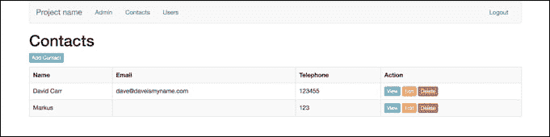
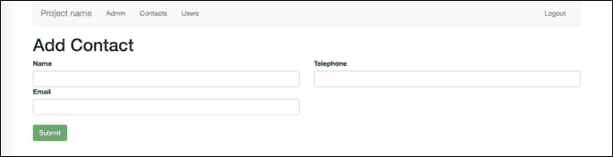
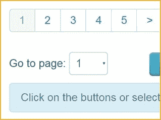
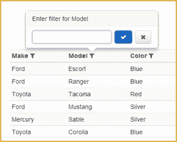
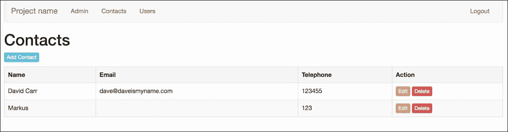

# 八、建立联系人管理系统

在前面的章节中，我们已经完成了在框架上构建功能，这允许对用户进行管理。我们已经执行了引导的包含，为我们的应用提供了一些基本的样式。我们还在应用中实现了密码恢复机制。

在本章中，我们将构建一个 contacts CRUD（创建、读取、更新和删除）部分，该部分将有一个查看页面来查看单个联系人。可以针对联系人记录查看页面评论。我们还将为我们的联系人应用构建评论系统。

在本章结束时，您将能够：

*   在我们的联系人应用中实现 CRUD 功能
*   在我们的联系人应用中构建评论系统

# 概述 CMS

框架是软件中的一种抽象，它提供了可通过编写自定义用户代码来使用的多个软件。框架中的控制流与其他库中的控制流不同：


应用的仪表板

这是仪表板-用户登录时登陆的页面。从这里，他们可以导航到应用中可以管理内容的部分：



联系人索引页

这是`contacts`索引，用户可以在其中查看 contacts 表中存储的所有联系人。

这是构建在框架之上的应用的知识。

用户可以看到联系人的姓名以及与每个联系人相关的电子邮件地址和电话号码。

用户无法看到联系人 ID，但该 ID 仍会生成，并构成查看、编辑和删除 URL 的一部分；因此，当通过单击其中一个按钮触发某项功能时，它已经知道要从 contacts 表中的哪个记录中获取其知识。


查看个人联系人

这是联系页面。

此页面在一条记录中显示所有信息。本申请中的记录是唯一联系人的数据，由一个`ID`表示。`ID`是唯一的，因此只会显示一个联系人的信息：

### 注

**注意事项**

这里使用“唯一”一词是因为它是一个单独的`ID`。如果将其存储为单独的`ID`，则应用将其视为唯一记录。



添加联系人页面

这是显示表单的页面，允许用户添加全新联系人。

加载时，此页面不需要任何参数，因为它不需要在其字段中加载任何预填充的数据。

提交时，假设没有错误，将添加新联系人：


编辑联系人页面

这是显示表单的页面，允许用户编辑联系人。

此页面的区别在于，与联系人记录相关的存储数据预先填充在表单中。

可以这样做的原因是编辑页面加载了作为参数传递的联系人`ID`。此`ID`告知系统应将哪个记录加载到此页面。

# 积垢，接触应用

在本节中，用户将创建 CRUD 联系人应用的功能。用户将：

*   创建新的`contact`记录
*   查看所有`contact`记录
*   查看个人`contact`记录
*   更新`contact`记录
*   删除`contact`记录

### 注

您可能会发现这与构建用户管理功能非常相似，这样做是正确的。

CRUD 是所有应用的核心，并从中扩展功能。



这是分页的一个示例



这是一个过滤的例子

# 在我们的联系人应用中插入 CRUD 功能

在本节中，我们将尝试在 Contacts 应用中插入 CRUD 功能。

请查看以下屏幕截图：



本节的结果

以下是在 Contacts 应用中插入 CRUD 功能的步骤：

1.  在数据库中，我们需要一个`contacts`表（如果您在前面章节中有此表，请删除）：

    ```php
    CREATE TABLE `contacts` (
      `id` int(11) unsigned NOT NULL AUTO_INCREMENT,
      `name` varchar(255) DEFAULT NULL,
      `email` varchar(255) DEFAULT NULL,
      `tel` varchar(255) DEFAULT NULL,
      PRIMARY KEY (`id`)
    ) ENGINE=InnoDB AUTO_INCREMENT=4 DEFAULT CHARSET=utf8;
    ```

2.  `contacts`表存储每个联系人的唯一`ID`，联系人的姓名、电子邮件地址和电话号码。
3.  Next, we need a `comments` table:

    ```php
    CREATE TABLE `comments` (
      `id` int(11) unsigned NOT NULL AUTO_INCREMENT,
      `contact_id` int(11) DEFAULT NULL,
      `user_id` int(11) DEFAULT NULL,
      `body` text,
      `created_at` timestamp NULL DEFAULT CURRENT_TIMESTAMP,
      PRIMARY KEY (`id`)
    ) ENGINE=InnoDB AUTO_INCREMENT=3 DEFAULT CHARSET=utf8;
    ```

    注释必须有`contact_id`和`user_id`字段。这些外键将评论链接回联系人和发布评论的用户。

    注释将添加到 body 字段，并使用`created_at`列记录创建的时间。此列设置了一个时间戳，默认值为`CURRENT_TIMESTAMP`。此表示添加新记录时自动插入日期和时间：

4.  因为我们在前面的章节中已经对联系人进行了实验，所以让我们从做一些清理开始。删除`app/views/contacts`文件夹。
5.  打开`app/views/layouts/nav.php`并添加一个联系人菜单项，指向`/contacts`：

    ```php
    <nav class="navbar navbar-default">
        <div class="container-fluid">
    …….
        </div><!--/.container-fluid -->
    </nav>
    ```

6.  打开`app/Models/Contacts.php`。
7.  Remove this code:

    ```php
    public function getContacts()
    {
        return $this->db->select('* FROM contacts');
    }
    ```

    然后，将其替换为以下内容：

    ```php
    public function get_contacts()
    {
        return $this->db->select('* from contacts order by name');
    }
    ```

8.  接下来，我们需要一种加载单个触点的方法，`ID`属于触点：

    ```php
    public function get_contact($id)
    {
        $data = $this->db->select('* from contacts where id = :id', [':id' => $id]);
        return (isset($data[0]) ? $data[0] : null);
    }
    ```

9.  We will also need `insert`, `update`, and `delete` methods:

    ```php
    public function insert($data)
    {
        $this->db->insert('contacts', $data);
    }
    public function update($data, $where)
    {
        $this->db->update('contacts', $data, $where);
    }
    public function delete($where)
    {
        $this->db->delete('contacts', $where);
    }
    ```

    完整型号如下所示：

    ### 注

    有关完整的代码片段，请参阅代码文件文件夹中的`Lesson 8.php`文件。

    ```php
    <?php
    namespace App\Models;

    use System\BaseModel;

    class Contact extends BaseModel
    ……
        }
    }
    ```

10.  接下来，打开`app/Controllers/Contacts.php`。
11.  导入`Session`和 URL 帮助程序：

    ```php
    Use App\Helpers\Session;
    Use App\Helpers\Url;
    ```

12.  Replace the following code:

    ```php
    public function index()
    {
      $contacts = new Contact();
        $records = $contacts->getContacts();
        return $this->view->render('contacts/index', compact('records'));
    }
    ```

    为此：

    ```php
    protected $contact;
    public function __construct()
    {
        parent::__construct();
        if (! Session::get('logged_in')) {
            Url::redirect('/admin/login');
        }
        $this->contact = new Contact();
    }
    public function index()
    {
        $contacts = $this->contact->get_contacts();
        $title = 'Contacts';
        return $this->view->render('admin/contacts/index', compact('contacts', 'title'));
    }
    ```

    ### 注

    与我们的`Users`控制器一样，这将确保您在能够访问联系人之前登录，并设置`$contact`模型，收集联系人并加载`contacts`视图。

    我们还需要`add`、`edit`和`delete`方法。这与`Users`方法的设置方式相同。

13.  If the form has been submitted, collect the form data, perform validation, and providing there are no errors, insert it into the database, set a message, and redirect:

    ### 注

    有关完整的代码片段，请参阅代码文件文件夹中的`Lesson 8.php`文件。

    ```php
    public function add()
    {
    ……
        Session::set('success', 'Contact deleted');

        Url::redirect('/contacts');
    }
    ```

14.  Next, we need to create the views for these methods. Create a `contacts` folder inside `app/views/admin` and create these views:

    ### 注

    有关完整的代码片段，请参阅代码文件文件夹中的`Lesson 8.php`文件。

    ```php
    index.php

    <?php
    include(APPDIR.'views/layouts/header.php');
    include(APPDIR.'views/layouts/nav.php');
    …….
    </form>

    <?php include(APPDIR.'views/layouts/footer.php');?>
    ```

## 活动：执行我们的申请

我们已经在 contacts 应用中实现了 CRUD 功能。让我们通过执行应用来尝试一下。

此活动的目的是验证 CRUD 功能是否与我们的应用正常工作。

此时，我们可以列出、添加、编辑和删除联系人：

1.  要显示这一点，请打开您的应用：

    ```php
    php – S localhost:8000 –t webroot
    ```

2.  加载`http://localhost:8000/contacts`。
3.  将列出数据库中的所有联系人。您可以通过点击`Add Contact`添加一个新的。提交表单后，您将返回到用户列表，在那里您可以看到新联系人，并显示确认消息。
4.  编辑也会发生同样的事情。删除将确认删除联系人的操作。

# 注释、联接和日期格式

在本节中，我们将学习：

*   如何建立一个评论系统
*   如何连接存储在两个不同表中的数据
*   如何格式化日期

目前建造的系统可以改进。这可以通过构建注释功能来实现，这样用户就可以记录联系人的活动。

他们可能需要注意的是，他们在周一给联系人打了电话，周五又被要求给他们打电话。用户可能正在一起工作以拨打联系人列表，了解谁发表了评论以及何时发表评论将非常有用。

另一种改进系统的方法是确保日期和时间以易于阅读的格式显示。数据库表以一种不太人性化的方式存储此类信息。

创建评论时，必须创建`joins`。用户可以针对联系人发布的评论数量几乎是无限的。

在建立联系人字段时，不可能满足这一要求，评论也必须受到限制。联系人表中需要有一个字段，以满足每一条可能的评论、评论人以及发表评论的时间。对于开发人员来说，这将是非常难以管理和乏味的。

开发人员应该创建一个单独的表来存储注释，而不是有限数量的注释。

但是开发者如何将评论链接到联系人？

这就是`joins`变得有用的地方。每个联系人都有一个`ID`。每个注释都有一个注释`ID`。每一条评论也有额外的信息，如评论的文本内容、发表评论的人以及发表评论的时间和日期。

当系统做出评论时，它需要能够识别该评论是针对特定联系人做出的，并将该联系人作为联系人 ID 存储在该记录中。

例如，如果联系人 David 的 ID 为 1 且有三条注释，则这些注释中的每一条都将存储在联系人 ID 为 1 的表中。它们都有自己的唯一 ID，即 1、2 和 3。

这同样适用于用户，因此可以知道是哪个用户发表了评论。这将是用户 ID。`join`是必需的，因为该评论对制作该评论的用户及其所属联系人的了解有限。它只知道与它相关的联系人的联系人 ID 和创建它的用户的用户 ID。

这对于计算机来说很好，但是人类用户需要的信息比这更多。他们希望看到该用户的姓名，而不仅仅是系统上的 ID。要实现这一点，需要将两个或三个表与所有相关信息结合在一起。这是一个数据库如何为系统提供信息的示例。一些简单的 PHP 函数可以轻松地重新格式化这些数据。

馈送到系统的数据库：

```php
2017-12-15
```

PHP 可以将其重新格式化为：

```php
Friday 15th December 2017
```

# 创建查看页面并构建评论系统

本节的目的是显示运行中积垢的触点。下面的屏幕截图显示了我们计划在本节结束时完成的任务。


评论制度

为了使我们的联系人部分更有用，让我们添加一个`view`页面，在那里我们可以看到个人联系人。`view`页面也是一个完美的地方，可以建立一个评论系统，对联系人添加评论：

1.  打开您的`Contacts`控制器，创建一个名为`view($id)`的新方法。
2.  检查`$id`是否为数字，然后从`get_contact($id)`加载触点。如果`$contact`为空，则重定向到 404 页面。
3.  设置页面标题并加载视图：

    ```php
    public function view($id)
    {
        if (! is_numeric($id)) {
            Url::redirect('/contacts');
        }

        $contact = $this->contact->get_contact($id);

        if ($contact == null) {
            Url::redirect('/404');
        }

        $title = 'View Contact';
        $this->view->render('admin/contacts/view', compact('contact', 'title'));
    }
    ```

4.  在`app/views/admin/contacts`中，创建`view.php`。
5.  Load the layout files, then create a table to display the content, ensuring the variables are wrapped inside `htmlentities()`:

    ### 注

    有关完整的代码片段，请参阅代码文件文件夹中的`Lesson 8.php`文件。

    ```php
    <?php
    include(APPDIR.'views/layouts/header.php');
    include(APPDIR.'views/layouts/nav.php');
    include(APPDIR.'views/layouts/errors.php');
    ……
    </div>

    <?php include(APPDIR.'views/layouts/footer.php');?>
    ```

6.  Now, to start working on the comments, first we need a form to enter a comment and submit it. After the table but before the footer layout, create a heading called `Comments` and create a form with a single text area. Give the text area a name of body:

    ```php
    <h1>Comments</h1>
    <form method="post">
        <div class="control-group">
            <textarea class="form-control" name="body"></textarea>
        </div>
        <p><button type="submit" class="btn btn-success" name="submit"><i class="fa fa-check"></i> Add Comment</button></p>
    </form>
    ```

    提交此表单时，`view`方法需要处理请求。

    在继续之前，我们需要一个注释模型来与数据库中的`comments`表交互。

7.  在`app/Models`中，创建一个名为`Comment.php`的新模型。目前，它将有一个名为`insert($data)`的方法，当调用

    ```php
    <?php
    namespace App\Models;

    use System\BaseModel;

    class Comment extends BaseModel
    {
        public function insert($data)
        {
            $this->db->insert('comments', $data);
        }
    }
    ```

    时，该方法将在注释表中创建一条新记录
8.  现在，转到您的`Contacts`控制器。
9.  导入文件顶部的新`Comment`模型：

    ```php
    use App\Models\Comment;
    ```

10.  In the `view($id)` method, create a new instance of the Comment model.

    由于此注释模型仅在该方法中使用，因此不需要将其分配给类属性。局部变量可以，在本例中为$comment。

11.  接下来，检查是否提交表单，并收集`$body`post 数据。
12.  如果注释不是空的，则创建一个`$data`数组，其中包含正文，还包含`contact_id`，即`$id`，以及`user_id`，即存储在会话中的登录用户的 ID。
13.  将`$data`传递给`insert($data)`方法创建评论，然后设置消息并重定向回联系人的查看页面：

    ```php
    $comment = new Comment();
            if (isset($_POST['submit'])) {
                $body  = (isset($_POST['body']) ? $_POST['body'] : null);
                if ($comment !='') {
                    $data = [
                        'body' => $body,
                        'contact_id' => $id,
                        'user_id' => Session::get('user_id')
                    ];
                    $comment->insert($data);
                    Session::set('success', 'Comment created');
                    Url::redirect("/contacts/view/$id");
                }
    ```

## 活动：加载应用

我们已经建立了页面并实现了评论系统。现在我们将加载应用。加载应用后，您会注意到有一个编辑和删除按钮，但无法查看该联系人。我们会解决这个问题。

我们将通过以下步骤了解如何在应用中实现联系人的可见性：

1.  加载应用：

    ```php
    php –S localhost:8000 –t webroot load http://localhost:8000/contacts
    ```

2.  您是否注意到每个联系人都有一个编辑和删除按钮，但无法查看联系人？让我们来解决这个问题。
3.  打开`app/views/admin/contacts/index.php`。
4.  在编辑链接上方添加新链接。在本例中，我给了按钮一个不同的类`btn-info`，使按钮变成蓝色，因此它与编辑不同：

    ```php
    <a href="/contacts/view/<?=$row->id;?>" class="btn btn-xs btn-info">View</a>
    ```

5.  在浏览器中保存并重新加载页面，您将看到“查看”按钮。单击查看按钮，您将看到一个显示联系人的查看页面和一个输入评论的表单。
6.  输入注释，然后按`Add Comment`。页面将重新加载，您将看到一条成功消息。注释已插入到数据库中，但您尚未看到它。
7.  打开你的评论模型。
8.  Create a new method called `get_comments($id)`. The `$id` passed will be the ID of the contact.

    对于这个查询，我们需要做一个`join`。

    ### 注

    连接是指将两个或多个数据库表连接在一起以从中获取信息。

我们需要一个连接来获取添加评论的用户的用户名。在 comments 表中，我们存储了一个`user_id`。这可以用来从 users 表中获取我们需要的任何内容。

`join`的语法是选择所需的列，前缀为表名，后跟注释。

因此，用户的用户名表示转到 users 表并获取`username`列。

1.  在`from`部分，指定要加载的表格，在 where 部分，指定标准。
2.  我们希望加载注释`user_id`列与用户 ID 列匹配的所有注释，`contact_id`与提供的`$id`：

    ```php
    public function get_comments($id)
    {
        return $this->db->select('
            comments.body,
            comments.created_at,
            users.username
        from
            comments,
            users
        where
            comments.user_id = users.id
            and contact_id = :id'
        , [':id' => $id]);
    }
    ```

    匹配的所有注释
3.  保存此模型并转到`Contacts`控制器的`view`方法。
4.  处理完表单后，调用我们刚刚创建的`get_comments($id)`方法：

    ```php
    $comments = $comment->get_comments($id);
    ```

5.  This loads the comments; the next step is to add comments to the compact function:

    ```php
    $this->view->render('admin/contacts/view', compact('contact', 'comments', 'title'));
    ```

    完整的方法如下所示：

    ### 注

    有关完整的代码片段，请参阅代码文件文件夹中的`Lesson 8.php`文件。

    ```php
    public function view($id)
    {
        if (! is_numeric($id)) {
            Url::redirect('/contacts');
    …….
        $comments = $comment->get_comments($id);

        $title = 'View Contact';
        $this->view->render('admin/contacts/view', compact('contact', 'comments', 'title'));
    }
    ```

6.  最后一步是显示注释。打开`app/views/admin/contacts/view.php`。
7.  在表格后添加：

    ```php
    <?php foreach($comments as $row) { ?>
        <div class="well">
             <p><?=htmlentities($row->body);?></p>
             <p>By <?=$row->username;?> at <?=date('jS M Y H:i:s', strtotime($row->created_at));?></p>
        </div>
    <?php } ?>
    ```

这将循环浏览注释。每个循环都会创建一个新的`div`，其中包含一个类，用于一些样式设置。在 div 内部，它打印出注释。下一行显示用户名。用户名仅在我们在注释模型中设置的联接中可用。

1.  When the comment was added, the `created_at` field was populated. The default format is YYYY-MM-DD H:M:S, which is not very readable, so we can use date() to specify the date format, and as a second param use `strtotime()` and pass in the `created_at` field.

    ### 注

    `strtotime`将时间转换为秒。最终结果是一个用户友好的日期。

2.  现在，返回浏览器中的联系人并添加评论。然后，您将看到页面上显示的新注释和任何以前的注释。

# 总结

在本章中，我们介绍了如何构建与表单交互的 CRUD 部分，如何在页面之间传递数据，以及如何格式化日期。我们还在 contacts 应用中添加了一个评论系统，允许用户添加评论并记录。

我们介绍了开发一个好的、安全的 PHP 应用所需的所有概念。

本书到此结束。在本书中，我们学习了 PHP 的所有基础知识，如变量、数组、循环等。我们还学习了如何在 OOP 环境中开发 PHP 框架，同时构建 contacts 应用。我们介绍了框架结构的外观，以及如何使用 Whoops 正确格式化错误报告技术。在框架开发过程中，我们讨论了框架开发环境中的身份验证和用户管理，最后讨论了如何对联系人应用进行 CRUD。