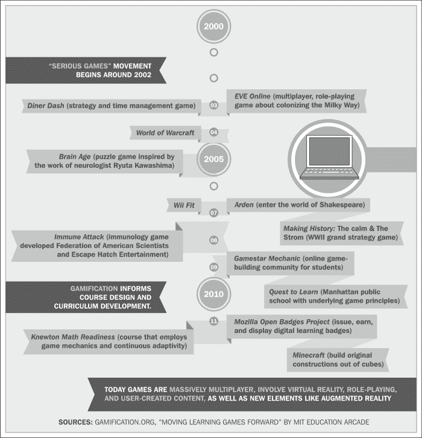

# 已、游戏化教育过程

游戏有可能给个人带来惊人的变化。历史上，游戏一直被用来提高技能，在某些情况下还可以发展新技能。游戏化最明显的例子是全世界的武装部队，他们进行“战争游戏”，帮助士兵体验战争环境，并使用他们的训练技能来达到效果。这些游戏帮助他们使用和发展技能。尽管游戏化方法需要谨慎使用，但如果游戏化过程得到巧妙实施，其优点大于注意事项。

# 什么是游戏化？

**游戏化**是游戏设计师在游戏以外的情况下使用的策略和技术，让人们将这些情况视为游戏。人们把严肃游戏、博弈论、电子游戏设计和游戏化混为一谈。这些可以是诸如乐趣、规则、竞争、分数等，然后将它们应用于非游戏情况。

游戏化不同于严肃的游戏。严肃的游戏被认为是游戏，但它们不是为了娱乐而设计的。它们是为了更实际的用途。例如，飞行模拟器拥有飞行视频游戏中的所有机械、技术和设计过程。然而，开发人员制作视频游戏是为了娱乐，而飞行模拟器则有更重要的用途。

另一方面，博弈论只是对战略决策的研究，它在决策时考虑了“类似博弈”的思维。

游戏化是指在好的游戏设计中应用的结构和设计过程，无论是视频游戏、棋盘游戏还是严肃的游戏。游戏化只是游戏设计中使用的一套工具和材料，它也适用于制作游戏以外的工作。

在不久的将来，您将看到的大多数游戏化应用程序都是严肃的游戏。我们将开始看到游戏元素越来越多地出现在我们的日常生活中。

游戏化领域的一个巨大增长领域是游戏化教育。在学习过程中应用游戏化有很多希望。

## 使用游戏化的学校

如果我们思考什么是学校，我们很快就会得出结论，学校本身就是一场游戏。它已经将所有经典游戏元素融入了我们的传统学校体系。在几乎所有类型的学习环境中，你都会发现奖励制度的想法。该奖励系统可以是分数或平均分数的形式。学校以更高的分数奖励表现良好的学生，而不是表现不好的学生。

学校也有处罚制度。如果学习者的表现没有达到一定的标准，学校将对他/她进行处罚。它会阻碍他/她，排斥他/她，在某些情况下会使他/她离开社区。学校可能是世界上玩得最广泛的游戏。不幸的是，今天大多数人在学校里看不到多少乐趣。因此，学校作为游戏的理念几乎不存在。然而，随着我们的学习环境变得更具吸引力，在未来几十年中，你可以期待这种变化。

# 教育游戏化的历史

游戏化在学习环境中的一些最早应用可以追溯到 20 世纪 80 年代的视频和电脑游戏，比如卡门·圣地亚哥。软件开发商 Broderbund Software 于 1985 年发布。这是一个巨大的成功。这个游戏向玩家传授地理和历史，因为他们的行为就像侦探一样，ACME 侦探社正在寻找一位前 ACME 侦探 Carmen SanDiego。它获得了 70 多个奖项，特别是 1996 年国家教育媒体网颁发的银苹果奖。

下图显示了学习中游戏化的简短历史：

其他成为家喻户晓的早期电脑游戏包括教授打字和文明的 Mavis Beacon。其他部分如下图所示：

## 垄断学院

有几位创新的教育工作者努力在他们的教室里实施游戏机制。其中一位是 Hesperia 统一学区（加利福尼亚州奥兰治县）教师 Tim Vandenberg。范登伯格在他的学区为六年级学生开办了**垄断学院**。（[http://www.youtube.com/watch?v=3iHv3vrW2Lo](http://www.youtube.com/watch?v=3iHv3vrW2Lo) 游戏截图如下：

垄断学院利用“垄断”游戏教授数学概念。范登伯格是一位垄断冠军玩家，他利用游戏教授比率、概率、期望值和其他数学概念，传统上，孩子们很难掌握这些概念。

Vandenberg 在他的课上实现了**水平**，一种游戏元素。他将班级分成不同的级别，学生需要达到一定的里程碑才能玩游戏。他使用了一堵名人墙，上面有过去的球员的高分，就像排行榜一样。排行榜是另一个重要的游戏元素。

范登伯格已经把他的数学课变成了一个有趣的互动场所，学生们可以通过玩“垄断”游戏来学习。当垄断学院于 2007 年成立时，范登伯格的学生中只有 10 人在加州标准化数学考试中被评为高级。截至 2010 年，他将垄断作为主要教学工具，将这一数字增加到 37 人。

## 可汗学院

另一个在网络教育领域使用游戏化的领先组织是汗学院（[https://www.khanacademy.org/](https://www.khanacademy.org/) ）。这是一个非营利组织，其使命是在全世界改善教育。

他们收集了 100 多个自定步调的练习、1800 节课和 2100 个视频，任何访问他们网站的人都可以免费获得。尽管他们的大部分教学材料都是基于视频的，但网站上大量使用了游戏元素。它为学习者提供了挑战。它根据学生回答问题的正确性和速度来奖励学生。该网站量化进度，并在学生每次登录该网站时与他们分享反馈。

汗学院院长肖塔努·辛哈（Shauntanu Sinha）表示，“我们目前的教育体系缺乏设计良好的激励机制，对大多数人都不起作用。”

## 海绵糖

在学习环境中，游戏化还有其他几种用途。加拿大游戏开发商 Spongelab 创造了生物视频游戏历史，在加拿大各地用于生物教学。用户可以通过玩不同的生物相关游戏获得徽章。

该网站只需提供加入该网站的初始欢迎徽章，即可迅速吸引学生加入。学生可以使用网站在线市场中累积的积分和积分购买优质内容。Spongelab 甚至在其网站[上推出了基于现金的奖励，用于参与某些挑战 http://www.spongelab.com/](http://www.spongelab.com/) 。

## 青年眼

Youtopia 允许教师将游戏元素应用到他们的学习环境中。因为老师使用这个网站（[http://home.youtopia.com/](http://home.youtopia.com/) 作为教室的延伸，设计师将其称为混合学习平台。该在线平台允许教师和家庭学校家长将积分、徽章和排行榜等即插即用游戏元素带入教室。学生可以在教师的 Youtopia 商店兑换积分和徽章。朋友、家人和其他年轻人可以看到学生的成就和徽章的积累。教师有能力为他们的班级和学校创建排行榜。他们允许教师通过将分数、徽章和成绩分组为班级和学校来实施团队概念。这使得利用班级和学校的比赛成为可能。

Youtopia 可以建立 Youtopia 简历，许多学生在申请第一次工作经历时可以用它来建立他们的初始简历。教师可以快速登录并查看学生的表现。Youtopia 报告卡示例如以下屏幕截图所示：

Youtopia 不仅仅限于学校相关的活动。学生也可以在网站上记录志愿者时间和课外活动。这记录了他们的软技能发展以及具体技能都在同一个地方。这样可以更真实地了解学生的能力和潜力。

## 任务 2 学习

Quest2Learn 是曼哈顿的一所学校，是教育部、公共教育新愿景和游戏学院之间的合作。他们实际上创建了一所学校，课程 100%基于游戏机制。

Quest 学生通过课程注册，就像他们在游戏中努力一样。而不是年级水平，学生们通过由一系列任务组成的为期十周的任务。任务结束时，学生升到上司级别（挑战）。学生在这一挑战级别上停留两周，老师根据他们在任务中学到的技能为他们分配一个复杂的问题来解决。挑战领域的专家判断挑战的结果。学生需要通过创造结果而不是简单地回答测试问题来实际展示他们所学到的东西。

一个名为“鬼与鬼”的任务向学校的七年级学生提出了挑战，要求他们努力学习透视法。学生们将学习具有不同经历的人如何将他们的经历带到活动中。一群不同祖先和背景的虚构鬼魂在与原始美洲殖民地建立有关的各种事件中持有不同的立场。鬼魂们为了对不同事件的解释而互相争斗。在整个任务过程中，学生们深入研究原始文件，以发现支持有争议事件的各种版本的证据。

Quest 学生必须达到与其他纽约公共教育学生相同的标准。然而，教师们也通过一系列核心能力来衡量他们，比如同理心和协作。到目前为止，测试结果显示，Quest 学生在标准化测试中的平均得分略高于同一人群中的其他学生。此外，该校还赢得了纽约市数学奥林匹克竞赛。

他们甚至用谷歌地球学习地理。罗格斯大学的一项研究表明，基于问题的学习可以提高学生的学习技能和学习动机。我们希望所有的学校再次变得有趣。这是教育游戏化运动的核心。（[http://q2l.org/](http://q2l.org/)

## 一流工艺的世界

《Classcraft 世界》是一款基于计算机的教室增强现实游戏。有趣的是，它不是由公共教育系统资助的，而是由 Kickstarter 资助的。学生们玩游戏是为了获得真正的力量，并将课堂变成一场冒险。玩家击败怪物（家庭作业）和老板（考试）。学生获得经验点（XP）、生命点（HP）、行动点（AP）和力量点（PP），如以下屏幕截图所示：

玩家在完成某些任务时获得经验值。这类任务的例子有：

*   在课堂笔记中发现错误
*   考试中每超过 70%的分数
*   在课堂上正确回答问题
*   帮助另一个学生做功课
*   用自己的力量帮助另一个玩家
*   在上课期间积极努力

游戏大师（教师）将学生分成八人一组。他们加入三个职业中的一个：牧师、法师或战士。老师是游戏大师。学生在教室里大声说出他们想做的任务，游戏管理员（老师）在游戏系统中记录。（[http://worldofclasscraft.com/en/](http://worldofclasscraft.com/en/)

## 大学游戏化

大学比 K-12、小学和中学教育机构更多地使用游戏机制。许多教授对教学过程有更多的控制权。例如，卡尔顿大学的肖恩·格雷厄姆教授（Shawn Graham）有一套完善的成就体系来教授“历史学家的技艺课”（Historian’s Craft Class）（历史 2809[http://www.playthepast.org/?p=848](http://www.playthepast.org/?p=848) 。这个系统是自愿的，这正是学生们喜欢它的原因。他们不是被迫参加的，这让他们感觉更像是一场游戏。

在传统的大学水平课程中，你的分数主要基于几次考试的分数。学生从 100%的分数开始，整个学期都会失分，直到他/她最终得到分数为止。格雷厄姆建立了一个系统，学生们可以根据不同的成绩获得分数。格雷厄姆说：“我希望学生们有更多的机会练习成为历史学家的技巧，而不仅仅是课堂上的正式评估。”这些成就包括考试成绩和课堂参与。学生们可以获得一些有意义的成就，比如做一些外部研究来拜访教授。游戏中的一些挑战包括抄写古代纸草的线条，学习嵌入计算机代码中的修辞，完成逻辑谬误教程，学习一些拉丁语，参与在线众包历史项目的学生的分数是基于他/她的成就水平，而不是仅仅基于他/她的考试成绩。更重要的是，该系统是自愿的，因此一名学生的 A 年级之路可能与另一名学生的同一年级之路大不相同。尽管是自愿的，格雷厄姆看到了大约 40%的参与率，所有学生都完成了 10 项以上的成绩，以 a 或 B 成绩完成课程。

学生在学习过程中有一种自主意识，研究表明这是内在（自生）动机的主要组成部分。格雷厄姆教授正在证明，当有一定程度的自主性、挑战（掌握）和参与（目的）的背景时，参与的程度会大大提高。

坦普尔大学福克斯商学院（Temple University Fox School of Business）助理教授史蒂文·约翰逊（Steven L.Johnson）教授在 MIS3538 课程《社交媒体创新》（Social Media Innovation）中引入了游戏化，并在课程中加入了他所谓的“探索”（The Quest）。约翰逊的目标是通过一系列必要的、自愿的、越来越困难的活动来鼓励自学。

他使用基本的现成工具来实现他的程序。他使用了 WordPress 成就插件和谷歌表单。学生获得分数和徽章。有一个班级排行榜，约翰逊每周都会表彰学生在比赛中达到下一个水平。

Johnson 设置了它，这样学生就可以在他们的前三篇文章和预设的评论级别（例如，第 1、第 5、第 10、第 20 等等，最多 100 篇）中获得分数和徽章。他甚至对学生们隐瞒了一些成绩，当学生们达到这些成绩时，这增加了他们的惊讶程度。

学生们发现竞争环境既有挑战性又有乐趣。有趣的是，约翰逊没有发现在游戏中表现出色的学生和排名垫底的学生之间的乐趣和参与程度有任何不同。看来，无论学生在课堂上的个人进步如何，乐趣和参与都是平等分配的。最后，他能够创造出大多数教师都希望创造的令人兴奋、引人入胜的学习体验，学生可以利用并有能力这样做。

# 教育游戏化的未来

一般来说，游戏和运动教会我们无价的软技能。例如，他们教我们团队合作、沟通、授权和协作。当今学校的大部分学习都集中在明确的学习目标上。具体化学习包括事实、数字、公式等。教育游戏化真正未开发的好处在于**流体智能**领域。流体智力更多的是关于解决问题和情商。

教育系统的主要目的是为未来的社会做好准备。我们目前的教育体系正在为一个不再存在的现实做准备。它正试图在游戏擅长的领域迎头赶上。

已有超过 50 年的研究表明，游戏可以提高某些领域的学习体验。不幸的是，这不是我们传统衡量的领域。由于我们没有在成绩单上衡量沟通能力、情绪克制和领导力等方面，因此我们没有太多关注确保学生学习这些技能。然而，这些是我们正在发现的技能类型，在社会上最重要。

游戏很好地展示了这些技能。它们也是非常好的工具，可以向学员展示为什么某个动作或行为是不正确的。例如，当一名玩家在电子游戏中出错时，他/她会失去一个回合或失去一名男子。只有通过安全的失败，我们才能最终学习。游戏允许安全的失败。传统学校环境中的大多数课程只有在不可逆转的失败后才能学到，比如考试失败。

游戏通常以失败为基础。当我们考虑视频游戏时，人们通常都知道每个玩家都有一定数量的玩家来进行实验。如果发生错误，玩家将在游戏中被销毁，但通常会有另一次机会使用另一个游戏令牌重试。

这种即时反馈在学习过程中非常重要。学习者需要一个系统，让他们知道自己何时在进步。不幸的是，通过我们的传统教育体系，学习者需要等待长达 12 年的时间，才能发现他们是否真正学会了成为一个有生产力的公民所需要的东西。这种长时间的延迟导致反馈回路无法及时向学习者提供充分的反馈。

另一方面，游戏允许即时反馈和纠正。这为学生、家长和教师提供了确保学生正确学习所需的信息。

## 课堂游戏化

尽管教室里的游戏化让人兴奋不已，但还是有一些人持怀疑态度。第一个明显的问题是教育游戏化的可扩展性，无论是否在线。一些成功的例子不足以改造我们的整个教育系统。

可以肯定的是，游戏化在教育环境中并不总是有效的。事实上，根据 2013 年 Gartner 的一份报告，超过 80%的游戏化项目将无法实现其目标。当然，他们特别指的是游戏化项目，但其中许多项目将与教育相关。

根据 Gartner 的说法，大多数都会因为以下原因而失败：

*   拙劣的设计
*   缺乏规划和战略
*   坏流程
*   不现实的期望

就连试图在课堂上模拟游戏文明的格雷厄姆教授也承认这是一次惨败。他把自己的失败归因于游戏机制不是自愿的。在这种情况下，他要求所有学生都参与游戏，这似乎影响了学生享受课程乐趣的能力。然而，在大多数学校，这将是一个真正的问题。州教育委员会的全部目的是制定标准，决定对学生的要求。这与在这个过程中给予学生一定程度的自主权的概念是完全矛盾的。

在尝试将游戏化应用于教育环境之前，要问的另一个基本问题是，“学校应该是有趣的吗？”许多教育支持者建议，给学生一个愉快的体验不是学校的目标，获得技能对于成为一个有生产力的公民是必要的。

从我的角度来看，真正的问题是：

*   未来成为一个有生产力的公民需要哪些技能？
*   游戏机制可以用来教授成为一个有生产力的公民所必需的技能吗？
*   学生是否被激励学习这些技能，成为有生产力的公民？

将教育经验游戏化的支持者认为，游戏和游戏元素并不能取代教师。好的游戏设计符合充满激情的教师，营造充满活力的学习环境。此外，传统教育体系已证明足以提供关键的识字技能。然而，它在传授思维技能、软技能和体验式学习方面做得很差。游戏化教育的作用似乎不是取代或破坏。它的作用更多的是加强和扩大目前的进程。

游戏化学习环境的成败归结为一个好的游戏化设计。我们看到过多的网站添加积分、徽章和排行榜（PBL），并称之为游戏化。好的设计意味着一个框架和一个结构。一个框架会产生清晰、可测量的目标。设计框架包括对受众的清晰理解，以及是什么促使他们做什么。它给出了一个遵循的过程。当这些事情发生在学习环境中时，学生将被激励学习。在那一刻，当有一个明确的、可以理解的奖励，并且是在适当的环境下，就会有动力。这些时刻成为了丰富的学习机会。

当我们正确开发学习环境时，学生甚至不应该意识到他们在学习。他们应该简单地参加一个游戏并享受乐趣。学习是这种环境的副产品。

## 在学校玩得开心

传统上，当我们想到学校时，脑海中会浮现出很多单词，但乐趣并不在其中。事实上，到目前为止，学校惩罚学习者认为游戏正常的东西。例如，学习者因没有跟上规定的速度学习而受到处罚。这种学习压力会适得其反。压力使这个过程毫无乐趣。一个经常使用的游戏元素是渐进的概念。当学生按照自己的节奏学习和进步时，他们会有更多的乐趣。

在一些游戏化的圈子里，例如教育游戏化，F 字（乐趣）是不受欢迎的。我们倾向于回避游戏的主要元素——乐趣，而不是追求参与度和动机。参与度和动机绝对是一个好的游戏化应用程序的结果，但它们并不能取代乐趣；相反，它们是设计师有针对性的有趣体验的结果。

然而，我们必须记住，乐趣不是“一刀切”的主张。对一个人来说有趣的事情对另一个人来说并不有趣。这是试图将课堂环境游戏化的批评者之一。对于一个学生来说，一套游戏元素转化为乐趣，但对于另一个学生来说，它们根本不会也不会转化为乐趣。

游戏化实施者必须非常清楚他们的受众（玩家）以及他们试图用他们的系统实现什么（目标行为）。

# 总结

到目前为止，我们考察了一些成功地将教育过程游戏化的教育机构。在下一章中，您将通过了解游戏化设计框架来学习如何将流程游戏化。