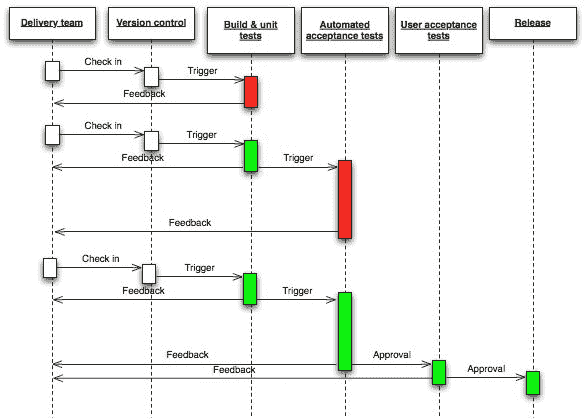

# 九、微服务

尽管我们讨论了不同的方面，但在本书中，我们为一个简单的博客创建了一个 RESTfulWeb 服务。我们举这个例子是为了让事情在业务逻辑方面保持简单，以便我们能够专注于我们的实际主题的细节。这是有帮助的，但在现实世界中，事情并不是那么简单和小。有许多大型系统，其部件不同，很难维护。这些部件也很难调试和扩展。扩展不同于仅仅维护某些东西并对其进行优化以获得更好的性能。在扩展中，代码和部署环境的优化都很重要。可伸缩性、可维护性和性能一直是我们面临的挑战。

为了解决这个问题，我们有一种架构风格，称为微服务。因此，在本章中，我们将讨论这一点。微服务不是使用的必要工具。然而，它们解决了我们在为更大系统提供 RESTful web 服务时经常面临的一些挑战。因此，我们将看到微服务如何解决这些问题，以及微服务体系结构带来的挑战。

以下是我们将在本章中讨论的主题：

*   引入微服务
*   基于微服务架构的动机
*   它与 SOA（面向服务的体系结构）有何不同
*   团队结构
*   微服务挑战
*   微服务实现

# 引入微服务

让我们首先定义微服务体系结构，然后深入讨论微服务的细节。微服务体系结构成为一个热门术语，但没有任何正式的定义。事实上，到目前为止，还没有关于其性质或定义的官方共识。然而，不同的人试图给它下定义。我在 Martin Fowler 的博客上找到了一个非常有说服力的定义。他和詹姆斯·刘易斯是这样定义的：

<q class="calibre20">微服务架构风格是一种将单个应用程序开发为**小服务套件**的方法，每个**运行在自己的流程**中，并与轻量级机制（通常是 HTTP 资源 API）通信。这些服务是**围绕业务能力**和**构建的，可通过全自动部署机制**独立部署。这些服务的**集中管理**最低限度，可以用不同的编程语言编写，并使用不同的数据存储技术。-詹姆斯·刘易斯和马丁·福勒</q>

它看起来非常正式，所以让我们深入研究这个定义，并尝试理解微服务架构。

首先，您应该知道，在这个示例中，我们为博客创建的 RESTful web 服务是一个整体 web 服务。这意味着所有内容都在同一个 web 服务中。所有的东西都在一起，所以它需要作为一个代码库一起部署。对于更大的应用程序，我们也可以使用相同的单片方法，但该应用程序将开始变得越来越复杂，可扩展性也会越来越差。

与此相反，微服务由许多小型服务组成。每个小服务都被称为微服务，或者我们可以简单地称之为服务。这些服务实现了一个应用程序的目的，但它们是独立的，并且是松散耦合的。因此，每个微服务都有一个单独的代码库和一个单独的数据库或存储。由于每个微服务都是独立的，因此可以独立部署，即使我们希望部署在同一台服务器或不同的服务器上。这意味着所有服务可能使用相同的语言或框架，也可能不使用相同的语言或框架。如果一个服务在 PHP 中，另一个可能在 Node.js 中，另一个可能在 Python 中。

# 如何将应用程序划分为微服务？

因此，问题是，“如果我们有一个大的应用程序，那么我们如何决定如何将其划分为不同的微服务？”我们将研究不同的因素，同时了解如何将一个大系统划分为微服务。这些因素基于 Martin Fowler 所谓的“微服务的特征”。你可以在[上看到 Martin Fowler 关于微服务特征的完整文章 https://martinfowler.com/articles/microservices.html](https://martinfowler.com/articles/microservices.html) 。

因此，这些是将大系统划分为小型微服务时需要考虑的因素：

*   每个微服务都应该独立于其他微服务。如果不是完全独立的（因为这些服务是一个应用程序的一部分，所以它们可以相互交互），那么依赖性应该是最小的。
*   我们将把应用程序划分为不同的组件。所谓组件，我们指的是可独立更换和升级的软件单元。这意味着更换或升级组件不应对应用程序产生任何（或至少产生）影响。一个微服务将基于这样一个组件。
*   一个服务应该有一个单一的责任。
*   要将一个应用程序或系统划分为几个微系统，您可以从查看业务需求开始。基于业务能力制作组件是一个好主意。事实上，我们的团队应该根据业务能力而不是技术来划分。
*   同时，确保服务不是太细粒度也是很重要的。细粒度服务可能会在开发结束时导致更多的工作，并且仍然会导致糟糕的性能，因为有太多的东西相互交互，因为它们实际上是相互依赖的。

在理想情况下，这些服务总是相互独立的。然而，这并不总是可能的。有时，一个服务需要另一个服务，有时，两个或多个服务有一些共同的逻辑。因此，依赖服务主要通过 HTTP 调用彼此交互，公共逻辑可以在不同服务的共享代码库中。然而，只有在这些服务中使用相同的技术时，这才是可能的。实际上，这意味着两个或多个服务依赖于公共代码库。因此，在基于上述定义的理论上，这是对微服务体系结构的反对，但由于没有正式的理论或官方规范，因此我们正在考虑现实世界中正在发生的任何事情。

# 微服务的动机

微服务有几个动机。但是，我想首先说明的是，当我们将其划分为具有单一责任的组件时，我们遵守了**SRP**（**单一责任原则**。单一责任实际上是前五个面向对象原则之一，也称为 SOLID（[https://en.wikipedia.org/wiki/SOLID_（面向对象设计）](https://en.wikipedia.org/wiki/SOLID_(object-oriented_design))。这种单一责任原则，即使是在架构级别或较低级别，也会使事情变得简单和容易。这里，在微服务的情况下，将不同的组件彼此分离。因此，修改组件的原因将与单个功能相关。系统的其他组件和功能将像以前一样工作。这就是为什么作为微服务的分离和独立使得它们更容易修改而不影响其他人。

以下是有必要分离微服务的一些其他原因。

# 维护与调试

模块化代码总是更容易维护，这并不是什么新鲜事。您可以轻松地对其进行调试，并且可以比不仅模块化而且还作为单独模块部署在单独的服务器或单独的服务器实例上的组件更加模块化。因此，我们从微服务中获得了许多优势，这些优势可以从模块化代码中获得。

然而，有一些东西需要理解。如果我们从一开始就使用微服务体系结构，那么应用程序将是模块化的，因为我们单独提供服务。然而，如果我们不是从微服务开始，后来我们想把它转换成微服务，那么首先，我们需要模块化的代码，然后我们可以使用微服务架构，因为如果我们没有模块和松散耦合的代码，我们就不能将它们拆分成独立的组件。

因此，简而言之，微服务的动机很简单，就是我们可以轻松调试模块化代码和组件。在维护的情况下，如果代码在单独的组件中，并且其他服务得到了它们所需要的，而不必担心修改组件的内部逻辑，那么就不会有这样的连锁反应。

其实不是这样,；维护阶段的一个非常重要的因素是生产率。在更大的代码库中，生产力会随着时间的推移而降低，因为开发人员需要担心整个应用程序。然而，在微服务中，一个团队中进行一项特定更改的开发人员不必担心整个应用程序，只需担心当时该特定服务中的代码，因为对于该特定更改和开发人员而言，这一微服务是整个应用程序，它的责任比整个应用程序小得多。因此，通过这种方式，在维护期间，微服务的生产率可以比单片应用程序高得多。

# 可伸缩性

当您的系统可以扩展，并且您希望服务更多的客户机，并且希望获得良好的性能时，经过一段时间之后，当您也进行了优化时，您需要更好、更强大的服务器。通过向服务器中添加更多资源，可以使服务器更强大。这称为垂直缩放。垂直缩放有其局限性。毕竟，这是一台服务器。如果我们想要更多的可伸缩性呢？实际上，还有另一种缩放方式，即水平缩放。在水平扩展中，您可以添加更多小型服务器或服务器实例，而不是将所有资源添加到一台服务器中。在这种情况下，如何在多台服务器上部署一个单片应用程序？我们可能需要在多台服务器上部署完整的应用程序，然后在负载平衡器上部署，以管理通过多台服务器的流量。

但是，将整个应用程序放在多台服务器上并不划算。如果我们可以让应用程序的一部分由一台服务器提供服务，另一部分由另一台服务器提供服务，该怎么办？这怎么可能呢？我们有一份申请。这就是微服务体系结构的用武之地。它的优点不仅限于可伸缩性。它的主要优点之一是系统的松散耦合组件。

# 技术多样性

正如我们所看到的，在微服务中，每个代码库都是相互独立的。因此，从事不同服务的不同团队如果愿意，可以使用不同的技术和不同的存储。事实上，在您提供其他相互交互的服务之前，这些团队完全不需要在不同的服务中使用相同的技术。但是，如果我们希望使用共享代码选项来避免在不同的技术中重复编写相同的逻辑，那么为了拥有一个共享的代码库，我们可能需要使用相同的技术。

# 恢复力

在微服务中，恢复力也是关键优势之一。由于每个服务都是一个单独的组件，如果系统的一个组件由于某种原因出现故障，那么可以将问题与系统的其余部分隔离开来。

然而，我们需要确保一旦发生故障，系统会适当退化。如果服务出现故障，我们可以尝试将其最小化，但也可能再次出现故障。然而，为了最小化它的影响，我们应该小心地处理它，以便将它对其他服务和应用程序用户的影响降到最低。

# 可替换性

如果您想替换系统的一部分，那么在单片体系结构中就没有那么简单了，因为所有东西都在同一个代码库中。然而，在微服务中，替换系统的一个组件更容易，因为您所需要做的就是拥有另一个服务并用现有的服务替换它。显然，您仍然需要一个替代服务，但这不像用其他代码替换同一代码库中的整个组件。

# 并行化

通常，客户希望他们的软件能够尽早开发，尽早上市，这样他们就可以测试自己的想法或占领更多的市场。因此，他们希望有更多的开发人员在他们的应用程序上并行工作。不幸的是，在单片应用程序中，我们可以做有限的并行工作。实际上，如果我们有非常模块化的代码，我们也可以在单片应用程序中这样做。然而，它仍然不能像在基于微服务的应用程序中那样独立和模块化。

每个服务都是单独开发和部署的。尽管这些服务相互通信，但开发仍然可以独立完成，并且在大多数情况下，我们可以单独开发多个服务。因此，许多开发人员，实际上是开发团队，可以并行工作，这意味着软件可以早期开发。如果多个模块中存在问题或需要其他功能，则可以并行完成。

# 它与 SOA 有何不同

SOA 代表面向服务的体系结构。顾名思义，这种体系结构似乎与微服务一样依赖于服务。面向服务是以服务的形式出现在计算机软件中的一种设计范式。其原则强调关注点的分离（与 SRP 相同）。到目前为止，它似乎类似于微服务。在理解差异之前，我们需要知道什么是 SOA。虽然没有一个明确的 SOA 官方定义。让我们来看看维基百科的这个基本定义：

A service-oriented architecture (SOA) is a style of software design where services are provided to the other components by application components, through a communication protocol over a network. The basic principles of service-oriented architecture are independent of vendors, products and technologies.

如果你看一下这个定义，你会发现 SOA 与微服务非常相似，但它的定义并不那么简洁和清晰。一个原因可能是 SOA 本身是一个通用的体系结构。或者我们可以更好地说 SOA 是微服务的广义形式。

正如甲骨文的帖子所述：

<q class="calibre20">Microservices are the kind of SOA we have been talking about for the last decade. -- *Torsten Winterberg, Oracle ACE Director.*</q> 

因此，微服务遵循相同的原则，但它更为专业化，关注于拥有多个独立的服务，其中一个服务是一个完全不同的组件，它独立于其他服务而存在。

# 团队结构

根据康威定律：

<q class="calibre20">“设计系统的组织……必须制作这些组织通信结构副本的设计。”</q>

因此，为了产生基于微服务体系结构的设计并获得其好处，我们还需要相应的结构化团队。

通常，在单片应用程序中，我们有如下团队：

*   发展及行动小组
*   后端开发团队
*   数据库管理员团队
*   移动应用程序开发团队

但是，对于分布式体系结构，如微服务（如果我们正在开发电子商务应用程序），我们将有如下团队：

*   产品目录
*   库存
*   命令
*   优惠券
*   愿望者

所有这些团队都有成员，包括开发人员、后端开发人员、数据库管理员和移动应用程序开发人员。因此，在微服务的情况下，我们将为每个服务配备一个团队。

**团队规模：**

没有硬性规定，但建议团队规模应符合杰夫·贝佐斯（Jeff Bezos）的 2 比萨饼规则：<q class="calibre20">如果一个团队不能吃两个比萨饼，那就太大了。</q>原因是如果团队规模变大，那么沟通可能会很糟糕。

# 微型服务的挑战

没有什么是免费的。每件事都有它的缺点，或者至少有一些你需要应对的挑战。如果我们选择微服务，它也有自己的挑战。因此，让我们看看它们，并讨论如何在权衡的情况下最小化它们。

# 基础设施维护

尽管您不必每天更新基础设施，但它仍然需要维护，需要付出更多的努力。技术自由伴随着微服务而来，但并非没有任何成本。您必须使用不同的技术维护不同的服务器实例。这将需要更好的基础设施和拥有更多技术经验的人员。

实际上，您并不总是需要更好的基础设施和了解所有这些不同技术的人员。通常，从事不同服务的每个团队都有自己的基础设施或与开发运营相关的人员。但是，在这种情况下，您需要更多的人员，因为现在您没有在不同的团队中共享开发人员或与基础架构相关的人员。事实上，这就是为微服务组建团队的方式。团队没有共享资源，至少他们不应该有。否则，由于独立的服务，您无法获得并行工作的优势。

然而，基础设施不仅意味着服务器设置，还意味着部署、监视和日志记录。因此，出于这个目的，你不能仅仅使用一种技术来解决限制你的技术选择的权衡问题。然而，限制您的技术选择也可以使开发人员操作更容易一些。

另一件事是，您需要在持续集成服务器上进行自动化部署。它运行您的测试用例，然后，如果一切正常，它将部署到您的实际服务器上。为此，您需要有开发人员操作人员来编写脚本以自动化您的部署。有几种方法可以做到这一点。

# 表演

实际上，如果客户端使用一个完全独立的微服务，那么微服务运行得更快是有原因的。一个明显的原因是，一个请求在一个小的微服务中所经历的内容比通过一个大的单片应用程序所经历的要少。

然而，这是一个理想的情况，并不是所有的微服务都是完全独立的。它们相互影响，相互依赖。因此，如果一个服务必须从另一个服务获取某些东西，那么它很可能需要一个网络呼叫，而网络呼叫是昂贵的。这会导致性能问题。但是，如果以依赖性最小的方式创建服务，则可以最小化这一点。如果依赖性不是最小的，那就意味着服务不是独立的，在这种情况下，我们可以组合这些服务并生成一个独立的服务。

另一个选择是共享代码；将在不同服务中使用的代码。如果两个或多个服务使用相同的功能，那么我们可以简单地将其作为共享代码，作为不同服务的代码库的一部分，而不是将其作为不同服务所依赖的另一个服务。我们不会重复我们自己的做法，我们将尝试将其打造成一个不同服务可以使用的模块或包。然而，有些人认为这是一种不好的做法，因为我们将在不同的服务之间共享一些代码，这意味着它不会松散耦合。

# 调试和故障查找

正如您所看到的，我们说过在微服务中调试和维护会更容易。然而，当这些服务之间存在通信并且一个服务的输出影响另一个服务时，这也成为一个挑战。

当我们有不同的服务时，我们需要一种服务相互通信的方式。服务以两种方式相互通信：通过 HTTP 调用或通过消息。这里，消息指的是使用某种消息队列，如 RabbitMQ 等。在消息传递的情况下，如果出现错误或发生意外情况，可能会非常困难。因为它不是一个服务，而且每个服务都是基于前一个服务的输出工作的，所以很难知道问题出在哪里。

因此，解决这个问题的一种方法是彻底编写测试。因为如果它确保编写了每个服务的测试用例并测试它们是否正常工作，那么它可能在部署之前失败。

然而，情况并非总是如此。这是因为没有一种服务。许多服务都是交互的，有时，实时环境中会出现问题，您需要调试并修复它。为此，日志非常重要。然而，这也是一个分布式环境。那么，我们能做些什么呢？以下是确保使用日志所需的几件事情。

# 日志应该集中化

你需要在中心的某个地方收集日志。如果您在一个集中的位置有日志，那么查看日志就比检查每个服务器实例的日志容易得多。

这一点也很重要，因为您应该将日志放在外部而不是实例中作为日志的备份。原因是，如果替换实例，则可能需要保留日志的副本，以便在调试时使用。这可以是 AmazonS3、数据库或磁盘的任何位置，但您希望它持久且可用。如果您在 AWS 上，那么您也可以在[使用其名为 CloudWatch 的监控服务 https://aws.amazon.com/cloudwatch/](https://aws.amazon.com/cloudwatch/) 。

# 日志应该是可搜索的

有日志是好的。但就像互联网上的许多信息一样，如果你不知道哪个链接有适合你的信息，那么它就没有真正的用处。搜索引擎告诉我们哪些页面有更相关的内容，这使得搜索变得更容易了。类似地，实时应用程序的日志，特别是当同时存在多个服务的日志时，也不会有多大帮助。将会有很多日志。所以，为了使它们可用，您应该以可以搜索的方式存储日志，并在看到日志时易于理解。

# 跟踪请求链

就像用户在网站上从一个页面转到另一个页面一样，用户的客户端发送一个又一个请求来执行不同的任务。因此，最好先知道用户发送了哪些请求，因为在某些情况下，以前的请求可能会对其他请求产生影响。因此，要跟踪这一点，您只需第一次传递一个标识符，并且在所有其他请求中应该期望相同的标识符。

另一个优点是，它不仅可以向您显示流程，而且如果您被要求解释某些特定问题发生的原因，也会更容易。如果该标识符位于客户端，则相关人员可以将该标识符与他们的错误报告一起提供给您以供参考，这样您就可以了解要跟踪的请求流。

# 动态日志级别

通常，对于日志记录，您使用某种日志框架，典型的日志级别是警告、信息、调试和详细。通常，在生产环境中，会使用日志级别信息或其他信息，但如果您希望出现一些问题，并希望对其进行调试，则应该能够动态更改该日志级别。

因此，如果需要，您应该能够动态地设置日志级别。这一点很重要，因为如果您在生产中遇到问题，那么您不希望它持续很长时间。

# 实施

由于本章只是对微服务的介绍，我们将不深入讨论实现的细节。然而，我们将只对如何在微服务中实现不同的东西进行概述。在本书中，我们已经讨论了 RESTfulWeb 服务实现。然而，这里有一些微服务附带的其他部分。因此，我们将了解实现这些部分所涉及的内容。

# 部署

我们将实现自动化部署。我们将使用连续交付工具。连续交付是一个周期短的频繁交付过程，它确保软件可以在任何时候可靠地发布。它旨在通过构建、测试和频繁发布软件的方法更快地发布软件，并将风险降至最低。

连续交付从源头控制到整个生产过程都实现了自动化。有各种工具或流程可帮助完成连续交付流程。然而，在这方面有两件重要的事情如下：

*   测试
*   CI（持续集成）

首先，在提交代码之前，开发人员应该在提交 CI 服务器上运行他们的测试（最重要的是，单元测试），运行集成测试，如果测试通过，则在 CI 服务器上进行集成。Travis CI 和 Jenkins CI 是流行的 CI 工具。除此之外，圆词也很流行。

在持续集成之后，构建将自动生成并自动部署。一张图片胜过千言万语，为了进一步阐述，我在这里添加了来自维基百科的这张图片（这张图片来自维基媒体）：

通过这个图表，我们将对 CI 有一些了解。有关持续交付的详细信息，您可以阅读维基百科的文章[https://en.wikipedia.org/wiki/Continuous_delivery](https://en.wikipedia.org/wiki/Continuous_delivery) 。

# 业务间通信

我们看到服务器之间的通信非常重要。服务相互依赖，有时一个服务的输入是另一个服务的输出，而有时一个服务正在使用另一个服务。一件重要的事情是这些服务之间的通信。

因此，我们可以将服务间通信分为两种类型：

1.  同步通信
2.  异步通信

# 同步通信

在同步通信中，一个服务与另一个服务通信并等待得到结果。这通常是通过简单的 HTTP 调用完成的，使用与最终客户端相同的方法。因此，这些是获得响应的简单 HTTP 调用（主要是 JSON）。一个服务向另一个服务发送 HTTP 请求，等待其响应，并在获得响应后继续。同步通信有网络开销，必须等待响应，但它很容易实现，有时延迟不是问题。因此，在这种情况下，为了简单起见，我们可以使用同步通信。

# 异步通信

在异步通信中，一个服务不等待另一个服务的响应。它基于一个发布子模型。它使用消息代理向其他消费者/订户的服务发送消息。这是使用轻量级消息传递工具完成的，通过该工具，一个服务向另一个服务发送消息。此类消息传递工具包括但不限于 RabbitMQ、ApacheKafka 和 Akka。

如果您有兴趣了解更多有关微服务交互通信的信息，请参阅[上的文章 http://howtocookmicroservices.com/communication/](http://howtocookmicroservices.com/communication/) 可能看起来很有趣。

# 共享库或公共代码

正如我们所讨论的，在不同的服务中可能有一些通用的代码。它可以是第三方代码，也可以是团队为同一应用程序编写的代码。在这两种情况下，我们显然希望使用通用代码。为了做到这一点，我们不只是在我们的应用程序中复制代码，因为它打破了枯燥（不要重复自己）的原则。但是，请注意，如果我们使用不同的编程语言/技术，则不能使用公共代码。

所以我们要做的是，我们打包公共代码或共享库并将其上传到某个地方，在部署时从那里获取该包。对于 PHP，我们将创建 composer 包并在 PackageGist 上上传。然后，在服务中，当我们需要公共代码时，我们只需安装 composer 的包并使用供应商目录中的公共代码。

像 composer 这样的包和包管理器不仅仅在 PHP 中。在 Node.js 中，有一个 NPM（Node Package Manager），您可以使用它创建一个节点包来实现此目的。因此，在不同的技术中，有不同的方法来创建和使用这些包。

# 总结

在本章中，作为本书的最后一章，我试图介绍微服务，这是一种如今备受关注的架构风格。我们研究它是因为我们需要一个体系结构，在这个体系结构中，我们可以使用 RESTfulWeb 服务在复杂和更大的系统中实现更好的性能和可伸缩性。

这本书的重点是 PHP7 中的 RESTfulWeb 服务，我们还研究了与以某种方式构建 RESTfulWeb 服务或 PHP7 相关的其他主题。我们详细地研究了其中的一些主题，而我们只讨论了其他一些主题。这些主题中的许多内容太宽泛，无法包含在一章中。其中一些主题可以有一本完整的书专门介绍它们。这就是为什么，我为学习材料或建议阅读提供了不同的 URL，如果您感兴趣，可以参考这些 URL。

# 下一步是什么

有两件事很重要：

**做法：**

真正的学习是从你开始练习的时候开始的。当你练习的时候，你有时会遇到问题并学到更多，如果不解决这些问题，你就无法学到更多。

**查看建议材料：**

在我提供建议阅读的地方，停下来，至少看看建议阅读的材料。如果你觉得它有帮助，请随意深入研究。谁知道呢，这些建议的材料可能会教给你比整本书更有价值的东西。毕竟，这些材料提供了比我们在本书中讨论的更多的细节。