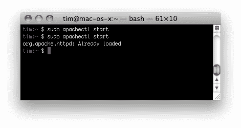

# 二、设置您的开发环境

> 在本章中，我们将设置您的计算机，以便您可以使用 PHP 和 CouchDB 开发 web 应用。在开发 web 应用时，有很多技术发挥作用，因此我们需要确保在开始编写代码之前正确配置系统。

在本章中，我们将：

*   讨论您的操作系统以及如何安装必要的组件
*   了解开发 PHP 和 CouchDB 应用所需的工具
*   配置我们的 web 开发环境
*   了解自制软件并安装 CouchDB
*   使用自制软件安装 Git 进行版本控制
*   确认您可以向 CouchDB 发出请求

你准备好了吗？好的让我们从讨论操作系统以及它们在设置开发环境中所起的作用开始。

# 操作系统

本书将主要关注 MacOSX 操作系统（10.5 及更高版本）。虽然在任何操作系统上使用 PHP 和 CouchDB 开发应用都是可能的，但为了简单和简洁，我将把大部分讨论限制在 MacOSX 上。如果您使用的是 Mac，您可以跳到下一节，标题为*在 Mac OS X*上设置 web 开发环境。

如果您正在运行 Windows 或 Linux，不要担心！我会给你一些安装技巧，让你开始，然后你可以从那里。同样，值得注意的是，我在本书中使用的命令行语句是用于 Mac OS 的。考虑到这一点，诸如导航到工作目录、文件位置等可能无法按上述方式工作。

## 窗户

如果您正在运行 Windows，则需要遵循一些简单的步骤来启动并运行计算机。

### 安装 Apache 和 PHP

您可以使用 WAMP（[简化 Apache 和 PHP 环境的设置 http://www.wampserver.com/en/](http://www.wampserver.com/en/) 或 XAMPP（[http://www.apachefriends.org/en/xampp.html](http://www.apachefriends.org/en/xampp.html) ）。这两个选项使您只需点击几下鼠标就可以轻松地设置 Apache 和 PHP。

### 安装 Git

**Git**适用于所有操作系统。要安装 Git for Windows，请导航到 Git 的主页（[http://git-scm.com/](http://git-scm.com/) ），然后单击 Windows 图标。

### 安装 CouchDB

您可以在此处找到有关使用 Apache 的有用安装页面安装 CouchDB for Windows 的更多信息：[http://wiki.apache.org/couchdb/Installing_on_Windows](http://wiki.apache.org/couchdb/Installing_on_Windows) 。

## Linux

Linux 的 `install`方法很难标准化，因为有许多不同的风格和配置。但是，如果您使用的是通用发行版，比如 Ubuntu，那么只需几个简单的命令行语句就可以安装所有必需的工具。

### 安装 Apache 和 PHP

`apt-get`是一个强大的工具，我们将使用它在您的系统中安装应用和实用程序。让我们首先通过运行以下命令来确保 `apt-get`是最新的：

```php
sudo apt-get update 

```

让我们通过安装 Apache 来确保能够承载我们的 PHP 页面：

```php
sudo apt-get install apache2 

```

现在我们有了 Apache，让我们安装 PHP 和一些运行本书中代码所需的其他组件：

```php
sudo apt-get install php5 php5-dev libapache2-mod-php5 php5-curl php5-mcrypt 

```

我们拥有托管网站所需的一切。因此，让我们重新启动 Apache 以使我们的更改生效：

```php
sudo /etc/init.d/apache2 restart 

```

### 安装 Git

我们将使用 Git 进行源代码控制；幸运的是，在朋友 `apt-git`的帮助下，安装起来非常简单。通过运行以下命令安装 Git:

```php
sudo apt-get install git-core 

```

### 安装 CouchDB

CouchDB 是我们将在本书的整个课程中使用的数据库。在本节中，我们将使用命令行安装并启动它。

1.  使用 `apt-get:`

    ```php
    sudo apt-get install couchDB 

    ```

    安装 CouchDB
2.  通过运行以下命令将 CouchDB 作为服务启动：

    ```php
    sudo /etc/init.d/couchdb start 

    ```

那很容易，对吧？如果您正在使用另一个 Linux 发行版，那么您可能需要研究如何安装所有必需的应用和工具。

现在我们已经解决了这个问题，让我们讨论一下 MacOSX 的 web 开发环境的设置。

# 在 Mac OS X 上设置 web 开发环境

在本节中，我们将逐步确保正确设置开发环境。从现在开始，我假设您使用的机器运行 MacOSX，没有对 Apache 或 PHP 进行任何特殊修改。如果您已经对您的开发环境进行了大量定制，那么您可能已经知道如何配置您的机器，以便一切正常工作。

现在我已经用免责声明烦死你了，让我们开始吧！我们旅程的第一部分是遇到一个我们将花费大量时间的应用： `Terminal`。

## 终端

`Terminal`是 Mac OS X 的内置命令行实用程序。刚开始使用命令行可能会有点奇怪，但一旦掌握了它，它就非常强大。如果基本命令，如 `cd, ls`和 `mkdir`在您看来像是胡言乱语，那么您可能需要对 UNIX 命令行进行一些快速研究。

以下是您如何打开 `Terminal:`

1.  打开**查找器**。
2.  点击**应用**。
3.  找到名为**实用程序**的文件夹，并将其打开。
4.  将**终端**图标拖动到您的基座上；你会经常使用它！
5.  Click on the icon for **Terminal** in your dock.

    

# 行动时间-使用终端显示隐藏文件

现在我们已经启动并运行了 `Terminal`，让我们通过运行一个快速命令来熟悉它，该命令将公开计算机上所有隐藏的文件。不管您是否知道，有各种各样的文件是隐藏的，它们需要是可见的，以便我们完成开发环境的设置。

1.  首先打开**终端**。
2.  输入以下命令，允许查找器显示隐藏文件，准备好后按*回车*：

    ```php
    defaults write com.apple.finder AppleShowAllFiles TRUE 

    ```

3.  要查看文件，您需要重新启动 `Finder`，键入以下命令，然后按*回车键：*

    ```php
    killall Finder 

    ```

## 刚才发生了什么事？

我们只是使用 `Terminal`运行一个特殊命令，配置 `Finder`显示隐藏文件，然后运行另一个命令重新启动 `Finder`。记住这些命令或完全理解它们的含义对你来说并不重要；您可能再也不必键入此内容了。如果你环顾一下你的电脑，你会看到很多你以前没见过的文件。下面是我的硬盘现在的样子的一个快速示例：


### 提示

如果看到这么多文件会使您感到不安，则可以在安装完成后再次隐藏隐藏的文件。只需在 `Terminal:`默认写入 `com.apple.finder AppleShowAllFiles FALSE`中运行以下命令即可。然后通过运行 `killall Finder`重新启动 `Finder`。

现在我们机器上的所有文件都显示出来了，让我们来谈谈文本编辑器，它将是您查看和编辑开发项目的主要方式。

## 文本编辑器

为了编写代码，您需要一个纯文本编辑器。有很多文本编辑器，你可以使用任何你喜欢的。本书中的所有代码都可以与它们中的任何一个一起使用。我个人更喜欢 `TextMate`，因为它简单易用。

您可以在此处下载并安装 `TextMate`：[http://macromates.com/](http://macromates.com/) 。

## 阿帕奇

**Apache**是一个开源的 web 服务器和引擎，它将运行您将在本书中编写的 PHP 代码。幸运的是，所有 Mac OS X 的安装都预装了 Apache，所以我们需要做的就是使用 `Terminal`启动它。

1.  打开**终端**。
2.  运行以下命令启动 Apache:

    ```php
    sudo apachectl start 

    ```

这就是让 Apache 在您的计算机上启动和运行所需要的一切。如果它已经在运行，Apache 不会让您打开它。再次尝试键入相同的语句；您的计算机将提醒您它已在运行：



### 注

这不太可能，但如果您的机器没有安装 Apache，您可以按照 Apache 网站上的说明进行安装：[http://httpd.apache.org/docs/2.0/install.html](http://httpd.apache.org/docs/2.0/install.html) 。

## 网络浏览器

你可能每天上网时都会使用网络浏览器，但它对我们来说也是一个强大的调试工具。我将使用 Chrome 作为我的 web 浏览器，但最新版本的 Safari、Firefox 或 Internet Explorer 也可以正常工作。让我们使用 web 浏览器检查 Apache 是否可访问。

# 行动时间-打开您的 web 浏览器

我们将通过打开 web 浏览器并导航到 Apache 的 URL 来访问机器上的 Apache 服务。

1.  打开 web 浏览器。
2.  在地址栏中输入 `http://localhost`，点击*进入*。
3.  Your browser will display the following message to you:

    

## 刚才发生了什么事？

我们使用 web 浏览器访问 Apache，作为回报，它向我们展示了一个快速验证，证明所有东西都正确连接。我们的计算机知道我们正试图访问本地 Apache 服务，因为 URL `http://localhost`。URL `http://localhost`实际上映射到地址 `http://127.0.0.1:80`，这是 Apache 服务的地址和端口。当我们讨论 CouchDB 时，你会看到 `127.0.0.1`再次出现。

## PHP

`PHP`出现在本书的标题中，因此您知道它将在开发过程中发挥重要作用。PHP 已经安装在您的计算机上，因此您没有任何要安装的内容。让我们再次检查您是否可以使用终端访问 PHP。

# 行动时间-检查 PHP 版本

我们将通过终端访问您的计算机来检查 PHP 是否在您的计算机上工作。

1.  打开**终端**。
2.  对 PHP 运行以下命令以返回其版本：

    ```php
    php -v 

    ```

3.  **Terminal** will respond with something similar to the following:

    

## 刚才发生了什么事？

我们使用**终端**来确保 PHP 在我们的机器上正确运行。我们不仅检查了 PHP 是否可以访问，还询问了它的版本。您的版本可能与我的略有不同，但重要的是您的版本是 PHP5.3 或更高版本。

### 注

如果您的版本低于 PHP5.3 或无法让 PHP 响应，您可以通过查看 PHP 手册[进行安装或升级 http://php.net/manual/en/install.macosx.php](http://php.net/manual/en/install.macosx.php) 。

# 是时候采取行动了——确保 Apache 可以连接到 PHP

为了创建 web 应用，Apache 需要能够运行 PHP 代码。因此，我们将检查 Apache 是否可以访问 PHP。

1.  使用**Finder**导航到以下文件夹： `/etc/apache2`。
2.  在文本编辑器中打开名为 `httpd.conf`的文件。
3.  查看文件，找到以下行（应该在 `116):`

    ```php
    #LoadModule php5_module libexec/apache2/libphp5.so 

    ```

    行附近）
4.  删除此字符串前面的散列（#）符号，以取消对 `config`文件此行的注释。您的配置文件可能已经有此未注释的内容。如果是这样，那么你就不需要改变任何事情。无论如何，最终结果应该如下所示：

    ```php
    LoadModule php5_module libexec/apache2/libphp5.so 

    ```

5.  打开**终端**。
6.  通过运行以下命令重新启动 Apache:

    ```php
    sudo apachectl restart 

    ```

## 刚才发生了什么事？

我们打开了 Apache 的主配置文件 `httpd.conf`，并取消了一行注释，以便 Apache 可以加载 PHP。然后重新启动 Apache 服务器，以便更新的配置生效。

# 行动时间-创建快速信息页面

我们将再次检查 Apache 是否可以通过快速创建一个 `phpinfo`页面来呈现 PHP 脚本，该页面将显示有关配置的大量数据。

1.  打开文本编辑器。
2.  创建包含以下代码的新文件：

    ```php
    <?php phpinfo(); ?>

    ```

3.  使用名称 `info.php`保存文件，并将该文件保存在以下位置： `/Library/WebServer/Documents/info.php`。
4.  打开浏览器。
5.  将浏览器导航至 `http://localhost/info.php`。
6.  Your browser will display the following page:

    

## 刚才发生了什么事？

我们使用文本编辑器创建了一个名为 `info.php`的文件，其中包含一个名为 `phpinfo`的特殊 PHP 函数。我们将 `info.php`文件保存到文件夹 `/Library/Webserver/Documents`中。此文件夹是 Apache 服务将显示的所有文件的默认位置（仅在 Mac OS X 中）。当您的浏览器点击 `info.php`页面时， `phpinfo`查看了您的 PHP 安装，并返回了一个 HTML 文件，其中包含有关您配置的详细信息。你可以看出这里发生了很多事情。在我们继续之前，请随意浏览并查看一些信息。

## 微调

我们终于建立了基本的 web 开发环境。然而，为了构建我们的应用，我们需要在 Apache 中调整一些事情；第一个是启用一个名为 `mod_rewrite`的强大内置模块。

# 行动时间-Apache 的进一步配置

`mod_rewrite`将允许我们动态重写请求的 URL，这将帮助我们构建一个具有干净 URL 的应用。重写本身在另一个名为 `.htaccess`的 Apache 配置文件中处理，我们将在[第 4 章](04.html "Chapter 4. Starting your Application")、*启动应用*中讨论。在下一节中，我们将配置 Apache，以便启用 `mod_rewrite`。

1.  使用**Finder**导航到以下文件夹： `/etc/apache2`。
2.  在文本编辑器中找到并打开名为 `httpd.conf`的文件。
3.  查看文件，找到这一行（应该是第 `114):`

    ```php
    #LoadModule rewrite_module libexec/apache2/mod_rewrite.so 

    ```

    行）
4.  通过删除散列（#）符号取消对行的注释。您的系统可能已经配置为启用 `mod_rewrite`。无论如何，请确保它与以下代码匹配：

    ```php
    LoadModule rewrite_module libexec/apache2/mod_rewrite.so 

    ```

5.  查看文件，找到这段代码（应该从第 `178-183):`

    ```php
    <Directory />
    Options FollowSymLinks
    AllowOverride None
    Order deny,allow
    Allow from all
    </Directory>

    ```

    行开始）
6.  更改写有 `AllowOverride None`的代码行，并将其改为 `AllowOverride All`。结果部分应如下所示：

    ```php
    <Directory />
    Options FollowSymLinks
    AllowOverride All 
    Order deny,allow
    Allow from all
    </Directory>

    ```

7.  继续滚动文件，直到找到这段代码（应该从第 `210-215):`行

    ```php
    #
    # AllowOverride controls what directives may be placed in #.htaccess files.
    # It can be —All—, —None—, or any combination of the keywords:
    # Options FileInfo AuthConfig Limit
    #
    AllowOverride None

    ```

    开始）
8.  更改此代码中表示 `AllowOverride None`的行，并将其更改为 `AllowOverride All`。结果部分应如下所示：

    ```php
    #
    # AllowOverride controls what directives may be placed in #.htaccess files.
    # It can be "All", "None", or any combination of the keywords:
    # Options FileInfo AuthConfig Limit
    #
    AllowOverride All

    ```

9.  打开**终端**。
10.  通过运行以下命令重新启动 Apache:

    ```php
    sudo apachectl restart 

    ```

## 刚才发生了什么事？

我们刚刚配置了 Apache，以便它可以更自由地运行，并包括使用 `mod_rewrite`模块重写 URL 的能力。然后，我们将 `AllowOverride`的配置从 `None`更改为 `All. AllowOverride`，告知服务器在找到 `.htaccess`文件时要做什么。设置为 `None`时， `.htaccess`文件被忽略。将设置更改为 `All`允许在 `.htaccess`文件中覆盖设置。这正是我们在[第 4 章](04.html "Chapter 4. Starting your Application")中开始构建应用时要做的。

## 我们的网站开发设置已完成！

我们现在已经为创建标准 web 应用做好了一切准备。我们有 Apache 处理请求。我们已经连接了 PHP 并响应来自 Apache 的调用，我们已经准备好了文本编辑器，可以处理任何代码。

对于我们来说，拥有一个完整的开发环境仍然缺少一些东西。在下一节中，我们将安装 CouchDB 作为我们的数据库。

## 安装 CouchDB

在本节中，我们将在您的计算机上安装 CouchDB 1.0，并为开发做好准备。在您的机器上安装 CouchDB 有多种方法，因此如果您在以下安装过程中遇到问题，请参考 CouchDB 的网站：[http://wiki.apache.org/couchdb/Installation](http://wiki.apache.org/couchdb/Installation) 。

## 自制

为了安装我们将在本书中使用的其余组件，我们将使用一个名为**自制**的实用程序。自制是安装苹果在 OSX 中遗漏的 UNIX 工具的最简单方法。在使用 Homebrew 安装其他工具之前，我们首先需要安装 Homebrew。

# 行动时间-安装自制软件

我们将使用**终端**下载自制软件并安装到我们的电脑上。

1.  打开**终端**。
2.  在**终端**中输入以下命令，每行后按*回车*：

    ```php
    sudo mkdir -p /usr/local
    sudo chown -R $USER /usr/local
    curl -Lf http://github.com/mxcl/homebrew/tarball/master | tar xz -- strip 1 -C/usr/local 

    ```

3.  **终端**将以进度条响应，并向您展示安装过程。安装完成后，您将收到一条成功消息，您将再次控制**终端**。

## 刚才发生了什么事？

我们添加了目录 `/usr/local`，Homebrew 将在其中保存其所有文件。然后，我们确保该文件夹归我们（当前用户）所有。然后，我们使用 `cURL`语句安装了 Homebrew，以从 Github 获取存储库（我将在本章后面介绍 `cURL`，我们将大量使用它）。抓取存储库后，使用命令行功能 `tar`将其解压缩，并放入 `/usr/local`文件夹中。

# 行动时间-安装 CouchDB

现在我们已经安装了自制软件，我们终于可以安装 CouchDB 了。

### 注

请注意，在 Homebrew 安装 CouchDB 之前，它将安装其所有依赖项，包括：Erlang、Spidermonkey、ICU 等。此部分可能需要 10-15 分钟才能完成，因为它们是在您的计算机上本地编译的。不要担心，如果它似乎需要太长时间；这是正常的。

我们将使用自制软件安装 CouchDB。

1.  开放式终端
2.  运行以下命令：

    ```php
    brew install couchdb -v 

    ```

3.  终端将在接下来的几分钟内回复大量文本。您将看到它抓取每个依赖项，然后安装它。最后，您将收到一条成功消息。

## 刚才发生了什么事？

我们刚刚从源代码安装了 CouchDB，并下载了它的所有依赖项。安装后，Homebrew 将所有内容放在正确的文件夹中，并配置使用 CouchDB 所需的所有内容。

# 检查我们的设置是否完成

在过去的几页里我们完成了很多。我们已经建立了 web 开发环境并安装了 CouchDB。现在，让我们再次检查是否可以运行和访问 CouchDB。

## 启动 CouchDB

CouchDB 易于管理。它作为一种服务运行，我们可以使用命令行启动和停止它。让我们用命令行语句启动 CouchDB。

1.  打开**终端**。
2.  运行以下命令：

    ```php
    couchdb -b 

    ```

3.  **终端**将回复以下内容：

    ```php
    Apache CouchDB has started, time to relax. 

    ```

伟大的现在我们已经将 CouchDB 作为后台进程启动，它将在后台处理请求，直到我们关闭它为止。

# 行动时间-检查 CouchDB 是否正在运行

我们将尝试使用命令行实用程序 `cURL`（为了简单起见，我们将从这里开始拼写它 `curl`），在我们的机器上使用 CouchDB 服务，它允许您发出原始 HTTP 请求。 `curl`是我们与 CouchDB 沟通的主要方式。让我们从一个 `curl`声明开始与 CouchDB 对话。

1.  打开**终端**。
2.  运行以下语句以创建将命中 CouchDB 的请求：

    ```php
    curl http://127.0.0.1:5984/ 

    ```

3.  **终端**将回复以下内容：

    ```php
    {"couchdb":"Welcome","version":"1.0.2"} 

    ```

## 刚才发生了什么事？

我们刚刚使用 `curl`通过发出 `GET`请求与 CouchDB 服务通信。默认情况下， `curl`将假定我们正在尝试发出 `GET`请求，除非我们另有说明。我们向 `http://127.0.0.1:5984`发布了 `curl`声明。将此资源分解为多个部分， `http://127.0.0.1`是本地计算机的 IP， `5984`是 CouchDB 默认运行的端口。

## 后台进程运行 CouchDB

如果我们在这里停止配置，那么每次开始开发时都必须运行 `couchdb b`。这将很快成为我们的痛点。因此，让我们将 CouchDB 作为一个系统守护进程运行，它将始终在后台运行，即使在重新启动计算机之后也是如此。为了做到这一点，我们将使用一个名为 `launchd`的 Mac OS X 服务管理框架来管理系统守护进程，并允许启动和停止它们。

1.  打开**终端**。
2.  通过运行以下命令来杀死 CouchDB 的后台进程：

    ```php
    couchdb -k 

    ```

3.  如果 CouchDB 正在运行，它将返回以下文本：

    ```php
    Apache CouchDB has been killed. 

    ```

4.  Let's run CouchDB as a real background process and ensure that it starts each time you start your computer by running the following statement:

    ```php
    launchctl load -w /usr/local/Cellar/couchdb/1.0.2/Library/LaunchDaemons/org.apache.couchdb.plist 

    ```

    ### 注

    如果您的 CouchDB 版本与我的不同，您必须更改此脚本中显示“1.0.2”的版本，以匹配您的版本。

CouchDB 现在在后台运行，即使我们重新启动计算机，在尝试使用它之前也不必担心启动服务。

如果出于某种原因，您决定不希望 CouchDB 在后台运行，可以通过运行以下命令卸载它：

```php
launchctl unload /usr/local/Cellar/couchdb/1.0.2/Library/LaunchDaemons/org.apache.couchdb.plist 

```

您可以使用前面使用的 `curl`语句再次检查以确保 CouchDB 正在运行：

1.  打开**终端**。
2.  运行以下命令：

    ```php
    curl http://127.0.0.1:5984/ 

    ```

3.  **终端**将回复以下内容：

    ```php
    {"couchdb":"Welcome","version":"1.0.2"} 

    ```

# 安装版本控制

版本控制系统允许开发人员跟踪代码更改，合并其他开发人员的代码，并回滚任何意外错误。版本控制系统对于有多个开发人员的项目来说是必须的，但对于单个开发人员的项目来说，版本控制系统也可以起到救命的作用。把它想象成一个安全网——如果你不小心做了一些你不想做的事情，那么源代码管理就是为了保护你。在版本控制方面有几种选择，但在本书中，我们将使用 Git。

## 吉特

吉特（[http://git-scm.com/](http://git-scm.com/) 由于其分布性和易用性，已成为一种更受欢迎和广泛采用的版本控制系统。唯一比实际使用 Git 更容易的事情就是安装它。我们将使用自制来安装 Git，就像我们对 CouchDB 所做的那样。

# 行动时间-安装和配置 Git

准备好！我们将使用自制软件在计算机上安装 Git。

1.  打开**终端**。
2.  运行以下命令以使用自制软件安装 Git:

    ```php
    brew install git 

    ```

3.  **终端**将在短时间内为您下载并安装 Git。然后，它将以一条成功消息作为响应，告诉您 Git 已经安装。
4.  安装 Git 后，您需要对其进行配置，以便在提交数据更改时，它知道您是谁。运行以下命令来识别您自己，并确保在我放置的 `Your Name`和 `your_email@domain.com:`

    ```php
    git config global user.name "Your Name"
    git config global user.email your_email@domain.com 

    ```

    位置填写您自己的信息

## 刚才发生了什么事？

我们刚刚使用自制从源代码安装了 Git。然后，我们将 Git 配置为使用我们的名称和电子邮件地址。这些设置将确保识别从此计算机提交给源代码管理的任何更改。

# 您有什么问题吗？

我们的系统配置都完成了！在一个完美的世界里，所有的东西都可以毫无问题地安装，但完全有可能有些东西安装得不完美。如果你觉得有什么不对劲，或者你认为你可能在这过程中犯了一些错误，我有一个脚本，你可以运行它来帮助你回到正轨。这个命令可以通过调用我在 github 上的文件在本地执行。您只需在**终端**中运行以下命令，即可运行本章所需的所有代码：

**sh<（旋度-shttps://raw.github.com/timjuravich/environment-setup/master/ configure.sh）**

这个脚本将完成本节中提到的所有工作，并且可以安全地运行任意多个时间。我本可以给你这个命令并在之前完成章节，但本章是教你如何使用我们将在接下来的章节中使用的工具和实用工具的一部分。

## 突击测验

1.  当我们在 web 开发中使用默认的 Apache installati 时，默认的工作目录在哪里？
2.  为了使用本地开发环境和 CouchDB，我们需要确保两个服务正在运行。它们是什么？如何让它们在**终端运行？**
3.  您使用什么命令行语句向 CouchDB 发出`Get`请求？

# 总结

让我们快速回顾一下本章中介绍的所有内容：

*   我们熟悉了**终端**，并用它来显示隐藏的文件
*   我们安装了一个文本编辑器，以便在开发中使用
*   我们学习了如何配置 Apache 以及如何通过命令行与之交互
*   我们学习了如何创建简单的 PHP 文件，并将它们放置在正确的位置，以便 Apache 能够显示它们
*   我们学习了如何安装自制软件，然后用它安装 CouchDB 和 Git
*   我们检查以确保 CouchDB 已启动并运行

在下一章中，我们将更加熟悉 CouchDB，并探索如何在 web 应用的创建中使用它。