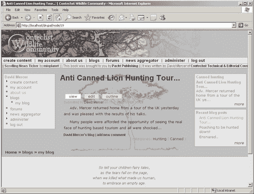
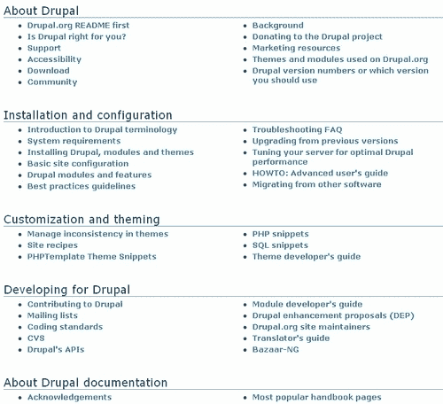
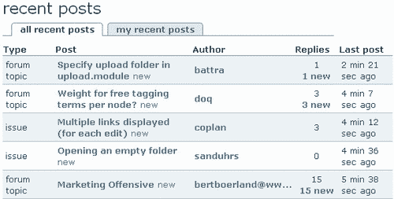
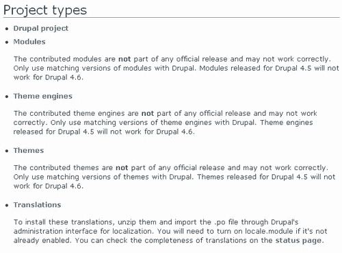

# 一、Drupal 简介

直到最近，一个网络新手为了准备建立一个网站所能做的最重要的事情就是买一本关于如何学习使用任何一种主要的以网络为中心的语言（如 PHP 或 Perl）编程的书。然后，将所选语言的细节学习到一个值得尊敬的程度这项不可忽视的任务将消耗大量的时间和耐心。一旦我们不幸的新来者掌握了足够的基础知识，将这些知识有效、可靠地应用到编程中，再加上在网站开发之前坚持工作的毅力，可以说是一项巨大的成就。

对于像你这样的人来说，这种情况是完全不能接受的，而且应该是完全不能接受的！这就像强迫律师学习建筑、建筑和砖石的复杂性，仅仅因为他们需要一个法庭来工作。显然，将网站*开发软件*的技术任务与该网站的*功能*分离是一件非常明智的事情，主要原因是它允许人们专注于他们擅长的东西，而不必花费时间和精力成为优秀的软件开发人员。

因此，毫不奇怪，近年来，开源社区一直在努力通过为我们提供灵活的框架来构建基于 web 的企业，将编程世界从软件黑暗时代拉出来。这些框架将网站创建者从学习软件开发思想和概念的智力负担中解脱出来，使他们能够更加关注面向目标/业务的配置和定制任务。

Drupal 就是软件开发演进的结果之一，本书旨在为您提供有效使用它以满足您的需求所需的基本信息。因为这本书更多地关注管理 Drupal 的初级方面，所以您会很高兴地知道，例如，您不需要学习如何开发自己的 Drupal 模块，只需要很少甚至不需要编码。这并不是说你的介绍很简单；相反，这本书将以这样一种方式教你，你能够运用你的知识自信地解决超出本材料范围的问题。

在我们开始实际构建任何类似于网站的东西之前，我相信您会有很多关于 Drupal 的方式、内容、位置和原因的问题。因此，本章不仅将为本书的其余部分提供背景，还将作为对整个技术的介绍，包括对以下内容的讨论：

*   Drupal 概述
*   Drupal 是如何诞生的
*   Drupal 能提供什么
*   Drupal 的使用
*   构建 Drupal 站点
*   Drupal 社区
*   Drupal 许可证

上面提到了*构建 Drupal 站点*部分介绍了演示网站，它是我们所有实际示例的基础。这是必要的，因为在整本书中，我们将系统地利用每一章的新信息来创建一个功能齐全的网站。这样做将有助于将你学到的经验教训与你在网站上预期的结果联系起来。这反过来有助于培养完善的管理、配置和定制方法，帮助您发展自己的 Drupal 技能。

让我们开始…

# Drupal 概述

对 Drupal 最简洁的描述是它是一个**开源内容管理系统**。如果您对计算和 Drupal 都是新手，那么这可能不会让事情变得很清楚。让我们快速分析这个短语，以便更好地理解。首先，术语*开源*用于描述*软件，其源代码可供用户或其他开发人员在其认为合适的情况下*使用或修改，通常受某些条件的限制。Drupal 可用的具体条件将在本章后面的*Drupal 许可*一节中进行更详细的审查。

除此之外，开源对于打算使用 Drupal 的人来说意味着你不必为这个毫无疑问有价值的软件付费。您还加入了一个由 Drupal 用户、开发人员和管理员组成的大型社区（也将在本章后面讨论），他们订阅开源理念，换句话说，如果您陷入困境，可能会有人愿意花时间帮助您。

如果你仔细想想，对于那些仍然不相信开源技术的人来说，这是一笔不错的交易。我们不仅没有自己开发整个网站，而且还可以利用成千上万其他人的集体智慧。关于开源，我们还有什么可以说的吗？有一点是肯定的，您可以非常肯定的是，有了像 Drupal 这样的活跃社区，开发可以快速灵活地进行，因为任何问题都可以及早发现并有效地处理。这意味着您可以期望网站具有高水平的稳定性、安全性和性能。

*到目前为止还不错，但内容管理系统（CMS）部分是关于什么的？*我们有必要更仔细地了解这意味着什么，以便充分了解我们所处的环境。我们可以将内容管理系统定义为便于创建、组织、操作和删除图像、文档、脚本、纯文本（或任何其他相关内容）形式的信息的*软件。如果您需要组织和显示相当多的信息，特别是当内容可能是从各种不同的来源创建或交付时，那么内容管理系统无疑是您所需要的。*

基本上你只需要知道这些。Drupal 提供了一个免费的平台及其附带的社区，用于满足各种各样的内容管理需求。确切地说，一个人能够实现什么样的事情是本章后面题为*Drupal 必须提供什么*一节的主题。现在，让我们回顾一下时间之手，看看我们今天所知道的 Drupal 是如何结束的。

# Drupal 是如何产生的

正如许多现代成功故事一样，这一故事始于一个宿舍，两个学生需要实现一个特定的目标。在这种情况下，安特卫普大学的 Dries Buytaert 和 Hans Snijder 希望共享一个 ADSL 调制解调器连接到互联网。他们通过无线网桥实现了这一点，但不久之后，德里斯决定在一个新闻网站上工作，除了学生们已经共享的简单连接之外，还允许他们共享新闻和其他信息。

随着时间的推移，随着 Dries 应用程序的扩展和新事物的试验，该网站不断发展和变化。然而，直到 2001 年晚些时候，Drupal 才成为开源软件。当时，Drupal 决定向公众发布代码，希望这能鼓励其他人进行开发。很明显，向公众发布源代码是正确的选择，因为今天 Drupal 拥有一个组织良好、欣欣向荣的社区，其中包括认可的贡献者、论坛、安全团队和全球存在，以及大量通过 bug 报告和建议定期做出宝贵贡献的用户。

在短短的五年内，Dries 和其他人开发了一个小型的宿舍间应用程序，并将其转化为一项技术，为全球社会通过网络进行交流的方式做出了贡献。这体现在他们简短的使命声明中，内容如下：

> 通过建立相关标准和开源技术，Drupal 支持并增强了互联网作为一种媒介的潜力，在这种媒介中，不同的、地理位置不同的个人和团体可以共同产生、讨论和共享信息和想法。Drupal 以社区和协作为中心，其灵活性允许在线信息系统和社区的协作生产。

最终，Drupal 将走向何方以及它是如何形成的，也是由指导开发这项技术的人的哲学所驱动的。正如您在本书的整个过程中所看到的，可以公平地说，Drupal 社区到目前为止已经成功地实现了它的崇高目标。

# Drupal 能提供什么

从您的角度来看，到目前为止，本节的主题是我们需要涵盖的最重要的主题。作为技术和软件的用户，我们决不能对服务于我们的技术的要求松懈。因此，在这个阶段讨论我们对 Drupal 的期望是合适的，以确保它能够满足我们的需求。

Drupal 有三个不同的方面，我们需要考虑的是它是否是一个好的 T1 技术。会是：

*   **可靠、健壮：***代码中有很多 bug 吗？如果我必须永远添加补丁或获取错误代码的更新，这会影响我的网站吗？*
*   **高效：***代码是否明智地使用了我的服务器资源？我是否可能在早期遇到并发问题或速度问题？*
*   **灵活：***如果我改变了我的想法，我想从我的网站得到什么，我是否能够实现这些更改，而不必从头开始重做所有事情？*

在谷歌上快速搜索一下，就会发现有大量关于 Drupal 性能的好评，也有大量赞扬其易用性和灵活性的文章。虽然 Drupal 将始终是一项正在进行的工作，但可以想当然地认为，您将用于构建网站的源代码经过了精心编制和精心设计。事实上，Drupal 的开发人员非常认真地对待前面列出的要点，并将其写入他们的原则集合中，您可以在[上阅读 http://drupal.org/node/21945](http://drupal.org/node/21945) 。

虽然目前对我们影响不大，但值得注意的是：

### 注

Drupal 的一个巨大优势是代码本身编写得非常好，这使得修改非常容易。这意味着，当您尝试更高级的任务时，Drupal 的编写方式将为您提供优于其他平台的优势。

我们需要考虑的下一件事是 Drupal 像我们一样，作为管理员，使用什么？当然，我们希望事情尽可能简单，这样我们就不会花时间陷入问题或复杂设置的泥潭，或者更糟糕的是，必须定期修改源代码以满足我们的需要。理想情况下，我们需要一个系统：

*   **易于设置和运行：***我可以以最小的麻烦开始创建我的网站吗？在我能够使用 Drupal 之前，我需要学习一整套其他技术吗？*
*   **工作直觉：***一旦我开始找到自己的方向，学习新事物会容易吗？如果我不是一个特别的技术人员，我会努力管理我的网站吗？*
*   **灵活且易于扩展：***我知道我可以创建一个基本站点，但我真的很想创建一个独特而复杂的世界级高手，这可以通过 Drupal 实现吗？*

再一次，这些正是 Drupal 所熟知的属性。每个要点后面的问题都是每个属性所回答问题类型的示例。如果您有其他关于 Drupal 的问题，这里没有特别提到，那么请尝试将它们与要点联系起来。如果你仍在挣扎，试着通过论坛或谷歌搜索你的答案。

最后，也许在某些方面，最重要的是，你需要考虑 Drupal 是否为你的网站用户创造了一个良好的环境。显然，如果一项设计良好、易于管理的技术的使用过于复杂，那么它仍然不会有很大帮助。了解 Drupal 可以提供什么类型的环境的最好方法是继续并查看位于[的 Drupal 主页 http://drupal.org](http://drupal.org) 。无论如何，你应该注册一个账户，并活跃在社区中（相信我，从长远来看，这对你会有很大的好处）。所以，也许可以把你的注册过程看作是一种快速而简单的浏览网站的方式。

当然，如果您可以轻松地使用 Drupal 开发的主站点，那么您就可以为您的社区或 weblog（也称为博客）创建一个易于使用的站点。

# Drupal 的用法

从纯理论的角度来看，希望您确信利用 Drupal 源代码帮助您创建网站是一个很好的选择。当然，了解这一点并不能帮助你从实践的角度准确地发现如何使用它。您仍然需要知道使用 Drupal 通常创建哪些类型的站点。如前所述，任何需要大量处理内容的企业都有可能成为 Drupal 的候选者。

由于它的可扩展性和灵活性，您在决定使用 Drupal 时并没有受到很大限制。以下列表显示了目前最常见的用途，来自案例研究页面（[http://drupal.org/cases Drupal 站点上的](http://drupal.org/cases)：

*   **社区门户网站**（术语*门户*指的是互联网用户的网站入口）：如果你想要一个由观众提供故事的新闻网站，Drupal 很适合你的需要。观众会自动投票选出新的故事，最好的故事会出现在主页上。负面报道和评论在获得足够多的反对票后会自动隐藏。
*   **个人网站：**Drupal 非常适合那些只想要一个个人网站的用户，在这个网站上，他可以保存一个博客，发布一些照片，也许还可以保存一个有组织的链接集合。
*   **发烧友网站：**Drupal 为门户网站提供动力，让一个人分享他们的专业知识和对某个主题的热情，从而繁荣起来。
*   **内部网/公司网站：**公司在 Drupal 中维护其内部和外部网站。Drupal 在这里工作得很好，因为它具有灵活的权限系统，并且易于基于 web 的发布。你不必再等待一个网站管理员给你的最新项目的消息。
*   **资源目录：**如果您想要一个给定主题的中心目录，Drupal 是适合您的工具。用户可以注册并建议新资源，而编辑可以筛选他们提交的内容。
*   **国际网站：**当您开始使用 Drupal 时，您加入了一个由用户和开发人员组成的大型国际社区。由于 Drupal 中的本地化特性，有许多 Drupal 站点是用多种语言实现的。
*   **教育：**Drupal 可用于创建动态学习社区，以补充面对面课堂或作为远程教育课程的平台。学术专业组织受益于其互动功能以及提供公共内容、会员专用资源和会员订阅管理的能力。
*   **艺术、音乐和多媒体：**对于社区艺术网站来说，Drupal 是一个很好的组合。没有其他平台为开发多媒体丰富的网站提供了坚实的基础，这些网站允许用户与他人分享、分发和讨论他们的工作。随着时间的推移，Drupal 只会为多媒体应用程序中使用的音频、视频、图像和播放列表内容开发更强大的支持。

我想我应该明确一点，虽然您可以将 Drupal 用于很多事情，但您可能应该将它的用途限制在补充其设计的那些事情上，就像前面列表中提到的那样。如果您想从您的社区网站零售大量商品，那么您可能希望考虑使用像 OSuffic 这样专门为该目的而设计的东西，即使有可能使用贡献的模块将 Drupal 站点的产品零售出去。

# 建立 Drupal 站点

与建造房屋不同，网站的开发是在网站的*副本*上进行的，而不是真实的网站。这意味着，在网站建设期间，公众无法在互联网上查看和使用该网站。经过一点思考，这应该是有意义的。任何潜在的社区成员在访问你的网站时，都可能会对那些不起作用的零碎东西、错误消息、不整洁的演示文稿或任何其他事情感到沮丧，这些事情可能会让人们一下子吓跑。

一些读者很可能想知道在这段时间内如何处理他们的域名，假设已经购买了一个域名。最好的解决方案是建立一个所谓的**占位符页面**，它传递一个简单的信息，大意是这是正确的站点，开发正在工作站点上进行，潜在成员应该在不久的将来再次访问。

如果您想在继续之前了解如何在您的 internet 站点上获取页面，请查看*部署*中的附录 a，该附录概述了将全功能网站移动到实时 web 域的过程。完成整个站点和单个页面的过程大致相同，但移动单个页面自然要简单得多。

## 规划你的网站

在我们了解演示网站的未来之前，重要的是，作为新网站的创建者，您需要花一些时间收集有关您试图服务的社区需求的信息。从长远来看，现在这样做将有助于您，因为全面了解站点的需求可以让您在开发时牢记特定的目标。这反过来又为站点的开发提供了一种更加集中和协调的方法。

确定您需要什么的最佳方法之一是建立一个站点必须能够执行的任务列表（我指的是一个书面列表，而不是一个心理列表）。实际上，在创建了您需要的各种东西的列表之后，站点管理员（很可能是您自己）应该对需求有足够清晰的了解，以便继续并开始工作。不幸的是，仅仅坐下来写东西往往很难准确预测需要什么。一个很好的开始方法是查看类似的站点。你应该继续并记下在其他网站上有用和可取的东西，并将其添加到你的列表中。

如果你陷入困境，或者想法枯竭，尝试一下下面的一些思考练习是很有帮助的。把自己分成两个人：

*   知道自己需要什么的社区成员
*   需要了解构建内容的 Drupal 管理员

使用管理员角色向社区成员询问必须做什么。从两个角度处理问题通常有助于模拟真实世界的情况，即软件开发人员在开始项目工作之前，通过提出探究性问题，试图准确地了解客户的需求。

如果你能达到这样一个阶段，你觉得自己至少理解了网站所需的 80%，那么继续创建网站可能会更有效，而不是浪费时间去收集更多信息。由于 Drupal 设计良好、可扩展且灵活，因此如果需要，可以在稍后阶段对其进行修改。

*我应该考虑什么类型的需求？*你可以问。以下是您需要决定的一些最重要主题的列表：

*   站点论坛、投票或其他内容的类型
*   运行站点统计信息、日志记录或性能问题的方式
*   涉及的安全性、角色和权限
*   需要集成联合、聚合或警报

除了站点的功能外，您还应该开始考虑您希望站点的外观。显然，一个吸引人且独特的用户界面是您在这方面的最终目标。使用主题创建一个具有视觉吸引力的网站是我们在[第 8 章](08.html "Chapter 8. Drupal's Interface")中稍后讨论的一个相当重要的话题，但请务必尽早考虑网站的这一方面。

当然，你不仅想要设计一个看起来漂亮的界面，你还想让它直观易用。这一点非常重要，因为研究表明，用户对网站的评价通常基于网站的易用性，而不总是基于其他标准，你可能认为这些标准很重要，比如速度。人们通常认为，如果他们能够更轻松地在网站上完成任务，那么运行速度较慢的网站会更快。

在本章后面标题为演示网站的部分中，有一个网站的简要说明，将在本书的整个课程中建立。通过观察类似的站点并预测站点用户的需求，您可以为自己的 Drupal 站点开发一个规范。即使 Drupal 减轻了自己编写代码的需要，但在网站开发领域，有一个网站大纲或规范是非常有价值的。

## 分析提出的解决方案

一旦有了规范，我们就知道我们需要什么。是时候看看*如何*交付了。在你的脑海中，你似乎只是坐下来，一点一点地浏览规范列表，直到所有的东西都被检查出来。从一个角度来看，这是绝对好的，当然在某个阶段，一切都应该从列表中勾选出来。但如果我们再仔细看一看，画面开始变得有点模糊，因为我们真的需要回顾一下列出的所有要点，并找出*在完成每一点时所涉及的内容*。了解未来是先发制人处理问题的最佳方式！

接下来将讨论我们需要处理的三个主要关切领域。

### 可行性

有一个愿望清单是决定你想要什么的好方法，但这并不意味着它是可行的。为了可行，标准不应涉及相对于其将带来的利益的过度努力。例如，如果站点规范要求一个功能需要 100 个小时的残酷、令人沮丧的编程，那么如果它不会对您的社区产生重大影响，那么浪费时间这样做可能不符合您的利益。

归根结底，最好是在大量的贡献中，或者从第三方软件提供商那里寻找一个便宜而优雅的替代方案。一个古老的编程咒语，*有不止一种方法可以做到这一点！*在这里适用。

### 给朋友打电话

仔细考虑你的需求。*你确定你能提供所需的一切吗？*如果没有，请花些时间查看这本书和 Drupal 网站，看看你是否能学到新东西。如果你完全陷入困境，那么进入论坛和列表并寻求帮助。Drupal 的一大优点是它是一个社区驱动的项目，大致可以理解为：*周围通常都有乐于帮助*的人。记住，这不是单向的关系，一旦你有了一些经验和知识可以分享，总会有人感谢你的帮助。

### 关键与理想标准

为了确定网站开发阶段任务的优先级，最好将所有需求分为两类：一类是网站成功所必需的，如找到服务提供商；另一类不是，例如，决定是否使您的超链接颜色为深蓝色或浅蓝色。

这有几个原因：

*   这样做可以帮助您将时间和资源分配给某些任务，同时将其他任务放到 backburner 上。
*   您知道在时间紧迫的情况下，这些功能根本不需要包括在内。

在这两种情况下，重要的是要知道什么必须完成，什么可能被遗漏或留到下一天。考虑到这一切，让我们来看看演示网站是什么，以及它打算如何满足其社区的要求…

## 演示网站

为了做一些比较有特色的事情，在本书的整个过程中，我们将建立一个名为*Contechst 野生动物社区*或 CWC 的野生动物和保护社区站点，这将满足从保护和恢复到研究和政策制定等各个方面的广泛人群的需求。这个网站的目的是成为志同道合的人的一个中心聚会点，他们希望激发讨论，交流想法和信息，这些想法和信息几乎可以是任何形式。

该网站不仅将通过创建定期的时事通讯和发布重要事件的信息来培养社区感觉，而且还将鼓励在论坛上进行公开辩论。人们希望论坛将成为一个受欢迎的会议场所，但这绝不是该网站提供的唯一设施。将定期进行民意调查，以收集各种重要主题的信息，并邀请行业专家成为该网站的博主。

当然，我们需要一个引人注目的、令人愉悦的网站外观和感觉是很自然的，最终会是这样（事实上，网站还有很多，但为了将所有内容都放在一个页面上，它被简化了一点）：

一个令人悲哀的事实是，即使这个社区网站非常受欢迎，我们仍然需要从中赚钱，仅仅是为了支付有人管理或管理它的成本。我们如何做到这一点而不向会员收取费用？有两种方法对大多数有大型关联社区的网站开放：捐赠和广告。因此，《化学武器公约》将利用一些第三方软件和一个可下载的模块来筹集资金。

CWC 旨在展示 Drupal 的许多默认行为，您将在适当的时候看到以下功能将从默认发行版中启用：

*   **博客：**一个博客，或博客，几乎就像一本日记，只由一个人维护。就演示网站而言，将有一群博客作者定期在该网站上发表文章，以便让公众了解他们在特定关注领域的动向和发展。
*   **书籍：**广泛的用户可以使用几乎任何类型的内容创建书籍。民意测验、网页、网络日志和其他内容都可以轻松添加到一本书中。这是 Drupal 的一个非常有趣的功能，因为它允许创建一本真正独特的在线书籍，可以利用基于 web 的动态内容的强大功能，为您的故事提供超现代的感觉。
*   **评论：**自然，在任何社区，人们都会对感兴趣的话题发表评论。因此，Drupal 注释功能允许用户将注释附加到他们喜欢的几乎任何内容上（取决于管理员设置的权限）。事实上，论坛是基于评论的使用，这些评论被添加到已发布到网站的特定论坛主题中。
*   **论坛：**论坛是讨论和表达想法的媒介。对于演示站点，将建立各种不同的论坛，为用户提供讨论重要主题和互动的区域。正如您将看到的，如果您愿意，您将能够非常轻松地控制论坛的内容。事实上，Drupal 允许您检查试图进入您网站的任何和所有内容。
*   **地区：**这允许您以各种不同的语言展示您的站点，以创建一个真正的国际站点。事实上，Drupal 更进一步，允许个人用户选择他们的首选语言，以便在登录时自动以该语言查看。
*   **轮询：**轮询内容类型允许管理员（或拥有足够权限的人）创建一个内容类型，其中包含一个问题和多个选项，轮询用户可以从中选择他们的首选答案。这是一个有用的工具，可以收集几乎任何类型的信息，从用户希望在您的网站上看到的功能，到人们是否相信其他行星上有生命。

实际上，为了使我们的站点完全可操作，我们还将使用更多的功能，但我们不需要在这里全部介绍，因为其中一些功能相当琐碎，其他功能将在本书后面详细解释。相信我，还有很多工作要做！

从前面的列表中可以看出，Drupal 管理员已经有了一套功能强大的功能，我们将在适当的时候研究如何启用、修改和使用所有这些功能以及更多功能。

我们不仅限于使用默认情况下 Drupal 附带的那些特性。Drupal 的设计目的是让开发人员以外的人更容易用更多的功能来增强它。Drupal 的模块化设计意味着创建全新的功能通常与将几个文件复制到 Drupal 文件夹中一样简单，不过，无可否认，这可能更复杂，我们还将研究需要修改数据库的贡献。

《禁止化学武器公约》将利用一整套提供的模块，包括但不限于：

*   **分类访问：**允许管理员对允许谁做什么以及对什么类型的内容进行非常精细的控制。正如您稍后将看到的，某些用户需要他们的帮助来调节论坛，但他们不应该拥有任何其他广泛的权力。使用此贡献可以很容易地根据您希望用户使用的内容类型概述任何用户的权限。
*   **Flexinode:**为管理员提供创建自定义内容类型的能力。如果使用一种标准内容类型（如页面或博客）无法轻松满足特定需求，那么这将非常有用。
*   **Adsense:**允许管理员合并来自谷歌的广告。通过这种方式，您的站点的流量可以被引导到相关站点，只需支付少量费用。如果你有足够的流量通过你的网站，那么这些小额付款可以增加，为你提供一个很好的收入来源。

我们不满足于简单地利用各种模块向站点添加功能，我们还将通过确保使用 Drupal 提供的分类系统正确构建站点内容，从而弄脏我们的手。我们还将研究如何使用第三方脚本甚至 AJAX 向站点添加一些动态内容。

# Drupal 社区

在未来几天、几周、几个月和几年中，您需要的最重要的资源之一是 Drupal 在线社区。与其他开源项目不同，Drupal 有时因缺乏连贯性和深入的支持结构而受到批评，您会发现 Drupal 做得非常好，而且很容易学习。从信息、民意测验、论坛和新闻到支持，有很多类别，可以在主页上找到：[http://drupal.org](http://drupal.org) 。

### 注

在本书的其余部分中，我们假设您已经花了一些时间来熟悉站点的工作方式。

强烈建议您定期使用[drupal.org](http://drupal.org)，并不断使用不同的元素和部分，以便能够熟练地提取运行企业所需的信息和软件，特别是因为 drupal 网站将不时发生变化！正是由于这个原因，您可能还注意到这本书和 Drupal 本身之间有一些细微的区别。

网站中包含的所有信息组织良好，易于从页面顶部的主导航栏访问，如下所示：

导航栏中的每个选项卡都有许多自己的链接和页面，尽管有些类别包含相互关联的主题。您应该注意，当我们在本书中提到*社区*时，我们谈论的是整个 Drupal 社区，包括所有支持结构、开发人员、用户等，不要与**社区**混淆首页上的选项卡，更多地提到了世界各地不同的 Drupal 社区（稍后将对此进行更多介绍）。

无论如何，让我们快速浏览每一个，看看他们能提供什么。

## 支持

首先，**支持**部分可以被视为一种全面的页面，实际上包含许多指向各种其他社区页面的链接，其中许多页面也可以使用主导航栏中的选项卡打开。例如，如果您需要了解有关 Drupal 的一些基本信息，可以从**在线文档**部分导航到**Drupal 手册**（稍后讨论），如下所示：

简而言之，在本节中：

*   **在线文档**部分提供了文档和帮助设施，包括一些常见问题的帮助以及安装和一般信息。
*   **安全**部分提供了安全咨询和公告的链接，以及订阅安全公告邮件列表或 RSS 提要的选项。
*   如果您需要帮助，可以在**论坛和支持**部分提供论坛链接，以及归档和发布到 Drupal 论坛链接的**提示。**
*   如果你不是说英语的人，或者你的社区主要讲其他语言，那么在**其他语言**部分下的一些其他语言网站值得一看，其中包括德语、法语、西班牙语和南非荷兰语。
*   **专业服务和托管**部分提供了与 Drupal 相关的许多专业服务的链接，包括托管和咨询。
*   可以通过访问**错误报告**部分发送错误报告。请注意，在提交您自己的报告之前，您应该始终检查是否报告了错误。任何提交都会产生工时成本，因为必须有人查看，如果每个人都不断重复报告同一个 bug，时间浪费可能会很大。
*   The **Feature requests** section gives you the opportunity to look over what other people would like to see incorporated into Drupal as shown here:

    

    当然，您也可以提交自己的请求。

*   还有一个有趣的选择是通过**IRC 频道**获得支持。IRC，或 Internet 中继聊天，允许通过 Internet 进行实时、类型化的讨论。加入这样的团队显然是一个巨大的优势，因为它可以让你立即接触到许多其他 Drupal 人员。
*   您可以加入一个支持**邮件列表**部分，一个**开发者支持**部分，以及一个论坛，在**Drupal.org 问题**部分下提出有关实际 Drupal 网站的问题。最近，一个名为**关于 Drupal 的书籍**的新章节也被添加。

如果你不知道该去哪里，那么你应该从**支持**页面开始。但通常情况下，你会对自己需要的东西有一个相当好的想法，并且应该能够直接去那里。

## 手册

本部分是一个很棒的信息存储库，满足各种不同的需求。内容主要分为以下五个部分：

这些类别中的每一个都包含一系列指向信息页面的链接（这些页面通常包含指向其他页面的链接），这些页面很好地解释了各自的主题。值得指出的是，这些页面的左侧会出现一个块，其中包含指向同一类别标题下相关主题的链接，以帮助您轻松浏览信息。下面的屏幕截图显示了**Drupal 适合你吗？**页：

为了尽可能多地了解 Drupal，我们建议您在进入下一章之前至少阅读第一部分。将这些手册与本书结合使用也是一个好主意，这样您就可以通过网站上提供的参考型材料补充您在这里获得的实际建议和经验。

## 论坛

论坛可能是你最大的解决问题的资源和基于信息的资产。与网站上其他类型的信息（Freenode Drupal IRC 除外）不同，这些信息大多是静态的、书面的答案或指南，论坛为您提供了一个互动环境，您可以在其中学习和扩展知识。当然，他们也为你提供了一个分享你所学知识的媒介。

在编写本报告时，仅与支助有关的员额就约有 10 万个。这会让你对这些论坛的使用范围有一个很好的了解。以下截图显示了**论坛**主页以及前几个论坛类别。从大量的帖子中，你可以看出这已经是一个相当大的知识库，希望你能花时间自己添加到其中。

纵观整个页面，有三个主要的论坛类别——**通用、支持**和**开发**——这三个类别又有许多子类别，使浏览结构变得相当简单。您还将注意到，页面右侧有一个块，其中包含最新帖子的列表。除此之外，您还可以使用页面右上角或[上显示的搜索工具 http://drupal.org/search/node](http://drupal.org/search/node) ，用于搜索相关信息或用户。

最后，假设您是注册（并登录）的 Drupal 用户，您还可以使用页面主标题下的链接将新主题发布到论坛，如下所示：

在你开始发布数百个问题和问候语之前，请注意使用这些论坛有一定的礼仪，应该始终遵守。在开始向网站发布任何帖子之前，请查看以下页面：[http://drupal.org/forum-posting](http://drupal.org/forum-posting) 。简要总结如下：

*   确保你已经在论坛上搜索过类似的帖子。使用这些帖子，而不是创建冗余信息。
*   让你的论坛帖子标题信息丰富且有意义。
*   确保在支持查询中提交大量特定于系统的信息，例如，提及您正在使用的 Drupal 版本以及数据库和数据库版本。
*   记住，并非所有使用论坛的人都是以英语为母语的人；因此，有些帖子可能会被理解为粗鲁或唐突，即使这并非本意。
*   即使你对某个问题感到沮丧，也要保持礼貌和理智。
*   花点时间回应和帮助其他海报。
*   如果愿意，请启用“联系人”选项卡，以便人们可以通过电子邮件提供支持。您可以通过编辑您的联系信息来完成此操作，如下所示：

你们中的一些人可能已经注意到上一次截图中标题为**活动论坛讨论**的链接。单击此链接将显示最近发布的主题列表，如下所示：

如果您希望查看您个人参与的讨论，请点击**我的论坛讨论**链接。

## 下载

我们将在下一章再次访问此部分，届时我们将开始为您的网站开发做准备。然而，在我们到达那里之前，有几点值得注意。首先，您需要非常小心 Drupal 版本，或者您下载的模块和主题，因为每个后续版本都会对以前的版本进行更改和改进，但有时也会破坏与其他功能的兼容性。

例如，您可以从以下屏幕截图中看到下载页面为我们提供了一些有关与 PHP 兼容的有趣信息：

如您所见，Drupal4.5 将不能与 PHP5 一起使用。现在，这本身并不是什么大问题，因为托管服务很可能会在 PHP4 中保留一段时间。然而，在某个阶段，大多数服务提供商将升级到 PHP5 支持，因为 PHP5 是一种比其前身复杂得多的语言。知道了这一点，您可能会立即说这并不让我们担心，因为 Drupal4.6 是可用的（4.7 也是可用的）。

这是非常正确的，但是如果您决定添加一个模块（我的意思是在某个阶段您*将*想要添加一个模块），然后在[查看项目页面 http://drupal.org/project](http://drupal.org/project) 或点击**下载**标签给出：

您可以从本页的说明中看到，如果您碰巧需要为 Drupal 4.5 开发的模块，并且您使用的是 4.6 版，那么您很快就会遇到不小的挫折感，这在此时尤其有效，因为 4.7 是全新的，因此许多模块尚未更新。

这样的问题可能会发生，因为模块是与核心分开开发的，这意味着由单个模块开发人员来跟上来自主开发团队的任何更改。

当然，并不是每个人都会及时更新模块，因为这些开发人员经常得不到报酬，也没有义务做任何工作。他们只是在向我们提供他们能够提供的最好的代码，而我们显然应该对此表示感谢。

关于如何使用下载页面，值得注意的是，在每个可下载项目框的右下角有三个链接。这些是**下载，了解更多**和**错误和功能请求**。显然，第一个选项是不言自明的，但在下载任何内容之前，您应该始终查看**了解更多**选项，以确保您得到的正是您想要的。

例如，针对**无酸**项目的**查找更多**页面包含**已知限制**的信息、**更新**的历史，以及**发布、资源、支持**和**开发**的大量材料-如果您不确定 Acidfree 一开始做什么，这些都非常有用。

除此之外，本节的要点是，在开始下载所有内容之前，您应该仔细考虑您希望从您的站点获得什么。在下一章中，我们将把单词付诸实践，并利用这一部分获得 Drupal 的副本。

## 贡献

乍一看，您可能会认为，在您仍在学习 Drupal 软件时，您几乎无法对 Drupal 社区做出有意义的贡献，这是可以原谅的。由于这并不完全正确，因此值得一看我们可以得到什么：

首先，支持 Drupal 最简单的方法是捐款——当你读到这篇文章时，我几乎能听到你的叹息和呻吟，但请记住，你得到的是绝对免费的。您还可以通过撰写评论或将 Druplicon 整合到您的网站等方式来帮助营销 Drupal。人们也总是需要帮助测试、翻译、支持和记录 Drupal。

最后，一旦您获得了一些经验并感到足够自信，您可以寻求帮助进行 Drupal 开发。无论您选择做什么，您都会发现，在**贡献**部分中，您可以随时获得任何信息或帮助，以便在社区内积极主动。

## 联系与社区

这两个部分是不言自明的，所以我把它们放在一起。**联系人**页面只允许您向 Drupal 团队发送电子邮件，您需要记住，此处不会提出任何技术支持问题，您必须使用支持论坛。只需确保从提供的下拉列表中选择最相关的类别即可。此处显示了一个示例：

这很容易做到！转到**社区**页面，您可以看到这使您可以访问各种国际 Drupal 社区以及一些您可能会感兴趣的聚合资源和标记服务：

顺便说一句，标记服务只是一组与各种关键字关联的页面。这使得基于用户定义的分类查找内容变得很容易。这样做也非常灵活，因为您不再需要将内容归类到预定义的类别中。您可以在 del.icio.us 网站上找到关于标签和标签的更多信息：[http://del.icio.us/help/tags](http://del.icio.us/help/tags) 。

我们对 Drupal 社区的报道到此结束。你应该相信你能有效地使用这个网站，如果需要的话，你能找到帮助。在我们继续下一章之前，还有一个更重要的问题需要讨论…

# Drupal 许可证

当然，当涉及到使用他人开发的软件时，您应该告知自己任何和所有的法律和责任。为此，您会发现，当您下载 Drupal 副本时，它将包含一个许可证文件供您阅读。实际上，作为许可证的一部分，需要包含该副本。

如果你和我一样，那么当你面对阅读许可证和其他法律文件的前景时，你会发现保持清醒很有挑战性。因此，我不会让您逐字重述整个许可证，而是给您一个解释版本，旨在为您提供许可证适用于 Drupal 时的*本质*。

### 注

请记住，我在这里说的绝不是法律文件。如果你想遵守法律规定，你必须自己阅读整个许可证。

听起来很奇怪，使用 GNU GPL（通用公共许可证）的一个基本原因是为了保护和帮助使用该软件的人。GPL 从根本上不同于专有软件的许可证，后者大体上旨在保护开发和创建该软件的公司实体的权利。

顺便说一句，GPL 并不是专门与 Drupal 绑定的；相反，Drupal 使用 GPL，这是一种用于分发开源软件的通用许可证。您可以查看 GNU 主页，了解有关这一运动的更多信息：[http://www.gnu.org/home.html](http://www.gnu.org/home.html) 。

事情的运作方式是，软件拥有版权，然后授权给每个人自由使用。一开始你可能会觉得有点奇怪，因为如果你只是想让其他人使用它，那么版权保护又有什么意义呢？原因是，软件的版权和许可授予开发者权力，使使用该软件的人有义务向他们分发的每个人（无论是否经过修改）提供与原始软件相同的权利。

这意味着，实际上，任何使用此软件的人都不能从中创建专有软件。因此，如果您决定自己开发和改进 Drupal，以便将其作为您自己的产品销售，那么您将受到相同条款的约束，并且必须将您的源代码发布给任何需要它的人。但是请记住，GPL 的目的不是通过强迫您在 GPL 下发布自己的作品来为自己的作品争光。如果您开发的可识别程序或代码完全是您自己的，并且独立于提供的原始源代码，那么 GPL 不一定适用于您的工作。

许可证中的一些要点总结如下：

*   您可以自由复制 GPL 所涵盖的软件，也可以按照您认为合适的方式分发这些副本。要做的最重要的事情是确保不删除许可证。
*   您可以随意使用源代码，创建您想要的任何类型的派生产品。同样，您必须用原始代码传递相同的许可证（正如您收到的许可证一样），只是这次您必须确保您也非常清楚您所做的更改。（这是为了在您引入破坏互联网的病毒时保护原始程序员。）
*   您不得在任何阶段违反 GPL 的条款，否则您将发现您当前使用该软件的许可被终止。
*   您不必被迫接受许可证的条件。（你可以从你不需要签署任何东西的事实中看出这一点。）但是，如果你不接受许可条款，你就不能使用该软件。
*   如果您决定自己重新发布软件，那么您不能以任何方式添加限制或修改许可证。您也不需要确保您分发软件的各方遵守它。
*   如果法院判决（或任何其他法律程序）迫使您强制执行不符合 GPL 要求的条件，则您不得分发任何软件。
*   密切关注随软件分发的许可证版本。如果存在一个版本，则必须使用该版本或更高版本，但不能使用较早版本。
*   本软件不作任何保证，根据 GPL 修改或分发本软件的任何人均不对任何事情负责，尤其是损坏或操作失败等。

最后，如果您打算使用 Drupal 构建一个网站，那么您真正需要知道的是，它在价格和谁可以访问其源代码方面都是免费的。你们中间的愤世嫉俗者可能会说这样的话：*这听起来像是胡说八道。你甚至不能提供软件工作的保证或保证，因为没有人有钱支付真正的开发*。好吧，你不必担心这个。开源软件是世界上最好、最可靠的软件之一，正是因为世界上的每个人都可以看到代码并对其进行改进。

您唯一需要担心 GPL 的细节的时候是当您决定建立一个企业，为钱安装、配置和定制 Drupal 网站，或者修改和重新分发原始源代码时。

# 总结

这一章是对 Drupal 世界的介绍，也是本书其余部分的背景。这里讨论了几件重要的事情，它们将在未来发展技能和知识时发挥重要作用。

毫无疑问，成为一名成功的 Drupal 管理员最重要的方面之一就是能够有效地利用社区。到现在为止，您应该已经在 Drupal 站点上注册了，并且至少粗略地浏览了一下其中的大部分内容。随着时间的推移，你将有希望发展与其他成员的关系，并最终成为整个社区的巨大资产。

此外，本章花了一些时间来查看将在本书其余部分中构建的演示网站。这表明，即使是初学者，我们也能够创建一个功能极其强大的基于 web 的应用程序，它可以用来驱动整个社区，而无需学习任何编程。这并不是说没有涉及任何工作，毫无疑问，你会发现研究和决定你的网站需要什么相当乏味。记住，你现在投入的任何背景工作都会在以后得到回报；所以这绝对值得。

有了介绍性的材料，现在是开始工作的时候了，下一章将看到我们设置开发环境以及获取和安装最新版本的 Drupal。