# 第四章基础二：增加功能

随着我们完成了一般的配置任务，我相信您一定非常渴望开始为站点的布局和功能工作。这并不是说我们现在就要讨论涉及主题的布局类型，因为在我们研究字体、颜色和图像之前，还有大量的工作要做。虽然我们没有处理像新图像或浮华图形这样令人兴奋的事情，但您会发现我们在本节中介绍的很多内容都是关于品味的，您可以获得相当的创造力。

*那么我们如何着手建设一个功能齐全的网站呢？*答案是使用称为模块的独立代码块，这些模块要么作为标准 Drupal 下载的一部分，要么由 Drupal 社区的好人提供。模块只是坐在那里等待，直到您需要它们，此时，Drupal（知道如何使用它们）调用模块文件提供的所有功能，以完成所需的任务。

从模块提供功能的角度来看，与 Drupal 相关的术语*模块*和*功能*是同义词。也可以将您自己的功能直接添加到页面中，但这是一个稍微不同的问题，我们将在后面讨论。现在，关于站点功能的讨论实际上是关于模块的讨论。

因此，在本章中，我们将仔细研究：

*   添加模块
*   第三方模块
*   配置模块
*   菜单和主链接
*   使用模块
*   使用积木

请注意，我们不会太深入地讨论一些与内容相关的模块，因为我们将在第 6 章和第 7 章中详细介绍内容主题。虽然本章的重点是基本知识的建立和运行，但我们还将研究如何包括 Drupal 站点中的其他模块，以展示它的功能和灵活性。这也将揭示出拥有一个完整的开发社区来帮助解决问题的巨大优势。

# 增加模块

通过启用某些模块，您将能够实现多样化，更重要的是，功能站点。由于有成吨的模块可用，我不希望让你们厌烦每一个模块的所有细节。取而代之的是，我们将启用演示站点所需的每一个功能，并简要介绍它们，因为它们在任何情况下都很可能是最受欢迎的功能。

如果您发现您的站点需要一个模块（此处未介绍），请不要惊慌，只需遵循本章中所述的相同启用和测试方法，并将其应用于特定模块。你很快就会站起来跑步了！

在我们开始讨论每个单独的模块之前，请转到**管理**菜单项下的**模块**部分，并根据您站点的预测需求决定您最初要启用哪些模块。请记住，在以后的阶段添加或删除模块非常容易，这是 Drupal 这样的系统的美丽和强大的一部分。出于演示站点的目的，我们目前需要以下模块（在继续构建站点时，我们还需要一些模块）：

*   **博客**
*   **论坛**
*   **地点**
*   **投票**
*   **搜索**
*   **上传**

选择完毕后，点击**保存配置**，即可离开。不幸的是，事情并不像所有这些那么简单，至少对于其中的一些模块，我们必须在我们实际在站点上实现它们之前进行一些认真的思考。特别是，**论坛**和**场所**需要深入讨论。在我们这样做之前，让我们看看 Drupal 社区有什么可供我们参考的。

# 第三方模块

Drupal 最大的优点之一是它坚持开源范式。这有助于社区发展，进而促进和增加任何特定项目的多样性。由此产生的一个副作用是，克服某些障碍或创造新的有用的东西的社区成员可以，而且通常会花时间与其他人分享。这是大多数（如果不是全部的话）开源项目的一项非常宝贵的财产。

这对我们来说意味着，我们可以悠闲地浏览由某人制作、由他人改进或更改为其他内容的各种模块，然后选择我们最喜欢的。当然，与此相反的是，当时机成熟时，您可以让其他人使用您自己的任何开发。

目前，使用贡献的模块（例如我们将在此处合并到站点中的模块）存在某些相关问题。重要的是要了解，人们在提供有用的软件时，并没有强制付款。希望您能时不时地向开发人员发一封信，感谢他们花时间和精力开发的功能，您可能会从中受益。

第二，因为通常情况下，并不是只有一个开发人员或一小群开发人员，所以你需要明白，没有巨额预算，很多电脑极客日夜不停地开发。这意味着，与任何软件一样，贡献也会受到 bug 或错误的影响，在实施任何更改之前，您应该始终确保您的站点（包括数据库）通过备份得到保护。（有关正确备份站点的更多信息，请参见[第 10 章](10.html "Chapter 10. Running Your Website")）这符合处理软件的最佳实践。如果有什么东西破坏了您的代码，那么这是您的责任，而不是贡献者的责任。

有了这两个相当严肃的观点，让我们开始吧。

## 下载模块

Drupal 网站在**下载**页面（[的**模块**选项卡下提供了供您添加的贡献列表 http://drupal.org/project/modules](http://drupal.org/project/modules) ）。在**模块**页面的顶部有一个 Drupal 版本的选择，您可以从中选择合适的版本，然后按名称、类别或日期浏览模块，如下所示：


正如我们在[第 1 章](01.html "Chapter 1. Introduction to Drupal")中所看到的，获得正确的版本非常重要，因为您不能假设为**4.6.x**系列开发的模块将与最新的**4.7.x**系列配合使用。事实上，这可能是一个比一年左右更大的问题，因为 Drupal 刚刚进入**4.7.x**家族。不幸的是，捐款的升级不一定与核心发展同时进行；因此，可能有一些模块只能在较旧版本的 Drupal 中实现，希望在阅读本文时，大多数模块（如果不是全部的话）都已与**4.7.x**兼容。

对于演示站点，我们很快需要的一个贡献是**分类访问控制**，可以在**类别**部分找到，假设您是按类别搜索的。导航到那里，点击**下载**，并将压缩文件保存到您的机器上。您可能会发现创建一个目录（例如 `drupal_downloads`）将这些文件保存到更方便。当然，一旦安装了模块，就不再需要 zip 文件。为了以防万一，维护一个副本可能很有用，但如果您确定不再需要它，请在一切都启动并运行后将其删除。

这就是下载模块的全部内容。在我们继续之前，最好先查看一下所有可用模块的列表，看看您可以通过 Drupal 实现什么。例如，*您知道您可以将 Drupal 用作电子商务网站，包括产品或服务以及购物车吗？*一旦**电子商务**模块升级到 4.7 版本，您就可以实现所有类型的支付工具，如 PayPal、信用卡和其他几乎成熟的在线商店所需要或能够实现的任何东西。

学习 Drupal 模块现在可以轻松实现的功能，可以真正减少您以后花在开发或寻找问题解决方案上的时间。

## 安装模块

每个模块的下载可能会有所不同，这取决于它需要如何改变系统才能正常工作。了解如何安装模块的最佳方法就是继续进行安装。因为我们已经下载了一个，让我们继续安装它。

打开保存在机器上的 `.gz`文件（请参阅上一节）。根据所讨论的模块，您将拥有从一个文件到数十个文件的任意位置。由于其中很多都包含许可证信息，请确保在继续使用之前花时间仔细阅读这些信息。除此之外，您需要做的第一件事是打开 `readme`文件，因为这很可能会有一些关于您可以从模块中获得什么以及它如何工作的详细信息。

假设您很高兴拥有适合该作业的模块，下一个要打开的文件是安装文件，通常类似于 `INSTALL.txt`。这将为您提供一个要遵循的说明列表，以便正确设置。通常，这包括对数据库进行某种调整，以及将相关的 `.module`文件添加到 Drupal 主目录下的 `modules`文件夹中。

有时，模块开发人员会添加注释以指导您使用贡献。例如，在分类访问控制模块的情况下，建议我们不要将其与其他访问相关模块一起使用，例如**OG**或**节点【隐私】由**角色提供。这并不意味着你不能仅仅是在反对本模块提供的建议之前，你应该确保自己确切地知道自己在做什么。

另一个可能在将来某个阶段为您省去很多麻烦的建议是，在使用模块之前备份数据库或任何重要文件。原因是 Drupal 正在转向一种更为用户友好、即插即用的设置，在这种设置中，您需要做的一切就是将模块文件解压缩到 `modules`文件夹中，然后离开。模块本身负责自动对数据库进行所需的任何更改。这使得安装更容易，因为您不再需要发出类似于：的命令

```php
$ mysql u<username> p drupal <C:\apache2triad\htdocs\drupal\modules\taxonomy_access\taxonomy_access.mysql>

```

为了让事情顺利进行。当然，并不是所有模块都是这样工作的，所以请使用此处显示的命令执行您安装的任何其他模块所需的任何脚本。请记住更改用户名和文件路径，以反映您的系统和正在安装的模块的具体情况。

由于一些贡献者自动执行自己的数据库修改，现在安装模块更容易了，但也更容易*击中自己的脚*。这是因为这些变化发生在幕后，而您无法直接控制它们。诚然，这些变化通常是无害的，但你永远不知道。

为了让事情进展顺利，我们只需将下载内容解压缩到 `modules`文件夹。完成后， `modules`目录中现在有一个名为 `taxonomy_access`的文件夹。

### 注

在 `modules`文件夹中为每个额外贡献的模块维护单独的文件夹是一种很好的做法。这样做可以跟踪添加了哪些模块文件以及哪些是核心文件。

这几乎是我们在幕后要做的所有事情，但是我们仍然需要确保我们可以从管理员的角度使用这个模块。

以管理员身份登录您的站点，进入**管理**菜单项下的**模块**部分。向下滚动可用模块列表，您会看到新的**分类法**模块，如下所示：

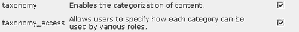

启用模块，点击**保存配置**。就这样，全部完成！

当然，我们仍然需要测试模块并将其投入使用。但是，它将在下一章中使用，因此我们在此不再进一步讨论它。您应该确信现在可以选择、下载和安装您喜欢的任何模块。让我们继续看一下如何配置前面启用的标准模块。

# 配置模块

显然，每个模块的设置性质可能与下一个模块大不相同。这是因为模块可以提供几乎任何你能想象到的功能，从简单的民意调查到搜索引擎，或者其他。因此，存在大量与每个设置相关联的不同设置。

您还应该记住，由于与模块相关的功能固有的广泛性，每个模块的配置和使用也可能有很大的差异。这意味着，一开始，为了改变设置或简单地利用设置，要找出要去哪里，可能会非常混乱。

我们将从**论坛**和**地区**开始，然后是其他，因为这两个稍微复杂一些。

## 论坛

在我们开始查看论坛之前，您应该确保您已经启用了**注释**和**分类**模块，因为这些模块是**论坛**模块正常工作所必需的（这可能会自动完成）。一旦这些都被启用，您可以进入**管理**菜单项下的**论坛**链接开始使用它。您将看到以下页面，这将直接提出一些有趣的问题：

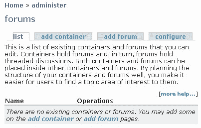

“我该如何组织我的论坛？”可能是你现在要问的。答案实际上取决于讨论主题的范围有多广，有多少人会使用论坛，以及讨论主题的性质。您的目标是建立一个直观、逻辑、易于使用的结构，通过允许用户轻松查找信息来促进和鼓励讨论，而不是使用一个有效隐藏主题的糟糕结构来挫败他们。

让我们来看看如何组织演示网站的论坛。*我们从哪里开始？*一个好主意是事先画出你的结构，这样你就可以看到一切是如何关联的，并在开始创建或删除论坛之前进行更改。例如，根据地点划分论坛似乎是合乎逻辑的，因此美国人直接进入北美论坛，而非洲人直接进入非洲论坛。

不幸的是，这有几个缺点，因为每个大陆都会有很多重复的话题（因为世界各地的野生动物问题都是一样的）。更糟糕的是，如果你住在美国，并且担心南非的罐头狩猎，你会去哪里讨论这个问题，非洲还是北美？在本例中，基于位置划分论坛似乎不是一个好主意。*那么我们用什么标准来对论坛内容进行分类呢？*

最好的办法是发行。人们希望讨论问题或话题，因此他们自然会根据这些标准寻找内容。从这个角度来看，**添加容器**选项卡的含义变得很清楚，因为现在我们可以根据常见问题组织论坛主题。

例如，今天野生动物关注的一个主要领域是保护问题。这反过来又有许多方面，所有这些无疑都会引起演示站点目标受众的兴趣。环境也是一个应该讨论的问题，现在每个人都对研究感兴趣。这些看起来都是可行的容器，因为它们逻辑上封装了使用此站点的用户将要讨论的大部分内容。

沿着这条思路前进，每个潜在的容器都有不同的子类别，用户可以直观地理解为辩论的主题，我们将在稍后看到我提出的实际结构。一旦你在纸上写下了一个好的结构，是时候在网站上实际实施论坛了。让我们先创建容器来开始。单击**添加容器**将弹出一个页面，允许您指定容器名称、简要说明、父容器和重量。

因为您应该已经决定了结构，所以很容易看到哪个容器或论坛有哪个父级。顶级容器或论坛显然应该将父级保留为**<根>**。你可以设置容器或论坛的重量，如果你想让它们按字母以外的顺序呈现，重量越小；越靠近桩的顶部，它就会出现。

继续添加容器和论坛，以及有用的描述，直到完成整个结构。下面的屏幕截图显示了演示站点的最终结果（毫无疑问，还有更多的主题可以添加或更改，但这就足够了）：


这里有几件事需要注意。首先，类别在概念层次上的网格划分方式存在一些重叠。例如，**全球变暖**在逻辑上应该出现在**环境影响**下，那么*为什么会有自己的论坛？*答案是，你需要考虑哪些问题可能最重要。由于全球变暖是一个巨大的问题，有必要将其推广到自己的论坛。

其次，我只添加了容器的单亲层，论坛出现在下面。可以在容器中添加容器等等，但是为了便于查找主题，您应该尽量保持平面结构，而不是尽可能创建深度导航结构。这是因为人们搜索列表比浏览深层层次结构更容易。

最后，还有一些配置选项，您应该在完成之前查看一下。大多数默认值都是非常合理的，但是您可能希望单击“配置”TyT1“Tab”选项卡，并决定要考虑多少个帖子，如 TyT2，HythType T3^，或者是按日期或活动来排序您的帖子。完成后，单击**保存配置**，您的论坛就差不多准备就绪了。

在了解如何使用其中一个模块之前，让我们继续设置其他模块。事实上，你应该认真对待每一个模块，确保它能让你满意，即使我们这里没有空间这么做。

## 地点

启用**区域设置**后，您现在可以点击**管理**下的**本地化**链接，查看提供的内容。这样做将出现以下页面：

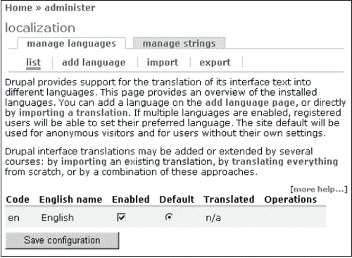

由于有许多欧洲机构和组织处理保护和环境问题，我们希望在我们的网站上添加意大利语。为此，我们只需点击**添加语言**，从下拉语言列表中选择相关语言，然后点击下面的**添加语言**按钮。

下一步是将该语言实际导入网站，以便进行翻译。为了实现这一点，从[的 Drupal**翻译**页面中找到相关的语言文件 http://drupal.org/project/translations](http://drupal.org/project/translations) 。四处搜索，直到找到相关文件，然后将文件下载并解压缩到文件系统中。完成后，单击**导入**选项卡，然后从 Drupal 页面浏览到 `.po`文件您应该有类似的内容（取决于导入的语言）：


一旦您对拥有正确的语言 `.po`文件并将其导入正确的语言感到满意，请单击**导入**。从前面的屏幕截图中，您可以清楚地看出，我们正在将 `it.po`文件（意大利语文件）导入我们网站上的**意大利语**语言。由于这是一个新的导入，我们不需要担心在**模式**部分替换任何字符串。如果你正在修改你的语言翻译，那么你可以考虑保留你已经完整的内容，并且只通过选择第二个选项来添加新的字符串。

完成后，选中弹出页面上的**启用**复选框，点击**保存配置**。您现在在站点上启用了一种新语言。您可以对任何可供下载且用户需要的语言重复此过程。

接下来我们应该简要讨论的是如何管理字符串。您可能会发现，导入的语言翻译并不能按照您的意愿翻译所有内容，在这种情况下，您需要手动执行。单击**管理字符串**选项卡，您将看到一个搜索页面，您可以使用该页面查找要更改的字符串。还有一个控制搜索的选项列表。一旦你找到了你要找的东西，你可以简单地相应地编辑它。

请记住，可以创建自定义语言文件，并通过使用**管理字符串**选项卡下的字符串管理工具并手动输入翻译来建立该文件的翻译列表，尽管这是一项相当繁琐的工作。

如果您获得了一套相当完整的翻译，或者对语言文件进行了改进，那么总体而言，如果您使用**导出**链接与所有人共享您的翻译文件，社区肯定会非常感激。选择要导出的语言并单击**导出**按钮，以 `.po`格式导出文件后，您可以开始在 Drupal 站点上获取该文件（有关更多信息，请查看 Drupal 站点上的**贡献**选项卡）。

## 评论

由于默认情况下需要此模块以及论坛模块，因此我们不妨在此简要讨论一下。顾名思义，评论允许用户评论他们在网站上找到的内容，就这么简单。[第 5 章](05.html "Chapter 5. Users, Roles, and Permissions")关于*用户、角色和权限*的主题是如何确定谁可以发表评论以及评论什么。

您可以在**管理**菜单项下找到**评论**，点击此按钮将显示您网站上所有评论的列表。下面的屏幕截图显示了一个典型的评论页面，在特定帖子中添加了一些评论：

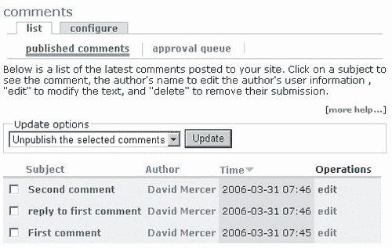

从这里您可以看到，我们有一个处理评论的全面界面。有几个**更新选项**可用，这些选项允许我们删除或取消发布评论。如果你再也不想在你的网站上看到评论，那么**删除所选评论**是一个不错的选择。如果您只想阻止显示注释，而不想完全删除注释，则使用**取消发布所选注释**是正确的更新选项。

假设您出于某种原因决定取消发布评论，则必须在**审批队列**选项卡下查找，而不是在主页上。批准队列允许您搜索和编辑出于任何原因（可能是您取消发布了这些帖子，也可能是您决定将所有评论强制进入批准队列进行审核）而在此处登录的帖子。然而，评论落在这里，你会发现有两个更新选项再次可用，这一次你可以删除评论或发布它。

点击**配置**页签，您会发现与评论相关联的两个重要类别，即**查看选项**和**发布设置**。浏览可用的选项并进行所需的任何更改。例如，在**查看选项**部分中，将**默认显示模式**更改为折叠的线程列表，以便将相关注释聚在一起，而不显示每个注释的正文。默认的显示顺序也被更改为“最早的日期优先”，这样评论就可以作为从页面顶部向下的对话来查看。

使用这些设置，页面上的注释现在看起来如下所示：


如您所见，早期的评论出现在堆的顶部，对这些评论的回复贴在下面并缩进。当然，这可能不是您喜欢的，这些评论也可能很容易显示为这样：

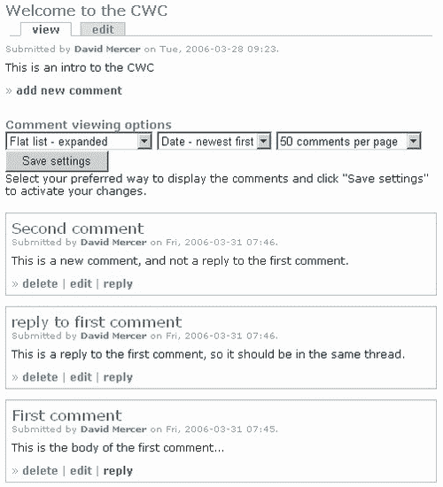

为了让评论看起来像这样（特别是因为它们在上一个屏幕截图中显示），应该不太难确定做了哪些更改，所以这是留给您做的练习。您决定如何显示评论实际上取决于您，所做的任何决定都应该考虑如何在网站上使用评论。

**发布设置**部分提供了一些关于用户如何实际创建评论的选项。再一次，你应该真正考虑到你正在工作的网站的类型。例如，强制用户预览他们的评论似乎是明智的，但是如果你发现你有一群经常发帖的普通社区用户，那么他们每次继续查看他们的帖子将变得单调乏味。

假设您将允许匿名用户发表评论，您必须决定他们是否将联系信息保留在帖子中。从保持网站帖子标准的角度来看，将匿名观众的帖子发送到审批队列可能是个好主意，这样你就不会成为垃圾邮件攻击或廉价广告的受害者。这可以在**管理**下的**访问控制**部分完成，只需在**评论模块**部分为匿名用户选择**发表评论**选项，如下所示：

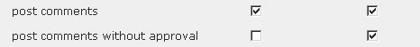

与任何事情一样，这是一种权衡，因为你坚持匿名用户的所有评论都要被审核，这确实给了你自己很多工作。您可能会发现，从长远来看，最好坚持希望成为社区活跃成员的人必须注册。

## 内容类型

你们中的一些人此刻可能会皱眉，因为评论不是内容类型吗？嗯，是的，它们是，但是它们的配置与其他的稍有不同，所以它们被分开了。我们在上一节中启用的三个内容类型模块具有类似的配置设置，因此在这里将它们全部介绍是有意义的。如果您导航回**管理**下的**设置**部分，然后单击**内容类型**，您将看到所有可用类型的列表，如下所示，具体取决于您启用的内容：

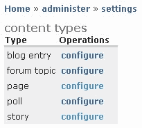

点击**配置**会弹出相关的配置页面，由于它们都是相同的，我们在这里只详细介绍一个。出于兴趣，我们将打开轮询配置页面。

此配置页面上的选项分为两部分：第一部分允许您输入一些解释性文本，并选择使内容类型有效所需的最小字数；第二部分**工作流**如下所示：


正如你所见，评论和附件都被禁用了，因为我们不想得到关于投票公告本身的反馈，我们也不想麻烦将文件附加到投票中——它们应该只是简单的问答工具。您需要根据您希望内容的使用方式，为每种内容类型做出这样的选择。

您还可以决定某些内容发布是否应保持在列表的顶部，以及处理两个稍微复杂的选项，如**创建新修订版**或**适度队列**——这些将在[第 6 章](06.html "Chapter 6. Basic Content")中讨论基本内容。现在，您可能会发现最好保留这些设置，并在获得所有必要信息后再返回。

## 搜索

这是一个需要配置的有趣模块，因为存在一些微妙的潜在问题，在调整设置时应该考虑这些问题。首先，用于在数据库中构建搜索的索引过程依赖于 cron（在[第 10 章](10.html "Chapter 10. Running Your Website")中讨论）。如果要实现搜索功能，您需要确保此功能在您的 live 站点上正确运行。有关 cron 作业和 Drupal 提供的 `cron.php`脚本的更多信息，您还可以访问**管理**菜单项下**帮助**部分的**系统**。

点击搜索页面顶部**设置**菜单项下的**重新索引站点**按钮，可以手动重新索引站点。这将导致 Drupal 检查站点的内容并更新其索引，以便您特别希望包含在任何搜索中的任何新内容都将被删除。

本节中的大多数其他设置与系统性能有关。例如，由于每次运行 cron 时选择索引的项目数也会影响 cron 作业的速度，因此如果遇到超时问题，可能必须将此设置降低一点。除此之外，索引较短的单词会增加系统的负载，因为它必须索引内容中更多的单词。

最后，可以根据三个标准决定如何衡量网站搜索，即**关键字相关性、最近发布的**和**评论数**。您需要确定哪一个标准更重要，以及哪一个标准的重要性可以安全降级。对于演示站点，使用了以下设置：


这里给出权重的原因是因为我们真的希望搜索取决于搜索词和内容之间是否有很强的相关性。实际上，我们是说，仅仅因为一篇文章是新的，并不意味着它更有价值，仅仅因为一篇内容被广泛评论，也不意味着它更相关。根据您的标准，您可能会选择完全不同的内容。底线是确保搜索结果与网站用户尽可能相关。

## 上传

假设您将允许文件上传到站点，那么有一些设置是值得关注的。点击**管理**中**设置**下的**上传**选项，弹出上传配置页面。在这里您可以确定上传图像的**最大分辨率，以及是否默认**列出文件**。**

根据您拥有的 Drupal 版本，还可以决定允许哪些类型的文件进入站点。请记住，某些文件可能包含有害或恶意代码，如间谍软件、病毒或特洛伊木马。您可能不想冒着让 `.exe`或其他可执行文件可用的风险来传播它们。此外，您需要考虑有多少磁盘空间可用。你最不想做的事情就是允许人们上传一次可能占用千兆字节空间的整个电影文件；因此，请确保将每个用户的**最大文件大小**和**总文件大小**保持在合理的限制。

# 菜单和主链接

在我们继续做一些新的事情之前，非常重要的一点是查看一下网站，看看迄今为止所做的更改是否达到了预期的效果。记住：最重要的是，新的修改总是像这样进行测试。*我们如何着手测试新模块？*最好的方法就是在网站上尝试使用它们；因此，请导航到主页并查看网站的现状。目前我们有类似的东西（只要您以管理员身份登录）：

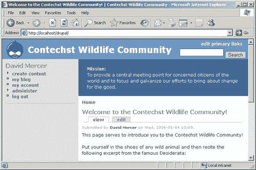

这当然不是我们所希望的。首先，没有直接的方式浏览论坛，甚至看一次民意测验。我们已经启用了这些模块，甚至配置了它们；*为什么他们没有出现在网站上？*答案在于我们尚未编辑菜单或配置主链接。

您可能已经注意到屏幕右上角的**主链接**链接。继续并单击它以使球滚动。下面的屏幕截图显示了在新页面上拉起的列表的一部分：

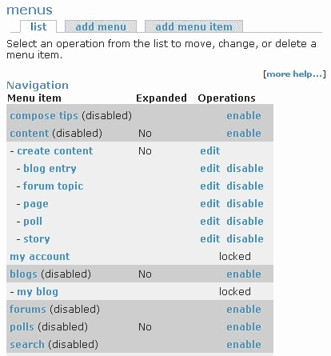

上面屏幕截图中突出显示的部分告诉我们哪些菜单项被禁用。默认情况下，我们启用的所有新模块，如**论坛、博客**和**搜索**在**菜单项**列表中不可用。让我们通过启用**论坛**（或者所有论坛，如果您愿意的话）来纠正这个问题。您会注意到，在启用每个选项之前，都有一些选项需要处理。你可以就这些做出一些相当常识性的决定，下面的屏幕截图显示了**论坛**菜单项是如何设置的：

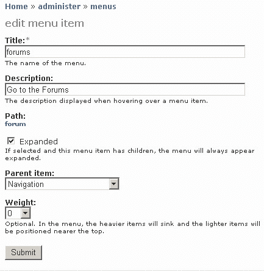

仔细选择**父项**，因为您可能并不总是希望菜单项显示在顶层。例如，屏幕右上角有一个**搜索**框（目前），因此您可能不希望**搜索**菜单项与其他主菜单项一起出现，因为这将是相当冗余的。

**路径**选项允许您检查此菜单项是否指向正确的内容，允许您单击下面的链接（在本例中为**论坛）**查看打开的页面。如果菜单项是手动添加的，并且您不确定是否正确输入了该项的目标 URL，则此选项非常有用。

完成后，您会发现您已启用的项目现在在左侧的菜单中可用。

您可能需要在某个阶段创建自己的菜单，也许是为了提供更集中的导航区域。在这种情况下，使用**菜单**页面上的**添加菜单**选项卡输入新菜单的名称，如下所示：

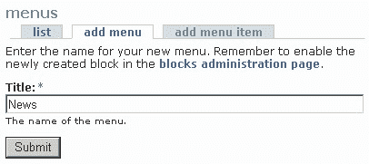

提交后，可以使用**添加菜单项**选项卡轻松添加新菜单项


从上面的屏幕截图中，您可以看到我们正在向**新闻**父项添加一个名为**聚合**的菜单项。我们选择将菜单项链接到的**路径**是**聚合器**，因为这将显示站点上可用的所有聚合新闻（假设已设置）。如果您现在没有启用**聚合器**，请将其链接到其他任何功能！完成后，您可以在菜单页面底部查看新菜单：


如果您希望在站点的某个位置显示此菜单，那么只需在**管理**下主菜单的**块**部分启用即可。在本章后面题为“使用块”的章节中详细讨论了块，因此，除了向您展示这一点（添加**新闻**菜单的结果，其**聚合器**菜单项位于左侧边栏）之外，我们将不再进一步讨论这一特定主题）：


这样一来，我们需要了解如何配置主链接，默认情况下，主链接显示在每个页面的右上角。我们已经点击了这个链接，以打开我们在这个部分中使用的**菜单**部分，但是我们还没有看到我们可以为主要链接提供哪些配置选项。

前往主菜单中**设置**菜单项下出现的**菜单**链接。您会注意到页面被分成两部分。第一个提供了与主链接和次链接相关联的菜单选项的下拉列表，如下所示：

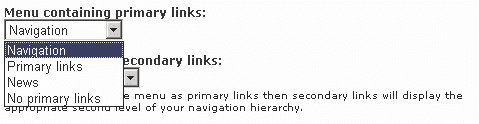

如您所见，此列表中提供了可用菜单的最新添加内容**新闻**，这一事实应该可以为您提供如何使用此页面的线索。实际上，我们可以选择任何我们想在这里显示的菜单项。在这种情况下，**导航**是选择的菜单，保存这些设置后，**导航**菜单项显示在每页的顶部，如下所示：


现在，回想一下，我们在本节稍早的时候启用了**导航**菜单中的**论坛**菜单项，因此它与此菜单项中的所有其他主链接一起出现。Drupal 并没有到此为止，因为在第一个下拉列表的正下方，我们有第二个下拉列表，可以用来显示辅助链接。

选择**导航**，如下图：

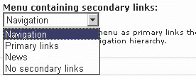

显示给定菜单项中的所有辅助链接。在这种情况下，**管理**主链路有大量与其关联的二级链路；因此，标题部分现在看起来有点拥挤：


能够创建任何您喜欢的菜单，然后在任何地方显示它们，这是一个非常强大的工具。有许多不同的组合供您尝试。例如，您可能希望创建一个内容菜单，其中包含站点博客、论坛、故事、民意测验等所有不同类型内容的列表。然后，您可以将此菜单附加到主链接，作为用户的一种*快速导航*工具。非常强大，非常灵活；我相信你会同意的！

# 使用模块

现在我们有一大堆配置好的模块等着使用。与内容相关的模块应该出现在主菜单中（或至少出现在**论坛**中），因为我们已经编辑了主要链接以允许显示它们（或者，您可能已经创建了自己的菜单以允许内容导航）。我们仍然需要快速查看其中一个模块，以证明一切正常。关于如何定制 Drupal 的一个更强大的例子可以通过**语言环境**模块很好地演示，让我们来看看。

假设您是注册用户，并且站点配置为允许本地化（通过在**管理下的**本地化**页面启用多种语言）**，您只需登录，点击**我的账户**链接，然后选择该页面上的**编辑**选项卡即可。向下滚动，可选择此处所示的界面语言：

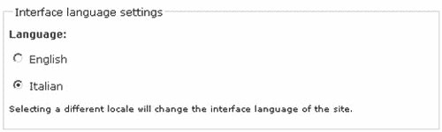

选择语言后，在本例中为**意大利语**，点击页面底部的**提交**，您会发现，根据翻译的好坏，您的网站或多或少会以您选择的语言呈现。现在，无论何时注销，站点都会返回其默认语言，在本例中为**英语**，但在登录时，站点会重新呈现为**意大利语**，如下所示：

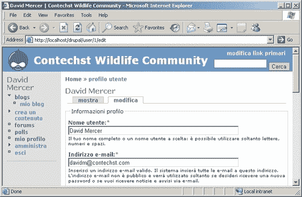

这是 Drupal 的一个相当令人印象深刻且功能强大的特性，希望无论您是否需要这个特定模块，您都会对未来的许多可能性感到兴奋。

强烈建议您在继续之前使用已启用的所有模块，并了解幕后发生的情况。你迟早会问自己的一个问题是*我如何在网站上展示我的所有模块？*这显然是一个相当重要的问题；所以我们现在就来处理…

# 使用砌块

正如我们在[第 2 章](02.html "Chapter 2. Setting Up the Development Environment")中简要地看到的，区块包含信息或相关数据，这些信息或数据在站点周围的不同位置可见，具体取决于您选择显示它们的位置。块通常由模块生成，但也可以手动创建它们。由于许多模块自动生成块，因此每当启用新模块时，最好访问**块**部分，因为您可能需要使用一些新设置。

好的，我们知道什么是块，所以*我们在这一节讨论什么？*好的，当我们谈到使用块时，我们真正要说的是*“我们想如何向用户展示网站的功能？”*当然，每个人都应该努力打造一个引人注目、独一无二的网站，布局配置是其中的一个重要部分，特别是因为它控制着网站界面上功能的组织方式。

在任何时候都要记住，最重要的因素是可用性，这些因素控制着你在展示网站时的设置方式。确保网站直观易懂，永远不要因为艺术原因而牺牲清晰度和易用性。

幸运的是，默认情况下 Drupal 的布局已经相当合理，但这并不意味着没有很多事情要做。你有一个非常多的控制在哪里，如何显示一切，并相应地，相当多的工作。

目前，我们只关心功能在页面上的显示位置。换句话说，我们处理的是界面设计中与站点功能直接相关的部分。例如，一个主题可以处理诸如颜色和字体，甚至背景图像和布局等内容（主题的范围实际上非常广泛，但目前以这种方式看待事物是可以的），然而，无论我们使用的是什么模板/主题，我们仍然需要启用并向站点的某些部分添加块。

*但我们从哪里开始？*要想知道你想把事情做得怎么样，最好的方法之一就是上网，看看别人是如何制作出效果良好的网站的。如果有你喜欢的东西，看看是否可以在你的网站上模仿。

另一种了解你最终将如何建立你的网站的方法是实际地玩一玩，看看什么是有效的。本节将重点介绍此方法，并将第一种方法留给您研究。

## 添加块

在**管理**菜单项下，点击**块**按钮，弹出站点当前可用的块列表。请记住，当您在站点上添加和更改内容时，此列表将发生更改，您可能需要多次重新访问它。查看“块”页面，您将看到可用块的列表以及每个块的几个选项。Drupal 使您能够将这些选项中的任何一个放置在页面上的任何位置，但是您的选择不应该如此随机。

尽量使网站使用直观。为了做到这一点，最好将相关信息分组到站点上的相同位置，这样用户就可以感受到他们可能在哪里查找特定类型的内容。出于演示站点的目的，暂时进行了以下设置（请记住，随着站点的发展，这可能会发生变化）：


关于**重量**设置，有一点值得注意。如果您查看上一个屏幕截图，您将看到**右侧栏**中的块的权重为**1**到**4**。如果我想在上面添加两个新块，该怎么办？幸运的是，**权重**下拉列表（在**块**下）有负数，允许您给出小于**0**的权重，这样您就不必重做所有权重来在上面插入一个。因此，如果您想在右侧边栏的顶部再添加两个块，您可以在不更改任何其他内容的情况下为它们指定权重**1**和**0**。

接下来，请注意，关于其他用户的信息，如**谁是新用户**和**谁在线**，仅限于上一个屏幕截图中页面的页脚区域。这是因为很明显，该网站关注的主要领域不是谁在线，而是与野生动物相关的内容。因此，这些信息被分配到页面底部，有兴趣查看周围人的人可以不厌其烦地查看，而不会影响网站的主要内容。最好将所有信息都放在页面底部。

还有什么？所有与内容相关的问题都分组到右侧的侧栏中。这意味着，如果人们想快速查看添加到站点的新内容，可以在此处查找。除此之外，信息的结构使民意调查显示在所有其他信息之上（因为我们通常希望鼓励人们花时间回答民意调查），但我们将搜索表单保留在页面顶部，因为我们设想，一旦网站上的内容变得丰富，这将是最有用的工具。

当然，有些块仍然处于禁用状态，因为站点目前不需要它们。以后添加或删除块总是很容易的。如果您确保各个块有一个良好的逻辑布局，您可以根据需要剪切和更改显示的内容和未显示的内容。但是尽量不要太频繁地修改，因为这会损害网站的可用性，一旦网站上线，可能会让用户感到沮丧。

保存这些更改后（通过单击**保存块】**查看您的主页，您将看到各种块已按照您的要求插入到您的网页中。移动东西很容易，直到你完全满意页面的外观为止。

你们中的一些人可能也注意到在**块**页面的顶部有一个**添加块**选项卡。单击此按钮将打开一个页面，可用于将您自己的块插入您的站点，如下所示：


在本例中，我们添加了一小段 PHP 代码，它从文件系统（quotes.txt）的 `drupal`文件夹中取出一个文件的引号，将其拆分为一个行数组，随机选取一行，然后以特殊字体显示。暂时不要担心理解 PHP 代码。这真的只是给你一个想法，为什么你可能希望添加一个块的网站在未来。如果您随后在网站上查看新区块，您应该会看到类似的内容（取决于您在 `quote.txt`文件中添加的引用）：


添加愚蠢的引用当然是一件很有趣的事情，但希望您能理解在页面中添加新块是多么容易。当我们开始考虑是否应该允许某些人访问某个块，或者该块应该显示在所有页面上还是仅显示在选定页面上时，情况就变得更加复杂了。为了找出如何处理这些问题，我们必须详细了解块配置。

## 配置块

Drupal 允许我们通过列表中每个块右侧的**配置**链接控制何时显示块。此配置页面分为三个部分，分别处理：

*   **块特定设置**
*   **用户特定可见性设置**
*   **页面特定可见性设置**

结合这三个部分提供了一种复杂的方法来控制块何时显示以及向谁显示。当然，有些模块本身不需要任何特定设置；因此，您可能会发现，您只需要更频繁地对用户和页面做出特定的决策。

**谁在线**页面可以显示一个配置块的好例子。这个页面允许我们决定用户可以不活跃多久，在我们不再考虑他们在线，以及在任何时候显示的人数最多。这很容易处理，而且真正取决于网站的需要。接下来的两个选项让我们思考：


如您所见，上述设置允许用户编辑他们自己的偏好，以确定他们是否可以看到**谁在线**块，尽管默认情况下它是可见的。虽然你可能会发现你的大多数临时用户并不介意，但普通用户通常喜欢被赋予一些对他们如何设置页面的控制权。

这些设置就绪后，编辑其帐户信息的用户将显示以下复选框，该复选框允许用户启用或禁用阻止：

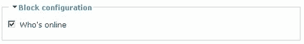

*允许用户做出自己的选择是一回事，但如果我们不想在某个页面上显示某个块怎么办？*好的，下一节允许我们完全这样做，如果您查看上一节之前的屏幕截图，您将看到除所列页面选项外的每个页面上都显示了**选项，并且在**页面**文本区域中输入了文本**<首页>**。这意味着，无论何时有人访问该网站，都不会显示谁在线。这些信息只有在他们登录或通过查看内容或添加材料开始使用网站后才可用。**

更高级的用户可以添加一些代码来确定是否显示块。这可以是以下形式：

```php
if (some_condition_is_true){
return TRUE;
}else{
return FALSE;
}

```

您可能会发现，只有在有特定原因显示或不显示信息时，才需要稍后返回本节。和往常一样，建议您在某个页面上玩一玩并尝试显示模块，但不要在其他页面上显示。*例如，只有当有人在使用论坛时，你才能显示一个区块吗？*答案当然是选择**只在列出的页面上显示**选项，然后在文本区中输入**论坛**或**论坛/***。通过在自己的机器上进行测试，确保这是正确的。

现在您知道了如何配置块。这只是一个简单的例子，你要检查每一个你已经启用，并作出适当的决定，何时，何地，向谁显示它们。

# 总结

随着常规配置任务的完成，我们开始着手于添加功能并在站点上组织它这一非常重要的主题。这是您将在开发阶段承担的最重要的任务之一。选择和实现正确的功能是一项微妙的任务，但希望您发现，一旦您决定了要实现什么，Drupal 就可以让实现变得非常容易。

除此之外，当我们下载并安装了一个贡献模块时，我们还体验到了从整个开发社区中获取信息的感觉。贡献模块是扩展站点功能的宝贵资源。这个有价值的工具附带了一个明确的警告，即您需要在实施任何更改之前进行备份，以保护站点的安全。

当我们谈到定制网站的菜单和导航是多么容易时，Drupal 的强大和优雅闪耀着光芒。拥有一个强大的工具，再加上菜单系统的灵活性，对于创建一个设计良好、易于使用的网站来说是一个巨大的帮助。希望在本章的后几个阶段中，菜单的创建方式以及它们与模块提供的功能之间的关系变得清晰起来。

您希望从本章中了解到的最重要的一点是，由于 Drupal 非常灵活且可定制，因此有大量的设置在不同的位置。一开始，跟踪所有这些可能会让人望而生畏，但在使用 Drupal 时，您将更加熟悉它们。最终，你将能够轻松找到自己的路。

但是现在，坐下来休息一下，高兴地知道任务已经完成。在下一章中，我们将开始研究如何使用用户和权限，这是您作为 Drupal 管理员成功的另一个关键主题。