# 第 8 章 Drupal 的界面

在站点界面上工作以使其与众不同和吸引人不仅需要 Drupal 方面的一些技术诀窍，而且与任何类似设计的任务一样，它还需要一些创造力。目前你的网站功能齐全，看起来也不可怕。虽然有点简单，但它能完成任务！然而，正如您将看到的，通过一点努力创建一些全新的东西并不是您力所能及的，而且正如您可能期望的那样，Drupal 提供了一系列功能，使我们的生活更加轻松。

如果像我一样，你喜欢在一个网站更具创造性的方面工作，那么这真的是你一直在等待的一章。是时候设计、规划和实施视觉环境了，用户将沉浸在其中。如果你能成功地创造一个愉快的互动氛围，那么你肯定会在确保用户对你的网站满意方面做很多工作。

然而，就像本书中的其他内容一样，一旦我们开始工作，我们就不能简单地一头扎进水里学习游泳。在我们开始定制 Drupal 的界面之前，有很多有趣的事情需要考虑和学习。

您还可以享受已经为您建立了一个网站的奢侈，这样您就可以轻松地在这里和那里进行更改，以实现您的设计目标，而不是从头开始开发 HTML。在某种程度上，这种奢侈实际上限制了你，因为任何不完全重写页面的行为都意味着你的网站保留了一些 Drupal*风格*。但这现在一点也不坏，是吗？

为此，本章将讨论以下内容：

*   规划基于 web 的界面
*   Drupal 界面的工作原理
*   CSS
*   主题

我要提醒你的是，为一个网站设计一个全新的、令人愉悦的、独特的外观涉及到很多事情。这里有很多微妙的细节，所以你应该准备花一些时间在这一部分，因为毕竟，你的网站的外观和感觉是你呈现给你的社区的真实面貌，反过来也是你的社区面向外部世界的面貌。

另一件要记住的事情是，你应该花一些时间看看已经存在的东西。在设计网站时遇到的许多问题在整个展会上都得到了成功的解决，当然不仅仅是 Drupal 用户。此外，不要害怕将你的设计视为一个持续的过程，而每周对你的网站进行一次彻底的更改是不好的，定期调整或升级你的界面可以让它保持现代感，看起来焕然一新。

# 规划基于 Web 的界面

原理*形式跟随功能*广泛应用于人类知识的许多领域，从进化到生物动力学和工程。这是一个很好理解的概念，基本上说，一件东西的建造或制造方式必须反映它的目的。这是一个非常明智的想法，将其应用于网站的设计将为您提供一个衡量您设计得有多好的标准。如果你，或者你问的每个人，都能诚实地说你的网站看起来像是要做你正在做的任何事情，那么你做得很好。

这并不是说你的站点应该像其他所有执行相同功能的站点一样。事实上，如果有的话，你想让它尽可能与众不同，而不超出你认为你的目标用户会考虑的范围。

*你是怎么做到的？*诀窍是将你作为一个网站所拥有或做的事情与你的特定目标受众联系起来。如果您提供的内容对所有民族、种族或宗教的所有年龄段的男女都有吸引力，那么显然您应该提供每个人都可以使用的内容。如果有什么区别的话，这可能是一个稍微没有味道的网站，因为你不想通过明确地让你的网站对另一个用户群友好而边缘化任何用户群。不过，幸运的是，在某种程度上，您的目标受众将比这稍微容易定义，因此您通常可以为特定类型的用户做出一些让步。

请记住，虽然以下章节提到了*视觉*或*功能*设计，但您真正考虑的是*交互*设计的视觉或功能方面，其中包括所有视觉和功能设计。互动设计是你如何想象你的观众使用你的网站并与之互动。这是一个重要的区别，因为从用户的角度考虑所有问题将有助于定义您的选择。

## 视觉设计

在这个问题上不能拐弯抹角。在不隐藏任何关键或有用信息的情况下，使网站看起来尽可能简单。我的意思是，如果一个页面上的所有项目都很有用，并且会（或经常）被使用，那么你不应该害怕留下一个相当大的项目列表。无论在其他页面上找到一件重要的东西看起来多么容易，都会让用户感到沮丧，你的人气可能会受到影响。这样做的结果是，你不应该害怕有相当长的页面，用户必须向下滚动，而不是在页面底部有可用的信息，而不是有一个复杂的导航结构。

网站的外观也会对用户理解网站工作的方式产生很大影响。例如，如果您有多个不同的字体应用于不同的链接，那么由于字体样式不同，用户很可能不会考虑单击一种或另一种类型的链接。你自己想想吧！如果你正在阅读一页文字，并且所有的链接都是以与文字相同的字体给出的，你怎么知道点击哪个单词？这可以概括为：

### 注

确保你的网站在视觉上是一致的，并且从一个页面到下一个页面没有风格差异。

有很多所谓的视觉设计规则，你可以应用到你的网站上。这些基本上都是理论性的，你可能想也可能不想进一步了解这些。我建议谷歌提供一些好的阅读材料。一些可能适用于你的是：三分法则，它规定，垂直或水平分成三分之一的东西比其他设计在视觉上更吸引人；视觉中心规则，表示页面的视觉中心（眼睛最吸引的地方）正好位于页面实际中心的上方和右侧。

## 语言

现在这是网站设计中真正有趣的一部分，而网络写作的艺术远比仅仅说出你的意思要微妙得多。这样做的原因是，你不再只是为了人类的消费而写作，而是为了机器的消费。由于机器在解释页面时只能遵循一定数量的规则，因此作者必须在使用的语言上做出让步（如果他们希望自己的网站在搜索引擎上具有很高的特色）。

在您担心如何对站点的文本进行高度优化以进行搜索之前，您需要做一些更基本的事情。首先，确保你的语言清晰简洁！这是最重要的,；如果平凡的文本能更好地阐明你的要点，那就牺牲活泼、风格化的文本来获得更平凡的文本。

除了语言的实际内容外，副本的视觉和结构外观也很重要。使用粗体或更大的字体强调标题或要点，并确保您的文本间隔良好，以使页面更易于阅读和理解。我们在上一章中看到了一个这样的例子，当时我们发布了一个格式良好、布局合理的“关于我们”页面。

## 图像

在网络上使用图像是一门艺术！我的意思不是说为了拍出漂亮的照片，你一般都应该很有艺术性。我的意思是，管理和处理图像文件本身就是一门艺术。对于有抱负的网站所有者来说，要获得一个令人愉悦和有意义的视觉环境，还有很多工作要做。这是因为网络是一个最依赖视觉图像来影响用户的环境，因为视觉和声音是目前互联网唯一的两种感官目标。

为了能够按照站点的要求自由操作图像，您确实需要使用功能相当强大的图像编辑器。Photoshop 或 Paint Shop Pro 是良好的图像编辑环境的示例，但是任何允许您以各种不同格式保存文件并提供大小调整功能的东西都应该足够了。当然，如果你必须自己拍摄数码照片，那么你需要确保照片尽可能统一，背景不会分散目标的注意力编辑图像以完全去除背景可能是最好的。

在处理图像时，有几个值得关注的方面，如果您希望创造一个完整、令人愉悦的视觉环境，则需要仔细检查所有这些方面（有趣的是，并非所有这些都与您的客户实际看到的内容相关）：

*   图像最大的问题之一是它们比文本或代码占用更多的内存。因此，您需要有一种有效的方法来处理站点所需的大型图像，简单地将大型图像压缩成缩略图会降低速度，因为服务器仍然需要将整个大型文件上载到用户的机器上。
*   人们在处理图像时常犯的一个错误是，在处理过程的早期没有对图像进行处理，以使图像的大小和类型尽可能一致。如果你所有的图片都是同一个尺寸，那么你会比大多数人容易得多。事实上，这应该是你的目标，在你做任何涉及网站的事情之前，确保你的图片都是一致的。
*   从大量可用的图像中确定实际要使用的图像类型也可能是一个问题，因为某些图像类型比其他图像类型占用更多空间，有些甚至可能无法在浏览器中正确渲染。大体上，实际上只有三种图像类型是最常用的 GIF、PNG 和 JPG。
*   在决定如何创建、调整文件大小和格式时，图像的预期用途也是一个重要因素。例如，图标和徽标实际上应该保存为 PNG 或 GIF 文件，而照片和大型或复杂图像应该保存为 JPG 格式。

项目符号列表中提到了三种类型的图像文件。让我们来看看这里的那些。

**GIF**或图形交换格式，以其压缩和可存储和显示多幅图像而闻名。GIF 的主要缺点是图像最多只能显示 256 种不同的颜色。对于摄影质量的图像，这是一个重大障碍。但是，您应该将 GIF 用于：

*   具有透明背景的图像
*   动画图形
*   需要不超过 256 色的更小、更简单的图像

**PNG**或便携式网络图形，实际上被设计为 GIF 文件的替代品。一般来说，它可以实现更大的文件压缩，提供更大范围的颜色深度，甚至更多。与 GIF 文件不同，PNG 不支持动画。您可以将 PNG 文件用于任何原本使用 GIF 的对象，但动画除外。

顺便说一句，还有一种 MNG 格式，它允许使用动画作为动画 GIF 的替代品。

**JPG**或 JPEG（联合摄影专家组）应在呈现照片逼真图像时使用。JPG 可以压缩大图像，同时保持整体摄影质量。JPG 文件可以使用任意数量的颜色，因此对于需要大量颜色的图像来说，这是一种非常方便的格式。JPG 应用于：

*   照片
*   需要 256 张以上才能正确显示的大型复杂图像

这就涵盖了站点界面开发的规划阶段。在我们开始深入了解主题之前，我们需要先了解一下 Drupal 如何将各种 web 技术结合起来，为您的站点提供界面，主题对站点的外观和感觉几乎都有影响。

# Drupal 的界面如何工作

了解一点创建吸引人的网站背后的理论是一回事；在 Drupal 站点的上下文中应用这些知识完全是另一回事。正因为如此，我们需要花一些时间来准确地理解事物是如何联系在一起的，这一点很重要。您已经看到 HTML 和 PHP 可以并且确实构成站点界面的一部分，但许多人会注意到**管理**菜单项下的**主题**链接，并想知道这是怎么回事。

此外，你们中的一些人可能还想知道主题引擎到底是什么，以及主题和主题引擎与 Drupal 站点的关系。以下两个定义应该澄清一些事情：

*   **主题：**定义和控制 Drupal 网页布局的文件或一组 PHP 文件。这些页面的外观由**CSS**（层叠样式表）文件控制，同样由主题提供。各种标准图像也可能在主题中保存，供站点使用。
*   **主题引擎：**提供了创建您自己独特主题的功能，这反过来可以很好地控制 Drupal 站点的各个方面，从页面中包含的功能到各个页面元素的显示方式。

使用主题引擎需要一些编程技巧，因为主题是使用代码构建的。另一方面，修改主题相当容易，一旦找到合适的基本主题，创建自己独特的站点就是相应地修改主题。下图将帮助您描述所有内容是如何协同工作的，并将本章的主题置于上下文中：

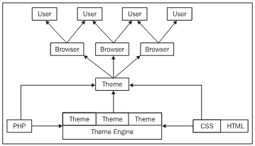

此图显示了一种倒置的瀑布，图中每个级别之间的箭头表示某个内容对上面级别的贡献。换句话说，我们可以将 PHP、HTML 和 CSS 视为基本技术，它们为主题引擎和主题向浏览器提供 HTML 提供了基础。主题向浏览器提供 HTML 后，浏览器会将其呈现到屏幕上，供用户查看。

这里有几件事需要注意。首先，并非所有的主题引擎都是纯基于 PHP 的。例如，Drupal 中有一个 Smarty 主题引擎，供熟悉 Smarty 模板的人使用。第二，有很多类型的浏览器，并不是所有的浏览器都是相同的。这意味着，在一个浏览器上呈现得很好的页面可能看起来很糟糕，或者更糟，甚至在另一个浏览器上无法正常运行。因此，你应该*使用几种不同的浏览器测试你的网站！*

Drupal 帮助站点对浏览器有如下说明：

> 建议您使用带有开发者工具栏的 Firefox 浏览器和视图格式的源代码扩展。

您可以在[获取 Firefox 浏览器的副本 http://www.mozilla.com/firefox/](http://www.mozilla.com/firefox/) 如果您希望使用 Internet Explorer 以外的其他工具。

现在，就这与我们的情况的关系而言，我们将仅限于选择一个基本主题，我们将对其进行修改，以便为我们提供站点的界面。这意味着现在，你不必担心主题引擎的复杂性。*我们现在可以继续直接看主题了吗？*还没有；请注意，在前面的图中有一个包含术语 CSS 的框。这对于开发我们的界面非常重要，因为我们已经看到了 HTML 和 PHP 的应用，在继续之前，让我们先了解一下 CSS。

# CSS

Drupal 站点中的页面从相关的样式表中获取与样式相关的信息，这些样式表保存在站点的主题中。使用样式表可以让设计师对网页的外观进行出色的细粒度控制，甚至可以产生一些非常好的效果。网站几乎每个方面的外观都可以从一个主题中控制，所需要的只是对字体、颜色和样式表语法的一点了解。

在我们进一步讨论之前，如果您有一个现成的列表，其中列出了您应该使用样式表设置的内容类型，这将使您的工作更轻松。下面列出了最常见的区域（由 HTML 元素定义），在这些区域中，可以使用样式表来确定网站的外观：

*   出身背景
*   文本
*   字体
*   颜色
*   图像
*   边境
*   边缘
*   衬料
*   列表

除了能够更改 HTML 的所有这些方面外，您还可以根据是否满足某些条件（如鼠标悬停在指定区域上）应用不同的效果。稍后将演示这一点。您还可以为某些 HTML 标记指定属性，然后可以使用这些属性将样式表样式应用于这些特定标记，而不是创建应用程序范围的更改。例如，如果有一个段落样式设置了 `class`属性，如：

```php
<p class="center"></p>

```

您可以在样式表中明确指定此类段落，方法如下：

```php
p.center { color: green; }

```

分析此行将突出显示标准样式表代码块的结构，其显示形式如下：

*   **选择器：**本例为 `p.center`
*   **属性：**本例 `color`
*   **分隔符：**始终 `:`
*   **值：**本例为 `green`

请注意，所有属性/值对都包含在大括号中，每个属性/值对都以分号结尾。对 CSS 的介绍非常简短，并且有大量优秀的可用资源。如果您想了解更多信息（强烈建议），请访问：

*   **CSS 讨论：**[http://css-discuss.incutio.com/](http://css-discuss.incutio.com/)
*   **HTML 狗：**[http://www.htmldog.com/](http://www.htmldog.com/)

现在，您已经了解了 Drupal 的界面是如何通过使用 HTML、PHP、CSS 和主题创建的，以及样式表是如何工作的，我们准备开始了解…

# 主题

主题的使用使得 Drupal 在使用站点界面时非常灵活。因为网站的功能基本上与网站的展示是分离的，所以很容易裁剪和更改外观，而不必担心影响功能。这显然是一个非常有用的方面，因为它使您可以自由地进行实验，但是您需要知道，如果最坏的情况发生，您可以重置默认设置并从头开始。

您可以将主题视为站点的*模板，您可以对其进行修改，以获得所需的外观和感觉。当然，不同的主题有着千差万别的属性；因此，重要的是要找到最接近你所寻找的主题，以减少你需要做的工作。*

因此，我们需要完成的第一项任务是…

## 选择一个基本主题

默认情况下，Drupal 附带了一些默认主题，在 Drupal 站点的**下载**部分还提供了更多主题。

### 注

有些主题需要使用主题引擎，在这种情况下，在尝试使用该主题之前，您还需要下载并安装适当的引擎。

查看 Drupal 中**主题**页面上已经出现的内容，我们可以看到以下内容：

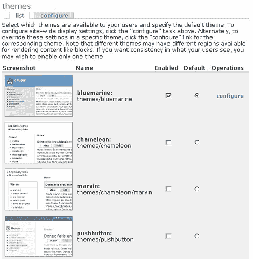

您可能想知道为什么可以启用任意多个主题，但只选择一个作为默认主题。原因是，如果您启用了多个选项，则这些选项可供用户（假设他们有足够的权限）通过编辑**我的账户**页面的**编辑**选项卡上的**主题配置**首选项进行选择，如下所示：

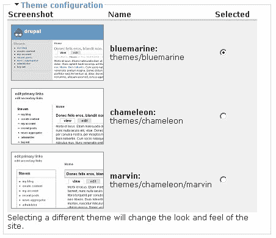

在这种情况下，**蓝海、变色龙**和**马文**都已启用，默认为**蓝海**。然后，用户可以自己选择他们希望查看网站的方式。

回到可用主题列表！启用**按钮**主题，并将其设置为默认值，会导致迄今为止在标准 bluemarine 主题中显示的站点看起来像这样：

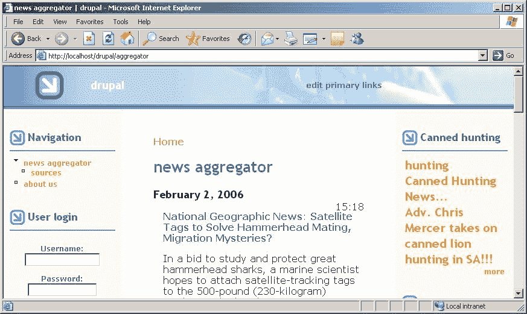

这是一个相当大的变化，从以前的外观所提供的蓝海主题；但是，您应该能够发现这样一个事实：通用布局没有太大变化，仍然有三列，有一个包含站点名称和徽标的标题部分，还有一个导航部分和各种框，等等。*改变了*的字体、颜色和一些图像，特别是注意到现在在这个主题的标题部分有一个背景图像。

### 注

您应该花时间查看默认情况下可用的每一个主题，以便对所提供的内容有所了解。

这还不是故事的结尾，因为 Drupal 站点也有一大堆主题供我们探索，所以让我们转到[的主题页面 http://drupal.org/project/Themes](http://drupal.org/project/Themes) 并选择相关的版本选项卡，以显示可用于安装 Drupal 的主题。请注意，其中一些主题需要您下载主题引擎**Box\u grey\u smarty**贡献就是一个需要 smarty 主题引擎才能运行的主题示例。

您已经了解了如何下载和安装其他模块，安装主题的过程也不例外，只需将所需主题的内容下载并提取到您的 `themes`文件夹中即可。例如，下载了**框灰**主题，在主题列表中为我们提供了两个新选项，如下所示：

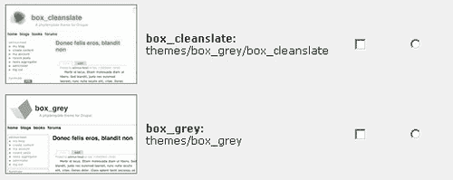

启用**框 _ 灰**选项并将其设置为默认值会导致站点如下所示：

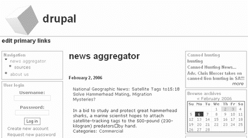

现在，您可以从一堆默认主题中进行选择，也可以查看一些有贡献的主题。一旦你决定了一个你喜欢的，在进入下一阶段之前，有一些事情需要处理。正如你可能预料到的，我们可以通过简单地点击在 To.T2T.主题 To.T3-页面上的“配置 Tyt1”链接来配置主题，所以让我们来看看这里的情况。

## 配置您的主题

单击主题页面顶部的**配置**选项卡，将显示全局主题选项，无论使用哪一个主题，该选项都会影响每个主题。如果您知道您始终希望启用某些功能，则该选项将非常有用（使用**配置**页面顶部的链接，在全局设置和主题特定设置之间导航也很容易）。

我们将在这里集中讨论**全局设置**页面，因为这是所有主题配置页面的代表，所以您在单独处理每个页面时不会遇到任何问题。请记住，您可以通过操作特定主题的**配置**页面来覆盖这些设置。

第一部分允许您使用主题附带的默认徽标，或者指定自己徽标的路径，或者将新徽标上载到站点：


在演示网站的情况下，我们将利用背景图像显示徽标和名称；所以这可以不检查。如果你有一个网站的标志，或计划有一个，然后简单地上传到这里。

Drupal 还为我们提供了指定哪些内容类型需要显示帖子信息的能力。现在，我们已经看到，某些类型的页面不需要显示此类信息，例如，*关于我们的*页面应该按原样显示，而不需要确切通知用户是谁创建的。

设置如上一个屏幕截图所示的原因是，重要的是要确定发布博客的人以及论坛主题。然而，当涉及到诸如民意测验、网页、书页或故事之类的事情时，经常这样做就不那么重要了，因为这些事情无论如何都会由网站管理员来处理。目前，我已经将**页面**类型作为放弃帖子信息的唯一类型。

请记住，您需要考虑什么对您的站点有意义，并应用反映*您特定需求*的设置。例如，确定谁贡献了某些书页可能很重要，以便在需要查询或修改书页内容时可以联系作者（尤其是因为书籍通常是协作性的）。

以下部分允许您指定**徽标图像设置**以及将显示在网站地址栏和任何书签中的图标。再一次，你在这里使用什么真的取决于你。对于我们的网站，我们不需要创建一个特定的图标，我们还没有一个标志上传；所以我们可以暂时把事情留白。

因此，**配置**页面的其余部分如下所示：

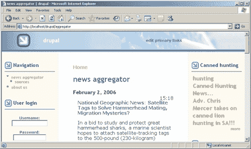

正如您可能已经猜到的，所有内容都保留为空白，因为我们没有指定任何新内容，也不希望显示默认徽标或图标。

### 注

您需要确保您在此处设置的内容不会在单个主题的**配置**页面中被无意覆盖。

## 定制您的主题

到目前为止，您所做的任何设置或更改都是相当通用的。随着我们开始实施一些更激进的修改，事情即将发生变化，这些修改将需要对样式表进行修改，以使事情变得恰到好处。就演示站点而言，我选择使用**灰盒**主题，因为这与设想的外观非常相似，并且具有适合学习的功能。

以下是关于**框**的一些信息，来自他们的 `readme`文件：

> *对于那些不擅长 CSS 定位的人来说，框 _uuu 相对容易修改。它不是完全使用 CSS 进行布局，而是一种所谓的混合布局，它使用 CSS 与非常简单的表*相结合。

> *这是一种标准的三列布局，中间三列使用表格，表格上方有页眉，下方有页脚。这降低了可访问性并增加了一点代码膨胀，但有一定的优势：*

*   *如果用户插入宽内容*，则内容列不会重叠。
*   *内容在模板（page.tpl.php）中的显示顺序与在*页面上的显示顺序相同。
*   *您可以添加任意大小的徽标图像；收割台应展开以适合*。

从学习如何使用样式表的角度来看，这些功能非常有用，这不仅为您提供了一种定制网站外观的有效方法，而且还为您构建了一个平台，您可以在准备就绪时尝试对其他主题进行更高级的定制。

### 注

如果您还没有，现在是找到一个相当好的代码编辑器的时候了，因为您将从现在开始查看各种类型的代码文件。

导航到 Drupal 安装中的 `themes`文件夹，并复制 `box_grey`文件夹，命名为 `box_grey_dev`。这使我们能够在不危及原始文件的情况下开发主题版本。返回 Drupal**管理**部分中的**主题**并启用新的**框灰**主题，将其设置为默认主题。这样做很重要，这样当您检查所做的任何更改对网站外观的影响时，您就知道您正在查看正确的主题。

现在打开 `box_grey_dev`文件夹，您会发现有几个 `.tpl.php`文件，即：

*   `node.tpl.php`
*   `page.tpl.php`
*   `image_gallery.tpl.php`

负责他们同名人物的布局。例如， `page.tpl.php`中的一段代码如下所示：

```php
<table id="content">
<tr>
<?php if ($sidebar_left != ""): ?>
<td class="sidebar" id="sidebar-left">
<?php print $sidebar_left ?>
</td>
<?php endif; ?>
<td class="main-content" id="content-<?php print $layout ?>">
<?php if ($title != ""): ?>
<h2 class="content-title"><?php print $title ?></h2>
<?php endif; ?>
<?php if ($tabs != ""): ?>
<?php print $tabs ?>
<?php endif; ?>
<?php if ($mission != ""): ?>
<div id="mission"><?php print $mission ?></div>
<?php endif; ?>
<?php if ($help != ""): ?>
<p id="help"><?php print $help ?></p>
<?php endif; ?>
<?php if ($messages != ""): ?>
<div id="message"><?php print $messages ?></div>
<?php endif; ?>
<!-- start main content -->
<?php print($content) ?>
<!-- end main content -->
</td><!-- mainContent -->
<?php if ($sidebar_right != ""): ?>
<td class="sidebar" id="sidebar-right">
<?php print $sidebar_right ?>
</td>
<?php endif; ?>
</tr>
</table>

```

如您所见，它使用 HTML 创建一个表来定义每个页面的内容。它使用一组 PHP `if`语句来检查是否显示左侧边栏甚至任务语句等内容。PHP 代码嵌入在 HTML 标记中，HTML 标记具有与之相关联的某些属性，如 `id="mission"`或 `id="message"`。不要担心这些 PHP 变量是如何填充的；我们不想改变网站的运作方式，我们只是看看它是如何布置的。

*但是为什么他们费心为 HTML 页面的不同部分设置 class 和 id 属性呢？*这就是 CSS 的力量发挥作用的地方。我们已经知道，我们希望为我们的网站创建一致的外观。这意味着每种类型的相关内容都应该具有相同的外观，换句话说，每个页面的内容应该以类似的方式呈现。在这种情况下，我们可以将内容的 `class`或 `id`分类为特定类型，然后使用该属性标记指定它在样式表中的布局方式。

你应该要求证据，这是…

打开 `box_grey_dev`主题中的 `style.css`文件，搜索以下代码片段：

```php
body {
color: #000;
background: #fff;
font-family: Verdana, Helvetica, Arial, Lucida, sans-serif;
font-size: 84%;
padding: 0;
margin: 0;
}

```

将此更改为：

```php
body {
color: #000;
background: #8E6C63;
font-family: Verdana, Helvetica, Arial, Lucida, sans-serif;
font-size: 84%;
padding: 0;
margin: 0;
}

```

保存这些更改，并在浏览器中刷新 Drupal 站点的视图。现在，您应该发现页面上的内容已更改，因此页面的外观如下所示：

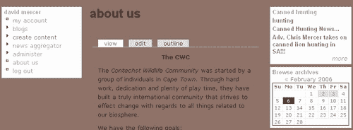

对样式表中 `body`标记的一次更改就改变了整个网站每一页的背景色。这是样式表的一个非常强大和有用的特性，也是为什么现在每个人都这么多地使用它们的原因。您可以将其更改回原始设置或保持原样，因为一旦您决定了站点的配色方案，它无疑会发生更改，所以目前没有任何区别。

现在，您已经知道如何实现更改并查看此更改对站点的影响，可以继续修改样式表以反映您希望站点的外观。在接下来的部分中，我们将讨论几种不同类型的修改，不必逐一详细讨论，相信我，网页有很多不同的属性！一旦你掌握了在某个领域做出改变的诀窍，就可以很容易地将这些知识应用到其他地方，因此你应该发现这里的内容足以让你充满信心地开始工作。

演示站点所需的首要任务之一是创建并上传一个图像，该图像将作为站点标题部分的徽标和标题。

## 图像

图像和背景图像可能很难处理，因为它们的长度通常是固定宽度，而网页则可以调整大小。如果一张图片没有达到页面大小或者放错了位置，它看起来会很糟糕，因此我们需要研究如何让我们的图片融入到网站中，这样在不同屏幕上工作的观众就不会看到不整洁的图片。

在演示站点中，我想要一个粗糙且相当令人回忆的自然场景，还有什么比通过非洲灌木丛显示的日落更好的使用方法（请注意，站点的名称/徽标实际上是此图像的一部分，这就是为什么我们取消了标准站点名称和徽标）：


然而，为了在站点上展示这一点，我们需要对样式表做一些工作。此外，我们希望这是提出对页面左上角的权利，所以这将有效地成为我们网站的标志形象。将其添加为站点徽标只需将其上传到主题的**配置**页面即可，如下所示：

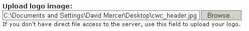

并确保为该特定主题启用了**徽标**选项。由于您可以访问文件系统，您也可以将图像直接复制到 `files`文件夹，然后从**上传徽标图像**框正上方的**路径将其引用到自定义徽标**文本框：

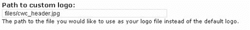

您也可以简单地将新徽标图像保存在旧的原始徽标图像上，它也将正常显示。

如果您发现您在查看此图像时遇到问题，则很可能是您在**管理**菜单的**设置**部分中的**文件系统设置**出现故障。检查它们以确保将文件保存到正确的位置，然后尝试从正确的位置访问它们。

完成后，我们现在可以查看该网站，了解其效果：

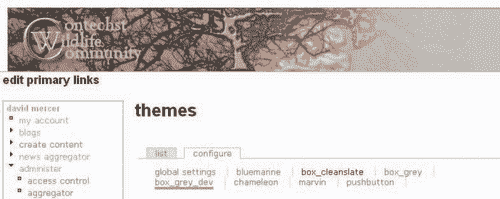

哦，天哪！现在看起来不是很好，因为如果仔细观察，新图像会向右偏移（以及向下偏移，尽管在屏幕截图中可能不太明显）。为了纠正这种情况，我们需要查看偏移的原因。为此，我们需要找出哪个代码负责显示页面的这个区域。

查看 `page.tpl.php`文件顶部附近，我们可以看到以下内容：

```php
<div id="header">
<?php if ($search_box): ?>
<form action="<?php print $search_url ?>" method="post">
<div id="search">
<input class="form-text" type="text" size="15" value="" name="edit[keys]" /><input class="form-submit" type="submit" value="<?php print $search_button_text ?>" />
</div>
</form>
<?php endif; ?>

<?php if ($logo) : ?>
<a href="<?php print url() ?>" title="Index Page">" alt="Logo" /></a>
<?php endif; ?>

```

此代码段底部突出显示的代码负责显示站点的徽标（取决于 `$logo)`。如您所见，本节使用 `header`作为`<div>`的 `id`属性标签，因此我们应该能够通过在样式表中查找来了解发生了什么。果然，我们找到了以下两个与标题相关的标签，它们会影响图像的位置：

```php
#header {
position: relative;
padding: 1em 0 0 0;
margin: 0;
}
#header img {
margin: 0 0.75em 0 1em;
float: left;
}

```

可以修改这两个选项，以删除导致不需要的偏移的填充和边距，如下所示：

```php
#header {
position: relative;
padding: 0 0 0 0;
margin: 0;
}
#header img {
margin: 0 0.75em 0 0;
float: left;
}

```

保存这些更改后，您将发现图像显示在所需位置。显然，您可以随意添加填充或更改与图像关联的边距。

在这一点上，重要的是要认识到，像这样的变化可能不仅仅局限于你想要的领域。可能会发生这样的情况，即进行旨在纠正一个区域的更改实际上会损害另一个区域。在这种情况下，填充的丢失可能会导致标题其他区域的图像（如果我们使用任何区域）看起来不好。*这个问题怎么解决？*您已经知道，我们可以为页面上的某些标记添加某些属性。要解决此问题，您需要将自己的自定义标记添加到要修改的区域，并从样式表中引用它，从而为其提供所需的属性。

当然，您可能也希望在站点中添加背景图像。如果你想使用背景图片，请确保它们不会影响网站的可用性。不要以任何方式分散或妨碍用户查看内容。如果您确信您的背景图像不会以任何方式受到损害，那么使用 `background`属性就是前进的方向。

例如，我修改了样式表中的 `body`块，如下所示：

```php
body {
color: #000;
font-family: Verdana, Helvetica, Arial, Lucida, sans-serif;
font-size: 84%;
padding: 0;
margin: 0;
background: url(http://localhost/drupal/files/block_background.png) no-repeat top;
}

```

从这里你可以看到， `background`属性实际上可以做的远不止指定要使用的颜色，我们现在甚至没有指定背景颜色，因为我们将很快处理颜色。在这种情况下，它还设置了一个可以找到背景图像的地址。它强制浏览器不重复图像（我们不希望背景中重复图像的繁忙模式使站点杂乱无章），最后告诉浏览器在身体区域顶部渲染图像。假设您确实创建了一个您想要使用的图像（在本例中，该图像名为 `block_background.png)`，并确保它很小，您最终会得到如下内容：

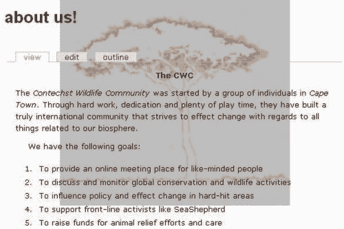

正如你所希望看到的，这个背景图像相当不引人注目，并且不会使阅读任何内容变得特别困难，尽管很明显，它与背景的颜色还不相同。当然，您不仅限于向站点主体添加背景图像，还可以在其他位置添加它们。只需首先检查哪些 HTML 标记支持 `background`或 `background-image`选项。

在我们继续研究颜色之前，重要的是要意识到这里的工作方式存在一个不幸的问题。你能认出它吗？想想当这些更改部署到您的实时站点时会发生什么。*该域名的 URL 是什么？*确定不会 `http://localhost/drupal`；因此，当你的样式表通过搜索 `http://localhost/drupal/files/ block_background.png`来搜索背景图像时，它将失败。

### 笔记

考虑将所有与主题相关的图像添加到实际的文件夹 T0 文件夹中，而不只是将它们上传到标准的 OutT1 文件夹中。

让我们通过在 `box_grey_dev`下创建一个 `images`文件夹来尝试一下。将您的背景图像插入此文件夹，然后将绝对 URL `http://localhost/drupal/files/block_background.png`更改为相对 URL `images/block_background.png`，并确认您获得了预期结果。

现在，当部署站点时，您不会有丢失图像的问题，因为相对 URL 路径是保留的，而绝对路径会发生变化。

## 颜色

有了这些新图像，您可能已经注意到，这两个图像都不适合站点的其他部分，因为默认情况下，它们当前都是白色的。为了纠正这一点，我们将把站点的 `body`标签的背景颜色更改为以下颜色：

```php
body {
color: #000;
background: #BEBEBE url(images/block_background.png) no-repeat top;
font-family: Verdana, Helvetica, Arial, Lucida, sans-serif;
font-size: 84%;
padding: 0;
margin: 0;
}

```

经过这一修改，网站现在看起来更好了。背景图像无缝集成，标题图像现在淡入正确的颜色，以便在用户扩展浏览器宽度时，图像与页面其余部分之间有一个自然过渡。

但是，随着背景颜色的变化，需要对其他颜色进行大量更改，特别是用于超链接的颜色。当然，甚至没有必要改变背景色！我可以始终将标题图像与默认颜色混合，或者使背景图像的背景透明，但是让我们继续进行一些更改，以了解可以做些什么。

现在，你可以随意改变网站的颜色。您已经看到，更改属性（如 `background`或 `color`的颜色）只是将新的颜色代码插入正确的位置；现在，我们将列出更有趣的更改，如下所示。

*超链接：*

```php
a, a:link { color: #3A3730; }
a:visited { color: #111111; }
a:hover, a:focus { color: #888888; }
a:active { color: #444444; }
.sidebar .block a:hover { color: #444444; }
#primary a:hover { color: #777; }

```

*侧栏：*

```php
.sidebar .block {
background: #E5E5E5;
border: solid 1px #999;
margin: 0 5px 5px 5px;
padding: 0 5px 5px 5px;
}

```

*输入：*

```php
input, textarea {
background: #E5E5E5;
color: inherit;
border: 1px solid #777;
}

```

*页脚：*

```php
#footer {
color: #666;
background: #E5E5E5;
border-top: solid 1px #777;
padding: 1em 1em 1em 1em;
font-size: 0.9em;
text-align: center;
}

```

*初级：*

```php
#primary {
font-size: 1.2em;
border-top: solid 1px #999;

                            border: solid 1px #999;
background: #E5E5E5;    

}

```

完成所有颜色更改后，标准页面的外观可能如下所示：


现在的网站很容易使用，希望你会同意颜色协调至少在视觉上是容易的。请记住，当你自己进行调整时，样式表中有大量与颜色相关的设置，因此你确实需要仔细检查你的站点，以确保当链接消失时不会出现令人不快的意外，因为它们的颜色与背景非常相似等等。

## 页面修改

页面的实际布局完全可能不符合您的喜好。在这种情况下，在实现更改时有两种选择。样式表可用于有限数量的更改。例如，如果您发现边栏对于站点来说太窄，可以通过更改以下块将边栏加宽（或缩小，如果需要）到以像素为单位的固定宽度：

```php
td.sidebar {
vertical-align: top;
padding: 0;
    width: 200px;                            

}

```

*但如果你需要对网站进行更剧烈的改动，该怎么办？*比如说，你想在每个页面上添加一个额外的栏目，以便插入一些广告，希望你能从网站上获得一些收入。为了做到这一点，我们需要查看 `page.tpl.php`文件，因为这是控制每个页面布局的地方。根据您的冒险程度，您可以添加一些条件 PHP 代码，以便仅在特定时间显示带有广告的列。就我们的目的而言，只需添加新列就足够了。

顺便说一句，我们将用于演示的广告直接来自 Amazon associates 网站，如果您对使用此类广告感兴趣，请确保在 Drupal 网站上查看与 Amazon 相关的各种贡献。目前，重要的一点是了解如何添加专栏，您可以在空闲时查看贡献或 Amazon associates。

比如说，我们希望该列显示在页面最右侧的右侧，在右侧边栏之后，这样它就不会以任何明显的方式影响网站的使用。如果是这种情况，我们需要在代码中找到添加右侧边栏的位置，并在其中添加新列。在 `page.tpl.php`文件中查找这段代码：

```php
<td class="sidebar" id="sidebar-right">
<?php print $sidebar_right ?>
</td>

```

正如您所知，它负责添加一个包含右侧边栏的表格单元格。简单地在这之后添加另一个单元格就可以了，所以让我们继续尝试吧。对文件进行以下更改：

```php
<?php if ($sidebar_right != ""): ?>
<td class="sidebar" id="sidebar-right">
<?php print $sidebar_right ?>
</td>
<?php endif; ?>
   <td valign="top" width="120">
<iframe src="http://rcm.amazon.com/e/cm?t=**************&o=1& p=11&l=ez&f=ifr&f=ifr" width="120" height="600" scrolling="no" border="0" frameborder="0" style="border:none;"></iframe>
</td>                             
</tr>
</table>

```

这里有几个要点需要注意。首先，新的单元格被`<td>`标记包围，放在 PHP `if`语句之后，因为我们不希望它受到与右侧边栏相同的条件约束（它应该简单地显示在每个页面上）。

其次，除了在单元格顶部垂直对齐的内容外，单元格的宽度为 120 像素，因为我们从亚马逊代码中知道广告的宽度始终为 120 像素（这是因为我们选择了特定尺寸的广告）。最后，添加的广告代码由亚马逊提供，如果您希望获得这样的广告，那么在某个阶段您需要向亚马逊注册以获得您的 ID（在前面的代码中用 `*`符号省略）。

现在查看一下该网站，可以看出广告的显示与预期一致：


当然，您可能希望在页面上实现很多不同的功能，因此花一些时间来处理代码将有助于您在以后需要对站点进行更大的更改时解决问题。您甚至可能希望在标题部分添加横幅广告。回想一下，我们把网站的徽标空间变成了整个标题，这有点作弊。这样做意味着在标题中仍然有分配给其他内容的空间（即使这是不可见的），作为练习，您可能希望查看是否可以使用此空间。

这提醒我重申……

### 注

在多个浏览器上测试对站点所做的任何更改都是非常重要的！

测试布局要比简单地检查所有东西是否都在正确的位置更深入。确保 CSS 和 HTML 的有效性和正确性非常重要，实现这一点的资源可在 `box_grey`中自动获得。只需向下滚动到页面底部，直到看到以下内容：


一旦您的站点在公共域的 Internet 上启动并运行，单击这些链接将帮助您确保布局代码有效。如果报告了任何问题，则应由您确保您的站点尽可能符合要求。不幸的是，如果您在开发机器上尝试此操作，您很可能会收到错误消息，因为这些服务只在公共域上工作。

# 总结

从了解规划网站外观时必须考虑的因素，到对代码进行更改，本章为您提供了使用 Drupal 界面的基础知识。

定制网站外观最重要的一个方面是了解 Drupal 是如何设置的，以利用主题的力量。正如我们所看到的，主题提供了一种模板，您可以从中创建自己独特的站点。这为我们节省了大量的时间和精力，因为我们不再需要从头开始工作。我们还简要介绍了从主题引擎生成主题的可能性，希望您有足够的信心在获得更多经验后开始更详细地了解这一点。

关于构建站点的界面，经验非常重要。您需要花一些时间使用三种主要技术：HTML、CSS 和 PHP。在本章中，我们在设置修改随所选基本主题提供的样式表之前，对 CSS 进行了一些详细的研究。无论你选择什么主题作为你网站的基础，你所面临的任务本质上将与本章讨论的任务相似，希望你会发现 CSS 是你军械库中最强大、最有用的武器。

通过使用图像和 HTML 获得的知识，以及讨论的设计注意事项的应用，不仅对 Drupal 站点有帮助，而且对您最终使用的任何其他基于 web 的应用程序也有帮助。获得对各种不同类型设计的欣赏，以及必须使用图像和代码，将允许您在未来创建更具雄心的图形用户界面。