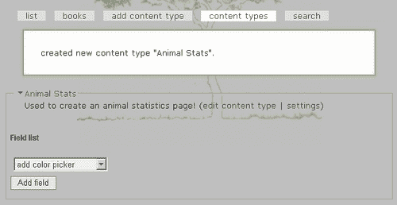
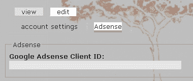
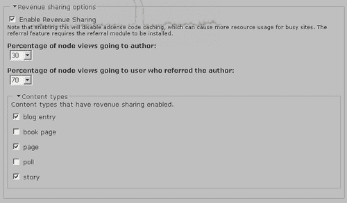
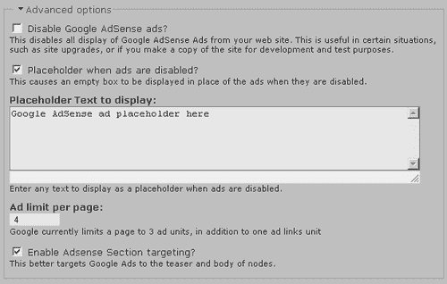
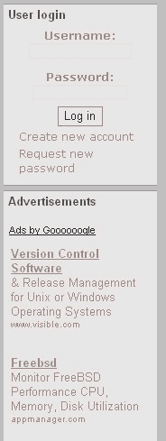
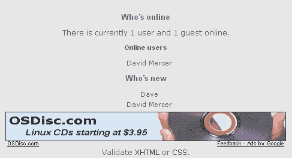
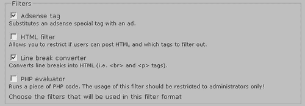
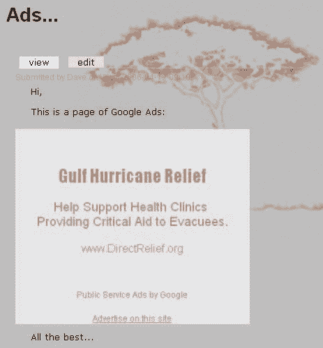
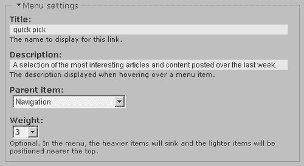

# 九、高级功能和修改

我们将从展示 Drupal 中一些更高级或更有趣的功能的模块抓取包开始，以便让您有机会将*特别的东西*添加到您的站点。无论是一种新的内容类型，一种从流量中获得收入的广告策略，甚至是一种提供漂亮、动态内容的方式，你都应该在这里找到一些东西来为你的网站增值。

但是请记住，如果默认发行版或任何模块中都没有所需的内容，那么您并不是完全不走运。很可能社区中的其他人以前也做过类似的事情，你应该在论坛上得到一些有用的回复，至少解释一些你需要的东西。如果在某个时候你确实创造了一些非常棒的东西，请通过与他人分享你的作品来回报社区。

话虽如此，能够为网站添加自己的内容以使其恰到好处通常是很重要的。因此，我们将使用互联网上免费提供的代码来研究一些有趣的装饰。合并 JavaScript 和其他小型工作代码单元（通常称为小部件）是增强站点的完美方式，而无需先了解编程的所有知识。

因此，对于新模块，我们将了解以下内容：

*   屈曲节点
*   广告

第一个模块专门处理内容，而另一个模块使您能够将您的网站与另一个在线业务（即谷歌）集成，以赚取一点现金。到本章结束时，您将成为使用稍微复杂的贡献的高手。

我们还将讨论对接口的一些更高级的修改。能够在你的网站上做一些不同寻常的事情总是很有趣的，使用 HTML、PHP 和 CSS 处理主题文件，对整个 Web 来说是很好的培训，而不仅仅是 Drupal。这里的*高级站点修改*部分希望能为您自己的站点提供一些想法，并让您了解实现这些想法所涉及的内容。

在我们开始之前要记住的最后一件事是，您*必须，必须，必须*不时地备份整个站点，包括数据库（最好是每次成功添加新功能时）。此外，您还应该在开始使用之前备份您正在使用的每个页面。备份的主题在*运行您的网站*一章中进行了讨论，这一章紧随其后——我提到了这一点，以防您觉得在开始摆弄之前，是时候备份您现在拥有的内容了。

# 屈曲节点

在这个过程中的某个时刻，您可能会发现当前的内容类型都不适合您希望交付的内容类型。如果是这样的话，**Flexinode**的贡献可能正是您想要的。正如模块的描述所述：

> FlexNode 是一个模块，允许非程序员在需求不大时在 Drupal 中创建新的节点类型（灵活的内容类型）。用户可以在节点编辑表单中为其内容类型定义字段，并可以查看模块显示的节点或修改其主题中的显示。

在演示站点的例子中，让我们假设我们想要为濒危动物建立一个生命统计页面库。在这种情况下，我们可能会麻烦地构建一个粗略的 HTML 模板，并使用页面内容类型，将相关数据插入表中的各个单元格。然而，这将是一种痛苦，因为如果有各种各样的人发布这种类型的信息，那么他们每个人都必须学习如何使用这个 HTML 模板。让我们来看看 Flexinode 的贡献在这里能有什么帮助。

## 下载并安装 FlexNode

你现在应该很熟悉这个过程了；所以我们不会花太多时间仔细研究它。

### 注

撰写本文时，FlexNode 仍在升级版本 4.7 的兼容性。如果您打算在您的实时站点上使用它，请小心并确保获得合适、稳定的版本。

只需转到 Drupal 网站并下载 FlexNode 模块的正确版本。将文件解压缩到 Drupal 安装中的 `modules`目录，然后使用以下命令执行 `.mysql`脚本（记住修改文件路径以适合您的单个系统）：

```php
$ mysql udrupal p drupal < C:\apache2triad\htdocs\drupal\modules\flexinode\flexinode.mysql

```

系统将提示您输入密码，您可以通过登录 `mysql`命令行客户端并查找新的 Flexinode 表来确保已添加相关表，如以下屏幕截图所示：


请注意， `drupal`数据库中现在有三个 `flexinode_`表。如果您不喜欢使用命令行，请记住，您可以使用 phpMyAdmin 提供的可视化界面。

有趣的是，这个贡献伴随着一堆贡献！我的意思是，默认情况下，FlexNode 没有启用与之相关的额外功能。看一看文件系统中的解压缩文件夹 `flexinode`（在 `modules`目录下）。您会注意到存在一个 `contrib`文件夹，其中包含一大堆 `.inc`文件。

这些 `.inc`文件中的每一个都负责提供与其同名文件相关的功能。例如， `field_textarea.inc`提供将文本区域包含到内容类型中所需的代码，等等。您还将注意到，有大量自述文件可用于帮助澄清相应的 `.inc`文件的作用。例如， `README.colorpicker.txt`文件的内容是：

> 我希望这将有助于用户控制他们网站的风格。我可以想象一个具有多个颜色选择器、选择框和复选框的 FlexNode，它们可以用于覆盖特定用户的主题的默认样式。

请确保您阅读了每个要启用的 `.inc`文件的自述文件，因为您可能需要先移动文件，甚至安装其他模块。准备好后，在点击**保存配置之前，进入浏览器中**管理**下的**模块**部分，启用 FlexNode 模块。**

## 创建自定义内容类型

在**管理**部分，导航到**内容**，您会注意到，此页面上显示了两个额外的与内容相关的选项卡，允许我们指定和使用新的内容类型。点击**添加内容类型**选项卡将弹出如下页面：


一旦**提交**，您将自动进入**内容类型**页面，您现在可以开始处理新创建的类型，如图所示：



此时，您可以单击内容类型部分右上角显示的两个链接中的任意一个（在本例中，该部分的标题为**动物统计数据】**。第一个链接**编辑内容类型**允许您更改创建内容类型时提供的任何信息，例如，您可能希望修改名称、说明或帮助文本。第二个选项允许您添加一些**提交指南**并配置标准**工作流**选项，如下所示：


这些标准选项已经在前面的章节中详细讨论过，您确实需要根据您打算如何使用此内容类型来做出决定。出于我们的目的，已经启用了文件附件（即使这在屏幕截图中不可见），以允许在文章中提供任何断言的证据。还允许发表评论，以便人们能够协作确保事实是正确的和最新的。

有了这两个选项，FlexNode 模块真正有趣和强大的部分就开始发挥作用了。**字段列表**为我们提供了指定大量不同类型输入的选项，然后将这些输入绑定到整体内容类型中。现在，这可能会让人有点困惑，因为您需要记住，您指定的是制作内容所需的*内容，而不是*实际内容*本身。*

因此，在您开始在整个节目中添加不同的字段之前，请仔细考虑您希望您的特殊内容类型做什么以及它应该是什么样子。一旦你对你正在创造的东西有了一个清晰的概念，你就可以更容易地去创造它。

## 新增结构

我们的*动物统计*页面应该是信息丰富且有趣的，为感兴趣的各方提供全面而连贯的知识体系，有助于在读者心目中确定动物的形象、概况和困境。如果你想一想像这样的页面需要什么类型的元素，那么下面这样的内容可能是合适的：

*   介绍动物的一两段话
*   动物的照片
*   对其现状的总结
*   其栖息地的地图
*   联系信息和/或指向更多资源的链接

考虑到这一点，我们可以求助于现场采集器，看看它能提供什么。因为我们想在页面上显示的第一件事是段落，所以在页面顶部添加一个文本区域是有意义的。在**内容类型**页面上显示的下拉列表中选择此选项将显示以下表单：


在这里，文本区域被设置为**必填字段**，因为任何想要添加**动物统计**页面的用户首先必须对该动物有一点发言权——这是一个合理的假设！将此字段设置为必填字段的优点是，现在选择**在“挑逗”中显示**是一个好主意（因为我们知道总会有一些介绍性文本）。这意味着，每当有人碰巧浏览**动物统计**页面时，他们都可以阅读摘要中的介绍性段落。

接下来，将为该字段分配一个权重**9**，因为我们知道该字段很可能总是显示在页面的最顶部。同样，您可以根据页面的格式选择其余字段。每个字段都有自己的一组注意事项，您需要根据内容页的使用方式进行设置。和往常一样，如果工作不正常，很容易回来修改。

一旦所有字段都被正确选择并设置到页面的正确部分，内容生产者就可以像使用任何其他节点一样使用页面。就这样！剩下要做的就是确保内容按预期的方式工作，并且正确地履行其预期的角色。因为我们已经讨论了如何使用其他内容类型，所以在此不再赘述。

# AdSense

一旦你的网站建立并运行起来，希望有相当数量的人访问，这可能是一个不错的选择，尝试从广告中赚取一点额外收入。谷歌提供了**AdSense**广告方案，该方案允许您通过简单地将广告代码片段剪切粘贴到页面中，添加可定制的广告块。你所需要做的就是决定最适合你的网站的尺寸和颜色，剩下的由谷歌负责。

这样做虽然很容易，但可能无法让你控制你的广告，因此 Drupal 提供了一个**AdSense**模块来帮助你。本节将介绍 AdSense 模块的工作原理，因为它可以更好地控制显示的广告类型和时间。

在我们开始之前，重要的是你要在谷歌注册，以获得一个帐户和 ID，这将用于跟踪你的网站通过广告发送的流量。您可以直接访问 AdSense 网站：[https://www.google.com/adsense/](https://www.google.com/adsense/) 。只需点击突出显示的**点击此处即可应用**按钮并按照说明操作。或者，您也可以通过本页面显示的推荐链接注册，以支持 AdSense 模块的开发者：[http://baheyeldin.com/click/476/0](http://baheyeldin.com/click/476/0) 。

## 安装和配置 AdSense

AdSense 模块的安装非常简单，除了将下载的文件复制到您的 `modules`文件夹外，您无需修改数据库或其他任何相关内容。完成后，您可以在**管理**链接下的**模块**部分启用该模块。

保存新模块的配置后，请转到**设置**并在**设置**链接下查找新的**adsense**链接：


点击此按钮将打开新的**adsense**配置页面，该页面还提供了一个链接，指向如何在 `admin/help/adsense`配置所有内容的大量信息。您必须通读与每个选项相关的注释，因为它们提供了关于可用广告类型、尺寸以及模块如何实际显示广告的有用信息。

我们现在可以继续配置我们的广告，但请记住，一旦配置完成，我们仍然需要手动将它们添加到站点中（在下一节中讨论）。实际设置从以下内容开始：


一旦你获得了你的客户 ID，你可以在这里简单地输入它，通过你网站上的广告的任何流量都将为所提供 ID 的所有者（换句话说，你）产生收入。下一节允许您决定哪些页面应该能够显示广告，哪些页面不应该：


如您所见，您可以决定是否列出所有可以显示广告的页面，还是列出所有不能显示广告的页面。根据适合您站点的内容，您需要选择其中一个，然后在所选内容下方的文本区域中添加相应的页面。

出于演示网站的目的，我们很乐意在所有页面上显示广告，因此文本区域留空，原因有二。第一，网站中没有广告不合适的部分，第二，广告不会显示给管理员，所以我们不必指定我们不想在管理员页面上看到它们。

*但我们可以展示哪些类型的广告？*下表显示了您可以使用的各种选项：

<colgroup><col style="text-align: left"> <col style="text-align: left"></colgroup> 
| 

广告类型

 | 

尺寸

 |
| --- | --- |
| 广告链接 4-Links 120x90 | 120x90 |
| 横幅 | 120x240 |
| 摩天大楼 | 120x600 |
| 按钮 | 125x125 |
| 半旗 | 2340x60 |
| 广告链接 4-Links 160x90 | 160x90 |
| 宽阔的摩天大楼 | 160x600 |
| 广告链接 4-Links 180x90 | 180x90 |
| 大矩形 | 336x280 |
| 横幅广告链接 4-Links | 468x15 |
| 横幅 | 468x60 |
| 宽横幅广告链接 4-Links | 728x15 |
| 排行榜 | 728x90 |

*为什么会有这么多不同类型的广告？*你可以问。原因是，通常网页上适合做广告的空间有限。例如，您可能会发现站点左栏下方有一些空间，在这种情况下，您需要一个长而薄的广告。当然，您可能还希望在页面底部显示广告，在这种情况下，您需要一个长而平的广告。

你很可能同时需要两种类型的广告，在这种情况下，利用群组来区分不同类型的广告是很重要的。根据广告在页面中的位置，您可能需要指定不同的颜色，甚至是不同类型的广告。所有这些都可以通过使用组来处理。

组设置的示例（在**广告类型和颜色**部分下）如下：


这里选择的颜色会使显示的广告融入网站，使它们看起来像页面组成的自然部分。根据你放置广告的位置，你需要调整颜色设置，使所有东西看起来整洁。

您可以在任何时候设置三个组，因此不要感到仅限于与一个组一起工作。您可以决定在一个区域显示纯图像广告，但在另一个区域显示文本广告，在这种情况下，您必须使用不同的组。

以下选项涉及**自定义频道**，您需要在*谷歌 AdSense*账户中读取这些频道才能开始工作。该网站对他们有这样的描述：

> 自定义通道允许您根据指定的标准跟踪性能。通过将特定于频道的广告代码粘贴到页面中，您可以跨一系列 URL 跟踪各种指标。例如，使用自定义频道跟踪不同广告格式的性能，或相互比较不同的页面主题。

这是留给你去研究的，因为这确实是一个与谷歌相关的问题，而不是一个 Drupal 问题。创建了几个频道后，只需在**adsense**设置页面的**自定义频道**部分实现即可。

**收入分享选项**是一个非常有用的工具，它允许您将谷歌广告产生的收入的一部分分配给包含广告的页面的作者。换句话说，您现在可以使用广告收入作为鼓励博客作者写博客、故事作者写作等的一种方式，因为他们现在有一个既得利益，那就是让他们的内容尽可能受欢迎，从而使尽可能多的流量通过他们的帖子。

不幸的是，如果您决定使用收入共享，那么您需要返回 Drupal 网站并下载相应版本的**用户推荐**模块，因为这是 AdSense 模块正常工作所必需的。你会发现安装模块很容易；必须运行一个 MySQL 脚本，但请记住，我们在前面的章节中已经完成了这项工作。

一旦安装并启用了用户推荐，您需要在**管理**下的**访问控制**部分中设置能够**使用推荐**的角色。然后，您必须在管理部分的**设置**下的**配置文件**页面上创建一个新的**配置文件**字段，以便用户可以将他们的 Google AdSense 客户端 ID 输入他们的**我的账户**部分。为此，您需要首先启用**配置文件**模块（它是核心发行版的一部分，因此不需要下载）。

在这种情况下，您应该选择一个**单行文本字段**，并提供一些信息丰富且合理的选项，如下所示：


现在，当用户查看其帐户信息时（甚至在注册时，这取决于是否在**配置文件**部分启用），他们有一个文本区域，可以在其中输入他们的 Google AdSense ID：



一切设置正确后，为演示站点进行了以下以收入为导向的设置：



在这种情况下，内容的作者将从其内容的流量中获得 30%的收入，但只有博客、页面和故事才有资格成为潜在的收入共享内容用户，而这些用户正在从事民意调查和书籍页面的工作，遗憾的是，他们错过了。记得：

### 注

任何希望从收入分享中受益的用户都必须拥有自己的谷歌账户，并且需要在个人资料中提供他们的谷歌客户 ID，然后才能将他们的收入份额记入贷方。

最后，**高级选项**允许您指定是禁用广告、显示占位符、限制每页广告数量还是**启用 AdSense 节目标**，如下所示：



始终启用占位符是一个好主意，因为这样即使您以管理员身份登录，也可以跟踪广告的位置。每次更改广告的位置时都要登录和注销可能会相当耗时，但通过查看占位符知道广告的位置非常简单，如下所示：


感兴趣的最后一项**部分目标**是一项与谷歌相关的功能，定义如下：

> 节目标允许您建议您的文本和 HTML 内容的节，您希望我们在将广告与站点内容匹配时强调或淡化这些节。通过向我们提供您的建议，您可以帮助我们改进您的广告定位。我们建议只有熟悉 HTML 的人才能尝试实现节目标。

在我们的例子中，我们不需要做任何事情，因为模块会自动将 Google 广告定位到我们的摘要和节点体。只要启用它，您就可以离开！

完成组等配置后，点击**保存配置**。然后是时候实际利用这些配置选项，将广告插入到网站页面上。

## 将谷歌广告添加到您的页面

在我们的例子中，我们希望在页面左侧任何和所有其他块的下方显示一条广告。这样做的原因是右侧的边栏已经满了，而左侧的边栏填充得很少，所以这里有空间。虽然这个广告将被安置在一个区块内，但我们也将展示如何将广告直接添加到站点。

让我们先从街区开始…

您已经了解了如何创建新块；因此，如果您想这样做，请转到**块**链接，点击**添加块**选项卡，弹出以下页面：


在这里，我们给了这个区块一个新的标题，毫不奇怪的是**广告**（区块列表中出现的描述是**谷歌广告】**。接下来，我们输入一些 PHP 代码来显示块中的 Google 广告。如果你想知道我是如何想出这段代码的，那么在**adsense**配置页面上提供的注释中都有讨论。这里需要注意的重要一点是 `adsense_display`功能，因为它通过您在**adsense**配置页面中所做的设置来控制您的广告外观（在上一节中讨论）。

前面的屏幕截图显示了这个函数的简单用法，但是让我们更详细地看一下它，这样您就可以理解在需要稍微复杂一些的情况下它是如何工作的。从文档中，我们可以看到 `adsense_display`采用了以下三个参数：

*   **格式：**这是一个由两个数字组成的字符串，中间有一个 `x`。它可以是所提供列表中的任何有效组合。如果未指定，则假定为 `160x600`。
*   **组：**表示广告的类型（文本或图像）和颜色的组，可以是 `1, 2`或 `3`。如果未指定，则假定为 `1`。
*   **频道：**这是 ad 的自定义频道，在 AdSense 中配置。这是一个可选参数，如果未指定，则假定为 `1`。如果您没有配置任何通道，则不使用此参数。

知道了这一点，您可以看到，在前面的屏幕截图中，我们请求了一个尺寸为 `160x600`像素的广告，并且该广告应该属于 `1`组。最后一个参数是可选的，因为我们不关心定制频道（因为这是一个更高级的选项，我们留给您考虑一下，如果您的广告策略在将来变得更加复杂），我们完全把它排除在外。

最后要注意的是，我们将**输入格式**设置为**PHP 代码**，以允许 Drupal 实现我们为块输入的代码。一旦该块成功添加到系统中，我们会给它一个高权重（因此它会在所有其他内容之后显示），并在左侧边栏中启用它，如图所示：


这就是全部！只需注销并查看页面即可查看结果。在本例中，由于我们在“配置”部分中所做的设置和指定的尺寸，我们在左侧栏中显示了以下块：



看起来不错！*但我们如何直接将广告添加到页面中？*简单！打开 `page.tpl.php`文件，在需要的地方插入 `adsense_display`函数，如下图：

```php
<div id="footer">
<?php if ($footer_message) : ?>
<p><?php print $footer_message;?></p>
<?php endif; ?>
<?php
if (module_exist("adsense"))
{
print adsense_display("468x60", 2);
}
?>
Validate <a href="http://validator.w3.org/check/referer">XHTML</a> or <a href="http://jigsaw.w3.org/css-validator/check/referer">CSS</a>.
</div><!-- footer -->
<?php print $closure;?>
</body>
</html>

```

此代码段创建了一个长而平的横幅，其属性在第二个属性组中配置（您需要确保已进行适当的设置，或更改组）。在网站上查看时，我们会看到以下广告（在本例中，第 2 组被配置为显示图像广告）：



记住，在你的网站上显示谷歌广告实际上并不需要 AdSense 的贡献，这一点很重要。事实上，如果您没有使用 PHPTemplate 主题，或者试图将 PHP 代码插入模板的某个区域，而该区域无法使用它，那么您甚至可能会遇到问题。如果你遇到问题，有几件事你可以看看：

*   确保您没有以管理员身份登录，因为只有广告占位符显示给此用户。
*   查看页面的源代码以查看 `adsense_display`函数的结果。
*   检查您是否为广告设置了有效的尺寸，请参阅前面标题为*安装和配置 AdSense*一节中的表格。
*   确保您能够显示所需的广告数量，这可能是因为您在这方面受到限制。

此列表中的第二点非常重要，因为查看页面的源代码可以告诉您很多可能出现的错误。为此，在 IE 中点击**查看**，然后点击**源**，或者在 Firefox 中点击*Ctrl+U*，您应该会看到类似的情况（假设一切都按照计划进行）：

```php
<div class="adsense">
<script type="text/javascript"><!--
google_ad_client = "ca-ref-pub-0173529661****";
google_ad_type = "image";
google_ad_channel = "";
google_ad_width = 468;
google_ad_height = 60;
google_ad_format = "468x60_as";
google_color_border = "E5E5E5";
google_color_bg = "E5E5E5";
google_color_link = "AD857F";
google_color_url = "AD857F";
google_color_text = "AD857F";
//--></script>
<script type="text/javascript"
src="http://pagead2.googlesyndication.com/pagead/show_ads.js">
</script>
</div>

```

如果出现了问题，那么您很可能能够从添加到 Google 广告代码的注释或源代码中实际呈现的内容中发现问题。

你在开发机器上的广告问题可能不是世界末日；请务必查看论坛以获取答案。然而，在你在你的现场网站上尝试了所有东西并给谷歌足够的时间抓取你的网页之前，不要太惊慌。在这之前，谷歌可能不会显示广告，因为它不知道你的网站是关于什么的。

## 将谷歌广告添加到您的内容中

还有一种方法可以直接在你的内容中插入广告。例如，如果您想在内容中显示广告，首先需要启用**Adsense 过滤器**，方法是导航到**管理**下的**输入格式**，修改当前输入格式或完全创建新的输入格式。例如，在**完整 HTML 输入格式**上启用了**Adsense 过滤器**，如下所示：



现在，当添加使用**完整 HTML**输入格式的内容时，可以添加 `adsense`标记，**完整 HTML**选项有一行额外的信息，概述如何使用它，如下所示：


添加一个包含谷歌广告的页面是一项微不足道的任务。只需在 `adsense`标签中插入正确的格式、组和频道，并将其添加到帖子中您喜欢的任何位置：


`adsense`标签有如下特殊格式：

```php
[adsense:format:group:channel]

```

哪里：

*   `format`是支持的广告格式之一（例如 `468x60)`
*   `group`是该广告所属的数字广告组；决定颜色
*   `channel`是数字广告频道

注销后查看此页面会产生以下结果（取决于您为标记中引用的相关组所做的设置）：



在格式中还有一个与 `flexiblocks`一起使用的特殊格式：

```php
[adsense:flexiblock:location]

```

我们在这里不讨论**Flexiblock**的使用，因此我们现在不进行讨论，但作为练习，您可能会发现下载和安装 Flexiblock 贡献并尝试一下是值得的。

# 高级站点修改

使用基于 PHP 的应用程序（如 Drupal）的一个好处是，它们不仅是开源的，而且还可以将它们与任何其他您可以使用的技术结合起来。有一个巨大的在线编程社区，许多人将他们整洁的小脚本公开提供给像你和我这样的人，只要我们愿意，就可以简单地加入我们自己的网站。并不是所有的都是免费的，但很多都是免费的，而且很多都非常便宜；因此，查看一些脚本站点，看看您能学到什么，总是值得的。

这里有几个你应该考虑浏览的网站：

*   [http://www.phpbuilder.com](http://www.phpbuilder.com)
*   [http://www.hotscripts.com](http://www.hotscripts.com)
*   [http://www.php.resourceindex.com](http://www.php.resourceindex.com%20)
*   `http://drupal.org/node/257—Customization`

在本节中，我们将了解哪些内容是可用的，哪些内容可以轻松整合到 Drupal 网站中。在这一点上，你们中的许多人可能会畏缩不前，因为你们并不热衷于参与核心 PHP 编程。别担心！总的来说，脚本是自主的、完整的，因此我们所需要的只是在正确的地方剪切粘贴一些内容，也许是在这里和那里进行一些奇怪的调整，然后我们就可以开始了。记得：

### 注

添加强大而先进的功能，就像在大型网站上看到的那样，*并不难！*

重要的是要知道，无论何时使用其他人的脚本，都应该始终查看任何和所有许可问题。您会发现，许多许可证是免费提供给非商业用途的，但如果您将其用于商业目的，则需要购买许可证。但是，当您对使用脚本更加自信时，您应该会发现，通过使用自己的代码或将免费提供的代码片段捆绑在一起，可以构建相当强大的功能。

由于将要进行的修改是基于 JavaScript 和 AJAX 的，因此可以公平地警告您，Drupal 4.7 通过 `drupal.js`文件提供了对 AJAX 的内置支持。AJAX 是一个用于描述基于 JavaScript 的应用程序的术语，这些应用程序用于创建响应迅速的动态网页元素。然而，本章的目的是向您展示如何在不必学习任何编码的情况下整合真正优秀的功能*。因此，我们不会讨论如何利用 `drupal.js`中提供的 JavaScript 功能，因为这实际上是开发人员的任务，而不是站点管理员的任务。*

如果您对创建自己的 AJAX 小部件感兴趣，请查看 Drupal 站点 `http://drupal.org/node/42403`上提供的在线教程。当您需要构建一些自己的小部件时，这些将让您很好地了解从何处开始以及如何开始。任何与 JavaScript 相关的开发都应该使用 Drupal 的原生 JavaScript 支持来完成。

### 注

我们在本章的其余部分所讨论的内容有点像欺骗，我们正在获得一些好的 JavaScript 效果的优势，而不必承担学习如何编写代码的负担。

许多新的或升级的模块将（并且确实）使用 AJAX。您可能想下载并安装其中一些，看看使用 Drupal 的原生 JavaScript 支持可以实现什么类型的效果。当然，Drupal 4.7 的管理界面已经通过引入可折叠页面区域等功能（例如，在**设置**页面上）实现了 AJAXified。

无论如何，让我们来看看我们将要添加的第一个新特性。

## 滚动新闻报价器

这是许多试图为用户提供最新信息的网站的一个很好的特性。如果您需要一次呈现多个信息位，那么动态新闻采集器就是最好的选择。通过一点工作，您甚至可以将新闻自动收录器与 RSS 提要集成，以呈现来自其他网站的突发新闻，而无需自己创建内容。

我们将保持它的简单性，并在网站的每个页面顶部创建一个滚动的新闻标签。股票代码将显示储存在网站 `.txt`文件中的信息。虽然从屏幕截图上看不出此信息在屏幕上滚动，但添加内容最终会是这样的：


您可以从上面的 ticker 中显示的各种字体中看出，可以添加 HTML 元素，例如单个项目的链接（以粗体显示）。这意味着您可以使用此股票代码添加赞助商链接，甚至添加图像链接。有相当大的变化空间；因此，我们将看看如何启动一切，运行你用股票代码创建的东西，然后取决于你和你的想象力。

### 获取股票行情

第一个任务当然是找到一个可行的代码脚本。在这种情况下，从**mioplanet**的[下载了一个免费的股票代码脚本（在谷歌上进行了短暂搜索）http://www.mioplanet.com/ rsc/newsticker_javascript.htm](http://www.mioplanet.com/ rsc/newsticker_javascript.htm)。本页提供的使用条件非常简单，您应该确保在继续之前理解这些条款。假设您愿意继续，请下载名为 `webticker_lib.js`的 JavaScript 源代码文件，并将其保存到您当前正在开发的主题文件夹中（对于演示站点，当前为 `box_grey_dev`）。

### 注

如果你打算使用一些像这样的小部件，最好在你的主题中创建一个 `widgets`文件夹，以保持一切整洁，易于定位。

接下来，打开 `page.tpl.php`文件，寻找合适的地方添加股票代码。在 mioplanet 页面上给出了将股票代码添加到您的网页所需的实际代码，您只需将其直接复制并粘贴到您的网站上即可。因为我想让股票代码显示在屏幕顶部，所以我在这里添加了代码：

```php
<?php if (count($primary_links)) : ?>
<ul id="primary">
<?php foreach ($primary_links as $link): ?>
<li><?php print $link?></li>
<?php endforeach; ?>
</ul>
<?php endif; ?>
<DIV ID="TICKER" STYLE="overflow:hidden; width:100%" onmouseover="TICKER_PAUSED=true" onmouseout="TICKER_PAUSED=false">
<? include "ticker.txt"?>
</DIV>
<script src="webticker_lib.js" language="javascript"></script>                            
</div>
<table id="content">
<tr>
<?php if ($sidebar_left != ""): ?>
<td class="sidebar" id="sidebar-left">
<?php print $sidebar_left ?>
</td>

```

如您所见，这会将脚本放置在相同的`<div>`标记中标题信息之后，但位于包含主要内容和左右侧栏的表上方。

这个脚本最重要的部分是对 `webticker_lib.js`文件的引用。在本例中，我已将相对路径添加到文件（webticker_lib.js），以便在将站点部署到主机服务器后不必更改该路径。

如果您发现您的滚动代码没有滚动，请尝试使用相对文件路径引用它，例如： `/drupal/themes/box_grey_dev/webticker_lib.js`。在不太可能的情况下，这不起作用，请尝试使用完全限定的路径： `C:\\apache2triad\\htdocs\\drupal\\themes\\box_grey_dev\\webticker_lib.js`。如果这样做有效，请记住在某个地方写一条注释，提醒您在将站点部署到实时主机后适当地更改此路径。正是由于这个原因，在脚本中包含这样的绝对文件路径通常是错误的做法。

### 注

如果您必须输入路径而不仅仅是文件名，最好在 Windows 计算机上使用另一个反斜杠（\\）来转义反斜杠，以防止与被误解的特殊字符混淆。或者，使用正斜杠。

最后，请注意，我添加了一个简短的 PHP 代码段，在第一个添加的`<div>`标记下面包含一个名为 `ticker.txt`的文件。如果您希望在处理其他代码之前测试自动售票机是否正常工作，请更换：

```php
<? include "ticker.txt"?>

```

与：

```php
Hi! You should see me scrolling across your page.

```

并在浏览器中查看您的站点。您应该会看到消息在页面上滚动，如下所示：


如果行得通，用 PHP `include`语句替换文本消息，然后继续。

### 创建内容

出于我们谦逊的目的，我们真正需要做的就是为我们刚刚在网站上安装的 JavaScript 文件提供一个要打印到屏幕上的行列表。假设我们将使用一个简单的文本文件来保存数据，我们需要每个单独的项目以其完整的形式出现在一行中。如果您想制作复杂的滚动项目，这有点限制，但就我们的演示而言，这已经足够了。你可以在这里添加你想要的任何东西；但是，请确保在向公众发布之前对所有内容进行彻底测试。

继续创建一个 `ticker.txt`文件，并将其添加到与 `webticker_lib.js`JavaScript 文件相同的文件夹中。在开始向其中添加信息行之前，请记住，您应该尝试为每个新闻项创建标准格式，以便尽可能减少创建新元素的工作量。在本例中，除了第一个和最后一个元素的起点和终点外，每一行都由一个竖线分隔，这两个元素有两个，以便使所有内容保持均匀。

下面的代码片段显示了演示站点上 `ticker.txt`文件的当前内容。以下是在*滚动新闻代码*部分的第一个屏幕截图中用于滚动文本的项目：

```php
|| <a href="http://www.mioplanet.com/rsc/newsticker_javascript.htm" target="_blank"><strong>Scrolling News Ticker</strong></a> by <a href="http://www.mioplanet.com" target="_blank"><strong>mioplanet</strong></a> |
| This book was brought to you by <a href="http://www.packtpub.com" target="_blank"><strong>Packt Publishing</strong></a> |
| It was written by <em>David Mercer</em> of <a href="http://www.contechst.com" target="_blank"><strong>Contechst Technical & Editorial Consultancy</strong></a> ||

```

不幸的是，由于本书页面大小的限制，应该显示为*单个*行的内容必须显示在*几个*上。然而，您应该明白，您可以在项目的开始和结束添加某种分隔符，并且可以在这些分隔符中添加您喜欢的任何 HTML。您甚至可能想尝试将图像甚至特殊样式添加到样式表并从这里引用它。例如，通过这种方式，您可以为每个项目添加突出显示的标题图标或徽标。

在本章中，您将进一步注意到，新闻代码有一个漂亮的新背景色。如何实现这种外观，留给您一个练习。（提示：*使用与主题相同的方法，声明一个新的*`<div>`

目前这个脚本的主要问题是，它需要您手动输入每个项目，如果您在未来十年内每天必须多次输入，这无疑将成为一种痛苦。有几种方法可以解决这个问题：

*   创建脚本以从数据库中提取信息。
*   从 RSS 提要中提取信息。
*   仅输入不经常更改的内容，例如指向赞助商的链接。
*   找别人帮你做。

虽然我们不会在这里继续讨论这个话题；对于您来说，尝试前面列出的任何一个或多个选项（第三个选项除外）都将是一次很好的体验，这是默认情况下涵盖的。请记住，您可以使用其他脚本来帮助您解决任何您可以在网络上找到的问题，并将其纳入到您的脚本中。无论如何，让我们继续做下一件事。

## 动态内容页

假设作为新网站的负责人，你想添加一个页面，概述你生活和社区中所有最新和最伟大的帖子、事件和进展。在演示站点中，我们将在主菜单中添加一个**快速选择**页面链接，人们可以快速访问该网站，以选择每周更新一次的最新和最重要事件。

现在，有很多模块可以让你展示一组相关的帖子等等，但这并不是我们想要的。理想情况下，我们希望提供一个选定项目的列表，允许用户选择感兴趣的主题。同时，我们不希望他们为了查看每个页面的内容而必须从一个节点跳到另一个节点。

我们需要的是一种只重新加载新文章而不实际更改页面的方法。同样，这可以通过使用已经开发的脚本轻松实现。在本例中，我们将使用免费提供的**动态 Ajax 内容**脚本，该脚本由[上的 DynamicDrive DHTML 脚本的人员提供 http://www.dynamicdrive.com](http://www.dynamicdrive.com) 。

### 将应用融入主题

在本例中，我们将获取 DynamicDrive 提供的 JavaScript 文件，并将其直接粘贴到`<head>`标记之间的 `page.tpl.php`文件中。您可以在以下地址获取特定脚本： `http://www.dynamicdrive.com/dynamicindex17/ajaxcontent.htm`。现在，理解脚本中发生了什么并不重要；然而，为了清晰起见，我们将分解代码列表，并快速查看它在做什么。

复制脚本后，将其粘贴到 PHP 文件中，如下所示（为了节省空间，我切掉了一些实际的代码文件）：

```php
<!DOCTYPE html PUBLIC "-//W3C//DTD XHTML 1.0 Transitional//EN"
"http://www.w3.org/TR/xhtml1/DTD/xhtml1-transitional.dtd">
<html  lang="<?php print $language ?>" xml:lang="<?php print $language ?>">
<head>
<title><?php print $head_title ?></title>
<meta http-equiv="Content-Style-Type" content="text/css" />
<?php print $head ?>
<?php print $styles ?>
<script type="text/javascript">
/***********************************************
* Dynamic Ajax Content- © Dynamic Drive DHTML code library (www.dynamicdrive.com)
* This notice MUST stay intact for legal use
* Visit Dynamic Drive at http://www.dynamicdrive.com/ for full source code
***********************************************/
var bustcachevar=1 //bust potential caching of external pages after initial request? (1=yes, 0=no)
var loadedobjects=""
var rootdomain="http://"+window.location.hostname
function ajaxpage(url, containerid){
var page_request = false
if (window.XMLHttpRequest) // if Mozilla, Safari etc
page_request = new XMLHttpRequest()
else if (window.ActiveXObject){ // if IE
try {
page_request = new ActiveXObject("Msxml2.XMLHTTP")
}
catch (e){
try{
page_request = new ActiveXObject("Microsoft.XMLHTTP")
}
catch (e){}
}
}
else
return false
page_request.onreadystatechange=function(){
loadpage(page_request, containerid)
}
...
function loadpage(page_request, containerid){
if (page_request.readyState == 4 && (page_request.status==200 || window.location.href.indexOf("http")==-1))
document.getElementById(containerid).innerHTML=page_request.responseText
}
...
if (fileref!=""){
document.getElementsByTagName("head").item(0).appendChild(fileref)
loadedobjects+=file+" " //Remember this object as being already added to page
}
}
}
</script>                          
</head>
<body <?php print theme("onload_attribute"); ?>>
<div id="header">
<?php print $search_box ?>
<?php if ($logo) : ?>

```

从这段代码中，您应该能够收集到，一旦脚本被声明，我们就使用一个函数 `ajaxpage`来创建一个新页面，该页面可以加载到父网页上的特定容器中。这将检查正在使用的浏览器，并尝试确保为调用浏览器创建正确的 `page_request`对象，以实现某些跨浏览器兼容性。

然后，使用 `loadpage`函数加载一个新页面，在用页面信息填充文档容器（ID 为 `containerid)`）之前，对新创建的 `page_request`对象执行一些检查。 `containerid`在接下来的页面代码中指定，但显然非常重要，因为它*确定新信息将加载到父页面的位置。*

只是重申一下，您没有必要理解这些脚本是如何工作的。它们有点像汽车的发动机，你可以在不知道它是如何工作的情况下驾驶它。话虽如此，JavaScript 是一个最有价值的工具，随着 AJAX 的出现来创建响应性 web 页面，花在研究这些脚本上的时间不会被浪费。

### 注

请记住，如果您想要创建自己的小部件，请学习如何使用 Drupal 的内置 JavaScript 支持。

随着这些功能添加到您的页面，辛苦的工作就完成了！我们现在需要把注意力转向如何在发布到**快速选择**页面时利用它们。

### 构建内容页面

构建一个新的动态页面只需要记住几个要点。首先，我们需要实际附加我们将要添加到帖子中的页面；否则，我们将无法将它们添加到页面中。下一步是用 `containerid`标记实际标记页面的一部分。

事实上，我们不应该开始构建页面，直到我们有了一些内容。因此，为了本演示的目的，我们将添加几页有趣的内容。第一页有点新闻：

```php
<table border="0" cellpadding="5">
<tr>
<td align="center" colspan="2">
<strong>Latest News</strong>
</td>
</tr>
<tr>
<td colspan="2">
The Contechst Wildlife Community was praised for its unswerving
dedication to animal rights in a television interview last night.
<br> The project founder said he thought we did a great job when
asked by the reporter!
</td>
</tr>
<tr>
<td align="center" colspan="2">
<em>Sponsored By</em>
</td>
</tr>
<tr>
<td align="center" colspan="2">
<a href="http://www.packtpub.com" target="_blank">
</a>
</td>
</tr>
</table>

```

此页面以日期和文章类型作为前缀，在本例中，它在文件系统上保存为 `09_02_news.txt`。这样做的原因是，当文件附件被上传并附加到帖子上时，你仍然需要能够清楚地看到哪些材料在删除时最过时。下一个文件只是一些简单的旧内容，我们不想在这里列出。

现在，让我们转到**创建内容**页面，并添加一个名为**快速选择**的新页面。我们必须做的第一件事是将这两个内容文件附加到这篇文章。完成后，请确保取消选择这两个选项的**列表**选项。将这些文件列在列表中会完全破坏页面的用途。接下来，最重要的事情是记下 Drupal 保存的文件名。您可以在**文件附件**部分查看这些内容，如下所示：


从上一个屏幕截图中，您可以看到这两个文件已保存为 `09_02_news.txt`和 `09_02_notnews.txt`在 `files`目录中。

在页面主体中，我们需要创建一些链接，这些链接将调用我们先前添加到 `page.tpl.php`文件中的 `ajaxpage`脚本函数。以下 HTML 已添加到**快速选取**页面的正文文本区域：

```php
<table border="0">
<tr>
<td colspan="2" class="body" width="100%">
<strong>Please select a link below to view that article:</strong>
<hr>
</td>
</tr>
<tr>
<td class="body" valign="top">
<br>
<a href="javascript:ajaxpage(‘/drupal/files/09_02_news.txt', ‘contentarea');">Latest News</a>
<a href="javascript:ajaxpage(‘/drupal/files/09_02_notnews.txt', ‘contentarea');">Plain Old Content</a>
</td>
<td id="contentarea" width="70%" align="center"></td>                     
</tr>
</table>

```

如您所见，我们添加了两个链接，一个名为 `Latest News`，另一个名为 `Plain Old Content`。在链接中，引用了 `ajaxpage`函数，并将附加文件的名称以及显示每页内容的页面元素的 `id`传递给该函数。再往下一点，您可以看到我们已经声明了一个表单元格，其中的 `id`属性设置为 `contentarea`，因此这就是显示动态内容的地方。

在我们发布此内容之前，确保其正确发布是很重要的。确保将**输入格式**设置为**完整 HTML**，否则很可能无法正确显示。由于这将是一个主菜单项，您还需要设置以下内容：



当您在这一点时，您可能还应该考虑禁用此页的注释，除非您特别希望主菜单页可以进行讨论。将此页面发布到该站点后，现在会显示以下初始页面：


现在，当用户实际点击其中一个链接时，魔法就来了。我们没有移动到新节点，而是停留在完全相同的页面上，只是您附加到本文的内容文件现在显示如下：


从顶部链接较浅的颜色中，您可以*希望*看到它已经被跟踪，并且正如承诺的那样，**最新新闻**文章现在展示在它所有的荣耀中。

我相信你可以为这种类型的页面想出更新颖的用途记住要保持附件的小尺寸，这样用户就不会点击链接，然后对它的显示失去兴趣。如果你想挑战一下，可以编写一个 PHP 脚本，将其他帖子的`<body>`部分转换成一个文件，这样你就可以添加有趣的帖子或文章，而无需手动创建附加的内容文件。

希望您会同意，我们已经用很少的努力创建了一些非常好的功能。这是我们所有的时间，但现在你知道它是如何完成的，我把它交给你的能干的手，想出新的方法来完成你可能有的任何重要任务。

# 总结

本章重点介绍网站的两个完全不同的方面。

第一个涉及功能性，并探索了两个更高级的模块。希望您现在对模块的使用有足够的了解，能够自信地使用您选择的任何模块。最终，您可能会创建和共享自己的模块，供社区其他成员使用，但现在，能够使用 AdSense 产生一点现金，以及创建自己的自定义内容类型，应该会让您有足够的工作空间。

本章的第二部分讨论了如何使用 Internet 上的可用资源，以找到完整的解决方案，甚至部分代码片段，这些代码片段可以修改和/或合并到您的站点中，从而提供一些强大的功能。这有希望强调一个事实，即使你不是一个编程专家，通过一些搜索和一些重要的基于 web 的技术的基本知识，你也可以为你的网站创建一些强大的功能。

总而言之，你的网站现在应该是相当完整的，或者，如果你想添加一些没有在这里直接讨论的东西，你应该发现你有足够的一般经验来继续进行，并做出任何你想要的改变。要获得创建高级网站的信心，只需花些时间来学习如何处理事情，本书为您提供了一个起步的平台。

下一章将介绍与新网站相关的管理任务，与网站开发的关系不像前九章那样直接。因此，我想借此机会祝贺您现在完成了您的网站，并向您保证，所有艰苦的开发工作都已完成。

如果您想尽快建立并运行您的站点，请跳过下一章，直接转到附录，该附录概述了如何将新站点正确部署到 Web 上的主页。您可以随时回到[第 10 章](10.html "Chapter 10. Running Your Website")，学习如何维护和管理您的网站，一旦它启动并运行。