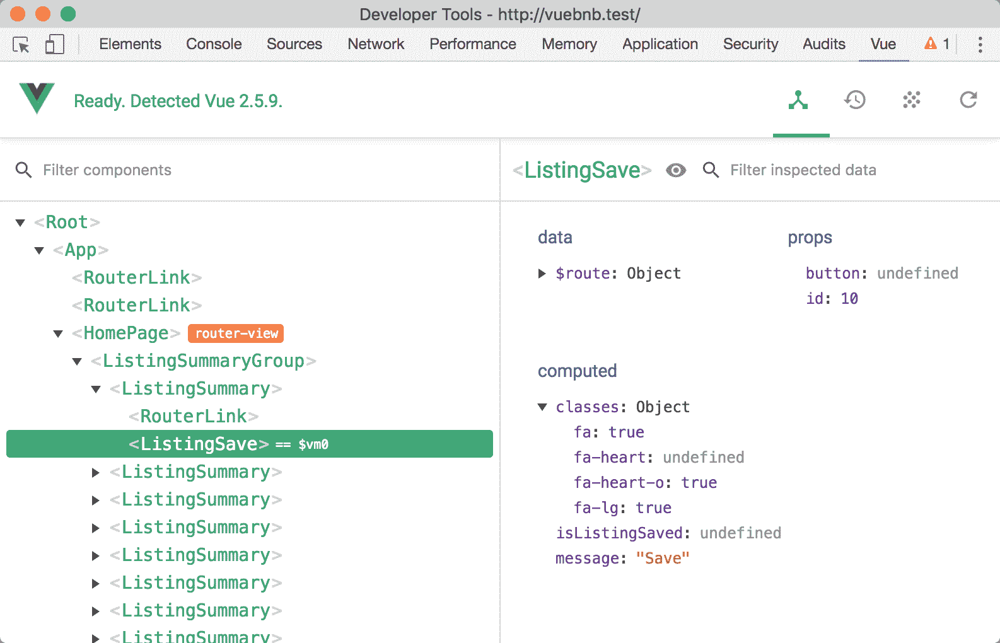
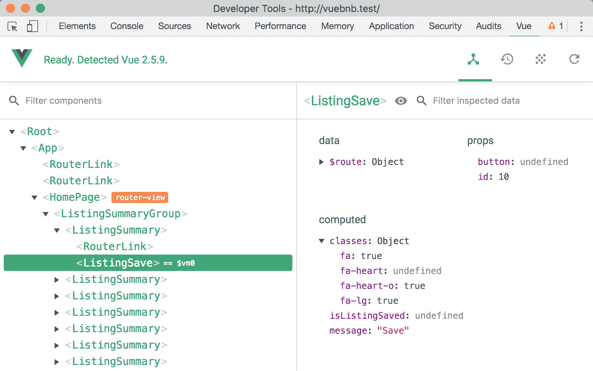
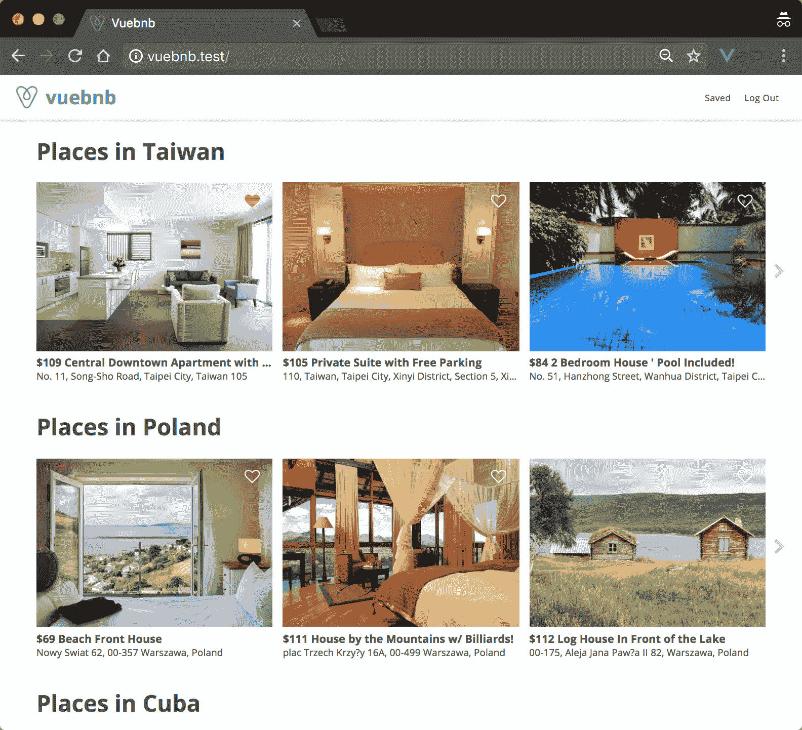
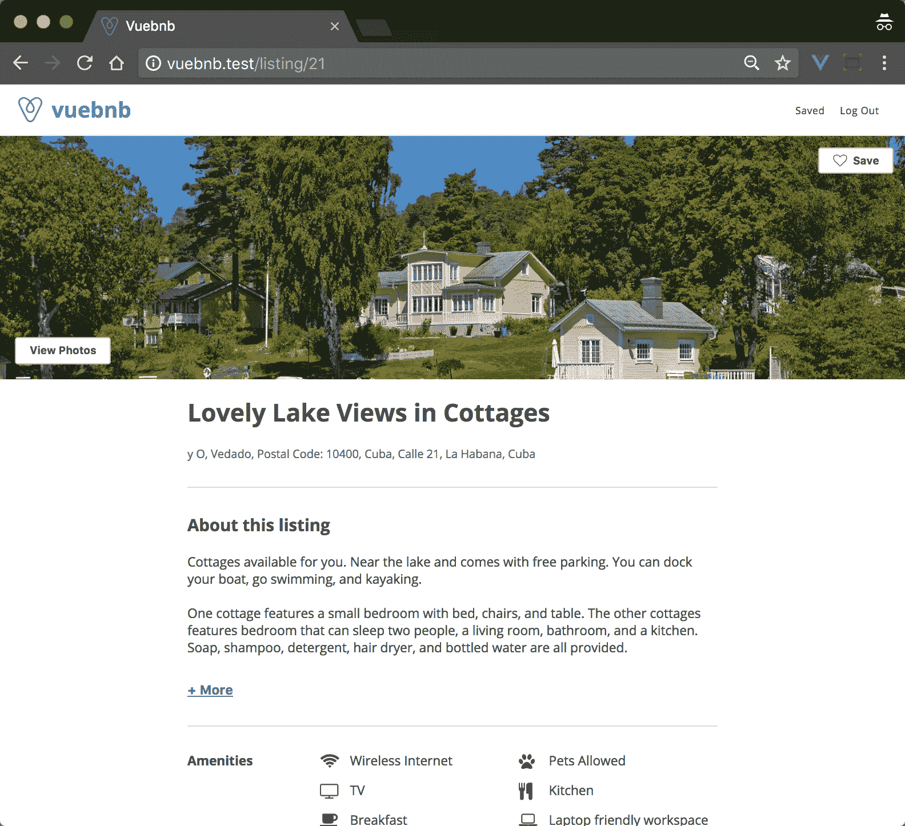
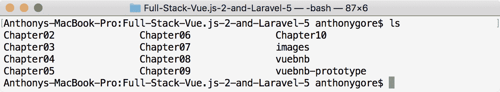

# hello view-vista . js 的简介

欢迎来到*全栈 Vue.js 2 和 Laravel 5* ！在第一章中，我们将对 Vue.js 进行一个高级概述，让您熟悉它能做什么，为学习如何做做准备。

我们还将了解本书中的主要案例研究项目*Vebnb*。

本章涵盖的主题:

*   Vue 的基本功能，包括模板、指令和组件
*   Vue 的高级功能，包括单文件组件和服务器端呈现
*   Vue 生态系统中的工具，包括 Vue 开发工具、Vue 路由器和 Vuex
*   当你阅读这本书的时候，你将要构建的主要案例研究项目
*   安装项目代码的说明

# 介绍 Vue.js

在 2017 年末撰写本文时，Vue.js 处于 2.5 版本。从第一次发布不到四年，Vue 已经成为 GitHub 上最受欢迎的开源项目之一。这种流行部分是由于它强大的功能，但也是由于它强调开发人员的经验和易于采用。

和 React 一样，Vue.js 的核心库只用于从 MVC 架构模式中操作视图层。不过，Vue 有两个官方支持库，分别是 Vue Router 和 Vuex，分别负责路由和数据管理。

Vue 没有像 React 和 Angular 那样得到科技巨头的支持，而是依赖于少数企业赞助人和 Vue 专用用户的捐赠。更令人印象深刻的是，尤雨溪是目前唯一的全职 Vue 开发人员，尽管还有来自世界各地的 20 多名开发人员组成的核心团队协助开发、维护和文档编制。

Vue 的主要设计原则如下:

*   **聚焦** : Vue 选择了一个小的、聚焦的 API，它唯一的目的就是创建 ui
*   **简单性** : Vue 的语法简洁易懂
*   **紧凑性**:核心库脚本缩小了~25 KB，比 React 甚至 jQuery 都要小
*   **速度**:渲染基准测试击败了许多主要框架，包括 React
*   **多功能性** : Vue 非常适合通常可能使用 jQuery 的小型工作，但是可以作为合法的 SPA 解决方案进行扩展

# 基本特征

现在让我们对 Vue 的基本特性做一个高级概述。如果需要，您可以在您的计算机上创建一个如下所示的 HTML 文件，在浏览器中打开它，并按照以下示例进行编码。

如果你想等到下一章，当我们开始进行案例研究项目时，那也没关系，因为我们的目标只是了解 Vue 能做什么:

```php
<!DOCTYPE html>
<html lang="en">
<head>
  <meta charset="utf-8">
  <meta http-equiv="X-UA-Compatible" content="IE=edge">
  <title>Hello Vue</title>
</head>
<body>
  <!--We'll be adding stuff here!-->
</body>
</html>
```

# 装置

虽然 Vue 可以在更复杂的设置中用作 JavaScript 模块，但它也可以简单地作为外部脚本包含在您的 HTML 文档主体中:

```php
<script src="https://unpkg.com/vue/dist/vue.js"></script>
```

# 模板

默认情况下，Vue 将使用一个 HTML 文件作为模板。包含的脚本将声明 Vue 的一个实例，并使用配置对象中的`el`属性来告诉 Vue 应用程序将在模板中的什么位置挂载:

```php
<div id="app">
  <!--Vue has dominion within this node-->
</div>
<script>
  new Vue({
    el: '#app'
  });
</script>
```

我们可以将数据绑定到模板，方法是将其创建为`data`属性，并使用小胡子语法将其打印在页面中:

```php
<div id="app">
  {{ message }}
  <!--Renders as "Hello World"-->
</div>
<script>
  new Vue({
    el: '#app',
    data: {
      message: 'Hello World'
    }
  });
</script>
```

# 指令

类似于 Angular，我们可以通过使用**指令**为我们的模板添加功能。这些是我们添加到以`v-`前缀开始的 HTML 标签中的特殊属性。

假设我们有一组数据。我们可以使用`v-for`指令将这些数据作为连续的 HTML 元素呈现到页面上:

```php
<div id="app">
  <h3>Grocery list</h3>
  <ul>
    <li v-for="grocery in groceries">{{ grocery }}</li>
  </ul>
</div>
<script>
  var app = new Vue({
    el: '#app',
    data: {
      groceries: [ 'Bread', 'Milk' ]
    }
  });
</script>
```

上述代码呈现如下:

```php
<div id="app">
  <h3>Grocery list</h3>
  <ul>
    <li>Bread</li>
    <li>Milk</li>
  </ul>
</div>
```

# 反应

Vue 设计的一个关键特征是其反应系统。修改数据时，视图会自动更新以反映该更改。

例如，如果我们创建了一个函数，在页面已经呈现后，将另一个项目推送到我们的杂货项目数组中，页面将自动重新呈现以反映这一变化:

```php
setTimeout(function() {
  app.groceries.push('Apples');
}, 2000);
```

初始渲染两秒钟后，我们会看到:

```php
<div id="app">
  <h3>Grocery list</h3>
  <ul>
    <li>Bread</li>
    <li>Milk</li>
    <li>Apples</li>
  </ul>
</div>
```

# 成分

组件扩展了基本的 HTML 元素，并允许您创建自己的可重用自定义元素。

例如，这里我创建了一个自定义元素`grocery-item`，它呈现为`li`。该节点的文本子节点来源于自定义 HTML 属性`title`，可从组件代码中访问:

```php
<div id="app">
  <h3>Grocery list</h3>
  <ul>
    <grocery-item title="Bread"></grocery-item>
    <grocery-item title="Milk"></grocery-item>
  </ul>
</div>
<script>
  Vue.component( 'grocery-item', { 
    props: [ 'title' ],
    template: '<li>{{ title }}</li>'
  });

  new Vue({
    el: '#app'
  });
</script>
```

这呈现如下:

```php
<div id="app">
  <h3>Grocery list</h3>
  <ul>
    <li>Bread</li>
    <li>Milk</li>
  </ul>
</div>
```

但是使用组件的主要原因可能是它使得构建一个更大的应用程序更容易。功能可以分解成可重用的、独立的组件。

# 高级功能

如果您到目前为止一直在编写示例，请在下一章之前关闭您的浏览器，因为以下高级代码片段不能简单地包含在浏览器脚本中。

# 单文件组件

使用组件的一个缺点是，您需要在主 HTML 文件之外的 JavaScript 字符串中编写模板。有很多方法可以在你的 HTML 文件中编写模板定义，但是你在标记和逻辑之间有一个尴尬的分离。

对此一个方便的解决方案是**单文件组件**:

```php
<template>
  <li v-on:click="bought = !bought" v-bind:class="{ bought: bought }">
    <div>{{ title }}</div>
  </li>
</template>
<script>
  export default {
    props: [ 'title' ],
    data: function() {
      return {
        bought: false
      };
    }
  }
</script>
<style>
  .bought {
    opacity: 0.5;
  }
</style>
```

这些文件具有`.vue`扩展名，并将组件模板、JavaScript 配置和样式都封装在一个文件中。

当然，网络浏览器无法读取这些文件，因此它们需要首先由构建工具(如 Webpack)进行处理。

# 模块构建

正如我们前面看到的，Vue 可以作为外部脚本放入项目中，直接在浏览器中使用。Vue 也可以作为 NPM 模块在更复杂的项目中使用，包括像网络包这样的构建工具。

如果你不熟悉 Webpack，它是一个模块捆绑器，可以把你所有的项目资产打包成你可以提供给浏览器的东西。在捆绑过程中，您也可以转换这些资产。

将 Vue 用作模块并引入 Webpack 会带来以下可能性:

*   单文件组件
*   浏览器目前不支持 ES 功能提案
*   模块化代码
*   预处理器，如 SASS 和 Pug

We will be exploring Webpack more extensively in [Chapter 5](05.html), *Integrating Laravel and Vue.js with Webpack*.

# 服务器端渲染

服务器端渲染是提高全栈应用程序加载速度的好方法。当用户加载你的网站时，他们会得到一个包含可见内容的完整页面，而不是一个直到 JavaScript 运行后才被填充的空页面。

假设我们有一个用组件构建的应用程序。如果我们在页面加载后使用浏览器开发工具查看我们的页面 DOM *，我们将看到我们完全渲染的应用:*

```php
<div id="app">
  <ul>
    <li>Component 1</li>
    <li>Component 2</li>
    <li>
      <div>Component 3</div>
    </li>
  </ul>
</div>
```

但是如果我们查看文档的来源，即`index.html`，就像它被服务器发送时一样，您会看到它只有我们的 mount 元素:

```php
<div id="app"></div>
```

为什么呢？因为 JavaScript 负责构建我们的页面，而且事实上，JavaScript 必须在页面构建之前运行。但是通过服务器端渲染，我们的`index`文件包含了浏览器在 JavaScript 下载和运行之前构建 DOM 所需的 HTML。这款应用的加载速度不会更快，但内容会更快显示。

# Vue 生态系统

虽然 Vue 是一个独立的库，但当它与生态系统中的一些可选工具结合时，它甚至更强大。对于大多数项目，您将在前端堆栈中包含 Vue Router 和 Vuex，并使用 Vue Devtools 进行调试。

# Devtools 视图

Vue Devtools 是一个浏览器扩展，可以帮助你开发一个 Vue.js 项目。除此之外，它还允许您查看应用程序中组件的层次结构和组件的状态，这对调试非常有用:



Figure 1.1\. Vue Devtools component hierarchy

我们将在本节后面看到它还能做什么。

# 路由器视图

Vue Router 允许您将 SPA 的不同状态映射到不同的 URL，从而为您提供虚拟页面。例如，`mydomain.com/`可能是一个博客的首页，并且有一个像这样的组件层次结构:

```php
<div id="app">
  <my-header></my-header>
  <blog-summaries></blog-summaries>
  <my-footer></my-footer>
</div>
```

而`mydomain.com/post/1`可能是博客中的一个单独的帖子，看起来像这样:

```php
<div id="app">
  <my-header></my-header>
  <blog-post post-id="id">
  <my-footer></my-footer>
</div>
```

从一个页面切换到另一个页面并不需要页面的*重载*，只需要交换中间的组件来反映 URL 的状态，这正是 Vue Router 所做的。

# 武契特

随着用户界面复杂性的增加，Vuex 通过将应用程序的数据集中到一个存储中，提供了一种管理应用程序数据的强大方法。

我们可以通过检查 Vue Devtools 中的存储来获取应用程序状态的快照:



Figure 1.2\. Vue Devtools Vuex tab

左列跟踪对应用程序数据所做的更改。例如，假设用户保存或取消保存一个项目。你可以把这个事件命名为`toggleSaved`。Vue Devtools 让你看到这个事件发生时的细节。

我们还可以恢复到数据的任何先前状态，而不必接触代码或重新加载页面。这个名为*时间旅行调试*的函数对于调试复杂的用户界面非常有用。

# 案例研究项目

在对 Vue 的关键特性进行了一次旋风般的概述之后，我相信你现在很想开始正确地学习 Vue 并将其投入使用。让我们先来看看你将在整本书中构建的案例研究项目。

# Vuebnb

Vuebnb 是一个现实的全栈 web 应用程序，它利用了 Vue、Laravel 的许多主要特性，以及本书中介绍的其他工具和设计模式。

从用户的角度来看，Vuebnb 是一个在线市场，用于在世界各地的城市租赁短期住宿。你可能会注意到 Vuebnb 和另一个同名的在线住宿市场有些相似之处！

你可以在这里查看 Vuebnb 的完整版本:[http://vuebnb.vuejsdevelopers.com](http://vuebnb.vuejsdevelopers.com)。

如果你现在没有互联网接入，这里有两个主页面的截图。首先是主页，用户可以在其中搜索或浏览住宿选项:



Figure 1.3\. Vuebnb home page

第二，列表页面，用户可以在其中查看他们可能有兴趣租赁的单一住宿的特定信息:



Figure 1.4\. Vuebnb listing page

# 码基数

案例研究项目贯穿了这本书的整个过程，所以一旦你创建了代码库，你就可以一章一章地添加进去。最终，您将从头开始构建和部署一个全栈应用程序。

代码库在 GitHub 存储库中。将它下载到电脑上通常放置项目的文件夹中，例如`~/Projects`:

```php
$ cd ~/Projects
$ git clone https://github.com/PacktPublishing/Full-Stack-Vue.js-2-and-Laravel-5
$ cd Full-Stack-Vue.js-2-and-Laravel-5
```

Rather than cloning this repository directly, you could first make a *fork* and clone that. This will allow you to make any changes you like and save your work to your own remote repository. Here's a guide to forking a repository on GitHub: [https://help.github.com/articles/fork-a-repo/](https://help.github.com/articles/fork-a-repo/).

# 文件夹

代码库包含以下文件夹:



Figure 1.5\. Code base directory contents

以下是每个文件夹的用途概述:

*   `Chapter02`至`Chapter10`包含各章节代码的*完成状态*(不包括本章节)
*   *图像*目录包含在 Vuebnb 中使用的示例图像。这将在[第 4 章](04.html)、*用 Laravel* 构建网络服务中解释
*   *vuebnb* 是您将用于主要案例研究项目的项目代码，我们将在[第 3 章](03.html)、*中开始着手建立 Laravel 开发环境*
*   *vuebnb-prototype* 是我们将在[第二章](02.html)*中构建的 vuebnb 原型的项目代码，你的第一个 Vue.js 项目*

# 摘要

在第一章中，我们对 Vue.js 做了一个高层次的介绍，涵盖了模板、指令和组件等基本特性，以及单文件组件和服务器端呈现等高级特性。我们还查看了 Vue 生态系统中的工具，包括 Vue Router 和 Vuex。

然后，我们对 Vuebnb 做了一个概述，这是您在阅读本书时将要构建的全栈项目，并看到了如何从 GitHub 安装代码库。

在下一章中，我们将通过构建 Vuebnb 的原型来正确了解 Vue 的基本特性并开始使用它们。