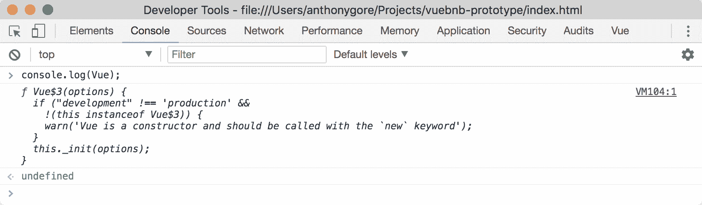
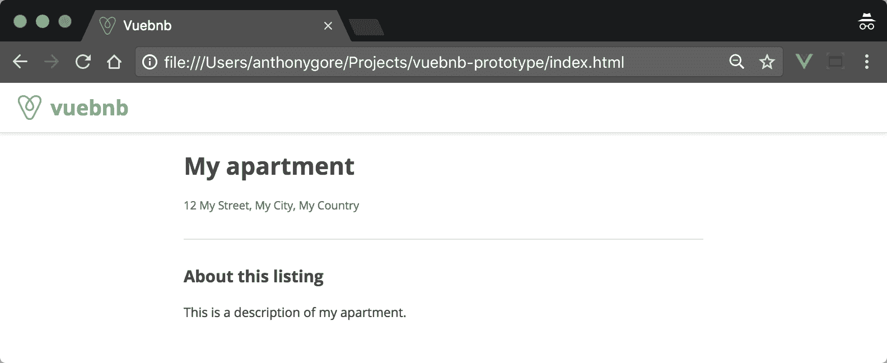
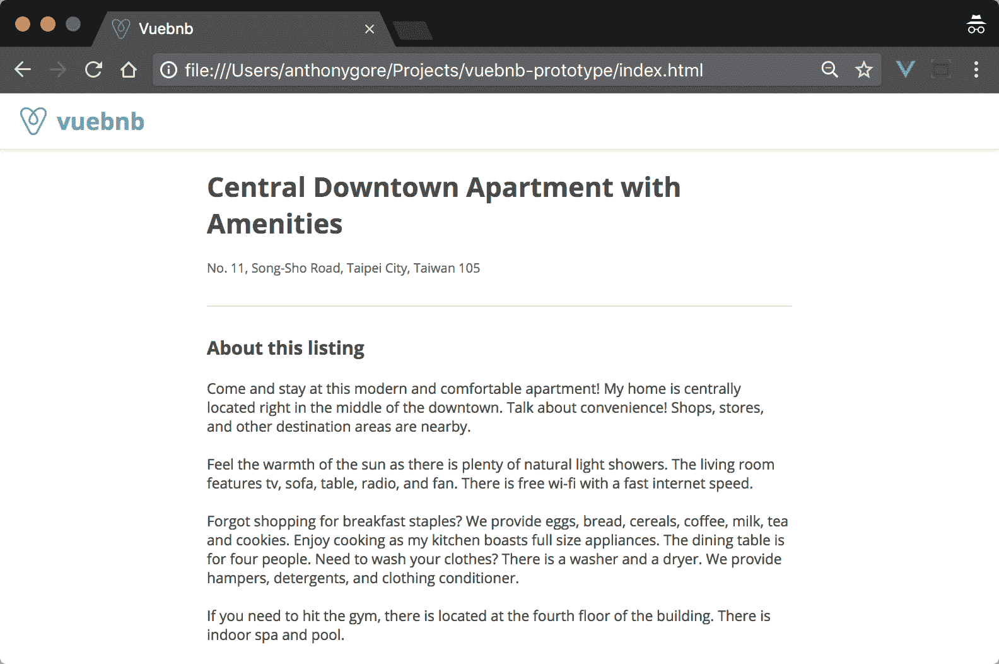
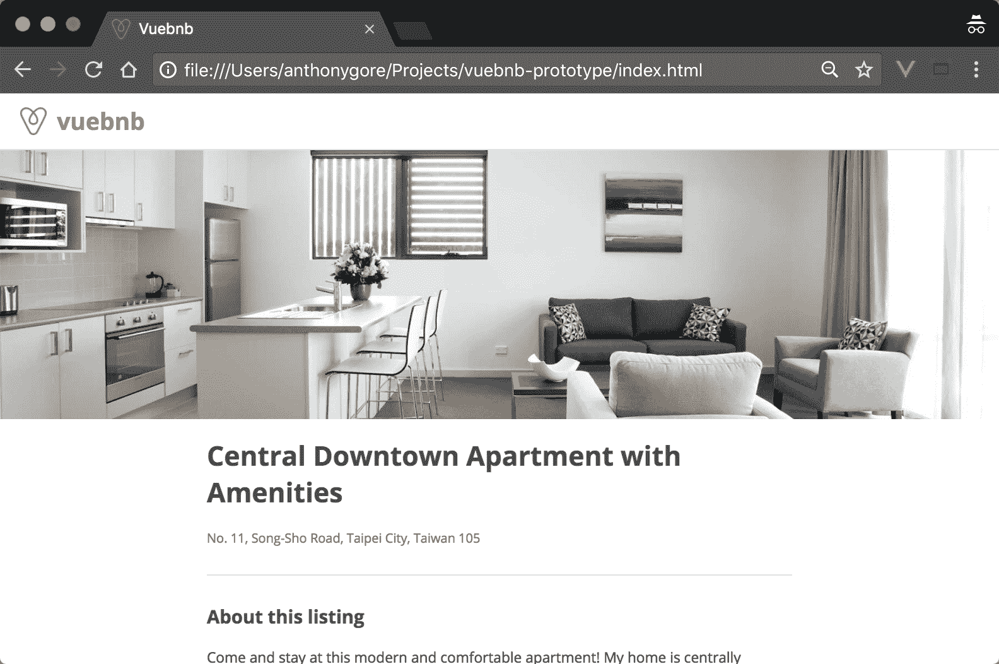
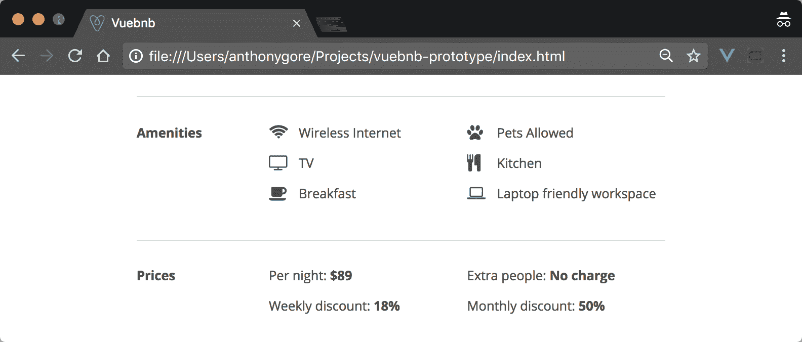
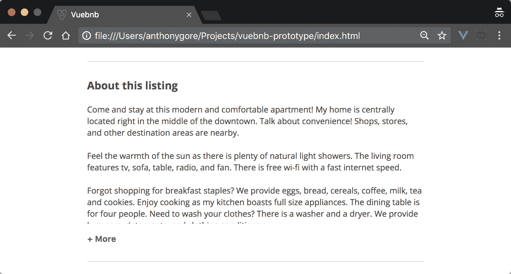

# 二、`vuebnb-prototype`，你的第一个 Vue.js 项目

在这一章中，我们将学习 Vue.js 的基本特性。然后我们将通过构建一个案例研究项目 Vuebnb 的原型来将这些知识付诸实践。

本章涵盖的主题:

*   Vue.js 的安装和基本配置
*   Vue.js 基本概念，如数据绑定、指令、观察器和生命周期挂钩
*   Vue 的反应系统是如何工作的
*   案例研究项目的项目要求
*   使用 Vue.js 添加页面内容，包括动态文本、列表和标题图像
*   用 Vue 构建图像模态用户界面特征

# Vuebnb 原型

在本章中，我们将构建一个 Vuebnb 的原型，这个案例研究项目将贯穿本书的始终。原型将只是列表页面的一部分，到本章结束时将如下所示:


Figure 2.1\. Vuebnb prototype

一旦我们在[第 3 章](03.html)、*建立了一个 Laravel 开发环境*、[第 4 章](04.html)、*用 Laravel* 构建了一个 Web 服务，我们将把这个原型移植到主项目中。

# 项目代码

在我们开始之前，您需要通过从 GitHub 克隆代码库来将其下载到您的计算机上。说明见[第一章](01.html)*你好 Vue-Vue . js 简介*中*代码库*一节。

文件夹`vuebnb-prototype`有我们现在将要构建的原型的项目代码。切换到该文件夹并列出内容:

```php
$ cd vuebnb-prototype
$ ls -la
```

文件夹内容应该如下所示:

 Figure 2.2\. vuebnb-prototype project files Unless otherwise specified, all further Terminal commands in this chapter will assume you're in the `vuebnb-prototype` folder.

# NPM 安装

现在您需要安装这个项目中使用的第三方脚本，包括 Vue.js 本身。NPM `install`方法将读取包含的`package.json`文件并下载所需模块:

```php
$ npm install
```

您现在将看到一个新的`node_modules`目录出现在您的项目文件夹中。

# 主文件

在 IDE 中打开`vuebnb-prototype`目录。请注意，包含以下`index.html`文件。它主要由样板代码组成，但也有一些包含在`body`标签中的结构标记。

还要注意，这个文件链接到`style.css`，我们的 CSS 规则将被添加到这里，以及`app.js`，我们的 JavaScript 将被添加到这里。

`index.html`:

```php
<!DOCTYPE html>
<html>
<head>
  <meta charset="UTF-8">
  <meta http-equiv="X-UA-Compatible" content="IE=edge,chrome=1">
  <meta name="viewport" content="width=device-width,initial-scale=1">
  <title>Vuebnb</title>
  <link href="node_modules/open-sans-all/css/open-sans.css" rel="stylesheet">
  <link rel="stylesheet" href="style.css" type="text/css">
</head>
<body>
<div id="toolbar">
  
  <h1>vuebnb</h1>
</div>
<div id="app">
  <div class="container"></div>
</div>
<script src="app.js"></script>
</body>
</html>
```

目前`app.js`是一个空文件，但是我已经在`style.css`中加入了一些 CSS 规则，让我们开始。

`style.css`:

```php
body {
  font-family: 'Open Sans', sans-serif;
  color: #484848;
  font-size: 17px;
  margin: 0;
}

.container {
  margin: 0 auto;
  padding: 0 12px;
}

@media (min-width: 744px) {
  .container {
      width: 696px;
  }
}

#toolbar {
  display: flex;
  align-items: center;
  border-bottom: 1px solid #e4e4e4;
  box-shadow: 0 1px 5px rgba(0, 0, 0, 0.1);
}

#toolbar .icon {
  height: 34px;
  padding: 16px 12px 16px 24px;
  display: inline-block;
}

#toolbar h1 {
  color: #4fc08d;
  display: inline-block;
  font-size: 28px;
  margin: 0;
}
```

# 在浏览器中打开

要查看项目，请在网络浏览器中找到`index.html`文件。在 Chrome 中，就像文件 *|打开文件*一样简单。当它加载时，除了顶部的工具栏之外，您将看到一个几乎为空的页面。

# 正在安装 vue . js

现在是时候给我们的项目添加`Vue.js`库了。Vue 是作为我们 NPM 安装的一部分下载的，所以现在我们可以简单地链接到带有`script`标签的`Vue.js`浏览器。

`index.html`:

```php
<body>
<div id="toolbar">...</div>
<div id="app">...</div>
<script src="node_modules/vue/dist/vue.js"></script>
<script src="app.js"></script>
</body>
```

It's important that we include the Vue library *before* our own custom `app.js` script, as scripts run sequentially.

Vue 现在将注册为全局对象。我们可以通过转到浏览器并在 JavaScript 控制台中键入以下内容来测试这一点:

```php
console.log(Vue);
```

结果如下:



Figure 2.3\. Checking Vue is registered as a global object

# 页面内容

设置好环境并安装了启动代码后，我们现在就可以开始构建 Vuebnb 原型了。

让我们向页面添加一些内容，包括标题图像、标题和关于部分。我们将向我们的 HTML 文件添加结构，并使用`Vue.js`在我们需要的地方插入正确的内容。

# Vue 实例

看看我们的`app.js`文件，现在让我们通过使用带有`Vue`对象的`new`操作符来创建我们的 Vue.js 的根实例。

`app.js`:

```php
var app = new Vue();
```

创建`Vue`实例时，通常需要传入一个配置对象作为参数。该对象是定义项目自定义数据和函数的地方。

`app.js`:

```php
var app = new Vue({
  el: '#app'
});
```

随着项目的进展，我们将向这个配置对象添加更多内容，但目前我们刚刚添加了`el`属性，该属性告诉 Vue 在页面中的哪个位置挂载自己。

您可以为它分配一个字符串(CSS 选择器)或一个 HTML 节点对象。在我们的例子中，我们使用了`#app`字符串，这是一个 CSS 选择器，引用了具有`app` ID 的元素。

`index.html`:

```php
<div id="app">
  <!--Mount element-->
</div>
```

Vue 对它挂载的元素和任何子节点都有统治权。到目前为止，对于我们的项目，Vue 可以用`header`类操纵`div`，但是不能用`toolbar` ID 操纵`div`。放在后一个`div`中的任何东西对武伊来说都是不可见的。

`index.html`:

```php
<body>
<div id="toolbar">...</div>
<div id="app">
  <!--Vue only has dominion here-->
  <div class="header">...</header>
  ...
</div>
<script src="node_modules/vue/dist/vue.js"></script>
<script src="app.js"></script>
</body>
```

From now on, we'll refer to our mount node and its children as our template.

# 数据绑定

Vue 的一个简单任务是将一些 JavaScript 数据绑定到模板。让我们在配置对象中创建一个`data`属性，并为其分配一个包含带有`'My apartment'`字符串值的`title`属性的对象。

`app.js`:

```php
var app = new Vue({
  el: '#app',
  data: {
    title: 'My apartment'
  }
});
```

这个`data`对象的任何属性在我们的模板中都是可用的。为了告诉 Vue 将这些数据绑定到哪里，我们可以使用*小胡子*语法，也就是双花括号，例如`{{ myProperty }}`。当 Vue 实例化时，它编译模板，用适当的文本替换小胡子语法，并更新 DOM 以反映这一点。这个过程被称为*文本插值*，并在下面的代码块中演示。

`index.html`:

```php
<div id="app">
  <div class="container">
    <div class="heading">
      <h1>{{ title }}</h1>
    </div>
  </div>
</div>
```

将呈现为:

```php
<div id="app">
  <div class="container">
    <div class="heading">
      <h1>My apartment</h1>
    </div>
  </div>
</div>
```

让我们现在再添加一些数据属性，并增强我们的模板以包含更多的页面结构。

`app.js`:

```php
var app = new Vue({
  el: '#app',
  data: {
    title: 'My apartment',
    address: '12 My Street, My City, My Country',
    about: 'This is a description of my apartment.'
  }
});
```

`index.html`:

```php
<div class="container">
  <div class="heading">
    <h1>{{ title }}</h1>
    <p>{{ address }}</p>
  </div>
  <hr>
  <div class="about">
    <h3>About this listing</h3>
    <p>{{ about }}</p>
  </div>
</div>
```

让我们也添加一些新的 CSS 规则。

`style.css`:

```php
.heading {
  margin-bottom: 2em;
}

.heading h1 {
  font-size: 32px;
  font-weight: 700;
}

.heading p {
  font-size: 15px;
  color: #767676;
}

hr {
  border: 0;
  border-top: 1px solid #dce0e0;
}

.about {
  margin-top: 2em;
}

.about h3 {
  font-size: 22px;
}

.about p {
  white-space: pre-wrap;
}
```

如果现在保存并刷新页面，它应该如下所示:



Figure 2.4\. Listing page with basic data binding

# 模拟列表

当我们在开发的时候，处理一些模拟数据会很好，这样我们就可以看到我们完成的页面会是什么样子。正是出于这个原因，我将`sample/data.js`纳入了这个项目。让我们将它加载到我们的文档中，确保它位于我们的`app.js`文件之上。

`index.html`:

```php
<body>
<div id="toolbar">...</div>
<div id="app">...</div>
<script src="node_modules/vue/dist/vue.js"></script>
<script src="sample/data.js"></script>
<script src="app.js"></script>
</body>
```

看看这个文件，你会发现它声明了一个`sample`对象。我们现在将在数据配置中使用它。

`app.js`:

```php
data: {
  title: sample.title,
  address: sample.address,
  about: sample.about
}
```

保存并刷新后，您将在页面上看到更真实的数据:



Figure 2.5\. Page including mock-listing sample Using global variables split over different script files in this way is not an ideal practice. We'll only be doing this in the prototype, though, and later we'll get this mock-listing sample from the server.

# 标题图像

没有一个大的，有光泽的图片来展示，没有一个房间清单是完整的。我们的模拟列表中有一个标题图像，现在我们将包含它。将此标记添加到页面。

`index.html`:

```php
<div id="app">
  <div class="header">
    <div class="header-img"></div>
  </div>
  <div class="container">...</div>
</div>
```

并将此添加到 CSS 文件中。

`style.css`:

```php
.header {
  height: 320px;
}

.header .header-img {
  background-repeat: no-repeat;
  background-size: cover;
  background-position: 50% 50%;
  background-color: #f5f5f5;
  height: 100%;
}
```

你可能想知道为什么我们使用`div`而不是`img`标签。为了帮助定位，我们将把我们的图像设置为`header-img`类的`div`的背景。

# 样式绑定

要设置背景图像，我们必须在 CSS 规则中提供 URL 作为属性，如下所示:

```php
.header .header-img {
  background-image: url(...);
}
```

显然，我们的标题图像应该特定于每个单独的列表，所以我们不想硬编码这个 CSS 规则。相反，我们可以让 Vue 将数据中的网址绑定到我们的模板。

Vue 不能访问我们的 CSS 样式表，但是它可以绑定到一个内联`style`属性:

```php
<div class="header-img" style="background-image: url(...);"></div>
```

您可能认为使用文本插值是这里的解决方案，例如:

```php
<div class="header-img" style="background-image: {{ headerUrl }}"></div>
```

但是这不是有效的 Vue.js 语法。相反，这是另一个名为`directive`的 Vue.js 特性的工作。让我们先探索指令，然后再回来解决这个问题。

# 指令

Vue 的指令是带有 *v-* 前缀的特殊 HTML 属性，例如`v-if`，它提供了一种简单的方法来为我们的模板添加功能。您可以添加到元素中的指令示例有:

*   `v-if`:有条件地渲染元素
*   `v-for`:基于数组或对象多次渲染元素
*   `v-bind`:将元素的属性动态绑定到 JavaScript 表达式
*   `v-on`:将事件监听器附加到元素

在整本书中，我们将探索更多。

# 使用

就像普通的 HTML 属性一样，指令通常是`name="value"`形式的名称/值对。要使用指令，只需将其添加到 HTML 标记中，就像添加属性一样，例如:

```php
<p v-directive="value">
```

# 公式

如果指令需要一个值，它将是一个*表达式*。

在 JavaScript 语言中，表达式是产生单个值的小型可计算语句。表达式可以用在任何需要值的地方，例如在`if`语句的括号中:

```php
if (expression) {
  ...
}
```

这里的表达式可以是以下任何一种:

*   数学表达式，例如`x + 7`
*   一个对比，例如`v <= 7`
*   一个 Vue `data`属性，例如`this.myval`

指令和文本插值都接受表达式值:

```php
<div v-dir="someExpression">{{ firstName + " " + lastName }}</div>
```

# 示例:v-if

如果一个元素的值是一个*真值*表达式，则`v-if`将有条件地渲染该元素。在以下情况下，`v-if`将根据`myval`值移除/插入`p`元素:

```php
<div id="app">
  <p v-if="myval">Hello Vue</p>
</div>
<script>
  var app = new Vue({
    el: '#app',
    data: {
      myval: true
    }
  });
</script>
```

将呈现为:

```php
<div id="app">
  <p>Hello Vue</p>
</div>
```

如果我们用`v-else`指令(一个不需要任何值的特殊指令)添加一个连续的元素，它将随着`myval`的变化而被对称地移除/插入:

```php
<p v-if="myval">Hello Vue</p>
<p v-else>Goodbye Vue</p>
```

# 争论

有些指令采用*参数*，在指令名称后用冒号表示。例如，监听 DOM 事件的`v-on`指令需要一个参数来指定应该监听哪个事件:

```php
<a v-on:click="doSomething">
```

代替`click`，参数可以是`mouseenter`、`keypress`、`scroll`或任何其他事件(包括自定义事件)。

# 样式绑定(续)

回到标题图像，我们可以使用带有`style`参数的`v-bind`指令将一个值绑定到`style`属性。

`index.html`:

```php
<div class="header-img" v-bind:style="headerImageStyle"></div>
```

`headerImageStyle`是一个表达式，其计算结果是一个 CSS 规则，该规则将背景图像设置为正确的 URL。听起来很混乱，但是当你看到它工作的时候，就会很清楚了。

现在让我们创建`headerImageStyle`作为数据属性。当绑定到样式属性时，可以使用属性和值与 CSS 属性和值等效的对象。

`app.js`:

```php
data: {
  ...
  headerImageStyle: {
    'background-image': 'url(sample/header.jpg)'
  }
},
```

保存代码，刷新页面，将显示标题图像:



Figure 2.6\. Page including header image

使用您的浏览器开发工具检查页面，并注意`v-bind`指令如何评估:

```php
<div class="header-img" style="background-image: url('sample/header.jpg');"></div>
```

# 列表部分

我们将添加到页面的下一部分内容是便利设施和价格列表:



Figure 2.7\. Lists section

如果您查看模拟列表示例，您会看到对象上的`amenities`和`prices`属性都是数组。

`sample/data.js`:

```php
var sample = {
  title: '...',
  address: '...',
  about: '...',
  amenities: [
    {
      title: 'Wireless Internet',
      icon: 'fa-wifi'
    },
    {
      title: 'Pets Allowed',
      icon: 'fa-paw'
    },
    ...
  ],
  prices: [
    {
      title: 'Per night',
      value: '$89'
    },
    {
      title: 'Extra people',
      value: 'No charge'
    },
    ...
  ]
}
```

如果我们能在这些数组上循环，并将每个项目打印到页面上，这不是很容易吗？我们可以！这就是`v-for`指令的作用。

首先，让我们将这些作为数据属性添加到根实例中。

`app.js`:

```php
data: {
  ...
  amenities: sample.amenities,
  prices: sample.prices
}
```

# 列表呈现

`v-for`指令需要一种特殊类型的表达式形式`item in items`，其中`items`是源数组，`item`是被循环的当前数组元素的别名。

我们先来研究一下`amenities`阵。该数组的每个成员都是一个具有`title`和`icon`属性的对象，即:

```php
{ title: 'something', icon: 'something' }
```

我们将把`v-for`指令添加到模板中，分配给它的表达式将是`amenity in amenities`。表达式的别名部分，即`amenity`，将在整个循环序列中引用数组中的每个对象，从第一个对象开始。

`index.html`:

```php
<div class="container">
  <div class="heading">...</div>
  <hr>
  <div class="about">...</div>
  <div class="lists">
    <div v-for="amenity in amenities">{{ amenity.title }}</div>
  </div>
</div>
```

它将呈现为:

```php
<div class="container">
  <div class="heading">...</div>
  <hr>
  <div class="about">...</div>
  <div class="lists">
    <div>Wireless Internet</div>
    <div>Pets Allowed</div>
    <div>TV</div>
    <div>Kitchen</div>
    <div>Breakfast</div>
    <div>Laptop friendly workspace</div>
  </div>
</div>
```

# 核标准情报中心

我们的舒适对象的第二个属性是`icon`。这实际上是一个与字体牛逼图标字体中的图标相关的类。我们已经安装了字体牛逼作为一个 NPM 模块，所以添加这个到页面的头部现在使用它。

`index.html`:

```php
<head>
  ...
  <link rel="stylesheet" href="node_modules/open-sans-all/css/open-sans.css">
  <link rel="stylesheet" href="node_modules/font-awesome/css/font-awesome.css">
  <link rel="stylesheet" href="style.css" type="text/css">
</head>
```

现在，我们可以在模板中完成我们的设施部分的结构。

`index.html`:

```php
<div class="lists">
  <hr>
  <div class="amenities list">
    <div class="title"><strong>Amenities</strong></div>
    <div class="content">
      <div class="list-item" v-for="amenity in amenities">
        <i class="fa fa-lg" v-bind:class="amenity.icon"></i>
        <span>{{ amenity.title }}</span>
      </div>
    </div>
  </div>
</div>
```

`style.css`:

```php
.list {
  display: flex;
  flex-wrap: nowrap;
  margin: 2em 0;
}

.list .title {
  flex: 1 1 25%;
}

.list .content {
  flex: 1 1 75%;
  display: flex;
  flex-wrap: wrap;
}

.list .list-item {
  flex: 0 0 50%;
  margin-bottom: 16px;
}

.list .list-item > i {
  width: 35px;
}

@media (max-width: 743px) {
  .list .title {
    flex: 1 1 33%;
  }

  .list .content {
    flex: 1 1 67%;
  }

  .list .list-item {
    flex: 0 0 100%;
  }
}
```

# 钥匙

如您所料，`v-for="amenity in amenities"`生成的 DOM 节点反应性地绑定到`amenities`数组。如果`amenities`的内容发生变化，Vue 会自动重新渲染节点以反映变化。

使用`v-for`时，建议为列表中的每个项目提供一个唯一的`key`属性。这使得 Vue 能够针对需要更改的确切 DOM 节点，从而使 DOM 更新更加高效。

通常，密钥是一个数字标识，例如:

```php
<div v-for="item in items" v-bind:key="item.id">
  {{ item.title }}
</div>
```

对于便利设施和价格列表，内容不会随着应用的寿命而改变，因此我们没有必要提供密钥。一些短绒可能会就此向您发出警告，但在这种情况下，可以安全地忽略该警告。

# 价格

现在让我们也将价格列表添加到我们的模板中。

`index.html`:

```php
<div class="lists">
  <hr>
  <div class="amenities list">...</div>
  <hr>
  <div class="prices list">
    <div class="title">
      <strong>Prices</strong>
    </div>
    <div class="content">
      <div class="list-item" v-for="price in prices">
        {{ price.title }}: <strong>{{ price.value }}</strong>
      </div>
    </div>
  </div>
</div>
```

我相信你会同意循环模板比写出每一项都容易得多。但是，您可能会注意到这两个列表之间仍然有一些共同的标记。在本书的后面，我们将利用组件使模板的这一部分更加模块化。

# 显示更多功能

我们现在遇到了一个问题，列表部分在关于部分之后。“关于”部分的长度是任意的，在我们将要添加的一些模拟清单中，您会发现这个部分相当长。

我们不想让它主宰页面，迫使用户做很多不受欢迎的滚动来查看列表部分，所以我们需要一种方法来隐藏一些太长的文本，同时允许用户查看全文，如果他们愿意的话。

让我们添加一个 show more UI 特性，它将在一定长度后裁剪“关于”文本，并给用户一个按钮来显示隐藏的文本:



Figure 2.8. Show more feature

我们将从向包含`about`文本插值的`p`标签添加一个`contracted`类开始。这个类的 CSS 规则将限制其高度为 250 像素，并隐藏溢出元素的任何文本。

`index.html`:

```php
<div class="about">
  <h3>About this listing</h3>
  <p class="contracted">{{ about }}</p>
</div>
```

`style.css`:

```php
.about p.contracted {
  height: 250px;
  overflow: hidden;
}
```

我们还会在`p`标签后放置一个按钮，用户可以点击该按钮将该部分扩展到全高。

`index.html`:

```php
<div class="about">
  <h3>About this listing</h3>
  <p class="contracted">{{ about }}</p>
  <button class="more">+ More</button>
</div>
```

这里是需要的 CSS，包括一个通用按钮规则，它将为我们将在整个项目中添加的所有按钮提供基本样式。

`style.css`:

```php
button {
  text-align: center;
  vertical-align: middle;
  user-select: none;
  white-space: nowrap;
  cursor: pointer;
  display: inline-block;
  margin-bottom: 0;
}

.about button.more {
  background: transparent;
  border: 0;
  color: #008489;
  padding: 0;
  font-size: 17px;
  font-weight: bold;
}

.about button.more:hover, 
.about button.more:focus, 
.about button.more:active {
  text-decoration: underline;
  outline: none;
}
```

为了做到这一点，我们需要一种方法，当用户点击更多按钮时，删除`contracted`类。看起来是个做指令的好工作！

# 类绑定

我们将如何处理这个问题是动态绑定`contracted`类。让我们创建一个`contracted`数据属性，并将其初始值设置为`true`。

`app.js`:

```php
data: {
  ...
  contracted: true
}
```

像我们的样式绑定一样，我们可以将这个类绑定到一个对象。在表达式中，`contracted`属性是要绑定的类的名称，`contracted`值是对同名数据属性的引用，是一个布尔值。因此，如果`contracted`数据属性的计算结果为`true`，则该类将绑定到元素，如果其计算结果为`false`，则不会绑定到元素。

`index.html`:

```php
<p v-bind:class="{ contracted: contracted }">{{ about }}</p>
```

因此，当页面加载时`contracted`类被绑定:

```php
<p class="contracted">...</p>
```

# 事件侦听器

我们现在想在用户点击更多按钮时自动删除`contracted`类。为了完成这项工作，我们将使用`v-on`指令，它使用`click`参数来监听 DOM 事件。

`v-on`指令的值可以是将`contracted`赋给`false`的表达式。

`index.html`:

```php
<div class="about">
  <h3>About this listing</h3>
  <p v-bind:class="{ contracted: contracted }">{{ about }}</p>
  <button class="more" v-on:click="contracted = false">+ More</button>
</div>
```

# 反应

当我们点击更多按钮时，`contracted`值发生变化，Vue 会立即更新页面以反映这一变化。

Vue 怎么知道要这么做？要回答这个问题，我们必须首先理解获取者和设定者的概念。

# 吸气剂和沉降剂

给 JavaScript 对象的属性赋值很简单:

```php
var myObj = {
  prop: 'Hello'
}
```

检索它也很简单:

```php
myObj.prop
```

这里没有诡计。不过，我想说的是，我们可以通过使用 getters 和 setters 来替换对象的这种正常分配/检索机制。这些是允许自定义逻辑来获取或设置属性值的特殊函数。

当一个属性的值由另一个属性决定时，Getters 和 setters 特别有用。这里有一个例子:

```php
var person = {
  firstName: 'Abraham',
  lastName: 'Lincoln',
  get fullName() {
    return this.firstName + ' ' + this.lastName;
  },
  set fullName(name) {
    var words = name.toString().split(' ');
    this.firstName = words[0] || '';
    this.lastName = words[1] || '';
  }
}
```

每当我们尝试对其值进行正常赋值/检索时，都会调用`fullName`属性的`get`和`set`函数:

```php
console.log(person.fullName); // Abraham Lincoln
person.fullName = 'George Washington';
console.log(person.firstName); // George
console.log(person.lastName) // Washington
```

# 反应性数据属性

Vue 的另一个初始化步骤是遍历所有的数据属性，并为它们分配 getters 和 setters。如果你看下面的截图，你可以看到我们当前应用中的每个属性是如何添加了`get`和`set`功能的:


Figure 2.9\. Getters and setters

Vue 添加了这些获取器和设置器，使其能够在属性被访问或修改时执行依赖跟踪和更改通知。因此，当`contracted`值被`click`事件改变时，其`set`方法被触发。`set`方法将设置新值，但也将执行一个辅助任务，即通知 Vue 某个值已经更改，依赖于它的页面的任何部分都可能需要重新呈现。

If you'd like to know more about Vue's reactivity system, check out the article *Reactivity In Vue.js (And Its Pitfalls)* at [https://vuejsdevelopers.com/2017/03/05/vue-js-reactivity/](https://vuejsdevelopers.com/2017/03/05/vue-js-reactivity/).

# 隐藏“更多”按钮

展开“关于”部分后，我们希望隐藏“更多”按钮，因为不再需要它。我们可以结合`contracted`属性使用`v-if`指令来实现这一点。

`index.html`:

```php
<button v-if="contracted" class="more" v-on:click="contracted = false">
  + More
</button>
```

# 图像模态窗口

为了防止我们的标题图像占据页面，我们对它进行了裁剪并限制了它的高度。但是，如果用户希望看到图像的全部光彩呢？允许用户专注于单个内容项的一个很好的 UI 设计模式是*模态窗口*。

以下是我们的模态打开后的样子:


Figure 2.10\. Header image modal

我们的模式将给出标题图像的适当比例视图，因此用户可以专注于住宿的外观，而不会分散页面其他部分的注意力。

在本书的后面，我们将在模态中插入一个图像转盘，以便用户可以浏览整个房间图像集合！

不过，就目前而言，以下是我们的模式所需的特性:

1.  通过单击标题图像打开模式
2.  冻结主窗口
3.  显示图像
4.  用关闭按钮或*退出*键关闭模式窗口

# 开始

首先，让我们添加一个布尔数据属性，它将表示我们的模态的打开或关闭状态。我们将其初始化为`false`。

`app.js`:

```php
data: {
  ...
  modalOpen: false
}
```

我们将使点击我们的标题图像将设置模式打开。我们还将在标题图像的左下角叠加一个标记为“查看照片”的按钮，以向用户发出更强的信号，让他们点击以显示图像。

`index.html`:

```php
<div 
  class="header-img" 
  v-bind:style="headerImageStyle" 
  v-on:click="modalOpen = true"
>
  <button class="view-photos">View Photos</button>
</div>
```

注意，通过将点击监听器放在包装`div`上，由于 DOM 事件传播，无论用户点击`button`还是`div`，点击事件都将被捕获。

我们将在标题图像中添加更多的 CSS，使光标成为一个*指针*，让用户知道标题可以被点击，并给标题一个相对位置，这样按钮就可以位于其中。我们还将添加规则来设置按钮的样式。

`style.css`:

```php
.header .header-img {
  ...
  cursor: pointer;
  position: relative;
}

button {
  border-radius: 4px;
  border: 1px solid #c4c4c4;
  text-align: center;
  vertical-align: middle;
  font-weight: bold;
  line-height: 1.43;
  user-select: none;
  white-space: nowrap;
  cursor: pointer;
  background: white;
  color: #484848;
  padding: 7px 18px;
  font-size: 14px;
  display: inline-block;
  margin-bottom: 0;
}

.header .header-img .view-photos {
  position: absolute;
  bottom: 20px;
  left: 20px;
}
```

现在让我们为我们的模态添加标记。我把它放在了页面中其他元素的后面，尽管这并不重要，因为模态将脱离文档的常规流程。我们通过在下面的 CSS 中给它一个`fixed`位置来将它从流中移除。

`index.html`:

```php
<div id="app">
  <div class="header">...</div>
  <div class="container">...</div>
  <div id="modal" v-bind:class="{ show : modalOpen }"></div>
</div>
```

主模态`div`将作为其余模态内容的容器，但也作为背景面板，将掩盖主窗口内容。为了实现这一点，我们使用 CSS 规则来拉伸它，通过给它`top`、`right`、`bottom`和`0`的`left`值来完全覆盖视口。我们将把`z-index`设置为一个较高的数字，以确保模态被堆叠在页面中任何其他元素的前面。

还要注意的是`display`最初被设置为`none`，但是我们动态地将一个类绑定到一个叫做`show`的模态，这个模态给了它块显示。这个类的增加/删除，当然会绑定到`modalOpen`的值。

`style.css`:

```php
#modal {
  display: none;
  position: fixed;
  top: 0;
  right: 0;
  bottom: 0;
  left: 0;
  z-index: 2000;
}

#modal.show {
  display: block;
}
```

# 窗户

现在让我们为将要覆盖在背景面板上的窗口添加标记。该窗口将具有宽度约束，并将在视口中居中。

`index.html`:

```php
<div id="modal" v-bind:class="{ show : modalOpen }">
  <div class="modal-content">
    
  </div>
</div>
```

`style.css`:

```php
.modal-content {
  height: 100%;
  max-width: 105vh;
  padding-top: 12vh;
  margin: 0 auto;
  position: relative;
}

.modal-content img {
  max-width: 100%;
}
```

# 禁用主窗口

当模态打开时，我们希望防止与主窗口的任何交互，并且也要明确区分主窗口和子窗口。我们可以通过以下方式做到这一点:

*   调暗主窗口
*   防止车身滚动

# 调暗主窗口

当模态打开时，我们可以简单地隐藏我们的主窗口，但是如果用户仍然可以知道他们在应用流中的位置，那就更好了。为此，我们将*调暗*一个半透明面板下的主窗口。

我们可以通过给我们的模态面板一个不透明的黑色背景来做到这一点。

`style.css`:

```php
#modal {
  ...
  background-color: rgba(0,0,0,0.85);
}
```

# 防止车身滚动

不过，我们有个问题。我们的模态面板，尽管是全屏的，仍然是`body`标签的孩子。这意味着我们仍然可以*滚动*主窗口！我们不希望用户在模态打开时以任何方式与主窗口交互，所以我们必须禁用`body`上的滚动。

诀窍是将 CSS `overflow`属性添加到`body`标签中，并将其设置为`hidden`。这具有剪切任何*溢出*的效果(即页面的一部分当前不在视图中)，其余内容将变得不可见。

我们需要动态地添加和删除这个 CSS 规则，因为我们显然希望能够在模态关闭时滚动页面。因此，让我们创建一个名为`modal-open`的类，当模态打开时，我们可以将其应用于`body`标记。

`style.css`:

```php
body.modal-open {
  overflow: hidden;
  position: fixed;
}
```

我们可以使用`v-bind:class`来添加/删除这个类，对吗？不幸的是，没有。请记住，Vue 只对其安装的元件拥有控制权:

```php
<body>
  <div id="app"> 
    <!--This is where Vue has dominion and can modify the page freely-->
  </div>
  <!--Vue is unable to change this part of the page or any ancestors-->
</body>
```

如果我们给`body`标签添加一个指令，Vue 会看到*而不是*。

# Vue 的安装元件

如果我们只是在`body`标签上安装 Vue，那不是解决了我们的问题吗？例如:

```php
new Vue({
  el: 'body' 
});
```

这是 Vue 不允许的，如果你尝试这样做，你会得到这个错误:不要安装 Vue 到或 -改为安装到正常的元素。

请记住，Vue 必须编译模板并替换装载节点。如果你有脚本标签作为挂载节点的子节点，就像你经常用`body`做的那样，或者如果你的用户有修改文档的浏览器插件(很多都有)，那么当它替换那个节点时，页面上可能会出现各种各样的混乱。

如果您用唯一的标识定义自己的根元素，应该不会有这样的冲突。

# 观察者

那么，如果不在 Vue 的统治范围内，我们如何在`body`中添加/移除职业呢？我们将不得不以老式的方式使用浏览器的网络应用编程接口。当模式打开或关闭时，我们需要运行以下语句:

```php
// Modal opens
document.body.classList.add('modal-open');

// Modal closes
document.body.classList.remove('modal-closed');
```

如上所述，Vue 为每个数据属性添加了反应式获取器和设置器，这样当数据发生变化时，它就知道如何适当地更新 DOM。Vue 还允许您编写定制逻辑，通过名为*观察器*的特性来挂钩到反应性数据变化中。

要添加观察器，首先将`watch`属性添加到您的 Vue 实例中。将一个对象赋给它，其中每个属性都有一个声明的数据属性的名称，每个值都是一个函数。该函数有两个参数:旧值和新值。

每当数据属性改变时，Vue 将触发任何声明的观察器方法:

```php
var app = new Vue({
  el: '#app'
  data: {
    message: 'Hello world'
  },
  watch: {
    message: function(newVal, oldVal) {
      console.log(oldVal, ', ', newVal);
    }
  }
});

setTimeout(function() {
  app.message = 'Goodbye world';
  // Output: "Hello world, Goodbye world";
}, 2000);
```

Vue 不能为我们更新`body`标签，但它可以触发会更新的自定义逻辑。当我们的模式打开和关闭时，让我们使用一个观察器来更新`body`标签。

`app.js`:

```php
var app = new Vue({
  data: { ... },
  watch: {
    modalOpen: function() {
      var className = 'modal-open';
      if (this.modalOpen) {
        document.body.classList.add(className);
      } else {
        document.body.classList.remove(className);
      }
    }
  }
});
```

现在，当你试图滚动页面时，你会看到它不会移动！

# 正在关闭

用户将需要一种方法来关闭他们的模态并返回主窗口。我们将在右上角覆盖一个按钮，当点击该按钮时，计算表达式以将`modalOpen`设置为`false`。我们的包装器`div`上的`show`类必然会被移除，这意味着`display` CSS 属性将返回到`none`，从而从页面中移除模态。

`index.html`:

```php
<div id="modal" v-bind:class="{ show : modalOpen }">
  <button v-on:click="modalOpen = false" class="modal-close">
    &times;
  </button>
  <div class="modal-content">
    
  </div>
</div>
```

`style.css`:

```php
.modal-close {
  position: absolute;
  right: 0;
  top: 0;
  padding: 0px 28px 8px;
  font-size: 4em;
  width: auto;
  height: auto;
  background: transparent;
  border: 0;
  outline: none;
  color: #ffffff;
  z-index: 1000;
  font-weight: 100;
  line-height: 1;
}
```

# 换码键

为我们的模式设置一个关闭按钮很方便，但是大多数人关闭窗口的本能动作是*退出*键。

`v-on`是 Vue 倾听事件的机制，似乎是这份工作的好人选。添加`keyup`参数将在该输入被聚焦时按下*任意*键后触发处理程序回调:

```php
<input v-on:keyup="handler">
```

# 事件修饰符

Vue 通过向`v-on`指令提供*修改器*，使得监听*特定的*键变得容易。修饰符是由点(`.`)表示的后缀，例如:

```php
<input v-on:keyup.enter="handler">
```

正如你可能猜到的那样，`.enter`修饰符告诉 Vue 只有当事件被*回车*键触发时才调用处理程序。修饰符使您不必记住特定的关键代码，也使您的模板逻辑更加明显。Vue 提供了多种其他关键修饰符，包括:

*   `tab`
*   `delete`
*   `space`
*   `esc`

考虑到这一点，我们似乎可以用这个指令来结束我们的模式:

```php
v-on:keyup.esc="modalOpen = false"
```

但是我们把这个指令贴在什么标签上呢？不幸的是，除非专注于输入，否则关键事件是从`body`元素发出的，正如我们所知，这超出了 Vue 的管辖范围！

为了处理这个事件，我们将再次求助于网络应用编程接口。

`app.js`:

```php
var app = new Vue({ 
  ... 
});

document.addEventListener(</span>'keyup', function(evt) {
  if (evt.keyCode === 27 && app.modalOpen) {
    app.modalOpen = false;
  }
});
```

这是可行的，但有一个警告(在下一节中讨论)。但是 Vue 可以帮助我们让它变得完美。

# 生命周期挂钩

当您的主脚本运行并且您的 Vue 实例被设置时，它会经历一系列初始化步骤。正如我们前面所说的，Vue 将遍历您的数据对象，并使它们具有反应性，以及编译模板并挂载到 DOM。在生命周期的后期，Vue 还将经历更新步骤，以及之后的拆除步骤。

这是取自[http://vuejs.org](http://vuejs.org)的生命周期实例图。这些步骤中有许多涉及到我们还没有涉及到的概念，但是您应该已经掌握了要点:


Figure 2.11\. Vue.js lifecycle diagram

Vue 允许您通过*生命周期钩子*在这些不同的步骤中执行定制逻辑，这些钩子是在配置对象中定义的回调。

例如，这里我们使用`beforeCreate`和`created`挂钩:

```php
new Vue({
  data: {
    message: 'Hello'
  },
  beforeCreate: function() {
    console.log('beforeCreate message: ' + this.message);
    // "beforeCreate message: undefined"
  },
  created: function() {
    console.log('created: '+ this.message);
    // "created message: Hello"
  },
});
```

Vue 会将数据属性别名为上下文对象*(在*之后调用`beforeCreate`钩子，但在之前调用`created`钩子，因此为什么`this.message`是`undefined`在前。

我之前提到的关于 *Escape* 键侦听器的警告是这样的:虽然不太可能，但是如果在 Vue 代理数据属性之前按下 *Escape* 键并且我们的回调被称为*，那么`app.modalOpen`将是`undefined`而不是`true`，因此我们的`if`语句不会像我们预期的那样控制流量。*

为了克服这一点，我们可以在`created`生命周期挂钩中设置监听器，在 Vue 代理数据属性后，该监听器将被称为*。这给了我们一个保证`modalOpen`将在回调运行时被定义。*

`app.js`:

```php
function escapeKeyListener(evt) {
  if (evt.keyCode === 27 && app.modalOpen) {
    app.modalOpen = false;
  }
}

var app = new Vue({
  data: { ... },
  watch: { ... },
  created: function() {
    document.addEventListener('keyup', escapeKeyListener);
  }
});
```

# 方法

Vue 配置对象还有一个用于*方法*的部分。方法不是反应性的，所以您可以在 Vue 配置之外定义它们，而在功能上没有任何区别，但是 Vue 方法的优点是它们作为上下文传递给 Vue 实例，因此可以轻松访问您的其他属性和方法。

让我们重构我们的`escapeKeyListener`成为一个`Vue`实例方法。

`app.js`:

```php
var app = new Vue({
  data: { ... },
  methods: {
    escapeKeyListener: function(evt) {
      if (evt.keyCode === 27 && this.modalOpen) {
        this.modalOpen = false;
      }
    }
  },
  watch: { ... },
  created: function() {
    document.addEventListener('keyup', this.escapeKeyListener);
  }
});
```

# 代理属性

你可能已经注意到了，我们的`escapeKeyListener`方法可以参考`this.modalOpen`。不应该是`this.methods.modalOpen`吗？

构建 Vue 实例时，它将任何数据属性、方法和计算属性代理给实例对象。这意味着在任何方法中，您都可以引用`this.myDataProperty`、`this.myMethod`等等，而不是`this.data.myDataProperty`或`this.methods.myMethod`，正如您可能假设的那样:

```php
var app = new Vue({
  data: { 
    myDataProperty: 'Hello'
  },
  methods: {
    myMethod: function() {
      return this.myDataProperty + ' World';
    }
  }
});

console.log(app.myMethod());
// Output: 'Hello World'

```

您可以通过在浏览器控制台中打印 Vue 对象来查看这些代理属性:


Figure 2.12\. Our app's Vue instance

现在简单的文本插值可能更有意义，它们有 Vue 实例的上下文，并且由于代理属性，可以像`{{ myDataProperty }}`一样被引用。

然而，虽然代理到根会使语法更简洁，但结果是不能用相同的名称命名数据属性、方法或计算属性！

# 正在删除侦听器

为了避免任何内存泄漏，我们还应该在 Vue 实例被拆除时使用`removeEventListener`来摆脱侦听器。为此，我们可以使用`destroy`钩子并调用我们的`escapeKeyListener`方法。

`app.js`:

```php
new Vue({
  data: { ... },
  methods: { ... },
  watch: { ... },
  created: function() { ... },
  destroyed: function () {
    document.removeEventListener('keyup', this.escapeKeyListener);
  }
});
```

# 摘要

在本章中，我们熟悉了 Vue 的基本特性，包括安装和基本配置、数据绑定、文本插入、指令、方法、观察器和生命周期挂钩。我们还了解了 Vue 的内部工作，包括反应系统。

然后，我们使用这些知识建立了一个基本的 Vue 项目，并为 Vuebnb 原型创建了页面内容，包括文本、信息列表、标题图像和 UI 小部件，如“显示更多”按钮和模态窗口。

在下一章中，当我们使用 Laravel 为 Vuebnb 设置后端时，我们将从 Vue 中短暂休息一下。