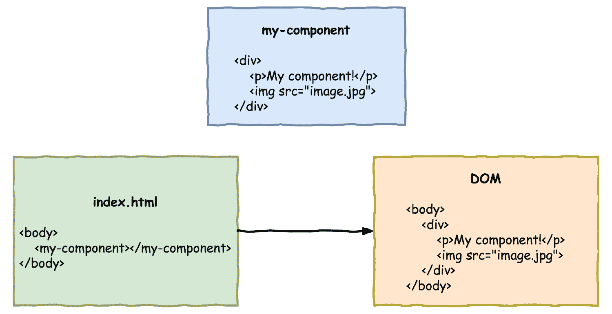
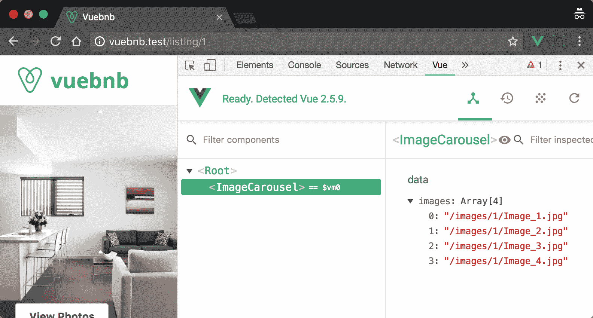
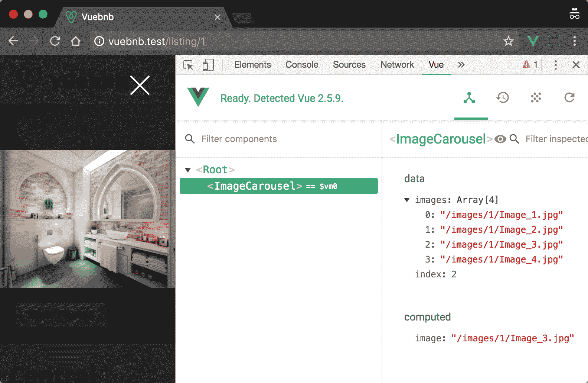
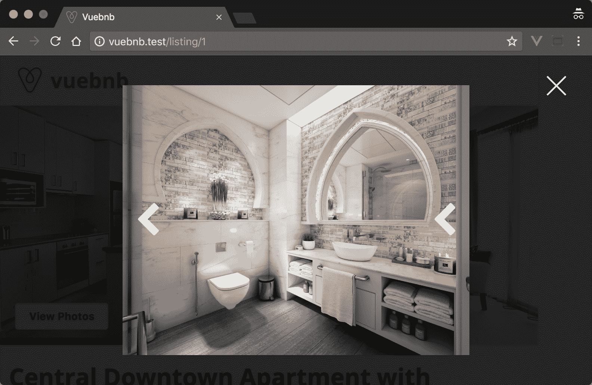
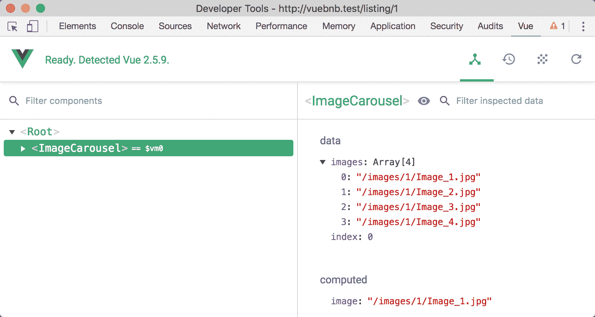
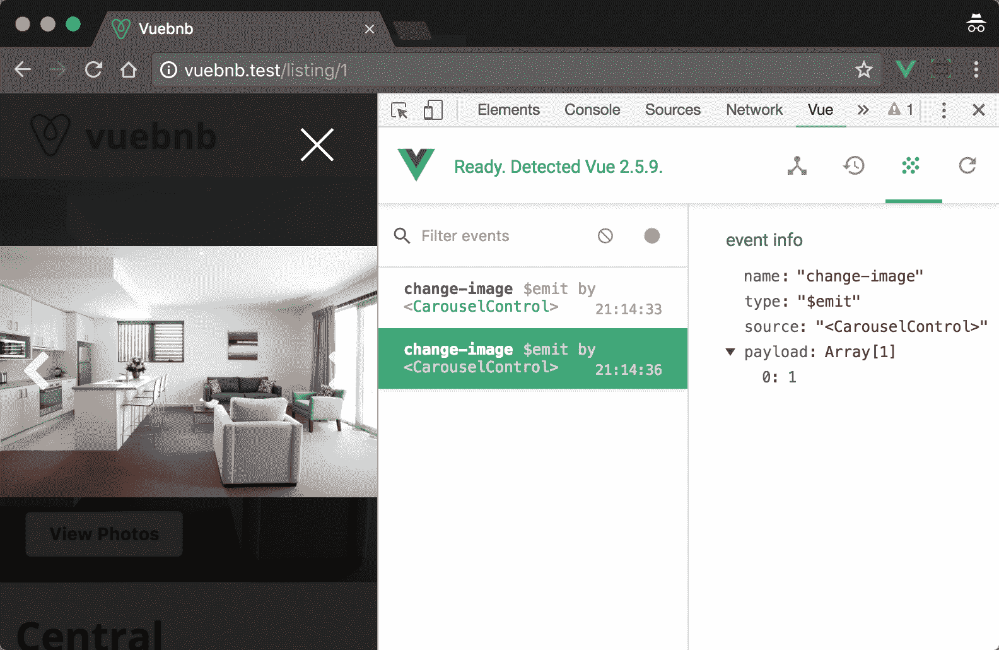
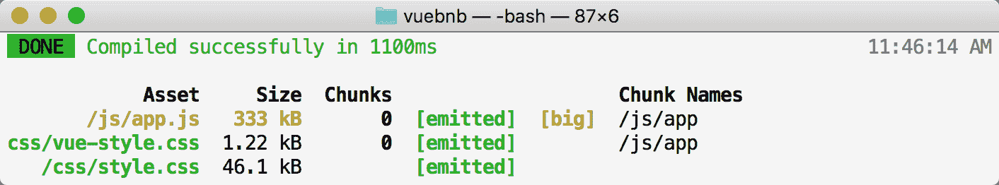
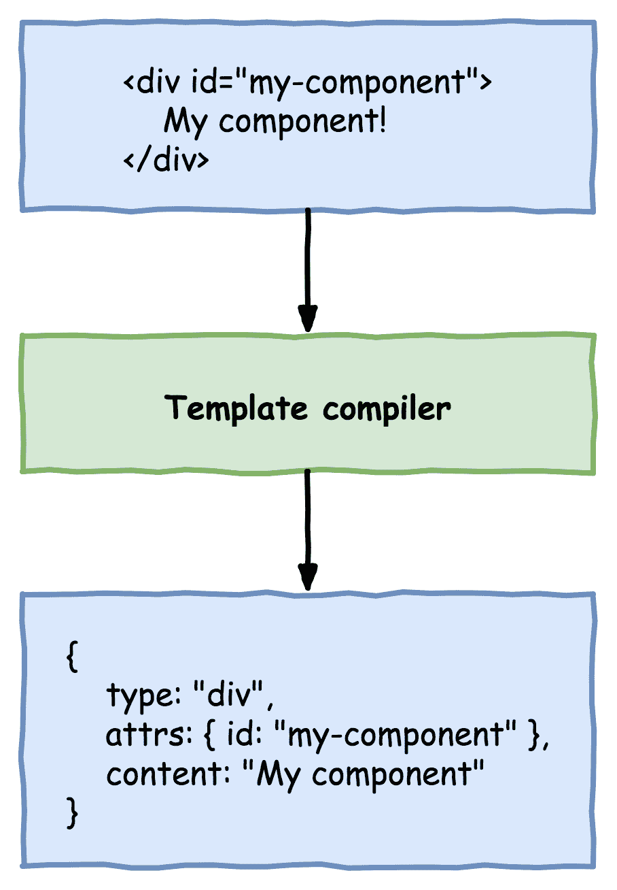
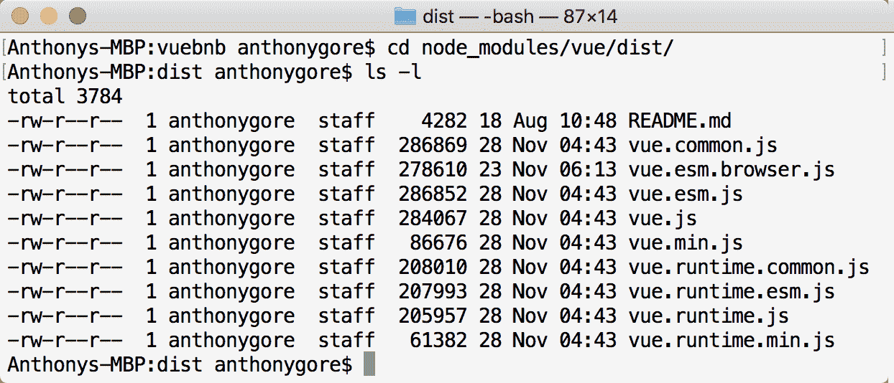
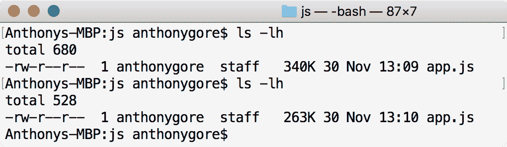

# 用 Vue.js 组件组合小部件

组件正在成为前端开发的一个重要方面，也是大多数现代前端框架的一个特征，包括 Vue、React、Angular、Polymer 等。组件甚至正在通过一个名为**网络组件**的新标准成为网络的原生组件。

在本章中，我们将使用组件为 Vuebnb 创建一个图像转盘，它允许用户仔细阅读房间列表的不同照片。我们还将重构 Vuebnb，以符合基于组件的体系结构。

本章涵盖的主题:

*   什么是组件以及如何用 Vue.js 创建它们
*   通过道具和事件进行组件通信
*   单文件组件 Vue 最有用的特性之一
*   向具有插槽的组件添加自定义内容
*   完全从组件构建应用程序的好处
*   如何使用渲染函数跳过模板编译器
*   使用 Vue 的纯运行时构建来减轻包的大小

# 成分

当我们为网络应用程序构建模板时，我们可以使用 HTML 元素，如`div`、`table`和`span`。这种多种多样的元素使得创建我们在页面上组织内容所需的任何结构变得容易。

如果我们可以创建自己的自定义元素，例如通过`my-element`呢？这将允许我们创建专门为我们的应用程序设计的可重用结构。

*组件*是一个用于在 Vue.js 中创建自定义元素的工具。当我们注册一个组件时，我们定义一个模板，该模板呈现为一个或多个标准 HTML 元素:



Figure 6.1\. Components facilitate reusable markup and render as standard HTML

# 登记

注册组件的方法有很多，但最简单的是使用`component` API 方法。第一个参数是您想要给组件的名称，第二个参数是配置对象。配置对象通常包含一个`template`属性，使用字符串来声明组件的标记:

```php
Vue.component('my-component', {
  template: '<div>My component!</div>'
});

new Vue({
  el: '#app'
});
```

一旦我们注册了这样的组件，我们就可以在我们的项目中使用它:

```php
<div id="app">
  <my-component></my-component>
  <!-- Renders as <div>My component!</div> -->
</div>
```

# 数据

除了可重用的标记之外，组件还允许我们重用 JavaScript 功能。配置对象不仅可以包含模板，还可以包含自己的状态，就像 Vue 实例一样。事实上，每个组件都可以被认为是 Vue 的一个小型实例，有自己的数据、方法、生命周期挂钩等等。

不过，我们对待组件数据的方式与 Vue 实例略有不同，因为组件是可以重用的。例如，我们可以像这样创建一组`check-box`组件:

```php
<div id="app">
  <check-box></check-box>
  <check-box></check-box>
  <check-box></check-box>
</div>
<script>
  Vue.component('check-box', {
    template: '<div v-on:click="checked = !checked"></div>'
    data: {
      checked: false
    }
  });
</script>
```

事实上，如果用户点击一个复选框`div`，`checked`状态同时为每个复选框从真切换到假！这不是我们想要的，但这是将要发生的，因为组件的所有实例都引用同一个`data`对象，因此具有相同的状态。

为了给每个实例一个唯一的状态，`data`属性不应该是一个对象，而是一个返回对象的工厂函数。这样，每次组件被实例化时，它都会链接到一个新的数据对象。实现这一点很简单:

```php
data() {
  return { 
    checked: false 
  }
}
```

# 图像转盘

让我们使用组件为 Vuebnb 前端应用程序构建一个新功能。正如您在前面几章中回忆的那样，我们的每个模拟数据列表都有四个不同的图像，我们将 URL 传递给前端应用程序。

为了让用户仔细阅读这些图像，我们将创建一个图像转盘。这个轮播将替换当前占据模式窗口的静态图像，当您单击列表的标题时会弹出该窗口。

首先打开应用程序视图。移除静态图像，用自定义 HTML 元素`image-carousel`替换。

`resources/views/app.blade.php`:

```php
<div class="modal-content">
  <image-carousel></image-carousel>
</div>
```

A component can be referred to in your code by a kebab-case name such as `my-component`, a PascalCase name such as `MyComponent`, or a camelCase name such as `myComponent`. Vue sees these all as the same component. However, in a DOM or string template, the component should always be kebab-cased. Vue doesn't enforce this, but markup in the page gets parsed by the browser before Vue gets to work with it, so it should conform to W3C naming conventions or the parser may strip it out.

现在让我们在条目文件中注册这个组件。这个新组件的模板只是我们从视图中移除的图像标签，包装在`div`中。我们添加这个包装元素，因为组件模板必须有一个根元素，我们很快会在其中添加更多的元素。

作为概念证明，组件数据将包括一组硬编码的图像 URL。一旦我们学会了如何将数据传递到一个组件中，我们将移除这些硬编码的 URL，并用我们模型中的动态 URL 来替换它们。

`resources/img/js/app.js`:

```php
Vue.component('image-carousel', {
  template: `<div class="image-carousel">
              
            </div>`,
  data() {
    return {
      images: [
       img/1/Image_1.jpg',
       img/1/Image_2.jpg',
       img/1/Image_3.jpg',
       img/1/Image_4.jpg'
      ]
    }
  }
});

var app = new Vue({
  ...
});
```

在我们测试这个组件之前，让我们调整一下我们的 CSS。我们之前有一个规则，通过使用`.modal-content img `选择器来确保模态窗口内的图像拉伸到全宽。让我们使用`.image-carousel`选择器来实现这个规则，因为我们要从模态窗口中分离图像。

`resources/img/css/style.css`:

```php
.image-carousel img {
  width: 100%;
}
```

代码重建后，将浏览器导航到`/listing/1`，您应该看不出有什么不同，因为组件应该以与之前的标记几乎完全相同的方式呈现。

然而，如果我们检查 Vue Devtools，并打开组件选项卡，您将会看到我们现在有了嵌套在`Root`实例下面的`ImageCarousel`组件。选择`ImageCarousel`，我们甚至可以查看它的状态:



Figure 6.2\. Vue Devtools showing ImageCarousel component

# 改变图像

旋转木马的作用是让用户无需滚动页面就能浏览一组图像。为了允许这个功能，我们需要创建一些用户界面控件。

但是首先，让我们在组件中添加一个新的数据属性`index`，它将决定当前显示的图像。它将被初始化为 0，用户界面控件稍后将能够增加或减少该值。

我们将图像源绑定到位置`index`的数组项。

`resources/img/js/app.js`:

```php
Vue.component('image-carousel', {
  template: `<div class="image-carousel">
              
            </div>`,
  data() {
    return {
      images: [
       img/1/Image_1.jpg',
       img/1/Image_2.jpg',
       img/1/Image_3.jpg',
       img/1/Image_4.jpg'
      ],
      index: 0
    }
  }
});
```

页面刷新应该不会改变你在屏幕上看到的内容。但是，如果您将`index`的值初始化为`1`、`2`或`3`，当您重新打开模态窗口时，您会发现显示了不同的图像:



Figure 6.3\. Setting index to 2 selects a different URL and a different image is shown

# 计算属性

将逻辑直接作为表达式写入我们的模板很方便，例如，`v-if="myExpression"`。但是更复杂的逻辑呢，不能定义为表达式，或者对于模板来说变得过于冗长？

在这种情况下，我们使用**计算属性**。这些是我们添加到我们的 Vue 配置中的属性，可以被认为是反应式方法，只要依赖值发生变化，这些方法就会重新运行。

在下面的例子中，我们已经在`computed`配置部分声明了一个计算属性`message`。注意该函数依赖于`val`，即`message`的返回值会随着`val`的变化而变化。

当该脚本运行时，Vue 将记录`message`的任何依赖关系，并将设置反应式绑定，这样，与常规方法不同的是，每当依赖关系发生变化时，该函数都将重新运行:

```php
<script>
  var app = new Vue({
    el: '#app',
    data: {
      val: 1
    },
    computed: {
      message() {
        return `The value is ${this.val}`
      }
    }   
  });

  setTimeout(function() {
    app.val = 2;
  }, 2000);
</script>
<div id="app">
  <!--Renders as "The value is 1"-->
  <!--After 2 seconds, re-renders as "The value is 2"-->
  {{ message }}
</div>
```

回到图像转盘，让我们通过将绑定到图像的表达式`src`抽象成一个计算属性来使模板更加简洁。

`resources/img/js/app.js`:

```php
Vue.component('image-carousel', {
  template: `<div class="image-carousel">
              
            </div>`,
  data() { ... },
  computed: {
    image() {
      return this.images[this.index];
    }
  }
});
```

# 用组件组合

组件可以像嵌套标准 HTML 元素一样嵌套在其他组件中。例如，`component B`可以是`component A`的子代，如果`component A`在其模板中声明`component B`:

```php
<div id="app">
  <component-a></component-a>
</div>
<script>
  Vue.component('component-a', {
    template: `
      <div>
        <p>Hi I'm component A</p>
        <component-b></component-b>
      </div>`
  });

  Vue.component('component-b', {
    template: `<p>And I'm component B</p>`
  });

  new Vue({
    el: '#app'
  });
</script>
```

此渲染为:

```php
<div id="app">
  <div>
    <p>Hi I'm component A</p>
    <p>And I'm component B</p>
  </div>
</div>
```

# 注册范围

虽然有些组件是为在应用程序中的任何地方使用而设计的，但其他组件可能是为了更具体的目的而设计的。当我们使用应用编程接口注册一个组件时，即`Vue.component`，该组件是全球注册的*，可以在任何其他组件或实例中使用。*

 *我们也可以在本地注册一个组件，方法是在根实例的`components`选项中声明它，或者在另一个组件中声明它:

```php
Vue.component('component-a', {
  template: `
    <div>
      <p>Hi I'm component A</p>
      <component-b></component-b>
    </div>`,
  components: {
    'component-b': {
      template: `<p>And I'm component B</p>`
```

```php
    }
  }
});
```

# 转盘控件

为了允许用户更改转盘中当前显示的图像，让我们创建一个新组件`CarouselControl`。该组件将显示为浮动在转盘上的箭头，并响应用户的点击。我们将使用两个实例，因为将有一个左右箭头用于减少或增加图像索引。

我们将在本地为`ImageCarousel`组件注册`CarouselControl`。`CarouselControl`模板将呈现为一个`i`标签，通常用于显示图标。旋转木马的一个很好的图标是字体真棒*人字形*图标，这是一个优雅形状的箭头。目前，我们没有办法区分左右，所以现在，两个实例都有一个面向左的图标。

`resources/img/js/app.js`:

```php
Vue.component('image-carousel', {
  template: `
    <div class="image-carousel">
      
      <div class="controls">
        <carousel-control></carousel-control>
        <carousel-control></carousel-control>
      </div>
    </div>
  `,
  data() { ... },
  computed: { ... },
  components: {
    'carousel-control': {
      template: `<i class="carousel-control fa fa-2x fa-chevron-left"></i>`
    }
  }
});
```

为了让这些控件在我们的图像转盘上很好地浮动，我们还将向我们的 CSS 文件添加一些新的规则。

`resources/img/css/style.css`:

```php
.image-carousel {
  height: 100%;
  margin-top: -12vh;
  position: relative;
  display: flex;
  align-items: center;
  justify-content: center;
}

.image-carousel .controls {
  position: absolute;
  width: 100%;
  display: flex;
  justify-content: space-between;
}

.carousel-control {
  padding: 1rem;
  color: #ffffff;
  opacity: 0.85
}

@media (min-width: 744px) {
  .carousel-control {
      font-size: 3rem;
  }
}
```

添加了这些代码后，打开模态窗口，查看我们到目前为止的工作:



Figure 6.4\. Carousel controls added to the image carousel

# 与组件通信

组件的一个关键方面是它们是可重用的，这就是为什么我们给它们自己的状态，以保持它们独立于应用程序的其他部分。但是，我们可能还是想发送数据，或者发送出去。组件有一个接口，用于与应用程序的其他部分进行通信，我们现在将对此进行探索。

# 小道具

我们可以通过一个被称为*道具*的自定义 HTML 属性向组件发送数据。我们还必须在组件配置的数组`props`中注册这个自定义属性。在下面的例子中，我们创建了一个道具`title`:

```php
<div id="app">
  <my-component title="My component!"></my-component>
  <!-- Renders as <div>My component!</div> -->
</div>
<script>
  Vue.component('my-component', {
    template: '<div>{{ title }}</div>',
    props: ['title']
  });

  new Vue({
    el: '#app'
  });
</script>
```

prop 可以像组件的任何数据属性一样使用:您可以在模板中插入它，在方法和计算属性中使用它，等等。然而，你不应该改变正确数据。将道具数据视为从另一个组件或实例借用的*-只有所有者应该更改它。*

*Props are proxied to the instance just like data properties, meaning you can refer to a prop as `this.myprop` within that component's code. Be sure to name your props uniquely to your data properties to avoid a clash!

# 单向数据流

由于必须在使用组件的模板中声明道具，因此道具数据只能从父级传递给子级。这就是为什么你不应该改变一个道具——因为数据向下流动，改变不会反映在父对象中，因此你会有不同版本的相同状态。

如果您确实需要告诉所有者更改数据，有一个单独的接口用于将数据从子代传递给父代，我们将在后面看到。

# 动态道具

我们可以使用`v-bind`指令将数据反应性地绑定到组件。当父代中的数据发生变化时，它将自动向下流到子代。

在下面的示例中，根实例中`title`的值在两秒钟后以编程方式更新。该变化将自动向下流到`MyComponent`，它将反应性地重新渲染以显示新值:

```php
<div id="app">
  <my-component :title="title"></my-component>
  <!-- Renders initially as <div>Hello World</div> -->
  <!-- Re-renders after two seconds as <div>Goodbye World</div> -->
</div>
<script>
  Vue.component('my-component', {
    template: '<div>{{ title }}</div>',
    props: [ 'title' ]
  });

  var app = new Vue({
    el: '#app',
    data: {
      title: 'Hello World'
    }
  });

  setTimeout(() => {
    app.title = 'Goodbye World'
  }, 2000);
</script>
```

Since the `v-bind` directive is used so commonly in templates, you can omit the directive name as a shorthand: `<div v-bind:title="title">` can be shortened to `<div :title="title">`.

# 图片网址

当我们创建`ImageCarousel`时，我们对图像网址进行了硬编码。有了道具，我们现在有了从根实例向下发送动态数据到组件的机制。让我们在`ImageCarousel`声明中将根实例数据属性`images`绑定到一个道具，也称为`images`。

`resources/views/app.blade.php`:

```php
<div class="modal-content">
  <image-carousel :images="images"></image-carousel>
</div>
```

现在，删除`ImageCarousel`组件中的数据属性`images`，改为将`images`声明为道具。

`resources/img/js/app.js`:

```php
Vue.component('image-carousel', {
  props: ['images'],
  data() {
    return {
      index: 0
    }
  },
  ...
}
```

根实例现在将负责图像 URL 的状态，而图像转盘组件将只负责显示它们。

使用 Vue Devtools，我们可以检查图像转盘组件的状态，它现在包含`images`作为一个正确的值，而不是一个数据值:



Figure 6.5\. Image URLs are props sent to the ImageCarousel component

现在图像网址来自模型，我们可以访问其他列表路径，如`/listing/2`，并再次在模态窗口中看到正确的图像显示。

# 区分转盘控件

`CarouselControl`组件应该有两种可能的状态:向左或向右。当用户点击时，前者将在可用图像中上升，后者将下降。

这种状态不应该由内部决定，而是从`ImageCarousel`传下来。为此，让我们为`CarouselControl`添加一个道具`dir`，该道具将采用字符串值，并且应该是`left`或`right`。

借助`dir`道具，我们现在可以将正确的图标绑定到`i`元素。这是通过一个计算属性来完成的，该属性将道具的值附加到字符串`fa-chevron-`中，从而产生`fa-chevron-left`或`fa-chevron-right`。

`resources/img/js/app.js`:

```php
Vue.component('image-carousel', {
  template: `
    <div class="image-carousel">
      
      <div class="controls">
        <carousel-control dir="left"></carousel-control>
        <carousel-control dir="right"></carousel-control>
      </div>
    </div>
  `,
  ...
  components: {
    'carousel-control': {
      template: `<i :class="classes"></i>`,
      props: [ 'dir' ],
      computed: {
        classes() {
          return 'carousel-control fa fa-2x fa-chevron-' + this.dir;
        }
      }
    }
  }
}

```

现在，我们可以看到转盘控制图标方向正确:


Figure 6.6\. Carousel control icons are now correctly directed

# 自定义事件

我们的转盘控件显示得很好，但它们仍然不起作用！当它们被点击时，我们需要它们告诉`ImageCarousel`增加或减少它的`index`值，这将导致图像被改变。

动态道具对这个任务不起作用，因为道具只能把数据从父母传给孩子。当孩子需要向家长发送数据时，我们该怎么办？

*自定义事件*可以从子组件发出，由其父组件监听。为了实现这一点，我们在子对象中使用`$emit`实例方法，该方法将事件名称作为第一个参数，并为随事件一起发送的任何数据提供任意数量的附加参数，例如`this.$emit('my-event', 'My event payload');`。

父级可以使用声明组件的模板中的`v-on`指令来监听这个事件。如果使用方法处理事件，则随事件发送的任何参数都将作为参数传递给此方法。

考虑这个例子，其中一个子组件`MyComponent`发出一个名为`toggle`的事件，告诉父组件(根实例)更改数据属性`toggle`的值:

```php
<div id="app">
  <my-component @toggle="toggle = !toggle"></my-component>
  {{ message }}
</div>
<script>
  Vue.component('my-component', {
    template: '<div v-on:click="clicked">Click me</div>',
    methods: {
      clicked: function() {
        this.$emit('toggle');
      }
    }
  });

  new Vue({
    el: '#app',
    data: {
      toggle: false
    },
    computed: {
      message: function() {
        return this.toggle ? 'On' : 'Off';
      }
    }
  });
</script>
```

# 更改转盘图像

回到`CarouselControl`，让我们使用`v-on`指令和触发方法`clicked`来响应用户的点击。该方法将依次发出自定义事件`change-image`，该事件将包括有效载荷`-1`或`1`，具体取决于组件的状态是`left`还是`right`。

Just like with `v-bind`, there is a shorthand for `v-on` as well. Simply replace `v-on:` with `@`; for instance, `<div @click="handler"></div>` is the equivalent of `<div v-on:click="handler"></div>`.

`resources/img/js/app.js`:

```php
components: {
  'carousel-control': {
    template: `<i :class="classes" @click="clicked"></i>`,
    props: [ 'dir' ],
    computed: {
      classes() {
        return 'carousel-control fa fa-2x fa-chevron-' + this.dir;
      }
    },
    methods: {
      clicked() {
        this.$emit('change-image', this.dir === 'left' ? -1 : 1);
      }
    }
  }
}
```

打开 Vue 开发工具到事件标签，同时点击转盘控件。这里记录了自定义事件，因此我们可以验证`change-image`正在发出:



Figure 6.7\. Screenshot showing a custom event and its payload

`ImageCarousel`现在需要通过`v-on`指令监听`change-image`事件。该事件将由方法`changeImage`处理，该方法将有一个参数`val`，反映事件中发送的有效载荷。然后，该方法将使用`val`来步进`index`的值，确保它循环到开始或结束，如果它超过它索引的数组的边界。

`resources/img/js/app.js`:

```php
Vue.component('image-carousel', {
  template: `
    <div class="image-carousel">
      
      <div class="controls">
        <carousel-control 
          dir="left" 
          @change-image="changeImage"
        ></carousel-control>
        <carousel-control 
          dir="right" 
          @change-image="changeImage"
        ></carousel-control>
      </div>
    </div>
  `,
  ...
  methods: {
    changeImage(val) {
      let newVal = this.index + parseInt(val);
      if (newVal < 0) {
        this.index = this.images.length -1;
      } else if (newVal === this.images.length) {
        this.index = 0;
      } else {
        this.index = newVal;
      }
    }
  },
  ...
}
```

完成此操作后，图像转盘将完美工作:


Figure 6.8\. The state of the image carousel after the image has been changed

# 单文件组件

**单文件组件** ( **SFCs** )是扩展名为`.vue`的文件，包含单个组件的完整定义，可以导入到您的 Vue.js 应用程序中。sfc 使创建和使用组件变得简单，并带来了我们将很快探索的各种其他好处。

sfc 类似于 HTML 文件，但最多有三个根元素:

*   `template`
*   `script`
*   `style`

组件定义位于`script`标签内，与任何其他组件定义完全相同，除了:

*   它将导出一个专家系统模块
*   它不需要`template`属性(或`render`函数；稍后将详细说明)

组件的模板将在`template`标签中声明为 HTML 标记。这应该是对编写繁琐的模板字符串的一种可喜的解脱！

`style`标签是 SFCs 独有的特性，可以包含组件所需的任何 CSS 规则。这主要是帮助你组织你的 CSS。

下面是一个单文件组件的声明和使用示例。

`MyComponent.vue`:

```php
<template>
  <div id="my-component">{{ title }}</div>
</template>
<script>
  export default {
    data() {
      title: 'My Component'
    }
  };
</script>
<style>
  .my-component {
    color: red;
  }
</style>
```

`app.js`:

```php
import 'MyComponent' from './MyComponent.vue';

new Vue({
  el: '#app',
  components: {
    MyComponent
  }
});
```

# 转换

要在你的应用程序中使用单文件组件，你只需把它当作一个专家系统模块。*。但是，vue* 文件不是有效的 JavaScript 模块文件。就像我们使用网络包巴贝尔插件将我们的 ES2015 代码转换成 ES5 代码一样，我们必须使用 *Vue Loader* 来转换*。vue* 将文件转换成 JavaScript 模块。

默认情况下，Vue Loader 已经用 Laravel Mix 进行了配置，所以在这个项目中我们不需要再做什么了；我们进口的任何 sfc 都将正常工作！

To learn more about Vue Loader, check out the documentation at [https://vue-loader.vuejs.org/](https://vue-loader.vuejs.org/).

# 将组件重构到 SFCs

我们的`resource/img/js/app.js`文件现在差不多有 100 行了。如果我们继续添加组件，它将开始变得难以管理，所以是时候考虑将其拆分了。

让我们从将现有组件重构为 SFCs 开始。首先，我们将创建一个新目录，然后我们将创建`.vue`文件:

```php
$ mkdir resources/img/components
$ touch resources/img/components/ImageCarousel.vue
$ touch resources/img/components/CarouselControl.vue
```

从`ImageCarousel.vue`开始，第一步是创建三个根元素。

`resources/img/components/ImageCarousel.vue`:

```php
<template></template>
<script></script>
<style></style>
```

现在，我们将`template`字符串移动到`template `标签中，并将组件定义移动到`script`标签中。组件定义必须作为模块导出。

`resources/img/components/ImageCarousel.vue`:

```php
<template>
  <div class="image-carousel">
    
    <div class="controls">
      <carousel-control 
        dir="left" 
        @change-image="changeImage"
      ></carousel-control>
      <carousel-control 
        dir="right" 
        @change-image="changeImage"
      ></carousel-control>
    </div>
  </div>
</template>
<script>
  export default {
    props: [ 'images' ],
    data() {
      return {
        index: 0
      }
    },
    computed: {
      image() {
        return this.images[this.index];
      }
    },
    methods: {
      changeImage(val) {
        let newVal = this.index + parseInt(val);
        if (newVal < 0) {
          this.index = this.images.length -1;
        } else if (newVal === this.images.length) {
          this.index = 0;
        } else {
          this.index = newVal;
        }
      }
    },
    components: {
      'carousel-control': {
        template: `<i :class="classes" @click="clicked"></i>`,
        props: [ 'dir' ],
        computed: {
          classes() {
            return 'carousel-control fa fa-2x fa-chevron-' + this.dir;
          }
        },
        methods: {
          clicked() {
            this.$emit('change-image', this.dir === 'left' ? -1 : 1);
          }
        }
      }
    }
  }
</script>
<style></style>
```

现在，我们可以将这个文件导入我们的应用程序，并在根实例中本地注册它。如上所述，Vue 能够在烤串大小写组件名称和帕斯卡大小写组件名称之间自动切换。这意味着我们可以在`component`配置中使用对象速记语法，Vue 将正确解析它。

`resources/img/js/app.js`:

```php
import ImageCarousel from '../components/ImageCarousel.vue';

var app = new Vue({
  ...
  components: {
    ImageCarousel
  }
});
```

在继续下一步之前，请务必从`app.js`中的原始`ImageCarousel`组件定义中删除任何剩余的代码。

# 半铸钢ˌ钢性铸铁(Cast Semi-Steel)

SFCs 允许我们向组件添加样式，有助于更好地组织我们的 CSS 代码。让我们将为图像转盘创建的 CSS 规则移动到这个新的 SFC 的`style`标签中:

```php
<template>...</template>
<script>...</script>
<style>
  .image-carousel {
    height: 100%;
    margin-top: -12vh;
    position: relative;
    display: flex;
    align-items: center;
    justify-content: center;
  }

  .image-carousel img {
    width: 100%;
  }

  .image-carousel .controls {
    position: absolute;
    width: 100%;
    display: flex;
    justify-content: space-between;
  }
</style>
```

当项目构建时，您应该会发现它看起来还是一样的。然而，有趣的是 CSS 在构建中的最终位置。如果你检查`public/css/style.css`，你会发现它不在那里。

它实际上是作为字符串包含在 JavaScript 包中的:


Figure 6.9\. CSS stored as a string in the JavaScript bundle file

为了使用它，Webpack 的引导代码会在应用程序运行时将这个 CSS 字符串内联到文档的头部:


Figure 6.10\. Inlined CSS in document head

内嵌 CSS 实际上是 Vue Loader 的默认行为。但是，我们可以覆盖这一点，让 Webpack 将 SFC 样式写入自己的文件。将以下内容添加到混合配置的底部。

`webpack.mix.js`:

```php
mix.options({
  extractVueStyles: 'public/css/vue-style.css'
});
```

现在，一个额外的文件`public/css/vue-style.css`将在构建中输出:



Figure 6.11\. Webpack output including single-file component styles

在主样式表之后，我们需要在视图中加载这个新文件。

`resources/views/app.blade.php`:

```php
<head>
  ...
  <link rel="stylesheet" href="{{ asset('css/style.css') }}" type="text/css">
  <link rel="stylesheet" href="{{ asset('css/vue-style.css') }}" type="text/css">
  ...
</head>
```

# 转盘控制

现在让我们将`CarouselControl`组件抽象成一个 SFC，并将任何相关的 CSS 规则也从`resources/img/css/style.css`中移出。

`resources/img/components/CarouselControl.vue`:

```php
<template>
  <i :class="classes" @click="clicked"></i>
</template>
<script>
  export default {
    props: [ 'dir' ],
    computed: {
      classes() {
        return 'carousel-control fa fa-2x fa-chevron-' + this.dir;
      }
    },
    methods: {
      clicked() {
        this.$emit('change-image', this.dir === 'left' ? -1 : 1);
      }
    }
  }
</script>
<style>
  .carousel-control {
    padding: 1rem;
    color: #ffffff;
    opacity: 0.85
  }

  @media (min-width: 744px) {
    .carousel-control {
      font-size: 3rem;
    }
  }
</style>
```

该文件现在可以由`ImageCarousel`组件导入。

`resources/img/components/ImageCarousel.vue`:

```php
<template>...</style>
<script>
  import CarouselControl from '../components/CarouselControl.vue';

  export default {
    ...
    components: {
      CarouselControl
    }
  }
</script>
<style>...</style>
```

完成后，我们现有的组件被重构为 SFCs。这并没有对我们的应用程序的功能产生任何明显的影响(尽管它稍微快一点，我将在后面解释)，但是随着我们的继续，它会让开发变得更容易。

# 内容分发

假设您将构建一个基于组件的 Vue.js 应用程序，类似于以下结构:


Figure 6.12\. Component-based Vue.js app

请注意，在上图的左分支中，`ComponentC`由`ComponentB`声明。然而，在右边的分支中，`ComponentD`由不同的`ComponentB`实例声明。

以您目前对组件的了解，考虑到它必须声明两个不同的组件，您将如何为`ComponentB`制作模板？也许它会包括一个指令，根据从`ComponentA`传下来的一些变量，使用`ComponentC`或`ComponentD`。这种方法是可行的，但是它使`ComponentB`非常不灵活，限制了它在应用程序其他部分的可重用性。

# 时间

到目前为止，我们已经了解到组件的内容是由它自己的模板定义的，而不是由它的父模板定义的，因此我们不会期望下面的内容起作用:

```php
<div id="app">
  <my-component>
    <p>Parent content</p>
  </my-component>
</div>
```

但是如果`MyComponent`有一个*槽*的话，它会起作用的。插槽是组件内部的分配出口，由特殊的`slot`元素定义:

```php
Vue.component('my-component', {
  template: `
    <div>
      <slot></slot>
      <p>Child content</p>
    </div>`
});

new Vue({
  el: '#app'
});
```

此渲染为:

```php
<div id="app">
  <div>
    <p>Parent content</p>
    <p>Child content</p>
  </div>
</div>
```

如果`ComponentB`在其模板中有一个槽，如下所示:

```php
Vue.component('component-b', { 
  template: '<slot></slot>'
});

```

我们可以解决刚才陈述的问题，而不必使用繁琐的`v-for`:

```php
<component-a>
  <component-b>
    <component-c></component-c>
  </component-b>
  <component-b>
    <component-d></component-d>
  </component-b>
</component-a>
```

需要注意的是，父模板中组件内部声明的内容是在父模板的范围内编译的。虽然它在子对象内部呈现，但它不能访问子对象的任何数据。以下示例应对此加以区分:

```php
<div id="app">
  <my-component>
    <!--This works-->
    <p>{{ parentProperty }}</p>

    <!--This does not work. childProperty is undefined, as this content--> 
    <!--is compiled in the parent's scope-->
    <p>{{ childProperty }}
  </my-component>
</div>
<script>
  Vue.component('my-component', {
    template: `
      <div>
        <slot></slot>
        <p>Child content</p>
      </div>`,
    data() {
      return {
        childProperty: 'World'
      }
    }
  });

  new Vue({
    el: '#app',
    data: {
      parentProperty: 'Hello'
    }
  });
</script>
```

# 模态窗口

我们的根 Vue 实例中剩下的很多功能都与模态窗口有关。让我们把它抽象成一个独立的组件。首先，我们将创建新的组件文件:

```php
$ touch resources/img/components/ModalWindow.vue
```

现在，我们将把标记从视图移植到组件中。为了确保转盘保持与模态窗口的分离，我们将用一个槽替换标记中的`ImageCarousel`声明。

`resources/img/components/ModalWindow.vue`:

```php
<template>
  <div id="modal" :class="{ show : modalOpen }">
    <button @click="modalOpen = false" class="modal-close">&times;</button>
    <div class="modal-content">
      <slot></slot>
    </div>
  </div>
</template>
<script></script>
<style></style>
```

我们现在可以在视图中刚刚创建的孔中声明一个`ModalWindow`元素，其中一个`ImageCarousel`作为槽的内容。

`resources/views/app.blade.php`:

```php
<div id="app">
  <div class="header">...</div>
  <div class="container">...</div>
  <modal-window>
    <image-carousel :images="images"></image-carousel>
  </modal-window>
</div>
```

我们现在将从根实例中移除所需的功能，并将其放入`script`标签中。

`resources/img/components/ModalWindow.vue`:

```php
<template>...</template>
<script>
  export default {
    data() {
      return {
        modalOpen: false
      }
    },
    methods: {
      escapeKeyListener(evt) {
        if (evt.keyCode === 27 && this.modalOpen) {
          this.modalOpen = false;
        }
      }
    },
    watch: {
      modalOpen() {
        var className = 'modal-open';
        if (this.modalOpen) {
          document.body.classList.add(className);
        } else {
          document.body.classList.remove(className);
        }
      }
    },
    created() {
      document.addEventListener('keyup', this.escapeKeyListener);
    },
    destroyed() {
      document.removeEventListener('keyup', this.escapeKeyListener);
    },
  }
</script>
<style></style>
```

接下来我们在入口文件中导入`ModalWindow`。

`resources/img/js/app.js`:

```php
import ModalWindow from '../components/ModalWindow.vue';

var app = new Vue({
  el: '#app',
  data: Object.assign(model, {
    headerImageStyle: {
      'background-image': `url(${model.images[0]})`
    },
    contracted: true
  }),
  components: {
    ImageCarousel,
    ModalWindow
  }
});
```

最后，让我们将任何与模态相关的 CSS 规则也移到 SFC 中:

```php
<template>...</template>
<script>...</script>
<style>
  #modal {
    display: none;
    position: fixed;
    top: 0;
    right: 0;
    bottom: 0;
    left: 0;
    z-index: 2000;
    background-color: rgba(0,0,0,0.85);
  }

  #modal.show {
    display: block;
  }

  body.modal-open {
    overflow: hidden;
    position: fixed;
  }

  .modal-close {
    cursor: pointer;
    position: absolute;
    right: 0;
    top: 0;
    padding: 0px 28px 8px;
    font-size: 4em;
    width: auto;
    height: auto;
    background: transparent;
    border: 0;
    outline: none;
    color: #ffffff;
    z-index: 1000;
    font-weight: 100;
    line-height: 1;
  }

  .modal-content {
    height: 100%;
    max-width: 105vh;
    padding-top: 12vh;
    margin: 0 auto;
    position: relative;
  }
</style>
```

项目构建后，您会注意到模态窗口不会打开。我们将在下一节中解决这个问题。

如果您检查 Vue Devtools，您现在将在组件层次结构中看到一个`ModalWindow`组件:


Figure 6.13\. Vue Devtools showing hierarchy of components The representation of our app in Vue Devtools is slightly misleading. It makes it seem as though `ImageCarousel` is a child of `ModalWindow`. Even though `ImageCarousel` renders within `ModalWindow` due to the slot, these components are actually siblings!

# 参考文献

在其初始状态下，模态窗口用`display: none` CSS 规则隐藏。要打开模式，用户必须单击标题图像。然后，点击事件监听器将根实例数据属性`modelOpen`设置为真，这又将向模态添加一个类，以将`display: none`覆盖为`display: block`。

然而，在重构之后，`modalOpen`已经和其余的模态逻辑一起被移到了`ModalWindow`组件中，因此模态打开功能目前被破坏了。解决这个问题的一个可能方法是让根实例通过将逻辑移回根实例来管理模式的打开/关闭状态。然后我们可以使用一个道具来通知模式什么时候需要打开。当模式关闭时(这发生在模式组件的范围内，关闭按钮在那里)，它会向根实例发送一个事件来更新状态。

这种方法是可行的，但它不符合使我们的组件解耦和可重用的精神；模态组件应该管理自己的状态。那么，我们如何允许模态保持它的状态，但是让根实例(父实例)改变它呢？一个事件不会起作用，因为事件只能向上流动，不能向下流动。

`ref`是一个特殊的属性，允许您直接引用子组件的数据。要使用它，请声明`ref`属性并为其分配一个唯一的值，如`imagemodal`。

`resources/views/app.blade.php`:

```php
<modal-window ref="imagemodal">
  ...
</modal-window>
```

现在，根实例可以通过`$refs`对象访问这个特定`ModalWindow`组件的数据。这意味着我们可以改变根实例方法中`modalOpen`的值，就像我们可以从`ModalWindow`中改变一样。

`resources/img/js/app.js`:

```php
var app = new Vue({
  ...
  methods: {
    openModal() {
      this.$refs.imagemodal.modalOpen = true;
    },
  }
});
```

现在我们可以在标题图像的点击监听器中调用`openModal`方法，从而恢复模态打开功能。

`resources/views/app.blade.php`:

```php
<div id="app">
  <div class="header">
    <div class="header-img" :style="headerImageStyle" @click="openModal">
      <button class="view-photos">View Photos</button>
    </div>
  </div>
  ...
</div>
```

It is an anti-pattern to use `ref` when the normal methods of interacting with a component, props and events, are sufficient. `ref` is usually only required for communicating with elements that fall outside of the normal flow of a page, as a modal window does.

# 标题图像

现在让我们将标题图像抽象成一个组件。首先，创建一个新的`.vue`文件:

```php
$ touch resources/img/components/HeaderImage.vue
```

现在进入标记、数据和 CSS。请注意以下修改:

*   必须发出一个事件`header-clicked`。这将用于打开模式
*   图像 URL 作为道具`image-url`传递，然后通过计算属性转换为内嵌样式规则

`resource/img/components/HeaderImage.vue`:

```php
<template>
  <div class="header">
    <div 
      class="header-img" 
      :style="headerImageStyle" 
      @click="$emit('header-clicked')"
    >
      <button class="view-photos">View Photos</button>
    </div>
  </div>
</template>
<script>
  export default {
    computed: {
      headerImageStyle() {
        return {
          'background-image': `url(${this.imageUrl})`
        };
      }
    },
    props: [ 'image-url' ]
  }
</script>
<style>
  .header {
    height: 320px;
  }

  .header .header-img {
    background-repeat: no-repeat;
    -moz-background-size: cover;
    -o-background-size: cover;
    background-size: cover;
    background-position: 50% 50%;
    background-color: #f5f5f5;
    height: 100%;
    cursor: pointer;
    position: relative;
  }

  .header .header-img button {
    font-size: 14px;
    padding: 7px 18px;
    color: #484848;
    line-height: 1.43;
    background: #ffffff;
    font-weight: bold;
    border-radius: 4px;
    border: 1px solid #c4c4c4;
  }

  .header .header-img button.view-photos {
    position: absolute;
    bottom: 20px;
    left: 20px;
  }
</style>
```

在`resources/img/js/app.js`中导入该组件后，在主模板中声明。务必绑定`image-url`道具并处理点击事件。

`resources/views/app.blade.php`:

```php
<div id="app">
  <header-image 
    :image-url="images[0]" 
    @header-clicked="openModal"
  ></header-image>
  <div class="container">...</div>
  <modal-window>...</modal-window>
</div>
```

# 功能列表

让我们继续将 Vuebnb 重构为组件的过程，并抽象出便利设施和价格列表。这些列表具有相似的目的和结构，因此我们为两者创建一个单一的、通用的组件是有意义的。

让我们提醒自己列表的标记目前的样子。

`resources/views/app.blade.php`:

```php
<div class="lists">
  <hr>
  <div class="amenities list">
    <div class="title"><strong>Amenities</strong></div>
    <div class="content">
      <div class="list-item" v-for="amenity in amenities">
        <i class="fa fa-lg" :class="amenity.icon"></i>
        <span>@{{ amenity.title }}</span>
      </div>
    </div>
  </div>
  <hr>
  <div class="prices list">
    <div class="title"><strong>Prices</strong></div>
    <div class="content">
      <div class="list-item" v-for="price in prices">
        @{{ price.title }}: <strong>@{{ price.value }}</strong>
      </div>
    </div>
  </div>
</div>
```

这两个列表的主要区别在于`<div class="content">...</div>`部分，因为每个列表中显示的数据结构略有不同。便利设施有图标和标题，而价格有标题和价值。我们将在这一部分使用一个槽来允许父母为每个定制内容。

但是首先，让我们创建新的`FeatureList`组件文件:

```php
$ touch resources/img/components/FeatureList.vue
```

我们将移动其中一个列表的标记，使用一个槽来替换列表内容。我们还将为标题添加一个道具，并在任何与列表相关的 CSS 中移动。

`resources/img/components/FeatureList.vue`:

```php
<template>
  <div>
    <hr>
    <div class="list">
      <div class="title"><strong>{{ title }}</strong></div>
      <div class="content">
        <slot></slot>
      </div>
    </div>
  </div>
</template>
<script>
  export default {
    props: ['title']
  }
</script>
<style>
  hr {
    border: 0;
    border-top: 1px solid #dce0e0;
  }
  .list {
    display: flex;
    flex-wrap: nowrap;
    margin: 2em 0;
  }

  .list .title {
    flex: 1 1 25%;
  }

  .list .content {
    flex: 1 1 75%;
    display: flex;
    flex-wrap: wrap;
  }

  .list .list-item {
    flex: 0 0 50%;
    margin-bottom: 16px;
  }

  .list .list-item > i {
    width: 35px;
  }

  @media (max-width: 743px) {
    .list .title {
      flex: 1 1 33%;
    }

    .list .content {
      flex: 1 1 67%;
    }

    .list .list-item {
      flex: 0 0 100%;
    }
  }
</style>
```

继续将`FeatureList`导入到`resources/img/js/app.js`中，并添加到本地注册的组件中。现在我们可以在主模板中使用`FeatureList`，每个列表都有一个单独的实例。

`resources/views/app.blade.php`:

```php
<div id="app">
  ...
  <div class="container">
    ...
    <div class="lists">
      <feature-list title="Amenities">
        <div class="list-item" v-for="amenity in amenities">
          <i class="fa fa-lg" :class="amenity.icon"></i>
          <span>@{{ amenity.title }}</span>
        </div>
      </feature-list>
      <feature-list title="Prices">
        <div class="list-item" v-for="price in prices">
          @{{ price.title }}: <strong>@{{ price.value }}</strong>
        </div>
      </feature-list>
    </div>
  </div>
</div>
```

# 限定范围的插槽

`FeatureList`组件工作正常，但相当弱。大部分内容都是通过投币口来的，所以看起来家长做的工作太多，而孩子做的太少。鉴于组件(`<div class="list-item" v-for="...">`)的两个声明中都有重复的代码，最好将此委托给子组件。

为了让我们的组件模板更加通用，我们可以使用*范围的槽*来代替常规槽。限定范围的槽允许您将*模板*传递给槽，而不是传递渲染元素。当该模板在父模板中声明时，它将有权访问子模板中提供的任何道具。

例如，具有限定槽范围的组件`child`可能如下所示:

```php
<div>
  <slot my-prop="Hello from child"></slot>
</div>
```

使用该组件的父组件将声明一个`template`元素，该元素将有一个命名别名对象的属性`slot-scope`。添加到子模板插槽中的任何道具都可以作为别名对象的属性:

```php
<child>
  <template slot-scope="props">
    <span>Hello from parent</span>
    <span>{{ props.my-prop }}</span>
  </template>
</child>
```

此渲染为:

```php
<div>
  <span>Hello from parent</span>
  <span>Hello from child</span>
</div>
```

让我们通过我们的`FeatureList`组件来完成包含一个范围槽的步骤。目标是能够将列表项数组作为道具传入，并让`FeatureList`组件迭代它们。这样，`FeatureList`就拥有了所有重复的功能。然后，父项将提供一个模板来定义每个列表项应该如何显示。

`resources/views/app.blade.php`:

```php
<div class="lists">
  <feature-list title="Amenities" :items="amenities">
    <!--template will go here-->
  </feature-list>
  <feature-list title="Prices" :items="prices">
    <!--template will go here-->
  </feature-list>   
</div>
```

现在关注`FeatureList`组件，按照以下步骤操作:

1.  将`items`添加到配置对象中的道具数组中
2.  `items`将是我们在`<div class="content">`部分中迭代的数组
3.  在循环中，`item`是任何特定列表项的别名。我们可以创建一个槽，并使用`v-bind="item"`将列表项绑定到该槽。(我们以前没有在没有参数的情况下使用过`v-bind`，但是这会将整个对象的属性绑定到元素上。这很有用，因为设施和价格对象有不同的属性，我们现在不必指定它们。)

`resources/img/components/FeatureList.vue`:

```php
<template>
  <div>
    <hr>
    <div class="list">
      <div class="title"><strong>{{ title }}</strong></div>
      <div class="content">
        <div class="list-item" v-for="item in items">
          <slot v-bind="item"></slot>
        </div>
      </div>
    </div>
  </div>
</template>
<script>
  export default {
    props: ['title', 'items']
  }
</script>
<style>...</style>
```

现在我们回到我们的视野。让我们先来看看便利设施列表:

1.  声明
2.  模板必须包括我们为其分配别名`amenity`的`slot-scope`属性。这个别名允许我们访问限定范围的道具。
3.  在模板中，我们可以使用与之前完全相同的标记来显示我们的舒适列表项目。

`resources/views/app.blade.php`:

```php
<feature-list title="Amenities" :items="amenities">
  <template slot-scope="amenity">
    <i class="fa fa-lg" :class="amenity.icon"></i>
    <span>@{{ amenity.title }}</span>
  </template>
</feature-list>
```

这是完整的主模板和价格。

`resources/views/app.blade.php`:

```php
<div id="app">
  ...
  <div class="container">
    ...
    <div class="lists">
      <feature-list title="Amenities" :items="amenities">
        <template slot-scope="amenity">
          <i class="fa fa-lg" :class="amenity.icon"></i>
          <span>@{{ amenity.title }}</span>
        </template>
      </feature-list>
      <feature-list title="Prices" :items="prices">
        <template slot-scope="price">
          @{{ price.title }}: <strong>@{{ price.value }}</strong>
        </template>
      </feature-list>
    </div>
  </div>
</div>
```

虽然这种方法和以前一样有很多标记，但是它已经将更多的通用功能委托给了组件，这使得设计更加健壮。

# 可扩展文本

我们在[第 2 章](02.html)、*原型开发 Vuebnb，你的第一个 Vue.js 项目*中创建了功能，允许在页面加载时部分收缩“关于”文本，并通过单击按钮扩展到其全部长度。让我们也将这个功能抽象成一个组件:

```php
$ touch resources/img/components/ExpandableText.vue
```

将所有标记、配置和 CSS 移到新组件中。请注意，我们为文本内容使用了一个槽。

`resources/img/components/ExpandableText.vue`:

```php
<template>
  <div>
    <p :class="{ contracted: contracted }">
      <slot></slot>
    </p>
    <button v-if="contracted" class="more" @click="contracted = false">
      + More
    </button>
  </div>
</template>
<script>
  export default {
    data() {
      return {
        contracted: true
      }
    }
  }
</script>
<style>
  p {
    white-space: pre-wrap;
  }

  .contracted {
    height: 250px;
    overflow: hidden;
  }

  .about button.more {
    background: transparent;
    border: 0;
    color: #008489;
    padding: 0;
    font-size: 17px;
    font-weight: bold;
  }

  .about button.more:hover, 
  .about button.more:focus, 
  .about button.more:active {
    text-decoration: underline;
    outline: none;
  }
</style>
```

一旦在`resources/img/js/app.js`中导入了这个组件，在主模板中声明它，记住在槽中插入`about`数据属性。

`resource/views/app.blade.php`:

```php
<div id="app">
  <header-image>...</header-image>
  <div class="container">
    <div class="heading">...</div>
    <hr>
    <div class="about">
      <h3>About this listing</h3>
      <expandable-text>@{{ about }}</expandable-text>
    </div>
    ...
  </div>
</div>
```

这样，Vuebnb 客户端应用程序的大部分数据和功能都被抽象成了组件。让我们来看看`resources/img/js/app.js`看看它变得多么光秃秃！

`resources/img/js/app.js`:

```php
...

import ImageCarousel from '../components/ImageCarousel.vue';
import ModalWindow from '../components/ModalWindow.vue';
import FeatureList from '../components/FeatureList.vue';
import HeaderImage from '../components/HeaderImage.vue';
import ExpandableText from '../components/ExpandableText.vue';

var app = new Vue({
  el: '#app',
  data: Object.assign(model, {}),
  components: {
    ImageCarousel,
    ModalWindow,
    FeatureList,
    HeaderImage,
    ExpandableText
  },
  methods: {
    openModal() {
      this.$refs.imagemodal.modalOpen = true;
    }
  }
});
```

# 虚拟 DOM

让我们现在改变策略，讨论 Vue 如何渲染组件。看看这个例子:

```php
Vue.component('my-component', {
  template: '<div id="my-component">My component</div>'
});
```

为了让 Vue 能够将该组件呈现到页面，它将首先使用内部模板编译器库将模板字符串转换为 JavaScript 对象:



Figure 6.14\. How the template compiler turns a template string into an object

一旦模板被编译，任何状态或指令都可以很容易地被应用。例如，如果模板包含一个`v-for`，可以使用一个简单的 For 循环来相乘节点并插值正确的变量。

之后，Vue 可以与 DOM API 接口，使页面与组件的状态同步。

# 渲染函数

您可以提供一个`render`函数，而不是为组件提供字符串模板。在不理解语法的情况下，您可能可以从下面的示例中看出`render`函数正在生成一个语义上等同于前面示例中字符串模板的模板。两者都用`my-component`的`id`属性和`My component`的内部文本来定义`div`:

```php
Vue.component('my-component'</span>, {
  render(createElement) {
    createElement('div', {attrs:{id:'my-component'}}, 'My component');
    // Equivalent to <div id="my-component">My component</div>
  }
})
```

渲染函数效率更高，因为它们不需要 Vue 首先编译模板字符串。然而，缺点是编写一个渲染函数并不像标记语法那样容易或有表现力，一旦你得到一个大模板，将很难使用。

# 加载程序视图

如果我们可以在开发中创建 HTML 标记模板，然后让 Vue 的模板编译器将它们转换成`render`函数作为构建步骤的一部分，那不是很棒吗？那将是两全其美的事情。

当 Webpack 通过 *Vue Loader* 转换单文件组件时，这正是发生在单文件组件上的情况。看看下面的 JavaScript 捆绑包片段，您可以看到 Webpack 转换并捆绑后的`ImageCarousel`组件:


Figure 6.15\. image-carousel component in the bundle file

# 将主模板重构为单文件组件

我们应用程序根实例的模板是*应用程序*视图中`#app`元素内的内容。像这样的 DOM 模板需要 Vue 模板编译器，就像任何字符串模板一样。

如果我们也能够将这个 DOM 模板抽象成一个 SFC，这将意味着我们所有的前端应用程序模板都将被构建为`render`函数，并且不需要在运行时调用模板编译器。

让我们为主模板创建一个新的 SFC，并将其称为`ListingPage`，因为应用程序的这一部分是我们的列表页面:

```php
$ touch resources/img/components/ListingPage.vue
```

我们将把主模板、根配置和任何相关的 CSS 移到这个组件中。请注意以下几点:

*   我们需要将模板放入包装`div`中，因为组件必须有一个根元素
*   我们现在可以删除`@`转义，因为这个文件不会被 Blade 处理
*   该组件现在与我们创建的其他组件相邻，因此一定要更改导入的相对路径

`resource/img/components/ListingPage.vue`:

```php
<template>
  <div>
    <header-image 
      :image-url="images[0]" 
      @header-clicked="openModal"
    ></header-image>
    <div class="container">
      <div class="heading">
        <h1>{{ title }}</h1>
        <p>{{ address }}</p>
      </div>
      <hr>
      <div class="about">
        <h3>About this listing</h3>
        <expandable-text>{{ about }}</expandable-text>
      </div>
      <div class="lists">
        <feature-list title="Amenities" :items="amenities">
          <template slot-scope="amenity">
            <i class="fa fa-lg" :class="amenity.icon"></i>
            <span>{{ amenity.title }}</span>
          </template>
        </feature-list>
        <feature-list title="Prices" :items="prices">
          <template slot-scope="price">
            {{ price.title }}: <strong>{{ price.value }}</strong>
          </template>
        </feature-list>
      </div>
    </div>
    <modal-window ref="imagemodal">
      <image-carousel :images="images"></image-carousel>
    </modal-window>
  </div>
</template>
<script>
  import { populateAmenitiesAndPrices } from '../js/helpers';

  let model = JSON.parse(window.vuebnb_listing_model);
  model = populateAmenitiesAndPrices(model);

  import ImageCarousel from './ImageCarousel.vue';
  import ModalWindow from './ModalWindow.vue';
  import FeatureList from './FeatureList.vue';
  import HeaderImage from './HeaderImage.vue';
  import ExpandableText from './ExpandableText.vue';

  export default {
    data() {
      return Object.assign(model, {});
    },
    components: {
      ImageCarousel,
      ModalWindow,
      FeatureList,
      HeaderImage,
      ExpandableText
    },
    methods: {
      openModal() {
        this.$refs.imagemodal.modalOpen = true;
      }
    }
  }
</script>
<style>
  .about {
    margin: 2em 0;
  }

  .about h3 {
    font-size: 22px;
  }
</style>
```

# 使用渲染功能安装根级组件

现在，我们的主模板中的 mount 元素将为空。我们需要声明`Listing`组件，但是我们不想在视图中这样做。

`resources/views/app.blade.php`:

```php
<body>
<div id="toolbar">
  
  <h1>vuebnb</h1>
</div>
<div id="app">
  <listing></listing>
</div>
<script src="{{ asset('js/app.js') }}"></script>
</body>
```

如果我们这样做，我们不会从我们的应用程序中完全消除所有字符串和 DOM 模板，所以我们将保持 mount 元素为空。

`resources/views/app.blade.php`:

```php
...

<div id="app"></div>

...
```

我们现在可以用根实例中的渲染函数来声明`Listing`。

`resources/img/js/app.js`:

```php
import "core-js/fn/object/assign";
import Vue from 'vue';

import ListingPage from '../components/ListingPage.vue';

var app = new Vue({
  el: '#app',
  render: h => h(ListingPage)
});
```

To avoid getting side-tracked, I won't explain the syntax of `render` functions here, as this is the only one we'll write throughout the book. If you'd like to learn more about `render` functions, check out the Vue.js documentation at [https://vuejs.org/](https://vuejs.org/).

现在 Vuebnb 不再使用字符串或 DOM 模板，我们不再需要模板编译器功能。有一个特殊的 Vue 版本，我们可以使用，但不包括它！

# Vue.js 构建

运行 Vue.js 有许多不同的环境和用例。在一个项目中，您可以直接在浏览器中加载 Vue，在另一个项目中，您可以将其加载到 Node.js 服务器上，以便进行服务器渲染。因此，所提供的 Vue 有不同的*版本*，因此您可以选择最合适的版本。

在 Vue NPM 包的 *dist* 文件夹中，我们可以看到八个不同的 Vue.js 版本:



Figure 6.16\. The various builds in the node_modules/vue/dist folder

Vue.js 网站提供了一个表格来解释这八种不同的构建:

|  | UMD | CommonJS | 是模块 |
| --- | --- | --- | --- |
| **满** | view . js-检视. js | view . common . js-检视.通用. js | view . esm.js-检视. ESM . js |
| **仅运行时** | view . runtime . js-检视执行阶段. js | view . runtime.common.js-检视. runtime . common . js | view . runtime . esm.js-执行阶段. ESM . js |
| **满(生产)** | 最小 js 视图 | - | - |
| **仅运行时(生产)** | view . runtime . min . js-检视.执行阶段.最小. js | - | - |

# 模块系统

表格的列将构建分类为 *UMD* 、*通用*或*专家系统模块*。我们在[第 5 章](05.html)、*中讨论了 CommonJS 和 ES 模块，将 Laravel 和 Vue.js 与 Webpack* 集成在一起，但是没有提到 **UMD** ( **通用模块定义)**。关于 UMD，你需要知道的主要事情是，它是另一种模块模式，并且在浏览器中运行良好。如果你在一个`script`标签中直接链接到 Vue，UMD 是你的选择。

# 生产构建

表中的行分为两种类型:完整或运行时，以及有或没有生产。

一个*产品*构建用于一个部署的应用程序，而不是一个运行在开发中的应用程序。它已被缩小，任何警告、评论或其他开发选项都被关闭或删除。重点是使构建尽可能小和安全，这是您在生产中想要的。

请注意，只有 UMD 版本的生产版本，因为只有 UMD 直接在浏览器中运行。CommonJS 和 ES Module 将与一个构建工具结合使用，比如 Webpack，它提供自己的生产处理。

# 完全构建与仅运行时

正如我们已经讨论过的，Vue 包括一个模板编译器，用于在运行时将任何字符串或 DOM 模板转换为呈现函数。完整的*构建包括模板编译器，并且是您通常会使用的。但是，如果您已经在开发中将模板转换成渲染函数，那么您可以使用*仅运行时*构建，该构建减少了编译器，并且小了大约 30%！*

 *# 选择版本

Vuebnb 的一个很好的构建是`vue.runtime.esm.js`，因为我们使用的是 Webpack，不需要模板编译器。我们也可以使用`vue.runtime.common.js`，但这与我们在项目中其他地方使用的 ES 模块不一致。然而在实践中，并没有什么不同，因为 Webpack 将以同样的方式处理它们。

请记住，我们在条目文件的顶部用语句`import Vue from 'vue'`包含 Vue。最后一个`'vue'`是网络包运行时解析的 Vue 构建的*别名*。目前，该别名是在默认的混音配置中定义的，并被设置为版本`vue.common.js`。我们可以通过在`webpack.mix.js`文件的底部添加以下内容来覆盖该配置。

`webpack.mix.js`:

```php
...

mix.webpackConfig({
  resolve: {
    alias: {
      'vue$': 'vue/dist/vue.runtime.esm.js'
    }
  }
});
```

在新的构建之后，由于模板编译器被移除，我们应该会看到更小的包大小。在下面的截图中，我展示了在单独的终端选项卡中运行`dev`构建前后的捆绑包:



Figure 6.17\. The difference between bundle sizes after applying the runtime-only build

请记住，没有模板编译器，我们无法再为组件提供字符串模板。这样做会在运行时导致错误。不过这应该不是问题，因为我们有更强大的 SFCs 选项。

# 摘要

在本章中，我们看到了如何使用组件来创建可重用的定制元素。然后我们注册了我们的第一个 Vue.js 组件，用模板字符串定义它们。

接下来，我们看了使用道具和定制事件的组件通信。我们使用这些知识在列表页面模态窗口中构建了一个图像转盘。

在本章的后半部分，我们介绍了单文件组件，我们使用它将 Vuebnb 重构为基于组件的体系结构。然后，我们学习了插槽如何通过组合父内容和子内容来帮助我们制作更多的通用组件。

最后，我们看到了如何使用仅运行时构建来使 Vue 应用程序更小。

在下一章中，我们将通过构建一个主页，并使用 Vue Router 允许在页面之间导航而无需重新加载，使 Vuebnb 成为一个多页面应用程序。***