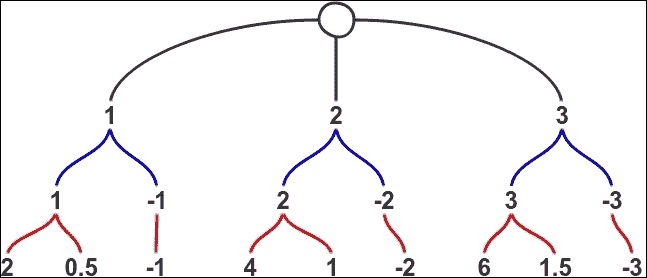

# 六、现实生活中的单子

在前一章中，我们介绍了许多关于各种抽象的理论基础，从而引出了单子的概念。现在是时候通过展示一些单子实例来应用这些知识了，这些实例将在您的日常编码中证明是有用的。

每个部分都将从介绍给定 monad 解决的问题开始，然后是一些用法示例，以便您可以获得一些实践。正如在本介绍的最后所解释的，本书中不会介绍实现本身，而是将重点放在用法上。

正如您将看到的，一旦您摆脱了理论的束缚，大多数实现对您来说都是相当自然的。而且，它的实用性超出了函数式编程的范围。我们将在本章学到的大部分知识可以应用于任何开发环境。

将要介绍的大多数单子都与副作用的管理有关，或者更确切地说，当副作用明确包含在单子中时，会产生影响。在进行函数式编程时，会产生不必要的副作用。一旦被控制，我们就可以控制它们，使它们仅仅是我们计划的结果。

使用单子主要有两个原因。第一，正如上一章已经解释的那样，它们非常适合执行流量控制。第二，它们的结构允许您轻松地封装效果，并保护代码的其余部分不受杂质的影响。

但是，让我们记住，这只是单子的可能用途之一。你可以用这个概念做更多的事情。但我们不要超越自己；一路上我们会发现这一点。

在本章中，我们将介绍以下主题：

*   一元辅助方法
*   也许是单子或单子
*   单子列表
*   作家莫纳德
*   读者单子
*   国家单子
*   木卫一

为了集中精力使用 monad，并且由于实现通常不是最重要的部分，我们将使用由**PHP Functional**库提供的部分。显然，重要的实现细节将在本书中突出显示。您可以使用`composer`调用将其安装到项目中：

```php
composer require widmogrod/php-functional

```

值得注意的是，`php-functional`库的作者就方法的命名和一些实现细节做出了一些其他选择：

*   `apply`方法简单为`ap`
*   类中的`unit`和`return`关键字替换为`of`
*   继承树有点不同，比如有`Pointed`和`Chain`接口
*   库使用特性来共享代码
*   一些助手函数在类之外实现，需要单独导入

# 一元辅助方法

在上一章中，我们讨论了`flatten`方法，以及如何使用它压缩同一 monad 实例的多个嵌套级别。这个函数经常被提及，因为它可以用另一种方式重写单子。然而，还有其他一些有用的助手。

## filterM 方法

过滤是函数式编程中的一个关键概念，但是如果我们的过滤函数返回一个单子而不是一个简单的布尔值呢？这就是`filterM`方法的作用。`filterM`方法不需要返回简单布尔值的谓词，而是使用任何可以转换为布尔值的谓词，并将生成的集合包装在同一个 monad 中：

```php
<?php 

use function Functional\head; 
use function Functional\tail; 

use Monad\Writer; 

function filterM(callable $f, $collection) 
{ 
    $monad = $f(head($collection)); 

    $_filterM = function($collection) use($monad, $f, &$_filterM){ 
        if(count($collection) == 0) { 
            return $monad->of([]); 
        } 

        $x = head($collection); 
        $xs = tail($collection); 

        return $f($x)->bind(function($bool) use($x, $xs, $monad, $_filterM) { 
            return $_filterM($xs)->bind(function(array $acc) use($bool, $x, $monad) { 
                if($bool) { 
                    array_unshift($acc, $x); 
                } 

                return $monad->of($acc); 
            }); 
        }); 
    }; 
    return $_filterM($collection); 
} 

```

实现有点难以理解，因此我将尝试解释发生了什么：

1.  首先，我们需要有关于我们正在使用的 monad 的信息，因此我们提取集合的第一个元素，并通过应用回调从中获取 monad。
2.  然后，我们围绕 monad 和谓词声明一个闭包。
3.  闭包首先测试集合是否为空。如果是这种情况，我们将返回一个包含空数组的 monad 实例。否则，我们对集合的第一个元素运行谓词。
4.  我们将保存当前值的闭包绑定到包含布尔值的结果 monad。
5.  如果需要，第二个闭包递归地遍历整个数组。
6.  在最后一个元素上，我们绑定一个新闭包，该闭包将使用布尔值向累加器添加值或不添加值。

这不是一件容易的事情，但由于它主要是内部管道，由于 PHP 缺乏语法糖分而变得更加困难，因此理解所有内容根本不是必需的。为了比较，下面是使用 Haskell 模式匹配和*do 符号*功能实现的相同代码：

```php
filterM :: (Monad m) => (a -> m Bool) -> [a] -> m [a] 
filterM _ []     = return [] 
filterM f (x:xs) = do 
    bool <- f x 
    acc  <- filterM p xs 
    return (if bool then x:acc else acc) 

```

正如你所看到的，这是一个更容易阅读。我想任何人都能理解正在发生的事情。不幸的是，在 PHP 中，我们必须创建嵌套的内部函数才能获得相同的结果。然而，这并不是一个真正的问题，因为生成的函数相当容易使用。然而，在 PHP 中，某些函数模式的内部工作有时可能有点可怕，而且本身的功能并不完美。

下面是一些单子的例子。`php-functional`库中提供了此帮助器的实现。

## foldM 方法

`foldM`方法是`fold`方法的一元版本。它接受一个函数，该函数返回一个 monad，然后生成一个也是 monad 的值。但是，累加器和集合是简单的值：

```php
<?php 

function foldM(callable $f, $initial, $collection) 
{ 
    $monad = $f($initial, head($collection)); 

    $_foldM = function($acc, $collection) use($monad, $f, &$_foldM){ 
        if(count($collection) == 0) { 
            return $monad->of($acc); 
        } 

        $x = head($collection); 
        $xs = tail($collection); 

        return $f($acc, $x)->bind(function($result) use($acc,$xs,$_foldM) { 
            return $_foldM($result, $xs); 
        }); 
    }; 

    return $_foldM($initial, $collection); 
} 

```

这个实现比`filterM`方法的实现小了一点，因为我们只需要递归；不需要进行从布尔值到值的转换。同样，我们将在本章的以下部分展示一些示例，`php-funcational`库中也提供了一个实现。

## 结束语

存在多个其他功能，可以通过增强与一元值一起使用。例如，您可以使用`zipWithM`方法，该方法使用返回 monad 的 merge 函数合并两个集合。`php-functional`库有一个`mcompose`的实现，它允许您组合返回相同 monad 实例的函数。

当您在使用 monad 时发现某种重复模式时，请毫不犹豫地将其考虑到 helper 函数中。它可能会经常派上用场。

# 可能是单子，也可能是单子

您应该已经很清楚我们已经多次讨论过的可能和任何一种类型。我们首先定义了它们，然后才知道它们实际上是函子的完美例子。

现在我们将更进一步，将它们定义为单子，这样我们就能够在更多的情况下使用它们。

## 动机

`Maybe`单子表示一个计算序列可以在任何时候使用我们在前面章节中定义的`Nothing`类停止返回有意义的值。当转换链相互依赖并且某个步骤可能无法返回值时，它特别有用。它允许我们避免这种情况下经常出现的可怕的检查。

`Either`单子的动机基本相同。稍有不同的是，这些步骤通常会抛出异常或返回错误，而不是空值。操作失败的事实意味着我们需要存储一条错误消息，该消息由`Left`值而不是`Nothing`值表示。

## 实施

在`php-functional`库中可以找到 Maybe 和任一类型的代码。实现非常简单。与我们以前的实现相比，主要的区别在于缺少了`isJust`和`isNothing`等方法，并且实例是使用帮助函数而不是静态工厂构建的。

值得注意的是，`php-functional`库中实现的任意一个 monad 都不能捕获异常本身。您正在应用或绑定到它的函数必须注意自己正确地执行这些操作。您也可以使用`tryCatch`帮助器函数为您执行此操作。

## 示例

为了更好地了解单子的工作原理，让我们看几个例子。`php-functional`库使用助手函数而不是类上的静态方法来创建新实例。他们生活在`Widmogrod\Monad\Maybe`名称空间中。

另一个非常有用的助手是`maybe`方法，它是一个带有以下签名的`maybe($default, callable $fn, Maybe $maybe)`名称空间。调用时，它将首先尝试从`$maybe`变量中提取值，默认为`$default`变量。然后将其作为参数传递给`$fn`变量：

```php
<?php 

use Widmogrod\Monad\Maybe as m; 
use Widmogrod\Functional as f; 

$just = m\just(10); 
$nothing = m\nothing(); 

$just = m\maybeNull(10); 
$nothing = m\maybeNull(null); 

echo maybe('Hello.', 'strtoupper', m\maybe('Hi!')); 
// HI! 

echo maybe('Hello.', 'strtoupper', m\nothing()); 
// HELLO. 

```

既然助手们已经不碍事了，我们将演示如何将`Maybe`单子与`foldM`方法结合使用：

```php
<?php 

$divide = function($acc, $i) { 
    return $i == 0 ? nothing() : just($acc / $i); 
}; 

var_dump(f\foldM($divide, 100, [2, 5, 2])->extract()); 
// int(5) 

var_dump(f\foldM($divide, 100, [2, 0, 2])->extract()); 
// NULL 

```

使用传统的函数和`array_reduce`方法实现这一点会产生非常类似的结果，但它很好地演示了`foldM`方法的工作原理。由于折叠函数在每次迭代时都绑定到当前的一元值，因此一旦有空值，下面的步骤将继续不返回任何内容，直到结束。同样的函数也可以用于返回其他类型的 monad，以保存有关故障的信息。

我们之前已经看到了如何使用 monad 类型将多个函数链接到一个可能存在或不存在的值上。但是，如果我们需要使用此值来获取另一个可能为空的值，我们将有嵌套的`Maybe`实例：

```php
<?php 

function getUser($username): Maybe { 
  return $username == 'john.doe' ? just('John Doe') : nothing(); 
} 

var_dump(just('john.doe')->map('getUser')); 
// object(Monad\Maybe\Just)#7 (1) { 
//     ["value":protected]=> object(Monad\Maybe\Just)#6 (1) { 
//         ["value":protected]=> string(8) "John Doe" 
//     } 
// } 

var_dump(just('jane.doe')->map('getUser')); 
// object(Monad\Maybe\Just)#8 (1) { 
//     ["value":protected]=> object(Monad\Maybe\Nothing)#6 (0) { } 
// } 

```

在这种情况下，您可以使用`flatten`方法，或者简单地使用`bind`方法代替`map`方法：

```php
<?php 

var_dump(just('john.doe')->bind('getUser')); 
// object(Monad\Maybe\Just)#6 (1) { 
//     ["value":protected]=> string(8) "John Doe" 
// } 

var_dump(just('jane.doe')->bind('getUser')); 
// object(Monad\Maybe\Nothing)#8 (0) { } 

```

我同意`Maybe`单子的例子有点虎头蛇尾，因为前面已经描述了大多数用法，单子只是一种模式，因此创建`Maybe`单子本身并没有添加功能，它只允许我们使用其他模式来期待单子；这些功能与以前一样。

`Either`单子也可以有类似的情况；这就是为什么这里不会有任何新的例子。当您想使用 monad 时，请确保查看 helper 函数，而不是自己重写管道。

# 单子列表

列表或集合 monad 表示将集合作为参数并返回零、一或多个值的所有函数的类别。该函数将应用于输入列表中的所有可能值，并将结果连接起来生成一个新集合。

需要理解的一件重要事情是，列表 monad 实际上并不表示简单的值列表，而是表示 monad 的所有不同可能值的列表。这种想法通常被描述为一种*非决定论*。正如我们在`CollectionApplicative`函数中所看到的，当您使用一组值应用一组函数时，这可能会产生有趣的结果。我们将尝试在示例中对此主题进行扩展，以澄清这一点。

## 动机

列表单子体现了这样一种思想，即在完整计算结束之前，您无法知道最佳结果。它允许我们探索所有可能的解决方案，直到我们有一个最终的解决方案。

## 实施

monad 在`php-functional`库中以`Collection`方法的名称实现。这是以一种非常简单的方式完成的。但是，与我们以前的实现相比，有两种新方法可用：

*   `reduce`方法将对 monad 中存储的值执行折叠操作。
*   `traverse`方法将把返回应用的函数映射到 monad 中存储的所有值。然后将应用应用于电流累加器。

## 示例

让我们从一些困难的事情开始，使用我们之前发现的`filterM`方法。我们将创建一个称为集合的`powerset`的东西。`powerset`集合是给定集合的所有可能子集，或者，如果您愿意，是其成员的所有可能组合：

```php
<?php 

use Monad\Collection; 
use Functional as f; 

$powerset = filterM(function($x) { 
    return Collection::of([true, false]); 
}, [1, 2, 3]); 

print_r($powerset->extract()); 
// Array ( 
//     [0] => Array ( [0] => 1 [1] => 2 [2] => 3 ) 
//     [1] => Array ( [0] => 1 [1] => 2 ) 
//     [2] => Array ( [0] => 1 [1] => 3 ) 
//     [3] => Array ( [0] => 1 ) 
//     [4] => Array ( [0] => 2 [1] => 3 ) 
//     [5] => Array ( [0] => 2 ) 
//     [6] => Array ( [0] => 3 ) 
//     [7] => Array ( ) // ) 

```

### 注

由于构造函数没有将实际数组封装在另一个数组中，因此当前无法使用 Collection/filterM 的实际实现。参见[https://github.com/widmogrod/php-functional/issues/31](https://github.com/widmogrod/php-functional/issues/31) 。

这里发生了什么？这似乎是某种黑魔法。事实上，这很容易解释。将函数绑定到集合将导致此函数应用于其所有成员。在这种特殊情况下，我们的筛选函数返回一个包含`true`和`false`值的集合。这意味着负责用值替换布尔值的`filterM`方法的内部闭包将运行两次，然后将结果附加到所有先前创建的集合中。让我们看一下让事情更清楚的第一步：

1.  过滤器首先应用于值`1`，创建两个集合`[]`和`[1]`。
2.  过滤器现在应用于值`2`，创建两个新集合（`[]`和`[2]`，需要附加到我们之前创建的集合中，创建四个集合`[]`、`[1]`、`[2]`、`[1, 2]`。
3.  每一个新步骤都会创建两个集合，并将其追加到前面的集合中，从而使集合的数量呈指数增长。

还不清楚吗？让我们看另一个例子。这一次，尝试将集合想象成一棵树，其中每个初始值都是一个分支。绑定函数时，它将应用于每个分支，如果结果是另一个集合，它将创建新分支：

```php
<?php 
use Monad\Collection; 
use Functional as f; 

$a = Collection::of([1, 2, 3])->bind(function($x) { 
    return [$x, -$x]; 
}); 
print_r($a->extract()); 
// Array ( 
//     [0] => 1 
//     [1] => -1 
//     [2] => 2 
//     [3] => -2 
//     [4] => 3 
//     [5] => -3 
// ) 

$b = $a->bind(function($y) { 
    return $y > 0 ? [$y * 2, $y / 2] : $y; 
}); 
print_r($b->extract()); 
// Array ( 
//     [0] => 2 
//     [1] => 0.5 
//     [2] => -1 
//     [3] => 4 
//     [4] => 1 
//     [5] => -2 
//     [6] => 6 
//     [7] => 1.5 
//     [8] => -3 
// ) 

```

为了让事情变得更复杂一些，第二个函数根据给定的值返回可变数量的元素。让我们把它想象成一棵树：



### 骑士能去哪里？

现在我们已经很好地理解了`Collection`单子的工作原理，让我们来解决一个更困难的挑战。给定棋盘上的起始位置，我们想知道骑士棋子在三步棋中可以达到的所有可能的有效位置。

我想让你花点时间想象一下你将如何实现这一点。完成后，让我们尝试使用 monad。我们首先需要一种编码骑士位置的方法。一个简单的类就足够了。此外，棋盘有八列八行，因此让我们添加一个方法来检查位置是否有效：

```php
<?php 

class ChessPosition { 
    public $col; 
    public $row; 

    public function __construct($c, $r) 
    { 
        $this->col = $c; 
        $this->row = $r; 
    } 

    public function isValid(): bool 
    { 
        return ($this->col > 0 && $this->col < 9) && 
               ($this->row > 0 && $this->row < 9); 
    } 
} 

function chess_pos($c, $r) { return new ChessPosition($c, $r); } 

```

现在我们需要一个函数，该函数返回给定起始位置的骑士的所有有效移动：

```php
<?php 

function moveKnight(ChessPosition $pos): Collection 
{ 
    return Collection::of(f\filter(f\invoke('isValid'), Collection::of([ 
        chess_pos($pos->col + 2, $pos->row - 1), 
        chess_pos($pos->col + 2, $pos->row + 1), 
        chess_pos($pos->col - 2, $pos->row - 1), 
        chess_pos($pos->col - 2, $pos->row + 1), 
        chess_pos($pos->col + 1, $pos->row - 2), 
        chess_pos($pos->col + 1, $pos->row + 2), 
        chess_pos($pos->col - 1, $pos->row - 2), 
        chess_pos($pos->col - 1, $pos->row + 2), 
    ]))); 
} 

print_r(moveKnight(chess_pos(8,1))->extract()); 
// Array ( 
//     [0] => ChessPosition Object ( [row] => 2 [col] => 6 ) 
//     [1] => ChessPosition Object ( [row] => 3 [col] => 7 ) 
// ) 

```

很好，看起来效果不错。现在我们需要做的就是连续绑定这个函数三次。同时，我们还将创建一个函数，用于检查骑士是否可以通过三个步骤到达给定位置：

```php
<?php 

function moveKnight3($start): array 
{ 
    return Collection::of($start) 
        ->bind('moveKnight') 
        ->bind('moveKnight') 
        ->bind('moveKnight') 
        ->extract(); 
} 

function canReach($start, $end): bool 
{ 
    return in_array($end, moveKnight3($start)); 
} 

var_dump(canReach(chess_pos(6, 2), chess_pos(6, 1))); 
// bool(true) 

var_dump(canReach(chess_pos(6, 2), chess_pos(7, 3))); 
// bool(false) 

```

唯一要做的就是在真正的棋盘上检查我们的函数是否正确工作。我不知道你是如何想象这样做的，但我自己的解决方案，这一次比我们这里的解决方案要不优雅得多。

如果你想玩多一点，你可以尝试参数化移动的数量，或者为其他棋子实现这一点。正如您将看到的，它只需要很少的更改。

# 作家莫纳德

如果您还记得，纯函数不能有任何副作用，例如，这意味着您不能在其中放入调试语句。如果你像我一样，`var_dump`方法是你选择的调试工具，因此你必须打破纯度规则或使用其他一些调试技术。由于函数的所有输出都必须经过其返回值，因此首先想到的想法之一是返回一个值元组，即原始返回值和所需的任何类型的调试语句。

然而，这个解决方案实施起来相当复杂。假设您有一个函数，它将一个数值减半，返回减半后的值和接收到的输入，以便进行调试。现在，如果您想自己编写这个函数来创建一个返回值除以四的新函数，您还需要修改输入，以便它们可以接受新的返回格式。这会一直持续下去，直到你修改了所有的函数。这也给 curry 带来了一些问题，因为您现在有一个无关的参数，如果您不关心 debug 语句，这个参数就不是真正有用的。

您正在寻找的解决方案是 Writer monad。遗憾的是，在撰写本文时，`php-functional`库中没有实现。

## 动机

Writer monad 用于封装函数的主返回值旁边的某种关联语句。这句话可以是任何东西。它通常用于存储生成的调试输出或跟踪信息。手动执行此操作很麻烦，可能会导致复杂的管理代码。

Writer monad 提供了一种干净的方法来管理这些边输出，并允许您将返回此类信息的函数与返回简单值的函数交错。在计算序列结束时，根据操作模式，可以丢弃、显示或以任何方式处理补充值。

## 实施

由于 monad 需要连接输出值，因此可以使用 monoid 的任何实例。为了简化基于字符串的日志记录，任何字符串都是开箱即用的。显然，使用运算速度慢的幺半群将导致性能损失。

`php-functional`库包含一个`StringMonoid`类的实现，每个字符串将被提升到该类。然而，`runWriter`方法总是返回一个`StringMonoid`类，因此使用它的人并不感到意外。除此之外，实现非常简单。

## 示例

正如我们刚才看到的，`Writer`非常适合伐木。再加上`filter`方法，可以利用它来了解过滤函数中发生了什么，而不必求助于转储值：

```php
<?php 

$data = [1, 10, 15, 20, 25]; 
$filter = function($i) { 
    if ($i % 2 == 1) { 
        return new Writer(false, "Reject odd number $i.\n"); 
    } else if($i > 15) { 
      return new Writer(false, "Reject $i because it is bigger than 15\n"); 
    } 

    return new Writer(true); 
}; 

list($result, $log) = filterM($filter, $data)->runWriter(); 

var_dump($result); 
// array(1) { 
//   [0]=> int(10) 
// } 

echo $log->get(); 
// Reject odd number 1\. 
// Reject odd number 15\. 
// Reject 20 because it is bigger than 15 
// Reject odd number 25\. 

```

正如我们所看到的，`Writer`单子让我们能够获得某些数字被过滤掉的确切信息。在这样一个简单的例子中，它可能看起来什么都不是，但条件并不总是那么容易理解。

您还可以使用`Writer`添加更多传统的调试信息：

```php
<?php 

function some_complex_function(int $input) 
{ 
    $msg = new StringMonoid('received: '.print_r($input,  true).'.'); 

    if($input > 10) { 
        $w = new Writer($input / 2, $msg->concat(new  StringMonoid("Halved the value. "))); 
    } else { 
        $w = new Writer($input, $msg); 
    } 

    if($input > 20) 
    { 
        return $w->bind('some_complex_function'); 
    } 

    return $w; 
} 

list($value, $log) = (new Writer(15))->bind('some_complex_function')->runWriter(); 
echo $log->get(); 
// received: 15\. Halved the value. 

list($value, $log) = some_complex_function(27)->runWriter(); 
echo $log->get(); // received: 27\. Halved the value. received: 13\. Halved the value. 

list($value, $log) = some_complex_function(50)->runWriter(); 
echo $log->get(); 
// received: 50\. Halved the value. received: 25\. Halved the value. received: 12\. Halved the value. 

```

这个单子非常适合跟踪有用的信息。此外，它通常避免在函数和库代码中留下一些不需要的`var_dump`或`echo`方法。调试完成后，将消息留在那里，它们可能对其他人有用，只需删除使用由`runWriter`方法返回的`$log`值即可。

显然，您也可以使用`Writer`monad 来跟踪任何类型的信息。一个很好的用途是通过一个`Writer`实例返回执行时间，将评测直接返回到函数中。

如果需要存储多种数据，`Writer`monad 不限于字符串值，任何 monoid 都可以。例如，您可以在数组中声明包含执行时间、堆栈跟踪和调试消息的特定 monoid，并将其与编写器一起使用。这样，您的每个函数都将能够向调用它们的任何人传递有用的信息。

我们可能会争辩说，它会让你的程序慢下来，因为总是有这样的信息。这可能是正确的，但我认为大多数应用都不需要这种优化。

# 读卡器单子

碰巧您有一组函数，它们都应该采用相同的参数，或者是给定值列表的子集。例如，您有一个配置文件，应用的各个部分需要访问其中存储的值。一种解决方案是使用某种全局对象或单例来存储该信息，但正如我们已经讨论过的，这会导致一些问题。现代 PHP 框架中更常见的方法是使用一个称为**依赖注入**（**DI**的概念。Reader monad 允许您以一种纯粹的功能性方式准确地实现这一点。

## 动机

提供一种跨多个函数共享公共环境的方法，例如配置信息或类实例。此环境对于计算序列是只读的。但是，对于当前步骤的任何局部子计算，可以对其进行修改或扩展。

## 实施

`Reader`类延迟执行函数求值，因为绑定函数时环境的内容还不知道。这意味着所有函数都封装在 monad 中的闭包中，当调用`runReader`方法时，所有函数都会运行。除此之外，`php-functional`库中提供的实现非常简单。

## 示例

使用`Reader`单子与我们现在看到的有点不同。绑定函数将从计算中的前一步接收值，并且必须返回一个新的读取器，该读取器保存接收环境的函数。如果您只想处理当前值，则更容易使用`map`函数，因为它不需要返回`Reader`实例。但是，您将不会收到上下文：

```php
<?php 
function hello() 
{ 
    return Reader::of(function($name) { 
        return "Hello $name!"; 
    }); 
} 

function ask($content) 
{ 
    return Reader::of(function($name) use($content) { 
        return $content. 
               ($name == 'World' ? '' : ' How are you ?'); 
    }); 
} 

$r = hello() 
      ->bind('ask') 
      ->map('strtoupper'); 

echo $r->runReader('World'); 
// HELLO WORLD! 

echo $r->runReader('Gilles'); 
// HELLO GILLES! HOW ARE YOU ? 

```

这个不太有趣的示例只是介绍了您可以做的基本操作。下一个示例将展示如何使用此 monad 执行 DI。

### 注

如果您使用过现代 web 框架，那么您可能已经知道依赖注入或 DI 是什么。否则，这里有一个真正快速的解释，我可能会被烧死在火刑柱上。DI 是一种避免使用单一实例或全局可用实例的模式。相反，您将依赖项声明为函数或构造函数参数，并且**依赖项注入容器**（**DIC**的任务是向您提供它们。

通常，这涉及到让 DIC 实例化所有对象，而不是使用`new`关键字，但方法因框架而异。

我们如何使用`Reader`单子来实现这一点？这很简单。我们需要创建一个容器来容纳我们所有的服务，然后我们将使用我们的阅读器来传递这些服务。

在本例中，假设我们为用户提供了一个连接到数据库的`EntityManager`和一个发送电子邮件的服务。此外，为了保持简单，我们不会进行任何封装，我们将使用简单的函数而不是类：

```php
<?php 

class DIC 
{ 
    public $userEntityManager; 
    public $emailService; 
} 

function getUser(string $username) 
{ 
    return Reader::of(function(DIC $dic) use($username) { 
        return $dic->userEntityManager->getUser($username); 
    }); 
} 

function getUserEmail($username) 
{ 
    return getUser($username)->map(function($user) { 
        return $user->email; 

    }); 
} 

function sendEmail($title, $content, $email) 
{ 
    return Reader::of(function(DIC $dic) use($title, $content, $email) { 
        return $dic->emailService->send($title, $content, $email); 
    }); 
} 

```

现在我们想编写一个控制器，在用户注册到我们的应用后调用它。我们需要向他们发送一封电子邮件，并显示某种确认信息。现在，假设用户已经保存在数据库中，并且我们的理论框架提供了使用`POST`方法值作为参数：

```php
<?php 

function controller(array $post) 
{ 
    return Reader::of(function(DIC $dic) use($post) { 
        getUserEmail($post['username']) 
            ->bind(f\curry('sendEmail', ['Welcome', '...'])) 
            ->runReader($dic); 

        return "<h1>Welcome !</h1>"; 
    }); 
} 

```

好的，我们已经准备好了快速测试的一切。我们将创建一些面服务类，以查看管道是否正常工作：

```php
<?php 

$dic = new DIC(); 
$dic->userEntityManager = new class() { 
    public function getUser() { 
      return new class() { 
          public $email = 'john.doe@email.com'; 
      }; 
    } 
}; 

$dic->emailService = new class() { 
    public function send($title, $content, $email) { 
        echo "Sending '$title' to $email"; 
    } 
}; 

$content = controller(['username' => 'john.doe'])->runReader($dic); 
// Sending 'Welcome' to john.doe@email.com 

echo $content; 
// <h1>Welcome !</h1> 

```

显然，我们还没有一个可用的框架，但我认为这很好地证明了`Reader`monad 在 DI 方面提供的可能性。

关于在数据库中存储新创建的用户和邮件发送所需的 IO 操作，我们将看到如何使用稍后介绍的 IO monad 来实现。

# 状态单子

状态 monad 是 reader monad 的泛化，即在调用下一步之前，每个步骤都可以修改当前状态。由于引用透明语言不能具有共享的全局状态，所以技巧是将状态封装在 monad 中，并显式地传递给序列的每个部分。

## 动机

它提供了一个干净且易于使用的流程，以在序列中的多个步骤之间传递共享状态。这显然可以手动完成，但该过程容易出错，并导致可读性较差的代码。monad 隐藏了复杂性，因此您可以简单地编写将状态作为输入并返回新状态的函数。

## 实施

`php-functional`库中可用的实现与我们刚才讨论的`Reader`单子的实现几乎相同，只有一个关键区别，即每个绑定函数都可以更新状态。这会导致绑定到 monad 的函数之间的差异，而不是返回值，它们需要返回一个数组，其中包含值作为第一个元素，新状态作为第二个元素。

## 示例

正如我们已经讨论过的，函数不可能返回当前时间或某种随机值。`state`monad 可以通过提供一种干净的方式传递`state`变量来帮助我们做到这一点，就像我们在前面的`Reader`环境中所做的那样：

```php
function randomInt() 
{ 
    return s\state(function($state) { 
        mt_srand($state); 
        return [mt_rand(), mt_rand()]; 
    }); 
} 

echo s\evalState(randomInt(), 12345); 
// 162946439 

```

`state`monad 的另一个用途是实现缓存系统：

```php
<?php 

function getUser($id, $current = []) 
{ 
    return f\curryN(2, function($id, $current) { 
        return s\state(function($cache) use ($id, $current) { 
            if(! isset($cache[$id])) { 
                $cache[$id] = "user #$id"; 
            } 

            return [f\append($current, $cache[$id]), $cache]; 
        }); 
    })(...func_get_args()); 
} 

list($users, $cache) = s\runState( 
  getUser(1, []) 
    ->bind(getUser(2)) 
    ->bind(getUser(1)) 
    ->bind(getUser(3)), 
  [] 
); 

print_r($users); 
// Array ( 
//     [0] => user #1 
//     [1] => user #2 
//     [2] => user #1 
//     [3] => user #3 
// ) 

print_r($cache); 
// Array ( 
//     [1] => user #1 
//     [2] => user #2 
//     [3] => user #3 
// ) 

```

我们可以看到，用户列表包含了两次`user 1`，但缓存只包含一次。这是一个非常基本的缓存机制，但它可以派上用场。

`state`monad 还有很多其他用途，但老实说，如果没有 do 符号之类的语法糖分，我不太确定它是否适合 PHP 编程。如果您感兴趣，我相信您会在网上找到许多其他资源，但我们将仅举几个例子。

# 伊奥·莫纳德

输入和输出是副作用的精髓。当您从外部源获得函数输出时，无法保证纯度，因为这些输出的变化与输入无关。一旦你输出了一些东西，无论是在屏幕上、文件上还是其他任何地方，你就改变了一个与你的函数输出无关的外部状态。

功能团体中的一些人认为，例如，记录输出或调试语句不一定被视为副作用，因为它们通常不会对运行应用的结果产生影响。最终用户不关心是否有东西被写入日志文件，只要它得到想要的结果，并且操作可以随意重复。老实说，我对这个问题的看法还不是很明确，老实说，我并不在乎，因为作者 monad 让我们以一种巧妙的方式处理日志记录和调试语句。

但是，有时您需要从外部获取信息，通常，如果您的应用正在做任何有价值的事情，您需要在某处显示或写入最终结果。

我们可以想象在开始任何计算之前获取所有值，并使用某种巧妙的数据结构传递它们。这可能适用于一些简单的应用，但只要您需要基于某些计算值执行数据库访问，现实就会开始出现，您就会意识到这在长期内根本不可行。

IO monad 提出的技巧是做我们刚刚提出的事情，但反过来做。首先描述程序所需的所有计算步骤。您将它们封装在 IO monad 的一个实例中，当所有内容都以引用透明的函数调用明确定义时，启动 beast，beast 将最终执行所有需要的 IO 操作，并调用所描述的每个步骤。

这样，您就拥有了一个仅由纯函数组成的应用，您可以轻松地测试和理解这些函数。所有与输入和输出相关的操作都在最后执行，复杂性隐藏在 IO monad 中。为了实现这一点，IO 单子被称为单向单子，这意味着无法从中获得任何价值。您只有两个选择：

*   将计算或操作绑定到 monad，以便稍后执行
*   运行上述计算以获得应用的最终结果

如果您从未见过这样创建的应用，我想这可能会非常混乱。这些示例将试图给您一个如何实现的第一印象，我们将在[第 11 章](11.html "Chapter 11. Designing a Functional Application")、*设计功能性应用*中深入探讨该主题。

## 动机

IO monad 通过将所有 IO 操作限制在 monad 中，解决了输入和输出破坏引用透明度和函数纯度的问题。应用所需的所有计算步骤首先以函数的方式进行描述。完成后，我们接受最后一步不能没有副作用，我们运行存储在 monad 中的所有序列。

## 实施

`php-functional`库提供的实现非常简单，因为没有真正的细节。只需要一个小技巧，因为需要在调用`run`方法时进行计算，而不是在函数绑定时进行计算。

除此之外，该库在`Widmogrod\Monad\IO`名称空间下提供了帮助函数，以帮助您使用 monad。您可以在命令行上轻松读取用户输入，在屏幕上打印文本，以及读取和写入文件和环境变量。

## 示例

我们将借此机会使用`mcompose`方法将多个`IO`操作组合在一起：

```php
<?php 

use Widmogrod\Functional as f; 
use Widmogrod\Monad\IO; 
use Widmogrod\Monad\Identity; 

$readFromInput = f\mcompose(IO\putStrLn, IO\getLine, IO\putStrLn); 
$readFromInput(Monad\Identity::of('Enter something and press  <enter>'))->run(); 
// Enter something and press <enter> 
// Hi! 
// Hi! 

```

因此，我们首先创建一个函数，使用`putStrLn`显示 monad 的当前内容，请求一些输入，然后显示返回的结果。

如果希望保持引用的透明性，`IO`monad 需要包装应用的整个计算。这是因为您的输入需要通过它检索，任何输出也必须通过 monad 完成。这意味着我们可以展示很多示例，而不必真正了解其使用的实质。这就是为什么我们会停在这里，等到[第 11 章](11.html "Chapter 11. Designing a Functional Application")*设计一个功能性应用*，看看它是如何实现的。

# 总结

在本章中，我们研究了多个单子及其实现。我希望这些例子清楚地说明了如何使用它们以及它们的好处：

*   当计算可能不返回任何结果时，可以使用 Maybe monad
*   当计算可能出错时，可以使用任意一个 monad
*   当一个计算有多个可能的结果时，可以使用 List monad
*   当需要在返回值旁边传递一些辅助信息时，可以使用 Writer monad
*   Reader monad 可用于在多个计算之间共享公共环境
*   State monad 是 Reader monad 的一个增强版本，可以在每次计算之间更新环境
*   IO monad 可用于以引用透明的方式执行 IO 操作

然而，使用单子可以简化许多其他计算。在编写代码时，我鼓励您后退一步，查看结构，看看您是否识别出一元模式。如果是这样的话，您可能应该使用我们的`Monad`类来实现它，以从我们迄今所学的知识中获益。

此外，这些不同的单子可以组合使用，以实现复杂的转换和计算。我们将在[第 10 章](10.html "Chapter 10. PHP Frameworks and FP")、*PHP 框架和 FP*中探讨这个主题，其中我们将讨论 monad transformers，以及[第 11 章](11.html "Chapter 11. Designing a Functional Application")、*设计一个函数式应用*。

在书中的这一点上，您可能对一些函数技术印象深刻，但我想我们迄今为止看到的大多数事情都有点尴尬，函数编程可能看起来很乏味。这种感觉完全正常有两个主要原因。

首先，这种尴尬通常是由于缺少某种有待发现的抽象或技术造成的。如果这是一本关于哈斯克尔的书，你会了解所有这些，你会有一些其他的书来查找它们。然而，这本书是关于 PHP 的；在后面的章节中，我们将学习更多的概念，但是在那之后，你将像一个开拓者一样依靠自己。

我只能鼓励您在遇到这些情况时继续前进，并寻找模式和方法来消除代码中的共性。一步一步，你将打造一个很棒的工具箱，事情会变得更容易。

第二，所有这些对你来说可能都是新的。切换编程模式真的很难，而且会让人很沮丧。但不要害怕，随着时间、实践和经验的积累，你将获得信心，并且收益将开始超过成本。学习曲线越陡，回报就越大。

在下一章中，我们将发现一些新的功能概念和模式，这些概念和模式将允许我们充分利用到目前为止所学的各种技术。