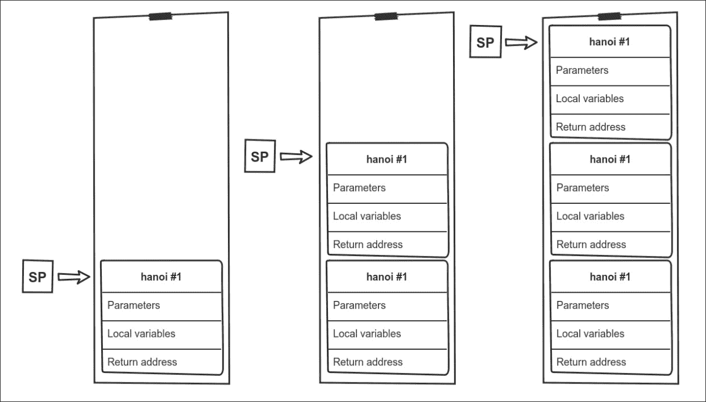
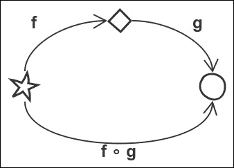

# 第 7 章功能技术和主题

我们已经介绍了与函数式编程相关的基本技术。但是，正如你可能想象的那样，还有很多话题要讨论。在本章中，您将了解其中的一些模式和想法。

如果您想了解更多信息，将深入讨论一些主题，其他主题将与指向外部资源的指针一起提及。由于这是一本介绍 PHP 函数式编程的入门书，因此最先进的思想已经超出了范围。然而，如果你在某处遇到一篇关于这样一个主题的文章，你应该有足够的理解力，至少要抓住它的要点。

本章各节不一定相互关联。有些内容对您来说可能是新颖的，有些内容与前面介绍的摘录相关联。

在本章中，我们将介绍以下主题：

*   类型系统、类型签名及其用途
*   无点样式
*   使用`const`关键字方便匿名函数使用
*   递归、堆栈溢出和蹦床
*   模式匹配
*   类型类
*   代数结构与范畴论
*   单子变压器
*   镜头

# 型系统

免责声明：我无意在静态和动态打字爱好者之间引发争吵。讨论哪一个更好，为什么不是这本书的目标，我会让你们每个人决定你们喜欢什么。如果你感兴趣，我可以推荐阅读[http://pchiusano.github.io/2016-09-15/static-vs-dynamic.html](http://pchiusano.github.io/2016-09-15/static-vs-dynamic.html) ，这是一个很好的总结，即使有点偏向于静态类型。

也就是说，类型和类型系统是函数式编程中的一个重要主题，即使语言没有强制执行这些类型。函数签名的类型是一种元语言，能够就函数的目的进行简洁有效的交流。

正如我们将看到的，明确声明函数的输入和输出的预期类型是其文档的一个重要部分。它不仅允许您跳过函数代码的阅读，从而减轻了认知负担，还允许您推断发生了什么事情的重要事实，并推导出*自由定理*。

## Hindley-Milner 型系统

欣德利·米尔纳，也被称为达马斯·米尔纳或达马斯·欣德利·米尔纳，来自最早提出这一理论的人的名字，是一种类型系统。类型系统是一组规则，用于定义变量或参数的类型以及不同类型之间的交互方式。

Hindley Milner 的主要特征之一是它允许类型推断。这意味着您通常不必显式定义类型；它可以从其他来源（如上下文或周围元素的类型）推断出来。确切地说，类型推断是由一种称为**算法 W**的算法完成的，它与 Hindley-Milner 类型系统相关，但与之不同。

它还允许多态性；这意味着，如果有一个函数返回列表的长度，则不需要知道列表元素的类型，因为这与计算无关。这是一个类似于泛型的想法，你可以在 C++或 java 中找到，但不完全相同，因为它更强大。

大多数静态类型的函数式语言，如 Haskell、**OCaml**和**F#**使用 Hindley Milner 作为其类型系统，通常带有扩展来管理一些边缘情况。Scala 以使用自己的类型系统而著名。

除了关于类型系统的理论，还有一种普遍接受的方法来描述函数的输入和输出参数，这就是我们在这里感兴趣的。它与 PHP 中可以使用的类型提示有很大的不同，当该语言不使用这种特定语法时，它通常会放在函数顶部的注释中。现在我们将这种类型注释称为函数的*类型签名*。

## 类型签名

作为第一个简单的示例，我们将从`strtoupper`和`strlen`PHP 函数的类型签名开始：

```php
// strtoupper :: string -> string 
// strlen :: string -> int 

```

理解起来非常简单：我们从函数名开始，然后是参数的类型、箭头和返回值的类型。

有多个参数的函数呢？考虑以下事项：

```php
// implode :: string -> [string] -> string 

```

为什么有多个箭头？如果你想咖喱，这可能会帮助你得到答案。如果我们使用括号编写相同的函数签名，这可能会进一步帮助您：

```php
// implode :: string -> ([string] -> string) 

```

基本上，我们有一个函数，它接受`string`类型并返回一个新函数，该函数接受一个字符串数组并返回一个字符串。最右边的类型始终是返回值的类型。所有其他类型都是按顺序排列的各种参数。括号用于表示函数。让我们看看更多参数的效果：

```php
// number_format :: float -> (int -> (string -> (string -> string))) 

```

或不带括号：

```php
// number_format :: float -> int -> string -> string -> string 

```

我不知道你的意见是什么，但我个人更喜欢后者，因为它噪音较小，一旦你习惯了，括号就不会带来太多信息。

如果您熟悉`number_format`函数，您可能已经注意到我建议的类型签名包含所有参数，甚至包括可选参数。这是因为没有标准的方法来传递这些信息，因为函数式语言通常不允许这样的参数。然而，Haskell 有一个`Optional`数据类型用于模拟这种情况。记住这些信息后，带有默认值的参数有时会显示如下：

```php
// number_format :: float -> Optional int -> Optional string -> Optional string -> string 

```

这工作得相当好，并且是不言自明的，直到您有了一个称为`Optional`数据类型的类型。也没有通用的方法来表示默认值是什么。

据我所知，没有办法传达函数接受可变数量参数的信息。由于 PHP7.0 为此引入了一种新的语法，我建议在本书的其余部分使用这种语法：

```php
// printf :: string -> ...string -> int 

```

我们在前面看到，括号用于表示函数的概念，但出于可读性原因，通常不使用括号。但是，当使用函数作为参数时，情况并非如此。在这种情况下，我们需要保留函数期望或返回另一个函数的信息：

```php
// array_reduce :: [a] -> (b -> a -> b) -> Optional a -> b 
// array_map :: (a -> b) -> ...[a] -> [b] 

```

你可能会问自己，`a`和`b`变量是什么？这就是我们前面讨论的多态性特性。`array_reduce`和`array_map`函数并不关心数组中包含的元素的实际类型，它们不需要知道这些信息来执行它们的工作。我们本可以像前面使用`printf`方法一样使用`mixed`函数，但这样我们就会丢失一些有用的数据。

`a`变量是某种类型，`b`变量是另一种类型，也可以是相同的。像`a`和`b`这样的变量有时被称为**型变量**。这些类型签名所说的是，我们有一个具有特定类型（类型`a`）的值数组，一个函数接受这样一个值并返回另一个类型（类型`b`）的值数组；显然，最终值与回调函数的值相同。

名称`a`和`b`是一种约定，但您可以随意使用任何您想要的名称。在某些情况下，使用较长的名称或特定的字母可能有助于传达更多信息。

### 注

如果您无法理解`array_reduce`函数的签名，这是完全正常的。您还不熟悉语法。让我们试着一个接一个地接受这些论点：

*   包含`a`类型元素的数组
*   函数，获取类型`b`（累加器），类型`a`（当前值），返回类型`b`（新累加器内容）
*   与数组元素类型相同的可选初始值
*   返回值的类型为`b`，与累加器的类型相同

这个签名没有告诉我们的是`a`和`b`的确切类型。我们关心的是，`b`可以是一个数组本身，一个类，一个布尔值，真的可以是任何东西。`a`和`b`类型也可以是同一类型。

您还可以有一个唯一的类型变量，如`array_filter`函数：

```php
// array_filter :: (a -> bool) -> [a] -> [a] 

```

由于类型签名只使用`a`类型，这意味着输入数组和返回数组中的元素将具有完全相同的类型。由于`a`类型不是特定类型，因此此类型签名还通知我们`array_filter`函数适用于所有类型，这意味着它无法转换值。列表中的元素只能重新排列或过滤。

类型签名的最后一个特性是，您可以缩小给定类型变量的可能类型。例如，您可以指定某个类型`m`应该是给定类的子类：

```php
// filterM :: Monad m => (a -> m Bool) -> [a] -> m [a] 

```

我们刚刚引入了一个新的双箭头符号。您总是在类型签名的开始时找到它，而不是在中间签名。这意味着前面的内容定义了某种特殊性。

在本例中，我们将`m`类型变量约束为`Monad`类的后代。这允许我们声明，`filterM`方法首先将返回包含在 monad 中的布尔值的函数作为第一个参数，其返回值将包含在同一个 monad 中。

如果愿意，可以指定多个约束。如果我们设想有两种类型，`TypeA`和`Typeb`类型，我们可以有以下类型签名：

```php
// some_function :: TypeA a TypeB b => a -> b -> string 

```

仅通过查看类型签名不清楚此函数的作用，但我们知道它需要一个`TypeA`类型的实例和一个`TypeB`类型的实例。返回值将是一个字符串，显然是基于参数的计算结果。

在这种情况下，我们不能做出与`array_filter`方法相同的假设，即不会发生转换，因为我们对类型变量有约束。我们的函数可能非常了解如何对数据进行操作，因为它们是某个类型或其子类型的实例。

我知道有很多东西需要考虑，但正如前面的`array_reduce`函数示例所证明的，类型签名允许我们以简洁的方式编码大量信息。它们也比 PHP 类型提示更精确，例如，它们允许我们说，`array_map`方法可以从一种类型转换为另一种类型，而`array_filter`方法将在数组中维护类型。

如果您仔细阅读了`php-functional`库的代码，您可能已经注意到作者在大多数函数的 doc 块中使用了这样的类型签名。您还将发现其他一些函数库也这样做，例如，这种习惯也在 JavaScript 世界中传播。

## 自由定理

类型签名不仅让我们深入了解函数的功能，还让我们能够根据类型信息推导出有用的定理和规则。这些被称为**自由定理**，因为它们带有类型签名是免费的。这个想法是由 Philip Walder 在《免费定理》一文中提出的！1989 年出版。

通过使用自由定理，我们可以确认以下内容：

```php
// head :: [a] -> a 
// map :: (a -> b) -> [a] -> [b] 
head(map(f, $x)) == f(head($x) 

```

这对你来说似乎是显而易见的，你需要运用一些常识，知道函数的作用，但是计算机缺乏常识。因此，为了优化等式的左边到右边，我们的编译器或解释器必须依赖自由定理来实现。

类型签名如何证明这个定理？还记得我们说过类型`a`是我们的函数不知道的泛型类型吗？因此，它们无法修改数组中的值，因为这样的泛型函数不存在。唯一知道如何转换某物的函数是`f`，因为它需要符合 map 强制的`(a -> b)`类型签名。

由于 nor`head`或`map`函数修改了元素，我们可以推断，首先应用函数，然后使用第一个元素与使用第一个元素，然后使用函数完全相同。只有第二条路要快得多：

```php
// filter :: (a -> Bool) -> [a] -> [a] 
map(f, filter(compose(p, f), $x)) === filter(p, map(f, $x)) 

```

更复杂的是，这个自由定理说，如果你的谓词需要一个使用函数`f`转换的值，然后你在结果上应用`f`函数，这与首先将`f`应用于所有元素，然后过滤完全相同。同样，我们的想法是通过只应用`f`一次而不是两次来优化性能。

当将函数组合在一起或逐个调用它们时，请尝试查看类型签名，看看是否无法通过推导一些自由定理来改进代码。

Haskell 用户甚至在[有一个免费的定理生成器供其使用 http://www-ps.iai.uni-bonn.de/cgi-bin/free-theorems-webui.cgi](http://www-ps.iai.uni-bonn.de/cgi-bin/free-theorems-webui.cgi) 。

## 结束语

类型签名给表格带来了很多东西，你可以找到基于它们的函数搜索引擎。网站如[https://www.haskell.org/hoogle/](https://www.haskell.org/hoogle/) 和[http://scala-search.org/](http://scala-search.org/) 允许您仅根据函数的类型签名搜索函数。

在使用函数技术时，通常情况下，您的数据具有特定的结构，需要将其转换为其他结构。由于大多数函数都是完全通用的，所以要找到合适的关键字来搜索您要查找的内容通常很复杂。这也是类型签名和搜索引擎如**Hoogle**派上用场的地方。只需输入输入的类型结构、输出的所需类型，并仔细阅读搜索引擎返回的函数列表。

PHP 是一种动态类型化语言，只是最近才引入了标量类型，围绕类型签名的有用工具显然还不存在。但也许人们会想出一些办法只是时间问题。

# 无点式

无点编程风格，也称为默契编程，是一种编写函数的方式，其中不显式定义参数或点，因此得名。根据语言的不同，可以在不同级别上应用此特定样式。没有已识别参数的函数怎么可能存在？通过使用函数合成或咖喱。

事实上，在本书中，我们已经做过一些无点风格的编程。让我们用[第四章](04.html "Chapter 4. Composing Functions")*组合函数*中的一个例子来说明它是关于什么的：

```php
<?php 
// traditional 
function safe_title(string $s) 
{ 
    return strtoupper(htmlspecialchars($s)); 
} 

// point-free 
$safe_title = compose('htmlspecialchars', 'strtoupper'); 

```

第一部分是一个传统函数，在其中声明输入参数。然而，在第二种情况下，您看不到显式的参数声明；您依赖于组合函数的定义。第二个函数称为无点式。

PHP 语法迫使我们将组合函数或 curryed 函数分配给变量，但在其他一些语言中没有这样明确的分隔。以下是 Haskell 中的三个示例：

```php
-- traditional 
sum (x:xs) = x + sum xs 
sum [] = 0 

-- using foldr 
sum xs = foldr (+) 0 xs 

-- point-free 
sum = foldr (+) 0 

```

正如我们所看到的，函数定义的结构在这三种情况下是相同的。第一个问题是如何定义不使用折叠的`sum`方法。第二个例子承认我们可以简单地折叠数据，但仍然保持显式声明参数。最后，最后一个示例是无点的，因为所有参数都没有跟踪。

与 PHP 相比，函数和变量之间的差异更为细微的另一种语言是 JavaScript。事实上，所有函数都是变量，因为变量没有特殊语法，所以传统函数和分配给变量的匿名函数之间没有区别：

```php
// traditional 
function snakeCase(word) { 
    return word.toLowerCase().replace(/\s+/ig, '_'); 
}; 

// point-free 
var snakeCase = compose(replace(/\s+/ig, '_'), toLowerCase); 

```

显然，这不是有效的 JavaScript，因为没有本机的`compose`函数，而且两个处理字符串的函数不能像这样简单地调用。但是，有多个库允许您轻松地编写此类代码，例如我极力推荐的**Ramda**。这个例子的目的只是要说明，在 JavaScript 中，您无法区分传统函数和匿名函数，PHP 就是这样。

使用这种样式有一些好处：

*   你通常有一个更简洁的代码，其中一些代码更干净，更容易阅读。
*   它有助于抽象思维。JavaScript 示例中的参数名`word`提示该函数只能处理单个单词，而它可以处理任何字符串。这对于更通用的函数尤其如此，例如那些处理列表的函数。
*   它帮助开发人员从函数组合而不是数据结构的角度进行思考，这通常会产生更好的代码。

然而，也存在一些可能的缺点：

*   从定义中删除明确的参数可能会使事情更难理解；例如，没有参数名有时会删除有用的信息。
*   组合函数的长链可能导致忽略数据结构和类型。
*   代码可能更难维护。当您有一个显式函数时，您可以轻松地添加新行、调试等。当函数组合在一起时，这几乎是不可能的。

一些范式的反对者有时使用术语*无意义风格*来描述这些问题导致的这种技术。

阅读和使用无点代码肯定需要一些时间来适应。我个人对此没有强烈的意见。我建议你使用最适合你的风格，而且，即使你更喜欢其中一种，也有另一种可能更好的情况，所以不要犹豫将两者混合使用。

作为结束语，我想提醒您，“参数顺序非常重要！”正如我们在[第 4 章](04.html "Chapter 4. Composing Functions")、*组合函数*中所讨论的。如果您想使用无点样式，这一点尤其正确。如果需要处理的数据不是最后一个参数，您将无法处理。

# 对函数使用常量

这种技术与函数式编程无关，而是 PHP 本身的一种巧妙技巧。不过，这可能会对你有很大帮助，所以我们开始吧。

如果您看过`functional-php`库的代码，您可能已经注意到，几乎所有函数的顶部都有常量的定义。下面是一个小例子：

```php
<?php 
const push = 'Widmogrod\Functional\push'; 

function push(array $array, array $values) 
{ 
    // [...] 
} 

```

这背后的想法是允许更简单地使用函数作为参数。我们前面已经看到，将函数或方法作为参数传递的方式是使用一个名为`callable`的东西，它通常是由对象实例和方法调用的字符串组成的方法的字符串或数组。

使用`const`关键字可以让我们拥有更类似于语言的东西，在这些语言中，函数不是独立于变量的构造：

```php
<?php const increment = 'increment'; 

function increment(int $i) { return $i + 1; } 

// using a 'callable' 
array_map('increment' [1, 2, 3, 4]); 

// using our const 
array_map(increment, [1, 2, 3, 4]); 

```

退出函数名周围的笨拙引号。看起来您实际上是在传递函数本身，在其他语言（如 Python 或 JavaScript）中也是如此。

如果您使用的是 IDE，它会变得更好。您可以使用*Go to declaration*或等效函数，您定义`const`的文件将在定义该`const`的行上打开。如果您在*real*函数的顶部或底部声明它，您将可以快速访问它的定义。

我不知道，某些 IDE 可能以字符串的形式为`callable`提供相同的功能，但至少我正在使用的 IDE 不是这样。而在第二个例子中，如果我按下*Ctrl*并点击`increment`函数，它会关注`const`声明，这是一个实时的节省程序。

当声明这样的常量时，您不仅限于影子函数；它也适用于静态对象方法。您还可以使用**DocBlock**注释来声明您的常量表示`callable`类型：

```php
<?php 
class A { 
    public static function static_test() {} 
    public function test() {} 
} 

/** @var callable */ 
const A_static = ['A', 'static_test']; 

```

遗憾的是，对于存储在变量中的匿名函数或对对象实例调用方法，这种技巧不起作用。如果您尝试这样做，PHP 将以响亮的`Warning: Constants may only evaluate to scalar values or arrays`警告来满足您。

虽然这不是一个银弹，也有一些限制，但如果您使用 IDE，这项小技术将帮助您编写更干净、更易于导航的代码。

# 递归、堆栈溢出和蹦床

我们首先在[第 3 章](03.html "Chapter 3.  Functional Basis in PHP")、*PHP*中的函数基础中介绍了递归作为编程问题的可能解决方案。暗示了一些记忆并发症；现在是进一步调查这些问题的时候了。

## 尾声

对函数的调用是返回值之前的最后一个语句，称为**尾部调用**。让我们看一些例子来了解它的含义：

```php
<?php 
function simple() { 
    return strtoupper('Hello!'); 
} 

```

毫无疑问，这是一个尾声。函数的最后一条语句返回`strtoupper`函数的结果：

```php
<?php 

function multiple_branches($name) { 
    if($name == 'Gilles') { 
        return strtoupper('Hi friend!'); 
    } 
    return strtoupper('Greetings'); 
} 

```

在这里，`strtoupper`函数的两个调用都是尾部调用。函数内部的位置无关紧要；重要的是调用函数后是否进行了任何类型的操作。在我们的例子中，如果参数值是`Gilles`，那么函数要做的最后一件事就是调用`strtoupper`函数，使其成为尾部调用：

```php
<?php 
function not_a_tail_call($name) { 
    return strtoupper('Hello') + ' ' + $name; 
} 

function also_not_a_tail_call($a) { 
    return 2 * max($a, 10); 
} 

```

这两个函数都没有尾部调用。在这两种情况下，调用的返回值用于在函数返回之前计算最终值。操作顺序并不重要，解释器需要首先获得`strtoupper`和`max`函数的值才能计算结果。

正如我们刚才看到的，发现尾部呼叫并不总是容易的。在一个很长函数的前几行中可以有一个，而在最后一行并不是一个充分的标准。

如果尾部调用是对函数本身进行的，或者换句话说，它是一个递归调用，则通常使用术语**尾部递归**。

## 尾部呼叫消除

你为什么要自问呢？因为编译器和解析器可以执行所谓的尾部调用消除（tail call elimination）或有时简称为**尾部调用优化**（**TCO**）。

程序没有执行新的函数调用并承受所有相关开销，而是直接跳转到下一个函数，而不会向堆栈中添加更多信息，也不会浪费传递参数的宝贵时间。

这在尾部递归的情况下尤其重要，因为它允许堆栈保持平坦，不使用比第一次函数调用更多的内存。

听起来不错，但与大多数高级编译技术一样，PHP 引擎不实现尾部调用消除。但是，其他语言有：

*   任何符合**ECMAScript**6 的 JavaScript 引擎
*   安装 tco 模块后的 Python
*   Scala，如果您的方法不是尾部递归的，您甚至有一个注释（`@tailrec`）来触发编译器错误
*   **长生不老药**
*   **Lua**
*   **Perl**
*   哈斯克尔

在**Java 虚拟机**（**JVM**）级别，也有正在进行的建议和工作来执行尾部调用消除，但到目前为止，Java 8 中还没有具体的实现，因为这不被视为优先功能。

尾部递归函数通常更容易使用，尤其是在折叠方面；正如我们在本节中所看到的，现有技术以牺牲一些处理能力为代价来缓解不断增长的堆栈问题。

## 从递归到尾部递归

现在，我们对所讨论的内容有了更清晰的理解，让我们学习如何将递归函数转换为尾部递归函数（如果不是这样的话）。

在[第 3 章](03.html "Chapter 3.  Functional Basis in PHP")、*PHP*函数基础中，我们拒绝将阶乘计算作为一个好的递归示例，但由于它可能是可以编写的最简单的递归函数，我们将从该示例开始：

```php
<?php 
function fact($n) 
{ 
    return $n <= 1 ? 1 : $n * fact($n - 1); 
} 

```

这个函数是递归的吗？不，我们用递归调用`fact`方法的结果乘以一个值。让我们更详细地了解各个步骤：

```php
fact(4) 
4 * fact(3) 
4 * 3 * fact(2) 
4 * 3 * 2 * fact(1) 
4 * 3 * 2 * 1 
-> 24 

```

知道我们如何将其转换为尾部递归函数吗？在进一步阅读之前，花些时间玩转一些想法。如果您需要提示，请考虑用于折叠的函数是如何操作的。

对于尾部递归，通常的答案是使用累加器：

```php
<?php 
function fact2($n) 
{ 
    $fact = function($n, $acc) use (&$fact) { 
        return $n <= 1 ? $acc : $fact($n - 1, $n * $acc); 
    }; 

    return $fact($n, 1); 
} 

```

在这里，我们使用一个内部助手来隐藏累加器的实现细节，但是我们可以使用一个独特的函数来编写它：

```php
<?php 

function fact3($n, $acc = 1) 
{ 
    return $n <= 1 ? $acc : fact3($n - 1, $n * $acc); 
} 

```

让我们再次看一下步骤：

```php
fact(4) 
fact(3, 4 * 1) 
fact(2, 3 * 4) 
fact(1, 2 * 12) -> 24 

```

很好，在每次递归调用后不再有挂起的操作；我们确实有一个尾部递归函数。我们的`fact`功能非常简单。我们之前写的河内*塔*解算器呢？在这里，您不必搜索它：

```php
<?php 
function hanoi(int $disc, string $source, string $destination,  string $via) 
{ 
    if ($disc === 1) { 
        echo("Move a disc from the $source rod to the $destination  rod\n"); 
    } else { 
        // step 1 : move all discs but the first to the "via" rod 
        hanoi($disc - 1, $source, $via, $destination); 
        // step 2 : move the last disc to the destination 
        hanoi(1, $source, $destination, $via); 
        // step 3 : move the discs from the "via" rod to the  destination 
        hanoi($disc - 1, $via, $destination, $source); 
    } 
} 

```

就像我们的阶乘计算一样，自己花点时间尝试将函数转换为尾部递归函数：

```php
<?php 
use Functional as f; 

class Position 
{ 
    public $disc; 
    public $src; 
    public $dst; 
    public $via; 

    public function __construct($n, $s, $d, $v) 
    { 
        $this->disc = $n; 
        $this->src = $s; 
        $this->dst = $d; 
        $this->via = $v; 
    } 
} 

function hanoi(Position $pos, array $moves = []) 
{ 
    if ($pos->disc === 1) { 
        echo("Move a disc from the {$pos->src} rod to the {$pos- >dst} rod\n"); 

        if(count($moves) > 0) { 
            hanoi(f\head($moves), f\tail($moves)); 
        } 
    } else { 
        $pos1 = new Position($pos->disc - 1, $pos->src, $pos->via,  $pos->dst); 
        $pos2 = new Position(1, $pos->src, $pos->dst, $pos->via); 
        $pos3 = new Position($pos->disc - 1, $pos->via, $pos->dst,  $pos->src); 

        hanoi($pos1, array_merge([$pos2, $pos3], $moves)); 
    } 
} 
hanoi(new Position(3, 'left', 'right', 'middle')); 

```

如您所见，解决方案非常相似，即使函数中有多个递归调用，我们仍然可以使用累加器。诀窍是使用数组，而不是只存储当前值。在大多数情况下，累加器将是一个**堆栈**，这意味着您只能在开始时添加元素，然后从开始时删除它们。堆栈被称为**后进先出**（**后进先出**结构。

如果您不太明白这种重构的工作原理，我建议您为这两种变体写下步骤，就像我们为`fact`方法所做的那样，这样您就可以更好地理解所涉及的机制。

事实上，花时间写下递归算法的步骤通常是一个很好的方法，可以清楚地了解发生了什么，以及如何将其重构为尾部递归或修复存在的 bug。

## 堆栈溢出

我们使用堆栈式数据结构作为尾部递归 Hanoi 解算器的事实并非巧合。当您调用函数时，所有需要的信息也存储在内存中类似堆栈的结构中。在递归的情况下，它将如下所示：



此堆栈的大小有限。它通过`memory_limit`配置选项进行绑定，即使您取消了限制，也无法超出系统中的可用内存。此外，诸如**Xdebug**之类的扩展引入了特定的机制，以避免嵌套递归调用过多。例如，您有一个名为`xdebug.max_nesting_level`的配置选项，默认值为 256，这意味着如果递归调用函数的次数超过 256 次，将引发错误。

如果 PHP 执行尾部调用优化，则调用将替换堆栈中的当前信息，而不是将函数信息堆叠在一起。这样做是安全的，因为尾部调用的最终结果不依赖于函数的任何局部变量。

由于 PHP 不执行这种优化，我们需要找到另一种解决方案来避免炸毁堆栈。如果您遇到这个问题，并且愿意牺牲一些处理能力来限制内存使用，您可以使用**蹦床**。

## 蹦床

避免堆栈增长的唯一方法是返回一个值，而不是调用一个新函数。该值可以保存执行新函数调用所需的信息，该调用将继续计算。这也意味着我们需要函数调用方的一些合作。

这个有帮助的来电者是蹦床，下面是它的工作原理：

*   蹦床调用我们的函数`f`
*   `f`函数不进行递归调用，而是返回封装在数据结构中的下一个调用，其中包含所有参数
*   蹦床提取信息并对`f`函数执行新的调用
*   重复最后两个步骤，直到`f`函数返回*实*值
*   蹦床收到一个值并返回给*真实*调用者

这些步骤还应该解释技术的名称来自何处，每次函数返回到蹦床时，它都会用下一个参数反弹回来。

为了执行这些步骤，我们需要一个数据结构，其中包含以`callable`形式调用的函数和参数。我们还需要一个 helper 函数，该函数将继续调用存储在数据结构中的任何内容，直到它得到一个实际值：

```php
<?php 
class Bounce 
{ 
    private $f; 
    private $args; 

    public function __construct(callable $f, ...$args) 
    { 
        $this->f = $f; 
        $this->args = $args; 
    } 

    public function __invoke() 
    { 
        return call_user_func_array($this->f, $this->args); 
    } 
} 

function trampoline(callable $f, ...$args) { 
    $return = call_user_func_array($f, $args); 

    while($return instanceof Bounce) { 
        $return = $return(); 
    } 
    return $return; 
} 

```

很简单，让我们试试：

```php
<?php 

function fact4($n, $acc = 1) 
{ 
    return $n <= 1 ? $acc : new Bounce('fact4', $n - 1, $n *  $acc); 
} 

echo trampoline('fact4', 5) 
// 120 

```

工作正常，代码也不难阅读。然而，当使用蹦床时，有一个性能冲击。在计算阶乘的情况下，在我的笔记本电脑上蹦床的速度大约慢五倍。解释这一点的原因是，解释器需要做的工作比简单地调用下一个函数多得多。

知道了这一点，如果递归算法有一个绑定深度，并且您确信没有堆栈溢出的风险，我建议您只执行传统的递归，而不是使用蹦床。但是，如果有疑问，请不要犹豫，因为堆栈溢出错误可能对生产系统至关重要。

### 多步递归

蹦床甚至对执行不完全尾呼消除的语言有用。例如，当涉及两个函数时，Scala 无法执行这样的优化。与其试图解释我在说什么，不如让我们看一些代码：

```php
<?php 

function even($n) { 
    return $n == 0 ? 'yes' : odd($n - 1); 
} 

function odd($n) { 
    return $n == 0 ? 'no' : even($n - 1); 
} 

echo even(10); 
// yes 

echo odd(10); 
// no 

```

这可能不是确定一个数字是奇数还是偶数的最佳和最有效的方法，但它的优点是可以简单地说明我所说的。这两个函数都在调用自己，直到数字达到 0，这时我们可以决定它是奇数还是偶数。

取决于您询问的对象，这可能是递归，也可能不是递归。它尊重我们在[第 3 章](03.html "Chapter 3.  Functional Basis in PHP")中给出的学术定义，PHP 中的*函数基础：*

> *递归是将问题划分为同一问题的较小实例的思想。*

然而，函数本身并不调用，所以这就是为什么有些人会试图用其他术语来定义这里发生的事情。最后，我们所说的一切都无关紧要；我们将有一个大数字上的堆栈溢出。

正如我所说的，Scala 执行不完整的尾部调用消除，因为它只有在函数调用自己作为其最后一条指令时才会这样做，从而导致像 PHP 一样的堆栈溢出错误。这就是为什么蹦床甚至在一些函数式语言中也被使用的原因。

作为一个真正简单的练习，我邀请您使用蹦床重写`odd`和`even`函数。

### 蹦床图书馆

如果您想在自己的项目中使用 trampolines，我邀请您使用`composer`命令安装以下库，因为与我们的原始实现相比，它提供了一些帮助：

```php
composer require functional-php/trampoline

```

数据结构和特性已在名为`Trampoline`的同一类中合并。助手以功能的形式提供：

*   `bounce`助手用于创建新的函数包装器。它需要一个`callable`和参数。
*   `trampoline`助手运行一个可调用函数，直到完成。它需要一个`callable`及其参数。该方法还接受一个`Trampoline`类实例作为参数，但在这种情况下，参数将被忽略，因为它们已经包装在实例中。

该类还定义了`__callStatic`，它允许我们直接从该类的全局名称空间调用任何函数。

以下是文件中的一些示例：

```php
<?php 

use FunctionalPHP\Trampoline as t; 
use FunctionalPHP\Trampoline\Trampoline; 

function factorial($n, $acc = 1) { 
    return $n <= 1 ? $acc : t\bounce('factorial', $n - 1, $n * $acc); 
}; 

echo t\trampoline('factorial', 5); 
// 120 

echo Trampoline::factorial(5); 
// 120 

echo Trampoline::strtoupper('Hello!'); 
// HELLO! 

```

还存在另一个在所有蹦床功能打开的情况下返回 callable 的助手，称为`trampoline_wrapper`助手：

```php
<?php 
$fact = t\trampoline_wrapper('factorial'); 

echo $fact(5); 
// 120 

```

作为练习，您可以尝试将我们的*河内塔*解算器转换为使用`trampoline`库，看看是否得到相同的结果。

## 替代方法

与使用蹦床来解决堆栈溢出问题不同，还可以使用队列来存储对函数的连续递归调用的所有参数。

原始函数需要包装在一个 helper 中，该 helper 将保存队列并使用链中的所有参数调用原始函数。为了使其工作，需要对包装器进行递归调用：

*   创建包装器函数
*   使用第一个参数首次调用包装器
*   当队列中有参数时，包装器进入一个调用原始函数的循环
*   对包装器的每个后续调用都会向队列中添加参数，而不是调用原始函数
*   循环完成后（即，所有递归调用都已完成），包装器将返回最终值

为了让它工作，在进行递归调用时，原始函数调用包装器是非常重要的。这可以通过使用包装函数内部使用的匿名函数或使用`Closure`类上的`bindTo`方法来实现，正如我们在[第 1 章](01.html "Chapter 1. Functions as First Class Citizens in PHP")中所讨论的，*函数作为 PHP*中的一等公民。

`trampoline`库使用后一种技术实现了此方法。以下是如何使用它而不是蹦床：

```php
<?php 

use FunctionalPHP\Trampoline as t; 

$fact = T\pool(function($n, $acc = 1) { 
    return $n <= 1 ? $acc : $this($n - 1, $n * $acc); 
}); 

echo $fact(5); 
// 120 

```

由`pool`函数创建的包装器将`Pool`类的一个实例绑定到`$this`。这个类有一个`__invoke`方法，它可以在原始函数中调用。这样做会再次调用包装器，但这次它会将参数添加到队列中，而不是调用原始函数。

从性能的角度来看，这种方法和蹦床没有区别，两者的性能应该大致相同。但是，您不能使用`pool`函数进行多步骤递归，因为包装器只知道一个函数。

此外，在 PHP7.1 发布之前，由于将字符串形式的可调用函数转换为`Closure`类的实例以将该类绑定到该类时存在一些困难，因此该方法也仅限于匿名函数。PHP7.1 将在`Closure`上引入一个新的`fromCallable`方法，允许取消此限制。

## 结束语

最后请注意，我们所看到的用于解决堆栈溢出问题的蹦床和队列技术只有在递归函数是尾部递归的情况下才有效。这是一个强制条件，因为函数需要完全返回才能让助手继续计算。

此外，由于蹦床方法的缺点较少，我建议使用这种方法而不是`pool`函数实现。

# 模式匹配

模式匹配是大多数函数式语言非常强大的功能。它被嵌入语言的各个层次。例如，在 Scala 中，您可以将其用作增强的`switch`语句，而在 Haskell 中，它是函数定义的一个组成部分。

模式匹配是根据模式检查一系列标记的过程。它不同于模式识别，因为匹配需要精确。该过程不仅与 switch 语句匹配，还与 PHP 中的`list`构造一样分配值，该过程称为**解构赋值**。

不要将它与正则表达式混淆。正则表达式只能对字符串的内容进行操作，而 as 模式匹配也可以对数据的结构进行操作。例如，可以根据数组的元素数进行匹配。

让我们看看 Haskell 中的一些示例，以便对其有所了解。模式匹配的最简单形式是匹配特定值：

```php
fact :: (Integral a) => a -> a 
fact 0 = 1 
fact n = n * fact (n-1) 

```

这就是在 Haskell 中定义`fact`函数的方法：

*   第一行是类型签名，它应该提醒您我们在本章前面看到的内容；`Integral`是一种比`Integer`类型限制性稍小的类型，无需输入详细信息。
*   如果参数的值为 0，则第二行是函数体。
*   最后一行在所有其他情况下执行。该值被分配给`n`变量。

如果您对某些值不感兴趣，可以使用`_`（下划线）通配符模式忽略它们。例如，您可以轻松定义函数以从元组中获取第一个、第二个和第三个值：

```php
first :: (a, b, c) -> a 
first (x, _, _) = x 

second :: (a, b, c) -> b 
second (_, y, _) = y 

third :: (a, b, c) -> c 
third (_, _, z) = z 

```

### 注

元组是一种具有固定数量元素的数据结构，而数组可以改变大小。`(1, 2)`和`('a', 'b')`元组的大小都是 2。当元素数量已知时，使用元组优于数组的优点在于强制执行正确的大小和性能。

Haskell、Scala、Python、C#和 Ruby 等语言的核心或标准库中都有元组类型。

可以将值分解为多个变量。为了理解以下示例，您需要知道“`:`”（冒号）是将元素前置到列表中的运算符。这意味着`1:[2, 3]`元组将返回列表`[1, 2, 3]`：

```php
head :: [a] -> a 
head [] = error "empty list" 
head (x:_) = x 

tail :: [a] -> [a] 
tail [] = error "empty list" 
tail (_:xs) = xs 

sum :: (Num a) => [a] -> a 
sum [] = 0 
sum (x:xs) = x + sum xs 

```

`head`和`tail`变量具有相同的结构，如果列表为空，则返回错误。否则返回`x`，它是列表开头的元素，或者返回`xs`，它是列表的其余部分。`sum`变量也类似，但它同时使用`x`和`xs`。顺便说一下，Haskell 不允许定义这两个函数，因为它们已经存在：

```php
firstThree :: [a] -> (a, a, a) 
firstThree (x:y:z:_) = (x, y, z) 
firstThree _ = error "need at least 3 elements" 

```

`firstThree`变量有点不同。它首先尝试将列表与至少三个元素匹配，`x`、`y`和`z`。在这种情况下，`_`模式可以是空列表，也可以不是空列表，模式将匹配。如果不成功，我们知道列表中的元素少于三个，并显示一个错误。

您还可以将模式匹配用作增强的 switch 语句。例如，这也是`head`的有效实现：

```php
head :: [a] -> a 
head xs = case xs of []    -> error "empty lists" 
(x:_) -> x 

```

如果要同时使用解构数据和整个值，可以使用**作为模式**：

```php
firstLetter :: String -> String 
firstLetter "" = error "empty string" 
firstLetter all@(x:_) = "The first letter of " ++ all ++ " is " ++ [x] 

```

最后，在进行模式匹配时，还可以使用构造函数。下面是一个使用`Maybe`类型的小示例：

```php
increment :: Maybe Int -> Int 
increment Nothing = 0 
increment (Just x) = x + 1 

```

是的，你可以在单子里面得到值，就像那样，使用解构。

你可以有重叠的图案；Haskell 将使用第一个匹配的。如果找不到匹配的，则会出现一个错误，显示为`Non-exhaustive patterns in function XXX`。

我们可以为 Scala、Clojure 或其他函数式语言演示大致相同的功能，但由于这只是一个了解模式匹配的示例，如果您对该主题感兴趣，我建议您阅读有关该主题的教程。相反，我们将尝试在 PHP 中模拟这一强大功能的一部分。

## PHP 中的模式匹配

显然，我们永远无法像在 Haskell 中看到的那样声明函数，因为这需要在语言的核心实现。但是，库会尝试尽可能地模拟模式匹配，以创建具有自动解构功能的更强大版本的 switch 语句。

您可以使用 Composer 中的`composer`命令安装库：

```php
composer require functional-php/pattern-matching

```

为了尽可能表达 Haskell 中可用的内容，它使用字符串来保存模式。以下是定义各种可能语法的表格：

<colgroup><col> <col> <col></colgroup> 
| 

名称

 | 

总体安排

 | 

实例

 |
| --- | --- | --- |
| 常数 | 任意标量值（整数、浮点、字符串、布尔值） | `1.0`、`42`“测试” |
| 变量 | 标识符 | `a`、`name`、`anything` |
| 大堆 | [<pattern>，<pattern></pattern></pattern> | `[]`、`[a]`、`[a, b, c]` |
| 欺骗 | （标识符：列表标识符） | `(x:xs)`、`(x:y:z:xs)` |
| 通配符 | _ | _ |
| 像 | 标识符@（<pattern>）</pattern> | 所有@（x:xs） |

在撰写本文时，不支持在 Monad 或其他类型中自动分解值，也不支持约束我们匹配的特定项的类型。然而，关于这两个特性[还有一些尚未解决的问题 https://github.com/functional-php/pattern-matching/issues](https://github.com/functional-php/pattern-matching/issues) 。

由于在 PHP 中不可能使用命名参数，因此参数将按照模式中定义的顺序传递，并且不会根据它们的名称进行匹配。这使得使用库有时有点乏味。

### 更好的切换语句

该库还可以通过使用结构和提取数据来执行更高级的`switch`语句，而不仅仅是等值。由于函数是通用的，您也可以将它们映射到数组上，这与`switch`语句相反：

```php
<?php 

use FunctionalPHP\PatternMatching as m; 

$users = [ 
    [ 'name' => 'Gilles', 'status' => 10 ], 
    [ 'name' => 'John', 'status' => 5 ], 
    [ 'name' => 'Ben', 'status' => 0], 
    [], 
    'some random string' 
]; 

$statuses = array_map(m\match([ 
    '[_, 10]' => function() { return 'admin'; }, 
    '[_, 5]' => 'moderator', 
    '[_, _]' => 'normal user', 
    '_' => 'n/a', 
]), $users); 

print_r($statuses); 
// Array ( 
//    [0] => Gilles - admin 
//    [1] => John - moderator 
//    [2] => Ben - normal user 
//    [3] => incomplete array 
//    [4] => n/a 
// ) 

```

使用列表中匹配的第一个模式。如您所见，回调可以是第一个模式的函数，也可以是将返回的常量。显然，在本例中，它们都可以是常量，但这是为了示例。

与传统的`switch`语句相比，您可以看到的一个好处是，您不受数据结构的限制，可以执行匹配。在我们的例子中，我们在最后创建了一个捕获所有错误数据的模式。使用`switch`语句，您需要过滤掉数据或执行某种其他数据规范化。

本例还可以使用解构来避免使用三个带有常量的模式（在进行解构时，我们还将使用数组中的名称）：

```php
<?php 

$group_names = [ 10 => 'admin', 5 => 'moderator' ]; 

$statuses = array_map(m\match([ 
    '[name, s]' => function($name, $s) use($group_names) { 
        return $name. 
            ' - '. 
            (isset($group_names[$s]) ? $group_names[$s] : 'normal user'); 
    }, 
    '[]' => 'incomplete array', 
    '_' => 'n/a',]), $users); 
print_r($statuses); 
// Array ( 
//    [0] => admin 
//    [1] => moderator 
//    [2] => normal user 
//    [3] => incomplete array 
//    [4] => n/a 
// ) 

```

您还可以编写与各种不同结构相匹配的模式，并使用这些模式来确定基于它做什么。它还可用于在 web 应用程序内执行某种基本路由：

```php
$url = 'user/10'; 

function homepage() { return "Hello!"; } 
function user($id) { return "user $id"; } 
function add_user_to_group($group, $user) { return "done."; } 

$result = m\match([ 
    '["user", id]' => 'user', 
    '["group", group, "add", user]' => 'add_user_to_group', 
    '_' => 'homepage', 
], explode('/', $url)); 

echo $result; 
// user 10 

```

显然，更专业的库在路由方面会做得更好，性能也会更好，但是记住这种可能性会很有用，它展示了模式匹配的多功能性。

### 其他用途

如果您只是对数据的结构化感兴趣，`extract`功能已涵盖：

```php
<?php 
$data = [ 
  'Gilles', 
  ['Some street', '12345', 'Some City'], 
  'xxx xx-xx-xx', 
  ['admin', 'staff'], 
  ['username' => 'gilles', 'password' => '******'], 
  [12, 34, 53, 65, 78, 95, 102] 
]; 

print_r(m\extract('[name, _, phone, groups, [username, _],  posts@(first:_)]', $data)); 
// Array ( 
//    [name] => Gilles 
//    [phone] => xxx xx-xx-xx 
//    [groups] => Array ( [0] => admin [1] => staff ) 
//    [username] => gilles 
//    [posts] => Array ( ... ) 
//    [first] => 12 
//) 

```

提取数据后，可以使用 PHP 中的`extract`函数将变量导入当前范围。

如果您想创建有点像我们在 Haskell 示例中看到的函数，可以使用`func`helper 方法。显然，语法没有那么好，但它可以派上用场：

```php
<?php 
$fact = m\func([ 
    '0' => 1, 
    'n' => function($n) use(&$fact) { 
        return $n * $fact($n - 1); 
    } 
]); 

```

请注意，在编写本文时，函数创建仍处于测试阶段。存在一些问题，因此 API 将来可能会更改。如果遇到任何问题，请参阅文档。

# 类型类

在阅读有关函数式编程的论文、帖子或教程时，您经常会遇到的另一个想法是类型类，特别是如果内容是关于 Haskell 的。

类型类的概念最早是在 Haskell 中引入的，作为实现运算符的一种方式，可以轻松地重载各种类型。从那时起，人们发现了它们的许多其他用途。例如，在 Haskell 中，函子、应用程序和单子都是类型类。

Haskell 之所以需要类型类，主要是因为它不是一种面向对象的语言。例如，操作符的重载在 Scala 中得到了不同的解决。您可以在 Scala 中编写类型类的等价物，但它更像是一种模式，而不是一种语言特性。在其他语言中，有多种方法可以使用*traits*和*接口*来模拟 Haskell 类型类的某些特性。

在 Haskell 中，类型类是一组需要在给定类型上实现的函数。其中一个最简单的例子是`Eq`类型类：

```php
class Eq a where 
    (==) :: a -> a -> Bool 
    (/=) :: a -> a -> Bool 

```

任何类型的实现，专用术语为**派生**，对于`==`和`/=`运算符，`Eq`类也必须有相应的实现，否则会有编译错误。这与类的接口完全相同，但与类型的接口不同。这意味着您可以强制创建操作符，就像在我们的例子中一样，而不仅仅是方法。

您可以很容易地为您的类型类创建实例；下面是一个`Maybe`实例：

```php
instance (Eq m) => Eq (Maybe m) where 
    Just x == Just y = x == y 
    Nothing == Nothing = True 
    _ == _ = False 

```

它应该相当容易理解。左边的两个`Just`值相等，如果它们的内部内容是，`Nothing`值等于它本身，其他任何东西都不同。定义这些`Eq`实例可以检查 Haskell 代码中任意位置的两个单子是否相等。实例定义本身只是强制 monad 中存储的类型`m`变量也实现了`Eq`类型类。

如您所见，类型类中的函数不是在类型内部实现的。它是作为一个单独的实例来完成的。这允许您在代码中的任何位置声明此实例。

您甚至可以为任何给定类型的同一类型类拥有多个实例，并导入所需的实例。例如，假设有两个整数的幺半群实例，一个用于乘积，另一个用于和。但是，不鼓励这样做，因为在导入两个实例时会导致冲突：

```php
Prelude> Just 2 == Just 2 
True 
Prelude> Just 2 == Just 3 
False 
Prelude> Just 2 == Nothing 
False 

```

### 注

`Prelude>`是 Haskell REPL 中的提示，在该提示下，您可以简单地运行 Haskell 代码，就像在 CLI 上使用`-a`参数运行 PHP 一样。

我们可能认为类型类只是接口，或者更确切地说是特性，因为它们也可以包含实现。但是，如果我们仔细研究一下我们的类型类和它在 monad 中的实现，我们在 PHP 中所能做的任何事情，至少在合理的情况下，都会有三个缺点。

为了演示这一点，假设我们创建了一个名为`Comparable`的 PHP 接口：

```php
<?php 
interface Comparable 
{ 
    /** 
     * @param Comparable $a the object to compare with 
     * @return int 
     *    0 if both object are equal 
     *    1 is $a is smaller 
     *    -1 otherwise 
     */ 
    public function compare(Comparable $a): int; 
} 

```

抛开 PHP 不允许运算符重载的事实不谈，就像我们在 Haskell 中用`==`符号演示的那样，试着想想 Haskell 类型类允许的三个特性，它们几乎不可能在 PHP 中模拟。

其中两个是关于强制执行正确类型的。Haskell 将自动为我们执行检查，但在 PHP 中，我们必须编写代码来检查值的类型是否正确。第三个问题与可扩展性有关。例如，考虑在外部库中声明的要比较的类。

第一个问题与`compare`函数需要与接口类型相同的值这一事实有关，这意味着如果您有两个不相关的类`A`和`B`，它们都实现`Comparable`接口，那么您可以将类`A`的实例与`B`的实例进行比较类，而不会从 PHP 中产生任何错误。显然，这是错误的，这迫使您在比较两个值之前首先检查两个值是否属于同一类型。

当您有一个类层次结构时，事情变得更加棘手，因为您不知道要测试什么类型。但是，Haskell 将自动获取两个值共享并使用相关比较器的第一个公共类型。

第二个问题比较复杂。如果我们在任何类型的容器上实现`Comparable`接口，我们需要在运行比较时检查所包含的值是否也具有可比性。在 Haskell 中，类型签名`(Eq m) => Eq (Maybe m)`已经为我们解决了这一问题，如果您尝试比较两个包含不可比较值的单子，则会自动引发错误。

Haskell 类型系统还强制 monad 中的值是同一类型的，这与我们之前发现的第一个问题有关。

最后，第三个可能也是最大的问题是关于在外部库或 PHP 核心的类上实现`Comparable`接口的可能性。由于 Haskell 类型类实例位于类本身之外，因此您可以随时为任何对象添加一个实例，无论是现有类型类还是刚刚创建的新类型类。

您可以围绕这些对象创建适配器或包装类，但随后必须执行某种装箱/拆箱操作，以便将正确的类型传递给使用对象的各种方法，这远远不是一种愉快的体验。

Scala 是一种面向对象的语言，没有对类型类的核心支持，通过使用称为**隐式转换**的语言特性，巧妙地解决了可扩展性问题。广义上，其思想是定义从`A`类型到`B`类型的转换当编译器发现一个方法需要一个`B`类的实例，但您传递了一个`A`类的实例时，它将查找此转换并应用它（如果可用）。

通过这种方式，您可以创建我们之前建议使用的适配器或包装器，但不必手动执行转换，Scala 编译器会为您处理转换，使转换过程完全透明。

作为结束语，因为我们谈到了比较对象和重新定义运算符，所以目前针对这两个主题为 PHP 提出了两个 RFC：

*   [https://wiki.php.net/rfc/operator-overloading](https://wiki.php.net/rfc/operator-overloading)
*   [https://wiki.php.net/rfc/comparable](https://wiki.php.net/rfc/comparable)

然而，我们在 Scala 中看到的关于类型类或隐式类型转换的 RFC 并不存在。

# 代数结构与范畴论

到目前为止，我们一直避免过多地谈论数学。本节将尝试以一种轻松的方式来实现这一点，因为大多数函数概念都植根于数学，我们已经讨论过的许多抽象都是来自范畴理论领域的想法。本节中的内容可能会帮助您更好地理解本书的内容，但使用函数式编程不需要完全理解它们。

在本节中，当遇到数学术语时，将对其进行定义。了解所有细微差别并不是那么重要，只是让你大致了解我们在谈论什么。

函数式编程的根是*lambda 演算*或*λ-演算*。它是数理逻辑中用来表示计算的一个图灵完备形式系统。术语 lambda 是指闭包和匿名函数，它来自于此。您编写的任何代码都可以转换为 lambda 演算。

### 注

当一种语言或系统可以用来模拟图灵机时，它就被称为图灵机完备。同义词在计算上是通用的。所有主要的编程语言都是图灵完备的，这意味着任何可以用 C、Java、PHP、Haskell、JavaScript 等编写的语言都可以用其他语言编写。正式系统由以下要素组成：

*   一组有限的符号或关键字
*   定义有效语法的语法
*   一套公理或基本规则
*   从公理中导出其他规则的一组推理规则

代数结构是一个集合，其中定义了一个或多个操作以及一系列公理或定律。我们在前几章中研究的所有抽象都是代数结构：幺半群、函子、应用程序和单子。这一点很重要，因为当一个新问题被证明遵循与现有问题集相同的规则时，以前理论化的任何东西都可以重用。

### 注

*集合是数学中的一个基本概念。它是不同对象的集合*。您可以决定将任何东西组合在一起并称之为集合，例如，数字 5、23 和 42 可以组成一个集合{5、23、42}。可以像刚才那样显式地定义集合，或者使用规则，例如，所有正整数。

范畴理论是研究两个或多个数学结构之间关系的领域。它通过对象和箭头的集合，或**态射**将它们形式化。态射将一个对象或一个类别转换为另一个。类别有两个属性：

*   **结合合成态射**的能力
*   从一个对象或范畴到自身的**同一态射**

集合是尊重这两个属性的多个可能类别之一。范畴、对象和态射的概念可以是高度抽象的。例如，可以将类型、函数、函子或单元格视为类别。它们可以是有限的，也可以是无限的，只要尊重这两个属性，它们就可以容纳各种对象。

如果你对这门学科感兴趣，想了解更多关于数学方面的知识，我可以推荐 Eugenia Cheng 写的书*蛋糕、蛋羹和分类理论：理解复杂数学的简单食谱*。它真的很容易理解，不需要事先的数学知识，阅读起来也很有趣。

纯函数和引用透明性的整个概念来自 lambda 演算。类型系统，尤其是欣德利·米尔纳，在形式逻辑和范畴理论中根深蒂固。态射的概念非常接近于函数的概念，而构图是范畴理论的中心这一事实导致了这样一个事实，即过去几年在函数语言方面取得的大多数进展都以某种方式与这个数学领域相联系。

## 从数学到计算机科学

正如我们刚才看到的，范畴理论是功能世界的重要基石。你不必知道它的功能，但它肯定能帮助你理解最抽象的东西的基本概念和原因。此外，关于函数式编程甚至库的论文中使用的许多术语都直接取自范畴理论。所以，如果你对它有一个良好的直觉，通常会更容易理解你在读什么。

类别实际上是一个非常简单的概念。只有一些带有箭头的对象在它们之间。如果你能够用这些想法以图形化的方式表达一些东西，那么它很可能是正确的，它将极大地帮助你理解正在发生的事情。例如，如果我们决定表示函数组合，我们将得到如下结果：



在图中，我们的三个形状是完整类别还是给定类别中的对象并不重要。然而，很明显的是，如果我们有两个态射，`f`和`g`，如果我们按顺序应用它们或应用合成版本，结果是相同的。该函数可以处理相同的类型，例如，我们从一个形状变换到另一个形状，或者三角形表示字符串，菱形表示字符，圆圈表示整数。这没什么区别。

另一个例子是应用的同态律；`pure(f)->apply($x) == pure(f($x))`。如果我们认为 AUT1 函数是从一个范畴到表示应用的可能对象的范畴的态射，我们可以将规律可视化如下：


虚线箭头为`pure`功能，用于在应用类别上移动`x`、`f`、`y`。当我们这样看待法律时，不言而喻，法律是健全的。你怎么认为？顺便说一下，这两个图都被称为**交换图**。在交换图中，当使用箭头之间的组合时，具有相同起点和终点的每条路径都是等效的。

另外，你可以认为每种类型都是一个范畴，而态射是一个函数。您可以将函数想象为从类别中的对象到同一类别或不同类别中的对象的态射。您可以通过较大类别中的较小类别来表示类型和类层次结构。例如，整数和浮点数是数值类别中的两个类别，它们在某些数字上重叠。

这可能不是描述类型和功能以及范畴理论的最合理的学术方法，但它很容易掌握。它使我们更容易概念化抽象概念，如函子或单子，与我们习惯的概念并行。

您可以可视化更多传统函数对值本身的操作。例如，`strtoupper`函数是从`string`类别中的对象到同一类别中的另一个对象的态射，`count`方法是从`array`类别中的对象到`integer`类别中的对象的态射。这些是从一个物体到另一个物体的箭头。

如果我们像在第二张图中那样从基本类型后退一步，我们可以想象函数自己处理类型。例如，monad 的`pure`函数接受某个类别，无论是类型还是函数，并将其提升到一个新类别，其中所有对象现在都包装在 monad 的上下文中。

这个想法很有趣，因为你之前的任何箭头都可以被举起，并且在新的上下文中会继续有相同的结果，正如我们刚才看到的*同态*定律所证明的那样。

这意味着，如果您在使用单子或任何抽象时无法理解发生了什么，只需使用类别、对象和箭头在一张纸上绘制操作，然后您就可以通过删除或添加上下文将一切归结为其本质。

### 重要的数学术语

在阅读函数式编程时，您可能会遇到一些数学术语。之所以使用它们，是因为它们允许我们快速传达主题的内容，以及当前描述的结构的预期属性。

我们已经学过的一个术语是幺半群。你可以找到一个关于它的数学定义是*幺半群是一个集合，它在关联二元运算下是闭合的，并且拥有一个恒等元素*。在这一点上，你应该能够理解这个定义；但是，下面是字符串连接幺半群的快速摘要：

*   该集合包含所有可能的字符串值
*   二进制操作是字符串串联运算符`.`
*   标识元素是空字符串`''`

一个集合在一个操作下被关闭的想法表明给定的操作结果也是集合的一部分。例如，执行两个整数的加法将始终得到一个整数。

这是你在阅读中可能遇到的各种数学术语的快速词汇表。

*   **关联**：如果操作顺序无关紧要，则操作是关联的；示例为加法，产物为*a+（b+c）==（a+b）+c*。
*   **可交换**：如果可以更改操作数的顺序，则操作是可交换的。大多数关联操作也是可交换的，如*a+b===b+a`*。不可交换的关联操作的一个示例是函数组合，如*f（gh）==（fg）h*，但*fg！=g f*。
*   **分配的**：如果*a*（b+c）==（a*b）+（a*c）*，则两个操作是分配的。在这种情况下，乘法是“分配的”加法。在该示例中，***和*+*可以被任何二进制操作替换。
*   **半群**：在关联运算下闭合的集合。
*   **幺半群**：具有单位元的半群。
*   **组**：一个具有逆元素的幺半群。反向是一个可以添加到另一个元素以获得标识的值。例如，*10+-10=0，-10*是整数加法组中 10 的倒数。
*   **阿贝尔群**：操作可交换的群。
*   **环**：一个具有第二个幺半群运算的阿贝尔群，它分布在第一个幺半群上。例如，整数是一个环，其中加法是第一个运算，乘法是第二个运算。
*   **半环**：交换幺半群代替阿贝尔群的环（即逆元素不存在）。
*   **Comonad**、**cofunctor**、**coXXX**：单子、函子或任何东西的双重类别。dual 的另一个词是相反的。如果一个单子是一种将某物置于上下文中的方式，那么它的 comonad 就是将其从上下文中取出的方式。这是一个非常模糊的定义，没有解释它的用途，它本身就需要一章。

## 梦幻之地

现在我们已经了解了这个理论，我想向您展示一个 JavaScript 项目，该项目描述了名为**Fantasy Land**的常见代数结构的接口，位于[https://github.com/fantasyland/fantasy-land](https://github.com/fantasyland/fantasy-land) 。

它已被社区广泛采用，每天都有越来越多的项目实现了所提议的接口，以便在这些代数结构的各种实现之间实现更好的互操作性。在 Fantasy Land 名称空间中，您可以找到我们以前发现的各种单子的实现，以及许多其他更高级的函数构造。值得注意的是，还有**比尔比**图书馆（[http://bilby.brianmckenna.org/](http://bilby.brianmckenna.org/) ），试图尽可能接近哈斯克尔哲学。

为什么我说的是 JavaScript 库？因为`php-functional`库已经将 FantasyLand 规范移植到了 PHP[中 https://github.com/widmogrod/php-functional/tree/master/src/FantasyLand](https://github.com/widmogrod/php-functional/tree/master/src/FantasyLand) 。

我最希望的是其他项目将它们作为自己实现函数代码的基础，因为这将通过为开发人员提供更多可能使用的功能来支持 PHP 中的函数编程。

在撰写本文时，有人讨论将 Fantasy Land port 与库的其他部分分开，这样就可以在不依赖其他任何东西的情况下使用它。我希望在您阅读本文时，承诺已经完成，我敦促您使用这组通用接口。

# 单子变压器

我们看到，如果你把单子分开，单子已经是一个非常强大的想法。如果我告诉你，你可以将单子组合在一起，同时从它们的倍数特性中获益，那会怎么样？例如，一个`Maybe`接口和一个`Writer`单子可以告诉您为什么操作没有返回结果。

这正是 monad transformers 的意义所在。monad transformer 在各个方面都与它举例的 monad 相似，只是它不是一个独立的实体，而是修改另一个 monad 的行为。在某种程度上，我们可以想象这是在其他单子的顶部添加一个新的单子层。当然，您可以将多个层堆叠在另一层之上。

在 Haskell 中，大多数现有单子都有相应的转换器。通常，它们的名称相同，后缀为`T`：`StateT`、`ReaderT`、`WriterT`。如果将转换器应用于标识 monad，那么结果将具有与等效 monad 完全相同的特性，因为标识 monad 只是一个简单的容器。

为了使其正确工作，`State`、`Reader`、`Writer`和其他 Haskell 单子实际上是具有两个实例的类型类；一个是变压器，另一个是传统的单子。

我们将在这里结束我们的尝试，因为我知道在 PHP 中没有实现这个概念；这将是足够困难的尝试自己这样做，这将需要至少一个完整的章节。

至少你听说过这个想法，谁知道呢，也许将来会有人创建一个库，在 PHP 中添加 monad transformers。

# 镜头

如果您有一些复杂的数据结构，那么在一切都不可变的情况下修改数据可能会很快变得很麻烦。比如说，你有一个用户列表，每个用户都有一个与他们相关联的帖子列表，你需要在其中一篇帖子上做一些更改。您将需要复制或重新创建所有内容来修改您的值，因为您无法在适当的位置更改任何内容。

就像我说的，笨重。但是，就像大多数事情一样，有一种很好的干净的镜片形式的解决方案。把你的镜头想象成双目望远镜的一部分；它可以让您轻松地专注于数据结构的一部分。然后，您就可以使用工具轻松地修改它，并获得一个全新的闪亮数据结构，将您的数据更改为您想要的任何内容。

镜头是一种查找函数，可用于获取数据结构当前深度处的特定字段。您可以从镜头中读取，它将返回指向的值。你可以写一个镜头，它会返回你修改后的整个数据结构。

镜头真正伟大的地方在于，因为它们是函数，你可以组合它们，所以如果你想比第一个层次更深入，就用第一个层次来组合你的第二个查找函数。您可以在上面添加第三个、第四个等查找。在每个步骤中，如果需要，可以获取或设置值。

由于它们是函数，您可以将它们用作任何其他函数，您可以映射它们，将它们放入应用程序，将它们绑定到 monad。突然，一个非常繁琐的操作可以利用您语言的所有功能。

遗憾的是，由于不可变数据结构在 PHP 中并不常见，因此没有人花时间为其编写 lens 库。此外，关于如何实现这一点的细节有点混乱，需要相当长的时间来解释。这就是为什么我们现在把它留在这里。

如果您感兴趣，Haskell`lens`图书馆在[有一个包含大量信息和精彩介绍的网页，尽管这是一个真正具有挑战性的视频 http://lens.github.io/](http://lens.github.io/) 。

# 总结

在本章中，我们讨论了许多不同的主题。在 PHP 中开发时，您可以使用一些概念，例如在执行递归时避免堆栈溢出、模式匹配、无点样式以及使用`const`关键字使代码更易于阅读。

还有一些是纯理论的，在 PHP 中没有当前的用法，这些想法只是为了让您能够更好地理解其他有关函数式编程的著作，例如 monad transformers、函数式编程与范畴理论之间的联系以及 Lens。

最后，有些主题在中间，在日常编码中很有用，但是由于 PHP 的支持缺乏，实践中有点困难。即使它不是完美的，您现在也知道类型类、类型签名和代数结构。

我相信你不会因为本章主题的不断变化而感到太迟疑，你学到了一些有价值和有趣的东西。我也希望这篇文章能激发你的兴趣，让你了解更多关于这些主题的知识，或者尝试一种函数式语言，看看那些暗示善良的东西是什么。

在下一章中，我们将回到一个更实用的主题，因为我们将首先讨论测试函数代码，然后我们将学习一种称为基于属性的测试的方法，它不是严格意义上的函数编程，而是在 Haskell 中首先理论化的。