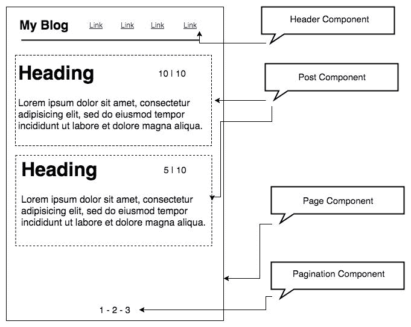
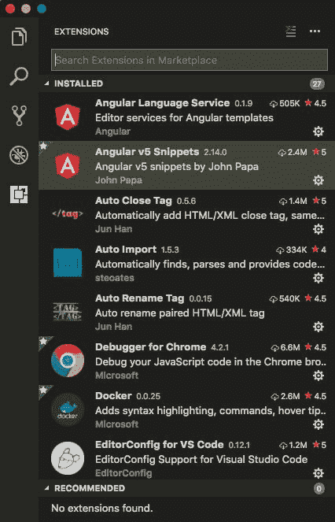
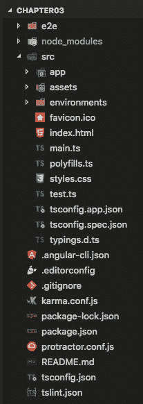
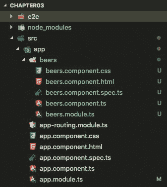
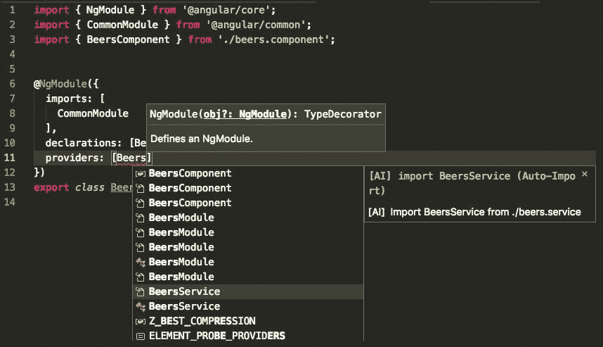

# 三、理解Angular6 的核心概念

Angular 框架已经成为全世界开发前端应用最流行的工具之一。除了非常通用之外(与其他库非常不同，例如`React.js`或`Vue.js`，它们只服务于一个目的)，Angular 是一个完整的框架，随着 Angular 6 的新更新，我们现在有更多的资源可用于创建令人惊叹的快速网络应用。此外，Angular 背后的团队每年提出两项重大更新。

支持 Angular 的另一个优点是它包含了用于创建 web 应用的 Angular **命令行界面** ( **CLI** )。这为我们提供了额外的动力；通过终端中的一个简单命令，我们可以非常快速和容易地创建应用的样板代码。然而，一切都不像我们希望的那样甜蜜，所以我们需要理解 Angular 的基本概念，并知道如何避免一些问题。这很容易通过采用基于组件和模块的开发心理模型来解决。在下面的例子中，我们将仔细创建一个可伸缩的模块化项目的基本结构。

在本章中，我们将涵盖以下主题:

*   Angular 6–更小、更快、更容易
*   开发现代 web 应用的Angular和组件方法
*   安装工具:Git、Angular CLI、HTTP 服务器和 VS 代码插件
*   创建简单的 Angular 应用
*   简单部署

# Angular 6–更小、更快、更容易

以下功能并不仅限于版本 6，而是包含在版本 5 中；我们在这里提到它们是因为它们是构建现代 web 应用的强大功能:

*   **Webpack** :现在可以使用范围托管技术生成更小的模块。
*   您可以通过使用针对 JavaScript 的 RxJS 6 库来减少常见用例的包大小。
*   允许`ng`更新等命令的 Angular CLI 可用于更新所有依赖项。
*   您可以选择使用Angular材质设计来启动应用。
*   `ng add`命令支持创建渐进式网络应用或将现有应用转换为**渐进式网络应用** ( **PWA** )。
*   您将有机会使用 Bazel 来构建应用的库，并与其他团队共享库。
*   Angular 可以打包定制的 HTML/JavaScript 元素，供第三方应用使用。

You can read more about Bazel at [https://bazel.build/](https://bazel.build/).

当然，Angular 6 版本还有很多其他的改进和特性；请注意，这本书是在 Angular 6 beta 7 版本上写的，接下来的章节将会有更多关于当前 Angular 版本的消息。

# 开发现代 web 应用的Angular和组件方法

Angular组件类似于腹板组件；它们用于构建网页，甚至其他组件。一个 web 应用中可能有几十个组件。

组件定义视图和模板，它们属于应用中的一个模块；每个应用至少都有一个根模块，被 Angular CLI 命名为`AppModule.ts`。

`app.module.ts`文件包含 Angular 应用的所有引导代码和配置，如您在下面的代码块中所见:

```php
import { NgModule } from '@angular/core';

@NgModule({
  declarations: [
    AppComponent
  ],
  imports: [],
  providers: [],
  bootstrap: [AppComponent]
})
export class AppModule { }
```

前面的代码是 Angular 应用最基本的配置；我们从 Angular 核心库中导入`NgModule`并将其用作装饰器:`@NgModule`。

组件和服务都是简单的类，装饰器标记它们的类型，并提供元数据来告诉 Angular 如何使用它们。

You can read more about web components at [https://www.webcomponents.org/introduction](https://www.webcomponents.org/introduction).

# Angular 的主要构件

使用 Angular 框架创建的每个应用都有五个非常重要的点，它们相互连接并建立了应用的基本架构:

*   **模块**:使用装饰器`@NgModule`
*   **服务**:使用装饰器`@Injectable`
*   **组件**:使用装饰机`@component`
*   **模板**:带`data-bind`和指令的视图
*   **路由**:设置视图的网址路径

让我们将一个简单的博客页面看作是一个 Angular 应用，它由以下组件构建而成:



Angular components

上图说明了如何使用组件构建一个简单的应用。

上图和 Angular 应用的五个基本概念之间的比较如下:

*   一个模块:`blog.module.ts`
*   一个页面组件:`blog.component.ts`
*   到博客页面的路径
*   加载博客文章的服务

还有一些附加组件，如**表头**、**发文、**和**分页。**

请注意，Header 组件属于应用的主模块(在本例中为`AppModule`)，Post 和 main 组件是`BlogModule`的一部分。

随着本章的深入，我们将更仔细地研究模块和组件之间的关系。现在，我们来看看组件的生命周期。

# 组件生命周期

在 Angular 组件的生命周期中，在实例化之后，组件从开始到结束运行一个明确的执行路径。理解这一点的最基本方法是观察以下代码:

```php
export class HelloComponent implements OnInit, OnDestroy {
   constructor() { }

   ngOnInit() {
... Some code goes here
}
ngOnDestroy() {
... Some code goes here
}
}

```

在前面的例子中，可以看到名为`ngOnInit()`和`ngOnDestroy`的方法；这些名字非常直观，向我们展示了我们有开始也有结束。`ngOnInit()`方法是通过其`OnInit`接口实现的，而`ngOnDestroy()`方法也是如此。正如您在上一章中看到的，TypeScript 中的接口非常有用——这里没有什么不同。

在下图中，我们将查看可以在组件上实现的主要接口。图中`Constructor()`方法后有八个接口(也叫钩子)；每个人在特定的时刻对一件事负责:


Angular component life cycle You can learn more about each interface in the official Angular documentation at [https://angular.io/guide/lifecycle-hooks](https://angular.io/guide/lifecycle-hooks). [](https://angular.io/guide/lifecycle-hooks) 

我们不会在本章中逐一描述接口，以免让您负担过重，但是，在本书的整个过程中，我们将在我们将要构建的应用中使用它们。此外，前面的链接包括关于每个接口和钩子的详细信息。

# 安装工具——Git、Angular CLI 和 VS 代码插件

从这一章到这本书的结尾，我们将采用 VS Code 文本编辑器——它是免费的、轻量级的，并且对于创建 web 应用非常强大。

同样，对源代码使用版本控制系统也非常重要；这将帮助我们跟踪代码库中的所有变化。

接下来，我们将介绍 Git 源代码控制。

# 安装 Git

作为对 Git 的简单而快速的介绍，我们可以这样描述它。

Git 是一个文件版本控制系统。通过使用它，我们可以开发许多人可以同时贡献、编辑和创建新文件的项目，允许它们存在，而不会有它们的更改被覆盖的风险。

在使用 Git 时，一个非常常见的情况是也使用云中的一个服务(比如 GitHub 或 Bitbucket)，来存储代码，这样我们就可以共享它。

此外，如今几乎所有的开源项目(框架和库)都在 GitHub 中。因此，您可以通过报告错误，甚至发送代码和建议来做出贡献。

如果你是一名开发人员，还没有 GitHub，那你就晚了——现在是开始使用它的时候了。所以，让我们安装 Git。

前往[https://git-scm.com/downloads](https://git-scm.com/downloads)下载并安装适合你平台的 Git。

安装后，打开您的终端并键入以下命令:

```php
git --version
```

您必须看到系统上安装的当前版本。

此外，`git help`命令非常有用，列出了所有可用的命令。

You can read more about Git basics at [https://git-scm.com/book/en/v2/Getting-Started-Git-Basics](https://git-scm.com/book/en/v2/Getting-Started-Git-Basics).

# 安装Angular命令行界面

在框架的世界里，不管使用什么语言，我们经常会发现一些工具可以帮助我们进行日常的软件开发，尤其是在有重复任务的时候。

Angular CLI 是一个命令行界面，用于以非常高效的方式创建、开发和维护 Angular 应用。它是由 Angular 团队自己开发的开源工具。

通过使用 Angular CLI，我们能够创建 Angular 应用的整个基础结构，以及模块、组件、指令、服务等等。它有自己的服务器用于开发，并帮助我们构建应用。

现在，是时候安装它了:

1.  打开您的终端并键入以下命令:

```php
npm install -g @angular/cli@latest
```

安装后，您将在终端中看到以下输出:

```php
+ @angular/cli@1.7.3 added 314 packages, removed 203 packages, updated 170 packages and moved 7 packages in 123.346s
```

删除和更新的软件包数量和 Angular CLI 版本可能不同。别担心。

2.  您可以删除旧版本的 Angular CLI，并使用以下命令安装最新版本:

```php
npm uninstall -g angular-cli
npm cache verify
npm install -g @angular/cli@latest
```

If you experience some `npm` issues when you try to update your Angular CLI version on a Windows machine, you can check [https://docs.npmjs.com/troubleshooting/try-the-latest-stable-version-of-npm#upgrading-on-windows](https://docs.npmjs.com/troubleshooting/try-the-latest-stable-version-of-npm#upgrading-on-windows) for information.

请注意，前面的命令将在您的环境/计算机上全局安装 Angular CLI。通常，当我们使用 Angular 框架和 Angular CLI 进行开发时，我们会看到关于版本之间差异的警告消息。这意味着，即使您已经在环境中安装了最新版本的 Angular CLI，Angular CLI 也将检查当前项目中使用的版本，并将其与您计算机上安装的版本进行比较，并将使用当前项目版本。

这在您处理第三方项目时非常有用，并且需要保持机器上安装的全局 Angular CLI 和`node_modules`项目文件夹上安装的本地项目版本之间的依赖关系一致性。

3.  在当前Angular项目中，键入以下命令:

```php
rm -rf node_modules
npm uninstall --save-dev angular-cli
npm install --save-dev @angular/cli@latest
npm install
```

像我们在书中使用的其他命令一样，Angular CLI 有一个名为`ng help`的命令。有了它，我们可以访问大量选项。

其中一个命令在我们使用 Angular 开发应用时特别有用，需要在不离开终端的情况下查阅官方文档。

4.  回到您的终端，键入以下命令:

```php
ng doc HttpClient
```

上述命令将使用[https://angular.io/api?query=HttpClient](https://angular.io/api?query=HttpClient)在`HttpClient`文档应用编程接口处打开您的默认浏览器。因此，您可以将`ng doc`命令与您想要搜索的应用编程接口中的任何内容相结合。

现在，我们已经具备了使用 Angular CLI 开始开发 web 应用所需的一切，但是，在深入构建示例应用之前，我们将使用一些非常有用的工具更新我们的工具包。

# 安装 VS 代码Angular插件

如前几章所述，VS Code 文本编辑器是一个非常棒的 IDE，用于使用 JavaScript 和 TypeScript 开发 web 应用，Angular 也是如此。

在这一节中，我们将看看一些扩展(也称为插件)，它们可以帮助我们的开发。

让我们看看包名和存储库网址:

*   **角语服务**:[https://github.com/angular/vscode-ng-language-service](https://github.com/angular/vscode-ng-language-service)。由官方的 Angular 团队提供，这个扩展帮助我们完成模板文件和模板字符串，以及模板和 Angular 注释的诊断。
*   **Angular v5 片段**:[https://github.com/johnpapa/vscode-angular-snippets](https://github.com/johnpapa/vscode-angular-snippets)。扩展名为 Angular v5GitHub 项目存储库没有指定名称。因此，我们可以期待插件作者为 Angular 的未来版本提供片段。这是一个强大的工具，可以帮助我们在 Angular 应用中创建几乎所有内容；您可以在 GitHub 存储库中看到完整的列表。
*   **角撑**:[https://github.com/VismaLietuva/vscode-angular-support](https://github.com/VismaLietuva/vscode-angular-support)。

转到以下位置查看定义:

```php
interpolation {{ someVar }}
input [(...)]="someVar"
output (...)="someMethod"
templateUrl or styleUrls in @Component decorator
component <some-component></some-component>
```

最后但并非最不重要的是，我们建议您使用 GitLens 插件。这个扩展非常重要，因为它帮助我们在 Git 存储库中可视化代码，同时还提供了与 GitHub 或 Bitbucket 的集成。

*   **git lens**:[https://github . com/eamon odio/vscode-git lens](https://github.com/eamodio/vscode-gitlens)。

Supercharge the Git capabilities built into Visual Studio Code.
– Gitlens

*   您可以浏览存储库和文件历史的导航
*   您还可以探索提交，并可视化分支、标记和提交之间的比较
*   有一个作者代码镜头，显示文件顶部和/或代码块上最近的提交和作者数量
*   **GitLens 插件**:[https://gitlens.amod.io/](https://gitlens.amod.io/)。这个扩展非常重要，因为它帮助我们在 Git 存储库中可视化代码，同时还提供了与 GitHub 或 Bitbucket 的集成。

    同样，可以通过 IDE 本身安装任何扩展。为此，请遵循以下步骤:
    1.  打开 VS 代码。
    2.  点击左侧边栏上的最后一个图标；你可以在下面的截图中看到它:



VS Code extension installation

只需在搜索输入栏中键入您想要搜索的内容，然后单击安装。

我们现在拥有了开始开发 Angular 应用所需的一切。在下一节中，我们将了解如何使用 Angular CLI 创建 Angular 应用。

# 创建简单的Angular应用

在本章中，我们将介绍使用 Angular 框架和 Angular CLI 开发 web 应用的所有要点。现在，是时候接触代码并从头到尾开发一个应用了。

在这个示例项目中，我们将开发一个简单的前端应用来消费一个 API 的数据并将其显示在屏幕上——类似于一个简单的博客。打开您的终端并键入以下命令:

```php
ng new chapter03 --routing
```

请注意，`--routing`标志是可选的，但是，由于我们的下一个示例将使用路由，因此使用该标志启动应用是一个很好的做法。安装完 Angular CLI 后，您应该会在终端上看到以下消息:

```php
Testing binary
Binary is fine
added 1384 packages in 235.686s
You can `ng set --global packageManager=yarn`.
Project 'chapter03' successfully created.
```

# Angular应用的结构

现在我们已经创建了应用，让我们检查一些重要的文件。虽然这些文件已经设置好了，并且可以使用了，但是我们经常需要在现实应用中添加设置，甚至其他模块。

打开 VS 代码中的`chapter03`文件夹；您将在 VS 代码浏览选项卡中看到以下屏幕:



Angular project structure

因此，在`/src/app`文件夹中，我们有一个 Angular 应用的五个主要块，除了服务(我们很快就会看到):

| `app.routing.module.ts` | 途径 |
| `app.component.css` | 样式表 |
| `app.component.html` | 模板 |
| `app.component.spec.ts` | 试验 |
| `app.component.ts` | @组件 |
| `app.module.ts` | @NgModule |

# package.json 文件

`package.json`文件在使用 Node.js 模块的 web 应用中非常常见。现在经常在前端应用中发现，除了用 Node.js 的服务器端应用，用 Angular 框架也没什么区别；这是新版本 Angular 的巨大优势之一，因为我们只能导入应用极其需要的模块，从而减少了大小和构建时间。我们来看看`package.json`文件的内容。我们在每个重要部分之前添加了一些注释:

```php
{
"name": "chapter03",
"version": "0.0.0",
"license": "MIT",
// Npm commands, based on Angular/Cli commands, including: test and     build.
"scripts": {
"ng": "ng",
"start": "ng serve",
"build": "ng build --prod",
"test": "ng test",
"lint": "ng lint",
"e2e": "ng e2e"
 },
"private": true,
// Dependencies to work in production, including:
@angular/core, @angular/common, @angular/route and many more.
"dependencies":{
...
},
// Dependencies only in development environment, including modules for test, TypeScript version, Angular/Cli installed locally and others.
"devDependencies": {
...
}
} 
```

当我们安装新模块时，该文件会自动更改。而且，我们经常在标记脚本中添加一些命令，您将在下一章中看到。您可以在 https://docs.npmjs.com/files/package.json 的官方 npm 文档中阅读更多关于`package.json`文件的信息。

# dot files–。editorconfig，。gitignore 和。angular-cli.json

点文件是以点开始的配置文件；他们总是在项目的背景中，但他们非常重要。它们用于定制您的系统。dotfiles 这个名称是从类似 Unix 的系统中的配置文件派生出来的。在 Angular 项目中，我们将看到其中三个文件:

*   `.editorconfig`:这个文件将文本编辑器配置为使用特定风格的代码，这样项目就一致了，即使它是由几个人在几种类型的文本编辑器中编辑的。
*   `.gitignore`:顾名思义，它会忽略确定的文件夹和文件，这样就不会被源代码管理跟踪。我们经常发现不需要版本控制的`node_modules`和`dist`文件夹，因为它们是在我们每次安装应用或运行构建命令时生成的。
*   `.angular-cli.json`:存储项目设置，并在执行构建或服务器命令时持续使用。单个项目中可以有多个Angular应用。来看一些细节，考察一下`.angular-cli.json`:

```php
{
    "$schema": "./node_modules/@angular/cli/lib/config/schema.json",
    "project": {
    "name": "chapter03"
    },
    // Here we determinate the projects, for this example we have     only one app.
    "apps": [
    {
    "root": "src",
    "outDir": "dist",
    "assets": [
    "assets",
    "favicon.ico"
    ],
    "index": "index.html",
    "main": "main.ts",
    "polyfills": "polyfills.ts",
    "test": "test.ts",
    "tsconfig": "tsconfig.app.json",
    "testTsconfig": "tsconfig.spec.json",
    "prefix": "app",
    "styles": [
    "styles.css"
    ],
    "scripts": [],
    "environmentSource": "environments/environment.ts",
    // Configuration for both environment, developing and production
    "environments": {
    "dev": "environments/environment.ts",
    "prod": "environments/environment.prod.ts"
    }
    }
    ],
    // Configuration for end to end tests and unit tests
    "e2e": {
    "protractor": {
    "config": "./protractor.conf.js"
    }
    },
    "lint": [
    {
    "project": "src/tsconfig.app.json",
    "exclude": "**/node_modules/**"
    },
    {
    "project": "src/tsconfig.spec.json",
    "exclude": "**/node_modules/**"
    },
    {
    "project": "e2e/tsconfig.e2e.json",
    "exclude": "**/node_modules/**"
    }
    ],
    "test": {
    "karma": {
    "config": "./karma.conf.js"
    }
    },
    // Stylesheet configiration, for this example we are using CSS
    "defaults": {
    "styleExt": "css",
    "component": {}
    }
}
```

# 环境

在`src/environments`文件夹里面，我们找到了两个配置文件。一个叫`environment.prod.ts`，一个叫`environment.ts`。Angular CLI 将知道使用什么，这取决于我们使用的命令；例如，考虑以下命令:

```php
 ng build --env = prod 
```

如果我们使用它，那么 Angular 将使用`environment.prod.ts`文件，对于其他命令，例如`ng serve`，它将使用`environment.ts`。这非常有用，尤其是当我们有一个本地 API 和一个在`production`中，使用不同的路径时。

两个文件的代码几乎相同；见`environment.prod.ts`，如下:

```php
export const environment = {
    production: true
};
```

`environment.ts`文件如下:

```php
export const environment = {
    production: false
};
```

请注意，布尔`true`(在生产时)和`false`(在开发时)是这两个文件之间的唯一区别，在这个第一阶段。很明显，除了我们提到的文件，Angular 应用中还有很多其他文件，所有这些文件都非常重要。但是，现在，让我们专注于这些。不用担心；在本书的整个过程中，我们将在示例应用的开发过程中更详细地了解它们。现在，我们将重点创建我们在本章中使用的简单示例。

# 运行示例应用

现在我们已经开始了我们的项目，我们将运行内置的 Angular CLI 服务器，看看我们的应用是什么样子:

1.  将项目根目录下的 VS 代码打开到`chapter03`文件夹。
2.  在这个例子中，我们将使用集成的终端作为代码；为此，点击`view`中的顶部菜单，然后点击`Integrated Terminal`。

3.  在终端中键入以下命令:

```php
npm start
```

您将看到类似以下内容的消息:

```php
 ** NG Live Development Server is listening on localhost:4200, open  
 your  
 browser on http://localhost:4200/ **
 Date: xxxx 
 Hash: xxxx
 Time: 16943ms
 chunk {inline} inline.bundle.js (inline) 3.85 kB [entry] [rendered]
 chunk {main} main.bundle.js (main) 20.8 kB [initial] [rendered]
 chunk {polyfills} polyfills.bundle.js (polyfills) 549 kB [initial]  
 [rendered]
 chunk {styles} styles.bundle.js (styles) 41.5 kB [initial]  
 [rendered]
 chunk {vendor} vendor.bundle.js (vendor) 8.45 MB [initial] 
 [rendered]
```

4.  在幕后，Angular CLI 将使用网络包模块管理器。在本书的后面，您将看到如何导出和自定义 webpack 文件。
5.  现在，转到`http://localhost:4200`查看结果；您将看到我们之前创建的样板应用的欢迎页面。你可以在`src/app/app.component.html`找到这个页面后面的代码——这是我们的模板。

现在，是时候给我们的应用添加一个新模块了。

# 添加新模块

在本例中，我们将介绍如何使用 Angular CLI 构建应用。即使在这个非常基本的例子中，我们也将涉及以下几点:

*   如何组织 Angular 应用
*   创建模块
*   创建服务
*   模板数据绑定
*   在生产中运行应用

现在，让我们创建一个模块，向我们显示啤酒列表:

1.  打开 VS 代码，在集成终端中，键入以下命令:

```php
ng g module beers
```

注意`ng g module`命令是`ng generate module <module-name>`的快捷方式，这个命令只是创建模块；我们需要添加路线、组件和模板，还需要在`app`文件夹的根目录下导入`app.modules.ts`中的`beers`模块。前面的命令将在我们的项目内部生成以下结构和文件内容:`src/app/beers/beers.module.ts`。`beers.module.ts`内容如下:

```php
import { NgModule } from '@angular/core';
import { CommonModule } from '@angular/common';
    @NgModule({
    imports: [
    CommonModule
    ],
    declarations: []
    })
export class BeersModule { }
```

这是一个非常简单的样板代码，但是非常有用。现在，我们将添加缺失的部分。

2.  将`beers`模块添加到您的`app`模块中；打开`app.module.ts`并用以下代码替换代码:

```php
import { BrowserModule } from '@angular/platform-browser';
import { NgModule } from '@angular/core';
import { HttpClientModule } from '@angular/common/http';
import { AppRoutingModule } from './app-routing.module';
import { AppComponent } from './app.component';
import { BeersModule } from './beers/beers.module';
    @NgModule({
    declarations: [
        AppComponent
    ],
    imports: [
    BrowserModule,
    AppRoutingModule,
    HttpClientModule,
    BeersModule
    ],
    providers: [],
    bootstrap: [AppComponent]
})
export class AppModule { }
```

注意，我们导入了`BeersModule`并将其添加到了`imports`数组中。

# 添加新组件

现在，我们需要一个组件来显示啤酒列表，因为我们刚刚创建了一个名为`Beers`的模块。
稍后，您将看到如何使用 API 和 Angular 服务加载啤酒列表；现在，我们将专注于组件的创建。

在根文件夹内部，使用集成的 VS 代码终端，键入以下命令:

```php
ng g component beers
```

前面的命令将生成以下结构:



已经创建了`BeersModule`和`Component`文件。我们现在有了我们的模块、模板和组件文件。让我们添加一条新路线。

# 添加新路线

正如您之前看到的，路由是每个 web 应用的一部分。现在，我们将添加一个新的路线，这样我们就可以访问我们的`beers`模块的内容。打开`src/app/app-routing.module.ts`并用以下代码替换代码:

```php
import { NgModule } from '@angular/core';
import { Routes, RouterModule } from '@angular/router';
import { AppComponent } from './app.component';
import { BeersComponent } from './beers/beers.component';
const routes: Routes = [
    { path: '', redirectTo: 'beers', pathMatch: 'full' },
    { path: 'beers', component: BeersComponent }
];
@NgModule({
    imports: [RouterModule.forRoot(routes)],
    exports: [RouterModule]
})
export class AppRoutingModule { }
```

请注意，我们只是将新的路由添加到现有的路由文件中(在本例中为`app.routing.module.ts`)，因为这个示例非常简单。但是，在较大的应用中，建议您为每个应用模块创建单独的路由文件。

# 创建Angular服务

Angular服务用于处理数据；它可以是内部数据(从一个组件到另一个组件)或外部的东西，例如与 API 端点通信。几乎所有带有 JavaScript 框架的前端应用都使用这种技术。在 Angular 中，我们称之为服务，我们使用一些内置在 Angular 框架中的模块来完成任务:`HttpClient`和`HttpClientModule`。

让我们看看 Angular CLI 如何帮助我们:

1.  打开 VS 代码，在集成终端中，键入以下命令:

```php
ng g service beers/beers
```

上一条命令将在`beers`文件夹中生成两个新文件:

`beers.service.spec.ts`和`beers.service.ts`。

2.  将新创建的`Service`作为依赖项提供者添加到`beers.module.ts`中。打开`src/app/beers/beers.module.ts`并添加以下行:

```php
import { BeersService } from './beers.service';
@NgModule({
    providers: [BeersService]
})
```

在 VS Code 中，我们有导入模块支持，因此，当您开始键入模块名称时，您将看到以下帮助屏幕:



最终的`beers.module.ts`代码如下:

```php
import { NgModule } from '@angular/core';
import { CommonModule } from '@angular/common';
import { BeersComponent } from './beers.component';
import { BeersService } from './beers.service';
@NgModule({
    imports: [
        CommonModule
    ],
    declarations: [BeersComponent],
    providers: [BeersService
    ]
})
export class BeersModule { }
```

现在，是时候使用服务与应用编程接口连接了。为了尽可能接近真实的应用，我们将在本例中使用公共 API。在接下来的步骤中，我们将有效地创建我们的服务并将数据绑定添加到我们的模板中。

对于这个例子，我们将使用免费的[https://punkapi.com/](https://punkapi.com/)应用编程接口:

1.  打开`beers.service.ts`并用以下几行替换代码:

```php
import { Injectable } from '@angular/core';
import { HttpClient, HttpHeaders, HttpErrorResponse } from '@angular/common/http';
import { Observable } from 'rxjs/Observable';
import 'rxjs/add/observable/throw';
import { catchError } from 'rxjs/operators';
@Injectable()
export class BeersService {
    private url = 'https://api.punkapi.com/v2/beers?';
    constructor(private http: HttpClient) { }
/**
* @param {page} {perpage} Are Page number and items per page
*
* @example
* service.get(1, 10) Return Page 1 with 10 Items
*
* @returns List of beers
*/
    get(page: number, per_page: number) {
        return this.http.get(this.url + 'page=' + page +
         '&per_page=' + per_page)
        .pipe(catchError(error => this.handleError(error)));
    }
```

```php

    private handleError(error: HttpErrorResponse) {
        return Observable.throw(error);
    }
}
```

现在，我们需要告诉组件，我们需要使用这个服务来加载数据并将其传输到我们的模板。

2.  打开`src/app/beers/beers.component.ts`并用以下内容替换代码:

```php
import { Component, OnInit } from '@angular/core';
import { BeersService } from './beers.service';
@Component({
    selector: 'app-beers',
    templateUrl: './beers.component.html',
    styleUrls: ['./beers.component.css']
})
export class BeersComponent implements OnInit {
    public beersList: any [];
    public requestError: any;
    constructor(private beers: BeersService) { }
    ngOnInit() {
        this.getBeers();
    }
    /**
    * Get beers, page = 1, per_page= 10
    */
    public getBeers () {
        return this.beers.get(1, 20).subscribe(
            response => this.handleResponse(response),
            error => this.handleError(error)
        );
    }
    /**
    * Handling response
    */
    protected handleResponse (response: any) {
        this.requestError = null;
        return this.beersList = response;
    }
    /**
    * Handling error
    */
    protected handleError (error: any) {
        return this.requestError = error;
    }
}
```

# 模板数据绑定

现在，我们有了一个连接到 API 端点并接收 JSON 文件的服务，让我们对视图进行一些小的更改，在 Angular 世界中称为模板。模板是`module`文件夹里面的 HTML 文件:

1.  打开`src/app/app.component.html`，去掉`<router-outlet></route-outlet>`标签前的所有代码。
2.  打开`src/app/beers/beers.component.html`并在`beers`工作段落后添加以下代码:

```php
<div class="row">
    <div class="col" href="" *ngFor="let item of beersList">
        <figure>
            
        <figcaption>
            <h1>{{item.name}}</h1>
                <p>{{item.tagline}}</p>
        </figcaption>
        </figure>
    </div>
</div>
```

请注意，我们使用大括号模板标签(`{{}}`)和`*ngFor`指令来显示我们的数据。让我们看看一些 Angular 数据绑定类型:

```php
{{ some.property }} One way Binding
[(ngModel)]="some.value" Two way Binding
(click)="showFunction($event)" Event Binding
```

3.  现在，我们需要给`beers.component.html`增加一些风格；打开`src/app/beers/beers.component.css`并添加以下代码:

```php
body {
    margin: 40px;
}
.row {
    display: grid;
    grid-template-columns: 300px 300px 300px;
    grid-gap: 10px;
    background-color: #fff;
    color: #444;
}
.col {
    background-color: #d1d1d1;
    border-radius: 5px;
    padding: 10px;
}
figure {
    text-align: center;
}
img {
    height:250px;
}
```

我们现在非常接近完成我们的示例应用。最后一步是构建我们的应用并查看最终结果。

# 简单部署

现在我们已经准备好了一切，让我们看看如何构建我们的应用。

首先，我们将在进行更改后查看应用:

1.  打开 VS 代码，单击顶部菜单栏中的视图，然后单击集成终端。
2.  在终端中键入以下命令:

```php
npm start
```

3.  打开默认浏览器，进入`http://localhost.com:4200/beers`。
4.  恭喜你；您应该会看到下面的截图:


请注意，我们正在运行命令进行开发，在`npm start`命令后面使用`ng serve`。
现在，让我们使用命令构建应用，并检查结果:

1.  回到 VS 代码，输入 *Ctrl* *+* *C* 停止服务器。
2.  键入以下命令:

```php
npm run build
```

前面的命令将为生产准备应用；Angular CLI 将为我们完成所有的艰苦工作。现在`chapter03`的根目录下有一个文件夹，如下图截图所示:


The dist folder

如您所见，我们所有的应用都在这个文件夹中，尽可能优化；但是，要查看内容，我们需要一个 web 服务器。在这个例子中，我们将使用`http-server`节点包，一个非常有用的 Node.js 模块，在一个简单的 web 服务器上创建一个特定的目录。你可以在[https://www.npmjs.com/package/http-server](https://www.npmjs.com/package/http-server)找到更多关于 http 服务器的信息:

1.  返回到 VS 代码和集成终端，并键入以下命令:

```php
npm install http-server -g
```

2.  仍然在集成终端中，键入以下命令:

```php
cd dist && http-server -p 8080
```

3.  您将在终端中看到以下消息:

```php
 Starting up http-server, serving ./
 Available on:
 http://127.0.0.1:8080
 http://192.168.25.6:8080
 Hit CTRL-C to stop the server
```

这意味着一切都很顺利，您已经可以在浏览器中访问`dist`文件夹的内容。

4.  打开默认浏览器，进入`http://localhost.com:8080/beers`。

我们结束了；现在，让我们使用一些 Git 命令将我们在`chapter03`文件夹中所做的一切保存在我们的本地存储库中。下一章不需要这一步，但强烈建议这样做。

5.  在`chapter03`文件夹中打开您的终端，并键入以下命令:

```php
git add .git commit -m "chapter03 initial commit"
```

6.  在上一个命令之后，您将在终端中看到以下输出:

```php
 [master c7d7c18] chapter03 initial commit
 10 files changed, 190 insertions(+), 24 deletions(-) rewrite  
 src/app/app.component.html (97%)
 create mode 100644 src/app/beers/beers.component.css
 create mode 100644 src/app/beers/beers.component.html
 create mode 100644 src/app/beers/beers.component.spec.ts
 create mode 100644 src/app/beers/beers.component.ts
 create mode 100644 src/app/beers/beers.module.ts
 create mode 100644 src/app/beers/beers.service.spec.ts
 create mode 100644 src/app/beers/beers.service.ts
```

# 摘要

好了，我们已经到达了另一章的结尾，现在您应该了解如何使用 Angular 创建应用。在这一章中，我们讨论了使 Angular 成为一个强大框架的要点。您可以在[https://github.com/PacktPublishing](https://github.com/PacktPublishing)直接从 GitHub 下载我们在本章中使用的代码示例。在下一章中，我们将深入后端应用编程接口。