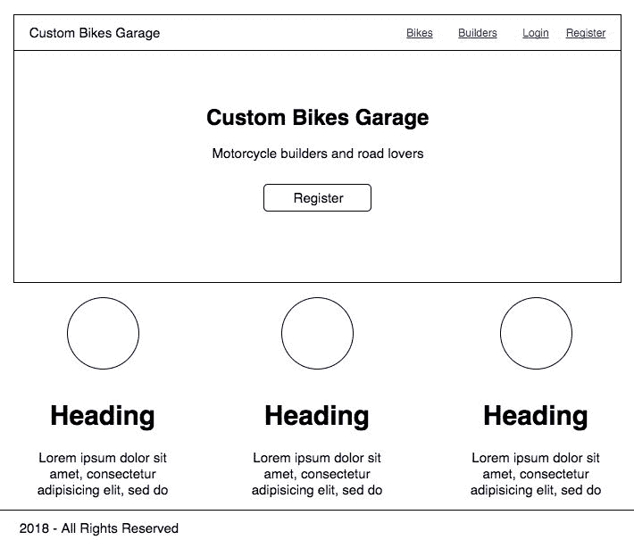
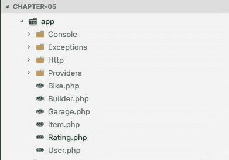

# 使用 Laravel 创建一个 RESTful 应用编程接口——第 1 部分

在开始之前，让我们简单介绍一个叫做 RESTful API 的软件开发标准。

应用编程接口 ( **应用编程接口)**是一组用于访问基于互联网的应用的指令、例程和编程模式。这允许计算机或其他应用理解该应用中的指令，解释其数据，并将其用于与其他平台和软件的集成，生成将由该软件或计算机执行的新指令。

通过这种方式，我们理解 API 允许应用之间的互操作性。换句话说，这是应用之间的通信，在我们的例子中，是客户端和服务器端之间的通信。

**表征状态转移** ( **REST** )是网络架构的抽象。简而言之，REST 由原则、规则和约束组成，当遵循这些原则、规则和约束时，就可以创建具有定义良好的接口的项目。

RESTful 服务中可用的功能可以通过一组默认预定义的操作来访问或操作。这些操作使得创建(PUT)、读取(GET)、更改(POST)和删除(delete)资源成为可能，并且可以从使用 HTTP 协议的消息中获得。

虽然 Laravel 是一个 MVC 框架，但我们可以构建极其健壮和可扩展的 RESTful 应用。

在本章中，您将学习如何使用 Laravel 框架的核心元素构建 RESTful API，例如控制器、路由和雄辩的**对象关系映射** ( **ORM** )。我们将主要讨论以下主题:

*   准备应用并了解我们正在构建的内容
*   雄辩的关系
*   控制器和路线

# 准备应用并了解我们正在构建的内容

让我们使用在上一章中开始开发的应用来开始这个会话。但是，我们会在继续之前进行一些调整。首先，我们要将代码添加到版本控制中。这样，我们就不会失去上一章取得的进展。

1.  在`chapter-04`文件夹中，创建一个名为`.gitignore`的新文件，并添加以下代码:

```php
storage-db
.DS_Store
```

*   有关忽略文件的更多信息，请参见[https://help.github.com/articles/ignoring-files](https://help.github.com/articles/ignoring-files)
*   如果您发现自己忽略了文本编辑器或操作系统生成的临时文件，您可能想添加一个全局忽略来代替`git config --global core.excludesfile '~/.gitignore_global'`
*   忽略`storage`文件夹的应有大小

前面的代码只是给未跟踪的文件添加了`storage-db`文件夹。

2.  让我们添加对源代码管理的更改。在“终端”窗口中，键入以下命令:

```php
git init
```

最后，让我们添加第一个提交。

3.  在终端中，键入以下命令:

```php
git add .
git commit -m "first commit"
```

太棒了。我们将代码置于 Git 源代码控制之下。

# 重构应用文件

现在是时候换一些文件调整到`chapter-05` **:**

1.  复制`chapter-04`的所有内容，粘贴到名为`chapter-05` **的新文件夹中。**

2.  打开`docker-compose.yml`文件，用以下几行替换代码:

```php
version: "3.1"
services:
 mysql:
 screenshot: mysql:5.7
 container_name: chapter-05-mysql
 working_dir: /application
 volumes:
 - .:/application
 - ./storage-db:/var/lib/mysql
 environment:
 - MYSQL_ROOT_PASSWORD=123456
 - MYSQL_DATABASE=chapter-05
 - MYSQL_USER=chapter-05
 - MYSQL_PASSWORD=123456
 ports:
 - "8083:3306"
 webserver:
 screenshot: nginx:alpine
 container_name: chapter-05-webserver
 working_dir: /application
 volumes:
 - .:/application
 - ./phpdocker/nginx/nginx.conf:
 /etc/nginx/conf.d/default.conf
 ports:
 - "8081:80"
 php-fpm:
 build: phpdocker/php-fpm
 container_name: chapter-05-php-fpm
 working_dir: /application
 volumes:
 - ./project:/application
 - ./phpdocker/php-fpm/php-ini-
 overrides.ini:/etc/php/7.2/fpm/conf.d/99-overrides.ini
```

请注意，我们更改了`MYSQL_DATABASE`和`MYSQL_USER`，还更改了容器名称以符合`chapter-05`的标题。

3.  用新的数据库信息编辑`project/.env`文件，如下代码所示:

```php
DB_CONNECTION=mysql
 DB_HOST=mysql
 DB_PORT=3306
 DB_DATABASE=chapter-05
 DB_USERNAME=chapter-05
 DB_PASSWORD=123456
```

4.  现在，删除`storage-db`文件夹。别担心，我们稍后会用`docker-compose`命令创建一个新的。
5.  是时候做出新的改变了，但这次我们会用另一种方式。这一次，我们将使用 Git 镜头 VS 代码插件。

6.  打开 VS 代码。在左侧栏上，单击源代码管理的第三个图标。
7.  在左上角侧边栏`Init chapter 05`的消息框内添加以下消息。
8.  在 macOSX 上按 C *ommand* *+E* *回车*，或者在 Windows 上按 *Ctrl* *+* *回车*，点击【是】。

干得好。现在，我们可以从一个新的文件基线开始。

# 我们在建造什么

现在，让我们谈一谈自本书开始以来我们一直在构建的应用。

正如我们所看到的，到目前为止，我们已经建立了很多东西，但是我们仍然不清楚我们正在为这个项目做什么。这是学习和实践 web 应用开发的最佳方式。

很多时候，当我们第一次学习或做某事时，我们倾向于密切关注最终的项目，在这一点上，有一种完成我们开始做的事情的焦虑，我们不能专注于构建过程和细节。

在这里，我们已经准备好了项目的 *40%* 。然后，我们可以透露更多关于我们正在做的事情的细节。

请记住，到目前为止，我们已经使用 Docker 准备了一个高度可扩展的开发环境，安装了一些非常重要的工具，这些工具将有助于我们的开发，并学习了如何启动一个可靠的 Laravel 应用。

该应用将被称为定制自行车车库，这是一种面向定制摩托车文化爱好者的 Instagram/Twitter。在开发的最后，我们将有一个非常类似于以下线框截图的 web 应用:



Home page

前面的截图只是一个基本的应用主页，带有导航链接和行动号召按钮:


Bike list page

# 应用的摘要

正如我们在前面的截图中看到的，我们的应用有:

*   一个主页，我们称之为`home`页面
*   摩托车的一页，我们称之为`bike-list`页
*   自行车详细信息页面，我们称之为`bike-details`页面
*   一个构建者页面，我们称之为`builders-list`页面
*   构建者详细信息页面，我们称之为`builder-details`页面
*   一个注册页面，我们称之为`register-page`页面
*   一个登录页面，我们称之为`login-page`页面
*   一个评级页面，用户可以在上面投票

假设我们正在为一个展览会议构建一个定制的自行车应用。每个会议都有一个名称和客户级别。

用户可以注册，投票选出最好的自行车，并插入自己的自行车。会议展示了一些知名自行车制造商定制的自行车，每辆自行车都有许多定制项目。

因此，为了完成应用的后端，我们仍然需要做如下工作:

*   为`Builder`、`Item`、`Garage`和`Rating`创建模型
*   为`Builder`、`Item`、`Garage`和`Rating`创建迁移文件
*   给数据库播种
*   为`Bike`、`Builder`、`Item`、`Garage`和`Rating`创建控制器
*   应用模型之间的关系
*   使用资源来表示关系
*   创建基于令牌的身份验证

# 创建模型和迁移文件

让我们开始使用`-m`标志创建构建器模型和迁移文件。就像我们之前在本书中所做的那样，我们可以同时创建两个文件:

1.  打开您的终端窗口，键入以下命令:

```php
php artisan make:model Builder -m
```

2.  仍然在终端窗口中，键入以下命令:

```php
php artisan make:model Item -m
```

3.  仍然在终端窗口中，键入以下命令:

```php
php artisan make:model Garage -m
```

4.  仍然在终端窗口中，键入以下命令:

```php
php artisan make:model Rating -m
```

*步骤 1* 到*步骤 4* 将在我们的应用中生成以下新文件:

```php
project/app/Builder.php project/database/migrations/XXXX_XX_XX_XXXXXX_create_builders_table.php project/app/Item.php project/database/migrations/XXXX_XX_XX_XXXXXX_create_items_table.php project/app/Garage.php project/database/migrations/XXXX_XX_XX_XXXXXX_create_garages_table.php project/app/Rating.php project/database/migrations/XXXX_XX_XX_XXXXXX_create_ratings_table.php
```

注意迁移文件名前的`XXXX_XX_XX_XXXXXX`。它是文件创建时间的时间戳。

此时，我们可以在 VS Code 左侧面板上看到前面的六款机型，如下图截图所示:



Left-hand side panel

请注意，我们已经在[第 4 章](04.html#2H1VQ0-f24bf9337f074c079f0c90fd02324171)、*构建基线应用*中创建了`Bike`模型，默认情况下，Laravel 为我们创建了`User`模型。

5.  现在，正如我们之前所做的，让我们提交新创建的文件，并单击 VS Code 左侧面板上的源代码控制图标。
6.  在消息输入字段中键入以下文本:`Added Models and Migration files`。
7.  在 macOSX 上按*C**ommand**+**回车*，或在 Windows 上按*C**TRL**+**回车*，点击是按钮。

# 向迁移文件添加内容

现在，让我们创建迁移文件的内容。请记住，迁移文件是使用 Laravel 创建数据库方案的最简单、最快的方法:

1.  打开`project/database/migrations/XXXX_XX_XX_XXXXXX_create_builders_table.php`并用以下代码替换内容:

```php
<?php
use Illuminate\Support\Facades\Schema;
use Illuminate\Database\Schema\Blueprint;
use Illuminate\Database\Migrations\Migration;
class CreateBuildersTable extends Migration
{
    /**
    * Run the migrations.
    *
    * @return void
    */
    public function up()
    {
    Schema::create('builders', function (Blueprint $table) {
        $table->increments('id');
        $table->string('name');
        $table->text('description');
        $table->string('location');
        $table->timestamps();
        });
    }
    /**
    * Reverse the migrations.
    *
    * @return void
    */
    public function down()
    {
        Schema::dropIfExists('builders');
    }
}
```

2.  打开`project/database/migrations/XXXX_XX_XX_XXXXXX_create_items_table.php`并用以下代码替换内容:

```php
<?php
use Illuminate\Support\Facades\Schema;
use Illuminate\Database\Schema\Blueprint;
use Illuminate\Database\Migrations\Migration;
class CreateItemsTable extends Migration
{
    /**
    * Run the migrations.
    *
    * @return void
    */
    public function up()
    {
        Schema::create('items', function (Blueprint $table) {
        $table->increments('id');
        $table->string('type');
        $table->string('name');
        $table->text('company');
        $table->unsignedInteger('bike_id');
        $table->timestamps();
        });
    }
    /**
    * Reverse the migrations.
    *
    * @return void
    */
    public function down()
    {
        Schema::dropIfExists('items');
    }
}
```

3.  请注意自行车表的`$table->unsignedInteger('bike_id')`外键。在本章的后面，我们将深入探讨模型关系/关联，但是现在让我们关注迁移文件。
4.  打开`project/database/migrations/XXXX_XX_XX_XXXXXX_create_garages_table.php`并用以下代码替换内容:

```php
<?php
use Illuminate\Support\Facades\Schema;
use Illuminate\Database\Schema\Blueprint;
use Illuminate\Database\Migrations\Migration;
class CreateGaragesTable extends Migration
{
    /**
    * Run the migrations.
    *
    * @return void
    */
    public function up()
    {
        Schema::create('garages', function (Blueprint $table) {
        $table->increments('id');
        $table->string('name');
        $table->integer('customer_level');
        $table->timestamps();
        });
    }
    /**
    * Reverse the migrations.
    *
    * @return void
    */
    public function down()
    {
        Schema::dropIfExists('garages');
    }
}
```

现在，我们需要另一个表，只是为了设置`Bike`和`Garage`之间的关系。我们使用`artisan`命令来创建迁移文件，因为对于这种关系，我们不需要模型。该表也称为数据透视表。

5.  打开您的终端窗口，键入以下命令:

```php
php artisan make:migration create_bike_garage_table
```

6.  打开`project/database/migrations/XXXX_XX_XX_XXXXXX_create_bike_garage_table.php`并用以下代码替换内容:

```php
<?php
use Illuminate\Support\Facades\Schema;
use Illuminate\Database\Schema\Blueprint;
use Illuminate\Database\Migrations\Migration;
class CreateBikeGarageTable extends Migration
{
    /**
    * Run the migrations.
    *
    * @return void
    */
    public function up()
    {
        Schema::create('bike_garage', function (Blueprint $table) {
        $table->increments('id');
        $table->integer('bike_id');
        $table->integer('garage_id');
        $table->timestamps();
        });
    }
    /**
    * Reverse the migrations.
    *
    * @return void
    */
    public function down()
    {
        Schema::dropIfExists('bike_garage');
    }
}
```

Remember that the bike migration file was created in the previous chapter.

7.  打开您的终端窗口，键入以下命令:

```php
php artisan make:migration create_ratings_table
```

8.  打开`project/database/migrations/XXXX_XX_XX_XXXXXX_create_ratings_table.php`并用以下代码替换内容:

```php
<?php
use Illuminate\Support\Facades\Schema;
use Illuminate\Database\Schema\Blueprint;
use Illuminate\Database\Migrations\Migration;
class CreateRatingsTable extends Migration
{
    /**
    * Run the migrations.
    *
    * @return void
    */
    public function up()
    {
        Schema::create('ratings', function (Blueprint $table) {
        $table->increments('id');
        $table->unsignedInteger('user_id');
        $table->unsignedInteger('bike_id');
        $table->unsignedInteger('rating');
        $table->timestamps();
        });
    }
    /**
    * Reverse the migrations.
    *
    * @return void
    */
    public function down()
    {
        Schema::dropIfExists('ratings');
    }
}
```

好了，是时候多了解一下我们在这堂课中做了什么，所以让我们进入下一堂课，了解一下`Eloquent`是如何工作的。

# 雄辩的关系

雄辩的是 Laravel 数据库查询背后的 ORM。它是活动记录实现的抽象。

正如我们之前看到的，每个应用模型在我们的数据库中都有一个相应的表。这样，我们就可以查询、插入、删除和更新记录。

雄辩 ORM 使用类的蛇形复数名称，它将被用作表名，除非明确指定了另一个名称。例如，我们的`Bike`模型类有自己的台式自行车。

应用模型有以下表格:

| 应用模型 | 数据库表 |
| --- | --- |
| `Bike.php` | 自行车 |
| `Builder.php` | 建设者 |
| `Garage.php` | 车库 |
| `Item.php` | 项目 |
| `Rating.php` | 等级 |
| `Builder.php` | 建设者 |
| `User.php` | 用户 |

请注意，我们保留了表约定名称，但也可以使用自定义表名称。对于本书的范围，我们将保留 Laravel 生成的表名。

You can read more about table names and model conventions in the official Laravel documentation at [https://laravel.com/docs/5.6/eloquent#defining-models](https://laravel.com/docs/5.6/eloquent#defining-models).

雄辩的 ORM 支持模型之间的以下关系:

*   一对一
*   一对多
*   属于(逆=一对多)
*   多对多
*   有很多
*   多态关系
*   多对多多态关系

我们将详细看到前四种关系；然而，我们无法在书中详细涵盖所有关系。理解许多框架中的关系(也称为关联)非常简单。

You can read more about relationships at [https://laravel.com/docs/5.6/eloquent-relationships](https://laravel.com/docs/5.6/eloquent-relationships).

# 一对一的关系

让我们建立`Builder`和`Bike`的一一对应关系。这意味着一个`Bike`将只有一个`Builder`。

1.  打开`project/app/Builder.php`并用以下代码替换内容:

```php
<?php
namespace App;
use Illuminate\Database\Eloquent\Model;
/**
* @SWG\Definition(
* definition="Builder",
* required={"name", "description", "location"},
* @SWG\Property(
* property="name",
* type="string",
* description="Builder name",
* example="Jesse James"
* ),
* @SWG\Property(
* property="description",
* type="string",
* description="Famous Motorcycle builder from Texas",
* example="Austin Speed Shop"
* ),
* @SWG\Property(
* property="location",
* type="string",
* description="Texas/USA",
* example="Austin, Texas"
* ),
* )
*/
class Builder extends Model
{
    /**
    * The table associated with the model.
    *
    * @var string
    */
    protected $table = 'builders';
    /**
    * The attributes that are mass assignable.
    *
    * @var array
    */
    protected $fillable = [
        'name',
        'description',
        'location'
    ];
    /**
    * Relationship.
    *
    * @var array
    */
    public function bike() {
        return $this->hasOne('App\Bike');
    }
}
```

请注意，我们添加了斯瓦格文档定义，就像我们在上一章中所做的那样。`bike()`函数创建一对一的关系。您可以在关系函数上使用任何名称，但是我们强烈建议您使用相同的模型名称，在我们的例子中是`Bike`模型类。

2.  现在，让我们将各自的关系添加到`Bike`模型中。打开`project/app/Bike.php`并在受保护的可填写功能后立即添加以下代码:

```php
/**
* Relationship.
*
* @var string
*/
public function builder() {
     return $this->belongsTo('App\Builder');
}
```

Notice that `belongsTo` relation is a one-to-many inverse relationship.

3.  打开`project/app/Item.php`并用以下代码替换内容:

```php
<?php
namespace App;
use Illuminate\Database\Eloquent\Model;
/**
* @SWG\Definition(
* definition="Item",
* required={"type", "name", "company"},
* @SWG\Property(
* property="type",
* type="string",
* description="Item Type",
* example="Exhaust"
* ),
* @SWG\Property(
* property="name",
* type="string",
* description="Item name",
* example="2 into 1 Exhaust"
* ),
* @SWG\Property(
* property="company",
* type="string",
* description="Produced by: some company",
* example="Vance and Hines"
* )
* )
*/
class Item extends Model
{
    /**
    * The table associated with the model.
    *
    * @var string
    */
    protected $table = 'items';
    /**
    * The attributes that are mass assignable.
    *
    * @var array
    */
    protected $fillable = [
        'type',
        'name',
        'company',
        'bike_id'
    ];
    /**
    * Relationship.
    *
    * @var string
    */
    public function bike() {
        return $this->belongsTo('App\Bike');
    }
}
```

# 一对多关系

`Bike`和`Items`之间将应用一对多关系，这意味着一个`bike`将有多个自定义`items`。

仍然在`project/app/Bike.app`文件中，让我们添加`Item`和`Bike`模型之间的一对多关系。

在`builder()`功能后立即添加以下代码:

```php
public function items() {
    return $this->hasMany('App\Item');
}
```

# 多对多关系

对于多对多关系，我们将通过使用透视表在许多车库中拥有许多自行车。

在多对多的关系中，我们需要尊重一些命名规则。

数据透视表的名称应该由两个表的单数名称组成，用下划线符号分隔，这些名称应该按字母顺序排列。

默认情况下，应该只有两个透视表字段和每个表的外键，在我们的例子中是`bike_id`和`garage_id`。

仍然在`project/app/Bike.app`文件中，让我们添加自行车和车库模型之间的多对多关系。

在`items()`功能后立即添加以下代码:

```php
public function garages() {
    return $this->belongsToMany('App\Garage');
}
```

请注意，在前面的代码中，我们在第三个表(称为数据透视表)中创建了自行车和车库的关系，该表将保存与关系相关的信息，正如我们前面解释的那样。

现在，是时候添加自行车的用户和评级之间的关系了。在`garages()`功能后立即添加以下代码:

```php
public function user() {
        return $this->belongsTo('App\User');
public function ratings() {
        return $this->hasMany('App\Rating');
}
```

此时，我们将在`Bike`模型中有以下关系:

```php
/**
* Relationship.
*
* @var string
*/
public function builder() {
    return $this->belongsTo('App\Builder');
}
public function items() {
    return $this->hasMany('App\Item');
}
public function garages() {
    return $this->belongsToMany('App\Garage');
}
public function user() {
    return $this->belongsTo(User::class);
}
public function ratings() {
    return $this->hasMany(Rating::class);
}
```

现在，让我们在`project/app/Garage.app`模型中添加关系。用以下代码替换其内容:

```php
<?php
namespace App;
use Illuminate\Database\Eloquent\Model;
/**
* @SWG\Definition(
* definition="Garage",
* required={"name", "custumer_level"},
* @SWG\Property(
* property="name",
* type="string",
* description="Jhonny Garage",
* example="Exhaust"
* ),
* @SWG\Property(
* property="customer_level",
* type="integer",
* description="Whats the garage level",
* example="10"
* )
* )
*/
class Garage extends Model
{
    /**
    * The table associated with the model.
    *
    * @var string
    */
    protected $table = 'garages';
    /**
    * The attributes that are mass assignable.
    *
    * @var array
    */
    protected $fillable = [
        'name',
        'costumer_level'
    ];
    /
    *
    * @var string
    */
    public function bikes() {
        return $this->belongsToMany('App\Bike', 'bike_garage',
        'bike_id', 'garage_id');
    }
}
* Relationship.
```

注意我们用的是`belongsToMany()`而不是`hasMany()`。`hasMany()`用于一对多关系。

现在，让我们在`project/app/User.app`模型中添加关系。用以下代码替换其内容:

```php
<?php
namespace App;
use Illuminate\Notifications\Notifiable;
use Illuminate\Foundation\Auth\User as Authenticatable;
/**
* @SWG\Definition(
* definition="User",
* required={"name", "email", "password"},
* @SWG\Property(
* property="name",
* type="string",
* description="User name",
* example="John Conor"
* ),
* @SWG\Property(
* property="email",
* type="string",
* description="Email Address",
* example="john.conor@terminator.com"
* ),
* @SWG\Property(
* property="password",
* type="string",
* description="A very secure password",
* example="123456"
* ),
* )
*/class User extends Authenticatable
{
    use Notifiable;
    /**
    * The attributes that are mass assignable.
    *
    * @var array
    */
    protected $fillable = [
        'name', 'email', 'password',
    ];
    /**
    * The attributes that should be hidden for arrays.
    *
    * @var array
    */
    protected $hidden = [
        'password', 'remember_token',];
    * Relationship.
    ** @var string
    /
    public function bikes()
    {
        return $this->hasMany(App\Bike);
    }
}
```

打开`project/app/Rating.app`模型，用以下代码替换其内容:

```php
<?php
namespace App;
use Illuminate\Database\Eloquent\Model;
/**
* @SWG\Definition(
* definition="Rating",
* required={"bike_id", "user_id", "rating"},
* @SWG\Property(
* property="biker_id",
* type="integer",
* description="Bike id",
* example="1"
* ),
* @SWG\Property(
* property="user_id",
* type="integer",
* description="User id",
* example="2"
* ),
* @SWG\Property(
* property="rating",
* type="integer",
* description="Vote by rating",
* example="10"
* )
* )
*/
class Rating extends Model
{
    /**
    * The attributes that are mass assignable.
    *
    * @var array
    */
    protected $fillable = [
        'bike_id',
        'user_id',
        'rating'
    ];
    /**
    * Relationship.
    *
    * @var string
    */
    public function bike() {
        return $this->belongsTo('App\Bike');
    }
}
```

现在我们已经准备好了迁移文件和应用模型，我们可以创建种子文件来填充我们的数据库。但是在我们继续之前，让我们将表迁移到数据库中。在终端窗口中，键入以下命令:

```php
php artisan migrate
```

干得好！我们已经成功地迁移了所有的表，现在我们的数据库可以运行了。

如果在尝试使用`migrate`命令时遇到一些问题，请使用`refresh` 参数:

```php
php artisan migrate:refresh
```

# 播种我们的数据库

请记住，在上一章中，我们已经创建了自行车种子，所以现在我们只需要创建另外三个种子，它们将是`Builders`、`Items`和`Garage`。

1.  打开您的终端窗口，键入以下命令:

```php
php artisan make:seeder BuildersTableSeeder
```

2.  将以下代码添加到`app/database/seeds/BuildersTableSeeder.php` 公共功能`run()`中:

```php
DB::table('builders')->delete();
$json = File::get("database/data-sample/builders.json");
$data = json_decode($json);
foreach ($data as $obj) {
    Builder::create(array(
        'id' => $obj->id,
        'name' => $obj->name,
        'description' => $obj->description,
        'location' => $obj->location
    ));
}
```

3.  仍然在终端窗口中，键入以下命令:

```php
php artisan make:seeder ItemsTableSeeder
```

4.  在`app/database/seeds/ItemsTableSeeder.php`中添加以下代码:

```php
DB::table('items')->delete();
$json = File::get("database/data-sample/items.json");
$data = json_decode($json);
foreach ($data as $obj) {
    Item::create(array(
        'id' => $obj->id,
        'type' => $obj->type,
        'name' => $obj->name,
        'company' => $obj->company,
        'bike_id' => $obj->bike_id
    ));
}
```

5.  在终端窗口中，键入以下命令:

```php
php artisan make:seeder GaragesTableSeeder
```

6.  在`app/database/seeds/GaragesTableSeeder.php`、`run()`公共功能中添加以下代码:

```php
DB::table('garages')->delete();
$json = File::get("database/data-sample/garages.json");
$data = json_decode($json);
foreach ($data as $obj) {
    Garage::create(array(
        'id' => $obj->id,
        'name' => $obj->name,
        'customer_level' => $obj->customer_level
    ));
}
```

7.  将以下代码添加到`app/database/seeds/UsersTableSeeder.php`文件夹的公共功能`run()`中:

```php
DB::table('users')->insert([
'name' => 'Johnny Cash',
'email' => 'johnny@cash.com',
'password' => bcrypt('123456')
]);
    DB::table('users')->insert([
        'name' => 'Frank Sinatra',
        'email' => 'frank@sinatra.com',
        'password' => bcrypt('123456')
    ]);
```

请注意，我们使用与上一章相同的函数来加载示例数据。现在，是时候创建 JSON 文件了。

8.  在`project/database/data-sample/`内部，创建一个名为`builders.json`的新文件，并添加以下代码:

```php
[{
    "id": 1,
    "name": "Diamond Atelier",
    "description": "Diamond Atelier was founded by two fellow riders
     who grew tired of the same played-out custom bike look and feel
     they and their friends had grown accustomed to witnessing.",
    "location": "Munich, Germany"
},{
    "id": 2,
    "name": "Deus Ex Machina's",
    "description": "Established in Australia back in 2006\. And what     started on the East Coast of Australia has spread across the
     world, building an empire of cafe racers.",
    "location": "Sydney, Australia"
},{
    "id": 3,
    "name": "Rough Crafts",
    "description": "A true testament to how far the custom bike
     world has come since the introduction of motorcycles in the
     early 20th century, Taiwan-based Rough Crafts is a design
     powerhouse.",
    "location": "Taiwan"
},{
    "id": 4,
    "name": "Roldand Sands",
    "description": "Is an American motorcycle racer and designer of
    custom high-performance motorcycles.",
    "location": "California, USA"
},{
    "id": 5,
    "name": "Chopper Dave",
    "description": "An artist, a biker, a builder and an innovator     among other things, but what it comes down to is David
     “ChopperDave” Freston is a motorcycle builder and fabricator     that is passionate about motorcycles",
    "location": "California, USA"
}]
```

9.  在`project/database/data-sample/`中，创建一个名为`items.json` 的新文件，并添加以下代码:

```php
[{
    "id": 1,
    "type": "Handlebars",
    "name": "Apes Hanger 16 ",
    "company": "TC Bros",
    "bike_id": 2
},{
    "id": 2,
    "type": "Seat",
    "name": "Challenger",
    "company": "Biltwell Inc",
    "bike_id": 3
},{
    "id": 3,
    "type": "Exhaust",
    "name": "Side Shots",
    "company": "Vance and Hines",
    "bike_id": 3
}]
```

10.  现在，我们需要创建更多的种子，这样我们就有了应用的所有数据库样板。仍然在“终端”窗口中，键入以下命令:

```php
php artisan make:seeder BikesGaragesTableSeeder
```

11.  在`app/database/seeds/BikesGaragesTableSeeder.php`公共功能`run()`中添加以下代码:

```php
DB::table('bike_garage')->insert([
    'bike_id' => 1,
    'garage_id' => 2
]);
DB::table('bike_garage')->insert([
    'bike_id' => 2,
    'garage_id' => 2
]);
```

12.  请注意，在前面的代码中，我们只是使用雄辩的`insert()`方法手动插入记录，从而为该任务创建一个 JSON 文件。
13.  现在，打开`project/database/data-sample/bikes.json`并用以下代码替换内容:

```php
[{
    "id": 1,
    "make": "Harley Davidson",
    "model": "XL1200 Nightster",
    "year": "2009",
    "mods": "Nobis vero sint non eius. Laboriosam sed odit hic quia     doloribus. Numquam laboriosam numquam quas quis."
    "picture": "https://placeimg.com/640/480/nature","user_id": 2,
    "builder_id": 1
}, {
    "id": 2,
    "make": "Harley Davidson",
    "model": "Blackline",
    "year": "2008",
    "mods": "Nobis vero sint non eius. Laboriosam sed odit hic quia     doloribus. Numquam laboriosam numquam quas quis.",
    "picture": "https://placeimg.com/640/480/nature",
    "user_id": 1,
    "builder_id": 2
}, {
    "id": 3,
    "make": "Harley Davidson",
    "model": "Dyna Switchback",
    "year": "2009",
    "mods": "Nobis vero sint non eius. Laboriosam sed odit hic quia     doloribus. Numquam laboriosam numquam quas quis.",
    "picture": "https://placeimg.com/640/480/nature",
    "user_id": 2,
    "builder_id": 3
}, {
    "id": 4,
    "make": "Harley Davidson",
    "model": "Dyna Super Glide",
    "year": "2009",
    "mods": "Nobis vero sint non eius. Laboriosam sed odit hic quia     doloribus. Numquam laboriosam numquam quas quis.",
    "picture": "https://placeimg.com/640/480/nature",
    "user_id": 4,
    "builder_id": 4
},{
    "id": 5,
    "make": "Harley Davidson",
    "model": "Dyna Wild Glide",
    "year": "2005",
    "mods": "Nobis vero sint non eius. Laboriosam sed odit hic quia     doloribus. Numquam laboriosam numquam quas quis.",
    "picture": "https://placeimg.com/640/480/nature",
    "user_id": 5,
    "builder_id": 5
}]
```

在前面的代码中，我们将`builder_id`和`user_id`添加到每个自行车记录中，以建立自行车和它的制造者以及用户和他们的自行车之间的关联。请记住，我们在前一章中创建了`project/database/data-sample/bikes.json`。

请注意，我们将自行车`4`和`5`分配给了`user_id`作为`4`和`5`。现在不要担心这个，因为在本书的后面，你会明白为什么我们现在这样做。

14.  打开`project/database/seeds/databaseSeeder.php`取消用户种子的注释。
15.  让我们使用`seed`命令来填充我们的数据库。在终端窗口中键入以下命令:

```php
php artisan migrate:fresh --seed
```

使用前面的命令后，我们将得到以下输出:

```php
 Seeding: UsersTableSeeder
 Seeding: BikesTableSeeder
 Seeding: BuildersTableSeeder
 Seeding: ItemsTableSeeder
 Seeding: GaragesTableSeeder
 Seeding: BikeGarageTableSeeder
```

这意味着现在一切都是正确的。

The `migrate:fresh` command will drop all tables from the database and then execute the `migrate` command with a fresh install.

# 使用 Tinker 查询数据库

**Tinker** 是一个命令行应用，允许你与你的 Laravel 应用交互，包括雄辩的 ORM、作业、事件等等。要访问 Tinker 控制台，运行我们之前在[第 01 章](01.html#K0RQ0-f24bf9337f074c079f0c90fd02324171)、*了解 Laravel 5 的核心概念*中用来检查数据库连接的`artisan tinker`命令。

1.  打开您的终端窗口，键入以下命令:

```php
php artisan tinker
```

因为我们还没有为我们的应用创建任何控制器或路由，所以不可能使用浏览器访问应用编程接口端点来检查我们的数据。

但是，使用 Tinker，可以与我们的数据库进行交互，并检查我们的迁移文件和数据库种子是否一切顺利。

让我们去建设者表，并确保一切都设置正确。

2.  仍然在终端和 Tinker 控制台中，键入以下命令:

```php
DB::table('builders')->get();
```

终端上的输出将是一个构建器列表，非常类似于下面的 JSON 结构:

```php
 >>> DB::table('builders')->get();
=> Illuminate\Support\Collection {#810
     all: [
       {#811
         +"id": 1,
         +"name": "Diamond Atelier",
         +"description": "Diamond Atelier was founded by two fellow
         riders who grew tired of the same played-out custom
         bike look and feel they and their friends had grown
         accustomed     to witnessing.",
         +"location": "Munich, Germany",
         +"created_at": "XXXX",
         +"updated_at": "XXXX",
       },
       ...
       }]
```

请注意，您省略了构建器列表中的所有记录，因此不要在代码块中重复。

3.  仍然在终端和 Tinker 控制台中，键入以下命令:

```php
DB::table('builders')->find(3);
```

这里，我们在`find()`函数中只有一条 id 为`3`的记录，如下图所示:

```php
>>> DB::table('builders')->find(3);
=> {#817
     +"id": 3,
     +"name": "Rough Crafts",     +"description": "A true testament      to how far the custom bike world has come since the
     introduction     of motorcycles i
     n the early 20th century, Taiwan-based Rough Crafts is a design      powerhouse.",
     +"location": "Taiwan",
     +"created_at": "XXXX",
     +"updated_at": "XXXX",
   }
```

现在，让我们看看如何从前面的命令中获得相同的结果，但是这次使用了 Where 子句和`Builder`模型实例。

4.  仍然在终端和 Tinker 控制台中，键入以下命令:

```php
Builder::where('id', '=', 3)->get();
```

我们将得到以下输出作为查询结果:

```php
>>> Builder::where('id', '=', 3)->get();
=> Illuminate\Database\Eloquent\Collection {#825
     all: [
       App\Builder {#828
         id: 3,
         name: "Rough Crafts",
         description: "A true testament to how far the custom bike          world has come since the introduction of motorcycles
         in the early 20th century, Taiwan-based Rough Crafts is a          design powerhouse.",
         location: "Taiwan",
         created_at: "XXXX",
         updated_at: "XXXX",
       },
     ],
   }
```

但是等等，你一定在问自己，自行车数据在哪里？记住，我们把自行车归功于种子上的建设者。我们来介绍一下关联查询。

5.  所以，假设我们想查询所有定制自行车。仍然在终端和 Tinker 控制台中，键入以下命令:

```php
Builder::with('bike')->find(3);
```

请注意，前面的命令将使用 `find()`方法和`::with()`方法关联返回带有`id: 3`的构建器记录。这一次，我们可以看到自行车的信息，如以下输出所示:

```php
>>> Builder::with('bike')->find(3);
=> App\Builder {#811
     id: 3,
     name: "Rough Crafts",     description: "A true testament to how
     far the custom bike world has come since the introduction of
     motorcycles in t
     he early 20th century, Taiwan-based Rough Crafts is a design
     powerhouse.",
     location: "Taiwan",
     created_at: "XXXX",
     updated_at: "XXXX",
     bike: App\Bike {#831
       id: 3,
       make: "Harley Davidson",
       model: "Dyna Switchback",
       year: "2009",
       mods: "Nobis vero sint non eius. Laboriosam sed odit hic quia
       doloribus. Numquam laboriosam numquam quas quis.",
       picture: "https://placeimg.com/640/480/nature",
       builder_id: 3,
       created_at: "XXXX",
       updated_at: "XXXX",
     },
   }
```

现在，让我们看看如何提交查询来获取所有的模型关联，这次使用的是 Builder 模型实例。

6.  仍然在终端和 Tinker 控制台中，键入以下命令:

```php
Bike::with(['items', 'builder'])->find(3);
```

请注意，我们正在使用`::with()`方法内部的数组来获取项目和构建器的关联，如以下输出所示:

```php
>>> Bike::with(['items', 'builder'])->find(3);
[!] Aliasing 'Bike' to 'App\Bike' for this Tinker session.
=> App\Bike {#836
     id: 3,     make: "Harley Davidson",
     model: "Dyna Switchback",
     year: "2009",
     mods: "Nobis vero sint non eius. Laboriosam sed odit hic quia
     doloribus. Numquam laboriosam numquam quas quis.",
     picture: "https://placeimg.com/640/480/nature",
     builder_id: 3,
     created_at: "XXXX",
     updated_at: "XXXX",
     items: Illuminate\Database\Eloquent\Collection {#837
       all: [
         App\Item {#843
           id: 2,
           type: "Seat",
           name: "Challenger",
           company: "Biltwell Inc",
           bike_id: 3,
           created_at: "XXXX",
           updated_at: "XXXX",
         },
         App\Item {#845
           id: 3,
           type: "Exhaust",
           name: "Side Shots",
           company: "Vance and Hines",
           bike_id: 3,
           created_at: "XXXX",
           updated_at: "XXXX",
         },
       ],
     },
     builder: App\Builder {#844
       id: 3,
       name: "Rough Crafts",description: "A true testament to how
       far the custom bike world has come since the introduction of
       motorcycles in the early 20th century, Taiwan-based Rough
       Crafts is a design powerhouse.",
       location: "Taiwan",
       created_at: "XXXX",
       updated_at: "XXXX",
     },
   }
```

# 创建控制器和路由

我们已经快到了，但是我们还剩下几步，这样我们就可以完成我们的应用编程接口了。现在，是时候创建应用编程接口控制器和应用编程接口路由了。

有了来自 Laravel 的最新版本(5.6)，我们有了一个新的命令来完成这个任务。这是`--api`旗。让我们看看它在实践中是如何工作的。

# 创建和更新控制器功能

1.  打开您的终端窗口，键入以下命令:

```php
php artisan make:controller API/BuilderController --api
```

注意`--api`标志在`BuilderController`类中为我们创建了四个方法:

*   `index()` = GET
*   `store()` =开机自检
*   `show($id)` = GET
*   `update(Request $request, $id)` = PUT
*   `destroy($id)` =开机自检

2.  打开`project/app/Http/Controllers/API/BuilderController.php`并在控制器导入后立即添加`App\Builder`代码。

3.  现在，让我们为每个方法添加内容。打开`project/app/Http/Controllers/API/BuilderController.php`并用以下代码替换内容:

```php
<?php
namespace App\Http\Controllers\API;
use Illuminate\Http\Request;
use App\Http\Controllers\Controller;
use App\Builder;
class BuilderController extends Controller
{
    /**
    * Display a listing of the resource.
    *
    * @return \Illuminate\Http\Response
    *
    * @SWG\Get(
    * path="/api/builders",
    * tags={"Builders"}
    * summary="List Builders",
    * @SWG\Response(
    * response=200,
    * description="Success: List all Builders",
    * @SWG\Schema(ref="#/definitions/Builder")
    * ),
    * @SWG\Response(
    * response="404",
    * description="Not Found"
    * )
    * ),
    */
    public function index()
    {
        $listBuilder = Builder::all();
        return $listBuilder;

    }
```

4.  现在，让我们添加`store/create`方法的代码。在`index()`功能后添加以下代码:

```php
/**
* Store a newly created resource in storage.
*
* @param \Illuminate\Http\Request $request
* @return \Illuminate\Http\Response
*
* @SWG\Post(
* path="/api/builders",
* tags={"Builders"},
* summary="Create Builder",
* @SWG\Parameter(
*          name="body",
*          in="body",
*          required=true,
*          @SWG\Schema(ref="#/definitions/Builder"),
*          description="Json format",
*      ),
* @SWG\Response(
* response=201,
* description="Success: A Newly Created Builder",
* @SWG\Schema(ref="#/definitions/Builder")
* ),
* @SWG\Response(
* response="422",
* description="Missing mandatory field"
* ),
* @SWG\Response(
* response="404",
* description="Not Found"
* ),
* @SWG\Response(
     *          response="405",
     *          description="Invalid HTTP Method
* )
* ),
*/
public function store(Request $request)
{
    $createBuilder = Builder::create($request->all());
    return $createBuilder;
}
```

现在，让我们添加 get by `id`方法的代码。在`store()`功能后添加以下代码:

```php

/**
* Display the specified resource.
*
* @param int $id* @return \Illuminate\Http\Response
*
* @SWG\Get(
* path="/api/builders/{id}",
* tags={"Builders"},
* summary="Get Builder by Id",
* @SWG\Parameter(
* name="id",
* in="path",
* required=true,
* type="integer",
* description="Display the specified Builder by id.",
*      ),
* @SWG\Response(
* response=200,
* description="Success: Return the Builder",
* @SWG\Schema(ref="#/definitions/Builder")
* ),
* @SWG\Response(
* response="404",
* description="Not Found"
* ),
* @SWG\Response(
     *          response="405",
     *          description="Invalid HTTP Method"
     * )
* )
*/
public function show($id)
{
    $showBuilderById = Builder::with('Bike')->findOrFail($id);
    return $showBuilderById;
}
```

让我们添加更新方法的代码。在`show()`功能后添加以下代码:

```php
/**
* Update the specified resource in storage.
*
* @param \Illuminate\Http\Request $request
* @param int $id
* @return \Illuminate\Http\Response
*
* @SWG\Put(
* path="/api/builders/{id}",
* tags={"Builders"},
* summary="Update Builder",
* @SWG\Parameter(
* name="id",
* in="path",
* required=true,
* type="integer",
* description="Update the specified Builder by id.",
*      ),
* @SWG\Parameter(
*          name="body",
*          in="body",
*          required=true,
*          @SWG\Schema(ref="#/definitions/Builder"),
*          description="Json format",
*      ),
* @SWG\Response(
* response=200,
* description="Success: Return the Builder updated",
* @SWG\Schema(ref="#/definitions/Builder")
* ),
* @SWG\Response(
* response="422",
* description="Missing mandatory field"
* ),
* @SWG\Response(
* response="404",
* description="Not Found"
* ),
* @SWG\Response(
     *          response="405",
     *          description="Invalid HTTP Method"
     * )
* ),
*/
public function update(Request $request, $id)
{
    $updateBuilderById = Builder::findOrFail($id);
    $updateBuilderById->update($request->all());
    return $updateBuilderById;
}
```

现在，让我们添加 delete 方法的代码。在`update()`功能后添加以下代码:

```php
/**
* Remove the specified resource from storage.
*
* @param int $id
* @return \Illuminate\Http\Response
*
* @SWG\Delete(
* path="/api/builders/{id}",
* tags={"Builders"},
* summary="Delete Builder",
* description="Delete the specified Builder by id",
* @SWG\Parameter(
* description="Builder id to delete",
* in="path",
* name="id",
* required=true,
* type="integer",
* format="int64"
* ),
* @SWG\Response(
* response=404,
* description="Not found"
* ),
* @SWG\Response(
     *          response="405",
     *          description="Invalid HTTP Method"
     * ),
* @SWG\Response(
* response=204,
* description="Success: successful deleted"
* ),
* )
*/
public function destroy($id)
{
    $deleteBikeById = Bike::find($id)->delete();
    return response()->json([], 204);
    }
}
```

请注意，在`index()`功能中，我们使用`all()`方法列出所有自行车，并在`show($id)`功能中使用相关的`::with()`方法。

我们已经在控制器中添加了斯瓦格定义，但是不要担心:在本章的后面，我们将详细讨论这一点。

列出自行车并显示自行车详细信息的模型关联查询是一个简单的 API 决策。正如你所看到的，我们返回的自行车列表没有所有的关联，只是通过 id 返回 get 自行车上的关联。在每个请求上返回每个关联是没有意义的，所以在自行车列表中，我们只显示自行车的详细信息，当我们点击详细信息时，我们会看到所有车型关联的完整信息。所以现在不要担心这个，因为稍后在[第 10 章，](10.html#6LJU00-f24bf9337f074c079f0c90fd02324171) *前端视图中有 Bootstrap 4 和 NgBootstrap* ，我们将看到如何做到这一点。

1.  打开您的终端窗口，键入以下命令:

```php
php artisan make:controller API/ItemController --api
```

打开`project/app/Http/Controllers/API/ItemController.php`并在控制器导入后立即添加以下代码:`use App\Item;`。

2.  现在，让我们为每个方法添加内容。打开`project/app/Http/Controllers/API/ItemController.php`并为每一个添加以下代码:

```php
<?php
namespace App\Http\Controllers\API;
use Illuminate\Http\Request;
use App\Http\Controllers\Controller;
use App\Item;
class ItemController extends Controller
{
    /**
    * Display a listing of the resource.
    *
    * @return \Illuminate\Http\Response
    *
    * @SWG\Get(
    * path="/api/items",
    * tags={"Items"},
    * summary="List Items",
    * @SWG\Response(
    * response=200,
    * description="Success: List all Items",
    * @SWG\Schema(ref="#/definitions/Item")
    * ),
    * @SWG\Response(
    * response="404",
    * description="Not Found"
    * )
    * ),
    */
    public function index()
    {
        $listItems = Item::all();
        return $listItems;
    }
    /**
    * Store a newly created resource in storage.
    *
    * @param \Illuminate\Http\Request $request
    * @return \Illuminate\Http\Response
    *
    * @SWG\Post(
    * path="/api/items",
    * tags={"Items"},
    * summary="Create Item",
    * @SWG\Parameter(
    *           name="body",
    *           in="body",
    *           required=true,
    *           @SWG\Schema(ref="#/definitions/Item"),
    *           description="Json format",
    *       ),
    * @SWG\Response(
    * response=201,
    * description="Success: A Newly Created Item",
    * @SWG\Schema(ref="#/definitions/Item")
    * ),
    * @SWG\Response(
    * response="422",
    * description="Missing mandatory field"
    * ),
    * @SWG\Response(
    * response="404",
    * description="Not Found"
    * )
    * ),
    */
    public function store(Request $request)
    {
        $createItem = Item::create($request->all());
        return $createItem;
    }
    /**
    * Display the specified resource.
    *
    * @param int $id
    * @return \Illuminate\Http\Response
    *
    * @SWG\Get(
    * path="/api/items/{id}",
    * tags={"Items"},
    * summary="Get Item by Id",
    * @SWG\Parameter(
    * name="id",
    * in="path",
    * required=true,
    * type="integer",
    * description="Display the specified Item by id.",
    *       ),
    * @SWG\Response(
    * response=200,
    * description="Success: Return the Item",
    * @SWG\Schema(ref="#/definitions/Item")
    * ),
    * @SWG\Response(
    * response="404",
    * description="Not Found"
    * )
    * ),
    */
    public function show($id)
    {
        $showItemById = Item::with('Bike')->findOrFail($id);
        return $showItemById;
    }
    /**
    * Update the specified resource in storage.
    *
    * @param \Illuminate\Http\Request $request
    * @param int $id
    * @return \Illuminate\Http\Response
    *
    * @SWG\Put(
    * path="/api/items/{id}",
    * tags={"Items"},
    * summary="Update Item",
    * @SWG\Parameter(
    * name="id",
    * in="path",
    * required=true,
    * type="integer",
    * description="Update the specified Item by id.",
    *       ),
    * @SWG\Parameter(
    *           name="body",
    *           in="body",
    *           required=true,
    *           @SWG\Schema(ref="#/definitions/Item"),
    *           description="Json format",
    *       ),
    * @SWG\Response(
    * response=200,
    * description="Success: Return the Item updated",
    * @SWG\Schema(ref="#/definitions/Item")
    * ),
    * @SWG\Response(
    * response="422",
    * description="Missing mandatory field"
    * ),
    * @SWG\Response(
    * response="404",
    * description="Not Found"
    * )
    * ),
    */
    public function update(Request $request, $id)
    {
        $updateItemById = Item::findOrFail($id);
        $updateItemById->update($request->all());
        return $updateItemById;
    }
    /**
    * Remove the specified resource from storage.
    *
    * @param int $id
    * @return \Illuminate\Http\Response
    *
    * @SWG\Delete(
    * path="/api/items/{id}",
    * tags={"Items"},
    * summary="Delete Item",
    * description="Delete the specified Item by id",
    * @SWG\Parameter(
    * description="Item id to delete",
    * in="path",
    * name="id",
    * required=true,
    * type="integer",
    * format="int64"
    * ),
    * @SWG\Response(
    * response=404,
    * description="Not found"
    * ),
    * @SWG\Response(
    * response=204,
    * description="Success: successful deleted"
    * ),
    * )
    */
    public function destroy($id)
    {
        $deleteItemById = Item::findOrFail($id)->delete();
        return response()->json([], 204);
    }
}
```

3.  打开您的终端窗口，键入以下命令:

```php
php artisan make:controller API/BikeController --api
```

打开`project/app/Http/Controllers/API/BikeController.php`并在控制器导入后立即添加以下代码:

```php
use App\Bike;
```

4.  现在，让我们为每个方法添加内容。打开`project/app/Http/Controllers/API/BikeController.php`并为每一个添加以下代码:

```php
<?php
namespace App\Http\Controllers\API;
use Illuminate\Http\Request;
use App\Http\Controllers\Controller;
use App\Bike;
class BikeController extends Controller
{
    /**
    * Display a listing of the resource.
    ** @return \Illuminate\Http\Response
    *
    * @SWG\Get(
    * path="/api/bikes",
    * tags={"Bikes"},
    * summary="List Bikes",
    * @SWG\Response(
    * response=200,
    * description="Success: List all Bikes",
    * @SWG\Schema(ref="#/definitions/Bike")
    * ),
    * @SWG\Response(
    * response="404",
    * description="Not Found"
    * )
    * ),
    */
    public function index()
    {
        $listBikes = Bike::all();
        return $listBikes;
    }
    /**
    * Store a newly created resource in storage.
    *
    * @param \Illuminate\Http\Request $request
    * @return \Illuminate\Http\Response
    *
    * @SWG\Post(
    * path="/api/bikes",
    * tags={"Bikes"},
    * summary="Create Bike",
    * @SWG\Parameter(
    *           name="body",
    *           in="body",
    *           required=true,
    *           @SWG\Schema(ref="#/definitions/Bike"),
    *           description="Json format",
    *       ),
    * @SWG\Response(
    * response=201,
    * description="Success: A Newly Created Bike",
    * @SWG\Schema(ref="#/definitions/Bike")
    * ),
    * @SWG\Response(
    * response="422",
    * description="Missing mandatory field"
    * ),
    * @SWG\Response(
    * response="404",
    * description="Not Found"
    * )
    * ),
    */
    public function store(Request $request)
    {
        $createBike = Bike::create($request->all());
        return $createBike;
    }
    /**
    * Display the specified resource.
    *
    * @param int $id
    * @return \Illuminate\Http\Response
    *
    * @SWG\Get(
    * path="/api/bikes/{id}",
    * tags={"Bikes"},
    * summary="Get Bike by Id",
    * @SWG\Parameter(
    * name="id",
    * in="path",
    * required=true,
    * type="integer",
    * description="Display the specified bike by id.",
    *       ),
    * @SWG\Response(
    * response=200,
    * description="Success: Return the Bike",
    * @SWG\Schema(ref="#/definitions/Bike")
    * ),
    * @SWG\Response(
    * response="404",
    * description="Not Found"
    * )
    * ),
    */
    public function show($id)
    {
        $showBikeById = Bike::with(['items', 'builder', 'garages'])-
        >findOrFail($id);
        return $showBikeById;
    }
    /**
    * Update the specified resource in storage.
    *
    * @param \Illuminate\Http\Request $request
    * @param int $id
    * @return \Illuminate\Http\Response
    *
    * @SWG\Put(
    * path="/api/bikes/{id}",
    * tags={"Bikes"},
    * summary="Update Bike",
    * @SWG\Parameter(
    * name="id",
    * in="path",
    * required=true,
    * type="integer",
    * description="Update the specified bike by id.",
    *       ),
    * @SWG\Parameter(
    *           name="body",
    *           in="body",
    *           required=true,
    *           @SWG\Schema(ref="#/definitions/Bike"),
    *           description="Json format",
    *       ),
    * @SWG\Response(
    * response=200,
    * description="Success: Return the Bike updated",
    * @SWG\Schema(ref="#/definitions/Bike")
    * ),
    * @SWG\Response(
    * response="422",
    * description="Missing mandatory field"
    * ),
    * @SWG\Response(
    * response="404",
    * description="Not Found"
    * )
    * ),
    */
    public function update(Request $request, $id)
    {
        $updateBikeById = Bike::findOrFail($id);
        $updateBikeById->update($request->all());
        return $updateBikeById;
    }
    /**
    * Remove the specified resource from storage.
    *
    * @param int $id* @return \Illuminate\Http\Response
    *
    * @SWG\Delete(
    * path="/api/bikes/{id}",
    * tags={"Bikes"},
    * summary="Delete bike",
    * description="Delete the specified bike by id",
    * @SWG\Parameter(
    * description="Bike id to delete",
    * in="path",
    * name="id",
    * required=true,
    * type="integer",
    * format="int64"
    * ),
    * @SWG\Response(
    * response=404,
    * description="Not found"
    * ),
    * @SWG\Response(
    * response=204,
    * description="Success: successful deleted"
    * ),
    * )
    */
    public function destroy($id)
    {
        $deleteBikeById = Bike::find($id)->delete();
        return response()->json([], 204);
    }
}
```

打开您的终端窗口，键入以下命令:

```php
php artisan make:controller API/RatingController --api
```

5.  打开`project/app/Http/Controllers/API/RatingController.php`并在控制器导入后立即添加以下代码:

```php
use App\Rating;
```

6.  现在，让我们为每个方法添加内容。打开`project/app/Http/Controllers/API/RatingController.php`并为每一个添加以下代码:

```php
<?php
namespace App\Http\Controllers\API;
use Illuminate\Http\Request;
use App\Http\Controllers\Controller;
use App\Bike;
use App\Rating;
use App\Http\Resources\RatingResource;
class RatingController extends Controller
{
    /**
    * Store a newly created resource in storage.
    *
    * @param \Illuminate\Http\Request $request
    * @return \Illuminate\Http\Response
    *
    * @SWG\Post(
    * path="/api/bikes/{bike_id}/ratings",
    * tags={"Ratings"},
    * summary="rating a Bike",
    * @SWG\Parameter(
    * in="path",
    * name="id",
    * required=true,
    * type="integer",
    * format="int64",
    *           description="Bike Id"
    *       ),
    * @SWG\Parameter(
    *           name="body",
    *           in="body",
    *           required=true,
    *           @SWG\Schema(ref="#/definitions/Rating"),
    *           description="Json format",
    *        ),
    * @SWG\Response(
    * response=201,
    * description="Success: A Newly Created Rating",
    * @SWG\Schema(ref="#/definitions/Rating")
    * ),
    * @SWG\Response(
    * response=401,
    * description="Refused: Unauthenticated"
    * ),
    * @SWG\Response(
    * response="422",
    * description="Missing mandatory field"
    * ),
    * @SWG\Response(
    * response="404",
    * description="Not Found"
    * ),
    * @SWG\Response(
    *        response="405",
    *    description="Invalid HTTP Method"
    * ),
    * security={
    *        { "api_key":{} }
    * }
    * ),
    */
    public function store(Request $request, Bike $bike)
    {
        $rating = Rating::firstOrCreate(
            [
                'user_id' => $request->user()->id,
                'bike_id' => $bike->id,
            ],
            ['rating' => $request->rating]
        );
        return new RatingResource($rating);
    }
}
```

你应该在评级控制代码中发现一些奇怪的东西。其中，我们有一些新的错误代码，`422`、`405`，以及斯瓦格文档中的一个安全标签，外加一个名为 **r** **的新导入资源**。

这听起来可能很奇怪，但不要惊慌；我们将在接下来的章节中详细讨论这一点。

# 创建应用编程接口路由

现在，是时候创建一些 API 路由并检查我们到目前为止已经构建的内容了。我们正在使用`apiResource`的新功能。

打开`project/routes/api.php`并添加以下代码:

```php
Route::apiResources([
    'bikes' => 'API\BikeController',
    'builders' => 'API\BuilderController',
    'items' => 'API\ItemController',
    'bikes/{bike}/ratings' => 'API\RatingController'
]);
```

此时此刻，我们已经有了我们的 API 所必需的代码，所以我们需要做一些小的调整，并解释一些更多的东西。

# 生成霸气用户界面文档

从前面的例子中可以看出，我们已经通过 Swagger 定义将我们的 API 文档添加到了最近创建的控制器中。这与我们在前面的示例中使用的代码相同。让我们在斯瓦格用户界面上生成文档。

打开您的终端窗口，键入以下命令:

```php
php artisan l5-swagger:generate
```

正如你可以在之前的错误消息的 Swagger 定义中注意到的，我们有一些新的 HTTP 错误，比如`422`。

这意味着，如果用户试图输入一些缺少一个或多个必填字段的数据，我们的应用编程接口必须返回一个 HTTP 错误代码。这将是`422`。那么，让我们看看如何实现一些验证并验证一些常见的 API HTTP 代码。

# 摘要

这一章的第一部分已经结束，我们为我们的应用编程接口创建了一个健壮且可扩展的 RESTful 基础。我们学习了如何创建控制器、路线以及如何处理雄辩的关系。

我们还有很多工作要做，因为我们需要处理错误消息、资源和基于令牌的身份验证。在下一章中，我们将看到如何实现这一点。