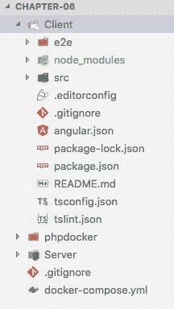
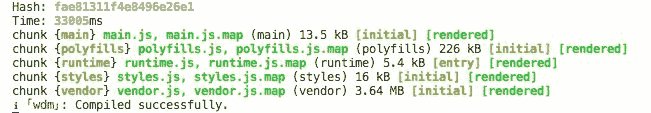
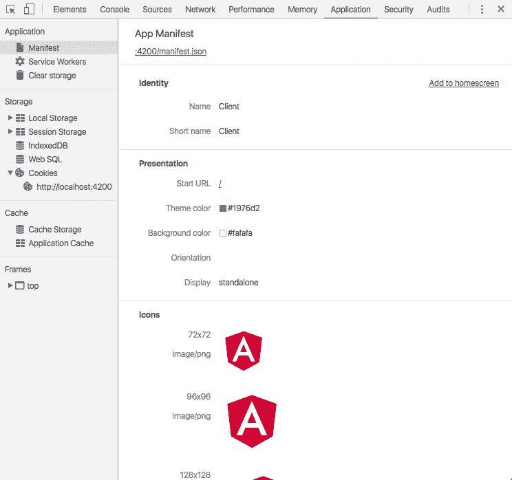
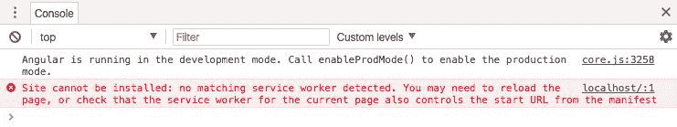
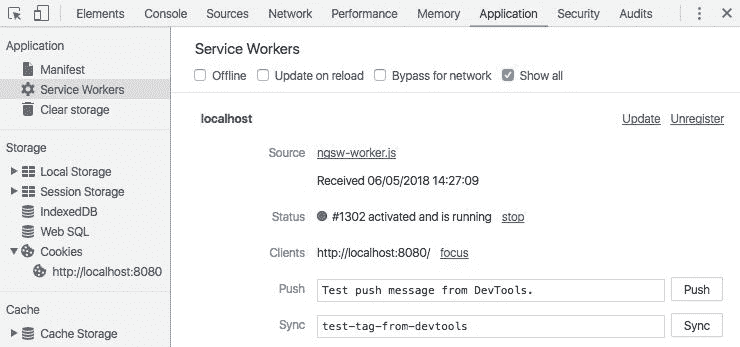
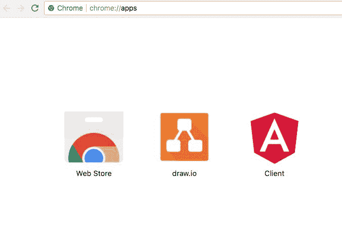
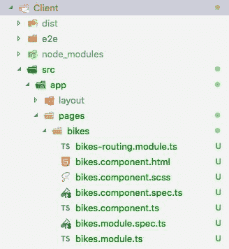

# 七、使用Angular命令行界面的渐进式网络应用

正如我们在[第 3 章](07.html)*中提到的理解 Angular 6* 的核心概念，Angular 是基于 JavaScript 开发现代 web 应用的主要框架之一。

在[第 6 章](06.html#3P3NE0-f24bf9337f074c079f0c90fd02324171)、*使用 Laravel Framework-2* 创建 RESTful API 中，我们使用 Laravel 资源、有说服力的关系和基于令牌的身份验证完成了后端 API。现在，我们拥有了将前端应用连接到后端所需的一切；在我们这样做之前，让我们看看我们将在本章中学到什么。

在本章中，我们将看到`angular-cli.json`文件中发生的一些变化，该文件现在为多个应用提供了改进的支持。

我们还将了解如何使用`ng add`创建**渐进式网络应用** ( **PWA** )，以及如何将我们的项目组织为模块。

在本章中，我们将介绍以下内容:

*   使用 Angular 命令行界面启动网络应用
*   为 PWA 建立基线
*   创建样板组件

# 使用 Angular 命令行界面启动网络应用

当我们开始写这一章时，Angular 框架已经推出了它的最新版本:版本 6。在前几章中，我们已经评论了这个版本中的一些新颖之处。

新版本更侧重于开发工具(如 Angular CLI)，而不是框架本身的演变。我们可以用`ng update`、`ng add`等命令引用 Angular CLI 的新功能，这些命令对于更新包和添加新包非常有用。

我们首先需要做的是在机器上更新 Angular CLI 打开终端窗口，键入以下命令:

```php
npm install -g @angular/cli
```

上述命令将在您的计算机上全局安装 Angular CLI 6.0.0。

# 准备基线代码

现在，我们需要准备我们的基线代码，这个过程与前几章非常相似。请遵循以下步骤:

1.  从`chapter-05`文件夹复制所有内容。
2.  将文件夹重命名为`chapter-07`。
3.  删除`storage-db`文件夹。

现在，让我们对`docker-compose.yml`文件进行一些更改，以适应新的数据库和服务器容器。

4.  打开`docker-compose.yml`并用以下内容替换内容:

```php
version: "3.1"
services:
    mysql:
      image: mysql:5.7
      container_name: chapter-07-mysql
      working_dir:     /application
      volumes:
        - .:/application
        - ./storage-db:/var/lib/mysql
      environment:
        - MYSQL_ROOT_PASSWORD=123456
        - MYSQL_DATABASE=chapter-06
        - MYSQL_USER=chapter-07
        - MYSQL_PASSWORD=123456
      ports:
        - "8083:3306"
    webserver:
      image: nginx:alpine
      container_name: chapter-07-webserver
      working_dir: /application
      volumes:
        - .:/application-
        ./phpdocker/nginx/nginx.conf:/etc/nginx/conf.d/default.conf
      ports:
        - "8081:80"
    php-fpm:
      build: phpdocker/php-fpm
      container_name: chapter-07-php-fpm
      working_dir: /application
      volumes:
        - ./Server:/application
        - ./phpdocker/php-fpm/php-ini-overrides.ini:
          /etc/php/7.2/fpm/conf.d/99-overrides.ini
```

请注意，我们更改了容器名称、数据库和 MySQL 用户:

*   `container_name: chapter-07-mysql`
*   `container_name: chapter-07-webserver`
*   `container_name: chapter-07-php-fpm`
*   `MYSQL_DATABASE=chapter-07`
*   `MYSQL_USER=chapter-07`

另一个需要注意的要点是`php-fpm`容器容积的配置，根据下面突出显示的代码，我们现在将其命名为`Server`而不是前面章节中的`project`:

```php
php-fpm:
        build: phpdocker/php-fpm
        container_name: chapter-07-php-fpm
        working_dir: /application
        volumes:
        - ./Server:/application
        - ./phpdocker/php-fpm/php-ini-overrides.ini:/etc/php/7.2/fpm/conf.d/99-overrides.ini
```

5.  在`vs.code`中打开`chapter-07`，将项目文件夹重命名为`Server`。

正如您在前面几章中看到的，Laravel 框架有一种定义明确的使用视图的方式；这要归功于构建 Laravel 的 MVC 标准。

另外，Laravel 使用了一个叫做 Vue.js 的 JavaScript 框架，可以在`./Server/resources/img/js`文件夹中找到。

为了不混淆，我们将在名为`Client`的文件夹中创建我们的前端应用，与新命名的`Server`文件夹处于同一级别。

6.  在`chapter-07`文件夹的根目录下创建一个名为`Client`的新文件夹。

在这些更改结束时，您应该会看到与下面截图相同的项目结构:


Application structure

这是保持应用与应用编程接口分离的最好方法。使用这种方法，我们有一些优势:

*   前端代码与应用的其余部分隔离开来；我们可以将其托管在静态网络服务中，例如**亚马逊网络服务** ( **AWS** )桶或任何其他网络服务器。
*   应用部署可以单独进行，这样应用编程接口就可以独立于前端应用而发展，反之亦然。

添加我们对 Git 源代码控制所做的更改。打开您的终端窗口，键入以下命令:

```php
git add .
git commit -m "Initial commit chapter 07"
```

# 用 Angular CLI 搭建一个网络应用

让我们开始使用新版本的 Angular 构建前端应用，使用 Angular CLI:

1.  在根项目中打开终端窗口，并键入以下命令:

```php
ng new Client --style=scss --routing
```

2.  前面的命令将创建我们需要的所有样板代码，这次使用样式表的 SCSS 语法和`--routing`标志来创建应用路由。
3.  在上一个命令的末尾，我们的应用将具有以下结构:



New application structure

4.  Angular 和 Angular CLI 的第 6 版带来的变化之一是`angular.json`文件，它之前被命名为`angular-cli.json`。它的结构非常不同，如下面的截图所示:


Angular JSON file

5.  至于应用文件，我们拥有几乎与以前相同的代码组织和文件，如下图所示:


New Angular app structure

在之前的截图中，注意我们现在有一个名为`browserlist`的文件；它用于向 CSS 生成的代码添加浏览器特定的前缀。

# 创建目录结构

为了方便我们的开发，我们将在应用中创建一些目录，这样我们的项目就可以扩展了。这意味着我们可以有组织地添加任何我们想要的模块/特性。

这一步非常重要，因为有时候，项目内部的结构是定义好的；不建议更改。

对于这一步，我们将使用模块或页面的命名法。我们将使用我们在上一章中创建的 API 定义服务作为基准:

*   一个主页，我们称之为`home`页面
*   摩托车的一页，我们称之为`bike-list`页
*   自行车详细信息页面，我们称之为`bike-details`页面
*   一个构建者页面，我们称之为`builders-list`页面
*   构建者详细信息页面，我们称之为`builder-details`页面
*   一个注册页面，我们称之为`register`页面
*   一个登录页面，我们称之为`login`页面

根据前面的描述，我们的应用将有以下页面或模块:

*   `bike`
*   `builder`
*   `register`
*   `login`
*   `home`

此时我们更喜欢使用*模块*或*页面*的术语来代替组件，不要与 Angular 提出的组件术语混淆，这里的一切都是基于组件的。

最后，这只是引用应用结构的一种不同方式。

1.  打开 VS 代码，在`Client/src/app`里面，新建一个名为`pages`的文件夹。

2.  仍然在 VS 代码中和`Client/src/app`里面，创建一个名为`layout`的新文件夹。

3.  仍然在 VS 代码中和`Client/src/app`里面，创建一个名为`shared`的新文件夹。

让我们看看下表中文件夹名称的含义:

| 文件夹 | 描述 |
| --- | --- |
| `pages` | 保存应用的所有模块和页面；例如`pages/bike/bike-component.html`和`pages/builder/builder-component.html`。 |
| `layout` | 保存所有布局组件；例如，`layout/nav/nav-component.html`、`layout/footer/footer-component.html`。 |
| `shared` | 保存共享服务、管道等；例如，所有应用页面或组件共享的服务。 |

因此，在第 3 步结束时，我们将拥有以下结构:


Folder structure

# 为 PWA 建立基线

正如我们之前讨论的，我们现在可以使用新的`ng add`命令来创建一个 PWA。但是，在此之前，我们先来看看 PWA 的概念。

PWA 是一套开发 web 应用的技术，逐步增加了以前只能在本地应用中使用的功能。

对用户来说，主要的优势是他们不必在知道是否值得之前下载应用。此外，我们可以列举以下优点:

*   **渐进式**:对于任何用户，无论浏览器如何
*   **响应性**:适用于任何设备:台式机、平板电脑和移动设备
*   **连接**:即使用户离线也能工作
*   **类似 app 的**:用户感觉好像在一个原生的 App 里
*   **更新**:无需下载应用更新；如果需要，浏览器将简单地自动检测和更新
*   **安全**:仅支持 HTTPs
*   **参与**:通过推送通知，用户可以持续参与
*   **可安装**:只需点击一下，就可以在智能手机主屏幕上添加一个图标
*   **SEO 友好**:搜索引擎可以找到应用的内容(对用户和商家都有好处)

You can read more about progressive web applications at [https://developers.google.com/web/progressive-web-apps/](https://developers.google.com/web/progressive-web-apps/).

PWA 在构建本机应用时仍有如下缺点:

*   pwa 还不能完全控制设备的硬件；蓝牙、联系人列表和 NFC 是 PWA 无法访问的一些功能示例。
*   尽管谷歌、微软和 Mozilla 在 PWAs 上押注很高，但苹果没有。
*   Safari 仍然不支持两个重要功能:推送通知和离线操作。但苹果已经在考虑实施 PWAs，尽管它可能没有太多选择。

对于所有的负面影响，这只是一个时间问题——考虑一下，Angular 团队已经为我们提供了仅使用 Angular CLI 创建 PWAs 的支持。

# 使用 ng add 添加 PWA 功能

现在，让我们看看如何做到这一点。

在`chapter-06/Client`文件夹内打开终端窗口，输入以下命令:

```php
ng add @angular/pwa
```

前面的命令将生成类似于下面截图的输出:


Angular PWA output

# 了解 PWA 中的关键文件

让我们检查一下应用文件中的一些重要更改。前面的命令将在根文件夹中添加两个新文件。

`manifest.json`文件用于设置:

*   主题颜色
*   应用名称
*   默认显示模式
*   图标配置和大小

此外，还可以设置描述标签、相关应用和平台。

一个`ngsw-config.json`文件(也称为服务工作者配置)，用于设置资产组、数据组、导航 URL 和缓存。

在`src/assets`里面创建了一个名为`icons`的新文件夹；此图标将作为应用书签显示在您的手机屏幕上。

并且更新了以下文件:

*   `angular.json`。
*   `package.json`增加:`@angular/pwa`和`@angular/service-worker`。
*   `app.module.ts`登记生产中的服务人员。这意味着我们可以通过使用 production 命令看到服务工作者在工作；在本章的后面，我们将看到如何使用它。
*   `index.html`在`<head>`标签中添加`manifest.json`文件和主题颜色。

# 普华永道在行动

正如我们在步骤 4 中提到的，Angular 引擎仅在生产模式下应用应用中的服务工作；也就是说，只有当我们使用`ng build`命令时。

那么，让我们看看这在实践中是如何工作的。但是首先，让我们看看一切是否如预期的那样发生了，应用的创建和`@angular/pwa`的安装:

1.  在`./Client`文件夹中打开终端窗口，输入以下命令:

```php
npm start
```

记住`npm start`命令和`ng server`是一样的；你可以在`package.json`内部的`scripts`标签上查看所有的`npm`别名。在那里，我们有以下别名:

```php
     "scripts": {
                "ng": "ng",
                "start": "ng serve",
                "build": "ng build",
                "test": "ng test",
                "lint": "ng lint",
                "e2e": "ng e2e"
        }
```

在上一个命令的末尾，我们可以看到以下消息作为输出:

```php
** Angular Live Development Server is listening on localhost: 4200, open your browser on http://localhost:4200/ **
```

接下来是类似如下的输出:



Angular dev server output

2.  打开默认浏览器，导航至`http://localhost:4200/`。

现在，您可以看到欢迎屏幕:


Angular welcome screen

让我们检查一下`manifest.json`文件。几乎所有的新浏览器都有一个网络检查器，我们可以在那里调试任何网站或网络应用。对于下一个检查，我们将使用 Chrome 浏览器，但是您可以使用您默认的或最喜欢的浏览器。

3.  在浏览器中，点按“打开”以打开网络检查器。
4.  如果你在 Chrome 中，点击应用菜单标签。
5.  点击左侧菜单上的**清单**，你会看到一个类似如下截图的面板:



Web inspector

从上一张截图可以看到，一切看起来都如预期；我们的`manifest.json`文件是可用的，具有我们之前看到的所有配置。

请注意“标识”标题右侧的“添加到主屏幕”链接；这意味着我们可以在手机主屏幕或浏览器应用的选项卡上添加这个应用。

6.  但是，如果单击此链接，您将看到控制台错误，如下图所示:



Service worker console error

这意味着我们没有服务人员，这是真的。请记住，Angular 只会在生产中注入服务工人，我们在幕后使用的是 **`ng server`** 。

此外，如果您单击服务工作右侧菜单，您将看到一个空面板。

# 在生产模式下运行应用

现在，是时候检查一下我们在生产模式下的应用，以了解服务是如何工作的:

1.  返回终端窗口，使用以下命令停止 Angular 服务器:

```php
control + c
```

2.  仍然在终端中，键入`build`命令:

```php
ng build --prod
```

请注意，前面的`npm build`别名命令没有使用
`--prod`标志。所以，你需要使用`ng build --prod`
命令，或者用`--prod`旗更新`npm build`命令。

在上一个命令的末尾，我们可以看到`Client`目录中的另一个文件夹，叫做`dist`。

# Angular服务–行动中的工人

现在，是时候启动在`./Client/dist/Client`文件夹内生成的应用，以查看服务工作的运行情况了。暂时不要担心这条路；在本书的后面，我们将对其进行修改:

1.  打开`./Client/dist/Client`文件夹内的终端窗口，输入以下命令:

```php
http-server -p 8080
```

Remember that we installed the HTTP server in the previous chapter; if you haven't done so, go to [https://www.npmjs.com/package/http-server](https://www.npmjs.com/package/http-server) and follow the installation process.

2.  在`http://localhost:4200/`打开浏览器。
3.  在浏览器中，打开网页检查器面板，点击**应用**选项卡菜单。

您将看到以下内容:



Web inspector application panel

现在，我们已经在应用中正确配置并运行了服务人员。

4.  返回浏览器，点击右侧菜单中的**清单**菜单。

5.  现在，点击添加到**主屏幕**链接。

恭喜你！您已将我们的应用添加到您的应用面板。如果您在 Chrome 中，您将看到以下内容:



Application icon

所以，如果你点击Angular图标，你会被重定向到`http://localhost:8080/`。

此时此刻，我们已经有了 PWA 的基础。

不要担心应用名称；我们用的是`Client`，但是在现实世界中，你可以选择自己的名字。

# 调试渐进式 web 应用

现在，我们将展示一个非常有用的工具来调试渐进式 web 应用。它是 Chrome 导航器的扩展，名为灯塔:

You can get more information about Lighthouse at [https://chrome.google.com/webstore/detail/lighthouse/blipmdconlkpinefehnmjammfjpmpbjk/related?hl=us-EN](https://chrome.google.com/webstore/detail/lighthouse/blipmdconlkpinefehnmjammfjpmpbjk/related?hl=us-EN).

1.  打开 Chrome 浏览器，点击右侧灯塔扩展，如下图截图所示:


Lighthouse extension

2.  点击**生成报告**按钮。

生成报告后，您将看到类似于以下屏幕截图的结果:


Lighthouse report

灯塔将分析五个主要项目:

*   表演
*   艾滋病患者
*   易接近
*   最佳实践
*   **搜索引擎优化** ( **SEO** )

请注意，我们在每个类别中都有很高的分数水平，即使没有任何内容；现在让我们专注于 SEO 类别。

让我们看看如何改进 SEO。

3.  点击左侧菜单中的 SEO 您将看到以下截图:


前面的警告告诉我们，我们的应用在`index.html`上没有元描述标签。所以，让我们解决它。

打开`./Client/src/index.html`并在视口元标签后添加以下代码:

```php
<metaname="description" content="Hands-On Full-Stack Web Development with Angular 6 and Laravel 5">
```

如果我们再次检查，我们将看到以下报告:


请注意，我们有一个搜索引擎优化 100%的分数

通过这种方式，我们可以找到应用中的所有问题，并正确纠正它们。

我们现在有了准备应用以使用我们的 API 所需的一切，但是我们仍然有很多工作要做来构建前端应用。

在接下来的步骤中，我们将了解如何使用 Angular CLI 添加组件。

# 创建样板Angular组件

正如我们之前看到的，我们的应用有一些页面用于注册、登录以及摩托车列表、建筑商列表和摩托车投票方案的可视化。此时，我们将创建所有必要的代码来组合这些特性。

# 创建主模块和组件

在接下来的几行中，我们将创建`home`模块和组件:

1.  在`./Client/src/app`中打开您的终端窗口，并键入以下命令:

```php
ng generate module pages/home --routing
```

正如我们之前看到的，前面的命令将生成三个新文件:

*   `src/app/pages/home/home-routing.module.ts`
*   `src/app/pages/home/home.modules.spec.ts`
*   `src/app/pages/home/home.module.ts`

现在，我们只需要生成`home`组件。

2.  仍然在终端中，键入以下命令:

```php
ng g c pages/home
```

在上一个命令结束时，您将在`pages`文件夹中看到以下结构:


Home module structure

请注意，我们创建了一个完整的模块/文件夹，正如我们之前解释的那样。现在，我们可以调用新文件夹`home`。我们需要将新创建的`home`模块导入到我们的主项目中；让我们看看如何做到这一点。

3.  打开`src/app/app.modules.ts`并添加以下代码行:

```php
// Application modules
import { HomeModule } from './pages/home/home.module';
@NgModule({
    declarations: [
    AppComponent
    ],
imports: [
    BrowserModule,
    AppRoutingModule,
    HomeModule,
    ServiceWorkerModule.register('/ngsw-worker.js', { enabled:         environment.production })
    ],
providers: [],
bootstrap: [AppComponent]
})
export class AppModule { }
```

# 创建自行车模块和组件

现在，是时候创建另一个模块和组件了；让我们看看如何做到:

1.  仍然在您的终端窗口中，在`./Client/src/app`中，键入以下命令:

```php
ng generate module pages/bikes --routing
```

正如我们之前看到的，前面的命令将生成三个新文件:

*   `src/app/pages/bikes/bikes-routing.module.ts`
*   `src/app/pages/bikes/bikes.modules.spec.ts`
*   `src/app/pages/bikes/bikes.module.ts`

现在，我们只需要生成`bike`组件。

2.  键入以下命令:

```php
ng g c pages/bikes
```

在上一个命令结束时，您将在`pages`文件夹中看到以下结构:



Bike module structure

现在，我们可以调用新的文件夹`bikes`(作为自行车模块)。我们需要将新创建的`bikes`模块导入到我们的主项目中；让我们看看如何做到这一点。

3.  打开`src/app/app.modules.ts`并添加以下代码行:

```php
// Application modules
import { BikesModule } from './pages/bikes/bikes.module';
@NgModule({
    declarations: [
    AppComponent
    ],
imports: [
    BrowserModule,
    AppRoutingModule,
    HomeModule,
    BikesModule,
    ServiceWorkerModule.register('/ngsw-worker.js', { enabled:         environment.production })
    ],
providers: [],
    bootstrap: [AppComponent]
})
export class AppModule { }
```

注意，我们正在注入新创建的`BikesModule`作为`app.module`的从属。

现在，是时候对构建器、登录和注册页面执行相同的操作了。

# 创建构建器模块和组件

是时候使用 Angular CLI 创建`builders`模块了。让我们看看如何做到这一点:

1.  打开您的终端窗口，键入以下命令:

```php
ng generate module pages/builders --routing
```

如前所述，前面的命令将生成三个新文件:

*   `src/app/pages/builders/builders-routing.module.ts`
*   `src/app/pages/builders/builders.modules.spec.ts`
*   `src/app/pages/builders/builders.module.ts`

2.  仍然在终端窗口中，键入以下命令来生成组件:

```php
ng g c pages/builders
```

3.  将新创建的模块添加到应用模块中；打开`src/app/app.modules.ts`并添加以下代码行:

```php
// Application modules
import { BikesModule } from './pages/bikes/bikes.module';
import { BuildersModule } from './pages/builders/builders.module';
@NgModule({
    declarations: [
    AppComponent
    ],
imports: [
    BrowserModule,
    AppRoutingModule,
      HomeModule,
    BikesModule,
    BuildersModule,
    ServiceWorkerModule.register('/ngsw-worker.js', { enabled:         environment.production })
    ],
providers: [],
    bootstrap: [AppComponent]
})
export class AppModule { }
```

# 准备授权路由–登录、注册和注销组件

现在，我们可以创建授权路线，包括`Login`和`Register`；同样，我们将使用 Angular CLI 的功能来创建新的模块和组件:

1.  打开您的终端窗口，键入以下命令:

```php
ng generate module pages/auth --routing
```

2.  仍然在终端窗口中，键入以下命令来生成组件:

```php
ng g c pages/auth/login
```

3.  将新创建的模块添加到应用模块中；打开`src/app/auth/auth.modules.ts`并添加以下代码行:

```php
 import { LoginComponent } from  './login/login.component';

     @NgModule({

     imports: [

     CommonModule,

     AuthRoutingModule

     ],

     declarations: [LoginComponent]

 }) 
```

注意；这次我们把`LoginComponent`加到了`auth.module.ts`、
没有加到`app.module.ts`。

现在，是时候在`auth.module`内部创建`register`组件了。

4.  打开您的终端窗口，键入以下命令:

```php
ng g c pages/auth/register
```

5.  将新创建的模块添加到应用模块中；打开`src/app/auth/auth.modules.ts`并添加以下代码行:

```php
import { RegisterComponent } from  './register/register.component';

    @NgModule({

    imports: [

    CommonModule,

    AuthRoutingModule

    ],

    declarations: [LoginComponent, RegisterComponent]

})
```

6.  打开您的终端窗口，键入以下命令:

```php
ng g c pages/auth/logout
```

7.  将新创建的模块添加到应用模块中；打开`src/app/auth/auth.modules.ts`并添加以下代码行:

```php
import { LogoutComponent } from  './logout/logout.component';

@NgModule({

    imports: [

    CommonModule,

    AuthRoutingModule

    ],

    declarations: [LoginComponent, RegisterComponent, 
    LogoutComponent]

})
```

至此，我们的认证模块完成；也就是说，我们将使用的所有组件–`register`、`login`和`logout`。但是我们仍然需要将新模块注入到主应用模块中。

8.  打开 app 模块，打开`src/app/app.modules.ts`，添加以下几行代码:

```php
// Application modules
import { BikesModule } from './pages/bikes/bikes.module';
import { BuildersModule } from './pages/builders/builders.module';
import { AuthModule } from './pages/auth/auth.module';
@NgModule({
    declarations: [
    AppComponent
    ],
imports: [
    BrowserModule,
    AppRoutingModule,
    BikesModule,
    BuildersModule,
    AuthModule,
    ServiceWorkerModule.register('/ngsw-worker.js', { enabled:
environment.production })
    ],
    providers: [],
    bootstrap: [AppComponent]
    })
export class AppModule { }
```

在此步骤结束时，您将拥有以下结构:


Application modules structure

# 创建布局组件

在本节的最后一步，我们将为应用的主导航创建一个布局组件。请注意，这一次，我们将只创建组件本身，而不创建模块和路由。

仍然在终端窗口中，键入以下命令:

```php
ng g c layout/nav
```

前面的命令将生成以下结构:


Layout folder structure

# 摘要

恭喜你；您刚刚完成了另一章，现在您有了一个可靠的前端应用，准备接收它需要的所有功能。

在本章中，我们使用先进的代码组织技术，用 Angular 创建了一个渐进式 web 应用。您还学习了如何使用 Angular CLI 创建模块和组件。

在下一章中，我们将学习如何创建应用的组件和路由。