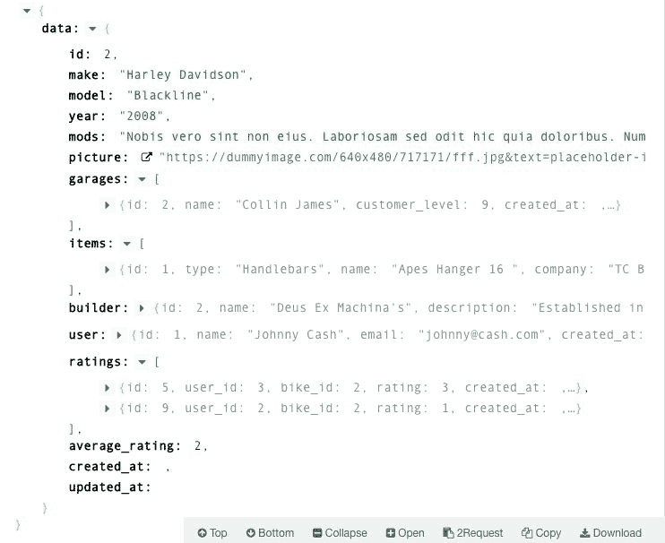
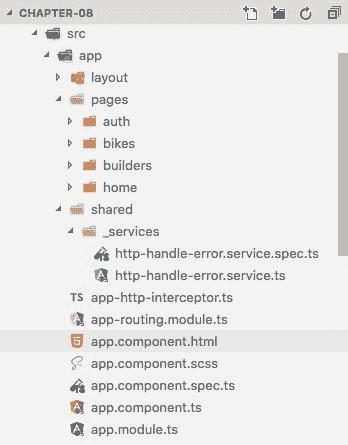

# 创建服务和用户身份验证

在这一章，我们有很多工作要做。我们将创建许多新的东西，并重构一些东西。这是一个以有规律和进步的方式学习东西的好方法。

我们将深入探讨 Angular 的 HTTP 模块的操作和使用，称为`HttpClient`。

此外，我们将看到如何使用拦截器和处理错误。

新版本的 Angular 为创建现代 web 应用提供了极其有用的工具，在本章中，我们将使用其中的许多资源。

在本章中，我们将涵盖以下主题:

*   处理模型和类
*   使用新的`HttpModule`和`HttpModuleClient`来处理 XHR 请求
*   处理`HttpErrorHandler`服务
*   如何使用授权头
*   如何使用路由保护程序保护应用路由

# 准备基线代码

现在，我们需要准备我们的基线代码，这个过程非常类似于我们在上一章中所做的。让我们遵循以下步骤:

1.  从`chapter-08`文件夹复制所有内容。
2.  将文件夹重命名为`chapter-09`。
3.  删除`storage-db`文件夹。

现在，让我们对`docker-compose.yml`文件进行一些更改，以便它能够适应新的数据库和服务器容器。

4.  打开`docker-compose.yml`并用以下代码替换其内容:

```php
 version: "3.1"
 services:
     mysql:
       image: mysql:5.7
       container_name: chapter-09-mysql
       working_dir: /application
       volumes:
         - .:/application
         - ./storage-db:/var/lib/mysql
       environment:
         - MYSQL_ROOT_PASSWORD=123456
         - MYSQL_DATABASE=chapter-09
         - MYSQL_USER=chapter-09
         - MYSQL_PASSWORD=123456
       ports:
         - "8083:3306"
     webserver:
       image: nginx:alpine
       container_name: chapter-09-webserver
       working_dir: /application
       volumes:
         - .:/application
         -./phpdocker/nginx/nginx.conf:/etc/nginx/conf.d/default
         .conf
       ports:
         - "8081:80"
     php-fpm:
       build: phpdocker/php-fpm
       container_name: chapter-09-php-fpm
       working_dir: /application
       volumes:
         - ./Server:/application
         - ./phpdocker/php-fpm/php-ini-
           overrides.ini:/etc/php/7.2/fpm/conf.d/99-overrides.ini
```

请注意，我们更改了容器名称、数据库和 MySQL 用户:

*   `container_name: chapter-09-mysql`
*   `container_name: chapter-09-webserver`
*   `container_name: chapter-09-php-fpm`
*   `MYSQL_DATABASE=chapter-09`
*   `MYSQL_USER=chapter-09`

5.  添加我们对 Git 源代码控制所做的更改。打开您的终端窗口，键入以下命令:

```php
 git add .
 git commit -m "Initial commit chapter 09"
```

# 处理模型和类

被 Angular 开发人员社区认为是好的实践(我们认为这是必要的)是创建类来使用它们作为模型。这些也被称为**域模型**。

我们相信创建类来存储我们的模型是创建大规模应用甚至小应用的一个非常重要的资源。这有助于保持代码的条理。

想象一下，如果我们的项目要大得多——如果所有数据都存储在普通对象中，新开发人员很难找到数据存储的位置。

这也是使用类来存储我们的模型信息的一个很好的理由。

# 创建用户类模型

让我们从创建存储用户信息的类开始。按照惯例，我们将这个文件命名为`user.ts`:

1.  打开您的终端窗口。

2.  转到`./Client/src/app`并键入以下命令:

```php
 ng g class pages/auth/user
```

3.  上一条命令将在`./app/pages/auth/auth.ts`中创建一个新文件。打开此文件并添加以下代码:

```php
 export  class  User {
        name?:  string;
        email?:  string;
        password?:  string;
        constructor() {}
 }
```

# 创建构建器类模型

现在，让我们为构建器创建模型，并更好地理解作为模型的类的操作。在此之前，当我们对`api/builders/1`端点进行 GET 时，我们会观察到 API 的返回，如下图所示:


Builder-detail JSON result

在之前的截图中，我们已经在建筑商的详细请求中包含了自行车信息。让我们看看如何使用`builders`类来做到这一点:

1.  仍然在终端中，键入以下命令:

```php
 ng g class pages/builders/builder
```

2.  上一条命令将在`./app/pages/builders/builder.ts`中创建一个新文件。打开此文件并添加以下代码:

```php
 import { Bike } from  '../bikes/bike';

 export  class  Builder {
        id:  number;
        name:  string;
        description:  string;
        location:  string;
        bike?:  Bike;

        constructor() {}
 }
```

注意，在前面的代码中，我们添加了一个可选的`bike`属性，并将其类型设置为`Bike`模型。

# 创建自行车类模型

现在，是时候创建自行车模型类了，但是首先让我们检查一下我们在自行车的细节端点`api/bikes/2`上拥有的 JSON 格式，如下面的截图所示:



bike-detail JSON result

这里我们可以注意到`bike-detail`结果指向`garages`、`items`、`builder`、`user`、`ratings`。对于我们正在构建的示例应用，我们将只使用构建器和用户模型。不要担心其他人；我们将在这里使用的示例足以理解模型领域:

1.  仍然在终端中，键入以下命令:

```php
 ng g class pages/bikes/bike
```

2.  上一条命令将在`./app/pages/bikes/bike.ts`中创建一个新文件。打开此文件并添加以下代码:

```php
 import { User } from  './../auth/user';
 import { Builder } from  '../builders/builder';

 export  class  Bike {
        id:  number;
        make:  string;
        model:  string;
        year:  string;
        mods:  string;
        picture:  string;
        user_id:  number;
        builder_id:  number;
        average_rating?: number;
        user?:  User;
        builder?:  Builder;
        items?:  any;
        ratings?:  any;

        constructor() {}
 }
```

注意，在前面的代码中，我们使用了前面截图中的所有属性，包括`items`和`ratings`，作为类型为`any`的可选属性，因为我们没有为这些属性创建模型。

# 使用新的 HttpClient 处理 XHR 请求

现在绝大多数的网络应用都使用`XMLHttpRequest` (XHR)请求，而用 Angular 做的应用也没什么不同。为此，我们有了`HTTPClient`模块，它取代了以前版本中的旧 HTTP 模块。

在本课程中，我们将了解如何在 Angular 服务中使用 XHR 请求。

强烈建议您使用 Angular 服务来处理这种类型的请求，以便组件的代码更有条理，更易于维护。

You can read more about XHR requests at [https://developer.mozilla.org/en-US/docs/Web/API/XMLHttpRequest](https://developer.mozilla.org/en-US/docs/Web/API/XMLHttpRequest).

# 创建授权服务

让我们创建一个文件来存储身份验证模块所需的代码:

1.  仍然在终端中，键入以下命令:

```php
 ng g service pages/auth/_services/auth
```

上一条命令将在`./app/pages/auth/_services/auth.service.ts`中创建新的文件夹和文件。现在，让我们添加一些代码。

2.  打开`./app/pages/auth/_services/auth.service.ts`并在文件顶部添加以下导入:

```php
 import { HttpClient, HttpParams, HttpErrorResponse } from  '@angular/common/http';
 import { HttpHeaders } from  '@angular/common/http';
 import { Router } from  '@angular/router';
 import { Observable, throwError } from  'rxjs';
 import { catchError, map, tap } from  'rxjs/operators';

 // App imports
 import { environment } from  './../../../environments/environment';
 import { User } from  './user';
```

现在，我们将使用`HttpHeaders`来设置 XHR 请求的内容类型。

3.  在导入文件后立即添加以下代码:

```php
 // Setup headers
 const httpOptions  = {
```

```php
        headers: new  HttpHeaders({
                'Content-Type': 'application/json'
        })
 };
```

前面的代码示例将使用`HttpHeaders`向我们的请求添加一个新的头。

4.  在`AuthService`类中，添加以下代码:

```php
 public  currentUser:  User;
 private  readonly  apiUrl  =  environment.apiUrl;
 private  registerUrl  =  this.apiUrl  +  '/register';
 private  loginUrl  =  this.apiUrl  +  '/login';
```

你一定在问自己为什么`currentUser`是`public` 而其他的是`private`，对吗？

嗯，`currentUser`属性是`public`，因为我们将在其他文件中访问它，我们将在本节后面看到。因此，在`AuthService`之外，其他物业将不可用。

5.  现在，让我们创建我们的`constructor`函数。在`constructor`功能中，添加以下代码:

```php
 private  http:  HttpClient, private  router:  Router
```

6.  `constructor`类看起来像下面的代码:

```php
     constructor(
                private  http:  HttpClient,
                private  router:  Router) {}
```

这里需要注意的是，我们使用的是`HttpClient`和`Router`模块，所以是时候编写我们的函数来实际查看这个模块了。

# 创建注册功能

让我们创建`Register`函数。在`constructor`功能之后，让我们添加以下代码:

```php
     onRegister(user: User): Observable<User> {
                const request  =  JSON.stringify(
                        { name: user.name, email: user.email, password:
                 user.password }
                );
                return  this.http.post(this.registerUrl, request,
                httpOptions)
                .pipe(
                        map((response:  User) => {
                                // Receive jwt token in the response
                                const  token: string  =
                                response['access_token'];
                                // If we have a token, proceed
                                if (token) {
                                        this.setToken(token);
                                        this.getUser().subscribe();
                                }
                                return  response;
                        }),
                catchError(error  =>  this.handleError(error))
                );
        }
```

请注意，我们使用的是包含在 Angular 中的 JavaScript ( **RxJS** )的**反应扩展库中的`pipe()`、`map()`和`catchError()`函数。**

在使用 RxJS 库之前，在 AngularJS 应用中使用名为 Lodash 的库来操作结果是非常常见的。

You can read more about the RxJS library in the official documentation link [https://rxjs-dev.firebaseapp.com/api](https://rxjs-dev.firebaseapp.com/api).

我们正在使用`pipe()`函数，该函数允许我们链接其他函数，当我们使用可观察对象时，这非常有趣。在`pipe()`功能中，这正是我们使用`map()`和`catchError()`功能所做的。

此外，我们还使用了三个名为`setToken()`、`getUser()`和`handleError()`的本地函数，我们将在后面介绍。

请记住，函数名极其重要。尝试使用不言自明的名称，就像我们在`setToken`和`getUser`中所做的那样。

# 创建登录功能

`Login`功能遵循与`Register`功能几乎相同的结构。这里的不同之处在于，我们只是将电子邮件地址和密码发送到服务器。

在`onRegister()`功能后添加以下代码:

```php
     onLogin(user: User): Observable<User> {
                const request  =  JSON.stringify(
                        { email: user.email, password: user.password }
                );
                return  this.http.post(this.registerUrl, request,
                httpOptions)
                .pipe(
                        map((response:  User) => {
                                // Receive jwt token in the response
                                const  token: string  = 
                                response['access_token'];
                                // If we have a token, proceed
                                if (token) {
                                        this.setToken(token);
                                        this.getUser().subscribe();
                                }
                                return  response;
                        }),
                catchError(error  =>  this.handleError(error))
                );
        }
```

请注意，我们正在使用`setToken()`功能保存用户令牌，并使用`getUser()`功能获取用户详细信息。我们将在本节后面详细介绍这一点。

# 创建注销功能

对于注销功能，我们将使用不同的方法。我们将使用`tap()`运算符，而不是使用`map()`运算符。

在`onLogin()`功能后添加以下代码:

```php
onLogout():  Observable<User> {
        return  this.http.post(this.apiUrl  +  '/logout',
          httpOptions).pipe(
                tap(
                        () => {
                                localStorage.removeItem('token');
                                this.router.navigate(['/']);
                                }
                        )
                );
}
```

在前面的代码中，我们只是从`localStorage`中移除令牌，并将用户重定向到主页。现在，是时候创建本地函数来处理数据了。

# 创建 setToken 和 getToken 函数

我们几乎已经完成了我们的身份验证服务，但是我们仍然需要创建一些助手函数，我们将在其他应用块中使用这些函数。

让我们创建处理用户令牌的函数。用 Laravel 从我们的后端重新创建调用，我们正在使用`jwt-auth`库来验证我们的用户。

在这个例子中，我们使用`localStorage`来存储用户的令牌。因此，让我们创建两个非常简单的函数来编写和检索这个令牌。

在`logout()`功能之后，添加以下代码块:

```php
setToken(token:  string):  void {
        return  localStorage.setItem('token', token );
}

getToken():  string {
        return  localStorage.getItem('token');
}
```

# 创建 getUser 函数

现在，我们将看到如何获取登录用户的信息。请记住，我们的 API 有一个端点，它根据身份验证令牌向我们提供登录用户的信息。

让我们看看如何以简单的方式做到这一点。

在`getToken()`功能后添加以下代码:

```php
getUser():  Observable<User> {
        return  this.http.get(this.apiUrl  +  '/me').pipe(
                tap(
                        (user: User) => {
                                this.currentUser  =  user;
                        }
                )
        );
}
```

前面的代码从应用编程接口接收用户信息，并将其应用于`currentUser`属性。

# 创建经过身份验证的函数

现在，我们将再创建一个函数。该功能将帮助我们识别用户是否登录。

在`getUser()`功能后添加以下代码:

```php
 isAuthenticated(): boolean {
 // get the token
 const token: string = this.getToken();
 if (token) {
     return true;
 }
 return false;
 }
```

现在，只要使用`AuthService.currentUser`和`AuthService.isAuthenticated`方法，我们就可以在任何地方使用这些信息。

# 创建句柄错误函数

你应该注意到`login()`和`register()`函数有一个`catchError`函数指向另一个叫做`handleError`的函数。此时此刻，我们将创建这个函数，它负责显示我们的请求可能存在的错误。

在 **`getUser()`** 功能后添加以下代码:

```php
private  handleError(error:  HttpErrorResponse) {
        if (error.error  instanceof  ErrorEvent) {
                // A client-side error.
                console.error('An error occurred:',
                error.error.message);
        } else {
                // The backend error.
                return  throwError(error);
        }
        // return a custom error message
        return  throwError('Ohps something wrong happen here; please try again later.');
}
```

我们正在将错误消息记录到浏览器控制台，仅针对本例。

# 创建自行车服务

现在，我们将创建一个服务来保持所有的自行车操作。请记住，对于自行车和建筑商来说，我们的服务必须有列表、详细信息、创建、更新和删除的方法:

1.  仍然在终端中，键入以下命令:

```php
 ng g service pages/bikes/_services/bike
```

上一条命令将在`./app/pages/bikes/_services/bike.service.ts`中创建新的文件夹和文件。现在，让我们添加一些代码。

2.  打开`./app/pages/bikes/_services/bike.service.ts`并在文件顶部添加以下导入:

```php
 import { Injectable } from  '@angular/core';
 import { HttpClient, HttpParams, HttpErrorResponse } from  '@angular/common/http';
 import { HttpHeaders } from  '@angular/common/http';
 import { Observable, throwError } from  'rxjs';
 import { catchError } from  'rxjs/operators';

 // App import
 import { environment } from  '../../../../environments/environment';
 import { Bike } from  '../bike';
```

3.  在`bikesService`类中，添加以下属性:

```php
 private  readonly  apiUrl  =  environment.apiUrl;
 private  bikesUrl  =  this.apiUrl  +  '/bikes';
```

4.  现在，让我们创建我们的`constructor`函数。在`constructor`功能中，添加以下代码:

```php
 constructor(private  http:  HttpClient) {}
```

现在，我们准备创建我们的自行车服务的功能。

# 创建 CRUD 函数

如前所述， **CRUD** 代表`Create`、`Read`、`Update`和`Delete`。我们将一次性添加所有操作的代码，然后进行必要的注释。

在`constructor()`功能后添加以下代码块:

```php
 /** GET bikes from bikes endpoint */
 getBikes ():  Observable<Bike[]> {
        return  this.http.get<Bike[]>(this.bikesUrl)
        .pipe(
                catchError(error  =>  this.handleError(error))
        );
 }

 /** GET bike detail from bike-detail endpoint */
 getBikeDetail (id:  number):  Observable<Bike[]> {
        return  this.http.get<Bike[]>(this.bikesUrl  +  `/${id}`)
        .pipe(
                catchError(error  =>  this.handleError(error))
        );
 }

 /** POST bike to bikes endpoint */
 addBike (bike:  Bike):  Observable<Bike> {
        return  this.http.post<Bike>(this.bikesUrl, bike)
        .pipe(
                catchError(error  =>  this.handleError(error))
        );
 }

 /** PUT bike to bikes endpoint */
 updateBike (bike:  Bike, id:  number):  Observable<Bike> {
        return  this.http.put<Bike>(this.bikesUrl  +  `/${id}`, bike)
        .pipe(
                catchError(error  =>  this.handleError(error))
        );
 }

 /** DELETE bike bike endpoint */
 deleteBike (id:  number):  Observable<Bike[]> {
        return  this.http.delete<Bike[]>(this.bikesUrl  +  `/${id}`)
        .pipe(
                catchError(error  =>  this.handleError(error))
        );
 }

 /** Vote on bike */
 voteOnBike (vote:  any, bike:  number):  Observable<any> {
        const  rating  =  vote;
        return  this.http.post(this.bikesUrl  +  `/${bike}/ratings`, {rating})
        .pipe(
                catchError(error  =>  this.handleError(error))
        );
 }
```

除了使用模板字符串之外，前面的代码与我们在身份验证服务中使用的代码没有什么特别的不同:

```php
this.bikesUrl  +  `/${id}`
this.bikesUrl  +  `/${bike}/ratings`, {rating}
```

这些由反勾(```php`)字符表示，而不是单引号或双引号，以及以美元符号开头的表达式。

# 创建 voteOnBike 函数

我们的服务还有一个功能，我们将使用它来发送特定自行车的用户投票。请记住，每当您需要使用`HTTPClient`模块时，请在服务中执行此操作。这被认为是 Angular 开发中的良好实践。

在`deleteBike()`功能后添加以下代码:

```
     /** Vote on bike */
        voteOnBike (vote:  number, bike:  number):  Observable<any> {
                const  rating  =  vote;
                return  this.http.post(this.bikesUrl  + 
                `/${bike}/ratings`, {rating})
                .pipe(
                        catchError(error  =>  this.handleError(error))
                );
        }
```php

# 创建句柄错误函数

现在，让我们添加自行车服务的错误处理。在`voteOnBike()`功能后添加以下代码:

```
     /** Error handler */
        private  handleError(error:  HttpErrorResponse) {
                if (error.error  instanceof  ErrorEvent) {
                        // A client-side error.
                        console.error('An error occurred:', 
                error.error.message);
                } else {
                        // The backend error.
                        return  throwError(error);
                }
                // return a custom error message
                return  throwError('Something bad happened; please try
                again later.');
        }
```php

我们可以看到，自行车服务上的`handleError()`功能和认证服务是一样的，在建设者服务上也会是一样的。每当您需要多次编写相同的代码时，强烈建议您为此使用服务，从而避免代码的重复。

稍后，我们将创建一个服务来解决这个问题，但现在我们将创建建设者的服务。

# 创建建筑商服务

现在，我们将使用`Create`、`Read`、`Update`和`Delete`方法创建`builder`服务:

1.  仍然在终端中，键入以下命令:

```
 ng g service pages/builders/_services/builder
```php

上一条命令将在`./app/pages/builders/_services/builder.service.ts`中创建新的文件夹和文件。现在，让我们添加一些代码。

2.  打开`./app/pages/builders/_services/builder.service.ts`并用以下块替换其代码:

```
     import { Injectable } from  '@angular/core';

        import { HttpClient, HttpParams, HttpErrorResponse } from
       '@angular/common/http';
        import { HttpHeaders } from  '@angular/common/http';
        import { Observable, throwError } from  'rxjs';
        import { catchError } from  'rxjs/operators';

        // App import
        import { environment } from
        '../../../../environments/environment';
        import { Builder } from  '../builder';
        @Injectable({
                providedIn: 'root'
        })

        export  class  BuildersService {
                private  readonly  apiUrl  =  environment.apiUrl;
                private  buildersUrl  =  this.apiUrl  +
         '/builders';

                constructor(private  http:  HttpClient) { }

                /** GET builders from builders endpoint */
                getBuilders ():  Observable<Builder[]> {
                        return  this.http.get<Builder[]>
      (this.buildersUrl)
                                .pipe(
                                        catchError(error  =>
       this.handleError(error))
                                );
                }

                /** GET builder detail from builder-detail endpoint
        */
                getBuilderDetail (id:  number):
        Observable<Builder[]> {
                return  this.http.get<Builder[]>(this.buildersUrl  +  
        `/${id}`)
                        .pipe(
                                catchError(error  => 
        this.handleError(error))
                        );
                }

                /** POST builder to builders endpoint */
                addBuilder (builder:  Builder):  Observable<Builder> 
         {
                        return  this.http.post<Builder>
           (this.buildersUrl, builder)
                                .pipe(
                                        catchError(error  =>
           this.handleError(error))
                                );
                }

                /** PUT builder to builders endpoint */
                updateBuilder (builder:  Builder, id:  number):
           Observable<Builder> {
                        return  this.http.put<Builder>
           (this.buildersUrl  +  `/${id}`, builder)
                                .pipe(
                                        catchError(error  =>
            this.handleError(error))
                                );
                }

                /** DELETE builder builder endpoint */
                deleteBuilder (id:  number):  Observable<Builder[]>
            {
                        return  this.http.delete<Builder[]>
            (this.buildersUrl  +  `/${id}`)
                                .pipe(
                                        catchError(error  =>
            this.handleError(error))
                                );
                }

                /** Error handler */
                private  handleError(error:  HttpErrorResponse) {
                        if (error.error  instanceof  ErrorEvent) {
                                // A client-side error.
                                console.error('An error occurred:',
             error.error.message);
                        } else {
                                // The backend error.
                                return  throwError(error);
                        }
                        // return a custom error message
                        return  throwError('Something bad happened;
             please try again later.');
                }
        }
```php

前面的代码和自行车服务差不多，我们可以注意到最后一个功能是`handleError()`功能，所以是时候学习如何创建错误服务了。

# 处理 HttpErrorHandler 服务

如前所述，在现代 web 应用中重复代码不是一个好的做法，因此我们可以使用许多资源来避免这种做法。在 Angular 开发中，我们可以使用共享服务在一个地方处理应用错误。

# 创建处理程序错误服务

正如本章前面提到的，让我们创建我们的错误处理程序服务:

1.  在`./Client/src/app`内打开终端窗口，输入以下命令:

```
 ng g service pages/shared/_services/httpHandleError
```php

前面的命令将在`pages/shared`文件夹中创建一个名为`_services`的新文件夹，原因很简单:我们将在`bikes`、`builders`和`auth`模块中创建的所有服务之间共享该服务。上一个命令还创建了一个名为`http-handle-error.service.ts`的文件。

2.  打开`./Client/src/app/shared/_services/http-handle-error.service.ts`并添加以下导入:

```
 import { HttpErrorResponse } from  '@angular/common/http';
        import { Observable, of } from  'rxjs';    
```php

3.  让我们为我们的错误创建一个角度`type`。导入后立即添加以下代码:

```
export  type  HandleError  =
        <T> (operation?:  string, result?:  T) => (error:  HttpErrorResponse) =>  Observable<T>;
```php

前面的代码创建了一个名为`HandleError`的新`Type`，我们将在下面几行中使用它。

请记住，Angular 有许多类型，如数组、空等。我们已经在[第 3 章](03.html#1S2JE0-f24bf9337f074c079f0c90fd02324171)、*理解 Angular 6* 的核心概念中看到了这一点。

4.  让我们添加错误函数。在`constructor()`功能后添加以下代码块:

```
     /** Pass the service name to map errors */
        createHandleError  = (serviceName  =  '') => <T>
                (operation  =  'operation', result  = {} as  T) =>
        this.handleError(serviceName, operation, result)
        handleError<T> (serviceName  =  '', operation  =
       'operation', result  = {} as  T) {
                return (response:  HttpErrorResponse):
                Observable<T> => {
                        // Optionally send the error to a third part
                      error logging service
                        console.error(response);

                        // Show a simple alert if error
                        const  message  = (response.error
                        instanceof  ErrorEvent) ?
                        response.error.message  :
                        `server returned code ${response.status}
                        with body "${response.error.error}"`;

                        // We are using alert just for example, on
                        real world avoid this pratice
                        alert(message);

                        // Keep running and returning a safe result.
                        return  of( result );
                };
        }
```php

前面的代码创建了一个名为`handleError`的函数，该函数接收三个参数— `serviceName`、`operation`和`result`，并返回一个名为`HandleError`的可观察类型。

我们还使用了基本的内置 JavaScript 函数，如果我们有错误，会向用户显示一个警报，以及一个带有所有 HTTP 响应的`console.log()`函数。

如今，使用付费日志服务来监控 web 应用并向用户发出无声错误是非常常见的。

这方面的一些私人服务，如 Rollbar、TrackJS、Bugsnag 和 Sentry。所有这些都提供了一个强大的应用编程接口，用于在生产模式下跟踪错误，然后发送到易于使用的仪表板面板，而不会提醒应用用户或搜索应用日志。

We also recommend, for beta and alpha applications, a free account from bugsnag at [https://www.bugsnag.com/platforms/javascript/](https://www.bugsnag.com/platforms/javascript/).

# 正在将 HttpErrorHandler 导入 app.module.ts

现在，我们需要将服务添加到应用的中心模块。请记住，我们使用的是名为`shared`的目录；将我们的服务直接放在`app.module.ts`文件中的合适位置:

1.  打开`./Client/src/app/app.module.ts`文件，在`NavComponent`导入后立即添加以下代码:

```
 import { HttpErrorHandler } from  './shared/_services/http-handle-error.service';
```php

2.  仍然在`./Client/src/app/app.module.ts`上，将`HttpErrorHandler`属性添加到`Title`属性之后的`providers`数组中:

```
 providers: [
        Title,
        HttpErrorHandler,
 ],
```php

在这一步结束时，我们的应用中有以下目录结构:



Shared services folder

# 重构构建器服务

现在我们已经创建了错误处理服务，我们需要重构我们的构建器和自行车服务来使用新的错误处理。

打开`./app/pages/builders/_services/builder.service.ts`并用以下代码替换其内容:

```
     import { Injectable } from  '@angular/core';
        import { HttpClient, HttpParams, HttpErrorResponse } from  
        '@angular/common/http';
        import { HttpHeaders } from  '@angular/common/http';
        import { Observable, throwError } from  'rxjs';
        import { catchError } from  'rxjs/operators';
        // App import
        import { environment } from
        '../../../../environments/environment';
        import { Builder } from  '../builder';
        import { HttpErrorHandler, HandleError } from
        '../../../shared/_services/http-handle-error.service';

        @Injectable({
                providedIn: 'root'
        })

        export  class  BuildersService {
                private  readonly  apiUrl  =  environment.apiUrl;
                private  buildersUrl  =  this.apiUrl  +
                '/builders';
                private  handleError:  HandleError;

                constructor(
                        private  http:  HttpClient,
                        httpErrorHandler:  HttpErrorHandler ) {
                        this.handleError  =
  httpErrorHandler.createHandleError('BuildersService');
                }

                /** GET builders from builders endpoint */
                getBuilders ():  Observable<Builder[]> {
                        return  this.http.get<Builder[]>
                (this.buildersUrl)
                                .pipe(

                catchError(this.handleError('getBuilders', []))
                                );
                }

                /** GET builder detail from builder-detail endpoint
                 */
                getBuilderDetail (id:  number): 
                Observable<Builder[]> {
                        return  this.http.get<Builder[]>
                (this.buildersUrl  +  `/${id}`)
                                .pipe(

                catchError(this.handleError('getBuilderDetail', []))
                                );
                }

                /** POST builder to builders endpoint */
                addBuilder (builder:  Builder):  Observable<Builder> {
                        return  this.http.post<Builder> 
               (this.buildersUrl, builder)
                                .pipe(

            catchError(this.handleError('addBuilder', builder))
                                );
                }

                /** PUT builder to builders endpoint */
                updateBuilder (builder:  Builder, id:  number):
                Observable<Builder> {
                        return  this.http.put<Builder>(this.buildersUrl
           +  `/${id}`, builder).pipe(                            
             catchError(this.handleError('updateBuilder', builder))
                                );
                }

                /** DELETE builder builder endpoint */
                deleteBuilder (id:  number):  Observable<Builder[]> {
                        return  this.http.delete<Builder[]>
                (this.buildersUrl  +  `/${id}`)
                                .pipe(
                          catchError(this.handleError('deleteBuilder'))
                                );
                }
        }
```php

在前面的代码中，我们替换了本地错误函数来使用新的错误服务。我们添加了一个名为`handleError`的新属性，并使用以下代码创建了一个名为`BuildersService`的新处理程序:

```
this.handleError = httpErrorHandler.createHandleError ('BuildersService');
```php

每个处理者收到的`serviceName`为`getBuilders`、`getBuilderDetail`、`addBuilder`、`updateBuilder`和`deleteBuilder`。

现在，我们将为自行车服务做同样的事情。

# 重构自行车服务

现在，让我们将新的错误处理添加到自行车服务中。

打开`./app/pages/bikes/_services/bike.service.ts`并用以下代码替换其内容:

```
     import { Injectable } from  '@angular/core';
        import { HttpClient, HttpParams, HttpErrorResponse } from  '@angular/common/http';
        import { HttpHeaders } from  '@angular/common/http';
        import { Observable, throwError } from  'rxjs';
        import { catchError } from  'rxjs/operators';
        // App import
        import { environment } from  '../../../../environments/environment';
        import { Bike } from  '../bike';
        import { HttpErrorHandler, HandleError } from  '../../../shared/_services/http-handle-error.service';

        @Injectable({
                providedIn: 'root'
        })

        export  class  BikesService {
                private  readonly  apiUrl  =  environment.apiUrl;
                private  bikesUrl  =  this.apiUrl  +  '/bikes';
                private  handleError:  HandleError;

                constructor(
                        private  http:  HttpClient,
                        httpErrorHandler:  HttpErrorHandler ) {
                        this.handleError  = 
                httpErrorHandler.createHandleError('BikesService');
                }

                /** GET bikes from bikes endpoint */
                getBikes ():  Observable<Bike[]> {
                        return  this.http.get<Bike[]>(this.bikesUrl)
                                .pipe(

                 catchError(this.handleError('getBikes', []))
                                );
                }

                /** GET bike detail from bike-detail endpoint */
                getBikeDetail (id:  number):  Observable<Bike[]> {
                        return  this.http.get<Bike[]>(this.bikesUrl  +  
                `/${id}`)
                                .pipe(

                catchError(this.handleError('getBikeDetail', []))
                                );
                }

                /** POST bike to bikes endpoint */
                addBike (bike:  Bike):  Observable<Bike> {
                        return  this.http.post<Bike>(this.bikesUrl, 
                bike)
                                .pipe(

               catchError(this.handleError('addBike', bike))
                                );
                }

                /** PUT bike to bikes endpoint */
                updateBike (bike:  Bike, id:  number):  
                Observable<Bike> {
                        return  this.http.put<Bike>(this.bikesUrl  +  
                `/${id}`, bike)
                                .pipe(

                catchError(this.handleError('updateBike', bike))
                                );
                }

                /** DELETE bike bike endpoint */
                deleteBike (id:  number):  Observable<Bike[]> {
                        return  this.http.delete<Bike[]>(this.bikesUrl  
                +  `/${id}`)
                                .pipe(

                catchError(this.handleError('deleteBike'))
                                );
                }

                /** Vote on bike */
                voteOnBike (vote:  number, bike:  number):  
                Observable<any> {
                        const  rating  =  vote;
                        return  this.http.post(this.bikesUrl  +  
                `/${bike}/ratings`, {rating})
                                .pipe(

                 catchError(this.handleError('voteOnBike', []))
                                );
                        }
                }
```php

在前面的代码中，我们做了与在 builders 服务中相同的事情，并为每个处理程序添加了一个`serviceName`作为`getBikes`、`getBikeDetail`、`addBike`、`updateBike`和`deleteBike`。

# 如何使用授权头

当我们在头部谈论授权时，我们基本上是在谈论对应用的头部进行一些修改，以发送某种授权。在我们的例子中，我们具体讨论的是由我们的应用编程接口后端生成的授权令牌。

最好的方法是使用角拦截器。顾名思义，拦截器允许我们在请求被触发到服务器之前简单地拦截和配置它们。

这让我们可以做很多事情。这方面的一个例子是在任何请求上配置令牌身份验证，或者突然添加我们的应用可能需要的自定义头，直到我们在完成请求之前处理答案。

当一个 JWT 令牌被发送到后端时，请记住我们正在使用我们的 Laravel API 上的`jwt-auth`库:它应该在 HTTP 请求的授权头中。

在 Angular 中，向 HTTP 请求添加授权头的最常见方法是创建一个拦截器类，并让拦截器通过在承载方案中附加一个 JWT(或其他形式的访问令牌)作为授权头来修改请求，正如我们前面解释的那样。

# 创建一个 HTTP 拦截器

我们来看看如何使用 Angular 的`HttpInterceptor`接口进行认证的 HTTP 请求。

当我们在 Angular 应用中处理身份验证时，大多数情况下，最好将您需要的一切都放在专用服务中，就像我们以前做的那样。

任何身份验证服务都应该有一些允许用户登录和注销的基本方法。它还应该包括一种在客户端检索 JSON 网络令牌并将其放入`localStorage`的方法(就像我们之前做的那样)，以及一种使用`auth.service.ts`上的`isAuthenticated()`功能来确定用户是否通过身份验证的方法。

因此，让我们创建 HTTP 拦截器:

1.  在`./Client/src/app`打开您的终端窗口，并键入以下命令:

```
 ng g service shared/_services/http-interceptor
```php

上一条命令将生成以下文件:`./Client/src/app/shared/_services/app-http-interceptor.service.ts`。我们再次在`shared`目录中创建一个文件，因为我们可以在应用中的任何地方使用这个服务。

2.  打开`./Client/src/app/shared/_services/app-http-interceptor.service.ts`并添加以下代码:

```
     import { Injectable, Injector } from  '@angular/core';
        import { HttpEvent, HttpHeaders, HttpInterceptor, HttpHandler, HttpRequest, HttpErrorResponse, HttpResponse } from  '@angular/common/http';
        import { Observable } from  'rxjs';
        import { catchError, map, tap } from  'rxjs/operators';
        import { Router } from  '@angular/router';
        // App import
        import { AuthService } from 
  '../../pages/auth/_services/auth.service';

        @Injectable()
        export  class  AppHttpInterceptorService  implements
        HttpInterceptor {

        constructor(public  auth:  AuthService, private  router:
        Router ) { }

        intercept(req:  HttpRequest<any>, next:  HttpHandler):
        Observable<HttpEvent<any>> {
                console.log('interceptor running');

                // Get the token from auth service.
                const  authToken  =  this.auth.getToken();
                if (authToken) {
                        // Clone the request to add the new header.
                        const  authReq  =  req.clone(
                                { headers:
         req.headers.set('Authorization', `Bearer ${authToken}`)}
                        );                      
                        console.log('interceptor running with new
         headers');

                        // send the newly created request
                        return  next.handle(authReq).pipe(
                                tap((event:  HttpEvent<any>) => {
                                        if (event instanceof
          HttpResponse) {
                                        // Response wiht
          HttpResponse type
                                        console.log('TAP function',
          event);
                                        }
                                }, (err:  any) => {
                                console.log(err);
                                if (err  instanceof 
          HttpErrorResponse) {
                                        if (err.status ===  401) {

          localStorage.removeItem('token');

          this.router.navigate(['/']);
                                        }
                                }
                                })
                        );
                } else {
                        console.log('interceptor without changes');
```php

```
                        return  next.handle(req);
                }
        }
```php

3.  在前面的代码中，首先我们用`AuthService`的`this.auth.getToken();`函数检查`localStorage`中是否有令牌。因此，如果我们有一个令牌，我们使用以下内容将其添加为新的头:

```
     const  authReq  =  req.clone(
                { headers: req.headers.set('Authorization', `Bearer ${authToken}`)}
                );
```php

4.  如果令牌无效，或者如果 API 返回 401 错误，我们使用以下命令将用户发送到主路由:

```
this.router.navigate(['/']);
```php

# 向主模块添加 AppHttpInterceptorService

现在我们已经配置好拦截器并准备使用，我们需要将其添加到主应用模块中:

1.  打开`./Client/src/app/app.module.ts`并在`HttpErrorHandler`导入后添加以下导入:

```
 import { AppHttpInterceptorService } from  './shared/_services/app-http-interceptor.service';
```php

2.  在`providers`数组中，在 HttpErrorHandler 属性之后添加以下代码:

```
 {
        provide: HTTP_INTERCEPTORS,
        useClass: AppHttpInterceptorService ,
        multi: true
 }
```php

3.  在上一步结束时，我们的主应用模块将包含以下代码:

```
     import { BrowserModule, Title } from  '@angular/platform-browser';
        import { NgModule } from  '@angular/core';
        import { HttpClientModule, HTTP_INTERCEPTORS } from  '@angular/common/http';
        import { AppRoutingModule } from  './app-routing.module';
        import { ServiceWorkerModule } from  '@angular/service-worker';

        // Application modules
        import { AppComponent } from  './app.component';
        import { environment } from  '../environments/environment';
        import { HomeModule } from  './pages/home/home.module';
        import { BikesModule } from  './pages/bikes/bikes.module';
        import { BuildersModule } from  './pages/builders/builders.module';
        import { AuthModule } from  './pages/auth/auth.module';
        import { NavComponent } from  './layout/nav/nav.component';
        import { HttpErrorHandler } from  './shared/_services/http-handle-error.service';
        import { AppHttpInterceptorService } from  './shared/_services/app-http-interceptor.service';

        @NgModule({
        declarations: [
                AppComponent,
                NavComponent
        ],
        imports: [
                BrowserModule,
                AppRoutingModule,
                HttpClientModule,
                HomeModule,
                BikesModule,
                BuildersModule,
                AuthModule,
                ServiceWorkerModule.register('/ngsw-worker.js', { enabled: environment.production })
        ],
        providers: [
                Title,
                HttpErrorHandler,
                {
                provide: HTTP_INTERCEPTORS,
                useClass: AppHttpInterceptorService ,
                multi: true
                }
        ],
        bootstrap: [AppComponent]
        })
        export  class  AppModule { }
```php

请注意，我们将 Angular 导入与应用导入分开。这是一个很好的实践，有助于保持代码的条理。

恭喜你！现在，我们可以拦截应用中的每个请求。

# 如何使用路由保护程序保护应用路由

在本节中，我们将讨论 Angular 框架的另一个强大功能。我们称之为警卫，或者更好的，路线警卫。

它可以在 Angular CLI 中获得，正如我们将在下面几行代码中看到的那样，但是首先让我们了解一下更多关于卫士的知识。

在构建现代网络应用时，保护路线是一项非常常见的任务，因为我们希望防止用户访问他们不允许访问的区域，在我们的例子中，是自行车的详细信息。请记住，我们在`./Server/app/Http/Controllers/API/BikeController.php`中定义了对自行车详细信息的访问:

```
     /**
        * Protect update and delete methods, only for authenticated
        users.
        *
        * @return  Unauthorized
        */
        public  function  __construct()
        {
                $this->middleware('auth:api')->except(['index']);
        }
```php

前面的代码说只有索引路由不应该受到保护。

我们可以使用四种不同的防护类型来保护我们的路线:

*   `CanActivate`:选择是否可以激活路线
*   `CanActivateChild`:选择路线的子路线是否可以激活
*   `CanDeactivate`:选择路线是否可以停用
*   `CanLoad`:选择模块是否可以延迟加载

在下一个例子中，我们将使用`CanActivate`功能。

# 为自行车细节创建路线守卫

防护被实现为需要提供的服务，因此我们通常使用 Angular CLI 创建一个防护类:

1.  打开您的终端窗口，键入以下命令:

```
 ng g guard pages/auth/_guards/auth
```php

前面的代码会生成如下文件:`./Client/src/app/pages/auth/_guards/auth.guard.ts`。

2.  打开`./Client/src/app/pages/auth/_guards/auth.guard.ts`文件，在可观察的导入后添加以下导入:

```
 import { AuthService } from  '../_services/auth.service';
```php

3.  现在，让我们在`constructor()`功能中添加`Router`和`AuthService`，如下代码所示:

```
 constructor(
        private  router:  Router,
        private  auth:  AuthService) {}
```php

4.  在`return`属性之前，在`canActivate()`函数中添加以下代码块:

```
 if (this.auth.isAuthenticated()) {
 // logged in so return true
        return  true;
 }
 // not logged in so redirect to login page with the return url
 this.router.navigate(['/login'], { queryParams: { returnUrl: state.url }});
```php

在前面的代码中，我们使用`AuthService`中的`auth.isAuthenticated()`功能来检查用户是否通过身份验证。这意味着，如果用户没有通过身份验证/登录，我们会将他们重定向到登录屏幕。

我们也在使用`queryParams`和`returnUrl`功能，将用户送回他们来的地方。

这意味着，如果用户点击查看自行车的详细信息，而他们没有登录到应用，他们将被重定向到登录屏幕。登录后，用户将被重定向到他们想要查看的自行车的详细信息。

最后一步是将`AuthGuard`添加到`bike-detail`路线。

5.  打开`./Client/src/app/bikes/bikes-routing.module.ts`并在路线导入后添加以下导入:

```
 import { AuthGuard } from '../auth/_guards/auth.guard';
```php

6.  现在，在`bikeDetailComponent`后面加上`canActivate`产权，如下代码:

```
 {
        path: ':id',
        component: BikeDetailComponent,
        canActivate: [AuthGuard]
 }
```

瞧！我们的`bike-detail`路线现在受到保护。

# 摘要

现在，我们非常接近看到我们的应用处于工作状态。然而，我们仍然需要执行一些步骤，我们将在下面的章节中看到。

与此同时，我们学到了构建现代 web 应用的一些要点，例如创建服务来处理 XHR 请求，学习如何保护我们的路由，以及创建路由拦截器和处理错误的服务。

在下一章中，我们将深入研究如何使用我们刚刚在组件中创建的服务，我们还将在应用中应用一个可视层。