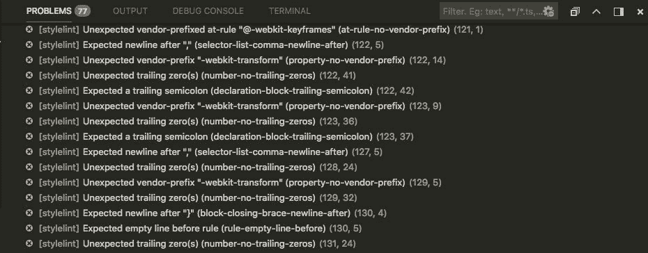
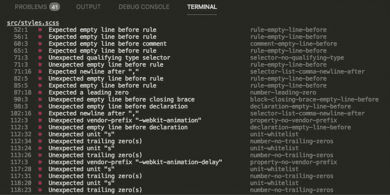
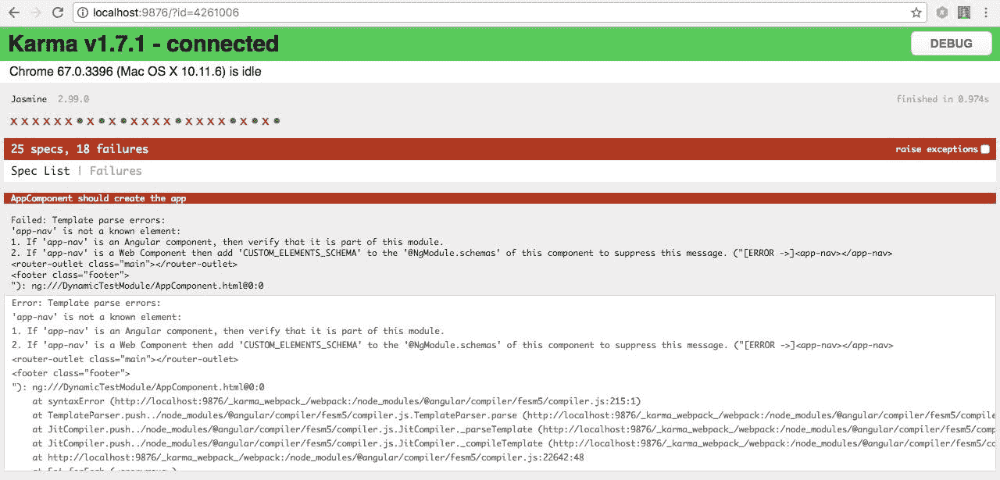
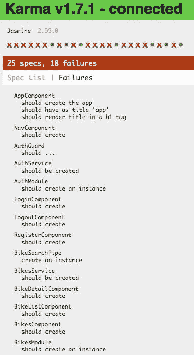
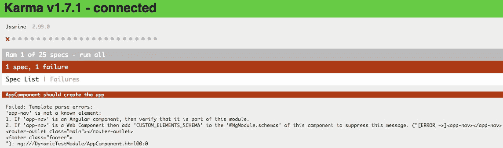
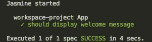

# 十一、构建和部署Angular测试

在上一章中，您学习了如何安装、定制和扩展 Bootstrap CSS 框架；如何使用`NgBootstrap`组件；以及如何将 Angular 服务与组件和 UI 界面连接起来。现在，让我们看看 Angular 应用中的另一个关键点:测试。

测试是检查应用代码以发现问题的好方法。在本章中，您将学习如何测试 Angular 应用，如何配置应用 linters(针对 SCSS 和 TSLint 文件)以保持代码一致性，以及如何创建`npm`构建脚本。此外，您将学习如何为前端应用创建 Docker 映像。

在本章中，我们将介绍以下内容:

*   设置应用短绒
*   理解Angular测试
*   写作单元和 e2e 测试
*   应用部署

# 准备基线代码

首先，我们需要准备我们的基线代码，这个过程与前几章非常相似。请遵循以下步骤:

1.  从`chapter-10`文件夹复制所有内容。
2.  重命名文件夹`chapter-11`。
3.  删除`storage-db`文件夹。

现在，让我们对`docker-compose.yml`文件进行一些更改，以适应新的数据库和服务器容器。

4.  打开`docker-compose.yml`并用以下代码替换内容:

```php
 version: "3.1"
 services:
     mysql:
       image: mysql:5.7
       container_name: chapter-11-mysql
       working_dir: /application
       volumes:
         - .:/application
         - ./storage-db:/var/lib/mysql
       environment:
         - MYSQL_ROOT_PASSWORD=123456
         - MYSQL_DATABASE=chapter-11
         - MYSQL_USER=chapter-11
         - MYSQL_PASSWORD=123456
       ports:
         - "8083:3306"
     webserver:
       image: nginx:alpine
       container_name: chapter-11-webserver
       working_dir: /application
       volumes:
         - .:/application
         - ./phpdocker/nginx/nginx.conf:/etc/nginx/conf.d/default.
            conf
       ports:
         - "8081:80"
     php-fpm:
       build: phpdocker/php-fpm
       container_name: chapter-11-php-fpm
       working_dir: /application
       volumes:
         - ./Server:/application
         - ./phpdocker/php-fpm/php-ini-
            overrides.ini:/etc/php/7.2/fpm/conf.d/99-overrides.ini
```

请注意，我们更改了容器名称、数据库和 MySQL 用户:

*   `container_name: chapter-11-mysql`
*   `container_name: chapter-11-webserver`
*   `container_name: chapter-11-php-fpm`

*   `MYSQL_DATABASE=chapter-11`
*   `MYSQL_USER=chapter-11`

5.  用以下连接字符串更新`.env`文件:

```php
 DB_CONNECTION=mysql
 DB_HOST=mysql
 DB_PORT=3306
 DB_DATABASE=chapter-11
 DB_USERNAME=chapter-11
 DB_PASSWORD=123456
```

6.  添加我们对 Git 源代码控制所做的更改。打开终端窗口，键入以下命令:

```php
 git add .
 git commit -m "Initial commit chapter 11"
```

# 设置应用短绒

我们都希望有一个干净一致的代码库。与所采用的编程语言无关，在 JavaScript 和其他语言中使用 linters 是非常常见的。但是，当我们讨论 CSS 或 SCSS/LESS 时，这种做法并不常见；我们很少在样式表中使用棉绒。

A **linter** 是一个分析代码并报告错误的工具。我们设置规则，当一段代码没有通过 linter 配置中定义的规则时，linter 会报告一个错误。当团队在成长，需要保持代码库的一致性时，这个特性非常有用。

如果没有严格的编码风格规则，代码会很快变得一团糟。即使您独自工作，保持代码的一致性也是一个很好的做法。

在以下几节中，您将学习如何为 SCSS 和 TypeScript 文件应用临帖。

# 为 SCSS 文件添加样式

我们将使用`stylelint`，一个强大的、现代的样式表链接器，支持 CSS、LESS 和 SASS。`stylelint`有很多规则，默认可用，用我们自己的规则扩展非常容易，完全不固执己见。另一个优点是，默认情况下所有规则都是禁用的，我们只启用我们想要使用的规则。让我们在实践中看看。

打开`./Client`文件夹内的终端窗口，输入以下命令:

```php
 npm install stylelint --save-dev &&
 npm install stylelint-config-standard --save-dev &&
 npm install stylelint-scss --save-dev
```

前面的命令很清楚，对吧？我们正在安装默认配置标准插件，以及 SCSS 插件。

You can read more about `stylelint` in the official documentation at [https://github.com/stylelint/stylelint](https://github.com/stylelint/stylelint).

# 向 package.json 文件添加新脚本

打开`./Client`文件夹根目录下的`package.json`文件，在`lint`任务后添加以下代码:

```php
     "sasslint": "./node_modules/.bin/stylelint \"src/**/*.scss\" --syntax scss || echo \"Ops: Stylelint faild for some file(s).\"",
```

请注意，我们正在使用本地`node_modules`文件夹中的`Stylelint`。这有助于我们确保整个团队使用相同的插件版本，避免兼容性问题。

# 添加。stylelintrc 配置

让我们添加自己的规则，如下所示:

1.  在`./Client`内部，创建一个新文件，称为`.stylelintrc`。

2.  将以下规则添加到`./Client/.stylelintrc`文件中:

```php
     {
        "extends": ["stylelint-config-standard"],
        "rules": {
                "font-family-name-quotes": "always-where-recommended",
                "function-url-quotes": [
                        "always",
                        {
                        "except": ["empty"]
                        }
                ],
                "selector-attribute-quotes": "always",
                "string-quotes": "double",
                "max-nesting-depth": 3,
                "selector-max-compound-selectors": 3,
                "selector-max-specificity": "0,3,2",
                "declaration-no-important": true,
                "at-rule-no-vendor-prefix": true,
                "media-feature-name-no-vendor-prefix": true,
                "property-no-vendor-prefix": true,
                "selector-no-vendor-prefix": true,
                "value-no-vendor-prefix": true,
                "no-empty-source": null,
                "selector-class-pattern": "[a-z-]+",
                "selector-id-pattern": "[a-z-]+",
                "selector-max-id": 0,
                "selector-no-qualifying-type": true,
                "selector-max-universal": 0,
                "selector-pseudo-element-no-unknown": [
                        true,
                        {
                        "ignorePseudoElements": ["ng-deep"]
                        }
                ],
                "unit-whitelist": ["px", "%", "em", "rem", "vw", "vh", "deg"],
                "max-empty-lines": 2
        }
 }
```

3.  请注意，您可以使用任何您想要的规则；没有对错。这只是品味和团队偏好的问题。例如，如果您的团队选择整个项目仅使用`px`像素，您的`unit-whitelist`配置如下:

```php
"unit-whitelist": ["px"],
```

4.  让我们进行一个简短的测试，检查一切是否顺利。在`./Client`打开终端窗口，输入以下命令:

```php
npm run sasslint
```

前面的命令报告了我们项目中的 77 个错误。这怎么可能？我们只有几行代码，大部分都是`style.scss`文件上的代码缩进。这是意料之中的，因为这是 SCSS 唯一的档案。请记住，我们没有在`components.scss`文件中添加任何 SCSS 代码。

# 为 VS 代码安装 Stylelint 插件

如果你正在使用`vs.code`(我希望你是)，安装 Stylelint 插件，如下所示:

1.  在 VS 代码中，打开左侧`extensions`面板。
2.  在搜索输入框中输入`stylelint`。
3.  选择`stylelint`分机。
4.  重启 VS 代码。

# 为新短绒设置 VS 代码

现在，让我们配置 VS Code 只使用`stylelint`规则；这将防止我们在 VS Code 集成终端中看到双重错误消息(如果您使用的是不同的代码编辑器，请不要担心)。步骤如下:

1.  在 VS 代码中，导航到顶部菜单中的代码|首选项|设置。

2.  在右侧面板中添加以下代码:

```php
 {
        "css.validate": false,
        "less.validate": false,
        "scss.validate": false
 }
```

要查看正在运行的插件，请打开`./Client/src/style.scss`中的`style.scss`文件。在 VS 代码的底部面板中，您将看到以下内容:



Errors logged by the stylelint extension

这些与我们在使用`npm run sass-lint`命令时看到的输出错误相同，但是在这里，我们可以浏览文件。如果你在苹果电脑上，使用*命令* +鼠标点击。如果你在 Windows 或 Linux 上，使用 *Ctrl* *+* 鼠标点击。

# 在 style.scss 上应用 stylelint 规则

验证`style.scss`文件非常简单。让我们阅读错误信息。

从第 9 行到第 44 行，错误是关于缩进空间，所以让我们删除空白空间。

删除`@import`和左侧之间的空间，用于所有引导导入。

现在，我们有 41 个错误。如果您在 VS Code 内部，请单击底部面板(在“问题”选项卡上)上的错误链接，并在错误中打开文件，如下图所示:


VS Code stylelint plugin errors

如果没有使用 VS Code，运行`npm run sass-lint`后的终端消息会是一样的，如下图截图所示:



VS Code Terminal stylelint errors

# 修复 SCSS 错误

让我们修复`style.scss`文件中的所有错误信息。

打开`./Client/src/style.scss`，用以下代码替换`@imports`后的内容:

```php
 /* Sticky footer styles
 -------------------------------------------------- */
 html {
        position: relative;
        min-height: 100%;
 }

 body {
        /* Margin bottom by footer height */
        margin-bottom: 60px;
 }

 .footer {
        position: absolute;
        bottom: 0;
        width: 100%;
        /* Set the fixed height of the footer here */
        height: 60px;
        line-height: 60px; /* Vertically center the text there */
        background-color: #f5f5f5;
 }

 main {
        padding-top: 3.5em;
 }

 form {
        .form-signin,
        .form-register {
                width: 80%;
                margin: 0 auto;
        }

        .form-group {
                height: 80px;
        }

        .has-error {
                .form-control {
                        border-color: red;
                }

                .form-feedback {
                        color: red;
                        font-size: 0.9rem;
                }
        }
 }

 // Loading spinner
 .spinner {
        width: 40px;
        height: 40px;
        position: relative;
        margin: 100px auto;
 }

 .double-bounce1,
 .double-bounce2 {
        width: 100%;
        height: 100%;
        border-radius: 50%;
        background-color: #333;
        opacity: 0.6;
        position: absolute;
        top: 0;
        left: 0;
        animation: sk-bounce 2 infinite ease-in-out;
 }
 .double-bounce2 {
        animation-delay: -1;
 }
 @keyframes sk-bounce {
        0%,
        100% { transform: scale(0); }
        50% { transform: scale(1); }
 }
 @keyframes sk-bounce {
        0%,
        100% { transform: scale(0); }
        50% { transform: scale(1); }
 }
```

现在没有错误，我们的项目将是安全的，符合我们的规则。接下来，让我们看看如何在我们的项目中使用内置的 TypeScript linter。

# 将 TSLint-angular 添加到 package.json 文件中

正如我们前面提到的，代码一致性是一个成功项目的关键点。默认情况下，Angular CLI 已经将`tslint`添加到我们的项目中，正如我们在`package.json`文件和脚本标签中看到的那样，带有`ng-lint`命令。

然而，当我们写本章时，Angular CLI 有一个小错误，当我们使用`ng-lint`命令时，它报告了两次错误消息。为了避免这种情况，让我们在`sass-lint`脚本后面的`package.json`文件中添加以下几行:

```php
"tslint": "./node_modules/.bin/tslint --project tsconfig.json || echo \"Ops: TSlint faild for some file(s).\"",
```

在前几行中，我们使用了来自`node_modules`文件夹的本地`tslint`二进制文件。这将有助于我们避免兼容性问题。

当我们在 Angular 项目中工作时，遵循 Angular 的官方风格指南会非常有帮助，因为它已经被整个开发人员社区所采用。

You can read more about the Angular style guide in the official documentation at [https://angular.io/guide/styleguide](https://angular.io/guide/styleguide).

为了帮助我们进行风格引导，我们将使用一个名为`tslint-angular`的包:

1.  打开终端窗口，键入以下命令:

```php
 npm install tslint-angular --save-dev
```

2.  现在，打开`./Client/src/tslint.json`文件，用以下代码替换内容:

```php
 {
        "extends": ["../tslint.json", "../node_modules/tslint-angular"],
        "rules": {
                "angular-whitespace": [true, "check-interpolation", "check-semicolon"],
                "no-unused-variable": true,
                "no-unused-css": true,
                "banana-in-box": true,
                "use-view-encapsulation": true,
                "contextual-life-cycle": true,
                "directive-selector": [
                        true,
                        "attribute",
                        "app",
                        "camelCase"
                ],
                "component-selector": [
                        true,
                        "element",
                        "app",
                        "kebab-case"
                ]
        }
 }
```

请注意，在前面的代码中，我们使用`extends`属性来扩展`./Client/tslint.ts`中的默认配置，并从`node_modules`文件夹中扩展`tslint-angular`。

You can read more about recommended Angular rules at [https://github.com/mgechev/codelyzer#recommended-configuration](https://github.com/mgechev/codelyzer#recommended-configuration).

# 在 package.json 中创建 linter 任务

现在，我们将创建一些任务来运行我们刚刚设置的过梁。

打开`./Client/package.json`，在`sasalint`脚本前添加以下一行:

```php
 "lint:dev": "npm run sasslint && npm run tslint",
```

前面的代码将执行两个命令:一个用于`sasslint`，另一个用于`tslint`。因此，我们准备开始测试我们的应用并准备部署。

You can read more about TSlint-angular in the official documentation at [https://github.com/mgechev/tslint-angular](https://github.com/mgechev/tslint-angular).

# 理解Angular测试

测试对于任何现代 web 应用都非常重要，Angular 默认情况下包括一些测试工具，例如 Jasmine、Karma 以及用于单元测试和端到端测试的保护器。让我们来看看每个工具的主要焦点，以便看到不同之处:

| 单元测试 | 端到端测试 |
| --- | --- |
| 测试单个组件、服务、管道等。 | 测试整个应用 |
| 测试单个特定行为。 | 测试真实世界的情况 |
| 要求嘲讽后端进行测试。 | 在完整的应用上测试重要功能 |
| 在最详细的层次上测试边缘案例。 | 不要测试边缘案例 |

上表很简单，但是我们可以看到单元测试和端到端测试之间的所有主要区别，也称为 **e2e 测试**。此外，这两个工具都使用 Jasmine 框架，一个用于测试 JavaScript 代码的**行为驱动的**开发框架。

You can read more about Jasmine at [https://jasmine.github.io/](https://jasmine.github.io/).

如前所述，当我们使用 Angular CLI 生成应用时，会安装这两个工具。

对于单元测试，我们将使用因果报应测试运行程序；在我们更进一步之前，让我们看看`karma.conf.js`来更好地理解我们已经拥有的东西。

打开`./Client`文件夹根目录内的`karma.conf.js`，查看`plugins`标签:

```php
plugins: [
  require('karma-jasmine'),
  require('karma-chrome-launcher'),
  require('karma-jasmine-html-reporter'),
  require('karma-coverage-istanbul-reporter'),
  require('@angular-devkit/build-angular/plugins/karma')
],
```

默认情况下，我们已经安装了一些插件，正如我们在前面的代码块中看到的那样。

You can read more about the Karma test runner in the official documentation at [https://karma-runner.github.io/2.0/index.html](https://karma-runner.github.io/2.0/index.html).

我们还有将在测试中使用的浏览器的配置；默认情况下，我们已经安装了 Chrome:

```php
browsers: ['Chrome'],
```

如果您想使用不同的浏览器来运行测试，该怎么办？做到这一点非常容易；只需安装您喜欢的浏览器。因果报应测试运行程序支持最流行的浏览器，例如:

*   旅行队
*   火狐浏览器
*   微软公司出品的 web 浏览器

此时，我们准备开始测试我们的应用。让我们看看一切是如何运作的。

# 写作单元和 e2e 测试

现在，您将学习如何运行测试，以便更好地理解应用发生了什么。

在开始之前，让我们运行命令来执行测试。

打开终端窗口，键入以下命令:

```php
ng test
```

前面的代码将执行所有的单元测试；之后，我们将在终端中看到所有的错误。

最后一行与下面一行非常相似:

```php
Executed 25 of 25 (18 FAILED) (1.469 secs / 0.924 secs)
```

每一个失败的测试都用红色标记，后面是一条错误消息，正如您在下面的摘录中所看到的:

```php
AppHttpInterceptorService should be created FAILED
                Error: StaticInjectorError(DynamicTestModule)[BuildersService -> HttpClient]:
                StaticInjectorError(Platform: core)[BuildersService -> HttpClient]:
                        NullInjectorError: No provider for HttpClient!
```

终端输出这么多行，连通过的测试都很难看到。注意有七个。

在终端中监控测试可能不是最简单的任务，因此我们可以使用以下命令在浏览器中运行测试:

```php
ng test --watch 
```

前面的命令将打开 Chrome 并开始测试，但是请记住，您必须在机器上安装 Chrome 浏览器。测试完成后，您现在可以更有效地查看结果:



浏览器中的因果报应跑者

前面的截图比终端窗口好很多，对吧？因此，当我们点击*规格列表*选项卡菜单时，我们可以看到以下内容:



Testing view

此外，还可以点击一个测试套件并检查该套件中的所有相关测试。让我们在下一节看看这个特性。

# 修复单元测试

是时候开始修复所有的测试了。让我们看看如何使所有的绿色:

1.  还是在 Chrome 浏览器中，点击第一个测试套件，名为 **AppComponent 应该会创建应用**。您将看到以下页面:


AppComponent

请注意，在之前的截图中，您只看到了`AppComponent`–相关测试。

2.  返回规格列表，点击 **AppComponent 应创建应用**；您将看到以下页面:



应用组件应该创建应用

前面的错误信息非常清楚:

```php
Failed: Template parse errors: 'app-nav' is not a known element:
1\. If 'app-nav' is an Angular component, then verify that it is part of this module.
2\. If 'app-nav' is a Web Component then add 'CUSTOM_ELEMENTS_SCHEMA' to the '@NgModule.schemas' of this component to suppress this message. ("[ERROR ->]<app-nav></app-nav> <router-outlet class="main"></router-outlet> <footer class="footer">
```

我们有一个模板错误，Angular 建议了两种方法来处理它。第一个建议是检查`app.module.ts`，看看我们是否添加了`app-nav`组件导入。让我们检查一下:

```php
import { NavComponent } from './layout/nav/nav.component';
@NgModule({
declarations: [
        AppComponent,
        NavComponent
],
```

前面的片段取自`app.module.ts`文件，我们导入了`NavComponent`。我们的行动是将`@NgModule.schemas`添加到我们的测试规格中:

1.  打开`./Client/src/app/app.component.spec.ts`并用以下代码替换内容:

```php
 import { TestBed, async, ComponentFixture } from '@angular/core/testing';
 import { RouterTestingModule } from '@angular/router/testing';
 import { NO_ERRORS_SCHEMA } from '@angular/core';

 // App imports
 import { AppComponent } from './app.component';

 describe('AppComponent', () => {
        let component: AppComponent;
        let fixture: ComponentFixture<AppComponent>;

        beforeEach(async(() => {
                TestBed.configureTestingModule({
                imports: [
                        RouterTestingModule
                ],
                declarations: [
                        AppComponent
                ],
                schemas: [NO_ERRORS_SCHEMA]
                }).compileComponents();
        }));

        beforeEach(() => {
                fixture = TestBed.createComponent(AppComponent);
                component = fixture.componentInstance;
                fixture.detectChanges();
        });

        it('should create', async(() => {
                expect(component).toBeTruthy();
        }));

        it('should render footer tag', async(() => {
                const compiled = fixture.debugElement.nativeElement;
                expect(compiled.querySelector('footer').textContent).toContain('2018 © All Rights Reserved');
        }));
 });
```

请注意，我们添加了`schemas`标签，以及我们的路由模块，因此测试将通过，如您在下一个片段中所见:

```php
     TestBed.configureTestingModule({
                imports: [
                        RouterTestingModule
                ],
                declarations: [
                        AppComponent
                ],
                schemas: [NO_ERRORS_SCHEMA]
        }).compileComponents();
```

现在，如果我们再次检查浏览器，我们将看到以下结果:


AppComponent 成功

下一个失败的测试是`NavComponent should created`；让我们看看错误消息:

```php
Failed: Template parse errors:
Can't bind to 'routerLink' since it isn't a known property of 'a'.
```

同样，错误信息是明确的；我们需要在`nav.component.spec.ts`上加上`RouterTestingModule`。

2.  打开`./Client/src/app/layout/nav.component.spec.ts`并用以下代码替换内容:

```php
 import { async, ComponentFixture, TestBed } from '@angular/core/testing';

 import { NavComponent } from './nav.component';
 import { RouterTestingModule } from '@angular/router/testing';
 import { HttpClientModule } from '@angular/common/http';

 describe('NavComponent', () => {
        let component: NavComponent;
        let fixture: ComponentFixture<NavComponent>;

        beforeEach(async(() => {
                TestBed.configureTestingModule({
                imports: [
                        RouterTestingModule,
                        HttpClientModule
                ],
                declarations: [ NavComponent ]
                })
                .compileComponents();
        }));

        beforeEach(() => {
                fixture = TestBed.createComponent(NavComponent);
                component = fixture.componentInstance;
                fixture.detectChanges();
        });

        it('should create', () => {
                expect(component).toBeTruthy();
        });
 });
```

我们现在可以看到我们对`NavComponent`的测试是有效的，如下图所示:


导航组件工作正常

让我们喘口气，考虑下一行。

以下步骤与我们到目前为止执行的步骤非常相似。我们应该提到的是，我们在应用中使用的是路由，因此我们需要在所有测试中的`TestBed.configureTestingModule`配置中将`RoutingTestingModule`添加到`imports`标签中:

```php
imports: [ 
        RouterTestingModule
        ...
], 
```

此外，我们必须将相同的依赖注入到所有使用服务的组件中(例如`BikeService`和`BuilderService`，就像我们在`components.ts`文件中所做的那样。

在接下来的部分中，我们将替换许多文件的代码。别担心——当有重要的事情时，我们会提到它。

# 修复自动防护测试

打开`./Client/src/app/pages/auth/_guards/auth.guard.spec.ts`并用以下代码替换内容:

```php
import { RouterTestingModule } from '@angular/router/testing';
import { TestBed, async, inject } from '@angular/core/testing';
import { HttpClient, HttpHandler } from '@angular/common/http';
import { Router } from '@angular/router';

//  App imports
import { AuthGuard } from './auth.guard';
import { AuthService } from '../_services/auth.service';

describe('AuthGuard Tests: ', () => {
const router = {
        navigate: jasmine.createSpy('navigate')
};

beforeEach(async(() => {
        TestBed.configureTestingModule({
        imports: [
                RouterTestingModule.withRoutes([
                {path: 'bikes:id'}
                ])
        ],
        providers: [AuthGuard, AuthService, HttpClient, HttpHandler, { provide: Router, useValue: router } ]
        });
}));

it('should AuthGuartd to be defined', inject([AuthGuard], (guard: AuthGuard) => {
        expect(guard).toBeTruthy();
}));

it('should AuthService to be defined', inject([AuthService], (auth: AuthService) => {
        expect(auth).toBeTruthy();
}));

});
```

注意，我们是作为提供者注入`AuthService`；现在不用担心这个。在本章的后面，我们将更详细地解释它。让我们专注于测试。

# 修复身份验证服务测试

打开`./Client/src/app/pages/auth/_services/auth.service.spec.ts`并用以下代码替换内容:

```php
 import { TestBed, inject } from '@angular/core/testing';
 import { AuthService } from './auth.service';
 import { HttpClientModule } from '@angular/common/http';
 import { RouterTestingModule } from '@angular/router/testing';
 describe('AuthService', () => {
 beforeEach(() => { 
         TestBed.configureTestingModule({ 
         imports: [ 
                 RouterTestingModule, 
                 HttpClientModule 
                 ], 
                 providers: [AuthService]
                 }); 
 }); it('should be created', inject([AuthService], 
 (service: AuthService) => 
  { expect(service).toBeTruthy();
 })); 
});
```

# 修复登录测试

打开`./Client/src/app/pages/auth/login/login.component.spec.ts`并用以下代码替换内容:

```php
import { RouterTestingModule } from '@angular/router/testing';
import { HttpClientModule } from '@angular/common/http';
import { async, ComponentFixture, TestBed } from '@angular/core/testing';
import { FormsModule } from '@angular/forms';

// App imports
import { LoginComponent } from './login.component';
import { AuthService } from '../_services/auth.service';

describe('LoginComponent', () => {
let component: LoginComponent;
let fixture: ComponentFixture<LoginComponent>;

beforeEach(async(() => {
        TestBed.configureTestingModule({
        imports: [
                RouterTestingModule,
                FormsModule,
                HttpClientModule
        ],
        declarations: [ LoginComponent ],
        providers: [AuthService]
        })
        .compileComponents();
}));

beforeEach(() => {
        fixture = TestBed.createComponent(LoginComponent);
        component = fixture.componentInstance;
        fixture.detectChanges();
});

it('should create', () => {
        expect(component).toBeTruthy();
});
});
```

正如我们前面提到的，实际上所有的错误消息都与我们是否包含依赖关系有关，比如服务或者直接的Angular依赖关系。

# 修复寄存器测试

打开`./Client/src/app/pages/auth/register/register.component.spec.ts`并用以下代码替换内容:

```php
import { RouterTestingModule } from '@angular/router/testing';
import { async, ComponentFixture, TestBed } from '@angular/core/testing';
import { NO_ERRORS_SCHEMA } from '@angular/core';

// App imports
import { RegisterComponent } from './register.component';
import { HttpClientModule } from '@angular/common/http';
import { FormBuilder, FormsModule, ReactiveFormsModule } from '@angular/forms';

describe('RegisterComponent', () => {
let component: RegisterComponent;
let fixture: ComponentFixture<RegisterComponent>;

beforeEach(async(() => {
        TestBed.configureTestingModule({
        imports: [
                RouterTestingModule,
                HttpClientModule,
                FormsModule,
                ReactiveFormsModule
        ],
        declarations: [ RegisterComponent ],
        schemas: [NO_ERRORS_SCHEMA],
        providers: [FormBuilder]
        })
        .compileComponents();
}));

beforeEach(() => {
        fixture = TestBed.createComponent(RegisterComponent);
        component = fixture.componentInstance;
        fixture.detectChanges();
});

it('should create', () => {
        expect(component).toBeTruthy();
});
});
```

# 修复自行车维修测试

打开`./Client/src/app/pages/bikes/_services/bikes.service.spec.ts`并用以下代码替换内容:

```php
import { TestBed, inject } from '@angular/core/testing';
import { HttpClientModule } from '@angular/common/http';

// App imports
import { BikesService } from './bikes.service';
import { HttpErrorHandler } from '../../../shared/_services/http-handle-error.service';

describe('BikesService', () => {
beforeEach(() => {
        TestBed.configureTestingModule({
        imports: [
                HttpClientModule
        ],
        providers: [
                BikesService,
                HttpErrorHandler
        ]
        });
});

it('should be created', inject([BikesService], (service: BikesService) => {
        expect(service).toBeTruthy();
}));
});
```

# 修理自行车-详细测试

打开`./Client/src/app/pages/bikes/bike-detail/bike-detail.component.spec.ts`并用以下代码替换内容:

```php
import { RouterTestingModule } from '@angular/router/testing';
import { async, ComponentFixture, TestBed } from '@angular/core/testing';
import { NO_ERRORS_SCHEMA } from '@angular/core';

// App imports
import { BikeDetailComponent } from './bike-detail.component';
import { FormsModule } from '@angular/forms';
import { HttpClientModule } from '@angular/common/http';
import { HttpErrorHandler } from '../../../shared/_services/http-handle-error.service';

describe('BikeDetailComponent', () => {
let component: BikeDetailComponent;
let fixture: ComponentFixture<BikeDetailComponent>;

beforeEach(async(() => {
        TestBed.configureTestingModule({
        imports: [
                RouterTestingModule,
                FormsModule,
                HttpClientModule
        ],
        declarations: [
                BikeDetailComponent
        ],
        schemas: [NO_ERRORS_SCHEMA],
        providers: [HttpErrorHandler]
        })
        .compileComponents();
}));

beforeEach(() => {
        fixture = TestBed.createComponent(BikeDetailComponent);
        component = fixture.componentInstance;
        fixture.detectChanges();
});

it('should create', () => {
        expect(component).toBeTruthy();
});
});
```

# 修复自行车列表测试

打开`./Client/src/app/pages/bikes/bike-list/bike-list.component.spec.ts`并用以下代码替换内容:

```php
import { RouterTestingModule } from '@angular/router/testing';
import { HttpClientModule } from '@angular/common/http';
import { async, ComponentFixture, TestBed } from '@angular/core/testing';
import { NO_ERRORS_SCHEMA } from '@angular/core';

// App imports
import { BikeListComponent } from './bike-list.component';
import { BikeSearchPipe } from '../_pipes/bike-search.pipe';
import { HttpErrorHandler } from './../../../shared/_services/http-handle-error.service';

describe('BikeListComponent', () => {
let component: BikeListComponent;
let fixture: ComponentFixture<BikeListComponent>;

beforeEach(async(() => {
        TestBed.configureTestingModule({
        imports: [
                RouterTestingModule,
                HttpClientModule
        ],
        declarations: [
                BikeListComponent,
                BikeSearchPipe
        ],
        schemas: [NO_ERRORS_SCHEMA],
        providers: [HttpErrorHandler]
        })
        .compileComponents();
}));

beforeEach(() => {
        fixture = TestBed.createComponent(BikeListComponent);
        component = fixture.componentInstance;
        fixture.detectChanges();
});

it('should create', () => {
        expect(component).toBeTruthy();
});
});
```

# 修复自行车测试

打开`./Client/src/app/pages/bikes/bikes.component.spec.ts`并用以下代码替换内容:

```php
import { async, ComponentFixture, TestBed } from '@angular/core/testing';
import { RouterTestingModule } from '@angular/router/testing';

// App imports
import { BikesComponent } from './bikes.component';

describe('BikesComponent', () => {
let component: BikesComponent;
let fixture: ComponentFixture<BikesComponent>;

beforeEach(async(() => {
        TestBed.configureTestingModule({
        imports: [
                RouterTestingModule
        ],
        declarations: [
                BikesComponent
        ]
        })
        .compileComponents();
}));

beforeEach(() => {
        fixture = TestBed.createComponent(BikesComponent);
        component = fixture.componentInstance;
        fixture.detectChanges();
});

it('should create', () => {
        expect(component).toBeTruthy();
});

});
```

# 修复建筑商服务测试

打开`./Client/src/app/pages/builders/_gservices/builders.service.spec.ts` ，用以下代码替换内容:

```php
import { HttpClientModule } from '@angular/common/http';
import { TestBed, inject } from '@angular/core/testing';

// App imports
import { BuildersService } from './builders.service';
import { HttpErrorHandler } from './../../../shared/_services/http-handle-error.service';

describe('BuildersService', () => {
beforeEach(() => {
        TestBed.configureTestingModule({
        imports: [
                HttpClientModule
        ],
        providers: [
                BuildersService,
                HttpErrorHandler
        ]
        });
});

it('should be created', inject([BuildersService], (service: BuildersService) => {
        expect(service).toBeTruthy();
}));
});
```

# 修复生成器-详细测试

打开`./Client/src/app/pages/builders/builder-detail/builder-detail.component.spec.ts`并用以下代码替换内容:

```php
import { RouterTestingModule } from '@angular/router/testing';
import { HttpClientModule } from '@angular/common/http';
import { async, ComponentFixture, TestBed } from '@angular/core/testing';

import { BuilderDetailComponent } from './builder-detail.component';
import { HttpErrorHandler } from '../../../shared/_services/http-handle-error.service';

describe('BuilderDetailComponent', () => {
let component: BuilderDetailComponent;
let fixture: ComponentFixture<BuilderDetailComponent>;

beforeEach(async(() => {
        TestBed.configureTestingModule({
        imports: [
                RouterTestingModule,
                HttpClientModule
        ],
        declarations: [
                BuilderDetailComponent
        ],
        providers: [HttpErrorHandler]
        })
        .compileComponents();
}));

beforeEach(() => {
        fixture = TestBed.createComponent(BuilderDetailComponent);
        component = fixture.componentInstance;
        fixture.detectChanges();
});

it('should create', () => {
        expect(component).toBeTruthy();
});
});
```

# 修复生成器-列表组件

打开`./Client/src/app/pages/builders/builder-list/builder-list.component.spec.ts`并用以下代码替换内容:

```php
import { RouterTestingModule } from '@angular/router/testing';
import { HttpClientModule } from '@angular/common/http';
import { async, ComponentFixture, TestBed } from '@angular/core/testing';

// App imports
import { BuilderListComponent } from './builder-list.component';
import { HttpErrorHandler } from '../../../shared/_services/http-handle-error.service';

describe('BuilderListComponent', () => {
let component: BuilderListComponent;
let fixture: ComponentFixture<BuilderListComponent>;

beforeEach(async(() => {
        TestBed.configureTestingModule({
        imports: [
                RouterTestingModule,
                HttpClientModule
        ],
        declarations: [
                BuilderListComponent
        ],
        providers: [HttpErrorHandler]
        })
        .compileComponents();
}));

beforeEach(() => {
        fixture = TestBed.createComponent(BuilderListComponent);
        component = fixture.componentInstance;
        fixture.detectChanges();
});

it('should create', () => {
        expect(component).toBeTruthy();
});
});
```

# 修复构建器测试

打开`./Client/src/app/pages/builders/builders.component.spec.ts`并用以下代码替换内容:

```php
import { RouterTestingModule } from '@angular/router/testing';
import { async, ComponentFixture, TestBed } from '@angular/core/testing';

// App imports
import { BuildersComponent } from './builders.component';

describe('BuildersComponent', () => {
let component: BuildersComponent;
let fixture: ComponentFixture<BuildersComponent>;

beforeEach(async(() => {
        TestBed.configureTestingModule({
        imports: [
                RouterTestingModule
        ],
        declarations: [
                BuildersComponent
        ]
        })
        .compileComponents();
}));

beforeEach(() => {
        fixture = TestBed.createComponent(BuildersComponent);
        component = fixture.componentInstance;
        fixture.detectChanges();
});

it('should create', () => {
        expect(component).toBeTruthy();
});

});
```

# 修复家庭测试

打开`./Client/src/app/pages/home/home.component.spec.ts`并用以下代码替换内容:

```php
import { TestBed , async, ComponentFixture } from '@angular/core/testing';
import { RouterTestingModule } from '@angular/router/testing';

// App imports
import { HomeComponent } from './home.component';

describe('HomeComponent', () => {
let component: HomeComponent;
let fixture: ComponentFixture<HomeComponent>;

beforeEach(async(() => {
        TestBed.configureTestingModule({
        imports: [
                RouterTestingModule
        ],
        declarations: [
                HomeComponent
        ]
        }).compileComponents();
}));

beforeEach(() => {
        fixture = TestBed.createComponent(HomeComponent);
        component = fixture.componentInstance;
        fixture.detectChanges();
});

it('should create', () => {
```

```php
        expect(component).toBeTruthy();
});

});
```

# 修复应用测试

打开`./Client/src/app/app.component.spec.ts`并用以下代码替换内容:

```php
import { TestBed, async, ComponentFixture } from '@angular/core/testing';
import { RouterTestingModule } from '@angular/router/testing';
import { NO_ERRORS_SCHEMA } from '@angular/core';

// App imports
import { AppComponent } from './app.component';

describe('AppComponent', () => {
let component: AppComponent;
let fixture: ComponentFixture<AppComponent>;

beforeEach(async(() => {
        TestBed.configureTestingModule({
        imports: [
                RouterTestingModule
        ],
        declarations: [
                AppComponent
        ],
        schemas: [NO_ERRORS_SCHEMA]
        }).compileComponents();
}));

beforeEach(() => {
        fixture = TestBed.createComponent(AppComponent);
        component = fixture.componentInstance;
        fixture.detectChanges();
});

it('should create', async(() => {
        expect(component).toBeTruthy();
}));
});
```

# 修复应用拦截器测试

打开`./Client/src/app/shared/_services/app-http-interceptor.service.spec.ts`并用以下代码替换内容:

```php
import { HttpClientModule } from '@angular/common/http';
import { TestBed, inject } from '@angular/core/testing';
import { RouterTestingModule } from '@angular/router/testing';

// App imports
import { AppHttpInterceptorService } from './app-http-interceptor.service';

describe('AppHttpInterceptorService', () => {
beforeEach(() => {
        TestBed.configureTestingModule({
        imports: [
                RouterTestingModule,
                HttpClientModule
        ],
        providers: [AppHttpInterceptorService]
        });
});

it('should be created', inject([AppHttpInterceptorService], (service: AppHttpInterceptorService) => {
        expect(service).toBeTruthy();
}));
});
```

我们现在已经修复了所有的测试，所以让我们再添加一些。

# 添加单元测试

我们已经走了很长的路，现在，所有的测试都通过了。所以，是时候创建一些新的测试了。

下面几行非常简单，我们已经在前面的例子中遵循了这条路径，所以，如果有新的东西出现，我们将在代码块的末尾提到它。

让我们在应用中创建一些单元测试，如下所示:

1.  打开`./Client/src/app/app.component.spec.ts`并添加以下代码:

```php
it('should create router-outlet', async(() => {
 const compiled = fixture.debugElement.nativeElement;
 expect(compiled.querySelector('router-outlet')).toBeDefined();
 }));
```

前面的代码将检查`app.component.spec.ts`内部的`router-outlet`标签。

2.  打开`./Client/src/app/pages/auth/_guards/auth.guard.spec.ts`并添加以下代码:

```php
it('should AuthService to be defined', inject([AuthService], (auth: AuthService) => {
 expect(auth).toBeTruthy();
 }));
it('should not allow user to pass', inject([AuthGuard],     (guard: AuthGuard) => {
expect(guard.canActivate(new ActivatedRouteSnapshot(), fakeSnapshot)).toBe(false);
}));
```

注意，我们正在创建两个新的测试:一个检查`AuthService`，另一个检查`AuthGuard`。

3.  打开`./Client/src/app/pages/bikes/bikes.component.spec.ts`并添加以下代码:

```php
it('should create router-outlet', async(() => {
 const compiled = fixture.debugElement.nativeElement;
 expect(compiled.querySelector('router-outlet')).toBeDefined();
 }));
```

4.  打开`./Client/src/app/pages/builders/builders.component.spec.ts`并添加以下代码:

```php
it('should create router-outlet', async(() => {
 const compiled = fixture.debugElement.nativeElement;
 expect(compiled.querySelector('router-outlet')).toBeDefined();
 }));
```

5.  打开`./Client/src/app/pages/home/home.component.spec.ts`并添加以下代码:

```php
it('should render title tag', async(() => {
 const compiled = fixture.debugElement.nativeElement;
 expect(compiled.querySelector('h1').textContent).toContain('Custom Bikes Garage');
 }));
```

6.  打开`./Client/src/app/app.component.spec.ts`并添加以下代码:

```php
it('should render footer tag', async(() => {
 const compiled = fixture.debugElement.nativeElement;
 expect(compiled.querySelector('footer').textContent).toContain('2018 © All Rights Reserved');
 }));
```

我们现在已经完成了样本单元测试。如果我们使用`ng test`执行测试，我们将在终端中看到以下结果:

```php
Executed 24 of 24 SUCCESS (2.695 secs / 2.398 secs)
```

# 修复 e2e 测试

此时，我们将运行`e2e`测试，正如我们在本章前面提到的:

1.  打开`./Client/e2e/src/app.e2e-spec.ts`并用以下代码替换内容:

```php
 import { AppPage } from './app.po';

 describe('workspace-project App', () => {
        let page: AppPage;

        beforeEach(() => {
                page = new AppPage();
        });

        it('should display app title', () => {
                page.navigateTo();
                expect(page.getParagraphText()).toEqual('Custom Bikes Garage');
        });
 });
```

2.  打开终端窗口，键入以下命令:

```php
 npm run e2e
```

前面命令的结果类似于下面的截图:



e2e test results

记住，你需要在`./Client`文件夹里面运行 Angular 命令；否则，您将看到一条错误消息，因为 Angular CLI 需要`angular.json`文件来执行`ng`命令，而该文件位于`./Client`文件夹内。

# 应用部署

我们现在已经完成了测试应用的所有必要步骤。测试可以非常全面，也可以非常简单；这将取决于您(或您的团队)选择的方法类型。

关于考试，社区内部有很多争论。有人为面向开发的测试辩护，比如**行为驱动开发** ( **BDD** )或者**测试驱动开发** ( **TDD** )。

同样，我们将注意到最重要的是您的代码、结构和测试是一致的，不管采用什么类型的开发。

在最后一节中，我们将了解如何准备我们的应用在生产中发布。从这本书开始，我们一直在使用 Docker，我们不会以任何其他方式完成这本书。

因此，让我们看看如何使用 Docker 的一些特性来准备我们的应用。

# 为前端应用创建 Docker 映像

正如我们之前所讨论的，我们已经有了一个配置了 Docker 的环境，但是它只覆盖了我们的后端应用，因为我们使用安装在我们机器上的 Angular CLI 运行我们的前端代码。

在开发环境中，这不是问题，因为我们需要在宿主中编写的代码在 Docker 容器中更新。但是，当我们讨论部署时，我们会考虑到这样一个事实，即我们的代码已经准备好运行了，没有对文件进行任何更改。

请注意，我们不是在讨论在磁盘上写入或数据持久性；我们将只提及应用源代码中的更改。

考虑到这一点，让我们使用 Dockerfile 创建一个前端应用的映像。

# 创建文档文件

在`./Client`文件夹内创建一个名为`Dockerfile`的新文件，并添加以下代码:

```php
FROM nginx:alpine

COPY nginx.conf /etc/nginx/nginx.conf

WORKDIR /usr/share/nginx/html
COPY dist/ .
```

前面的代码非常简单；我们使用的是来自 Linux 发行版`nginx:alpine`的图像。

You can read more about official Docker images at [https://hub.docker.com/explore/](https://hub.docker.com/explore/).

此外，我们正在使用 nginx 服务器的配置文件。请记住，Angular 应用必须由网络服务器托管。

# 创建 nginx 文件

在`./Client`文件夹内创建一个名为`nginx.conf`的新文件，并添加以下代码:

```php
worker_processes  1;

events {
        worker_connections  1024;
}

http {
        server {
                listen 81;
                server_name  localhost;

                root   /usr/share/nginx/html;
                index  index.html index.htm;
                include /etc/nginx/mime.types;

                gzip on;
                gzip_min_length 1000;
                gzip_proxied expired no-cache no-store private auth;
                gzip_types text/plain text/css application/json application/javascript application/x-javascript text/xml application/xml application/xml+rss text/javascript;

                location / {
                        try_files $uri $uri/ /index.html;
                }
        }
}
```

这里没有什么新东西——它只是一个为 Angular 文件服务的基本 nginx 配置。

# 创建 npm 构建任务

有了 Dockerfile，我们只需要使用现有的`npm`创建一个构建过程。

打开`./Client/package.json`并添加以下代码:

```php
"build:docker":"npm run lint:dev && npm run test && npm run e2e && npm rum build && npm rum docker:image",
 "docker:image":"./_scripts/create-docker-image.sh"
```

让我们解释一下我们在前面的代码中做了什么:

*   脚本标签:`docker:image`将使用一个 bash 脚本文件生成一个 Docker 映像；稍后，我们将详细看到这个文件。
*   脚本标记:`build:docker`将执行以下步骤:

1.  运行 SASS 听着。
2.  运行`Tslint`。
3.  运行单元测试。
4.  运行 e2e 测试。
5.  构建应用。
6.  创建一个 Docker 映像。

在我们继续之前，让我们解释一下为什么我们使用 bash 文件来创建 Docker 映像。

Bash 文件在许多地方非常有用，并且在任何构建过程中都没有什么不同，正如我们将在下面几行中看到的执行一些 Docker 命令。为了避免`npm`包更加复杂，我们将使用对`create-docker-image.sh`文件的调用，该文件将执行生成我们的图像所需的命令。

# 创建 bash 脚本

现在，我们将在前端应用中添加一个新目录，以存储我们的应用可以拥有的所有 bash 脚本文件。在这个例子中，我们将只使用一个，但是在现实世界的应用中，这个文件夹可以存储一系列 bash 文件:

1.  在`./Client`里面，创建一个新的文件夹，叫做`_scripts`。
2.  在`./Client/_scripts`文件夹内，创建一个名为`create-docker-image.sh`的新文件，并添加以下代码:

```php
 #!/bin/bash
 set -e
 # Docker command to create the front-end application
 docker image build -t angular-laravel-book .
```

请注意，您可以为您的应用使用任何名称；我们以`angular-laravel-book`为书例。

# 运行 npm 生成脚本

现在，让我们对`angular.json`文件做一个小的调整；从`output`标签上取下`Client`文件夹:

```php
"outputPath": "dist",
```

最后一步是运行`build`命令，测试并创建我们的应用。

打开`./Client`文件夹内的终端窗口，输入以下命令:

```php
npm run build:docker
```

构建过程需要几分钟时间；最后，您将在终端中看到类似以下内容的消息:


End-to-end tests If you face errors with permissions, perform the following. Open Terminal window inside of the `./Client/_scripts` folder and type `chmod 755 create-docker-image.sh`.

# 查看 Docker 命令

以下是本章结尾的一些观察结果:

1.  在本书的开头，我们使用 Docker 来创建开发环境。
2.  在本节中，我们为前端应用创建了一个映像。

所以，现在是检查我们到目前为止所做工作的恰当时机。

从[第 4 章](04.html#2H1VQ0-f24bf9337f074c079f0c90fd02324171)、*构建基线应用*开始，我们一直使用 Docker 来创建后端 API 应用。在本章中，我们已经使用 Docker 将前端 Angular 应用转换为 Docker 图像。因此，我们可以假设我们的后端有一个带有服务器和数据库的映像，另一个用于前端应用，也称为客户端应用。

这给了我们单独托管服务的优势，正如我们在本书前面提到的。

请记住，我们的后端应用编程接口完全独立于前端应用。

# 构建生产应用

让我们在`docker-compose.yml`文件中做一些调整，并添加前端应用的图像。

打开`./Client/docker-compose.yml`并添加以下代码:

```php
appserver:
  image: 'angular-laravel-book'
  container_name: chapter-11-appserver
  # Build the image if don't exist
  build: './Client'
  ports:
    - 3000:81
```

请注意注释行。作为`build`命令的一部分，我们使用的是用`npm run build:docker`命令创建的`angular-laravel-book`图像。因此，如果您忘记运行构建脚本，每次运行`docker-compose up -d`命令时，都会创建映像(如果它还不存在)。

# 测试 Docker 映像

现在是时候检查 Docker 容器和图像了。

请注意，下一个命令将删除您机器中的所有 Docker 映像和容器。如果您将 Docker 用于书籍示例之外的其他项目，我们建议您只删除与我们的示例应用相关的图像和容器。

以下命令会擦除机器中的所有图像和容器:

```php
docker system prune -a
```

让我们检查容器，如下所示:

1.  打开终端窗口，键入以下命令:

```php
 docker ps -a
```

返回的输出将是一个空表。

2.  仍然在终端中，键入以下命令:

```php
 docker images -a
```

最后，你会再次看到一张空桌子。

3.  静止终端，键入以下命令:

```php
 docker-compose up -d
```

恭喜你！我们已经成功地构建了所有的图像和容器。

4.  重复步骤 1 列出所有容器。

结果将是以下输出:

| 容器标识 | 图像 | 名字 |
| --- | --- | --- |
| 容器 ID | `chapter-11_php-fpm` | `chapter-11-php-fpm` |
| 容器 ID | `nginx:alpine` | `chapter-11-webserver` |
| 容器 ID | `mysql:5.7` | `chapter-11-mysql` |
| 容器 ID | `angular-laravel-book` | `chapter-11-appserver` |

请注意，容器名称与我们在`docker-compose.yml`文件中选择的名称相同。

以下图像代表我们的应用:

*   **前端** : `angular-laravel-book`
*   **后端** : `phpdockerio/php72-fpm`

我们现在准备在云上部署。

# 摘要

我们现在有了必要的基线代码来将我们的应用投入生产。接下来的步骤是最多样化的，因为大量的云服务能够为生产网站和应用存储 Docker 映像，并且通常涉及到付费服务的使用。但是我们现在有了一个使用最新技术的健壮且可扩展的应用，即 Angular 6 和 Laravel 5。

从这本书开始，我们已经走了很长的路，解释和介绍了先进的网络开发技术。现在，您可以从头开始创建应用，一直到部署。

确保始终保持更新，并记住一致的代码总是可以帮助你。