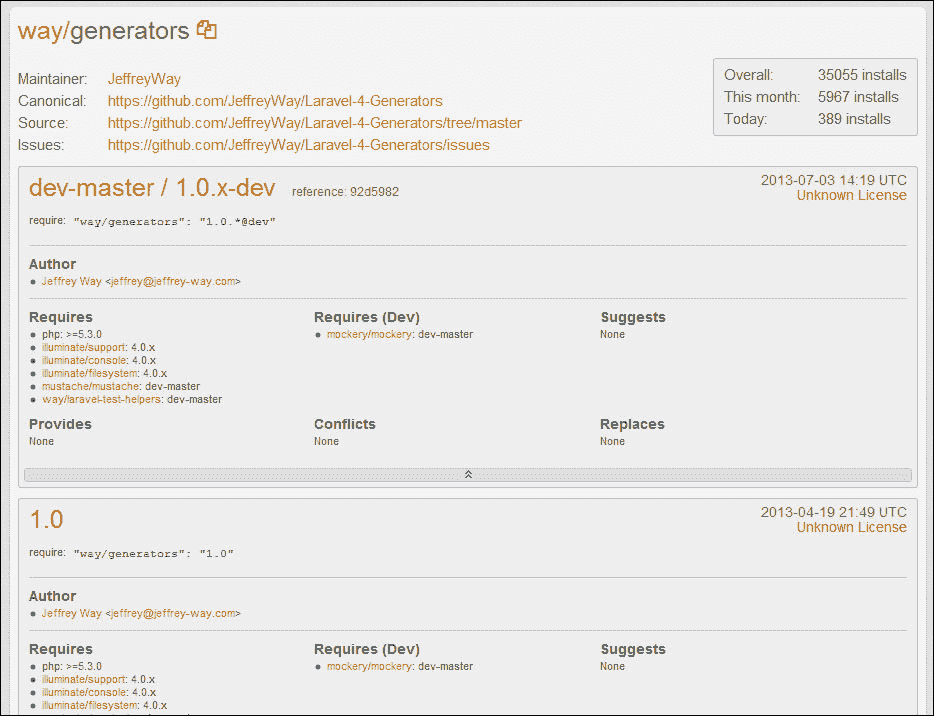
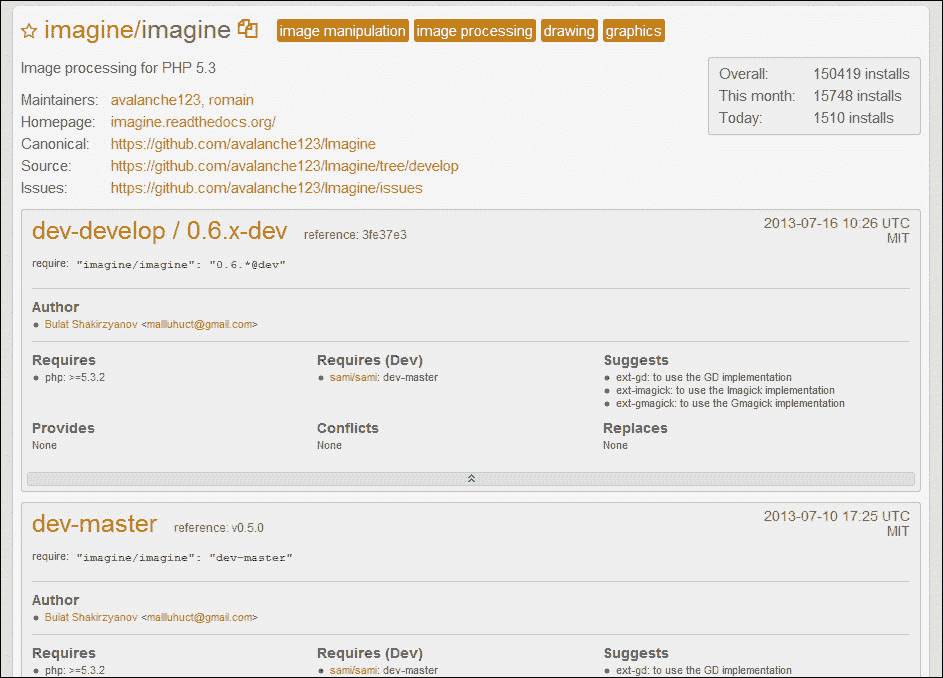
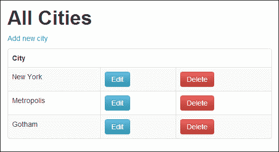
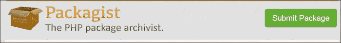

# 七、创建和使用 Composer 包

在本章中，我们将介绍:

*   下载和安装软件包
*   使用生成器包设置应用
*   在 Laravel 中创建作曲家包
*   将您的 Composer 包添加到 Packagist
*   向 Composer 添加非打包程序包
*   创建自定义 artisan 命令

# 简介

Laravel 的一个很好的特性是我们可以很容易地包含其他人使用捆绑包制作的类库。在 Laravel 网站上，已经有许多有用的捆绑包，其中一些可以自动完成某些任务，而另一些则可以轻松地与第三方 API 集成。

PHP 世界最近增加了 Composer，它允许我们使用不特定于 Laravel 的库(或包)。

在本章中，我们将开始使用捆绑包，我们甚至会创建自己的捆绑包，其他人可以下载。我们还将看到如何将 Composer 合并到我们的 Laravel 安装中，以打开我们可以在应用中使用的各种 PHP 库。

# 下载并安装软件包

Laravel 最好的特性之一是它的模块化程度。大部分框架都是使用库构建的，或者说 **包**，这些库都经过了很好的测试，并在其他项目中被广泛使用。通过使用 Composer 进行依赖关系管理，我们可以轻松地包含其他包，并将它们无缝集成到我们的 Laravel 应用中。

对于这个食谱，我们将在我们的应用中安装两个流行的包:杰弗里·威的拉弗尔 4 生成器和`Imagine`图像处理包。

## 做好准备

对于这个食谱，我们需要一个使用 Composer 的拉弗尔的标准安装。

## 怎么做...

对于此食谱，我们将遵循以下步骤:

1.  前往[https://packagist.org/](https://packagist.org/)。
2.  In the search box, search for `way generator` as shown in the following screenshot:

    

3.  Click on the link for **way/generators**:

    

4.  查看[https://packagist.org/packages/way/generators](https://packagist.org/packages/way/generators)的详细信息，注意**要求**线路获取套餐版本。出于我们的目的，我们将使用**“方式/生成器”:“1.0。***。
5.  在我们的应用的根目录中，打开 `composer.json`文件并将包添加到`require`部分，这样看起来像这样:

    ```php
    "require": {
           "laravel/framework": "4.0.*",
           "way/generators": "1.0.*"
    },
    ```

6.  Go back to [http://packagist.org](http://packagist.org) and perform a search for `imagine` as shown in the following screenshot:

    

7.  Click on the link to **imagine/imagine** and copy the require code for **dev-master**:

    

8.  返回到我们的`composer.json`文件，更新`require`部分到包括`imagine`包。现在看起来应该类似于下面的代码:

    ```php
    "require": {
          "laravel/framework": "4.0.*",
          "way/generators": "1.0.*",
          "imagine/imagine": "dev-master"
    },
    ```

9.  打开命令行，在我们应用的根目录下，运行 Composer 更新如下:

    ```php
    php composer.phar update
    ```

10.  最后，我们将添加生成器服务提供者，因此打开`app/config/app.php`文件，并在提供者数组中添加以下行:

    ```php
    'Way\Generators\GeneratorsServiceProvider'
    ```

## 它是如何工作的...

为了拿到我们的包裹，我们首先去[packagist.org](http://packagist.org)寻找我们想要的包裹。我们也可以点击**浏览套餐**链接。它将显示最近的软件包以及最受欢迎的软件包的列表。点击我们想要的包后，我们将进入详细信息页面，其中列出了各种链接，包括包的存储库和主页。我们也可以点击包的维护者链接来查看他们发布的其他包。

下面，我们将看到不同版本的软件包。如果我们打开该版本的详细信息页面，我们将找到我们需要用于`composer.json`文件的代码。我们可以选择使用严格的版本号，在版本中添加一个通配符，或者使用`dev-master`，它将安装软件包主分支上更新的任何内容。对于`Generators`包，我们将只使用 1.0 版本，但允许对该版本进行任何小的修正。对于`imagine`包，我们将使用`dev-master`，因此无论版本号是多少，他们的主分支中的任何内容都将被下载。

然后我们在 Composer 上运行更新，它会自动下载并安装我们选择的所有软件包。最后，为了在我们的应用中使用`Generators`，我们需要在我们的应用的配置文件中注册服务提供商。

# 使用生成器包设置应用

`Generators` 是一个流行的 Laravel 包，它自动化了相当多的文件创建。除了`controllers`和`models`之外，还可以通过命令行界面生成`views`、`migrations`、`seeds`等。

## 做好准备

对于本食谱，我们将使用*杰弗里威*维护的【拉威尔 4 发电机】包，该包安装在*下载和安装包*食谱中。我们还需要一个正确配置的 MySQL 数据库。

## 怎么做…

按照以下步骤制作配方:

1.  打开我们应用根目录下的命令行，使用生成器为我们的城市创建一个脚手架，如下所示:

    ```php
    php artisan generate:scaffold cities --fields="city:string"

    ```

2.  在命令行中，为我们的超级英雄创建一个脚手架，如下所示:

    ```php
    php artisan generate:scaffold superheroes --fields="name:string, city_id:integer:unsigned"

    ```

3.  在我们的项目中，在`app/database/seeds`目录中查找，找到一个名为`CitiesTableSeeder.php`的文件。打开并添加一些数据到`$cities`数组如下:

    ```php
    <?php

    class CitiesTableSeeder extends Seeder {

      public function run()
      {
        DB::table('cities')->delete();

        $cities = array(
             array(
                    'id'         => 1,
                    'city'       => 'New York',
                    'created_at' => date('Y-m-d g:i:s',time())
                  ),
             array(
                    'id'         => 2,
                    'city'       => 'Metropolis',
                    'created_at' => date('Y-m-d g:i:s',time())
                  ),
             array(
                    'id'         => 3,
                    'city'       => 'Gotham',
                    'created_at' => date('Y-m-d g:i:s',time())
                  )
        );

        DB::table('cities')->insert($cities);
      }
    }
    ```

4.  在`app/database/seeds`目录下，打开`SuperheroesTableSeeder.php`并添加一些数据:

    ```php
    <?php

    class SuperheroesTableSeeder extends Seeder {

      public function run()
      {
        DB::table('superheroes')->delete();

          $superheroes = array(
               array(
                     'name'       => 'Spiderman',
                     'city_id'    => 1,
                     'created_at' => date('Y-m-d g:i:s', time())
                     ),
               array(
                     'name'       => 'Superman',
                     'city_id'    => 2,
                     'created_at' => date('Y-m-d g:i:s', time())
                     ),
               array(
                     'name'       => 'Batman',
                     'city_id'    => 3,
                     'created_at' => date('Y-m-d g:i:s', time())
                     ),
               array(
                     'name'       => 'The Thing',
                     'city_id'    => 1,
                     'created_at' => date('Y-m-d g:i:s', time())
                     )
          );

        DB::table('superheroes')->insert($superheroes);
      }
    }
    ```

5.  在命令行中，运行迁移，然后按照如下方式播种数据库:

    ```php
    php artisan migrate
    php artisan db:seed

    ```

6.  Open up a web browser and go to `http://{your-server}/cities`. We will see our data as shown in the following screenshot:

    

7.  Now, navigate to `http://{your-server}/superheroes` and we will see our data as shown in the following screenshot:

    

## 它是如何工作的...

我们首先为我们的城市和超级英雄桌子运行脚手架发电机。使用`--fields`标记，我们可以确定我们想要在表中的哪些列，并且还可以设置数据类型等选项。对于我们的城市表，我们只需要城市的名称。对于我们的超级英雄表，我们需要英雄的名字以及他们居住的城市的 ID。

当我们运行生成器时，会自动为我们创建许多文件。例如，对于城市，我们将在模型中得到`City.php`，在控制器中得到`CitiesController.php`，在视图中得到一个`cities`目录，包含索引、显示、创建和编辑视图。然后我们得到一个名为`Create_cities_table.php`的迁移，一个`CitiesTableSeeder.php`种子文件，以及在我们的`tests`目录中的`CitiesTest.php`。我们还将更新我们的`DatabaseSeeder.php`文件和`routes.php`文件，以包括我们需要的一切。

为了给我们的表添加一些数据，我们打开了`CitiesTableSeeder.php`文件，并用代表我们想要添加的每一行的数组更新了我们的`$cities`数组。我们为我们的`SuperheroesTableSeeder.php`档案做了同样的事情。最后，我们运行迁移和播种，我们的数据库将被创建，所有的数据将被插入。

`Generators`包已经创建了我们需要操作数据的视图和控制器，所以我们可以很容易地进入我们的浏览器并看到我们所有的数据。我们还可以创建新行、更新现有行和删除行。

# 在 Laravel 中创建作曲家包

使用 Laravel 的工作台，我们可以轻松创建一个可以由 Composer 使用和安装的包。我们还可以添加功能，以便该包无缝集成到我们的 Laravel 应用中。在这个食谱中，我们将创建一个简单的包，为指定的用户显示一个 Vimeo 视频列表。

## 做好准备

对于这个配方，我们需要一个标准的 Laravel 安装。

## 怎么做…

要完成此配方，请遵循以下步骤:

1.  在`app/config`目录下，打开`workbench.php`文件，用以下信息更新:

    ```php
    <?php

    return array(

        'name' => 'Terry Matula',

        'email' => 'terrymatula@gmail.com',

    );
    ```

2.  在命令行中，使用 artisan 设置我们的包:

    ```php
    php artisan workbench matula/vimeolist --resources

    ```

3.  找到存放我们源文件的目录，创建一个名为`Vimeolist.php`的文件。在这个例子中，我们将文件放在`workbench/matula/vimeolist/src/Matula/Vimeolist/` :

    ```php
    <?php namespace Matula\Vimeolist;

    class Vimeolist
    {
      private $base_url = 'http://vimeo.com/api/v2/{username}/videos.json';
      private $username;

      public function __construct($username = 'userscape') {
          $this->setUser($username);
          return $this;
      }

      /**
       * Set the username for our list
       *
       * @return void
       */
      public function setUser($username = NULL) {
          $this->username = is_null($username) ? $this->username : urlencode($username);
           return $this;
      }

      /**
       * Set up the url and get the contents
       *
       * @return json
       */
      private function getFeed() {
          $url  = str_replace('{username}', $this->username,$this->base_url);
          $feed = file_get_contents($url);
          return $feed;
      }

      /**
       * Turn the feed into an object
       *
       * @return object
       */
      public function parseFeed() {
           $json = $this->getFeed();
           $object = json_decode($json);
           return $object;
      }

      /**
       * Get the list and format the return
       *
       * @return array
       */
      public function getList() {
           $list = array();
           $posts = $this->parseFeed();
           foreach ($posts as $post) {
                 $list[$post->id]['title']    = $post->title;
                 $list[$post->id]['url']    = $post->url;
                 $list[$post->id]['description'] = $post->description;
                 $list[$post->id]['thumbnail'] = $post->thumbnail_small;
           }
           return $list;
      }
    }
    ```

4.  在与我们刚刚创建的文件相同的目录中，打开名为`VimeolistServiceProvider.php`的文件并更新它:

    ```php
    <?php namespace Matula\Vimeolist;

    use Illuminate\Support\ServiceProvider;

    class VimeolistServiceProvider extends ServiceProvider {

      /**
       * Indicates if loading of the provider is deferred.
       *
       * @var bool
       */
      protected $defer = false;

      /**
       * Bootstrap the application events.
       *
       * @return void
       */
      public function boot()
      {
            $this->package('matula/vimeolist');
      }

      /**
       * Register the service provider.
       *
       * @return void
       */
      public function register()
      {
          $this->app['vimeolist'] = $this->app->share(function($app)
                {
                 return new Vimeolist;
                });
      }

      /**
       * Get the services provided by the provider.
       *
       * @return array
       */
      public function provides()
      {
        return array('vimeolist');
      }
    }
    ```

5.  在`app/config`目录中打开文件，在`providers`数组中，添加我们的服务提供商如下:

    ```php
    'Matula\Vimeolist\VimeolistServiceProvider',
    ```

6.  在命令行中，运行以下命令:

    ```php
    php composer.phar dump-autoload

    ```

7.  在`routes.php`中，添加一条路线显示数据如下:

    ```php
    Route::get('vimeo/{username?}', function($username = null) use ($app)
    {
      $vimeo = $app['vimeolist'];
      if ($username) {
          $vimeo->setUser($username);
      }
      dd($vimeo->getList());
    });
    ```

## 它是如何工作的...

我们的第一步是更新工作台的配置文件，以保存我们的姓名和电子邮件地址。这将用于我们在 Laravel 中创建的任何其他包。

接下来，我们运行 artisan 命令来创建包所需的文件。通过使用`--resources`标志，它还将生成其他可以专门用于 Laravel 的文件和目录。一旦完成，在我们的工作台目录中将有一个新的文件夹，保存我们所有的包文件。在深入到目录之后，我们将到达一个保存我们的服务提供者文件的目录，在这个目录中，我们将添加我们的类文件。

这个示例类将简单地从 Vimeo 应用编程接口获取用户的视频列表。我们有一些方法可以让我们设置一个用户名，获取 API 端点的内容，将 JSON 转换成一个 PHP 对象，然后创建并返回一个格式化的数组。作为最佳实践，我们还应该确保我们的代码经过测试，并且我们可以将这些文件放在`test`目录中。

为了更好地与 Laravel 集成，我们需要更新服务提供商。我们首先更新`register`方法并设置我们想要传递给 Laravel 的`app`变量的名称，然后我们更新`provides`方法以返回包名。接下来，我们需要更新我们的应用配置文件来实际注册服务提供商。然后，一旦我们在 Composer 中运行`dump-autoload`命令，我们的新包就可以使用了。

最后，我们创建一个与包交互的路径。我们将有一个可选参数，即用户名。我们还需要确保`$app`变量在我们的路线中可用。然后，当我们调用`$app['vimeolist']`时，服务提供者会自动实例化我们的类，并允许我们访问 Vimeo 列表。出于我们的目的，我们只使用 Laravel 的`dd()`助手功能来显示数据，但是我们也可以将其传递给视图，使其看起来更好。

## 还有更多...

Laravel 还可以选择为我们的包创建一个外观，所以我们可以用类似于`$vimeo = Vimeolist::setUser()`的东西来称呼它。在[http://laravel.com/docs/packages](http://laravel.com/docs/packages)的文档中还可以找到许多其他的软件包选项。

# 将您的作曲包添加到 Packagist

为了更容易分发我们的包裹，我们应该将它们提交到网站[packagist.org](http://packagist.org)。在这个食谱中，我们将看到如何在 GitHub 上设置我们的包，并将其添加到 Packagist 中。

## 做好准备

对于这个配方，我们需要在 Laravel 配方中完成*创建 Composer 包，我们还需要一个活动的 GitHub 帐户。*

## 怎么做...

要完成此配方，请遵循以下步骤:

1.  在命令行中，移动到`workbench/matula/vimeolist`目录并如下设置我们的`git`存储库:

    ```php
    git init
    git add -A
    git commit –m 'First Package commit'
    ```

2.  在[https://github.com/new](https://github.com/new)创建一个新的 GitHub 存储库，并命名为`vimeolist`。
3.  将我们的包添加到 GitHub:

    ```php
    git remote add origin git@github.com:{username}/vimeolist.git
    git push –u origin master

    ```

4.  前往[https://packagist.org/login/](https://packagist.org/login/)并使用您的 GitHub 帐户登录。
5.  Click on the green **Submit Package** button shown in the following screenshot:

    

6.  In the **Repository URL** text field, add the Git read-only URL from GitHub as shown in the following screenshot:

    

7.  点击**检查，**如果一切正常，点击**提交**。

## 它是如何工作的...

我们从在包的主目录中创建一个`git`存储库开始。然后，我们在 GitHub 中为我们的文件创建一个存储库，将该远程存储库添加到我们的本地存储库中，然后将我们的本地存储库推送到 GitHub。

在 Packagist 网站上，我们使用 GitHub 帐户登录，并允许[packagist.org](http://packagist.org)访问。然后，我们在[https://packagist.org/packages/submit](https://packagist.org/packages/submit)使用我们存储库中的 GitHub 网址提交我们的包。点击**检查**后，Packagist 将查看代码并格式化，以便与 Composer 一起使用。如果有任何错误，系统会提示我们需要做什么来修复它们。

如果一切正常，我们点击**提交**，我们的包将在 Packagist 网站上列出。

## 另见

*   在 Laravel 食谱中创建一个作曲包

# 向 Composer 添加非包装包

在我们的`composer.json`文件中添加一行并让 Composer 自动下载并安装一个包是很棒的，但是它需要该包在[packagist.org](http://packagist.org)上可用。在这个食谱中，我们将看到如何安装 Packagist 上没有的软件包。

## 做好准备

对于这个配方，我们需要一个标准的 Laravel 安装。

## 怎么做...

要完成此配方，请遵循以下步骤:

1.  在 GitHub 上，我们需要找到一个我们想要使用的包。对于这个例子，我们将使用在[https://github.com/wesleytodd/Universal-Forms-PHP](https://github.com/wesleytodd/Universal-Forms-PHP)找到的`UniversalForms`包。
2.  打开我们的主`composer.json`文件，更新`require`部分如下:

    ```php
    "require": {
           "laravel/framework": "4.0.*",
           "wesleytodd/universal-forms": "dev-master"
      },
    ```

3.  在`composer.json`中的`require`部分下，添加我们想要使用的仓库:

    ```php
    "repositories": [
         {
             "type": "vcs",
             "url": "https://github.com/wesleytodd/Universal-Forms-PHP"
         }
      ],
    ```

4.  在命令行中，按如下方式更新 Composer:

    ```php
    php composer.phar update

    ```

5.  打开`app/config/app.php`文件，用下面一行更新`providers`数组:

    ```php
    'Wesleytodd\UniversalForms\Drivers\Laravel\UniversalFormsServiceProvider',
    ```

6.  在`routes.php`中，实例化该类并在我们的路线上使用它，如下所示:

    ```php
    $form_json = '{
           "action" : "uform",
           "method" : "POST",
           "fields" : [
                 {
                   "name" : "name",
                   "type" : "text",
                   "label" : "Name",
                   "rules" : ["required"]
                 },
                 {
                   "name" : "email",
                   "type" : "email",
                   "label" : "Email",
                   "value" : "myemail@example.com",
                   "rules" : ["required", "email"]
                  },
                  {
                    "name" : "message",
                    "type" : "textarea",
                    "label" : "Message",
                    "rules" : ["required", "length[30,0]"]
                  }
           ]
    }';

    $uform = new Wesleytodd\UniversalForms\Drivers\Laravel\Form($form_json);

    Route::get('uform', function() use ($uform)
    {
      return $uform->render();
    });

    Route::post('uform', function() use ($uform)
    {
      // validate
      $valid = $uform->valid(Input::all());
      if ($valid) {
           // Could also save to database
           dd(Input::all());
      } else {
           // Could redirect back to form
           dd($uform->getErrors());
      }
    });
    ```

## 它是如何工作的...

我们的第一步是添加所需包的行，就像其他 Composer 包一样。然而，由于这个包在[packagist.org](http://packagist.org)上不可用，如果我们试图更新 Composer，它会抛出一个错误。为了让它工作，我们需要添加一个库供 Composer 使用。Composer 有许多不同的选项来使用其他存储库，它们可以在[http://getcomposer.org/doc/05-repositories.md#vcs](http://getcomposer.org/doc/05-repositories.md#vcs)找到。

接下来，我们更新 Composer，它会为我们安装软件包。由于这个包附带了一个 Laravel 服务提供商，因此我们更新了配置文件来注册它。

现在，我们可以在应用中使用该软件包。出于我们的目的，我们将在路由之外实例化该类，并将其传递到路由的闭包中。然后我们可以像平常一样使用图书馆。这个特定的包将采用一个 JSON 字符串或文件，并自动为我们创建表单输出。

# 创建自定义工匠命令

Laravel 的 artisan 命令行工具使许多任务变得容易完成。如果我们想制作自己的任务，并使用 artisan 来运行它们，过程相当简单。在这个食谱中，我们将看到如何制作一个工匠任务，在我们的`views`目录中自动创建一个 HTML5 骨架。

## 做好准备

对于这个配方，我们需要一个标准的 Laravel 安装。

## 怎么做...

要完成此配方，请遵循以下步骤:

1.  在命令行中，运行`artisan`命令来创建我们需要的文件:

    ```php
    php artisan command:make SkeletonCommand

    ```

2.  在`app/commands`目录下，打开`SkeletonCommand.php`文件，更新代码如下:

    ```php
    <?php

    use Illuminate\Console\Command;
    use Symfony\Component\Console\Input\InputOption;
    use Symfony\Component\Console\Input\InputArgument;
    use Illuminate\Filesystem\Filesystem as File;

    class SkeletonCommand extends Command {

      /**
       * The console command name.
       *
       * @var string
       */
      protected $name = 'skeleton:make';

      /**
       * The console command description.
       *
       * @var string
       */
      protected $description = 'Creates an HTML5 skeleton view.';

       /**
         * File system instance
         *
         * @var File
         */
        protected $file;

      /**
       * Create a new command instance.
       *
       * @return void
       */
      public function __construct()
      {
        parent::__construct();
        $this->file = new File();
      }

      /**
       * Execute the console command.
       *
       * @return void
       */
      public function fire()
      {
            $view = $this->argument('view');
            $file_name = 'app/views/' . $view;
            $ext = ($this->option('blade')) ? '.blade.php' :'.php';
                $template = '<!DOCTYPE html>
                <html>
                <head>
                   <meta charset=utf-8 />
                   <title></title>
                   <link rel="stylesheet" type="text/css"media="screen" href="css/style.css" />
                    <script type="text/javascript" src="http://ajax.googleapis.com/ajax/libs/jquery/2.0.3/jquery.min.js">
                    </script>
                      <!--[if IE]>
                            <script src="http://html5shiv.googlecode.com/svn/trunk/html5.js"></script>
                      <![endif]-->
                </head>
                <body>
                </body>
                </html>';

                if (!$this->file->exists($file_name)) {
                   $this->info('HTML5 skeleton created!');
                   return $this->file->put($file_name . $ext,$template) !== false;
            } else {
                 $this->info('HTML5 skeleton created!');
                 return $this->file->put($file_name . '-' .time() . $ext, $template) !== false;
            }

        $this->error('There was a problem creating yourHTML5 skeleton');
           return false;
      }

      /**
       * Get the console command arguments.
       *
       * @return array
       */
      protected function getArguments()
      {
          return array(
               array('view', InputArgument::REQUIRED, 'The name of the view.'),
          );
      }

      /**
       * Get the console command options.
       *
       * @return array
       */
      protected function getOptions()
      {
         return array(
         array('blade', null, InputOption::VALUE_OPTIONAL, 'Use Blade templating?', false),
         );
      }

    } 
    ```

3.  在`app/start`目录下，打开`artisan.php`文件，添加如下一行:

    ```php
    Artisan::add(new SkeletonCommand);
    ```

4.  在命令行中，测试新命令:

    ```php
    php artisan skeleton:make MyNewView --blade=true

    ```

## 它是如何工作的...

我们的第一步是使用 artisan 的`command:make`功能，传入我们想要使用的命令名称。运行之后，我们将在`app/commands`目录中找到一个与我们选择的名称同名的新文件。

在我们的`SkeletonCommand`文件中，我们从添加一个名称开始。这将是工匠将响应的命令。接下来，我们设置一个描述，它将在我们列出所有 artisan 命令时显示。

对于这个命令，我们将访问文件系统，所以我们需要确保添加 Laravel 的`Filesystem`类，并在我们的构造函数中实例化它。然后，我们来了`fire()`法。这是我们想要运行的所有代码都应该去的地方。出于我们的目的，我们使用单个参数来确定我们的`view`文件名，如果`--blade`参数设置为`true`，我们将使其成为`blade`文件。然后，我们创建一个字符串来保存我们的 HTML5 框架，尽管我们也可以将它作为一个单独的文件并拉入文本。

然后，我们使用模板作为 HTML 创建新文件，并在控制台中显示成功消息。