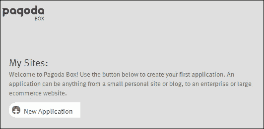
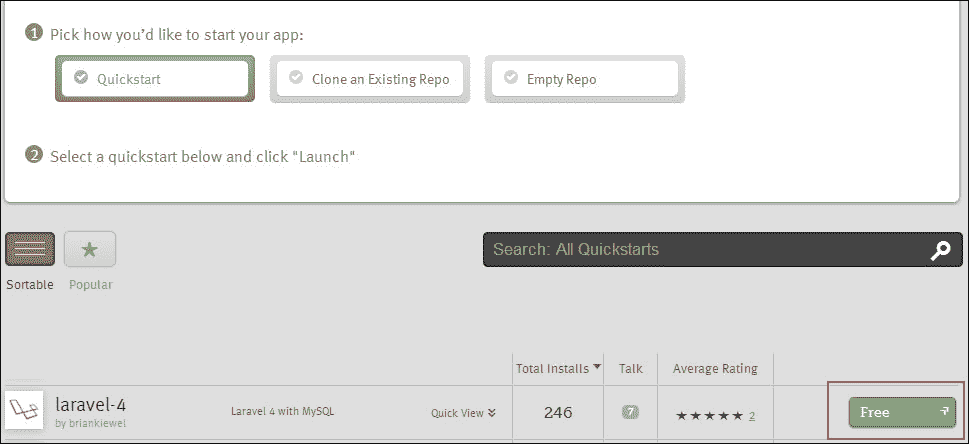
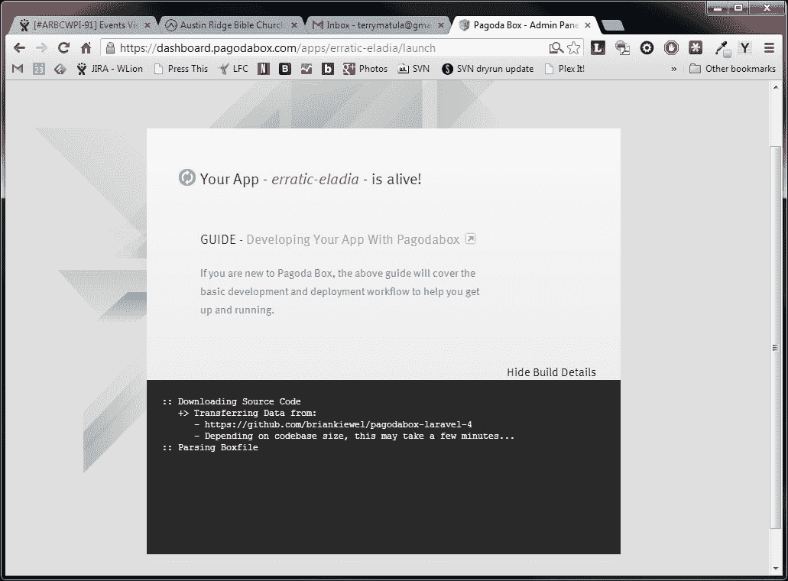
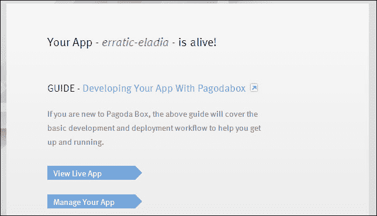

# 第十一章。将第三方服务部署和集成到您的应用程序中

在本章中，我们将介绍:

*   创建一个队列并使用 Artisan 运行它
*   将 Laravel 应用程序部署到宝塔盒
*   使用 Laravel 的条纹支付网关
*   执行 GeoIP 查找并设置自定义路由
*   收集电子邮件地址并与第三方电子邮件服务一起使用
*   存储和检索亚马逊 S3 云内容

# 简介

Web 应用程序通常依赖第三方服务来帮助我们的应用程序运行。使用 Composer 和 Laravel，我们可以集成现有的代码，这些代码将允许我们与这些服务交互。在本章中，我们将看到如何将我们的应用程序部署到宝塔盒，使用条带支付，进行 GeoIP 查找，使用第三方电子邮件服务，并将内容存储到云中。

# 创建一个队列并使用 Artisan 运行它

可能有些时候我们的 app 需要做大量的幕后工作来完成一项任务。我们可以将任务添加到队列中，稍后再进行处理，而不是让用户等到任务完成。有许多可用的队列系统，但是 Laravel 有一些非常容易实现的系统。在这个食谱中，我们将使用 IronMQ。

## 做好准备

对于这个配方，我们需要一个工作安装的 Laravel 4，以及用于 IronMQ 的 API 凭证。可以在[http://www.iron.io/](http://www.iron.io/)创建一个免费账户。

## 怎么做...

要完成此配方，请遵循给定的步骤:

1.  在`app/config`目录下，打开`queue.php`文件，将默认值设置为`iron`，从 IronMQ 填写凭证。
2.  打开 Laravel 的`composer.json`文件，更新所需的部分，使其看起来像下面的片段:

    ```php
    "require": {
    "laravel/framework": "4.0.*",
    "iron-io/iron_mq": "dev-master"
    }
    ```

3.  在命令行窗口中，使用以下命令更新作曲者文件:

    ```php
    php composer.phar update

    ```

4.  一切安装完毕后，打开`routes.php`文件，创建一条命中队列的路由:

    ```php
    Route::get('queueships', function() {
    $ships = array(
      array(
        'name' => 'Galactica',
        'show' => 'Battlestar Galactica'),
        array(
        'name' => 'Millennium Falcon',
        'show' => 'Star Wars'),
        array(
        'name' => 'USS Prometheus',
        'show' => 'Stargate SG-1')
    );
    $queue = Queue::push('Spaceship', array('ships' => 
    $ships));
      return 'Ships are queued.';
    });
    ```

5.  在`app/models`目录下创建一个名为`Spaceship.php`的文件，如下代码所示:

    ```php
    <?php

    class Spaceship extends Eloquent{

      protected $table = 'spaceships';

      public function fire($job, $data)
    {
    // Could be added to database here!
      Log::info('We can put this in the database: ' . print_r($data, TRUE));
      $job->delete();
    }
    }
    ```

6.  在浏览器中，转到`http://{your-url}}/public/queueships`，刷新几次。
7.  在 IronMQ 窗口中检查是否添加了新消息。
8.  打开命令行窗口，运行以下命令:

    ```php
     php artisan queue:listen

    ```

9.  过了一会儿，看文件夹`app/storage/logs`里面，找到名字里有今天日期的文件。它将打印出我们添加到队列中的数组。

## 它是如何工作的...

我们首先在`config`文件中确保使用 IronMQ 作为我们默认的队列驱动程序。如果我们想使用另一个队列系统，我们可以在这里设置。然后，我们使用 composer 将 IronMQ 包安装到我们的应用程序中。这将添加我们需要的所有文件，以及 Iron 需要工作的任何依赖项。

此时，Laravel 已经设置为使用我们选择的任何队列系统，因此我们可以开始使用它。我们首先在路线中创建一组数据。这可以很容易地作为表单输入，所以我们希望等待处理一些其他数据。然后我们使用`Queue::push()`方法，设置应该使用的类(`Spaceship`)，然后传入数据发送到那个类。

如果我们现在走这条路线，然后检查 IronMQ 队列，我们会看到有一个作业等待处理。我们的下一个任务是创建一个类来处理队列。为此，我们创建了一个名为`Spaceship`的模型。我们需要创建一个`fire()`方法来解析队列中的数据。在这里，我们可以将信息保存到数据库中，或者进行其他一些繁重的处理。现在，我们只需将数据发送到日志文件中。在`fire()`方法的最后，我们确保删除作业。

如果我们转到`queueships`路线并刷新几次，我们会在队列中看到多个作业，但我们还没有处理它们。因此，在命令行中，我们运行 artisan 的`queue:listen`命令，这将开始处理我们的队列。很快，我们可以进入我们的日志目录，看到从队列发送的信息。

## 还有更多...

我们可能需要排队的原因有很多。大多数情况下，这是为了处理图像或进行大量数据分析。对我们想从网站发送的任何电子邮件进行排队也很有用，Laravel 有一种特殊的方法，使用 `Mail::queue()`命令。

# 将 Laravel 应用部署到宝塔盒

宝塔盒是一个流行的云托管服务，使得创建一个网络应用非常容易。通过为 Laravel 预先制作的盒子，我们可以在云中创建自己的网站。

## 做好准备

对于这个食谱，我们需要在[https://dashboard.pagodabox.com/account/register](https://dashboard.pagodabox.com/account/register)有一个宝塔盒的免费账户。注册后，我们还需要将 SSH 密钥添加到我们的帐户中。更多关于 SSH 密钥的信息可以在[http://help.pagodabox.com/customer/portal/articles/202068](http://help.pagodabox.com/customer/portal/articles/202068)找到。

## 怎么做...

要完成此配方，请遵循给定的步骤:

1.  After logging in to Pagodabox, click on the **New Application** tab as shown in the following screenshot:

    

2.  Make sure **Quickstart** is selected, then scroll down to find the laravel-4 quickstart. The click on the **Free** button as shown in the following screenshot:

    

3.  On the next page, click on the **Launch** button as shown in the following screenshot:

    

4.  Wait for a few minutes while everything gets installed.

    

5.  Once it's finished, click on the blue **Manage Your App** button as shown in the following screenshot:

    

6.  Copy the git clone URL as shown in the following screenshot:

    

7.  在命令行窗口中，转到服务器的根目录，运行 git 克隆命令。在我们的情况下，应该是:

    ```php
    git clone git@git.pagodabox.com:erratic-eladia.git pagodaapp

    ```

8.  一切下载完成后，打开`app/routes.php`文件，添加一条路线，这样我们就可以按照下面的代码进行测试:

    ```php
    Route::get('cool', function()
    {
      return 'Pagoda Box is awesome!';
    });
    ```

9.  在命令行窗口中，提交以下更改并将其发送回宝塔框

    ```php
     git commit –am 'Added route'
     git push origin master

    ```

10.  宝塔盒完成更改后，转到新路线看看是否有效。在我们的情况下，将是[http://erratic-eladia.gopagoda.com/cool](http://erratic-eladia.gopagoda.com/cool)。

## 它是如何工作的...

如果我们希望托管我们的应用程序，并确保它是可扩展的，我们可能希望考虑云托管服务。如果我们碰巧收到大量流量，这将让我们提高它的性能，而当流量减少时，这将降低性能。一个能很好地与 PHP 和 Laravel 一起工作的优秀主机是宝塔盒。宝塔盒还有一个非常好的免费选项，允许我们测试它，并创建一个完整的应用程序，而不需要付费。

首先，在宝塔盒仪表板中，我们创建一个新的应用程序，并选择一个我们想要使用的快速入门包。列表中是一个方便的 Laravel 4 安装；如果我们选择它，所有的东西都会为我们安装，包括所有的依赖项。

一切设置好之后，我们可以复制 git 克隆代码，并将文件下载到本地服务器。下载后，我们可以进行任何更新并提交。将它推回宝塔盒后，我们更新的代码将自动部署，我们将在直播网站上看到变化。

## 还有更多...

还有其他云托管提供商与 Laravel 合作良好。他们往往都有免费的选择，所以我们可以尝试一下。其他一些主机如下:

*   发动机场[https://www.engineyard.com/](https://www.engineyard.com/)
*   数字海洋[https://www.digitalocean.com/](https://www.digitalocean.com/)
*   Heroku (有隐藏的 PHP 支持)[https://www.heroku.com/](https://www.heroku.com/)

# 使用带 Laravel 的条纹支付网关

电子商务网站是网络开发中的一个固定的主要部分。在过去，像信用卡处理这样的事情一直很困难，学习曲线非常陡峭。有了 Laravel 和 Stripe 服务，提供信用卡交易就容易多了。

## 做好准备

对于这个配方，我们需要 Laravel 4 的工作安装和Stripe 的正确凭证。在[https://stripe.com/](https://stripe.com/)可以创建一个带条纹的免费账户。

## 怎么做...

要完成此配方，请遵循以下步骤:

1.  打开应用的`composer.json`文件，更新`require`部分，类似于下面的片段:

    ```php
    "require": {
      "laravel/framework": "4.0.*",
      "stripe/stripe-php": "dev-master"
    },
    ```

2.  在命令行窗口中，使用以下命令运行 composer update:

    ```php
     php composer.phar update

    ```

3.  在`app/config`目录中，创建一个名为`stripe.php`的新文件，其代码如下:

    ```php
    <?php

    return array(
      'key' => 'fakeKey-qWerTyuuIo4f5'
    );
    ```

4.  在`routes.php`文件中，在付款单上添加一个`Route`，如下图所示:

    ```php
    Route::get('pay', function()
    {
      return View::make('pay');
    });
    ```

5.  在`app/views`文件夹中，使用以下代码片段为我们的表单创建一个名为`pay.blade.php`的文件:

    ```php
    {{ Form::open(array('url' => 'pay', 'method' => 'post')) }}
      Card Number: {{ Form::text('cc_number', 
        '4242424242424242') }}<br>

      Expiration (month):
        {{ Form::select('cc_exp_month', array(1 => '01', 2 => 
        '02', 3 => '03', 4 => '04', 5 => '05',6 => '06', 7 => 
        '07', 8 => '08', 9 => '09', 10 => '10', 11 
        => '11', 12 => '12')) }}<br>

      Expiration (year):
        {{ Form::select('cc_exp_year', array(2013 => 2013,
        2014 => 2014, 2015 => 2015, 2016 => 2016)) }}<br>

      {{ Form::submit('Charge $37 to my card') }}
      {{ Form::close() }}
    ```

6.  回到`routes.php`中的，创建一个`Route`接受表单帖子，并按照下面的代码进行刷卡:

    ```php
    Route::post('pay', function()
    {
      Stripe::setApiKey(Config::get('stripe.key'));
      $chargeCard = array(
        'number' => Input::get('cc_number'),
        'exp_month' => Input::get('cc_exp_month'),
        'exp_year'  => Input::get('cc_exp_year')
    );
      $charge = Stripe_Charge::create(array('card' => 
        $chargeCard, 'amount' => 3700, 'currency' => 'usd'));

    // Save returned info here
      var_dump($charge);
    });
    ```

## 它是如何工作的...

我们从将 Stripe 包添加到我们的 composer 文件并更新它开始。这将安装条带代码以及任何依赖项(如果需要)。然后我们需要创建一个配置文件来保存我们的 API 密钥。在这里，我们可以创建另一个与我们的环境变量相同的目录，并将该文件添加到那里。因此，如果我们有一个开发和生产服务器，我们可以在`app/config/development`目录中有一个 Stripe `config`文件来保存我们的测试 API 密钥，然后在`app/config/production`目录中有一个文件来保存我们的实时 API 密钥。

接下来，我们需要一个表单供用户输入他们的信用卡信息。我们创建一条`pay`路线，显示我们的`pay`视图。在该视图中，我们将使用 Blade 模板来创建表单。Stripe 要求的最低要求是卡号和到期日期，尽管有时我们需要获取卡的 CVV 代码或用户地址。

发布该表单后，我们使用 API 密钥创建一个 Stripe 实例。然后我们将信用卡信息添加到一个数组中。最后，我们将金额(以美分为单位)、卡数组和货币发送到 Stripe 进行处理。

然后，从 Stripe 返回的数据可以添加到数据库中，或者以其他方式进行跟踪。

## 还有更多...

Stripe 提供了许多易于使用的方法来管理信用卡交易，甚至订阅之类的事情。如需更多信息，请务必查看位于 https://stripe.com/docs 的可用文档

# 进行地理 IP 查找并设置自定义路由

有时候，我们的应用程序需要根据人们所在的国家提供不同的页面。使用 Laravel 和 MaxMind 的 GeoIP 数据，我们可以根据一个人的 IP 地址查找他们的国家，然后将他们重定向到我们需要的页面。

## 做好准备

对于这个食谱，我们只需要一个工作的 Laravel 4 安装。

## 怎么做...

要完成此配方，请遵循以下步骤:

1.  打开`composer.json`文件，更新`require`部分，看起来像下面的片段:

    ```php
    "require": {
      "laravel/framework": "4.0.*",
      "geoip/geoip": "dev-master"
    },
    ```

2.  在命令行窗口中，使用以下命令运行 composer update:

    ```php
     php composer.phar update

    ```

3.  前往[http://dev.maxmind.com/geoip/legacy/geolite/](http://dev.maxmind.com/geoip/legacy/geolite/)下载最新的 **GeoLite Country** 数据库。解压后把`GeoIP.dat`文件放到我们 app 的根目录下。
4.  在`app/config`目录下，创建一个名为`geoip.php`的文件，代码如下:

    ```php
    <?php

    return array(
      'path' => realpath("path/to/GeoIP.dat")
    );
    ```

5.  打开文件，为我们的`geoip`文件添加一个过滤器，代码如下:

    ```php
      Route::filter('geoip', function($route, $request, $value = NULL)
    {
      $ip = is_null($value) ? Request::getClientIp() : $value;
      $gi = geoip_open(Config::get('geoip.path'), GEOIP_STANDARD);
      $code = geoip_country_code_by_addr($gi, $ip);
      return Redirect::to('geo/' . strtolower($code));
    });
    ```

6.  在我们的`routes.php`文件中，创建一个应用过滤器的路线和一个接受国家代码的路线，如以下代码所示:

    ```php
    Route::get('geo', array('before' => 'geoip:80.24.24.24', function()
    {
    return '';
    }));
    Route::get('geo/{country_code}', function($country_code)
    {
    return 'Welcome! Your country code is: ' . $country_code;
    });
    ```

## 它是如何工作的...

我们从安装`geoip`库开始，将其添加到我们的`composer.json`文件并更新。一旦下载完成，我们就可以下载 MaxMind 的免费`geoip`数据文件，并将其添加到我们的应用程序中。在我们的例子中，我们将把文件放在应用程序的根目录下。然后，我们需要创建一个`config`文件来保存`geoip`数据文件的位置。

接下来，我们要检查用户的 IP 地址，并将其重定向到特定于国家/地区的页面。为此，我们将使用 Laravel 的前过滤器。首先设置`$ip`变量。如果我们手动传入一个 IP 地址，它将使用这个地址；否则，我们运行`Request::getClientIp()`方法来尝试并确定它。一旦我们有了 IP 地址，我们就通过`geoip`函数运行它来获取 IP 地址的国家代码。然后，我们将用户重定向到以国家代码为参数的路线。

然后我们创建一条路线来添加过滤器。在我们的例子中，我们将手动将一个 IP 地址传递给过滤器，但是如果它不在那里，它将尝试使用用户的地址。我们的下一条路线以国家代码为参数。此时，我们可以根据国家提供定制内容，甚至可以自动设置使用哪种语言文件。

# 收集电子邮件地址并与第三方电子邮件服务一起使用

电子邮件列表和时事通讯仍然是与大群人交流的一种流行而有效的方式。在这个菜谱中，我们将使用 Laravel 和免费的 MailChimp 服务来建立一个收集电子邮件订阅的简单方法。

## 做好准备

对于这个食谱，我们需要一个有效的 Laravel 4 安装，以及一个免费的帐户[http://mailchimp.com/](http://mailchimp.com/)和在 Mailchimp 的帐户部分生成的 API 密钥。我们还需要在 Mailchimp 中创建至少一个列表。

## 怎么做...

要完成此配方，请遵循以下步骤:

1.  在`app`目录下，新建一个名为`libraries`的目录。
2.  从[http://apidocs.mailchimp.com/api/downloads/#php](http://apidocs.mailchimp.com/api/downloads/#php)下载 Mailchimp 的 API 库，然后解压，将文件`MCAPI.class.php`放入新的`libraries`文件夹。
3.  打开 Laravel 的`composer.json`文件，将库目录添加到`autoload`部分。该部分应该类似于下面的片段:

    ```php
    "autoload": {
        "classmap": [
        "app/commands",
        "app/controllers",
        "app/models",
        "app/database/migrations",
        "app/database/seeds",
        "app/tests/TestCase.php",
        "app/libraries"
    ]
    },

    ```

4.  打开命令行窗口，运行作曲者的`dump-autoload`命令，如下图所示:

    ```php
     php composer.phar dump-autoload

    ```

5.  在`app/config`目录下，创建一个名为`mailchimp.php`的文件，代码如下:

    ```php
    <?php

    return array(
      'key' => 'mykey12345abcde-us1',
      'list' => 'q1w2e3r4t5'
    );
    ```

6.  要获取我们所有的 Mailchimp 列表，并查看它们的 id，请打开`routes.php`文件并添加一个新的路由，如以下代码所示:

    ```php
    Route::get('lists', function()
    {
      $mc = new MCAPI(Config::get('mailchimp.key'));
      $lists = $mc->lists();

      if($mc->errorCode) {
        echo 'Error loading list: ' . $mc->errorMessage;
      } else {
        echo '<h1>Lists and IDs</h1><h3>Total lists: '
        $lists['total'] . '</h3>';
      foreach($lists['data'] as $list) {
       echo '<strong>' . $list['name'] . ':</strong> ' .
       $list['id'] . '<br>';
    }
    }
    });

    ```

7.  在`routes.php`文件中，使用以下代码创建显示`subscribe`表单的路线:

    ```php
    Route::get('subscribe', function()
    {
      return View::make('subscribe');
    });
    ```

8.  在`app/views`目录中，创建一个名为`subscribe.blade.php`的文件，如以下代码片段所示:

    ```php
      {{ Form::open() }}
      First Name: {{ Form::text('fname') }} <br>
      Last Name: {{ Form::text('lname') }} <br>
      Email: {{ Form::text('email') }} <br>
      {{ Form::submit() }}
      {{ Form::close() }}
    ```

9.  在`routes.php`文件中，创建接受和处理表单提交的路径，如以下代码所示:

    ```php
    Route::post('subscribe', function()
    {
      $mc = new MCAPI(Config::get('mailchimp.key'));

      $merge_vars = array('FNAME' => Input::get('fname'), 'LNAME' => Input::get('lname'));
      $ret = $mc->listSubscribe(Config::get('mailchimp.list'), Input::get('email'), $merge_vars);

    if ($mc->errorCode){
      return 'There was an error: ' . $mc->errorMessage;
    } else {
      return 'Thank you for your subscription!';
    }
    });
    ```

## 它是如何工作的...

为了开始这个食谱，我们需要添加 Mailchimp 的 PHP 库。因为我们不会使用作曲者，我们需要建立一个目录来存放我们的任何非作曲者库。所以我们在`app`文件夹中创建一个`libraries`目录，并在那里添加 Mailchimp。

为了让 Laravel 知道我们想要`autoload`新目录中的任何东西，我们需要更新`composer.json`文件。然后我们将目录位置添加到`Classmap`部分。然后我们需要运行 composer 的`dump-autoload`命令来重新创建我们的`autload`文件，并将其添加到我们的新目录中。

然后我们需要创建一个新的`config`文件来保存我们的 Mailchimp 凭证和我们想要使用的列表的 ID。我们可以从 Mailchimp 仪表盘上获取`list` ID，或者我们可以使用`lists`路线来显示它们。

为了捕获用户的电子邮件，我们创建了一个路径和视图来保存表单。该表单也可以是弹出式的、模态的，或者是更大页面的一部分。我们询问他们的名字和电子邮件，然后把它发到 Mailchimp 上。

在我们的`post`路线中，我们只需要实例化 Mailchimp 类，创建一个数组来保存名称，并将所有内容发送给 `listSubscribe()`方法。最后，我们检查来自 Mailchimp 的任何错误，并显示成功消息。

## 还有更多...

Mailchimp 提供了一个非常广泛的应用编程接口，允许我们轻松管理我们的电子邮件列表。要查看他们提供的一切，请查看在线文档，网址为:[http://apidocs.mailchimp.com/](http://apidocs.mailchimp.com/)

# 存储和检索亚马逊 S3 的云内容

使用像亚马逊的 S3 这样的服务来存储我们的文件将允许我们利用他们的服务器的速度和 T2 的可靠性。为了利用这项服务，我们可以很容易地实现一个 Laravel 包来处理我们上传到亚马逊的内容。

## 做好准备

对于这个食谱，我们需要一个有效的 Laravel 4 安装。我们还需要一个免费的亚马逊 AWS 账户，可以注册在:[http://aws.amazon.com/s3/](http://aws.amazon.com/s3/)

注册后，我们需要从**安全凭证**页面获取我们的**访问密钥 ID** 和**秘密 ID** 。此外，在 S3 管理控制台中，我们需要创建至少一个存储桶。对于这个食谱，我们将把水桶命名为`laravelcookbook`。

## 怎么做…

要完成此配方，请遵循给定的步骤:

1.  打开 Laravel 的`composer.json`文件，添加亚马逊 SDK 包。需求部分应该类似于下面的代码片段:

    ```php
    "require": {
      "laravel/framework": "4.0.*",
      "aws/aws-sdk-php-laravel": "dev-master"
    },
    ```

2.  打开命令行窗口，使用 Composer 包安装包，如下面的代码所示:

    ```php
     php composer.phar update

    ```

3.  一切安装完毕后，在`app/config`目录下，创建一个名为`aws.php`的文件，如下代码所示:

    ```php
    <?php

    return array(
      'key'    => 'MYKEY12345',
      'secret' => 'aLongS3cretK3y1234abcdef',
      'region' => '',
    );
    ```

4.  在`app/config` 目录下，打开`app.php`文件。在`providers`数组的末尾，添加 AWS 提供程序，如以下代码所示:

    ```php
      'Aws\Laravel\AwsServiceProvider',
    ```

5.  同样在`app.php`文件中，在别名数组中，添加以下别名:

    ```php
      'AWS' => 'Aws\Laravel\AwsFacade',
    ```

6.  在我们的`routes.php` 文件中，通过创建一个路径来列出我们的`buckets`并使用以下代码来测试一切是否都在工作:

    ```php
    Route::get('buckets', function()
    {
      $list = AWS::get('s3')->listBuckets();
        foreach ($list['Buckets'] as $bucket) {
        echo $bucket['Name'] . '<br>';
    }
    });

    ```

7.  要测试铲斗，请转到`http://{your-server}/buckets`，它应该会显示我们设置的所有铲斗的列表。
8.  现在让我们为用户创建一个上传图像的表单。我们从保存表单的路径开始，如下面的代码所示:

    ```php
    Route::get('cloud', function()
    {
      return View::make('cloud');
    });
    ```

9.  在`app/views`文件夹中，创建一个名为`cloud.blade.php`的文件，其代码如下:

    ```php
      {{ Form::open(array('files' => true)) }}
      Image: {{ Form::file('my_image') }} <br>
      {{ Form::submit() }}
      {{ Form::close() }}
    ```

10.  回到`routes.php`文件，创建处理文件的路径，上传到 S3，如下代码所示:

    ```php
    Route::post('cloud', function()
    {
      $my_image = Input::file('my_image');
      $s3_name = date('Ymdhis') . '-' . $my_image
        >getClientOriginalName();
      $path = $my_image->getRealPath();

      $s3 = AWS::get('s3');
      $obj = array(
        'Bucket'     => 'laravelcookbook',
        'Key'        => $s3_name,
        'SourceFile' => $path,
        'ACL'        => 'public-read',
    );

      if ($s3->putObject($obj)) {
      return
        Redirect::to('https://s3.amazonaws.com/laravelcookbook/
        ' . $s3_name);
    } else {
      return 'There was an S3 error';
    }
    });

    ```

## 它是如何工作的...

我们从安装亚马逊的 AWS SDK 开始制作食谱。谢天谢地，亚马逊发布了一个专门为 Laravel 4 设计的作曲家包，所以我们只是把它添加到我们的`composer.json`文件中并进行更新。

一切安装完毕后，我们需要创建一个配置文件，并添加我们的亚马逊凭据。我们也可以在`region`(如`Aws\Common\Enum\Region::US_WEST_2`)中添加，但是如果我们将其留空，它将使用`US Standard`区域。然后我们更新我们的`app.php`配置，包括亚马逊提供的 AWS `ServiceProvider`和`Facade`。

如果我们的 S3 已经有了存储桶，我们可以创建一个路径来列出这些存储桶。首先创建一个新的 S3 实例，并简单地调用`listBuckets()`方法。然后我们循环通过`Buckets`的数组并显示它们的名称。

我们的下一个目标是创建一个用户可以添加图像的表单。我们创建显示`cloud`视图的`cloud`路线。我们的视图是一个带有单个`file`字段的简单刀片模板表单。该表格随后将被发布到`cloud`。

在我们的`cloud`帖子路线中，我们首先使用`Input::file()`方法检索图像。接下来，我们通过在文件名的开头添加日期来为图像创建一个新名称。然后我们获得上传图像的路径，这样我们就知道要将哪个文件发送到 S3。

接下来，我们创建一个 S3 实例。我们还需要一个数组来保存要发送到 S3 的值。`Bucket`简单来说就是我们要用的 S3 桶的名字，`Key`就是我们要给文件起的名字，`SourceFile`就是我们要发过来的文件的位置，然后`ACL`就是我们要给文件起的权限。在我们的例子中，我们将`ACL`设置为`public-read,`，这允许图像显示给任何人。

我们的最后一步是调用`putObject()`方法，该方法会将所有内容发送到我们的 S3 桶。如果成功，我们将重定向用户以查看上传的文件。

## 还有更多...

在我们的例子中，用户被迫等到图像上传到亚马逊后才能继续。这将是一个使用队列处理一切的绝佳案例。

## 另见

*   创建一个队列并使用 Artisan 运行它配方