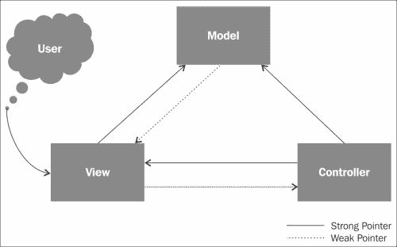
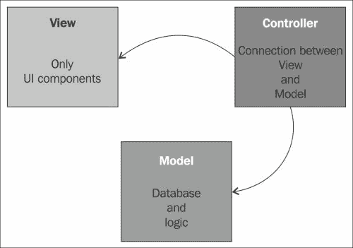

# 三、MVC 中的视图

在本章中，我们将讨论什么是视图，它的结构，它的用途，以及 Laravel 的视图层和 Blade 模板引擎的优势。

# 什么是视图？

Laravel 中的视图指的是 MVC 中的 V。视图由表示逻辑方面组成，如模板和缓存以及涉及表示的代码。确切地说，视图准确地定义了呈现给用户的内容。通常，控制器将数据传递给每个视图，以某种格式呈现。视图也从用户那里收集数据。这是您可能在 MVC 应用中找到 HTML 标记的地方。

大多数现代 MVC，比如 Laravel Framework，都实现了一种模板语言，它从 PHP 中增加了一层抽象。增加层意味着增加开销。在这里，我们坚持模板内 PHP 的速度，但是所有的逻辑都在外面。这使得用户界面(UI)设计者无需学习任何编程语言就可以轻松开发主题/模板。

在许多 MVC 实现中，视图层与控制器和模型对话。下图很好地解释了这种方法:



正如您在上图中看到的，视图与控制器和模型都通信。乍一看，用面向对象语言开发应用似乎是一种非常灵活的方法。在 MVC 的所有对象之间共享数据，并在应用的任何一层访问它们，听起来非常酷。不幸的是，该方法会导致一些问题，这取决于项目的规模。

最重要的问题是在团队/开发人员之间分配开发任务的复杂性。如果不设置开发规则，就会导致混乱的情况，比如无法管理的意大利面代码。此外，我们还必须考虑额外的开发成本，例如培训开发人员和相对较长的开发过程，这些都会直接影响项目的成本。

正如我们在本书开头提到的，开发不仅涉及编码或共享任务，它还是包括项目开发方法的规划和营销的过程。

Laravel 提供了一种不同的 MVC 方法。根据 Laravel 的说法，视图层应该只与控制器通信。模型与控制器通信。让我们看看下图:



从上图可以看到，应用层是完全分离的。因此，您可以获得易于管理的代码和开发团队。通常，我们在 MVC 中至少需要三个文件:模型文件、控制器文件和视图文件。让我们通过对象来解释视图文件。

# 查看对象

在您的应用中，通常有多个包含表单、资产引用等的 HTML 页面；例如，如果您正在开发电子商务应用。在一个简单的电子商务系统中，有我们需要的产品列表、类别、购物车和产品详细信息页面。这意味着我们需要四个模板和太多的数据来呈现给用户。我们可以将视图层的对象分组，如下所示:

*   HTML 元素(div、标题、节等)
*   HTML 表单元素(输入、选择等)
*   资产和 JavaScript 引用(`.css`和`.js`)

当您处理具有动态数据的项目时，分离模板文件无助于简化问题，因为您仍然需要编程语言函数来处理对象。这导致了我们不想面对的事情——意大利面条代码。当一个项目在 HTML 文档中有内嵌的 PHP 代码时，您将面临保持代码简单的问题。让我们看看下面代码中没有用任何模板语言实现的通用模板文件内容:

```php
<!DOCTYPE html> 
<html lang="en"> 
<head> 
<title><?php echo $title; ?></title> 
<meta http-equiv="Content-Type" content="text/html; charset=utf-8" /> 
<meta http-equiv="x-ua-compatible" content="chrome=1" /> 
<meta name="description" content="<?php echo $meta_desc; ?>" /> 
<meta name="keywords" content="<?php echo $meta_keys; ?>" /> 
<meta name="robots" content="index,follow" /> 
<meta property="og:title" content="<?php echo $title; ?>" /> 
<meta property="og:site_name" content="<?php echo $site_name; ?>" /> 
<meta property="og:image" content="http://www.example.cimg/"<?php echo $thumbnail; ?> /> 
<meta property="og:type" content="product" /> 
<meta property="og:description" content="<?php echo $meta_desc; ?>" /> 
</head> 
<body> 
<?php 
if($user_name){ 
?>
<div class="username">Welcome <?php echo strtoupper($user_name); ?> !</div> 
<?php 
}else{ 

echo '<div class="username">Welcome Guest!</div>'; 

} 
?> 
</body> 
```

作为一名用户界面开发人员，您需要 PHP 语言的先验知识(至少是语言语法的知识)来理解您看到的代码。正如我们在[第 1 章](1.html#page "Chapter 1. Design and Architectural Pattern Fundamentals")、*设计和架构模式基础*中提到的，大多数现代 MVC 框架都附带了一个模板语言，捆绑在一起用于视图中。Laravel 提供了一个与视图一起使用的实现的模板语言；这被称为 Blade 模板引擎，或简称为 Blade。

# 在 Laravel 查看

根据 Laravel 的 MVC 方法，视图处理来自控制器的数据。这意味着视图获取的数据通常已经按照我们的需要进行了格式化。如果视图直接与模型通信，我们必须在视图层格式化、验证或过滤数据，如前面的示例代码所示。因此，让我们看看下面代码中的刀片模板文件是什么样子的:

```php
<!DOCTYPE html> 
<html lang="en"> 
<head> 
<title>{{$title}}</title> 
<meta http-equiv="Content-Type" content="text/html; charset=utf-8" /> 
<meta http-equiv="x-ua-compatible" content="chrome=1" /> 
<meta name="description" content="{{$meta_desc}}" /> 
<meta name="keywords" content="{{$meta_keys}}" /> 
<meta name="robots" content="index,follow" /> 
<meta property="og:title" content="{{$title}}" />
<meta property="og:site_name" content="{{$site_name}}" /> 
<meta property="og:image" content="http://www.example.cimg/"{{$thumbnail}} /> 
<meta property="og:type" content="product" /> 
<meta property="og:description" content="{{$meta_desc}}" /> 

</head> 

<body> 
@if($user_name) 

<div class="username">Welcome {{$user_name}} !</div> 

@else 

<div class="username">Welcome Guest !</div> 

@endif 
</body>
```

既没有 PHP 语法问题，也没有任何未封闭的括号问题。所以，我们有一个更干净的模板文件。得益于 Blade 的内置功能，我们可以获得更清晰的 View 文件。通常，页眉和页脚部分是我们应用中所有页面的公共部分。有两种方法可以添加它们。第一种也是不推荐的方法是将页眉、页脚和正文部分分成三个文件，类似于下面的示例:

```php
@include('header')
<body> 
@if($user_name) 

<div class="username">Welcome {{Str::upper($user_name)}} !</div> 

@else 

<div class="username">Welcome Guest !</div> 

@endif 
</body>

@include('footer')
```

不建议采用这种方式，因为它要求每页同时包含页眉和页脚。这也意味着，如果我们添加一个右列或左列，我们将需要更改我们应用的所有视图。在刀片式服务器中实现这一点的最佳方式如下所示:

```php
<!D       OCTYPE html> 
<html lang="en"> 
<head> 
<title>{{$title}}</title> 
<meta http-equiv="Content-Type" content="text/html; charset=utf-8" /> 
<meta http-equiv="x-ua-compatible" content="chrome=1" /> 
<meta name="description" content="{{$meta_desc}}" /> 
<meta name="keywords" content="{{$meta_keys}}" /> 
<meta name="robots" content="index,follow" /> 
<meta property="og:title" content="{{$title}}" /> 
<meta property="og:site_name" content="{{$site_name}}" /> 
<meta property="og:image" content="http://www.example.cimg/"{{$thumbnail}} /> 
<meta property="og:type" content="product" /> 
<meta property="og:description" content="{{$meta_desc}}" /> 

</head> 

<body> 

   @yield('content')

</body>
```

前面的文件是我们的布局视图，例如`master_layout.blade.php`。如您所见，内容有一个功能是使用`yield()`功能。这是一个占位符；因此，当任何视图文件扩展该文件时，将显示名为`content`的部分，而不是`yield()`功能中的。您可以根据需要在主布局中定义任意多个部分。因此，当我们想要在视图文件中使用这种布局时，我们应该使用它，如下面的代码所示:

```php
@extends('master_layout')

@section(''content')
<body> 
@if($user_name) 

<div class="username">Welcome {{Str::upper($user_name)}} !</div> 

@else 

<div class="username">Welcome Guest !</div> 

@endif 
</body>

@stop
```

就这样！您可以根据需要在任意多个视图中扩展主布局，也可以根据应用的需要创建多个布局。

# 总结

在这一章中，我们学习了视图在 MVC 模式中的作用，以及 Laravel 对视图的处理方式。我们看到了刀片模板引擎功能的基础。有关更多信息，请参考位于[http://laravel.com/](http://laravel.com/)的 Laravel 在线文档。

在下一章中，我们将讨论控制者的角色，他是 Laravel 的 MVC 哲学中的大师。