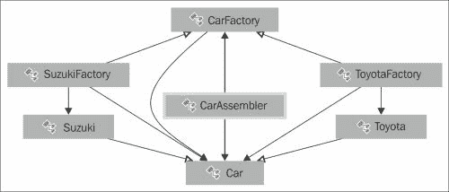

# 第六章。拉弗尔的最佳实践

在本章中，我们将看到在 Laravel 中使用的各种先前描述的设计模式的例子。

本章将讨论的主题如下:

*   基本和高级实践
*   Laravel 中使用的设计模式的真实例子
*   示例中使用这些设计模式的原因

# 基本做法

作为一名开发人员，当你在开发一个应用时，应该有一个系统的事情顺序，以防止混乱并允许灵活性。例如，在 MVC 架构中，控制器应该只保存逻辑，而模型应该只保存数据流相关的东西。不应在视图文件中编写数据库查询。这样，任何从事这个项目的人都可以很容易地找到他们想要的东西，并且可以更容易地改变、分叉或改进它。如果不这样做，随着项目越来越大，它将变成一个烂摊子。

一个基本的好习惯是避免重复自己。如果您多次使用代码片段或条件，最好为该操作准备一个方法或范围。这样，你就不必一遍又一遍地重复自己。例如，假设我们有一个假想的控制器，如下所示:

```php
<?php

class UserController extends BaseController {

   //An imaginary method that lists all active users
   public function listUsers() {

      $users = User::where('active', 1)->get();

      return View::make('frontend.users.list')
         ->with('users', $users);
   }

   //An imaginary method that finds a specific user
   public function fetch($id) {

      $user = User::where('active', 1)->find($id);

       return View::make('frontend.users.single')
         ->with('user', $user);

   }

}
```

如您所见，`where()`条件检查`active`是否重复两次。在现实世界的例子中，它会被更多地使用。

为了防止这种情况，在 Laravel 中，可以使用查询范围。查询范围是帮助您在模型中重用逻辑的单个函数。让我们在模型中定义一个查询范围，并将控制器方法更改如下:

```php
<?php

//Model File
Class User extends Eloquent {

   //We've defined a Query scope called active
   public function scopeActive($query) {
      return $query->where('active', 1);
   }

}

//Controller File
class UserController extends BaseController {

   //An imaginary method that lists all active users
   public function listUsers() {

      $users = User::active()->get();

      return View::make('frontend.users.list')
         ->with('users', $users);
   }

   //An imaginary method that finds a specific user
   public function fetch($id) {

      $user = User::active()->find($id);

      return View::make('frontend.users.single')
         ->with('user', $user);

   }

}
```

如您所见，我们已经在模型中定义了一个名为`scopeActive()`的方法，其前缀为`scope`和【卡梅洛西】。这样，Laravel 可以理解它是一个查询范围，您可以直接使用该范围。如您所见，控制器中的条件也发生了变化。他们已经从`where('active', 1)`变成了`active()`。

设计模式是高级实践，可以使用各种方法来保持代码整洁和系统。

# 先进做法

在本小节中，我们将在 Laravel 中看到各种设计模式的用法。如果您测试了包含设计模式的自定义类，这些设计模式是在书中提供的，它们应该在您的应用中自动加载。这可以通过将它们添加到`global.php`文件的`ClassLoader::addDirectories()`数组(可以通过导航到`app/start`找到)或`bootstrap`文件夹中的`start.php`文件来完成。或者，我们可以在`composer.json`中添加一个`psr-0`自动加载。

要从`app/start/global.php`添加目录，首先找到以下代码:

```php
ClassLoader::addDirectories(array(

   app_path().'/commands',
   app_path().'/controllers',
   app_path().'/models',
   app_path().'/database/seeds',

));
```

然后在下面添加您的文件夹。生成的代码如下所示:

```php
ClassLoader::addDirectories(array(

   app_path().'/commands',
   app_path().'/controllers',
   app_path().'/models',
   app_path().'/database/seeds',

   //our custom directory that holds classes
   app_path().'/acme',
));
```

如果您想使用`psr-0`自动加载从`composer.json`文件自动加载类或文件，您必须将名称空间和目录添加到`composer.json`中。密钥将是命名空间，值将是保存要自动加载的文件和类的文件夹的路径。看看下面的代码:

```php
"autoload": {

    "psr-0": {
        "Acme": "app/lib"
    }
}
```

在这个例子中，如果我们的`composer.json`文件没有`psr-0`对象，首先我们将创建它，然后在里面添加名称空间和路径值。你可以看到我们有一个名为`Acme`的名字空间，在`app/lib`文件夹下。

如果不想自动加载整个文件夹，而只想加载几个单个文件，也可以使用`composer.json`中的`files`对象。它是一个只保存文件路径的单一对象。

```php
"autoload": {
    "files": [
        "app/acme/myFunctions.php"
    ]
},
```

添加这些值后，您需要转储自动加载文件，并让 Laravel 理解它们。为此，在编辑完`composer.json`文件后，只需运行以下命令:

```php
composer dump-autoload
```

如果您的环境中没有安装 composer，也可以运行以下命令:

```php
php composer.phar dump-autoload
```

之后，您刚刚添加的类或文件将自动加载并可用于您的项目。

## 工厂模式

您可能还记得中[第 5 章*的设计模式，工厂模式基于创建模板方法对象来实现算法。假设我们正在开发以下应用:*](5.html#page "Chapter 5. Design Patterns in Laravel")



假设**丰田**品牌只生产 C 级红色轿车，**铃木**品牌只生产 B 级绿色轿车。假设我们有一个用于此目的的模型，其定义如下:

```php
<?php

class CarFactoryModel extends BaseModel{

    public static function createCar($manufacturer)
    {
        switch ($manufacturer)
        {

        }

        throw new \InvalidArgumentException("Unsupported manufacturer [$manufacturer]");
    }

    public static function createCarFromColor($color)
    {
        switch ($color)
        {
            case 'Red':

            return static::createCar('Toyota');

            case 'Green':

            return static::createCar('Suzuki');

        }

        throw new \InvalidArgumentException("Unsupported color [$color]");
    }

    public static function createCarFromClass($class)
    {
        switch ($class)
        {
            case 'B':

            return static::createCar('Suzuki');

            case 'C':

            return static::createCar('Toyota');
        }

        throw new \InvalidArgumentException("Unsupported car class [$class]");

    }
}
```

正如你可以看到的，在这种方法中，相同的`carFactory()`类被称为`Suzuki`和`Toyota`，因为在这个例子中，两个品牌将有相同的过程来创建汽车的核心。质量等级和颜色是在汽车核心生产出来后设定的。这样定下来之后，对于颜色和品质类的选择，我们可以直接用它的品牌叫对应的类。假设我们打算买一辆 b 级车。现在，因为代码知道哪个品牌生产 b 级车，所以会直接叫`Suzuki`。这个模型可以有一个控制器，如下面的代码所示:

```php
<?php

class CarController extends BaseController{

    public function showCarsByManufacturer($manufacturerName){

        return CarFactory::createCar($manufacturerName);

    }

    public function showCarsByColor($color){

        return CarFactory::createCarFromColor($color);

    }

    public function showCarsByClass($className){

        return CarFactory::createCarFromClass($className);

    }

}
```

该方法的三种不同路线如下:

```php
Route::get(
'cars/{manufacturer}', 
array(
'as'    => 'cars_by_manufacturer', 
'uses' => 'CarController@showCarsbyManufacturer'
)
);

Route::get(
'cars/color/{color}', 
array(
'as' => 'cars_by_color',
'uses' => 'CarController@showCarsbyColor'
)
);

Route::get(
'cars/class/{class}',
array(
'as' => 'cars_by_class',
'uses' => 'CarController@showCarsbyClass'
)
);
```

在这种情况下，除了工厂模式之外，拥有像这三条路线这样的方法将是网址丰富性、易用性和改进网站搜索引擎优化的良好实践。

## 建造者模式

我们在[第 5 章](5.html#page "Chapter 5. Design Patterns in Laravel")、*在*的设计模式中讨论过，以的方式，构建器模式是一种将较大的对象分成较小的对象并使它们可供重用的方法。

在本小节中，就像在[第 5 章](5.html#page "Chapter 5. Design Patterns in Laravel")、*设计模式中的例子一样，在*中，让我们假设我们正在烘焙一个具有特定属性的比萨饼，例如意大利和小/大:


假设我们有一个自动加载的类，如下所示:

```php
<?php

class PizzaDelivery
{
    protected $pizza;

    protected $config = array();

    public function __construct(array $config)
    {
        $this->pizza = new PizzaBuilder();
        $this->setConfig($config);
    }

    /**
    * Process some configuration parameters
    *
    * @param array $config
    */
    protected function setConfig(array $config)
    {
        $defaults = array(
            'spice' => true,
            'type' => 'Italian',
            'size' => 'Small',
        );

        $config =  array_replace($defaults, $config);
        $this->config = $config;
    }

    /**
    * Build the pizza using the supplied configuration parameters
    * From the constructor that is set using setConfig() method.
    *

    * @return null
    */
    public function build()
    {
        foreach ($this->config as $option => $value) {
            $method = sprintf('set%s', ucfirst($option));
            if (method_exists($this->pizza, $method) === true) {
                call_user_func(array($this->pizza, $method), $value);
            }
        }
    }

    /**
    * @return Pizza
    */
    public function getPizza()
    {
        return $this->pizza;
    }
}
```

正如你所看到的，我们已经注入了一个建设者，`PizzaBuilder`阶层，其中包括两个厨师:一个是意大利披萨制造商，另一个是亚洲披萨制造商。该方法中的`PizzaBuilder`类可以编码如下:

```php
<?php
class PizzaBuilder
{
    protected $type = '';
    protected $size = '';
    protected $spice = '';
    public function setSpice($spice)
    {
        $this->spice = $spice;
    }

    public function setSize($size)
    {
        $this->size = $size;
    }

    public function setType($type)
    {
        $this->type = $type;
    }
}
```

如您所见，它包含了烘焙披萨的所有基本内容，但是属性是在类外定义的，通过使用`setType()`和`setSize()`等方法的模型。通过这种方法，通过只定义属性而不考虑其他，我们可以直接从服务员那里构建和获得我们的比萨饼(`PizzaDelivery`)。如果我们需要一个亚洲比萨饼，我们会在我们的应用中的任何地方调用下面的代码:

```php
$myFavoritePizza = new PizzaDelivery(array('type' => 'Asian'));
$myFavoritePizza ->build();
return $myFavoritePizza->get();
```

## 战略模式

大家可能还记得《T4》中[第五章](5.html#page "Chapter 5. Design Patterns in Laravel")、*设计模式中的，策略模式用于根据任务将逻辑划分为更小的部分，以便这些部分可以重用。*

在示例应用中，我们将为这种方法编写代码，我们将为不同的包裹承运商制作包裹装运计算应用。假设我们有一个如下所示的类:

```php
<?php

interface ShipmentPricingStrategy {

    function shipmentPrice();

}

abstract class ShippingPriceStrategy implements ShipmentPricingStrategy {
    function __construct() {}
    abstract function shipmentPrice();
}

class FedexPriceStrategy extends ShippingPriceStrategy {

    function shipmentPrice() {
        return 4.95;
    }
}

class UpsPriceStrategy extends ShippingPriceStrategy {

    function shipmentPrice() {
        return 3.75;
    }
}

class Shipping {

    public $shipping_pricing_structure;

    function __construct(ShippingPriceStrategy $shipment_pricing_strategy) {

        $this->shipping_pricing_structure = $shipment_pricing_strategy;

    }
}
```

正如你在代码中看到的，在`Shipping`类中，我们注入了`ShippingPriceStrategy`。这种战略模式对每家运营商都有其特点(在我们的案例中为`shipmentPrice()`)。通过这种方法，对于不同的运输承运人，我们可以显示不同的交货价格，并将其包含在我们的运输过程中，这将在我们的`Shipping`类中定义。这样，我们在显示运输价格和计算运输过程的总和时，都使用了策略模式中设置的价格。

通过假设该类是自动加载的，我们可以在如下示例中使用具有 Strategy 模式的类:

```php
<?php

$cart_total = 77.90;

$fedex_price = new Shipping(new FedexPriceStrategy());

$ups_price = new Shipping(new UpsPriceStrategy());

$ups_price_with_cart = $cart_total+$ups_price->shipping_pricing_structure->shipmentPrice();

$fedex_price_with_cart = $cart_total+$fedex_price->shipping_pricing_structure->shipmentPrice();

echo 'The cost of this order with Fedex is: '.$fedex_price_with_cart."\n";

echo 'The cost of this order with UPS is: '.$ups_price_with_cart."\n";
```

如您所见，对于相同的运输流程(`Shipping`级)，通过为两个品牌注入不同的运输策略，我们成功地获得了不同的运输价格，因为它们的策略不同。

## 存储库模式

使用 a Repository 模式的主要原因是为了提供抽象性和灵活性。例如，假设您正在从数据库中获取一个产品。默认情况下，在 Laravel 中，通常的方法是在 Controller 中使用雄辩的 ORM，并将其传递给视图。这样，您的控制器就知道您正在使用雄辩的 ORM 从数据源/数据库中获取数据。对于小型应用，这应该不成问题，但是在大型应用中，可能会出现问题。将来，出于某种原因，您可能希望使用雄辩的 ORM 来删除 MySQL，并且可能需要在 MongoDB 中使用另一个 ORM。当这种情况发生时，因为控制器知道您正在使用雄辩的 ORM，您将不得不逐个挖掘每个控制器(或任何其他层)并更改它们。另一个限制是你不能单元测试这段代码。

如果您使用了存储库，这就不会发生。如果这样做，控制器将只与存储库连接，而存储库将处理其他相关层。因此，控制器不知道数据是如何获取的(抽象)。这样，在更大的应用上，管理东西或测试东西应该容易得多。

为了理解这种方法，首先让我们假设我们有`ProductsController`和`Product`模型，并且我们想要获取一个具有给定 ID 的产品和另一个转储所有产品的方法。控制器看起来像这样:

```php
<?php

Class ProductsController extends \BaseController {

   public function findProduct($id) {
      $product = Product::find($id);
      return View::make('product')
         ->with('product', $product);
   }

   public function allProducts() {
      $products = Product::all();
      return View::make('all_products')
         ->with('products', $products);
   }

}
```

这种方法有缺陷。如果您正在测试这样编写的代码，并且有一个错误，除非`Whoops`(Laravel 中使用的错误处理程序库)处于活动状态，否则您无法直接检测到错误的来源是什么。存储库在这种情况下很有帮助，因为它们提取了逻辑。要注入存储库，一种方法是在控制器的构造方法中定义和设置它。

让我们将这个存储库命名为`EloquentProductRepository`，它是`\Acme\Repositories`命名空间的一部分。我们的控制器将变成如下所示:

```php
<?php

//We use the repository in our class
use Acme\Repositories\EloquentProductRepository;

Class ProductsController extends \BaseController {

   //A protected variable to hold the Repository
   protected $product;

   //Let's define a constructor class, and assigning to the variable $product 
   public function __construct(EloquentProductRepository $product) {
      $this->product = $product;
   }

   public function findProduct($id) {
      //$product = Product::find($id);
      $product = $this->product->find($id);
      return View::make('product')
         ->with('product', $product);
   }

   public function allProducts() {
      //$products = Product::orderBy('id', 'desc')->get();
      //let's give it a unique method name
      $products = $this->product->getNewest();
      return View::make('all_products')
         ->with('products', $products);
   }

}
```

注意没有制作`orderBy('id', 'desc')->get()`，我们给了一个新的方法名，`getNewest()`。现在让我们创建这个仓库。假设在`namespace Acme\Repositories`文件夹中有一个名为`EloquentProductRepository.php`的文件。看看下面的代码:

```php
<?php namespace Acme\Repositories;

Class EloquentProductRepository {

   public function getNewest() {

      return \Order::orderBy('id', 'desc')->get();

   }

   public function find($id) {
      return \Order::find($id);
   }

}
```

对于所使用的每种方法，您需要在存储库中定义函数。这种方法的一个主要优点是它带来了灵活性。假设您将使用模拟，或者您将在将来从雄辩的 ORM 切换到另一个具有完全不同的方法名称的 ORM。要将应用的数据库层从雄辩层切换到 MongoDB，如果您已经使用了存储库，您只需要在控制器中更改已使用的存储库，而不需要做其他事情。您不需要挖掘所有的控制器、模型或其他组件。

这里还缺少一个特征。我们的控制器仍然知道我们正在使用一个特定于雄辩的存储库。为了获得更好的方法和抽象，我们的控制器不应该知道我们使用的是哪种存储库。为了确保这一点，我们必须为此编写一个接口。

现在，让我们在相同的名称空间路径中创建一个接口(这不是强制的；你可以在任何地方创建它，只要它被加载)作为`ProductInterface`。我们的控制器将如下所示:

```php
<?php

//We use the interface in our class
use Acme\Repositories\ProductInterface;

Class ProductsController extends \BaseController {

   //A protected variable to hold the Interface
   protected $product;

   //Let's define a constructor class, and inject the interface as $product variable
   public function __construct(ProductInterface $product) {
      $this->product = $product;
   }

   public function findProduct($id) {
      //$product = Product::find($id);
      $product = $this->product->find($id);
      return View::make('product')
         ->with('product', $product);
   }

   public function allProducts() {
      //$products = Product::orderBy('id', 'desc')->get();
      //let's give it a unique method name
      $products = $this->product->getNewest();
      return View::make('all_products')
         ->with('products', $products);
   }

}
```

接口被注入并使用，而不是存储库。现在我们对`ProductInterface`界面进行编码:

```php
<?php namespace Acme\Repositories;

interface ProductInterface {

   public function getNewest();
   public function find();

}
```

如您所见，接口保存了方法名称，这些名称实际上是实现的存储库可用的方法。现在，让我们将这个接口实现到我们的存储库，以连接它们:

```php
<?php namespace Acme\Repositories;

Class EloquentProductRepository implements ProductInterface {

   public function getNewest() {
      return \Order::orderBy('id', 'desc')->get();

   }

   public function find($id) {
       return \Order::find($id);
   }

}
```

这种实现方式有一个优点。让我们假设您已经在存储库中实现了一个接口，它缺少`getNewest()`自定义方法。由于这个实现，接口将直接让你知道它需要那个特定的方法，但是它缺少了。

最后，我们需要将接口绑定到存储库。做到这一点的方法之一就是使用 Laravel 内置的`App:bind();`方法。要将我们刚刚创建的存储库绑定到界面，请将这一行添加到您的`app/routes.php`文件或任何其他自动加载的文件中。

```php
App::bind(
'Acme\Repositories\ProductInterface', 
'Acme\Repositories\EloquentProductRepository'
);
```

绑定这两者的另一种方法是创建一个服务提供商。让我们编写如下服务提供商:

```php
<?php namespace Acme\Repositories;

use Illuminate\Support\ServiceProvider;

class UserServiceProvider extends ServiceProvider {

    public function register()
    {
        $this->app::bind('Acme\\Repositories\\ProductInterface', 'Acme\Repositories\EloquentProductRepository');
    }
}
```

我们假设这个提供者在`namespace Acme\Repositories`文件夹中。我们还使用了`Illuminate\Support\ServiceProvider`来扩展我们的类。在公共方法注册中，我们已经将接口绑定到我们的产品存储库中。

将来，如果你想切换到 MongoDB 或者任何其他你已经编码的接口，你所要做的就是将`EloquentRepositoryInterface`切换到新的接口。它将在应用中的任何地方更新。

# 总结

在本章中，我们看到了在 Laravel 和一般开发过程中使用的设计模式和架构的基本和高级实践的例子。我们已经学习了各种设计模式的优点，同时为每一种模式引用了真实世界的例子。

设计模式是为了让你的生活更轻松。如果开发没有遵循任何模式或架构，随着应用的增长，每次重构之后，重构和实现特性都会变得更加困难。此外，如果另一个开发人员加入项目，他或她首先需要了解什么在哪里。这可能会导致膨胀、糟糕的性能、不灵活以及各种难以修复的错误。这个应用将是一颗随时会爆炸的定时炸弹。设计和架构模式可以帮助您防止这些问题。不仅在您的 Laravel 应用中，而且在您正在开发的任何东西中，随着应用的增长，为了控制一切，您必须使用设计模式或它们的组合。最终，总有一天你会感谢自己使用了这些模式。