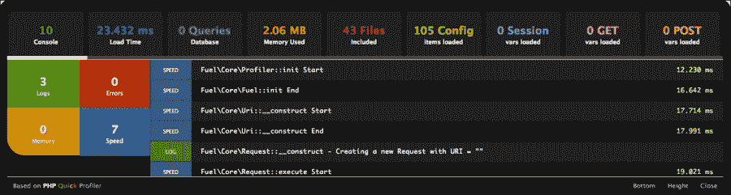

# 第六章高级主题

在前面的章节中，我们已经介绍了在 FuelPHP 中创建项目的基础知识。我们已经谈到了软件包的用处，但它们不能直接与 URL 匹配。在本章中，我们将介绍模块，与包不同，模块可以直接从 URL 访问。我们还将介绍一些与 FuelPHP 相关的更高级主题。

本章涵盖的主题如下：

*   模块它们是什么以及如何使用它们
*   任务
*   路由
*   单元测试
*   轮廓

# 模块是什么，如何使用

在前一章中，我们提到了包与 URL 不直接相关的事实；他们需要应用程序中的控制器和视图来执行此操作。另一方面，模块是一组 MVC 元素，可以独立于项目应用程序进行操作。它们允许代码的封装和重用，这样您就可以在项目之间共享模块，而无需编写应用程序代码来充分利用功能。

模块应位于应用程序的模块文件夹中。如果希望将它们存储在其他位置，可以在应用程序配置中更改此路径和文件夹。建议在包含大型代码库的大型项目上使用模块，因为它们可以帮助保持代码有序。

模块可以独立使用，不需要访问全局应用程序代码。可以创建路由，以允许通过 URL 直接访问模块。由于模块可以包含视图和控制器，因此它们本身可以被视为小型应用程序。

默认情况下，模块应位于应用程序内的模块文件夹中；例如，`[rootOfProject]/fuel/app/modules`。这可以在您的应用程序`config.php`文件中更改，它出现在名为`module_paths`的部分中。如果需要更改模块的路径，则需要确保路径的末尾包含 DS 全局变量。例如：

```php
'module_paths' => array(
    APPPATH.'journal_modules'.DS, // path to application modules
    APPPATH.'..'.DS.'globalmods'.DS, // path to our global modules
),
```

## 名称空间

从历史上看，命名类和函数是一项困难的工作。我们通常更喜欢类名有意义并指明类的功能；这可能会导致我们的代码与我们可能在项目中使用的第三方代码之间发生冲突。在 PHP 版本 5.3 中，我们可以（可选）使用名称空间来避免这些冲突，在 FuelPHP 中，所有模块都需要有自己的名称空间来避免这些冲突。名称空间的名称必须与模块的文件夹名称相同。例如，`Examplemodule`文件夹中的模块将具有如下控制器：

```php
<?php
/**
 * Module controller in the Examplemodule module
 */
 namespace Examplemodule;

 class Controller_Example
 {
     // Add your code here
 }   
```

如果要路由到模块中的控制器，则除了名称空间和控制器名称外，模块文件夹名称还影响 URL 中的名称。因此，选择正确的名字很重要；但是，即使没有完美的名称，我们仍然可以在主应用程序中更改 URL 路由。

## 模块文件夹结构

说到模块的文件夹名称，我们应该将模块视为一个独立的应用程序，并具有预期的文件夹结构。以下是任何模块的预期文件夹结构：

```php
/classes
 /controller
 /model
 /view
/config
/lang
/tasks
/views 

```

您会注意到，文件夹结构类似于完整的应用程序文件夹结构。

## 使用主应用程序中的模块

有时，我们可能希望使用主应用程序模块中的一些功能。在这些情况下，我们需要在代码中引用模块之前自动加载类。这可以通过以下两种方式完成：

*   The first is to autoload the module in the application `config.php` file, like we did with the example packages

    在`config.php`文件的`'always_load'`数组中，您会注意到模块的一个部分：

    ```php
    'always_load' => array(
          'modules' => array('examplemodule'), 
    ```

*   An alternative way of loading the module is to autoload it only when we need to, in the classes that require the module functionality.

    这可以使用以下代码完成：

    ```php
    Module::load('examplemodule');
    ```

加载模块后，可以通过以下方式从模块调用函数：

```php
\Examplemodule\Exampleclass::examplemethod( 'params' );
```

由于模块往往是自包含的应用程序，每个模块都有特定的用途，并且它们不像包那样广泛地开源。

# 任务

有时，我们希望发生后台进程、定期任务或维护任务。这就是 FuelPHP 任务派上用场的地方。它们可以通过命令行工具运行，或者在 Windows 上设置为定期任务，或者在 Mac OSX 和*nix 上设置为**cron**作业。它们可以像控制器一样调用模块和其他类。

任务应该放在`fuel/app/tasks`文件夹中，默认情况下，类中只需要定义`run()`方法。如果需要其他方法，可以用 PHP 类的常用方法添加这些方法。

使用 Oil`refine`命令调用这些任务。FuelPHP 附带了一个名为`robots`的示例任务，将包含在`fuel/app/tasks`文件夹中。

要调用 robot 任务的 main 方法，可以运行以下命令：

```php
$ php oil refine robot

```

`robot`任务中的`run()`方法定义了一个变量，允许您通过`oil refine`命令传递字符串。键入以下命令行将更改任务中的消息：

```php
$ php oil refine robots "Kill all mice"

```

如果您查看`robots.php`文件，您会注意到第二个名为`protect()`的方法-可以使用以下代码调用该方法：

```php
$ php oil r robots:protect

```

FuelPHP 中的任务对于周期性操作非常有用，并且与控制器非常相似，使它们易于编写。它们还具有相同的优势，可以访问核心的 FuelPHP 功能。

# 路由

与其他框架一样，FuelPHP具有相当广泛的路由功能。在本节中，我们将介绍基本知识。

首先，有两条保留路线；它们是：`_root_`和`_404_`。没有指定 URL 时使用`_root_`键；例如，主页或根页面。第二个（`_404_`）用于找不到请求的内容控制器或视图时。

路由存在于应用程序的`config`文件夹中，文件名为`routes.php`。让我们从以下路径加载`routes.php`文件，包含以下代码：

`[rootOfProject]/fuel/app/config/routes.php`

```php
<?php
return array(
    '_root_'  => 'welcome/index',  // The default route
    '_404_'   => 'welcome/404',    // The main 404 route
);
```

从`routes`配置文件中可以看到，路由存储为数组。左侧的键与 URL 匹配，然后右侧的项目由 FuelPHP 执行。这相当简单，但可以进行复杂的 URL 和关键字匹配。

最简单的路由是将 URL 字符串直接匹配到控制器和操作的路由。这些可以如下所示：

```php
return array(
    'about'  => 'welcome/about',  // The action method in the welcome controller
    'contact'   => 'about/contact',    // The contact method in the about controller
);
```

我们的应用程序在本质上是相当动态的，因此在应用程序中指定所有可能的路由将是一项乏味的工作。这就是更高级的路由派上用场的地方。为此，我们可以使用关键字和基本正则表达式来匹配 URL 中的字符串，并将它们转换为控制器方法。这些表达式使用冒号前的关键字，如下所示：

*   `:any`：该关键字与该点之后的任何内容都匹配。
*   `:segment`：此关键字匹配 URL 中的单个段。片段可以是任何内容。这对于 URL 中的语言字符串非常有用。
*   `:num`：该关键字匹配 URL 中的数值。
*   `:alpha`：此关键字匹配任何字母字符。
*   `:alnum`：此关键字匹配任何字母数字字符。

使用以下代码，路由器将匹配*任何*日志条目，然后将条目名称发送到`journal`控制器中的`entry`方法：

```php
'journal/(:any)' => 'journal/entry/$1',
```

下面示例中的代码将允许任何前面的段用于 URL，如`/en/contact`，并将语言标志作为变量发送给站点控制器中的`contact`方法。最终的 URL 类似于`/site/contact/en`：

```php
'(:segment)/contact' => 'site/contact/$1',
```

作为开发人员，我们经常试图通过选择清晰和描述性的变量名来提高代码的可读性。FuelPHP 中更高级的路由也可以做到这一点，因为它允许您在路由中使用命名参数。然后可以从方法或操作中访问这些命名段。例如：

```php
return array(
    'journal/:year/:month/:day/:id' => 'journal/entry', 
);
```

在此路由中，`/journal/2013/11/5/name`将被路由到日志控制器内的输入方法。在 entry 方法中，我们可以通过以下方式获得命名段：

```php
$this->param('year');
$this->param('month');
$this->param('day');
$this->param('id');
```

FuelPHP 对命名段使用正则表达式在路由中工作。每个段都算作一个反向引用，例如，`$1`和`$2`regex 占位符，我们在 PHP 中使用正则表达式时经常使用这些占位符。反向引用是一个正则表达式术语，更多信息可在以下网站上找到：

[http://www.regular-expressions.info/brackets.html#usebackrefinregex](http://www.regular-expressions.info/brackets.html#usebackrefinregex)

在`:name/(\d{2}`的路由中，将使用变量`$2`找到数字（`d{2}`，变量`$1`将返回`:name`段的值。

我们在前面的章节中提到了 RESTful 控制器模板。这些方法可以与基于动词的路由结合使用，将请求定向到 RESTful 控制器中的正确方法。这允许到某个 URL 的路由通过不同的方法和控制器进行路由，以适应该功能。

例如：

*   对`/journal`的`POST`请求可以路由到日志控制器中的`create`方法
*   对`/journal`的`GET`请求可以路由到日志控制器中的`index`方法

这些请求都遵循建议使用的 HTTP 谓词来执行应用程序中的操作，`routes.php`文件中的路由如下所示：

```php
return array(
    'journal' => array( 
        array('GET', new Route('journal/index')),
        array('POST', new Route('journal/create')),
    )
);
```

我们可以对`PUT`和`DELETE`动词执行类似的操作，并使用正则表达式和命名参数，以便更容易从 URL 获取相关信息。

如果您正在处理用户配置文件信息和数据，我们希望使用 HTTPS 或安全连接；同样，FuelPHP 中的路由也支持这一点。以下示例仅在通过 HTTPS（而不仅仅是 HTTP）发送请求时加载路由：

```php
return array(
    'user/(:any)' => array( 
            array( 'GET', new Route( 'user/view/$1' ), true ) 
        ),
); 
```

第三个参数确保仅在使用 HTTPS 时使用命名路由。

在开发过程中，我们经常重新安排应用程序的结构，以反映不断变化的功能。FuelPHP 中 routes 的一个功能是命名路由和反向路由，旨在简化路由。有了这个功能，我们不必编辑所有视图，只需更改主`routes.php`文件中的命名路由即可。要使其工作，我们需要在视图中使用路由的名称。在下面的示例中，我们将`'admin/app/dashboard'`更改为`'admin/dashboard'`：

```php
return array(
    'admin/app/dashboard' => array('admin/dashboard', 'name' => 'admin_dashboard'),
);
```

在我们需要链接到仪表板的视图中，我们将使用以下`anchor`代码：

```php
echo Html::anchor(Router::get('admin_dashboard'), 'Dashboard');
```

### 注

这仅适用于应用程序代码，不适用于模块路由。

# 单元测试

如果没有测试应用程序代码和功能的能力，任何现代的框架都是不完整的。FuelPHP 是基于这一点构建的，因此，它包括基于 PHPUnit 测试框架的测试和测试用例。

## 那么什么是单元测试？

单元测试是为检查功能单元（方法和功能）是否按预期工作而编写的自动化测试。测试通常测试给定输入的输出是否正确，将函数视为黑盒以确保内部逻辑工作。

因为单元测试是自动化的，所以很容易确保最近的代码更改不会破坏其他功能。它还允许使用持续集成服务器，如 Jenkins（[http://jenkins-ci.org](http://jenkins-ci.org) 。一旦代码通过单元测试，持续集成服务器将自动为您部署代码，使您能够专注于实际代码。

## PHPUnit

PHP 中有几种可用的单元测试工具，但事实上的标准是 Sebastian Bergmann 的 PHPUnit。这是 FuelPHP 支持的测试框架，使用 Oil 命令行工具运行。但是，在使用它之前，您需要确保安装了 PHPUnit。有关最新的安装说明，我建议浏览以下链接中的官方文档：

[http://www.phpunit.de/manual/current/en/installation.html](http://www.phpunit.de/manual/current/en/installation.html)

## 运行单元测试

单元测试使用 FuelPHP Oil 命令行工具运行，并且可以使用`php oil test`运行：

```php
$ php oil test
$ Tests Running...This may take a few moments.
$ PHPUnit 3.7.21 by Sebastian Bergmann.
$ 
$ Configuration read from /home/user/sites/journal/fuel/core/phpunit.xml

$ ..................................................  63 / 251 ( 25%)
$ .................................................. 126 / 251 ( 50%)
$ .................................................. 189 / 251 ( 75%)
$ .................................................. 
$ Time: 6 seconds, Memory: 22.25Mb
$ 
$ OK (251 tests, 206 assertions)

```

## 创建单元测试

测试位于`fuel/app/tests`文件夹中的应用程序中，并将读取其子文件夹中的所有测试。测试文件应该遵循与它们正在测试的类相似的结构。因此，如果您正在测试类别模型（`/fuel/app/classes/model/category.php`），它将有一个位于`fuel/app/tests/model/category.php`的测试文件。测试用例应该扩展`TestCase`类，它是`PHPUnit_Framework_TestCase`类的扩展。这意味着您将能够在测试中使用通常的 PHPUnit 断言和方法。

类的名称应以`Test_`作为前缀。同样，类别测试应命名为`Test_Model_Category`。该类应如下所示：

```php
<?php
class Test_Model_Category extends TestCase
{
    public function test_category()
    {
       // Add your code here
    }
}
```

官方文档列出了许多断言和编写单元测试的推荐方法。文档可在以下链接中找到：

[http://www.phpunit.de/manual/current/en/writing-tests-for-phpunit.html](http://www.phpunit.de/manual/current/en/writing-tests-for-phpunit.html)

## 分组单元测试

随着应用程序的增长，有时运行所有单元测试可能会很耗时；因此，我们可以将测试分组在一起，然后只测试某些组。这是通过通常的`test`命令末尾的`--group=`命令完成的。因此，可以使用以下代码运行`User`组测试：

```php
$ php oil test --group=User

```

分组在每个测试类的`docbloc`注释中完成，每个测试用例可以分配给多个组。以下代码段将类别模型`Test`分配给`Blog`和`App`组：

```php
<?php
/**
 * @group Blog
 * @group App
 */
 class Test_Model_Category extends TestCase
{
    public function test_category()
    {
       // Add your code here
    }
}
```

## 配置和模块测试

FuelPHP 使用`phpunit.xml`文件中的配置，该配置包含在`fuel/core/`文件夹中。要自定义配置，我们需要将此文件复制到应用程序中，然后在其中进行更改。FuelPHP 将加载有利于核心版本的应用程序`phpunit.xml`。

如前所述，模块本身就是应用程序，就像单元测试一样。单元测试应包含在每个模块顶层的`test`文件夹中。FuelPHP 要在模块中运行测试，需要知道它们的存在。这是通过在`phpunit.xml`文件中包含模块文件夹来完成的。创建核心 FuelPHP`phpunit.xml`文件副本后，可以添加以下代码段：

```php
<testsuite name="modules">
    <directory suffix=".php">../app/modules/*/tests</directory>
</testsuite>
```

现在，您已经了解了一些 FuelPHP 中的单元测试，让我们讨论一下开发的另一个方面——评测应用程序的能力。

# 仿形

FuelPHP包括一个基于**PHP 快速分析器**的**分析器**。这允许您评测和调试代码，而无需在应用程序中编写额外的函数。可以通过应用程序`config.php`文件打开和关闭探查器。要启用探查器，只需将`'profiling'`变量更改为`true`，然后将其设置为`false`即可禁用探查器。

探查器还包括一个数据库分析工具，但由于所需的资源，它在默认情况下处于禁用状态。需要根据所使用的环境启用数据库探查器，以便开发环境能够在不影响其他环境的情况下启用它。可以使用`true`值在环境的`db.php`文件中启用，如下代码所示：

```php
'profiling' => true,
```



探查器有一个选项卡式界面，由以下选项卡组成：

*   **控制台**：这是默认选项卡，提供有关错误、日志条目和内存使用的信息，以及执行计时
*   **加载时间**：此页签显示请求加载时间
*   **数据库**：此页签显示执行数据库查询的时间和次数
*   **内存使用**：这是页面加载使用的峰值内存
*   **包含**：此选项卡显示加载了文件名和大小的文件列表
*   **已加载项**：此选项卡显示页面加载结束时的最终配置变量
*   **vars loaded**：此选项卡显示页面加载结束时会话的内容
*   **获取**：此页签显示`$_GET`数组内容
*   **POST**：此页签显示`$_POST`数组内容

探查器提供了许多信息，可以帮助您优化应用程序。

# 总结

在本章中，我们介绍了模块以及如何使用它们快速构建应用程序。我们已经讨论了单元测试以及如何使分析器优化我们的代码。

我们已经配置了一些基本路由，并详细说明了需要进行任何更改的位置。命名路由是一个非常强大的工具，可用于应对不断变化的项目和客户需求。它们允许我们减少需要进行的更改的数量。

任务是在我们的应用程序中构建后台或周期功能的一种很好的方式，并且使用 FuelPHP Oil 命令行实用程序非常容易运行。

在下一章中，我们将介绍一些在 FuelPHP 社区中宣传我们的应用程序、包或模块的方法。