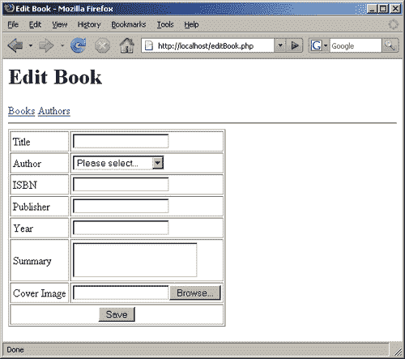
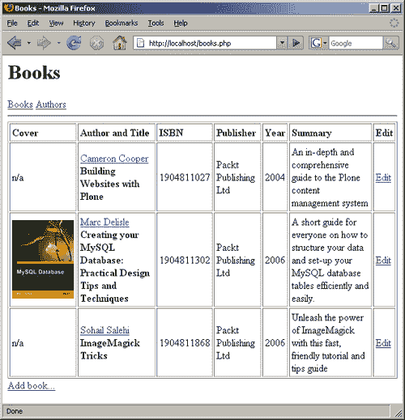

# 四、预备语句

在前面的章节中，我们已经介绍了 PDO 的基础知识，您可能已经注意到它的大部分功能类似于用于连接数据库的传统扩展。唯一的新事物是异常，但即使是异常也可以类似于传统的错误处理。

在本章中，我们将介绍一个在 PDO 之前 PHP 中没有的新概念：prepared 语句。我们将看到他们如何进一步简化我们的代码，甚至带来更好的性能。当然，我们还将研究 PDO 如何以独立于数据库的方式处理 BLOB。

关于我们的图书馆管理应用程序，我们将重写上一章中添加的编辑/更新功能，以方便准备好的报表，并添加对书籍封面图像的支持，我们将保留在数据库中。

# 准备好的报表

**准备语句**是对数据库执行一个或多个 SQL 查询的模板。准备好的语句背后的思想是，对于使用相同语法但不同值的查询，预先处理语法一次，然后使用不同的参数执行多次要快得多。考虑下面的任务。我们必须在数据库中插入几位新作者的名字。当然，我们可以使用命令行客户端或我们最近创建的 `add author`页面，但我们决定使用 PHP 脚本。

假设要添加的作者保存在 PHP 数组中：

```php
$authors = array(
array(
'firstName' => 'Alexander',
'lastName' => 'Dumas',
'bio' => 'Alexandre Dumas was a French writer, best known for his
numerous historical novels of high adventure which have
made him one of the most widely read French authors in
the world.'),
array(
'firstName' => 'Ivan',
'lastName' => 'Franko',
'bio' => 'Ivan Franko was a Ukrainian poet, writer, social and
literary critic, and journalist. In addition to his own
literary work, he translated the works of William
Shakespeare, Lord Byron, Dante, Victor Hugo, Goethe and
Schiller into the Ukrainian language.'));

```

这是一个二维数组，通过该数组，我们将使用 `foreach`循环进行迭代，以便将两位作者的详细信息插入数据库。

```php
foreach($authors as $author)
{
$conn->query(
'INSERT INTO authors(firstName, lastName, bio) VALUES(' .
$conn->quote($author['firstName']) .
',' . $conn->quote($author['lastName']) .
',' . $conn->quote($author['bio'])')' .
);
}

```

如您所见，我们在每个迭代中为每个作者创建一条 SQL 语句，并负责引用所有参数。

使用准备好的语句，我们可以只构造一次查询，并通过向其传递不同的值来执行任意次数的查询。我们的代码将如下所示：

```php
$stmt = $conn->prepare('INSERT INTO authors(firstName, lastName, bio)
VALUES(?, ?, ?)');
foreach($authors as $author)
{
$stmt->execute(
array($author['firstName'], $author['lastName'],
$author['bio']));
}

```

从上面的代码片段可以看出，通过调用 `PDO::prepare()`方法，prepared 语句首先是*prepared*。此方法接受包含 SQL 命令的字符串，其中更改的值替换为问号字符。调用返回一个类为 `PDOStatement`的对象。然后在循环中，我们调用语句的 `execute()`方法，而不是 `PDO::query()`方法。

`PDOStatement::execute()`方法接受一个值数组，这些值被插入 SQL 查询中以代替问号。该数组中元素的数量和顺序必须与传递给 `PDO::prepare()`的查询模板中的数字和问号顺序相同。

您一定已经注意到，我们在代码中没有使用 `PDO::quote()`，PDO 负责正确引用传入值。

## 位置和命名占位符

前面的示例使用问号来指定值在准备好的语句中的位置。这就是为什么这些问号被称为**位置占位符**。使用它们时，必须注意传递给 `PDOStatement::execute()`方法的数组中元素的正确顺序。虽然它们写起来很快，但它们可能成为难以跟踪的错误的来源，特别是当您更改查询列时。为了保护您自己，您可以使用所谓的**命名占位符**，该占位符由前面带有冒号的描述性名称组成，而不是问号。

使用命名占位符，我们可以通过以下方式重写代码以插入两位作者：

```php
$stmt = $conn->prepare(
'INSERT INTO authors(firstName, lastName, bio) ' .
'VALUES(:first, :last, :bio)');
foreach($authors as $author)
{
$stmt->execute(
array(
':first' => $author['firstName'],
':last' => $author['lastName'],
':bio' => $author['bio'])
);
}

```

如您所见，我们用命名占位符替换了三个问号，然后在对 `PDOStatement::execute()`的调用中，我们提供了一个键值对数组，其中键是对应的命名占位符，值是我们要插入数据库的数据。

对于命名占位符，数组中元素的顺序并不重要，只有关联才重要。例如，我们可以将循环重写如下：

```php
foreach($authors as $author)
{
$stmt->execute(
array(
':bio' => $author['bio'],
':last' => $author['lastName'],
':first' => $author['firstName'])
);
}

```

但是，使用位置占位符，只要我们确保其元素的顺序与占位符的顺序匹配，我们就可以将 `$author`数组的值传递给 `PDOStatement::execute()`方法：

```php
$stmt = $conn->prepare(
'INSERT INTO authors(firstName, lastName, bio) VALUES(?, ?, ?)');
foreach($authors as $author)
{
$stmt->execute(array_values($author));
}

```

请注意我们是如何使用 `array_values()`函数去除字符串键并将关联数组转换为列表的。

如果我们向 `PDOStatement::execute()`提供的值数组与查询中的占位符数量不匹配，或者我们向使用位置占位符的语句传递关联数组（或向使用命名占位符的语句传递列表），这将被视为错误并引发异常（前提是之前在调用 `PDO::setAttribute()`方法时启用了异常）。

关于占位符的使用，有一点需要注意。它们不能用作传递给数据库的值的一部分。这最好通过一个无效使用的示例来说明：

```php
$stmt = $conn->prepare("SELECT * FROM authors WHERE lastName
LIKE '%?%'");
$stmt->execute(array($_GET['name']));

```

必须按照以下方式重写：

```php
$stmt = $conn->prepare("SELECT * FROM authors WHERE lastName
LIKE ?");
$stmt->execute(array('%' . $_GET['name'] . '%'));

```

这里的想法是，不要将占位符放在 SQL 模板的字符串中，这必须在调用 `PDOStatement::execute()`方法时完成。

## 准备好的语句和绑定值

上面的例子使用了所谓的**未绑定语句**。这意味着我们在传递给 `PDOStatement::execute()`方法的数组中为查询提供值。PDO 还支持**绑定语句**，您可以将立即数或变量显式绑定到命名占位符或位置占位符。

要将立即数值绑定到语句，请使用 `PDOStatement::bindValue()`方法。此方法接受占位符标识符和值。占位符标识符是位置占位符查询中问号的基于 1 的索引或命名占位符的名称。例如，我们可以使用位置占位符重写该示例，以以下方式使用绑定值：

```php
$stmt = $conn->prepare(
'INSERT INTO authors(firstName, lastName, bio) VALUES(?, ?, ?)');
foreach($authors as $author)
{
$stmt->bindValue(1, $author['firstName']);
$stmt->bindValue(2, $author['lastName']);
$stmt->bindValue(3, $author['bio']);
$stmt->execute();
}

```

如果您喜欢命名占位符，可以编写：

```php
$stmt = $conn->prepare(
'INSERT INTO authors(firstName, lastName, bio) ' .
'VALUES(:last, :first, :bio)');
foreach($authors as $author)
{
$stmt->bindValue(':first', $author['firstName']);
$stmt->bindValue(':last', $author['lastName']);
$stmt->bindValue(':bio', $author['bio']);
$stmt->execute();
}

```

正如您所看到的，在这两种情况下，我们在呼叫 `PDOStatement::execute()`时都没有提供任何内容。同样，与 unbound 语句一样，如果不为每个占位符绑定一个值，则对 `PDOStatement::execute()`的调用将失败，从而导致异常。

PDO 还可以为 SELECT 查询将结果集列绑定到 PHP 变量。每次调用 `PDOStatement::fetch()`时，这些变量都将使用相应的列值进行修改。这是将结果集行作为数组或对象获取的替代方法，如[第 2 章](2.html "Chapter 2. Using PHP Data Objects: First Steps")所述。考虑下面的例子：

```php
$stmt = $conn->prepare('SELECT firstName, lastName FROM authors');
$stmt->execute();
$stmt->bindColumn(1, $first);
$stmt->bindColumn(2, $last);
while($stmt->fetch(PDO::FETCH_BOUND))
{
echo "$last, $first <br>";
}

```

这将呈现表中的所有作者。变量在对 `PDOStatement::bindColumn()`方法的调用中绑定，该方法期望第一个参数是结果集中列的基于 1 的索引或从数据库返回的列名，第二个参数是要更新的变量。

注意，当使用绑定列时， `PDOStatement::fetch()`方法应该用 `PDO::FETCH_BOUND`模式调用，或者这应该用 `PDOStatement::setFetchMode(PDO::FETCH_BOUND)`调用预置。此外，对 `PDOStatement::bindColumn()`方法的调用必须在对 `PDOStatement::execute()`方法的调用之后进行，以便 PDO 知道结果集中有多少列。

现在让我们回到我们的库应用程序，用一些准备好的语句来增强它。由于依赖用户提供的值的页面只有*添加/编辑书籍*和*添加/编辑作者*，我们将重写相应的两个脚本 `editBook.php`和 `editAuthor.php`。

当然，我们将只重写那些更新数据库的代码。对于 `editBook.php`而言，这些是第 65 到 102 行。为了您的方便，我将在这里介绍以下内容：

```php
if(@$book['id']) {
$sql = "UPDATE books SET title=" . $conn->quote($_POST['title']) .
', author=' . $conn->quote($_POST['author']) .
', isbn=' . $conn->quote($_POST['isbn']) .
', publisher=' . $conn->quote($_POST['publisher']) .
', year=' . $conn->quote($_POST['year']) .
', summary=' . $conn->quote($_POST['summary']) .
" WHERE id=$book[id]";
}
else {
$sql = "INSERT INTO books(title, author, isbn, publisher, year,
summary) VALUES(" . $conn->quote($_POST['title']) .
', ' . $conn->quote($_POST['author']) .
', ' . $conn->quote($_POST['isbn']) .
', ' . $conn->quote($_POST['publisher']) .
', ' . $conn->quote($_POST['year']) .
', ' . $conn->quote($_POST['summary']) .
')';
}
// Now we are updating the DB.
// We wrap this into a try/catch block
// as an exception can get thrown if
// the ISBN is already in the table.
try
{
$conn->query($sql);
// If we are here, then there is no error.
// We can return back to books listing
header("Location: books.php");
exit;
}
catch(PDOException $e)
{
$warnings[] = 'Duplicate ISBN entered. Please correct';
}

```

我们可以看到，构造查询的部分非常长。使用准备好的语句，可以按如下方式重写此代码段：

```php
if(@$book['id']) {
$sql = "UPDATE books SET title=?, author=?, isbn=?, publisher=?
year=?, summary=? WHERE id=$book[id]";
}
else {
$sql = "INSERT INTO books(title, author, isbn, publisher, year,
summary) VALUES(?, ?, ?, ?, ?, ?)";
}
$stmt = $conn->prepare($sql);
// Now we are updating the DB.
// We wrap this into a try/catch block
// as an exception can get thrown if
// the ISBN is already in the table.
try
{
$stmt->execute(array($_POST['title'], $_POST['author'],
$_POST['isbn'], $_POST['publisher'], $_POST['year'],
$_POST['summary']));
// If we are here, then there is no error.
// We can return back to books listing.
header("Location: books.php");
exit;
}
catch(PDOException $e)
{
$warnings[] = 'Duplicate ISBN entered. Please correct';
}

```

我们遵循相同的逻辑，如果我们正在编辑一本现有的书，我们将构造一个 `UPDATE`查询。如果我们要添加一本新书，那么我们必须使用 `INSERT`查询。 `$sql`变量将保存适当的语句模板。在这两种情况下，语句都有六个位置占位符，我特意将 book ID 硬编码到 `UPDATE`查询中，这样我们就可以创建和执行语句，而不必考虑所需的操作。

在实例化该语句之后，我们将对其 `execute()`方法的调用包装到一个*try…catch*块中，作为一个异常，如果数据库中已经存在 ISBN，则可能会抛出该异常。成功执行语句后，我们将浏览器重定向到图书列表页面。如果调用失败，我们会提醒用户 ISBN 不正确（或者该书已经存在于数据库中）。

您可以看到，我们的代码现在要短得多。另外，我们不需要引用这些值，因为准备好的语句为我们这样做。现在，您可以在 `common.inc.php`中对 MySQL 和 SQLite 之间的数据库进行一些修改，以查看准备好的语句对它们都有效。您可能还希望重写此代码以使用命名占位符而不是位置占位符。如果需要，请记住在传递给 `PDOStatement::execute()`方法的数组中提供占位符名称。

现在让我们看一下 `editAuthor.php`中相应的代码块（第 42 到 59 行）：

```php
if(@$author['id']) {
$sql = "UPDATE authors SET firstName=" .
$conn->quote($_POST['firstName']) .
', lastName=' . $conn->quote($_POST['lastName']) .
', bio=' . $conn->quote($_POST['bio']) .
" WHERE id=$author[id]";
}
else {
$sql = "INSERT INTO authors(firstName, lastName, bio) VALUES(" .
$conn->quote($_POST['firstName']) .
', ' . $conn->quote($_POST['lastName']) .
', ' . $conn->quote($_POST['bio']) .
')';
}
$conn->query($sql);
header("Location: authors.php");
exit;

```

因为我们不希望这里出现异常，所以代码更短。现在，让我们重写它以使用一个准备好的语句：

```php
if(@$author['id']) {
$sql = "UPDATE authors SET firstName=?, lastName=?, bio=?
WHERE id=$author[id]";
}
else {
$sql = "INSERT INTO authors(firstName, lastName, bio)
VALUES(?, ?, ?)";
}
$stmt = $conn->prepare($sql);
$stmt->execute(array($_POST['firstName'], $_POST['lastName'],
$_POST['bio']));
header("Location: authors.php");
exit;

```

同样，根据所需的操作，我们创建 SQL 模板并将其分配给 `$sql`变量。然后我们实例化 `PDOStatement`对象，并使用作者的详细信息调用其 `execute`方法。由于我们的查询永远不会失败（除了意外的数据库故障），因此我们不希望出现异常，并重定向到列出页面的作者。

确保使用 MySQL 和 SQLite 测试此代码。

# 处理水滴

现在让我们扩展我们的应用程序，这样我们就可以上传书籍的封面图片并显示它们。与传统的数据库访问一样，我们将在 books 表中使用一个**BLOB 字段**用于此目的，同时使用一个**varchar 字段**来存储图像的 MIME 类型，我们需要将其与图像数据一起提供给浏览器。此外，我们还需要另一个脚本，该脚本将从表中获取图像数据并将其传递给浏览器。（我们将从``标记中引用此脚本。）。

传统上，我们不会在意在对 `mysql_query()`或 `sqlite_query()`的调用中插入 BLOB 列——我们只会确保它们被正确引用。然而，对于 PDO，情况就不同了。PDO 在 streams 和 prepared 语句的帮助下处理 BLOB 列。

让我们看一下以下示例：

```php
$blob = fopen('/path/to/file.jpg', 'rb');
$stmt = $conn->prepare("INSERT INTO images(data) VALUES(?)");
$stmt->bindParam(1, $blob, PDO::PARAM_LOB);
$stmt->execute();

```

如您所见，我们使用 `fopen()`函数打开要插入的文件，以便以二进制模式读取（这样我们就不会在跨平台的换行符方面遇到问题），然后将文件句柄绑定到调用 `PDOStatement::bindParam()`方法中指定 `PDO::PARAM_LOB`标志的语句（这样 PDO 就知道我们绑定了一个文件句柄，而不是一个立即值）。

在对 `PDOStatement::execute()`方法的调用中，PDO 将从文件中读取数据并将其传递给数据库。

### 注

如果您想知道为什么 PDO 会以这种方式工作，一个简短的解释是，如果您的 BLOB 非常大，查询可能会失败。通常，数据库服务器具有限制通信数据包大小的设置。（您可以将其与 `post_max_size`PHP 设置进行比较）。如果在 SQL `INSERT`或 `UPDATE`语句中传递相对较大的字符串，它可能会超过该数据包大小，查询将失败。对于流，PDO 确保以较小的数据包发送数据，以便成功执行查询。

还应使用流读取 blob。因此，要检索上面示例中插入的 BLOB 列，可以使用以下代码：

```php
$id = (int)$_GET['id'];
$stmt = $db->prepare("SELECT data FROM images WHERE id=$id");
$stmt->execute();
$stmt->bindColumn(1, $blob, PDO::PARAM_LOB);
$stmt->fetch(PDO::FETCH_BOUND);
$data = stream_get_contents($blob);

```

在这种情况下， `$blob`变量将是可通过流处理函数读取的流资源。在这里，我们使用 `stream_get_contents()`函数将所有数据读入 `$data`变量。如果我们想直接将数据返回到浏览器（正如我们在应用程序中所做的那样），我们可以使用 `fpassthru()`功能。

在撰写本文时（PHP 版本 5.2.3），返回的 blob 列不是流，而是列（字符串）中包含的实际数据。请参考[上的 PHP bug#40913http://bugs.php.net/bug.php?id=40913](http://bugs.php.net/bug.php?id=40913) 了解详情。因此，不需要上述代码段中的最后一行， `$blob`变量将保存实际数据。下面 showcolve.php 文件的源代码将返回的数据视为字符串而不是 blob，因此代码在当前 php 版本中工作。

因此，让我们从修改数据库并向其中添加新列开始：

```php
mysql> alter table books add column coverMime varchar(20);
Query OK, 3 rows affected (0.02 sec)
Records: 3 Duplicates: 0 Warnings: 0
mysql> alter table books add column coverImage blob(24000);
Query OK, 3 rows affected (0.02 sec)
Records: 3 Duplicates: 0 Warnings: 0

```

您还可以在 SQLite 命令行客户端中执行这些查询，无需修改。现在，让我们修改 `editBook.php`文件。我们将在现有表单中添加另一个字段。这一行允许用户上传封面图像，并增强表单验证，以检查用户是否真的上传了图像（通过检查上传文件的 MIME 类型）。

我们还将允许用户修改书的细节，而无需重新提交封面图像文件。为了实现这一点，我们将仅在成功上传文件后更新封面栏。因此，我们的脚本逻辑将使用两个查询。第一个将更新或创建图书记录，第二个将更新 `coverMime`和 `coverImage`列。

记住这一点， `editBook.php`文件将如下所示：

```php
<?php
/**
* This page allows adding or editing a book
* PDO Library Management example application
* @author Dennis Popel
*/
// Don't forget the include
include('common.inc.php');
// See if we have the book ID passed in the request
$id = (int)$_REQUEST['book'];
if($id) {
// we have the ID, get the book details from the table
$q = $conn->query("SELECT * FROM books WHERE id=$id");
$book = $q->fetch(PDO::FETCH_ASSOC);
$q->closeCursor();
$q = null;
}
else {
// we are creating a new book
$book = array();
}
// Now get the list of all authors' first and last names
// we will need it to create the dropdown box for author
$authors = array();
$q = $conn->query("SELECT id, lastName, firstName FROM authors ORDER
BY lastName, firstName");
$q->setFetchMode(PDO::FETCH_ASSOC);
while($a = $q->fetch())
{
$authors[$a['id']] = "$a[lastName], $a[firstName]";
}
// Now see if the form was submitted
if($_POST['submit']) {
// Validate every field
$warnings = array();
// Title should be non-empty
if(!$_POST['title']) {
$warnings[] = 'Please enter book title';
}
// Author should be a key in the $authors array
if(!array_key_exists($_POST['author'], $authors)) {
$warnings[] = 'Please select author for the book';
}
// ISBN should be a 10-digit number
if(!preg_match('~^\d{10}$~', $_POST['isbn'])) {
$warnings[] = 'ISBN should be 10 digits';
}
// Published should be non-empty
if(!$_POST['publisher']) {
$warnings[] = 'Please enter publisher';
}
// Year should be 4 digits
if(!preg_match('~^\d{4}$~', $_POST['year'])) {
$warnings[] = 'Year should be 4 digits';
}
// Summary should be non-empty
if(!$_POST['summary']) {
$warnings[] = 'Please enter summary';
}
// Now validate the file upload
$uploadSuccess = false;
if(is_uploaded_file($_FILES['cover']['tmp_name'])) {
// See if the file is an image
if(!preg_match('~image/.+~', $_FILES['cover']['type'])
|| filesize($_FILES['cover']['tmp_name']) > 24000) {
$warnings[] = 'Please upload an image file less than 24K
in size';
}
else {
// Set a flag that upload is successful
$uploadSuccess = true;
}
}
// If there are no errors, we can update the database
// If there was book ID passed, update that book
if(count($warnings) == 0) {
if(@$book['id']) {
$sql = "UPDATE books SET title=?, author=?, isbn=?,
publisher=?, year=?, summary=? WHERE
id=$book[id]";
}
else {
$sql = "INSERT INTO books(title, author, isbn, publisher,
year, summary) VALUES(?, ?, ?, ?, ?, ?)";
}
$stmt = $conn->prepare($sql);
// Now we are updating the DB.
// we wrap this into a try/catch block
// as an exception can get thrown if
// the ISBN is already in the table
try
{
$stmt->execute(array($_POST['title'], $_POST['author'],
$_POST['isbn'], $_POST['publisher'], $_POST['year'],
$_POST['summary']));
// If we are here that means that no error
// Now we can update the cover columns
// But first we have to get the ID of the newly inserted book
if(!@$book['id']) {
$book['id'] = $conn->lastInsertId();
}
// Now see if there was an successful upload and
// update cover image
if($uploadSuccess) {
$stmt = $conn->prepare("UPDATE books SET coverMime=?,
coverImage=? WHERE id=$book[id]");
$cover = fopen($_FILES['cover']['tmp_name'], 'rb');
$stmt->bindValue(1, $_FILES['cover']['type']);
$stmt->bindParam(2, $cover, PDO::PARAM_LOB);
$stmt->execute();
}
// We can return back to books listing
header("Location: books.php");
exit;
}
catch(PDOException $e)
{
$warnings[] = 'Duplicate ISBN entered. Please correct';
}
}
}
else {
// Form was not submitted.
// populate the $_POST array with the book's details
$_POST = $book;
}
// Display the header
showHeader('Edit Book');
// If we have any warnings, display them now
if(count($warnings)) {
echo "<b>Please correct these errors:</b><br>";
foreach($warnings as $w)
{
echo "- ", htmlspecialchars($w), "<br>";
}
}
// Now display the form
?>
<form action="editBook.php" method="post"
enctype="multipart/form-data">
<table border="1" cellpadding="3">
<tr>
<td>Title</td>
<td>
<input type="text" name="title"
value="<?=htmlspecialchars($_POST['title'])?>">
</td>
</tr>
<tr>
<td>Author</td>
<td>
<select name="author">
<option value="">Please select...</option>
<?php foreach($authors as $id=>$author)
{ ?>
<option value="<?=$id?>"
<?= $id == $_POST['author'] ? 'selected' : ''?>>
<?=htmlspecialchars($author)?>
</option>
<?php } ?>
</select>
</td>
</tr>
<tr>
<td>ISBN</td>
<td>
<input type="text" name="isbn"
value="<?=htmlspecialchars($_POST['isbn'])?>">
</td>
</tr>
<tr>
<td>Publisher</td>
<td>
<input type="text" name="publisher"
value="<?=htmlspecialchars($_POST['publisher'])?>">
</td>
</tr>
<tr>
<td>Year</td>
<td>
<input type="text" name="year"
value="<?=htmlspecialchars($_POST['year'])?>">
</td>
</tr>
<tr>
<td>Summary</td>
<td>
<textareaname="summary"><?=htmlspecialchars($_POST['summary'])?>
</textarea>
</td>
</tr>
<tr>
<td>Cover Image</td>
<td><input type="file" name="cover"></td>
</tr>
<?php if(@$book['coverMime'])
{ ?>
<tr>
<td>Current Cover</td>
<td>"></td>
</tr>
<? } ?>
<tr>
<td colspan="2" align="center">
<input type="submit" name="submit" value="Save">
</td>
</tr>
</table>
<?php if(@$book['id']) { ?>
<input type="hidden" name="book" value="<?=$book['id']?>">
<?php } ?>
</form>
<?php
// Display footer
showFooter();

```

突出显示的部分是我们添加或更改的位。现在，我们需要验证表单和上传的文件（第 60 到 73 行）。如果上传成功， `$uploadSuccess`布尔变量将设置为 `true`，稍后我们将使用该值查看是否需要更新封面列。因为我们也允许新书上传，所以我们使用 `PDO::lastInsertId()`方法值（第 100 行）来获取新创建图书的 ID（否则我们只使用 `$books['id']`值）。如果上传失败，我们会在 `$warnings`数组中添加相应的警告，并让现有的错误逻辑完成它的工作。

使用准备好的语句和流，实际的封面图像更新发生在第 105 到 110 行。在我们的表单上，查看如何在第 140 行的表单标记中添加 `multipart/form-data`属性。这是文件上传工作所必需的。此外，表单现在有一个新的输入字段（第 182-185 行），允许我们选择和上传文件。下一行将显示当前封面图像（如果有）。请注意，``标记引用了一个新文件 `showCover.php`，我们现在必须创建该文件：

```php
<?php
/**
* This script will render a book's cover image
* PDO Library Management example application
* @author Dennis Popel
*/
// Don't forget the include
include('common.inc.php');
// See if we have the book ID passed in the request
$id = (int)$_REQUEST['book'];
$stmt = $conn->prepare("SELECT coverMime, coverImage FROM books
WHERE id=$id");
$stmt->execute();
$stmt->bindColumn(1, $mime);
$stmt->bindColumn(2, $image, PDO::PARAM_LOB);
$stmt->fetch(PDO::FETCH_BOUND);
header("Content-Type: $mime");
echo $image;

```

现在，对于一本新书，表单如下所示：



如您所见，有一个新的字段允许我们上传封面图像。由于新创建的书籍没有任何封面图像，因此没有当前封面图像。对于具有封面图像的书籍，页面将如下所示：


您现在可以在不上载图像的情况下使用应用程序查看表单的工作方式。（如果有，它应该保留旧图像。）您还可以查看它如何处理过大的文件或非图像文件。（它应该在表单上方显示一条警告。）确保在数据库之间切换，以便我们独立于数据库。

作为对封面图像的最后一次触摸，我们可以重新格式化图书列表页面 `books.php`，以便封面图像也显示在那里。我将在这里展示新代码，并突出显示更改的部分：

```php
<?php
/**
* This page lists all the books we have
* PDO Library Management example application
* @author Dennis Popel
*/
// Don't forget the include
include('common.inc.php');
// Display the header
showHeader('Books');
// Issue the query
$q = $conn->query("SELECT authors.id AS authorId, firstName,
lastName, books.* FROM authors, books WHERE
author=authors.id ORDER BY title");
$q->setFetchMode(PDO::FETCH_ASSOC);
// now create the table
?>
<table width="100%" border="1" cellpadding="3">
<tr style="font-weight: bold">
<td>Cover</td>
<td>Author and Title</td>
<td>ISBN</td>
<td>Publisher</td>
<td>Year</td>
<td>Summary</td>
<td>Edit</td>
</tr>
<?php
// Now iterate over every row and display it
while($r = $q->fetch())
{
?>
<tr>
<td>
<?php if($r['coverMime']) { ?>
">
<?php }
else
{ ?>
n/a
<? } ?>
</td>
<td>
<a href="author.php?id=<?=$r['authorId']?>">
<?=htmlspecialchars("$r[firstName] $r[lastName]")?></a><br/>
<b><?=htmlspecialchars($r['title'])?></b>
</td>
<td><?=htmlspecialchars($r['isbn'])?></td>
<td><?=htmlspecialchars($r['publisher'])?></td>
<td><?=htmlspecialchars($r['year'])?></td>
<td><?=htmlspecialchars($r['summary'])?></td>
<td>
<a href="editBook.php?book=<?=$r['id']?>">Edit</a>
</td>
</tr>
<?php
}
?>
</table>
<a href="editBook.php">Add book...</a>
<?php
// Display footer
showFooter();

```

第一个单元格将包含图像（如果有）。作者和标题现在呈现在同一单元格中，以节省表格宽度。现在，图书列表应该如下所示：



# 总结

本章向我们介绍了一个新概念：准备好的陈述。我们已经看到了它们如何简化查询，并进一步保护我们免受 SQL 语法错误和代码漏洞的影响。我们还研究了如何使用流处理 blob，这样就不会有查询失败的风险。我们的应用程序现在可以用来上传和显示数据库中书籍的封面图像。

在下一章中，我们将看到如何确定结果集中的行数，这是为长项目列表分页所必需的。（最常见的例子是一个搜索引擎，它将结果列表拆分为每页 10 个结果。）此外，我们将熟悉一个新概念：可滚动游标，它允许我们从结果集中从指定位置开始获取行的子集。