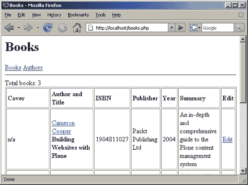

# 五、处理行集

现实生活中的动态、数据驱动的 web 应用程序彼此非常不同，因为它们的复杂性取决于它们所服务的目的。然而，它们几乎都有一些共同的特点。这些特性之一是能够对长结果列表进行分页，以便于使用和加快页面加载时间。

正确的分页需要计算从数据库返回的总行数、页面大小（这是一个可配置的选项）和当前页面的数量。基于此数据，很容易将起始偏移量计算到结果集中，以仅显示行的子集。

在本章中，我们将研究：

*   如何检索 PDO 返回的结果集中的行数
*   如何从指定的行号开始获取结果

# 检索结果集中的行数

正如我们在[第 2 章](2.html "Chapter 2. Using PHP Data Objects: First Steps")中所讨论的， `PDOStatement::rowCount()`方法不会在查询中返回正确的行数。（MySQL 和 SQLite 都返回零。）这种行为的原因是数据库管理系统在返回查询的最后一行之前实际上不知道这个数字。 `mysql_num_rows()`函数（以及其他数据库的类似函数）返回行计数的原因是，当您发出查询时，它会将整个结果集预加载到内存中。

虽然看起来很方便，但不建议使用此行为。如果查询返回 20 行，那么脚本可以负担内存使用。但是如果查询返回数十万行呢？它们都将保存在内存中，以便在高流量站点上，服务器可能会耗尽资源。

唯一的逻辑度量（也是 PDO 可用的唯一选项）是指示数据库计算自身的行数。无论查询有多复杂，都可以重写，使用 SQL `COUNT()`函数只返回满足主查询的行数。

让我们来看一下在我们的应用程序中使用的查询。（我们将只检查返回多行的查询。）

*   In `books.php` we have a query that joins two tables to present the list of books along with their authors :

    ```php
    SELECT authors.id AS authorId, firstName, lastName, books.*
    FROM authors, books WHERE author=authors.id ORDER BY title;

    ```

    要获取此查询返回的行数，我们应该将其重写为如下所示：

    ```php
    SELECT COUNT(*) FROM authors, books WHERE author=authors.id;

    ```

    请注意，这里不需要 `ORDER BY`子句，因为顺序对行数实际上并不重要。

*   In `authors.php` we simply select all the authors ordered by their last name and then their first name:

    ```php
    SELECT * FROM authors ORDER BY lastName, firstName;

    ```

    这只是改写为以下内容：

    ```php
    SELECT COUNT(*) FROM authors;

    ```

*   Another query that returns multiple rows is in `author.php`—it retrieves all the books written by a particular author:

    ```php
    SELECT * FROM books WHERE author=$id ORDER BY title;

    ```

    这可转化为以下内容：

    ```php
    SELECT COUNT(*) FROM books WHERE author=$id;

    ```

如您所见，我们以类似的方式重写了所有这些查询，将列列表替换为 `COUNT(*)`并修剪 `ORDER BY`子句。考虑到这一点，我们可以创建一个函数，该函数将接受包含要执行的 SQL 的字符串，并返回查询将返回的行数。此函数必须执行以下简单转换：

*   在传递的字符串中将 `SELECT`和 `FROM`之间的所有内容替换为 `COUNT(*)`。
*   删除 `ORDER BY`及其后的所有文本。

实现此转换的最佳方法是使用正则表达式。与前几章一样，我们将使用 PCRE 扩展。我们将把这个函数放到 `common.inc.php`中，因为我们将在不同的地方调用它：

```php
/**
* This function will return the number of rows a query will return
* @param string $sql the SQL query
* @return int the number of rows the query specified will return
* @throws PDOException if the query cannot be executed
*/
function getRowCount($sql)
{
global $conn;
$sql = trim($sql);
$sql = preg_replace('~^SELECT\s.*\sFROM~s', 'SELECT COUNT(*) FROM',
$sql);
$sql = preg_replace('~ORDER\s+BY.*?$~sD', '', $sql);
$stmt = $conn->query($sql);
$r = $stmt->fetchColumn(0);
$stmt->closeCursor();
return $r;
}

```

让我们运行函数以查看它的功能：

1.  它将 PDO 连接对象（`$conn`导入本地功能范围。
2.  它从 SQL 查询的开头和结尾修剪可能的空格。
3.  对 `preg_replace()`的两个调用完成了转换查询的主要任务。

请注意我们是如何使用模式修饰符的，*s*修饰符指示 PCRE 将换行符与点匹配，*D*修饰符强制$与整个字符串的结尾匹配（不只是在第一个换行符之前）。我们使用这些修饰符来确保函数能够正确处理多行查询。

现在我们将修改这三个脚本，以显示它们返回的每个表中的行数。让我们从 `books.php:`开始

```php
<?php
/**
* This page lists all the books we have
* PDO Library Management example application
* @author Dennis Popel
*/
// Don't forget the include
include('common.inc.php');
// Display the header
showHeader('Books');
// Get the count of books and issue the query
$sql = "SELECT authors.id AS authorId, firstName, lastName, books.*
FROM authors, books WHERE author=authors.id ORDER BY title";
$totalBooks = getRowCount($sql);
$q = $conn->query($sql);
$q->setFetchMode(PDO::FETCH_ASSOC);
// now create the table
?>
Total books: <?=$totalBooks?>
<table width="100%" border="1" cellpadding="3">
<tr style="font-weight: bold">
<td>Cover</td>
<td>Author and Title</td>
<td>ISBN</td>
<td>Publisher</td>
<td>Year</td>
<td>Summary</td>
<td>Edit</td>
</tr>
<?php
// Now iterate over every row and display it
while($r = $q->fetch())
{
?>
<tr>
<td>
<?php if($r['coverMime']) { ?>
">
<?php } else { ?>
n/a
<? } ?>
</td>
<td>
<a href="author.php?id=<?=$r['authorId']?>"><?=htmlspecialchars
("$r[firstName] $r[lastName]")?></a><br/>
<b><?=htmlspecialchars($r['title'])?></b>
</td>
<td><?=htmlspecialchars($r['isbn'])?></td>
<td><?=htmlspecialchars($r['publisher'])?></td>
<td><?=htmlspecialchars($r['year'])?></td>
<td><?=htmlspecialchars($r['summary'])?></td>
<td>
<a href="editBook.php?book=<?=$r['id']?>">Edit</a>
</td>
</tr>
<?php
}
?>
</table>
<a href="editBook.php">Add book...</a>
<?php
// Display footer
showFooter();

```

如您所见，修改非常简单，我们使用 `$sql`变量保存查询并将其传递给 `getRowCount()`函数和 `$conn->query()`方法。我们还在表上方显示一条消息，告诉我们数据库中有多少本书。

现在如果您刷新 `books.php`页面，您将看到以下内容：



`authors.php`的变化类似：

```php
<?php
/**
* This page lists all the authors we have
* PDO Library Management example application
* @author Dennis Popel
*/
// Don't forget the include
include('common.inc.php');
// Display the header
showHeader('Authors');
// Get the number of authors and issue the query
$sql = "SELECT * FROM authors ORDER BY lastName, firstName";
$totalAuthors = getRowCount($sql);
$q = $conn->query($sql);
// now create the table
?>
Total authors: <?=$totalAuthors?>
<table width="100%" border="1" cellpadding="3">
<tr style="font-weight: bold">
<td>First Name</td>
<td>Last Name</td>
<td>Bio</td>
<td>Edit</td>
</tr>
<?php
// Now iterate over every row and display it
while($r = $q->fetch(PDO::FETCH_ASSOC))
{
?>
<tr>
<td><?=htmlspecialchars($r['firstName'])?></td>
<td><?=htmlspecialchars($r['lastName'])?></td>
<td><?=htmlspecialchars($r['bio'])?></td>
<td>
<a href="editAuthor.php?author=<?=$r['id']?>">Edit</a>
</td>
</tr>
<?php
}
?>
</table>
<a href="editAuthor.php">Add Author...</a>
<?php
// Display footer
showFooter();

```

`authors.php`现在应显示以下内容：


最后， `author.php`将如下所示：

```php
<?php
/**
* This page shows an author's profile
* PDO Library Management example application
* @author Dennis Popel
*/
// Don't forget the include
include('common.inc.php');
// Get the author
$id = (int)$_REQUEST['id'];
$q = $conn->query("SELECT * FROM authors WHERE id=$id");
$author = $q->fetch(PDO::FETCH_ASSOC);
$q->closeCursor();
$q = null;
// Now see if the author is valid - if it's not,
// we have an invalid ID
if(!$author) {
showHeader('Error');
echo "Invalid Author ID supplied";
showFooter();
exit;
}
// Display the header - we have no error
showHeader("Author: $author[firstName] $author[lastName]");
// Now get the number and fetch all the books
$sql = "SELECT * FROM books WHERE author=$id ORDER BY title";
$totalBooks = getRowCount($sql);
$q = $conn->query($sql);
$q->setFetchMode(PDO::FETCH_ASSOC);
// now display everything
?>
<h2>Author</h2>
<table width="60%" border="1" cellpadding="3">
<tr>
<td><b>First Name</b></td>
<td><?=htmlspecialchars($author['firstName'])?></td>
</tr>
<tr>
<td><b>Last Name</b></td>
<td><?=htmlspecialchars($author['lastName'])?></td>
</tr>
<tr>
<td><b>Bio</b></td>
<td><?=htmlspecialchars($author['bio'])?></td>
</tr>
<tr>
<td><b>Total books</td>
<td><?=$totalBooks?></td>
</tr>
</table>
<a href="editAuthor.php?author=<?=$author['id']?>">Edit author...</a>
<h2>Books</h2>
<table width="100%" border="1" cellpadding="3">
<tr style="font-weight: bold">
<td>Title</td>
<td>ISBN</td>
<td>Publisher</td>
<td>Year</td>
<td>Summary</td>
</tr>
<?php
// Now iterate over every book and display it
while($r = $q->fetch()) {
?>
<tr>
<td><?=htmlspecialchars($r['title'])?></td>
<td><?=htmlspecialchars($r['isbn'])?></td>
<td><?=htmlspecialchars($r['publisher'])?></td>
<td><?=htmlspecialchars($r['year'])?></td>
<td><?=htmlspecialchars($r['summary'])?></td>
</tr>
<?php
}
?>
</table>
<?php
// Display footer
showFooter();

```

输出应该是这样的。（为了节省空间，我将页面向下滚动了一点）：


您应该在 `common.inc.php`中切换 MySQL 和 SQLite，以确保这两个数据库都工作。

### 注

这种方法可能适用于许多情况，但并不适用于所有查询。一个这样的例子是使用 `GROUP BY`子句的查询。如果您使用 `getRowCount()`函数重写此类查询，您将得到不正确的结果，因为将应用分组，并且查询将返回多行。（行数将等于要分组的列中的不同值数。）

# 限制返回的行数

现在，当我们知道如何计算结果集中的行数时，让我们看看如何仅获取前 N 行。这里我们有两个选择：

*   我们可以在 SQL 查询本身中使用特定于数据库的功能。
*   我们可以自己处理结果集，并在获取所需数量的行后停止。

## 使用特定于数据库的 SQL

如果您主要使用 MySQL，那么您将熟悉 `LIMIT x,y`子句。例如，如果我们想获取按姓氏排序的前五位作者，可以发出以下查询：

```php
SELECT * FROM authors ORDER BY lastName LIMIT 0, 5;

```

以下查询也可以执行相同的操作：

```php
SELECT * FROM authors ORDER BY lastName LIMIT 5 OFFSET 0;

```

第一个查询适用于 MySQL 和 SQLite，第二个查询也适用于 PostgreSQL。但是，Oracle 或 MS SQL Server 之类的数据库不使用这种语法，因此这些查询将失败。

## 仅处理前 N 行

如您所见，特定于数据库的 SQL 不允许我们以独立于数据库的方式解决执行分页的任务。但是，我们可以像对所有行一样发出查询，而不需要 `LIMIT....OFFSET`子句。获取每一行后，我们可以增加计数器变量，以便在处理所需数量的行时中断循环。以下代码段可以用于此目的：

```php
$q = $conn->query("SELECT * FROM authors ORDER BY lastName,
firstName");
$q->setFetchMode(PDO::FETCH_ASSOC);
$count = 1; while(($r = $q->fetch()) && $count <= 5)
{
echo $r['lastName'], '<br>';
$count++;
} $q->closeCursor();
$q = null;

```

注意循环条件，它检查计数器变量是否小于或等于 5。（当然，您可以在那里输入任何数字），并且它会验证是否仍有行要获取，因为如果没有更多行，我们必须中断循环。（例如，如果表只有 3 行，我们想显示其中的 5 行，我们应该在最后一行之后中断，而不是在计数器达到 5 行之后。）请注意，使用特定于数据库的 SQL 可以解决这种情况。

另一件重要的事情是对 `PDOStatement::closeCursor()`的调用（如前一段代码中的最后一行）。有必要告诉数据库我们不需要更多的行。如果不这样做，在同一 PDO 对象上发出的后续查询将导致异常，因为数据库管理系统无法处理新查询，而它们仍在发送前一查询中的行。这就是为什么我们必须在 `author.php`中调用此方法。

### 注

目前（对于 PHP 版本 5.2.1），可能需要通过将语句对象赋值为 null 来取消设置语句对象（如 `author.php`第 17 行）。另一方面，2007 年 4 月 1 日左右发布的至少一个 CVS 快照根本不需要关闭光标。但是，在使用完光标后调用 `PDOStatement::closeCursor()`仍然是一种很好的做法。

## 以任意偏移量开始

现在我们知道了如何处理指定数量的行，我们可以使用相同的技术跳过特定数量的行。假设我们想显示从第 6 页到第 10 页的作者（就像我们在显示第 2 页时，页面大小允许每页有 5 位作者）：

```php
$q = $conn->query("SELECT * FROM authors ORDER BY lastName,
firstName");
$q->setFetchMode(PDO::FETCH_ASSOC);
$count = 1;
while(($r = $q->fetch()) && $count <= 5)
{
$count++;
}
$count = 1;
while(($r = $q->fetch()) && $count <= 5)
{
echo $r['lastName'], '<br>';
$count++;
}
$q->closeCursor();
$q = null;

```

这里，第一个循环用于跳过必要的起始行，第二个循环显示请求的行子集。

### 注

这种方法可能适用于小型表，但其性能并不好。您应该始终使用特定于数据库的 SQL 来返回结果行的子集。如果需要数据库独立性，则应检查底层数据库软件并发出特定于数据库的查询。这样做的原因是，数据库可以对查询执行某些优化，使用更少的内存，以便在服务器和客户端之间交换更少的数据。

不幸的是，PDO 并没有提供独立于数据库的方法来有效地获取结果行的子集，因为 PDO 是一种连接抽象，而不是数据库抽象工具。如果您需要编写可移植代码，您应该探索 MDB2 等工具。

这种方法似乎比使用 `PDOStatement::fetchAll()`方法更复杂。实际上，我们可以将前面的代码重写如下：

```php
$stmt = $conn->query("SELECT * FROM authors ORDER BY lastName,
firstName");
$page = $stmt->fetchAll(PDO::FETCH_ASSOC);
$page = array_slice($page, 5, 5);
foreach($page as $r)
{
echo $r['lastName'], '<br>';
}

```

虽然这段代码要短得多，但它有一个主要缺点：它指示 PDO 返回表中的所有行，然后获取其中的一部分。在我们的方法中，不必要的行被丢弃，循环指示数据库在返回足够的行后立即停止发送行。但是，在这两种情况下，数据库都必须向我们发送当前页面前面的行。

# 总结

在本章中，我们已经了解了如何处理无缓冲查询以及如何获取结果集的行数。我们还研究了一个无法避免特定于数据库的 SQL 的应用程序，因为这需要一个可能不合适的变通方法。但是，本章对于开发使用数据库的复杂 web 应用程序的人员应该有所帮助。

在下一章中，我们将讨论 PDO 的高级功能，包括持久连接和其他特定于驱动程序的选项。我们还将讨论事务，并研究更多的 `PDO`和 `PDOStatement`类的方法。