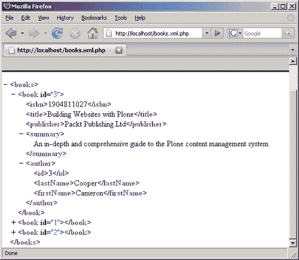

# 七、高级示例

现在，您应该能够使用 PDO 开发 web 应用程序了。然而，当我们的示例应用程序保持相当小且功能有限时，它是可管理的。很快，您就会意识到，将所有数据访问、用户输入和显示逻辑混合在一个文件中可能会成为管理的麻烦。

要编写更易于管理的代码并允许多个开发人员处理项目，数据访问、用户输入处理和页面呈现应该分开。您可能听说过**模型-视图-控制器**编程范式（MVC），它广泛用于大型 web 应用程序。其想法是将**模型**的数据访问和修改模块与**视图**的数据表示分开。视图可能非常复杂，因此通常使用模板引擎。最后，**控制器**是一个 PHP 脚本，它接收用户输入、访问模型并准备视图。

除了使代码库更易于管理之外，这种划分还允许我们从其他应用程序访问模型的功能（使用运行在应用程序自己的服务器或其他服务器上的维护脚本，这些服务器通过 RPC 或 SOAP 调用访问）。

由于 PDO 是面向对象的，并且可以从对 `PDOStatement::fetch()`方法的调用中返回类的实例，因此我们将使用面向对象编程来建模我们的数据实体（书籍、作者和借来的书籍记录）。

# 设计模型

模型通常由一个静态类（静态地调用其方法）和几个模拟数据实体的类组成。对该模型类的方法的调用可以返回其他模型类的实例，也可以是在对 `fetch()`方法的调用中返回模型类实例的 `PDOStatement`实例。

对于我们的应用程序，类将是 `Model, Book, Author`和 `Borrower`。这些类反映了示例数据库中的表，并允许我们对底层数据执行简单的操作。（主要思想是将 SQL 从控制器脚本隔离到相关的模型类中。）例如， `Book`类可能有一个方法返回一个 `Author`类实例，该实例将代表该书的作者。另一方面， `Author`类可能有一个方法返回代表该作者所写的每本书的 `Book`类实例列表。

在本章中，我们将开发自己的静态 `Model`类以及 `Book, Author`类和 `Borrower`类。在开始之前，我们应该清楚地定义每个类将有哪些方法（功能）。让我们定义模型的功能。

`Model`类应该包含静态方法，这些方法将充当数据库中存储的数据的*入口点*。这些方法应做到以下几点：

*   把所有的书都拿来。
*   找到所有的作者。
*   把所有的借书人都找来。
*   获取书籍的数量。
*   获取作者的数量。
*   获取图书借阅者的数量。
*   凭身份证取一本书。
*   按 ID 获取作者。
*   通过 ID 获取借款人

另一方面， `Model`类将不包含对书籍或作者执行的方法。要借书，我们将使用 `Book`类中定义的方法；要归还书，我们将使用 `Borrower`类中的方法。

现在让我们计划一下 `Book`类的方法：

*   找到作者。
*   获取该书的借阅者名单。
*   借一本书。

对于我们的示例应用程序， `Author`类更简单：

*   把所有的书都拿来。
*   获取此作者的图书数量。

最后， `Borrower`类表示借贷者表中的一条记录：

*   去拿那本书。
*   还书。

每个数据实体的属性都可以作为相关类的实例变量访问。此外，这些类中的方法将包含我们已经在 `books.php`和其他文件中编写的 PDO 调用。我们将这些方法移动到相关的类中，这些文件将充当处理用户输入的控制器。表单验证仍然是控制器脚本的任务。但是，我们不打算将显示逻辑与业务逻辑分开，因为我们的应用程序非常简单，不需要使用任何模板引擎，甚至不需要将页面呈现代码移动到单独的**包含**文件中。

除此之外，我们将不再使用全局 `$conn`变量。 `Model`类将有一个同名的私有静态变量和一个检索连接对象的方法。此方法将遵循单例模式，如果对象尚未创建，则按需创建该对象；如果对象已初始化，则仅返回该对象（有关单例模式和 PHP5 中的示例实现的更多信息，请访问[http://en.wikipedia.org/wiki/Singleton_pattern](http://en.wikipedia.org/wiki/Singleton_pattern) 。

我们将把所有类保存在一个单独的文件 `classes.inc.php`中，然后从 `common.inc.php`中包含该文件。

让我们从中心 `Model`类开始：

```php
/**
* This is the central Model class. Use its static methods
* To retrieve a book, author, borrower by ID
* Or all the books, authors and borrowers
*/
class Model
{
/**
* This is the connection object returned by
* Model::getConn()
* @var PDO
*/
private static $conn = null;
/**
* This method returns the connection object.
* If it has not been yet created, this method
* instantiates it based on the $connStr, $user and $pass
* global variables defined in common.inc.php
* @return PDO the connection object
*/
static function getConn()
{
if(!self::$conn) {
global $connStr, $user, $pass;
try
{
self::$conn = new PDO($connStr, $user, $pass);
self::$conn->setAttribute(PDO::ATTR_ERRMODE,
PDO::ERRMODE_EXCEPTION);
}
catch(PDOException $e)
{
showHeader('Error');
showError("Sorry, an error has occurred. Please
try your request later\n" . $e->getMessage());
}
}
return self::$conn;
}
/**
* This method returns the list of all books
* @return PDOStatement
*/
static function getBooks()
{
$sql = "SELECT * FROM books ORDER BY title";
$q = self::getConn()->query($sql);
$q->setFetchMode(PDO::FETCH_CLASS, 'Book', array());
return $q;
}
/**
* This method returns the number of books in the database
* @return int
*/
static function getBookCount()
{
$sql = "SELECT COUNT(*) FROM books";
$q = self::getConn()->query($sql);
$rv = $q->fetchColumn();
$q->closeCursor();
return $rv;
}
/**
*This method returns a book with given ID
* @param int $id
* @return Book
*/
static function getBook($id)
{
$id = (int)$id;
$sql = "SELECT * FROM books WHERE id=$id";
$q = self::getConn()->query($sql);
$rv = $q->fetchObject('Book');
$q->closeCursor();
return $rv;
}
/**
* This method returns the list of all authors
* @return PDOStatement
*/
static function getAuthors()
{
$sql = "SELECT * FROM authors ORDER BY lastName, firstName";
$q = self::getConn()->query($sql);
$q->setFetchMode(PDO::FETCH_CLASS, 'Author', array());
return $q;
}
/**
* This method returns the number of authors in the database
* @return int
*/
static function getAuthorCount()
{
$sql = "SELECT COUNT(*) FROM authors";
$q = self::getConn()->query($sql);
$rv = $q->fetchColumn();
$q->closeCursor();
return $rv;
}
/**
*This method returns an author with given ID
* @param int $id
* @return Author
*/
static function getAuthor($id)
{
$id = (int)$id;
$sql = "SELECT * FROM authors WHERE id=$id";
$q = Model::getConn()->query($sql);
$rv = $q->fetchObject('Author');
$q->closeCursor();
return $rv;
}
/**
* This method returns the list of all borrowers
* @return PDOStatement
*/
static function getBorrowers()
{
$sql = "SELECT * FROM borrowers ORDER BY dt";
$q = self::getConn()->query($sql);
$q->setFetchMode(PDO::FETCH_CLASS, 'Borrower', array());
return $q;
}
/**
* This method returns the number of borrowers in the database
* @return int
*/
static function getBorrowerCount()
{
$sql = "SELECT COUNT(*) FROM borrowers";
$q = self::getConn()->query($sql);
$rv = $q->fetchColumn();
$q->closeCursor();
return $rv;
}
/**
*This method returns a borrower with given ID
* @param int $id
* @return BorrowedBook
*/
static function getBorrower($id)
{
$id = (int)$id;
$sql = "SELECT * FROM borrowers WHERE id=$id";
$q = Model::getConn()->query($sql);
$rv = $q->fetchObject('Borrower');
$q->closeCursor();
return $rv;
}
}

```

如您所见，该类定义了用于检索 PDO 连接对象的 `getConn()`方法，以及另外九个方法，每个数据实体（book、author 和 borrower）有三个方法。获取所有数据实体的方法（`getBooks()`、 `getAuthors()`、 `getBorrowers())`返回一个 `PDOStatement`预配置为获取相关类的实例。返回每个数据实体数的方法获取整数，而返回单个数据实体的方法获取数据实体模型类的实例。请注意，在这些方法中，我们是如何关闭游标的。此功能已从控制器文件传输。

现在让我们来看三个模型类。

```php
/**
* This class represents a single book
*/
class Book
{
/**
* Return the author object for this book
* @return Author
*/
function getAuthor()
{
return Model::getAuthor($this->author);
}
/**
* This method is used to lend this book to the person
* specified by $name. It returns the Borrower class
* instance in case of success, or null in case when we cannot
* lend this book due to insufficient copies left
* @param string $name
* @return Borrower
*/
function lend($name)
{
$conn = Model::getConn();
$conn->beginTransaction();
try
{
$stmt = $conn->query("SELECT copies FROM books
WHERE id=$this->id");
$copies = $stmt->fetchColumn();
$stmt->closeCursor();
if($copies > 0) {
// If we can lend it
$conn->query("UPDATE books SET copies=copies-1
WHERE id=$this->id");
$stmt = $conn->prepare("INSERT INTO borrowers(book, name, dt)
VALUES(?, ?, ?)");
$stmt->execute(array($this->id, $name, time()));
// Success, get the newly created
// borrower ID
$bid = $conn->lastInsertId();
$rv = Model::getBorrower($bid);
}
else {
$rv = null;
}
$conn->commit();
}
catch(PDOException $e)
{
// Something bad happened
// Roll back and rethrow the exception
$conn->rollBack();
throw $e;
}
return $rv;
}
}

```

这里我们只有两种方法。一个是用来得到这本书的作者的。（注意我们在这里是如何重用 `Model::getAuthor()`方法的。）另一种方法提供*借书*功能。注意我们如何从数据库中重新读取 copies 列，而不是依赖于 `$this->copies`变量。正如我们在上一章中所看到的，这样做是为了确保数据完整性。 `$this->copies`变量在事务开始之前很久就被赋值，在调用 `Book::lend()`方法时，数据库中的实际拷贝数可能已经改变。

这就是为什么我们再次读取事务中的值。此外，如果操作失败，此方法返回 null；如果操作成功，则返回 `Borrower`类的实例。如果发生错误，将抛出一个异常，该异常由 `common.inc.php`中定义的异常处理程序处理（与之前一样）。

另一个 `model`类是 `Author`。很简单：

```php
/**
* This class represents a single author
*/
class Author
{
/**
* This method returns the list of books
* written by this author
* @return PDOStatement
*/
function getBooks()
{
$sql = "SELECT * FROM books WHERE author=$this->id
ORDER BY title";
$q = Model::getConn()->query($sql);
$q->setFetchMode(PDO::FETCH_CLASS, 'Book', array());
return $q;
}
/**
* This method returns the number of books
* written by this author
* @return int
*/
function getBookCount()
{
$sql = "SELECT COUNT(*) FROM books WHERE author=$this->id";
$q = Model::getConn()->query($sql);
$rv = $q->fetchColumn();
$q->closeCursor();
return $rv;
}
}

```

这两种方法只返回作者编写的书籍列表和列表中的书籍数量。

最后， `Borrower`类代表借款人表中的一条记录：

```php
/**
* This class represents a single borrower
* (i.e., a record in the borrowers table)
*/
class Borrower
{
/**
* Return the book associated with this borrower
* @return Book
*/
function getBook()
{
return Model::getBook($this->book);
}
/**
* This method "returns" a book.
* After this method call, this object
* is unusable as it does not represent
* a data entity any more
*/
function returnBook()
{
$conn = Model::getConn();
$conn->beginTransaction();
try
{
$book = $this->getBook();
$conn->query("DELETE FROM borrowers WHERE id=$this->id");
$conn->query("UPDATE books SET copies=copies+1
WHERE id=$book->id");
$conn->commit();
}
catch(PDOException $e)
{
$conn->rollBack();
throw $e;
}
}
}

```

本质上， `returnBook()`方法的主体是从 `returnBook.php`文件转移过来的（就像 `Book::lend()`方法是从 `lendBook.php`文件稍加修改后转移过来的）。

# 修改前端使用模型

现在我们已经从生成前端页面的文件中删除了数据访问逻辑，让我们看看应该如何修改它们。让我们从 `books.php`文件开始：

```php
<?php
/**
* This page lists all the books we have
* PDO Library Management example application
* @author Dennis Popel
*/
// Don't forget the include
include('common.inc.php');
// Display the header
showHeader('Books');
// Get the books list
$books = Model::getBooks();
// now create the table
?>
Total books: <?=Model::getBookCount()?>
<table width="100%" border="1" cellpadding="3">
<tr style="font-weight: bold">
<td>Cover</td>
<td>Author and Title</td>
<td>ISBN</td>
<td>Publisher</td>
<td>Year</td>
<td>Summary</td>
<td>Copies</td>
<td>Lend</td>
<td>Edit</td>
</tr>
<?php
// Now iterate over every row and display it
while($b = $books->fetch())
{
$a = $b->getAuthor();
?>
<tr>
<td>
<?php if($b->coverMime) { ?>
id?>">
<?php } else { ?>
n/a
<? } ?>
</td>
<td>
<a href="author.php?id=<?=$a->id?>"><?=htmlspecialchars("$a >firstName $a->lastName")?></a><br/>
<b><?=htmlspecialchars($b->title)?></b>
</td>
<td><?=htmlspecialchars($b->isbn)?></td>
<td><?=htmlspecialchars($b->publisher)?></td>
<td><?=htmlspecialchars($b->year)?></td>
<td><?=htmlspecialchars($b->summary)?></td>
<td><?=$b->copies?></td>
<td>
<a href="lendBook.php?book=<?=$b->id?>">Lend</a>
</td>
<td>
<a href="editBook.php?book=<?=$b->id?>">Edit</a>
</td>
</tr>
<?php
}
?>
</table>
<a href="editBook.php">Add book...</a>
<?php
// Display footer
showFooter();

```

如您所见，我们已经删除了 SQL 命令和对 PDO 类实例方法的调用，并将它们替换为对 `Model`类方法的相应调用。（请注意高亮显示的行。）

另一个重要的变化是在 `while`循环中返回的 `Book`类实例（从第 30 行开始）没有作者姓名的变量。为了得到这些变量，我们为我们显示的每本书调用 `Book::getAuthor()`方法。然后，在循环的后面，我们引用 `$b`变量来访问书的属性，或者引用 `$a`变量来访问作者的详细信息。请注意，我们是如何将这些细节作为对象变量而不是数组元素访问的。

这是因为 `Model::getBooks()`方法不再使用表联接，因此 `Book`类的实例将不包含作者详细信息。相反， `Book`类定义了一个方法来获取该书的 `Author`对象。这意味着，对于我们显示的每本书，我们都将执行一个额外的 SQL 查询来获取作者的详细信息。

乍一看，就性能而言，这似乎太贵了。但另一方面，在实际应用中，我们只会显示数千条记录表中的一页（比如 20 本书）。在这种情况下， `books`表上没有 `JOIN`的 `SELECT`语句选择当前页面中要显示的行，然后对要显示的每一行进行一些简单的查询，可能会更有效地提高性能。

但是，如果这种方法不合适，那么可以使用另一种方法扩展 `Model`类，例如 `Model::getBooksWithAuthors()`，该方法将返回 `Book`类的实例，其中存在 `lastName`和 `firstName`变量。此方法可能如下所示：

```php
/**
* This method returns the list of all books with
* author's first and last names
* @return PDOStatement
*/
static function getBooksWithAuthors()
{
$sql = "SELECT books.*, authors.lastName, authors.firstName
FROM books, authors
WHERE books.author=authors.id
ORDER BY title";
$q = self::getConn()->query($sql);
$q->setFetchMode(PDO::FETCH_CLASS, 'Book', array());
return $q;
}

```

开发模型部件可能会限制我们的灵活性，但这是代码可管理性的代价。然而，这可以通过模型类中的附加方法来克服，或者，如果确实有必要，通过与 PDO 的直接通信来克服。上述方法是可能的，因为 PDO 不关心类中定义了哪些变量；它只是为查询返回的每一列动态创建变量。

当负责任地使用时，这是一个非常强大的功能。如果不小心使用，可能会导致难以跟踪的逻辑错误。例如，如果在上述方法中，您从 authors 表中选择了 `ID`列，则其值将覆盖从 books 表中选择的 `ID`列值。 `Book`类中的其他方法依赖于 `id`字段中的值是否正确，如果该值不正确，则可能导致严重的数据损坏。

我们现在应该修改的另一个文件是 `authors.php:`

```php
<?php
/**
* This page lists all the authors we have
* PDO Library Management example application
* @author Dennis Popel
*/
// Don't forget the include
include('common.inc.php');
// Display the header
showHeader('Authors');
// Get number of authors and issue the query
$authors = Model::getAuthors();
// now create the table
?>
Total authors: <?=Model::getAuthorCount()?>
<table width="100%" border="1" cellpadding="3">
<tr style="font-weight: bold">
<td>First Name</td>
<td>Last Name</td>
<td>Bio</td>
<td>Edit</td>
</tr>
<?php
// Now iterate over every row and display it
while($a = $authors->fetch())
{
?>
<tr>
<td><?=htmlspecialchars($a->firstName)?></td>
<td><?=htmlspecialchars($a->lastName)?></td>
<td><?=htmlspecialchars($a->bio)?></td>
<td>
<a href="editAuthor.php?author=<?=$a->id?>">Edit</a>
</td>
</tr>
<?php
}
?>
</table>
<a href="editAuthor.php">Add Author...</a>
<?php
// Display footer
showFooter();

```

在这里，我们只是用对 `Model`类的调用替换了与 PDO 的直接通信，并重写了循环以使用对象变量而不是数组元素。

对应用程序所做的更改还允许我们从 `author.php:`中删除 SQL 相关的代码位

```php
<?php
/**
* This page shows an author's profile
* PDO Library Management example application
* @author Dennis Popel
*/
// Don't forget the include
include('common.inc.php');
// Get the author
$id = (int)$_REQUEST['id'];
$author = Model::getAuthor($id);
// Now see if the author is valid - if it's not,
// we have an invalid ID
if(!$author) {
showHeader('Error');
echo "Invalid Author ID supplied";
showFooter();
exit;
}
// Display the header - we have no error
showHeader("Author: $author->firstName $author->lastName");
// Now get the number and fetch all his books
$books = $author->getBooks();
$totalBooks = $author->getBookCount();
// now display everything
?>
<h2>Author</h2>
<table width="60%" border="1" cellpadding="3">
<tr>
<td><b>First Name</b></td>
<td><?=htmlspecialchars($author->firstName)?></td>
</tr>
<tr>
<td><b>Last Name</b></td>
<td><?=htmlspecialchars($author->lastName)?></td>
</tr>
<tr>
<td><b>Bio</b></td>
<td><?=htmlspecialchars($author->bio)?></td>
</tr>
<tr>
<td><b>Total books</td>
<td><?=$totalBooks?></td>
</tr>
</table>
<a href="editAuthor.php?author=<?=$author->id?>">Edit author...</a>
<h2>Books</h2>
<table width="100%" border="1" cellpadding="3">
<tr style="font-weight: bold">
<td>Title</td>
<td>ISBN</td>
<td>Publisher</td>
<td>Year</td>
<td>Summary</td>
</tr>
<?php
// Now iterate over every book and display it
while($b = $books->fetch())
{
?>
<tr>
<td><?=htmlspecialchars($b->title)?></td>
<td><?=htmlspecialchars($b->isbn)?></td>
<td><?=htmlspecialchars($b->publisher)?></td>
<td><?=htmlspecialchars($b->year)?></td>
<td><?=htmlspecialchars($b->summary)?></td>
</tr>
<?php
}
?>
</table>
<?php
// Display footer
showFooter();

```

这里的更改相当美观，因为它只是删除了与 PDO 的直接通信，并从高亮显示行上的*数组*语法中删除了对*对象*语法的更改。

最后，显示 `borrowers.php:`列表的最后一页

```php
<?php
/**
* This page lists all borrowed books
* PDO Library Management example application
* @author Dennis Popel
*/
// Don't forget the include
include('common.inc.php');
// Display the header
showHeader('Lended Books');
// Get all lended books list
$brs = Model::getBorrowers();
$totalBooks = Model::getBorrowerCount();
// now create the table
?>
Total borrowed books: <?=$totalBooks?>
<table width="100%" border="1" cellpadding="3">
<tr style="font-weight: bold">
<td>Title</td>
<td>Author</td>
<td>Borrowed by</td>
<td>Borrowed on</td>
<td>Return</td>
</tr>
<?php
// Now iterate over every row and display it
while($br = $brs->fetch())
{
$b = $br->getBook();
$a = $b->getAuthor();
?>
<tr>
<td><?=htmlspecialchars($b->title)?></td>
<td><?=htmlspecialchars("$a->firstName $a->lastName")?></td>
<td><?=htmlspecialchars($br->name)?></td>
<td><?=date('d M Y', $br->dt)?></td>
<td>
<a href="returnBook.php?borrower=<?=$br->id?>">Return</a>
</td>
</tr>
<?php
}
?>
</table>
<?php
// Display footer
showFooter();

```

在这个文件中，我们遇到了与 `books.php`页面相同的问题 `Model`类返回了 `Borrower`类的实例，但没有书名和作者姓名，我们希望在这个页面上显示它们。因此，我们在每次迭代中为每个 `Borrower`类实例获取 `Book`类实例，然后使用该对象获取作者详细信息。

最后，我们将修改另外两个页面，以利用新创建的数据模型。这两个是 `lendBook.php`和 `returnBook.php`。它们可能包含与 PDO 接口的最长代码位。从 `lendBook.php`中，我们删除事务中包装的所有代码：

```php
<?php
/**
* This page allows you to lend a book
* PDO Library Management example application
* @author Dennis Popel
*/
// Don't forget the include
include('common.inc.php');
// First see if the request contains the book ID
// Return to books.php if the ID invalid
$id = (int)$_REQUEST['book'];
$book = Model::getBook($id);
if(!$book) {
header("Location: books.php");
exit;
}
// Now see if the form was submitted
$warnings = array();
if($_POST['submit']) {
// Require that the borrower's name is entered
if(!$_POST['name']) {
$warnings[] = 'Please enter borrower\'s name';
}
else {
// Form is OK, "lend" the book
if(!$book->lend($_POST['name'])) {
// Failure, show error message
$warnings[] = 'There are no more copies of
this book available';
}
}
// Now, if we don't have errors,
// redirect back to books.php
if(count($warnings) == 0) {
header("Location: books.php");
exit;
}
// Otherwise, the warnings will be displayed
}
// Display the header
showHeader('Lend Book');
// If we have any warnings, display them now
if(count($warnings)) {
echo "<b>Please correct these errors:</b><br>";
foreach($warnings as $w)
{
echo "- ", htmlspecialchars($w), "<br>";
}
}
// Now display the form
?>
<form action="lendBook.php" method="post">
<input type="hidden" name="book" value="<?=$id?>">
<b>Please enter borrower's name:<br></b>
<input type="text" name="name" value="<?=htmlspecialchars($_
POST['name'])?>">
<input type="submit" name="submit" value=" Lend book ">
</form>
<?php
// Display footer
showFooter();

```

请注意我们如何更改了*借出*书籍的部分 `Bool::lend()`方法在失败时返回 `null`，因此我们将显示一条消息，表示没有更多书籍可借出。如果操作成功， `Book::lend()`方法返回 `Borrower`类实例（在 `if`语句中计算为 `true`，页面重定向到 `books.php`。

类似地，我们从 `returnBook.php`中删除 PDO 相关代码，并将其替换为对 `Borrower::returnBook()`方法的相应调用：

```php
<?php
/**
* This page "returns" a book back to the library
* PDO Library Management example application
* @author Dennis Popel
*/
// Don't forget the include
include('common.inc.php');
// First see if the request contains the borrowers ID
// Return to books.php if not
$id = (int)$_REQUEST['borrower'];
$borrower = Model::getBorrower($id);
if(!$borrower) {
header("Location: books.php");
exit;
}
// Return the book and redirect to books.php
// If anything happens, the exception will be
// handled automatically
$borrower->returnBook();
header("Location: books.php");

```

# 分离模型的优点

到目前为止，几乎所有生成前端页面的文件都不包含数据访问逻辑，更易于管理。另一方面，可以从应用程序外部使用模型类，并且可以快速创建附加页面，以其他格式（如 XML）表示数据库中的信息。

例如，考虑下面的页面（我们将称之为）

```php
<?php
/**
* This page lists all the books we have as an XML data structure
* PDO Library Management example application
* @author Dennis Popel
*/
// Don't forget the include
include('common.inc.php');
// Set the content type to be XML
header('Content-Type: application/xml');
// Get the books list
$books = Model::getBooksWithAuthors();
// Echo XML declaration and open root element
echo '<?xml version="1.0"?>', "\n";
echo "<books>\n";
// Now iterate over every book and display it
while($b = $books->fetch())
{
?>
<book id="<?=$b->id?>">
<isbn><?=$b->isbn?></isbn>
<title><?=htmlspecialchars($b->title)?></title>
<publisher><?=htmlspecialchars($b->publisher)?></publisher>
<summary><?=htmlspecialchars($b->summary)?></summary>
<author>
<id><?=$b->author?></id>
<lastName><?=$b->lastName?></lastName>
<firstName><?=$b->firstName?></firstName>
</author>
</book>
<?
}
echo '</books>';

```

该文件允许我们以 XML 格式导出书籍列表，供其他应用程序使用。如您所见，对原始 `books.php`文件的更改仅在显示逻辑中。如果现在导航到该页面，您将看到以下内容：



只需稍加修改，我们就能够创建数据的新表示形式（第二本和第三本书已经折叠，以适应屏幕截图上的所有内容）。

定义 `model`类的另一个优点是，这些类成为数据访问和操作的中心点。例如，如果更改用于表示多个表中数据的 SQL（使用联接）或找到优化查询的方法，则只需更新相关的模型类，而不必更新使用该查询的脚本（控制器）。这是一个主要的可管理性优势。

您可以扩展抽象模型类，以模拟公共数据模型中真实子类的扩展功能。例如，在内容管理系统中，您可以创建一个名为 `Item`的抽象基类，该基类将具有所有子类（项目类型）的公共属性，例如作者、关键字和创建日期。然后，该模型可以对所有可能的子类执行一些操作，而无需进一步编码，以便广泛重用现有代码。

有一些称为**对象关系映射器**（**ORMs**的工具，它们利用了本章中描述的思想。ORMs 用于创建功能强大的面向对象应用程序，在这些应用程序中，您的模型中几乎没有 SQL 代码。（事实上，经过一些配置后，这些工具将在您的应用程序中扮演模型的角色。）您可以在[上阅读有关 ORMs 的更多信息 http://en.wikipedia.org/wiki/Object-relational_mapping](http://en.wikipedia.org/wiki/Object-relational_mapping) 。推进（[http://propel.phpdb.org/](http://propel.phpdb.org/) 是 PHP5 常用的 ORM 工具。

# 进一步思考

如果您想在实际应用中使用本章中开发的模型，至少需要在两个方面进行一些改进。我们没有在模型中创建能够提供 `editBook.php`和 `editAuthor.php`文件功能的方法。但是，您现在应该可以自己添加此功能了。我们将为您提供一些提示：

*   创建 `Book::update()`和 `Author::update()`方法。这些方法应该接受反映每个对象属性的参数（对于 `Author`类，应该是名字、姓氏和传记）。
*   这些方法应使用准备好的语句更新数据库中的相应记录（基于 `$this->id`值）。
*   `Model`类应该用另外两种方法扩展， `Model::createBook()`和 `Model::createAuthor()`。这些方法应接受与 `Book::update()`和 `Author::update()`相同的参数列表。两者都应该根据传递的参数在相关表中插入一行。这可以通过以下代码完成：

    ```php
    $conn = self::getConn();
    $conn->beginTransaction();
    try
    {
    $conn->query("INSERT INTO authors(bio) VALUES('')");
    $aid = $conn->lastInsertId();
    $author = self::getAuthor($aid);
    $author->update($firstName, $lastName, $bio);
    $conn->commit();
    }
    catch(Exception $e)
    {
    $conn->rollBack();
    }

    ```

*   这里的想法是将实体更新集中在一个地方，即 `Author::update()`。我们在这里使用一个事务来确保，如果发生任何事情，空行不会存储在数据库中。
*   表单处理代码应该检测是否正在编辑现有实体或创建新实体，并在已经存在的实例上适当地调用 `Model::createAuthor()`或 `Author::update()`。

另一个问题是，模型类的方法不验证接受的参数。如果要将数据模型公开给第三方应用程序，它们应该提供传递到数据库的每个参数的验证。如果通过 web 浏览器访问，我们的数据模型将受到表单验证代码的保护。但是，直接访问模型类并不安全。

建议从接受用户提供的参数的模型方法中抛出异常，以防验证失败。此外，web 表单验证和方法参数验证应使用通用代码。（例如，您可以开发一个 `Validation`类，该类可用于验证值，而不管值来自何处。）此代码应在表单验证代码和模型方法中使用。通过这样做，您将确保代码重用和验证规则的单一位置。

# 结束

PHP 数据对象是一种优秀且易于使用的技术。然而，它仍处于初级阶段，许多改进和其他变化尚未到来。请务必随时了解 PHP 开发人员以及广大 PHP 爱好者和用户社区的最新消息。

一般来说，只有充分了解安全威胁以及如何防范它们，才能有效地使用 PDO 和 PHP。使用 PDO 准备好的语句可以降低 SQL 注入攻击的风险，但作为开发人员，您仍然要负责保护应用程序的安全。确保跟踪安全领域的最新发展。

祝你快乐！