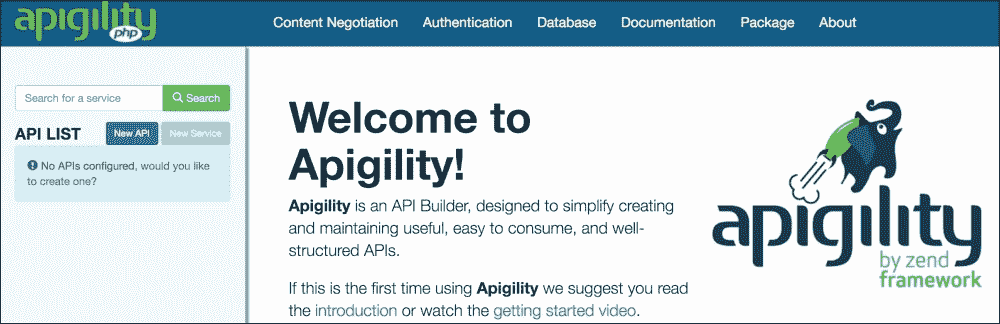
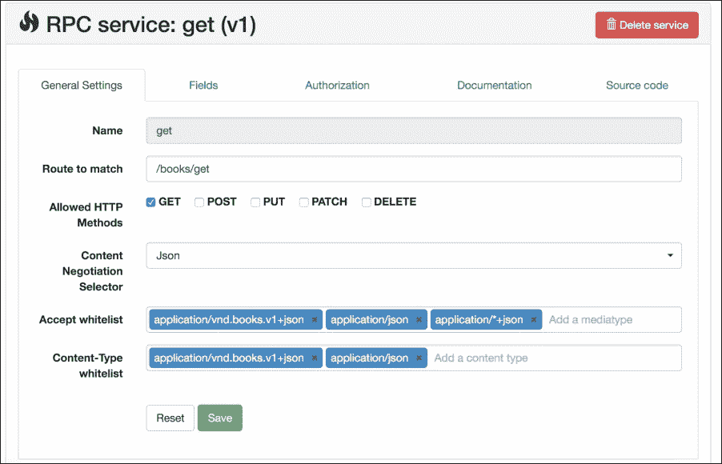
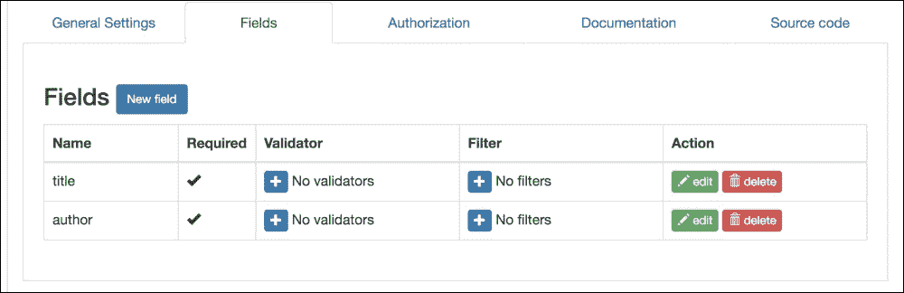
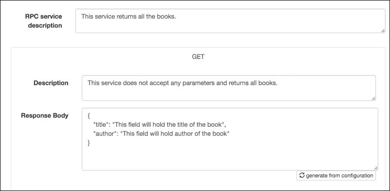

# 九、附录 B：MVC 和框架

我们在不同的章节中介绍了一些框架的名称，但没有讨论它们。在当今世界，我们不再发明轮子；我们以已经构建、测试和广泛使用的工具为基础。因此，作为最佳实践，如果没有满足需求的可用方法，我们可以使用最适合需求的框架来构建它。

我们将讨论以下主题：

*   MVC 设计模式
*   拉维尔
*   流明
*   灵巧

# MVC 设计模式

**模型视图控制器**（**MVC**是一种广泛应用于不同编程语言的设计模式。大多数 PHP 框架都使用这种设计模式。此模式将应用分为三层：模型、视图和控制器。其中每一个都有单独的任务，它们都是相互关联的。MVC 有不同的视觉表示法，但下图显示了一种全面而简单的表示法：


现在，让我们讨论一下 MVC 设计模式的每一部分。

## 模型

模型层是应用的主干，处理数据逻辑。大多数情况下，人们认为模型负责数据库上的 CRUD 操作，这可能是真的，也可能不是真的。正如我们前面提到的，模型负责数据逻辑，这意味着数据验证操作也可以在这里执行。简单地说，模型提供了数据的抽象。其余的应用层不知道或不关心数据如何和从何而来，也不关心如何对数据执行操作。模型负责处理所有数据逻辑。

在当今复杂的框架结构中，整个 MVC 结构发生了变化，不仅模型处理数据操作，而且其他所有应用逻辑都由模型处理。遵循的方法是胖模型和瘦控制器，这意味着保持模型和控制器中的所有应用逻辑尽可能干净。

## 观点

视图是最终用户可见的内容。与此用户和公共相关的所有数据都显示在视图中，因此视图可以称为模型的可视化表示。视图需要显示数据。它要求控制器提供一些特定的数据或操作。视图不知道或想知道控制器从何处获取此数据；它只是要求控制器获取它。控制器知道向谁索取该特定数据，并与特定模型进行通信。这意味着视图与模型没有任何直接链接。然而，在前面的图中，我们直接将模型链接到视图。这是因为在当今的先进系统中，视图可以直接从模型中获取数据。例如，Magento 控制器无法将数据发送回视图。对于数据（即，直接从数据库获取数据）和/或与模型通信，视图与块和辅助类通信。在现代实践中，视图可以直接连接到模型。

## 控制器

控制器响应用户在视图中执行的操作，并响应视图。例如，用户填写表单并提交。在这里，控制器进入中间，开始对提交表单采取行动。现在，控制器将首先检查是否允许用户发出此请求。然后，控制器将采取适当的操作，例如与模型通信或任何其他操作。在一个简单的类比中，控制器是视图和模型之间的中间人。正如我们在前面的模型部分中提到的，控制器应该是纤细的。因此，大多数情况下，控制器仅用于处理请求并与模型和视图通信。所有类型的数据操作都在模型中执行。

MVC 设计模式的唯一任务是分离应用中不同部分的职责。因此，模型用于管理应用数据。控制器用于对用户输入执行操作，视图负责数据的可视化表示。正如我们前面提到的，MVC 将每个部分的职责分开，因此无论它是从控制器还是从视图访问模型都无关紧要；唯一重要的是，视图和控制器不应用于对数据执行操作，因为这是模型的责任，控制器不应用于最终用户查看任何类型的数据，因为这是视图的责任。

# 拉雷维尔

Laravel 是最流行的 PHP 框架之一，据 Laravel 官方网站称，它是一个面向 Web 工匠的框架。Laravel 美观、功能强大，拥有大量的特性，可以让开发人员编写高效、高质量的代码。Laravel 的官方文档写得很好，很容易理解。那么，让我们和拉威尔玩一玩。

## 安装

安装非常简单。让我们使用 Composer 安装 Laravel。我们在附录 A 中讨论了 Composer。在终端中发出以下命令，以便在 Laravel 中安装和创建项目：

```php
composer create-project --prefer-dist laravel/laravel packt

```

如果 Composer 未在系统上全局安装，请将`composer.phar`放置在应安装 Laravel 的目录中，并在该目录根目录下的终端中发出以下命令：

```php
php composer.phar create-project --prefer-dist laravel/laravel packt

```

现在，将下载 Laravel，并创建一个名为`packt`的新项目。此外，Composer 将下载并安装项目的所有依赖项。

打开浏览器，进入项目的 URL，我们会看到一个漂亮的简单页面，上面写着**Laravel 5**。

### 注

在撰写本书时，Laravel 5.2.29 是可用的最新版本。但是，如果使用 Composer，则每次使用`composer update`命令时，Laravel 和所有其他组件都将自动更新。

## 特征

Laravel 提供了大量的特性，我们在这里只讨论几个。

### 路由

Laravel 提供强大的路由。可以对路由进行分组，并且可以为路由组定义前缀、名称空间和中间件。同时，Laravel 支持所有 HTTP 方法，包括`POST`、`GET`、`DELETE`、`PUT`、`OPTIONS`和`PATCH`。所有路由都在应用的`app`文件夹的`routes.php`文件中定义。请看以下示例：

```php
Route::group(['prefix' => 'customer', 'namespace' => 'Customer', 'middleware' => 'web'], function() {
    Route::get('/', 'CustomerController@index');
    Route::post('save', 'CustomerController@save');
    Route::delete('delete/{id}', 'CustomerController@delete');
});
```

在前面的代码片段中，我们创建了一个新的 routes 组。这将仅在 URL 带有前缀 customer 时使用。例如，如果 URL 类似于`domain.com/customer`，则将使用此组。我们还使用了客户名称空间。名称空间允许我们使用标准的 PHP 名称空间，并将文件划分到子文件夹中。在前面的示例中，所有客户控制器都可以放置在`Controllers`目录下的 customer 子文件夹中，控制器的创建如下：

```php
namespace App\Http\Controllers\Customer

use App\Http\{
Controllers\Controller,
Requests,
};
use Illuminate\Http\Request;

Class CustomerController extends Controller
{
  …
  …
}
```

因此，给路由组命名使我们能够将控制器文件放在子文件夹中，这很容易管理。此外，我们还使用了 web 中间件。中间件提供了一种在进入应用之前过滤请求的方法，这使我们能够使用它来检查用户是否登录、CSRF 保护，或者在将请求发送到应用之前，是否有任何其他操作可以在中间件中执行并且需要执行。Laravel 附带了一些中间件，包括`web`、`api`、`auth`等等。

如果路由定义为`GET`，则不能向该路由发送`POST`请求。它非常方便，这使我们不必担心请求方法的过滤。但是，HTML 表单不支持`DELETE`、`PATCH`和`PUT`等 HTTP 方法。为此，Laravel 提供了方法欺骗，在该方法中，使用带有`name _method`的隐藏表单字段和 HTTP 方法的值来实现该请求。例如，在我们的 routes 组中，要使删除路由的请求成为可能，我们需要类似于以下内容的表单：

```php
<form action="/customer/delete" method="post">
  {{ method_field('DELETE') }}
  {{ csrf_field() }}
</form>
```

提交上述表单时，它将起作用，并将使用删除路由。此外，我们还创建了一个 CSRF 隐藏字段，用于 CSRF 保护。

### 注

Laravel 路由非常有趣，也是一个大话题。更多详细信息请参见[https://laravel.com/docs/5.2/routing](https://laravel.com/docs/5.2/routing) 。

## 雄辩的 ORM

雄辩的 ORM 提供与数据库交互的活动记录。要使用雄辩的 ORM，我们必须从雄辩的模型扩展我们的模型。让我们看一下一个简单的用户模型，如下所示：

```php
namespace App;

use Illuminate\Database\Eloquent\Model;

class user extends Model
{
  //protected $table = 'customer';
  //protected $primaryKey = 'id_customer';
  …
  …
}
```

就这样,；我们有一个模型，现在可以处理所有积垢操作。请注意，我们对`$table property`进行了注释，并对`$primaryKey`进行了相同的注释。这是因为 Laravel 使用类的复数名称来查找表，除非该表是用受保护的`$table property`定义的。在我们的例子中，Laravel 将查找表名用户并使用它。但是，如果我们想使用一个名为`customers`的表，我们可以取消对该行的注释，如下所示：

```php
protected $table = 'customers';
```

类似地，Laravel 认为一个表将有一个列名为`id`的主键。但是，如果需要另一列，我们可以覆盖默认主键，如下所示：

```php
protected $primaryKey = 'id_customer';
```

雄辩的模型也使时间戳变得容易。默认情况下，如果表中有`created_at`和`updated_at`字段，则自动生成并保存这两个日期。如果不需要时间戳，则可以禁用这些时间戳，如下所示：

```php
protected $timestamps = false;
```

将数据保存到表中很容易。表列用作模型的属性，因此如果我们的`customer`表有`name`、`email`、`phone`等列，我们可以在我们的`customer`控制器中进行如下设置，如路由部分所述：

```php
namespace App\Http\Controllers\Customer

use App\Http\{
Controllers\Controller,
Requests,
};
use Illuminate\Http\Request;
use App\Customer

Class CustomerController extends Controller
{
  public function save(Request $request)
  {
    $customer = new Customer();
    $customer->name = $request->name;
    $customer->email = $request->email;
    $customer->phone = $request->phone;

    $customer->save();

  }
}
```

在前面的示例中，我们向控制器添加了`save`操作。现在，如果沿着表单数据发出`POST`或`GET`请求，则 Laravel 将所有表单提交的数据作为与表单字段名称相同的属性分配给请求对象。然后，使用这个请求对象，我们可以使用`POST`或`GET`访问表单提交的所有数据。将所有数据分配给模型属性（与表列名称相同）后，只需调用 save 方法即可。现在，我们的模型没有任何 save 方法，但是它的父类，即雄辩模型，定义了这个方法。然而，我们可以在我们的`model`类中重写这个`save`方法，以防我们需要这个方法中的一些其他特性。

从雄辩的模型中获取数据也很容易。让我们来举个例子。向`customer`控制器添加新操作，如下所示：

```php
public function index()
{
  $customers = Customer::all();
}
```

我们在模型中使用了`all()`静态方法，这基本上是在雄辩模型中定义的，而雄辩模型反过来又获取`customers`表中的所有数据。现在，如果我们想通过主键获取单个客户，我们可以使用`find($id)`方法，如下所示：

```php
$customer = Customer::find(3);
```

这将获取 ID 为`3`的客户。

更新简单，使用相同的`save()`方法，如下图：

```php
$customer = Customer::find(3);
$customer->name = 'Altaf Hussain';

$customer->save();
```

这将使用 ID`3`更新客户。首先，我们加载`customer`，然后为其属性分配新数据，然后调用相同的`save()`方法。删除模型简单易行，可按如下方式进行：

```php
$customer = Customer::find(3);
$customer->delete();
```

我们先加载 ID 为`3`的客户，然后调用`delete`方法，删除 ID 为`3`的客户。

### 注

Laravel 雄辩的模型非常强大，提供了许多功能。这些在[的文档中有很好的解释 https://laravel.com/docs/5.2/eloquent](https://laravel.com/docs/5.2/eloquent) 。Laravel 数据库部分也值得一读，可在[上找到 https://laravel.com/docs/5.2/database](https://laravel.com/docs/5.2/database) 。

## 工匠 CLI

Artisan 是 Laravel 提供的命令行界面，它有一些漂亮的命令，可以用于更快的操作。它有很多命令，可以使用以下命令查看完整列表：

```php
php artisan list

```

这将列出所有可用的选项和命令。

### 注

`php artisan`命令应在`artisan`文件所在的同一目录中运行。它被放置在项目的根目录下。

一些基本命令如下所示：

*   `make:controller`: This command creates a new controller in the `Controllers` folder. The command can be used as follows:

    ```php
    php artisan make:controller MyController

    ```

    如果需要一个带名称空间的控制器，就像之前在`Customer`名称空间中发生的那样，可以按如下方式进行：

    ```php
    php artisan make:controller Customer/CustomerController

    ```

    此命令将在`Customer`文件夹中创建`CustomerController`。如果`Customer`文件夹不可用，它也将创建该文件夹。

*   `make:model`: This creates a new model in the `app` folder. The syntax is the same as the `make:controller` command, as follows:

    ```php
    php artisan make:model Customer

    ```

    对于带名称空间的模型，可以按如下方式使用：

    ```php
    php artisan make:model Customer/Customer

    ```

    这将在`Customer`文件夹中创建`Customer`模型，并为其使用`Customer`名称空间。

*   `make:event`：此在`Events`文件夹中创建一个新的`event`类。可如下使用：

    ```php
    php artisan make:event MyEvent

    ```

*   `make:listener`: This command creates a new listener for an event. This can be used as follows:

    ```php
    php artisan make:listener MyListener --event MyEvent

    ```

    前面的命令将为我们的`MyEvent`事件创建一个新的侦听器。我们必须经常提到需要使用`--event`选项为其创建侦听器的事件。

*   `make:migration`：此命令在数据库/迁移文件夹中创建新的迁移。
*   `php artisan migrate`：此运行所有未执行的可用迁移。
*   `php artisan optimize`：此命令优化框架以获得更好的性能。
*   `php artisan down`：这将应用置于维护模式。
*   `php artisan up`：此命令将应用从维护模式恢复为活动状态。
*   `php artisan cache:clear`：此命令清除应用缓存。
*   `php artisan db:seed`：此命令为数据库添加记录种子。
*   `php artisan view:clear`: This clears all the compiled view files.

    ### 注

    有关 Artisan 控制台或 Artisan CLI 的更多详细信息，请参阅位于[的文档 https://laravel.com/docs/5.2/homestead](https://laravel.com/docs/5.2/homestead) 。

## 迁徙

迁移是 Laravel 的另一个强大功能。在迁移中，我们定义数据库模式，无论是创建表、删除表还是在表中添加/更新列。迁移在部署中非常方便，并充当数据库的版本控制。让我们为数据库中尚不可用的 customer 表创建一个迁移。要创建迁移，请在终端中发出以下命令：

```php
php artisan make:migration create_custmer_table

```

将在`database/migrations`文件夹中创建一个新文件，文件名`create_customer_table`前缀为当前日期和唯一 ID。该类将创建为`CreateCustomerTable`。这是一个如下的类：

```php
use Illuminate\Database\Schema\Blueprint;
use Illuminate\Database\Migrations\Migration;

class CreateCustomerTable extends Migrations
{
  //Run the migrations

  public function up()
  {
    //schemas defined here
  }

  public function down()
  {
    //Reverse migrations
  }
}
```

该类将有两个公共方法：`up()`和`down()`。`up()`方法应具有表的所有新模式。`down()`方法负责反转已执行的迁移。现在，我们将`customers`表模式添加到`up()`方法中，如下所示：

```php
public function up()
{
  Schema::create('customers', function (Blueprint $table)
  {
    $table->increments('id', 11);
    $table->string('name', 250)
    $table->string('email', 50);
    $table->string('phone', 20);
    $table->timestamps();
  });
}
public function down()
{
  Schema::drop('customers');
}
```

在`up()`方法中，我们定义了模式和表名。表中的列是单独定义的，包括列大小。`increments()`方法定义了 autoincrement 列，在我们的例子中，它是`id`列。接下来，我们为`name`、`email`和`phone`创建了三个字符串列。然后，我们使用`timestamps()`方法，创建`created_at`和`updated_at`时间戳列。在`down()`方法中，我们只是使用`Schema`类的`drop()`方法退出`customers`表。现在，我们需要使用以下命令运行迁移：

```php
php artisan migrate

```

前面的命令不仅将运行迁移，还将运行所有尚未执行的迁移。执行迁移时，Laravel 将迁移名称存储在名为`migrations`的表中，从该表中，Laravel 决定必须执行哪些迁移以及跳过哪些迁移。

现在，如果需要回滚最新执行的迁移，可以使用以下命令：

```php
php artisan migrate:rollback

```

这将回滚到最后一批迁移。要回滚应用的所有迁移，我们可以使用 reset 命令，如下所示：

```php
php artisan migrate:reset

```

这将回滚整个应用迁移。

迁移使部署变得容易，因为我们不需要每次在表或数据库中创建一些新更改时都上载数据库模式。我们将创建迁移并上载所有文件，然后执行 migration 命令，所有模式都将更新。

## 叶片模板

Laravel 自带了自己的模板语言 Blade。另外，刀片模板文件支持普通 PHP 代码。刀片模板文件被编译为普通 PHP 文件，并被缓存，直到它们被更改。刀片也支持布局。例如，下面是我们在 Blade 中的母版页布局，放置在名为`master.blade.php`的`resources/views/layout`文件夹中。请看下面的代码：

```php
<!DOCTYPE html>
<html>
  <head>
    <title>@yield('title')</title>
  </head>
  <body>
    @section('sidebar')
      Our main sidebar
      @show

      <div class="contents">
        @yield('content')
      </div>
  </body>
</html>
```

在前面的示例中，我们有一个用于侧栏的部分，它定义了一个`content`部分。此外，我们还有`@yield`，它显示一个部分的内容。现在，如果我们想使用这个布局，我们需要在子模板文件中扩展它。让我们在`resources/views/`文件夹中创建`customers.blade.php`文件，并在其中放置以下代码：

```php
@extend('layouts.master')
  @section('title', 'All Customers')
  @section('sidebar')
  This will be our side bar contents
  @endsection
  @section('contents')
    These will be our main contents of the page
  @endsection
```

从前面的代码中可以看出，我们扩展了`master`布局，然后将内容放置在`master`布局的每个部分中。此外，还可以在另一个模板中包含不同的模板。例如，我们在`resources/views/includes`文件夹中有两个文件`sidebar.blade.php`和`menu.blade.php`。然后，我们可以在任何模板中包含这些文件，如下所示：

```php
@include(includes.menu)
@include(includes.sidebar)
```

我们使用`@include`包含一个模板。点（`.`表示文件夹分隔。我们可以轻松地从控制器或路由器向刀片模板或视图发送数据。我们只需将数据作为数组传递给视图，如下所示：

```php
return view('customers', ['count => 5]);
```

现在，`count`在我们的`customers`视图文件中可用，可按如下方式访问：

```php
Total Number of Customers: {{ count }}
```

是的，Blade 使用双花括号来响应变量。对于控制结构和循环，让我们再举一个例子。我们将数据发送到`customers`视图，如下所示：

```php
return view('customers', ['customers' => $allCustomers]);
```

现在，如果我们想显示所有的`customers`数据，我们的`customers`视图文件将与下面类似：

```php
…
…
@if (count($customers) > 0)
{{ count($customers) }} found. <br />
@foreach ($customers as $customer)
{{ $customer->name }} {{ $customer->email }} {{ $customer->phone }} <br>
@endforeach

@else
Now customers found.
@endif;
…
…
```

前面的所有语法看起来都很熟悉，因为它几乎与普通 PHP 相同。然而，要显示一个变量，我们必须使用双大括号`{{}}`。

### 注

在[上可以找到一份易于阅读的叶片模板文档 https://laravel.com/docs/5.2/blade](https://laravel.com/docs/5.2/blade) 。

## 其他特点

在上一节中，我们只讨论了几个基本特征。Laravel 还有很多其他特性，比如身份验证和授权，它们提供了一种简单的方式来对用户进行身份验证和授权。此外，Laravel 还提供了一个强大的缓存系统，支持基于文件的缓存、Memcached 和 Redis 缓存。Laravel 还为这些事件提供事件和侦听器，这在我们想要执行特定操作和特定事件发生时非常方便。Laravel 支持本地化，这使我们能够使用本地化内容和多种语言。Laravel 还支持任务调度和队列，其中我们将一些任务安排在特定时间运行，并将一些任务安排在轮到它们时运行。

# 流明

Lumen 是由 Laravel 提供的微框架。Lumen 主要用于创建无状态 API，并具有 Laravel 的一组最小功能。此外，Lumen 与 Laravel 兼容，这意味着如果我们只需将 Lumen 应用复制到 Laravel，它就可以正常工作。安装很简单。只需使用以下 Composer 命令创建 Lumen 项目，它将下载所有依赖项，包括 Lumen：

```php
composer create-project --prefer-dist laravel/lumen api

```

前面的命令将下载 Lumen，然后创建我们的 API 应用。在此之后，将`.env.example`重命名为`.env`。另外，创建一个 32 个字符长的应用密钥并将其放入`.env`文件中。现在，基本应用已准备好使用和创建 API。

### 注

Lumen 与 Laravel 几乎相同，但默认情况下不包括某些 Laravel 功能。更多详情请参见[https://lumen.laravel.com/docs/5.2](https://lumen.laravel.com/docs/5.2) 。

# 灵巧

Apigility 由 Zend 在 Zend 框架 2 中构建和开发。Apigility 提供了一个易于使用的 GUI 来创建和管理 API。它非常易于使用，并且能够创建复杂的 API。让我们从使用 Composer 安装 Apigility 开始。在终端中发出以下命令：

```php
composer create-project -sdev zfcampus/zf-apigility-skeleton packt

```

前面的命令将下载 Apigility 及其依赖项，包括 Zend Framework 2，并将设置名为`packt`的项目。现在，发出以下命令以启用开发模式，以便我们可以访问 GUI：

```php
php public/index.php development enable

```

现在，打开 URL[yourdomain.com/packt/public](http://yourdomain.com/packt/public)，我们将看到一个漂亮的 GUI，如下图所示：



现在，让我们创建第一个 API。我们将此 API 称为“`books`”，它将返回书籍列表。点击**新建 API**按钮，如上图所示，弹出窗口。在文本框中输入`books`作为 API 名称，点击`Create`按钮；将创建新的 API。创建 API 时，我们将看到以下屏幕：


Apigility 提供了为 API 设置其他属性的简单方法，如版本控制和身份验证。现在，让我们通过点击左侧栏中的**新建服务**按钮来创建一个 RPC 服务。此外，我们还可以点击前面截图中**RPC**部分的**新建**链接。我们将看到以下屏幕：


如前面的屏幕截图所示，我们在`books`API 中创建了一个名为`get`的 RPC 服务。输入的路由 URI 为`/books/get`，将用于调用此 RPC 服务。当我们点击`Create service`按钮时，将显示 API 创建成功消息，并显示以下屏幕：



从前面的截图可以看出，该服务允许的 HTTP 方法只有**GET**。让我们保持原样，但我们可以选择全部或任何一个。此外，我们希望将**内容协商选择器**保留为`Json`，我们的服务将接受/接收 JSON 格式的所有内容。此外，我们还可以选择不同的媒体类型和内容类型。

接下来，我们应该向服务中添加一些将要使用的字段。点击**字段**选项卡，我们将看到**字段**屏幕。点击**新建字段**按钮，弹出如下画面：


从前面的截图可以看出，我们可以设置一个字段的所有属性，比如**名称**、**描述**、是否需要，以及一些其他设置，包括验证失败时的错误消息。在我们创建了两个字段**title**和**author**之后，我们将有一个类似于以下内容的屏幕：



正如前面的屏幕所示，我们也可以向每个字段添加验证器和过滤器。

### 注

由于这只是 Apigility 的一个介绍性主题，所以在本书中我们将不介绍验证器和过滤器以及其他一些主题。

下一个主题是文档。当我们点击**文档**选项卡时，我们将看到以下屏幕：



在这里，我们将记录我们的服务，添加一些描述，还可以生成用于记录目的的响应体。这非常重要，因为它将使其他人更好地了解我们的 API 和服务。

现在，我们需要从某个地方弄到所有的书。它可以来自数据库，也可以来自其他服务或任何其他来源。然而，现在，我们将仅使用一组书籍进行测试。如果我们点击**源**选项卡，我们会发现我们的服务代码位于`module/books/src/books/V1/Rpc/Get/GetController.php`。Apigility 为我们的 API`books`创建了一个模块，然后根据我们的 API 版本（默认为 V1），将该模块中的所有源代码放在不同的文件夹中。我们可以向 API 添加更多版本，如 V2 和 V3。现在，如果我们打开`GetController`文件，我们将根据路由 URI 找到一些代码和一个名为`getAction`的操作。代码如下，突出显示的代码就是我们添加的代码：

```php
namespace books\V1\Rpc\Get;

use Zend\Mvc\Controller\AbstractActionController;
use ZF\ContentNegotiation\ViewModel;

class GetController extends AbstractActionController
{
  public function getAction()
  {
    $books = [ 'success' => [
 [
 'title' => 'PHP 7 High Performance',
 'author' => 'Altaf Hussain'
 ],
 [
 'title' => 'Magento 2',
 'author' => 'Packt Publisher'
 ],
 ]
 ];

 return new ViewModel($books);
  }
}
```

在前面的代码中，我们使用了`ContentNegotiation\ViewModel`，它负责以我们在服务设置中选择的格式（在本例中为 JSON）响应数据。然后，我们用我们为服务创建的字段名创建了一个简单的`$books`数组，并将我们的值分配给它们。然后，我们使用`ViewModel`对象返回它们，该对象处理到 JSON 的响应数据转换。

现在，让我们测试我们的 API。由于我们的服务可以接受`GET`请求，我们只需在浏览器中键入带有`books/get`URI 的 URL，我们就会看到 JSON 响应。最好使用 RestClient 或 Postman for googlechrome 等工具检查 API，它提供了一个易于使用的界面，可以向 API 发出不同类型的请求。我们用 Postman 对其进行了测试，得到的响应如以下屏幕截图所示：


还要注意，我们将服务设置为只接受`GET`请求。因此，如果我们发送一个非`GET`的请求，我们将得到一个`HTTP Status code 405 methods not allowed`错误。

Apigility 功能非常强大，提供了大量功能，如 RESTFul API、HTTP 身份验证、带有易于创建的 DB 连接器的数据库连接服务，以及服务的表选择。在使用 Apigility 时，我们不必担心 API、服务结构安全性和其他问题，因为 Apigility 为我们做到了这一点。我们只需要关注 API 和服务的业务逻辑。

### 注

在本附录中不能完全涵盖灵巧性。一本完整的书可以涵盖灵巧的许多特点。Apigility 的官方文件位于[https://apigility.org/documentation](https://apigility.org/documentation) 是一个很好的开始阅读的地方。

# 总结

在本附录中，我们讨论了 MVC 设计模式的基础知识。我们还讨论了 Laravel 框架及其一些良好特性。我们向您介绍了基于 Laravel 的微框架 Lumen。最后，我们对 Apigility 做了一个小介绍，并创建了一个测试 API 和 web 服务。

在 IT 中，东西在很短的时间内就过时了。总是需要研究升级的工具，并为编程中的最佳方法找到新的方法和技术。因此，一个人不应该在完成这本书后停止，开始学习新的主题，也不应该学习这本书中没有完全涵盖的主题。到目前为止，您将掌握可用于为高性能应用设置高性能环境的知识。我们祝你在 PHP 编程方面好运和成功！