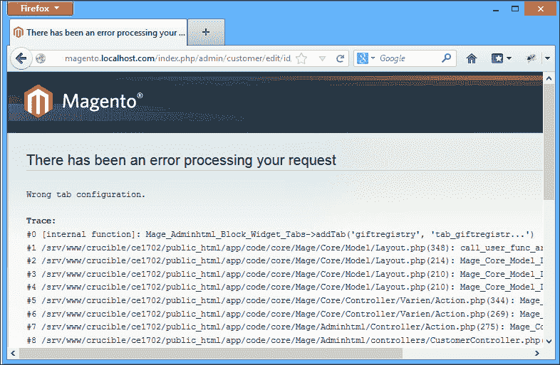
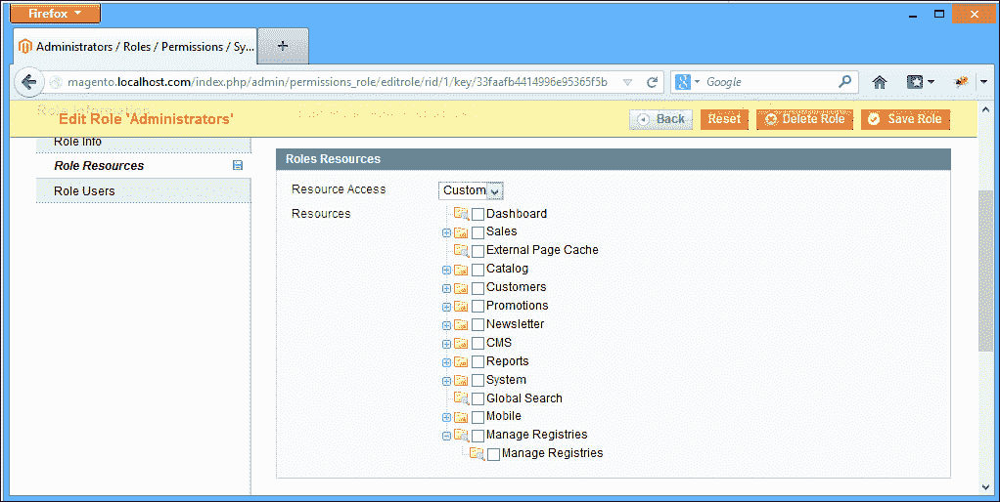
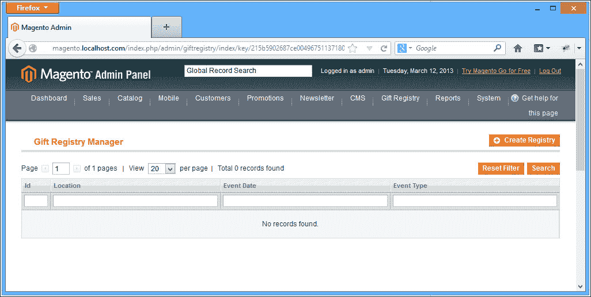
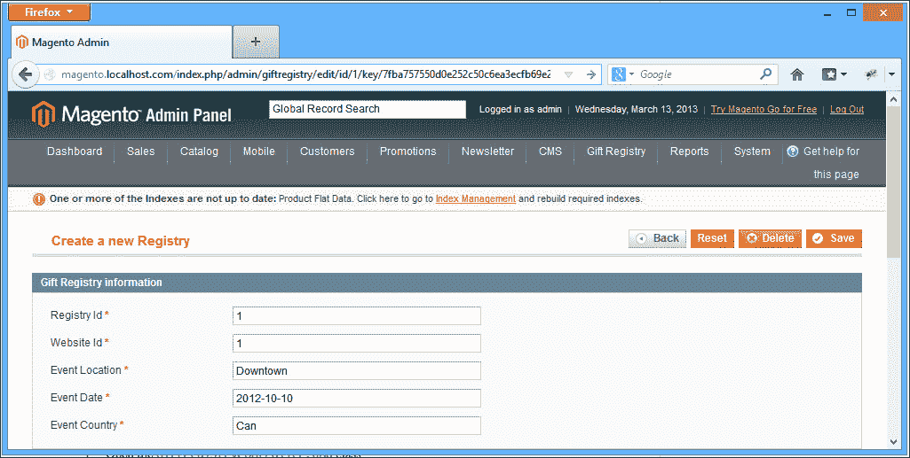

# 第五章后台开发

在上一章中，我们添加了礼品注册表的所有前端功能。现在，客户可以创建注册中心并向客户注册中心添加产品，并且通常可以完全控制自己的注册中心。

在本章中，我们将构建店主通过 Magento 后端管理和控制注册表所需的所有功能。

在许多意义上，Magento 后端可以被视为与 Magento 前端分离的应用程序；它使用完全独立的主题、样式和不同的基本控制器。

对于我们的礼品注册，我们希望允许店主查看所有客户注册、修改信息以及添加和删除项目。在本章中，我们将介绍以下内容：

*   使用配置扩展 Adminhtml
*   使用网格小部件
*   使用表单小部件
*   使用访问控制列表限制访问和权限

# 扩展 Adminhtml

`Mage_Adminhtml`是一个单模块，通过使用配置为 Magento 提供所有后端功能。正如我们之前了解到的，Magento 使用作用域来定义配置。在上一章中，我们使用前端作用域为自定义模块设置配置。

要修改后端，我们需要在配置文件中创建一个名为`admin`的新作用域。执行以下步骤以执行此操作：

1.  打开`config.xml`文件，可以在`app/code/loca/Mdg/Giftregistry/etc/`位置找到。
2.  添加以下代码：

    ```php
    <admin>
     <routers>
       <giftregistry>
         <use>admin</use>
           <args>
               <module>Mdg_Giftregistry_Adminhmtl</module>
               <frontName>giftregistry</frontName>
           </args>
       </giftregistry>
     </routers>
    </admin>
    ```

此代码与我们之前使用指定前端路线的代码非常相似；然而，通过这种方式声明路线，我们正在打破一种不成文的 Magento 设计模式。

为了保持后端的一致性，所有新模块都应该扩展主管理路径。

我们不是用前面的代码定义路由，而是创建一个全新的管理路由。通常，您不希望对 Magento 后端执行此操作，除非您正在创建一个新路由，该路由需要管理员访问权限，但不需要对 Magento 后端的其余部分进行访问。管理操作的回调 URL 就是这样一个很好的例子。

幸运的是，有一种非常简单的方法可以在 Magento 模块之间共享路由名称。

### 注

共享路由名称是在 Magento 1.3 中引入的，但直到今天，我们仍然看到扩展没有正确使用此模式。

让我们更新我们的代码：

1.  打开`config.xml`文件，可以在`app/code/loca/Mdg/Giftregistry/etc/`位置找到。
2.  使用以下代码更新路由配置：

    ```php
    <admin>
     <routers>
       <adminhtml>
         <args>
           <modules>
             <mdg_giftregistry before="Mage_Adminhtml">Mdg_Giftregistry_Adminhtml</mdg_giftregistry>
           </modules>
         </args>
       </adminhtml>
     </routers>
    </admin>
    ```

进行此更改后，我们可以通过管理员名称空间正确地访问我们的管理员控制器；例如，`http://magento.localhost.com/giftregistry/index`现在将是`http://magento.localhost.com/admin/giftregistry/index`。

我们的下一步将是创建一个新的控制器，用于管理客户注册。我们将此控制器称为`GiftregistryController.php`。执行以下步骤以执行此操作：

1.  导航到模块控制器文件夹。
2.  创建一个名为`Adminhtml`的新文件夹。
3.  在`app/code/loca/Mdg/Giftregistry/controllers/Adminhtml/`位置创建名为`GiftregistryController.php`的文件。
4.  添加以下代码：

    ```php
    <?php
    class Mdg_Giftregistry_Adminhtml_GiftregistryController extends Mage_Adminhtml_Controller_Action
    {
        public function indexAction()
        {
            $this->loadLayout();
            $this->renderLayout();
            return $this;
        }

        public function editAction()
        {
            $this->loadLayout();
            $this->renderLayout();
            return $this;
        }

        public function saveAction()
        {
            $this->loadLayout();
            $this->renderLayout();
            return $this;
        }

        public function newAction()
        {
            $this->loadLayout();
            $this->renderLayout();
            return $this;
        }

        public function massDeleteAction()
        {
            $this->loadLayout();
            $this->renderLayout();
            return $this;
        }
    }
    ```

注意一些重要的事情：这个新的控制器扩展了`Mage_Adminhtml_Controller_Action`而不是`Mage_Core_Controller_Front_Action`，到目前为止我们一直在使用它。原因是`Adminhtml`控制器具有额外的验证，以防止非管理员用户访问其操作。

注意，我们将控制器放置在`controllers/`目录中的一个新子文件夹中；通过使用此子目录，我们可以使前端和后端控制器保持有序。这是广泛接受的 Magento 标准做法。

现在，让我们不要使用这个空白控制器，而是扩展 Magento 后端导航，并在客户编辑页面中添加一些额外的选项卡。

## 返回配置

到目前为止，我们已经看到，大多数时候 Magento 是由 XML 配置文件控制的，后端布局也没有什么不同。我们需要创建一个新的`adminhtml`布局文件。执行以下步骤以执行此操作：

1.  导航到设计文件夹。
2.  创建一个名为`adminhtml`的新文件夹，并在其中创建以下文件夹结构：
    *   `adminhtml/`
    *   `--default/`
    *   `----default/`
    *   `------template/`
    *   `------layout/`
3.  在`layout`文件夹中，让我们在`app/code/design/adminhtml/default/default/layout/`位置创建一个名为`giftregistry.xml`的新布局文件。
4.  将以下代码复制到布局文件中：

    ```php
    <?xml version="1.0"?>
    <layout version="0.1.0">
        <adminhtml_customer_edit>
            <reference name="left">
                <reference name="customer_edit_tabs">
                    <block type="mdg_giftregistry/adminhtml_customer_edit_tab_giftregistry" name="tab_giftregistry_main" template="mdg_giftregistry/giftregistry/customer/main.phtml">
                    </block>
                    <action method="addTab">
                     <name>mdg_giftregistry</name>
                  <block>tab_giftregistry_main</block>
              </action>
                </reference>
            </reference>
        </adminhtml_customer_edit>
    </layout>
    ```

我们还需要将新的布局文件添加到`config.xml`模块中。执行以下步骤以执行此操作：

1.  导航到`etc/`文件夹。
2.  打开`config.xml`文件，可以在`app/code/loca/Mdg/Giftregistry/etc/`位置找到。
3.  将以下代码复制到`config.xml`文件中：

    ```php
    …
        <adminhtml>
            <layout>
                <updates>
                    <mdg_giftregistry module="mdg_giftregistry">
                        <file>giftregistry.xml</file>
                    </mdg_giftregistry>
                </updates>
            </layout>
        </adminhtml>
    …
    ```

我们在布局中所做的是创建一个新的容器块，并声明一个包含该块的新选项卡。

让我们通过登录 Magento 后端并进入位于**客户****管理客户**的**客户经理**来快速测试我们到目前为止所做的更改。

我们应该在后端获得以下错误：



这是因为我们试图添加一个尚未声明的块；要解决这个问题，我们需要创建一个新的块类。执行以下步骤以执行此操作：

1.  导航到blocks 文件夹，在`app/code/loca/Mdg/Giftregistry/Block/Adminhtml/Customer/Edit/Tab/`位置按照名为`Giftregistry.php`的目录结构创建一个新的 block 类。
2.  添加以下代码：

    ```php
    <?php 
    class Mdg_Giftregistry_Block_Adminhtml_Customer_Edit_Tab_Giftregistry
        extends Mage_Adminhtml_Block_Template
        implements Mage_Adminhtml_Block_Widget_Tab_Interface {

        public function __construct()
        {
            $this->setTemplate('mdg/giftregistry/customer/main.phtml');
            parent::_construct();
        }

        public function getCustomerId()
        {
            return Mage::registry('current_customer')->getId();
        }

        public function getTabLabel()
        {
            return $this->__('GiftRegistry List');
        }

        public function getTabTitle()
        {
            return $this->__('Click to view the customer Gift Registries');
        }

        public function canShowTab()
        {
            return true;
        }

        public function isHidden()
        {
            return false;
        }
    }
    ```

在这个 block 类中发生了一些有趣的事情。首先，我们将扩展一个不同的块类`Mage_Adminhtml_Block_Template`，并实现一个新接口`Mage_Adminhtml_Block_Widget_Tab_Interface`。这样做是为了访问 Magento 后端的所有特性和功能。

我们还在类的构造函数中设置块模板；同样在`getCustomerId`下，我们使用 Magento 全局变量获取当前客户。

我们的下一步将是为此块创建相应的模板文件，否则我们将在块初始化时出错。

1.  在`app/code/design/adminhtml/default/default/template/mdg/giftregistry/customer/`位置创建名为`main.phtml`的模板文件。
2.  将以下代码复制到其中：

    ```php
    <div class="entry-edit">
        <div class="entry-edit-head">
            <h4 class="icon-head head-customer-view"><?php echo $this->__('Customer Gift Registry List') ?></h4>
        </div>
        <table cellspacing="2" class="box-left">
            <tr>
                <td>
                    Nothing here 
                </td>
            </tr>
        </table>
    </div>
    ```

现在，我们只是将占位符内容添加到模板中，这样我们就可以实际看到我们的选项卡在运行；现在，如果我们转到后端的 customer 部分，我们将看到一个新的选项卡可用，单击该选项卡将显示占位符内容。

现在，我们已经修改了后端，只需更改配置并添加一些简单的块和模板文件，就可以在 customer 部分添加一个**Customers**选项卡。但到目前为止，这还不是特别有用，所以我们需要一种方式来显示**礼品登记**选项卡下的所有客户礼品登记处。

# 网格小部件

我们可以重用 Magento`Adminhtml`模块已经提供的网格块，而不必从头开始编写我们自己的网格块。

我们将要扩展的块称为网格小部件；grid 小部件是一种特殊类型的块，用于在特定表格网格中呈现 Magento 对象的集合。

网格小部件通常在网格容器中呈现；这两个元素的组合不仅允许以网格形式显示我们的数据，而且还增加了搜索、过滤、排序和批量操作功能。执行以下步骤：

1.  导航到块`Adminhtml/`文件夹，并在位置`app/code/loca/Mdg/Giftregistry/Block/Adminhtml/Customer/Edit/Tab/`处创建一个名为`Giftregistry/`的文件夹。
2.  在该文件夹中创建一个名为`List.php`的类。
3.  将以下代码复制到`Giftregistry/List.php`文件中：

    ```php
    <?php
    class Mdg_Giftregistry_Block_Adminhtml_Customer_Edit_Tab_Giftregistry_List extends Mage_Adminhtml_Block_Widget_Grid
    {
        public function __construct()
        {
            parent::__construct();
            $this->setId('registryList');
            $this->setUseAjax(true);
            $this->setDefaultSort('event_date');
            $this->setFilterVisibility(false);
            $this->setPagerVisibility(false);
        }

        protected function _prepareCollection()
        {
            $collection = Mage::getModel('mdg_giftregistry/entity')
                ->getCollection()
                ->addFieldToFilter('main_table.customer_id', $this->getRequest()->getParam('id'));
            $this->setCollection($collection);
            return parent::_prepareCollection();
        }

        protected function _prepareColumns()
        {
            $this->addColumn('entity_id', array(
                'header'   => Mage::helper('mdg_giftregistry')->__('Id'),
                'width'    => 50,
                'index'    => 'entity_id',
                'sortable' => false,
            ));

            $this->addColumn('event_location', array(
                'header'   => Mage::helper('mdg_giftregistry')->__('Location'),
                'index'    => 'event_location',
                'sortable' => false,
            ));

            $this->addColumn('event_date', array(
                'header'   => Mage::helper('mdg_giftregistry')->__('Event Date'),
                'index'    => 'event_date',
                'sortable' => false,
            ));

            $this->addColumn('type_id', array(
                'header'   => Mage::helper('mdg_giftregistry')->__('Event Type'),
                'index'    => 'type_id',
                'sortable' => false,
            ));
            return parent::_prepareColumns();
        }
    }
    ```

看看我们刚刚创建的类，只涉及三个函数：

*   `__construct()`
*   `_prepareCollection()`
*   `_prepareColumns()`

在`__construct`函数中，我们指定了一些关于网格类的重要选项。我们正在设置`gridId`；默认排序为`eventDate`，我们正在启用分页和筛选。

`__prepareCollection()`功能加载当前`customerId`过滤的注册表集合。此函数也可用于在我们的集合中执行更复杂的操作；例如，加入辅助表以获取有关客户或其他相关记录的更多信息。

最后，通过使用`__prepareColumns()`函数，我们告诉 Magento 我们的数据收集应该显示哪些列和属性，以及如何呈现它们。

现在我们已经创建了一个功能网格块，我们需要对布局 XML 文件进行一些更改以显示它。执行以下步骤：

1.  打开`giftregistry.xml`文件，可以在`app/design/adminhtml/default/default/layout/`位置找到。
2.  进行以下更改：

    ```php
    <?xml version="1.0"?>
    <layout version="0.1.0">
        <adminhtml_customer_edit>
            <reference name="left">
                <reference name="customer_edit_tabs">
                    <block type="mdg_giftregistry/adminhtml_customer_edit_tab_giftregistry" name="tab_giftregistry_main" template="mdg/giftregistry/customer/main.phtml">
                        <block type="mdg_giftregistry/adminhtml_customer_edit_tab_giftregistry_list" name="tab_giftregistry_list" as="giftregistry_list" />
                    </block>
                    <action method="addTab">
                        <name>mdg_giftregistry</name>
                        <block>mdg_giftregistry/adminhtml_customer_edit_tab_giftregistry</block>
                    </action>
                </reference>
            </reference>
        </adminhtml_customer_edit>
    </layout>
    ```

我们所做的是添加网格块作为主块的一部分，但是如果我们转到客户编辑页面并单击**礼品注册**选项卡，我们仍然可以看到旧的占位符文本，并且网格没有显示。


这是因为我们尚未对`main.phtml`模板文件进行必要的更改。为了显示子块，我们特别需要告诉模板系统加载任何子块或特定子块；现在，我们将只加载特定的网格块。执行以下步骤：

1.  打开`main.phtml`模板文件，可在`app/design/adminhtml/default/default/template/customer/`位置找到。
2.  将模板代码替换为以下内容：

    ```php
    <div class="entry-edit">
        <div class="entry-edit-head">
            <h4 class="icon-head head-customer-view"><?php echo $this->__('Customer Gift Registry List') ?></h4>
        </div>
        <?php echo $this->getChildHtml('tab_giftregistry_list'); ?>
    </div>
    ```

`getChildHtml()`函数负责渲染所有子块。

函数`getChildHtml()`可以用特定的子块名调用，也可以不带参数调用；在没有参数的情况下调用时，它将加载所有可用的子块。

在我们的扩展中，我们只对实例化一个特定的子块感兴趣，因此我们将把块名作为函数参数传递。现在，如果我们刷新页面，我们将看到我们的网格块加载了该特定客户可用的所有礼品登记处。

## 管理登记处

现在，如果我们想管理特定客户的注册，这很方便，但是如果我们想管理商店中所有可用的注册，这并不能真正帮助我们。为此，我们需要创建一个网格来加载所有可用的礼品登记处。

因为我们已经为后端创建了一个礼品注册控制器，所以我们可以使用 index 操作来显示所有可用的注册。

我们需要做的第一件事是修改 Magento 后端导航，以显示指向新控制器索引操作的链接。同样，我们可以通过使用 XML 来实现这一点。在本例中，我们将创建一个名为`adminhtml.xml`的新 XML 文件。执行以下步骤：

1.  导航到您的模块`etc`文件夹，该文件夹位于`app/code/local/Mdg/Giftregistry/`位置。
2.  创建一个名为`adminhtml.xml`的新文件。
3.  在该文件中放置以下代码：

    ```php
    <?xml version="1.0"?>
    <config>
        <menu>
            <mdg_giftregistry module="mdg_giftregistry">
                <title>Gift Registry</title>
                <sort_order>71</sort_order>
                <children>
                    <items module="mdg_giftregistry">
                        <title>Manage Registries</title>
                        <sort_order>0</sort_order>
                        <action>adminhtml/giftregistry/index</action>
                    </items>
                </children>
            </mdg_giftregistry>
        </menu>
    </config>
    ```

### 注

虽然标准将在`adminhtml.xml`中添加此配置，但您可能会遇到未遵循此标准的扩展。此配置可位于`config.xml`内。

此配置码正在创建一个新的主级菜单及其下的一个新的子级选项；我们还在指定菜单应该映射到哪个操作，在本例中，是我们的礼品注册控制器的索引操作。

如果我们现在刷新后端，我们应该会看到一个新的**礼物注册**菜单添加到顶级导航中。

## 权限和 ACL

有时，我们需要根据管理规则限制对模块的某些功能甚至整个模块的访问。Magento 允许我们使用名为**ACL**或**访问控制列表**的电源功能来实现这一点。Magento 后端中的每个角色都可以具有不同的权限和 ACL。

使用自定义模块启用 ACL 的第一步是定义 ACL 应该限制哪些资源；毫不奇怪，这是由配置 XML 文件控制的。执行以下步骤：

1.  打开`adminhtml.xml`配置文件，可在`app/code/local/Mdg/Giftregistry/etc/`位置找到。
2.  在菜单路径后添加以下代码：

    ```php
    <acl>
        <resources>
            <admin>
                <children>
                    <giftregistry translate="title" module="mdg_giftregistry">
                        <title>Gift Registry</title>
                        <sort_order>300</sort_order>
                        <children>
                            <items translate="title" module="mdg_giftregistry">
                                <title>Manage Registries</title>
                                <sort_order>0</sort_order>
                            </items>
                        </children>
                    </giftregistry>
                </children>
            </admin>
        </resources>
    </acl>
    ```

现在，在 Magento 后端，如果我们导航到**系统****权限****角色**，选择**管理员**角色，并尝试在列表底部设置**角色资源**；我们可以看到我们创建的新 ACL 资源，如以下屏幕截图所示：



通过这样做，我们可以对每个用户可以访问的操作进行粒度控制。

如果我们点击**管理注册**菜单，我们会看到一个空白页面；因为我们还没有创建相应的网格块、布局和模板，所以我们应该看到一个完全空白的页面。

让我们从创建新网格所需的块开始；我们创建礼品注册网格的方式将与我们为**客户**选项卡所做的略有不同。

我们需要创建一个网格容器块和一个网格块。网格容器用于保存网格标题、按钮和网格内容，而网格块仅负责使用分页、过滤和批量操作渲染网格。执行以下步骤：

1.  导航到你的 block`Adminhtml`文件夹。
2.  在`app/code/local/Mdg/Giftregistry/Block/Adminhtml/`位置创建一个名为`Registries.php`的新块：
3.  添加以下代码：

    ```php
    <?php
    class Mdg_Giftregistry_Block_Adminhtml_Registries extends Mage_Adminhtml_Block_Widget_Grid_Container
    {
    public function __construct(){
        $this->_controller = 'adminhtml_registries';
        $this->_blockGroup = 'mdg_giftregistry';
        $this->_headerText = Mage::helper('mdg_giftregistry')->__('Gift Registry Manager');
        parent::__construct();
      }
    }
    ```

我们在网格容器内的`construct`函数中设置的一个重要内容是，Magento 网格容器使用`_controller`和`_blockGroup`的保护值来识别相应的网格块。

必须澄清的是，`$this->_controller`不是实际的控制器名称，而是块类名称，`$this->_blockGroup`实际上是模块名称。

让我们继续创建网格块，，正如我们之前所了解的，它有三个主要功能：`_construct`、`_prepareCollection()`和`_prepareColumns()`。但在本例中，我们将添加一个名为`_prepareMassActions()`的新函数，该函数允许我们修改选定的记录集，而无需单独编辑每个记录集。执行以下步骤：

1.  导航到您的 block`Adminhtml`文件夹并创建一个名为`Registries`的新文件夹。
2.  在`Model`文件夹下，在`app/code/local/Mdg/Giftregistry/Block/Adminhtml/Registries/`位置创建一个名为`Grid.php`的新块。
3.  将以下代码添加到`Grid.php`：

    ```php
    File Location: Grid.php
    <?php
    class Mdg_Giftregistry_Block_Adminhtml_Registries_Grid extends Mage_Adminhtml_Block_Widget_Grid
    {
        public function __construct(){
            parent::__construct();
            $this->setId('registriesGrid');
            $this->setDefaultSort('event_date');
            $this->setDefaultDir('ASC');
            $this->setSaveParametersInSession(true);
        }

        protected function _prepareCollection(){
            $collection = Mage::getModel('mdg_giftregistry/entity')->getCollection();
            $this->setCollection($collection);
            return parent::_prepareCollection();
        }

        protected function _prepareColumns()
        {
            $this->addColumn('entity_id', array(
                'header'   => Mage::helper('mdg_giftregistry')->__('Id'),
                'width'    => 50,
                'index'    => 'entity_id',
                'sortable' => false,
            ));

            $this->addColumn('event_location', array(
                'header'   => Mage::helper('mdg_giftregistry')->__('Location'),
                'index'    => 'event_location',
                'sortable' => false,
            ));

            $this->addColumn('event_date', array(
                'header'   => Mage::helper('mdg_giftregistry')->__('Event Date'),
                'index'    => 'event_date',
                'sortable' => false,
            ));

            $this->addColumn('type_id', array(
                'header'   => Mage::helper('mdg_giftregistry')->__('Event Type'),
                'index'    => 'type_id',
                'sortable' => false,
            ));
            return parent::_prepareColumns();
        }

        protected function _prepareMassaction(){
        }
    }
    ```

这个网格代码与我们之前为**客户**选项卡创建的网格代码非常相似，只是这次我们并不是专门根据客户记录进行过滤，我们还创建了一个网格容器块，而不是实现一个自定义块。

最后，为了在控制器动作中显示网格，我们需要执行以下步骤：

1.  打开`giftregistry.xml`文件，可以在`app/code/design/adminhtml/default/default/layout/`位置找到。
2.  添加以下代码：

    ```php
    …
        <adminhtml_giftregistry_index>
             <reference name="content">
                 <block type="mdg_giftregistry/adminhtml_registries" name="registries" />
             </reference>
         </adminhtml_giftregistry_index>
    …
    ```

因为我们使用的是网格容器，所以只需要指定网格容器块，Magento 将负责加载匹配的网格容器。

无需为网格或网格容器指定或创建模板文件，因为两个块都会自动从`adminhtml/base/default`主题加载基础模板。

现在，我们可以通过导航到后端的**礼品注册表****管理注册表**来查看我们新添加的礼品注册表。



## 通过消息批量更新

在创建我们的基本网格块时，我们定义了一个名为`_prepareMassactions()`的函数，该函数提供了一种从网格中操作多个记录的简单方法。在我们的例子中，现在，让我们实现一个大规模删除操作。执行以下步骤：

1.  打开注册表网格块`Grid.php`，可在`app/code/local/Mdg/Giftregistry/Block/Adminhtml/Registries/`找到。
2.  将`_prepareMassaction()`功能替换为以下代码：

    ```php
    protected function _prepareMassaction(){
        $this->setMassactionIdField('entity_id');
        $this->getMassactionBlock()->setFormFieldName('registries');

        $this->getMassactionBlock()->addItem('delete', array(
            'label'     => Mage::helper('mdg_giftregistry')->__('Delete'),
            'url'       => $this->getUrl('*/*/massDelete'),
            'confirm'   => Mage::helper('mdg_giftregistry')->__('Are you sure?')
        ));
        return $this;
    }
    ```

批量操作的工作方式是将一系列选定的 ID 传递给指定的控制器操作；在这种情况下，`massDelete()`操作将添加代码来迭代注册表集合，删除每个指定的注册表。执行以下步骤：

1.  打开`GiftregistryController.php`文件，可以在`app/code/local/Mdg/Giftregistry/controllers/Adminhtml/`位置找到。
2.  用下面的代码替换空白项：

### 注

**挑战**：添加两个新的批量操作，分别将注册表的状态更改为启用或禁用。要查看完整代码和完整细分的答案，请访问[http://www.magedevguide.com/](http://www.magedevguide.com/) 。

最后，我们还希望能够编辑网格中列出的记录。为此，我们需要向注册表网格类添加一个新函数；此函数称为`getRowUrl()`，用于指定点击网格行时要采取的动作；在我们的特殊情况下，我们希望将该函数映射到`editAction()`。执行以下步骤：

1.  打开`Grid.php`文件，可以在`app/code/local/Mdg/Giftregistry/Block/Adminhtml/Registries/`位置找到。
2.  添加以下功能：

    ```php
    …
    public function getRowUrl($row)
    {
        return $this->getUrl('*/*/edit', array('id' => $row->getEntityId()));
    }
    …
    ```

# 表单小部件

到目前为止，我们一直在使用 gift注册表网格，但目前我们所能做的仅仅是获取所有可用注册表的列表或批量删除注册表。我们需要一种方法获取特定注册表的详细信息；我们可以将其映射到编辑控制器操作。

`edit`操作将显示特定于注册表的详细信息，并允许我们修改注册表的详细信息和状态。我们需要为此操作创建一些块和模板。

为了查看和编辑注册表信息，我们需要实现一个表单小部件块。表单小部件的工作方式与网格小部件块类似，需要有一个表单块和一个扩展`Mage_Adminhtml_Block_Widget_Form_Container`类的表单容器块。为了创建表单容器，让我们执行以下步骤：

1.  导航到`Registries`文件夹。
2.  在`app/code/local/Mdg/Giftregistry/Block/Adminhtml/Registries/`位置创建一个名为`Edit.php`的新类文件。
3.  将以下代码添加到类文件中：

    ```php
    class Mdg_Giftregistry_Block_Adminhtml_Registries_Edit extends Mage_Adminhtml_Block_Widget_Form_Container
    {
        public function __construct(){
            parent::__construct();
            $this->_objectId = 'id';
            $this->_blockGroup = 'registries';
            $this->_controller = 'adminhtml_giftregistry';
            $this->_mode = 'edit';

            $this->_updateButton('save', 'label', Mage::helper('mdg_giftregistry')->__('Save Registry'));
            $this->_updateButton('delete', 'label', Mage::helper('mdg_giftregistry')->__('Delete Registry'));
        }

        public function getHeaderText(){
            if(Mage::registry('registries_data') && Mage::registry('registries_data')->getId())
                return Mage::helper('mdg_giftregistry')->__("Edit Registry '%s'", $this->htmlEscape(Mage::registry('registries_data')->getTitle()));
            return Mage::helper('mdg_giftregistry')->__('Add Registry');
        }
    }
    ```

与网格小部件类似，表单容器小部件将自动识别并加载匹配的表单块。

表单容器中声明的另一个受保护属性是 mode 属性；容器使用此受保护属性指定表单块的位置。

我们可以在`Mage_Adminhtml_Block_Widget_Form_Container`类中找到负责创建表单块的代码：

```php
$this->getLayout()->createBlock($this->_blockGroup . '/' . $this->_controller . '_' . $this->_mode . '_form')
```

现在我们已经创建了表单容器块，我们可以继续创建匹配的表单块。执行以下步骤：

1.  导航到`Registries`文件夹。
2.  创建一个名为`Edit`的新文件夹。
3.  在位置`app/code/local/Mdg/Giftregistry/Block/Adminhtml/Registries/Edit/`创建一个名为`Form.php`的新文件。
4.  添加以下代码：

    ```php
    <?php
    class Mdg_Giftregistry_Block_Adminhtml_Registries_Edit_Form extends  Mage_Adminhtml_Block_Widget_Form
    {
        protected function _prepareForm(){
            $form = new Varien_Data_Form(array(
                'id' => 'edit_form',
                'action' => $this->getUrl('*/*/save', array('id' => $this->getRequest()->getParam('id'))),
                'method' => 'post',
                'enctype' => 'multipart/form-data'
            ));
            $form->setUseContainer(true);
            $this->setForm($form);

            if (Mage::getSingleton('adminhtml/session')->getFormData()){
                $data = Mage::getSingleton('adminhtml/session')->getFormData();
                Mage::getSingleton('adminhtml/session')->setFormData(null);
            }elseif(Mage::registry('registry_data'))
                $data = Mage::registry('registry_data')->getData();

            $fieldset = $form->addFieldset('registry_form', array('legend'=>Mage::helper('mdg_giftregistry')->__('Gift Registry information')));

            $fieldset->addField('type_id', 'text', array(
                'label'     => Mage::helper('mdg_giftregistry')->__('Registry Id'),
                'class'     => 'required-entry',
                'required'  => true,
                'name'      => 'type_id',
            ));

            $fieldset->addField('website_id', 'text', array(
                'label'     => Mage::helper('mdg_giftregistry')->__('Website Id'),
                'class'     => 'required-entry',
                'required'  => true,
                'name'      => 'website_id',
            ));

            $fieldset->addField('event_location', 'text', array(
                'label'     => Mage::helper('mdg_giftregistry')->__('Event Location'),
                'class'     => 'required-entry',
                'required'  => true,
                'name'      => 'event_location',
            ));

            $fieldset->addField('event_date', 'text', array(
                'label'     => Mage::helper('mdg_giftregistry')->__('Event Date'),
                'class'     => 'required-entry',
                'required'  => true,
                'name'      => 'event_date',
            ));

            $fieldset->addField('event_country', 'text', array(
                'label'     => Mage::helper('mdg_giftregistry')->__('Event Country'),
                'class'     => 'required-entry',
                'required'  => true,
                'name'      => 'event_country',
            ));

            $form->setValues($data);
            return parent::_prepareForm();
        }
    }
    ```

我们还需要修改布局文件，并告诉 Magento 加载表单容器。

将以下代码复制到布局文件`giftregistry.xml`，可在`app/code/design/adminhtml/default/default/layout/`位置找到：

```php
<?xml version="1.0"?>
<layout version="0.1.0">
    …
    <adminhtml_giftregistry_edit>
        <reference name="content">
            <block type="mdg_giftregistry/adminhtml_registries_edit" name="new_registry_tabs" />
        </reference>
    </adminhtml_giftregistry_edit>
    …
```

我们可以通过进入 Magento 后端并单击我们的一个示例注册表来查看我们的进度。我们应该看到以下形式：


但似乎有一个问题。没有加载任何数据；我们只有一个空表单，因此我们必须修改控制器`editAction()`以加载数据。

## 加载数据

我们先从我们的`GiftregistryController.php`文件中的修改`editAction()`开始，可以在`app/code/local/Mdg/Giftregistry/controllers/Adminhtml/`位置找到：

```php
…
public function editAction()
{
    $id     = $this->getRequest()->getParam('id', null);
    $registry  = Mage::getModel('mdg_giftregistry/entity');

    if ($id) {
        $registry->load((int) $id);
        if ($registry->getId()) {
            $data = Mage::getSingleton('adminhtml/session')->getFormData(true);
            if ($data) {
                $registry->setData($data)->setId($id);
            }
        } else {
            Mage::getSingleton('adminhtml/session')->addError(Mage::helper('awesome')->__('The Gift Registry does not exist'));
            $this->_redirect('*/*/');
        }
    }
    Mage::register('registry_data', $registry);

    $this->loadLayout();
    $this->getLayout()->getBlock('head')->setCanLoadExtJs(true);
    $this->renderLayout();
}
```

我们在`editAction()`中所做的是检查具有相同 ID 的注册表，如果它存在，我们将加载该注册表实体并使其可用于表单。之前，在将表单代码添加到文件`app/code/local/Mdg/Giftregistry/Block/Adminhtml/Registries/Edit/Form.php`时，我们包括以下内容：

```php
…
if (Mage::getSingleton('adminhtml/session')->getFormData()){
    $data = Mage::getSingleton('adminhtml/session')->getFormData();
    Mage::getSingleton('adminhtml/session')->setFormData(null);
}elseif(Mage::registry('registry_data'))
    $data = Mage::registry('registry_data')->getData();  
…
```

现在，我们可以通过重新加载表单来测试我们的更改：



## 保存数据

现在我们已经创建了用于编辑注册表的表单，我们需要创建相应的操作来处理和保存表单发布的数据。我们可以使用“保存表单”操作来处理此问题。执行以下步骤：

1.  打开`GiftregistryController.php`类，可以在`app/code/local/Mdg/Giftregistry/controllers/Adminhtml/`位置找到。
2.  用下面的代码替换空白 AutoT0-函数：

让我们一步一步地分解这个代码在做什么：

1.  我们检查请求是否具有有效的 post 数据。
2.  我们检查`$data`和`$id`变量是否都已设置。
3.  如果两个变量都设置了，我们将加载一个新的注册表实体并设置数据。
4.  最后，我们尝试保存注册表实体。

我们要做的第一件事是检查发布的数据是否为空，以及我们是否正在获取注册表 ID 作为参数的一部分；我们还检查注册表 ID 是否是注册表实体的有效实例。

# 总结

在本章中，我们学习了如何根据具体需要修改和扩展 Magento 后端。

鉴于，前端扩展了客户和用户可以使用的功能；扩展后端允许我们控制此自定义功能以及客户如何与之交互。

网格和表单是 Magento 后端的重要组成部分，通过正确使用它们，我们可以添加大量功能，而无需编写大量代码或重新设计轮子。

最后，我们学习了如何使用权限和 Magento ACL 在扩展之后控制和限制自定义扩展以及 Magento 的权限。

在下一章中，我们将深入研究 MagentoAPI，并将学习如何使用 SOAP、XML-RPC 和 REST 等多种方法扩展它以操作注册表数据。