# 一、更快的 Web——入门

更快的 Web 是一个已经存在了几年的表达式，它被用来表示 Web 性能的许多不同方面。在本书中，我们将更仔细地了解它是什么。为什么它很重要？这和表演是一样的吗？我们如何衡量它？在开发新项目时，我们应该什么时候开始考虑它？底层技术是什么？我们如何利用这些技术的力量，使我们的 web 项目成为更快 web 的一部分？

在第一章中，我们将从定义什么是更快的 Web 开始，并尝试更好地理解它的形式方面。

此外，在整本书中，我们将提供许多代码示例，使我们能够更好地理解更快的 Web 背后的概念。我们将花时间回顾其起源，评估其当前发展，并展望未来，以了解其下一个重要里程碑。

现在，我们将从在*Docker*容器中安装基准测试和分析工具开始，以了解如何使用它们。此外，我们还将花时间了解如何衡量性能，并确定网站或 web 应用程序是否属于速度更快的 web。

因此，本章将涵盖以下几点：

*   了解什么是更快的网络以及为什么它很重要
*   学习区分更快的 Web 和性能
*   知道如何测量速度更快的 Web
*   安装、配置和使用基准测试和分析工具

# 什么是更快的网络？

2009 年，谷歌宣布打算让互联网更快[1]，并启动了相应的计划，邀请网络社区思考如何让互联网更快。据说“*人们更喜欢速度更快、响应速度更快的应用程序”*，这是谷歌这一举措背后的主要原因。该公告还列出了许多挑战，谷歌认为这些挑战是该计划的首要任务。主要是：

*   更新老化协议
*   修复 JavaScript 的性能不足
*   寻找新的测量、诊断和优化工具
*   在全球范围内提供更多的宽带接入

# 更快的 Web 服务和性能

更快的 Web 可以定义为在 Web 技术的所有领域中开发的一系列特性，以加速客户端和服务器之间的任何事务。

但速度有多重要？谷歌在 2010 年发现，任何放缓都会直接影响公司的网站流量和广告收入，这一点非常重要。事实上，谷歌成功地建立了流量和广告收入、结果数量和获得结果所需时间之间的统计相关性。他们研究的最终结果是，当在 0.9 秒内获得更多结果时，与在 0.4 秒内获得更少的页面结果相比，可以观察到流量减少 20%的顺序，并增加收入。雅虎还证实，大约 5%至 9%的用户会放弃一个加载时间超过 400 毫秒的网页。微软必应的收入下降了 4%，搜索结果只延迟了 2 秒。显然，速度不仅确保了用户参与度，而且对公司的收入和总体业绩也有重大影响。

乍一看，速度更快的 Web 似乎与 Web 性能完全相同。但真的是这样吗？

性能定义为机制执行的方式。根据*AndréB.Bondi【2】*，*基于计算机的系统的性能通常以其以快速速率和快速响应时间*执行定义的活动集的能力为特征。*J.D.Meier 等人*在其关于性能测试的书*【3】*中指出“*性能测试是一种测试类型，旨在确定系统在给定工作负载*下的响应性、*吞吐量*、*可靠性*、*和/或可伸缩性。”*

因此，很明显，web 性能是更快 web 的核心概念。但是，我们是否总是期望这些特征是唯一的？如果应用程序承诺对硬盘进行彻底分析，并在不到五秒钟的时间内完成任务，我们肯定会认为出了问题。根据*Denys Mishunov【4】*的说法，性能也与感知有关。正如*Stéphanie Walter【5】*在其关于感知性能的一次演示中所述，*时间测量取决于测量的时刻，并且可以根据待执行任务的复杂性、用户的心理状态（压力）而变化，以及用户在执行某项任务*时根据其认为的参考软件定义的期望值。”因此，应用程序以良好的方式完成其必须完成的任务也意味着软件必须满足用户对该计算机程序应如何完成任务的期望。

尽管“更快的网络计划”首先集中精力使不同的网络技术更快，但不同的研究使研究人员回到主观的、或感知的、时间与客观的、或计时的概念，时间，以便充分衡量网站性能如何影响用户浏览网页时的习惯和一般行为。

因此，在本书中，我们将介绍更快的 Web，因为它适用于所有主要的 Web 技术，也就是说，在世界上 70%到 80%的 Web 服务器上以及所有主要浏览器上运行的技术，即 Apache、PHP、MySQL 和 JavaScript。此外，我们不仅将从开发人员的角度介绍这些主要的 web 技术，而且还将在最后几章中介绍 HTTP/2 和反向代理缓存，从系统管理员的角度讨论更快的 web。此外，尽管本书的大部分内容将仅讨论 web 性能问题，但最后一章将介绍更快 web 的另一个方面，即通过良好的**用户界面**（**UI**设计来满足用户的期望。

# 测量更快的网络

现在，我们更好地了解了 web 性能是整个快速 web 的一个非常重要的组成部分，并且快速 web 不仅要实现效率和速度，还要完全满足用户的期望，我们现在可以问问自己，我们如何客观地衡量更快的网络，以及哪些工具最适合这样做。

# 测量前

在讨论速度测量时，务必记住，速度最终取决于硬件，如果在性能较差的硬件基础设施上运行，性能较差的软件不一定是问题。

当然，**输入和输出**（**I/O**）总是占硬件基础设施总延迟的较好部分。网络和文件系统是两个主要的瓶颈，在速度方面，它们可能会提供最差的性能。例如，访问磁盘上的数据可能比**随机访问存储器**（**RAM**）慢上百倍，非常繁忙的网络可能使 web 服务实际上无法访问。

RAM 限制还迫使我们在速度、可扩展性和准确性方面做出某些权衡。通过缓存应用程序的大部分数据并将所有数据加载到内存中，始终可以获得最高速度的性能。但这在所有情况下都是最佳解决方案吗？在工作量繁重的情况下，它还会保持速度吗？在数据高度不稳定的情况下，数据是否会被充分刷新？这些问题的答案显然不是这样。因此，最佳速度是纯速度、合理内存消耗和可接受的数据陈旧性之间的平衡。

衡量性能以确定计算机程序的最佳速度是一门艺术，通过实施适当的权衡并在事后对其进行微调，在特定业务规则和可用资源的环境中找到完美的平衡。

因此，评估速度性能的第一步是分析可用资源，并确定硬件速度性能的上限和下限。由于我们正在研究 web 性能，这第一步将通过对 web 服务器本身进行基准测试来完成。

第二步将包括分析 web 应用程序，以便分析其内部工作的每个部分的性能，并确定应用程序代码的哪些部分缺乏完美的平衡，应该进行优化。

# 基准测试和评测

Web 服务器基准测试是在一定工作负载下评估 Web 服务器性能的过程。软件评测是分析计算机程序使用内存和执行时间的过程，以优化程序的内部结构。

在本章的这一部分中，我们将设置和测试一些工具，这些工具将允许我们对 web 服务器进行基准测试，并分析我们将在本书下一章中分析的源代码。

# 实践前提

为了运行本书中包含的源代码，我们建议您首先在计算机上安装 Docker（[https://docs.docker.com/engine/installation/](https://docs.docker.com/engine/installation/) ）。Docker 是一个软件容器平台，允许您在一个隔离的、复杂的 chroot 环境中轻松连接到计算机设备。与虚拟机不同，容器并不附带完整的操作系统，而是附带运行某些软件所需的二进制文件。您可以在 Windows、Mac 或 Linux 上安装 Docker。但是，需要注意的是，在 macOS 上运行 Docker（[时，一些功能，如全功能网络，仍然不可用 https://docs.docker.com/docker-for-mac/networking/#known-限制用例和解决方法](https://docs.docker.com/docker-for-mac/networking/#known-limitations-use-cases-and-workarounds)。

我们将在本书中使用的主要 Docker 映像是*Linux for PHP*8.1（[https://linuxforphp.net/](https://linuxforphp.net/) ）和*MariaDB*（*MySQL*）10.2.8（asclinux/linuxforphp-8.1:7.1.16-nts）的非线程安全版本。在计算机上安装 Docker 后，请在类似 bash 的终端中运行以下命令，以获取本书的代码示例副本并启动相应的 Docker 容器：

```php
# git clone https://github.com/andrewscaya/fasterweb 
# cd fasterweb  
# docker run --rm -it \ 
 -v ${PWD}/:/srv/fasterweb \ 
 -p 8181:80 \ 
 asclinux/linuxforphp-8.1:7.1.16-nts \ 
 /bin/bash 
```

运行这些命令后，您应获得以下命令提示：


The Linux for PHP container’s command line interface (CLI) **Note to Windows users:** please make sure to replace the '${PWD}' portion of the shared volumes option in the previous Docker command with the full path to your working directory (ex. '/c/Users/fasterweb'), because you will not be able to start the container otherwise. Also, you should make sure that volume sharing is enabled in your Docker settings. Moreover, if you are running Docker on Windows 7 or 8, you will only be able to access the container at the address http://192.168.99.100:8181 and not at 'localhost:8181'.

本书中给出的所有代码示例都可以在代码库中找到，位于根据章节编号命名的文件夹中。因此，希望您在每章开始时更改工作目录，以便运行中给出的代码示例。因此，对于本章，您需要在容器的 CLI 上输入以下命令：

```php
# mv /srv/www /srv/www.OLD
# ln -s /srv/fasterweb/chapter_1 /srv/www
```

在下一章中，您需要输入以下命令：

```php
# rm /srv/www
# ln -s /srv/fasterweb/chapter_2 /srv/www
```

等等，接下来的章节。

此外，如果您喜欢在优化代码时使用多线程技术，可以通过运行线程安全版本的*Linux for PHP*（asclinux/linuxforphp-8.1:7.0.29-zts）来实现。

如果您喜欢在分离模式下运行容器（`-d`开关），请这样做。这将允许您`docker exec`针对同一个容器执行多个命令 shell，同时使其始终保持运行状态，而不管您是否有正在运行的终端。

此外，您应该`docker commit`对容器所做的任何更改，并创建新的容器图像，以便以后可以`docker run`使用它。如果您不熟悉 Docker 命令行及其`run`命令，请在以下地址查找文档：[https://docs.docker.com/engine/reference/run/](https://docs.docker.com/engine/reference/run/) 。

最后，Packt Publishing 出版了许多关于 Docker 的优秀书籍和视频，我强烈建议您阅读这些书籍和视频，以便掌握这一优秀工具。

现在，输入以下命令，以启动本书中所需的所有服务，并创建一个测试脚本，以确保一切正常工作：

```php
# cd /srv/www
# /etc/init.d/mysql start 
# /etc/init.d/php-fpm start 
# /etc/init.d/httpd start 
# touch /srv/www/index.php 
# echo -e "<?php phpinfo();" > /srv/www/index.php 
```

一旦您运行完这些命令，您应该将您喜爱的浏览器指向`http://localhost:8181/`，并看到以下结果：

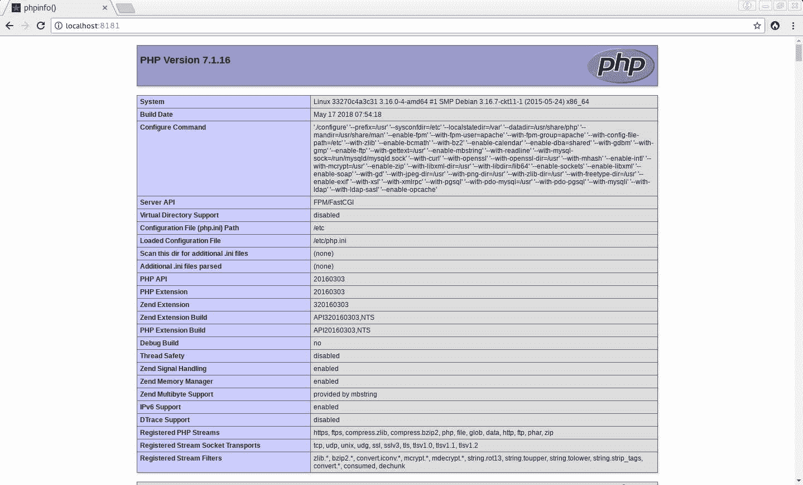

The phpinfo page

如果您没有看到此页面，请尝试对 Docker 安装进行故障排除。

此外，请注意，如果您不`docker commit`您的更改，并且希望在开始使用本书中包含的代码示例时使用原始 Linux for PHP 基本映像，则必须每次重复前面的命令。

我们现在已经准备好对服务器进行基准测试。

# 理解 Apache Bench（AB）

有许多工具可用于对 web 服务器进行基准测试。更著名的是阿帕奇板凳（AB）、围城、JMeter 和 Tsung。虽然 JMeter（[https://jmeter.apache.org/](https://jmeter.apache.org/) 和 Tsung（[http://tsung.erlang-projects.org/](http://tsung.erlang-projects.org/) ）是非常有趣的负载测试工具，在系统管理环境中进行更高级的测试时应该加以探索，我们将重点关注 AB 和 Sakege，以实现我们的开发目的。

AB 包含在 ApacheWeb 服务器的开发工具中，默认情况下安装在 Linux 中，用于包含 PHP 二进制文件的 PHP 映像。否则，AB 可以在大多数 Linux 发行版上的单独 Apache 开发工具安装包中找到。需要注意的是，apachebench 不支持多线程，这可能会在运行高并发性测试时产生问题。

此外，在进行基准测试时，还需要避免一些常见的陷阱。主要有：

*   避免在正在进行基准测试的计算机上同时运行其他资源匮乏的应用程序
*   避免对远程服务器进行基准测试，因为网络，特别是在并发测试中，可能成为测量延迟的主要原因
*   避免在通过 HTTP 加速器或代理缓存的网页上进行测试，因为测试结果会有偏差，并且不会显示实际的服务器速度性能
*   不要认为基准测试和负载测试将完美地代表用户与服务器的交互，因为结果只是指示性的
*   请注意，基准测试结果特定于正在测试的硬件体系结构，并且会因计算机而异

对于我们的测试，我们将使用*Apache Bench*的`-k`、`-l`、`-c`和`-n`开关。以下是这些开关的定义：

*   `-k`启用 KeepAlive 功能，以便在一个 HTTP 会话中执行多个请求
*   `-l`当一个响应与另一个响应的内容长度大小不同时，禁用错误报告
*   `-c`启用并发，以便同时执行多个请求
*   `-n`确定当前基准测试会话中要执行的请求数

有关 AB 选项的更多信息，请参见*Apache*文档中的相应条目（[https://httpd.apache.org/docs/2.4/programs/ab.html](https://httpd.apache.org/docs/2.4/programs/ab.html) ）。

在启动基准测试之前，打开一个新的 Terminal 窗口，`docker exec`向容器打开一个新的 bash Terminal。这样，您将能够通过 top 实用程序查看资源消耗。为此，首先获取容器的名称。它将出现在此命令返回的列表中：

```php
# docker ps 
```

然后，您将能够点击容器并使用以下命令开始监视资源消耗：

```php
# docker exec -it [name_of_your_container_here] /bin/bash 
```

并且，在容器新获取的命令行上，请运行`top`命令：

```php
# top 
```

现在，在第一个终端窗口内启动基准测试：

```php
# ab -k -l -c 2 -n 2000 localhost/index.html 
```

然后，您将获得一个基准测试报告，其中包含服务器每秒能够响应的平均请求数（`Requests per second`）、每个请求的平均响应时间（`Time per request`和响应时间的标准偏差（`Percentage of requests served within a certain time (ms)`等信息。

报告应类似于以下内容：


The benchmark report shows that Apache is serving about 817 requests per second on average

现在，通过请求`index.php`文件来尝试新的基准测试：

```php
# ab -k -l -c 2 -n 2000 localhost/index.php 
```

您将注意到平均每秒请求数已下降，平均响应时间和标准偏差更高。在我的例子中，在我的计算机上，平均响应时间已从 800 左右降至 300 左右，平均响应时间已从 2 毫秒降至 6 毫秒，响应时间的标准偏差已从 8 毫秒内处理的请求的 100%降至 24 毫秒：


The benchmark report shows that Apache is now serving about 313 requests per second on average

这些结果使我们能够大致了解硬件的性能限制，并确定在扩展生成某些动态内容的 PHP 脚本的性能时必须处理的不同阈值。

现在，让我们更深入地了解一下我们的 web 服务器的性能，它是基准测试和负载测试时的首选工具。

# 理解围城

Sakege 是一个负载测试和基准测试工具，它允许我们进一步分析 web 服务器的性能。让我们先在 Docker 容器中安装 Sakege。

请从容器的命令行下载并解压缩 Sakege 的 4.0.2 版：

```php
# wget -O siege-4.0.2.tar.gz http://download.joedog.org/siege/siege-4.0.2.tar.gz 
# tar -xzvf siege-4.0.2.tar.gz 
```

然后，请输入 Sakey 的源代码目录以编译和安装软件：

```php
# cd siege-4.0.2 
# ./configure 
# make 
# make install 
```

对于这些围城测试，我们将使用`-b`、`-c`和`-r`开关。以下是这些开关的定义：

*   `-b`，启用基准模式，表示迭代之间没有延迟
*   `-c`，启用并发，以便同时执行多个请求
*   `-r`，确定每个并发用户要执行的请求数

当然，通过从容器的命令行调用手册，您可以获得关于 Sakege 命令行选项的更多信息：

```php
# man siege  
```

现在启动攻城基准测试：

```php
# siege -b -c 3000 -r 100 localhost/index.html 
```

然后，您将获得如下基准测试报告：

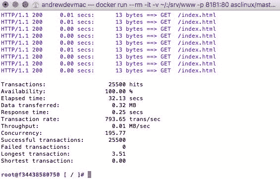

The Siege benchmark report confirms the results that were obtained from AB

正如您所见，结果与我们之前从 AB 获得的结果相匹配。我们的测试显示事务速率几乎为每秒 800 个事务。

Sakege 还附带了一个名为 Bombard 的便捷工具，它可以自动化测试并帮助验证可伸缩性。Bombard 允许您与越来越多的并发用户一起使用 Sakege。它可以接受一些可选参数。这些是：包含执行测试时要使用的 URL 的文件名、初始并发客户端的数量、每次调用 Sakege 时要添加的并发客户端的数量、Bombard 应调用 Sakege 的次数以及每次请求之间的时间延迟（以秒为单位）。

因此，我们可以通过在容器内发出以下命令来确认之前测试的结果：

```php
# cd /srv/www
# touch urlfile.txt 
# for i in {1..4}; do echo "http://localhost/index.html" >> urlfile.txt ; done  
# bombardment urlfile.txt 10 100 4 0 
```

完成后，您应获得一份类似于以下报告的报告：


The results show that the longest transaction is much higher when there are 210 or more concurrent users

请重试，但通过请求 PHP 文件：

```php
# echo "http://localhost/index.php" > urlfile.txt 
# for i in {1..3}; do echo "http://localhost/index.php" >> urlfile.txt ;  done 
# bombardment urlfile.txt 10 100 4 0 
```

该测试应提供与以下类似的结果：


The efficiency of serving dynamic content is analogous to that of serving static content, but with a much lower transaction rate

正在运行的第二个终端窗口`top`现在显示了两个可用处理器的 50%使用率和我的计算机上近 50%的 RAM 使用率：

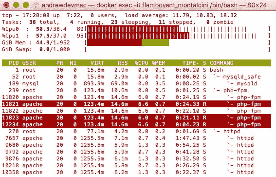

The container’s usage of CPU and memory resources when it is submitted to benchmarking tests

我们现在知道，当并发请求不多时，这种硬件可以在小范围内实现良好的性能，静态文件每秒处理 800 个事务，动态生成内容的页面每秒处理 200 个事务。

现在，我们已经完全基于硬件资源更好地了解了 web 服务器的基本速度性能，现在我们可以开始通过评测来真正测量 web 服务器动态生成内容的速度和效率。我们现在将继续安装和配置工具，这些工具将允许我们分析和优化 PHP 代码。

# 安装和配置有用的工具

我们现在将安装和配置 MySQL 基准测试和 JavaScript 评测工具。但首先，让我们从安装和配置 xdebug 开始，xdebug 是一个 PHP 调试器和分析器。

# 评测 PHP–xdebug 安装和配置

我们将安装和配置的第一个工具是 xdebug，一个用于 PHP 的调试和分析工具。通过使用 PHP（[中包含的 PECL 实用程序，可以以非常简单的方式下载、解压缩、配置、编译和安装此扩展 https://pecl.php.net/](https://pecl.php.net/) ）。为此，请在容器的终端窗口内输入以下命令：

```php
# pecl install xdebug 
# echo -e "zend_extension=$( php -i | grep extensions | awk '{print $3}' )/xdebug.so\n" >> /etc/php.ini
# echo -e "xdebug.remote_enable = 1\n" >> /etc/php.ini 
# echo -e "xdebug.remote_enable_trigger = 1\n" >> /etc/php.ini 
# echo -e "xdebug.remote_connect_back = 1\n" >> /etc/php.ini 
# echo -e "xdebug.idekey = PHPSTORM\n" >> /etc/php.ini 
# echo -e "xdebug.profiler_enable = 1\n" >> /etc/php.ini 
# echo -e "xdebug.profiler_enable_trigger = 1\n" >> /etc/php.ini 
# /etc/init.d/php-fpm restart
# tail -50 /etc/php.ini
```

容器的`/etc/php.ini`文件的最后几行现在应该如下所示：

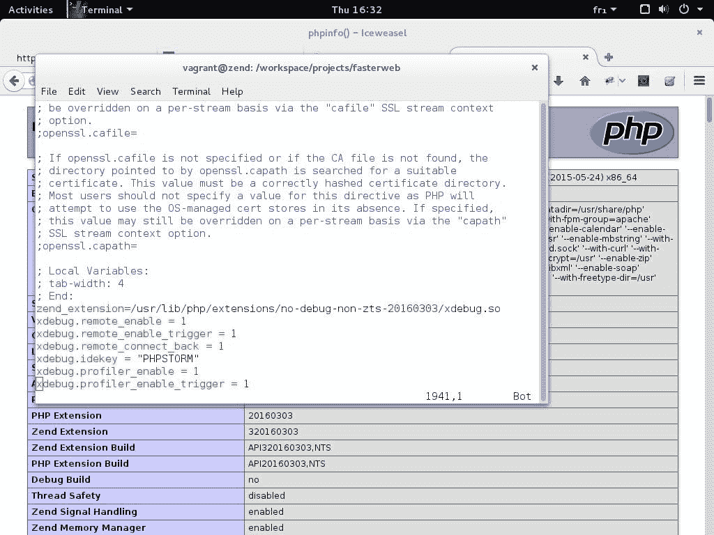

Newly added lines to the php.ini file

完成后，请在您喜爱的浏览器中重新加载`http://localhost:8181`页面。现在应改为：


Confirmation that the xdebug extension has been loaded

如果滚动到页面末尾，现在应该会看到 xdebug 部分：

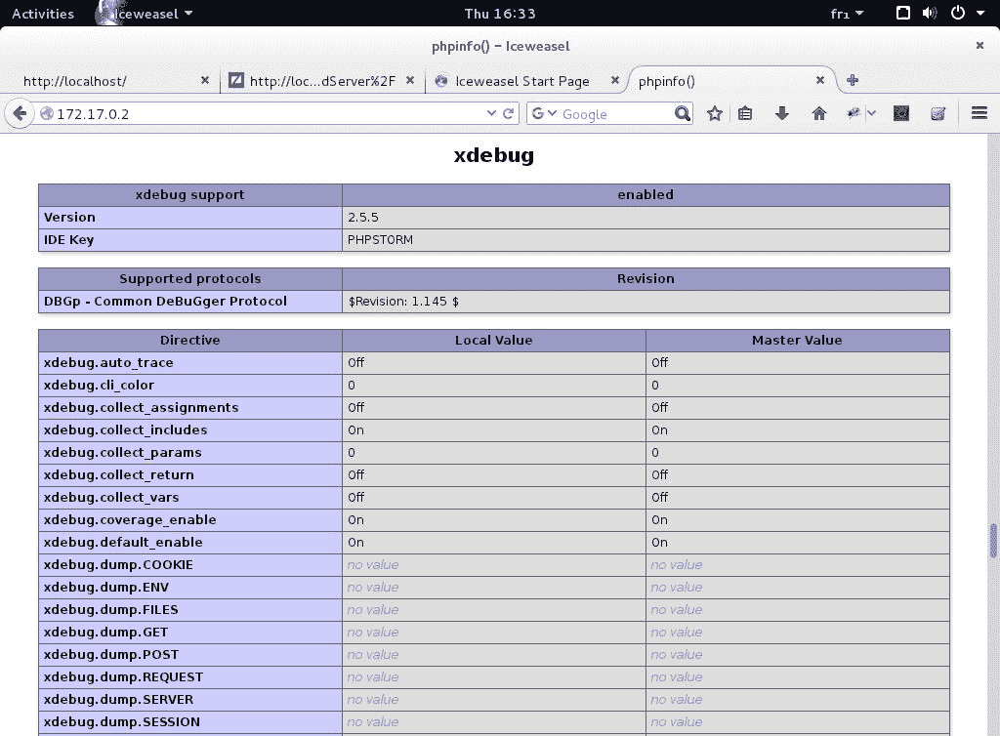

The xdebug section of the phpinfo page

您还应该注意，现在在 xdebug 条目下启用了探查器选项：


Confirmation that xdebug code profiling is enabled

我们现在将 PHPStorm 配置为调试服务器。这将允许我们使用 IDE 作为调试会话的控制中心。

在开始之前，我们将通过在容器中输入以下命令，使整个`fasterweb`文件夹成为服务器的 web 根目录：

```php
# rm /srv/www
# ln -s /srv/fasterweb /srv/www
# cd /srv/www
```

现在，启动*PHPStorm*并将我们的`fasterweb`目录作为本项目的主根目录。要执行此操作，请选择**从现有文件创建新项目**，并且**源文件位于本地目录**中，并将我们的`fasterweb`目录指定为**项目根目录**，然后单击**完成**。

创建后，从“文件”菜单中选择“设置”。在“语言和框架”部分下，展开 PHP 菜单项并单击 Servers 条目。请根据设置的具体情况输入所有适当的信息。主机选项必须包含 Linux for PHP 容器的 IP 地址值。如果您不确定 Docker 容器的 IP 地址，请在容器的命令行中输入以下命令以获取该地址：

```php
# ifconfig 
```

完成后，您可以单击应用和确定按钮进行确认：


Configuring PHPStorm to connect to the web server and xdebug

然后，在运行菜单下，您将找到编辑配置。。。进入它也可以在 IDE 屏幕的右侧找到：

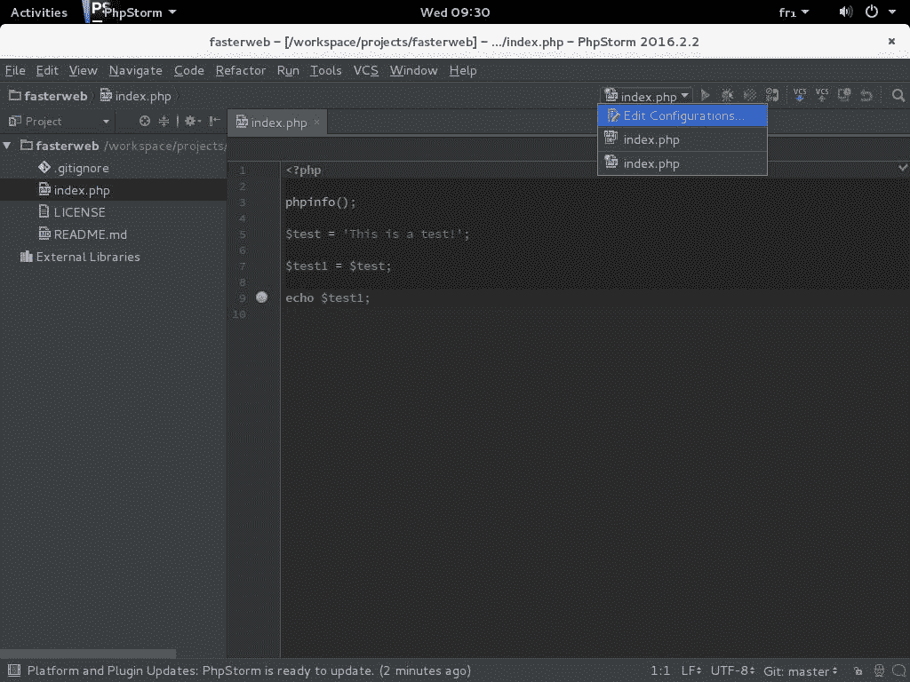

The ‘Edit configurations…’ setting

然后，您可以通过单击此窗口左上角的绿色加号来添加 PHP 远程调试条目。请选择我们在上一步中创建的服务器，并确保 Ide 密钥（会话 id）设置为 PHPSTORM:


Configuring the debugging session

现在，您可以通过单击 PHPStorm 主屏幕右上菜单中的 Listen to debugger connections（侦听调试器连接）按钮来激活 PHPStorm 调试服务器，通过单击`index.php`文件任何行号右侧的空格来设置断点，并启动与`index.php`对应的调试工具我们在上一步中创建的配置。

如果屏幕上未显示右上角工具栏菜单，请单击“视图”菜单的工具栏条目，使其显示在屏幕上。这些按钮也可以作为“运行”菜单中的条目访问。

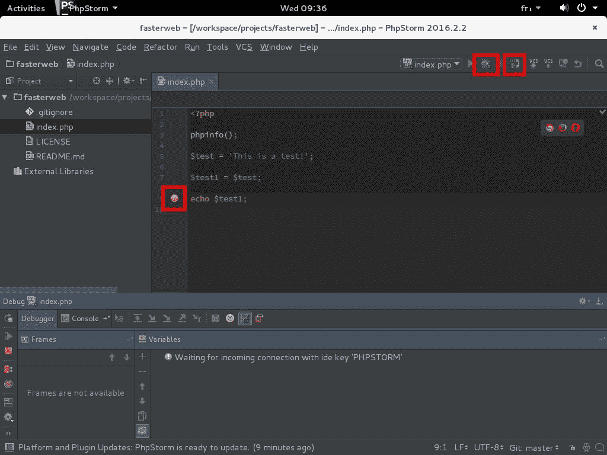

Activating the PHPStorm debugging server, setting a breakpoint and launching the debug tool

现在，打开您喜爱的浏览器，输入 Docker 容器的 IP 地址`http://[IP_ADDRESS]/?XDEBUG_SESSION_START=PHPSTORM`，请求相同的网页。

然后，您会注意到浏览器陷入无限循环：

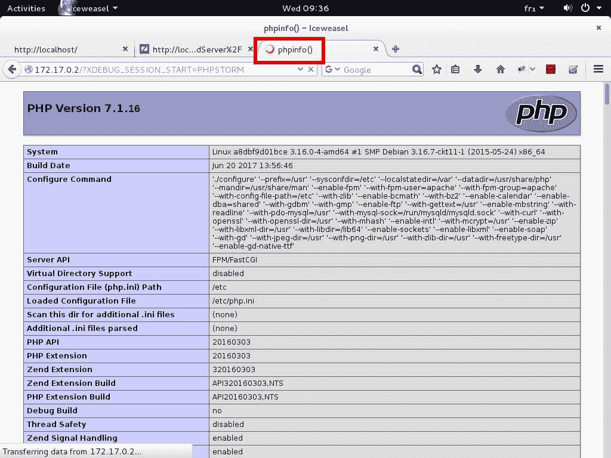

The browser is waiting for the debug session to resume or end

您还将注意到调试信息现在显示在 IDE 中。我们还可以控制会话，并确定何时从 IDE 中恢复执行。请检查变量的内容，然后单击屏幕左侧的绿色播放按钮继续执行。您也可以通过单击同一图标菜单中的粉红色停止按钮来结束调试会话：


The debugging session allows for detailed inspection of variables during runtime

调试会话结束后，我们现在可以检查容器的`/tmp`目录，并在名为`cachegrind.out`的文件中找到探查器输出。然后，您可以直接通过您喜爱的文本编辑器或通过使用 Linux 发行版的软件包管理器安装专门的软件（如 Kcachegrind）来检查此文件。以下是使用 Kcachegrind 时的示例输出：

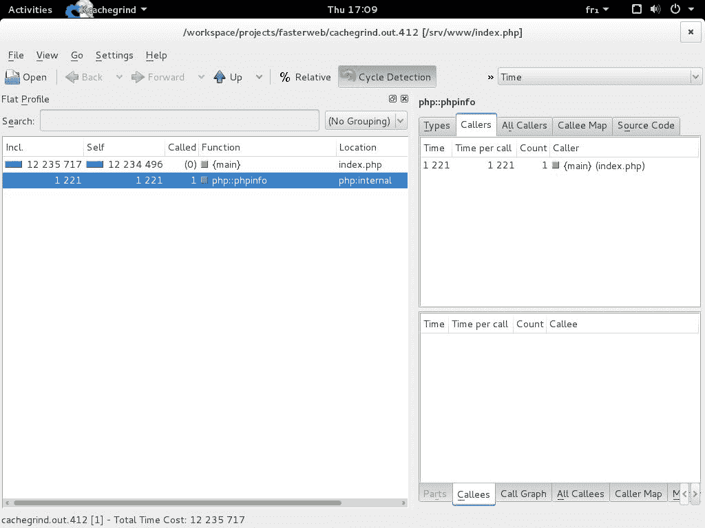

Viewing the xdebug profiling report with Kcachegrind

因此，如果您希望在我们将在下一章中用于优化代码示例的工具之上使用 xdebug 的分析工具，那么您可以使用 xdebug 的分析工具。话虽如此，在下一章中，我们将研究更高级的分析工具，如`Blackfire.io`。

完成 xdebug 测试后，可以将`chapter_1`文件夹恢复为服务器的 web 根目录：

```php
# rm /srv/www
# ln -s /srv/fasterweb/chapter_1 /srv/www
# cd /srv/www
```

现在，让我们继续看一看 SQL 速度测试工具。

# SQL–速度测试

尽管 PostgreSQL server 通常被认为是继*Oracle 数据库*之后世界上速度最快的 RDBMS，*MariaDB*（*MySQL*的分支）服务器仍然是速度最快、最流行的 RDBMS 之一，尤其是在简单的 SQL 查询方面。因此，在本书中讨论 SQL 优化时，我们将主要使用*MariaDB*。

为了对我们的*MariaDB*服务器进行基准测试，我们将使用*MySQL*服务器自 5.1.4 版起附带的`mysqlslap`实用程序。为了运行测试，我们将首先加载`Sakila`测试数据库。在容器的命令行上，输入以下命令：

```php
# wget -O sakila-db.tar.gz \ 
> https://downloads.mysql.com/docs/sakila-db.tar.gz 
# tar -xzvf sakila-db.tar.gz 
# mysql -uroot < sakila-db/sakila-schema.sql 
# mysql -uroot < sakila-db/sakila-data.sql 
```

加载数据库后，可以启动第一个基准测试：

```php
# mysqlslap --user=root --host=localhost --concurrency=20 --number-of-queries=1000 --create-schema=sakila --query="SELECT * FROM film;" --delimiter=";" --verbose --iterations=2 --debug-info  
```

然后，您应获得与以下类似的结果：


Benchmarking the MariaDB server with the mysqlslap tool

然后，您可以运行第二个基准测试，但并发级别不同，以便比较结果：

```php
# mysqlslap --user=root --host=localhost --concurrency=50 --number-of-queries=1000 --create-schema=sakila --query="SELECT * FROM film;" --delimiter=";" --verbose --iterations=2 --debug-info 
```

以下是第二次测试的结果：

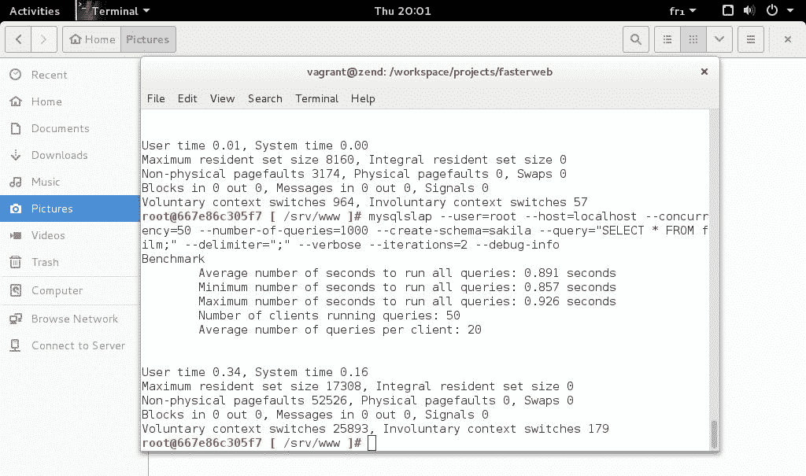

Benchmarking the MariaDB server with the mysqlslap tool using higher concurrency

测试结果表明，如果对一个包含大约 1000 个条目的表执行完整的表扫描查询，那么当向服务器发送 50 个或更多并发查询时，性能会急剧下降。

在专门讨论本主题的章节中讨论 SQL 查询优化时，我们将看到这些类型的测试和许多其他更高级的测试如何特别有用。

# JavaScript–开发人员工具

为了测量性能并分析本书中包含的 JavaScript 代码，我们将使用 Google Chrome 的内置开发工具。具体来说，Chrome 包括一个时间轴记录器和 JavaScript CPU 分析器，可以让您识别 JavaScript 代码中的瓶颈。要激活这些工具，请单击浏览器右上角的三个点，然后单击“更多工具”子菜单中的“开发人员工具”条目，如图所示：

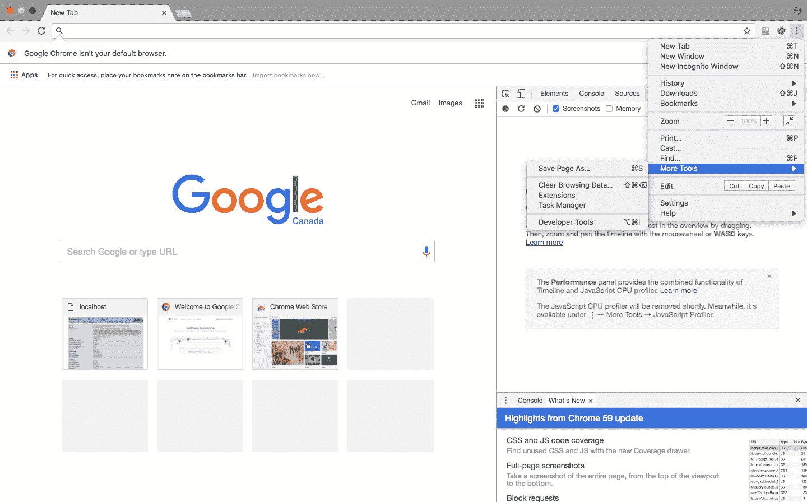

Finding the ‘Developer Tools’ entry in the ‘More Tools’ section of Chrome’s main menu

使用探查器非常简单，只需单击“录制”按钮并刷新要评测的页面即可。然后，您可以分析结果，以确定代码的潜在问题：


Chrome’s timeline recorder and JavaScript CPU profiler

在[第 7 章](07.html#2E6E40-f23473f4602d4f9ab8631600e1d888e7)、*JavaScript 和“危险驱动开发”*以及[第 8 章](08.html#361C60-f23473f4602d4f9ab8631600e1d888e7)、*功能性 JavaScript*中，我们将更广泛地使用该工具，以便总体上衡量和优化 JavaScript 代码性能。

# 总结

在本章中，我们定义了什么是更快的 Web，为什么它很重要，它如何将自己与纯速度性能区分开来，以及如何安装、配置和使用基准测试和评测工具来测量它。

在下一章中，我们将使用`Blackfire.io`发现自动评测。此外，我们还将通过在虚拟的生产服务器上安装和配置带有 Grafana 的 TICK 堆栈来了解监视，该服务器将作为另一个 Docker 容器部署。

# 工具书类

[1] [https://googleblog.blogspot.ca/2009/06/lets-make-web-faster.html](https://googleblog.blogspot.ca/2009/06/lets-make-web-faster.html)

[2] *BONDI，AndréB.**软件和系统性能工程基础：过程、性能建模、需求、测试、可扩展性和实践*。*新泽西州鞍河上游：Addison Wesley*、*2015*。

[3] *MEIER，J.D.等**Web 应用程序性能测试指南*。*华盛顿州雷德蒙：微软公司*、*2007*。

[4] [https://www.smashingmagazine.com/2015/11/why-performance-matters-part-2-perception-management/](https://www.smashingmagazine.com/2015/11/why-performance-matters-part-2-perception-management/)

[5] [https://speakerd.s3.amazonaws.com/presentations/2ece664392024e9da39ea82e3d9f1139/perception-performance-ux-confoo-3-4.pdf](https://speakerd.s3.amazonaws.com/presentations/2ece664392024e9da39ea82e3d9f1139/perception-performance-ux-confoo-3-4.pdf)