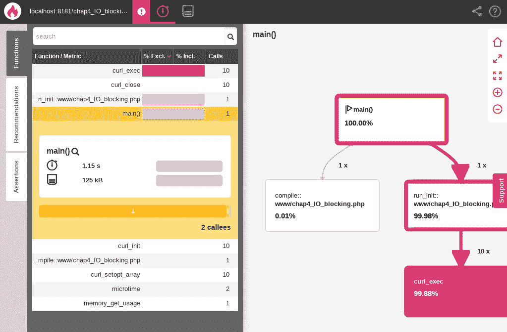
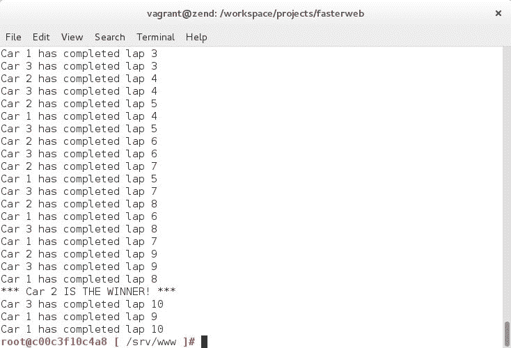
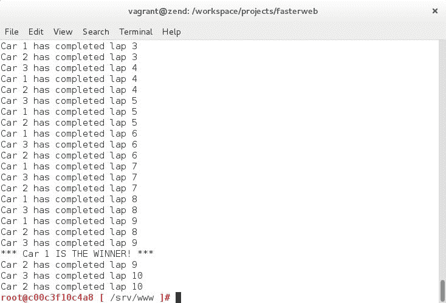
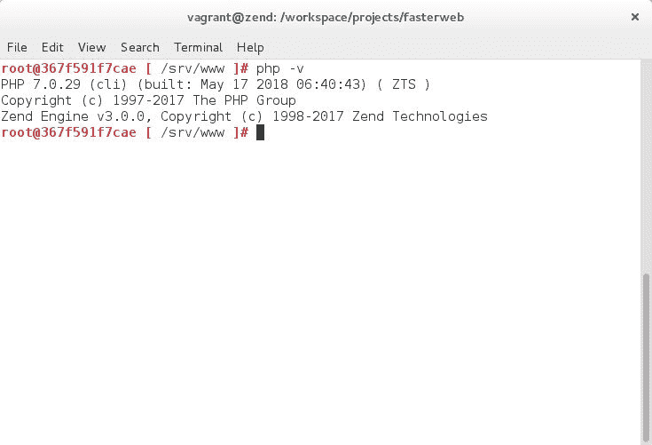
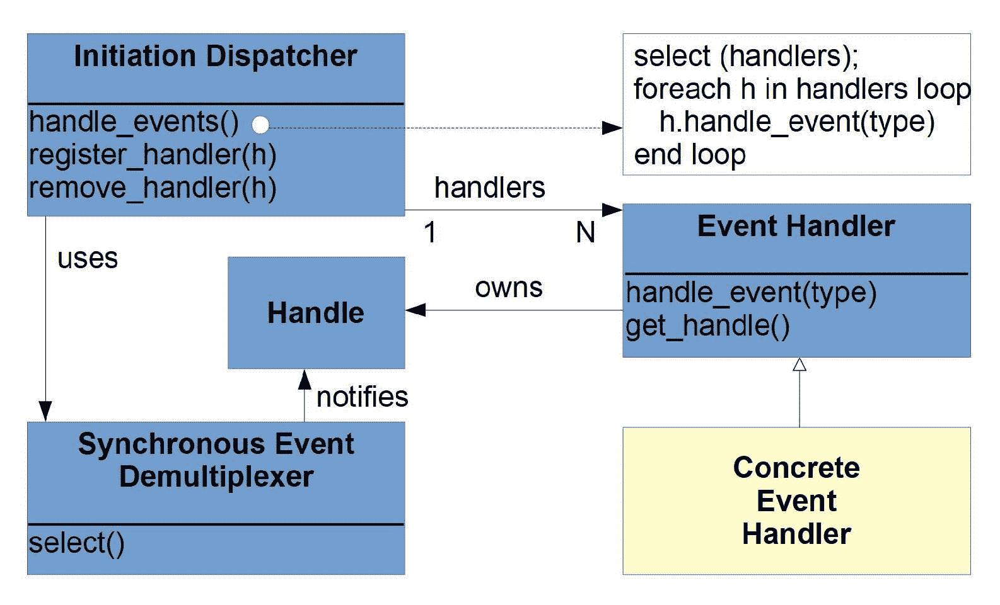
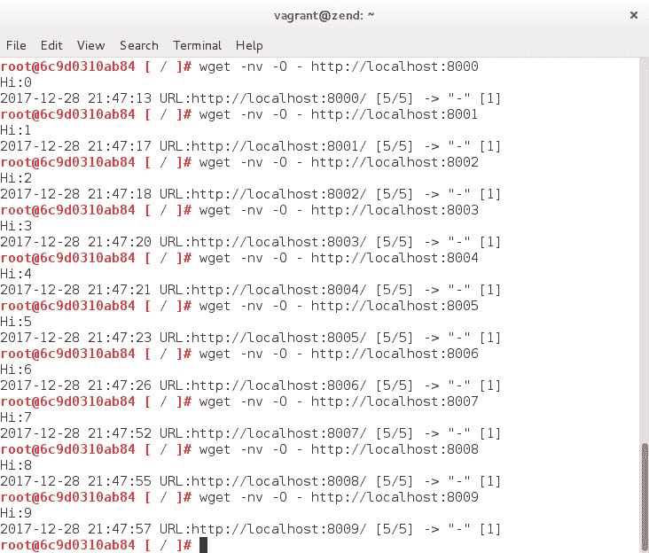

# 四、使用异步 PHP 展望未来

在本章中，我们将学习如何确定处理 I/O 调用时的最佳策略以及如何实施这些策略。我们将看到多线程与多任务的区别，何时实现一个或另一个，以及如何实现。

此外，我们还将学习如何使用`ReactPHP`库，以及如何在处理异步 I/O 调用时受益于事件驱动编程。

因此，在本章中，我们将介绍以下几点：

*   使用异步非阻塞代码优化 I/O 调用
*   使用`POSIX Threads`库进行多线程处理
*   实施`ReactPHP`解决方案

# 异步非阻塞 I/O 调用

正如我们在本书前面几章中所看到的，由于建立、使用和关闭流和套接字的潜在延迟，I/O 调用总是提供最差的性能。由于 PHP 基本上是一种同步语言，它在恢复代码执行之前等待被调用函数返回，因此，如果被调用函数在返回调用代码之前必须等待流关闭，则 I/O 调用尤其有问题。例如，当一个 PHP 应用程序每隔几分钟就要进行数千次 I/O 调用时，情况会变得更糟。

自 PHP5.3 以来，通过使用生成器中断 PHP 的正常执行流，从而异步执行代码成为可能。正如我们前面所看到的，即使动态结构在总体上性能较差，它们在加速阻塞代码方面仍然很有用。这对于通常具有很高延迟的 I/O 调用尤其如此。为了更好地掌握 I/O 延迟的数量级，我们可以参考 Google 发布的以下著名图表：

| 延迟比较数--------------------------一级缓存参考 0.5 纳秒分支预测失误 5 纳秒二级缓存参考 7 ns 14x 一级缓存互斥锁/解锁 25 纳秒主存储器参考 100 ns 20x 二级缓存，200x 一级缓存使用 Zippy 3000 ns 3 us 压缩 1K 字节通过 1 Gbps 网络发送 1K 字节 10000 ns 10 us 从 SSD 随机读取 4K*150000 ns 150 us~1GB/s SSD 从内存 250000 ns 250 us 中按顺序读取 1 MB 同一数据中心内往返 500000 ns 500 us 从 SSD*1000000 ns 1000 us 1 毫秒~1GB/s SSD 连续读取 1 MB，4 倍内存磁盘搜索 10000000 ns 10000 us 10 毫秒 20 倍数据中心往返从磁盘 20000000 ns 20000 us 20 ms 80x 内存和 20X SSD 按顺序读取 1 MB 发送数据包 CA->荷兰->CA 15000000 ns 150000 us 150 毫秒笔记-----1 纳秒=10^-9 秒 1 us=10^-6 秒=1000 纳秒 1 毫秒=10^-3 秒=1000 美=1000000 纳秒信用------杰夫·迪恩：[http://research.google.com/people/jeff/](http://research.google.com/people/jeff/)原作者彼得·诺维格：[http://norvig.com/21-days.html#answers](http://norvig.com/21-days.html#answers)贡献-------------更新自：[https://gist.github.com/2843375](https://gist.github.com/2843375)“人性化”比较：[https://gist.github.com/2843375](https://gist.github.com/2843375)视觉对比图：[http://i.imgur.com/k0t1e.png](http://i.imgur.com/k0t1e.png)动画演示：[http://prezi.com/pdkvgys-r0y6/latency-numbers-for-programmers-web-development/latency.txt](http://prezi.com/pdkvgys-r0y6/latency-numbers-for-programmers-web-development/latency.txt)[https://gist.github.com/jboner/2841832](https://gist.github.com/jboner/2841832)[https://gist.github.com/andrewscaya/2f9e68d4b41f9d747b92fb26b1b60d9f](https://gist.github.com/andrewscaya/2f9e68d4b41f9d747b92fb26b1b60d9f) |

从磁盘读取总是比内存慢，而且网络 I/O 调用仍然是所有调用中最慢的，这并不奇怪。

让我们通过查看一些进行一系列 I/O 调用的代码来深入研究一下。我们的第一个示例将使用`cURL`。让我们看看下面的代码：

```php
// chap4_IO_blocking.php 

$start = microtime(true); 

$i = 0; 

$responses = []; 

while ($i < 10) { 

    $curl = curl_init(); 

    curl_setopt_array($curl, array( 
        CURLOPT_RETURNTRANSFER => 1, 
        CURLOPT_URL => 'http://www.google.ca', 
        CURLOPT_USERAGENT => 'Faster Web cURL Request' 
    )); 

    $responses[] = curl_exec($curl); 

    curl_close($curl); 

    $i++; 
} 

$time = microtime(true) - $start; 

echo 'Time elapsed: ' . $time . PHP_EOL; 

echo memory_get_usage() . ' bytes' . PHP_EOL; 
```

现在，让我们执行 PHP 脚本。我们现在应该看到以下结果：


Time elapsed and memory consumed when running the blocking code script

由于与访问网络相关的高延迟，此代码需要很长时间才能完成。

如果我们使用`Blackfire.io`分析前面的代码，我们可以看到对`cURL`的 10 个调用需要一秒钟才能完成：



Profiling the code shows us that the 10 calls to cURL make up the greater part of the script's total execution time

让我们修改 PHP 脚本，以便使用异步代码同时运行`cURL`请求。以下是以前 PHP 代码的新版本：

```php
// chap4_IO_non_blocking.php 

$start = microtime(true); 

$i = 0; 

$curlHandles = []; 

$responses = []; 

$multiHandle = curl_multi_init(); 

for ($i = 0; $i < 10; $i++) { 

    $curlHandles[$i] = curl_init(); 

    curl_setopt_array($curlHandles[$i], array( 
        CURLOPT_RETURNTRANSFER => 1, 
        CURLOPT_URL => 'http://www.google.ca', 
        CURLOPT_USERAGENT => 'Faster Web cURL Request' 
    )); 

    curl_multi_add_handle($multiHandle, $curlHandles[$i]); 
} 

$running = null; 

do { 
    curl_multi_exec($multiHandle, $running); 
} while ($running); 

for ($i = 0; $i < 10; $i++) { 
    curl_multi_remove_handle($multiHandle, $curlHandles[$i]); 

    $responses[] = curl_multi_getcontent($curlHandles[$i]); 
} 

curl_multi_close($multiHandle); 

$time = microtime(true) - $start; 

echo 'Time elapsed: ' . $time . PHP_EOL; 

echo memory_get_usage() . ' bytes' . PHP_EOL; 
```

执行代码后，我们现在得到以下结果：


Time elapsed and memory consumed when running the non-blocking code script

正如预期的那样，PHP 脚本速度更快，因为它不再需要等待 I/O 调用完成后再继续执行其余代码。真正发生在引擎盖下的是同一线程内的多任务处理。代码的执行流实际上被中断，以便允许并发执行许多 I/O 调用。这是可能的，因为非阻塞代码将在等待某些任务完成时将控制权返回给调用方代码，并且可能在完成时调用回调函数。如果我们使用`Blackfire.io`分析前面的代码，我们将看到这个循环在起作用。为了完成所有 10 个请求，屈服函数实际上被调用了 45000 多次：


The yielding function is called more than 45,000 times in order to complete all 10 cURL requests

PHP5.5 中引入了生成器，它可以同时执行代码的不同部分，从而简化异步编程。生成器实际上是实现迭代器接口的可调用对象。因此，基本原理是有一个循环，该循环将重复调用一个生成器函数，该函数将反过来将控制返回到循环，直到没有剩余的处理，在这种情况下，生成器函数将明确返回。

现在，让我们通过一个简单的代码示例更深入地了解异步编程。为此，让我们使用以下代码编写一个基本赛车比赛：

```php
// chap4_async_race.php

$laps[] = 0;
$laps[] = 0;
$laps[] = 0;

function car1(int &$lap) {
    while ($lap <= 10) {
        for ($x = 0; $x <= 200; $x++) {
            yield 0;
        }

        yield 1;
    }

    // If the car has finished its race, return null in order to remove the car from the race
    return;
}

function car2(int &$lap) {
    while ($lap <= 10) {
        for ($x = 0; $x <= 220; $x++) {
            yield 0;
        }

        yield 1;
    }

    // If the car has finished its race, return null in order to remove the car from the race
    return;
}

function car3(int &$lap) {
    while ($lap <= 10) {
        for ($x = 0; $x <= 230; $x++) {
            yield 0;
        }

        yield 1;
    }

    // If the car has finished its race, return null in order to remove the car from the race
    return;
}

function runner(array $cars, array &$laps) {
    $flag = FALSE;

    while (TRUE) {
        foreach ($cars as $key => $car) {
            $penalty = rand(0, 8);
            if($key == $penalty) {
                // We must advance the car pointer in order to truly apply the penalty 
                                                                to the "current" car
                $car->next();
            } else {
                // Check if the "current" car pointer points to an active race car
                if($car->current() !== NULL) {
                    // Check if the "current" car pointer points to a car that has  
                                                                    completed a lap
                    if($car->current() == 1) {
                        $lapNumber = $laps[$key]++;
                        $carNumber = $key + 1;
                        if ($lapNumber == 10 && $flag === FALSE) {
                            echo "*** Car $carNumber IS THE WINNER! ***\n";
                            $flag = TRUE;
                        } else {
                            echo "Car $carNumber has completed lap $lapNumber\n";
                        }
                    }
                    // Advance the car pointer
                    $car->next();
                    // If the next car is no longer active, remove the car from the 
                                                                              race
                    if (!$car->valid()) {
                        unset($cars[$key]);
                    }
                }
            }
        }

```

```php
        // No active cars left! The race is over!
        if (empty($cars)) return;
    }
}

runner(array(car1($laps[0]), car2($laps[1]), car3($laps[2])), $laps); 
```

如您所见，runner 函数是主循环，它以随机顺序处理这三个生成器函数，直到它们都没有剩余的处理内容。最终的结果是，我们永远不知道哪辆车会赢得比赛，尽管其中一些车似乎比其他车跑得快！让我们运行这段代码三次。以下是第一次运行的结果：



Car 2 wins the race!

以下是第二次运行的结果：


Car 3 wins the race!

以下是第三次也是最后一次运行的结果：



Car 1 wins the race!

最终的结果似乎是在同一个线程中同时执行三个不同的函数。这就是异步编程的基本原理。事实上，我们很容易理解如何使用多任务处理来帮助减轻繁重的工作负载对单个 PHP 脚本的影响，方法是中断脚本的执行，以便使用第三方软件（如 RabbitMQ 和 Redis）对某些任务进行排队。因此，可以延迟这些任务的处理，直到认为处理是适当的。

现在我们已经了解了多任务，让我们来看看多线程。

# 使用 pthreads 进行多线程处理

`POSIX Threads`（也称为`pthreads`）是一个库，它允许计算机程序通过将子进程从其父进程分叉来同时执行多个进程或线程。`pthreads`库可以在 PHP 中使用，因此可以在后台分叉进程，同时执行其他内容。因此，多线程是处理 I/O 调用延迟的另一种方法。为了实现这一点，我们需要一个启用了`pthreads`扩展的线程安全版本的 PHP。在我们的例子中，我们将使用 Linux for PHP 容器，该容器运行 PHP7.0.29 的**Zend 线程安全**（**ZTS**版本）。打开一个新的终端窗口，`cd`进入项目目录，输入以下命令：

```php
# docker run -it --rm \
> -p 8282:80 \
> -v ${PWD}/:/srv/fasterweb \
> asclinux/linuxforphp-8.1:7.0.29-zts \
> /bin/bash
```

输入完此命令后，如果在 CLI 中输入`php -v`命令，则应看到以下信息：



The ZTS container's command-line interface (CLI)

此消息确认我们正在使用线程安全（ZTS）版本的 PHP。然后，在容器的 CLI 上输入以下命令：

```php
# mv /srv/www /srv/www.OLD
# ln -s /srv/fasterweb/chapter_4 /srv/www
# cd /srv/www
# pecl install pthreads
# echo "extension=pthreads.so" >> /etc/php.ini
```

您现在可以通过输入命令`php -i`来检查`pthreads`扩展是否正确安装。最后一个命令应该允许您查看扩展的版本号。如果是这种情况，则扩展已正确安装：


Version 3.1.6 of the pthreads extension is now installed

既然`pthreads`库已经安装并启用，让我们继续使用它，尝试创建多个线程，这些线程将真正在计算机的 CPU 上同时执行。为此，我们将使用以下源代码：

```php
// chap4_pthreads.php 

$start = microtime(true); 

class TestThreads extends Thread { 

    protected $arg; 

    public function __construct($arg) { 
        $this->arg = $arg; 
    } 

    public function run() { 
        if ($this->arg) { 
            $sleep = mt_rand(1, 10); 
            printf('%s: %s  -start -sleeps %d' . "\n", date("g:i:sa"), $this->arg, 
                                                                          $sleep); 
            sleep($sleep); 
            printf('%s: %s  -finish' . "\n", date("g:i:sa"), $this->arg); 
        } 
    } 
} 

$stack = array(); 

// Create Multiple Thread 
foreach ( range('1', '9') as $id ) { 
    $stack[] = new TestThreads($id); 
} 

// Execute threads 
foreach ( $stack as $thread ) { 
    $thread->start(); 
} 

sleep(1); 

$time = microtime(true) - $start; 

echo 'Time elapsed: ' . $time . PHP_EOL; 

echo memory_get_usage() . ' bytes' . PHP_EOL; 
```

一旦执行，我们将获得以下输出：


Threads were executed simultaneously

结果清楚地表明，线程是同时执行的，因为脚本的总运行时间为 10 秒，即使每个线程至少睡眠几秒钟。如果这个同步阻塞代码是在没有多线程的情况下执行的，那么完成执行总共需要大约 40 秒。在这种情况下，多任务不是合适的解决方案，因为对`sleep()`函数的阻塞调用会阻止每个生成器将控制权让给主回路。

现在我们已经看到了通过异步编程实现多任务和通过`POSIX Threads`库实现多线程，我们将把注意力转向一个 PHP 库，它在异步编程方面非常有用，即`ReactPHP`库。

# 使用 PHP 库

`ReactPHP`是一个事件驱动的非阻塞 I/O 库。该库基本上依赖于一个事件循环，该循环轮询文件描述符，使用计时器，并通过在循环的每次迭代中注册和执行未完成的标记来延迟回调。

`ReactPHP`基于反应堆模式，根据道格拉斯·C·施密特的说法，反应堆模式是一个“*一种设计模式，用于处理由一个或多个客户端并发传递到应用程序的服务请求。应用程序中的每个服务都可以由多个方法组成，并由一个单独的事件处理程序表示，该事件处理程序负责调度特定于服务的请求。事件处理程序的调度由启动器执行在管理已注册事件处理程序的 dispatcher 上。服务请求的解复用由同步事件解复用器执行。*在 Schmidt 的原始论文*Reactor:同步事件解复用和分派句柄的对象行为模式*中，我们可以找到此模式的 UML 表示：



The Reactor pattern according to Douglas C. Schmidt

让我们开始探索这个异步编程库，将它安装在我们的代码库中。在容器的 CLI 上，输入以下命令：

```php
# cd /srv/www/react 
# php composer.phar self-update
# php composer.phar install 
# cd examples 
```

一旦通过 Composer 安装了库，就可以尝试在 examples 目录中找到的任何示例脚本。这些代码示例来自*PHP*的主代码库。在我们的例子中，我们将首先看一看`parallel-download.php`脚本。以下是它的源代码：

```php
// parallel-download.php 

$start = microtime(true); 

// downloading the two best technologies ever in parallel 

require __DIR__ 
    . DIRECTORY_SEPARATOR 
    .'..' 
    . DIRECTORY_SEPARATOR 
    . 'vendor' 
    . DIRECTORY_SEPARATOR 
    .'autoload.php'; 

$loop = React\EventLoop\Factory::create(); 

$files = array( 
    'node-v0.6.18.tar.gz' => 'http://nodejs.org/dist/v0.6.18/node-v0.6.18.tar.gz', 
    'php-5.5.15.tar.gz' => 'http://it.php.net/get/php-5.5.15.tar.gz/from/this/mirror', 
); 

foreach ($files as $file => $url) {
    $readStream = fopen($url, 'r'); 
    $writeStream = fopen($file, 'w'); 

    stream_set_blocking($readStream, 0); 
    stream_set_blocking($writeStream, 0); 

    $read = new React\Stream\Stream($readStream, $loop); 
    $write = new React\Stream\Stream($writeStream, $loop); 

    $read->on('end', function () use ($file, &$files) { 
        unset($files[$file]); 
        echo "Finished downloading $file\n"; 
    }); 

    $read->pipe($write);

} 

$loop->addPeriodicTimer(5, function ($timer) use (&$files) { 
    if (0 === count($files)) { 
        $timer->cancel(); 
    } 

    foreach ($files as $file => $url) {

        $mbytes = filesize($file) / (1024 * 1024); 
        $formatted = number_format($mbytes, 3); 
        echo "$file: $formatted MiB\n"; 
    } 
}); 

echo "This script will show the download status every 5 seconds.\n"; 

$loop->run(); 

$time = microtime(true) - $start; 

echo 'Time elapsed: ' . $time . PHP_EOL; 

echo memory_get_usage() . ' bytes' . PHP_EOL; 
```

本质上，这个脚本创建两个流，将它们设置为非阻塞模式，并向循环注册这些流。循环中添加了一个计时器，以便每 5 秒回显一条消息。最后，它运行循环。

让我们使用以下命令来看看这个正在运行的脚本：

```php
 # php parallel-download.php 
```

结果如下：


The two packages are downloaded asynchronously

如您所见，下载是以并行、异步和反应式的方式执行的。

让我们通过代码示例中包含的`tcp-chat.php`脚本，继续我们进入 ReactPHP 世界的短途旅程。以下是此代码示例的源代码：

```php
// tcp-chat.php 

// socket based chat

require __DIR__ 
    . DIRECTORY_SEPARATOR 
    .'..' 
    . DIRECTORY_SEPARATOR 
    . 'vendor' 
    . DIRECTORY_SEPARATOR 
    .'autoload.php';

$loop = React\EventLoop\Factory::create();
$socket = new React\Socket\Server($loop);

$conns = new \SplObjectStorage();

$socket->on('connection', function ($conn) use ($conns) {
    $conns->attach($conn);

    $conn->on('data', function ($data) use ($conns, $conn) {
        foreach ($conns as $current) {

            if ($conn === $current) {
               continue;
            }

            $current->write($conn->getRemoteAddress().': ');
            $current->write($data);
        }

    });

    $conn->on('end', function () use ($conns, $conn) {
        $conns->detach($conn);
    });
});

echo "Socket server listening on port 4000.\n";
echo "You can connect to it by running: telnet localhost 4000\n";

$socket->listen(4000);
$loop->run();
```

该脚本创建一个套接字服务器，该服务器侦听端口 4000，并通过侦听连接事件由传入连接的循环通知。通知事件后，套接字服务器将连接对象注入处理程序。然后连接对象开始侦听数据事件，该事件将触发它对从套接字服务器的客户端接收的数据进行处理。对于此聊天脚本，连接对象将触发`SplObjectStorage`对象中找到的所有注册连接对象的写入方法，从而有效地将消息发送到所有当前连接的聊天客户端。

首先，通过运行脚本启动聊天服务器：

```php
 # php tcp-chat.php 
```

然后，打开三个新的终端窗口，通过在每个窗口中输入以下命令，连接到我们的*Linux for PHP**Docker*容器：

```php
 # docker exec -it $( docker ps -q | awk '{ print $1 }' ) /bin/bash

```

在每个容器的 CLI 上，输入以下命令：

```php
# telnet localhost 4000
```

一旦通过`telnet`连接，就可以享受从一个终端窗口到另一个终端窗口来回发送消息的乐趣：


Sending messages from one terminal window to the others

显然，在同一容器中使用终端窗口所做的事情可以通过网络在不同的计算机上使用终端窗口来完成。这个例子向我们展示了异步编程的强大功能。

让我们通过查看`scalability.php`脚本来完成对*PHP*代码示例的调查。以下是它的源代码：

```php
// scalability.php 

// a simple, single-process, horizontal scalable http server listening on 10 ports

require __DIR__ 
    . DIRECTORY_SEPARATOR 
    .'..' 
    . DIRECTORY_SEPARATOR 
    . 'vendor' 
    . DIRECTORY_SEPARATOR 
    .'autoload.php';

$loop = React\EventLoop\Factory::create();

for ($i = 0; $i < 10; ++$i) {

    $s = stream_socket_server('tcp://127.0.0.1:' . (8000 + $i));
    $loop->addReadStream($s, function ($s) use ($i) {
        $c = stream_socket_accept($s);
        $len = strlen($i) + 4;
        fwrite($c,"HTTP/1.1 200 OK\r\nContent-Length: $len\r\n\r\nHi:$i\n");
        echo "Served on port 800$i\n";
    });

}

echo "Access your brand new HTTP server on 127.0.0.1:800x. Replace x with any number from 0-9\n";

$loop->run();
```

该脚本创建一个套接字服务器，然后连接到主事件循环，以便在向服务器发送请求时调用 lambda 函数。lambda 函数然后执行代码，通过将答案写入接受的流套接字将答案发送回客户端。

让我们使用以下命令运行此代码：

```php
 # php scalability.php
```

然后，打开另一个终端窗口，将其连接到我们的*Linux for PHP**Docker*容器：

```php
 # docker exec -it $( docker ps -q | awk '{ print $1 }' ) /bin/bash

```

然后，使用`wget`查询服务器：

```php
# wget -nv -O - http://localhost:8000
# wget -nv -O - http://localhost:8001
# wget -nv -O - http://localhost:8002
# wget -nv -O - http://localhost:8003
# wget -nv -O - http://localhost:8004
# wget -nv -O - http://localhost:8005
# wget -nv -O - http://localhost:8006
# wget -nv -O - http://localhost:8007
# wget -nv -O - http://localhost:8008
# wget -nv -O - http://localhost:8009
```

完成后，您应该为每个请求获得以下响应：



Connecting to each available port of the web server

这是您应该在服务器端看到的内容：


The server confirms having served all these requests on all these ports

同样，您可以看到 PHP 的强大功能，因为只有几行代码就足以创建一个可伸缩的 web 服务器。

此外，我们强烈建议对我们存储库中包含的*ReactPHP*项目中的所有文件进行探索和试用，以便您能够充分了解该库在异步编程方面对您作为开发人员所做的工作。

此外，还有其他优秀的异步 PHP 库，可以帮助您掌握这种开发和加速高延迟 I/O 应用程序的新方法。一个这样的库是*Amp*（[https://amphp.org/](https://amphp.org/) ）。在掌握异步编程艺术的同时，花时间探索这些非常有用的库是非常值得的。

最后，有关 PHP 异步编程的更多信息，您可以收听由*Christopher Pitt*在*Nomad PHP*（[上提供的关于此主题的精彩演示 https://nomadphp.com/asynchronous-php/](https://nomadphp.com/asynchronous-php/) ）。

# 总结

在本章中，我们学习了如何确定处理 I/O 调用的最佳策略以及如何实施这些策略。此外，我们还了解了如何使用`ReactPHP`库，以及在处理异步 I/O 调用时如何从事件驱动编程中获益。

在下一章中，我们将学习如何度量数据库性能，从应用简单的度量技术到使用高级基准测试工具。